# 第 23 章

## 神奇的 App Store

您刚刚看到了从 `iTunes` 直接下载音乐、视频和播客到您的 `iPhone` 是多么简单。您也看到了从 `iBooks` 商店下载 `iBooks` 是多么容易。

从 Apple 神奇的 `App Store` 下载新应用程序同样简单。几乎对于您能想到的任何功能，都有相应的应用程序：游戏、生产力工具、社交网络，以及您能想象到的任何其他东西。正如广告所说，*总有一款应用适合你*。

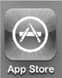

在本章中，您将学习如何浏览 `App Store`，以及如何搜索和下载应用程序。您还将学习如何在应用程序下载到您的 `iPhone` 后对其进行维护和更新。

### 了解更多关于应用和 App Store 的信息

在本章中，我们将重点介绍如何直接从您的 `iPhone` 访问 `App Store`。但是，您应该记住，您也可以使用 `Mac` 或 `PC` 上的 **iTunes** 程序在 `App Store` 中购物（请参见 图 23–1）。

**图 23–1.** *从您电脑上的 **iTunes** 程序或您 `iPhone` 上的 **App Store** 图标访问 `App Store`*

在很短的时间内，`App Store` 就迅速流行起来。几乎任何您能想象到的东西都有对应的应用程序。这些应用程序有各种价位；在很多情况下，应用程序甚至是免费的！

#### 在哪里寻找应用新闻和评论

您可以在 `App Store` 中找到许多应用程序的评论，我们建议您查看这些 `App Store` 评论。然而，有时您可能想从专家评论者那里获取更多信息。如果是这样，博客是寻找特定应用或内容的新闻和评论的好地方。

以下是一些与 Apple `iPhone` 和 `iPod` 相关的博客，它们提供应用评论：

- `iPhone` 博客：[`www.tipb.com`](http://www.tipb.com)
- Touch Reviews：[`www.touchreviews.net`](http://www.touchreviews.net)
- Touch Arcade：[`www.toucharcade.com`](http://www.toucharcade.com)
- The Unofficial Apple Weblog：[`www.tuaw.com`](http://www.tuaw.com)
- 148apps：[`www.148apps.com`](http://www.148apps.com)
- App Advice：[`www.appadvice.com`](http://www.appadvice.com)

### App Store 基础

稍加熟悉，您就会发现 `App Store` 的导航非常直观。我们将介绍一些基本知识，帮助您充分利用 `App Store`，从而让您的体验尽可能愉快且富有成效。

**注意：** 应用程序的可用性因国家/地区而异。某些应用仅在某些国家/地区可用，而某些国家/地区由于当地分级法律可能没有特定的游戏版块。

#### 需要网络连接

在您设置好 `App Store` (`iTunes`) 帐户后，您仍然需要具备正确的网络连接（`Wi-Fi` 或 `3G`）才能访问 `App Store` 并下载应用程序。请查看 第 4 章：“连接到网络”，以了解如何判断您是否已连接。

#### 启动 App Store

**App Store** 图标应位于 **主屏幕** 上的第一页图标中。点击该图标即可启动 **App Store** 应用程序。

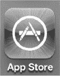

#### App Store 主页

我们将查看 `App Store` **主页**的几部分：顶部栏、中间内容和底部软键。

我们先来看顶部栏。在 图 23–2 所示页面的顶部，您会看到三个按钮：**新鲜内容**、**热门内容** 和 **Genius**。点击其中任何一个即可更改视图。

**提示：** **Genius** 是一项功能，可根据您已在 `iPhone` 上下载和安装的应用来推荐您可能喜欢的应用。这是一种很好的方式，可以帮助您从数十万应用中筛选出可能令您感兴趣的那些。

页面中间是您的主要内容区域。这个主要内容区域会显示应用列表或您正在查看的特定应用的详细信息。您可以通过上下滑动来查看更多应用列表或某个应用的详细信息。在查看屏幕截图时，您也可以左右滑动。在 **精选** 应用页面上，您会注意到顶部有一些大图标。点击这些图标将显示应用类型或单个应用。在这些大图标下方（您需要向下滑动），您会看到许多精选应用。

`App Store` **主页**底部有五个软键按钮：

- **精选：** 显示由 `App Store` 或应用开发者重点推荐的应用。
- **类别：** 显示用于组织应用的类别列表，以便您按类别浏览。
- **排行榜 25：** 显示销量最高或下载量最高的应用。
- **搜索：** 使用输入的搜索词查找应用。
- **更新：** 允许您更新已安装的任何应用，并重新下载您已获取的任何应用。

您可以从 图 23–2 中看出正在显示 **精选** 应用，因为底行的软键中 **精选** 软键是高亮显示的。滚动操作与其他程序相同——只需上下移动手指即可滚动页面。

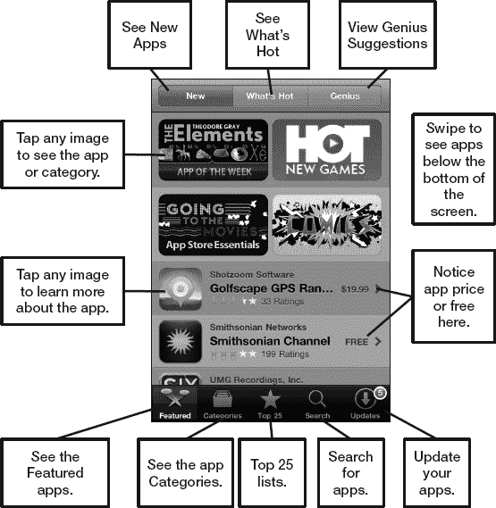

**图 23–2.** *`App Store` **主页**的布局*

**注意：** `App Store` 本质上是一个网站，因此它会频繁更改。本书出版后，`App Store` 的一些细节和细微差别可能会略有不同。

#### 查看应用详情

如果您在列表中看到有趣的应用，请点击它以了解更多信息。该应用的 **详细信息** 屏幕包括其价格、描述、屏幕截图和评论（请参见 图 23–3）。您可以使用这些信息来帮助判断该应用是否适合您。

向下滑动以阅读 **信息** 页面上关于该应用的更多详细信息。向左或向右滑动以查看更多应用截图。点击靠近底部的 **评价** 按钮以阅读该应用的所有评论。

您还可以在 **信息** 页面底部附近查看该应用的其他详细信息，例如其文件大小、版本号和开发者信息。

您还可以使用屏幕底部的按钮 **告诉朋友** 或 **报告问题**。

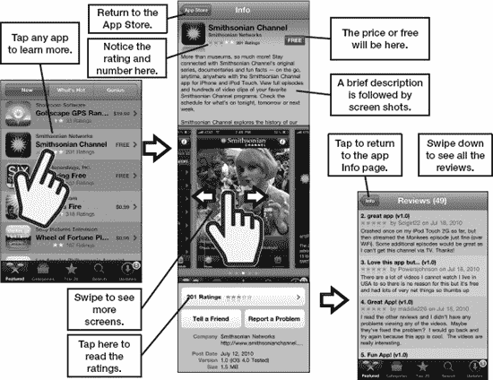

**图 23–3.** *查看应用的详细信息*

### 查找要下载的 App

如果你想搜索要下载的 App，先从默认视图开始浏览，该视图会显示**精选**（Featured）App。向下滚动页面即可查看所有精选 App。

**注意：** 与 iTunes Store 一样，在 3G 网络下，你只能下载小于 20MB 的 App。下载更大的文件需要连接 Wi-Fi。

#### 查看最新 App

App Store 的默认视图会显示最新和精选的 App。这正是图 23–2 所展示的视图。你可以判断出此视图显示的是最新精选 App，因为屏幕底部的**精选**（Featured）功能键（`images/U2303.jpg`）处于高亮状态，且页面顶部的**最新**（New）按钮（`images/U2304.jpg`）处于按下状态。

#### 查看热门 App

点击屏幕顶部的**热门**（What's Hot）按钮，商店中“最热门”的 App 便会显示在屏幕上。同样，只需滚动浏览最热门的 App，看看是否有让你眼前一亮的。

**注意：** 一个 App 出现在“热门”分类中，并不一定意味着你也会觉得它有用或有趣。在购买任何 App 之前，请仔细查看其描述和用户评价。

`images/U2305.jpg`

#### 天才推荐

**精选** App 版块顶部的第三个按钮可将你带到**天才推荐**（Genius）功能。此功能的运作方式与 **iTunes** App 中用于在电脑上播放音乐的、同名功能类似。例如，它会根据你 iPhone 上已安装的 App，为你推荐你可能喜欢的其他 App。

**注意：** 首次使用天才推荐功能时，你需要先接受出现的条款与条件，之后该功能才会启用。

`images/U2306.jpg`

##### 基于

请注意，每个推荐 App 上方都有一个**基于（*App 名称*）**的标签。此标签表明，推荐给你的这个 App 是基于你 iPhone 上已安装的某个特定 App。例如，推荐 **CBS Radio** 是因为已安装了 **Pandora Radio**。我们之前并不知道 CBS Radio，但基于这个推荐，或许会尝试一下。

`images/U2307.jpg`

##### 滑动删除

如果你不喜欢某个天才推荐，可以向左或向右滑动它，即可调出**删除**（Delete）按钮，操作方式与你在 iPhone 上从列表中删除电子邮件或其他项目一样。点击**删除**按钮即可将该 App 从列表中移除。

`images/U2308.jpg`

##### 禁用天才推荐功能

要禁用天才推荐功能，你需要进入 **App Store** 的设置（请参阅本章后面的“App Store 设置”一节，了解如何禁用此功能）。

`images/U2309.jpg`

#### 分类

`images/U2310.jpg`

有时候，眼前所有的选择可能会让人有点不知所措。如果你大致清楚自己在寻找哪种类型的 App，请点击底部功能键行中的**分类**（Categories）按钮（参见图 23–4）。

当前可用的分类显示在表 23–1 中。

`images/t2301.jpg`

**注意：** 所列出的分类是动态变化且随时可能更改的，因此当你读到这本书时，你所看到的分类可能已经发生了变化。

`images/2304.jpg`

**图 23–4.** *按分类查看 App——本例中为**游戏**（Games）*

#### 查看 25 强排行榜

`images/U2311.jpg`

点击底部功能键行中的**排行榜**（Top Charts）功能键，App Store 将再次切换视图。这次，你将看到付费、免费和收入最高的前 25 名 App。只需点击顶部的**付费排行榜**（Top Paid）、**免费排行榜**（Top Free）或**收入榜**（Top Grossing）按钮，即可在不同视图间切换。

**注意：** **收入榜**（Top Grossing）分类指的是赚钱最多的 App，即销量乘以售价。此视图有助于价格较高的 App 在排行榜上获得更高排名。例如，一个售价 4.99 美元的 App 销量为 10,000 份，其在**收入榜**上的排名将远高于一个销量相同但售价仅 0.99 美元的 App。

`images/U2312.jpg`

#### 搜索 App

`images/U2313.jpg`

假设你对自己想要寻找的 App 类型有明确的想法。点击**搜索**（Search）功能键，然后输入程序名称或程序类型。

因此，如果你正在寻找一个帮助划船的 App，只需输入“rowing（划船）”看看会出现什么结果。

你可能会看到一些建议的搜索词出现；点击这些词可以缩小搜索范围。

`images/U2314.jpg`

在建议的搜索词中点击 **Rowing Stats** 只会得到一个结果。

`images/U2315.jpg`

我们想查看所有与划船相关的 App，因此我们点击**搜索**（Search）栏，使用**退格键**（Backspace）擦除“stats”这个词。接着，点击右下角的**搜索**（Search）按钮，查看更广泛的划船相关结果列表。

**提示：** 如果你是在水面上划船（而不仅仅是在划船机上），你可能会想了解一下 **SpeedCoach Mobile**，售价 49.99 美元。还有一个名为 **iRowPro** 的免费替代品（在撰写本文时）。

`images/U2316.jpg`

### 下载 App

一旦找到你想要的 App，你就可以直接将其下载到你的 iPhone 上，如图 23–5 所示。

`images/U2317.jpg`

在找到你想购买的 App 后，请注意标有**免费**（Free）或 **$0.99**（或其他价格）的小按钮。

只需点击那个按钮，如果是免费程序，它会变成**安装**（Install）；如果是付费程序，则会变成**立即购买**（Buy Now）。

`images/2305.jpg`

**图 23–5.** *购买付费 App 或下载免费 App*

在你阅读完评论和 App 描述（或许还访问了开发者支持网站）之后，就可以继续下载或购买该 App 了。点击**下载 App**（Download App）按钮后，系统会提示你输入 iTunes 密码。

输入你的密码并点击**好**（OK）；该 App 将被下载到你的 iPhone。

#### 寻找免费或打折的 App

浏览一段时间后，你会发现 App Store 的几个特点。首先，这里有很多**免费**的 App。有时，这些都是很棒的应用程序。其他时候，它们可能不太有用——但仍然可能很有趣！

其次，你会发现有些 App 会打折，而另一些 App 则会随着时间的推移变得便宜。如果你有一个喜欢的 App，今天售价 6.99 美元，如果你等几周或一个月再买，可能会看到它的价格下降。

### 兑换礼品卡或 iTunes 兑换码

你可以通过滚动到 **App Store** 大多数页面的最底部来兑换礼品卡或 iTunes 兑换码。

在底部，点击**兑换**（Redeem）按钮。

`images/U2318.jpg`

在下一个屏幕输入你的兑换码。（你可能需要刮开礼品卡背面的涂层才能看到兑换码。）

点击**兑换**（Redeem）按钮。

`images/U2319.jpg`

### 维护与更新应用程序

开发者通常会对 iPhone 应用进行更新。你无需借助电脑即可完成更新——直接在 iPhone 上操作即可。

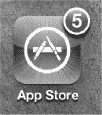

你甚至可以通过查看`App Store`图标判断是否有更新以及更新数量。如图所示，这里有五个应用可供下载更新。

进入 App Store 后，点击底部最右侧的图标，这便是`更新`图标。

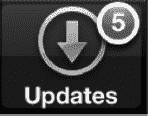

如果有应用可以更新，图标上会用红色数字显示数量。这个数字对应的是可更新的应用数量。

当你点击`更新`按钮时，iPhone 会显示哪些应用有更新。

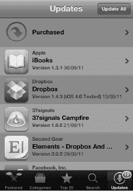

若要获取更新，你可以逐个点击应用。不过更简便的方法是点击右上角的`全部更新`按钮 ，一次性更新所有应用。iPhone 会离开 App Store，你可以在进度条中看到更新进度。正在更新的应用图标会显示为灰色。

部分状态消息会显示“等待中”，另一些则会显示“正在载入”或“正在安装”。更新完成后，所有图标会恢复为正常颜色。

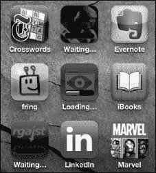

**注意：** 你需要重新启动`App Store`应用才能返回商店。更新过程会完全退出商店。

#### 重新下载应用

下载过的应用（无论免费还是付费），你都可以随时再次下载，无需额外付费。例如，假设你购买了一个度假时要用的应用。旅行结束后，你可以放心地删除它，下次旅行时再重新下载。这有助于保持`主屏幕`整洁，并避免 iPhone 存储空间不足。

要查看你之前购买或下载过的应用列表，请点击`更新`按钮，然后点击屏幕顶部的`已购项目`标签。

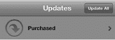

在`已购项目`中，你可以选择两种视图。第一种是查看你所有曾经购买或下载过的应用列表。另一种是查看当前*未*安装在 iPhone 上的应用列表。

**注意：** 如果看到一些你并不记得购买或下载过的应用？出现这种情况，可能是因为你在 iPod touch 上下载过应用，在 iPad 上购买过通用应用，或者与配偶或家人共享了 iTunes 账户，而他们曾在自己的设备上下载过应用。

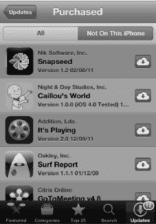

### 自动下载

通过 iCloud 在线服务，你可以设置 iPhone，使其自动下载并安装在 Windows 或 Mac 电脑上通过 iTunes 购买的任何应用——甚至包括在其它 iOS 设备（如 iPad）上购买的应用。

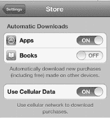

按照以下步骤开启自动下载功能：

1.  点击“设置”图标。
2.  向下滚动并点击“商店”。
3.  将“应用”的“自动下载”开关切换至“开启”。

如果你不再希望自动下载应用，只需将“应用”的“自动下载”开关切换回“关闭”即可。

你还可以选择是否使用“蜂窝数据”来下载购买内容。如果你的网络速度较慢或数据套餐有限，建议将此选项切换至“关闭”。

### 其他 App Store 设置

在`App Store`应用的设置中，你还可以查看当前登录商店的账户、退出登录、关闭 Genius 功能、查看你的 iTunes 账户以及管理订阅邮件。

**提示：** 如果你想防止他人使用你的 iTunes 账户在 iPhone 上购买应用，需要按以下步骤退出 iTunes 登录。

按照以下步骤更改`App Store`应用的其他设置：

1.  注意，你可以在本屏幕顶部看到当前登录的账户。
2.  点击“退出登录”可退出 iTunes 服务。例如，你可能想将 iPhone 交给某人，但不想让他用你的 iTunes 账户购买应用。
3.  点击“查看账户”可查看你的账户详情（需要登录）。

    

4.  右侧图示显示的是你的账户信息。点击“付款信息”可调整你的账单信息（例如信用卡类型和号码）。
5.  点击“账单地址”可更新你的地址。
6.  点击“更改国家或地区”可更改你的国家。

    

7.  向下滚动可查看更多设置。
8.  在此对话中，你可以“关闭应用 Genius 推荐”（如果已关闭，此按钮可让你开启）。或者，你可以“订阅”或“取消订阅”iTunes 电子报。
9.  完成后点击右上角的“完成”。

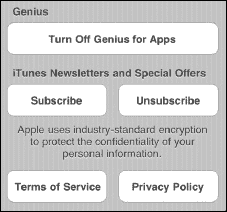

