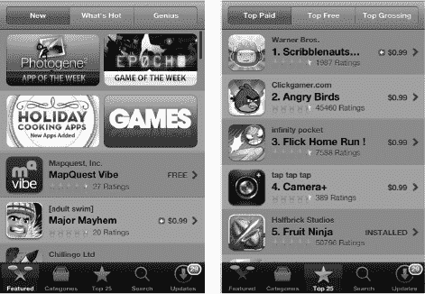
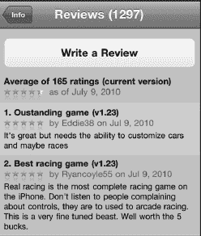
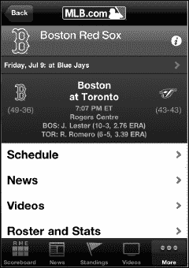
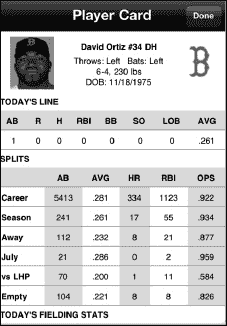

# 第 24 章

## 游戏与娱乐

iPhone 在很多方面都表现出色。它是一台多媒体利器，能管理你繁忙的生活。iPhone 在两方面尤其擅长：作为游戏设备，以及运行利用其精美高分辨率触摸屏和强大图形处理器的应用。你甚至能在 iPhone 上找到一些热门游戏的版本，而这些游戏你可能以为只能在专用游戏机上玩到。

iPhone 为便携游戏带来了诸多优势：高清（HD）屏幕呈现逼真视觉效果；高品质音频带来出色的音效；陀螺仪和加速感应器让你能以许多 PC 和专用游戏机（Wii 除外）所不具备的方式与游戏互动。例如，在赛车游戏中，你可以通过手持 iPhone 时的转动来控制汽车方向。

借助 AirPlay 镜像功能，你甚至可以将游戏投射到同一 Wi-Fi 网络上的 Apple TV，并在大屏幕电视上畅玩。

iPhone 也适用于许多其他有趣的用途，例如关注你所在的本地棒球队，甚至可以通过像`Ocarina`这样的出色应用将 iPhone 当作乐器使用（本章稍后会介绍）。

### 将 iPhone 用作游戏设备

iPhone 内置了加速感应器和*陀螺仪*，本质上是一种能够检测移动（加速度）和倾斜的装置。

将加速感应器与出色的屏幕、大容量内存以及高速处理器相结合，便构成了一款出色的游戏平台。拥有数以千计的游戏可供选择，你几乎可以在 iPhone 上畅玩任何类型的游戏。

借助多任务功能，你甚至可以接听电话，然后回到你之前离开的位置继续游戏。

**注意：** 部分游戏要求你拥有活跃的网络连接（Wi-Fi 或 3G）才能参与多人游戏。

使用 iPhone，你可以玩驾驶游戏，并利用 iPhone 本身来控制方向。只需转动设备即可。你可以触摸屏幕来刹车，或者向前倾斜设备来加速。

这款游戏非常逼真，甚至可能让你晕车！

《真实赛车》还具备有趣的派对模式，你可以与朋友一起比赛——试试看吧！

或者，你可以尝试钓鱼游戏，在游戏中你仿佛置身船上，抛竿收线！

如果你对音乐/节奏类游戏情有独钟，那么你会在 App Store 中找到许多此类程序，比如`《摇滚乐队》`。还有像`《无尽之剑》`这样由虚幻引擎 3 驱动的精彩格斗游戏；第一人称射击（FPS）游戏如`《使命召唤：僵尸》`；以及一些全球最受欢迎的休闲游戏，例如`《愤怒的小鸟》`。

iPhone 还拥有非常快速的处理器和精密的图形芯片。将这些与加速感应器相结合，便构成了一个功能强大的游戏设备。

#### 获取游戏及其他有趣的应用程序

与所有 iPhone 应用程序一样，游戏可以在 App Store 中找到（参见图 24–1）。你可以通过电脑上的 `iTunes` 应用程序或设备上的 `App Store` 应用程序获取它们。

**图 24–1.** *App Store 中 `Games` 板块的布局*

要获取游戏，请像上一章一样启动 `App Store` 应用。接着，使用 `Categories` 图标进入 `Games` 标签页。你还可以在 App Store 的 `Featured` 板块以及 `New and Notable` 板块中找到许多游戏。图 24–2 展示了一款 iPhone 游戏的应用购买页面。

**图 24–2.** *`App Purchase` 页面的布局*

#### 购买前阅读评论

许多游戏都有值得细看的用户评论。有时，你可以在购买前对游戏有个好印象。如果你发现一款看起来很有趣的游戏，不妨用谷歌简单搜索一下，看看是否有主流媒体做过完整评测。

#### 寻找免费试用版或精简版

如今，越来越多的游戏开发者会提供免费试用版，让用户在购买前看看是否喜欢。你会发现 App Store 中许多游戏既有 `Lite`（精`简版）也有`Full`（完整版）。

一些“免费”游戏通过内置广告来维持运营。另一些游戏则免费开始，但需要应用内购买才能继续游玩或解锁额外功能。

#### 游玩时注意安全

你可能像在现实中一样，用 iPhone 在钓鱼游戏中甩出鱼线。你还可以在驾驶游戏和第一人称射击游戏中四处移动。关键在于：游玩时要注意周围环境！例如，确保你拿稳了设备，免得它从手中滑落；我们推荐使用一个良好的硅胶保护壳来帮助防滑。

**小心**：像 `Real Racing` 这样的游戏可能会让人上瘾！

#### 双人游戏

iPhone 真正开启了双人游戏的可能性。在这个例子中，我们以 iPhone 为棋盘，两人对弈跳棋。

对于其他棋盘游戏，如国际象棋、大富翁和优诺，你也能找到类似的双人游戏应用。

#### 在线与无线游戏

iPhone 还支持在线和无线点对点游戏（如果游戏支持的话）。许多新游戏都在融入这项技术。例如，在 `Scrabble` 中，你可以与多个使用自己设备的玩家对战。你甚至可以用 iPhone 作为游戏棋盘，最多用四部独立的 iPhone 作为无线“字母架”，来存放所有玩家的字母牌。只需将字母牌从架子上弹出，它们就会落到棋盘上——非常酷！

在这个例子中，我从 `Real Racing` 菜单中选择了 `Online`。现在我可以选择通过 Wi-Fi 与另一位对手比赛，或者加入一个在线联赛。

**注意：** 如果你只想和身边的朋友对战，请在多人游戏中选择 Wi-Fi 模式。如果你只是想和陌生人玩，可以尝试在线加入联赛或游戏。

### 其他有趣的内容：棒球

有许多出色的应用能为你在 iPhone 上带来无尽欢乐。由于 iPhone 是在美国职业棒球大联盟开赛日发布的，因此突出介绍一款被评为首个 iPhone App Store“本周应用”的应用是恰如其分的。

`At Bat 2010 for iPhone` 是一款售价 14.99 美元的应用，对于任何棒球迷来说，这笔入场费都物超所值。它也充分展示了 iPhone 的功能。

应用的*主视图会根据当前是否有棒球比赛而改变。当你首次注册应用时，可以选择你最喜欢的球队。在这个例子中，iPhone 上喜爱的球队被设定为红袜队。因此，如果这支球队正在比赛，视图会自动首先显示该球队的比赛。如果球队没有比赛，则会显示该队上一场比赛的回顾。或者，它可能列出该队下一场比赛的详细信息。

比赛期间的主视图会显示一位击球手站在本垒板上。这个击球手代表真实的击球手。击球手会切换站位，取决于当前击球手是左打还是右打。本垒板上方显示当前的投球计数，比分则显示在屏幕顶部。

当你看到一名球员站在本垒板或垒上时，你可以点击球员的图像，调出他的棒球卡并查看他的统计数据。

**提示：** 你甚至可以设置通知，当与你喜爱的球队相关的有新闻价值的事件发生时，向你发送提醒。为此，请点击 `Information` 图标，并将 `Notifications` 设置为 `ON`。

#### AirPlay 镜像

最新的 iPhone 不仅能够将视频或音乐从 iPhone 流式传输到 Apple TV，还能共享任何应用（包括游戏）的屏幕。这让你和全家人可以在大屏幕上观看并享受游戏，同时使用 iPhone 作为控制器。这对于棋盘游戏和多人游戏尤其有效，全家人或一群人可以围坐在一起共同游玩。

请按照以下步骤使用 AirPlay 镜像功能：

1.  点击你想要镜像的应用。在这个例子中，我们使用的是《无尽之剑》。
2.  应用启动后，双击 Home 键调出快速应用切换器。
3.  从左向右滑动，找到音频/视频控制选项。（它们在最末端，所以继续滑动直到无法再滑动为止。）
4.  点击 AirPlay 图标，调出你 Wi-Fi 网络上已启用 AirPlay 的设备列表。

    

5.  选择 Apple TV。
6.  再次点击 Home 键，返回你的应用。
7.  现在你应该会在*大屏幕上看到《无尽之剑》。尽情体验吧！

要停止 AirPlay 镜像，重复相同步骤，并从设备列表中选择 iPhone。

**注意：** 有些游戏支持多人 AirPlay 镜像，例如 `Real Racing 2` 的派对模式，最多可以让 4 个人使用自己的 iPhone 或 iPad，在同一台大屏幕电视上互相竞技。

