# 第 25 章

## 社交网络

如今，一些最受欢迎的“联系”场所是那些常被称为*社交网络网站*的站点——这些地方允许你创建自己的页面，与朋友和家人联系，了解他们的生活动态。一些最大的社交网络网站包括 Facebook、Twitter 和 LinkedIn。

在本章中，我们将向你展示如何访问这些网站。你将学习如何更新状态、*发推文*，并关注那些对你重要或你感兴趣的人。

### Facebook

Facebook 创立于 2004 年 2 月。自那时起，它便成为用户与朋友、同事和家人联系、重新联络以及分享信息的首要平台。如今，超过 8 亿用户将 Facebook 作为了解最重要的人近况的主要来源。

**注意：** *您无法在 iPhone 上的* `Facebook` *应用或通过* `Facebook.com` *网站玩 Facebook 游戏。* 如果您是重度 Facebook 游戏玩家，这可能会令您失望；不过，您通常可以从 App Store 获取相同的游戏（例如 `FarmVille`），然后将其连接到您的电脑版 Facebook 以保留游戏进度。

在您的 iPhone 上，发布本文时，您主要有三种方式访问您的 Facebook 页面：

1.  使用 `Safari` 访问标准（完整）网站：[`www.facebook.com`](http://www.facebook.com)。
2.  使用 `Safari` 访问移动版网站：[`http://touch.facebook.com`](http://touch.facebook.com)。
3.  使用 iPhone 版 `Facebook` 应用。

**注意：** iPhone 版 `Facebook` 应用的功能比完整网站稍有限制，但导航起来要容易得多。

## 连接 Facebook 的不同方式

您可以使用 iPhone 专用应用，或者在 `Safari` 浏览器中使用之前提到的两个 Facebook 网站之一来访问 Facebook。本章我们将重点介绍 iPhone 上的 `Facebook` 应用。

### 下载并安装 Facebook 应用

要查找该应用，请使用 App Store 中的 `Search` 功能，直接输入“Facebook”。

您也可以前往 App Store 的 `Social Networking` 类别，找到官方的 `Facebook` 应用以及许多其他与 Facebook 相关的应用。

**注意：** 有些应用看起来可能像是“官方”Facebook 应用，并且可能需要付费。然而，唯一真正的“官方”应用是右侧显示的 iPhone/iPod 应用。

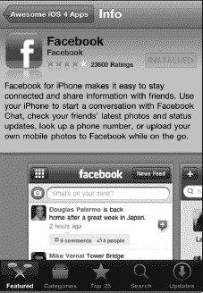

要登录您的 Facebook 账户，您需要找到刚刚安装的图标并点击它。这里我们以 `Facebook` 为例，但其他应用的操作过程非常类似。

成功下载 `Facebook` 后，图标应如下所示。

## Facebook 应用

要在您的 iPhone 上安装 `Facebook` 应用，请启动 `App Store` 并搜索“Facebook”。在 `Facebook` 应用列表中点击 `Install` 按钮。

### Facebook 应用基础

下载并安装 `Facebook` 后，您首先会看到 `Login` 屏幕。输入您的账户信息——您的电子邮件地址和密码。

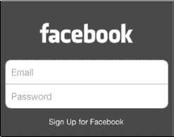

首次登录后，您会看到一条 `Push Notifications` 警告消息。

如果您希望允许这些消息（可能来自其他 Facebook 好友的戳一下、笔记、状态更新通知等），请点击 `OK`。

登录后，您将看到 `Facebook` 主屏幕。点击 `Facebook` 标志可在应用中导航。

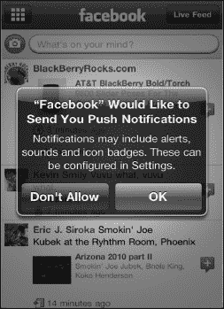

### 在 Facebook 中导航

通过点击页面顶部的 `Facebook` 字样，在 `Navigation` 图标和您当前位置之间切换。

例如，如果您在 `News Feed` 中，点击 `Facebook`，您将看到所有图标。再次点击 `Facebook`，您将返回 `News Feed`。

从图标页面，您可以访问您的 `News Feed`、`Profile`、`Friends`、`Messages`、`Places`、`Groups`、`Events`、`Photos` 和 `Chat`。

### 与朋友交流

请按照以下步骤，通过 iPhone 上的 `Facebook` 应用与您 Facebook 上的朋友交流：

1.  点击顶部的 `Facebook` 以查看所有图标。
2.  点击 `Friends` 图标，将显示您的好友列表。
3.  点击某位好友，您将进入他的 Facebook 页面，在那里您可以在她的 `Wall` 上留言，并查看她的 `Info` 或 `Photos`。

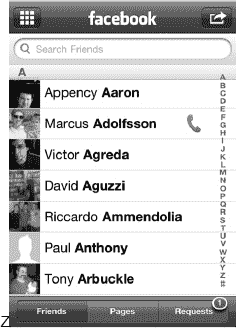

### 使用 Facebook 应用上传照片

在 Facebook 上上传照片是件简单又有趣的事。在此，我们向您展示如何在 `Facebook` 应用中上传照片：

1.  从 Facebook 主图标中，点击 `Photos`。
2.  选择一个相册，例如 Mobile Uploads。
3.  点击 `What’s on your mind?` 框旁边的 `Camera`。
4.  点击 `Take Photo or Video` 按钮拍照或录制视频进行上传。或者，点击 `Choose From Library` 浏览 iPhone 上的照片，直到找到您想要的那张。
5.  接下来，如有需要，点击 `Write a caption…` 编写说明。
6.  要完成上传，请点击蓝色的 `Upload` 按钮，照片将进入您的 Mobile Uploads 文件夹。

**注意：** 上传照片时，图像质量不会与 iPhone 上的原始照片相同。

## Facebook 通知

根据您的 Facebook 推送通知设置，您可能会收到大量更新、墙贴和邀请。如果您的 Facebook 好友不多，并且您想知道何时有人在您的墙上留言或评论帖子或照片，只需将推送通知设置为 `ON`，如下一节所示。

当通知到达时，它会显示在通知中心，或者如果手机处于锁定状态，则会显示为锁屏信息。

要从通知访问 Facebook，只需在屏幕上滑动 `Facebook` 图标，或滑动 `Arrow` 按钮解锁并阅读消息。

### 自定义 Facebook 应用的设置

以下是调整 `Facebook` 应用设置的方法：

1.  点击 `Settings` 应用。
2.  在左侧栏中点击 `Facebook`。
3.  现在您可以调整各种选项：
    *   `Shake to Reload`：此功能可在您摇晃 iPhone 时重新加载或更新页面。
    *   `Vibrate`：此功能在收到聊天或消息提醒时通过振动通知您。
    *   `Play Sound`：此功能允许您为聊天和消息提醒添加提示音。

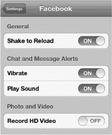

请按照以下步骤调整推送通知设置：

1.  点击 `Settings` 应用。
2.  点击 `Notifications`。
3.  向下滚动并点击 `Facebook`。
4.  将 `Notification Center` 设置为 `ON` 以接收推送通知。
5.  点击 `Show` 选择列表中显示的通知数量。
6.  将 `Alert Style` 设置为 `None`（无通知）、`Banners`（新通知中心样式的提醒）或 `Alerts`（旧式弹出通知）。
7.  将 `Badge App Icon` 设置为 `ON`，以便在 `Facebook` 图标上看到新通知的数量。
8.  将 `Sounds` 设置为 `ON`，以便在收到通知时听到提示音。
9.  设置 `View in Lock Screen`，即使手机处于锁定状态也能获取通知信息。

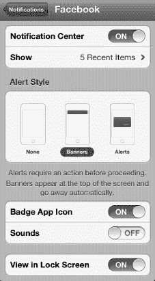

**提示：** `Facebook` 应用会将 Facebook 个人资料照片导入到您的 `Contacts` 列表中。根据照片的不同，这可能会相当有趣。然而，它也可能将您非 Facebook 联系人的信息上传到 Facebook 的服务器，这可能会引发您、您的家人和朋友的隐私担忧。

### LinkedIn

`LinkedIn` 的核心功能与 `Facebook` 非常相似，但其侧重点在于商业和职业发展。这与 `Facebook` 更侧重于个人好友和游戏形成对比。通过 `LinkedIn`，您可以与现任和前任商业伙伴建立或重新建立联系，发送消息，了解他人的动态，参与讨论等。

在本书写作时，`LinkedIn` 的状况与 `Facebook` 非常相似。您可以通过 `Safari` 浏览器访问常规的 `LinkedIn` 网站，也可以下载适用于 `iPhone` 的 `LinkedIn` 应用。

哪个更好？我们认为 `iPhone` 上 `LinkedIn` 应用的使用体验略优于在 `Safari` 中访问完整的 `LinkedIn.com` 网站。`LinkedIn` 应用拥有大按钮，导航更方便，但 `Safari` 版本在屏幕上可以显示更多内容。我们建议您两种方式都尝试一下，看看哪个更合您的心意——这完全取决于个人偏好。

#### 下载 LinkedIn 应用

下载 `LinkedIn` 应用的过程与下载 `Facebook` 应用类似。在您的 `iPhone` 上启动 `App Store` 应用，在 `搜索` 窗口中输入“LinkedIn”，然后找到该应用。`LinkedIn` 应用是免费的，因此点击 `免费` 按钮即可安装。

##### 登录 LinkedIn 应用

应用安装完成后，点击 `LinkedIn` 图标，然后输入您的登录信息。

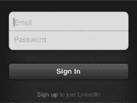

##### 浏览 LinkedIn 应用

`LinkedIn` 采用基于区域的导航系统。点击任意功能卡片即可进入该区域，然后点击顶部的 `LinkedIn` 徽标即可返回主屏幕。

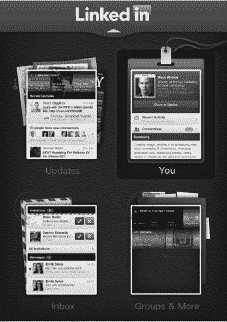

##### 与 LinkedIn 联系人沟通

您使用 `LinkedIn` 应用最频繁的操作之一可能就是与您的联系人沟通。最简单的方法是遵循以下步骤：

1.  在 `主页` 页面，点击右上角的 `你` 功能卡片。
2.  点击页面中间位置的 `联系人` 按钮。
3.  浏览您的联系人列表，或点击 `放大镜` 搜索图标，在 `搜索` 框中输入联系人姓名。
4.  点击您正在查找的联系人。
5.  点击 `电话` 图标给他打电话（如果他选择共享了电话号码），或点击 `邮件` 图标给他发送消息。

### Twitter

`Twitter` 成立于 2006 年。`Twitter` 本质上是一个基于 `SMS`（短信）的社交网站。它常被称为一个微博客网站，是名人和普通人分享想法的地方。关键在于，您只有 140 个字符来表达您的观点。

通过 `Twitter`，您可以订阅关注那些发布推文的人。您也可能发现有人开始关注您。如果您想关注我们，我们在 `Twitter` 上的账号是 `@garymadesimple`。

### 设置 Twitter

在 `iOS 5` 中，`Twitter` 应用已内置于您的 `iPhone` 中。这意味着该应用允许您从其他应用（如 `照片`）内分享图片和帖子等内容。请按照以下步骤设置 `Twitter`：

1.  点击 `设置` 应用。
2.  向下滚动并点击 `Twitter`。
3.  如果 `iPhone` 版 `Twitter` 尚未安装在您的 `iPhone` 上，请点击 `Twitter` 图标右侧的“安装”按钮。（如果已安装 `iPhone` 版 `Twitter`，则“安装”按钮将呈灰色不可用状态。）
4.  点击“用户名”并输入您的 Twitter `@username`。
5.  点击 `密码` 并输入您的 Twitter 密码。
6.  点击 `登录` 按钮。
7.  如果您没有 Twitter 帐户，请点击屏幕底部的 `创建新帐户` 按钮，并填写表单来获取一个。

    

8.  登录后，点击“帐户”以更改您的选项。
9.  如果您希望朋友能根据您的电子邮件地址在 Twitter 上找到您，请将 `通过电子邮件找到我` 切换至 `开启`。
10. 如果您希望每次在应用内发推文时都记录您的位置，请将 `推文位置` 切换至 `开启`。

    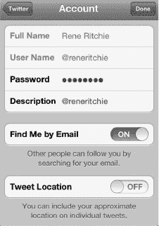

**注意：** 如果您发布了带有位置信息的推文，Twitter 上的任何人都可能找到您的确切位置——包括发现您不在家或不在公司。如果您担心隐私问题，请将 `推文位置` 切换至 `关闭`。

#### 使用 Twitter

官方的 `Twitter` 应用采用了一种精简的方式来使用 Twitter。`主页` 屏幕会显示您关注的人的推文，完整消息显示得清晰且字号较大。

底部有五个图标，第一个是主要的 `Twitter` 信息流。其他图标分别是 `提及`、`私信`、`搜索` 以及 `更多` 按钮，点击 `更多` 按钮可以进入您的 `个人资料`、`喜欢`、`草稿`、`列表` 以及 `帐户和设置`。

`写推文` 图标位于左上角（参见 图 25-1）。

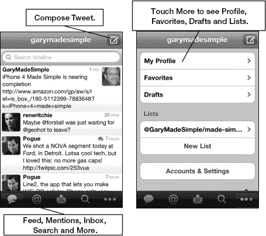

**图 25-1.** `Twitter` 应用 `主页` 页面的布局

#### 刷新推文列表

要刷新您的推文列表，只需下拉主页面，您会在顶部看到 `下拉以刷新` 的提示。当页面被拉下后，您会看到 `释放以刷新` 的提示。释放页面，推文列表就会刷新。

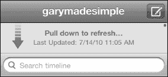

#### 您的 Twitter 个人资料

要显示您的 Twitter 个人资料，请点击 `更多` 按钮，然后点击 `我的个人资料`。

要查看您的推文，请点击 `推文`。

要查看您标记为喜欢的推文，请点击 `喜欢` 按钮。

要查看您关注的人，请点击 `正在关注` 按钮。

**注意：** 关于您的粉丝数、关注人数和推文数量的数字会显示在按钮标题的上方。

向下滚动页面以查看您的 `转推`、`列表` 以及您可以订阅的 `服务`。

#### 写推文按钮

点击 `写推文` 按钮 ，会弹出 `新推文` 屏幕。当您输入消息时，字符计数器将从 140 开始倒计数。以下是一些您可以在 `新推文` 屏幕中执行的操作：

*   点击 @ 符号搜索要在推文中提及的其他用户名。
*   点击 # 符号搜索要在推文中标记的热门话题。
*   点击 `相机` 图标，使用您的 iPhone 拍照或录制视频，或从您的资料库中选择现有内容添加到推文中。
*   点击 `箭头` 图标，将您当前的位置添加到推文中。

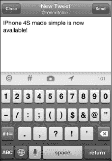

#### 推文内的操作选项

从您的 `Twitter` 应用的 `主页` 屏幕，只需点击您的一条推文即可看到以下选项：

*   点击屏幕左下角的 `返回箭头` 来 `回复` 一条推文。
*   点击方形的 `双箭头` 来转推或引用一条推文。
*   点击 `星形` 图标来喜欢一条推文。
*   点击 `回形针` 图标来查看附件。
*   点击 `操作` 按钮来复制推文链接、通过邮件发送推文或翻译推文。

**注意：** 与 Facebook 和 LinkedIn 不同，您可以在 App Store 中找到各种第三方 Twitter 应用。如果您不喜欢官方的 `iPhone` 版 `Twitter` 应用，可以尝试使用 `Tweetbot`、`Twitterrific` 或许多其他应用。

