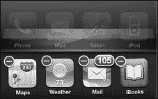
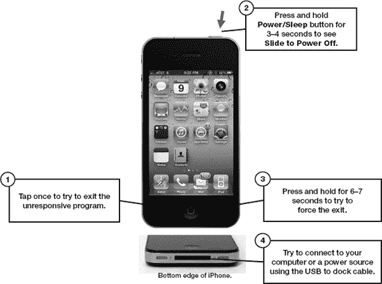
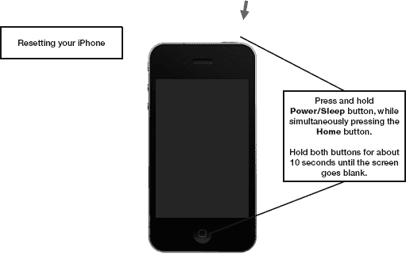
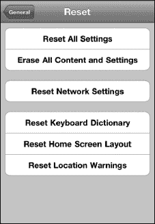
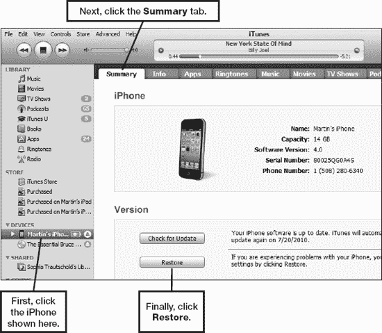
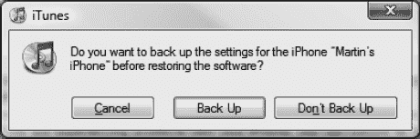
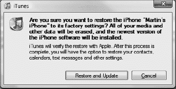
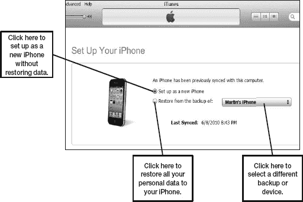
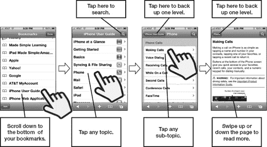

# 第 26 章

## 故障排除

iPhone 通常非常可靠。但偶尔，就像你的电脑或任何复杂的电子设备一样，你可能需要重置设备或排除故障。在本章中，我们将为你提供一些有用的工具，帮助你的 iPhone 尽快恢复正常运行。我们将从一些基本的快速故障排除开始，然后在“高级故障排除”部分深入探讨更复杂的问题和解决方案。

我们还将介绍一些与 iPhone 相关的其他琐碎事项，并为你提供一个可以寻求帮助的资源列表。

### 基本故障排除

首先，我们将介绍一些基本技巧和窍门，以便在 iPhone 出现问题时让它恢复正常。

#### iPhone 无响应时该怎么办

有时候，你的 iPhone 会对触摸无响应——它会在运行某个程序时突然死机。如果发生这种情况，请尝试以下步骤，看看 iPhone 是否会开始响应（参见 图 26-1）：

1.  按一次 `Home` 按钮，看看是否能退出应用程序回到 `Home` 屏幕。
2.  如果某个特定的应用程序导致问题，尝试双击 `Home` 按钮打开 `App Switcher` 栏。接着，按住 `App Switcher` 栏中的 *任意* 图标，直到它们都开始抖动，并且应用程序图标的左上角出现一个带有减号的红色 `Circle` 图标。

    

3.  点击红色 `Circle` 图标关闭该应用。
4.  如果 iPhone 仍然无响应，尝试按住 `Sleep/Power` 键，直到看到 `Slide to Power Off`。
5.  长按 `Home` 按钮，直到返回 `Home` 屏幕——这应能强制退出程序。
6.  确保你的 iPhone 电量充足。尝试将其插入电源或连接到电脑（如果已插入），看看是否会开始响应。
7.  如果长按 `Home` 按钮无效，你需要按住 `Power/Sleep` 按钮三到四秒钟来尝试关闭 iPhone。
8.  接着，滑动屏幕顶部的 `Slide to Power Off` 滑块。如果无法关闭 iPhone，则需要重置 iPhone。请跳至下一节了解操作方法。
9.  关闭 iPhone 后，等待大约一分钟，然后按住同样的 `Power` 按钮几秒钟来开启 iPhone。
10. 你应该会看到屏幕上出现 `Apple` 标志。等待 iPhone 启动，之后你应该就能访问你的程序和数据了。

**图 26–1.** *基本故障排除步骤*

如果这些步骤不起作用，你需要重置你的 iPhone。

#### 如何强制重启你的 iPhone

重置设备是处理 iPhone 无响应问题的另一种方法。执行此操作完全安全，并且通常可以解决许多问题（参见 图 26-2）。

**图 26–2.** *重置你的 iPhone*

请按照以下步骤强制重启你的 iPhone：

1.  用双手，同时按住 `Home` 按钮和 `Power/Sleep` 按钮。
2.  保持按住这两个按钮大约八到十秒钟。你会看到 `Slide to Power Off` 滑块。忽略它，继续按住两个按钮，直到屏幕变黑。
3.  再过几秒钟，你应该会看到 `Apple` 标志出现。看到标志后，松开按钮，你的 iPhone 将被重置。

#### 如何软重置你的 iPhone

你可以在 `设置` 应用中重置多种项目，从 `主屏幕` 布局到网络设置，再到设备上的所有数据：

1.  点击 `设置` 图标。
2.  点击 `通用`。
3.  向上滑动以查看页面底部。
4.  点击 `传输或还原 iPhone`。
5.  点击 `还原所有设置` 以重置网络、键盘、`主屏幕` 布局和定位警告。在弹出的窗口中点击 `还原` 以确认。
6.  点击 `抹掉所有内容和设置` 以清除 iPhone 上的所有内容，然后点击 `抹掉` 在弹出的窗口中确认。
7.  点击 `还原网络设置` 以清除你所有的 Wi-Fi（和 3G）网络设置。
8.  点击 `还原键盘词典` 以重置拼写词典。
9.  点击 `还原主屏幕布局` 以恢复为出厂布局；这会将 iPhone 的 `主屏幕` 恢复到其原始布局。
10. 点击 `还原定位与隐私` 以重置你收到的关于允许应用使用你当前位置的警告信息。

#### 音乐、视频、提醒或电话铃声没有声音

没有什么比错过电话、想听音乐或看视频却发现 iPhone 没有声音更令人沮丧的了。通常，这个问题有一个简单的解决方法：

1.  如果你听不到电话铃声或其他任何提醒，请检查确保设备左上边缘的 `静音` 开关没有打开。当开关拨向设备背面且旁边显示一点橙色时，你知道 `静音` 开关已打开。请确保 `静音` 开关被推向了设备正面，即关闭位置。
2.  使用 iPhone 左上边缘的 `音量增大` 键检查音量。你可能不小心将音量调到了最低或静音。
3.  如果你正在使用有线耳机，请拔下耳机，然后重新插入。有时，耳机插孔连接不良。
4.  如果你正在使用无线蓝牙耳机或蓝牙立体声设备，请遵循以下步骤：
   1.  检查音量设置（如果耳机或立体声设备上有音量控制）。
   2.  检查确保蓝牙设备已连接。点击 `设置` 图标，点击 `通用`，然后点击 `蓝牙`。确保看到你的设备已列出并且其状态为 `已连接`。如果未连接，则点击它并按照指示与 iPhone 配对。

        **注意**：有时你可能实际上已连接到蓝牙设备但并未意识到。如果你连接到蓝牙立体声设备，则实际的 iPhone 将不会发出声音。

5.  确保歌曲或视频未处于暂停模式。
6.  打开 iPhone 的音乐或视频控制。双击 `Home` 按钮应打开 `App Switcher` 栏。从左向右滑动以查看你的媒体控制。
7.  再向右滑动一次以查看音量控制。确认歌曲未暂停且音量未被调到最低。
8.  最后，检查 `设置` 图标，看看是否你（或其他人）在 iPhone 上设置了 `音量限制`：
   1.  点击 `设置` 图标。
   2.  向下滑动页面并点击 `音乐`。
   3.  查看 `音量限制` 是否为 `开`。
   4.  点击 `音量限制` 以检查设置级别。如果限制未锁定，只需将音量滑块滑动到更高水平。
   5.  如果已锁定，你需要先点击 `解锁音量限制` 按钮并输入四位数字代码来解锁。

如果这些步骤都无济于事，请查看本章后面的“其他故障排除和帮助资源”部分。如果那也没用，请尝试按照本章中“从备份恢复你的 iPhone”部分的步骤从备份文件恢复你的 iPhone。最后，如果这仍无帮助，请联系向你出售 iPhone 的商店或商家寻求帮助。

##### 若无法从 iTunes 或 App Store 进行购买

你刚到手这台酷炫的新设备，于是决定访问 iTunes Store 或 App Store。但如果你收到错误信息，或者无法进行购买，该怎么办？遇到这种情况时，可尝试以下步骤：

1. 这两个商店均需有效的互联网连接。请确保你已连接 Wi-Fi 或蜂窝数据网络。如需协助，请查阅第 4 章：“连接到网络”。
2. 确认你拥有有效的 iTunes 账户。

### 高级故障排除

至此，我们已经介绍了 iPhone 上的基本故障排除步骤。在接下来的章节中，我们将深入探讨一些更高级的故障排除方法。

#### 当 iPhone 未显示在 iTunes 中时

有时，当你将 iPhone 连接到 PC 或 Mac 时，`iTunes` 应用可能无法识别你的 iPhone。因此，你的 iPhone 不会出现在左侧导航栏中。

将 iPhone 连接到电脑后，它应显示在左侧导航栏的 `DEVICES` 下。你可以通过以下几个步骤来尝试让 `iTunes` 应用识别你的 iPhone：

1. 通过查看`主屏幕`右上角的电池电量来检查 iPhone 的电池充电状态。如果电池电量过低，`iTunes` 应用需要等电量回升后才会识别到它。
2. 如果电池已充电，请尝试将 iPhone 连接到电脑上的另一个 USB 端口。有时，如果你一直使用同一个 USB 端口连接 iPhone，换到另一个端口后电脑可能无法识别。
3. 如果问题仍未解决，请尝试断开 iPhone 连接并重启电脑。
4. 接着，重新将 iPhone 连接到 USB 端口。
5. 如果 `iTunes` 应用仍然无法识别你的 iPhone，请下载 `iTunes` 的最新更新，或者完全卸载并重新安装电脑上的 `iTunes` 应用。如果选择此选项，请务必先备份 `iTunes` 中的所有信息。
6. 你也可以尝试使用另一条同步线缆，可能是你的 USB 同步线缆存在故障。

#### 同步问题

有时，在将 iPhone 与电脑（PC 或 Mac）同步时，你可能会遇到错误。解决方式取决于你的同步方法。

##### 使用 iTunes 进行同步

如果你使用 iTunes 同步个人信息，请按照以下步骤解决同步问题：

1. 首先，执行我们在本章“iPhone 未显示在 iTunes 中”部分列出的所有步骤。
2. 如果 iPhone 仍然无法同步，但你可以在 `iTunes` 应用的左侧导航栏中看到它，请返回第 3 章：“与 iCloud、iTunes 等同步”，并仔细检查你的同步设置。

##### 使用 Apple 的 iCloud 或 Microsoft Exchange 进行同步

如果你使用 iCloud 服务或 Microsoft Exchange 方法来同步电子邮件和个人信息，请按照以下故障排除步骤解决同步问题：

1. iCloud 和 Exchange 同步都需要无线互联网数据连接来同步电子邮件和个人信息。请通过查看快速入门指南中“读取连接状态图标”部分的表 1，确认你拥有有效的数据连接。
2. 如果没有无线数据信号，请确认你的 Wi-Fi 或 3G 连接设置正确（参见第 4 章：“连接到网络”）。
3. 确认连接后，你需要检查电脑和 iPhone 上的同步设置是否正确（参见第 3 章）。

**提示：** 有时问题可能很简单，比如密码已更改。如果是这种情况，请确保在 iPhone 上更正同步设置的密码。可通过点击`设置`图标，然后点击`邮件、通讯录和日历`来找到这些设置。最后，点击账户名称并调整密码。

### 重新安装 iPhone 操作系统（可选择是否恢复数据）

有时，你可能需要执行一次 iPhone 操作系统的纯净安装，以便让 iPhone 恢复顺畅运行。如果当前有可用更新，此过程也将同时升级你的 iPhone 软件。

**提示：** 此过程实际上与使用新版本操作系统更新 iPhone 的过程完全相同。

在此过程中，你将面临三个选择：

-   如果你想将 iPhone 恢复至包含所有数据的正常状态，则必须使用 `iTunes` 应用中的`恢复`功能。
-   如果你打算全新启动并将 iPhone 关联到一个 iTunes 账户，则需在此过程结束时使用`设置新的 iPhone`功能。
-   如果你打算赠送或出售你的 iPhone，只需在此过程结束时（在进行恢复或新设置之前）从 `iTunes` 中弹出 iPhone 即可。

**警告**：此恢复过程将彻底清空你的 iPhone。你需要重新同步和重新安装所有应用程序，并输入你的账户信息，例如电子邮件账户。此过程可能需要 30 分钟或更长时间，具体取决于你同步到 iPhone 的信息量。

要按照步骤重新安装 iPhone 操作系统软件，并可以选择从之前的备份中恢复数据到你的 iPhone，请执行以下操作：

1.  将你的 iPhone 连接到电脑，并打开 `iTunes` 应用。
2.  在左侧导航栏的`设备`类别中，点击你的`iPhone`。
3.  点击顶部导航栏中的`摘要`。
4.  你会看到显示所有 iPhone 信息的`摘要`屏幕。点击屏幕中央的`恢复`按钮，如下图所示（请参见图 26–3）。

**图 26–3.** *连接你的 iPhone 并在`摘要`屏幕中点击`恢复`按钮*

5.  现在系统会询问你是否要备份手机。为安全起见，请点击`备份`（请参见图 26–4）。

**图 26–4.** *在 `iTunes` 中恢复前进行备份*

6.  在下一个屏幕上，你会被警告所有数据都将被抹掉。点击`恢复`或`恢复并更新`以继续（请参见图 26–5）。

**图 26–5.** *恢复之前在 `iTunes` 中备份你的 iPhone*

7.  你会看到一个 iPhone `软件更新`屏幕。点击`下一步 >` 以继续。
8.  接下来，你会看到`软件许可协议`屏幕。点击`同意`以继续并开始该过程。
9.  `iTunes` 会下载最新的 iPhone 软件，备份并同步你的 iPhone，然后重新安装 iPhone 软件。此过程会完全抹掉所有数据，并将你的 iPhone 恢复到原始“干净”状态。你将在 `iTunes` 顶部看到状态消息，类似于图 26–6 所示。

**图 26–6.** *软件更新/恢复过程，`iTunes` 顶部显示状态窗口*

10.  备份和同步完成后，你的 iPhone 屏幕会变黑。接着，`Apple` 标志会出现，并且你会看到标志下方有一个进度条。最后，`iTunes` 中会弹出一个小窗口，告知你更新过程已完成。点击`确定`进入`设置你的 iPhone` 屏幕。此时你将有以下几个选项：
    1.  如果你希望保持 iPhone 的干净状态（即不含任何个人数据），请选择第一个选项`设置为新的 iPhone`。如果你正在为他人设置此 iPhone，你可能需要使用此选项（你需要她/他的 Apple ID 和密码）。
    2.  如果你要赠送或出售你的 iPhone，只需点击 iPhone 旁边的`弹出`图标，就完成了（请参见图 26–7）。

**图 26–7.** *如果你要赠送或出售 iPhone，请将其弹出*

3.  选择`从以下备份恢复：`并确认下拉菜单已设置为正确的设备。
11.  最后，点击`继续`（请参见图 26–8）。

**图 26–8.** *设置为新 iPhone 或从备份文件恢复*

12.  如果你选择恢复，那么稍后你的 iPhone 上会出现`正在恢复`屏幕，并且 `iTunes` 中会显示一个状态窗口，提示“正在从备份恢复 iPhone…”。此状态窗口还会显示预计时间。
13.  接下来，你会看到一个小弹出窗口，提示“你的 iPhone 设置已恢复”。几秒钟后，你会看到你的 iPhone 出现在 `iTunes` 左侧导航栏的`设备`下。
    1.  如果你将信息与 `iTunes` 同步，则所有数据现在都将被同步。
    2.  如果你使用 iCloud、Exchange 或其他同步过程，你可能需要在 iPhone 上重新输入密码以让这些同步过程恢复运行。

## 其他故障排除和帮助资源

有时，你可能会遇到本书中找不到答案的特定问题或疑问。在以下部分中，我们将提供一些可以从 iPhone 以及从电脑的网页浏览器访问的优质资源。iPhone 上的设备端用户指南易于导航，可快速提供你所查找的信息。如果你遇到特别难以解决的故障排除问题时，Apple 知识库会很有帮助。与 iPhone/iPod touch 相关的网络博客和论坛也是寻找答案甚至提出你遇到的独特问题的好地方。

### iPhone 设备端用户指南

请按照以下步骤访问 iPhone 设备端用户指南：

1.  打开你的 `Safari` 网络浏览器，查看你的 iPhone 的在线用户指南。
2.  点击底部图标行中的`书签`按钮 。
3.  滑动到列表底部，然后点击`iPhone 用户指南`。

如果看不到该书签，请在 iPhone 上的 `Safari` 的`地址`栏中输入此网址：[`http://help.apple.com/iPhone`](http://help.apple.com/iPhone)。

**提示**：要从电脑查看 PDF 格式的手册，请访问 [`http://support.apple.com/manuals/iphone/`](http://support.apple.com/manuals/iphone/)。

进入 iPhone 上的用户指南后，你应该会看到一个类似于图 26–9 所示的屏幕。

好处在于你已经知道如何浏览该指南。点击任何主题以查看该主题的更多信息——可能是另一个子主题列表，或者是更详细的信息。

阅读该主题，或点击其他链接以了解更多信息。

你可以点击屏幕右侧的按钮返回上一级。

**图 26–9.** *在你的 iPhone 上通过 `Safari` 使用 iPhone 手册*

### Apple 知识库

在你的 iPhone 或电脑的网页浏览器中，访问此网页：[`www.apple.com/support/iphone/`](http://www.apple.com/support/iphone/)

最后，点击左侧导航栏中的一个主题。

#### 与 iPhone 相关的博客

拥有 iPhone 的一大好处是，你立即加入了全球 iPhone 用户的大家庭。许多 iPhone 用户堪称*发烧友*，并且是众多 iPhone 用户小组的成员。这些用户小组，连同各种论坛和网站，为 iPhone 用户提供了丰富的资源。其中许多资源可以直接在你的 iPhone 上获取，另外也有一些网站你可能想在电脑上浏览。

有时，你可能想与其他 iPhone 爱好者交流，询问一个技术问题，或者了解最新、最热门的传闻。博客是一个绝佳的去处。

以下是一些热门的 iPhone（以及 iPad 或 iPod touch）博客：
*   [`www.tipb.com`](http://www.tipb.com)
*   [`www.iphonefreak.com`](http://www.iphonefreak.com)
*   [`www.gizmodo.com`](http://www.gizmodo.com)（iPhone 板块）

**提示**：在你于任何这些博客上发布新问题之前，请先在博客内搜索一下，确保你的问题尚未被提出和回答。同时，请确保你将问题发布在博客的正确板块（例如，iPhone 板块）。否则，你可能会因为没有事先做好功课而招致社区成员的愤怒！

你也可以在网上搜索“iPhone 博客”或“iPhone 新闻与评测”，以找到更多博客。

