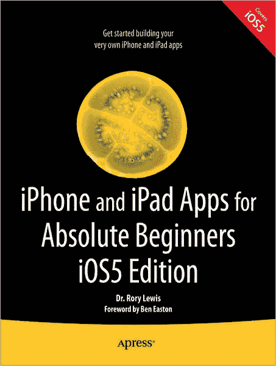
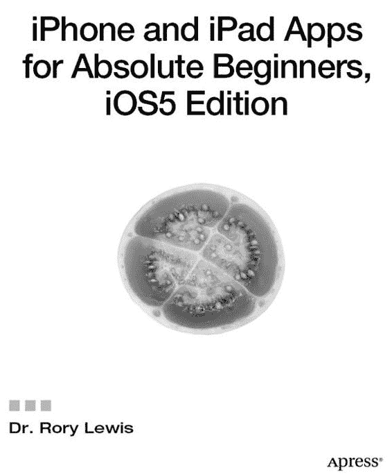

> **iPhone 与 iPad 应用开发入门（iOS5 版）**
> 
> 版权所有 © 2012 罗里·刘易斯博士
> 
> 保留所有权利。未经版权所有者及出版人事先书面许可，本书的任何部分不得以任何形式或任何方式（电子或机械，包括影印、录制或任何信息存储检索系统）进行复制或传播。
> 
> 国际标准书号（平装）：978-1-4302-3602-1
> 
> 国际标准书号（电子版）：978-1-4302-3603-0
> 
> 书中可能提及商标名称、标识及图片。我们仅在编辑性表述中使用这些名称、标识及图片，以维护商标所有者的权益，并无意侵犯其商标权，而并非在每次出现商标名称、标识或图片时都使用商标符号。
> 
> 本出版物中使用的商业名称、商标、服务标志及类似术语，即使未被明确标识，也不应被视为对其是否受专有权利保护的立场表达。
> 
> 总裁兼出版人：保罗·曼宁
> 主编：史蒂夫·安格林
> 开发编辑：马修·穆迪
> 技术审校：马修·诺特
> 编委会：史蒂夫·安格林、马克·贝克纳、伊万·白金汉、加里·康奈尔、摩根·恩格尔、乔纳森·根尼克、乔纳森·哈塞尔、罗伯特·哈钦森、米歇尔·洛曼、詹姆斯·马卡姆、马修·穆迪、杰夫·奥尔森、杰弗里·佩珀、道格拉斯·庞迪克、本·雷诺-克拉克、多米尼克·沙克沙夫特、格温南·斯皮林、马特·韦德、汤姆·韦尔什
> 协调编辑：亚当·希思
> 文字编辑：钱德拉·克拉克
> 排版：MacPS, LLC
> 索引编制：BIM 索引与校对
> 插画师：SPi Global
> 封面设计：安娜·伊申科
> 
> 本书由施普林格科学与商业媒体有限责任公司向全球图书贸易发行。地址：纽约州纽约市春街 233 号 6 楼，邮编 10013。电话：1-800-SPRINGER，传真：(201) 348-4505，电子邮件：`orders-ny@springer-sbm.com`，或访问 `www.springeronline.com`。
> 
> 如需翻译相关信息，请发送电子邮件至 `rights@apress.com`，或访问 `www.apress.com`。
> 
> Apress 及 friends of ED 系列图书可批量购买用于学术、企业或推广用途。大多数图书亦提供电子版及授权许可。更多信息请参考我们的特别批量销售——电子版许可网页：`www.apress.com/bulk-sales`。
> 
> 本书所载信息按“现状”提供，不提供任何担保。尽管在编写过程中已采取一切预防措施，但作者及 Apress 不对任何人或实体因本书所含信息直接或间接造成的任何损失或损害承担责任。
> 
> 献给我最好的朋友、我的妻子、我的生命、我的光、我的凯拉。
> ——罗里·刘易斯博士

## 目录速览

目录

序言：关于作者

关于合著者

关于技术审校

致谢

前言

 第 1 章：准备工作

 第 2 章：启程！

 第 3 章：持续前行

 第 4 章：多图形按钮与标签

 第 5 章：触摸操作

 第 6 章：开关

 第 7 章：故事板

 第 8 章：调试

 第 9 章：MapKit 与故事板

 第 10 章：用故事板实现 MapKit 与表格

 第 11 章：从故事板到多媒体平台

索引

