# 第 11 章：故事板走向多媒体平台

- myiTunes：主从应用程序
- 预备工作
- 一个新的主从模板
- 引入图片！
- 在故事板中组织弹出框
- 编写 myiTunes 应用
- 编写 DetailViewController
- 完成故事板
- 结语

- 索引

## 前言：关于作者

"我和罗里于 1983 年在洛杉矶相遇。他让我想起我最喜欢的电影角色之一，巴卡鲁·班萨——总是同时朝六个方向前进。如果你拦住他问他在做什么，他会回答得全面且细节惊人。他自律、丰富多彩且友善，拥有以简单、有机的方式解释高度抽象概念的奇特能力。他总是能达成设定的目标，并且也会帮助你做到同样的事情。"

### 为何你会与刘易斯博士产生共鸣

在雪城大学就读计算机工程专业时，罗里拼命地通过课程并赚取足够的钱来养活妻子和两个年幼的女儿。1990 年，他在 LC 史密斯工程学院找到了一份理想的校内工作，担任计算机实验室的监考员。尽管他在电气工程专业的课程中苦苦挣扎，但他始终坚守在服务台。这对罗里来说是一段令人生畏的经历，因为他的工作只是帮助同学解决计算机实验室设备相关的问题，但他总是发现同学们会问更深更难的问题："哥们，你理解微积分作业了吗？能帮我一下吗？！"

 这些学生认为，既然罗里是监考员，他就知道答案。他既害怕又充满自我怀疑，于是寻求一种既能帮助他们又不暴露自己不足的方法。罗里学会了这样开始："让我们回到基础。还记得上周教授为我们呈现的方程式吗……？" 通过回归基本原理，重新阐述并重新包装它们，罗里开始发展出一种技巧，这种方法往往能引导出可行的解决方案。到了大四那年，每逢罗里值班的夜晚，服务台前常常排起一队学生等待帮助。

### 时光飞梭十七载

想象一位长发飘飘、不拘一格的教授，身穿复古与随性碰撞的醒目装扮，行走在科罗拉多大学科罗拉多斯普林斯分校的校园里。当他走进工程楼时，迎接他的是学生们和教职员工，他们微笑着热情打招呼，同时大概仍会对他那身花呢夹克、感恩而死乐队的 T 恤、卡其裤和人字拖暗自摇头。当他沿着计算机科学系的走廊走去时，办公室门外已排着一队学生。这情景让人想起早年他在计算机实验室担任监考员时，求助台前等候的那排学生。他们转身向他打招呼：“早安，刘易斯博士！”这些科罗拉多大学斯普林斯分校的学生中，许多人甚至不是他班上的，但他们知道刘易斯博士无论如何都会见他们并提供帮助。

### 过去—现在—未来

刘易斯博士拥有三个学位。他获得了雪城大学计算机工程理学学士学位。雪城大学的 LC 史密斯工程学院是全美顶尖学院之一，英特尔、AMD 和微软都会派遣顶尖员工来此攻读博士学位。

完成学士学业（主攻微处理器电子电路的数学）后，他穿过校园广场，进入雪城大学法学院。在法学院第一个暑假，全国最具影响力的律师事务所富布莱特与贾沃斯基招募罗里到其奥斯汀办公室工作，那里的一些律师专门从事高科技知识产权专利诉讼。作为实习工作的一部分，刘易斯参与了著名的 AMD 诉英特尔案，协助资深合伙人评估微处理器电路算法的数学原理。

在法学院第二个暑假，同样参与 AMD 诉英特尔案的另一家律师事务所——斯凯尔文、莫里尔、麦克弗森、富兰克林与弗里尔——邀请罗里到其在硅谷的分支机构（圣何塞和旧金山）工作。在沉浸于法律领域数年并获得雪城大学法学博士学位后，刘易斯意识到自己的热情在于计算机数学，而非硬件和软件的法律纠纷。他更喜欢学习和创造的环境，而非法律中固有的争论与对抗。

离开学术界三年后，罗里·刘易斯南下北卡罗来纳大学夏洛特分校攻读计算机科学博士学位。在那里，他师从兹比格涅夫·W·拉斯博士，这位学者以其在数据挖掘算法与方法、分布式数据挖掘、本体论和多媒体数据库领域的创新享誉全球。攻读博士学位期间，刘易斯为计算机工程本科生教授计算机科学课程，并为 MBA 学生讲授电子商务和编程课程。

获得计算机科学博士学位后，罗里接受了科罗拉多大学科罗拉多斯普林斯分校计算机科学的终身轨教职，他的研究方向是神经科学的计算数学。最近，他与人合著了一份关于下丘脑相关癫痫起源数学分析的资助申请书。然而，随着苹果革命性的 iPhone 及其独特灵活的平台——以及微型应用、游戏和个人计算工具的市场——的兴起，他变得兴奋不已，开始为了个人乐趣进行实验和编程。在熟练掌握后，刘易斯认为自己可以开设一门包括非工科学生在内的 iPhone 应用课程。凭借作为 iPhone 测试版测试员的内部知识，他甚至早在 2010 年 4 月官方发布之前，就将拟议的 iPad 平台参数整合到了教学计划中。

这门课程取得了巨大成功，来自学生和同事的反馈都极为积极。当被问及是否愿意将课程改编成书由 Apress 出版时，刘易斯博士欣然抓住了这个机会。他愉快地接受了将其课程大纲、课堂笔记和视频转化为您手中这本书的邀请。

### 为何撰写此书？

刘易斯博士撰写此书的原因，与他最初决定为工科和非工科专业开设课程的原因相同：挑战与乐趣！据刘易斯所言，iPhone 和 iPad 是“……有史以来最酷、最强大、技术最先进的工具之一——句号！”

令他着迷的是，在那些高分辨率图像和有趣小图标构成、吸引人的触摸屏之下，iPhone 和 iPad 是用 Objective-C 这一极其困难和先进的编程语言编写的。越来越多的学生和同事找到刘易斯，想为 iPhone 编写应用程序并征求他的意见。似乎每次 iPhone 更新，更不用说 iPad 扩展界面的问世，都对编程应用兴趣的闸门越开越宽。精彩而创新的想法只是需要一个合适的渠道，将其转化为适当的格式，然后推向世界。

然而，一般来说，撰写 Objective-C 书籍的人的目标读者是那些精通 Java、C#或 C++的人。因此，由于似乎没有为那些虽有绝佳的 iPhone/iPad 应用点子却资质平平的普通人提供帮助，刘易斯博士决定开设这样一门课程。他意识到，明智的做法是前半学期使用自己的笔记，然后探索能找到的最佳现有资源。

在他推进这个计划时，最令他印象深刻的是《Beginning iPhone 3 Development: Exploring the iPhone SDK》这本书。这本 Apress 出版的畅销教程由戴夫·马克和杰夫·拉马尔什撰写。刘易斯得出结论，他们的书为他的课程提供了一个极好的高层次目标……一种通往全面、流畅地为所有苹果多点触控设备编程的“垫脚石”方法。

在刘易斯博士的课程成功讲授之后，在与 Apress 代表的一次后续谈话中，刘易斯偶然提到，直到学期中段他才开始使用那本书，因为他必须先让非工科学生跟上进度。编辑建议将他的笔记和大纲改编成一本入门指南——一本面向技术要求较低的编程人群的导论性书籍。从那时起，剩下的只是时间和细节问题——比如整理和修订刘易斯博士广受欢迎的教学视频，让其他渴望自己编写 iPhone 和/或 iPad 应用的、非工科背景的人们也能获取。

所以，这就是一位不拘一格的教授如何写出这本书的故事。我们希望您能受到鼓舞，把它带回家并开始行动。用这些知识武装自己，从此刻开始改变您的生活吧！

本·伊斯顿
作者、教师、编辑

## 关于合著作者

本·伊斯顿毕业于华盛顿与李大学，获哲学学士学位。他涉猎广泛，涵盖音乐、银行业、帆船运动、悬挂式滑翔和零售业。他的大部分工作经历都与某种形式的教育相关。本曾执教 17 年，主要教授初中数学。最近，作为软件培训师和实施顾问的经历重新唤醒了他长久以来对技术领域的热情。作为一名自由撰稿人，他撰写过多篇科幻故事和剧本，以及为杂志和通讯供稿的特写文章。本现居德克萨斯州奥斯汀市，目前正在创作他的第一部小说。

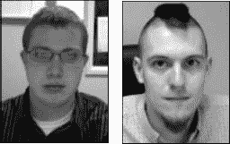布赖恩·帕克斯，计算机科学博士生，与硕士生安东尼·马吉在科罗拉多大学科罗拉多斯普林斯分校（UCCS）与刘易斯博士合作，协助研究了测试版 Xcode 的多个版本。

布赖恩是科罗拉多大学科罗拉多斯普林斯分校计算机科学博士项目的学生，期间常与特伦斯·博尔特博士和罗里·刘易斯博士合作。他在宾夕法尼亚州利哈伊大学获得计算机科学学士学位。布赖恩专精于软件设计与开发技术，尤其关注软件工程与架构，特别是数据驱动型应用。同时，他也是一位教育者和学者，专注于软件工程与设计，以及近期研究的计算机组成和汇编语言编程，其研究重心是计算机视觉及其与心理学视觉理论的关联。

安东尼目前在科罗拉多大学科罗拉多斯普林斯分校攻读计算机科学硕士学位（即将完成），他也在该校获得了学士学位。安东尼在软件设计与开发方面经验丰富，并在其职业生涯中主导了多款软件应用的实施与发布。因学术及个人兴趣，他专攻多个领域，包括理论与应用数学、软件设计、用户界面设计、计算机科学教育、计算机视觉等，且涉猎范围仍在不断扩展。

布赖恩和安东尼是 Synapse Software 的管理合伙人。

## 关于技术审稿人

马修·诺特是一名学习平台开发人员及 SharePoint 专家。他从小就开始编程，此后从未停止学习。作为一名经验丰富的 C 和 C#开发者，马修最近开始开发 iOS 应用以推动学习平台的移动化。他与妻子、两个孩子居住在英国威尔士，并时常在自己的博客（`mattknott.com`）上撰写文章。

## 序言

### 本书能为你带来什么

直说吧：你想学习如何为 iPhone 或 iPad 编程，并且自认为相当聪明——但每当你阅读计算机代码或高度技术性的指导说明时，你的大脑似乎就停摆了。阅读晦涩难懂的指令时，你是否会两眼发直？是否有个声音在脑中责备你：“怎么样！你的大脑六行前就关机了，但你还在假装浏览页面——假装自己不像感觉的那么迟钝。真棒！”

看看你是否能感同身受……你遇到了一个相当技术性的问题，决定用谷歌搜索并排除故障。你打开排名第一的结果，发现别人也问了完全相同的问题！页面加载时你兴奋起来，但，唉，那只是一个论坛（一个让那些用难以理解的代码互相交谈的极客们的聊天站点）。你看到你的问题后面跟着……但为时已晚！你的大脑已经停摆，你感到紧张和沮丧，仿佛肚里打了结。

### 听起来很熟悉？

是吧？那么这本书就是为你准备的！我猜你现在可能站在书店或机场，浏览着报刊亭，想找点能让你兴奋的东西。因为你是在这种高档场所读到这里，所以你可能买得起 iPhone、Mac、汽车和机票。你或许正被手持设备这个蓬勃发展的行业，以及内存和微处理器呈几何级数进化的速度所吸引……被“想法如何能迅速转化为全新的计算平台、强大的软件应用、实用的工具和巧妙的游戏……甚至转化为金钱”所吸引。现在，你正想知道自己是否能参与其中——运用你的才智和技术悟性为大众服务。

### 我如何知道这些关于你的事？

很简单！经过多年教授学生编程的经验，我知道如果你还在这里读下去，那么你既足够聪明，又有足够的动力踏入编程领域，尤其是为了像 iPhone 这样迷人、或像 iPad 这样性感的设备编程。如果你对上文描述的那个人有认同感和关联感，那么我了解你。我们很久以前就已经互相认识了。

你是一个聪明人，即使你有一定的编程背景，在阅读复杂代码时也可能会头脑抽搐。而且，即使你在各种编程语言方面有相当扎实的基础，你也是一个只想寻求一种简单、精准、无虚饰的策略来学习如何为 iPhone 和 iPad 编程的人。没问题！我能引导你走出你通常经历的各种心理障碍，并帮助你绕开任何（无论真实或想象中的）技术障碍。我已经对我的学生这样做过上千次了，我的方法对你也会有效。

### 我采用的方法

我不会试图解释每一个微小的细节。我也不会期望你在现阶段就知道 iPhone/iPad 应用中的每一行代码。我要做的是，一步一步地向你展示如何实现关键操作。我的方法既全面又轻松，并且我为自己能够指导知识基础和技能水平跨度极大的学生与有兴趣的学习者而感到自豪。

本质上，我会带领你，按照你自己的节奏，到达一个你能编码、上传、或许还能出售你的第一个 iPhone/iPad 应用（无论简单还是复杂）的程度。好消息是：下载量最大的应用并不复杂。最受欢迎的是那些简单、实用的生活工具……比如在停车场找到你的车、制作更好的购物清单、或追踪你的健身进展。不过，当你完成本书的学习后，你可能想要进阶到 Apress 和 Friends of ED 系列的其他书籍。你在这里有很多选择，在后面的路途中，我会就最佳的前进方向给你建议。但现在，你可能想多了解我一点，以便有信心让我担任你在这个激动人心的应用冒险中的引路人。

愿你进入这个神奇而美妙的世界时，体验到巨大的喜悦与成功。

和平！

罗里·A·刘易斯博士，法学博士

## 第 1 章

好的，作为一名高级文档工程师和翻译员，我将严格按照您的要求，完成以下翻译任务。

## 开始之前

本章绪论将确保您拥有完整且自信地阅读本书所需的所有工具和配件。有些人可能已经将 `Xcode`、最新的 iOS 模拟器和 `Interface Builder` 安装到了您的 Mac 上，并且您可能认为，既然在这些方面已经准备就绪，就可以直接开始了。如果是这样，您可能想直接跳到 第 2 章，立即开始您的第一个程序。

不过，理解我为何讲解某些内容而跳过其他内容，对您来说仍将大有裨益。对于那些从未用 Objective-C 编程过的人来说，这相当具有挑战性——即使是对我那些懂 Java、C 和 C# 的工程专业学生也是如此。尽管如此，只要有适当的准备和心态，您就能完成 Objective-C 的编程任务。

所以——我恳请您继续读下去。您在本章投入的时间，将在内心的平静和自信方面得到超值的回报。 第 1 章 将有助于构建您大脑对即将到来的丰富内容的存储方式。

### 必需品与配件

为了能够为 iPhone 和/或 iPad 编程，并跟随本书的练习、教程和示例进行操作，您需要满足 5 个最低要求。您现在可能无法完全理解它们，但没关系——请先跟着我走一遍。我们会在这些步骤中解释一切。简而言之，这 5 个要求是：

*   一台 Mac
*   适合您 Mac 的正确操作系统，称为“OS X”
*   注册为开发者（下文详述）
*   适合您 iPhone 的正确操作系统，称为 iOS
*   适合您 iPhone 的正确软件开发工具包，称为 SDK，它运行一个名为 `Xcode` 的程序。

让我们更详细地讨论其中一些要求。

首先，您将需要一台基于 Intel 的 Macintosh，运行 Lion（OS X 10.7.2 或更高版本）。如果您的系统是在 2006 年之后购买的，就没问题。我特意在一台 2006 年购买的 MacBook 上编写了所有程序。网上的所有视频都是在我的 2006 年 MacBook 上录制的屏幕录像，或者如果我使用 2010 年的 iMac 进行广播，我会首先在我的 2006 年 MacBook 上运行它。您并不需要最新款的 Mac。如果您还没有购买，我建议您购买一台基础款、无多余功能的 MacBook Air。如果您确实拥有一台较老的 Mac，那么您可能可以添加一些 RAM。请在 Apple Store 的 Genius Bar 预约，并要求他们尽可能增加 RAM。同时，明确地问他们：“这台旧电脑能至少运行 Lion 10.7.2、iOS5 和 Xcode 4.2 或更高版本吗？”

如果您没有 Mac，请记住，如前所述，我特意选择在 Apple 最小、最便宜的型号——MacBook 上编写和运行本书中的每一个程序。Apple 已经停产了 MacBook；他们现在销售售价 999 美元的 MacBook Air，这比作者的 MacBook 更先进。您可以在 eBay 或其他类似网站上购买 MacBook。请参见 图 1–1。

> 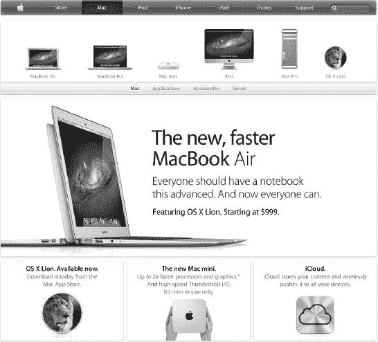
>
> 图 1–1。我使用市场上最便宜的 2006 年 Mac——MacBook，来执行本书中的所有编码和编译工作。本质上，完全没有必要购买更贵或更高端的 Mac 来完成所有的练习。

其次，您需要正确的 OS X。在我撰写本文时，它是 OS X 10.7.2。我们需要确保您的 Mac 中安装了最新、最好的操作系统（OS X）。我无法告诉您有多少封电子邮件和论坛问题显示，你们中许多人会想：“啊哈，我的代码可能没有正确编译，因为 Dr. Lewis 的机器上有不同的 OS X 或/和 iOS……”

**注意**：运行您电脑的操作系统（OS X）与 iPhone/iPad 操作系统（通常称为“iOS”）不同。即使您认为一切都已经是最新的，我建议您跟我一起确认您的系统拥有最新的 OS X 和最新的 iOS。当您跟着我学习并处理我在本书中教您的所有程序时，有时您的代码在第一次运行时不会工作。实际上，大多数时候，您的代码在第一次运行时（或者用我们这些极客的话说，“编译它”时）都不会工作。所以！我们现在就来处理这个问题。

关闭您 Mac 上运行的所有程序，以便唯一运行的程序是“Finder”。点击位于 Mac 左上角的小苹果图标，然后选择“关于本机”，如 图 1–2 所示。

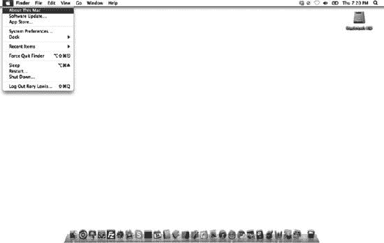

图 1–2。进入您的桌面，点击苹果图标，然后选择“关于本机”。

选择此项后，您将看到一个名为“关于本机”的窗口，如 图 1–3 所示。

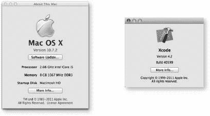

  
图 1–3. “关于本机”窗口与 Xcode 版本窗口。此处可见我的 MacBook 运行的是 OS X 10.7.2。本章稍后会讨论 iOS。如果你已安装 Xcode（或在安装 Xcode 后），在“Xcode”下点击“关于 Xcode”，即可查看当前运行的版本（如右侧所示）。

再次说明，我使用的是 OS X 10.7.2，这也是本书所用的操作系统。当你阅读本书时，系统版本很可能已升级至更高版本。这里你需要牢记两点：首先，你需要将系统更新至最新的 OS X（如下所示）；其次，你需要访问本书的在线论坛，了解新版本 OS X 中可能影响本书内容的变动。那么，接下来我们来看看如何将系统更新至最新的 OS X。

在关闭除“访达”以外的所有程序后，返回 Mac 屏幕左上角的苹果图标，选择“软件更新...”，如图 1-4 所示。接着，按照提示和四个屏幕指引操作，如图 1-5 所示。

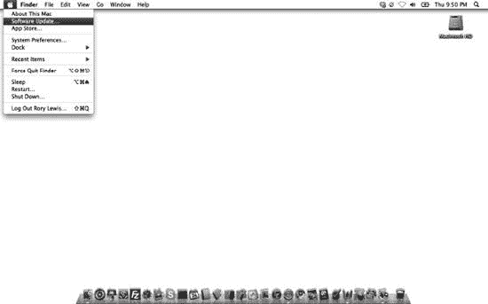

图 1–4. 进入桌面，点击苹果图标，选择“软件更新...”

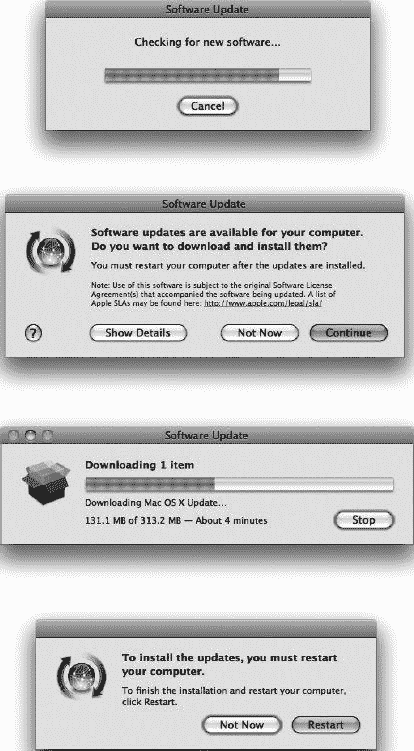

图 1–5. 从上至下依次为：检查新软件；选择下载新软件的选项；等待新软件下载完成；选择“重新启动”以让 Mac 正确安装新软件。

如果你在阅读本书时发现 OS X 和/或 iOS 的截图已显过时，请不要慌张。我设立了一个常驻在线论坛，我和许多志愿者都乐于在此提供帮助。我们会持续更新论坛，发布有关 OS X 和 iOS 最新版本的消息。请访问论坛：[`www.rorylewis.com/ipad_forum/`](http://www.rorylewis.com/ipad_forum/) 或 `bit.ly/oLVwpY`。参见图 1-20。

第三，你需要通过 iPhone/iPad 软件开发工具包（SDK）注册成为开发者，并下载 Xcode。如果你是学生，你的教授很可能已代为处理此事，你可能已在教授名下注册。如果不是学生，则需要按以下编号步骤进行注册。

注意：即使你完全不想成为开发者，仍可随购买 Lion 系统一同下载 Xcode，或在 Mac 应用商店购买。我还没见过有学生能坚持使用替代方案超过一周。支付 100 美元后，你将获得 Apple 开发者工具包、教程、示例代码和帮助论坛的访问权限，并获得在实体 iPhone 或 iPad 上运行应用的授权许可。最后，你阅读本书是为了制作应用并在 iTunes Store 上销售赚钱——仅此一项你就需要支付这 100 美元。购买 Mac、Xcode 和本书，却不购买这 100 美元的注册许可，就像花钱学开车、买了车，却从未取得驾照一样。我在本书中教授你使用的许多调试工具都假定你拥有许可。这是你的选择。

1.  前往 `developer.apple.com/programs/ios/` 或 `bit.ly/quO4ow`，你将进入一个类似图 1-6 所示的页面。点击“立即注册”按钮。
    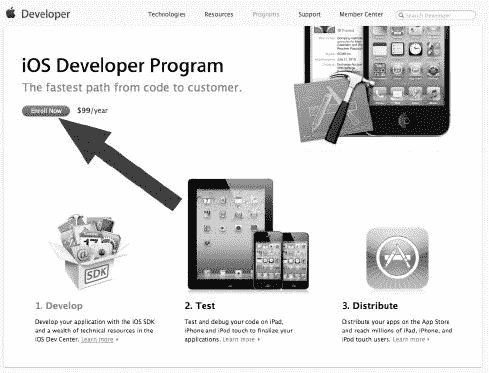

    图 1–6. 点击“立即注册”按钮。

2.  点击“继续”按钮，如图 1-7 所示。
    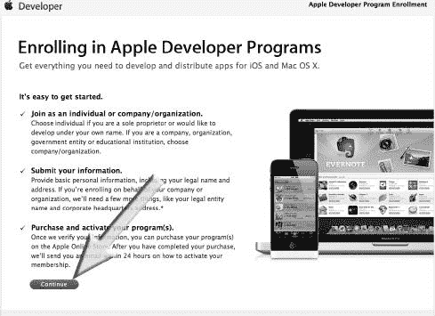

    图 1–7. 点击“继续”按钮。

3.  阅读本书的大多数人应选择“我需要为……创建新帐户”选项（图 1-8 中的箭头 1）。接着，点击箭头 2 所示的“继续”按钮（图 1-8）。如果你已有现有帐户，说明你之前已走过此流程。请直接选择“我目前已有 Apple ID……”选项开始操作，我们将在第 6 步会合，届时登录 iPhone/iPad 开发页面并下载 SDK。
    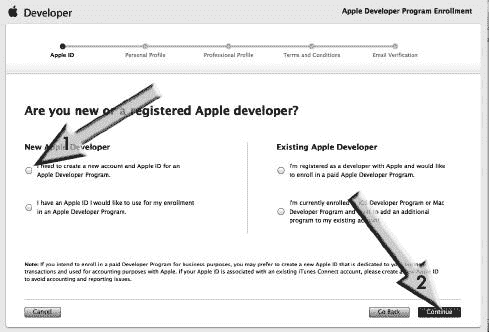

    图 1–8. 点击“我需要创建 Apple ID……”选项继续。

4.  你很可能以个人身份注册，因此请点击“个人”链接，如图 1-9 所示。如果你以公司身份注册，请点击右侧的“公司”选项并按照相应步骤操作；我们将在第 6 步会合。
    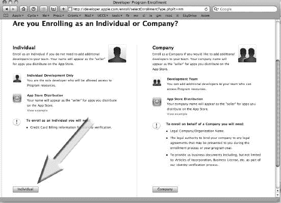

    图 1–9. 点击“个人”选项。

5.  接下来，你将输入所有个人信息，如图 1-10 所示，并支付标准计划费用 99 美元。这将为你提供所需的所有工具、资源和技术支持。（如果你在阅读本书，你确实不需要购买 299 美元的企业计划，该计划仅适用于商业内部应用。）支付完成后，请保存好你的 Apple ID 和用户名；然后接收并按照确认邮件进行相应操作。
    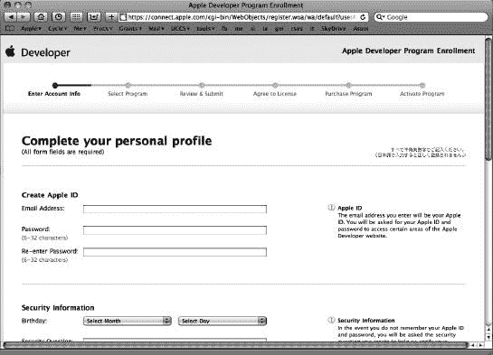

    图 1–10. 相应输入所有信息。

    注意：在进入第 6 步之前，请确认你已收到确认邮件并已选择密码，以完成成为正式注册 Apple 开发者的最后一步。恭喜！

6.  使用你的 Apple ID 登录 `developer.apple.com` 的主 iPhone/iPad 开发页面。该页面有三个图标，分别对应三种类型的 Apple 程序员。如图 1-11 中箭头所示，点击顶部图标——iOS 开发中心——即可进入 iPhone/iPad 操作系统软件的下载页面。
    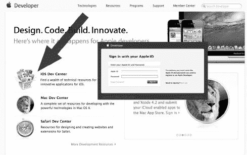

    图 1–11. 目前，请点击箭头所指的“iOS Dev Center”图标。稍后，你可能还想为 Mac 电脑或 Safari 网页浏览器编写应用。

    注意：趁此机会，我们来介绍另外两个下载选项。iOS 下方的图标适用于希望下载环境以在 Mac 上运行精彩程序的人。第三个也是最后一个图标适用于希望获得环境以在 Safari 网页浏览器内部运行应用的人。也许有一天，你会想将那个为你赚了数千美元的绝妙创意连接到 Safari。那么，这里就是你要去的地方。

7.  按照第 6 步所述，使用你的用户名和密码登录 iOS 开发中心后，你将看到一个如图 1-12 所示的屏幕。iOS 开发中心包含构建 iPhone 和 iPad 应用所需的所有工具。稍后你会在此花费时间，但目前我们只需前往最新版 iOS SDK 的开发者页面。找到箭头所指的“下载”图标并点击。你可能会发现这仅将你带到页面底部，如图 1-13 所示。无论你是滚动到底部还是点击此处，只需点击“下载 Xcode 4”按钮，即可进入 Xcode 4 和 iOS SDK 4.3 页面。

**注意：** 在我撰写本书时，`Xcode 4.2`和`iOS SDK 5`是最新版本。很有可能在你阅读本书时，这些版本号已经更大。这没有问题；只需继续执行第 8 步即可。如果万一出现什么意外情况，我们将在位于[`www.rorylewis.com/ipad_forum/`](http://www.rorylewis.com/ipad_forum/)或`bit.ly/oLVwpY`的论坛上以通俗易懂的英文进行讨论并为你解决。

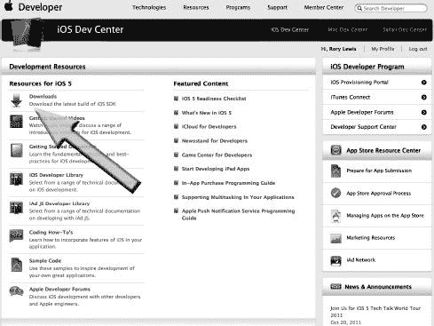

**图 1–12.** 这将带你到页面底部，如图 1–13 所示。

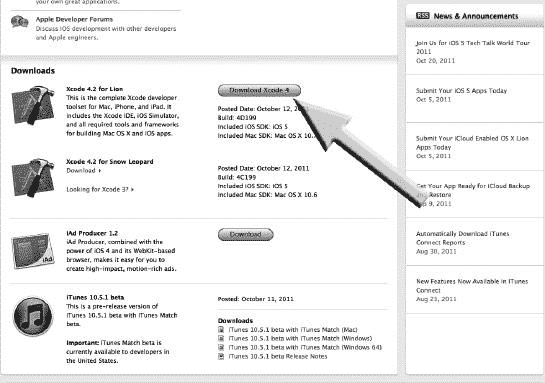

**图 1–13.** 点击“Download Xcode 4”按钮，这将带你进入 Xcode 4 开发者页面。

8. 我知道你可能在想：“天哪，我只想下载它！”请记住，Apple.com 上有成千上万的下载内容。这个页面（如图 1–14 所示）被称为 Xcode 4 开发者页面，其中包含所有相关的下载内容。目前，我们想点击最新版本。这些图示显示的是本书印刷时的最新版本。当你阅读本书时，它肯定会有所不同。现在，此处可用的最新版本是“Xcode 4.2 for Lion”，因此箭头指示的就是这个链接。此时界面看起来类似——点击它。

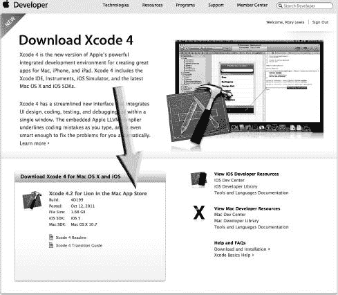

**图 1–14.** 点击“Xcode 4.2 for Lion in the Mac App Store”链接。

9. 你的下载将开始，根据你的连接速度，可能需要 2 到 15 分钟。你的屏幕应该看起来类似于图 1–15 所示。

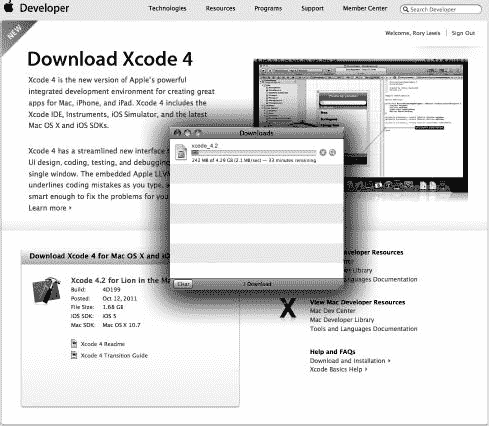

**图 1–15.** 等待下载完成。

10. 下载完成后，`Xcode`和`iOS SDK`驱动器图标将出现在你的桌面上，并且一个包含`Xcode and iOS SDK.mpkg`的窗口将出现，如图 1–16 所示。点击`Xcode and iOS SDK.mpkg`，如图 1–16 中箭头所示。

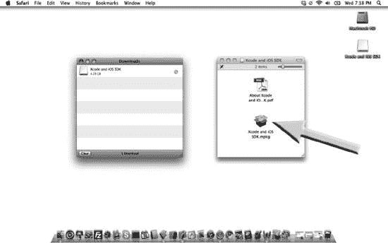

**图 1–16.** 点击“Xcode and iOS SDK.mpkg”图标。

11. 一旦你点击了`Xcode and iOS SDK.mpkg`图标，一个安全验证窗口将打开。点击“Continue”按钮，如图 1–17 中箭头所示。接下来，你将看到“Install Xcode and iOS SDK”窗口，如图 1–18 左侧图像所示。现在点击“Continue”，如箭头所示。几分钟后，安装将完成，你将看到一个“The Installation was Successful”窗口。点击“Close”按钮，如图 1–18 右侧图像中箭头所示。

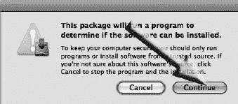

**图 1–17.** 安全验证窗口。点击“Continue”按钮。

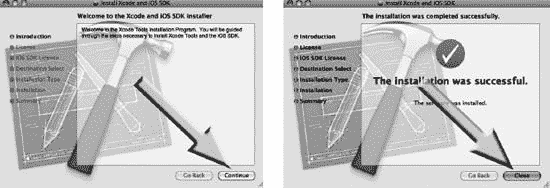

**图 1–18.** “Install Xcode and iOS SDK”窗口。点击“Continue”按钮。

12. 你现在下载的 Apple SDK 中包含了 Apple 的集成开发环境（IDE）。这个编程平台包含一套工具、子应用程序和样板代码，所有这些都使我们能够更轻松地完成工作。我们将大量使用`Xcode`、`Interface Builder`和`iPhone/iPad Simulator`，因此我建议你将这些图标添加到你的程序坞中（见图 1–19），如下面第 13 步所述。这将为你节省大量寻找它们的时间。

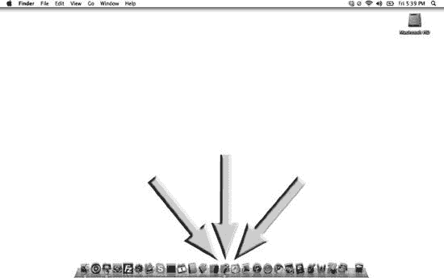

**图 1–19.** `Xcode`、`Interface Builder`和`iPhone/iPad Simulator`——加载完毕，准备就绪！

13. 通过选择`Macintosh HD` `Developer` `Applications` `Xcode.app`并将其拖到你的程序坞中，将`Xcode`添加到程序坞，如图 1–19 所示。同样地，通过选择`Macintosh HD` `Developer` `Applications` `Interface Builder.app`并拖动，将`Interface Builder`添加到程序坞。最后，通过选择`Macintosh HD` `Developer` `Platforms` `iPhone/iPad Simulator Platform`并拖动，将`iPhone/iPad Simulator`添加到程序坞。我将它们一起放在程序坞的中央，如图 1–19 所示。

**注意：** 每当我提到“iPhone”或“iPad”时，我指的是任何 iPhone 或 iPad OS 设备。这包括`iPod touch`。此外，当我提到`Macintosh HD`时，你的硬盘可能被命名为其他名称。

### 我不会教你什么

现在你已经安装好`Xcode`、`Interface Builder`和`iPhone/iPad Simulator`工具并可以轻松访问，你已经准备就绪。但是等等！你需要知道我们要去哪里。

不过，首先让我说说我们不会涉及的地方——我不会涵盖的内容。我不会试图教你每一行代码是如何工作的。相反，我将采用一种子系统的方法，指出哪些代码片段或部分将在哪些情况下为你服务。

虽然本书旨在让你（读者和程序员）获得全面的理解和能力，但我们将在分子层面而非原子或亚原子粒子层面进行探讨。重点将是如何识别代码的一般属性、行为和关系，这样你就不必陷入逐字逐句的细节中。我将带你达到一个境界，在那里你可以选择你可能想要专精的领域。

### 计算机科学：一片广阔而多元的天地

打个比方：假设 iPhone/iPad 是一辆汽车。我们大多数人使用电脑的方式，就像开车一样。正如我如果教你开车，不会试图让你了解每个零件的工作原理一样，我也不会——也绝不会——把基础计算机工程学作为学习 iPhone 和 iPad 编程的第一步。

即便是每天修车的优秀技师，也鲜少了解现代内燃机背后的基础物理和电子学原理，更不用说所有辅助系统了。他们会开车，能诊断出车辆需要维修时的故障，并能借助工具和机器（包括电脑）进行最佳修复和调试。同理，为 iPhone 和 iPad 开发应用的聪明程序员，也极少了解 Apple 平台底层的核心代码和电路板设计。尽管如此，他们能使用这些设备，能在广阔的应用需求领域中构想出新的细分市场，并能利用桌面和笔记本电脑上的工具与应用，来设计、编码，并将他们的想法推向市场。

继续用这个类比，为 iPhone 或 iPad 编程就像摆弄你的汽车引擎——对其进行定制，让它做你想做的事。苹果公司设计了一款和 V8 发动机一样令人赞叹的计算引擎。苹果公司还提供了一个相当酷的“底盘”，我们可以在上面改装和重建我们的计算引擎。然而，我们在“改装”iPhone/iPad 这辆“汽车”时会受到一些限制。对于从未改装过汽车的朋友，我将演示如何在遵守这些限制的同时，最大化发挥创意。

我会带你了解，如何在不涉及过多细节的情况下，更换机油滤清器、轮胎、座椅和车窗，把你的车变成一辆越野车、一辆 hot rod 改装车、一辆赛车，或一辆能带我们穿越丛林的车。当你掌握了本书的内容，你就会知道如何专注于并改进汽车的引擎、变速箱、转向系统、动力传动系统、燃油效率或立体声音响。

### 为什么 Objective-C 中存在“炼狱”

我的假设是：你从未修过车，手上从未沾过油污，并且你想改装一辆世界上最强大的汽车——它拥有一台复杂的 V8 发动机。我会精确地向你展示如何做到这一点，而且这个过程会很有趣！

首先，你需要稍微了解一下，我们是如何拥有这台装有 V8 发动机的改装车——也就是 iPad 的。1971 年，史蒂夫·乔布斯和史蒂夫·沃兹尼亚克相识，五年后他们创立了苹果公司，生产了首批商业上成功的个人电脑之一。1979 年，乔布斯访问了施乐 PARC（帕洛阿尔托研究中心），并将施乐 Alto 的特性应用到他们的新项目——后来被称为 Lisa 的电脑中。虽然 Alto 不是商业产品，但它是第一台使用桌面隐喻和图形用户界面（GUI）的个人电脑。Lisa 是第一款配备鼠标和 GUI 的苹果产品。

1985 年初，乔布斯在与苹果公司董事会的权力斗争中落败，从公司辞职，并创立了 `NeXT`，该公司最终于 1997 年被苹果收购。在 `NeXT` 期间，乔布斯改变了麦金塔电脑（Mac）上的一些关键代码特性，使其使用一种新的语言——一种非常严谨但又优美的语言，叫做 `Objective-C`。这种语言的优势在于它能高效地使用对象。与其重写应用程序某一部分中已经用过的代码，`Objective-C` 重复利用了这些对象。当时乔布斯的思维高速运转，这段非凡的代码将 `Objective-C` 这门新语言推向了新的高度。他的灵感通过创造出我们称之为 `Cocoa` 的元语言，融入了 Mac 的内核。元语言是用来分析或定义另一种语言的语言。正如我提到的，`Objective-C` 是一门非常难掌握的野兽，你可以把 `Cocoa` 看作是驯服这头野兽的语言工具，或者至少是把这头野兽关进笼子。

作为一个编程世界的“绝对新手”，不能指望你关注编程语言区别的细微之处。我在这里只是给你一个概述，让你对这段历史有个大致了解，从而为你自己的学习经历提供一个背景。我在这里想说的重点是，`Objective-C` 和 `Cocoa` 是非常强大的工具，它们都与 iPhone/iPad 的编程息息相关。

### 休斯顿，我们遇到麻烦了

这正是吸引我并促使我设计原始课程的核心挑战。如何教会像你一样的非工程专业学生，那些即使是顶尖工程专业学生都觉得困难的东西？在大学层面，我们通常让学生先上编程入门课，然后学习面向对象编程入门，比如 `C#` 或 `C++`。

即便如此，我们还是准备一头扎进 `Objective-C` 的世界！有时，我会给你蒙上眼罩；有时，我会为你缓冲冲击。有时，你可能需要重读几页书或回放几遍视频示例——这样才能让你透彻理解一个困难的概念。

### 我们将如何不时地探访“炼狱”

在我的课程中，有些特定的地方，我知道一半学生会立刻理解，四分之一的学生需要下点功夫才能学会，而剩下的四分之一则会挣扎并最终放弃。这第三类学生通常会转出工程专业，选择更简单的课程。我知道这些“难点”在哪里，但我不会告诉你。我重复一遍，我不会告诉你。

别担心，我不会让你去捅马蜂窝（指 `Objective-C` 的各种复杂问题），然后被蜇得遍体鳞伤。我也不会特意标出那些你可能觉得困难的概念。我现在不打算解释这一点。请接受它！只要你放松心情，跟着我的引导走，你就能出色地学完这本书。

当你真的遇到困难时，请坚持下去。你可以随时重读相关章节，回放视频示例，或者——最重要的是——去访问论坛，那里有很多人，包括我自己，经常会在线并准备立即帮助你。我们可能会把你引荐给其他人的解决方案，或者直接帮助你。所以，去论坛和大家打个招呼，沉浸其中，先去寻求他人的帮助，然后再回来帮助别人。论坛地址是：[`www.rorylewis.com/ipad_forum/`](http://www.rorylewis.com/ipad_forum/) 或 `bit.ly/oLVwpY`。参见 图 1-20。

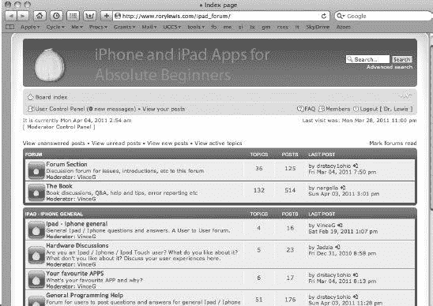

图 1-20. 遇到困难时，访问论坛可以获取帮助。

### 展望未来……《Beginning iPhone 4 Development: Exploring the iPhone SDK》

今后，你们中有些人可能想继续 iPhone 和 iPad 编程的冒险，去读 Dave Mark 和 Jeff Lamarche 的书《Beginning iPhone 4 Development: Exploring the iPhone SDK》（Apress, 2009 年出版）。还记得那个关于成为一辆装有 V8 发动机的汽车机械师的类比吗？他们的书假设读者知道什么是化油器，什么是活塞，并且他们能在朋友改装的轮子上安装赛车轮胎和超级轮毂。

换句话说，他们假设你理解面向对象编程的基础知识：你知道什么是对象、循环和变量，并且你熟悉 `Objective-C` 编程语言。

另一方面，我假设你，例如，不知道什么是“类”，什么是“成员”或“void”。我假设你完全不了解 iPhone/iPad 上的内存管理是如何工作的，而且，在此之前，你从未有兴趣去理解数组或 `SDK`。

#### 学习内容

我发现，当学生们开始一门具有挑战性的课程时，让他们相对轻松地创造出真正酷炫的东西，往往会产生神奇的效果。在此过程的每个阶段，我通常会展示一个示例，让你能够立即阅读、观察并消化。稍后，我们会回过头来剖析一些早期步骤，并进行更详细的探讨。我会解释我们如何在第一次执行某些任务或操作时，甚至自己都没意识到就已经完成了。然后，通过对比第一次执行与后续的修改，你将学会如何在这里或那里对程序进行微调。这样一来，你就能始终保持在正轨上——充满动力和灵感，去吸收下一批新的技巧、经验和方法。

##### 创建酷炫古怪的应用：我为什么这样教

你听说过我们如何最好地记住事物的说法：实践优于观察，观察优于听闻，以此类推。嗯，我知道学生们喜欢幽默——而且你猜怎么着！我们对有趣的故事和课程的记忆，远比对枯燥无聊的内容要深刻得多。我发现，无一例外，当学生们处理有趣又古怪的代码时，他们往往会花更多的时间去解决它。

我们在解决问题上投入的脑力越多，大脑中建立的神经连接就越多。我们连接的神经元越多，就记得越牢，而且最重要的是——就越不容易在无效的方法上浪费时间。

我们在某个特定主题上花费的时间越多，你就越有可能对解决某个项目的方法是否正确产生直觉。因此，随着学习的推进，请注意，我是在运用幽默，让你在不耗费任何刻意努力的情况下，将计算机科学和 Objective-C 的概念与方法烙印在你的脑海中。

我的学生们在收到困难的课后作业后联系我，这是常有的事。首先，他们会发一条推文问我是否可以 Skype 沟通。有一个晚上，我正和一位同事下棋，收到一条推文问我是否有空。“当然有空，”我回复道。我提醒我那位也在北卡罗来纳大学任教的同事，他认识的学生们马上要出现在 Skype 上了。当他们呼叫进来时，果不其然，是我四位电气工程专业的学生，他们睁大眼睛，面带微笑。“嘿，刘易斯博士，我们终于搞定了，但是，老兄！你最后布置的那个方法……”

当我们结束通话，我关上 Mac 时，已经是凌晨 12 点 30 分了。我的同事问道：“罗里，我从没在这么晚给教授打过电话——更别提半夜了！他们难道不应该在办公时间来问这些问题吗？！”他可能说得对，但我想了一分钟后回答说：“我只是很高兴他们正在完成我布置的古怪作业！”当我们摆好下一盘棋时，他咕哝着说我可能适合待在精神病院了。

关键在于，我希望你能读完这本书。我希望你能完成所有的示例，并在完成每项任务时感受到欣喜若狂！我竭尽全力让这本书变得有趣。如果你选择去思考书中包含的思想，这本书将改变你的生活！

顺便说一句，成功掌握这些课程将让你成为一名认证极客。你周围的每个人都会感受到你日益增长的能力，并目睹你的转变；因此，他们会来找你，请你为他们编写应用。

##### 向你的祖母传道授业… 你编写的东西至关重要！

重要的是，不要让复杂的代码把你搞得晕头转向。就在两分钟前，一个学生走进我的办公室——他困惑到甚至无法告诉我他到底哪里不明白。他含糊地说：“我的二阶数组内联时运行得很好，但作为类或方法就不行。”我说：“不，那太复杂了！这里有个更简单的说法……”

我描述了他是如何有一长串的“东西”从一端进去，从另一端出来——而且效果很好。但是，当他把它放进一个方法时，他看不到那一长串东西的开头；当他把它放进一个类时，他连任何“东西”都看不到了！”

“哇！我知道我哪里做错了，刘易斯博士。谢谢！”现在，在我打字的时候，他正在向昨天进来并试图问同样问题的两个哥们解释。别担心。引发这些问题的困惑——比如“类”和“方法”以及其他编码实体的区别——将在本书后面部分得到解释。一切都会在合适的时候明白！

如果你能脚踏实地，把复杂的事情转化为简单的想法，那么你就能记住它们——并掌握它们。理解了这个概念，你就能把你天马行空的想法转化为代码——谁知道这会带你走向何方！这就是我如此坚定地要传授给你这种能力的原因——将你祖母想做的事情，转化为 iPhone 和 iPad 的编程语言。

### 这一切是如何运作的？

在第 2 章开始我们的第一个程序之前，至关重要的是你能退一步，了解我们之前的位置、现在的位置以及下一步的方向。换句话说，你可能会问自己：如何将我针对 iPhone 或 iPad 应用的创新想法转化为口袋里的钱？这是如何运作的？它真的有效吗，还是那些靠 iPhone 和 iPad 应用赚得盆满钵满的疯狂故事都是假的？

那么，这些“应用变财富”的故事是真的吗？这很容易回答。截至 2011 年 3 月 2 日，当史蒂夫·乔布斯发布 iPad 2 时，他宣布苹果已累计向开发者支付了 20 亿美元，用于在 App Store 中销售的应用（参见图 1–23, #9）。请注意，仅在八个月前，苹果曾宣布自 2008 年 7 月 App Store 推出以来，已向 iPhone 和 iPad 应用开发者支付了 10 亿美元。

从未有过如此巨额的 20 亿美元支付给程序员。你正步入计算机与技术领域一个蓬勃发展的史诗级事件。阅读本书并学习如何编写应用将改变你的人生。在这个后 PC 时代的新纪元，苹果独自创造了一个前所未有的环境，让开发者能够充分利用这些更个性化、更强大的机器。你即将加入的这个充满活力的程序员社区，已帮助苹果的应用数量突破了 35 万。但你可能仍会问：这到底是如何运作的？

我绘制了一张创新流程的地图，你需要理解它，才能清楚本书将带你走向何方。请看图 1–21，我希望你首先看看……呃……你！是的，那就是你，在#1 的位置，坐在#11 所代表的一袋钱旁边，这是 12 个步骤中的第 11 步。从#1 开始，也就是你带着绝妙的创新想法，将你的想法带到#2，#2 代表你 Mac 上的 OSX。打开 Mac 后，你便访问了 SDK (#3)，它包含了 iPhone/iPad 模拟器 (#4)、界面构建器 (#5) 和 Xcode (#6)，所有这些都位于代表 iOS SDK 一部分的灰色条带上。这些项目 (#4 到#6) 将在后面详细解释；本书 90%的内容都与这个条带上的项目有关。这里唯一没有涉及的是如何通过使用 Objective-C 编程将你的想法转化为代码。

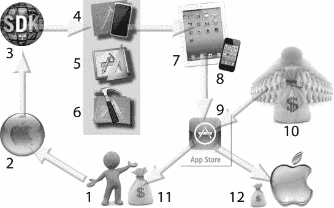

**图 1–21.** iPhone 和 iPad 应用编程全景图

**注意：** 在图 1–21 中，灰色框内包含界面构建器 (#5)，从技术上讲，它本不应存在于这些最新版本的 Xcode 中。问题是它仍然存在，只是隐藏在后台，而且我们在故事板（第 7 章及以后）中仍在广泛使用它。所以，要知道有人会说界面构建器已经消失了（他们错了），我们也不再用它了（又错了。我们在第 7 章之后仍然在使用）。这个区域的左边是你已经走过的路：请记住，你有一台 2006 年后购买的、运行 Mac OS X 10.7.2 或更高版本的 Mac，并且我们刚刚完成了下载 iPhone 和 iPad SDK (#3) 的过程（图 1–6 至 1–20）。我们还将 iPhone/iPad 模拟器 (#4)、界面构建器 (#5) 和 Xcode (#6) 提取出来，并放置到了你的程序坞中（图 1–12）。

在第 2 章中，我们将开始使用 Xcode (#6)、界面构建器 (#5) 和 iPhone/iPad 模拟器，将你变成一个货真价实的极客！在这种极客状态下，你将能够在真实的 iPad (#7) 和真实的 iPhone (#8) 上测试你的应用。一旦你确认你的代码运行得非常棒（这是我创造的极客用语），你就会将应用上传到 App Store (#9)，在那里，有钱的人 (#10) 会通过向 App Store 付费来下载你的应用。App Store 收到的款项会被分成两部分，其中三分之二归你，三分之一归苹果。

我们将运行创建的所有程序，将它们编译到一个或多个可能的位置——这些位置的图标位于中央灰色区域的右侧。主要位置将是 iPhone/iPad 模拟器。次要位置将是你的本地 iPhone 和/或本地 iPad。最后，我们可以使用`iTunes`将你的 iPhone 和/或 iPad 应用上传到 App Store，供人们购买或免费下载。这就是我们的目标。

图 1–21 中的两个核心对象，正如你现在所知，将是我们在本书中花费绝大部分时间的地方。我们将使用 Xcode 来输入代码，就像真正的极客那样。我会教你如何操控它的所有功能，例如文件管理、编译、调试和错误报告。界面构建器是苹果提供的一种很酷的方式，允许我们将对象拖放到我们的 iPhone/iPad 应用中。例如，如果你想要一个按钮，只需简单地将它拖放到虚拟 iPhone 或 iPad 上你希望它出现的位置。

本质上，我们将使用 Xcode 来管理、编写、运行和调试你的应用——以创建内容和功能。我们将使用界面构建器将项目拖放到你的界面上，直到它看起来像你构想中的那个色彩鲜艳且炫酷的应用——赋予它符合你艺术审美的样式、外观和感觉。

当我们把所有界面组件与在 Xcode 中编写的代码整合之后，我们可能会进一步操作，调整与内存管理和效率相关的参数。但这在我们的故事中跳得太远了。

### 我们的路线图：使用 Xcode 和界面构建器

很多时候，编程书籍的作者都会做同样老套的事情。首先，他们呈现一个非常简单的、随处可见的“Hello World”应用，然后立刻用密集的代码“轰炸”用户，导致大量读者和学生直接放弃。在使用 Objective-C（在 Cocoa 中运行）以及 iPhone 和 iPad SDK 的过程中，我不得不真正重新思考这个入门过程。我在这里确定了四个挑战：

*   教你“Hello World”，然后马上进入高级技术和 API 会适得其反。
*   从众多在 iPhone 或 iPad 上向世界说 Hello 的方式中随机选择一种是没有意义的。它们之后都将是你工具箱中必需的工具。
*   试图用 Objective-C 编写一个简单的“Hello World”应用，对初学者来说过于复杂，除非我们将这个过程分解为多个阶段或层次。
*   决定如何循序渐进，让你感到舒适，熟悉术语和流程，然后再进入故事板及其他更高级的概念。

我解决这些问题的方法很简单。我会向你展示如何从你的 iPhone/iPad 上，不是以一种、两种，而是以相当多的不同方式向世界说 Hello。每一次，我们都会更深入一点，而且我们会在这个过程中玩得很开心。

每当你踏上通往 Xcode 世界的道路时，你都会被立即问到想驾驶哪种类型的车辆。一辆吉普车？一辆赛车？一辆敞篷车？通过专注于基础知识，我将向你展示如何在 Xcode 中“驾驶”。此处的目标是，无论我们使用何种风格的“车辆”，都能获得胜任感和自信心。那么，让我们来看看这些不同的“车辆”究竟能提供些什么。在这里，我希望你跟着我一起看。

### 准备你的第一个 iPhone/iPad 项目

假设你已经下载了 SDK 并安装了 Interface Builder、`Xcode` 和 iPhone/iPad 模拟器，打开你的 Mac，点击 Dock 上的 `Xcode` 图标。你的屏幕应该会类似于图 1-22。会弹出“欢迎使用 Xcode”窗口；其中包含了所有 iPhone 和 iPad 的资源。

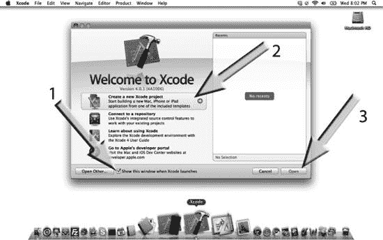

图 1-22\. 点击 `Xcode` 图标后，你将看到“欢迎使用 Xcode”屏幕。

如箭头 1 所示，请确保你勾选了“启动 Xcode 时显示此窗口”选项。你会在这里找到许多日后会用到的宝贵资源。我建议你在完成第 4 章后，花点时间探索这些资源——可以说，给它们做个测试。这样做将为你打开各种创意之门。

在不实际创建新项目的情况下，让我们先到展示厅看看我们可能会用到的某些模型。要在 Xcode 中打开一个新项目，请点击 `Xcode` 图标。当它打开后，你可以做两件事之一：要么点击图 1-22 中箭头 2 指示的位置，然后点击箭头 3 指示的位置；要么同时按下 `Command + Shift + N` ( N)。这将打开一个新窗口，展示你可以在 Xcode 领域中使用的不同类型的“车辆”。

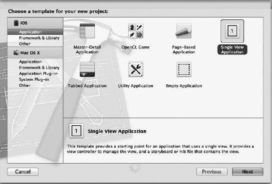

图 1-23\. 展示你可以在 Xcode 领域中使用的不同类型“车辆”的新窗口。

图 1-23 显示了七种车型：主从应用程序、OpenGL 游戏、基于页面的应用程序、单视图应用程序、标签栏应用程序、工具应用程序和空应用程序。

早期，我们在 Xcode 中的大部分旅程将使用后两种风格之一。转回计算机术语，基于视图的应用程序和基于窗口的应用程序是我们在 iPhone/iPad 基本开发周期中将要使用的结构。正是在这里，我们将接触到各种酷炫的小工具和组件。

别担心：我没有忘记我们创建一个简单的“Hello World”应用程序的目标。我们将在使用这六个选项中的几个时向世界问好，并且你将熟悉每一个。在我们开车之前，让我们确保钥匙能在点火开关里转动——或者用计算机术语来说，让我们检查一下 iOS 能否编译一个空白文档并启动 iPhone/iPad 模拟器。点击单视图应用程序，如图 1-23 所示。看着你的屏幕，你应该会看到与图 1-24 非常相似的内容。首先，如箭头 1 所示，将其命名为"test"，然后确保你如箭头 2 所示选择了 iPhone，接着点击箭头 3 所示的"下一步"按钮。

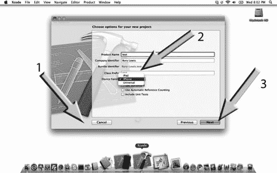

图 1-24\. 我们来一次试驾。

如果你的程序没有默认保存到桌面，那么请导航到你的桌面，然后点击"创建"按钮，如图 1-25 所示。

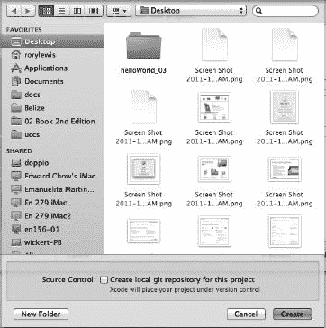

图 1-25\. 导航到你的桌面并创建你的测试应用。

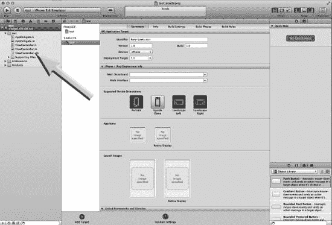

图 1-26\. 初始的集成开发环境（IDE）屏幕。

图 1-26 显示了 Xcode 4 集成开发环境（IDE）的初始视图。我们现在不会纠缠于解释所有东西。我只希望你做的是，点击任何一个以"`.h`"或"`.m`"结尾的文件。现在，点击 `testViewController.h` 文件，如图 1-26 中的箭头所示。这将调出图 1-27 所示的屏幕，我希望你通过点击箭头所示的"运行"按钮来运行你的空白应用。哦耶！iPhone/iPad 模拟器中的 iPhone 弹了出来，如图 1-28 所示。恭喜你！你已经加载了 Xcode 并进行了试驾。是时候意识到你即将踏入一个全新的世界了。

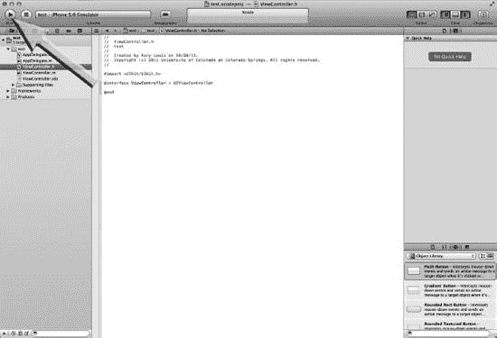

图 1-27\. 运行它！

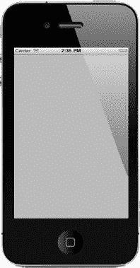

图 1-28\. 你的第一次试驾。

### 配套的截屏视频

本书中显示的所有图片都是在编写代码时从我的屏幕上截取的——来自一个截屏视频。例如，第 2 章中的 `helloWorld_001` 示例位于 [`www.rorylewis.com/docs/02_iPad_iPhone/06_iphone_Movies/002_helloWorld_002.htm`](http://www.rorylewis.com/docs/02_iPad_iPhone/06_iphone_Movies/002_helloWorld_002.htm) 或 `bit.ly/quO4ow`。

不必观看上述截屏视频，因为我已经在第 2 章中包含了所有说明。不过，我听到学生们说，重温他们在课上学到的东西很有趣。这些视频示例往往相当紧凑。如果你想跟着截屏视频一起学习，请注意以下建议：

- 当我的进度超过你时，请暂停视频。倒回去，跟上我的节奏。
- 在你能够完整地完成项目后，将截屏视频保存到另一个文件夹。然后，以更少的暂停次数再操作一遍，直到你能够掌握它……并编译它。
- 对于你们中有竞争意识的人，或许目标就是能跟我同步执行代码。不过，总的来说，我希望你们能对高级编程感到良好和舒适。为书中的所有示例练习这个做法，对你们会有好处。

### 配套的 PDF 文件

我还提供了我在科罗拉多大学给学生上课时使用的 Keynote 幻灯片的 PDF 版本。这些 PDF 文件——不是必须的，仅仅是补充材料——展示了本章的所有幻灯片。对于那些希望深入探讨本书未涉及主题的人，我们也提供了链接。

注意：你可以在 [`www.apress.com`](http://www.apress.com) 网站获取视频和补充材料。

### 假装不知：去混淆的艺术

在我们正式开始之前，我想重申，我将向你展示如何在只了解基本知识的情况下进行编程。随着我们的深入，我会更深入地解释一些概念。但是，我只有在让你掌握了简单概念之后才会这样做。这是一种新的教学方式，并且我已经取得了巨大的成功。

你可能会觉得我完全疯了，但我还是请求你按照我的指示去做。如果你有一个我似乎没有回答的问题，请相信我，这个问题在当时并不重要。我们会在以后解决它！

### 如何逐步推进学习

本书内容全面，自成一体。尽管我为书中的练习提供了视频教程，但您完全不需要依赖它们。即使没有网络连接，仅凭本书，您也能找到所需的一切。

现在，既然您已经完成了系统参数检查、注册成为苹果官方开发者、下载了 SDK、提取了必备工具并配置了程序坞，那么是时候进入第 2 章来编写一些代码了。

#### 一个小练习

> 看图 1–28，在测试运行中，我们最终在 iPhone/iPad 模拟器中看到了一个 iPhone 弹了出来。那么 iPad 呢？这正是我希望您自己尝试的部分。看看您是否能让 iPad 出现在 iPhone/iPad 模拟器中，如图 1–29 所示。线索可以在图 1–24 和图 1–29 中找到，在 test 文件夹下，有一个名为 `test 2` 的全新文件夹。

> 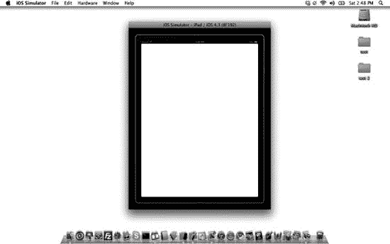

> 图 1–29. iPhone/iPad 模拟器中的 iPad2。

