# 第 2 章

## 启动！

正如第 1 章所述，我们将尝试的第一个程序是一个基础且通用的“Hello World”应用程序。本章“启动”恰恰模拟了我在教学实践中发现，在讲授这门课程时非常有效的课堂方式。我使用这个简单、无害、良性的“Hello World 应用”作为基础，向学生介绍他们未来会反复使用的最关键的技能组合。就像我自己的学生一样，当您完成第 2 章的学习时，你将知道如何以以下各节所述的 3 种不同方式运行您的第一个应用程序：

> 2.1. iPhone 模拟器。
> 
> 2.2. 运行于您 iPhone 环境下的 iPad 模拟器（伪 iPad）。
> 
> 2.3. iPad 模拟器。

在我的讲座中，我想通过不断创建应用程序来保持肾上腺素激增，并体验那种征服世界的极客快感。因此，我将 §2.4 至 2.6 留到周六的特殊课程，供那些想要创建自己的应用商店并赚钱的学生选修。同样，对于您，读者，我建议您只完成 §2.1 至 2.3 部分，然后直接进入第 3 章，这样可以保持学习的连贯性。我们使用这组新工具的第一次冒险，将是在 Xcode 中基于视图的应用程序模板下向世界说声“Hello”。之后，我们将基于导航的应用程序模板，先以非常基础的方式，然后进行一些修改，再次向世界说声“Hello”。

除了本书中呈现的信息（包括各种截图）之外，我还为您提供了我自己逐一讲解本书每个示例的屏幕录像。相关的下载资源将帮助您完成本书的学习，此外还有课堂笔记、第三方资源以及相关的 YouTube 视频——所有这些都可以通过点击位于页面中央顶部的蓝色 Xcode 4 图标访问，网址为：[`www.rorylewis.com`](http://www.rorylewis.com)。

### 在 iPhone 模拟器上运行您的应用

在第一个示例中，我们将点击一个按钮，按钮上方将显示“Hello World”文本。

> 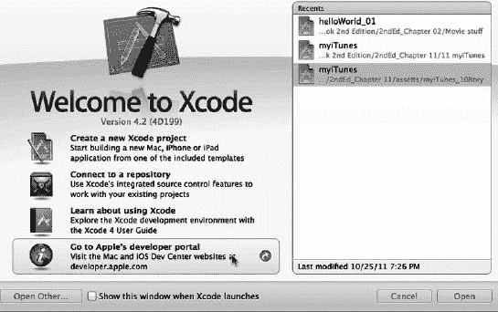

图 2–1. 点击 Dock 中的 Xcode 图标打开它。您将看到“欢迎使用 Xcode”窗口，如第 1 章所述。

1.  在打开 Xcode 之前，首先关闭所有已打开的程序，以便优化处理能力，将全部注意力集中在新内容上。按下 Command + Tab ()，然后按下 Command + Q ( Q) 关闭所有程序，直到屏幕上只剩下 Finder。找到并点击 Dock 中的 Xcode 图标将其打开。您将看到第 1 章中讨论过的 Xcode“欢迎”屏幕。参见图 2–1。 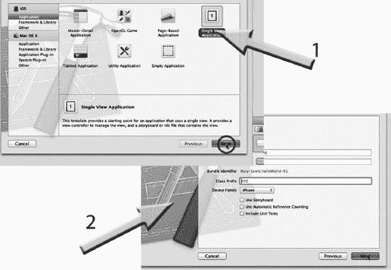

图 2–2. 将其命名为 `hello_World_01`，并使用您的姓名或公司名称作为公司标识符。对于设备，选择 iPhone。

2.  现在在 Xcode 中打开一个新项目。实现此操作的两种方法是使用键盘快捷键或点击鼠标。我强烈建议您使用键盘快捷键。这将节省您的时间，并让您感觉像个专业人士。请注意，如果您使用鼠标来执行可以通过快捷键完成的操，那将是阻碍您成为 iPhone 和 iPad 应用开发者的最快方式。使用键盘，同时按下 Command + Shift + N。这三个按键组合在图 2–1 中显示为 `N`。（如果您使用鼠标打开新项目，则可以选择“创建一个新的 Xcode 项目”。）选择“基于视图的应用程序”，然后按下 Return 键 ()。将其命名为 `helloWorld_01`，输入您的姓名，并选择 iPhone，如图 2–2 所示。

> **注意：** 我的“基于视图的应用程序”模板图标默认是高亮显示的；您的可能不是。无论如何，点击它，然后将新项目保存到您的桌面，命名为 `helloWorld_01`。

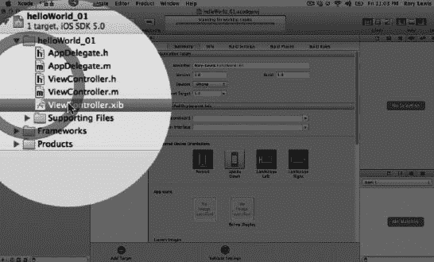

图 2–3. 点击 `helloWorld_01 ViewController.xib` 以打开 Interface Builder。

3.  一旦您将项目保存到桌面，Xcode 便会实例化 `helloWorld_01` 项目环境，窗口顶部会显示项目名称（参见图 2–3）。如果这看起来有点吓人，请保持冷静……别慌！这是苹果公司用来组织您最终将用于编写复杂应用的所有好东西的方式。目前，请跟着做，并尽量搁置您可能产生的所有疑问。Xcode 已经创建了 6 个文件：
    - 2 个类，每个包含两个文件（一个头文件（`.h`）和一个实现文件（`.m`））。其中两个以 `Appdelegate` 结尾，另外两个以 `ViewController` 结尾。我们稍后会回到这一点。现在只需知道：每个“类”由两个文件组成：一个头文件和一个实现文件。
    - 2 个 nib 文件（`.xib`）。现在先不要问自己“nib”是什么意思。只需打开可以可视化程序界面的那个文件。到时候，您会对 nib 文件有充分了解的。

如图 2–3 所示，双击打开位于米黄色 `helloWorld_01` 文件夹中的 `helloWorld_01ViewController.xib`（发音为“nib”）文件。该文件夹位于 Xcode 环境导航区域左上角的蓝色 Xcode 文件夹内。


**注意：** 你的导航窗格（即图 2-3 中高亮圆圈内显示的文件夹）有极小的可能处于关闭状态。这不成问题。要打开你的工具区域（包含检查器和库），请前往工作区窗口的左上角。使用工具栏中的`View Selector`来打开或关闭导航器、调试区和工具区域。你可能还需要再次选择“运行”按钮正下方的黑色文件夹图标（即项目导航器），它看起来像 iTunes 中的“播放”按钮。

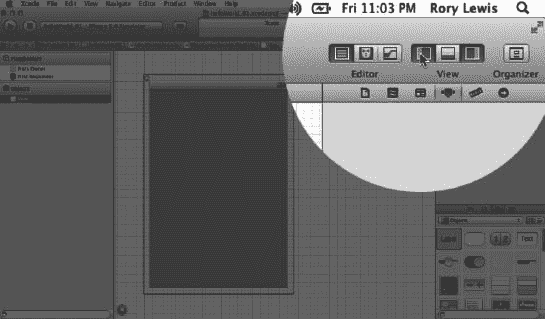

**图 2-4.** 点击`View Selector`中的`Utilities Icon`以打开`Utilities Pane`。

4.  我们需要打开位于工作区窗口右侧的工具区域（见图 2-4），该区域包含检查器和库。导航至包含 3 个图标的`View Selector`，并选择最右侧的`Utilities Icon`图标。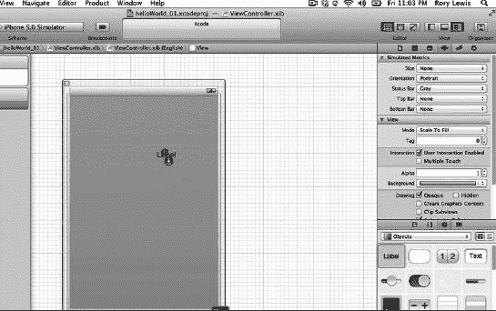

**图 2-5.** 将一个标签拖到画布上。删除其文本并将其内容居中。

5.  我们现在需要从库中拖一些好东西到画布上。不过，我们先想想我们要做什么。我们将要点击一个按钮，按钮上方会显示“Hello World!”文本。因此，我们需要一个可以点击的东西；那将是一个按钮，并且我们需要一个包含“Hello World!”文本的标签。简单！首先，将一个标签拖到你的画布上，如图 2-5 所示。将其移动到适合你的高度，然后水平移动它，直到出现蓝色中心线。此时，松开它，它就会漂亮地居中在画布中央。现在，这个标签最终将包含文本“Hello World!”，所以将标签侧面的手柄向右和向左拖动，使其稍微变大，大小大约与图 2-5 中所示相同。现在转到`Text`框，删除文本标签使其空白，如图 2-5 所示。最后，仍然看图 2-5，注意我的箭头是如何悬停在“居中文本”图标上的。同样地点击它，这样当你的“Hello World!”文本出现在标签中时，它将在居中的标签内部很好地居中。太好了。现在我们来处理按钮。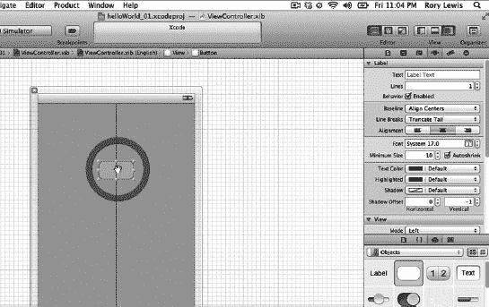

**图 2-6.** 将一个按钮拖到画布上。

6.  拖出一个按钮并将其放在文本下方，左右移动它直到中心线告诉你它已居中。此时松开它，如图 2-6 所示。立即双击它并输入文本“Press Me”（见图 2-7）。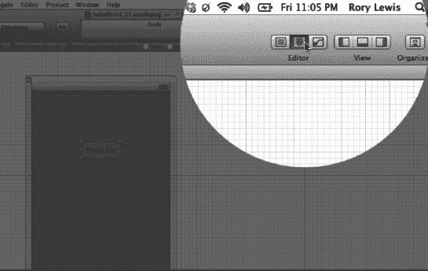

**图 2-7.** 关闭`Utilities`文件夹，保存你的工作，并打开`Assistant`，如箭头所示。

7.  我们已经完成了两个项目到画布上的加载，所以再次转到`Utilities Folder`并通过点击它将其关闭，如图 2-7 所示。既然你已经完成了这个文件，你可能还想使用快捷键`Command + S`（`S`）来保存它。这是首选的保存方式——而不是使用鼠标。现在我们需要在`Editor Selector`中打开`Assistant`，它位于`View Selector`的左侧。如图 2-7 中的箭头所示。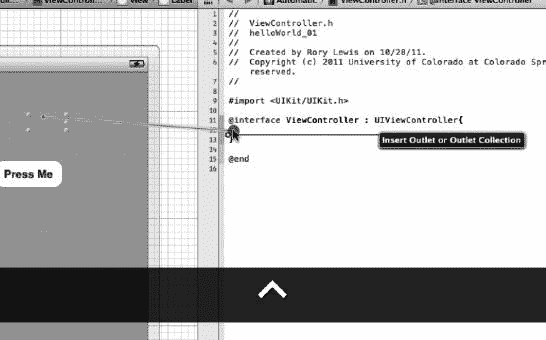

**图 2-8.** 从你的标签进行`Control`-拖动以创建一个`Outlet`。

8.  对于那些在 Xcode 4 发布之前涉足过 Xcode 的读者来说，下一部分是与 Xcode 所有先前版本最根本、最酷的背离。对于新手来说，请不要多想；让我们在无知的幸福中继续前进。我们将在第 8 步中做一些新的操作，称为`Open URL`上下文菜单。我们想要告诉标签在按下按钮时打印出显示“Hello World!”的文本。我们称这些东西为“`outlet`”，以前我们必须从头开始编写代码。然而，在 Xcode 4 中，我们的屏幕右侧有源代码，中间是图形构建器，我们可以简单地通过`Control`-拖动（按住`Control`键并拖动鼠标）来创建连接。首先，在`UIViewController`后面添加大括号，然后按回车键，这样它会创建结束括号和一些空间。现在，点击画布上的标签，然后从你的标签按住`Control`键拖动到`@interface`方法的两个大括号之间的任意位置，如图 2-8 所示（我们在这里的头部文件中）。一旦出现黑色标签显示`Insert Outlet`，松开鼠标。

**注意：** `Assistant`使用一个拆分窗格编辑器，这是 Xcode 4 许多炫酷功能出现的地方。请记住，你可以通过`Option`-点击项目导航器或符号导航器窗格中的文件来自动打开`Assistant`。

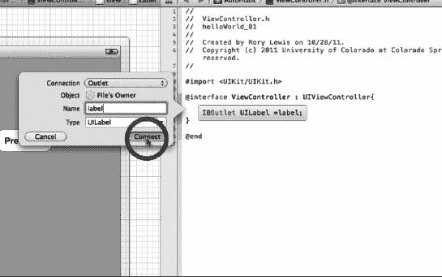

**图 2-9.** 使`IBOutlet`成为一个标签。

9.  如第 8 步所述，我们希望连接类型是`Outlet`——苹果公司的人认为你可能需要这个——所以默认情况下，它会显示出来，我们保持其选中状态。现在不用担心`Object`和`File's Owner`。你可以随意命名标签，但现在，像我一样将其命名为`label`（见图 2-9），这样如果你将你的代码与我的视频、本书中的图片或从我网站下载的代码进行比较，你的代码看起来会和我的相同。现在也先不用担心`UILabel`。现在按回车键（），你会看到代码`IBOutlet UILabel *label;`神奇地出现了。你可以在下面的文本中看到它被高亮显示。我们将在本章末尾的“深入代码”部分详细讨论这一点。现在，让我们继续。

```
#import <UIKit/UIKit.h>
@interface helloWorld_01ViewController : UIViewController {
    IBOutlet UILabel *label;
}
@end
```

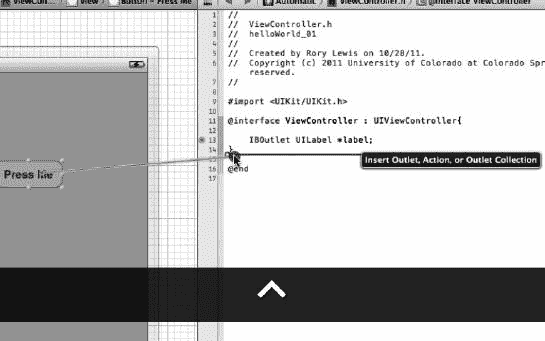

**图 2-10.** 从你的按钮进行`Control`-拖动以创建一个`Action`。

10. 现在我们需要在我们拖到画布上的按钮后面放置一些代码，这样它才能执行我们想要它做的“操作”。在我们的例子中，我们希望按钮告诉我们在第 9 步中连接的标签显示内容。我们称之为“声明一个`action`”。现在，我们只需要将按钮与操作代码关联起来；稍后我们将定义这些操作具体是什么。因此，就像我们对标签所做的那样，点击画布上的按钮，然后从按钮按住`Control`键拖动到闭合大括号的正下方，如图 2-10 所示。一旦出现黑色标签显示`Insert Outlet, Action…`，松开鼠标。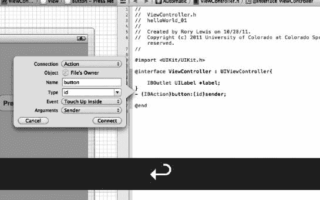

**图 2-11.** 为你的按钮创建操作。

11. 如第 10 步所述，我们希望连接类型是`Action`，因此你需要通过从下拉菜单中选择`Action`来将连接类型从`Outlet`更改为`Action`。同样，现在不用担心`Object`和`File's Owner`。将其命名为`button`，现在忽略其他所有内容。这在图 2-11 中进行了说明。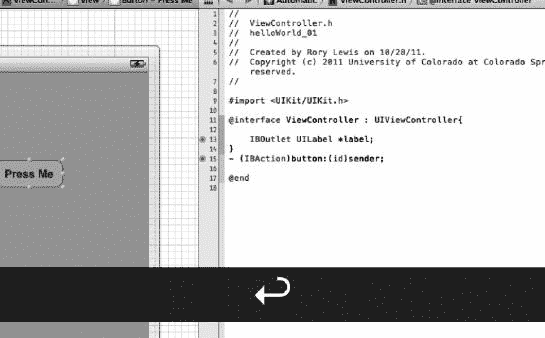

**图 2-12.** 完成你的`ViewController`的头部文件。


### 12. 按下回车键（），你会看到 `-(IBAction)button:(id)sender;`，如下所示及图 2–12 所示。是的，我们将在本章末尾的“深入代码”部分详细讨论这一点。现在，让我们继续前进。

```
#import <uikit/UIKit.h>
@interface helloWorld_01ViewController : UIViewController {
    IBOutletUILabel *label;
}
- (IBAction)button:(id)sender;
@end
```

在进入第 13 步之前，我们需要环顾四周，看看我们目前所在的位置。还记得吗？在第 3 步中，我提到过我们有 2 个类，每个类包含两个文件（一个头文件（`.h`）和一个实现文件（`.m`））。让我稍微谈谈这两个文件的区别：一个带有 `.h` 后缀，另一个带有 `.m` 后缀。

`ViewController` 管理你的代码与显示之间的交互，同时也管理用户与代码之间的交互。它包含一个视图，但其本身并不是视图。到目前为止，你对 `ViewController` 类只有最基本的了解。不过，我希望你明白的是，正如第 3 步所述，每个类都由两部分组成：头文件（`.h`）和实现文件（`.m`）。

接下来这部分我希望你大声读出来，就算你在书店里也别介意，好吗？“我们在头文件中告诉计算机，我们将在实现文件中执行哪些类型的命令。”现在，结合我们的代码再说一遍：“我们在 `helloWorld_01ViewController.h` 文件中告诉计算机，我们将在 `helloWorld_01ViewController.m` 文件中执行哪些类型的命令。”

嗯，承认吧——这没那么难！

让我们回到例子：

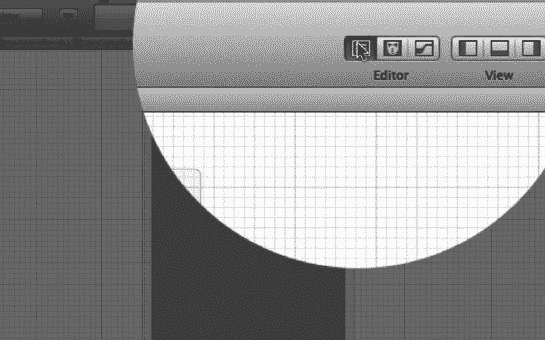

**图 2–13.** 切换到标准编辑器。

### 13. 要从这里进入实现文件，请养成首先切换视图，从助理编辑器（还记得我们在步骤 2-7 中做的吗？）切换到标准编辑器的习惯。为此，请转到视图选择器左侧的编辑器选择器，点击标准编辑器，如图 2–13 所示。

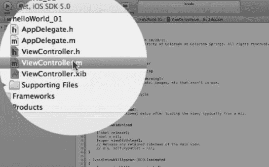

**图 2–14.** 打开你的 `helloWorld_01ViewController` 的实现文件。

### 14. 进入标准编辑器后，选择你的 `ViewController` 的实现文件，如图 2–14 所示。

还记得在第 10 步中，当我们按住 Control 键将按钮拖入头文件的代码时，我们“声明了一个动作”吗？记住，在头文件中我们“声明”动作，而在实现文件中我们“实现”动作。在 `ViewController` 的实现文件中，我们将实现当有人按下按钮时我们希望发生的动作。具体来说，我们希望标签显示“Hello World!”。“嗯，我们该怎么做呢？”你可能会问。好吧，我们需要输入你的第一行代码，开始你走向极客之路的旅程。没错，你将编写文本代码。深吸一口气，跟着做。

查看你的 `helloWorld_01ViewController` 实现文件的文本，我们看到苹果公司的聪明人在 Xcode 中已经预先编写了许多需要在后台运行的方法，以使你的带有标签和按钮的应用能够在你的 iPhone 上运行。目前，我们将忽略这些方法，从第一个名为 `dealloc`（负责释放内存）的方法开始，一直往下直到我们看到一个名为 `- (IBAction)button:(id)sender` 的方法。嗯……等等，这不是在第 12 步中出现的代码吗？对吧？嗯，差不多。那段代码以分号“`;`”结尾，因为在头文件中，我们声明了这个动作。Xcode 知道我们现在需要在实现文件中实现这个动作，所以它为我们重写了它，不是作为声明，而是作为一个方法。它通过用花括号替换分号来实现这一点。你需要记住这个规则。你会反复用到它。

**注意：** 在 `.h` 文件中的声明，通过将分号替换为花括号，就成为了 `.m` 文件中的方法！

在你找到了你在头文件中声明的动作的实现后，我希望你将光标放在两个花括号之间，如下方代码所示。点击那里并阅读下方内容。

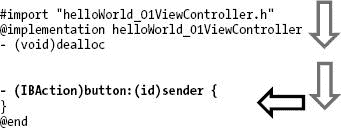

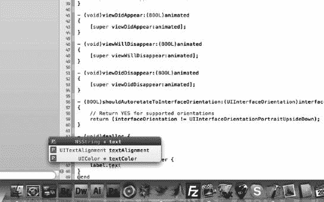

**图 2–15.** 当你输入 `label.text` 时，自动完成功能会建议代码。如果你同意该选择，则按下 Tab 键（），Xcode 就会将该命令放入你的代码中。

### 15. 我希望你输入的代码是 `label.text = @"Hello World!"`，但这并不是那么简单，因为当你输入时，会发生一些非常酷的事情。Xcode 会在其自动完成窗口中推断你可能想要输入的代码，如图 2–15 所示。如果你同意该选择，则按下 Tab 键（），Xcode 就会将完整的、拼写正确的命令放入你的代码中。如果它建议的不是正确的，但你看到正确的在下面几行，只需向下箭头键（↓）直到选中正确的选项，然后按下 。很酷吧？写完 `label.text` 后，继续第 16 步。

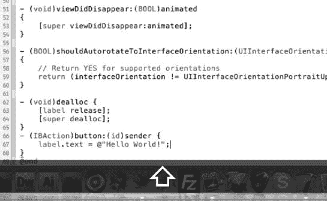

**图 2–16.** 在“`@`”指令后，输入你希望标签显示的文本。

### 16. 现在我们需要输入 `@"Hello World!";`，这就是我们想说的话。你的代码应该像图 2–16 所示。如果你想说的是“我感觉我正在变成一个极客！”，那么就输入 `label.text = @"I can feel I’m becoming a geek!";`。

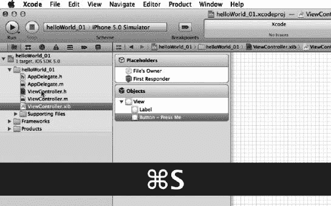

**图 2–17.** 保存你的工作：S。

### 17. 保存你的工作 S，如图 2–17 所示。请尽量不要使用鼠标；努力养成每次想要保存时都按下 Control+S（S）的新习惯。这会让你感觉并看起来非常聪明和极客。你可能还需要检查你的头文件和 nib 文件是否也已保存，因为在阅读这些说明的过程中，你可能需要返回并更改文件。那么，你需要返回并保存它们。所以现在就动手保存所有内容。如果文件以灰色突出显示，则意味着你也需要保存它们。

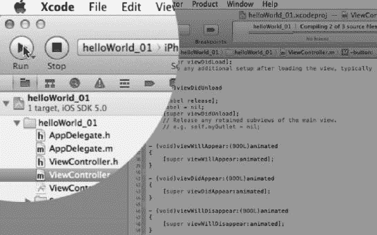

**图 2–18.** 运行它！！R。

### 18. 按下 R 运行它，如图 2–18 所述。

如图 2–19 所示，iPhone 模拟器加载了你第一个应用，等待你按下按钮，然后显示“Hello World!”。

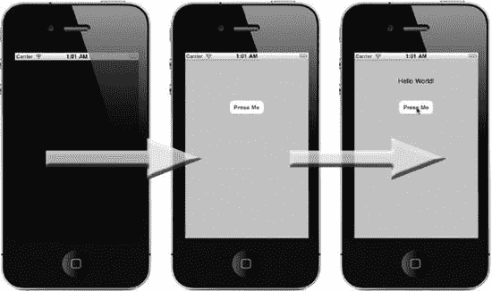

**图 2–19.** iPhone 模拟器加载并等待用户按下按钮，然后显示“Hello World!”

祝贺你，我的朋友！你今天真的做了一件非常特别的事。我知道你可能咒骂了我几次，或者在这里或那里挣扎过，但走到这一步，你的人生已经完成了一件非常特别的事。你从一个用户变成了一个编码者。你完成了一个非常艰难的飞跃：从技术的使用者变成了技术的编码者。我们还有一些事情要做，所以先休息一下。遛遛狗；做点与科技无关的事情，哪怕只是走到街上。花一点时间意识到你正在开始一段漫长的旅程。有时会很艰难，但这是一段你可以昂起头说：“是的，我编写 iPhone 和 iPad 应用！”的旅程。


### 在读取 iPhone 环境的 iPad 模拟器上运行你的应用

有两种方法可以在 iPad 模拟器上运行你的 iPhone 应用：

- 首先，我们将从 iOS 模拟器中更改环境。因此，在仍处于 iPhone 模拟器中的情况下，请点击 **Hardware** **Device** **iPad**，这样我们就可以看到你的第一个应用在 iPad 上运行的效果（参见图 2–20）。结果如图 2–21 所示。 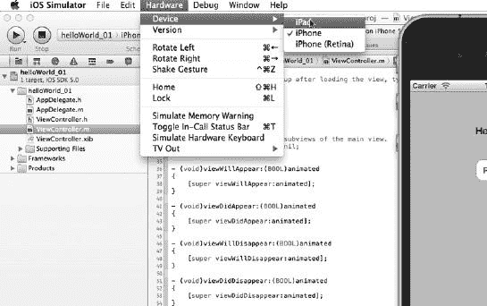

    **图 2–20.** 让我们看看你的 iPhone 应用在 iPhone 模拟器上如何运行。

    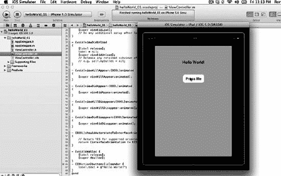

    **图 2–21.** 最初它以 iPhone 模式显示。点击缩放按钮，即可全屏查看，如图所示。

- 第二种方法是通过在 Xcode 内部更改输出设备来实现。为此，请先确保你在模拟器中，然后输入 **Command + Q** (Q) 关闭你的 iPhone 模拟器。现在你应该回到了 Xcode。

    **注意：** 如果你没有回到 Xcode，则说明你此前开启了其他程序，这是我说过不允许你做的事情。为了让你能准确地按照步骤操作，你真的需要保持你的桌面和正在运行的程序与我教你的方式完全一致。

    1. 现在，保持 Xcode 打开，通过点击功能区左上角的 **Scheme** 下拉菜单，选择 **iPad Simulator**，来将你的方案更改为 iPad 模拟器，如图 2–22 所示。目前它显示的是 iPad 4.3 模拟器，但当你读到这本书时，版本号可能会更高。
    2. 现在输入 R 来运行它。同样，你会看到与图 2–21 中显示的相同实例。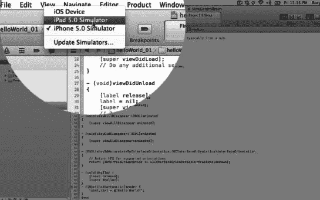

    **图 2–22.** 在 iPad 模拟器中运行 iPhone 应用的第二种方法。

### 在 iPad 模拟器上运行你的应用

#### `helloWorld_02` – iPad 模拟器

在本章开头，我与你达成了一个约定。我说过我们将拿一个非常简单的应用，并以所有可能的不同形式运行它。具体来说，我说过我们将在以下设备上运行你的第一个应用：

- §2.1. iPhone 模拟器：( 参见图 2–19)。
- §2.2. 读取 iPhone 环境的 iPad 模拟器 ( 参见图 2–21)。
- §2.3. iPad 模拟器。

此刻，你已经完成了前两个目标，即在 iPhone 模拟器上运行，以及后者是在 iPad 上读取 iPhone 应用。但这并不是真正的 iPad 应用。真正的 iPad 应用是专门为 iPad 制作的，不能在 iPhone 上运行，因为所有的图形和屏幕尺寸都是专门为 iPad 设计的，尺寸太大以至于无法在 iPhone 上显示。

查看图 2–21，你可以看到左侧第一张图片显示你的 iPhone 应用位于 iPad 内部，并且精确地缩放到 iPhone 的尺寸。当你点击缩放按钮时，它只是简单地缩放并放大所有内容以适配 iPad。嗯，这就是我在课堂上称之为“伪 iPad”的东西，因为它并非真正的应用。那么，让我们继续，并向你展示如何制作一个专门用于 iPad 的应用。

1. 我们需要通过在 Xcode 中输入 S 保存你的 `helloWorld_01` 应用，然后输入 Q 退出 Xcode。现在，你的桌面上应该除了 Mac 硬盘图标下的 `helloWorld_01` 文件夹外，空空如也。很好。我们现在将要运行 `helloWorld_02`，除了少数几个步骤外，它将与 `helloWorld_01` 完全相同。
2. 打开 Xcode，同时输入 **Command + Shift + N**。回忆一下，这三个组合键在图 2–1 中显示为  N。选择 **View-Based App**，然后按 **Return** ()。现在停下来，查看图 2–23：在图 2–2 中，我们将其命名为 `helloWorld_01`。然而在图 2–23 中，我们将其命名为 `helloWorld_02`。最重要的是，在图 2–23 中，我们选择的是 **iPad**，而不是像在图 2–2 中那样选择 iPhone。完成这一步后，我希望你尝试记住我们在 `helloWorld_01` 中执行的所有步骤，直到你运行它，此时你将只看到图 2–21 中右侧的图像。

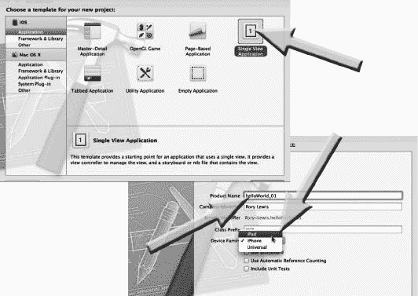

**图 2–23.** 打开 Xcode，选择 Navigation-based Application 模板，然后将新项目文件保存到桌面。

嗯？是的，这就是我说的：我让教室里的学生们重新做一遍 `helloWorld`，但这次是作为一个“真正的”iPad 应用，我鼓励他们尝试不要偷看课堂笔记，自己尝试完成。如果你必须查看笔记或这本书，那也没问题。但要试着反复做，直到你完全不需要看任何笔记也能完成。

### 在物理设备上运行你的应用

**提示：** 你可能想跳过这一节。请仔细阅读以下内容。

在你设置好设备和配置文件之后，你可以继续执行步骤 §2.4，在 iPhone 上运行你的应用，§2.5，在基于 iPhone 环境的 iPad 上运行你的应用，以及 §2.6，在你的物理 iPad 上运行你的应用。

无论你做什么决定，你都需要先完成以下整理工作。现在，在你干净整洁的桌面上，只有两个包含你两个 `helloWorld` 程序的文件夹。我们需要创建一个位置来存放你所有的程序，这将有助于你继续阅读本书。在你的 **Documents** 文件夹中创建一个名为 **My Programs** 的文件夹，然后将 `helloWorld_01` 和 `helloWorld_02` 这两个文件拖拽到该文件夹中保存。现在，在拥有一个干净整洁的空桌面的情况下，关闭所有程序。按 **Command + Tab**，然后按 **Command + Q** 关闭所有应用，直到屏幕上只剩下 Finder。

**注意：** 对于我课堂上的或其他大学的学生，我或你的教授已经处理好了这件事。如果你不是学生，并且没有在第 1 章的步骤 5 中支付 99 美元，或者/并且你没有 iPhone 或 iPad，那么请跳到第 3 章。


### 深入解析代码

在每章的末尾，我加入了名为“深入解析代码”的章节，在此我将逐步为你剖析那些神奇出现或我直接让你输入的代码背后的含义。不过，我发现人类的大脑如果在不断重复某项操作，并且每次重复都会产生特定结果时，就会自行建立关联。我还发现，如果先让学生们在完全无知的状态下快速浏览大量代码，这大有裨益，因为这样能让大脑建立只有自己才能理解的连接。因此，在“深入解析代码”中，我开始为你提供一些恰到好处的小片段，它们能帮你串联起线索，理解为什么要把这段代码放在这里，或者那段代码放在那里。到了本书结尾部分，你会完全适应并真正深入钻研这些代码。然而，对于第 2 章来说，我们重复的操作还不够多，不足以让你建立自己的关联。所以，现在先深呼吸一下，我们第 3 章再见。

## 第 3 章

## 继续前进

现在你已经通过编程完成了前两个 iPhone 和 iPad 应用，算是小试牛刀了。我希望你告诉自己，你必须继续前进，制作更多的应用，进行更多的练习，并在大脑中建立更自然的神经突触连接。起初，我许多传统的计算机科学同事都鄙视我的方法——在不解释所有代码的情况下，就盲目地带着新手程序员读代码。多年来，我学会了精确判断什么时候该告诉你发生了什么，什么时候该推着你前进。最重要的是，你需要继续前进，并让你的大脑始终专注于 Xcode。

这第三个“Hello World”应用将向你介绍一些很酷的新概念，比如字符串、委托以及稍微复杂一点的代码。请记住，这是 Objective-C；它是一种相当复杂且困难的语言，所以我只会解释我认为必要的内容。这就引出了第 3 章和第 2 章之间的一个区别。回想一下，在第 2 章中，当我提到深入解析代码时，我说：“然而，对于第 2 章来说，我们重复的操作还不够多，不足以让你建立自己的关联。” 好吧，到了第 3 章，我们开始真正深入解析代码了。那么，让我们开始下一个应用吧。完成之后，休息一下，然后准备好回去复查你输入的每一行，因为我们要专注于代码的某些部分，看看它们是如何协同工作的。

除了本书中呈现的信息（包括各种截图）之外，我还提供了录屏，你可以在我的网站上获取。你可以使用短链接，或者输入 rorylewis.com，如下所示，点击 Xcode 4 图标，然后选择视频教程或下载：

*   短链接：`ow.ly/50ksH`
*   手动输入网址：[www.rorylewis.com](http://www.rorylewis.com)

### helloWorld_03 – 一个交互式基于视图的应用

在你的前两个程序 `helloWorld_01` 和 `helloWorld_02` 中，你使用一个包含按钮的基于视图的平台向世界说了“Hello”。这第三个应用也将是一个基于视图的应用，但会稍微增加一些复杂性。当用户与你这第三个应用交互时，他们首先会被提示在文本字段对象中输入自己的名字。一旦他们输入了名字并点击“Press Me”按钮，就会显示一段文字，说明输入的这个人正是在说“Hello World！”

在开始下一个方法之前，你需要将 `helloWorld_01` 和 `helloWorld_02` 保存到一个你选择的非桌面的文件夹中。在你的“文稿”文件夹中创建一个名为“My Programs”的文件夹，然后通过将整个 `helloWorld_01` 文件夹拖入“My Programs”文件夹来保存它。现在，保持桌面干净整洁，关闭你可能正在运行的其他所有程序。按下 `Command + Tab` ()，然后按 `Command + Q` (Q) 关闭所有程序，直到屏幕上只剩下“访达”。

> 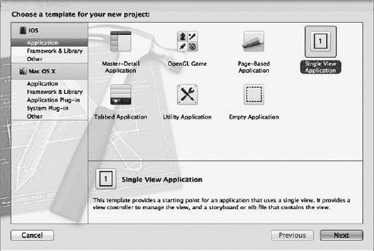

**图 3–1.** 打开 Xcode，选择“基于视图的应用”模板，然后点击“下一步”按钮。

1. 现在，就像你在第一个示例中所做的那样，启动 Xcode 并使用键盘快捷键 ` N` 打开一个新项目。你的屏幕应该会显示新项目向导，如图 3–1 所示。你可能发现你的“基于视图的应用”模板因为上一个示例而被默认选中了。但是，如果你的“基于视图的应用”模板没有被选中，那么请点击“基于视图的应用”图标，然后点击“下一步”按钮，如图 3–1 所示。

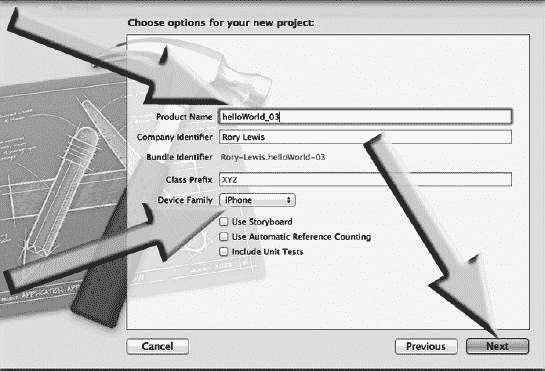

**图 3–2.** 命名你的项目，确保它用于 iPhone，然后点击“下一步”按钮。

2. 你将把第三个项目命名为 `helloWorld_03`，因此在“产品名称”框中输入该名称，如图 3–2 所示。“公司标识符”应自动默认为你的 Xcode 许可名称。请记住，`helloWorld_02` 是为 iPad 创建的，因此你电脑上的“设备系列”可能仍设置为 iPad。无论情况如何，请确保 `helloWorld_03` 设置为 iPhone 系列。如果你的“使用故事板”、“使用自动引用计数”或“包含单元测试”选项被默认勾选，请取消勾选。完成此操作后，当你的屏幕看起来如图 3–2 所示时，点击“下一步”按钮。

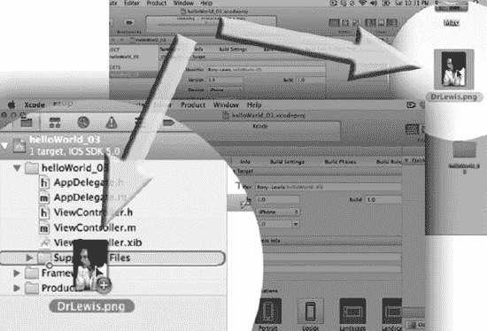

**图 3–3.** 将你桌面上的个人图片拖入“Supporting Files”文件夹。


3. 对于本次家庭作业，我要求我的学生们拍摄一张自己的照片，将其裁剪为`320 × 480`像素的图像，然后保存为`.png`文件。这样，我就能更快地将名字与正确的面孔对应起来。对于正在阅读本书且并非我学生的读者，请继续获取一张自己的照片，裁剪至`320 × 480`像素，并保存为`.png`文件到您的桌面上。如果您没有图形编辑器，那么可以直接使用我在本项目中所用的图片。您可以通过`ow.ly/50ksH`下载它（向下滚动到从顶部数起的第三个视频教程`helloWorld_03`，并点击盒子图标）。一个压缩文件将会下载到您的电脑上，其中包含我在本例中使用的图片，名为`DrLewis.png`。请将其放到您的桌面上。图片放到桌面后，按下`Command + Tab`（），直到`Xcode`被高亮显示。松开键，此时`Xcode`将再次填满您的屏幕。将`Xcode`稍微最小化，以便您能看到带有图片的桌面，或者对于部分读者来说，能看到如图 3-3 所示的我的照片。抓住它，将其拖到您的“Supporting Files”文件夹中，然后放入该文件夹内。

注意：以防您注意到，与提供确切的代码以及从我在线教程中直接截取的我编程精确代码的图片所带来的积极方面相伴的，也有一个消极方面：您会看到我犯错。在这个例子中，我不小心错过了“Supporting Files”文件夹。我说了声“哎呀”，然后迅速将其从`helloWorld_03`文件夹拖入“Supporting Files”文件夹，这正是图 3-3 中的图片被截取的时刻。如果您注意到了这一点，请忽略它。只需将您的文件放入“Supporting Files”文件夹，然后我们继续。

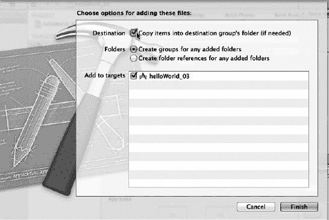

图 3-4. 通过选择“将项目复制到目标文件夹…”选项并点击“Finish”按钮来完成图片的导入。

4. 我看到学生们犯的最常见错误之一就出现在`Xcode`管理的这个简单阶段：他们忘记了勾选“如果需要，将项目复制到目标组文件夹”复选框。当您将文件导入电脑上的“Supporting Files”文件夹时，如果您没有勾选“将项目复制到目标组文件夹”，一切都会正常运行，从而给您一种虚假的安全感。在这种情况下，即使`Xcode`被告知您的支持文件（如此例中的图片）位于您的“Supporting Files”文件夹中，实际情况是，有一个小的备注在说：“老兄，我对这个不负责，文件不在这里，它还在所有者的桌面上！”所以，作为代码编写者的您，继续完成您的作业。每次您运行代码，并且`Xcode`调用以访问支持文件时，这个不负责任的“指针引用”家伙就一直说：“它不在这里——它还在您的桌面上！”于是您完成作业，一切运行良好。您微笑着压缩工作成果并发送给我。我给您零分，然后您哭了。为什么？嗯，这个不负责任的指针引用告诉我，您的引用文件在我的桌面上。不！它不在我的桌面上，它在您的桌面上，并且您因为疏忽大意、依赖指针引用先生而不是选择“复制项目”复选框，在 10 分中得了 0 分。这样，您就解雇了指针引用，并将文件放入了您的程序中。这样，当您压缩并发送给我，我打开您的工作进行评分时，它就会打开，并且所有相关文件都在您想要的确切位置。因此，在将您的图片拖入“Supporting Files”文件夹后，请勾选“将项目复制到目标组”复选框，如图 3-4 所示，然后点击“Finish”。现在您就处于良好状态，不会再被指针引用先生弄哭了。

注意：我能听到您在问：“那为什么还要给我们这个选项呢？”这里有一个简单答案，涵盖了大多数但并非所有情况。假设您正在设计一个游戏或程序，它拥有一个包含数百万个文件、电影、角色或玩家可能说的可能回复的数据库，并且这个数据库太大，无法容纳在 iPhone 或 iPad 上。在这种情况下，您就不会勾选“将项目复制到目标组”复选框，并让指针引用先生说：“哟，我对这一切都不负责，它不在这里，它在这个 URL 上：`http://www.wherever.com`。”


#### 创建用户界面

好了，现在我们准备开始将项目拖放到你的视图设计区域，也就是用户在查看 iPhone 时会看到的图像。

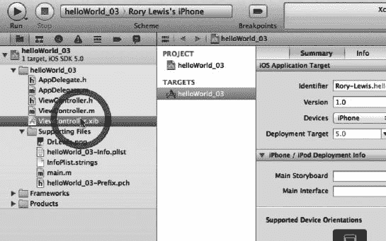

图 3–5。打开你的 nib 文件。

5. 为此，你需要打开你的 nib 文件，就像在前两个应用中操作的一样。因此，请进入你的 `helloWorld_03` 文件夹，并选择 `helloWorld_03ViewController.xib` 文件来打开你的 `nib` 文件，如图 3–5 所示。

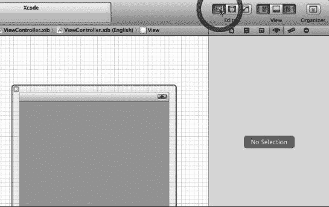

图 3–6。关闭导航器视图。

6. 你需要在 Xcode 4 环境中腾出空间，所以首先，关闭导航器视图，因为我们暂时不需要它，然后打开实用工具视图，这样我们就能看到装扮视图设计区域所需的工具和图标。在图 3–6 中，你可以看到我正在关闭导航器视图。有关 Xcode 4 术语的更多详细信息，请参见图 3–34。

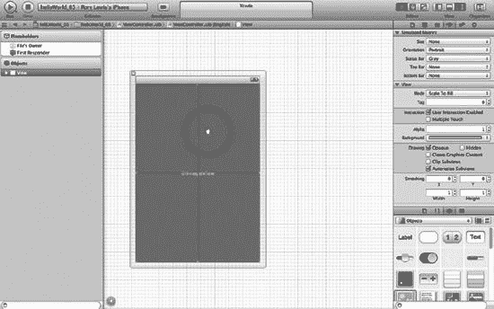

图 3–7。将一个 `UIImageView` 拖到你的视图设计区域上。

7. 如图 3–7 所示，打开实用工具面板后，转到面板的底部区域，确保你选择了图标视图（如图 3–7 中右向箭头上方图标所示的四个小方块），然后将一个 `UIImageView` 拖到你的视图设计区域上。我们需要 `UIImageView` 的原因是因为我们需要在按钮和文本标签下方放置你的图像。你刚刚拖入的那张图片需要一个可以存放的地方。`UIImageView` 正是完成这项工作的合适控件。它将位于你所有按钮的下方，并承载你指定给它的任何图片。

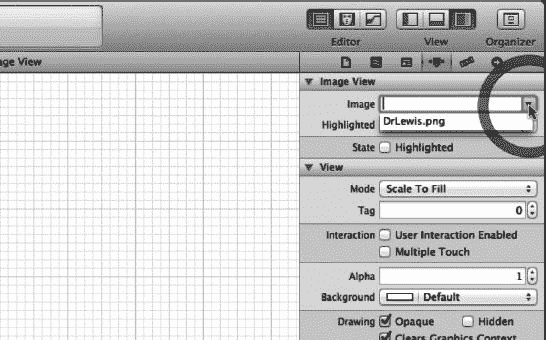

图 3–8。将你选择的图像与你的 `UIImageView` 关联起来。

8. 还记得你在图 3–3 中拖入 `Resources Folder` 的那张图片吗？那就是你希望 `UIImageView` 显示的图像，所以你只需将它拖到你的 `View Design area` 上以进行封装。为此，你需要告诉它这样做，这可以通过确保你在 `Inspector Bar`（检查器栏）中选择了 `Attributes Inspector`（属性检查器）来完成（参见图 3–8 中“`View`”下方的图标，或本章末尾的图 3–33 中的说明）。打开 `Attributes Inspector` 后，点击 `Image` 下拉菜单，猜猜你会看到什么。你会看到你拖入 `Resources Folder` 的文件名。选中它，瞧！图像就出现在你的视图设计区域中了。是不是很酷？

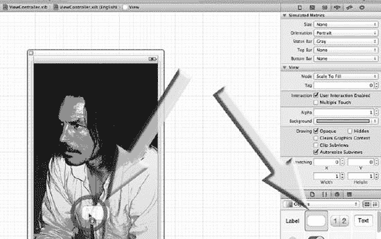

图 3–9。将一个按钮拖到你的视图设计区域上。

9. 从你的库中拖出一个按钮，放到你的视图设计区域上，并将其放置在底部，如图 3–9 所示。确保它完美居中。提醒你一下：当你点击这个按钮时，你的代码将调用一个操作，该操作会获取用户输入到文本字段对象中的名字，并将其输出到一个标签中，后面跟着“Hello World!”这段文本。

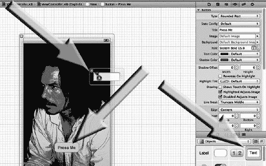

图 3–10。在按钮上输入“Press Me”，然后将一个文本字段对象拖到你的视图设计区域上。

10. 释放按钮后，立即双击它并输入“Press Me”，就像你在前两个作业中做的一样。现在回到你的库中，拖出一个文本字段对象放到你的视图设计区域上，将其放置到顶部附近（如图 3–10 所示）并完美居中。请记住，用户在这里输入的文本会在他们按下写着“Press Me”的按钮时被发送到标签中。

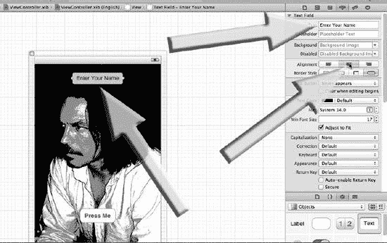

图 3–11。将你的文本字段对象居中，在文本字段中输入文本“Enter Your Name”，并将文本居中。

11. 将你的文本字段对象居中并在视图设计区域中将其展开后，如图 3–11 所示（其中显示着“Enter Your Name”），点击该文本字段，然后转到你的实用工具检查器面板，输入你希望用户在查看文本字段对象时看到的文本。你需要告诉用户在这里输入他们的名字，所以在文本字段框中输入“Enter Your Name”。同时，将此文本居中，使其位于文本字段框的正中央，并确保文本字段框在视图设计区域中也是居中的。

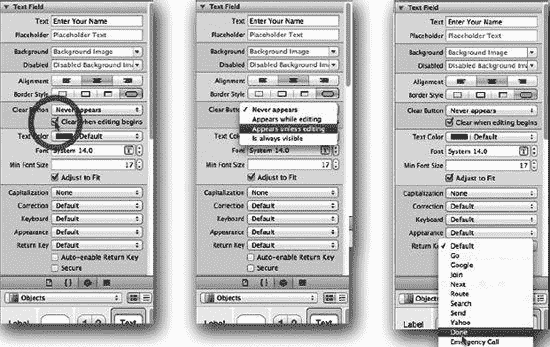

图 3–12。确保文本字段对象中的文本在用户激活该字段时立即清除的三个步骤。另请注意，字段中出现了一个清除按钮图标，并且返回键上显示为“Done”（完成）（参见图 3–32）

12. 一旦用户开始输入，你希望提示文本消失。为了加倍确保你的文本消失，请保持 `Text Field object` 中的 `clear button`（灰色叉号图标）处于激活状态，这允许用户按下它来清除你的文本——以防你的教授用鼠标在模拟器上批改你的作业，并想确保你知道两种删除 `Text Field object` 中文本的方法。你还应该删除键盘返回键上的单词“Return”，并将其替换为文本“Done”。我已在图 3–12 中说明了上述三个步骤。

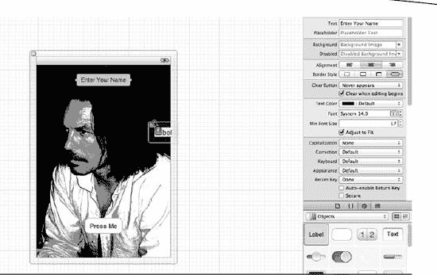

图 3–13。将一个标签对象拖到你的视图设计区域上。

13. 一旦用户将他们的名字输入到 `Text Field object` 中，并按下按钮，你需要在一个标签中显示用户的名字和文本。你还没有在视图设计区域上放置标签对象，所以现在就这样做，从库中将其拖到 `View Design area` 上，如图 3–13 所示。

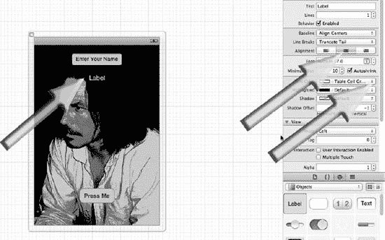

图 3–14。居中并展开你的标签对象。另外，如有必要，更改文本颜色，并让标签对象内部的文本居中。

14. 将标签对象放置在你的文本字段对象正下方，并将其展开，同时相对于视图设计区域保持居中。通过快速展开一侧，然后展开另一侧，直到出现紫色中心线，这样可以同时最快地完成展开和居中操作。接下来，将标签对象内部的文本居中，然后根据图片的颜色，更改文本颜色以确保其突出显示。以图 3–14 为例，文本背后的颜色是黑色，因此文本颜色被改成了白色。


#### 连接代码

好了，现在你已经完成了从库中将对象拖拽到视图设计区域的操作。接下来，让我们将这些对象与你的文件所有者（file's owner）连接起来，这样你就可以将它们与代码关联起来。

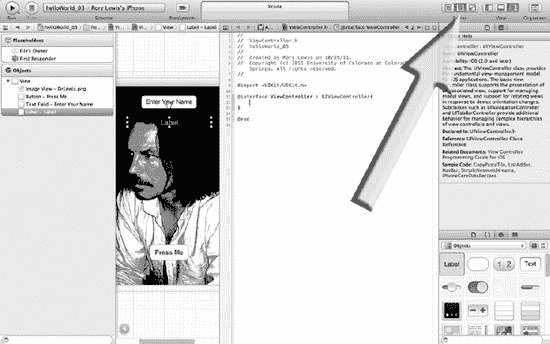

**图 3-15.** 打开助理编辑器（Assistant Editor）

15\. Xcode 4 最酷的特性之一在于，在过去的“旧时代”，当 Xcode 刚推出时，你必须输入 `Control + Command + Up Arrow`(^↑) 或 `Control + Command + Down Arrow` (^↓) 才能在文件之间快速切换——苹果公司的聪明人知道我们会有这种需求。这些相互关联的页面和文件被称为对应文件（counterparts），但你无需记住这点，因为在 Xcode 4 中，助理编辑器会找到巧妙的方法，将它们全部显示在屏幕上供你使用。现在，你应该开始将代码与你已放置到视图中的所有元素连接起来。因此，用鼠标点击编辑器选择器（Editor Selector），如图 3-15 所示，然后选择助理编辑器（Assistant Editor），它的图标看起来像穿着燕尾服的人的胸部。接下来，你会看到布局如何变化。纯粹为了好玩，你也可以点击助理编辑器左侧紧邻的按钮，即标准编辑器（Standard Editor），然后你会看到屏幕变为单窗口——就像过去一样。总之，选择助理编辑器后，我们继续。

**注意：** 你也可以使用键盘快捷键来打开助理编辑器的选项：`Command + Return` () 打开助理编辑器，`Command + Return` () 打开标准编辑器。键盘快捷键数以千计，有些成为了明星级快捷键，有些则从未走出书籍和博客。这里之所以提到这两个快捷键，是因为尽管 Xcode 4 还比较新，但我发现自己和其他人已经开始自然地使用这两个命令了。

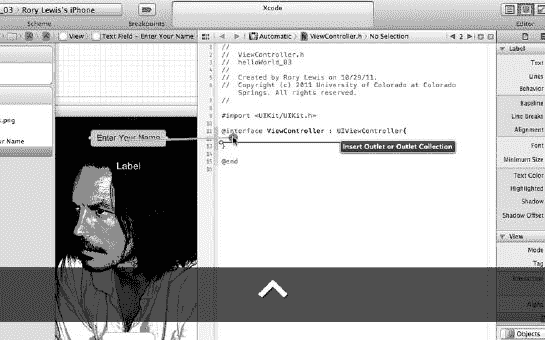

**图 3-16.** 从界面生成器（Interface Builder）中的文本框按住 Control 键拖拽到你的头文件中

16\. 如你所见，你又回到了熟悉的界面：界面生成器居中显示，你的头文件也位于中央。这里，你需要将 Outlets 和 Actions 与拖拽到视图设计区域的按钮和标签相关联。前两次你操作时，被告知从某处拖拽到某处。现在，我们将使用更准确的专业术语，让你听起来更专业一些。在文本框内单击一次，然后按住 Control 键从文本框拖拽到头文件中，将其放置在两个花括号之间。如果你按住 Control 键拖拽到无效的目标位置，Xcode 将不会显示插入指示器（insertion indicator），如图 3-16 所示。

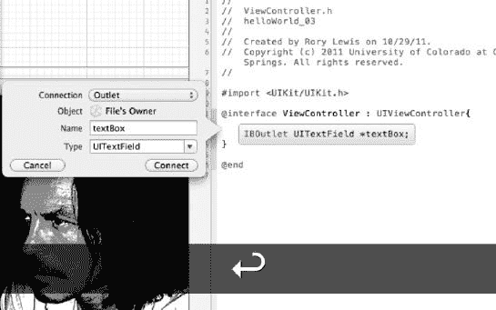

**图 3-17.** 当文本框的连接对话框出现时，指定你计划在代码中使用的连接类型

17\. 当你按住 Control 键拖拽到两个花括号之间的区域并看到插入指示器出现时，松开鼠标按钮。Xcode 会显示一个对话框，你需要在此告知 Xcode 这是一个 outlet，由于这是默认选项，所以无需选择任何内容。这一点在图 3-17 中进行了说明。稍后，我们会解释为什么这样做以及 Outlet 到底是什么。现在，只需确保给它命名即可。在图 3-17 中，它被命名为 `textBox`。完成后，点击 Connect 按钮，观察 Outlet 代码如何神奇地出现。

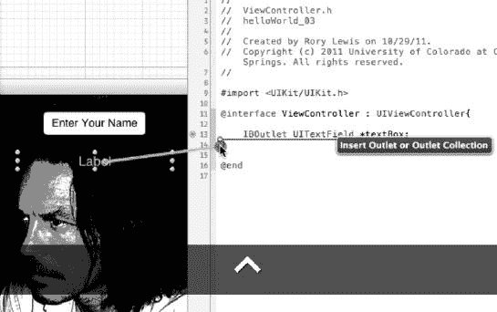

**图 3-18.** 从界面生成器（Interface Builder）中的标签按住 Control 键拖拽到你的头文件中

18\. 在标签内单击一次，然后按住 Control 键将其拖拽到头文件中，放在 `textBox` outlet 的下方，两个花括号内。持续拖拽直到看到插入指示器显示，如图 3-18 所示。

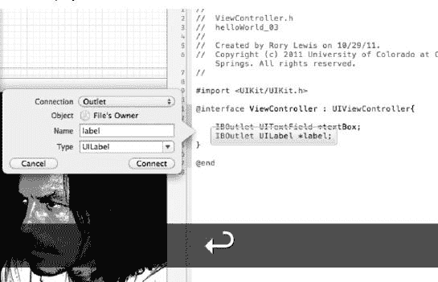

**图 3-19.** 当标签的连接对话框出现时，指定你计划在代码中使用的连接类型

19\. 就像你之前将 `textBox` 设为 outlet 一样，当标签的对话框打开时，你也要做同样的操作。保持顶部下拉菜单中的“outlet”选项不变，只需给它一个名字。在图 3-19 中，它被命名为“label”。当你点击 Connect 时，它会植入一些非常酷的 outlet 代码，你甚至不需要手动编写！因此，你有了两行自动添加的代码：一行来自拖拽 `textBox`，另一行来自拖拽标签。这两者都将是 outlet。你是否认为按钮（像其他东西一样）将会是一个 action？没错。但回到这些 outlet——当你查看这段代码时，即使不完全理解，你只需要了解每一行代码的含义，如图 3-19 所示：

```
IBOutlet UITextField *textBox;
```

这为文本框添加了一个 outlet。

```
IBOutlet UILabel *label;
```

这为标签添加了一个 outlet，与你在之前示例中所做的一样。

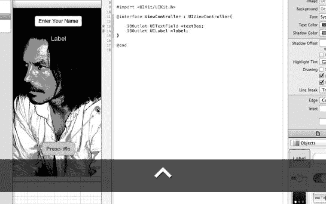

**图 3-20.** 从按钮按住 Control 键拖拽到头文件中

20\. 单击显示“Press Me”的按钮（如图 3-20 所示），然后按住 Control 键拖拽到 `@interface` 指令及其花括号下方的区域。

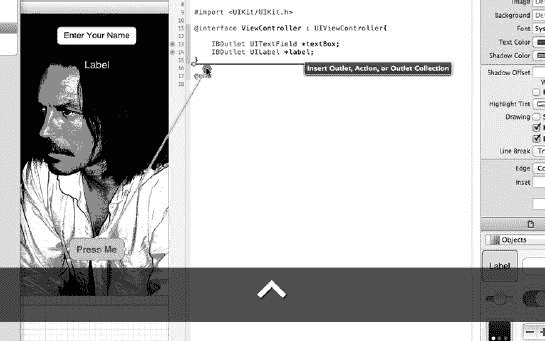

**图 3-21.** 插入指示器现在有三个选项

21\. 按住 Control 键拖拽直到看到插入指示器，如图 3-21 所示。请注意，当你拖拽到该区域时，Xcode 已经知道这可能存在三种选项（而不是你的标签和文本框 outlet 的两种），如插入指示器所示。看到它还包括第三个选项“Action”了吗？现在，在正确定位到花括号之后松开鼠标按钮。

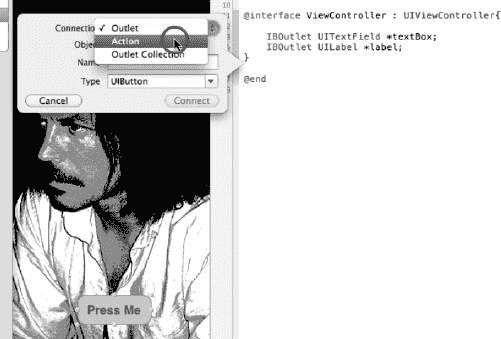

**图 3-22.** 打开下拉菜单，将连接类型更改为 Action

22\. 这里你需要做的第一件事是，将对话框顶部下拉菜单中的连接类型从 outlet 更改为 action。这与你之前对 outlet 所做的操作类似。请参见图 3-22。

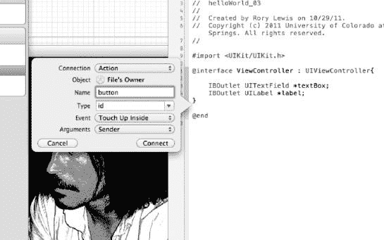

**图 3-23.** 将此 action 命名为“button”，并点击 Connect 按钮

23\. 如图图 3-23 所示，将这个按钮从 outlet 改为 action 之后，你仍然需要为它命名。在图 2-23 中，它被命名为 `button`。现在，点击 Connect 按钮。你将看到如下代码出现：

```
- (IBAction)button:(id)sender;
```

**大声读出来**


> 看看这段代码，我们来简单聊聊。就算你走神了也没关系。我要你做的，正是我在课堂上要求学生做的——把下面这段内容大声朗读三遍：

这段代码被称为“方法”，如果你愿意，甚至可以给它取名为“monkey”。如果那样做，代码会变成这样：

`- (IBAction)monkey:(id)sender;`

关于你命名为“monkey”的这段方法，我只想让你知道两件事：第一，它有一个返回类型；第二，它有一个参数。

- `monkey` 的返回类型：我们的 `monkey` 方法会返回一些内容给我们，用一句话解释就是：“`monkey` 方法的返回类型是 `IBAction`。”请大声朗读**加粗**的代码。

  `- (IBAction)monkey:(id)sender;`

- `monkey` 的参数：`monkey` 的参数类型是 `(id)`，对你而言，它通过 `sender` 指向你在图 3–23 中拖入头文件的那个按钮。请大声朗读**加粗**的代码。

  `- (IBAction)monkey:(id)sender;`

好了，现在你可以深深地吸一口气。你对“引擎盖下”的初步探索就到此为止了。头文件的工作也已经完成，接下来可以进入实现文件了。

### 避免一个恼人的错误

但在进入实现文件之前，你需要做一些小小的整理工作。

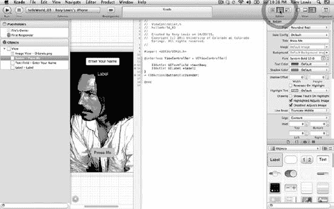

图 3–24. 关闭 Assistant。

24. 在这第三篇教程中，你可以看到 Xcode 4 已经完成了一些了不起的事情。然而，在我撰写本书时，许多沮丧的 Xcode 4 程序员正遇到一个令人抓狂的错误。在你进入下一步之前，我将告诉你如何避免这个错误。（当你阅读本书时，Xcode 4 的这个古怪特性或许已被修复。）如图 3–24 所示，关闭检查器（Inspector），然后重新打开“工具”面板（Utilities pane）。

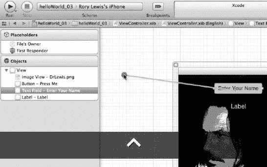

图 3–25. 将你的文本框连接到 delegate——第 1 部分：激活 `textBox` 并开始按住 Control 键拖拽。

25. 你已经习惯通过从 Interface Builder 直接将对象拖入代码的方式建立连接，这确实很酷，但似乎目前还不能把所有连接工作都交给苹果那帮聪明的家伙。因此，在文本框中单击一次，然后按住 Control 键拖拽到 File’s Owner 上。如果你不把它连接到 delegate，就会遇到一个非常恼人的错误，叫做 SIGABRT，这意味着 Xcode 会因为无法建立连接而中止。这确实是个坏消息，但好消息是你可以避免它。操作方法如下。

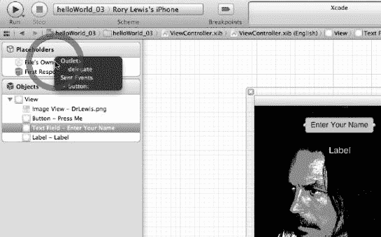

图 3–26. 当靠近 File’s Owner 时，你需要将其连接到 delegate。

26. 当你靠近 File’s Owner 时，会出现一个深灰色的上下文对话框，提示你已经将 File’s Owner 连接到了按钮和 delegate，但你知道，它实际上还是悬空的。你需要将 `textBox` 连接到 delegate。将鼠标直接移动到它上面，当它激活时，松开鼠标。参见图 3–26。完成这一步后，你拖入视图的所有好东西就都与头文件连接好了。用极客的方式来说就是：“哟，哥们，我所有的动作和输出口现在都功能性地连接上了！”听起来不错吧？更重要的是，你已经开始理解自己在做什么了！你把按钮、文本框和标签放到了视图上。然后将它们连接起来，使其作为输出口或动作来工作。现在剩下的工作，就是在需要的地方输入一些代码了。

### 设置编码环境

在输入代码之前，你还需要做一些准备工作。


图 3–27. 打开导航器，然后转到标准视图，并保存所有内容。

27. 首先，让我们通过点击导航器（Navigator，参见图 3–27 中的右箭头），然后点击“标准视图”（Standard View，中间箭头，编辑器部分左侧的图标），来让你的屏幕处于适合编写代码的状态。完成后，请养成保存文件的好习惯。找到你现在呈深灰色的 nib、头文件和实现文件，分别点击每个文件，然后按 `Command + S` (S) 保存。或者使用 `Apple+Option+S` 保存全部。请不要用鼠标去点保存按钮，否则我会神奇地出现，没收你的书，并宣布你成为极客的努力失败了。如果你读完这本书后决定去一家计算机公司工作，而他们看到你用鼠标保存文件，他们会嘲笑你，因为极客们就是用这种方式对待那些用鼠标保存的人的。我是认真的！


图 3–28. 打开 ViewController 的实现文件，并删除不必要的样板代码。

28. 点击 ViewController 的实现文件。就是那个以 `.m` 结尾的文件，比如 `helloWorld_03ViewController.m`。如图 3–28 所示，删除 `viewDidUnload` 方法。

### 创建编程路线图

现在，你已经准备好进入一些真正有用的代码了。


图 3–29. 原始的 IBAction 按钮方法，在你开始编程之前。

29. 这里有两个你需要注意的要点：第一，你所编程的内容及其位置；第二，一个路线图，它将指导你编写第一段代码：

- 看看你正在编程的内容：在图 3–22 到图 24 中，你可以看到方法 `(IBAction)button:(id)sender{…}`，它看起来与你从 Interface Builder 将动作拖拽连接到头文件中的按钮时所实例化的动作非常相似。唯一的区别在于，在实现文件中，你需要实现当用户按下这个按钮时应当发生什么。为此，你需要将分号替换为花括号，并且正是在这些花括号中，你将指示当用户按下这个按钮时具体会发生什么。

  > **注意：** 我将解释两遍：第一遍作为概述，第二遍以我为新手 Objective-C 程序员开发的具体方式进行。在本书中，我会经常这样做。这种方法效果很好，所以请耐心跟着我来一次。

- 你的路线图：参见图 3–29，你的路线图指出，你将有两个文本字符串，分别命名为 `Name` 和 `Output`。`Name`（`NSString` 类型）接收用户在 `textBox` 中输入的文字。清理 `Output NSString`，然后让它接收来自 `NSString` 的文本。将其放置在“:says Hello World!”之前后，发送到 Label 以供查看。最后，清理 `Output NSString`。

代码分为以下 5 个步骤：

1.  创建字符串来管理文本的输入和输出
2.  对文本进行操作
3.  展示你的劳动成果
4.  整理工作
5.  隐藏键盘


#### 第一步：创建字符串来管理文本输入与输出

首先，你需要在花括号内键入两条 `NSString` 语句。这样做是为了创建两个名为 `NSStrings` 的文本字符串，你将分别命名为 `Name` 和 `Output`。请确保 `NSString *Name` 的内容包含用户输入到 `textBox` 中的文本。接下来，让 `NSString *Output` 不包含任何内容，或者实际上，通过强制将其设为 `nil` 来清空它。`*` 表示指针，指向将存储每个 `NSString` 内容的内存地址。

```
- (IBAction)button:(id)sender {
    NSString *Name = textBox.text;
    NSString *Output = Nil;
}
```

#### 第二步：处理文本

在两条 `NSString` 语句下方，按照下图所示键入 `Output` 行。

```
- (IBAction)button:(id)sender {
    NSString *Name = textBox.text;
    NSString *Output = Nil;
    Output = [[NSString alloc] initWithFormat:@"%@ says: 'Hello World!", Name];
}
```

键入这段代码后，观察下面代码中的 `%@`：

`@"%@says: Hello  World!", Name];`

这将以逐步专业化的方式解释，例如：

- `%@` 将 `Name` 中的内容放在 `"says: Hello World!"` 之前。
- `%@` 将 `Name` 所指向的内存位置中的文本取出，并放在 `"says: Hello World!"` 之前。
- `%@` 将指针 `Name` 所指向的内存中的文本取出，并放在 `"says: Hello World!"` 之前。
- `%@` 将 `*Name` 处的字符串放置在 `"says: Hello World!"` 之前。

好吧，这并不太难。这些描述从完全非技术性的文本，逐步变得每次都有点技术化。在课堂上，我会组织游戏，挑战学生们分组进行自己的“通往极客之路”创新。在进入下一步之前，我要你做的，是将上述进展解释给你身边一个完全不懂电脑的人听。向他们阅读这四个要点。当他们不理解时，用你自己的话解释给他们听。你会从中学到很多东西。你们大多数人会意识到，他们可能已经看出你开始从普通人转变为极客了。

好的。继续往下说，我希望你关注这一行中的 `[[NSString alloc] initWithFormat:@`：

`[[NSString alloc] initWithFormat:@"%@ says: Hello  World!", Name];`

具体如下：

- `[[NSString alloc] initWithFormat:@` 以对人类有意义的方式分配文本 `"somebody says: Hello World!"`。
- `[[NSString alloc] initWithFormat:@` 利用苹果聪明人在其 `initWithFormat` 代码中编写的程序，在 iPhone 微处理器中分配所有这些电信号，这些代码将代表 `"somebody says: Hello World!"` 的机器语言转换为对人类有意义的文本。
- 一旦将所有内容转换为文本形式，表示 `"somebody says: Hello World!"`，你就将其存储在 `Output` 中，如下代码所示：

`Output = [[NSString alloc] initWithFormat:@"%@ says: Hello  World!", Name];`

#### 第三步：显示你的劳动成果

接下来，你需要将存储在 `Output` 中的文本显示到用户的 iPad 或 iPhone 屏幕上。此时学生常告诉我他们觉得已经完成了。不。你的文本还只是躺在微处理器内部。你需要让它显示在屏幕上，以便用户阅读。还记得你在图 3–13 中为它创建了一个完美位置吗？去那里，然后回到我这里。

很酷，对吧！你需要将 `Output` 中的文本放入 `Label` 中。所以请键入：

`label.text = Output;`

你在这里所做的，是访问了一个称为“文本属性”的内容，将其设置为 `Output` 中的任何值，然后将其显示在屏幕上的 `Label` 中。

```
- (IBAction)button:(id)sender {
    NSString *Name = textBox.text;
    NSString *Output = Nil;
    Output = [[NSString alloc] initWithFormat:@"%@ says: 'Hello World!", Name];
    label.text = Output;
}
```

#### 第四步：内存管理

现在你不需要深入探讨这个问题。但你需要防止内存泄漏。iTunes Store 拒绝你的应用最常见的原因之一就是内存泄漏。这对目前来说太复杂了，你的大脑已经很疲惫。只需知道，你使用的 `alloc` 意味着你现在需要释放内存。所以在深入后续章节的代码时，自己写一条注释作为提醒。

`//释放对象`

然后，通过键入以下代码实际释放它：

`[Output release];`

```
- (IBAction)button:(id)sender {
    NSString *Name = textBox.text;
    NSString *Output = Nil;
    Output = [[NSString alloc] initWithFormat:@"%@ says: 'Hello World!", Name];
    label.text = Output;
    [Output release];
}
```


#### 第五步：关闭键盘

当用户输入姓名并点击“完成”按钮后（参见图 3-12 的右侧图片），你需要添加一小段代码来确保键盘被关闭。

你可以通过实现一种名为`textFieldShouldReturn`的特殊委托方法来实现这一点。现在，你无需担心委托、第一响应者等概念。你只需要知道，这段代码会重新指定第一响应者，也就是你的键盘和当前处于活动状态的文本字段（用于输入姓名），然后将其保存在你的工具包中，以便在你需要清除键盘时重复使用。

```
- (BOOL) textFieldShouldReturn:(UITextField *)theTextField{
    [textBox resignFirstResponder];
    return YES;
}
@end
```

好了！你的代码部分完成了！

我希望你为自己感到自豪！你让我引导你穿越了 Objective-C 代码的一些险滩。即使你感觉自己并未完全搞懂这些代码，那也没关系。Objective-C 是一门极其困难的语言，而你能坚持读到此处，已经非常了不起了。请记住，随着你做得越来越多，一切都会融会贯通，变得得心应手。对于那些已经按照我呈现的方式理解了你目前所完成工作的人，恭喜你们！


**图 3-30.** 编写委托方法 `textFieldShouldReturn`。

图 3-30 展示了已完成按钮方法和正在借助 Xcode 代码补全功能输入的 `textFieldShouldReturn` 方法。完成后，你的编码工作就结束了。耶！


**图 3-31.** 确保你将运行到正确的目标。

首先，确保你已经保存了所有内容。现在，如果你上次是将应用运行到你的 iPad 或实体 iPhone 上，那么你需要确保将“目标”更改为 iPhone 模拟器，如图 3-31 所示。


**图 3-32.** 让我们运行它！

你在这一章付出了很多努力，现在是时候看看你的劳动成果了。点击“运行”按钮，如图 3-32 所示，让我们看看你的应用启动起来！


**图 3-33.** 应用的四种状态。

如果你使用的是自己的图片，那么你的背景图里会显示你的图片。从图 3-32 的左侧开始，向右移动：

1.  第一张图片显示的是提示用户输入姓名的文本框。
2.  一旦点击文本框，文本消失，键盘出现。
3.  第三张图片显示了用户点击“完成”按钮后的应用状态。
4.  最后一张图片展示了你所有辛勤工作的最终成果，当用户点击“点我”按钮时就会出现。恭喜你！

### 深究代码

在这些回顾中，我们将重温一些我们写过的代码，我会引用熟悉的代码，并更详细地解释这些过程。在这里，我将向你介绍一些更专业的术语，你将在后续章节以及与其他程序员交流时用到它们。

考虑一下这个类比：在 `helloWorld_01` 和 `helloWorld_02` 中，我教你如何上车、点火、踩油门、以及在前行时掌握方向盘。在 `helloWorld_03` 中，我给了你类似的指引，但当你驶向目的地时，我解释了汽车是如何混合动力工作的，它既有汽油部件，也有电力部件。我们讨论了类和方法、字符串、输出口和动作。

现在你已经到达了目的地；你已经完成了 `helloWorld_03`，我将打开引擎盖，向你展示当你踩下油门时，它是如何将汽油泵入发动机，或者有时是如何使用电动机的。当你查看引擎盖下时，我会告诉你这些部件的位置。然而，当你读到本书末尾，查看引擎盖下并深究代码时，我将会描述化油器喷射到活塞中的汽油量、电动机的确切扭矩和热量散发等等。猜猜看——你到时候就能应付自如了！

关于这一节，最后一点非常重要：“深究代码”这一节，我鼓励你阅读，但不求完全理解。即使你只理解了部分内容，也没关系。当然，如果你碰巧完全掌握了该主题的所有细节，那当然很好。然而，我建议你以轻松的心态阅读每章结尾的这些章节，因为：

-   我收到了本书第一版读者的数百封邮件，他们表示，知道可以在阅读时放空大脑，不必有理解代码的压力，这对他们来说真的很有帮助。
-   此外，我的学生们也很喜欢我在每堂课结束时，让他们关掉 Mac，放下笔，进入禅定和放空状态，只是随意地听我讲解。曾有学生敲开我办公室的门，用各种生动的方式告诉我，这种“禅定”和“放空”的方法对他们真的有效。

请注意，我的研究领域是神经系统急性脑损伤，专攻大脑和神经互联性。这种先连接神经元，然后在大脑放松时注入更深层的关联连接的方法，是我多年来一直发展的。所以，我希望你能借鉴我先前读者和学生们对此事的看法，并吸收我的理论。

> **注：** 成为一名言辞流利、知识渊博、财务上成功的程序员，需要神经上的跨越。这种跨越发生在你的大脑处于吸收新数据的状态下，且下丘脑不会释放污染神经元建立新连接能力的焦虑激素，从而允许将逻辑和代码与本体论推理联系起来。

所以，放空你自己，进入禅定状态，以一种冥想般的、无所畏惧的心态去阅读。当那个声音说：“你根本就没理解”，你要说：“没关系，刘易斯博士说了可以这样，现在走开吧！”你将用这种禅定和放空的心态来阅读以下内容：

-   Nibs、Zibs 和 Xibs
    -   实例与实例化
-   方法
    -   实例方法与类方法
-   头文件
-   检查器栏
-   NSString 字符串
-   内存管理


### Nibs、Zibs 和 Xibs

还记得在图 3–5 中，我让你打开 nib 文件时的情况吗？你可以看到它写的是“xib”，更令人困惑的是，少数开发者称其为“zib”文件。忽略它们就好，把 xib 文件读作“nib”。在丹佛最近举行的 360iDev iPhone 开发者大会上，大多数演讲者明确地将 `.xib` 文件称为“nibs”而非“zibs”。但无论我们如何称呼它们，理解这些文件的本质对我们来说都很重要。它们是什么？我们需要它们吗？你需要知道它们如何工作吗？

你还记得吗？在步骤 5 的图 3–5 中，当你点击那个 nib 文件时，是如何打开 Interface Builder 视图的？正是在这里，你看到了视图，并开始将项目拖放到你的视图设计区域。这到底是怎么回事呢？

实际上，当你从 Cocoa 或 Objective-C 的层面检查 nib 文件时，你会发现它们包含了激活 UI（用户界面）文件所需的所有信息，将你的代码转化为图形化的 iPhone 或 iPad 艺术作品。你还可以将不同的 nib 文件连接起来，创建更复杂的交互，正如你将在本书后面看到的那样。但为了继续学习，你需要在词汇表中添加两个词：“实例”和“实例化”。

- **实例**：这些文件中存放的所有信息，都是为了能够创建你输入的按钮、标签、图片等项目的实例。这一系列指令被放置并保存到你的 nib 文件中，最终形成用户界面。代码和指令共同变得真实，并被用户感知——无论是看到、听到，甚至触摸到。
- **实例化**：还记得在步骤 29 和图 3–29 中，我解释过你会看到方法 `- (IBAction)button:(id)sender{…}`，它看起来很像你在图 3–22 到图 24 中从 Interface Builder 将动作拖拽到你的头文件时所实例化的那个动作吗？实际上，“实例化”这个词在你首次保存新项目时，有时也会以类似的方式使用。计算机实例化——使其变为现实并向你展示证据——一个通过分配一组子文件而创建的项目实体。在 `helloWorld_03` 项目中，你看到了在步骤 27 中，我要求你查看那些颜色变为深灰色的 nib、头文件和实现文件？那么，这些文件是怎么来的呢？是你编程或创建的吗？不，是 Xcode 在你创建项目时实例化了它们。Xcode 为你的项目赋予了“胳膊和腿”：两个 AppDelegate 文件和两个 ViewController 文件。

> **注意**：你现在正在操纵这些“胳膊和腿”来做一些很酷的事情，我们称之为应用，并在 iTunes 商店中销售它们。

当我们告诉计算机如何以及何时获取一些内存，并将其留出用于某个特定进程或一系列进程，当所有参数都满足时，用户就能体验到这些数据（即内存中分配的任何内容），我们就说我们“创建了某个事物的实例”。有时，我们将这些描述和指令的集合或文件称为类、方法或对象。在这次代码挖掘过程中，这些术语可能看起来混在一起，像是同义词，但事实并非如此。随着你继续阅读，你会理解每个术语都是一个独特的编码工具或装置，每个都用于特定情境，并以语法正确的方式与其他实体相关联。

当我们说你在 nib 文件中创建了按钮和标签的实例时，我们真正想表达的是，当你运行代码时，计算机内存中由地址标识的特定部分，将负责处理事务，以生成你设计的用户体验。每次你的应用在 iPhone 或 iPad 上启动时，界面都会由 nib 文件中的编排指令重新创建。考虑一下与图 3–9 中所示动作相关联的 nib 文件。你从库中拖了一个按钮到视图窗口，因此你创建了这个按钮的一个实例。如果有人问你这是什么意思，你可以直视他们的眼睛，带着锐利而神秘的眼神说：

> > “通过创建这个按钮的实例，我指示计算机在适当的 `.xib` 文件中预留内存，当我的应用启动时，它会按照我的精确意图出现并与用户交互。”

哇！

#### 方法

接下来我想更深入探讨的概念是方法。就像我对 nib 文件所做的那样，这次我只给你一个高层次的概述。你已经相当广泛地使用了方法，所以我只需告诉你你做了什么。

查看图 3–23，在你将按钮拖到你的头文件后，你将其从输出口改为动作，并点击了连接按钮。然后你看到一段代码的实例出现了：

```
- (IBAction)button:(id)sender
```

我随后建议，为了让事情更清晰，你可以将方法命名为 `monkey`，使其变为：

```
- (IBAction)monkey:(id)sender;
```

在这里，你指示计算机将一个动作与按钮关联起来。

- 这段代码中的第一个符号是减号（`-`）。它表示 `monkey` 是我们称之为实例方法的东西。
- 另一方面，如果你在那里输入了加号（`+`），比如 `+ (IBAction)`，我们就会称其为类方法。

一个符号（向处理器）宣告一个实例，而另一个符号宣告一个类。不过，这两个语句的共同点是方法 `monkey`。此外，仅凭这个名称，你就可以看出这是一个将在 Interface Builder 中执行的动作。没错，这就是 `Actions` 前面的 `IB` 的含义。明白了吗？史蒂夫·乔布斯在他设计 NEXT 电脑上的 Cocoa 和 Objective-C 时，他对自己说，他想要 `Actions`，并称它们为 `IBActions`，以便提醒他自己和其他使用他代码的开发者，当我们输入 `IBAction` 时，它是为 Interface Builder 中使用的 `Actions` 准备的。

考虑一下这个类比：程序员说，“这是一个能帮助你画一所漂亮房子的应用。”这是一个头文件类型的声明。然后，程序员输入具体的指令，说明房子将如何建造，如何与景观融合/相对，背景是什么样的天气，等等。“在屏幕底部三分之一处画一条略微弯曲的地平线，在其中间位置放置一个 4×7 的矩形，矩形上方是一个底边长度为……的梯形，”等等。这些具体的操作指令属于实现文件，因为它们描述了绘制房子的实际动作——即方法。

因此，为了将你的按钮连接到一个名为 `hello` 的方法，你添加了如下代码，如图 3–24 所示：

```
- (IBAction)hello:(id)sender;
```

这创建了你的 `hello` 方法的一个实例。然后，你在内存中创建了一个位置来执行 `hello` 方法内部的代码。


##### 头文件

看看这段代码，不要从方法的角度，而是从它作为头文件的维度以及它与其实现文件的关系来审视。我希望你回到那个时间点：在你将那些我称之为“好东西”的控件拖放到头文件之后。回顾图 3–24，我希望你更多地关注粗体文本。

**注意：** 在代码中命名时，你将使用缩写 `UI` 来表示“用户界面”（User Interface）。你将使用缩写 `IB` 来表示“Interface Builder”。


这里有两件事需要注意。首先，`@` 符号与 Xcode 的最核心部分通信，它把你的代码转换成动作；其次，它要宣告一些至关重要的事情。事实上，我们把任何以 `@` 开头的语句称为“指令”。这个 `@interface` 指令告诉 Xcode，你有关于 `helloWorld_03` 的界面内容，并且具体细节将包含在花括号 `{}` 内。

在图 3–16 中，你开始将输出口拖入代码之前，请注意左花括号 `{` 内部是空的！你当时还没声明任何东西，对吧？你知道自己想做什么，所以你通过创建你的 `IBOutlet`s（Interface Builder 输出口）来写入你的 `UILabel`s（用户界面标签），并为你的按钮关联一个单独的动作，从而用 `@interface` 指令引起了编译器的注意。

##### 检查器栏

回顾第 8 步，图 3–8，在简要解释检查器栏时，我曾说过我们会更深入地探讨它。所以，说到做到，这里提供一些关于检查器栏如何设置的见解。


**图 3–34.** 聚焦检查器栏。

在图 3–33 中，我重现了我在黑板上向课堂展示检查器栏的方式。随着你熟悉 Xcode 4 环境，你会发现自己在编码的任何阶段都会使用检查器选择栏来选择所需的工作区。现在，让我们聚焦于最密集的视图：实用工具视图。点击实用工具视图，如图 3–33 右上角所示，你会看到我创建了一个放大版的检查器选择栏，其子菜单位于面板的左侧。从顶部开始：

-   **文件检查器**：用于管理项目中的文件属性，例如名称、类型和路径。
-   **快速帮助**：望文生义。
-   **身份检查器**：提供对深层内容的访问，例如类名、访问权限和标签。
-   **属性检查器**：用于调整对象可用的属性。
-   **尺寸检查器**：允许你调整界面对象的初始大小、位置和自动调整大小。
-   **连接检查器**：允许你查看界面对象的输出口和动作。
-   **绑定检查器**：用于配置视图对象的绑定。
-   **效果检查器**：用于调整选定对象的动画协议，例如过渡、淡入淡出和其他视觉特性。
-   **文件模板**：你可以从资源库拖到项目导航器中的常见模板。
-   **代码片段**：类似于剪贴画，但面向编码者——你可以通过拖拽到文件中使用的源代码片段。
-   **对象**：通过直接拖拽到 Interface Builder 编辑器窗口中的 nib 文件来使用这些界面对象。
-   **媒体文件**：顾名思义，是可以直接拖拽到 Interface Builder 编辑器窗口中 nib 文件的图形、图标和声音文件。

##### NSString

回顾一下，并更深入地探讨一下你实现文件中的 `NSString` 语句，在你编写它的时候，我已经详细地讲解过了。这里有五个与你关联 `NSString` 的术语：

-   `Output` 是你的返回值：`Output = [[NSString alloc] initWithFormat:@"%@ says: Hello World!", Name];`
-   等号的右边是消息：`Output = [[NSString alloc] initWithFormat:@"%@ says: Hello World!", Name];`
-   `NSString alloc` 是接收者：`Output = [[NSString alloc] initWithFormat:@"%@ says: Hello World!", Name];`
-   `initWithFormat` 是方法名：`Output = [[NSString alloc] initWithFormat:@"%@ says: Hello World!", Name];`
-   `@"%@ says: Hello World!"` 和 `Name` 是参数：`Output = [[NSString alloc] initWithFormat:@"%@ says: Hello World!", Name];`

##### 更多关于内存管理

在步骤 29 结束时，图 3–29，“第四步：清理工作”中，我们简要地讨论了 `alloc` 以及你如何在应用的关键时刻分配和释放内存。我想让你最后再看一次你为按钮编写的实现代码，但要站在内存泄漏和管理的角度来审视。


看上面，你可以看到你首先为字符串分配了一些内存。这由右上角标 ^(+1) 表示，表明你已经上升了一个层级并正在分配内存。每当你上升一个层级，你也需要下降一个层级，通过释放该内存，如 release 处的 ^(−1) 所示。这非常简单——当你 `alloc` 时，你需要 `release`。在 Objective-C 中，这被称为引用计数。我发现学生们感到困惑的地方是，在他们 `alloc` 之后，有时还会执行一个 `retain`。如果你确实发现在分配内存后还需要保留它，那么将其视为 [alloc+1] + [retain+1]，这意味着你已经上升了两个层级，而不是一个。这意味着你需要释放两次，而不是一次。总结一下：

-   [alloc^(+1)] 需要 + [release^(−1)]
-   [alloc^(+1)] + [retain^(+1)] 需要 [release^(−1)] + [release^(−1)]

#### 好了！

你还在这里！太棒了！至少休息 6 个小时，别因为没完全掌握你在这里钻研的所有代码而焦虑。希望你享受了禅定与专注的美妙时刻。我们第 4 章见。

## 第 4 章


