# 多图形按钮与标签

在本章中，我们将共同完成第四个程序，是时候加快一点节奏了。如同第 3 章那样，如果你还记得之前示例中反复描述的大部分步骤细节，那么你只需查看屏幕截图并实现代码即可。每个步骤对应的图示会减少，但操作步骤会增多；我们将使用第 3 章介绍的短信息流。

此外，与第 3 章一样，完成程序后，我们将在“深入代码”部分进行代码审查。首先，我们会回顾第 3 章该部分讨论的一些相同方面和概念，然后聚焦于一些新代码。我们不仅会深入一些，还会拓宽视野，思考与这一深层分析相关联的其他计算概念。

你可能还会注意到第 4 章在风格上的变化，因为我们将摆脱前几章使用的“初级”语言。在图片指引上，我也会减少手把手的指导。我将开始逐步减少箭头指引——所有信息都在那里，所以如果你不能立即在文本中找到我所指的内容，就需要稍加思考，自己寻找。把它看作一个练习，迫使你的神经元通过小步前进建立一些关联。那么，让我们加快节奏——更快一点，更高级一点，并使用更多的专业术语。

最重要的是，当我们进行到第 29 步时，我们将花二十分钟的课堂时间打开引擎盖，真正动手深入研究一些关键的代码概念，你需要理解这些概念才能继续阅读本书。别担心，我会让它变得简单。

再次强调，如果你没有完全掌握每个概念和技术，这完全没关系！放松心情，享受下一个示例。但在开始我们的第四个应用之前，我们先快速浏览一下路线图。

### 路线图回顾

到目前为止，我们已经完成了三个在 iPhone/iPad 内部说“Hello world!”的示例。你已经有机会熟悉了编程应用背景下的创作过程：带着一个想法进入，带着一个切实可行的工作产品出来。我曾多次要求你忽略那些我判断可能会让人分心或望而生畏的繁重代码。你可能也注意到，当你确实尝试理解这些较复杂的代码时，它们会以一种奇妙而混乱的方式变得有意义。那么，随着我们的进展，我们将让未知的“混乱”不再那么令人不安。

在解决这个问题之前，让我也让你放宽心：就我们的编程语言 `Objective-C` 而言，我还没见过哪个高级程序员真的认识每一个符号和命令。就像其他行业一样，人们往往会在自己的特定领域和专长方向变得非常精通（例如，将`谷歌地图`集成到游戏或应用中）。

我喜欢打这样一个比方：汽车修理工以前能够完全拆解一个发动机，然后再把它装回去——通常比原来更好。如今，汽车修理工非常专业化，只有少数人知道如何完全拆解并重组一辆特定的现代汽车。我们有福特混合动力发动机的专家，或者丰田普锐斯电路的专家，或者大型卡车的鼓式制动器专家，等等。这完全没问题！

这与你现在的学习过程类似。你刚刚成功编写了三个应用，手上沾满了“油污”。现在，如果一切按计划进行，当你进行到第 29 步时，你将更深入地探索，满怀信心地走向未来。根据经验我知道，如果学生被过于复杂或技术性的内容吓倒或压倒，他们的自信心可能会受挫。我发现，如果学生知道自己的方向，并且知道那些艰难的路段不会变得过于可怕或危险，他们就能应对前进道路上的坎坷。

### helloWorld_04: 一个基于视图的应用

此时此刻——为自己感到高兴吧！你已经相当深入`Objective-C`的森林了。如果你迷路了，请记住，除了我在本书中提供的信息（包括各种截图）之外，我还在我的网站上为你提供了截屏视频。你可以使用短网址，前往下面指出的 `rorylewis.com`，点击 `Xcode 4` 图标， 然后进入视频教程或下载页面：

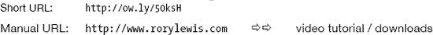

> 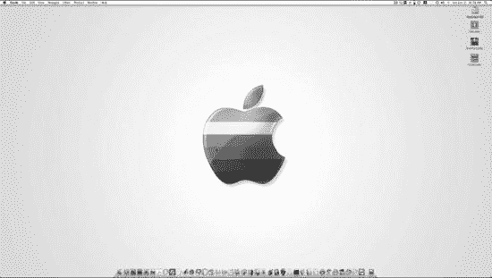

图 4–1\. 创建或下载三个 `.png` 图片文件：一个底层图、一个顶层图和一个桌面图标。将它们全部保存到简洁干净的桌面上。

1.  像往常一样，让我们从一个干净的桌面开始，只保留四个图标：你的 `Macintosh HD` 和三个图片文件（如图 4–1 中的图标所示）。我相信你现在已经明白，我认为保持桌面整洁至关重要，并且我希望鼓励你持续磨练你的组织思维。使用我们熟悉的快捷键，关闭所有程序。欢迎你下载这些图片（从 `ow.ly/5l1w8` 的下载页面或 `ow.ly/5l1wS` 的视频页面），它们将成为本项目的关键构建块，但我们更希望鼓励你寻找并准备自己的图片。这样，你对这个任务会更有热情。此时你有两个基本选择：从上述链接下载图片，或者准备你自己的图片。假设你愿意花功夫创建三个自己选择的独立图片文件，请注意以下指南。 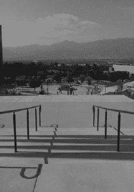

图 4–2\. `STAIR.png`；这是背景图像——即底层图。

2.  第一张图片 `STAIR.png` 的尺寸，如图 4-2 所示，将是 iPhone 标准尺寸：宽 320 像素，高 460 像素。这将是两个图像的底层，所以我们称之为背景层。我们的背景，是科罗拉多大学科罗拉多斯普林斯分校工程楼后出口台阶的照片。我们将使用这张图片作为伊曼努尔·康德的照片背景——他是有史以来最伟大的哲学家，他的哲学构成了制订宪法的众多开国元勋思想的基础。对我们来说更重要的是，他是开始绘制数学逻辑与言语词汇之间平行关系的人。程序运行时，背景将显示，一旦点击按钮，伊曼努尔·康德的照片就会出现在楼梯顶部。快速浏览一下图 4-39。多好啊——伊曼努尔·康德决定回到大学了！这就是我们的场景：在编程中，你会经常遇到这样的情况：你希望用户看到熟悉的背景，然后当按下按钮时，某个不寻常或意想不到的人（或物）突然出现。这个 `helloWorld_04` 将教会你这一点。 

图 4–3\. 这是修改后的顶层图像，它将覆盖在背景之上。


3.  为了创建第二张图像（我们称之为顶层），请复制背景图层照片（在我的示例中是 `STAIR.png`）。然后裁剪此副本，创建一个尺寸精确为 320 × 299 像素的图像。是的，我知道这个高度数值有点奇怪——但请相信我！现在你得到了一张大致呈方形的、背景照片底部三分之二的副本。接下来，在上面粘贴一张局部图像——通常是从某个有趣或不同寻常的物体中裁剪出来的部分。这将生成类似图 4-3 中的图像：伊曼努尔·康德出现在背景场景前。这个修改后的顶层当然会保存为 `.png` 文件。这样，你最终会得到一个准备好的顶层，它由原始背景照片的底部区域以及粘贴在上面的某个有趣人物或物体组成。你大概能猜到，我们将编程让计算机从背景图像开始，然后根据一些用户输入，插入顶层——当然，要确保底边完美对齐。这将营造出一种幻觉，仿佛我们那位有趣的客人或物体突然凭空出现。我们的顶层不会影响背景上半部分的空间；我们将这个区域保留给文本，稍后也会指示计算机插入文本。我们之所以采用这种方式，是因为 iPhone 和 iPad 不支持 `.png` 透明度。

**图 4-4.** 这是屏幕图标的图像！

4.  第三个图像文件是你选择的图标。正如前一章所述，你可能想要自定义你的图标。在我的示例中，我从伊曼努尔·康德的照片中截取了一部分脸部，并将其放入“图标”文件中，如图 4-4 所示。一旦你拥有了全部三张图像——底层、顶层和图标——将它们保存到你的桌面上，这样看起来就会类似于图 4-1 中显示的我的桌面。

**注意：** 请记住，iPhone 的图标建议尺寸是 57 × 57 像素，如图 4-4 所示。但请注意，如果你的应用是仅限 iPad 的应用，那么你需要制作一个更酷、稍大一点的图标，尺寸为 72 × 72 像素。请务必留意这些尺寸要求。

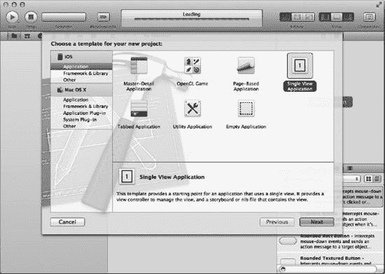

**图 4-5.** 按下 `N`，然后从“新建项目”窗口中选择“单视图应用程序”。

5.  现在，就像你在第一个示例中所做的那样，启动 Xcode，使用键盘快捷键 `N` 打开一个新项目。你的屏幕应该会显示“新建项目向导”，如图 4-5 所示。由于上一个示例，你可能会发现“单视图应用程序”模板默认已被选中。但如果你的“基于视图的应用程序”模板未被选中，请单击“基于视图的应用程序”图标，然后点击“下一步”按钮，如图 4-5 所示。

你可能会想，“基于视图的应用程序”模板通常用于帮助我们设计只有一个视图的应用，而我们刚刚创建了两个视图（楼梯图像和包含伊曼努尔·康德的修改版楼梯图像），所以应该选择另一个选项。这种推理看似合理，因为基于导航的应用程序使用多个屏幕以层次结构呈现数据。对于这个项目来说，那个选择似乎才是正确的，但实际情况并非如此。

我们将处理的仅是一个视图，我们会在其上叠加图像，而不是另一个视图。如果我们打算让一部分代码在一个导航窗格中，另一部分代码在其他导航窗格中，那么我们可能会选择基于导航的应用程序。但在当前这个项目中，我们将操控一个视图，并在其上叠加图像，而不是从一个窗格导航到另一个。本质上，我们是在用单个视图玩“障眼法”。

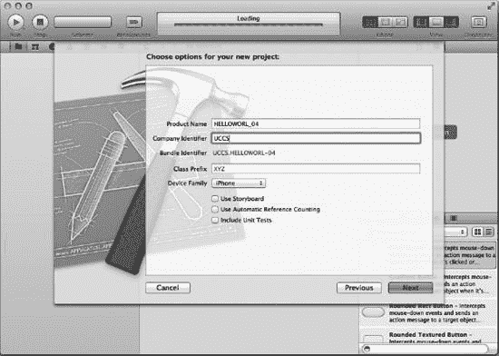

**图 4-6.** 为你的项目命名，并定义它是 iPhone 项目还是 iPad 项目。

6.  鉴于这是第四个 `helloWorld`，我们将它命名为 `helloWord_04`。在制作视频示例时，我不小心用我粗大的手指碰到了大写锁定键，所以我的项目名是全大写的，正如你在图 4-6 中看到的。我特意保留了所有错误，以使代码与视频中的完全一致：`ow.ly/5l2rb`。

**注意：** 在本章剩余部分，我会继续称这个应用为 `helloWorld_04`，即使我不小心按下了大写锁定键。你已将自己的应用命名为 `helloWorld_04`，所以我们接下来就这样称呼它。

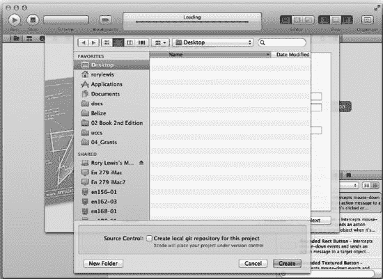

**图 4-7.** 将其保存到桌面。

7.  将你的基于视图的应用程序保存到桌面，命名为 `"helloWorld_04"`。参见图 4-7。这将是我们最后一个“Hello World！”应用。我建议，一旦你完成了这个程序，将它们全部保存在你 `Code` 文件夹内的一个 `Hello World` 文件夹中。你可能会发现自己在某个时候会回到这些文件夹来回顾代码。

在本书后面，当我们深入讲解 Objective-C 和 Cocoa 的细节时，你很有可能会挠头说道：“该死——这听起来很复杂，但我知道我以前做过这个。我想回去看看我是怎么在本书开头做的那些‘Hello World！’练习中连接这些文件的。”

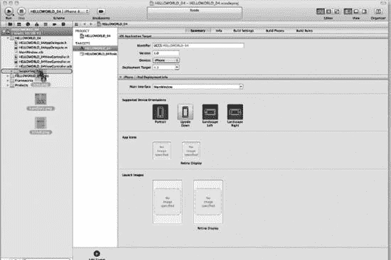

**图 4-8.** 将你的三张图像拖入 Supporting Files 文件夹。

8.  选中你的所有三张图像，并将它们拖入你的 Supporting Files 文件夹。我希望你现在开始明白，Xcode 已经实例化了一个名为 `helloWorld_04` 的项目，如图 4-8 所示。如前所述，我们正在从基础语言进阶，我会抛出一些更具体的技术术语。请注意，当文件夹高亮时，表示该对象已被选中。专注于你的光标所在位置——那是文件夹会做出反应的点。一旦它高亮，松开鼠标即可将对象放入。有时学生会感到困惑，因为看起来图像应该能够放入文件夹，但文件夹却没有高亮。这是因为只有当你拖着所有图片的鼠标悬停在文件夹上方时，文件夹才会打开或高亮。所以请记住，当你将对象拖到文件夹上时，专注于你的鼠标在哪里，忽略其他一切。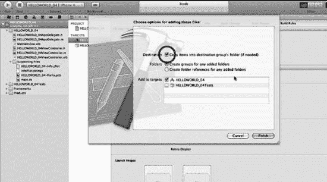

**图 4-9.** 勾选“将项目复制到目标组的文件夹中...”复选框。

9.  将图像放入 `Resources` 文件夹后，系统会提示你定义该图像是始终与它在桌面上的位置相关联，还是与代码一同嵌入并随应用程序文件一起携带，如图 4-9 所示。

我们当然希望它是嵌入的，所以请勾选“为任何添加的文件夹创建组”复选框。同时，还要勾选“为任何添加的文件夹创建组”复选框。然后点击“完成”（或按回车键）。

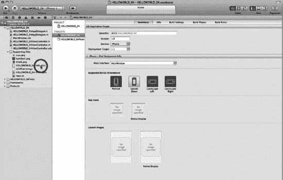

**图 4-10.** 打开 plist 文件，以便我们关联图标图片。


10. 我们创建了一个名为`icon.png`的图标图像文件。我们希望这个图标显示在 iPhone/iPad 上，而不是通用图标。为此，双击`Resources`文件夹中的`info.plist`文件，如图 Figure 4–10 所示。  
    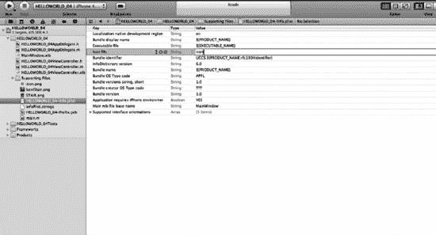  
    **Figure 4–11.** 选择图标文件的值单元格，并输入要关联为项目图标的图片名称。

11. 双击图标文件的值单元格，在空白处输入图标文件的名称：`icon`，如图 Figure 4-11 所示。然后保存你的工作。顺便提一下，plist（属性列表）是我们将在后续探索的另一个领域。现在，我们准备进入 Interface Builder，以连接和关联拼图中的各个部分。  
    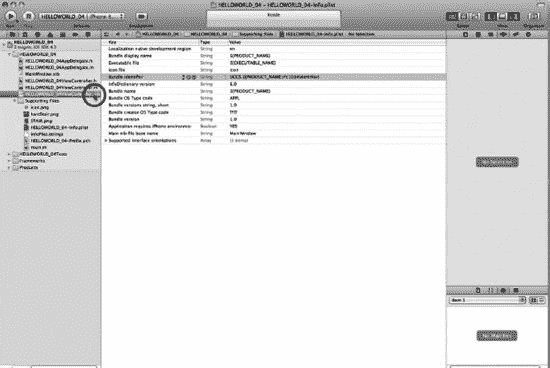  
    **Figure 4–12.** 打开你的 nib 文件。

12. 点击你的 nib 文件，如图 Figure 4-12 所示，因为现在是时候开始构建项目所需的对象了。你应该已经看到了一个模式——首先将图像放入`Resources`文件夹，然后将对象拖到视图上，最后将对象与代码连接起来。  
    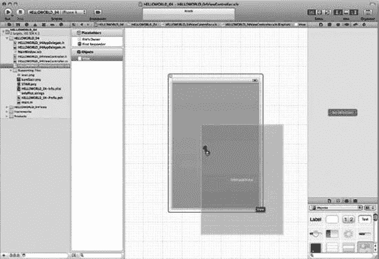  
    **Figure 4–13.** 将`UIImageView`定位到视图屏幕的底部边缘。

13. 当用户按下按钮时，顶层图像将覆盖在基础层之上。因此，我们希望以与之前相同的方式处理基础层。在库中向下滚动到 Cocoa Touch 项目文件夹，找到 Image View 图标。将一个 Image View 拖到视图框架上，如图 Figure 4–13 所示。  
    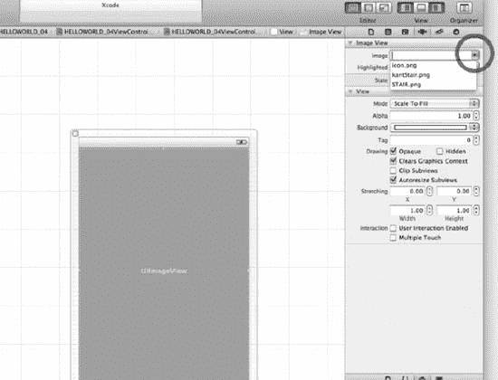  
    **Figure 4–14.** 将图像与刚刚拖到视图屏幕上的`UIImageView`关联起来。

14. 我们希望将`320 × 460 STAIR.png`连接到 Image View，以便它能够显示出来。进入 Image View Attributes 窗口的信息选项卡，打开下拉窗口并选择图像，如图 Figure 4–14 所示。  
    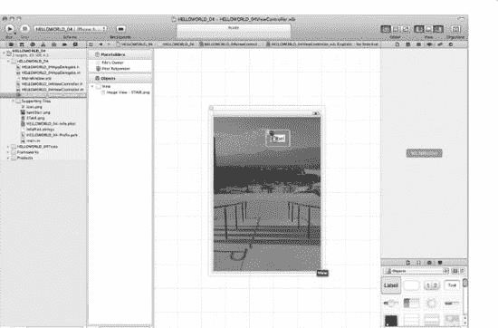  
    **Figure 4–15.** 将一个标签拖到视图上。

15. 之前，我们决定当用户按下按钮时，伊曼努尔·康德应该出现并宣布：“Hello World, I'm back!”。我们决定采用的方法是一个标签实例变量——其`text`属性被赋值为“Hello World, I'm back!”。因此，拖出一个标签作为我们的实例变量，稍后我们会将文本“Hello World, I'm back!”分配给 Base View。将标签放到视图上后，按照之前任务中调整大小的方法重复操作；即，加宽标签以容纳这段文本。参见 Figure 4–15。  
    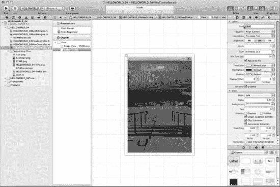  
    **Figure 4–16.** 将文本居中并设为白色。

16. 按照你之前做过的方法，在属性框架中将文本居中并将其颜色改为白色。参考 Figure 4–16，并查看右侧，可以看到居中对齐和白色文本属性已被选中。  
    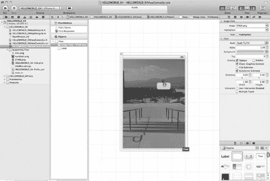  
    **Figure 4–17.** 将一个按钮拖到你的基础层上。

17. 我们希望按下按钮时图片和文本都出现，因此需要一个按钮。继续将一个按钮拖到基础层上，并在其标题字段中输入“Guess who's on campus?”，如图 Figure 4–17 所示。当用户看到一个询问这个问题的按钮时，他们会忍不住按下它。当他们按下时，我们希望伊曼努尔·康德出现，并说“Hello World, I'm back!”。你可能需要像之前一样调整按钮的大小。如果你想让按钮比我在视频中创建的更花哨，你可能希望它看起来很酷，并显示一些底层图像。仍在 Image View Attributes 窗口中，向下滚动并将 Alpha 滑块调整到大约 0.30。  
    提前思考一下，你可能想开始考虑我们即将编写的代码。我们看到了两个`IBOutlets`：一个标签和底层的基础图像。每个类别都向 Interface Builder“低语”了一些信息。一个说我们希望`UILabel`类使用由指针`*label`指向的文本；另一个说`UIImageView`类将显示一个位于指针`*uiImageView`指向位置的图像。  
    那么，到目前为止我们在 Interface Builder 中做了什么？我们安装了背景图像并插入了一个按钮，该按钮将触发这两个`IBOutlets`。现在，花一分钟时间提前思考每次将输出口拖到头文件中会发生什么，让我们从更高层次看一下我们将要做什么：  

    ```
    - (IBAction)someNameWeWillGiveTheButton:(id) sender
    ```

    实际上，这行代码调用了我们的两个伙伴，即标签和背景图像的两个`IBOutlets`。对于标签，使用：

    ```
    label.text = @"Hello World, I'm back!";
    ```

    对于图像，使用：

    ```
    UIImage *imageSource = [UIImage imageNamed: @"kantStair.png"];
    ```

    为了使上述内容在实现文件中正常工作，我们需要对头文件执行一些操作。我们必须设置标签和图像——也就是说我们需要声明它们。  
    我们将使用以下方式声明标签：

    ```
    IBOutlet UILabel *someNameWeWillGiveTheLabel
    ```

    并将使用以下方式声明图像：

    ```
    IBOutlet UIImageView * someNameWeWillGiveTheImageView
    ```

    然后，我们将做一件我们还没有做过的事情，我将在本章末尾的“深入代码”部分解释。我们将对两个`IBOutlets`执行所谓的“合成”（Synthesis）。为此，我们将运行两个`@property`语句：  

    ```
    @property (nonatomic, retain) IBOutlet UILabel *someNameWeWillGiveTheLabel
    ```

    对于图像：

    ```
    @property (nonatomic, retain) IBOutlet UIImageView *someNameWeWillGiveTheImageView
    ```

    同时，我们将在实现文件中合成上述内容，使用：

    ```
    @synthesize label, uiImageView
    ```

    好的，这是一次快速的心理旅程，展望了未来。这意味着我们已经准备好行动了。我们已经创建了一个按钮，它将调用我们的两个伙伴；我们现在需要做的就是创建图像和标签，然后将它们与代码的相应部分关联起来。  

    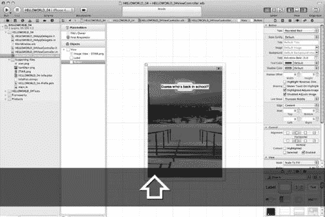  
    **Figure 4–18.** 编写按钮文本。

18. 我们需要按钮来吸引用户按下它。因此，我们将通过双击按钮并在按钮中写入文本来询问用户：“Guess who's back in school?”。你可能会注意到，按钮会巧妙地调整其大小以适应文本宽度。参见 Figure 4–18。  
    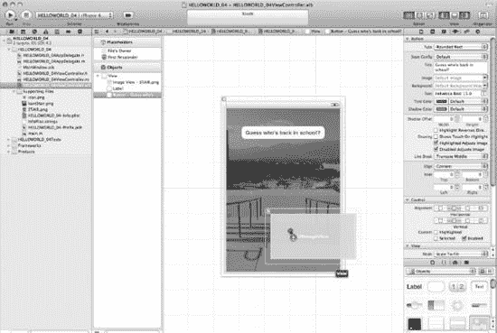  
    **Figure 4–19.** 将第二个图像视图拖到视图上。


19.  现在我们来思考一下。当按钮被按下时，我们希望 `kantStair.png` 图片显示在背景图 `STAIR.png` 之上。它是通过什么来呈现的呢？它是通过`Image View`（图像视图）加载到屏幕上的。因此，将一个`Image View`拖拽到屏幕上，如图 4–19 所示。将`Image View`拖拽到屏幕上后，我们希望它紧贴 iPhone/iPad 屏幕的底部边缘。我们不希望图片悬浮在屏幕中央，而是希望它看起来像是从底部投射出来的。将图片拖到屏幕后，直接松手即可。我们尚未配置图片的大小或位置。这是下一步要做的！

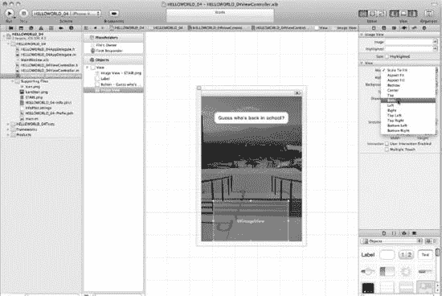
*图 4–20. 调整第二个图像视图的位置。*

20.  转到`Image View Application`对话框框架，然后点击`View`（视图）选项卡。在这里，你会看到“Center”（居中）对齐选项默认被勾选。我们需要将其更改为“Bottom”（底部），如图 4–20 所示。在进入下一步之前，请花一点时间将标签和按钮相互对齐，并与屏幕中心对齐，如图 4–20 所示。

现在，你已经完成了将项目拖拽到视图上的操作。我们有了一个标签、一个按钮和两个图像视图。现在，让我们保存所有内容，并开始为这些拖拽到视图上的项目编写一些代码。

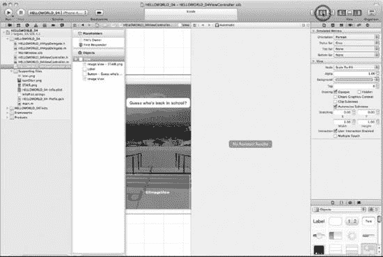
*图 4–21. 点击“助理”按钮。*

21.  现在，你希望开始调整你的屏幕视图以便编写代码。就像我们在前三个应用中做的那样，我们从界面生成器视图开始，通过点击“助理”按钮切换到编码视图，如图 4–21 所示。

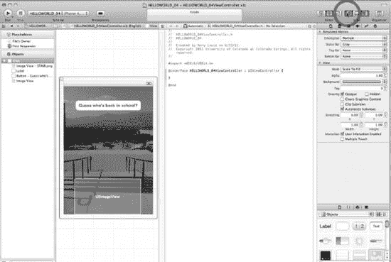
*图 4–22. 显示导航器*

22.  调用“助理”按钮后，第二个需要显示的项目是导航器，如图 4–22 所示。

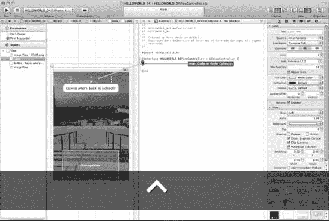
*图 4–23. 从界面生成器中的标签按住 Control 键拖拽到你的头文件中。*

23.  如图 4–23 所示，在界面生成器中单击标签一次后，按住 Control 键将其拖拽到头文件中，具体位置在`@interface`指令的花括号内。请确保持续按住 Control 键拖拽，直到看到插入指示器，如图 4–23 所示。

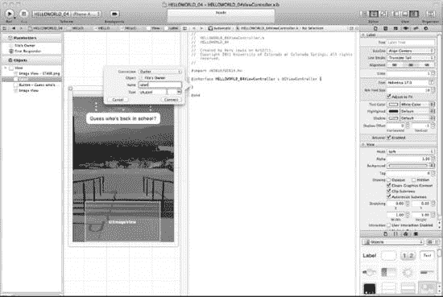
*图 4–24. 我们将标签输出口命名为“label”。*

24.  如图 4–24 所示，当你按住 Control 键将标签拖拽到`@interface`指令处时，松开鼠标将其放下，然后将其命名为“label”，并将其类型保留为“Outlet”（输出口）。

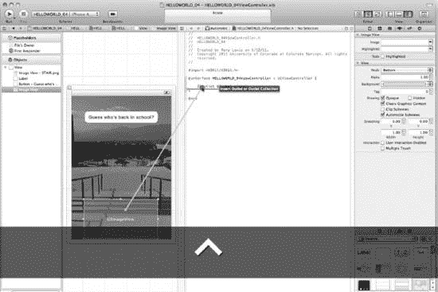
*图 4–25. 从界面生成器中的第二个`UIImageView`按住 Control 键拖拽到你的头文件中。*

25.  在界面生成器中单击第二个`UIImageView`一次后，按住 Control 键拖拽它，直到看到插入指示器，如图 4–25 所示。请确保在拖拽到头文件时，将其放置在`@interface`指令的花括号之间——直接位于你刚刚创建的标签输出口下方。

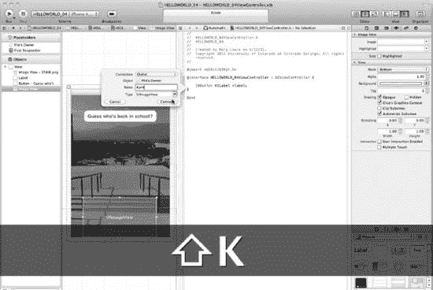
*图 4–26. 我们将第二个`UIImageView`输出口命名为“Kant”。*

26.  如图 4–26 所示，当你按住 Control 键从第二个`UIImageView`拖拽到`@interface`指令处时，松开鼠标将其放下，然后将其命名为“Kant”，并将其连接类型保留为“Outlet”（输出口）。

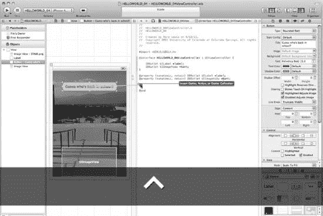
*图 4–27. 将按钮按住 Control 键拖拽到你的头文件中。*

27.  单击按钮一次，然后按住 Control 键将其拖拽到`@interface`指令及其花括号下方的区域。如图 4–27 所示。

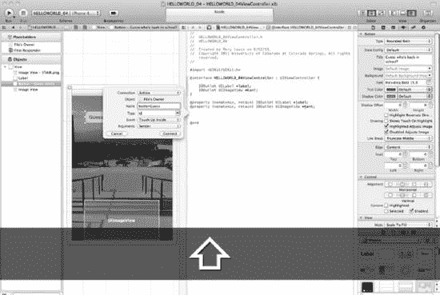
*图 4–28. 打开下拉菜单，将连接类型更改为操作。*

28.  将对话框顶部下拉菜单中的连接类型从“Outlet”（输出口）更改为“Action”（操作）。就像我们之前做的一样。参见图 4–28。

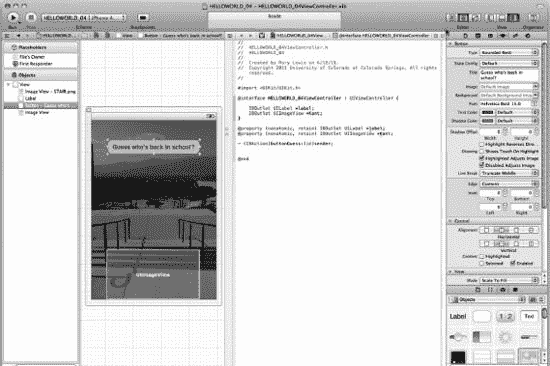
*图 4–29. 完成合成和按钮操作后，你的代码应如下所示。*

29.  此时，我们将集中精力思考我们在做什么。在课堂上，我会确保学生百分之百专注于这一部分。我要求他们用自己的话重写这一部分。我还在小测验、期中考试和期末考试中都包含了这一部分。对于在家自学的读者，我要求你在头脑清醒时阅读此内容，并反复阅读，将以下内容转化为你自己的笔记。站起来，拿一支笔和一张纸，用自己的话重写这一部分——就像我在教室里让我的学生做的那样。

**注意：**不要在你的 Mac 上写，因为那样你可能会开始复制粘贴。站起来，拿一支笔和一张纸。这一点至关重要。

我们将编写我之前提到过的语句，我们称之为“合成”语句。然而，要真正理解它，我们还需要更深入地研究输出口和操作，因此在本节中，我们将讨论`IBOutlets`、指针、管理与控制的属性以及添加`IBActions`。不过，在此之前，让我们先看看你的头文件中有什么，我们将更改什么，以及我们将重点关注什么。

到目前为止，你的代码看起来是这样的（图 4-29）：

```
#import <UIKit/UIKit.h>

@interface helloWorld_04ViewController : UIViewController {

    IBOutlet UILabel *label;
    IBOutlet UIImageView *Kant;
}

- (IBAction)buttonGuess:(id)sender;

@end
```

现在，请将粗体文本输入到你的代码中，无需思考你在做什么：

```
#import <UIKit/UIKit.h>

@interface helloWorld_04ViewController : UIViewController {

    IBOutlet UILabel *label;
    IBOutlet UIImageView *Kant;
}

@property (nonatomic, retain) IBOutlet UILabel *label;
@property (nonatomic, retain) IBOutlet UIImageView *Kant;

- (IBAction)buttonGuess:(id)sender;

@end
```


### 理解 `IBOutlets`

在之前的章节中，我们已经详细讨论过 `.m` 和 `.h` 扩展名。我们一直在做大多数 Cocoa 和 Objective-C 程序员所做的事情——从编写头文件开始。用极客的话来说，你会说：“将对象拖到视图上后，我们打开了头文件，并通过控制拖拽将 `IBOutlets` 和 `IBActions` 添加到了头文件中。”如果有人到论坛上问你如何解释，你可能会告诉他：“点击 `Classes` 文件中的展开三角形，然后打开扩展名为 `ViewController.h` 的文件！”

你已经编写过三个头文件了，因此应该已经习惯于快速浏览这部分代码。但这次我们要放慢脚步，思考一下我们到底在做什么。在之前的所有示例中，我们只需要使用一个 `IBOutlet`，它是一个允许我们与用户交互的东西。这个说法太初级了，让我们更具体、更技术化一点。让我们深入探讨 `IBOutlet` 的本质，这样当我们进入“深入代码”部分时，你就能真正理解它。

看看用粗体标出的代码，看看我们是否能够更深入地理解这些元素：

```
#import <UIKit/UIKit.h>

@interface helloWorld_04ViewController : UIViewController {

    IBOutlet UILabel *label;
    IBOutlet UIImageView *Kant;
}

@property (nonatomic, retain) IBOutlet UILabel *label;
@property (nonatomic, retain) IBOutlet UIImageView *Kant;

- (IBAction)buttonGuess:(id)sender;

@end
```

看第一行：

```
#import <UIKit/UIKit.h>
```

这使我们能够使用 `IBOutlet` 关键字。我们用 `#import` 引入 `UIKit`，它是庞大的核心代码库（称为 `IPhoneRuntime`）中的用户界面（UI）框架，而 `IPhoneRuntime` 是 Mac 上 OS X 操作系统的精简版本。当然，`IPhoneRuntime` 更小，以便能装进 iPhone 或 iPad。

当我们引入 `UIKit` 框架时，它使我们能够使用苹果已经为我们编写的大量代码——这些代码被称为类——其中就包括你已经使用过的、非常酷且流行的类：`IBOutlet`。`IBOutlet` 关键字是一个特殊的指令，称为“实例变量”，它告诉 Interface Builder 显示你想要出现在用户 iPhone 或 iPad 上的项目。反过来，Interface Builder 利用这些“提示”告诉编译器你将把对象连接到你的 `.xib` 文件。Interface Builder 并不会连接这些输出口，但它会告诉编译器你将添加它们。

整理一下我们即将使用的内容：1）楼梯的背景图片；2）康德的上层图像；3）他“返回”校园时会“说”的文本。在我们的练习中，我们将使用两个 `IBOutlets`——一个处理标签中的文本，即康德说的“Hello World, I'm Back!”，另一个处理第二个视图，康德会在那里神奇地出现。

了解了我们需要两个 `IBOutlets` 之后，我们可以想象它看起来会是什么样子。我们首先关注 `@interfacetestViewController : UIViewController` 后面的大括号内的内容。我们的代码需要如下所示：

```
#import <UIKit/UIKit.h>

@interface helloWorld_04ViewController : UIViewController {

IBOutlet UILabel *label;
IBOutlet UIImageView *Kant;
}

@property (nonatomic, retain) IBOutlet UILabel *label;
@property (nonatomic, retain) IBOutlet UIImageView *Kant;

- (IBAction)buttonGuess:(id)sender;

@end
```

如你所见，仅看粗体代码并假设你除了粗体代码之外没有编写任何其他代码，这些 `IBOutlets` 只是占位符；一个用于生成康德所说的文本，另一个用于生成叠加在背景上的图片。

我们知道，当我们向 iPhone 或 iPad 屏幕输出文本时，会使用 `UILabel` 类。这个类用于绘制多行静态文本。因此，继续在你的第一个 `IBOutlet` 旁边输入 `UILabel`，如下代码所示。现在，考虑第二个 `IBOutlet` 需要什么。我们知道要叠加如图 4-03 所示的上层图像。这里的一个好主意是使用 `UIImageView` 类，因为它提供了苹果编写的代码，可以显示单张图像或一系列动画图像。说完这些，在你的第二个 `IBOutlet` 旁边输入 `UIImageView` 类：

```
#import <UIKit/UIKit.h>

@interface helloWorld_04ViewController : UIViewController {

IBOutlet UILabel *label;
 IBOutlet UIImageView *Kant;
}

@property (nonatomic, retain) IBOutlet UILabel *label;
@property (nonatomic, retain) IBOutlet UIImageView *Kant;

- (IBAction)buttonGuess:(id)sender;

@end
```

如你所见，现在我们说有两个 `IBOutlets` 就说得通了：

- 我们让其中一个调用 `UILabel` 类来控制文本。
- 我们让另一个调用 `UIImageView` 类来控制第二张图像。


### 指针

既然我们已经掌握了将文本和图像推送到 iPhone/iPad 屏幕上的方法，接下来就需要指定具体是哪些文本和图像。有时我们会使用苹果公司预先定义好的代码，这些代码通过引用或指向我们的资源（即文本和图像）来发挥作用。正如你开始意识到的，这就是我们使用指针的上下文。

在之前的例子中，我们告诉你不用去担心那个星号（`*`）。好吧，现在是时候来看看它了。让我们先集中注意力，了解一下这些（`*`）——指针——是如何工作的。我们需要一种间接的方法来将文本和图片放到屏幕上。之所以说“间接”，是因为你不会亲自编写代码来完成这个任务——而是会使用苹果公司的代码来获取它们。你会调用预先存在的类，然后这些类会调用你的文本和图像。这就是为什么我们说这是一种获取你内容的间接方式。

考虑一个简单的类比。假设你亲手逮捕了一名闯入你家的窃贼。你报警后，警察到达时，你指着罪犯说：“这就是小偷！”然后，由警察（而不是你）将罪犯带走并起诉。

现在，你想在 iPhone/iPad 上显示文本。你调用 `UILabel`，等它“到达”时，你指着你的文字说：“这就是文本。”然后，由 `UILabel`（而不是你）来处理这段文本。

同理，当你想在 iPhone/iPad 上显示图像时，你调用 `UIImageView`，等它“到达”时，你指着你的照片或图片说：“这就是图像。”然后，由 `UIImageView` 代码（而不是你）来处理这张图片。

也许你正在问自己，这些指针的名字是什么，或者应该是什么。好消息是，你可以随意给它们命名。让我们将 `UILabel` 指向 `*label`，将 `UIImageView` 指向一个名为 `*Kant` 的指针。那么，再看看你刚刚写好的代码：

```
#import <UIKit/UIKit.h>

@interface helloWorld_04ViewController : UIViewController {

    IBOutlet UILabel *label;
    IBOutlet UIImageView *Kant;
}

@property (nonatomic, retain) IBOutlet UILabel *label;
@property (nonatomic, retain) IBOutlet UIImageView *Kant;

- (IBAction)buttonGuess:(id)sender;

@end
```

苹果公司一些聪明的人这样描述他们创建和编写 `IBOutlet` 的初衷：是为了向 Interface Builder 提供一个提示，告诉它在布置界面时应该“期望”做什么。

- 一个 `IBOutlet` 向 Interface Builder“耳语”：`UILabel` 类将使用 `*label` 指针所指示的文本。
- 另一个 `IBOutlet` 向 Interface Builder“耳语”：`UIImageView` 类将使用 `*Kant` 指针所引用的图像。

我们还没说完。在告诉 Interface Builder 该期望什么之后，我们需要通过编译器告诉 Mac 的微处理器：一个重要的“事件”即将降临。编译器最关心的事情之一就是某个对象何时到达。这是因为对象是独立的数据和符号集合，它们会占用微处理器资源并对其提出重大需求，因此，作为程序员的你需要告诉处理器何时需要接收该对象并将其放入内存中的一个特殊位置。

对象可以有多种类型——在概念上可以像鸟、大师、足球和房子一样各不相同。因此，为了让处理器在需要时能够完成其工作，我们需要告知它：我们将要在代码中使用的每个对象都有两个特定且唯一的参数或特性：属性和类型。

别慌！提供这些信息其实很简单，只需要两步。

第一步就是我们刚刚讲过的：通过定义对象的两个特定且唯一的特性（属性和类型），来预先告知编译器我们会用到哪些对象。第二步是这样的：当微处理器接收到这些数据时，它会通过综合处理（synthesizing）来利用这些信息。

- 首先，我们声明我们的对象拥有一个特定类型的属性。
- 其次，我们指示计算机实施（或综合）这一信息。

换句话说，我们通过声明对象（包括对其属性的具体描述参数）来告知编译器该对象的信息。然后，我们通过告诉编译器综合（synthesize）该对象，来授权它实施我们的对象。

但我们如何进行声明和实施呢？我们在代码中使用一种叫做指令（directives）的工具。我们通过在指令前加上 `@` 来发出信号。这意味着，要声明我们的对象拥有什么属性，我们可以在单词 `property` 前面加上 `@` 符号，使其成为一个属性指令：`@property`。

当我们在代码中看到 `@property`，我们就知道它是一个属性指令。同样地，当我们想告诉编译器进行处理和综合，也就是对对象进行操作时，我们在综合语句前加上 `@` 符号：`@synthesize`。

把我们刚才说的用“极客”语言重述一遍就是：

- `@property` 指令声明我们的对象拥有一个特定类型的属性。
- `@synthesize` 指令实现在 `@property` 指令中声明的方法。

很简单，是吧？好了，现在只剩最后两点，然后我们就回到代码部分。


#### 属性：管理与控制

首先我想说明的是，我们还需要指定这个属性是只读还是可读写。换句话说，我们需要指定它是始终保持不变，还是可以变为新的内容。用行话来说，这叫做可变性。大多数情况下，我们将使用苹果代码来处理与对象相关的属性可变性。

为了指示苹果代码处理可变性属性，我们会将属性声明为 `nonatomic`。要合理运用这个术语，可以尝试将 `nonatomic` 与 `atomic` 进行对比。回想一下，`atomic` 意味着强大，它暗示着能够进入微观世界并产生影响。因此，`nonatomic` 必然意味着不那么强大、更浅层且不可操控。

如果我们将某个属性（如可变性）指定为 `nonatomic`，基本上是在说：“苹果，请帮我们处理可变性及相关问题——我真的不在乎。我相信你的处理！” 以后，你可能会想直接控制这个属性，届时可以将其指定为 `atomic`。不过现在，我们将采用更宽松的方式，让苹果处理微观事务。所以，当需要选择其中一种指定方式时，直接使用 `nonatomic` 即可！

关于这一点，我想做的第二个说明涉及内存管理。我们需要解决一个问题：当我们存储一个对象时，如何让 iPhone/iPad 知道它是只读还是可读写。换句话说，我们需要能够向计算机传达与对象相关联的内存的本质——即谁可以更改它、何时以及如何更改。一般来说，我们希望能控制这些信息，并将其掌握在自己手中——也就是保留它。随着你继续学习本书中的后续练习，我们会将代码控制在自己手中；我们将保留管理内存的权利。

我们可以将这些细节总结添加到属性指令中，以及如何修改代码，如下所示：

*   `@property (nonatomic, retain)` 指令的含义如下：
    *   可变性应为 `nonatomic`。苹果，请处理这个问题！
    *   内存管理是我们想要 `retain` 的部分。我们将保持控制权。
*   `@synthesize` 指令用于实现我们在 `@property` 指令中声明的方法。

我们还需要为这种组合增加一层复杂性。我们将这些指令添加在两个不同的文件中。我们在头文件中使用一条语句定义 `@property` 指令，然后在实现文件中使用 `@synthesize` 指令来实现它。

*   头文件：`helloWorld_04_ViewController.h`

```objc
@property (nonatomic, retain) //“我们的内容”
```

*   实现文件：`helloWorld_04_ViewController.m`

```objc
@synthesize //我们在头文件的 @property 中定义的“我们的内容”。
```

我们需要为我们的两个 `IBOutlets` 分别编写两个这样的指令：一个用于文本，另一个用于图片。此外，因为我们仍然在头文件中，所以在实现文件中合成时也需要重复这一步。好了，现在开始输入你的代码：

```objc
#import <UIKit/UIKit.h>

@interface helloWorld_04ViewController : UIViewController {

    IBOutlet UILabel *label;
    IBOutlet UIImageView *Kant;
}

@property (nonatomic, retain) IBOutlet UILabel *label;
@property (nonatomic, retain) IBOutlet UIImageView *Kant;

- (IBAction)buttonGuess:(id)sender;

@end
```

是的，为了解释 `@property (nonatomic, retain)` 这一句，似乎说了很多。不过请记住，我们正处于深入探讨的阶段……我们告诉计算机，我们希望苹果处理可变性，但我们希望保留对内存的控制权。稍后，我们将在实现文件中为这两个 `IBOutlets` 合成这些命令。

`IBOutlets`？还记得它们吗？哦，对了——让我们回到程序的那部分。文本的 `IBOutlet` 是带指针 `*label` 的 `UILabel`，因此我们输入了如下代码来控制标签的文本：

```objc
#import <UIKit/UIKit.h>

@interface helloWorld_04ViewController : UIViewController {

    IBOutlet UILabel *label;
    IBOutlet UIImageView *Kant;
}

@property (nonatomic, retain) IBOutlet UILabel *label;
@property (nonatomic, retain) IBOutlet UIImageView *Kant;

- (IBAction)buttonGuess:(id)sender;

@end
```

图片的 `IBOutlet` 是带指针 `*uiImageView` 的 `UIImageView`，因此请为图片输入代码：

```objc
#import <UIKit/UIKit.h>

@interface helloWorld_04ViewController : UIViewController {

    IBOutlet UILabel *label;
    IBOutlet UIImageView *Kant;
}

@property (nonatomic, retain) IBOutlet UILabel *label;
@property (nonatomic, retain) IBOutlet UIImageView *Kant;

- (IBAction)buttonGuess:(id)sender;

@end

    IBOutlet UIImageView *uiImageView;
```

头文件处理完了吗？还没有。我们需要看一下我们的 `IBActions`。我们已经分析了两个 `IBOutlets`，但现在我们要分析一下我们用于……你能猜到吗？的 `IBAction`。


#### 添加 IBActions

是的，我们需要一个按钮！所以我们为按钮创建了一个 `IBAction`，如图 4–28 所示。我们本可以再次“深入” `IBAction` 的代码内部，但这一节已经很有挑战性了。我们将这一元素的技术部分留给“深入代码”环节。现在，先直接输入这里高亮显示的新代码。看看你是否能预测不同部分（即参数）的功能，我们稍后便会揭晓答案。

这就是我们要关注的内容：

```
#import <UIKit/UIKit.h>

@interface helloWorld_04ViewController : UIViewController {

    IBOutlet UILabel *label;
    IBOutlet UIImageView *Kant;
}

@property (nonatomic, retain) IBOutlet UILabel *label;
@property (nonatomic, retain) IBOutlet UIImageView *Kant;

- (IBAction)buttonGuess:(id)sender;

@end
```

现在，立刻出去休息一下。

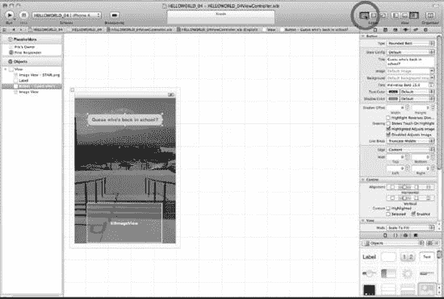  
图 4–30. 离开助理编辑器，点击标准编辑器。

30. 现在我们需要重新绘制用户界面，以便处理实现文件。我们需要离开助理编辑器，点击标准编辑器，如图 4–30 所示。

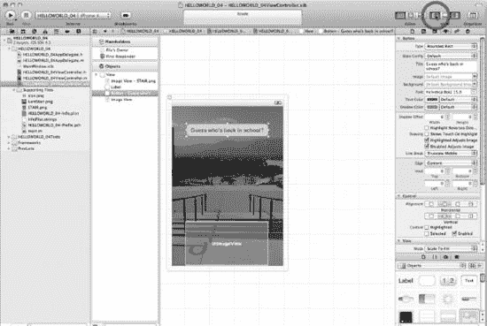  
图 4–31. 显示导航器。

31. 现在我们需要显示导航器，以便从头文件跳转到实现文件。当然，我们有很多不同的方法可以实现，但为了简单起见，请先按照这里的步骤操作。见图 4–31。

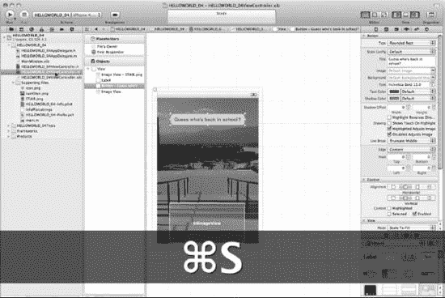  
图 4–32. 保存工作并打开实现文件。

32. 目前，界面生成器显示的是我们的 `.nib` 文件。保存所有内容，然后转到导航器并点击实现文件（`.m`），如图 4–32 所示。

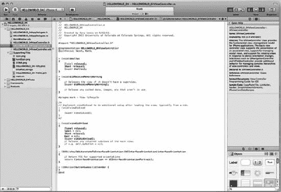  
图 4–33. 打开实现文件后，我们就可以编码了。

33. 现在你已经打开了实现文件，让我们看看 图 4–33 并首先思考一种提供合成（synthesis）的方法。我们在头文件中已经为标签文本和 Kant 图像设置了 `@property` 指令，这样我们就可以在实现文件中为这两个 `IBOutlets` 编写 `@synthesize` 语句——那么现在就开始吧。输入如下所示的合成代码：

```
#import "helloWorld_04ViewController.h"

@implementation helloWorld_04ViewController
@synthesize label, Kant;

- (void)dealloc
{
    [label release];
    [Kant release];
    [super dealloc];
}
...

- (IBAction)buttonGuess:(id)sender {
}
@end
```  
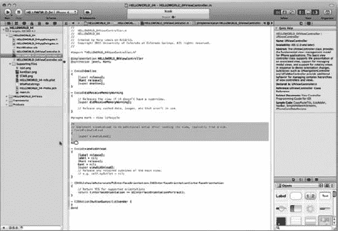  
图 4–34. 删除 `viewDidLoad` 代码。

34. 我们不需要 `viewDidLoad` 代码，因为我们对其处理方式稍有不同。因此，选中它并删除，如图 4–34 所示。

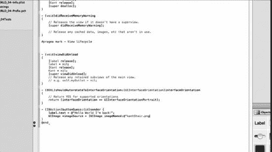  
图 4–35. 编写 `buttonGuess` 方法的前两行代码。

35. 如图 4–35 所示，我们现在准备编写当用户按下按钮时将执行的代码。换句话说，我们现在准备编写按钮的代码。向下滚动，直到找到 `buttonGuess` 方法，它存在但当前是空的。

```
#import "helloWorld_04ViewController.h"

@implementation helloWorld_04ViewController
@synthesize label, Kant;
...

- (IBAction)buttonGuess:(id)sender {

}

@end
```

当用户运行这个应用程序并按下按钮时，康德的图像会立即出现在背景楼梯的顶部。他将通过嵌入的文本“说”一些话。比如，“你好，世界，我回来了！”为了实现这一点，我们需要将标签实例变量与我们所需文本所赋值的文本属性关联起来，如下所示：

```
#import "helloWorld_04ViewController.h"

@implementation helloWorld_04ViewController
@synthesize label, Kant;
...

- (IBAction)buttonGuess:(id)sender {
label.text = @"Hello World I'm back!";
}

@end
```

完成了文本编码任务后，我们现在需要添加代码来显示康德的图像。为此，我们将使用一个名为 `imageNamed` 的类方法，该方法将显示 `kantStair.png` 图像，即我们在项目开始时准备的顶层照片。在刚刚输入的文本代码下方，立即输入以下代码中加粗的那一行：

```
#import "helloWorld_04ViewController.h"

@implementation helloWorld_04ViewController
@synthesize label, Kant;
...

- (IBAction)buttonGuess:(id)sender {
label.text = @"Hello World I'm back!";
UIImage *imageSource = [UIImage imageNamed:@"kantStair.png"];

}

@end
```

我们为图像起的指针名称是 `Kant`，但此时 `kant.png` 图像文件位于 `UIImage` 分配的指针 `imageSource` 中。

```
#import "helloWorld_04ViewController.h"

@implementation helloWorld_04ViewController
@synthesize label, Kant;
...

- (IBAction)buttonGuess:(id)sender {
label.text = @"Hello World I'm back!";
UIImage *imageSource = [UIImage imageNamed:@"kantStair.png"];
}

@end
```

我们需要将这个自动分配的指针 `imageSource` 赋值给康德图像，如下列代码所示：

```
#import "helloWorld_04ViewController.h"

@implementation helloWorld_04ViewController
@synthesize label, Kant;
...

- (IBAction)buttonGuess:(id)sender {
label.text = @"Hello World I'm back!";
UIImage *imageSource = [UIImage imageNamed:@"kantStair.png"];
Kant.image = imageSource;
}

@end
```

如果现在对此还不太明白，没关系。确实有很多实体以“image”作为其名称、对象或关联的一部分，这很容易让人混淆。我们会在后续内容中更深入地探讨这个主题，所以现在不必为此纠结！图 4–36 展示了此时你的代码应该呈现的样子。现在按 `Cmd+S` 保存你的工作，并为自己鼓鼓掌吧。你已经比前几章更深入地学习了头文件和实现文件。尽管你之前接触过其中一些技术功能，但你再次勇敢面对它们，并保持开放心态以求更深入的理解。同时，你还攻克了一个非常困难的概念：合成（synthesis）。

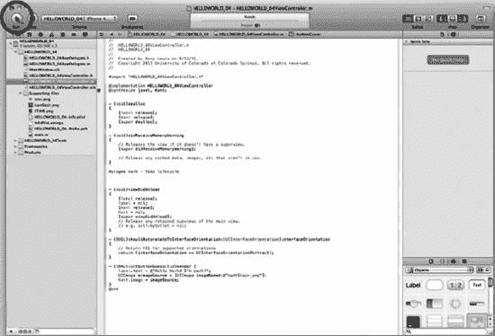  
图 4–36. 代码编写完毕，让我们运行它。

36. 现在我们已经完成了代码编写，让我们运行它，看看是否有错误。见图 4–36。

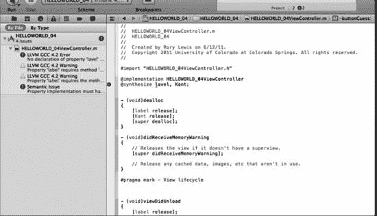  
图 4–37. 错误！标签拼写错误。

37. 如图 4–37 所示，我们遇到了错误。很明显 `lavel` 应该是 `label`，所以我把它改成了 `label`。当然，你的打字技术比我好得多，所以这对你来说不算什么——除非你一丝不苟地跟着视频中的每一步操作。不过，修正了拼写错误之后，让我们保存并再次运行。

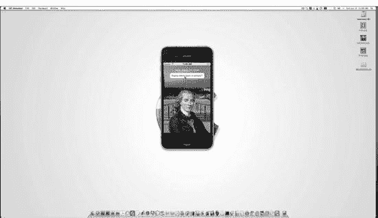  
图 4–38. 运行时的屏幕。

38. 图 4–38 显示了你的屏幕，`helloWorld_04` 正在运行，并且按钮已被点击。注意，图标仍然在侧边，其下方是 `helloWorld_04` 文件夹。

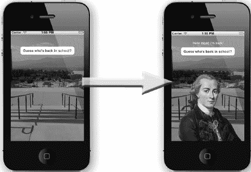  
图 4–39. 两个 `helloWorld_04` 视图。


39\. 图 4-39 展示了`helloWorld_04`的两个视图。第一个视图是应用首次打开时我们看到的画面。如果你使用了自己的图片，当然画面会有所不同，但除了背景图之外，你的屏幕应该看起来非常相似。第二个图像是点击按钮后出现的画面。标签文字出现，第二张图像叠加在底层图像之上。

### 深入解析代码

在本节中，让我们聚焦于本章前面遇到的一些关键组件。我想再多谈谈`IBOutlets`和`IBActions`——具体来说，它们是如何包含关键字……甚至准关键字的。我们还将涉及指针及其与代码中地址的关系。

#### IBOutlets 和 IBActions

之前，我们使用了`IBOutlet`和`IBAction`这两个关键字，现在我们要讨论一些相关概念。严格来说，许多程序员认为它们是“准关键字”。

Objective-C 的 Appkit 将原始 C 语言预处理指令（例如`#define`）转换为了可用的预处理指令。用极客的话说，我们将其念作“井号-定义”。

注意：在美国，`#`号常被称为“井号”（pound sign），尤其在 Objective-C 和其他编程语境中。在英国，它被称为“哈希”字符。许多 iPhone/iPad 开发者最近开始将`#define`预处理指令简称为“define 指令”。

`#define`预处理指令告诉计算机用一样东西替换另一样东西。这个概念很简单，对吧？例如，如果我要编程让计算机每次看到你名字的实例时就替换成`100`，我们的 C 代码会像这样：

```
#define yourName 100
```

这会告诉计算机，每次处理`yourName`（一个识别你真实姓名的变量）时，就替换成`100`。

现在回到 Xcode 和我们的主题。在这个语境下，`IBOutlet`和`IBAction`这两个准关键字实际上并没有被定义成任何实质内容。换句话说，它们对编译器（计算机的核心）来说并不做任何实质性的事情。

不过，准关键字是标志，它们在 Interface Builder 的通信中很重要。当它看到`IBOutlet`和`IBAction`准关键字时，就会准备好其内部代码来执行特定任务。它会准备好处理实例变量以及我们在那个编程领域中所建立的所有钩子和连接。

#### 关于指针的更多内容

许多编程学员难以理解“指针”的概念——有时也被称为间接寻址的概念。解释这个想法并不容易，因为它是 C 语言最复杂的特性之一。

在本章前面，我打过一个比方：看到一个罪犯在做坏事，然后报警，并告诉警察他的位置——这样警察（而不是你）就能逮捕罪犯。这个比喻对很多学员有效，但现在让我们更深入一点。

如果你去问一位计算机科学教授什么是“指针”，他可能会说：“指针保存着变量或方法的地址。”

“地址？”你问道。好吧，考虑一下这个新的解释性比喻。

你有没有看过这样的电影：侦探或一对疯狂的夫妇四处奔波，寻找藏宝图的线索、失窃的画作或被绑架的女儿？有时他们会发现一个指纹、一张收据，甚至是一个信封，里面装着一张写有神秘信息的纸——这些会让人们离目标更近一步——最终找到丢失的物品本身。

我们可以把这些称为指针；它们指示要去的下一个地方——以解决给定的问题。它们不一定给出处理并解决所有事情的最终地址，而是给出中间地址或地点，让我们继续工作。

因此，计算机科学教授的意思是，指针实际上并不包含它们所指向的东西；它们包含代码中所需对象、动作或实体的位置——即地址。这一重要特性使得 C 系列语言非常强大。

这个简单的想法将复杂任务变成简单任务变得非常高效。指针可以将值传递给类型，将参数传递给函数，表示大量数字，并操控我们管理计算机内存的方式。你们很多人可能在想，指针和代数世界中的变量很相似。正是如此！

在我们第一个比喻中，指针让一个手无寸铁的市民通过间接方式（即报警来解决问题）逮捕了一名危险的罪犯。（是的，“间接”这个词选得有点奇怪，因为实际上我们是朝着目标被指引。）

考虑下面的例子，我们使用一个指针来指引我们找到你的银行账户余额。为此，我们定义一个名为`bankBalance`的变量如下：

```
int  bankBalance = $1,000;
```

现在，我们再引入一个变量，叫它`int_pointer`。假设为了论证起见，我们已经声明了它。这将使我们能够通过以下声明，使用间接方式间接连接到`bankBalance`的值：

```
int  *int_pointer;
```

这个星号（即星标）告诉 C 系列语言，我们的变量`int_pointer`被允许间接访问变量（占位符）`bankBalance`中金额的整数值。

最后，我想提醒你，并且承认，我们在这里的深入探讨并不是对这些主题的详尽或严谨探索……只是一次关于一些相关想法的有趣拓展。在这一点上，即使你没有完全理解指针，也完全不必困扰。种子已经播下，这才是目前最重要的！


#### 你已经说过了“你好！”……但现在，轮到 INDIO 了！

我们可以将大多数 iPhone 和 iPad 应用划分为四种不同的功能：交互（Interaction）、导航（Navigation）、数据（Data）和输入/输出（I/O）。我们已经见过足够多的应用，知道我们可以与它们进行交互；可以从一个屏幕导航到另一个屏幕；可以操作和利用数据；还可以提供输入（打字、粘贴、语音）并接收输出（图像、声音、文本、乐趣！）。

在我们再次聚焦，从这些特定领域中的任何一个入手编写程序之前，我们首先需要更好地理解 iPhone/iPad 编程的这些不同方面是如何工作、呈现和运作的。我们还需要了解它们的局限性，以及在预期或期望的用户体验方面的利弊，并且，由于上述差异，还要考虑应用是为 iPhone 还是 iPad 开发的。在 `helloWorld_04` 中，你可能并未察觉，但我们继续深入探讨了 INDIO——交互、导航、数据和输入/输出。我们的代码通过不同的方式获取了两张图片，这些图片将与用户进行交互。这次练习让我们更接近 INDIO 的 I/O 方面，但我们还没有完全理解它，因为简单地说，我们还没到那一步。

就像一个数字世界的勇士，你正沿着一条小路走进 Objective-C 的森林，去到一个你需要习惯于跨越河流、狩猎老虎、在雨中生火等等的地方。到目前为止，你已经学会了在干燥的天气里用打火石和钢片生火，并且已经相当擅长跳过小溪。这一课将教你跨越更宽的河流，并且到了那里之后，还要学会狩猎老虎。很快，你就能装备齐全，在令人生畏的 INDIO 领域里与传说中的 I/O 恶魔搏斗了。

当你对任何限制和障碍所在之处有了实用的认识后，你穿越这四个领域（广阔“森林”的所有部分）的旅程将会更加强大且富有成效。我的工作中非常重要的一部分就是向你展示如何安全地穿越 INDIO 森林。森林的某些部分比其他部分更令人生畏，但好消息是，你将获得一个很好的、高层次的视野，就像从直升机上俯瞰一样！在我们的空中之旅结束后，我们将跳伞降落到森林地面，打开 Xcode，继续探索路径、水源地和捷径——标记出不必要的区域，并留意野生动物。

##### 模型-视图-控制器

如前所述，开发 Cocoa Touch 的程序员使用了一种称为模型-视图-控制器（MVC）的概念作为 iPhone 和 iPad 应用代码的基础。以下是基本思想。

**模型**：它持有使应用程序运行的数据和类。这是程序中你可能会发现我之前让你忽略的代码段的部分。这段代码也可以持有代表你应用中可能有的项目（例如，弹球、卡通人物、数据库中的名字、日历中的约会）的对象。

**视图**：它是用户在使用你的应用时看到的所有好东西的组合。在这里，你的用户与按钮、滑块、控件以及其他他们能感知和欣赏的体验进行交互。这里你可能有一个由许多其他视图组成的主视图。

**控制器**：控制器将模型和视图连接在一起，同时始终跟踪用户正在做什么。可以将其视为应用的结构规划——骨架。这就是我们如何协调用户按下的按钮，以及必要时如何从一个视图切换到另一个视图，所有这些都是为了响应用户的输入、反应、数据等。

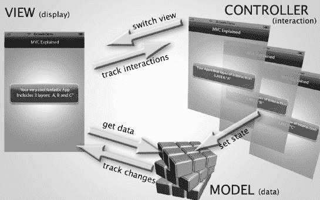

图 4–40. 模型、视图和控制器（MVC）。

考虑以下示例，它说明了如何使用 MVC 概念将 iPhone/iPad 应用的功能划分为三个不同的类别。图 4–40 展示了你的应用表示图；我称它为“MVC 解释”。你可以看到 VIEW 显示了“你的超酷精彩应用包含 3 层：A、B 和 C”的表示形式——一个标签。

在应用的 CONTROLLER 部分，我们看到三个独立的层被分开：层 “A”、层 “B” 和层 “C”。根据用户在 VIEW 域中点击的控制机制，用户看到的显示内容，CONTROLLER 会返回适当的响应——来自三个准备好的层中的下一个视图。

你的应用可能会使用某种类型的数据，这些信息将被存储在程序的 MODEL 部分。数据可以是电话号码、玩家的分数、地图上的 GPS 位置等等。

当用户与应用中的 VIEW 部分交互时，它可能需要从你的数据库中检索数据。假设你的数据包含用户停放汽车的位置。当用户按下程序中某个特定按钮时，它可能会从 MODEL 中检索 GPS 数据。如果是一个移动目标，它还可能追踪用户相对于停车场中汽车的位置变化。最后，CONTROLLER 可能会更改数据的状态（或模式）。可能一种状态显示电话号码，而另一种状态显示 GPS 位置或游戏中的前十名得分。动画也是在 CONTROLLER 中进行的。动画中发生的事情可能会影响甚至改变模型中状态。这可以通过使用各种工具来实现，例如 `UIKit` 对象，来控制每个层、状态等并为其设置动画。

如果这听起来很复杂，请记住，你已经在不知不觉中完成了其中的大部分工作！在示例 1 中，你让用户按下一个按钮，然后弹出一个写着“Hello World！”的标签。这表明你已经构建了一个与 `ViewController` 的交互。当然，我们将进一步探索这些可能性。在第 4 章中，我们将更深入地探索 INDIO 森林的交互象限，并允许用户添加和删除表格视图项。

当我们这样做时，我将尽最大努力让你在涉及交互……通过导航时，始终专注于大局。我们的目标是让用户每进入一个新视图，就能从较泛泛的信息移动到更具体的信息。

### 接下来的章节

在第 5 章中，我们将进入下一个复杂层次：切换视图应用。我们将研究代码中的一组角色或角色如何协同工作，以引导出一个结果或一系列结果，从而给用户带来无缝流畅的感觉。

你将学习委托者和切换视图控制器、类和子类，以及“懒加载”。我们将深入探讨 `.xib` 文件的细节，研究内存释放的概念，并了解嵌入式代码注释。事情变得越来越好奇了……

继续前进到下一章！

## 第 5 章

## 触摸

在我们的第五个应用中，我们向前迈出了一大步，真正编写了一些代码。我现在想说的是：尽管这是一个巨大的飞跃，但总有一条简单的出路。是的，我希望你尽最大努力，在你勤奋地按照步骤操作时，键入所有代码。是的，我甚至希望你在想要放弃的时候也能坚持下去；然而，在这一点上，我想和你澄清一些事情，就像我对我的学生所做的那样。


### 重新定义“放弃”

我们需要用一页的篇幅来讨论这个问题，我希望你仔细阅读以下内容——你很可能需要这样做，以便为本章做好准备。过去，你可能将“放弃”与完全舍弃你曾拥有的一个梦想联系在一起。那么，请允许我分享我对三个术语的看法：“放弃”、“梦想”和“目标”。我想围绕以下四点来讨论这些术语：

*   一个人可以直至死亡都怀有一个梦想。例如，有人可能梦想成为一名编程奇才，开发出价值数百万美元的惊人应用。即使这个人从未碰过 iPhone，也不知道“`Xcode`”这个词是什么意思，他或她仍可以一直到死都怀有这个梦想。这是因为构成梦想的公式中不包含时间元素。
*   然而，一个目标，仅仅是一个加入了时间元素的梦想。想想看。当你目标公式中的时间耗尽时，你就**失败**了！这非常简单。如果你计划在 12 个月内成为一名编程奇才并卖出 100 万个应用，而 12 个月后你连“`hello world`”都编译不出来，那么你就**失败**了！
*   我们在规定时间内达成的目标越多，我们就越自信。这就是为什么一位好教授会设置一系列小步快跑的阶段性目标，以确保他或她的学生能达成目标并感觉良好。这也是为什么好教授会设计一些小程序，让学生们逐步接近他们的最终目标。每周，我的学生都需要通过编程一个应用来完成一个既定目标。如果他们未能在规定时间内将完成的应用发送给我，我会判定该作业不及格！然而，这种情况很少发生，因为当遇到困难时，他们不会放弃，我有一些“后备天使”来帮助我的学生成功并及时达成目标。
*   当进展不顺利时，与其放弃，你可以：
    *   首先，观看我在视频中编写这段代码的过程，网址是 [`http://bit.ly/qp6aCS`](http://bit.ly/qp6aCS)，然后简单地跟着做。为了让视频简短，我的速度有点快，但你随时可以暂停。在 2011 年 6 月，普通观众平均暂停视频 28.5 次（所有观看者）。我的学生平均暂停视频 11.3 次。
    *   其次，如果观看视频未能让你完全成功，你可以在 [`http://bit.ly/r1isYn`](http://bit.ly/r1isYn) 下载我这个程序的代码。在这里，你可以直观地将你的代码与我的进行比较。我告诉学生们先尝试通过目视比较；如果不行，我会让他们把我的代码粘贴到 `Pages` 或 `Word` 中，然后把自己的代码粘贴到另一个类似的文档中。做完这些后，他们应该**离开**电脑，逐行对照我的代码检查他们自己的代码。
    *   第三，如果前面的步骤都不奏效，我不希望你放弃！我希望你将我的代码粘贴到你的代码中，前提是你已经将图标从 nib 文件拖拽到了你的头文件中。这意味着你仍然需要完成第 1 到第 30 步，这些步骤主要涉及拖放操作。然后，将实现代码粘贴到你的实现部分。当它编译成功后，我希望你在进入下一章之前，再独立尝试一次。

以上步骤排除了你放弃成为编程奇才的可能性。我**非常喜欢**收到学生和读者的邮件，他们告诉我为自己成为极客感到多么自豪，并且难以置信有那么多人正在下载和购买他们的应用。我尤其喜欢他们告诉我，他们以前从未编过程序，而这本书记录了他们如何学会编程应用并且没有放弃。蒙大拿州海伦娜市的一位妻子和四个孩子的母亲曾让我热泪盈眶，她告诉我，当她的锅炉工丈夫失业时，她买了我的书，并且从未放弃——她支撑家庭超过一年，直到她的丈夫找到另一份工作。她现在仍然在编程和销售应用。

本质上，首要任务是，尽最大努力只通过阅读本章来尝试。如果对你来说太难了，那么就去看看视频。如果视频没有帮助，那就下载代码，离开电脑，通过目视逐行检查你的代码。作为最后的手段，你可以先完成其他元素的拖放操作，然后将我的代码粘贴到你的代码中。

好了——我们开始吧。

### 路线图回顾

回到汽车修理工的类比，我们理解到，如今，正如前一章所提到的，汽车维修非常专业化：只有少数人知道如何彻底拆解并重建一辆特定的车。到目前为止，我们一直从一位这样的汽车修理工肩头观察，看他如何更换和调换发动机内部的具体部件。今天，你将构建一个非常基本的割草机发动机。它将涉及比你迄今为止要完成的更多步骤，但在本章结束时，你将向前迈出一大步。

当你构建你的割草机发动机时，有时你会低头看到比你以往见过的更混乱的工具、螺母和螺栓。但请坚持住。跟随我，当我要求你时不时站起来，从我的角度，而不是你的角度，去审视那一团“混乱”时，一切都会变得清晰起来。

### 触摸交互：一个基于视图的应用

触摸交互应用最初看起来就像这本书的封面。然而，鲁鲁果在你触碰它之后，可以用指尖移动。顶部还有三个按钮，分别是 `Shrink`、`Move` 和 `Change`。`Shrink` 按钮是一个特殊的按钮；按下它后，鲁鲁果图标会缩小，按钮内的文字会自动变成 `Grow`。按下这个曾经是 `Shrink` 按钮的 `Grow` 按钮，鲁鲁果会恢复其原始大小。如果你愿意，可以快速查看图 5–45、5–46 和 5–47。你也可以在以下视频的开头看到这个应用的实际运行效果：[`http://bit.ly/qp6aCS`](http://bit.ly/qp6aCS)。但**只看**应用的运行效果——不要跟着视频看代码，因为我希望用一种特定的方式向你解释代码。


#### `CGAffineTransform` 结构体

我们还将处理苹果公司聪明的工程师编写的一段动画代码，它被打包成一个称为“数据结构”的集合。这是程序员用来对其对象执行动画的关键工具。该数据结构可以缩小对象、改变其角度、移动它、倾斜它，并让它执行各种其他酷炫的动画效果。苹果用于执行这些动画的所有代码都保存在称为结构体的核心动画数据结构中。苹果对此的解释是：“`CGAffineTransform` 数据结构表示用于仿射变换的矩阵。” 嗯？这到底是什么意思呢？这意味着`CGAffine`会对你想要动画化的对象的所有关键点进行变换，将其放入一个称为`transform`的属性中。这个属性本质上就是一个矩阵。一旦你想要动画化的对象进入这个矩阵，当我们指示`CGAffine`更改对象的位置、角度、形状、缩放比例等属性时，它就能听从我们的指令。这就是我们接下来要对露露水果图标所做的操作。

> 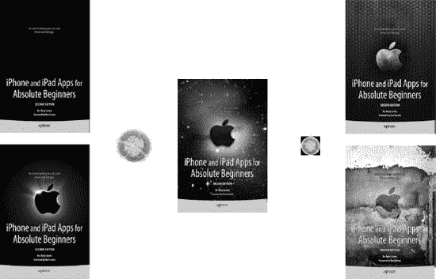

**图 5-1.** 从仓库下载的五个背景图片和两个露露水果图标

1.  这个还需要我说吗？关闭所有程序，清空所有垃圾，并将所有重要文件和文件夹拖放到合适的位置，这样你就拥有了一个完全干净的桌面。从[`http://bit.ly/prqKsL`](http://bit.ly/prqKsL)下载这些图片，解压下载的文件后，你的桌面上会看到七张图片。这五张背景图片是本书封面的不同版本。第一张图片将是图 5-1 中左上角的那一张，它是没有露露水果图标的书正面图。可以看到，露露水果图标是与背景图片分开的。较大的露露水果图标将出现在用户屏幕上，并通过我们施加的`CGAffineTransforms`进行动画化。较小的露露水果图标是`icon.png`版本。我们的“更改”按钮将循环显示所有五个背景图片。“缩小”按钮和“移动”按钮将使用`CGAffine`结构体来对露露水果图标进行动画。

> **注意：** 你当然也可以使用自己的图片和图标。不过，即使不花精力创建自己的图片，这一章也已经很长了。在课堂上，我告诉学生先用我的图标提交这个作业。之后，他们可以使用自己的图标，如果在规定时间内（三天内）完成，他们可以再次用自己的图标提交作业以获得额外加分。目前还没有学生这样做过。

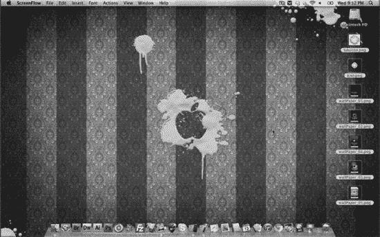

**图 5-2.** 桌面上打开的七张图片，准备加载到 Xcode 中

2.  你的桌面应该与我的类似，如图 5-2 所示，桌面上只有这七个图标和你的 Mac 硬盘驱动器。一旦一切清理干净，图片叠放整齐并准备就绪，你就可以开始行动了！

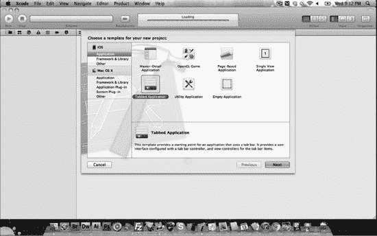

**图 5-3.** 输入 `N`。Xcode 4.2 提供了单视图应用程序选项，与旧版本的基于视图的应用程序相同。

3.  像我们之前做的那样，启动 Xcode 并使用键盘快捷键 `N` 创建一个新项目。当你看到图 5-5 中所示的新建项目向导时，你需要点击“单视图应用程序”模板。

   一旦你的新建项目窗口打开并选择了“单视图应用程序”，我希望你按下回车键（“Enter”），或者点击“下一步”按钮。

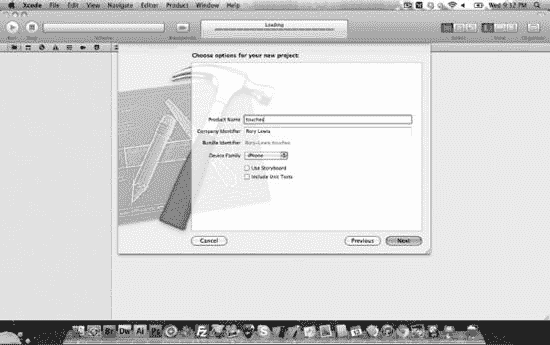

**图 5-4.** 将你的项目命名为 “touches”。

4.  将你的项目命名为 “touches”，并且最重要的是，记得取消选中“使用故事板”选项。一旦项目正确命名且故事板选项被取消选中，如图 5-4 所示，按回车键或点击“下一步”。

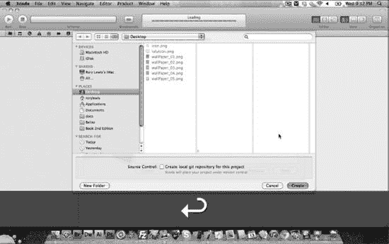

**图 5-5.** 选择将项目保存到你的桌面。

5.  将你的项目保存到桌面。你现在大概能猜到，我们要确保当前项目位于桌面上。等我们处理完后，再把它放到一个合适的文件夹里。

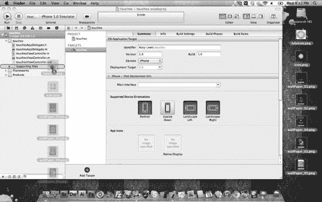

**图 5-6.** 将你的图片拖拽到 “Supporting Files” 文件夹中。

6.  最初，当 Xcode 启动时，它会创建一个几乎覆盖整个桌面的巨大窗口。抓住窗口的右下角将其缩小，直到刚好能看到你从[`http://www.rorylewis.com`](http://www.rorylewis.com)仓库下载的那七张图片。如图 5-6 所示，将所有图片拖拽到 Xcode 中的 “Supporting Files” 文件夹中。

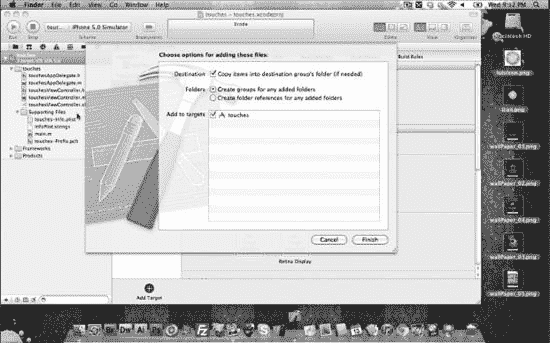

**图 5-7.** 勾选“将项目复制到目标组的文件夹中...”复选框。

7.  将图片放入 `Resources` 文件夹后，系统会提示你定义该图片是始终与它在桌面上的位置相关联，还是嵌入到代码中并随应用程序文件一起携带，如图 5-7 所示。我们当然希望它被嵌入，所以勾选“将项目复制到目标组的文件夹中...”复选框。同时，勾选“为添加的文件夹创建组”复选框。然后，点击“完成”（或按回车键）。

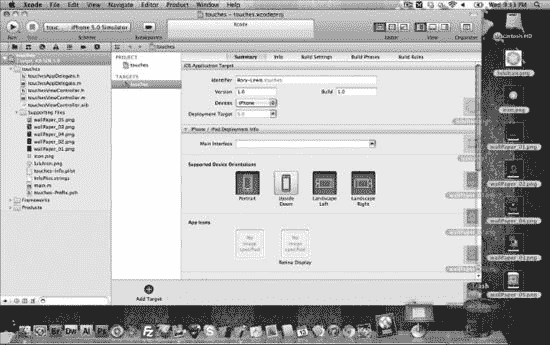

**图 5-8.** 将你的图片拖入垃圾箱。

8.  当你将所有图片正确导入 Xcode 后，实际上就没有必要再保留在桌面上或保存在其他任何地方了。如果你想在另一个版本中再次使用它们，或者如果这次运行不成功，只需打开 `touches` 文件夹，它们全都在那里。无需重复保存这些图片。所以，继续将桌面上剩余的图片拖入垃圾箱，如图 5-8 所示。

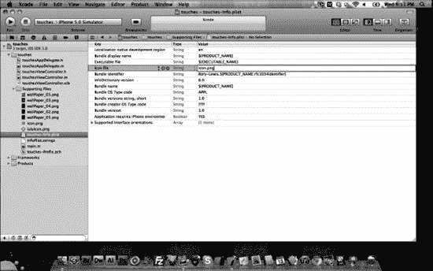

**图 5-9.** 让我们先创建你的图标。

9.  首先，我们来创建图标。在 “Supporting Files” 文件夹中打开你的 plist 文件，并在图标名称栏输入 “`icon.png`”，如图 5-9 所示。在导入所有图片后立即将你的图标关联到 plist 文件中是个好习惯。一旦离开这个文件夹，你以后可能会忘记做这一步。

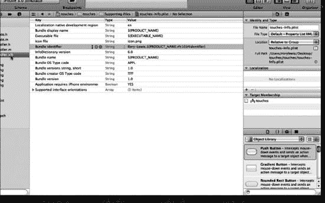

**图 5-10.** 点击你的 xib 文件，打开工具视图，然后关闭导航器视图。

10. 一旦你将图标关联到 `icon.png` 或你个人图标的名称（如果你命名不同的话），我希望你打开 `touchesViewController.xib` 文件，如图 5-10 所示。正如我们之前做过的，我们需要更多空间，所以也要打开工具视图，这样我们就能看到装饰视图设计区域所需的工具和图标。其次，关闭导航器视图，因为我们现在不需要它。

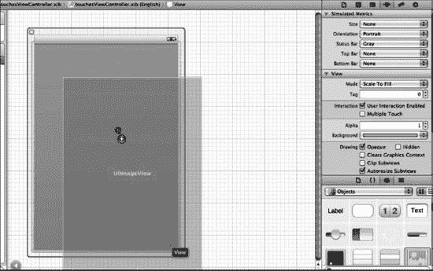

**图 5-11.** 将一个 `UIImageView` 拖拽到你的视图设计区域中。


11. 打开你的 `Utilities` 窗格，将 `UIImageView` 拖拽到视图设计区域，如图 5–11 所示。`UIImageView` 将容纳你下载的当前背景图片，即 `WallPaper_01` 至 `WallPaper_05`。稍后，我将解释如何编写代码，以决定在任意特定时间点，该 `UIImageView` 上显示五张背景图中的哪一张。但我们已经知道，“Change”按钮将触发切换背景的代码。因此，你可以推测，下一步我们需要拖拽一些按钮到视图设计区域。

> **注意**：Xcode 开发者也将视图设计区域称为视图屏幕（View screen）或视图框架（View frame）。因此，无论是说“视图设计区域”、“视图屏幕”还是“视图框架”，这些术语的含义都是相同的。我在本书中有意地交替使用这三个术语。


**图 5–12.** 拖拽三个按钮到视图设计区域。

12. 如图 5–12 所示，开始将三个按钮拖拽到 View frame 的顶部。将它们保持在一行上。让外侧的两个按钮与外部边距对齐，并让中间的按钮在屏幕上居中。当按钮移动到各自边界范围附近时，蓝色指示线会提示你。


**图 5–13.** 将三个按钮分别命名为 `Shrink`、`Move` 和 `Change`。

13. 将三个按钮放置在 View frame 上后，点击按钮并为其命名。如图 5–13 所示，将它们命名为 `Shrink`、`Move` 和 `Change`。


**图 5–14.** 拖拽第二个 `UIImageView` 到视图设计区域。

14. 我们现在需要另一个 `UIImageView` 来容纳 lulu 水果图标，我们可以用手指移动它、用按钮缩放它、用按钮移动它。因此，如图 5–14 所示，在 View frame 上添加另一个 `UIImageView`。


**图 5–15.** 将 lulu 水果图标与第二个 `UIImageView` 关联。

15. 选中第二个 `UIImageView`，转到 `Utilities` 窗格中“Attributes”对话框的图像下拉菜单，如图 5–15 所示。选择 `luluIcon.png` 以将其与第二个 `UIImageView` 关联。


**图 5–16.** 设置 `luluIcon.png` 的尺寸和位置。

16. 当 `luluIcon.png` 出现在第二个 `UIImageView` 内部后，我希望你离开 `Utilities` 窗格中的“Attributes”对话框，点击“Size”检查器（5）；将 lulu 图标的宽度设为 `112 × 112` 像素的正方形。同时，将其 y 轴高度设置为距 View pane 顶部 137 像素。你可以像笔者一样手动居中图标，也可以在 x 轴框中设置。如图 5–16 所示。


**图 5–17.** 点击“Assistant”以打开 `touchesViewController` 头文件。

17. 我们已经完成了将所有必要的项目拖拽并定位到 nib 中。现在，如同之前的操作，我们需要将这些项目连接到代码。我们需要处理 `touchesViewController` 头文件。点击“Assistant”按钮，你的屏幕将类似于图 5–17 所示。


**图 5–18.** 重新调整屏幕位置以便处理头文件。

18. 这里可能有两件事需要处理。首先，根据屏幕大小，你可能需要调整或定位 nib 中的 View pane，以便能看到所有三个按钮。其次，如图 5–18 所示，在 `@property` 指令中添加花括号。

> **注意**：如果你使用的是 4.0 或更早版本，则无需在 `@interface` 指令中添加花括号，因为它们是自动实例化的。然而，如果你使用的是更高、更新的 Xcode 版本，则可能必须添加花括号，如图 5–18 所示。


**图 5–19.** 从 Interface Builder 中的图标 Control-drag 连接到你的头文件。

19. 通常，在过去，当我们达到这个节点时，我指示你直接盲目地开始将 Outlet 和 Action 通过 Control-drag 拖拽到 `@directive` 中。然而，今天，我们将首先思考我们要做什么，从而在你的大脑中建立神经连接，以理解如何创建一个健壮的头文件。回顾过去你做过的事情，我曾使用以下非常宽泛的标准向你提供 Outlet 和 Action：

*   Outlet：用于连接 nib 文件成员与 `UIImageViews` 代码（这是 Apple 的优秀工程师为我们编写的）。
*   Action：用于将你的按钮与我们在实现文件中编写的代码连接起来。

> 现在，我们要成长并继续前进。还记得我提到过，当我们点击“Shrink”按钮时，它会缩小 lulu 水果图标，并且按钮内的文字会变为“Grow”；当我们再次按下该按钮时，它会使其变大吗？嗯，我们需要使用 Apple 编写的代码，这些代码允许我们做一些很酷的事情，比如更改按钮内的颜色、文本和其他外观。

> **注意**：Apple 提供的这段代码位于名为 `UIButton` 的类中。当我们使用这段代码时，可以说我们正在使用 `UIButton` 的一个实例。简而言之，我们需要为“Change”按钮创建一个 Outlet，以便我们可以将其中的文字从“Shrink”更改为“Grow”。

> 当然，我们还需要为 lulu 水果图标以及用于容纳当前正在使用的 `WallPaper_0x.png` 的背景创建一个 Outlet。因此，我们将需要三个 Outlet。在我们将三个 Outlet 通过 Control-drag 正确拖拽到 `@properties` 指令中后，代码将类似于这样：

```
IBOutlet UIImageView *some variable name;
IBOutlet UIImageView *some variable name;
IBOutlet UIButton *some variable name;
```

> 没错！我们需要为这些 Outlet 中的每一个赋予变量名。让我们为图标使用 `myIcon`，为背景使用 `myBackground`，为缩小 lulu 水果图标的按钮使用 `shrinkButton`。你可以使用不同的名称，但请之后再做。现在请跟随我的步骤，代码将如下所示：

```
IBOutlet UIImageView *myIcon;
IBOutlet UIImageView *myBackground;
IBOutlet UIButton *shrinkButton;
```

> 至于三个按钮的 Action，它们保持不变。我们仍然会为三个按钮设置三个 Action，位于 `@properties` 指令之后和之外，代码如下：

```
- (IBAction)some variable name:(id)sender;
- (IBAction)some variable name:(id)sender;
- (IBAction)some variable name:(id)sender;
```

> 没错！我们需要为这些 Action 中的每一个赋予变量名。让我们为“Shrink”按钮使用 `shrink`，为“Move”按钮使用 `move`，为“Change”按钮使用 `change`。同样，你可以在此处使用不同的变量名，但现在请跟随我的步骤。代码将如下所示：

```
- (IBAction)shrink:(id)sender;
- (IBAction)move:(id)sender;
- (IBAction)change:(id)sender;
```

> 好的！那么让我们开始吧！首先，如图 5–19 所示，从你的图标 Control-drag 到 `@properties` 指令。


**注意**：你可能会注意到我有时会说“按住 Control 键从 Interface Builder 中的 `____` 拖一条连线到你的头文件中”，而另一些时候我会说“按住 Control 键从 Interface Builder 中的 `_____` 拖一条连线到你的 `@property` 指令中”。这并非为了混淆你，而是想让你明白这两种说法意思相同，并且你可能会与习惯使用其中一种说法的人共事，或者为他们工作，或者在工作中遇到这样的人。


**图 5–20.** 保持图标作为插座变量，并将其命名为“`myIcon`”。

20\. 如图 图 5–20 所示，当你将“钓鱼线”收回到你的 `@property` 中时，请保持它作为插座变量，并将其命名为 `myIcon`。


**图 5–21.** 按住 Control 键从背景上的任意位置拖一条连线到 `@property` 指令。

21\. 现在，我们需要将拖入视图设计区域的 `UIImageView` 与头文件中的 `@property` 指令连接起来，如图 图 5–21 所示。


**图 5–22.** 保持图标作为插座变量，并将其命名为“`myBackground`”。

22\. 如图 图 5–22 所示，当你将“钓鱼线”收回到你的 `@property` 中时，请保持它作为插座变量，并将其命名为 `myBackground`。


**图 5–23.** 按住 Control 键从 Interface Builder 中的 Shrink 按钮拖一条连线到你的头文件中。

23\. 如图 图 5–23 所示，在 Interface Builder 中单击 Shrink 按钮一次后，按住 Control 键将其拖入头文件中 `@interface` 指令的大括号之间。我们在第 19 节中已经讨论过为什么这是首次将按钮连接到 `@property` 指令。如果你跳过了那一节，我强烈建议你充分理解为什么我们要将按钮作为插座变量来连接。


**图 5–24.** 保持按钮作为插座变量，并将其命名为 `shrinkButton`。

24\. 如图 图 5–24 所示，当你按住 Control 键拖到 `@interface` 指令处时，松开鼠标将其放下，并将其命名为 `shrinkButton` — 将其保持为插座变量。

### 编写头文件

在理解了我们已连接好插座变量之后，我们通常会离开 `@interface` 指令，在其外部将按钮作为操作（Action）来连接。在这种情况下，我们需要做一些以前从未做过的事情：设置一些额外的变量和指针。我们不会深入探讨它们，但我将强调为什么需要这样做。

我们需要跟踪我们的图片。具体来说，我们需要：

*   跟踪当前在背景中显示的图片。记住，我们有五张这样的图片，因此我们将当前背景称为 `currentBackground`。
*   将这五张背景图片存储在某个地方。典型的做法是将这五张图片存储在一个我们称之为数组的列表中。这意味着我们需要创建一个数组。让我们将这个数组称为 `bgArray`。
*   我们还需要知道 Shrink 和 Move 按钮是否已被按下，因为这会改变状态。这将在后面详细解释，但现在，图标的尺寸和位置会发生变化，这会影响接下来可以对它执行的操作。因此，我们需要跟踪两个按钮的状态：Shrink 按钮的状态和 Move 按钮的状态。让我们将它们称为 `hasShrunk` 和 `hasMoved`。
*   还记得我提到过我们将使用 `CGAffineTransform` 类来帮助我们操作图标（参见“`CGAffineTransform` 结构体”部分）吗？是的，我们需要使用 `CGAffineTransform` 类，首先在按下移动按钮时移动 lulu fruit 图标，然后在按下缩小按钮时更改 lulu fruit 图标的尺寸。因此，我们需要两个 `CGAffineTransform` 类型的变量。让我们将一个称为 `translate`，另一个称为 `size`。

因此，我们现在有六个项目：

*   一个我们将称为 `bgImages` 的数组
*   一种跟踪 `currentBackground` 的方法
*   `hasMoved` 的状态
*   `hasShrunk` 的状态
*   一种转换 `translate`（我们的 lulu fruit 图标的位置）的方式
*   一种转换 `size`（我们的 lulu fruit 图标的尺寸）的方式

现在我们已经确定了需要什么以及如何称呼它们，还有一件事要做：将它们与一个内部机制关联起来，以实现我们想让它们做的事情。我们必须将它们与一种类型关联起来。这非常简单。Apple 已经为我们做好了这一切。我们只需要知道从我们的 Apple 工具箱中取出什么工具，并将它们附加到我们创建的每个变量上。

*   对于数组，Apple 提供的 `NSArray` 可以完美地完成这项工作。
*   为了跟踪当前背景，我们只需为每个背景分配一个整数（`int`）类型的编号。
*   为了跟踪按钮，我们只需要知道它们是否已被按下。一个简单的“是”或“否”就很好。嗯，这是布尔类型，对吧？因此，我们将把布尔类型与 `hasMoved` 和 `hasShrunk` 按钮关联起来。
*   最后，我们只需将 `CGAffineTransform` 类分配给我们的 `translate` 和 `size` 变量。

为了强调如何将这些命名类型关联到我们的六个项目，我希望你仔细查看以下代码：

```
NSArray *bgImages;
int currentBackground;
bool hasMoved;
bool hasShrunk;

CGAffineTransform translate;
CGAffineTransform size;
```

这意味着我们需要在你的三个 `IBOutlet` 下方输入上述代码，如下所示：

```
@interface touchesViewController : UIViewController
{
    IBOutlet UIImageView *myIcon;
    IBOutlet UIImageView *myBackground;
    IBOutlet UIButton *shrinkButton;

    NSArray *bgImages;
    int currentBackground;
    bool hasMoved;
    bool hasShrunk;

    CGAffineTransform translate;
    CGAffineTransform size;
}
```


**图 5–25.** 创建几个项目，然后拖动你的第一个按钮。

25\. 现在，只有当我们正确创建并定义了变量之后，才开始将按钮作为操作（Action）连接到 `@directive` 下方的空间。单击选择你的 Shrink 按钮，然后按住 Control 键将其拖到头文件中 `@directive` 的正下方，如图 图 5–25 所示。


图 5-26. 将“收缩”按钮的默认类型更改为 Action。

26\. 如图 图 5-26 所示，当你按住 Control 键从“收缩”按钮拖拽到头文件并释放时，请确保将类型从 Outlet 更改为 Action。


图 5-27. 将其命名为 shrink。

27\. 为收缩按钮创建 Action 后，将其命名为 `shrink`。如 图 5-27 所示。


图 5-28. 按住 Control 键拖拽，为剩余的“移动”和“更改”按钮创建 Action。

28\. 现在，请自行操作：先按住 Control 键从“移动”按钮拖拽到头文件，再从“更改”按钮拖拽到头文件。确保将它们更改为 Action，并分别命名为 `move` 和 `change`。在 图 5-28 中，你可以看到我们从移动按钮向头文件开始拖拽时的样子。


图 5-29. 在确认你的代码与此处显示一致后，为 getter 和 setter 腾出空间。

29\. 在继续为合成创建 `@property`（getter 和 setter）之前，我希望你确认你的代码与 图 5-29 中的代码一致。


图 5-30. 写入 `@property` 后，打开导航器。

30\. 现在我们需要输入用于合成的 `@property`，如 第 4 章 所述。你需要将三个 `IBOutlet` 和数组通过包含 `(nonatomic, retain)` 指令的 `@property` 进行合成。回想 第 4 章 的内容：当我们设置可变性为非原子（nonatomic）时，我们实际上是在让 Apple 来处理！同时，retain 意味着在内存管理方面，我们将保持控制权。好了，现在在为你按钮输入的三个 `IBAction` 正上方写入以下代码，如 图 5-30 所示。

```
@property (retain, nonatomic) UIImageView *myIcon;
@property (retain, nonatomic) UIImageView *myBackground;
@property (retain, nonatomic) NSArray *bgImages;
@property (retain, nonatomic) UIButton *shrinkButton;
```

完成这一步后，头文件的编码工作就结束了。在进入实现文件之前，我强烈建议你将头文件代码中的每个字符、空格、分号、空行和逗号都与我的代码仔细对照确认。确认无误后，我们再转向实现文件。好了，你的头文件最终应该如下所示：

```
#import <UIKit/UIKit.h>
@interface touchesViewController : UIViewController
{

 IBOutlet UIImageView *myIcon;
 IBOutlet UIImageView *myBackground;
 IBOutlet UIButton *shrinkButton;

NSArray *bgImages;
 int currentBackground;
 bool hasMoved;
 bool hasShrunk;

 CGAffineTransform translate;
 CGAffineTransform size;
 UIButton *move;
}

@property (retain, nonatomic) UIImageView *myIcon;
@property (retain, nonatomic) UIImageView *myBackground;
@property (retain, nonatomic) NSArray *bgImages;
@property (retain, nonatomic) UIButton *shrinkButton;
- (IBAction)shrink:(id)sender;
- (IBAction)move:(id)sender;
- (IBAction)change:(id)sender;

@end
```

当你确信代码的每一行都与我的匹配后，就需要开始准备视图区域以进行大量编码。首先，打开导航器面板，该面板会出现在屏幕左侧的面板上，如 图 5-30 所示。


图 5-31. 打开导航器后，关闭助手编辑器并点击标准编辑器。

31\. 我们不再需要同时查看 nib 文件和助手编辑器了。我们只需要足够的空间来编写实现文件。现在你已经打开了导航器，关闭助手编辑器并打开标准编辑器，如 图 5-31 所示。然后，进入导航窗格，点击你的实现文件：`touchesViewController.m`。

### 在实现文件中工作

在本节中，我将教你如何完成前两个任务；其中一个需要在打开实现文件后立即执行。第一个任务是合成（synthesis），通常只需要编写一行代码。第二个任务是 `viewDidLoad` 方法，通常会自动实例化；但在更复杂的代码中，我们需要向 `viewDidLoad` 方法中添加代码，就像我们今天要做的那样。

#### 合成

我一直强调，要鼓励学生和读者养成在头文件中编写 `@property` 指令后，立即在实现文件中进行合成的习惯。你可能已经注意到，无论是在 第 4 章 还是本章中，我在头文件中编写的最后一段代码都是用于合成的 `@property` 指令。这是因为如果你养成了对头文件中刚刚编写的项目立即进行合成的习惯，你就完全不会忘记它——你无需浪费时间回头去回忆你要合成什么。

我们刚刚对 `myIcon`、`myBackground`、`bgImages` 和 `shrinkButton` 执行了 `@synthesize`。这就是我们打开头文件时首先需要合成的内容。以下是我的思考方式；这使得操作变得非常简单。

```
  @implementation touchesViewController
@synthesize   刚刚对其执行 @property 的项目
- (void)didReceiveMemoryWarning
...
...
...  
```

现在，将这个思路应用到当前应用中，我们得到：

```
  @implementation touchesViewController
@synthesize  myIcon, myBackground, bgImages, shrinkButton;
- (void)didReceiveMemoryWarning
...
...
...
```

#### viewDidLoad

`viewDidLoad` 方法中的代码在机器语言代码为你的视图在内存中预留一些空间后执行。你会注意到，在 `viewDidLoad` 中首先调用的是它的父类方法 `[super viewDidLoad]`。在你感到紧张之前，请理解：就像老鼠是啮齿动物的子类一样，`viewDidLoad` 是 `UIViewController` 的 `viewDidLoad` 方法的子类方法，所以 Apple 让 `viewDidLoad` 做的第一件事就是调用其父类中的所有代码。正是在这个精确的时刻，我们需要执行一些任务。

```
- (void)viewDidLoad
{
    [super viewDidLoad];
将所有按钮和背景设置为初始状态
创建一个包含所有壁纸的数组
设置收缩按钮将噜噜水果图标缩小的量
设置移动按钮将噜噜水果图标移动的量
将背景图像设置为当前背景图像
}
```


#### 将按钮和背景设置为起始状态

让我们来看看如何将所有按钮和背景设置为其起始状态。这是为了在程序开始运行前创建一个干净的状态。为了在代码中创建干净的状态，我们需要将状态改变变量设置为零（或设置为 `nil`）。我们有三个这样的变量来指示状态是否发生了变化：`hasMoved`、`hasShrunk` 和 `currentBackground`。请记住，`hasMoved` 和 `hasShrunk` 都是布尔值，因此它们的值可以是 `YES` 或 `NO`。显然，它们的起始状态是尚未被移动过。因此，我们需要将 `hasMoved` 和 `hasShrunk` 都设置为 `NO`。剩下的是 `currentBackground`，它负责追踪当前处于背景中且用户正在查看的是五张壁纸中的哪一张。回想一下，我们将 `currentBackground` 声明为整数类型。这很简单：我们只需将其设置为零。请参见以下加粗的代码：

```
- (void)viewDidLoad
{
    [super viewDidLoad];
    hasMoved = NO;
    hasShrunk = NO;
    currentBackground = 0;

    // 创建一个包含所有壁纸的数组
    // 设置缩小按钮将“噜噜水果”图标缩小的程度
    // 设置移动按钮将“噜噜水果”图标移动的程度
    // 将背景图片设置为当前背景图片
}
```

#### 创建包含所有壁纸的数组

现在，我们需要创建一个数组（本质上是一个事物列表），并将我们的壁纸放入其中。用极客的说法来解释就是：“我们需要创建一个 `NSArray` 对象，并用一些类型为 png 的对象来初始化它”。这听起来不算太难理解，对吧？回想一下，我们确实在头文件中声明了这个数组。通常，学生们对数组感到非常畏惧，以至于在编写考试代码时会忘记声明它们。回想一下，我们在头文件中写了 `NSArray *bgImages`，所以我们声明了一个数组并把它命名为 `bgImages`。紧接着，我们知道需要编写 `bgImages = (让我们的数组活起来的东西)`。使用数组有很多复杂的方法，但我们将使用最朴素的……或者我应该说……使用 `NSArray` 初始化器的 Apple 方法。它们与工厂方法几乎相同，只是需要自己进行内存分配，形式如 `NSArray` 所示。

```
你的数组名称 = [[NSArray alloc] initWithObjects: @"你的第一个对象", @"你的第二个对象", @"你的第三个对象", nil];
```

这看起来有点杂乱，所以看一下它的结尾，你会发现所有的对象都用逗号分隔开了；然后，我们在末尾加上那个 `nil` 来告诉数组它已经结束。让我们做两件事。首先，我们将数组的真实名称——`bgImages`——填入模板中，然后我们将逗号之间的内容放到单独的行中，看看这样是否更清晰。

```
bgImages array = [[NSArray alloc] initWithObjects:
    @"你的第一个对象",
    @"你的第二个对象",
    @"你的第三个对象",
    nil];
```

很酷，对吧？！这个看起来有点吓人的代码，现在对你来说变得有意义了！耶！好吧，我们还没有完全完成。在让这个数组活起来之前，我们还需要做一件事。我们需要深入理解 `UIImage` 类引用，这是 Apple 的工程师编写的一个用于显示图片的对象。我们的对象是图片，但实际上，它们是包含图片的文件名。我们需要将 `UIImage` 与一个名为 `imageNamed` 的方法一起使用，该方法返回与文件名相关联的图片对象。因此，对于每个文件名，我们需要使用 `UIImage imageNamed`。我已经在下面说明了这一点：

```
你的数组名称 = [[NSArray alloc] initWithObjects:
    [UIImage imageNamed:@"WallPaper_01.png"],
    [UIImage imageNamed:@"WallPaper_02.png"],
    [UIImage imageNamed:@"WallPaper_03.png"],
    [UIImage imageNamed:@"WallPaper_04.png"],
    [UIImage imageNamed:@"WallPaper_05.png"],
    nil];
```

使用这段代码，我们创建了一个包含五张图片的数组。我们现在需要做的就是将它插入到我们的代码中。请参见以下加粗的代码：

```
- (void)viewDidLoad
{
    [super viewDidLoad];
    hasMoved = NO;
    hasShrunk = NO;
    currentBackground = 0;

    bgImages = [[NSArray alloc] initWithObjects:
                [UIImage imageNamed:@"WallPaper_01.png"],
                [UIImage imageNamed:@"WallPaper_02.png"],
                [UIImage imageNamed:@"WallPaper_03.png"],
                [UIImage imageNamed:@"WallPaper_04.png"],
                [UIImage imageNamed:@"WallPaper_05.png"],
                nil];
    // 设置缩小按钮将“噜噜水果”图标缩小的程度
    // 设置移动按钮将“噜噜水果”图标移动的程度
    // 将背景图片设置为当前背景图片
}
```

#### 设置“噜噜水果”图标的缩小程度

设置当我们按下“缩小”按钮时“噜噜水果”图标的缩小程度非常简单。还记得在本章开头我们讨论过，`CGAffine` 如何在接到指令后改变对象的**位置*、*角度*、*形状*、*缩放**等属性吗？现在我们将要使用它。我随机决定将“噜噜水果”图标缩小 25%。这意味着我们需要告诉 `CGAffine` 两件事：第一，我们要缩放图片；第二，我们在 x 轴和 y 轴上要缩放多少。我们想要使用 `CGAffine` 来缩放我们使用的对象……嗯……让我们猜猜……啊！用 `CGAffineTransformMakeScale` 怎么样？是的！我们猜对了。好的，接下来是下一个赋值。要将图片缩放 25%，我们需要在 x 轴和 y 轴上均匀地缩放 0.25；但在将其输入代码之前，请记住，我们在头文件中创建了一个名为 `size` 的变量，类型为 `CGAffineTransform` 吗？我们需要将 `size` 变量设置为 25% 的缩小量，即我们告知 `CGAffineTransformMakeScale` 代码要执行的操作。这通过以下代码说明：

```
- (void)viewDidLoad
{
    [super viewDidLoad];
    hasMoved = NO;
    hasShrunk = NO;
    currentBackground = 0;

    bgImages = [[NSArray alloc] initWithObjects:
                [UIImage imageNamed:@"WallPaper_01.png"],
                [UIImage imageNamed:@"WallPaper_02.png"],
                [UIImage imageNamed:@"WallPaper_03.png"],
                [UIImage imageNamed:@"WallPaper_04.png"],
                [UIImage imageNamed:@"WallPaper_05.png"],
                nil];
    size = CGAffineTransformMakeScale(.25, .25);
    // 设置移动按钮将“噜噜水果”图标移动的程度
    // 将背景图片设置为当前背景图片
}
```

#### 设置“噜噜水果”图标的移动距离

与之前使用 `CGAffineTransformMakeScale` 告诉我们的 `size` 变量保存图标缩小量类似，我们现在将使用 `Translation`（位移）。这是用极客的方式来表示我们将使用 `CGAffineTransformMakeTranslation` 让图标在屏幕上移动多少距离，以告知我们在头文件中创建的 `move` 变量（类型为 `CGAffineTransform`）保存我们想要移动的量。我随机选择只将“噜噜水果”图标沿 y 轴向上移动 100 像素。“向上”意味着我们需要从 y 轴减去像素。我们只想在 y 轴上减去 100 像素，而 x 轴保持不变（0, -100）。这通过以下代码说明：

```
- (void)viewDidLoad
{
    [super viewDidLoad];
    hasMoved = NO;
    hasShrunk = NO;
    currentBackground = 0;

    bgImages = [[NSArray alloc] initWithObjects:
                [UIImage imageNamed:@"WallPaper_01.png"],
                [UIImage imageNamed:@"WallPaper_02.png"],
                [UIImage imageNamed:@"WallPaper_03.png"],
                [UIImage imageNamed:@"WallPaper_04.png"],
                [UIImage imageNamed:@"WallPaper_05.png"],
                nil];
    size = CGAffineTransformMakeScale(.25, .25);
    translate = CGAffineTransformMakeTranslation(0, -100);
    // 将背景图片设置为当前背景图片
}
```


#### 将背景图像设置为当前背景图像

在`viewDidLoad`中，我们需要完成的最后一项任务是将背景图像设置为当前背景图像。你可能会大声质疑并挠头思考：“这究竟是什么意思？”让我们仔细分析一下。我们已经创建了一个包含五张图像的数组。我们将用数字来标识这些图像。当我们按下“Change”按钮时，无论当前背景显示的是哪张图像，我们都会用下一张图像替换它。我们已将`currentBackground`设置为 0。因此，当用户第一次按下“Change”按钮时，它将使用我们尚未编写的代码将`currentBackground`从 0 变为 0+1，这意味着当前背景将变为数组中的下一张背景图像。

注意：我现在不打算解释这段代码，因为大多数人在需要获取某个索引处的对象并将其放入我们创建的变量中时，只是直接粘贴使用。

我希望你现在和以后按以下方式使用它：包含图像的那个变量应等于`[bgImages objectAtIndex:yourVariable]`（在我们的示例中，`yourVariable`保存了当前背景图像）。不要对此想得太多，只需像下面代码中演示的那样使用它即可。

```
- (void)viewDidLoad
{
    [super viewDidLoad];
    hasMoved = NO;
    hasShrunk = NO;
    currentBackground = 0;

    bgImages = [[NSArray alloc] initWithObjects:
                    [UIImage imageNamed:@"WallPaper_01.png"],
                    [UIImage imageNamed:@"WallPaper_02.png"],
                    [UIImage imageNamed:@"WallPaper_03.png"],
                    [UIImage imageNamed:@"WallPaper_04.png"],
                    [UIImage imageNamed:@"WallPaper_05.png"],
                    nil];
    size = CGAffineTransformMakeScale(.25, .25);
    translate = CGAffineTransformMakeTranslation(0, -100);
    myBackground.image = [bgImages objectAtIndex:currentBackground];
}
```


**图 5–32.** 检查实现文件中的代码是否完整。

32. 完成以上所有步骤后，你的`viewDidLoad`应该与图 5–32 中所示的一致。

#### 新标题

我们将亲自处理大量与视图关联的内存卸载工作。当我们在背景之间切换时，会用自己编写的代码来处理这一切，因此可以删除 Apple 为我们生成的一些样板代码。


**图 5–33.** 精简`viewDidUnload`方法。

33. 如图 5–33 所示，转到你的`viewDidUnload`方法，从`[myIcon release]`的开头到`shrinkButton = nil`的结尾选中所有代码，并将其全部删除。


**图 5–34.** 编写`touchesMoved`方法。

34. 现在我们将编写`touchesMoved`方法。是的，我知道你甚至还没看到它！在删除`viewDidUnload`中的相应代码后，我希望你向下滚动浏览 Apple 为你实例化的所有方法。依次查看`viewWillAppear`、`viewDidAppear`、`viewWillDisappear`、`viewDidDisappear`和`shouldAutorotateToInterfaceOrientation`。然后你会看到三个方法，对应我们在头文件中为三个按钮创建的操作。

```
- (IBAction)shrink:(id)sender {
}
- (IBAction)move:(id)sender {
}
- (IBAction)change:(id)sender {
}

@end
```

这非常棒，因为我们将把所有代码放入这些方法中。但是，等等……我们缺少一个方法，它用于处理触摸并让用户用手指移动那个“lulu fruit”图标！是的，我们需要从头创建它。在顶部的`shrink`方法上方，我希望你创建大约四个空行，然后直接输入`touches`，代码补全功能会弹出`touchesMoved`；按下回车，然后再次输入`touches`，代码补全会弹出`touches withEvent:(UIEvent *)event{`。这样你就会拥有全部四个需要编码的方法，如下所示，其中我高亮显示了我们在头文件中创建的四个变量。

```
-(void) touchesMoved:(NSSet *)touches withEvent:(UIEvent *)event{
}
- (IBAction) shrink:(id)sender {
}
- (IBAction) move:(id)sender {
}
- (IBAction) change:(id)sender {
}
@end
```

现在我们可以将代码写入`touchesMoved`方法中。但让我们先从宏观角度审视一下。我们希望`touchesMoved`方法做什么？这可能看起来不明显，但我们只是希望`touchesMoved`方法执行以下操作：

```
-(void) touchesMoved:(NSSet *)touches withEvent:(UIEvent *)event{
    获取能感知屏幕所有触摸的代码
    检查屏幕上的触摸是否在“lulu fruit”图标上。如果是，则执行：
    检查图标是否已通过按钮被移动和缩小。如果是，则执行：
        保持缩小的尺寸，并将图标移动到“Move”按钮被按下之前的位置
    检查图标是否已通过按钮被移动但未缩小。如果是，则执行：
        将图标移动到“Move”按钮被按下之前的位置
    将图标设置到当前触摸位置
}
```

我的教学方法之一，是我并不总是事无巨细地讲解一切。在之前我们盲写前几个“Hello World”应用时，你已经有所体会。在这一点上，我将教你如何使用某些工具来完成任务。我现在不会教你所有这些工具是如何工作的，但我将教你该选择哪个工具。目前，我们需要获取能感知屏幕上所有触摸的代码。我希望你记住：当你想让用户界面通过触摸实现炫酷功能时，我们首先需要调用 Apple 编写的、用于感知和记录所有触摸的代码。因此，输入`UITouches`，代码补全功能会提供的一个选项是`UITouch *touch = [[event allTouches] anyObject]`，这就是我希望你在处理任何触摸操作之前调用的工具。暂时不要思考它是如何工作的，只需知道在此处调用它即可。请参考下例中的粗体部分。


好的，作为一名高级文档工程师和翻译员，我将严格遵循您提供的注意事项和示例，将给定的英文文本翻译成中文。


`-(void) touchesMoved:(NSSet *)touches withEvent:(UIEvent *)event{`
`UITouch *touch = [[event allTouches] anyObject];`
`检查屏幕上的触控是否在 lulu 水果图标上。如果是，则   `
`检查图标是否通过按钮被移动和缩小。如果是，则`
`保持缩小尺寸，并将图标移动到按下移动按钮前的位置`
`检查图标是否被移动但未通过按钮缩小。如果是，则`
`将图标移动到按下移动按钮前的位置`
`将图标设置到当前触控位置`
`}`

现在我们需要一个`if`语句来检查屏幕上的触摸点是否在 lulu 水果图标上。我们需要知道，iPhone 会查看我们对象所适配的矩形，并判断手指是否在该矩形内。为此，我们使用`if (CGRectContainsPoint([myIcon frame], [touch locationInView:nil]))`。你只需要输入`if`和`CGRect`，然后触摸和代码补全就会填充剩下的部分。我们将在这个`if`语句内部嵌套另外两个`if`语句。请注意，我是如何将我们的路线图任务嵌套在这个`if`语句内部的，如下所示：

`-(void) touchesMoved:(NSSet *)touches withEvent:(UIEvent *)event{`
`UITouch *touch = [[event allTouches] anyObject];`
`if (CGRectContainsPoint([myIcon frame], [touch locationInView:nil]))`
`{`
`检查图标是否通过按钮被移动和缩小。如果是，则 {`
`保持缩小尺寸，并将图标移动到按下移动按钮前的位置`
`}`

`检查图标是否被移动但未通过按钮缩小。如果是，则 {`
`将图标移动到按下移动按钮前的位置`
`     }`
`将图标设置到当前触控位置`
`}`
`}`

此时，需要在我们刚创建的`if`语句中插入两个嵌套条件。但让我们思考一下。我们所要做的就是测试 lulu 水果图标是否已被按钮移动，如果是，无论它是否被缩小，我们都需要将其移回未移动的状态。两个会导致 lulu 水果图标被移动的条件是：当我们移动并缩小它时，或者当我们移动但未缩小它时；无论哪种方式，我们都希望将状态更改为“未移动”，这样当用户的手指触摸 lulu 水果图标时，我们可以说：“你之前没有被移动，但现在你被移动了。”我们不能说：“你之前被移动过，现在又被移动了。”

`-(void) touchesMoved:(NSSet *)touches withEvent:(UIEvent *)event{`
`UITouch *touch = [[event allTouches] anyObject];`
`    if (CGRectContainsPoint([myIcon frame], [touch locationInView:nil]))`
`    {`
`if (hasMoved == YES && hasShrunk == YES) {`
`myIcon.transform = CGAffineTransformTranslate(size, 0, 0);`
`hasMoved = NO;`
`}`

`if (hasMoved == YES && hasShrunk == NO) {`
`myIcon.transform = CGAffineTransformMakeTranslation(0,0);`
`hasMoved = NO;`
`}`

`将图标设置到当前触控位置`
`}`
`}`

注意：如果你正在观看视频，在第二个`if`语句中，我写的是`myIcon.transform = translate`，而不是`CGAffineTransformMakeTranslation(0,0);`。这没有太大区别，但使用后者更好。我确实在代码中做了更改，因此在你下载的代码中，它也将会是后者。

我们要做的最后一件事是将图标的位置设置为其手指在任何时刻移动到的精确坐标。这是一段样板代码，当你用手指在屏幕上移动某个对象时，可以反复使用它来跟踪该对象。我们使用`变量名`.`center = [touch locationInView:nil]`，如下列代码所示：

`-(void) touchesMoved:(NSSet *)touches withEvent:(UIEvent *)event{`
`UITouch *touch = [[event allTouches] anyObject];`
`    if (CGRectContainsPoint([myIcon frame], [touch locationInView:nil]))`
`    {`
`        if (hasMoved == YES && hasShrunk == YES) {`
`            myIcon.transform = CGAffineTransformTranslate(size, 0, 0);`
`            hasMoved = NO;`
`}`

` if (hasMoved == YES && hasShrunk == NO) {`
`            myIcon.transform = CGAffineTransformMakeTranslation(0,0);`
`            hasMoved = NO;`
`     }`

`myIcon.center = [touch locationInView:nil];`
`    }`
`}`

至此，我们已经完成了`touchesMoved`方法的编写。将你的代码与图 5–34 中我的代码进行比较。

#### 编写缩小按钮的代码

现在我们要编写用户按下缩小按钮后调用的代码。


**图 5–35.** 编写缩小方法

35\. 还记得吗？在头文件中，我们创建了一个输出口，使得当有人按下按钮时，我们可以将字体从“缩”（Shrink）改为“放”（Grow）。这是因为我们不能让 lulu 水果连续缩小两次，否则它实际上就会消失！所以，我们要做的第一件事就是更改文本。第二件事是跟踪“缩小”和“移动”按钮的可能状态，以便我们可以告诉`CGAffine`适当地变换 lulu 水果图标。代码看起来像这样：

`-(IBAction)shrink:(id)sender`
`{`
`如果尚未缩小，则保持文本显示“缩”，否则将其改为“放”`
`如果尚未缩小或移动 – 执行操作`
`否则如果尚未缩小但已移动 – 执行操作`
`否则如果已缩小并已移动 – 执行操作`
`否则 – 执行操作`
`}`

要更改文本，我们将使用`setTitle`和`forState:UIControlStateNormal`，格式如下：`你的变量名 setTitle:@"你的文本" forState:UIControlStateNormal`。我们在很久以前于头文件中声明缩小按钮的输出口时，将其命名为`shrinkButton`。我们将使用的文本在改变后是“`Grow`”（放），然后再次改变后是“`Shrink`”（缩）；这个循环会一直持续，如下所示。

`-(IBAction)shrink:(id)sender`
`{`
`if (hasShrunk) {`
`[shrinkButton setTitle:@"Shrink" forState:UIControlStateNormal];`
`} else {`
`[shrinkButton setTitle:@"Grow" forState:UIControlStateNormal];`
`}`
`如果尚未缩小或移动 – 执行操作`
`否则如果尚未缩小但已移动 – 执行操作`
`否则如果已缩小并已移动 – 执行操作`
`否则 – 执行操作`
`}`

我们通过以`if`开始，以`else`结束来编写嵌套的`if`语句；在开始的`if`和结束的`else`之间，我们插入所有需要的`else if`。在我们的例子中，我随意选择了如下排列`if`语句：`if` ‘两者都是`NO`’；`else if` ‘`NO`和`YES`’；`else if` ‘两者都是`YES`’；最后`else`处理剩下的情况，即‘`YES`和`NO`’。将上述内容转换为代码如下所示：

`-(IBAction)shrink:(id)sender`
`{`
`    if (hasShrunk) {`
`        [shrinkButton setTitle:@"Shrink" forState:UIControlStateNormal];`
`    } else {`
`        [shrinkButton setTitle:@"Grow" forState:UIControlStateNormal];`
`    }`

`if(hasShrunk == NO && hasMoved == NO)`
`{`
`– 执行操作`
`}`
`else if(hasShrunk == NO && hasMoved == YES)`
`{`
`– 执行操作`
`}`
`else if(hasShrunk == YES && hasMoved == YES)`
`{`
`– 执行操作`
`}`
`else`
`{`
`– 执行操作`
`}`
`}`

在我们对每个嵌套`if`中的 lulu 水果图标状态“执行操作”之前，我们需要在每个嵌套`if`内执行一些初步的准备。我们需要告诉微处理器我们希望这个“操作”持续多少秒，然后，在使用`CGAffineTransform`对 lulu 水果图标执行我们想要的操作后，我们需要更新它的状态。这在下面的非代码、纯英文描述中进行了说明：

`-(IBAction)shrink:(id)sender`
`{`
`    if (hasShrunk) {`
`        [shrinkButton setTitle:@"Shrink" forState:UIControlStateNormal];`
`    } else {`
`        [shrinkButton setTitle:@"Grow" forState:UIControlStateNormal];`
`    }`


```pseudo
if(hasShrunk == NO && hasMoved == NO)
{
    启动持续 1 秒的动画
    – 执行操作
    提交动画并更新缩小状态
}
else if(hasShrunk == NO && hasMoved == YES)
{
    启动持续 1 秒的动画
    – 执行操作
    提交动画并更新缩小状态
}
else if(hasShrunk == YES && hasMoved == YES)
{
    启动持续 1 秒的动画
    – 执行操作
    提交动画并更新缩小状态
}
else
{
    启动持续 1 秒的动画
    – 执行操作
    提交动画并更新缩小状态
}
```

我会将这个用非代码纯英语编写的杂务路线图保留一段时间，以免在我们专注于更重要的元素时干扰代码布局。现在，我们需要以较高的层面来看待这四种情况中分别要做的事。

1.  **如果**：两个按钮都未按下，而我们按下了“缩小”按钮，那么我们会
    -   缩小噜噜水果图标。

2.  **否则如果**：未按下“缩小”按钮，但按下了“移动”按钮，那么我们会
    -   将图标保持在移动后的位置，但继续缩小噜噜水果图标。

3.  **否则如果**：同时按下了“缩小”和“移动”按钮，然后再次按下“缩小”按钮，那么我们会
    -   将噜噜水果图标恢复至原始大小，并移动到移动后的位置。
    -   回想一下，我们已经编写了“缩小”按钮内的文本，使其在“缩小”和“放大”之间切换。

4.  **否则如果**：已按下“缩小”按钮，但未按下“移动”按钮，那么我们会
    -   将噜噜水果图标恢复至原始大小，并保持在当前位置。

将上述场景用非代码纯英语描述，这就是它在代码中的样子：

```objc
-(IBAction)shrink:(id)sender
{
    if (hasShrunk) {
        [shrinkButton setTitle:@"Shrink" forState:UIControlStateNormal];
    } else {
        [shrinkButton setTitle:@"Grow" forState:UIControlStateNormal];
    }

    if(hasShrunk == NO && hasMoved == NO)
    {
        启动持续 1 秒的动画
        缩小图标
        提交动画并更新缩小状态
    }
    else if(hasShrunk == NO && hasMoved == YES)
    {
        启动持续 1 秒的动画
        保持图标已移动并缩小图标
        提交动画并更新缩小状态
    }
    else if(hasShrunk == YES && hasMoved == YES)
    {
        启动持续 1 秒的动画
        保持图标已移动并将图标恢复至正常大小
        提交动画并更新缩小状态
    }
    else
    {
        启动持续 1 秒的动画
        将图标恢复至原始位置和大小
        提交动画并更新缩小状态
    }
}
```

现在，我们将它改为实际代码。

-   在第一种情况下，要缩小噜噜水果图标，请执行以下操作：
    -   将噜噜水果图标的变换设置为变量 `size` 中包含的大小。

-   在第二种情况下，要使图标保持在移动后的位置，但仍要缩小它，请执行以下操作：
    -   将噜噜水果图标的变换设置为 `CGAffineTransformTranslate` 方法将其移动到的位置。
    -   但现在我们丢失了“大小”，因此需要将其重新缩小到原始状态的 `.25`。

-   在第三种情况下，要将噜噜水果图标恢复为原始大小并移动到移动后的位置，应执行以下操作：
    -   将噜噜水果图标的变换设置为 `CGAffineTransformTranslate` 方法将其移动到的位置。
    -   现在，将其恢复为原始大小。

-   在最后一种情况下，要将噜噜水果图标恢复为原始大小并保持在当前位置，请执行以下操作：
    -   将其全部恢复为原始状态。

将上述示例放入代码中，得到以下结果：

```objc
-(IBAction)shrink:(id)sender
{
    if (hasShrunk) {
        [shrinkButton setTitle:@"Shrink" forState:UIControlStateNormal];
    } else {
        [shrinkButton setTitle:@"Grow" forState:UIControlStateNormal];
    }

    if(hasShrunk == NO && hasMoved == NO)
    {
        启动持续 1 秒的动画
        myIcon.transform = size;
        提交动画并更新缩小状态
    }
    else if(hasShrunk == NO && hasMoved == YES)
    {
        启动持续 1 秒的动画
        myIcon.transform = CGAffineTransformScale(translate,.25, .25);
        提交动画并更新缩小状态
    }
    else if(hasShrunk == YES && hasMoved == YES)
    {
        启动持续 1 秒的动画
        myIcon.transform = CGAffineTransformScale(translate,1, 1);
        提交动画并更新缩小状态
    }
    else
    {
        启动持续 1 秒的动画
        myIcon.transform = CGAffineTransformIdentity;
        提交动画并更新缩小状态
    }
}
```

现在我们需要考虑如何更新噜噜水果图标的缩小状态。在前两种情况下，我们确实缩小了噜噜图标，因此需要将缩小状态更新为 YES。在后两种情况下，图标未被缩小，因此应将缩小状态更新为 NO。请参见以下代码：

**注意**：如果这不太合理，那么请查看前面代码的解释来思考一下。如果你的大脑已经很累了，那就先跟着走——没关系——只要跟着做就行。

```objc
-(IBAction)shrink:(id)sender
{
    if (hasShrunk) {
        [shrinkButton setTitle:@"Shrink" forState:UIControlStateNormal];
    } else {
        [shrinkButton setTitle:@"Grow" forState:UIControlStateNormal];
    }

    if(hasShrunk == NO && hasMoved == NO)
    {
        启动持续 1 秒的动画
        myIcon.transform = size;
        提交动画
        hasShrunk = YES;
    }
    else if(hasShrunk == NO && hasMoved == YES)
    {
        启动持续 1 秒的动画
        myIcon.transform = CGAffineTransformScale(translate,.25, .25);
        提交动画
        hasShrunk = YES;
    }
    else if(hasShrunk == YES && hasMoved == YES)
    {
        启动持续 1 秒的动画
        myIcon.transform = CGAffineTransformScale(translate,1, 1);
        提交动画
        hasShrunk = NO;
    }
    else
    {
        启动持续 1 秒的动画
        myIcon.transform = CGAffineTransformIdentity;
        提交动画
        hasShrunk = NO;
    }
}
```

接下来，我们将每个嵌套的 `if` 中的纯英语杂务改为实际代码。我们清除动画状态并将动画设置为 1 秒（我随机选择了 1 秒，你可以选择其他时长）。在对噜噜水果执行操作后，我们提交这些操作。这由以下代码说明：

```objc
-(IBAction)shrink:(id)sender
{
    if (hasShrunk) {
        [shrinkButton setTitle:@"Shrink" forState:UIControlStateNormal];
    } else {
        [shrinkButton setTitle:@"Grow" forState:UIControlStateNormal];
    }

    if(hasShrunk == NO && hasMoved == NO)
    {
        [UIView beginAnimations:nil context:NULL];
        [UIView setAnimationDuration:1.0];
        myIcon.transform = size;
        [UIView commitAnimations];
        hasShrunk = YES;
    }
    else if(hasShrunk == NO && hasMoved == YES)
    {
        [UIView beginAnimations:nil context:NULL];
        [UIView setAnimationDuration:1.0];
        myIcon.transform = CGAffineTransformScale(translate,.25, .25);
        [UIView commitAnimations];
        hasShrunk = YES;
    }
    else if(hasShrunk == YES && hasMoved == YES)
    {
        [UIView beginAnimations:nil context:NULL];
        [UIView setAnimationDuration:1.0];
        myIcon.transform = CGAffineTransformScale(translate,1, 1);
        [UIView commitAnimations];
        hasShrunk = NO;
    }
    else
    {
        [UIView beginAnimations:nil context:NULL];
        [UIView setAnimationDuration:1.0];
        myIcon.transform = CGAffineTransformIdentity;
        [UIView commitAnimations];
        hasShrunk = NO;
    }
}
```

最后，我们在每个条件语句的节之间添加一些间距，效果看起来应该与我在图 5-35 中的代码非常相似。


#### 编写移动按钮代码

实现“移动”按钮功能的代码与之前“收缩”按钮的代码完全相同，唯一区别在于我们不需要修改按钮内的文字，因此将这部分省略。


**图 5–36.** 编写 `move` 方法

36. 这样我们就剩下同样的四种状态。只需将所有 `shrunk` 替换为 `moved`，其余部分完全一致。请对照图 5–36 中的代码检查你的实现。

**注意：** 我建议你首先从 `shrink` 方法中复制粘贴第一个 `if` 语句，然后将 `shrinks` 和 `moves` 互换。之后，将其粘贴三次；将 `if` 相关的分支改为 `else if` 和 `else`。最后，在 `CGAffineTransformTranslates` 中将缩放改为移动。

#### 编写更改按钮代码

现在剩下的唯一任务是编写按下“更改”按钮时改变背景的代码。


**图 5–37.** 编写 `change` 方法

37. 我们主要需要完成五项工作：递增当前背景索引；确保递增后图片索引仍在数组范围内；初始化 `UIView`；为背景加载创建动画；最后提交并更改背景。我们的 `change` 方法初始路线图如下：

```
-(IBAction)change:(id)sender
{
  将背景索引递增到下一张背景图片
  检查 currentBackground 不超出数组范围
  初始化 UIView
  创建动画
  提交并更改背景
}
```

我之前说过，每次按下“更改”按钮，都会通过改变背景图片的编号来切换图片。如果当前背景是 `wallPaper_01`，按下“更改”按钮后，我们会递增它，即加一并将 `wallPaper_02` 设为下一张背景。这意味着，每次按下“更改”按钮时，我们需要先递增 `currentBackground`，如下所示：

```
-(IBAction)change:(id)sender
{
  currentBackground++;
  检查 currentBackground 不超出数组范围
  初始化 UIView
  创建动画
  提交并更改背景
}
```

如果我们持续递增，最终会超过数组中图片的总数。因此，一旦达到数组中的图片数量，我们需要将计数重置为零。如下所示：

```
-(IBAction)change:(id)sender
{
  currentBackground++;
  if(currentBackground >= [bgImages count])
    currentBackground = 0;
  初始化 UIView
  创建动画
  提交并更改背景
}
```

为了初始化 `UIView`，我们需要做两件事，但我为了更酷而添加了第三项任务。我们必须重置（重新启动、归零——无论你如何表述）Apple 那帮天才写成的 `beginAnimations` 方法！然后，我们需要设置每个动画的持续时间。正如我之前初始化时提到的，我将两次变化之间的初始时间设置为 1 秒。为了更酷，我加入了第三项任务：使用 `UIViewAnimationCurveEaseInOut` 方法决定动画开始和结束的平滑程度。如下所示：

```
-(IBAction)change:(id)sender
{
  currentBackground++;
  if(currentBackground >= [bgImages count])
    currentBackground = 0;
  [UIView beginAnimations:@"changeview" context:nil];
  [UIView setAnimationDuration:1];
  [UIView setAnimationCurve:UIViewAnimationCurveEaseInOut];
  创建动画
  提交并更改背景
}
```

**注意：** 要实际更改背景，我们需要谨慎理解这一概念。请仔细阅读并尽力跟上。

我们将每个背景的切换过程分为两步。

1.  首先，我们检查当前背景的数值（或标签）是否与我们正在处理的一致。如果为真，则执行花括号内的代码（如下一点所述）。
2.  然后，我们将使用 `setAnimationTransition` 方法来执行我们选择的任何方法。有卷曲向上、卷曲向下、从左或从右移入、向这边翻转、向那边翻转等多种方法。或者，当你成为超级极客时，也可以创建自己的方法。目前，我只使用卷曲和翻页效果，因此我会恰当地调用这些过渡效果。

更仔细地看，对于每个动画，我们使用如下形式：

```
if(currentBackground == 我们想要的编号)
  [UIView setAnimationTransition:
                       UIViewAnimationTransition 我们选择的动画
                    forView:self.view
                    cache:YES];
```

现在重复此方法，并为每个动画随机选择动画效果，代码变成如下形式：

```
-(IBAction)change:(id)sender
{
  currentBackground++;
  if(currentBackground >= [bgImages count])
    currentBackground = 0;
  [UIView beginAnimations:@"changeview" context:nil];
  [UIView setAnimationDuration:1];
  [UIView setAnimationCurve:UIViewAnimationCurveEaseInOut];
  if(currentBackground == 1)
    [UIView setAnimationTransition:
                         UIViewAnimationTransitionFlipFromLeft
                     forView:self.
                     view cache:YES];
  
  if(currentBackground == 2)
    [UIView setAnimationTransition:
                         UIViewAnimationTransitionCurlDown
                     forView:self.
                     view cache:YES];
  
  if(currentBackground == 3)
    [UIView setAnimationTransition:
                         UIViewAnimationTransitionCurlUp
                     forView:self.
                     view cache:YES];
  
  if(currentBackground == 4)
    [UIView setAnimationTransition:
                         UIViewAnimationTransitionFlipFromRight
                     forView:self.
                     view cache:YES];
  
  提交并更改背景
}
```

最后一步，同样如之前所述，我们只需提交更改并执行代码：

```
-(IBAction)change:(id)sender
{
  currentBackground++;
  if(currentBackground >= [bgImages count])
    currentBackground = 0;
  [UIView beginAnimations:@"changeview" context:nil];
  [UIView setAnimationDuration:1];
  [UIView setAnimationCurve:UIViewAnimationCurveEaseInOut];
  if(currentBackground == 1)
    [UIView setAnimationTransition:
                         UIViewAnimationTransitionFlipFromLeft
                     forView:self.
                     view cache:YES];
  
  if(currentBackground == 2)
    [UIView setAnimationTransition:
                         UIViewAnimationTransitionCurlDown
                     forView:self.
                     view cache:YES];
  
  if(currentBackground == 3)
    [UIView setAnimationTransition:
                         UIViewAnimationTransitionCurlUp
                     forView:self.
                     view cache:YES];
  
  if(currentBackground == 4)
    [UIView setAnimationTransition:
                         UIViewAnimationTransitionFlipFromRight
                     forView:self.
                     view cache:YES];
  
  [UIView commitAnimations];
  myBackground.image = [bgImages objectAtIndex:currentBackground];
}
```

请对照图 5–37 检查你的代码。大功告成！你能相信吗？你只需运行它，代码就能完美运行……啊哈……才怪！除非你是个超级极客！


#### 运行代码

让我解释一下。代码能成功运行的可能性很小，但这没关系！你的代码一开始运行失败是完全正常的。指望代码第一次就能完美运行，就像几年前我母亲告诉我的一件事。她在下午五点从城市另一头打来电话说：“亲爱的，我刚出发；我知道现在是五点，但我应该很快就到，因为我希望今天路上不会太堵！”我简直不敢相信她的话。我回答说：“妈，与其指望 20 分钟能到，希望路上不堵，最后却大失所望，不如做好花一个小时的准备，听听我给你买的那张 Deva Premal 冥想 CD，放松享受一下？”

同样地，也要预料到会有错误。调试代码是计算机科学家工作中非常重要的一部分，指望不出任何错误只会让你失望。如果真没有错误，那你可就太幸运了！


**图 5–38.** 启动画面

38\. 运行后，你可以做四件事：按下三个按钮之一，或者在屏幕上移动图标。这个初始视图如图 5–38 所示。


**图 5–39.** 其他视图

39\. 图 5–39 显示了三张图片。第一个背景显示的是按下“缩小”按钮后的状态，之后它变成了“放大”。在第三张图片中，我们看到背景开始翻转到下一个背景。


**图 5–40.** 切换背景的视图

40\. 图 5–40 展示了页面翻转到第四个背景，以及“lulu fruit”图标通过`touches`函数移动的效果。

### 深入代码

通常，我会花时间深入分析我们之前快速浏览过的代码。然而，这一章的跨度很大，我觉得不能让你在自己输入代码时，还要回头翻看这一节才能理解发生了什么。至于更深层次地探究代码，其实也没什么可深挖的了——我们已经做得相当透彻了。在下一章中，我们将学习切换视图；我们会“快速”运行代码，然后再回到“深入代码”一节，看看我们实际做了什么。现在让我们结束这一章，让你的大脑休息一下。

#### 下一章内容

在第 6 章中，我们将进入下一层级的复杂性：切换视图应用程序。我们将研究代码中的角色或角色团队如何协同工作，来引导一个结果或一系列结果，从而给用户带来流畅无缝的体验。

你将学习委托者和切换视图控制器、类和子类，以及“懒加载”。我们将深入探讨`.xib`文件的细节，研究内存释放的概念，并学习嵌入式代码注释。一切变得越来越奇妙……

继续下一章！

## 第 6 章

## 开关

在完成第 5 章的`touches`应用后，你可以说已经能够毫不畏缩地编写 Objective-C 应用了！如果你在编写第 5 章的代码时，感觉像是在艰难地跋涉一条崎岖不平的道路，那你并不孤单。我这么说，是因为所有程序员都经历过这条必经之路。如果你回顾那一章，心里想着自己已经不记得做过什么，这完全正常。是的，这很正常，我即将向你证明这一点。首先，我需要解释为什么你现在需要暂停一下。

根据我的经验，在教授 C、C++、C#、汇编语言、机器语言、Java 等语言时，许多学生即使看起来表现不错，也会中途放弃。近年来，我开始在学生接近这个转折点时抓住他们，问他们为什么考虑放弃。他们都会告诉我类似的话：“我知道我完成了作业，但我害怕会失败，因为知识就是没真正印在脑子里。我没有掌握它。”大约四年前，我做了一个实验。当学生们走进讲堂时，我让他们合上教科书、关上笔记本电脑、收起书本，他们都震惊了，因为我们要进行一次大脑内部之旅，上一堂神经学课。实际上，我们是要用科学方式说明，为什么很多人会觉得自己笨、学不会，感觉自己像个傻瓜！整个讲堂顿时笑声一片。在我现在称之为“别慌！让我们看看你的大脑！”的讲座结束时，一些学生哭了，课后他们找到我表示感谢。没有一个学生再中途退出。

现在我敢打赌，你觉得自己从第 5 章中什么都没记住，并且对自己的极客能力感到有点不知所措和不自信。嗯，这没关系——读下去，你就会明白为什么自己会感到有点不安。即使你现在感觉很自信，但随着难度增加，你在后面的某个阶段可能还是会感到犹豫，但我仍然希望你继续读下去。这很重要，所以我希望你能真正理解这一点。


### 别慌：来看看你的大脑！

解释这个问题的最佳方式之一，是问你一个与 Objective-C 和计算机科学完全无关的问题。这关乎童年记忆。

你是否曾闻到一种从未闻过的气味，然后毫无预兆地，你的大脑瞬间将你带回了童年时代的某个地方？是的，我们都有过这种经历。闻到这种气味后，你会突然清晰地看到脑子里的一切：墙壁、人物——一切都无比清晰，有时甚至会让你情绪失控。你可能会感到震惊，因为多年来你从未想起过那些墙壁或画面，而现在它们却突然淹没了你的感官。让我来解释一下这是为什么。我将以我闻到老式肥皂的气味为例来说明，然后展示这与你刚刚建立的神经连接有何关联。

请看图 6–a。在第一个标题“ILLUSTRATION”下方，你会看到一个非常简化的示意图，展示了一旦你的大脑接收到一个它从未体验过的新输入，它就会在细胞体内创建一个细胞核来保存这一事件。这个细胞核通过神经线和轴突与你大脑的其余部分相连。当你经历与这个新事件相关的其他新事件时，一个由突触和神经元组成的树状结构就会连接到这个细胞核上。其中一些连接会变得非常丰富，我们称之为树突。

当我还是南非德班的一个小男孩时，我曾跑到佣人们洗衣服的地方。那是在 1963 年左右，大多数家庭都使用一种气味独特的老式氨皂。这种气味在我幼小的大脑中创建了一个新的细胞核。这个细胞核与祖鲁族佣人们手洗衣服时唱的欢快歌曲连接了起来。我的大脑还将墙壁、油漆和我的狗桑普森的画面连接了起来。这些关于歌声、墙壁、油漆和狗的连接，形成了与那种新气味相连的四组连接，如图 6–a 中“SYNTHESIZED”部分所示。有些组从一开始就有更多的连接，比如歌曲组，因为我小时候经常唱很多祖鲁歌曲。第二大组很可能与我的狗有关。我按大小顺序将这四组标记为 1 到 4。

许多年后，在纽约市，大概是 1993 年左右，我匆匆赶去赴约，一位法学教授说他会在一家小餐馆与我共进午餐。当我跑过第八大道时，注意到一些人在另一家餐馆前清洁人行道。他们正用肥皂和水，拿着大草刷擦洗。突然，我闻到了那种气味。那是我三岁那年在洗衣房之后从未再闻到的气味。我猛然间看到了那些佣人，能听到他们的歌声和笑声，还能看到我的老狗桑普森。我被那一天、那些人、那久远的活力所淹没，情绪激动得停下了脚步，开始哭泣。当我到达餐馆时，穿着华美粗花呢西装的教授站在那里说：“罗里，晚了几分钟没关系。哦，天哪，你在哭吗？”

> 

*图 6–a. 别慌：来看看你的大脑。*

那么，到底发生了什么？当你经历类似事件时会发生什么？为什么这种事情经常与气味有关？我们先来看看生活中的事件，比如你第一次意识到 `1 + 1 = 2` 的时候。你还记得第一次意识到 `1 + 1 = 2` 的情景吗？很可能不记得。这是因为在你创建了关联 `1 + 1 = 2` 的细胞核之后，已经有数万亿个连接通向 `1 + 1 = 2`。每次你执行任何与 `1 + 1 = 2` 相关的功能时，你的大脑都会与保存 `1 + 1 = 2` 的细胞核建立连接。甚至当你翻阅这本书，页码从 `page[n]` 变为 `page[n+1]` 时，你也会为与 `1 + 1` 相关的树突和关联组建立突触连接。在这数万亿个 `1 + 1 = 2` 的连接中，某个地方存储着你意识到这一点时那个房间的视觉和声音效果，但它们迷失在了其他数万亿个连接的迷宫中。

然而，那种罕见的气味则不同。想想看。我展示了与我三岁时那种气味相关的四组连接。在随后 30 年里，这个细胞核和与之相连的四组连接创建之后，再也没有建立过新的连接。它就那么静静地待在那里。但是，当我穿过第八大道闻到那种气味时，它立刻唤醒了同一个细胞核以及连接到那个事件的四组内容。这些连接非常**强**，因为它们没有与其他复杂关系交织在一起。这使得那些歌声、我对狗的感觉、笑声和其他事件如潮水般向我涌来。

现在，暂时回到你阅读第 5 章的时候。看看图 6–a 中“你此刻”的图示。当你阅读第 5 章时，你创建了一组细胞核。为了便于说明，我们假设你在阅读第 5 章时只学到了一件事或一个知识点。包含那个知识的细胞核位于浅灰色圆圈中。你最多可能只建立了一个与某个相关想法或概念的连接。这就是为什么我只连接了一个小组到第 5 章的知识细胞核。更重要的是，注意我还创建了其他五个潜在连接组，可以连接到第 5 章：它们是“书的其他部分”、“解决问题”、“教给别人”、“现实生活应用”和“赚钱”。目前，这些组与第 5 章的知识细胞核毫无连接，这是完全正常的，因为你还没有时间去创建这些连接。例如，现在，当你阅读本章时，你可能“感觉”自己与第 5 章学到的知识毫无关联。这是因为在你阅读本章时，与它没有连接。同时，通过第 5 章学到的知识来赚钱，以及与其他组的连接也完全为零。


我精心挑选主题、隐含语义和措辞，尽最大努力优化我当前所教内容与过去所教内容之间的连接。当你读完本书，创建第一个应用并成功在商店中销售时，你的大脑将开始为第 5 章建立许多连接。在 GEEKDOM 下方的图 6-a 中我已对此进行了说明。将大量突触与包含难以理解概念的神经核连接起来的方式之一，就是**教导他人**。去论坛（比如我的论坛 `www.rorylewis.com/ipad_forum/` 或 `bit.ly/oLVwpY`）帮助新手解答问题（即使你自己也是新手）是非常棒的，因为这能为那个难懂的概念建立诸多连接，让你变得更聪明。本质上，帮助他人会迫使一个人用上千种不同的方式回答同一个问题。因此，我强烈鼓励你去论坛提问，并在你变得更有智慧后，再去帮助他人。

所以，第一个好消息是：如果你觉得与第 5 章中编写的代码缺乏连接感，这完全没问题。随着你继续学习，你会逐步建立这些连接。第二个好消息是：第 6 章不会像第 5 章那样有巨大的跨度。相反，你将暂时从繁重的代码中抽身，把新想法与你之前在第 5 章中通过代码建立的突触连接起来。事实上，在第 6 章和第 7 章中，代码量会非常少！相反，我会将酷炫的新想法与你大脑中那些将代码与第 5 章探讨的概念相关联的部分连接起来。一旦你在大脑中建立了这些连接，你将能关联更多的代码。在第 6 章中，你将探索一种使用“标签页应用程序”平台在 iPhone 应用中导航的流行方法。但现在，请先放松并享受第 6 章：开关。

### `switch:` 一个标签页应用

到目前为止，你编写的代码允许用户通过特定方式点击或触摸 iPhone 或 iPad，使其执行有趣的操作。现在，情况将有所改变。在本章中，你将演示如何创建一个 iPhone 应用，在不让用户感到信息过载的情况下，通过将功能划分到几个易于定位的标签页中，来实现所有这些酷炫功能。这种被称为“标签页模型”的模式在应用开发者中非常流行，以至于 Apple 在 Xcode 的“新建项目”选项中包含了基本的标签页应用项目。换句话说，Apple 的员工认识到程序员有多么喜欢使用这种模式，因此他们为你创建了所需的大部分代码。当你完成这个应用的编写后，你将得到一个底部有两个标签页的显示界面。第一个标签页的内容将是一个你使用 Interface Builder 设置的图片，并在其上叠加一个按钮。点击此按钮将启动 Mobile Safari 并打开 Apress 出版公司的网站。第二个标签页的内容将是另一张不同的图片，但你可以在实现文件中设置图片名称和其他属性，并仅在 Interface Builder 中搭建足够的框架来实现这一点。

#### 获取资源

你可以观看视频，跟随那位充满活力、风趣迷人的博士生 Brian Parks 一起编写这个开关应用，视频地址为 `bit.ly/mX4pkk`。你也可以在 `bit.ly/vBSKMa` 下载此项目的代码，以便将自己的代码与我的进行直观对比。最重要的是，你需要从 `bit.ly/tIYl9Y` 下载三张图片，或者使用与我相同的尺寸创建你自己的两张图片和一个图标：两张大图的尺寸为 320 × 480 像素，图标尺寸当然是 57 × 57 像素。


图 6-1\. 将三张图片下载到你干净整洁的桌面上。

1. 首先清理桌面，确保上面没有任何东西。然后，要么创建你的两张 320 × 480 像素的图片（每个视图一张），以及一个 57 × 57 像素的图标，要么从 `bit.ly/vBSKMa` 下载本书和视频中使用的三张图片。如图 6-1 所示。

#### 创建应用

现在让我们创建这个应用。


图 6-2\. 启动一个标签页应用。

2. 就像启动之前所有应用一样，使用 `⌘N` 新建一个项目。从出现的表单中选择“标签页应用”。该模板会为你搭建好标签页框架的大部分内容，这样你就可以专注于填充内容，而无需担心交互模型的繁琐细节。点击“下一步”。如图 6-2 所示。


图 6-3\. 将应用命名为"switch"。

3. 如图 6-3 所示，将你的应用命名为“switch”，并确保两个复选框都未被选中。“使用故事板”会彻底改变标签页应用的设置方式，我们将在第 7 章中详细探讨。在这个应用中，你将专门针对 iPhone 进行开发，因为在 iPad 上使用标签页会显得笨重。


好的，遵照您的要求，以下是翻译后的中文文档：


#### 将图像添加到项目中

此时，建议您将要用在标签上的图像拖入项目，这样以后就不用再为这件事操心了。


**图 6–4.** 从桌面拖入您的 3 张图像。

4. 将图像从桌面拖入`supporting files`文件夹，在这个过程中为自己培养一个好习惯。将图像放入文件夹后，会弹出一个对话框，如图 6–5 所示。


**图 6–5.** 将项目复制到目标页面的文件夹中。

5. `Xcode` 检测到这些图像尚未属于本项目，因此强烈建议您让它为您添加它们。如前所述，它还会确保将这些图像封装在自身内部，这样如果您在其他地方运行项目，它也能找到您的图像并显示出来。此对话框还允许您更改它即将执行的操作，但通常它所做的假设是正确的，因此请接受 `Xcode` 的建议，如图 6–5 所示。


**图 6–6.** 将您的图标拖到应用的图标属性上。

6. 通常，您需要打开 `plist` 来包含图标。在这个应用中，您会看到一种将图标与应用关联起来的新方法。因此，将您的图标文件拖到应用的属性中。请注意 `Xcode` 如何自动将其放在项目中的正确位置并设置所有必要的链接。如果您手头没有尺寸合适的 `.png` 文件，这一步并不是必须的。您可以稍后随时更改图标。请注意，它只允许您将正确尺寸的图标放入每个特定的框中。在 图 6–6 中，您可以看到图标正被拖入应用的图标属性中。


**图 6–7.** 警告您将图像放错了位置。

7. `Xcode` 会显示一条警告，提示它将把图标从其当前位置复制到“正确”的位置，这没问题。与之前的警告一样，只需接受 `Xcode` 的建议即可。当然，如果您把图像拖入了正确的文件夹，就不会看到这个警告。如图 6–7 所示。

#### 运行应用

您知道吗，这本书的一些读者，以及我以前的一些学生，实际上就在苹果公司工作，编写 iOS 代码，做着您即将在这一步中看到的非常特别的事情。这就是为什么我喜欢说：“苹果公司那些聪明的人们已经编写了……”，因为这些苹果公司的聪明人里就包括像您一样，从这里开始，阅读本书第一版的人。现在，您可能只是想看看那些聪明人为 `Tabbed Application` 编写了些什么。


**图 6–8.** 运行它，看看苹果已经为我们编写了什么。

8. 点击“运行”按钮或按下 `R` 键来运行应用，如图 6–8 所示。如果您忠实地遵循了说明，您将看到“构建成功”消息，并且 iOS 模拟器将启动。


**图 6–9.** 首先弹出的视图将是……第一视图。

9. 如图 6–9 所示，运行应用后，您将看到 iOS 模拟器弹出一个第一视图。这非常令人惊讶。苹果公司那些聪明的人们已经编写了大量核心代码和很酷的功能，留给您的工作所剩无几。继续，随意摆弄这个应用；点击那些标签，看看是否真的显示了两组不同的内容。请记住，您甚至还没有碰过 `.xib` 文件或任何代码！然而，这正是 `Tabbed Application` 模板神奇之处的终点，也是您发挥创意的起点。


**图 6–10.** 当您选择“第二个”标签时，第二视图出现。

10. 当您按下屏幕底部的“第二个”标签时，您会看到“第二视图”弹出。所以这些标签确实工作得非常完美。我相信您会注意到，虽然 `Tabbed Application` 模板设置了很多内容并预填了一些内容，但它相当单调乏味。最重要的是，它没有反映出您可能希望它做的任何事情。让我们来修复这个问题。

#### 自定义标签

您在 图 6–10 中看到的第二视图以及第一个介绍性视图，都可以被替换为代码、游戏的下一个关卡、地址标签或食谱的详细信息。出于您的目的，只需在第一视图中插入第一张图像，在第二视图中插入第二张图像。


**图 6–11.** 打开第一视图的 nib 文件。

11. 切换回 Xcode 并点击“停止”按钮。选择名为 `FirstViewController.xib` 的 `.xib` 文件，如图 6–11 所示。这将显示您在 iOS 模拟器中看到的内容，只是没有标签栏上的实际标签。让我们设置好您的环境，以便更轻松地编辑 nib (`.xib`) 文件。如果您还没有显示实用工具视图，请点击相应的视图按钮使其在屏幕右侧显示。您现在不需要调试视图，因此可以将其隐藏。您目前也不需要导航器，但有些开发者（比如正在运行此视频的博士生 Brian）喜欢让它一直可见。这是您的选择。


**图 6–12.** 删除 UILabels。

12. 要使用您自己的图像，您需要移除苹果提供的那些图像。依次点击每个 `UILabels`，并在选中它们时按 Delete 键将其删除。您的屏幕应该类似于 图 6–12。许多标签确实有文本内容，但您的没有，因此这些 UI 元素是不必要的。这会让您得到一个空白的视图，在标准编辑器的左侧可以清晰地看到这一点。


**图 6–13.** 将 UIImage 拖到您的视图上。

13. 从实用工具视图底部的工具箱中，找到图像视图 (`UIImageView`) 图标并将其拖到主区域中。当您这样做时，它会扩展到与您可填充区域（在本例中为整个视图）相同的大小。使用参考线将 `UIImageView` 与模拟 iPhone 窗口的边框对齐。如图 6–13 所示。


**图 6–14.** 将您的第一个图像与第一个 UIImageView 关联起来。

14. 在实用工具视图中，转到属性检查器 (`4`) 并点击图像下拉菜单，如图 6–14 所示。此列表填充了 Xcode 在项目中找到的图像列表：`first.png` 和 `second.png` 是 Xcode 用作各标签图标的圆形和方形，而 `icon.png` 是我们的应用图标，剩下两个条目对应于您在 图 6–6 中拖入项目的图像。选择 `PIC01`，Xcode 会将其显示在 `UIImageView` 中。


**图 6–15.** 选择视图模式。


15\. 如图 6-15 所示，你现在可以看到`PIC01`显示在视图上。如果你从我的网站下载了图片，你应该会看到`PIC01`，或者是你自己的第一张图片。你知道这张图片的尺寸对于标签视图来说是合适的，但将其对齐到顶部或底部仍然是一个好习惯，这样它可以完全贴合。在图 6-15 中，可以看到 Brian 正在选择视图模式，并将`PIC01`放置在屏幕顶部。我通常将其放在底部。如果你的图片尺寸完美，那么放在哪里都没有区别。这完全取决于你的选择，所以请养成选择你喜欢的视图模式的习惯。我通常选择底部对齐，因为我不想截断图片的底部。其他内容视图模式及其含义将在本章后面更详细地介绍。


**图 6–16.** 运行并查看结果。

16\. 让我们看看现在是什么情况。如预期那样，你可以在图 6-16 中看到，第一个标签看起来与你在 Interface Builder 中设置的方式完全一致。


**图 6–17.** 第二个视图看起来仍然相同。

17\. 当然，你还没有对第二个标签做任何更改。选择第二个视图，可以看到它看起来仍然与图 6-17 所示完全一致。让我们向这个标签添加一张图片，但不是在 Interface Builder 中直接告诉 Xcode 加载哪张图片，而是编写几行代码，在标签显示时加载图片。


**图 6–18.** 从 Interface Builder 中的图标按住 Control 键拖拽到你的头文件中。

18\. 让我们开始按照处理第一个视图完全相同的方式来设置第二个视图。在导航器中选择第二个视图并设置好你的工作区。再次，选择每个标签并将其从界面中删除，这样你就有了一个干净的`UIView`。这如图 6-18 所示。


**图 6–19.** 打开`SecondViewController.xib`并将一个`UIImageView`拖入界面。

19\. 现在你需要处理第二个视图。因此，打开`SecondViewController.xib`，然后像你在图 6-13 中对第一个视图所做的那样，将一个图像视图（`UIImageView`）拖入界面，不同之处在于现在你正在调整边界，如图 6-19 所示。请注意，到目前为止你还没有做任何不同的事情。然而，现在你将做点小变化，而不是使用属性检查器来设置图像和内容视图模式。


**图 6–20.** 打开助理编辑器。

20\. 调出助理编辑器，以显示与你的`SecondViewController.xib`文件对应的头文件（`.h`）。这将允许你向 Xcode 指示你希望如何在你将要编写的代码和你刚刚设计完成的界面之间进行通信。这如图 6-20 所示。


**图 6–21.** 将输出口（Outlet）按住 Control 键拖拽到你的头文件中。

21\. 从主绘图区的`UIImageView`按住 Control 键拖拽到`@interface`和`@end`指令之间的任意位置。如图 6-21 所示，Xcode 会显示一条半透明的消息，内容是“Insert Outlet or Outlet Collection”。输出口集合（Outlet Collections）是一个更高级的话题，但你之前已经见过输出口（Outlets），这正是你所需要的。


**图 6–22.** 将输出口命名为“myImage”。

22\. 松开鼠标按钮完成 Control 拖拽后，Xcode 会弹出一个弹出窗口以获取一些额外信息。你已经确定需要一个输出口，所以剩下的就是给它一个名字，比如“myImage”，如图 6-22 所示。

### 编写第二个视图的代码

现在让我们编写一些代码来使用这个新的输出口。为此，在导航器中选择`SecondViewController.m`文件，并找到`viewDidLoad`的方法定义。它应该看起来像这样：

```
- (void)viewDidLoad
{
    [super viewDidLoad];
    // Do any additional setup after loading the view, typically from a nib.
}
```

添加下面粗体显示的行，使该方法变成如下所示（如果你将输出口命名为其他名称，请确保相应地将`myImage`替换为你的名称。除非你将图片命名为`PIC02`，否则你需要将引号内的文本改为你的图片名称（不包含“.png”）：

```
- (void)viewDidLoad
{
    [super viewDidLoad];
    // Do any additional setup after loading the view, typically from a nib.

    [myImage setImage:[UIImage imageNamed:@"PIC02"]];
    [myImage setContentMode:UIViewContentModeBottom];
}
```

这两行代码基本上等同于你在第 14 和 15 步中对实用工具视图所做的更改。主要区别在于，第 14 和 15 步是在开发时直接在 nib 文件中设置这些属性，而你现在编写的代码是在项目编译到设备上之后，在运行时设置这些属性。你将在本章的“深入代码”部分更详细地了解编译时和运行时的区别。


**图 6–23.** 是时候为第二个视图编写一些代码了。

23\. 完成后，将图 6-23 与你的代码进行比对；它们应该看起来相似。你现在可以关闭第二个视图了。

### 添加按钮

你想制作一个链接到 apress.com 网站的按钮——仅用于说明如何在你的视图中包含代码。


**图 6–24.** 将一个按钮拖拽到第一个视图上。

24\. 让我们在第一个视图上执行此操作：打开`FirstViewController.xib`文件，并将一个按钮拖拽到我雨中行走的图片上，如图 6-24 所示。别忘了在按钮中输入一些文本。你可以将这个带你到 Apress 网站的按钮命名为“Apress Web Site”。你可以根据喜好给按钮起任何名字。


**图 6–25.** 从按钮按住 Control 键拖拽到你的头文件中。

25\. 你已经多次将按钮从 nib 文件拖拽到头文件中，所以我现在只需要说：打开助理编辑器，然后按住 Control 键将一个输出口拖拽到你的头文件中，如图 6-25 所示。看看你有多聪明！


**图 6–26.** 将默认的输出口更改为动作（Action）。

26\. 你知道如果按钮要执行一个动作，它就不能是输出口。因此，如图 6-26 所示，将默认的输出口更改成一个动作。


**图 6–27.** 将动作命名为“goToApress”。

27\. 你希望这个动作在用户点击按钮时将用户带到 apress.com。你需要给这个动作按钮一个名字，所以我们将其命名为`goToApress`，如图 6-27 所示。完成后，点击“Connect”或按下 Return 键。


好的，作为一名高级文档工程师和翻译员，我将严格遵循您的要求，将给定的英文文本翻译成中文。


### 编写按钮代码

现在你需要为按钮编写代码。


图 6–28. 编写 `goToApress` 方法。

28. 打开你的实现文件，如图 图 6–28 所示。你会看到 Xcode 也已经为你创建了一个方法存根（方法框架，但没有包含任何实际可用的代码）。点击此方法，并输入下面这一行代码：

```
[[UIApplication sharedApplication] openURL:[NSURL URLWithString:@"http://apress.com"]];
```


图 6–29. 重新审查代码。

29. 仔细想想，像从你自己的应用程序中打开 Mobile Safari 这样看似复杂的操作，竟能被苹果公司浓缩成一个语句，这实在令人惊叹。那么，让我们剖析一下你刚才编写的代码，如图 图 6–29 所示。

在 iOS 中，所有应用程序都被沙盒化到系统资源的各自小块区域中。沙盒化这个主题非常复杂，可以（且已经）有专门的书籍论述，因此我在此不做详述。相反，你只需要理解 iOS 不会让你的应用为所欲为，因此你必须使用苹果提供的某些 API 来告诉底层系统代表你执行这些操作，这就足够了。

在这个例子中，我们向 `UIApplication` 类发送一条消息，以获取对 `sharedApplication` 的引用——这是一个代表你的应用程序通往系统其余部分网关的对象。这个对象有一个名为 `openURL` 的方法，当向其传递一个 `NSURL` 实例时，它会精确地执行打开操作。

为了向 `openURL` 传递一个 `NSURL` 实例，我们需要向 `NSURL` 类发送 `URLWithString` 消息，它会透明地将你提供的字符串转换为一个 `NSURL` 实例。

### 使用按钮

是时候测试按钮了。


图 6–30. 运行它！

30. 如图 图 6–30 所示，当你运行应用并点击标有 “Apress Web Site” 的按钮时，你的应用将调用 iOS 并启动 Mobile Safari，如图 图 6–31 所示。


图 6–31. 在你的 iPhone 上显示的 apress.com 网站！

31. 恭喜你！你已经成功完成了你的第六个 iPhone 应用！参见 图 6–31 和 图 6–32。


图 6–32. 你的第六个 iPhone 应用。

### 深入剖析代码

在本章中，为了完成这个应用，你快速接触了几个高级主题。现在让我们从你编写的代码中退一步，更深入地探讨其中的一些主题。

-   在第 15 步中，你设置了内容视图模式（Content View Mode），以改变图像的缩放和裁剪方式，使其适应 `UIImageView`。接下来，我们来探究一下这意味着什么，以及各个选项之间有何不同。
-   在第 24 步中，我提到了编译时和运行时之间的区别。就编写应用而言，知道这种区别导致了两种不同的方式来产生相同的行为结果就足够了。在这里，我将深入到代码的哲学层面，讨论为什么在特定情况下你可能更喜欢使用一种策略而不是另一种。

#### 内容视图模式

在第 15 步中，你将一个图像加载到了 `UIImageView` 中。如果你使用了配套网站上的图像，那么图像大小基本合适（它与完整的 iPhone 屏幕尺寸完全相同）。由于标签栏占用了部分可用屏幕空间，因此 `UIImageView` 的可用空间比你的图像略小。Xcode 最初会压缩图像以适应空间。这种视图模式（默认模式）被称为 “Scale To Fill”（`UIViewContentModeScaleToFill`），因为它会在 X 和 Y 两个方向上缩放图像以填充内容框架。

除非你的图像与 `UIImageView` 的尺寸完全相同，否则这将导致失真。如果你加载的是直接在界面中创建的图像（无论是在 Interface Builder 中还是通过 `viewDidLoad` 方法），这可能还可以接受，但这会限制你的应用功能。另一方面，如果你将要加载一个尺寸未知或不受限制的图像，那么其他一些视图模式会更合适。请查看 图 6–33，其中列出了可用的视图模式。


图 6–33. Xcode 的 UIImageView 内容视图模式。

从 图 6–33 列表的顶部开始，在 Scale To Fill 之后，Aspect Fit 和 Aspect Fill（分别为 `UIViewContentModeScaleAspectFit` 和 `UIViewContentModeScaleAspectFill`）对你来说可能最有用。

-   **Aspect Fit。** 此模式会缩放内容，保持宽高比，直到最大的维度等于图像视图的相应维度。因此，如果你有一个类似于本章应用中的 `UIImageView` 和一张横向拍摄的照片，图像将被缩放，使得整个图像可见，而在界面的照片上方和下方会出现空白区域。
-   **Aspect Fill。** 此模式会缩放图像，直到另一个维度填满可用空间。结果是整个视图被你的图像填满，代价是裁剪掉图像的一部分。使用同样的例子，这将导致照片的左右边缘被裁剪。

列表底部的九种视图模式（Center 至 Bottom Right）根本不对图像进行任何缩放，只是将图像中指定的锚点锚定到内容框架中的对应点。例如，选择 “Top Left” 将导致显示图像的左上部分，使其顶部边缘与 `UIImageView` 顶部对齐，左侧边缘也同样对齐。任何超出内容框架大小的图像部分都会被裁剪。在这个应用中，你选择了 “Bottom”，这样底部边缘对齐，而图像顶部的多余部分被裁剪掉了。

“Redraw” 视图模式提供了一种自定义内容缩放方式的途径，这是一个比当前讨论要高级得多的主题。


#### 编译时与运行时

在第 24 步中，我顺带提到了编译时和运行时这两个术语，并指出在当时的上下文中，两者的区别在于前者意味着你在 Xcode 的界面构建器部分进行配置，而后者意味着你通过在实现文件中编写代码来完成配置。这在那时是对这两个术语的恰当定义，但现在可以对它们进行更正式的定义。

`编译时` 表示当你的项目在模拟器或真实 iOS 设备上运行之前，进行编译或构建时发生的事情。这些包括在`.h`和`.m`文件中定义类、在 nib 文件中组织和布局`UIView`，以及在 Xcode 的各种检查器中所做的配置。所有在编译时设置的内容都精确地定义了你的应用启动时的状态。

而`运行时`则描述了你的应用开始运行后的一段时间。此时，你编写的所有代码才真正执行，从而改变应用的状态，使其不同于编译时设置的状态。在本章中，你通过在实现文件中发送消息的方式来指定第二个标签页的图像。因此，在编译时，要显示的图像是未指定的；但在运行时，一系列指令被执行，以便在你提供的`UIImageView`中显示所需的图像。

但为什么这个区别很重要呢？在编写这个应用的过程中，你证明了可以在运行时做到与编译时完全相同的事情。然而，通过执行指令来达成目标需要额外多点击几次、多拖拽几次，并多写几行代码。如果你在编译时就已经知道如何配置某样东西，那么编写代码来完成相同操作的优势就会减弱。然而，如果你希望在应用运行期间动态地改变某个对象的属性（上一章的应用就是一个很好的例子），那么在编译时显然不可能设定状态的所有方面。

简而言之，编译时定义了应用的起始状态，而运行时则描述了应用开始运行后所发生的动作。

### 本章前瞻

在第 7 章中，你将进入下一个复杂层次：故事板。

故事板是苹果公司提供的一种新方式，用于布局用户如何在应用中导航，这与电影制作人设置故事板来展示电影如何从一个场景过渡到下一个场景的方式非常相似。故事板拥有连接应用中各个视图的转场（发音为“segways”）。直接跳到故事板是很有诱惑力的，但最好先像你已经做的那样，了解一下这些按钮和图像背后的代码。所以休息一下，然后让我们进入故事板的世界。

## 第 7 章

### 故事板

这第七章将介绍一种快速且可视化地创建应用的新方法。首先，你将布局一些视图，看看如何在不编写代码的情况下连接它们，并且你将免费获得一些很酷的过渡动画。这项新技术首次引起公众注意是在苹果宣布他们将引入一个前所未见的新功能——故事板时。该功能将被内置到 Xcode 中。它将允许轻松布局那些使用导航栏和标签栏在视图之间进行转场的工作流应用。

苹果接着表示，新的故事板将为你管理视图控制器，同时以可视化的方式为你创建易于管理的项目地理空间视图。它将指定在视图之间切换时使用的转场和 segue，而无需手动编写代码！所有人都满怀期待地等待 Beta 版的发布。当它发布时，所有人都被震撼了。它彻底改变了整个编程格局。

### 讲故事

当你讲故事时，你在与他人交流。无论老幼，人人都爱听故事。讲故事是日常与他人交流中不可或缺的一部分。当你与用户交流时，你是在告诉他们如何沿着你创建的路径前进，这条路径会带他们到达目的地，获取他们想要的东西——无论是一张地图、一首歌、一个食谱、天气信息、他们停车的位置、一个电话号码、一部电影，还是其他东西。那么，为什么以前没有人想到这一点呢？为什么创建应用被视为极客编程代码，而讲故事的人则被看作是另一回事？我不确定答案，但当我开始思考这个问题时，我意识到这是一个不可思议的概念。想想看。早在 20 世纪 20 年代初，当沃尔特·迪斯尼开始思考组织并构建卡通的最高效方式时，他想出了故事板的概念。他会召集他的艺术家们，他们把一系列包含故事关键场景的板子挂起来，然后将这些板子组织成一个美丽的故事。这项技术取得了巨大的成功；它主导了电影行业，成为了规划每一部现代电影的蓝图。你可以在这里看到一部展示迪斯尼的故事板如何主导电影行业的精彩影片：`bit.ly/oWg5mc`。

新的 iOS5 故事板功能非常相似，只不过你看到的未必是图片；你看到的是应用的地理空间表示，它允许你出色地组织应用。在 iOS5 出现之前，nib 文件是用来定义用户界面的。别无选择，只能一次定义一个视图控制器。如果你有 16 个视图控制器，你就必须定义 16 次用户界面。这不仅枯燥乏味，而且变得复杂混乱。相反，正如你很快会看到的，一个故事板文件将你所有的用户界面都捕捉在一个地理空间视图中，使你能够轻松创建和编辑你的所有独立视图控制器，以及视图控制器之间的转场。你可以像 Disney 工作室的家伙们那样，像摆弄一副扑克牌一样移动它们。这样一来，在你的应用中实现和编辑整个用户界面与体验的流程就变得容易了。

### 路线图回顾

现在，你已经对幕后发生的事情有了足够的了解，可以引入一种新的做事方式了。这就像你已经花了足够多的时间摆弄割草机发动机和基本的汽车发动机，从而能够欣赏往你的旧车里安装一台全新的发动机。当你安装这台新发动机时，你知道发动机内部有活塞、火花塞、化油器等等。你不必把发动机拆开就知道这些东西的存在；你只需安装它，并将其连接到底盘、传动系统和电子设备上即可。在故事板中，你将使用一种全新的方法来设计你的应用；你只需将其连接到你的输出口、视图控制器以及应用的其他元素上。你无需打开故事板去看内部，因为你知道它是如何工作的；你只需知道如何连接东西。所以，让我们开始吧！


### 路线图：四个阶段

本应用分为四个阶段。其中最重要的是第一阶段，因为它将构成分镜脚本大部分潜在用途的共同基础。由于第一阶段是未来众多分镜脚本的最低共同标准，我会对此进行重点讲解，并鼓励你完成相关练习，以便快速掌握分镜脚本制作技巧。第一阶段奠定了未来反复操作的核心基础，而随后的三个阶段则针对本应用的具体需求而设计。

-   第一阶段奠定了大多数分镜脚本配置的核心基础。
-   第二阶段从图 7-22 开始，包括为男性、女性和极客设置视图控制器。
-   第三阶段从图 7-34 开始，包括建立视图控制器的内容。
-   第四阶段从图 7-54 开始，包括收尾和编码。

### 演进：基于视图的分镜脚本应用

同样，你将使用一些图片来了解当前在故事中所处的位置。用更专业的术语来说，你将使用图像而非代码来表示应用中的某个状态。我鼓励我的学生使用图像，因为如果运行不畅，你就能立刻知道是负责在状态间导航的顶层代码出了 bug，而不是特定状态下的代码有问题。

在本应用中，你将看到一系列有趣的状态，展示男性、女性以及另一种人类——极客的状态。它还会说明，当男性或女性进化到更高意识状态时，他们就会变成极客！然后，为了增加趣味性并说明目的，还会展示另一个状态：当极客进化时，他们就会变成超级极客！尽管这很有趣，但它为我们提供了一系列不同的状态，这些状态在分镜脚本中很容易实现，但如果使用传统的逐个编辑 nib 文件的方式，则会复杂得多。

首先，从这里下载图片：`bit.ly/p1L5cv`，你还可以在此处下载代码或观看视频。下载包含图片的 `.zip` 文件后，解压缩文件夹，并将图片存储到桌面上。

我不会像之前那样手把手地指导你了。相反，我将假设你已经知道如何执行本书中反复操作过的一些功能。是的，我会用更专业的方式来与你交流。

#### 第一阶段：创建核心分镜脚本配置

让我们开始第一阶段，你将在此构建一个核心配置。

> 
>
> 图 7-1\. 首先，选择单视图应用骨架。稍后将添加更多视图。

1. 好的，让我们在 Xcode 中启动一个新项目，使用快捷键 N，并选择单视图应用项目类型。单视图应用将是此应用的起点，并且很可能也是本书中许多其他应用以及您自己项目的起点。


图 7-2\. 从仅支持 iPhone 版本的应用开始，并选中新的故事板功能，以便我们直接进入设计和布局。我将其命名为 "`MyStory`"。

2. 让我们将此应用命名为 "`MyStory`"。公司标识符目前与我们无关，因此可以随意填写一些有创意的内容。为简单起见，目前仅以 iPhone 设备系列为目标。需要勾选全新的“使用故事板”选项。保存项目后，您将看到一个略有不同的项目布局。继续单击“下一步”按钮。


图 7-3\. 将您之前下载的图片拖到 Xcode 中项目的“Supporting Files”目录下。

3. 首先要做的是通过将图片文件从桌面拖到项目的 Supporting Files 目录来添加一些图片文件。这只是一个逻辑目录，实际上这些文件可以放在 `MyStory` 目录中的几乎任何位置。请确保在随后的对话框中选择“拷贝文件”。


图 7-4\. 选择 "`MainStoryboard.storyboard`" 文件，您将看到唯一的默认视图。

4. 现在，在 Xcode 左侧的项目文件浏览器中选择 "`MainStoryboard.storyboard`" 文件。这会显示一些您熟悉的内容，一个 `UIView`。但这不仅仅是一个 `UIView`，它还有一个自动创建并链接到该视图的关联控制器。您可以稍后添加更多视图，但这里需要注意的一点是，双击网格图案可以放大和缩小。您必须处于正常查看模式才能向视图添加视觉元素。


图 7-5\. 单击此按钮可返回正常查看模式。两侧的两个按钮允许您放大和缩小。

5. 熟悉查看和缩放模式非常重要，因为您会经常需要放大以编辑某个详细视图，然后立即缩小以查看整个故事板。单击中间的等号按钮可返回正常查看模式。两侧的两个按钮允许您放大和缩小。


图 7-6\. 您需要调出实用工具面板来向项目添加一些新视图。

6. 通过单击图 7-6 中红色圆圈标示的按钮来调出实用工具面板。更大的屏幕会使使用 Xcode 更容易，因为越来越多的面板和视图占用了宝贵的屏幕空间。


图 7-7\. 选择导航控制器。

7. 打开实用工具面板后，找到“导航控制器” (`UINavigationController`)。选中它，然后开始将导航控制器拖到您的分镜脚本上，如图 7-7 所示。


图 7-8\. 将一个新的导航控制器拖到分镜脚本区域；此时放置的位置并不重要。会出现两个新的视图，它们之间有一个链接。


