# 排版后内容

8.  当你将导航控制器拖到故事板上时，你会看到不仅仅是一个单独的视图，而是一对连接的控制器，它们以视图的形式呈现。将其拖放到任意位置，因为你可以根据需要自由移动它。实际上，对于你在故事板中将要做的几乎所有事情，情况都是如此。你处理的不仅仅是视图，你实际上是在看到苹果将每个`UI`元素实例化为一组视图和控制器，使你能够构建转场。这些转场在 Xcode 中被称为 Segues（发音为 seg-ways），如图 Figure 7–8 所示。

> **注意：** Segue（Segway）在音乐和表演艺术领域中经常被提及，指的是音乐家从一个歌曲、旋律或场景不间断地过渡到另一个。我们希望从一个场景平滑地过渡到另一个场景。

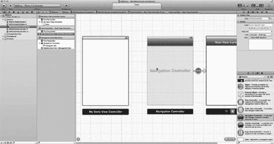

**Figure 7–9.** 将这个第一个导航控制器保留为一个简单的视图控制器。

9.  你暂时不去动这个第一个导航控制器。原因是这是用户将看到的第一个视图，而你希望在这里做的就是访问苹果提供的代码，这些代码与视图顶部蓝色导航栏的逻辑相关联。严格来说，右侧的根视图控制器实际上是用户将看到的第一个视图，因为导航控制器被推入视图堆栈。但暂时，只需将控制器有序地排列好即可。

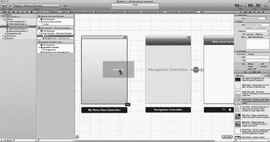

**Figure 7–10.** 将`UIImageView`拖到你的第一个视图控制器上。

10. 如前所述，在你的应用中，每个状态中不会编写代码；相反，你将使用图片——无论是自己制作的，还是最好从我网站上下载的。现在你已经知道，图片需要放置在`UIImageViews`中。因此，将`UIImageView`拖到你的第一个视图控制器上，以便将`mystory.png`放置在上面。这在 Figure 7–10 中进行了说明。

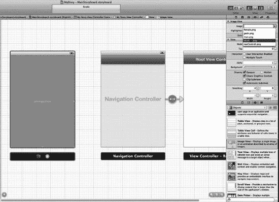

**Figure 7–11.** 打开工具面板并选择`mystory.png`。

11. 从工具面板的属性检查器中`UIImageView`的设置中，将图像设置为`mystory.png`，如图 Figure 7–11 所示。

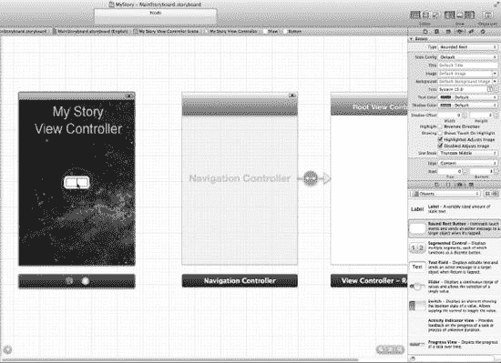

**Figure 7–12.** 将一个`UIButtonView`拖到主视图控制器上，以便有一个可操作的项目来将下一个视图控制器推入堆栈。

12. 如图 Figure 7–12 所示，你需要在主视图控制器上有一个按钮，因此将圆角矩形按钮（`UIButtonView`）拖到上面，以便有一个可操作的项目供用户按下，从而将下一个视图控制器推入堆栈。

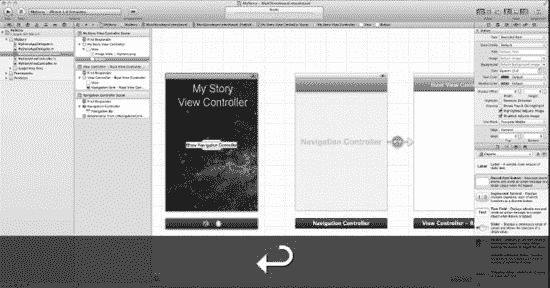

**Figure 7–13.** 在按钮中插入文本；我使用了“Show Navigation Controller”。

13. 当用户按下第一个按钮时，你希望它带用户前往导航控制器。让我们告诉用户，如果他们按下这个按钮，将会发生这种情况。这在 Figure 7–13 中进行了说明。

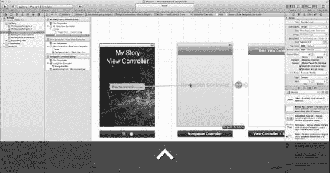

**Figure 7–14.** 开始实际的链接。

14. 这一步实际上是故事板的核心。让我们想想这个问题：你希望用户按下标有“Show Navigation Controller”的按钮时，被导向导航控制器。与其编写代码，不如直接将按钮链接到导航控制器。为此，将鼠标悬停在按钮上，然后按住 Control 键并拖拽到导航控制器上释放，以创建一个过渡链接。这就是神奇之处——无需编写代码即可实现带动画的过渡，如图 Figure 7–14 所示。这是完全免费的！这是苹果公司极其聪明的员工们——如果你不介意我再次提醒你，其中包括本书第一版的读者和学生——所编写的礼物！所以坚持住！

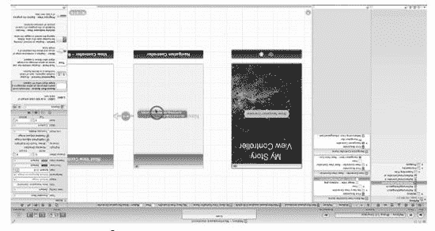

**Figure 7–15.** 选择“`performSegueWithIdentifier:` ”选项。

15. 将连接器放到导航控制器上后，会出现`performSegueWithIdentifier:sender`选项，这是方法的名称，它包含了使用故事板正确连接这两个项目所需的所有代码。你可能会注意到，我在“深入代码”部分还添加了一节，描述了如何以编程方式添加`performSegueWithIdentifier:sender`方法。另一方面，如果你没有看到这个选项，请转到步骤 16。

> **注意：** 你不能通过从`UIView`或基本视图控制器上按住 Control 键拖拽来创建 Segue。你需要一个可操作的项目来创建 Segue，而`UIButtonView`是一个易于使用的工具。

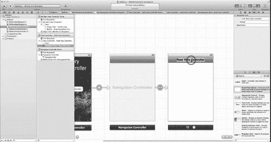

**Figure 7–16.** 将根视图控制器的标题栏重命名为更好的名称，例如“Root”。

16. 你现在要将根视图控制器的标题改为有用的名称。我建议使用“Root”，因为在使用应用时，你不需要关心模型-视图-控制器（MVC）的方面。这个标签也是免费命名导航按钮的一个组成部分，你将在运行应用时看到这些按钮。这在 Figure 7–16 中进行了说明。命名这些标题栏对于用户理解他们在程序中的位置以及他们如何到达那里非常重要。双击标题栏，或在属性面板的“标题”部分输入内容，可以编辑该值。当用户通过导航控制器来回移动时，这些标签会出现在标题和“返回”按钮中。稍后当你测试应用功能时，就会看到这一点。

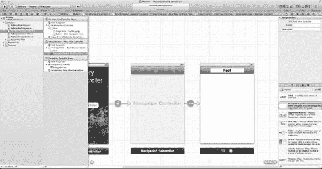

**Figure 7–17.** 第一阶段几乎完成——你只需要为 Segues 和转场设置样式，然后进行一次测试运行。

17. 在继续前进之前，停下来喘口气。你已经成功地为这个故事板应用奠定了基础，也为许多其他应用所使用的方法学奠定了基础，即一个连接到你的根导航控制器的视图控制器。本质上，你已经创建了一个带按钮的视图控制器，该按钮带你到一个你命名为“Root”的导航控制器，如图 Figure 7–17 所示。你故事板的其余部分将从这个根节点发展开来。现在，你将看到 Segue 样式、转场样式，并且将在接下来的三个步骤中进行一次测试运行。一旦你到达步骤 20，你将被要求返回并运行这前 20 个步骤。

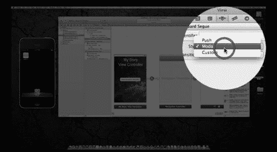

**Figure 7–18.** 选择你刚刚创建的 Segue，并选择一种 Segue 样式。


18. 选择你创建的 Storyboard Segue。现在我们来选择一种要使用的 Segue 样式。在 Attributes 面板中，你可以选择三种 Segue 样式类型之一。`Push` 是标准从右侧滑入的动画。`Modal` 是一种用于在两个视图之间来回切换的 Segue 类型。`Custom` 要求你编写自己的 Segue 类型。嗯，我们稍后再做吧。无论如何，我希望你尝试这些不同的样式，以便熟悉它们。不同的学生有不同的偏好。暂时保留默认设置即可，因为它们工作良好，如图 Figure 7–18 所示。

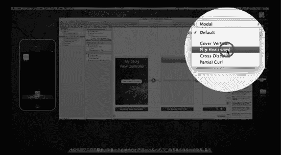

Figure 7–19. 选择你喜欢的转场动画。

19. 转场是每种 Segue 样式可用的动画类型。同样，坚持使用默认设置。我选择 `Flip Horizontal` 样式，没有特别的原因，只是它适合我。如果你愿意，也可以选择其他样式。请随意尝试，但要牢记可用性。很容易让动画变得过于花哨。我经常发现，流行的应用以及更聪明的学生们，往往更少追求炫酷，而更注重实用和效率。

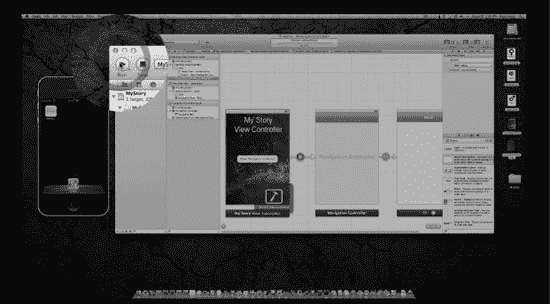

Figure 7–20. 运行它，看看你在第一阶段实现了什么。

20. 此时，运行应用将会向你展示，要得到一个有方向感且能工作的应用，你实际上只需要做多么少的工作。因此，如图 Figure 7–20 所示，点击那个“Run”按钮，看看你得到了什么。

注意：你可能想模仿我在这个阶段让我的学生们做的事情。我让他们擦除到目前为止所做的一切，除了桌面上的五个图标。然后我让他们一遍又一遍地重复这些步骤，直到他们能够：1) 到达这个阶段（排除步骤 18 和 19）；2) 运行它；3) 在 50 秒内让它在模拟器中显示出来，且不借助书本。

我强烈鼓励你这样做！

就像高尔夫球手需要练习挥杆以形成肌肉记忆一样，你需要能够不假思索地达到这一步。首先，按照自己的节奏，参考书本操作，然后越来越快，直到你做到 50 秒以内！是的！

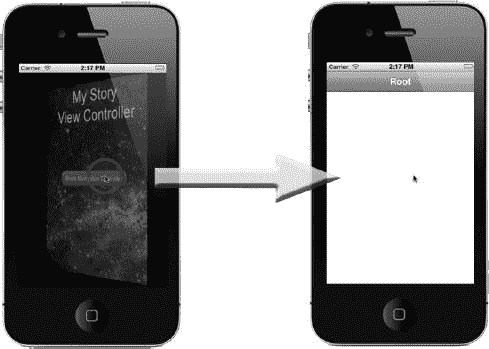

Figure 7–21. 果然，点击按钮会翻转视图，显示一个空白视图，顶部有一个名为“Root”的导航栏。

21. 点击“Run”按钮后，模拟器打开，瞧！它工作了！你几乎没做什么，也没使用任何代码，只是移动、拖拽和连接了几个项目，就拥有了一个运行中的应用！点击按钮会翻转视图，显示一个空白视图，顶部有一个名为“Root”的导航栏，如图 Figure 7–21 所示。太棒了！

#### 第二阶段：设置视图控制器

当然，你想让这个应用比现在做得更有趣一些。请记住，在这个不断演进的应用中，你有三种类型的人类——男人、女人和极客——他们都有可能进化成超级极客。这意味着你需要有三个视图控制器直接连接到你的导航控制器。因此，在你开始将三个视图控制器拖到 Storyboard 上之前，请确保：

*   你能看到所有东西——足以容纳三个水平放置的`UIViewControllers`。
*   你的网格对齐能够保持，这样你的连接线以后就不会看起来很傻，从而更难跟踪。

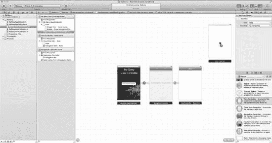

Figure 7–22. 缩小视图并将一个新的视图控制器拖到 Storyboard 上。

22. 那么，让我们再向 Storyboard 中放入三个视图控制器，放在根视图控制器的右侧。另一种方法是先放入一个，然后按住 Option 键，将第一个拖到另一个位置，这样就可以复制一份。这属于个人偏好，但如果你能做到，肯定会让你看起来像个超级极客。Anthony 在此视频中做得很好：`bit.ly/oMp984`。尝试让你的屏幕看起来像图 Figure 7–22 所示，该图展示了这三个`UIViewControllers`中的第一个正在被拖到 Storyboard 上。记住，如果你在缩放方面遇到问题，只需点击缩放控制区域中的“等于”按钮，这样你就可以向各个控制器添加其他内容。

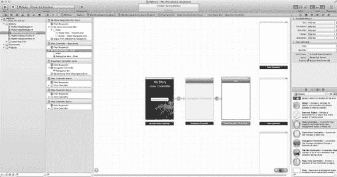

Figure 7–23. 所有三个视图控制器都放置在 Storyboard 上之后的界面。

23. 如图 Figure 7–23 所示，这是你将所有三个视图控制器拖到 Storyboard 后屏幕应该呈现的样子。注意它们已对齐、等间距分布并锁定在网格上。

注意：对象无法吸附？如果你不断地尝试将对象拖到视图上而它们始终无法吸附，这会令人沮丧。因此，请确保你回到正常的缩放级别。

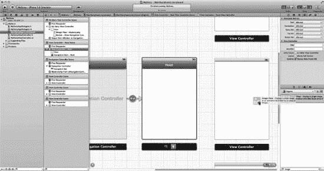

Figure 7–24. 添加一个`UIImageView`。

24. 展望不久之后，你仍然需要放置四张图片：一张图片放入你的根视图，三张图片（分别代表男人、女人和极客）放置到你刚刚创建的三个`UIViewControllers`上。我无需提醒你，如果你想让图片出现在应用的视图中，你需要将这些图片放在`UIImageViews`上。不过现在，让我们先关注根视图，在那里你需要一张图片和用于导航到三个子视图的按钮。将一个 Image View 拖到你的根视图上，如图 Figure 7–24 所示。

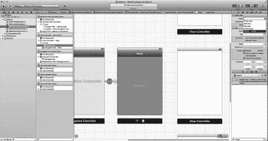

Figure 7–25. 在 Attributes 面板中设置图片。

25. 你现在需要选择我创建的`NavControll.png`图片，该图片现在位于 Attributes 面板中并可供选择，如图 Figure 7–25 所示。同样，你可以选择任何你想要的图片。但是，在你花费太多时间创建自己的图片之前，请记住以下注意事项。

注意：请记住，在未来的几个月里，当你使用 Storyboard 创建应用时，这里将完全没有图片。相反，你将拥有代表选择器、表格或游戏关卡等内容的代码。现在，暂时使用我的图片，但要记住，未来在这个 Storyboard 的节点上你将用到更强大的东西。

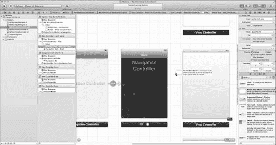

Figure 7–26. 将`UIButtonView`拖到导航控制器上并复制它。


26. 如图 7-26 所示，向视图中添加一个新的`UIButtonView`。你可以通过每个按钮的激活来跳转到另一个视图。你可以重复该过程三次来拖拽三个按钮，也可以练习使用你已经尝试过一次的`option-drag`技术。因此，从你放置的第一个按钮开始，使用`option-drag`复制它两次，因为你总共需要三个按钮，之后只需重新标注它们。按降序将这些按钮命名为“Male”、“Female”和“Geek”，并根据需要调整它们的大小。

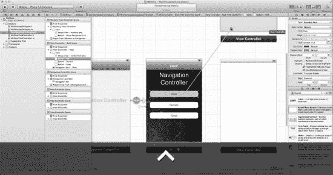

图 7-27. 从每个按钮创建更多跳转到三个视图控制器的转场。

27. 你需要从三个按钮分别创建指向其关联视图控制器的转场。因此，和之前一样，从每个按钮`control-drag`到另一个视图控制器，以便为每个按钮创建一个转场链接。我将“Male”连接到顶部，“Female”连接到底部，“Geek”连接到中间，这样可以使链接线看起来整洁有序。如图 7-27 所示。

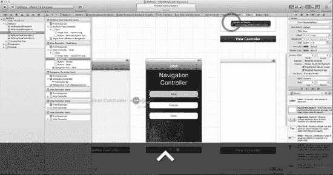

图 7-28. 连接到`performSegueWithIdentifier:sender:`。

28. 正如你在 7-15 中所做的那样，当从 Male 按钮`control-drag`到 Male 视图控制器时，你会看到选择模态、推入或自定义的选项，你可以保留默认设置，或者你会看到一个`performSegueWithIdentifier:sender:`选项，该选项包含使用情节串联图板连接这两个对象所需的所有代码。如图 7-28 所示。

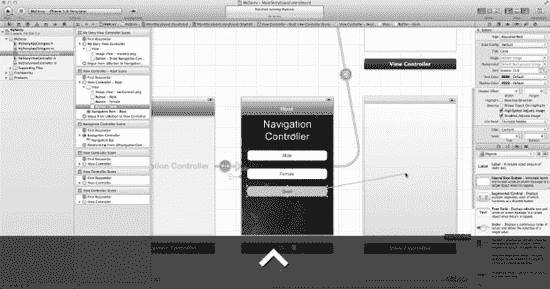

图 7-29. 已完成的指向 Male 的转场以及正在进行的指向 Geek 的转场。

29. 图 7-29 展示了连接 Male 按钮到 Male 视图控制器的已完成转场。注意，我将 Geek 的视图控制器放在了中间，以便你可以在应用程序的后续阶段向外扩展。这说明了你为用户提供的模式或顺序可能与你情节串联图板上视图控制器的顺序不同。并且我毫不怀疑，在掌握转场如何显示其视觉连接性之前，你将需要一段时间才能让它们看起来像图 7-29 中展示的那样优雅。不要灰心，只需稍加练习，就能学会如何将视图控制器放置多远，以及如何确保所有对象之间的网格对齐具有对称性。

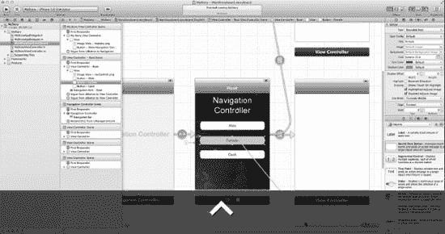

图 7-30. 最后一个转场，从 Female 按钮到其视图控制器。

30. 好的，对于这最后一个连接，我要说的只是你应该从 Female 按钮创建一个转场到其视图控制器。图 7-30 展示了这一步骤的第一部分，但我不会重复所有步骤。

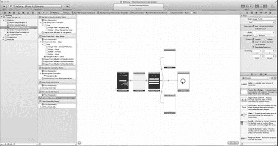

图 7-31. 缩小视图并排列布局。

31. 起初，我并没有想到需要在情节串联图板上花费大量时间来排列对象/视图。然而，在亲身经历了一些困难，并看到我的学生们制作的混乱的“意大利面条”式布局后，我决定花点时间提出一些基本原则，遵循这些原则可以避免混乱和纠缠。像我一样缩小视图，然后在你遵循我制定的三个规程时，相应地移动你的对象：

*   **互斥性（Mutual Exclusivity）**：我已经提到了第一个技巧，即保持按钮的顺序与视图的顺序互斥。导航控制器上的按钮顺序是 Male、Female 和 Geek。在情节串联图板上保持这个顺序会产生问题，因为这将违反我下面将要提到的一些原则。
*   **保持初始方向（Maintain Initial Momentum）**：例如，在图 7-31 底部的 Woman 视图上，如果有 10 条转场呈扇形指向 10 个视图，而这些视图都没有指向 Geek 分支的转场，那么就让这些基于 Woman 的转场保持向下延伸。
    *   查看图 7-32，可以看出一个完美的反面例子，展示了如何不保持初始方向。不仅转场连接被隐藏了，而且它们还相互重叠，干扰了追踪转场起点和终点的能力。
*   **最小化转场连接角度（Minimize Segue Connection Angles）**：这个原则通过直观的观察更容易解释：查看图 7-31 中从导航控制器到 Male 和 Female 的转场连接。注意它们是如何先向后倾斜再向前倾斜的，相比之下，图 7-32 及之后图中从导航控制器连接到相同两个 Male 和 Female 视图的角度则更小。遵循此规程的一个简单方法是，一旦转场连接好，就水平或垂直移动它所连接的对象，直到转场连接几乎完全水平或垂直。

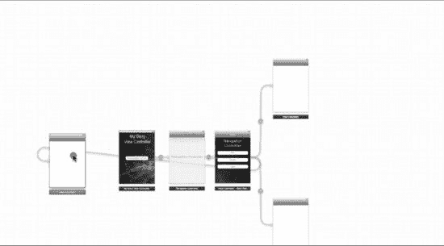

图 7-32. 哦！违反了“保持初始方向”规程的第二条原则。

32. 你真的需要小心放置对象的方式，因为 GUI 可能会使事情看起来非常奇怪，如图 7-32 所示，该图演示了违反“保持初始方向”规程的情况。但是，请注意，因为你将 Male 和 Female 分别移到了顶部和底部，所以可以看到你已遵守了最小化转场连接角度的规程。

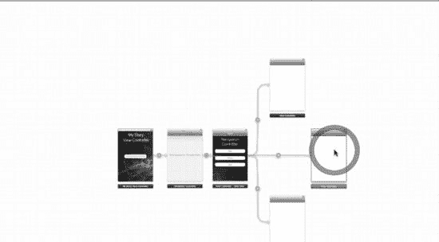

图 7-33. 向前移动 Geek 对象。

33. 为了同时遵守“保持初始方向”和“最小化转场连接角度”这两个规程，将 Geek 对象向前移动，如图 7-33 所示。一旦 Geek 对象被向前移动，你就将遵守所有这三个规程。


#### 第三阶段：建立视图控制器内容

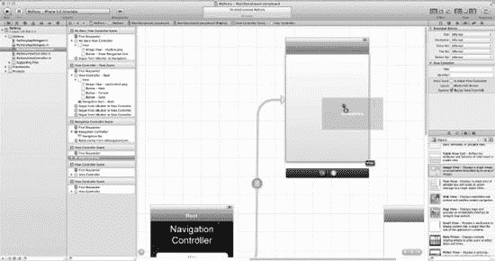

*图 7–34\. 将 `UIImageView` 添加到“男性(Male)”视图中。*

34. 下一步需要将图像添加到“男性(Male)”、“女性(Female)”和“极客(Geek)”视图控制器中。我们从顶部开始，将一个 Image View 拖拽到“男性(Male)”视图上，如图 7–34 所示。

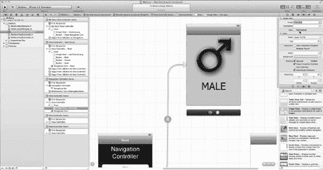

*图 7–35\. 从属性面板中选择用于“男性(Male)”的图像。*

35. 通过从属性面板中选择 `man.png` 图像，将其与“男性(Male)”控制器关联起来，如图 7–35 所示。

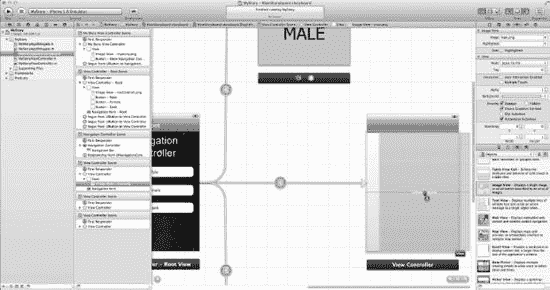

*图 7–36\. 将 `UIImageView` 添加到“极客(Geek)”视图中。*

36. 现在你需要再次拖拽 `UIImageView` 并将其与一张图像关联——就像对“男性(Male)”所做的那样，总共还需要操作两次。那么就开始吧：将一个 `UIImageView` 拖拽到“极客(Geek)”视图上，如图 7–34 所示。

**注意：** 请注意 storyboard 连线上的小图标，它们描述了将要执行的连线类型。

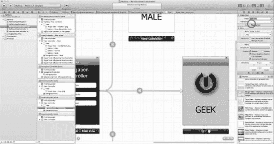

*图 7–37\. 从属性面板中选择用于“极客(Geek)”的图像。*

37. 透过从属性面板中选择 `Geek.png` 图像，将其与“极客(Geek)”控制器关联起来，如图 7–35 所示。

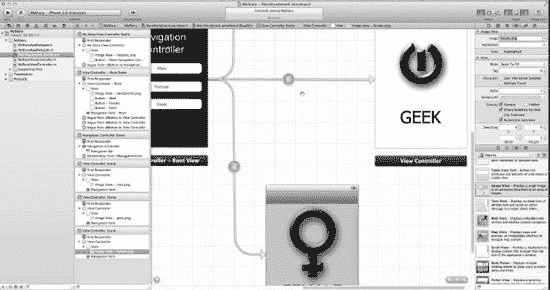

*图 7–38\. 添加 `UIImageView` 并为“女性(Female)”选择图像。*

38. 没错！现在你可以独立完成这一步了。添加一个 `UIImageView`，并将 `female.png` 与其关联。如图 7–38 所示。

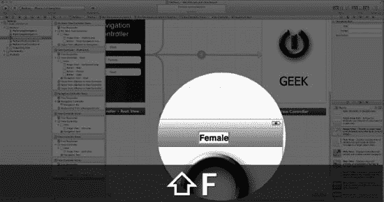

*图 7–39\. 命名“女性(Female)”控制器的导航栏标题。*

39. 在 storyboard 中命名控制器导航栏标题，实际上会在底层实例化连接，从而省去你编码某些连线的必要。这在**深入代码(Digging the Code)**部分有更详细的解释，但就目前而言，你只需接受在 storyboard 控制器导航栏标题中应用名称，本质上是一个“免费”的代码功能。对“男性(Male)”、“女性(Female)”和“极客(Geek)”控制器的导航栏标题也做同样的操作。在图 7–39 中，你可以看到“女性(Female)”控制器的默认值正在更改为“Female”。

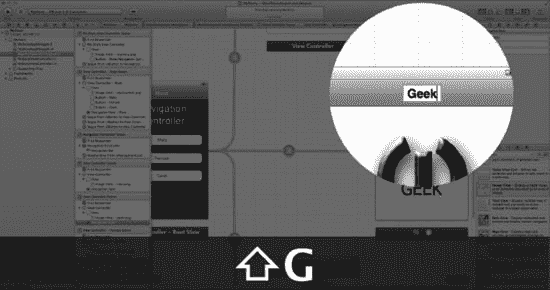

*图 7–40\. 命名“极客(Geek)”控制器的导航栏标题。*

40. 图 7–40 显示了“极客(Geek)”控制器导航栏标题正在被重命名。

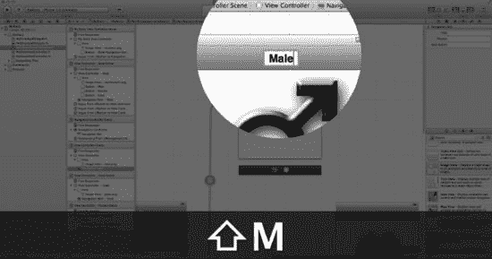

*图 7–41\. 命名“男性(Male)”控制器的导航栏标题。*

41. 图 7–41 显示了“男性(Male)”控制器导航栏标题正在被重命名。

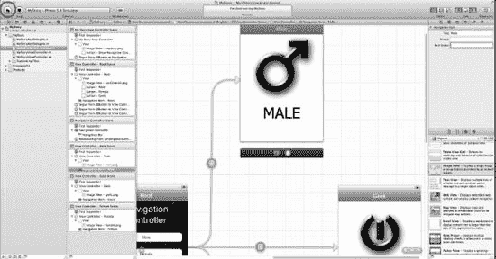

*图 7–42\. 运行它！让我们看看是否一切正常。*

42. 图 7–42 展示了如何快速运行应用以检查连线连接和图像是否都正常工作。

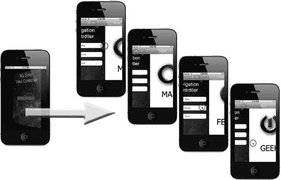

*图 7–43\. 是的，它运行成功了！*

43. 图 7–43 展示了该应用在无需任何编码的情况下，运行得非常好。所有图像不仅显示了一个状态，还显示了由连线连接的两个状态之间的过渡。从最左侧的视图控制器，你可以看到四幅图像。顶部图像显示了从导航控制器点击到“男性(Male)”的点击。右侧的下一幅图像，显示了点击导航栏控制器返回导航控制器的操作。剩余的两幅图像分别显示了从导航控制器到“女性(Female)”和“极客(Geek)”的连线过渡。

**注意：** 因为你没有更改连线类型，所以创建的三个连线过渡都具有 push 效果。

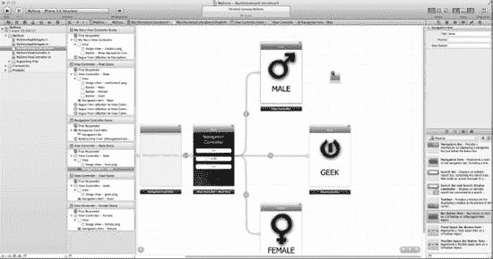

*图 7–44\. 现在，让我们“进化”。*

44. 现在，你即将进入这个应用中有趣的部分，这个部分常让学生在课堂上大笑。你明白，在这个世界上（大部分情况下）存在男性和女性！在你的应用中，你将向世界展示进化仍在发生。你将向世界展示，男性和女性都可以进化到更高的意识水平，当然，这种状态就是……没错，你猜对了……极客(Geek)！因此，你需要添加一条从“男性(Male)”和“女性(Female)”状态指向“极客(Geek)”的连线。嗯，你知道应该怎么做吗？在“男性(Male)”和“女性(Female)”视图的导航栏上各添加一个“按钮栏项(Bar Button Item)”，并将其标题设置为“Evolve”，如何？然后，你可以从这些“Evolve”按钮建立连接到“极客(Geek)”。好了！首先，将一个“Bar Button Item”拖拽到“男性(Male)”视图上，如图 7–44 所示。当你将第二个“Bar Button Item”拖拽到“女性(Female)”视图上之后，有一件重要的事情我希望你记住关于“Bar Button Icons”的特点。这些按钮的行为与常规的 `UIButtonViews` 完全相同，但它们的外观不同，并且设计为只能放在一个地方，即导航栏。

**注意：** Bar Button Items 的行为与常规的 `UIButtonViews` 完全相同，但它们的外观不同，并且设计为只能放在一个地方，即导航栏。

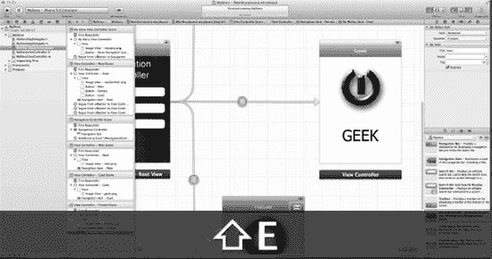

*图 7–45\. 重命名“女性(Female)”的 Bar Button Item。*

45. 如图 7–45 所示，将你拖拽到“女性(Female)”上的 Bar Button Item 重命名为“Evolve”。

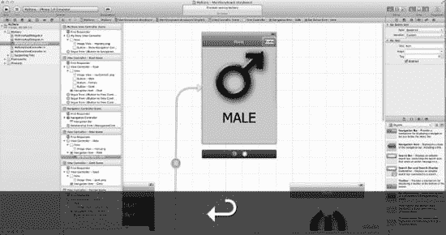

*图 7–46\. 重命名“女性(Female)”的 Bar Button Item。*

46. 如图 7–46 所示，点击你拖拽到“男性(Male)”上的 Bar Button Item。现在将其命名为“Evolve”。

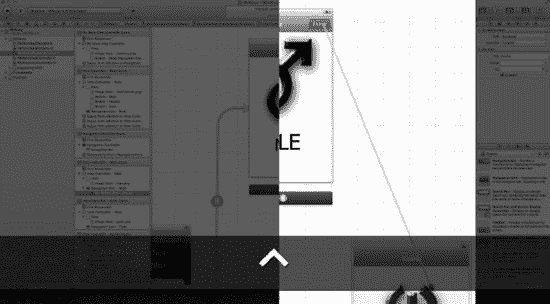

*图 7–47\. 从“男性(Male)”的 Evolve 按钮按住 Control 键拖拽到“极客(Geek)”视图控制器。*

47. 你想从 Evolve 按钮建立连接到“极客(Geek)”。点击“男性(Male)”的 Evolve 按钮，然后按住 Control 键拖拽到“极客(Geek)”的视图控制器。这里提供了一种获取连接到另一个视图的新方法。请注意，为了简单起见，我保持了过渡的线性。它们可以是循环的或完全环形的。正如图 7–47 所示，这与视频中的演示完全一致。

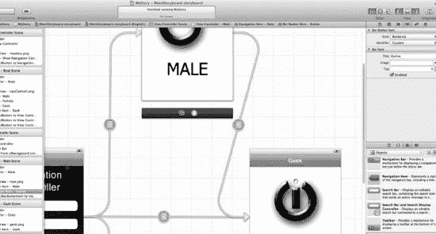

*图 7–48\. 从“男性(Male)”的 Evolve 按钮到“极客(Geek)”对象的连接已完成。*

48. 图 7–48 说明了从“男性(Male)”的 Evolve 按钮到“极客(Geek)”对象的连接已完成。你可能会注意到，在这里你违背了第三个协议，即“最小化连线连接角度”协议。因此，请继续将其向右移动，直到角度最小化。

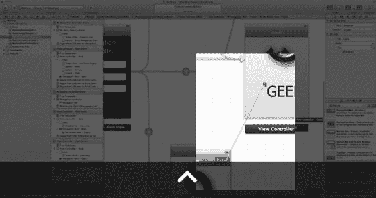

*图 7–49\. 从“女性(Female)”的 Evolve 按钮到“极客(Geek)”对象的连线。*

49. 既然你已经将“男性(Male)”的 Evolve 按钮连接到“极客(Geek)”对象，那么对“女性(Female)”也进行同样的操作。如图 7–49 所示。

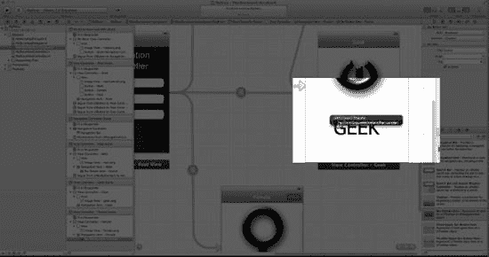

*图 7–50\. 以防你忘了，或者以为我忘了……嗯！*


50\. 图 7-50 提醒你，我已经不再一步步地告诉你每一个操作了。对于最后三个转场，如果你想到的是模态、推入或自定义这三个选项，就将其保留为默认设置，或者像之前一样，使用`performSegueWithIdentifier:sender:`方法，该方法包含了通过 storyboarding 适当连接这两个项目所需的所有代码。如果你一直在独立操作，并且忘记了我之前并没有指示你执行每一步，那么你做得很好。如果你在最后三次调用`performSegueWithIdentifier:sender:`时遇到了一些困难，让我提醒你，我正在稍微松开牵引绳，让你自己独立思考。我在设计本书时认为，随着你越来越自信，你只需查看图注就能飞速前进。好了，我们继续吧！

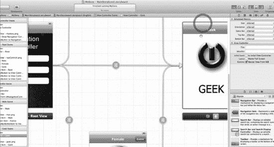

**图 7-51.** 遵守第三个 storyboard 协议。

51\. 回到步骤 48 所述的内容，将 Geek 对象移出，并使其遵守第三个协议。这一点在图 7-51 中进行了说明。过一段时间后，你将不再思考协议一、二或三，而只是发现自己在这里或那里进行一些小小的重新排列，直到你拥有一个令人垂涎的对称布局！

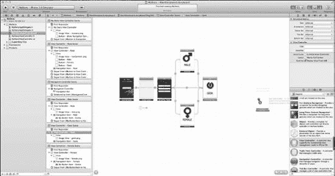

**图 7-52.** 最后一个`UIViewController`！

52\. 既然你已经在这个极客世界里生活了几个章节，你可能已经注意到，极客们知道一些普通人完全不知晓的事情。没错！人类还有比极客更高的境界！这些特殊的极客，进化到了更高的意识状态，被称为Über Geeks。Über Geeks 非常罕见，只有极客才能识别出来。但这将在你的应用中体现出来。所以，你本质上需要在 Geek 之外再添加一个人类进化状态！你需要添加最后一个`UIViewController`，它将演示如何以编程方式访问控制器及其数据。这在图 7-52 中进行了说明。

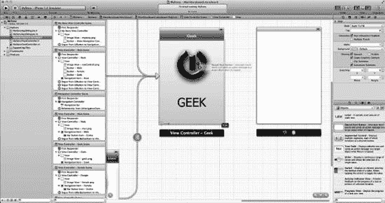

**图 7-53.** 你可以在背景图像上使用一个简单的不可见按钮，作为一种简单的技巧，避免花时间制作一个花哨的按钮。

53\. 如你所知，只有极客知道有一种人类的意识状态高于 Geek。下一个更高状态，Über Geek，是不可见的。所以你需要制作一个只有极客才知道会跳转到更高Über Geek 意识状态的不可见按钮。嗯，我仿佛听到你在想：“我们怎么做不可见按钮？！” 好吧，这完全是极客的一部分。普通人甚至认为极客符号是“电源”符号！极客知道它实际上是极客符号。还有一些秘密的行事方式，比如运行整个宇宙和所有计算机，并通过不可见的秘密门和通道访问各种酷炫的东西。今天，你已经进化到足以学习如何制作一个不可见按钮了。请仔细阅读，并且务必不要让非极客看到这些内容！如图 7-53 所示，将一个看起来无辜无害的圆角矩形按钮拖到你的 Geek 对象上。

#### 阶段四：收尾与编码

你现在进入了最后阶段，让我们完成这个应用吧。

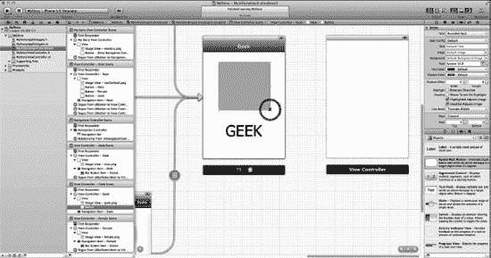

**图 7-54.** 首先，覆盖整个 Geek 符号。

54\. 如图 7-54 所示，一旦按钮放置在 Geek 对象上，就展开按钮，使其覆盖整个 Geek 符号。

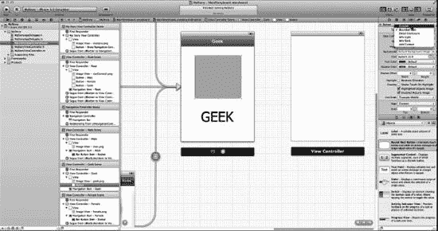

**图 7-55.** 让那个按钮消失得无影无踪！

55\. 你想让它不可见，所以如图 7-55 所示，将按钮类型设置为 Custom，GUI 会立即默认使按钮不可见，但对于极客来说仍然可以点击！

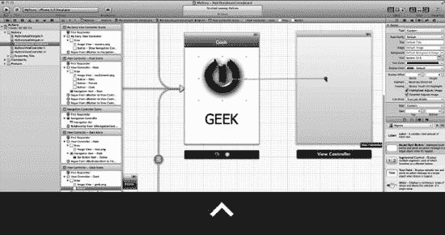

**图 7-56.** 从不可见按钮按住 Control 键拖拽到下一个视图控制器。

56\. 现在你已经制作了不可见按钮，你需要创建一个跳转到下一个转场的 segue。点击你知道的不可见按钮所在位置，然后按住 Control 键拖拽到新的视图控制器，如图 7-56 所示。

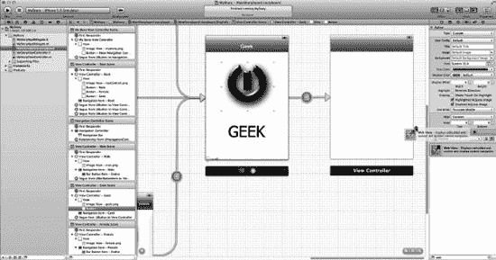

**图 7-57.** 这次，让我们在视图中添加一个 Web View。

57\. 对于这最后一个状态，为了学习目的，你将有比一张图片更多一点的内容。让我们插入一个 URL。要插入 URL，请将一个 Web View 拖入视图中。我将在“深入代码”部分深入探讨与`UIWebView`相关的其他花哨功能，但现在，只需将一个默认的`UIWebView`拖入Über Geek 的视图控制器中。这在图 7-57 和 7-58 中进行了说明。

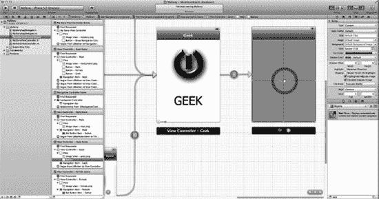

**图 7-58.** Web View 的放置。

58\. 图 7-58 说明了如何将 Web View 放置到Über Geek 的视图控制器中。

> **注意：** 我总是先建立链接，以避免导航栏被添加到新视图时，需要重新调整视图内元素的大小。


**图 7-59.** 创建一个新类。

59\. 回想一下我之前说过，在这个例子中你将使用图像而不是代码。嗯，到目前为止你所做的一切都是如此，但你需要至少看一次如何在这些状态之一后面插入代码。这就是为什么我选择了一个非常简单的 URL，加上几行代码，这至少会在你的大脑中连接一些突触，让你了解如何添加代码。所以，对于这个新的 Web View，你将创建一个新类，将其连接到这最后一个视图，并以编程方式访问视图控制器中的一些数据。右键点击（或按住 Control 键点击）项目中的主目录，然后选择 New File，如图 7-59 所示。如果你能独立完成此操作，则跳到步骤 61 和图 7-61。如果你需要一点指导，则继续下一步。


**图 7-60.** 选择“New File”。

60\. 使用你的键盘快捷键`⌘`+`N`，或者如图 7-60 所示，选择 New File。


**图 7-61.** 选择一个`UIViewController`子类。

61\. 如图 7-61 所示，选择一个`UIViewController`子类。从技术角度来看，可以说这对应于 GUI 构建器中对象的相同类型。


**图 7-62.** 点击 Next。

62\. 如图 7-62 所示，点击 Next。


**图 7-63.** 将新类命名为`ÜberView`。


63. 如图 Figure 7–63 所示，我们将新类命名为 `ÜberView`，然后点击保存。


Figure 7–64. 调出 Assistant。

64. 调出 Assistant，以便您能同时看到故事板和头文件，如图 Figure 7–64 所示。


Figure 7–65. 在主编辑器中打开故事板文件。

65. 再次点击故事板文件，将其在主编辑器中打开，这样关联的头文件就会显示在右侧编辑器中，如图 Figure 7–65 所示。


Figure 7–66. 选择合适的 View Controller。

66. 与之前的应用不同，现在情况稍微复杂一些，因此您需要帮助 Assistant 调出正确的视图。为了告诉 Assistant Editor 要调出什么，只需选择包含您的 Web View 的视图控制器即可。如图 Figure 7–66 所示。请注意，在视图控制器列中，它们是按创建顺序排列的。您可以看到您创建的 Male、Female 和 Geek 视图控制器，位于最下方的是您刚刚创建的，因为尚未命名，所以称为“View Controller Scene”。这就是您需要的视图控制器。


Figure 7–67. 设置视图控制器的类。

67. 现在，您需要在属性面板中将这个新视图控制器的类设置为 `ÜberView`，如图 Figure 7–67 所示。


Figure 7–68. 选择 `ÜberView.h` 文件。

68. 您需要为 URL 创建 `UIOutlets`，因此需要让 Assistant 打开 `ÜberView.h` 文件。您需要向 Assistant 说明这是您需要的，因为 Assistant Editor 有多个可能的编辑选项。此外，当情况变得稍微复杂时（比如现在），它通常会选错，因此您需要手动选择头文件，如图 Figure 7–68 所示。


Figure 7–69. 按住 Control 键拖拽到您的头文件。

69. 现在您已经正确设置了 Assistant，只需从 `UIWebView` 按住 Control 键拖拽到头文件，并将其放置在 `Überview` 的 `@interface` 下方，让 Xcode 完成它的工作，如图 Figure 7–69 所示。


Figure 7–70. 为您的 Outlet 命名。

70. 当然，您需要保持其为 Outlet 类型，这意味着您只需要给它一个名称。您可以随意命名，但如果您想将代码与我的进行对照，我建议您将其命名为 `webView`，如图 Figure 7–70 所示。


Figure 7–71. 打开实现文件。

71. 在这种状态下插入代码时，您可能需要做的不仅仅是使用一个 URL。至少，您需要在头文件和实现文件之间来回切换。因此，我们就在这里进行操作，因为我们还想添加一些额外的功能。回到新控制器类的实现文件，您可以让您的 Web View 执行操作。如图 Figure 7–71 所示。


Figure 7–72. 开始编码！

72. 取消注释 `viewDidLoad` 方法，因为您希望在此处初始化您的网页内容加载代码。参见 Figure 7–72。


Figure 7–73. 从 `NSURLRequest` 开始。

73. 您需要为您的 URL 请求委派数据流，因此从 `NSURLRequest` 开始，它会自动处理。关于 `NSURLRequest` 的信息，请参阅“深入代码”部分。参见 Figure 7–73。


Figure 7–74. 将 URL 添加到请求中。

74. 您需要将 URL 地址添加到请求中，并让您通过 Outlet 关联的 `webView` 对象加载您的请求，如图 Figure 7–74 所示。


Figure 7–75. 重要提示：`webView` Outlet 连接。

75. 这一点很重要。不知何故，学生们很难理解这一点，因此我在视频和书中都对此进行了说明。您需要将头文件中的 `webView` Outlet 连接与实现文件中设置的条件关联起来。我在 Figure 7–75 中对此进行了说明。本质上，您需要将 URL 添加到请求中，并让您为其创建了 `IBOutlet` 的 `UIWebView` 对象加载您的请求。以下是实现文件和头文件的代码。请仔细研究，确保您理解两个文件中 `webView` 的关联关系。

```
// Header:

#import <UIKit/UIKit.h>
@interface UberView : UIViewController {
    UIWebView *webView;
}

@property (nonatomic, strong) IBOutlet UIWebView *webView;

@end

// Implementation Files:
#import "UberView.h"

@implementation UberView
@synthesize webView;

- (id)initWithNibName:(NSString *)nibNameOrNil bundle:(NSBundle *)nibBundleOrNil
{
    self = [super initWithNibName:nibNameOrNil bundle:nibBundleOrNil];
    if (self) {
        // Custom initialization
    }
    return self;
}

- (void)didReceiveMemoryWarning
{
    // Releases the view if it doesn't have a superview.
    [super didReceiveMemoryWarning];

    // Release any cached data, images, etc that aren't in use.
}

#pragma mark - View lifecycle

/*
// Implement loadView to create a view hierarchy programmatically, without using a nib.
- (void)loadView
{
}
*/

// Implement viewDidLoad to do additional setup after loading the view, typically from a nib.
- (void)viewDidLoad
{
    [super viewDidLoad];

    NSURLRequest* request = [NSURLRequest requestWithURL:[NSURL URLWithString:@"http://www.synapsesoftware.net/about/two.html"]];
    [self.webView loadRequest:request];
}

- (void)viewDidUnload
{
    [self setWebView:nil];
    [super viewDidUnload];
    // Release any retained subviews of the main view.
    // e.g. self.myOutlet = nil;
}

- (BOOL)shouldAutorotateToInterfaceOrientation:(UIInterfaceOrientation)interfaceOrientation
{
    // Return YES for supported orientations
    return (interfaceOrientation == UIInterfaceOrientationPortrait);
}

@end
```


Figure 7–76. 您需要一个正确的 Ü 字符……但一只狮子挡住了您的去路！


##### 76. 作为一名极客，你可能希望在最后一个视图控制器的导航栏中显示正确的“Ü”字符。

最初，在视频和图 7-76 到 7-85 中，我详细解释了如何做到这一点。这本来很完美。但过程中发生了一些事。Mac OS X Lion 完全消除了这一需求，算是个意外之喜。现在，你只需长按 `u` 键，直到出现一个小窗口，然后做出所需的选择。其他字符也有类似的变体。你可以自行探索。

因此，从图 7-76 到 7-89 之间的所有这些步骤原本打算删除，但后来又发生了一件有趣的事。许多大学和社区学院最近才更新到 Mac Leopard，并且至少在一年内不会获得 Lion 的授权。这意味着成千上万的学生将不知道如何正确输入“Ü”。所以，如果你用的是 Lion，请长按 `u` 键直到出现正确的字母，然后转到图 7-86。如果你没有 Lion，请按照以下步骤操作。首先，从 Apple 菜单中打开系统偏好设置应用，如图 7-76 所示。


**图 7-77.** 打开“语言与文本”偏好设置面板。

##### 77. 打开顶行中的“语言与文本”偏好设置面板，如图 7-77 所示。


**图 7-78.** 选择“键盘与字符显示程序”。

##### 78. 在“输入源”选项卡中，从源列表中选择“键盘与字符显示程序”。同时，打开菜单项，如图 7-78 底部附近所示。


**图 7-79.** 最小化此窗口以释放屏幕空间。

##### 79. 现在，最小化此窗口以释放屏幕空间。稍后你将再次关闭该菜单项。见图 7-79。


**图 7-80.** 调出“字符显示程序”。

##### 80. 现在，从菜单栏中出现的新图标中，选择“显示字符显示程序”。会显示一个微型键盘。当你在键盘上打字时，相应的按键会高亮显示，如图 7-80 所示。


**图 7-81.** 你需要的是橙色按键。

##### 81. 按住 Option 键会显示大量可供键入的符号。橙色按键对应其他语言中字符上方带有标记的特殊键，例如“ö”或“ê”。嗯，这正是你需要的。见图 7-81。


**图 7-82.** 进入“超级极客”（Über Geek）编辑模式！

##### 82. 回到 Xcode，双击`ÜberView`的标题栏进行编辑。首先键入 Option-u，同时观察下方的小键盘。现在你会看到一个黄色方框中的两个点。你接下来键入的字母上方将带有这个标记。键入 Shift-u。铛铛——Ü。然后输入“ber Geek”完成它，如图 7-83 所示。


**图 7-83.** 瞧！现在你已经正确拼写了“Über”。

##### 83. 图 7-83 显示了“Über Geek”的正确拼写。


**图 7-84.** 关闭键盘。

##### 84. 图 7-84 展示了如何像关闭其他窗口一样关闭键盘。


**图 7-85.** 隐藏菜单项。

##### 85. 如前所述，你可能希望从之前最小化的偏好设置面板中隐藏该菜单项，如图 7-85 所示。


**图 7-86.** 保存！

##### 86. 让我们保存所有内容并测试一下，如图 7-86 所示。


**图 7-87.** 运行它！

##### 87. 图 7-87 展示了最后一步——运行它。


**图 7-88.** 试着在脑子里理清头绪——如你所见，安东尼丢掉了他的头，然后找到了另一个，接着意识到他一开始并没有丢掉自己的第一个头，而现在他有两个头了！

##### 88. 做得好！

### 深入代码

是的，我知道这个过程相当累人。学生们上完这节课后都精疲力尽了。我试图理解为什么会这样。当我告诉他们这比编程容易得多时，他们看着我，仿佛我失去了理智。考虑到这一点，我决定将下一章作为复习内容，但会使用一个业务模型，这样就能一举两得：既能让你练习本章所学的内容，又能增加一些变化，让企业主和其他具有创新思维的人看到如何将故事板应用于财务模型。

因此，本章的“深入代码”部分将作为一个高级参考保留下来，你可以在以后尝试高级版故事板时再回来查阅。所以，要么直接进入第 8 章，要么快速浏览一下“深入代码”，即使没吸收任何东西也不必慌张。只需让大脑看看这里的内容，放空一下，休息片刻，然后继续下一章。


### 故事板视图控制器、iOS4 及其编程式创建

学生和网友们问我最多的问题是，故事板是否兼容 iOS4。我不明白为什么这么多人想了解这一点。向前看，拥抱新技术，不断迈向新领域才是正途。但答案是：不！故事板从未兼容过，将来也永远不会兼容 iOS4，因为它们基于仅在 iOS5 和 Lion 中可用的新运行时类。其次最热门的问题是，是否可以编程操作故事板。嗯，让我想想，这几乎就像是在说：“好吧，我有一辆能开的车，但我能不能下车去推它？”

我无法理解为什么这么多人想要改变它，或者试图深入探究其内部机制。如果你已经精通故事板，并发现了需要绕过的巨大缺陷，那我可以理解。然而，就我撰写本文之时，故事板问世并不久，而那些一个故事板应用都没做过的人就想知道能否改变它。尽管如此，我还是会回答这个问题，因为等到这本书出版时，或许后一种情况会适用。

要回答这个问题，你需要从运行时的角度来审视故事板。视图控制器之间的转换（transitions）和转场（segues）应在运行时中查看。在这里，你将会注意到，确实存在一种机制可以通过编程方式实例化转场。

*   首先，要了解如何通过编程方式修改现有的转场，你需要查看当前视图控制器与目标视图控制器之间的代码。在这里，你可以使用 `UIViewController` 的 `performSegueWithIdentifier:sender:` 方法，以编程方式触发你的转场。
*   其次，如果你的视图控制器之间没有定义转场，但你在故事板文件中定义了目标控制器，那么你很幸运。你可以使用 `UIStoryboard` 的 `instantiateViewControllerWithIdentifier:` 方法，通过编程方式加载视图控制器。之后，只需将其推入导航堆栈即可连接该控制器。警告——不要尝试通过 Interface Builder 访问它。我见过一些学生的 Mac 电脑因此完全崩溃。
*   最后，如果你的故事板没有连接到目标视图控制器，你可以通过编程方式创建它，不过作者尚未在 Apple 开发者网站上对此进行深入探讨。但这一功能确实存在——我不知道你为什么要这么做，但它确实存在于《iOS 视图控制器编程指南》中。

如果你确实想理解故事板，请务必记住两件事：

*   第一，它继承并遵循 `NSObject`。
*   第二，其框架位于 `/System/Library/Frameworks/UIKit.framework`。

我想让你理解的关键问题是，现在，你可以利用你对故事板已有的了解无休止地进行编程。牢记基础，并真正理解这些基础。忘掉用编程方式操控故事板这件事。按原样使用它，并理解其基础知识。

你必须了解的故事板的第一个基本功能是，它们都需要从一个初始视图控制器开始，该控制器代表你应用的起点，并连接到你的用户界面。这将是用户看到的第一个屏幕。在你的案例中，它是“我的故事视图控制器”（My Story View Controller）。如果遇到 bug，你可能需要检查你到另一个故事板文件（即在应用的 `Info.plist` 文件中通过 `UIMainStoryboardFile` 键指定的文件）中初始视图控制器的转换。这个初始视图控制器会在程序启动时自动加载并显示。

### 在接下来的章节中

在第 8 章中，我们将带你进入调试的世界。我们将首先从宏观角度审视调试领域。我们将讨论一些令人望而生畏的调试工具，它们的含义，你将来何时可能用到调试，以及最重要的——你现在如何使用一个非常简单的工具进行调试。

你将学会如何找出你在之前章节所写代码中的 bug。但更重要的是，你将拥抱调试的艺术，而不是将其视为一个无尽、无望、深不见底的深渊。

前进吧，向着下一章中等待我们的 bug！

