# 调试

当你开始学习第八章时，你将在一个更高的层次上运作。你可能会注意到，在这一章中，我采用了不同的方法来教你调试。为了让你理解为什么这是一章重要的内容，我希望你回顾一下促使我编写本章及其练习的历程。

那么，调试到底有什么难的？

1988 年，在波兹曼的蒙大拿大学，我迎来了人生中的第一堂计算机科学课。偶尔走出电气工程大楼，去软件领域小试牛刀，感觉很有趣。我们常常会冲过去——有时是在零下 20 度的刺骨寒风和令人目眩的暴雪中——穿过校园广场，到达计算机科学楼。在我学习 Pascal（一门古老的语言，我们曾用来配合 FORTRAN 学习，以便最终掌握 C 编程语言，这在波兹曼对所有极客来说是必须掌握的）的课堂上，发生了一件奇妙的事。

我当时正试着编译一个课堂练习。但那天，每次我尝试编译代码时，黑屏上那些发着绿光的数字都会显示错误信息。在那个年代，它不会提示发生了多少个错误，也不会告诉你错误是什么或在哪里。它只会说：“错误：编译失败。” 我无法修复它，于是我对计算机科学的热爱开始急剧下滑。看到我如此沮丧，助教立刻走到教室前面，用尖锐而响亮的声音引起了所有人的注意，并宣布：

> 听着，同学们。我不想看到你们像那边的罗里一样变得奇怪和沮丧。你们的代码永远不可能第一次就编译成功！！听到没有？你们的代码永远不可能第一次就编译成功，所以，接受这个事实吧！

我永远不会忘记那一刻——尤其是现在，我看到那么多年轻的计算机科学和工程系学生在大一学年，就在遇到调试和数组问题时退学了。

我还记得一件事，小时候在我出生的地方——南非德班，我叔叔告诉我的。当时他正在教我如何在汹涌危险的海浪中冲浪。他说，如果我想驾驭十到二十英尺的海浪，首先必须学会如何“被浪打翻”。

> 罗里……你一定会被浪打翻。你一定会被按在水下 15 到 20 秒，所以，学会如何在巨大的翻覆中生存下来是至关重要的。这样，你在那里才会无所畏惧！

哇！我简直不敢相信，我花了这么多年才将这两个相似的情景及其教训联系起来。在那之后，我开始让我的学生回到他们确信自己能驾驭的代码中，并让他们在代码中故意引入错误。然后，我让他们把代码交给搭档，互相指导，逐一对对方的代码进行调试。多年来，调试工具也在不断发展。事实上，调试工具本身已经变得非常复杂，令学生望而生畏。考虑到这一点，我为你们创造了一个过渡，让你们学会热爱调试，并受到启发去学习更复杂的调试工具。你们正处在一个将编写比以往任何时候都多的代码的阶段。你们一定会遇到错误，我希望你们能够应对这些艰难时刻。这就是为什么我要教你们崩溃与燃烧的第一课。

**注意**：你一定会崩溃。让我们学习如何快速崩溃、生存下来，并重新振翅高飞！


### Xcode 的调试全景

当你审视调试领域时，会发现一个简单的工具独自矗立在一堆看似复杂的调试程序之中。在本章中，我将使用这个简单的调试工具，教你如何找出自己代码中的错误。在名为“深入代码”的小节中，我将详细阐述那些更困难但也更强大的调试工具——我基本上会先引起你的注意，然后向你介绍它们的工作原理、使用时机，以及当你的编程水平超出本书范围时，如何进一步学习它们。

### Xcode 的工具

在开始之前，我想先谈谈一些更高级、有时甚至令人望而生畏的调试工具，我们暂时先搁置它们，稍后再来回顾。Xcode 一直在稳步增强其调试工具，并提供了一套非常强大的调试环境，你可以用它们来发现并消灭错误，且不会因草率的代码移除而损害你的代码。在“深入代码”部分，我们将驾驶这些工具进行一次试运行，并附上一些图片作为参考。现在，我先向你简要介绍一下它们。

> **注意:** 要使 Xcode 调试工具正常运行，你必须确保安装了与 Mac 上运行的 iOS 版本相对应的 iOS SDK。如果它们不匹配，调试将无法进行。例如，如果你有一台运行 iOS 4.2 的设备，但电脑上没有安装相应的 SDK，你将无法进行调试。

#### Xcode 的工具：文本编辑器

第一个工具是文本编辑器，它允许你直接在代码行内进行调试，就像你可能已经注意到的，当你的代码无法编译时，所有那些红色感叹号会到处冒出来！文本编辑器允许你添加和设置断点；密切关注“调用堆栈”；通过将鼠标悬停在变量上来访问其值；执行单行代码；以及进入、跳出或跳过函数或方法调用。

#### Xcode 的工具：调试器窗口

Xcode 附带的第二个工具称为“调试器窗口”。当你开始处理非常复杂或大量的代码时，你会和调试器窗口成为朋友，因为它不仅使用传统界面提供了与文本编辑器相同的所有调试功能，还允许你查看“调用堆栈”及其关联的变量。假设你有一个名为 `dog` 的堆栈，与该堆栈关联的变量是 `breed`、`sex`、`age` 和 `name`。如果在查看堆栈时，你只看到了 `sex`、`age` 和 `name`，那么你立刻就会知道 `breed` 缺失了。这是一个简单的类比，就好比说 NASA 做的事情就是把大块金属发射到太空，有时里面还载着人。调试器窗口是一个很酷、功能强大的工具，也许有一天你会真正欣赏它。

#### Xcode 的工具：GDB 控制台

第三个工具称为 GDB 控制台，它被封装在 Xcode IDE 中。它是一个基于文本的 GNU 调试器，功能比调试器窗口更多，并且拥有一个体面的图形用户界面，使得单步调试代码更加容易。根据我的经验，当你看到程序员在 GDB 控制台上以闪电般的速度迭代时，这通常意味着他们已经使用 GDB 一段时间了。而这反过来又意味着该程序员要么处于 **Über-Geek**（超级极客）级别，要么处于 **Superkalifragilistic-Geek**（超级无敌极客）级别！

#### Xcode 的工具：控制台输出和设备日志

Xcode 提供的第四个调试环境只是与你已经知道正在发生的事情进行交互。我相信你一定见过，当应用程序或程序崩溃时，Mac 上的 iOS 会在控制台中生成日志条目，这些条目指示了崩溃时的下钻代码。你也可以在你的 iOS 应用程序中生成控制台消息。程序员经常使用 `NSLog` 函数，因为这些控制台日志有助于他们在更低的层次上进行调试。这里的关键词是“更低的层次”。如果你去面试，他们可能会问你，当需要寻找一个显然存在于更低层次的错误时，你用什么来调试。你的回答应该是：“当然，我们都使用控制台输出和设备日志，通过 `NSLog` 功能来查看底层代码。” 哦，是的——他们会爱上你！

#### Xcode 的工具：NSZombie

Xcode 提供的第五个调试工具专门用于调试内存泄漏。在 Xcode 4.2 之前，我们必须亲自监控代码的哪些部分使用了我们设定的内存量。当我们完成一段代码后，必须释放来自该方法或类的内存，以便它能够被接下来执行的代码段使用。尽管如此，了解何时在代码段上启用 NSZombie 很重要。

开启 `NSZombieEnabled` 允许我们查看日志，这些日志会告诉我们内存的状态——特别是已释放的内存，如下所示。

```
2011-09-10 20:01:12. 8813 storyboard[2019:f2c] *** -[GSFont ascender]: message sent to
deallocated instance 0x127910
```

#### Xcode 的工具：Shark

第六个调试工具非常流行，并且像 NSZombie 一样，专门用于调试内存泄漏。不同之处在于，使用用户友好的 Shark 图形用户界面相对来说很有趣。Shark 让我们能够访问系统级事件，如中断和虚拟内存。你可以看到代码中每个线程如何与其他线程通信，以及在该交互过程中，内存是否被丢弃、泄漏或导致“瓶颈”。Shark 是一个你在使用 Xcode 时很可能会用到的工具，所以先记住这个名字。

#### Xcode 的工具：单元测试

Xcode 提供的第七个也是最后一个工具，就是我们所谓的“单元测试”。单元测试构成了一个高效的项目经理在一个大型编码项目中如何设置一切的基础或平台，以便在编写每一行代码时，都有一整套测试对其进行测试，确保一切按预期工作。

如果一个项目经理不使用单元测试，却发现自己那 30 人、40000 行的 Xcode 项目无法运行时……再开始调试几乎为时已晚。单元测试通常被大型、管理良好的 Xcode 公司所采用。你只需要知道，如果你去这样的公司面试，你应该花些时间练习单元测试的示例：在面试中，他们肯定会问你是否有单元测试经验，而你如果能回答“是的，朋友！我对单元测试了如指掌”，那将会非常棒。嗯，这可能不是最好的回答，但你明白我的意思。单元测试远远超出了本书的范围，但我稍后会向你介绍它，至少让你能说你们已经见过面了！


### 我们的工具：`FileMerge.app`

还记得“学会销毁”吗？没错，`FileMerge.app` 就是我们用来实现这一点的工具。我曾以为，让我的学生和读者能够获取本书中应用代码，就足以让他们找出自己代码中的问题。但我错了：简单地将代码从我的网站下载到他们的桌面上，并不能解决他们所有的问题。作为一个极客，我喜欢追踪各种数据。我可以告诉你，在过去一年里，我向新手极客们发送了超过 6,070 封包含我源代码链接的邮件回复。在这 6,070 位收到邮件并下载了代码的人中，仍有 4,208 人无法调试自己的代码！显然，我之前的做法有问题，我需要修正我的教学方法。于是，我这样做了。

我在本章中给出了答案，向你展示如何下载我的源代码，使用 `FileMerge.app` 将你的代码与我的代码进行对比调试，从而找出你的错误——换句话说，就是教你如何“销毁”（或者用计算机术语说，“崩溃”）。

在第 7 章中，我介绍了故事板（storyboarding）。在画布上拖拽对象并通过 segue 连接它们很有趣。现在，你将开始在这些对象背后编写大量代码，让它们更炫酷、更智能。我指的确实是大量的代码。你需要学会如何使用 `FileMerge.app` 进行调试，将我的代码与你的代码进行对比。这是一堂我坚持要求你上的课，即使你可能觉得自己已经足够优秀，不需要它了。

### `switch-mistake`：崩溃艺术的一课

你将重新审视第 6 章的 switch 代码，但这次你不会编写完整的应用程序，最重要的是，你将故意制造一个错误。然后，从网站下载我的代码，打开 `FileMerge.app`，并调试你的代码。现在，你可能会问，为什么我们不在第 6 章直接做 switch 练习，然后回到这里进行调试呢？答案有三点：

- 首先，正如我所说，你不会用上你在第 6 章的 switch 部分编写的所有代码，而且你需要以不同的顺序进行。所以，你需要从头开始，按照本章的步骤一步一步来。
- 其次，代码的命名会有所不同。我希望你在本章编写的代码使用不同的名称，这样你的错误就不会冒出来。稍后我会解释这一点。
- 第三，我只是想让你练习重做一个你已经熟悉的应用。这样一来，你的错误和调试过程就成为你的主要关注点。

#### 启动项目

所以，我们要做的第一件事是清理你的桌面，然后从我的网站下载源代码和图片。

- 在此处下载图片：`bit.ly/raKxPe`

注意：在每一步操作中，我只提供最简明的指示，直到你制造出错误为止。这是因为你已经做过这个练习了，现在我不再小心翼翼地指导了。

> 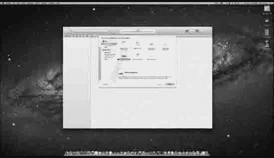
> 图 8–1\. 一个干净的桌面，已下载三张图片，准备打开一个新项目

1. 桌面上仅保留已下载的三张图片，保持干净，然后使用键盘快捷键 N 打开一个新项目。当出现如图 8–1 所示的新建项目向导时，点击“标签页应用程序”模板。

  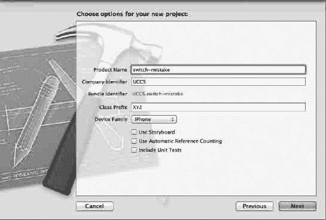  
图 8–2\. 将其命名为“switch-mistake”，然后点击“下一步”。

2. 如图 8–2 所示，将其命名为“switch-mistake”，目标设备选择 iPhone，取消勾选“使用故事板”选项，然后点击“下一步”或按键盘上的  键。

  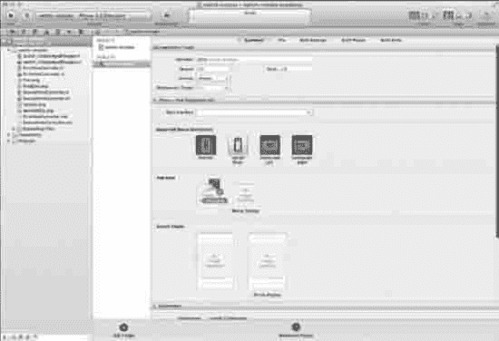  
图 8–3\. 将图标拖到“应用程序图标”框中。

3. 将应用程序图标 `icon.png` 从桌面拖拽到“应用程序图标”框中，如图 8–3 所示。

  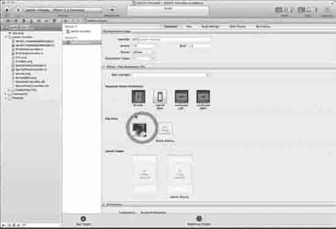  
图 8–4\. 应用程序图标已正确放入框中

4. 图 8–4 显示了图标已正确放入“应用程序图标”框中。请注意，通常你会使用 `plist` 来确定哪个图像作为你的图标。在这里，你是第二次使用拖放方法。


### 创建视图

既然你已拥有图标，就可以开始构建应用了。

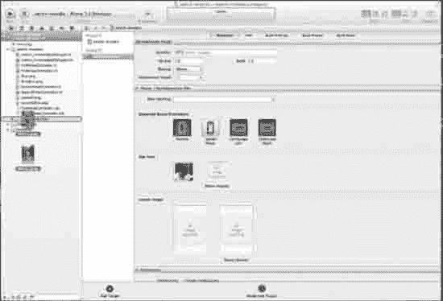

图 8–5. 将剩余两张图片拖放到项目中。

5. 将桌面上的剩余两张图片拖放到 `Supporting Files` 文件夹中，如图 8–5 所示。

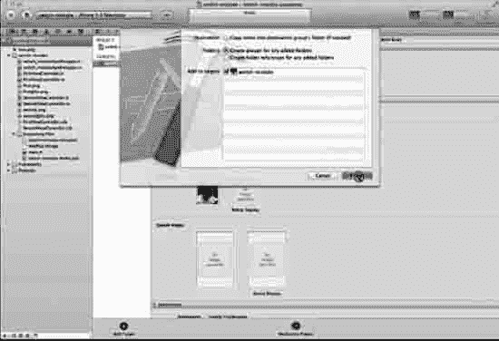

图 8–6. 为添加的文件夹创建组，并将图标图像添加到目标中。

6. 将所有图片拖放到项目资源文件夹后，请务必检查对话框提示。确保勾选了`为添加的文件夹创建组`，并在`添加到目标`下选中了该项目。如图 8–6 所示。

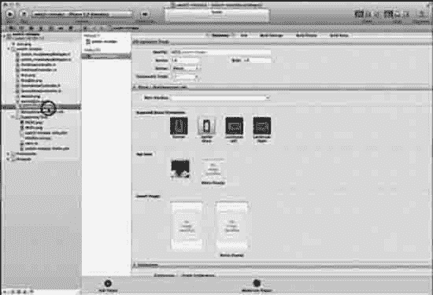

图 8–7. 打开 `FirstViewController.xib`。

7. 打开 `FirstViewController.xib`，如图 8–7 所示。

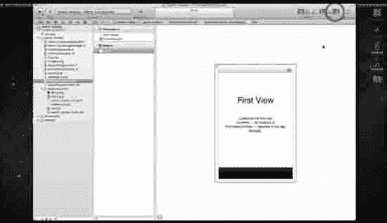

图 8–8. 打开实用工具检查器。

8. 你需要从库中获取内容，因此请打开实用工具检查器，如图 8–8 所示。

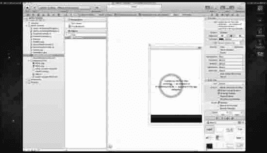

图 8–9. 删除默认标签。

9. 你需要清空第一个视图以添加内容，因此删除“First View”标签以及以“Loaded by the first view…”开头的文本标签。图 8–8 显示正在删除后一个标签，而“First View”标签已在图 8–9 中被删除。

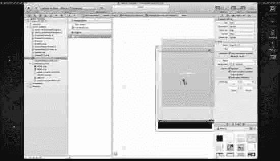

图 8–10. 将一个 `UIImageView` 拖放到视图设计区域。

10. 在实用工具面板打开的情况下，将一个 `UIImageView` 拖放到视图设计区域，如图 8–10 所示。

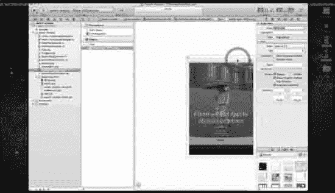

图 8–11. 将 `PIC01.png` 关联到第一个视图。

11. 选中第一个 `UIImageView` 后，转到实用工具面板属性对话框中的图像下拉菜单，如图 8–11 所示。选择 `PIC01.png` 并将其关联到第一个 `UIImageView`。

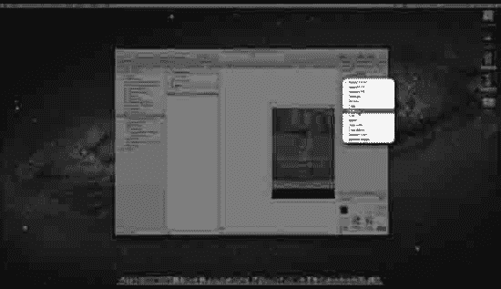

图 8–12. 为视图模式选择“底部对齐”。

12. 如图 8–12 所示，现在点击 `Mode` 并从下拉菜单中选择“Bottom”。

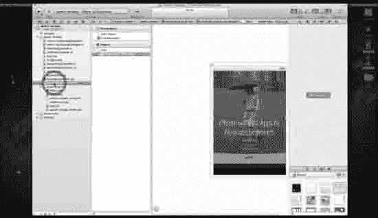

图 8–13. 打开第二个视图控制器。

13. 打开第二个视图控制器，如图 8–13 所示。

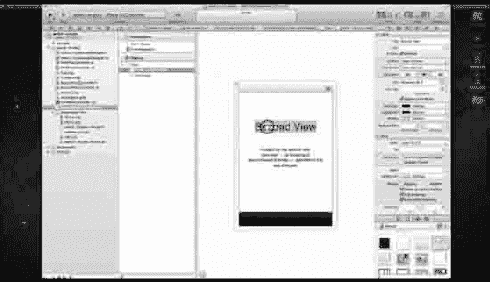

图 8–14. 删除第二个视图的标签。

14. 图 8–14 显示了删除第二个视图中的标签，操作方法与第一个视图相同。

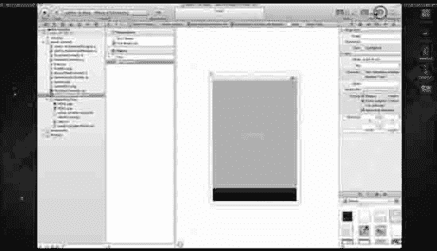

图 8–15. 关闭实用工具面板。

15. 关闭实用工具面板，如图 8–15 所示。

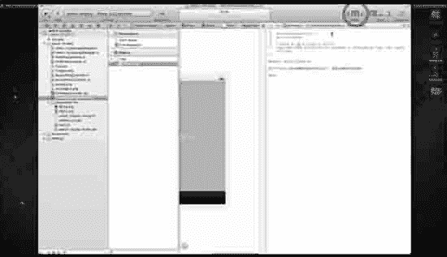

图 8–16. 打开辅助编辑器。

16. 打开辅助编辑器，如图 8–16 所示。

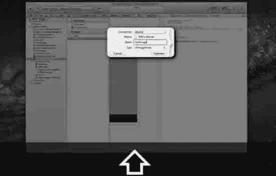

图 8–17. 设置一个插座并命名为 `myImage`。

17. 按住 Control 键拖拽到 `SecondViewController` 头文件中，并设置一个名为 `myImage` 的插座，如图 8–17 所示。

### 制造 Bug

你需要为你创建的插座编写代码并引入 Bug。然后你就可以调试应用了。

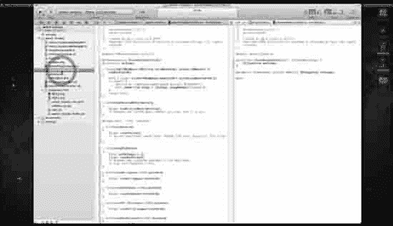

图 8–18. 打开 `SecondViewController` 的实现文件。

18. 打开实现文件，如图 8–18 所示。

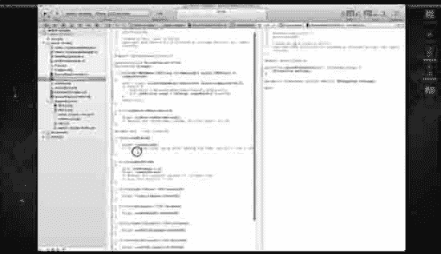

图 8–19. 点击进入你的 `viewDidLoad` 方法。

19. 你将让第一个视图错误地加载图片。所以，我们现在就来编写代码。进入 `viewDidLoad` 方法，点击花括号之间开始编码，如图 8–19 所示。

一旦你打开了 `viewDidLoad`，将 `UIImage` 设置为 `PIC02`（回想一下，你已经在 Interface Builder 中将第一个视图设置为 `PIC01`），你想将内容（即图像）设置为按比例缩放至视图底部。这当然是一个错误，它将作为本例后面要追踪的 Bug。这个错误并不存在于我的应用的源代码中（你也没有在第 6 章中插入它），因此我们可以通过比较文件来使用我的应用追踪问题。

这个 Bug 不会生成错误，但它在运行时看起来会“不对劲”，只是足够奇怪，足以让你能够高效地找到你插入的 Bug 并将其更改为正确的代码。`viewDidLoad` 中的代码如下：

```
- (void)viewDidLoad
{
    [super viewDidLoad];

    [myImagesetImage:[UIImage imageNamed:@"PIC02"]];
    [myImagesetContentMode: UIViewContentModeScaleAspectFit;];
}
```

那么，我们现在假装“你浑然不知”，`UIViewContentModeScaleAspectFit` 即将让你的生活变得痛苦不堪。街上会有人大喊大叫，孩子会和母亲分离，人们会不再叫你极客，你会跑到 `bit.ly/oLVwpY` 的论坛上哭着问：“我的代码怎么了！？”

假装一下就好，好吗？

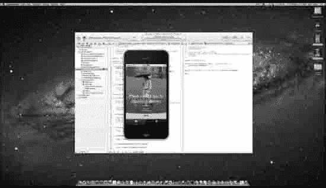

图 8–20. 我们来运行它！

20. 如图 8–20 所示，当我们运行应用并查看第一个视图时，一切正常。但是，然后……

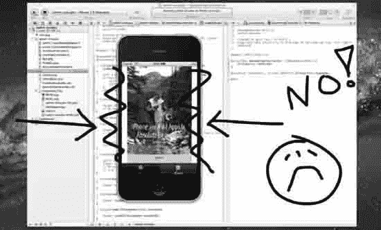

图 8–21. 哦哦！休斯顿，我们有个问题！

21. 你只剩下十分钟就要把这份作业交给刘易斯博士了。第二个视图变成这个样子，你知道你的应用只能得 D 了。你会怎么做？（见图 8–21。）


#### 比较源文件

现在，你将查看在线代码，通过将自己的代码与在线项目的代码进行比较，找出出错的地方。


图 8–22：前往刘易斯博士的网站，该网站提供所有下载内容。

22. 要下载源代码，请访问 `bit.ly/oEQcu6`。在视频中，我将浏览器最小化了，所以图 8–22 展示的是我将浏览器最大化后的状态。

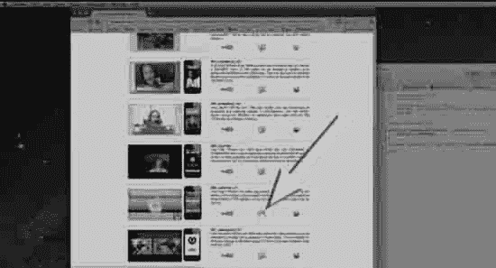

图 8–23：在此处下载源代码。

23. 如图 8–23 所示，访问 `bit.ly/oEQcu6` 后，点击 Xcode 图标将源代码下载到桌面。此时你的想法是，如果将你的代码与源代码进行比较，就能找出并修复 Bug。对于这个文件来说，这样做很简单，但如果你试图在 3 万行源代码中查找问题呢？你不可能单凭肉眼找出错误。我们来看看如何解决这个问题。

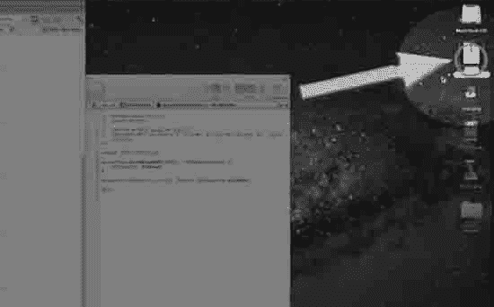

图 8–24：解压源代码。

24. 如图 8–24 所示，当源代码下载完成后（最好下载到桌面），将其解压并打开文件夹。

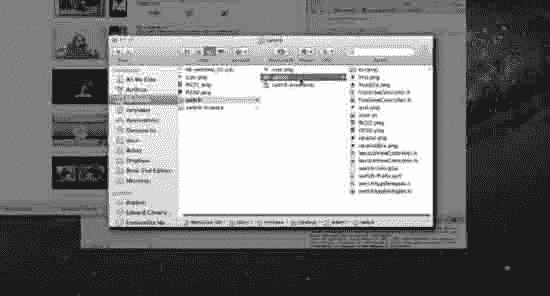

图 8–25：打开文件夹，以便你能看到 `SecondViewController.m` 文件。

25. 解压包含源代码的文件夹后，先将其放在一边。请确保目标明确，即如图 8–25 所示的 `SecondViewController.m` 文件。

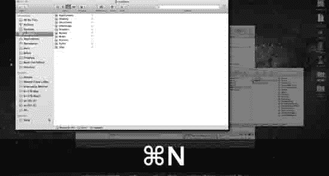

图 8–26：打开一个新的访达窗口。

26. 如图 8–26 所示，你需要找到 `FileMerge.app`。按下 N 打开一个新窗口，因为你需要保持另一个包含源代码的文件夹处于打开状态。这样，当你在这个窗口中定位到 `FileMerge.app` 时，就能将 `SecondViewController.m` 文件拖入其中。

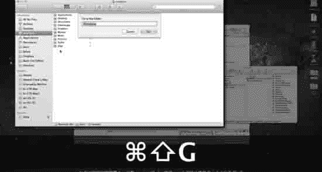

图 8–27：前往开发者工具。

27. 你需要前往开发者工具，开始定位到 `FileMerge.app`。按下 G，在弹出的对话框中输入“/Developer”，然后按下 ，如图 8–27 所示。

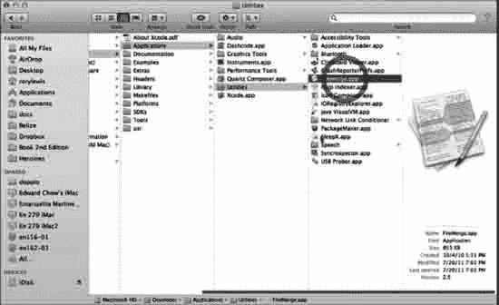

图 8–28：导航至 `FileMerge.app`。

28. 进入 Developer 文件夹后，导航至 Applications Utilities 并打开 `FileMerge.app`，如图 8–28 所示。

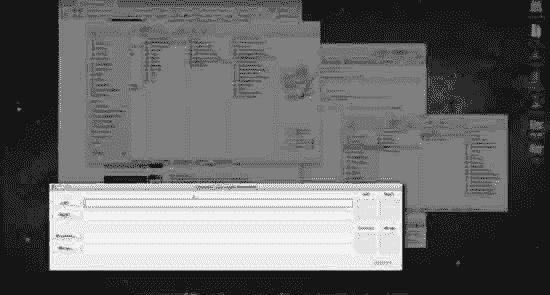

图 8–29：`FileMerge.app` 已打开。

29. `FileMerge.app` 并没有想象中那般炫酷华丽。它看似平淡无奇，但能胜任工作。基本上，你需要将你的 `SecondViewController.m` 文件拖拽到左侧面板，将正确的源代码拖拽到右侧面板。已打开的 `FileMerge.app` 如图 8–29 所示。

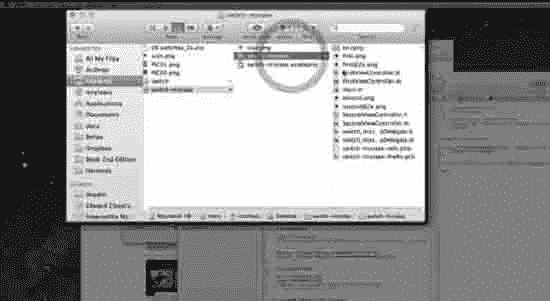

图 8–30：打开包含 `SecondViewController` 的文件夹。

30. 图 8–30 展示了已打开的文件夹，其中包含你的 `SecondViewController` 文件。你需要将你的代码拖入 `FileMerge`，因此请打开包含你代码的文件夹，选中 `SecondViewController` 文件并将其拖入 `FileMerge.app`。

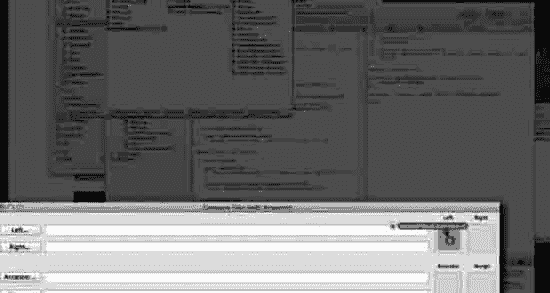

图 8–31：将你的 `SecondViewController.m` 拖入 `FileMerge.app` 的左侧面板。

31. 图 8–31 展示了将 `SecondViewController.m` 拖入 `FileMerge.app` 左侧面板的过程。照做即可。

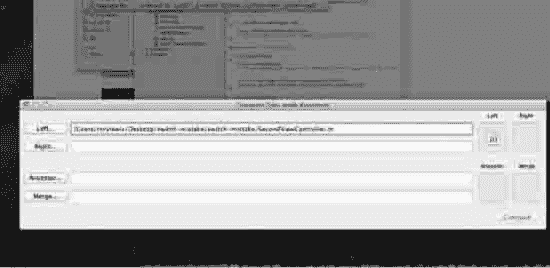

图 8–32：`SecondViewController.m` 已正确放置在左侧面板中。

32. 如图 8–32 所示，当你将 `SecondViewController.m` 拖入左侧面板时，它会提取出文件地址。现在，你需要将正确的源代码拖入右侧面板。

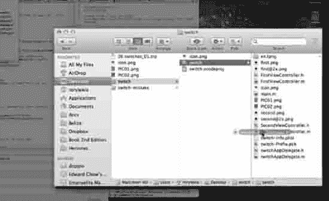

图 8–33：开始将正确的源代码拖入 `FileMerge.app`。

33. 现在，从我让你保持打开的已解压文件夹中，将正确的源代码拖入 `FileMerge.app`。此操作如图 8–33 所示。

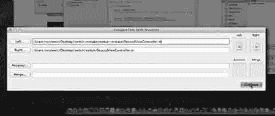

图 8–34：进行比较。

34. 图 8–34 显示两个文件均已正确放置在 `FileMerge.app` 中。点击 Compare 或按下  即可开始运行。

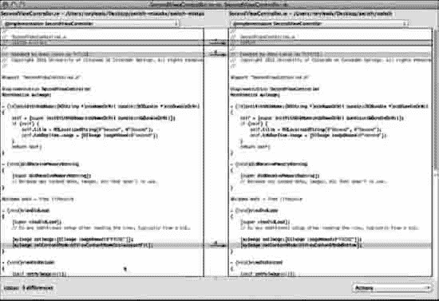

图 8–35： `FileMerge.app` 正在执行分析。

35. 如图 8–35 所示，一旦 `FileMerge` 打开，有些文本行显然会不同，比如你的名字和我的名字、你的日期和我的日期等。然而，在 `viewDidLoad` 方法中，你可以看到哪里出错了。应该是 `UIViewContentModeBottom`，而不是 `UIViewContentModeScaleAspectFit`。那么，我们来修改它！

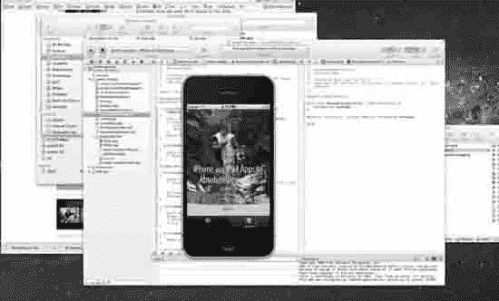

图 8–36：一切正常！

36. 当你返回 Xcode 并正确地将 `UIViewContentModeScaleAspectFit` 修改为 `UIViewContentModeBottom` 后，你的应用将完美运行，如图 8–36 所示。

### 深入代码

到目前为止，Xcode 中最常用的工具是在 Xcode 编辑器中设置断点。运行应用程序，然后查看代码在每个断点处的状态，可以说明某个变量是否被识别、它返回了什么等等。断点非常强大。要在一行代码上添加断点，请双击该行代码左侧的装订线，按住并点击“+”按钮。如果你不希望调试器在该断点处实际停止代码执行，请选中“Continue”复选框。许多更高级的 Apress Xcode 书籍（如 `Pro iOS 5 Tools`，如图 8–37 所示）都详细介绍了断点的使用方法。

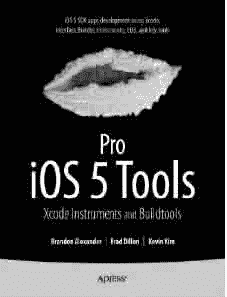

图 8–37：`Pro iOS 5 Tools`

`Pro iOS 5 Tools` 深入探讨了以下回顾中的主题，例如调试器控制台、LLVM 和组织工具。不过，这里先做一个简要概述，略过一些不属于本《绝对初学者》书籍范围的高级工具。

#### 调试器控制台

下一个最重要且广泛使用的编码者工具是调试器控制台窗口。它是编码者与 GDB 进行通信的有效方式。你可以从 Xcode 的“运行”菜单中，通过按下  R 来进入控制台窗口。你也可以从“方案”弹出菜单中选择“编辑当前方案”，然后在左侧栏的“运行”项下选择 LLVM 编译器或 GDB。我更倾向于使用 LLVM 编译器，因为所有新的 Fix-it 红色标记都在这里发挥作用（参见下一节）。对于本书中的大部分代码，LLVM 就足够了。尽管如此，如果你仍想使用 GDB，可以转到“信息”面板，然后从“调试器”弹出菜单中选择你要使用的调试器。要查看输出并为 GDB 输入命令，首先确保你的输出窗口已打开，然后确保视图组的中底部处于启用状态。


### Fix-it

假设你继续使用`LLVM`编译器，`Fix-it`会在你输入时扫描源代码，并用红色下划线和边距中的红色标记标出语法错误。你可以通过点击该符号阅读`Fix-it`消息，它会提供认为可能存在语法错误的原因。通常，对于较小的错误，`Fix-it`会自动修复你的代码。

### Documentation

接下来我要介绍的工具因其易用性而被广泛使用，那就是`Xcode`的文档。你只需打开`Organizer`窗口（2），点击工具栏中的`Documentation`按钮，然后点击跳转栏进行上下导航。参见图 8–38。

  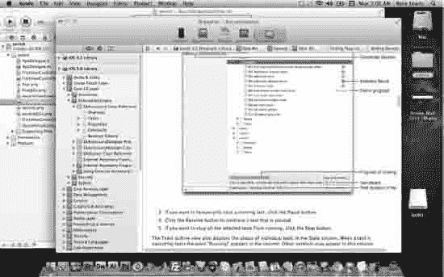  

图 8–38\. `Organizer`

`Xcode 4.2`还为`Xcode IDE`提供了在线帮助。可以通过点击文档导航器中`Xcode Help`旁边的展开三角形，或选择`Help`  `Xcode Help`来访问。你会发现这些在线帮助文档大多附有视频。你还需要知道，许多`Xcode`的帮助文章也可以作为上下文相关帮助使用，如苹果网站`bit.ly/oY2jG9`所述。这意味着，你可以通过按住`Control`键并点击工作区或`Organizer`窗口中的任何主`UI`区域，从快捷菜单中访问帮助教程。

从`Xcode 4.2`开始，`Quick Help`比以往更加强大。现阶段我们只需按部就班地学习教程，但当你成长为一名程序员时，你会发现它的用处。按住`Option`键并单击即可打开`Quick Help`，如图 8–39 所示。

  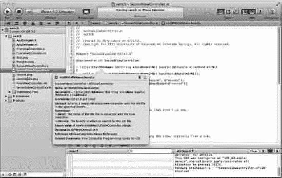  

图 8–39\. `Quick Help`

### Static Analysis

`Xcode 4.2`中的`Static Analysis`允许你在工作区窗口内对代码进行分析、调试和编辑。只需在项目导航器中点击要调试的项目，然后选择`Product`  `Analyze`。分析器会遍历你的代码，然后导航器会打开一个列表，列出它发现的问题。带有箭头的蓝色矩形会指向你的错误。

### 本章前瞻

在第 9 章中，你将学习为`iPhone`和`iPad`编写一个应用，该应用结合了`iOS5`的两大强大工具：`storyboarding`和`MapKits`。这是一个简单的应用，但背后却蕴含着巨大的教学和学习曲线。你要构建的应用只需在一个预先给定的经纬度位置上放置一个图钉。其关键点在于将`storyboarding`和`MapKits`连接起来。

## 第 9 章

## MapKit 与 Storyboarding

自从构思这本书以来，我一直期待撰写关于`MapKit`框架和`Storyboarding`的章节。这一章以及接下来的两章将是我们共同努力的结晶。我们的旅程即将结束，以一个高潮收尾是再合适不过的了。我相信，将`MapKit`框架、`Storyboarding`、`TableViews`和`iTunes`整合起来不会让你失望。这并非易事。我们在过去三章中的旅程将如下进行：第 9 章介绍`Storyboarding`和`MapKit`框架。第 10 章介绍`Storyboarding`、`TableViews`和`MapKit`框架。最后，在第 11 章中，我们将探讨`Storyboarding`和`iTunes`商店（即你发布应用的地方）。我们稍后会详细讨论第 11 章，但可以这样说，我将向你展示最引人入胜的应用是如何整合`Storyboarding`、`MapKit`框架、`TableViews`以及互联网/`iTunes`商店的。

在本章中，我们将看到一些最酷、最成功的应用正是基于`MapKit`框架。我们将把这个框架置于`Storyboarding`平台之上，这将是一项巨大的成就。我之所以把这些概念留到最后，主要是因为这些主题需要一定的经验，以免让学生感到不知所措。我曾在一个坐满渴望学习的、大多是初学者的程序员的阶梯教室教授这门课程，我痛苦地了解到，当我屈从于学生们的热情，试图在学期中途教授`MapKit`时，我总能毫无例外地把全班带进死胡同。

尽管`MapKit`为我们提供了编写功能强大、生动有趣的应用的手段，但它也要求我们非常清楚并完全理解各种方法、类和框架。将这一应用与`Storyboarding`相结合更增加了挑战的难度。最初，本书的范围并不包含所有这些概念；但最终，我不可能写了这本书却把`MapKit`排除在外！

因此，在开始之前，我们需要坐下来审视一些东西。`MapKit`作为一个工具箱，是一套具有挑战性的实用程序和工具，但我们将介绍一些基础知识，并学习如何将它们与`Storyboarding`结合使用，以成功且富有创意地完成本章的示例。我们将首先讨论框架和类。然后，我们将看到`MapKit`无需我们编写任何代码就能实现什么。之后，我们将深入挖掘，看看其他程序员使用`MapKit`做了什么，并从中汲取经验。我们已经了解了`Storyboarding`，但现在我们要添加一些真正创新的代码。在磨练了我们对方法的理解，并对`MapKit`中包含的框架、类和其他`Apple`好东西有了相当程度的掌握之后，我们将从容地开始练习。

在本章的后半部分，我将在“探究我学生的`MapKit`代码”一节中献上一道丰盛的“餐后甜点”。我不会以一堆杂乱的技术参考资料作为结尾，而是会展示我的三位学生在与`MapKit`相关的项目中取得的成果。我希望，当我们看到这些有代表性的学生在完成我的课程后不久就能取得的成就时，我们都会更有动力去迎接下一个挑战。

我的目标是让我们所有人都能达到这样的境界：我已经用`Storyboarding`编写了一个基本的`iPad MapKit`应用，并且我理解如何充满信心地向前迈进，掌握更高级的目标，即在第 10 章中协调`Storyboarding`、`TableViews`和`MapKit`框架。


### 关于框架的一点介绍

当史蒂夫·乔布斯被苹果公司解雇后，他创立了一家名为 NeXT 的公司。在 90 年代初期，他的公司生产了造型优美、线条流畅的黑色电脑，让我羡慕得直流口水。我的几位教授拥有一台 NeXT 电脑，我深知其强大功能。这家公司最深远的影响，并非他们生产了这些黑色流线型机箱，而是他们使用了一种名为 Objective–C 的语言。乔布斯发现，尽管用这种复杂的语言编程很困难，但它生成的代码能够非常优雅地与微处理器“对话”。那么，这与 MapKit 有什么关系呢？

NeXT 所做的是创建了由复杂 Objective–C 代码构成的框架，我们可以将其视为木匠工具箱中的工具。当我们使用 `MapKit` 时，就是在将一套与地图相关的工具引入我们自己的代码中——就像木匠可能有一套用于橱柜制作的工具，以及另一套专门用于制作精美家具的工具。这些专门的工具与屋顶木匠所用的工具会有很大不同。

为此，我们将把两个之前没用过的框架引入 `Xcode`。这就好比我们在第 1 章到第 8 章中，一直以地板和橱柜木匠的身份学习技巧；但今天，我们要去五金店为下一个项目——在墙壁和天花板中安装音视频设备——购置装备。因此，在继续下一个程序之前，我们必须先去购买两个全新的工具。其中一个新工具是 `CoreLocation` 框架，它能显示我们在地理上的位置。另一个工具是 `MapKit`，它能让我们以多种不同方式与地图进行交互。

众所周知，用户与 iPad 和 iPhone 交互的方式，与以往任何设备都完全不同。在这些精巧设备问世之前，99% 的计算机交互都基于鼠标和键盘。从我们已经编程完成的示例中，我们在学习使用独特的方法和类来切换屏幕，并感知用户何时在屏幕上捏合、点击或滚动。现在，我们将在这个已经很强大的工具集中加入 `CoreLocation` 和 `MapKit` 框架。

到目前为止，我们探讨的大部分编程都相对透明。然而，在本章中，情况不会那么显而易见了。我们必须高度集中注意力，才能跟上并理解 `MapKit` 是如何知道我们在地图上的位置的。我们将探究它如何追踪我们的手指交互，以及它如何根据与地图相关的各个屏幕和视图来确定我们的位置。

iPad/iPhone 应用开发的核心领域之一是事件处理。由于这部分内容让我的许多学生感到困惑，因此我会刻意尽力让大家将注意力集中在我们需要了解的内容上。如果我们牢固掌握了框架和类的概念，就不会因为过度关注事件处理而感到困扰。我们可以通过这一点来了解这个主题的规模：当应用的一部分负责追踪与地图和 GPS 卫星的交互时，另一部分代码则必须时刻关注用户何时会将程序引导至一个新事件。

### 重要须知

关于 iPad 和 iPhone 领域中 Storyboard 及地图相关应用的基础，有三件重要的事情需要了解。第 9 章和第 10 章中的这两个关键应用依赖于四个重要工具：Storyboarding、`MapKit`、`CoreLocation` 和 `MKAnnotationView` 类参考。正如我已经指出的，我们不会过多涉足这些复杂工具的工作原理，而是要实践决定何时在我们新扩大的工具箱中取用哪种工具的艺术。

除了其他功能，这些工具使我们能够利用 Storyboarding 轻松创造优美的技术流程，在我们的应用中显示地图，使用注释，处理地理编码（涉及经度和纬度），并通过 `CoreLocation` 与我们的位置进行交互。

当我们要轻松地与谷歌地图交互时，我们将使用苹果提供的 `MapKit` 框架。当我们要获取位置或使用 GPS 卫星技术（配合谷歌地图）做酷炫的事情时，我们将使用 `CoreLocation` 框架。当我们要将所有功能整合到一起，并与用户无缝集成时，我们将把上述所有技术放到 Storyboarding 上。最后，当我们要在地图上放置大头针、创建引用、绘制 V 形标记，或者插入一张显示我们狗狗在地图上位置的照片时——我们将这些称为注释，因此需要使用 `MKAnnotationView`。

### 预装的 MapKit 应用

为了充分利用本章提出的新概念，并为拓展至全新的创意水平做好准备，我们首先来浏览一下 iPad 和 iPhone 上预装的现有应用。熟悉这些应用很重要，这样我们就能更容易地为自己创建的应用添加各种提示和附加功能——这些功能是在 `Apple.com` 上描述的那些现成“地图应用”之上的。

#### 找到自己

假设我们在一个不熟悉的街区寻找附近的餐馆。使用 iPhone，我们可以在地图上精确定位自己的位置，从而找出从当前位置到目的地的路线。iPhone 4 结合 GPS、Wi-Fi 和蜂窝基站，能够快速准确地找到我们的位置。当我们移动时，iPhone 会自动更新我们的位置。到达目的地后，我们可以放下一个大头针来标记我们的位置，并通过电子邮件或彩信与他人分享。

> 

*图 9–1\. 找到自己——iPhone/iPad 上强大的缩放地图功能。*

#### 搜索位置

我们需要一杯浓缩咖啡。最近的咖啡馆在哪里？搭载了 `MapKit` 框架的 iPhone 知道答案。只需在“地图”应用的搜索栏中输入“咖啡”，附近的咖啡馆就会立刻出现在地图上；全部用大头针表示。搜索功能同样适用于特定地址和商家名称。当我们找到目标时，点击大头针即可获取更多信息，例如电话号码、网址等。“大头针”会提取我们在 `MKAnnotationView` 中编程设定的所有注释信息。

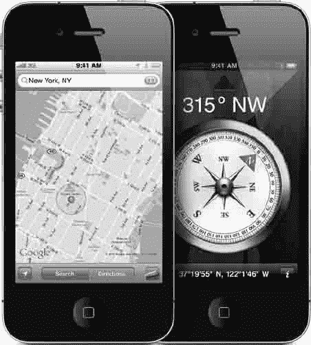

*图 9–2\. 搜索位置——将此功能与视觉地图（带高亮路线）结合使用，或作为其替代方案。*


#### 切换视图，查看交通状况

iPhone 4 上的地图凭借其高分辨率视网膜显示屏，呈现出惊人的清晰和细腻。我们可以在`地图视图`、`卫星视图`和`混合视图`之间切换。我们甚至可以查看特定地址的街景。我们可以通过双击或捏合手势来缩放地图。iPhone 地图还能提供实时交通信息，并用易于识别的绿色、黄色和红色高亮显示沿途的交通速度。

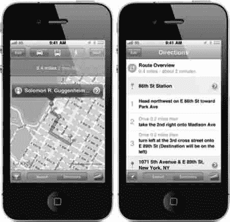

**图 9-3.** 切换视图并查看交通状况——展示了内置指南针（在 3GS 机型上）的方向指示，标明我们正在注视的方向。

我们不必再依赖电脑打印路线指引了。有了 iPhone，我们可以查看逐向导航列表，或沿着高亮显示的地图路线行驶，并通过 GPS 追踪我们的进度。我们可以选择步行或驾车路线，甚至可以通过公共交通路线查看下一班火车或公交的发车时间。`指南针`应用与内置数字指南针协同工作，告诉我们 iPhone 的朝向。此外，在`地图`应用中，指南针会旋转屏幕上的地图，使其与我们面对的方向保持一致。

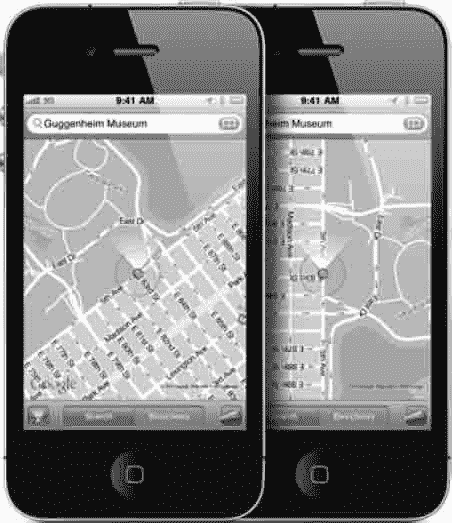

**图 9-4.** 路线导航与方向感知——这是在 iPhone/iPad 上运行`地图`应用时众多强大功能之一。

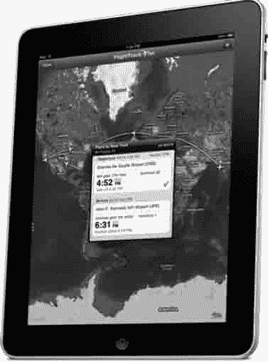

**图 9-5.** `FlightTrack` 应用使用 `MapKit` 框架来追踪航班，并与登机口变更、时刻表以及任何给定机票上的其他个人信息进行集成。

### 酷炫且受欢迎的 MapKit 应用给我们带来启发

在教授学生 MapKit 和 Storyboarding 的过程中，发生了一件有趣的事情：大多数学生自以为了解 MapKit，但实际上，他们根本不知道 `MapKit` 框架到底有多强大。因此，在深入学习本章之前，我们先花几分钟时间来了解一下 `MapKit` 框架的出色功能。


**实例佐证：** 我的一位前学生最近开始在苹果公司从事 iOS 5 相关工作。她在 MapKit 方面表现得异常出色，而在 iOS 5 中可供她选择的众多部门里，她被安排到了 `MapKit` 框架团队。她告诉我的第一件事就是这个部门规模有多么庞大，尽管她热爱 MapKit，但她完全不知道有这么多团队、这么多才智超群的人都在共同致力于同一件事：那就是 MapKit！

我发现，在向学生们展示预构建的应用程序后，再花些时间一起回顾一些超酷的第三方 MapKit 应用——以激发他们的灵感、让他们脑洞大开——这对他们大有裨益。所以，想象一下，你正和我们坐在一起，一同进行这次短暂的巡览。以下是我关注的 11 款 MapKit 应用，其中一些我经常使用。

-   `FlightTrack`：这款 MapKit 应用可以让我们管理国内外航班的方方面面，提供实时更新和精美的可缩放地图。我们可以接收关于登机口、延误和取消的通知，以便预订替代航班。该应用覆盖了超过 5000 个机场和 1400 家航空公司。参见图 9-5。
-   `Metro Paris Subway`：在光之城巴黎再也不会迷路。`Metro Paris Subway` 是一款全面的巴黎出行指南，包含官方的地铁、RER（区域快铁）和公交地图及时刻表。结合了交互式地图和路线规划器，`Metro Paris Subway` 能让我们在短时间内像真正的巴黎人一样穿梭自如。参见图 9-6。
-   `MapMyRide`：我经常使用这款 MapKit 应用。我只需打开它，然后骑上自行车出发即可。它会记录我的速度、时间、里程以及坡度。它还会综合考虑我的年龄、性别和体重，然后告诉我燃烧了多少卡路里。（状态好的时候，我能消耗掉两个甜甜圈的热量！）关键是，当我只是气喘吁吁地骑行时，这个应用就计算出了所有这些数据！回到家后，我可以在电脑上查看骑行路线。它的主要工作都是通过使用和操作预装的 MapKit 应用完成的。
-   `QuikMaps`：这款 DIY 地图应用允许你在涂鸦地图。它集成了多个平台，包括你的网站、Google Earth，甚至你的 GPS。
-   `360 Cities`：虚拟现实中的世界：该应用展示了全球 50 多个城市的 360 度全景图，包含 6000 张全景照片。对于房地产经纪人、导游和探险家来说，这是一个完美的技术工具。
-   `Cool Maps`：世界七大奇迹：该应用展示了古代世界七大奇迹，以及现代世界七大奇迹，包括自然奇观、水下奇观、奇异奇观和本地奇观。程序员们将应用的触控和体验做得如此流畅，令我印象深刻。
-   `Blipstar`：这款应用将互联网上的商业网址转换为对应的实体店地址，并全部显示在一张酷炫的地图上。
-   `Twitter Spy`：这个应用让人们可以看到正在给自己发推文的人当前所在的位置。没错——有点古怪和疯狂，但确实如此。
-   `Geo IP Tool`：此应用显示网络上企业的经纬度信息。然后为我们提供到达那里的最佳方式选择。
-   `Map Tunneling Tool`：这纯粹是一个巧妙的趣味应用。想象一下，如果我们从任意地点垂直向下挖一个洞，我们会从地球的哪里冒出来？答案总是中国吗？
-   `Tall Eye`：这个应用会告诉你，如果你从地球上的某一点出发，沿着一条直线，始终保持在特定的方位角上一直向前走，你最终会到达哪里。

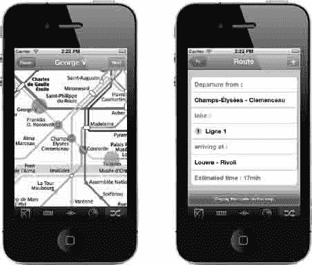

**图 9-6.** `Metro Paris Subway`：解析地铁列车的 GPS 数据，有助于我们了解开往我们方向的列车何时会到达最近的车站。

### myStory_01：一个单视图应用

在这个练习中，我们将从一些满足基本需求的样板代码、启动屏幕和图标开始。然后，我们将在此基础上进行修改。我们将回顾本书中已经见过的一些相同的构建模块和文件，我们还将面临挑战，即根据本应用的性质，识别出哪些代码区域与我们之前遇到的几乎相同，哪些区域有所不同。

识别表层之下的模式和结构是我们每个人都拥有的强大能力，但我们程序员将其磨练到了更高的水平。我们将玩一个小游戏，看看我们是否能预判出一些接下来需要采取的步骤。


### 应用预备知识

我们将考虑构建应用时会用到的大量组件。但在那之前，我想确保大家都牢固掌握一些重要的术语。对于这个项目，我们程序员需要回顾一些基础的地球科学和地理知识，这样才能让我们的代码发挥最大效用。

当我们指示计算机将一枚带有注释的图钉动画式地投放到某个特定位置，并给出"经度"和"纬度"时，我们需要真正理解这些术语的含义。纬度线是环绕地球"水平"延伸的假想线，方向为自东向西（或自西向东）。这些无形的线以度、分、秒为单位进行测量，表示赤道以北或以南的距离。赤道是地球表面位于两极中间点的椭圆轨迹——而两极则是真实存在的点，由地球绕地轴自转所定义。纬度线通常被称为纬线（平行圈）。北极位于北纬 90 度；南极位于南纬 90 度。

经度线通常被称为子午线，是穿过南北两极的假想"垂直"线（椭圆轨迹）。它们同样以度、分、秒为单位进行测量，表示本初子午线以东或以西的距离。本初子午线是一条贯穿英国格林威治的任意标准线。与环绕全球 360 度的赤道不同，本初子午线（0 度经度）是一个半圆（半椭圆），从北极延伸到南极；圆弧的另一半被称为国际日期变更线，定义为东经 180 度和/或西经 180 度。

对于我们的第 9 章应用，我用来说明在地图上"投放图钉"位置的示例是我在科罗拉多大学斯普林斯分校的办公室。当然，我们可以使用任何我们选择的位置。我们或许想用自家的地址，或者某个著名地标。要这样做，我们必须获取该位置的经纬度数值——最可能来自谷歌地图或直接的 GPS 读数。互联网上有许多网站可以找到这些坐标；图 9-7 展示了其中一种，网址是[`http://bit.ly/vGszNu`](http://bit.ly/vGszNu)。

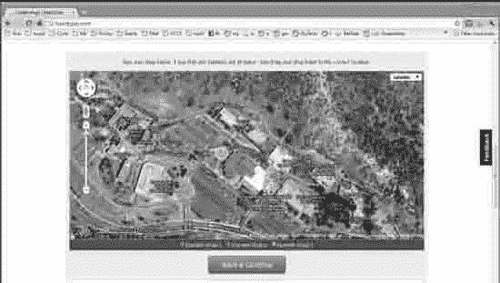

图 9-7\. Batchgeo（[www.batchgeocode.com/lookup](http://www.batchgeocode.com/lookup)）是众多可输入地址并获取其经纬度坐标的互联网站点之一。

这里有个想法——让我们从流程的终点开始，逆向思考一分钟。请直接跳到本章后面先预览一下应用的样子——如果一切顺利，它会返回什么样的结果。在图 9-34 中，我们看到一幅混合地图的图片，上面显示着一枚红色图钉落在一栋建筑物上。那就是科罗拉多大学斯普林斯分校的工程学院大楼；图钉正位于我的办公室上方。下一幅图带有我们称之为注释的内容，也就是文字。"Rory Lewis 博士"是标题，"科罗拉多大学斯普林斯分校"是副标题。

在教程的后面部分，我们会发现需要对标题和副标题多加注意。我们还可以控制图钉的颜色，并决定动画的风格——即图钉如何落到地图图像上。

这里正适合提醒大家本书的书名：《iPhone 和 iPad 应用开发入门》。深呼吸一下！即使我们都达到了学会有史以来最多知识的最大期望，即使我们都达到了对自身能力的最高期望——在如此短的时间内学会如此复杂的内容，我们仍然不会成为`MapKit`代码这个极具挑战性领域的专家！在这一点上，我的卑微目标不是熟练精通，而是合理的熟悉程度，以及对未来之路有所感知。

如果这听起来没问题，那我们就开始吧。

#### 准备工作

与之前的章节一样，请下载并解压本章的图片和样板代码。访问[`bit.ly/oDqzvYand`](http://bit.ly/oDqzvYand)下载其内容。图片包括三个图标文件、两个启动画面和两个样板代码文件。稍后我会解释这些图标、启动画面和样板代码的含义。但现在，我们只需将其下载到桌面。然后，把文件解压到我们整洁清爽的桌面上。

我在视频中编程的示例代码可在此处下载：[`bit.ly/qd6iDT`](http://bit.ly/qd6iDT)。解压所有文件后，记得删除`011_myStory_01.zip`和`myStory_01`文件夹。这是为了避免覆盖文件和/或与练习代码产生潜在冲突。要观看本章练习的录屏，请访问[`bit.ly/owk24r`](http://bit.ly/owk24r)。

#### 新建单视图模板

让我们开始并选择模板。

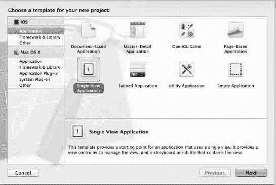

图 9-8\. 选择"Single View Application"图标，然后按回车键或点击 Next。

1. 打开 Xcode 并按N 组合键，如图 9-8 所示。然后点击"View-based Application"模板。我们将它命名为`myStory_01`，然后保存到桌面。桌面上会出现一个同名文件夹。

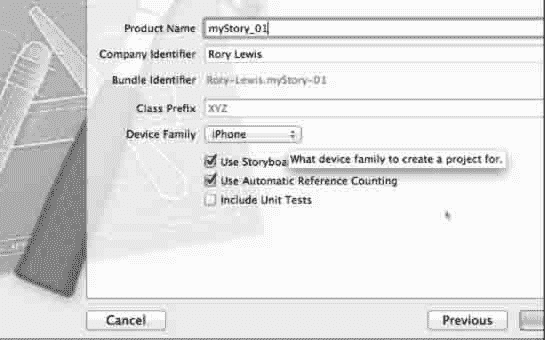

图 9-9\. 将您的应用命名为`myStory_01`，确保 Storyboard 和自动引用计数功能已开启。

2. 为了尽可能紧密地跟随操作（因为后面会变得复杂），我们将项目命名为"`myStory_01`"。为此，选择 iPhone（而不是 iPad 或 Universal），保留 Class Prefix 和 Include Unit Tests 选项不变，如图 9-9 所示。请检查 Storyboard 和 Automatic Referencing 选项是否已开启。

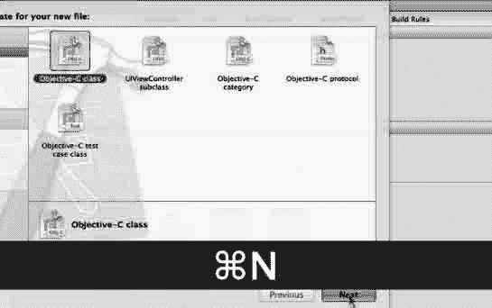

图 9-10\. 为您的注释创建一个 Objective-C 类。


#### 前期准备：添加注释文件

3.  在设置项目的同时，我们需要创建一个注释文件并导入一些框架。先从注释文件开始。如前所述，我们需要一种方法来控制我们的注释。为此，我们将创建一个 Objective-C 类，用于控制我们想要在此注释上显示的所有特性。点击 `Classes` 文件夹，然后像图 9-10 所示输入 `N`。完成后，点击“下一步”。

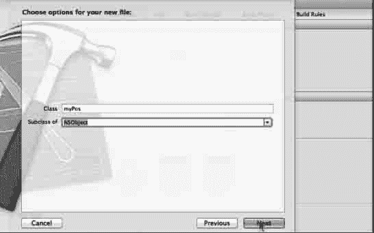

图 9-11. 将其命名为 `myPos`，并确保它是 `NSObject` 的子类。

4.  因为这个控制器将负责控制我们位置的注释，所以给它取一个与我的位置相关的名字；叫它 `myPos` 怎么样？同时，确保它不是 `UIView` 或任何其他类的子类。确保它是 `NSObject` 的子类。如图 9-11 所示。

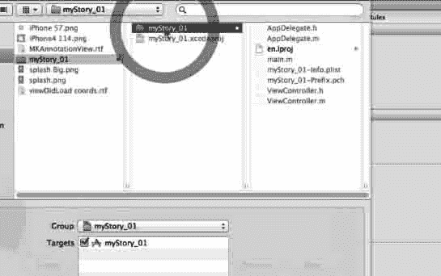

图 9-12. 将其保存在你的 `myStory_01` 文件夹内。

5.  确保将其保存在 `myStory_01` 文件夹内。这将使导出变得更容易，并且当我们开始与其他程序员共享类和对象时，这也是一个好习惯。参见图 9-12。

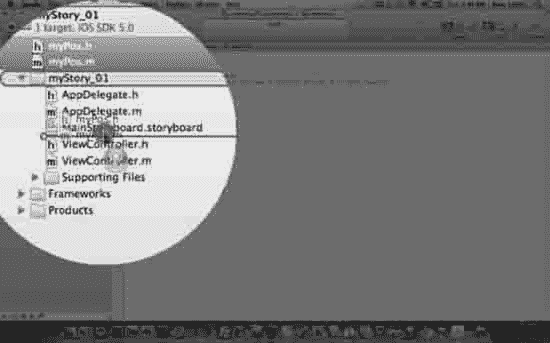

图 9-13. 将新创建的 `NSObjects` 移到正确的文件夹中。

6.  如图 9-13 所示，我们新创建的两个名为 `myPos.h` 和 `myPos.m` 的 `NSObjects` 位于项目的根目录中。我们需要将它们移到正确文件夹中的正确位置。我通常按照在 nib 或故事板文件下编写的顺序来排列我将要编码的文件。我们通常不会大量处理 `AppDelegate` 文件，所以我将它们放在顶部并避开它们。因为我将开始编写追踪我位置的 `NSObjects`，所以我们将它们紧挨着 Storyboard 放置。


图 9-14. 转到 `myStory_01` 根目录并选择 `Build Phases` 选项卡。

#### 前期准备：添加框架

7.  我们需要做的第一件事是添加两个框架：对于新手，我们会说：“框架是用于专门用途的大量超级代码。它太大了，不能一直随身携带，但如果我们要编写一个需要框架的应用——那么我们就将这个框架拖入我们的代码中。” 是的，但我们不再是新手了——我们正以快如闪电的速度奔向成为一名真正的极客，受到那些被困在技术沼泽中的人的尊敬——所以，让我们来看看这个。是的，它是专门的代码。我们将其放入一个分层目录中，该目录将动态共享库（例如 nib 文件、图像文件、本地化字符串、头文件和参考文档）封装在单个包中。在我们的应用中，我们将使用 `CoreLocation` 和 `MapKit` 框架，当我们将它们引入应用时，系统会根据需要将它们加载到内存中，并尽可能在所有的应用程序之间共享该资源的一个副本。所以，我们将转到根目录并点击 `Build Phases` 选项卡，如图 9-14 所示。


图 9-15. 点击 `Link Binaries with Libraries` 栏，然后点击“+”。

8.  如图 9-15 所示，点击 `Link Binaries with Libraries` 栏，然后点击“+”。


图 9-16. 选择 `CoreLocation` 框架。

9.  我们可以滚动浏览所有选项，或者在搜索栏中输入 location，然后选择 `CoreLocation` Framework。然后按 Add 或 Enter/Return 键，如图 9-16 所示。


图 9-17. 选择 `MapKit` 框架。

10. 重复步骤 9，我们现在为 `MapKit` 执行相同操作。我们可以滚动浏览所有选项，或者在搜索栏中输入 location，然后选择 `MapKit` Framework。然后按 Add 或 Enter/Return 键，如图 9-17 所示。


图 9-18. 将导入的框架移到 `Frameworks` 文件夹中。

11. 如图 9-18 所示，我们将获取默认存储在根目录中的两个新导入的框架。然后我们将它们移动到我们的 frameworks 文件夹。养成良好的习惯并将所有框架存放在正确的文件夹中非常重要。


图 9-19. 对照我的示例检查你的目录和文件。

12. 在我们继续之前，我们需要确保对照图 9-19 所示的示例检查我们的项目。我们需要确保我们的 `NSObjects` `myPos.h`、`myPos.m` 以及我们的 `CoreLocation` 和 `MapKit` 框架的放置位置与示例中的一致。完成这一步后，我们将继续；放置我们的图像，然后开始编码。


#### 引入图片！

我们为每款应用准备了五张必备图片。为方便起见，这些图片已包含在可从我的网站 [`bit.ly/oDqzvY`](http://bit.ly/oDqzvY) 下载的软件包中。其中包括必要的图标和两个启动画面。这些图片包含适用于经典 iPhone 的 `57 x 57 px`、适用于 iPad 的 `72 x 72 px` 以及适用于 iPhone 4S Retina 显示屏的 `114 x 114 px` 规格。我还设计了两张启动画面图片供你使用。启动画面图片会在应用代码加载时显示在屏幕上。它们通常只出现不到一秒钟，但能为用户提供酷炫的视觉效果，并为正在加载的超酷应用奠定基调。你需要两张启动画面，因为必须适配可能使用你应用的不同 iPad 和 iPhone 配置。软件包中包含适用于 iPad 和 iPhone Retina 的 `640 x 960 px` 启动画面，以及适用于经典 iPhone 的 `320 x 480 px` 启动画面。下载后，你始终可以将其用作未来应用的模板。

> **注意：** 在本应用中，我们仅使用 iPhone。在下一章设计 `myStory_02` 时，我们将同时使用 iPhone 和 iPad，届时即可使用所有图标。因此，请保留额外的 iPad 图标，以供日后设计自己的图标时使用。


**图 9–20.** 拖入图标。

13. 导入框架后，仍在根目录中，将图标图片拖入图标框内。图 9–20 显示了放入框中的 `57 x 57 px` 经典 iPhone 图标，以及正在拖入的 Retina 图标。


**图 9–21.** 拖入图标。

14. 与步骤 13 类似，导入图标后，我们现在需要将启动画面图片导入其对应的框中。图 9–21 显示了已就位的 iPhone Retina `320 x 480 px` 经典启动画面，以及正在拖入的经典 iPhone `640 x 960 px` 启动画面。拖入这些图片后，我们就可以开始编写代码了。


**图 9–22.** 拖入图标，以便将其放入正确的文件夹。

15. 在开始编码之前，我们需要确保所有文件都位于正确的文件夹中。至此，我们知道 `Xcode` 会识别正确的图标和启动画面——但看看它们的位置！它们又回到了根目录。如图 图 9–22 所示，抓住它们，将其移动到 `supporting files` 文件夹中。


**图 9–23.** 将项目图标放入 `supporting files` 文件夹。

16. `Supporting Files` 文件夹可能并未展开。没关系。当我们用鼠标拖拽图标时，需要在悬停于 `Supporting Files` 文件夹上方时放慢速度，以便其展开。一旦展开，如图 图 9–23 所示，将文件放入文件夹中。


**图 9–24.** 准备开始绘制……呃……编码。

17. 仔细观察 图 9–24。我们现在可以开始编码了。我们需要习惯在开始编写代码之前，先规划好编码画布。这很像一位画家，在画下第一笔之前，会先准备好画布、颜料、松节油、画笔、抹布以及要绘制的模型。我们刚刚做的就是这件事。我们需要习惯在编写代码之前先做好一切准备工作。

> **注意：** 我无法理解为什么有些学生一拿到课堂作业就立刻埋头编码。我也总会立即制止他们，并让他们像我们在此处及本书中所做的那样先做准备工作。正是在我将所有文件导入并创建所需的新框架和 `NSObjects` 的这段时间里，我的思维会进入一种半冥想状态，并默默规划如何编写代码。在此期间，我的大脑会尝试各种不同的方案，等到准备工作完成时，我已完全准备好开始编码了。


好的，作为一名高级文档工程师和翻译员，我将严格按照您提供的注意事项和示例，将给定的英文文本翻译成中文。


#### 编写 `myPos` `NSObject`

请记住，`myStory_01` 是通往`myStory_02`的引子或过渡，而真正的动作发生在`myStory_02`中。事实上，许多 MapKit 应用都需要一个单独的 `NSObject` 来跟踪多个位置。在这个小应用中，我们不一定非要编写 `myPos.h` 和 `myPos.m` 文件。但你需要习惯于总是创建一个 `NSObject myPos` 来跟踪你的位置或一个位置数组，以便将其提供给标注和 MapKit 框架。那么，请跟随我详细解释我们在这里将要做什么。在 `myStory_02` 中，我跳过了其中一些步骤，因为我认为大家都完成了功课，多次编写了 `myStory_01`，直到可以在没有本书或任何随附笔记的情况下完成。


**图 9–25.** 打开时的 `myPos.h`。

18. 点击位于根文件夹中 `myStory_01` 文件夹内的 `myPos.h` 文件。打开它后，如图 9–25 所示，我们看到了以下内容：

```
#import <Foundation/Foundation.h>
@interface myPos : NSObject
@end
```

-   我们要做的第一件事是通过在 `@interface myPos : NSObject` 指令中输入 `#import <MapKit/MkAnnotation.h>` 来为我们的标注添加 MapKit 框架。
-   我们还需要添加 `<MKAnnotation>`，这是一个协议。我将在“深入代码”中解释协议，但就目前而言，这意味着我们必须编写自己的、实现了此协议的标注对象。只需记住，采用此协议的对象必须实现一个我们称之为坐标属性的属性。当然，我们将会实现它。
-   我们还要设置 `CLLocation` 类引用，以便通过一个我们将命名为`coordinate`的变量，将我们设备的地理坐标和海拔高度整合进来，如图 9–26 所示。我们通过这行代码来实现：`CLLocationCoordinate2D coordinate;`
-   现在，我们需要两个 `NSString` 变量来保存我们的标题和副标题，我们将如下命名其为 `*title` 和 `*subtitle`：
    ```
    NSString *title;
    NSString *subtitle;
    ```
-   最后，我们为坐标（coordinate）、标题（title）和副标题（subtitle）创建 `@property` 声明，如下面的代码所示。完成这些添加后，我们将保存我们的工作，如图 9–26 所示。
    ```
    #import <Foundation/Foundation.h>
    #import <MapKit/MkAnnotation.h>
    
    @interface myPos : NSObject <MKAnnotation>
    {
        CLLocationCoordinate2D coordinate;
        NSString *title;
        NSString *subtitle;
    }
    
    @property (nonatomic, assign) CLLocationCoordinate2D coordinate;
    @property (nonatomic, copy)  NSString *title;
    @property (nonatomic, copy) NSString *subtitle;
    
    @end
    ```


**图 9–26.** `MyPos.h` 整合了我们设备的地理坐标和海拔高度。


**图 9–27.** 这是我们打开 `myPos` 实现文件时的样子。

19. 我们现在准备编写 `myPos` 的实现文件。我们将点击位于根文件夹中 `myStory_01` 文件夹内的 `myPos.m` 文件。图 9–27 显示了当我们打开 `myPos.m` 文件时的样子。在这里，我们简单地使用一个包含 `coordinate`、`title` 和 `subtitle` 的 `@synthesize` 语句来合成我们的坐标、标题和副标题。完成后，我们的文件应该类似于图 9–28。我们将保存对此文件的更改。


**图 9–28.** 这是合成后 `myPos` 实现文件的样子。


**图 9–29.** 打开视图控制器。

#### 编写视图控制器

我们将首先在 `ViewController.h` 文件中声明我们的类、方法和输出口，然后在 `ViewController.m` 文件中实现它们。我提供了一些样板代码，你可以直接放入实现文件中。但是，我将逐行讲解，因此最好跟随我，不要直接将样板代码放进去。

20. 像往常一样，我们从头文件开始。我们将通过点击根文件夹中 `myPos.m` 文件下方或附近的 `ViewController.h` 来打开我们的头文件。当我们第一次打开它时，它会类似于图 9–29 以及如下所示。

```
#import <UIKit/UIKit.h>
@interface ViewController : UIViewController
@end
```

-   我们需要做的第一件事是告诉我们的应用，我们已经导入了 MapKit 框架；我们在 `#import <UIKit/UIKit.h>` 这行代码下方通过 `#import <MapKit/MapKit.h>` 来实现。接下来要做的，是告诉头文件我们将要使用 `MKMapViewDelegate` 协议。该协议定义了一组可选方法，我们的应用将使用这些方法来接收地图更新记录。
-   接下来，我们为控制器类添加 `<MKMapViewDelegate>` 协议。
-   现在我们可以添加一个指向 `MKMapView` 类的指针输出口。我们通过输入 `MKMapView *mapView` 来实现，这声明了一个 `MKMapView` 类型的对象。
-   最后要做的是定义 `@property`，输入：`@property (nonatomic, retain) IBOutlet MKMapView *mapView`。

> **注意**：有些人可能会说：“哇！你只在接口外部声明了 `IBOutlet`！”嗯，实际上，无论我们是在接口内部还是“外部”声明 `IBOutlet MKMapView *mapView`，它们实际上都在接口内部，没有必要声明两次。我更喜欢在 `@properties` 上使用输出口，因为这使得从故事板加载的对象的*内存管理*更加清晰。在“深入代码”的“故事板对象的内存管理”中，我会对此进行更深入的探讨。

-   完成后，保存它。我们的代码应该如下所示，如图 9–30 中所示：

```
#import <UIKit/UIKit.h>
#import <MapKit/MapKit.h>

@interface ViewController : UIViewController <MKMapViewDelegate>
{
    MKMapView *mapView;
}

@property (nonatomic, retain) IBOutlet MKMapView *mapView;

@end
```


**图 9–30.** 完成后的 `ViewController` 头文件。


##### 处理视图控制器的实现

正如本章引言所述，控制和使用 MapKit 与 CoreLocation 框架并非易事。尽管这些领域看似艰巨，但我不能在本书中忽略它们。我们在这样的基础上继续：我们已经学会寻找熟悉的模式，整合我们能够理解的内容，并在事情变得稍微复杂或超出我们当前理解时遵循指示！

让我们思考一下——在完成必要的 `myPos` 头文件导入以及我们刚刚在头文件中设置的 `ViewController` 的合成之后——我们需要做两件事：

- 在 `viewDidLoad` 方法中设置我办公室的坐标；然后，
- 让一个图钉精确地落到 `viewDidLoad` 中设定的经纬度上，并添加一个标注，说明这是刘易斯博士的办公室。

在我们的案例中，我们将地图类型设置为混合地图。不过，如果我们愿意，也可以选择使用卫星地图或街道地图。请记住，此时我们将引入我在科罗拉多大学科罗拉多斯普林斯分校办公室的位置，你可以继续使用我的位置，也可以选择你自己的地点。


**图 9–31.** 编码前的 `ViewController` 实现文件。

21. 当你第一次打开 `viewController.m` 文件时，会看到如图 9–31 所示的默认代码。我们首先引入头文件并进行合成：

- 在 `#import "ViewController.h"` 下方，我们通过编写 `#import "myPos.h"` 来导入 `myPos` 头文件。
- 现在，在 `@implementation` 下方，我们将添加对 `mapView` 的合成：`@synthesize mapView;`
- 现在，我们可以将名为 `viewDidLoad coord.rtf` 文件中的样板代码直接粘贴到 `viewDidLoad` 方法中，覆盖并替换掉 `// Do any additional …` 注释，位置在 `[super viewDidLoad];` 下方，如下所示：`[super viewDidLoad];`
  `// Do any additional setup after loading the view, typically from a nib.`
- 样板代码如下所示，但我们将逐步进行说明。`[mapView setMapType:MKMapTypeStandard];`
  `[mapView setZoomEnabled:YES];`
  `[mapView setScrollEnabled:YES];`
  `mapView.mapType=MKMapTypeHybrid;`
  `MKCoordinateRegion region = { {0.0, 0.0 }, { 0.0, 0.0 } };`
  `region.center.latitude = 38.893432;`
  `region.center.longitude = -104.800161;`
  `region.span.longitudeDelta = 0.01f;`
  `region.span.latitudeDelta = 0.01f;`
  `[mapView setRegion:region animated:YES];`
  `[mapView setDelegate:self];`

`myPos *ann = [[myPos alloc] init];`
  `ann.title = @"Dr. Rory Lewis";`
  `ann.subtitle = @"University of Colorado at Colorado Springs";`
  `ann.coordinate = region.center;`
  `[mapView addAnnotation:ann];`

22. 现在，逐行分析这段代码；

- 首先，我们将其设置为标准类型，并启用缩放和滚动：`[mapView setMapType:MKMapTypeStandard];`
  `[mapView setZoomEnabled:YES];`
  `[mapView setScrollEnabled:YES];`
- 然后，通过将所有坐标区域设置归零来重置之前的坐标：`MKCoordinateRegion region = { {0.0, 0.0 }, { 0.0, 0.0 } };`
- 接着，输入我们关注地点的坐标——对我来说，就是我在科罗拉多大学科罗拉多斯普林斯分校的办公室。我输入 `region.center.latitude = 38.893432;`（正值表示赤道以北）和 `region.center.longitude = -104.800161;`（负号表示本初子午线以西）。`region.center.latitude = 38.893432;`
  `region.center.longitude = -104.800161;`
- 与这些参数相关，我们需要设置纬度和经度跨度 Delta `= 0.01f`。如果你的数学或物理知识有些生疏了，请记住“delta”指的是两个值之间的变化或差值。`region.span.longitudeDelta = 0.01f;`
  `region.span.latitudeDelta = 0.01f;`
- 我选择在落点时为图钉添加动画效果：`[mapView setRegion:region animated:YES];`
- 接下来的操作是将视图控制器类设置为委托，该角色将处理 `mapView` 各框架之间的交互。我们通过以下方式实现：`[mapView setDelegate:self];`

**注意：** 关于落下的图钉及其附带的标签：我们需要让标注对象持有我们坐标的信息。我们的标注视图是与标注对象关联的视图类型。我们的标注对象需要遵守我们将在 `MKAnnotation` 协议中设定的所有规则。为了创建这个标注对象，我们必须定义一个全新的类，我们在创建 `myPos` 类时已经这样做了。

- 现在，我们需要实例化这个 `myPos` 对象并将其添加到我们的地图中。为此，我们添加一个委托函数，它将在地图上显示标注。我们首先让 `myPos` 命名一个指针，我们称之为 `ann`：`myPos *ann = [[myPos alloc] init];`
- 接下来，我们设置标题，在我的例子中，我选择使用我的名字：`ann.title = @"Dr. Rory Lewis";`
- 我们类似地处理副标题：`ann.subtitle = @"University of Colorado at Colorado Springs";`
- 我们还希望图钉落在地图中心：`ann.coordinate = region.center;`
- 使用 `[mapView addAnnotation:ann];` 来引用上述所有内容。

此时，我们将利用大多数 MapKit 地图使用的下一个样板代码方法。与 `viewDidLoad coord.rtf` 不同，`MKAnnotationView.rtf` 是一段我们都会使用的代码块。请阅读下面的注释：

**注意：** 我们很少更改像 `viewDidLoad coord.rtf` 这样的代码块，当这本书印刷时，它可能已经属于某个新函数或新类的一部分。原因是，当人们开始反复使用同一段代码，并将其称为“样板代码”时，差不多就是 Apple 决定从中提取一个新类或新函数并为其指定一个特定名称的时候。因此，继续使用它，并让 Apple 接收到这个信号吧！

现在，关于这段代码，有几件事我们都需要了解：

- 它创建了一个委托方法，用于在缩放和滚动期间管理我们的标注。换句话说，它跟踪我们的位置——即使当用户滚动、放大或缩小地图时也是如此。
- 它创建了一个静态标识符，用于控制我们的“队列含义”。如果它不能将我们的标注出队，就会分配一个我们选择的标注。我还包含了一段将图钉颜色更改为红色的代码。此外，我允许了标注气泡视图。

将 `MKAnnotationView.rtf` 粘贴到 `- (void)viewDidLoad` 方法之后，`- (void)viewDidUnload` 方法之前。粘贴完成后，你的实现文件应如下所示。

```
#import "ViewController.h"
#import "myPos.h"
```


```objc
@implementation ViewController
@synthesize mapView;

- (void)didReceiveMemoryWarning
{
    [super didReceiveMemoryWarning];
    // 释放所有未使用的缓存数据、图像等。
}

#pragma mark - 视图生命周期

- (void)viewDidLoad
{
    [super viewDidLoad];
    [mapView setMapType:MKMapTypeStandard];
    [mapView setZoomEnabled:YES];
    [mapView setScrollEnabled:YES];
    mapView.mapType = MKMapTypeHybrid;

    MKCoordinateRegion region = { {0.0, 0.0 }, { 0.0, 0.0 } };
    region.center.latitude = 38.893432;
    region.center.longitude = -104.800161;
    region.span.longitudeDelta = 0.01f;
    region.span.latitudeDelta = 0.01f;
    [mapView setRegion:region animated:YES];
    [mapView setDelegate:self];

    myPos *ann = [[myPos alloc] init];
    ann.title = @"Dr. Rory Lewis";
    ann.subtitle = @"University of Colorado at Colorado Springs";
    ann.coordinate = region.center;
    [mapView addAnnotation:ann];
}

- (MKAnnotationView *)mapView:(MKMapView *)mV viewForAnnotation:(id <MKAnnotation>)annotation
{
          MKPinAnnotationView *pinView = nil;
          if (annotation != mapView.userLocation)
          {
                  static NSString *defaultPinID = @"com.rorylewis";
                  pinView = (MKPinAnnotationView *)[mapView dequeueReusableAnnotationViewWithIdentifier:defaultPinID];
                  if ( pinView == nil )
                          pinView = [[MKPinAnnotationView alloc] initWithAnnotation:annotation reuseIdentifier:defaultPinID];
                  pinView.pinColor = MKPinAnnotationColorRed;
                  pinView.canShowCallout = YES;
                  pinView.animatesDrop = YES;
        }
        else
        {
                  [mapView.userLocation setTitle:@"我在这里"];
        }
    
    return pinView;
}

- (void)viewDidUnload
{
    [super viewDidUnload];
    // 释放主视图中的所有保留子视图。
    // 例如 self.myOutlet = nil;
}

- (void)viewWillAppear:(BOOL)animated
{
    [super viewWillAppear:animated];
}
- (void)viewDidAppear:(BOOL)animated
{
    [super viewDidAppear:animated];
}

- (void)viewWillDisappear:(BOOL)animated
{
    [super viewWillDisappear:animated];
}
- (void)viewDidDisappear:(BOOL)animated
{
    [super viewDidDisappear:animated];
}
- (BOOL)shouldAutorotateToInterfaceOrientation:(UIInterfaceOrientation)interfaceOrientation
{
    // 返回支持的方向
    return (interfaceOrientation != UIInterfaceOrientationPortraitUpsideDown);
}

@end
```

### 故事板

现在打开故事板文件。它看起来会与你在图 9–32 中看到的内容相似。


**图 9–32**：打开故事板

正如我多次提到的，我特意选择`myStory_01`作为跳转到`myStory_02`的转场，后者将包含一个非常复杂的故事板。在这个应用中，我只希望你处理 MapKit 框架的设置。在 `myStory_02` 中，我们将像这里一样设置 MapKit 框架；然后，我们将在故事板上设置一个漂亮的`tableView`。一次性完成所有操作并不现实，这一点我很清楚。因此，现在这一部分的故事板操作相对简单——只需几个步骤。但在`myStory_02`中情况就不同了。所以，让你的大脑放松一下，跟着我们一步步设置这个非常简单的单篇故事板。


**图 9–33**：将`MKMapView`拖放到视图上。

23.  打开故事板后——关闭检查器并打开工具文件夹。然后，将地图视图（`MKMapView`）拖放到你的视图上，如图 9–33 所示。


**图 9–34**：打开连接检查器并按住 Control 键拖拽到`MKMapView`。

24.  我们需要将`mapView`连接到`MKMapView`。在文档大纲栏中，选择视图控制器，然后点击连接检查器，按住 Control 键从`mapView`拖拽到`MKMapView`。

`(MKAnnotationView *)mapView:(MKMapView *):`

25.  就这样！运行它。当闪屏出现时，我们就会在办公室或我们选择的位置上放置一个大头针。参见图 9–35。


**图 9–35**：MapKit 和故事板！闪屏出现，然后大头针落到指定位置！

恭喜！我们再次成功实现了一个相当复杂的应用，并且是从一个仅做修改的代码体开始的。当我们将自己的模拟器与前面的图像进行比较时，尽情享受成就感带来的喜悦吧。

然后，也许稍作休息后，我希望我们能继续前进，看看"深入探究学生们的 MapKit 代码"部分中的一些学生示例，是否能激发我们对进一步开发和挑战的渴望。


**图 9–36**：在这个阶段，我让我的学生在课堂上在 iPad 上实现它。试试看。缩放比例很远，就像这里展示的那样。

### 代码解析

在代码解析部分，我们将讨论协议、故事板对象的内存管理、MapKit 的服务器解析，并回顾一些我学生的酷炫 MapKit 应用。由于这会打开新的大门，我建议我们至少都要把解析部分读透，以便能够进行讨论和交流。在解析方面，许多程序员在面试和讨论中都会表现欠佳。

#### 协议

协议是一组并非语言官方组成部分的方法列表，但某个类可以实现它们。当我们需要定义供其他类实现的方法时，通常会使用协议。以上是我的观点。而苹果公司对协议的定义略有不同。苹果官方声明：协议声明了可供任何类实现的方法。协议至少在以下三种情况下非常有用：

*   声明期望其他类实现的方法，
*   在隐藏对象类的情况下声明其接口，
*   捕捉非分层相关类之间的相似性。


