# 故事板对象的內存管理

在 Objective-C 中，`ivar` 代表实例变量。如今，`IBOutlet` 属于类公共接口的一部分，这也是我个人认为将方法声明放在 `@property` 实现细节中更好的原因。请记住，`IBOutlet` 实例变量会调用 setter 方法（如果存在）；但若未找到 setter 方法，则直接从 nib 文件加载的对象会被直接保留。这意味着将属性声明为 `IBOutlet` 至少能明确该属性的 setter 方法将始终被使用，并遵循为该属性设定的任何内存管理规则。苹果公司对此说明如下：

> “nib 文件中的对象创建时持有引用计数为 1，随后自动释放。在重建对象层次结构时，UIKit 通过 `setValue:forKey:` 方法重新建立对象之间的连接，该方法会使用可用的 setter 方法，若没有可用的 setter 方法，则默认保留对象。这意味着（假设你遵循‘输出口’中所示的模式）任何你拥有输出口的对象都将保持有效。然而，如果有任何未存储在输出口中的顶级对象，你必须保留 `loadNibNamed:owner:options:` 方法返回的数组或数组中的对象，以防止这些对象被过早释放。”

简单来说，如果在第 20 步中有选择余地，要么采用我们之前的方式：

```
#import <UIKit/UIKit.h>
#import <MapKit/MapKit.h>

@interface ViewController : UIViewController <MKMapViewDelegate>
{
    MKMapView *mapView;
}

@property (nonatomic, retain) IBOutlet MKMapView *mapView;

@end
```

要么采用这种方式：

```
#import <UIKit/UIKit.h>
#import <MapKit/MapKit.h>

@interface ViewController : UIViewController <MKMapViewDelegate>
{
    IBOutlet MKMapView *mapView;
}

@property (nonatomic, retain) MKMapView *mapView;

@end
```

最有趣的一点是，如果你只是将 `IBOutlet` 从故事板界面构建器拖拽到头文件中——Xcode 会自动替你做出这些决定。使用第一个示例，在 `@property` 中声明 `IBOutlet` 是“更好”的做法，但这只是“风格”问题，你可能在采用第二种方法或我们本书前几章使用的“新”方法的环境中工作。

帮自己一个忙，按照我教你的方式来做——也就是第一种方式。

### 深入剖析我学生的 MapKit 代码

当人们走过来对我说：“嘿，刘易斯博士，我有一个关于新应用的很棒的想法……”，令人惊讶的是，这个想法常常涉及到使用 MapKit 框架。我们已经见识到这些东西是多么有趣和炫酷，到现在为止，你可能也意识到深入代码可能会变得相当复杂。

作为一顿美味、高热量、高科技、有趣且炫酷的“自助大餐”，我将与你分享一些最终项目场景。我当然希望你积极跟进，但我也要承认你已经完成了任务。你已经成功读到了第 9 章的结尾。所以请记住，这一节就像好莱坞喜欢附赠的那些“花絮”DVD——完全免费。放松心情，享受其中吧！

#### 从互联网解析数据到 MapKit

先简单介绍一些背景：我在课堂上讲授 MapKit 部分时，很大程度上是按照本章第一个示例的方式进行的。随后，我们进入了 MapKit 最酷的功能之一——从网络中解析（或称读取）实时信息。这个功能允许用户在地图上“查看”信息。在我展示三个学生的最终项目之前，我会先对此进行一定程度的解释。

用 MapKit 能做的最吸引人的事情之一，就是从互联网获取真实的实时信息，并将其配置到用户 iPhone 的谷歌地图上，使其充满实时信息（天气、交通、地理现象、出租车、飞机等）。例如，旧金山湾区最流行的应用之一就是《iPhone Cool Projects》（Wolfgang Ante 等人著，Apress，2009 年）中演示的一个程序（见图 9–28），名为“RoutesyBay Area San Francisco Muni and BART”，由 Steven Peterson 编写。

Peterson 解析了 BART（湾区快速交通系统，[`http://www.bart.gov/`](http://www.bart.gov/)）网络服务器上的所有数据，该服务器追踪列车时刻表的准时情况、列车位置及其速度。这个应用解析所有这些数据，并使其对旧金山湾区特定位置的用户变得有用且相关。在图 9–29 中，你将看到该应用的红色图标，以及几幅 iPhone 图片。左图显示用户所有可以乘坐公交车和火车的地点。中图使用了与我们示例中相同的核心定位代码，用蓝色图标显示用户当前位置，并显示所请求站点的位置。右图根据上下文、时间等因素，向用户报告最佳列车的相关信息。该应用提供了即将到达离用户最近火车站的三趟列车的数据。

本质上，iPhone 上的 MapKit 代码除了其他功能外，还是一个解析工具。它从一个大多数人都不知道其存在的服务器上检索实时信息，并将数据流用于新颖且有价值的目的。

由于 Peterson 的应用及其他类似应用的用户能够获得即时且实用的结果，我认为这将是一个完美的主题来为本书画上句号。我首先会回顾一些我的“使用 MapKit 框架进行解析”的课堂笔记。然后，我会向你展示我的学生在此基础上创建的几个扎实的最终项目。

经学生同意，他们项目的代码（如下所示）可从我的网站下载。这样，你就可以在 Mac 上拥有这些代码，同时我可以指出如何修改它、学习其中的关键功能，或者只是把它放在你的 iPad 上，在酒吧里向朋友们展示这些炫酷的应用。


图 9–37\. Apress 的 iPhone 炫酷项目。

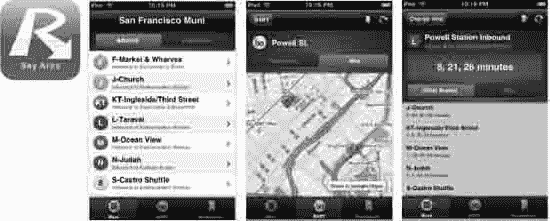

图 9–38\. 应用图标和三个操作界面的示例——解析应用：“Routesy Bay Area San Francisco Muni and BART”。它结合了来自网络和 MapKit 的数据。

这三个学生最终项目的代码如下：

- Stephen A. Moraco (儿子)：[`http://www.rorylewis.com/xCode/011b_TrafficCam.zip`](http://www.rorylewis.com/xCode/011b_TrafficCam.zip)
- Stephen M. Moraco (父亲)：[`http://www.rorylewis.com/xCode/011a_APRSkit.zip`](http://www.rorylewis.com/xCode/011a_APRSkit.zip)
- SatishRege：[`http://www.rorylewis.com/xCode/011c_MyTraffic.zip`](http://www.rorylewis.com/xCode/011c_MyTraffic.zip)

#### MapKit 解析

请记住，这是在超越本书范围的层面上深入代码。然而，以下所有指令都在我学生的代码中可见，欢迎你下载。现在，请先阅读并看看你是否能理解他们解析、创建委托对象等的模式。

在我们查看他们的实际应用之前，先考虑一个假设场景：想象有一个“感恩而死”服务器，广播每个“死头”粉丝的地理位置更新——至少是那些允许自己在网格上可见的粉丝。这个假设的应用允许一个（铁杆）“感恩而死”乐迷在任何给定时间找到附近的所有其他“死头”粉丝。这些粉丝可以见面、分享私制唱片、一起闲逛，并通常在一个只有其他“感恩而死”信徒才能欣赏的层面上交流。


### 起点

如果我们要创建这样一款应用，就像“Routesy”示例那样，我们会允许用户通过打开属性检查器并启用“显示用户位置”开关来查看自己的位置。我们会创建一个名为 `DeadHeadsView` 的控制器，它负责实例化一个我们称之为 `Gratefuldead` 的解析器。然后，我们会让该控制器将自己设置为委托，以便接收反馈，并调用一个名为 `getGratefuldead` 的数据方法。

### 从网络获取数据

当我们的解析器在“感恩而死”服务器上筛选 XML 时，我们希望它抓取 `Gratefuldead` 元素数据，并为每个 `Gratefuldead` 对象创建一个实例。因此，对于它创建的每个实例，它会通过 `addGratefuldead` 方法回调给我们。我们需要在 `deadHeadsViewcontroller` 中实现我们的 `Gratefuldead` 和 `Parser` 方法。我们可能会发现，以如下方式思考我们的 `GratefuldeadParser.h` 会更容易：

```
+ (id)GratefuldeadParser; // 用于创建解析器
- (void)getGratefuldeadData; // 用于激活数据获取
```

### 向视图控制器添加方法

在向 `DeadHeadsView` 控制器添加实现方法之前，我们需要通过 `GratefuldeadParser` 代理来实现协议，并导入其头文件 `#import <GratefuldeadParser.h>`。至此，头文件部分就完成了，我们将转到实现文件。

首先，我们会从 `GratefuldeadParser.h` 中复制两个实现方法，并将它们粘贴到 `@synthesize` 语句之后：

```
@implementation DeadHeadsViewC0ntroller

@synthesize deadView

- (void)getGratefuldeadData:(Gratefuldead *)Gratefuldead;
-(void)parserFinished
```

### 测试解析器数据源

为了测试“感恩而死”服务器，我们将尝试记录一些消息。让我们将这两个方法分开，删除分号，添加大括号，然后输入“log”，如下所示：

```
- (void)getGratefuldeadData:( Gratefuldead *)Gratefuldead {
NSLog(@"嬉皮士消息");
}

-(void)parserFinished{
NSLog(@"在 %@ 位置发现一名死忠粉", Gratefuldead.place);
}
```

### 启动解析器方法

实现了我们的委托方法之后，我们需要做三件事：

1.  编写解析器方法。将其放入一个我们称之为 `(void)viewWillAppear` 的方法中。当视图控制器的视图即将显示时，此方法会被调用。如果采用这种方式，请注意我们应始终在 `- (void)viewWillAppear` 方法中进行调用。
2.  创建一个我们称之为 `GratefuldeadParser` 的解析器实例。通过此操作，我们会得到 `GratefuldeadParser *parser = [GratefuldeadParsergratefuldeadParser]`。我们希望将自身设置为委托，这意味着，现在 `GratefuldeadParserparser.delegate = self`。
3.  此步骤包含两个操作：首先，告诉解析器获取“感恩而死”数据：`[parser getGratefuldeadData];`

其次，处理其导入：

```
#import "GratefuldeadParser.h"
```

然后，当调用 `– (void)viewWillAppear` 时，它会创建一个 `GratefuldeadParser` 实例。当它接收到所有死忠粉的位置时，它会向我们展示他们的位置！

还记得我们如何确保应用的用户会以蓝点的形式显示在地图上吗？我希望你把蓝点想象成一个注解视图。当它被添加到 `deadView` 时，它会向其委托请求位置信息。

注意：如果我们返回任何非 nil 的值，那么将使用我们自己的注解视图（而非蓝色的），然后返回那个视图。

因此，由此看来，当注解不等于用户的当前位置时，我们返回 nil。

```
- (MKAnnotationView *)deadView:(MKDeadView *)deadView
                  viewForAnnotation:(id <MKAnnotation>)annotation {
MKAnnotationView *view = nil;
return view;
```

但问题在于：我们不希望为 `Gratefuldead` 的位置返回 nil。相反，当我们的注解不等于 `deadViewuserLocation` 属性（该属性本身也是一个注解）时，我们希望做一些酷炫的事情：

```
if(annotation != deadView.userLocation) {

                // 这里是我们做酷炫事情的地方
               // 因为这是一个死忠粉，而不是用户
}
```

此时，我们使用 `dequeueReusableAnnotationViewWithIdentifier` 委托方法，当注解视图一离开屏幕，它就会被回收以供重用。它有一种便捷的方式，可以将注解存储在一个独立的数据结构中，然后根据用户事件的需要自动在地图上添加或移除它们。请注意，`dequeueReusableAnnotationViewWithIdentifier` 是关于从地图上获取可重用的注解视图，与添加或移除注解无关：

```
GratefuldeadAnnotation *eqAnn = (GratefuldeadAnnotation*)annotation;
view = [self.deadView  dequeueReusableAnnotationViewWithIdentifier:@"GratefuldeadLoc"];
       if(nil == view) {
        view = [[[MKPinAnnotationView alloc] initWithAnnotation:eqAnn
                                              reuseIdentifier:@"GratefuldeadLoc"] autorelease];
}
```

注解视图会去它的重用队列中查找是否有可以重用的视图 `if(nil == view) { …`。如果没有，它会返回 nil，这意味着我们需要创建一个新的 `view = [[[MKPinAnnotationViewalloc] initWithAnnotation:eqAnn`。

有很多创造性的方法可以让你的注解展示带有动画的 V 形标记、铃铛和口哨、“感恩而死”的珠子等等。你可以查看已有的可用资源，以你希望的任何方式为你的注解打造视觉甜点。

在这方面，当你编写代码到此阶段时，最重要的步骤是使用你的 NSLog 调试器检查代码中的错误；这将决定它是否能连接到你所选的服务器。一旦完成，剩下的就是解析 XML 的问题。最后一步是为注解寻找视觉甜点。

### 三个 MapKit 最终项目：CS–201 iPhone 应用，Objective–C

以下是三个大量依赖从互联网解析信息的应用。前两个来自一对父子，两人都叫 Stephen Moraco，第三个来自 SatishRege。他们都好心地提供了未经编辑的个人简介，说明了他们为什么选修这门课。他们还包含了详细的课堂笔记、本书中展示的应用，以及他们从课程中的收获。

#### 示例 1 和 2 的个人简介信息

> Stephen A. Moraco（儿子）
>
> Stephen M. Moraco（父亲）
>
> Steve A. (图 9–39) 正在读高中最后一年。他同时还在 UCCS（科罗拉多大学斯普林斯分校）注册并修读了可以获得双重学分（高中和大学均认可）的课程。我，Stephen M. (图 9–40)，是安捷伦科技有限公司的一名专业软件工程师。我们俩都拥有 iPhone，并且对学习为 iPhone 编写应用感兴趣。UCCS 的这门课程引起了我们的注意，它让我们有机会一起学习。事实上，我们非常享受 Lewis 博士的 CS201 课程，在课程中我们探索了 iPhone SDK 并练习编写了许多应用。课堂上的讨论，以及课后我们俩开车回家路上的交流，总是让我们对能用 iPhone 做些什么感到兴奋不已。我们的最终项目正是源于这些讨论。Lewis 博士，感谢您开设这门课程。对我们而言，这提供了一段美好的共同学习时光。我们度过了无比愉快的时光。
>
> 
>
> 图 9–39\. Stephen A. Moraco（儿子）
>
> 
>
> 图 9–40\. Stephen M. Moraco（父亲）


##### 期末项目——示例 1

Stephen M. Moraco 开发了一款对他而言意义非凡的应用程序。作为一名业余无线电爱好者，他决定解析 Bob Bruning 的 WB4APR 网站，Bob 在该网站上开发了一套自动位置报告系统（APRS）。与我之前在课堂上举的“定位死头乐队粉丝”的例子非常相似，Stephen（身为父亲）制作了一款应用，能够定位所有在用户指定距离范围内的业余无线电操作员。我不会逐行讲解 Stephen 的所有代码，因为你可以下载并仔细阅读。我认为你应该注意以下几个部分：他的 `APRSmapViewController` 头文件列出了包含 3 个 IBOutlet、1 个 IBAction 和一个 ViewController 的路线图：

```
@property (nonatomic, retain) IBOutlet MKMapView *mapView;
@property (nonatomic, retain) APRSwebViewController *webBrowserController;
@property (nonatomic, retain) IBOutlet UISegmentedControl *ctlMapTypeChooser;
@property (nonatomic, retain) IBOutlet UIActivityIndicatorView *aiActivityInd;

-(IBAction)selectMapMode:(id)sender;
```

在 `APRSkit_MoracoDadAppDelegate` 的实现文件中，他使用以下代码让用户有机会登录。结果见图 9-41。此步骤的详细信息位于 `-(void)applicationDidFinishLaunching` 方法中，该方法还包含了系统搜索匹配项时与用户之间的距离（半径）：

```
-(void)applicationDidFinishLaunching:(UIApplication*)application{

    NSLog(@"MapAPRS_MoracoDadAppDelegate:applicationDidFinishLaunching - ENTRY");
    //Override point for customization after app launch

    [window addSubview:[navigationController view]];
          [window makeKeyAndVisible];

     //preload our applcation defaults
     NSUserDefaults *upSettings = [NSUserDefaults standardUserDefaults];
     NSString *strDefaultCallsign = [upSettings stringForKey:kCallSignKey];
     if(strDefaultCallsign == nil)
     {
          strDefaultCallsign = strEmptyString;
     }
     self.callSign = strDefaultCallsign;
     //[strDefaultCallsign release];

     NSString *strDefaultSitePassword = [upSettings stringForKey:kSitePasswordKey];
     if(strDefaultSitePassword == nil)
     {
          strDefaultSitePassword = strEmptyString;
     }
     self.sitePassword = strDefaultSitePassword;

     NSString *strDefaultDistanceInMiles = [upSettings stringForKey:kDistanceInMilesKey];
     if(strDefaultDistanceInMiles == nil)
     {
          strDefaultDistanceInMiles=@"30";
     }
     self.distanceInMiles = strDefaultDistanceInMiles;
     //[strDefaultSitePassword release];
     //INCORRECT DECR [upSettings release];
}
```

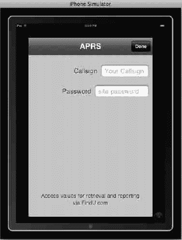

图 9-41\. CS–201 期末项目——Stephen M. Moraco 的 APRS 设置界面，用户在此输入其业余无线电呼号及密码。

Stephen 在访问网站时做的第一件事就是列出 XML 数据流中的所有属性。以下列表显示了他所看到的内容。

*   第 1 列是呼号，CALLSIGN
*   第 2 列是消息流量的 URL（如有）
*   第 3 列是天气页面的 URL（如有）
*   第 4 列是纬度
*   第 5 列是经度
*   第 6 列是与我的距离（以英里为单位）
*   第 7 列是上次报告的 DD:HH:MM:SS

为了处理这些数据，他在 `APRSstationParser.m` 文件中创建了八个指针。请注意，他额外增加了一个指针用于处理可能的未知列。

```
NSString *kCallSignCol          = @"Callsign";
NSString *kMsgURLCol            = @"MsgURL";
NSString *kWxURLCol             = @"WxURL";
NSString *kLatitudeCol          = @"Lat";
NSString *kLongitudeCol         = @"Long";
NSString *kDistanceCol          = @"Distance";
NSString *kLastReportCol        = @"LastReport";
NSString *kUnknownCol           = @"???";// re didn't recognize column #
```

然后，在同一个文件中，他编写了 `case` 语句：

```
case1:
          m_strColumnName=kCallSignCol;
          break;
      case2:
          m_strColumnName=kMsgURLCol;
          break;
      case3:
          m_strColumnName=kWxURLCol;
          break;
      case4:
          m_strColumnName=kLatitudeCol;
          break;
      case5:
          m_strColumnName=kLongitudeCol;
          break;
      case6:
          m_strColumnName=kDistanceCol;
          break;
      case7:
          m_strColumnName=kLastReportCol;
          break;
     default:
          m_strColumnName=kUnknownCol;
          break;
```

此外，在 `APRSkit_MoracoDadAppDelegate` 实现文件中，`-(void)recenterMap` 方法会扫描所有标注以确定地理中心，并像我们在本章练习中所做的那样，计算要显示的地图区域。Stephen 在他的三个 `if` 语句之后也执行了相同的操作。图 9-42 展示了图钉落下的图像。

```
-(void)recenterMap{
    NSLog(@" - APRSpinViewController:recenterMap - ENTRY");
         NSArray *coordinates = [self.mapView
valueForKeyPath:@"annotations.coordinate"];
     CLLocationCoordinate2DmaxCoord={-90.0f,-180.0f};
     CLLocationCoordinate2DminCoord={90.0f,180.0f};
     for(NSValue*valueincoordinates){
          CLLocationCoordinate2Dcoord={0.0f,0.0f};
          [value getValue:&coord];
               if(coord.longitude>maxCoord.longitude){
                    maxCoord.longitude=coord.longitude;
               }
               if(coord.latitude>maxCoord.latitude){
                    maxCoord.latitude=coord.latitude;
               }
               if(coord.longitude<minCoord.longitude){
                    minCoord.longitude=coord.longitude;
               }
               if(coord.latitude<minCoord.latitude){
                    minCoord.latitude=coord.latitude;
               }
}
```

请注意，在 `APRSstation` 类中，Stephen 表示从 APRS 解析出的详细信息，这些信息用于设置图钉的位置。

```
#import<CoreLocation/CoreLocation.h>

@interfaceAPRSstation:NSObject{
     NSString    *m_strCallsign;
     NSDate      *m_dtLastReport;
     NSNumber    *m_nDistanceInMiles;
     NSString    *m_strMsgURL;
     NSString    *m_strWxURL;
     NSString    *m_strTimeSinceLastReport;
     CLLocation  *m_locPosition;
     int          m_nInstanceNbr;
}

@property(nonatomic, copy)NSString *callSign;
@property(nonatomic, copy)NSNumber *distanceInMiles;
@property(nonatomic, retain)NSDate *lastReport;
@property(nonatomic, copy)NSString *timeSinceLastReport;
@property(nonatomic, copy)NSString *msgURL;
@property(nonatomic, copy)NSString *wxURL;
@property(nonatomic, retain)CLLocation *position;

@end
```

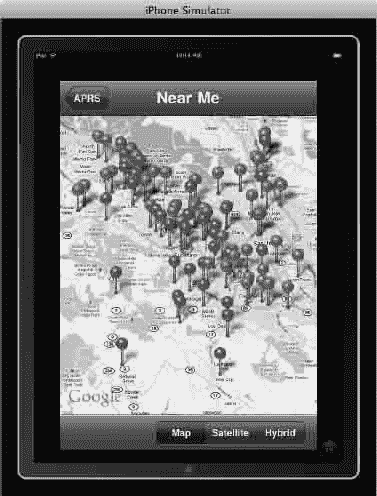

图 9-42\. CS–201 期末项目——Stephen M. Moraco 的动画图钉落在用户位置指定半径范围内。在 iPad 模拟器上，图钉落在苹果总部周边区域。

Stephen 做的另一件很酷的事是区分拥有自己网站的业余无线电台和没有网站的电台。对于有网站的电台上，他在标注视图中包含了一个 V 形图标，点击该图标即可显示网页。请参见图 9-42 和图 9-43。这段代码直接位于 `APRSstationParser.m` 文件的 switch case 语句下方。

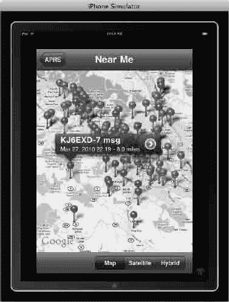

图 9-43\. CS–201 期末项目——Stephen M. Moraco 的应用在点击图钉时会显示标注，并且如果 APRS 服务器上有链接的网站，则会显示一个蓝色 V 形图标，用户可点击该图标访问该业余无线电台的网站。在这个案例中，业余无线电台 KJ6EXD–7 确实有一个网站。

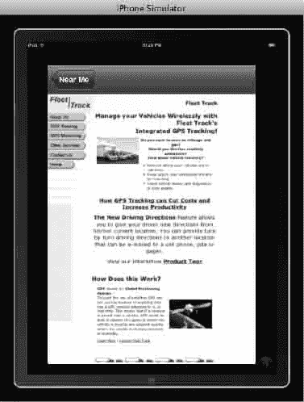

图 9-44\. CS–201 期末项目——Stephen M. Moraco 的 App 展示了嵌入在 iPad 中的 KJ6EXD–7 网站。


在`APRSmapViewController`实现文件中，Stephen 包含了一种基础的方法来在地图、卫星和混合视图之间切换。例如，当我们向用户显示最近的无线电台（在模拟器模式下是 Apple 总部）时，可以看到这一点。请参见图 9-44，其中视图处于混合模式。

```
-(IBAction)selectMapMode:(id)sender
{
     UISegmentedControl *scChooser = (UISegmentedControl *)sender;
     intnMapStyleIdx = [scChooser selectedSegmentIndex];
     NSLog(@"APRSmapViewController:selectMapMode - New Style=%d" ,nMapStyleIdx);

     switch (nMapStyleIdx) {
          case0:
              self.mapView.mapType = MKMapTypeStandard;
              break;
          case1:
              self.mapView.mapType = MKMapTypeSatellite;
              break;
          case2:
              self.mapView.mapType = MKMapTypeHybrid;
              break;
          default:
               NSLog(@"APRSmapViewController:selectMapMode - Unknown Selection?!");
               break;
          }
}
```

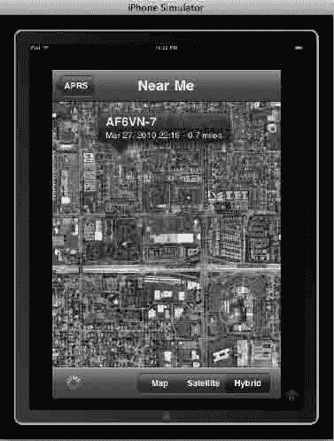

图 9-45。CS–201 期末项目—Stephen M. Moraco 的应用，在混合地图视图中显示距离 Apple 总部最近的业余无线电台。

最后，作为我一直鼓励学生完成的点睛之笔，Stephen 在`AboutView`nib 中包含了一个精美的关于页面。请参见图 9-45。

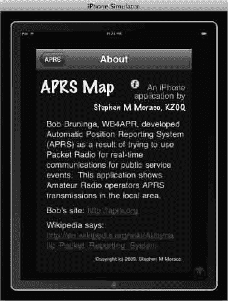

图 9-46。CS–201 期末项目—Stephen M. Moraco 的应用展示了他的“关于页面”——非常酷！

注意：要运行代码，你需要拥有密码和用户名。你有两个选择：1) 获取你自己的，或者 2) 下载以下三个应用中的任意一个，它们本质上是相同的。

```
http://itunes.apple.com/us/app/pocketpacket/id336500866?mt=8
http://itunes.apple.com/us/app/ibcnu/id314134969?mt=8
http://itunes.apple.com/us/app/aprs/id341511796?mt=8
```

##### 最终项目—示例 2

Stephen A. Moraco 是一名天才高中生，曾参加过我的课程。他的应用解析了位于[`http://www.mhartman-wx.com/wcn/`](http://www.mhartman-wx.com/wcn/)的国家气象摄像头网络。这可以在`TrafficCamParser`实现文件`static NSString *strURL=http://www.mhartman-wx.com/wcn/wcn_db.txt`中看到。

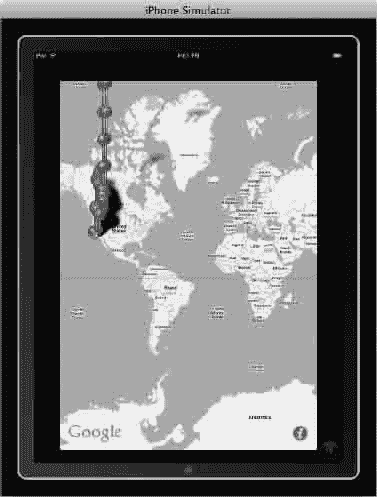

图 9-47。CS–201 期末项目—Stephen A. Moraco 的应用启动时，数百个图钉如雨点般落下，填充用户“当前”位置（Apple 总部）周围的指定区域。

他发现需要使用一个适配器来过滤掉`<head></head>`部分中的不良元标签。服务器上有多余的内容导致代码崩溃。为了解决这个问题，他制定了规则：将`"^"`替换为`</field><field>`，将`<br>'s`替换为空格，将`"<fontsize=\"-1\">("and")<br>"`替换为`</field><field>`，以`<CAM> <field>`开头并以`</field> </CAM>`结尾，移除`</font`标签，移除不间断空格。我添加了编号以帮助你识别每行的起始位置，因为自动换行也让我感到困惑！

1.  `NSString *strNoParaQueryResults = [strQueryResults`
    `stringByReplacingOccurrencesOfString:@"<fontsize=\"-1\">("`
    `withString:@"</field><field>"];`
2.  `strNoParaQueryResults = [strNoParaQueryResults`
    `stringByReplacingOccurrencesOfString:@")<br>" withString:@"</field><field>"];`
3.  `strNoParaQueryResults = [strNoParaQueryResults`
    `stringByReplacingOccurrencesOfString:@"</font>" withString:@""];`
4.  `strNoParaQueryResults = [strNoParaQueryResults`
    `stringByReplacingOccurrencesOfString:@" " withString:@""];`
5.  `strNoParaQueryResults = [strNoParaQueryResults`
    `stringByReplacingOccurrencesOfString:@"></a>" withString:@"></img></a>"];`
6.  `strNoParaQueryResults = [strNoParaQueryResults`
    `stringByReplacingOccurrencesOfString:@"width=150" withString:@"width=\"150\""];`
7.  `strNoParaQueryResults = [strNoParaQueryResults`
    `stringByReplacingOccurrencesOfString:@"height=100" withString:@"height=\"100\""];`
8.  `strNoParaQueryResults = [strNoParaQueryResults`
    `stringByReplacingOccurrencesOfString:@"width=100" withString:@"width=\"100\""];`
9.  `strNoParaQueryResults = [strNoParaQueryResults`
    `stringByReplacingOccurrencesOfString:@"height=150" withString:@"height=\"150\""];`
10.  `strNoParaQueryResults = [strNoParaQueryResults`
    `stringByReplacingOccurrencesOfString:@"border=0" withString:@"border=\"0\""];`
11.  `strNoParaQueryResults = [strNoParaQueryResults`
    `stringByReplacingOccurrencesOfString:@"\"\""withString:@"\""];`
12.  `strNoParaQueryResults = [strNoParaQueryResults`
    `stringByReplacingOccurrencesOfString:@".jpg" withString:@".jpg\""];`
13.  `strNoParaQueryResults = [strNoParaQueryResults`
    `stringByReplacingOccurrencesOfString:@"&" withString:@"and"];`
14.  `strNoParaQueryResults = [strNoParaQueryResults`
    `stringByReplacingOccurrencesOfString:@"<fontsize=\"-1\">" withString:@""];`
15.  `strNoParaQueryResults = [strNoParaQueryResults`
    `stringByReplacingOccurrencesOfString:@"</b<" withString:@"</b><"];`

所使用的`TrafficCamAnnotation.h`头文件简明直观，使用了`+(id)annotationWithCam:(TrafficCam*)Cam`和`-(id)initWithCam:(TrafficCam*)Cam`指针，正如之前为假设的`GratefuldeadParser.h`所描述的那样。在此例中，`+(id)annotationWithCam:(TrafficCam*)Cam`创建解析后的文件，而`-(id)initWithCam:(TrafficCam*)Cam`则对其进行初始化。所有处理无用代码的辛勤工作，其结果体现在干净的注解中。请参见图 9-47。

```
#import <MapKit/MapKit.h>
#import<CoreLocation/CoreLocation.h>

@classTrafficCam;

@interfaceTrafficCamAnnotation:NSObject<MKAnnotation>{
     CLLocationCoordinate2D Coordinate;
     NSString *Title;
     NSString *Subtitle;
     TrafficCam*Cam;
}
```


`@property(nonatomic,assign)CLLocationCoordinate2Dcoordinate;`
`@property(nonatomic,retain)NSString*title;`
`@property(nonatomic,retain)NSString*subtitle;`
`@property(nonatomic,retain)TrafficCam*cam;`

`+(id)annotationWithCam:(TrafficCam*)Cam;`
`-(id)initWithCam:(TrafficCam*)Cam;`

`@end`

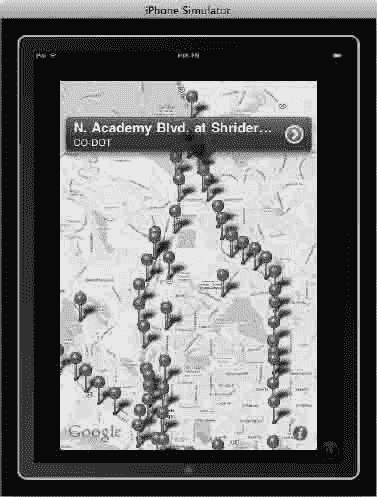

图 9–48. CS–201 期末项目——Stephen A. Moraco 的应用，放大至科罗拉多斯普林斯区域。作者点击了“北学院路与施赖德路交叉口”的标注。

Stephen 还发现他无法自动使用摄像头视频视图。在 `TrafficCamSettingsViewController.m` 中规避这一挑战并非易事。其中一个例子是允许除默认竖屏方向以外的其他方向：

```
BOOL)shouldAutorotateToInterfaceOrientation:(UIInterfaceOrientation)interfaceOrientation{
    //返回支持的界面方向
    return (interfaceOrientation == UIInterfaceOrientationPortrait);
}
```

他需要这样安排代码，以便在屏幕上呈现间距美观且大小适配的视频摄像头图像，如图 图 9–48 所示。


图 9–49. CS–201 期末项目——Stephen A. Moraco 的应用，放大至科罗拉多斯普林斯区域。作者点击了“北学院路与施赖德路交叉口”的标注。

#### 示例 3 的个人简介

> Satish Rege
>
> 我为何想成为一名 iPhone 开发者？很简单——iPhone 将大型计算系统的计算、通信和多媒体体验浓缩于掌心。它以协同的方式提供丰富的资源和用户界面原语，以表达创意能力。这些 iPhone 的特性吸引我想要学习 iPhone 开发工具，来表达我自己的想法。Rory 的课程是一次绝佳的介绍，涵盖了众多 iPhone 功能，并使其易于掌握。
> 
> > 
> 
> 图 9–50. Satish Rege

##### 期末项目——示例 3

Satish（图 9–42）在所有的家庭作业中总能拿出简洁优雅的代码。在我批改每周作业时，我意识到 Satish 有一种诀窍，别人通常需要三倍长度的代码才能完成的任务，他仅用 20 行代码就能实现。在他的期末项目中，Satish 的应用允许用户预先查看前方路口的交通状况，如果某个路口拥堵，则会推荐另一条路线。

至少从理论上讲，这就是它的工作方式。Satish 从一个他知道会很棘手的路口——I-25 北向——入手，从而避免了很多麻烦。他专注于控制器实现文件，然后根据在科罗拉多斯普林斯的位置不断来回切换。他为科罗拉多斯普林斯的 27 个摄像头设置了 27 种情况。简洁、优雅、美观。

图 9–51 显示了列表。图 9–52 和 9–53 展示了两个交通视图的示例。

```
//根据坐标选择摄像头
     switch(cameraCordinate){
          case1:
              url=[NSURLURLWithString:@"http://www.springsgov.com/trafficeng/bImage.ASP?camID=17"];     //摄像头-学院路/I-25 北道
               break;
          case2:
              url=[NSURLURLWithString:@"http://www.springsgov.com/trafficeng/bImage.ASP?camID=18"];     //摄像头-HWY85/87/I-25N
               break;

>>>>>>>
>>>>>>>
>>>>>>>
          case26:
               url=[NSURLURLWithString:@"http://www.springsgov.com/trafficeng/bImage.ASP?camID=33"];     //摄像头-纪念碑/I-25N
               break;
          case27:
               url=[NSURLURLWithString:@"http://www.springsgov.com/trafficeng/bImage.ASP?camID=49"];     //摄像头-县界/I-25SE
               break;
```

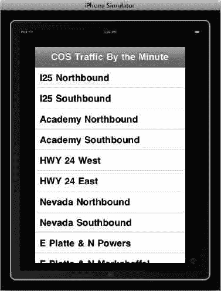

图 9–51. CS–201 期末项目——Rege 的应用会在用户沿街行驶时，选择离用户最近的交通信号灯。

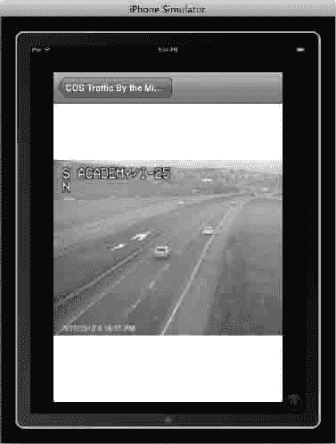

图 9–52. CS–201 期末项目——Rege 的交通监控应用显示了嵌入式摄像头视图。

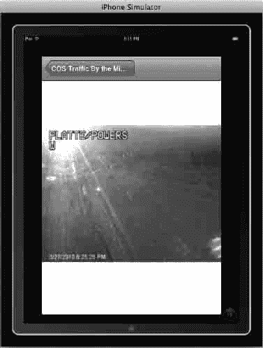

图 9–53. CS–201 期末项目——Satish Rege 的应用显示了另一个嵌入式摄像头视图。

### 缩小视野……纵观全局

了解我们从何处来、现在在何处以及下一步要去向何方，这很重要。不要过于形而上学，但本章有点像我们人生的隐喻。五年前的你在哪里？去年呢？你买这本书的前一天呢？六个月后你打算在哪里？

这就是这个主题如此受欢迎的原因。人们喜欢知道自己在哪里！人们喜欢知道，也乐于被指导如何从“这里”到达“那里”。

你知道男性通常不愿意停车问路吗？我知道我自己就是——因为我觉得自己应该知道要去哪里。当 GPS 出现时，我印象深刻。但当苹果公司通过 `Maps` 在我第一台 iPhone 中内置了导航功能时，我彻底震惊了。突然间，我既能咨询“先知”，又能同时维护我的男性自尊！

这就是力量，这就是权威……这也是我们所有人加入的同一场革命。既然你已经完成了这本书，并成功通过了这些练习——有些简单些，有些更难些——那么你已经在编程世界中走上了正轨。

正如我之前所说，我在本章中为你设定的目标并不高。然而，正如任何真正具有挑战性和有价值的事业一样，熟能生巧。如果你感到疲惫，但仍然对这些想法和可能性感到兴奋，那么我认为这完全是成功的——无论对你还是对我都是如此。

你们中的一些人可能在想本书未涉及的主题：加速度计、摄像头/视频、点对点协议、RSS 订阅、邮件客户端/POP 服务器等。如果这些领域让你感兴趣，我希望你的思绪已经在向这些新方向飞驰。那意味着你确实知道自己在哪里，也知道自己想去哪里。生活真美好！

## 第 10 章

## 使用 Storyboarding 的 MapKit 与表格

关于本章，我希望你记住五件事：


- 续接第 9 章：第 10 章将你在第 9 章所学的内容注入“兴奋剂”。你需要复习第 9 章的内容，然后直接进入第 10 章。在课堂上，我要求我的学生在二十分钟内跑完第 9 章（如果他们想要成绩的话），然后，在立即通过电子邮件向我发送完成项目的截图后，我们就直接进入第 10 章。我建议，如果你在完成第 9 章后休息了几天，你也应该让自己重复第 9 章几次，直到你可以在二十分钟内完成。即使你必须做 15 次，在尝试本章之前也要一遍又一遍地做。
- 非易事：当你完成第 10 章时，你将真正完成一些值得骄傲的事情。是的，一方面，当我们在辩论学生达到某个水平时的“极客程度”时，学生们会放声大笑，但事实上，在完成这个应用后，你将能够找到一份`Objective-C`程序员的工作，或者至少能够与一位不相信你自称是绝对初学者的面试官进行像样的对话。苹果公司也并非如此，他们雇用了我的一个学生到库比蒂诺从事`iOS 5`开发工作。八个月前，她还从未拥有过一台`Mac`，并且正在学习本书的第一版，所以请认真对待；这一章将成为你生命中的决定性一章。
- 大局观：正如你读到这些文字一样真实，总会有那么一刻，这段代码会让你陷入困境，如果你在我的课堂上，我看到你不知所措、惊慌失措，我会走到你身边，提醒你注意大局观。在本章中，我会不断地让你回归大局观，简而言之，就是一个包含一个表格的故事板，表格中填充了许多城市名称。我们访问谷歌的服务器，获取每个城市的地理空间地址，当用户点击表格中列出的某个城市时，我们会沿着另一个转场（segue）跳转，该转场实例化一个`MapKit`，在该城市的中心放置一个图钉。
- 章节大纲：第 10 章的预备知识非常少，因为我希望你能无缝地保持从第 9 章到第 10 章的势头。我将解释帮助文件和视频的位置，如何选择使用它们，以及它们与以前帮助文件的不同之处。
- 不要放弃：第 10 章会考验你，我希望你能突破。听我说，没有人能一次完成第 10 章！你需要反复从头开始。事实上，重新开始是关键：在花一点时间调试之后，只需从头开始。请不要对自己说：“哦，我搞不定这个，看，我已经试了 5 次了，还是过不去！”失败并重新开始是可以的，我真心希望你能够通过。我希望看到你去论坛告诉大家你通过了第 10 章！好吗？是的！

注意：我注意到我的一些学生不能正确发音“segue”一词。以下是我从学生那里听到的一些令人惊叹的版本：“Seeg”、“Seg-you”、“Zeeyoo”、“Suh-goo-wee”，当然还有“Sega”，就像游戏机那样！真的吗！如果你还不知道，`Segue`的发音如下：`Seg-way`。这是我定义它的方式。由《梅里亚姆-韦伯斯特词典》定义的恰当且正确的方式如下：

se·gue\ se-( )gwā, sā-\

1 : 继续下面的内容而不停顿——作为音乐中的指示使用

2 : 像前一个那样演奏接下来的音乐——作为音乐中的指示使用

`SEGUE`的词源：意大利语，意为“接着”，来自`seguire`（跟随），源自拉丁语`sequi`——首次使用时间：约 1740 年。

### `myStory_02`：一个单视图应用

在`myStory_02`中，我们将项目分为第 1 部分和第 2 部分。在第 1 部分中，我们使用故事板创建一个简单的表格，该表格由一个城市数组填充。列表的长度将是你拥有或编造的城市列表中的“数量”。当用户选择列表中的某个城市时，实际上什么也不会发生。然而，在继续之前，了解你的应用程序在此刻能够正常工作是很重要的。你可以通过查看图 10-26 来先睹为快。然后，在第 2 部分中，我们将填充表格的城市列表发送到谷歌服务器，在那里我们解析服务器以获取每个城市的经度和纬度地址。我们存储这些地址，当用户选择一个城市时，我们通过转场从表格“跳转”到一个带有`UIMapKit`的视图，该视图会实例化一张地图，地图上有一个图钉落在城市中心。


#### 应用准备前的可能工作

让我们先熟悉两组术语：“解析”和“上传到互联网”。我们会频繁用到“解析”这个词，尽管在设计课程和本书时我曾犹豫是否要包含解析内容，但我最终决定宁可教会你这个当代编程基础技能：解析就是编写代码，让你能够进入服务器，仅从数据库中提取你所需的特定数据。例如，谷歌服务器上可能有 6000 个与南非德班市相关的指针、链接和术语。我们将解析谷歌服务器，忽略所有信息，只提取德班的经纬度地址。想想看，数百万个应用都需要访问某个服务器，仅提取用户所需的信息。这正是关键编码技能，我将向你精确展示如何操作（并让你在 iPad 上看起来非常酷）。

当然，你知道互联网并非悬浮在空中或云朵里。确实，有一部分数据会被发送到卫星，但随后会返回地球，通过线缆传输抵达服务器。开发能够从特定服务器抓取重要数据的 iPad 和 iPhone 应用至关重要。我曾有个学生，他编写的期末课堂项目应用可以解析科罗拉多斯普林斯市交通摄像头（位于科罗拉多州）的服务器。从城市服务器解析出正确图像后，他每秒向 iPhone 应用发送数张每个路口的快照，让用户能“提前看到”路口情况，并根据交通流量做出决策。太棒了！然而，尽管这位学生很聪明，当他站在讲堂前描述如何编写解析服务器的代码时，他指向了天空。我问他是否知道服务器就位于距离校园仅 4 英里的地方。他看着我说道：“这么说，它并不需要上传到云端？”

即便是我，在说“上网”时也会指向云朵，但我希望你记住：当我们解析谷歌服务器时，我们不关心它在哪里或如何到达那里。我们只关心代码是否正确地从服务器中解析出了对我们重要的信息。

#### 预备知识

本章的下载文件与之前的教程略有不同。当然，你也可以不下载任何文件。你可以完全按照本书步骤操作，无需视频、源代码或下载文件也能完美运行应用。我建议你首先尝试不借助视频、下载文件或源代码进行操作。不过，如果你倾向于使用下载文件，请注意以下事项。下载文件包含 6 张图片和 9 个样板代码，具体如表 10-1 所示：

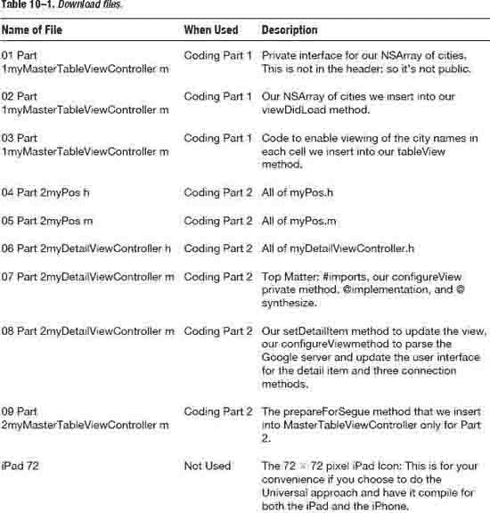

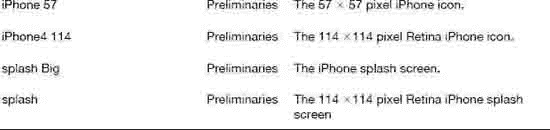

这些下载文件位于[`http://bit.ly/nvc3Xk`](http://bit.ly/nvc3Xk)。你可以在[`http://bit.ly/raKxPe`](http://bit.ly/raKxPe)下载我在视频中编写的示例代码。要观看本章练习的截屏视频，请访问[`http://bit.ly/pEsztt`](http://bit.ly/pEsztt)。

**全局概览**

> 本章中我们会多次用到全局概览。首先，我们从“30,000 英尺”高度审视代码，对整体框架有宏观认识。然后，随着深入细节，我们会始终把握全局。这是第一张全局图：
> 
> 1.  用城市列表填充表格
> 2.  编写代码，让图钉落入选定城市地图的中心

#### 新建单视图模板

> 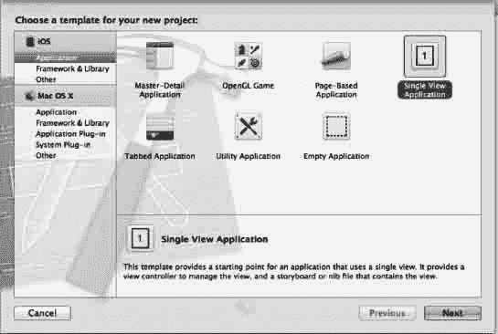
> 
> 图 10-1. 选择单视图应用图标，按回车或下一步。

1.  与`myStory_01`一样，我们将使用单视图应用。因此，打开 Xcode 并按 `N`，如图 10-1 所示。选择单视图应用后，按回车/返回。

    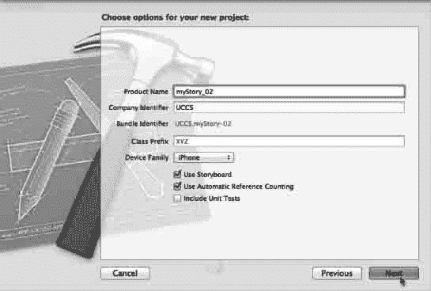

    图 10-2. 将应用命名为`myStory_02`，确保故事板和自动引用计数功能开启。

2.  为了尽可能紧跟我的步骤，请将应用命名为“`myStory_02`”，选择“iPhone”，勾选“使用故事板”和“使用自动引用计数”，但保持“类前缀”和“包含单元测试”未勾选，如图 10-2 所示。自动引用计数实际上超出了本书范围，但从基础层面讲，自动引用计数（ARC）是一种代码，它能调用 Mac 的 Objective-C 对象和块自动内存管理功能。这使经验丰富的程序员无需显式插入保留和释放操作。

#### 导入图片！

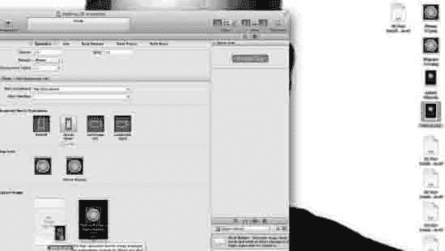

图 10-3. 拖入你的图形文件。

3.  正如我们在`myStory_01`中所做的那样，先访问我的网站[`http://bit.ly/oqnNM7`](http://bit.ly/oqnNM7)下载图片和样板代码到桌面，然后拖入 iPhone 经典版所需的 57 × 57 像素图片、iPhone 4S Retina 显示屏所需的 114 × 114 像素图片。同时，拖入 iPad 和 iPhone Retina 显示屏所需的 640 × 960px 启动屏幕，以及经典 iPhone 所需的 320 × 480px 启动屏幕，如图 10-3 所示。

    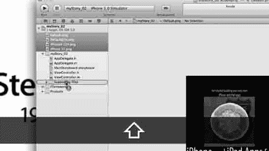

    图 10-4. 将图片拖入支持文件文件夹。

4.  因为我们始终希望保持整洁有序，并让文件归入正确位置，你会看到刚刚拖入 Xcode 的图片文件位于根目录。我们需要将它们拖到正确位置——支持文件文件夹。如图 10-4 所示。

#### 组织故事板

在使用故事板时，最容易迷失方向的原因之一就是没有精确关注结构如何与故事板中的对象连接和关联。人们很容易看着故事板画布，认为一切完美，却没有注意到错误元素实际上已被连接。因此，请务必严格按照我这里的步骤操作。


图 10-5. 选择故事板。

5.  选择故事板，如图 10-5 所示。

    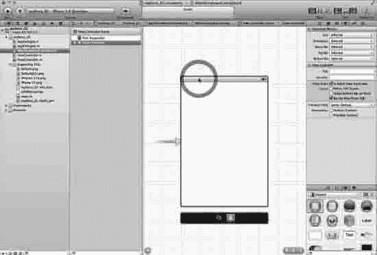

    图 10-6. 此处我们不需要视图控制器。

6.  当故事板首次打开时，你会看到一个视图控制器，如图 10-6 所示。我们将选中这个默认视图控制器并删除它。这很容易理解：我们需要一个完整功能的表格视图，而仅仅在视图控制器上添加一个表格是无法获得这些功能的。我们将在稍后创建自己的视图控制器。现在，我们需要删除默认的视图控制器，请继续操作，如图 10-6 所示。

**全局概览**

> 1.  用城市列表填充表格
>     1.  创建表格视图
> 2.  编写代码，让图钉落入选定城市地图的中心


#### 添加表格视图控制器


*图 10–7. 将表格视图控制器拖到画布上。*

7. 如前所述，我们需要一个完整加载的表格视图来容纳城市数组，并与故事板和 MapKit 进行交互。因此，将表格视图控制器拖到画布上，如图 10–7 所示。

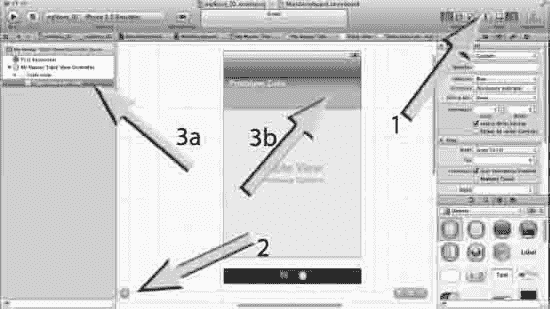

*图 10–8. 选择表格视图单元格 - Cell*

8. 故事板一个非常酷且创新的地方是，我们可以直接在故事板中编辑表格视图。棘手之处在于在画布中导航可能会比较困难。
   1. 为了选择表格视图单元格 - Cell，你需要整理画面。首先关闭导航器（图 10–8，箭头 1）
   2. 然后确保文档大纲已打开（图 10–8，箭头 2）
   3. 接着，在你的“我的主表格视图控制器场景”中，选择表格视图单元格 - Cell 并打开（图 10–8，箭头 3a）。
   4. 诚然，你也可以通过点击故事板上的原型单元格来选择它（图 10–8，箭头 3b）。但是，我不希望你养成在画布上选择对象的习惯，因为许多经验丰富的 Objective-C 程序员曾艰难地认识到，有时我们认为已选中的对象，实际上位于我们实际选中的对象下方。在耗费了大量痛苦的时间，或者重写代码并陷入无休止的调试后，我们才发现了错误。另一个不鼓励在故事板上直接选择的原因是，让你打开文档大纲并在其面板中选择正确的对象，有助于可视化当前所处的位置。

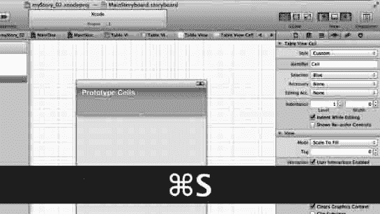

*图 10–9. 将标识符命名为“Cell”并保存你的工作。*

9. 我们想要重用 nib 单元格。换句话说，与其创建大量的单元格列表，不如只使用一个单元格，并根据数组中城市的数量重用它。这意味着我们需要为它的标识符指定一个可重用的名称，那么就称它为“Cell”，如图 10–9 所示。

**整体概览**

> 1. 用城市列表填充表格
>    1. 创建一个表格视图
>    2. 将表格视图的标识符设为一个 cell
> 2. 编写代码，将大头针放置到所选城市地图的中心

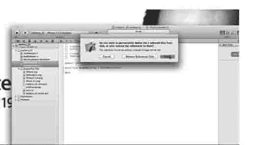

*图 10–10. 删除原始的视图控制器。*

10. 我们看到在故事板中刚刚构建的内容是基于原始视图控制器的。我们需要构建自己的视图控制器，因此删除其头文件和实现文件，如图 10–10 所示。

**注意：** 确保你删除了整个类，而不仅仅是它的引用。

**整体概览：步骤 10 - 17 的详细展开**

> 1. 用城市列表填充表格
>    
>    1.1. 创建一个表格视图
>    
>    1.2. 组织我们的类
>    
>    > 1.2.1. 删除默认的 ViewController
>    
>    > 1.2.2. 创建 3 个类
>    
>    > 1.2.2.1. 两个 UIViewController 子类
>    
>    > 1.2.2.1.1. myMasterTableViewController
>    
>    > 1.2.2.1.2. myDetailViewController
>    
>    > 1.2.2.2. 一个 Objective-C 类
>    
>    > 1.2.2.2.1. myPos
>    
> 2. 编写代码，将大头针放置到所选城市地图的中心

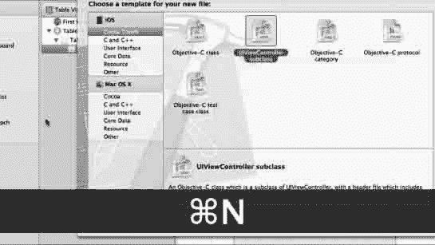

*图 10–11. 创建两个 UIViewController 子类中的第一个。*

11. 既然我们已经删除了表格的默认 `ViewController`，就需要一个新的后台类文件来容纳我们的城市和代码结构，以便用城市列表填充表格。我们需要两个 `UIViewController` 子类，一个用于执行此操作，另一个用于从 Google 服务器获取所需的所有数据。我们还需要一个“我的位置”（`myPos`）Objective-C 类，就像在 myStory_01 中做的那样，用于保存当前位置。那么，让我们开始创建这 3 个类：按 N 并选择 `UIViewController` 子类，如图 10–11 所示。

**整体概览**

> 1. 用城市列表填充表格
>    
>    1.1. 创建一个表格视图
>    
>    1.2. 组织我们的类
>    
>    > 1.2.1. 删除默认的 ViewController
>    
>    > 1.2.2. 创建 3 个类
>    
>    > 1.2.2.1. 两个 UIViewController 子类
>    
>    > 1.2.2.1.1. myMasterTableViewController
>    
>    > 1.2.2.1.2. myDetailViewController
>    
>    > 1.2.2.2. 一个 Objective-C 类
>    
> 2. 编写代码，将大头针放置到所选城市地图的中心

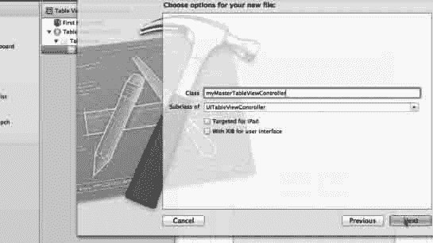

*图 10–12. 将其命名为 `myMasterTableViewController`。*

12. 我们需要确保正在创建的此类是 `UITableViewController` 的子类，因为它需要知道如何执行表格操作，例如在表格中容纳我们的城市。因此，在将其命名为 `myMasterTableViewController` 之后，请确保它是 `UITableViewController` 的子类，否则你以后会后悔的。参见图 10–12。

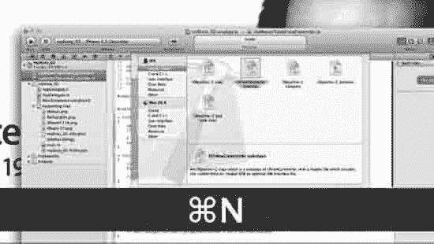

*图 10–13. 创建两个 UIViewController 子类中的第一个。*

13. 创建好 `myMasterTableViewController` 后，再次按 N 并选择另一个 `UIViewController` 子类，如图 10–13 所示。

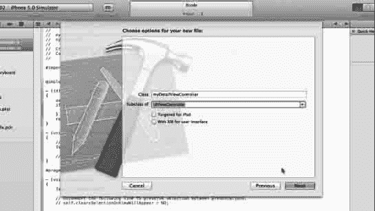

*图 10–14. 将此 `UIViewController` 子类命名为 `myDetailViewController`。*

14. 这个 `UIViewController` 子类将更多地涉及解析 Google 服务器以及在 `myPos` 和用户看到的视图之间进行交互。因此，在将其命名为 `myDetailViewController` 后，确保它不是 `UITableViewController` 的子类，而是 `UIViewController` 的子类，如图 10–14 所示。

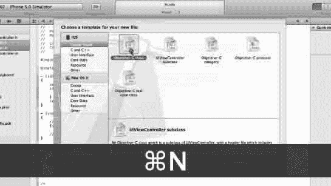

*图 10–15. 选择一个 Objective-C 类*

15. 我们已经创建了两个 `UIViewController` 子类，现在需要创建第三个类，一个 Objective-C 类。那么开始吧：再次按 N 并选择一个 Objective-C 类，如图 10–22 所示。

**整体概览**

> 1. 用城市列表填充表格
>    
>    1.1. 创建一个表格视图
>    
>    1.2. 组织我们的类
>    
>    > 1.2.1. 删除默认的 ViewController
>    
>    > 1.2.2. 创建 3 个类
>    
>    > 1.2.2.1. 两个 UIViewController 子类
>    
>    > 1.2.2.2. 一个 Objective-C 类
>    
>    > 1.2.2.2.1. myPos
>    
> 2. 编写代码，将大头针放置到所选城市地图的中心

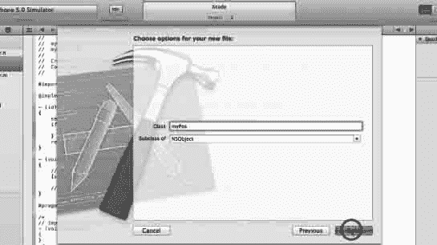

*图 10–16. 将其命名为 `myPos`*

16. 正如我们在 myStory_01 中所做的那样，这需要是一个 `NSObject` 子类。确保这一点并将其命名为 `myPos` 后，点击下一步或按回车键，如图 10–16 所示。让我们继续。

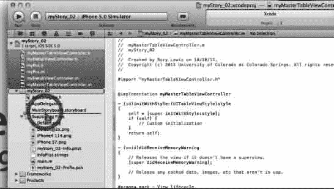

*图 10–17. 整理工作第 1 部分：将文件拖入你的 myStory_02 文件夹。*


17\. 这些类需要放入`myStory_02`文件中，因为如果你不这样做并且你是我的学生，你的项目将被扣掉一个字母等级。如果你不是我的学生，而是为别人工作，他们对你的看法会非常不友善。如果你为自己工作并且不整理文件，那么上帝保佑你，因为不仅你的生活会变得非常糟糕，巨大的负能量会笼罩你，而且 iTunes 商店中审核你代码的人如果看到混乱的组织，也会对你毫无尊重，你的生活将会真的变得很糟。明白了吗？如图 Figure 10–17 所示。

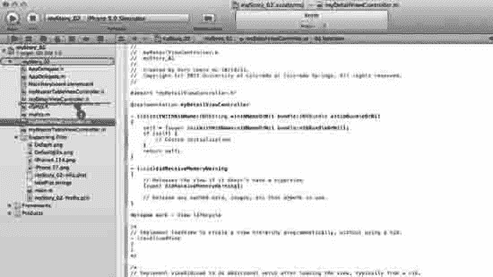

Figure 10–18\. 维护工作第 2 部分：组织你的头文件和实现文件。

18\. 在你将文件导入`myStory_02`文件夹后，你会注意到`.h`和`.m`文件混在一起。这并不好。你需要将每个类的头文件和实现文件放在一起，如图 Figure 10–18 所示。

#### 编写`myMasterTableViewController`

在视频中，为了节省时间，我直接贴入了样板代码。在这里，我们将逐行学习。因此，如果你在编写所有这些代码时遇到任何问题，请克服它。这是学习如何编码的唯一方法。我们不是像把一桶油漆泼在画布表面那样，而是要讨论每一小段代码如何造就一幅美丽的蒙娜丽莎。一个让你自我感觉良好、教你如何编写应用并赚钱的美丽应用！好了，让我们开始吧。我们需要做五件事：为我们的城市`NSArray`创建一个私有接口，插入实际的`NSArray`，让表格返回一个分区，让行数等于城市数量，并让每个单元格显示城市名称。

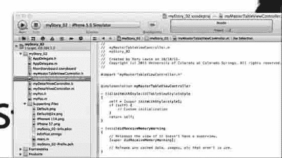

Figure 10–19\. 这是打开`myMasterTableViewController`实现文件时的样子。

19\. 我们现在准备编写`myMasterTableViewController`的实现文件。点击位于根文件夹中`myStory_02`文件夹内的`myMasterTableViewController.m`文件。Figure 10–19 展示了打开`myMasterTableViewController.m`文件时的样子。

全局视角：编写`MYMASTERTABLEVIEWCONTROLLER`：步骤 20 至 22

> 1.  用城市列表填充表格
>     
>     1.1\. 创建一个表格视图
>     
>     1.2\. 组织我们的类
>     
>     1.3\. 编写`myMasterTableViewController.m`
>     
>     > 1.3.1\. 为我们的城市`NSArray`创建一个私有接口
>     
>     > 1.3.2\. 将我们的城市`NSArray`插入到`viewDidLoad`中
>     
>     > 1.3.3\. 让表格返回一个分区
>     
>     > 1.3.4\. 让行数等于城市数量
>     
>     > 1.3.5\. 让每个单元格显示城市名称
>     
>     1.4\. 启用 Storyboard 以显示表格
>     
>     > 1.4.1\. 将表格视图与`myMasterTableViewController`关联
>     
> 2.  编写代码，让图钉落在所选城市地图的中心


Figure 10–20\. 选择并打开`myMasterTableViewController.m`。

20\. Figure 10–20 展示了下载文件“01 Part 1myMasterTableViewController.m”中私有接口的样板粘贴内容。不过我们将手动输入并讨论它。我们需要做两件事。首先，导入`myDetailViewController`头文件，然后创建包含城市列表的私有接口。我们将把它做成一个带有指针的`NSArray`，该指针将包含我们的城市，你将在下面的代码中进一步看到。目前，只需记住，为了将其设为私有成员变量（我们这样做主要是作为练习；我们也可以将其放在头文件中，但那样就是公开的了，我想向你展示如何将其设为私有，因为通常列表内容需要保持私有）。要使其私有，我们需要从带有类名、后跟花括号`()`并以`@end`结尾的`@interface`开始，如下所示：

```
#import "myDetailViewController.h"

@interface myMasterTableViewController ()
{
    NSArray* cities;
}
@end
```


Figure 10–21\. 创建一个包含城市列表的数组。


21\. 我们需要在我们私有的数组中分配正在指向的数组。换句话说，需要创建一个数组，我们已经在私有接口（Private Interface）中将其命名为"cities"。我们将用一个新构造的数组来初始化"cities"变量。所以，让 cities 成为一个包含对象的`NSArray`。它会一直持续，直到遇到末尾的`nil`。如果愿意，你可以随意输入自己的城市。请参考下面的代码，以及在图 10-21 中粘贴的"02 Part myMasterTableViewController m"里的代码。

```
cities = [NSArrayarrayWithObjects:@"New Delhi", @"Durban", @"Islamabad",
@"Johannesburg", @"Kathmandu", @"Dhaka", @"Paris", @"Rome", @"Colorado Springs", @"Rio
de Janeiro", @"Beijing", @"Canberra", @"Malaga", @"Ottawa", @"Santiago de Chile", nil];
```

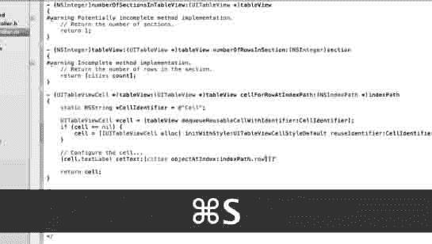

图 10-22\. 完成`myMasterTableViewController.m`的编写

22\. 我们需要做三个小的调整，以确保我们的表格能够处理给定的城市列表，并将其显示到`TableView`上。我们需要让表格返回 1 个分区，让行数等于城市数量，最后，让每个单元格能够显示城市名称：

a. 让表格返回 1 个分区：转到`numberOfSectionsInTableView`，在注释后面添加`return 1`。默认情况下，它包含`return 0`。请注意删除或修改这行代码，否则你可能会得到两个`return`语句，这会导致问题。

注意：正常字重的代码是苹果公司的聪明开发者已经为我们编写好的默认代码。粗体文本是你需要输入的内容。

```
- (NSInteger)numberOfSectionsInTableView:(UITableView *)tableView
{
    // Return the number of sections.
return 1;
}
```

b. 接下来我们需要根据我们的目的修改表格视图方法。首先需要让行数等于城市数量。转到`numberOfRowsInSection`，我们将让行数变为动态的，这意味着无论我们在表格中放入多少城市，返回值都是城市的总`count`：

```
- (NSInteger)tableView:(UITableView *)tableView numberOfRowsInSection:(NSInteger)section
{
    // Return the number of rows in the section.
return [cities count];
}
```

c. 最后，我们需要确保城市名称显示在单元格中。我们需要从索引中获取要在每个单元格中显示的对应城市名称，并将其插入`textLabel`。转到`tableViewcellForRowAtIndexPath`的底部，输入以下代码。

注意：现在我不希望你担心苹果公司已经为我们编写的灰色代码中每一行的含义。在这一点上，我只希望你接受它能正常工作，我们将继续前进。

```
- (UITableViewCell *)tableView:(UITableView *)tableView
cellForRowAtIndexPath:(NSIndexPath *)indexPath
{
   static NSString *CellIdentifier = @"Cell";
    UITableViewCell *cell = [tableView
dequeueReusableCellWithIdentifier:CellIdentifier];
    if (cell == nil) {
        cell = [[UITableViewCell alloc] initWithStyle:UITableViewCellStyleDefault
reuseIdentifier:CellIdentifier];
    }
    // Configure the cell...
[cell.textLabel setText:[cities objectAtIndex:indexPath.row]];
    return cell;
}
```

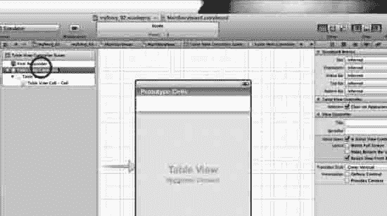

图 10-23\. 返回 Storyboard 并选择 Table View Controller。

23\. 我们需要将 Table View 与`myMasterTableViewController`关联起来。返回 Storyboard，在文档大纲中选择 Table View Controller，如图 10-23 所示。

整体概览：编写 MYMASTERTABLEVIEWCONTROLLER：步骤 24 至 26。

> 1.  用城市列表填充表格
>     1.1. 创建一个 Table View
>     1.2. 组织我们的类
>     1.3. 编写`myMasterTableViewController.m`的代码
>     1.4. 启用 Storyboard 以显示表格
>         > 1.4.1. 将 Table View 与`myMasterTableViewController`关联
> 2.  编写代码，在所选城市的地图中心放置一个大头针

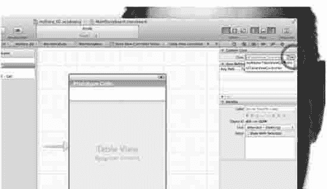

图 10-24\. 选择`myMasterTableViewController`。

24\. 在实用工具中选择 Identity inspector。然后，在自定义类中，打开 Class 的下拉菜单，选择`myMasterTableViewController`，如图 10-24 所示。这确保了我们在步骤 20-22 编写的所有代码现在将在我们的 Table View 底层运行，产生神奇的效果！

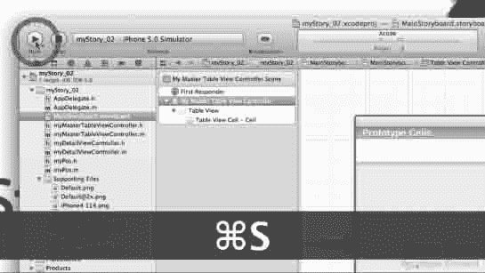

图 10-25\. 运行它。

25\. 我们需要运行它。请参见图 10-25。

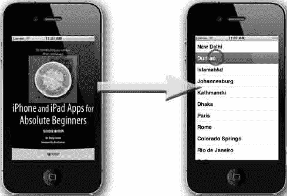

图 10-26\. 一个漂亮的启动画面将我们带到一个填充了数据的表格。

26\. 确保我们看到启动画面出现，然后是一个填充了城市列表的表格，如图 10-26 所示。确实，我们看到了一个启动画面，有 Lulu 水果等等。然后我们看到一个填满了城市的表格。点击它时，它几乎不做什么，但它就在那里。我们完成了`myStory_02`的第一部分。

整体概览

> 1.  用城市列表填充表格（已完成 – 见图 10-26）
> 2.  编写代码，在所选城市的地图中心放置一个大头针（下一节内容）


### 第二部分

让我们深吸一口气，环顾四周。如果这是在演讲厅，我会让你们看看 YouTube 上最新最火的“失败”视频，或者播放一首“感恩而死”乐队的歌，比如《涟漪》。没错，学生们都知道我完全是个怪人，但因为我曾患有急性脑损伤和癫痫，我对大脑略知一二，并且作为一个人，我知道我们需要休息。

我们已经成功地在表格中填充了一个城市列表。现在，在第二部分中，我们将把这个城市列表发送给谷歌，解析出每个城市的地理空间地址，存储它们，然后在用户选择列表中的某个城市时，将它们发送给 MapKit。

看下面的整体概览图，我们可以看到，我们需要添加 MapKit 框架，编写代码使其工作，然后调整 Storyboard 以接收我们的新代码。

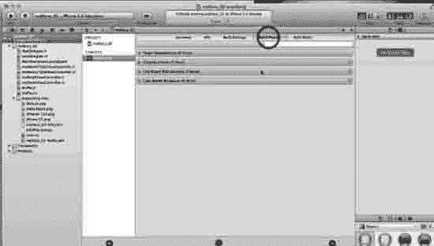

**图 10–27.** 点击“构建阶段”以便添加 MapKit 框架。

27\. 我们需要像在 myStory_01 中那样添加 MapKit 框架。所以，进入你的根目录，点击“构建阶段”标签，如图 10–27 所示。

#### 整体概览：第二部分概述

> 1.  用城市列表填充表格（已完成）
> 2.  编写代码，让图钉落到所选城市的地图中心
>     2.1. 添加 MapKit 框架
>     2.2. 编写代码
>     2.3. 调整 Storyboard 以接收我们的新代码。

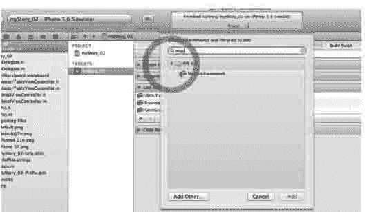

**图 10–28.** 输入“map”以定位 MapKit 框架！

28\. 现在点击“将二进制文件与库链接”栏，并点击“+”按钮。当弹出窗口出现时，输入 `map` 来搜索 MapKit 框架。选中它，如图 10–28 所示，然后点击“添加”按钮。

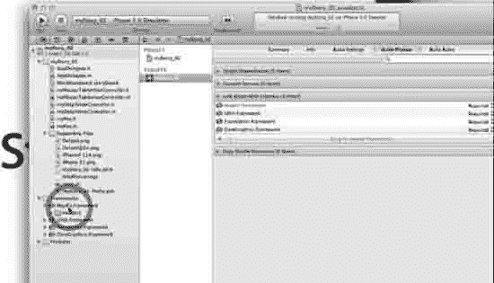

**图 10–29.** 将 MapKit 框架从根文件夹移动到“Frameworks”文件夹。

29\. MapKit 框架出现在根目录中，就像它在 myStory_01 的 图 9-18 中那样。不过在那里我们还有 CoreLocation。这里没有，因为我们将使用谷歌的。同样，你需要将它拖到它所属的文件夹，即“Frameworks”文件夹，如图 10–29 所示。


**图 10–30.** 打开 `myPos` 头文件，并编写或粘贴正确的代码。

30\. 我们现在将编写 `myPos` 头文件的代码。我强烈建议你不要简单地像我视频里那样把它粘贴到你的头文件中。那样做你什么也学不到。跟着我做，你将学会如何编写代码。记住，`myPos` 处理的是公共接口，在其头文件中，我们需要设置两个主要字段，即我们城市的名称和地理空间地址。城市的名称将存储在 `title` 所指向的地址上。每个城市的地理空间经纬度地址将由二维定位方法处理，并存储在一个我们将命名为 `coordinate` 的变量中。

**注意：** `CLLocationCoordinate2D` 是一个结构体，它使用世界大地测量系统（WGS 84）参考框架包含我们的地理空间坐标，该框架以其位置来自地心，并且要知道它存在 2 厘米的误差！

当我们第一次打开 `myPos.h` 文件时，我们看到以下内容：

```
#import <Foundation/Foundation.h>
@interface myPos : NSObject
@end
```

我们要做的第一件事是通过输入 `#import <MapKit/MKAnnotation.h>` 来添加 MapKit。接下来，我们在给定的 `@interface myPos :NSObject` 后面插入 `<MKAnnotation>`。每当我们需要在地图视图中使用注解相关信息时，都会使用 `MKAnnotation` 协议。接下来，我们设置 `CLLocation` 类引用，通过输入 `CLLocationCoordinate2Dcoordinate` 来整合我们设备的地理空间坐标和海拔高度，这将使用一个我称之为 `coordinate` 的变量。我们还需要存储城市的名称，这将通过 `NSString` 在 `title` 中完成。最后，我们为每个城市的位置和标题创建 `@property` 语句。现在，你的 `myPos` 头文件代码将如图 10–30 所示，或如下所示：

```
#import <Foundation/Foundation.h>
#import <MapKit/MKAnnotation.h>

@interface myPos : NSObject <MKAnnotation>
{
    CLLocationCoordinate2D _coordinate;
    NSString *_title;
}

@property (nonatomic, assign) CLLocationCoordinate2D coordinate;
@property (nonatomic, copy) NSString *title;

@end
```

**注意：** 在用于城市名称的 `@property` 中，它是一个字符串，我们使用 `(nonatomic, copy)`。我只想让你记住，在不被细节搞乱的情况下，作为一般规则，对字符串始终使用 `(nonatomic, copy)`。

#### 整体概览：编码概述

> 1.  用城市列表填充表格（已完成）
> 2.  编写代码，让图钉落到所选城市的地图中心
>     2.1. 添加 MapKit 框架
>     2.2. 编写代码
>     > 2.2.1. `myPos` 用于跟踪所选城市及其坐标
>     > 2.2.2. `myDetailViewController` 用于解析谷歌以及其他事项
>     > 2.2.3. `myMasterTableViewController` 用于控制到 MapKit 的转场。
>     2.3. 调整 Storyboard 以接收我们的新代码。

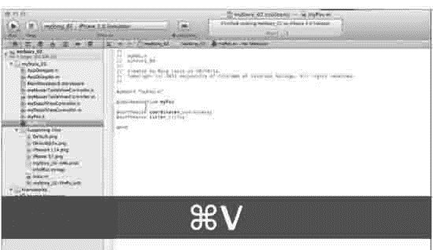

**图 10–31.** 现在我们打开 `myPos` 的实现文件。

31\. 在 `myPos` 头文件的实现中，我们只需要合成你的坐标和标题。最终的代码如图 10–31 所示。

```
#import "myPos.h"
@implementation myPos

@synthesize coordinate=_coordinate;
@synthesize title=_title;

@end
```


**图 10–32.** 打开 `myDetailViewController` 头文件进行粘贴或编写代码。

32\. 我们现在需要构建 `myDetailViewController` 类。首先，通过在 `#import <UIKit/UIKit.h>` 之后输入 `#import <MapKit/MapKit.h>` 来导入我们的 MapKit 地图套件头文件。现在，查看 `@interface myDetailViewController,`，我们需要让它基于 `UIViewController`，并且我们将通过编写 `<NSURLConnectionDataDelegate, MKMapViewDelegate>` 来用协议支持 `myDetailViewController` 类，首先用于连接数据委托，其次用于支持地图视图委托。完成此操作后，我们将本地数据分配给 `NSMutableData`，如下所示。接下来，我们需要为详细信息项创建一个公共属性，我们将设置它来准备连接表格和地图视图的转场。最后，通过输入 `@property (strong, nonatomic) id detailItem` 来设置 `@property`。保存所有内容，在继续进入实现文件实现此代码之前，请对照图 10–32 或以下内容检查你的代码。

```
#import <UIKit/UIKit.h>
#import <MapKit/MapKit.h>

@interface myDetailViewController : UIViewController <NSURLConnectionDataDelegate, MKMapViewDelegate> {
    NSMutableData* locData;
}

@property (strong, nonatomic) id detailItem;

@end
```


##### 编写 `myDetailViewController.m` 文件

接下来你要进入本书中最复杂的代码编写部分。这部分代码很可能会让你受挫甚至崩溃。因此，我允许你直接从我提供的代码中粘贴几大段内容。我希望你保持冷静，跟着我的步骤一步步来。我会教你如何编写代码，以及在哪里粘贴每一组特定的样板代码。不过首先，让我们再来审视一下全局概况。

**全局概况：`myDetailViewController.m` 扩展内容**

> 1.  用城市列表填充表格 (已完成)
> 2.  编写代码，使大头针落到所选城市地图的中心点
>     2.1. 添加 MapKit 框架
>     2.2. 编写代码
>     > 2.2.1. `myPos` 用于跟踪所选城市及其坐标
>     > 2.2.2. `myDetailViewController` 用于解析 Google 及其他数据
>     > 2.2.2.1. 编写头文件 (已完成)
>     > 2.2.2.2. 编写实现文件
>     > 2.2.2.2.1. 导入 `myPos` 头文件
>     > 2.2.2.2.2. 创建私有接口
>     > 2.2.2.2.3. 合成 `detailItem`
>     > 2.2.2.2.4. 编写 `detailItem` 方法并更新其视图
>     > 2.2.2.2.5. 编写 `configureView` 方法
>     > 2.2.2.2.5.1. 访问 `googleapis.com`
>     > 2.2.2.2.5.2. 解析经度和纬度坐标
>     > 2.2.2.2.5.3. 更新详情项的用户界面
>     > 2.2.2.2.5.4. 设置缩放和放置大头针
>     > 2.2.3. `myMasterTableViewController` 用于控制到 MapKits 的转场
>     2.3. 微调 Storyboard 以适应我们的新代码

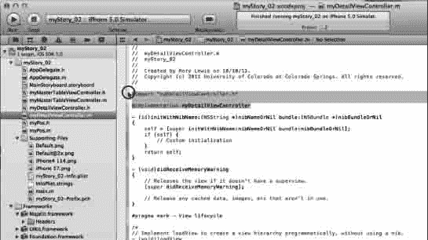

**图 10–33.** 打开 `myDetailViewController` 的实现文件。

33. 从全局概况可以看出，`myDetailViewController` 将包含大量代码，所以我们先从“07 Part 2myDetailViewController m”样板代码中的部分开始编写。打开文件，如图 10–33 所示。

a. 我们首先需要导入 `myPos.h` 文件，因为在设置缩放和放置大头针的代码时，我们会用到 `myPos` 标注的标题和坐标。

```objc
#import "MyPos.h"
```

b. 接着，我们需要通过前向声明将我们的视图配置为私有方法，这个方法稍后你会编写。你可以看看我注释 `// private method` 之前的代码来理解我的意思。我们正在声明 `configureView`。你现在看到它了吗？还没看到？那是因为我们还没编写它。但我们马上就会写。它之所以是私有的，是因为它以 `@interface [类的名称]` 开头，接着是 `()`，然后以 `@end` 结尾。

```objc
@interface myDetailViewController ()
- (void)configureView;  // private method
@end
```

c. 对于这个顶部区域，最后一步是合成属性。

```objc
@synthesize detailItem=_detailItem;
```

这就是“06 Part 2myDetailViewController h”文件中的所有代码，其内容应如下所示：

```objc
#import "myDetailViewController.h"
#import "myPos.h"

@interface myDetailViewController ()
- (void)configureView;  // private method
@end

@implementation myDetailViewController

@synthesize detailItem=_detailItem;
```

如果你在此时收到关于接口不完整的警告，请不要担心，我们马上就会处理它。但在继续之前，让我们再看看全局概况。可以看到，在步骤 33 中，我们刚刚完成了 2.2.2.2.1 到 2.2.2.2.3 的内容。在接下来的两步（34 和 35）中，我们将完成 2.2.2.2.4 到 2.2.2.2.5 的内容（即从“编写 `configureView` 方法”到“设置缩放和放置大头针”之间的所有步骤）。

**全局概况**

> 1.  用城市列表填充表格 (已完成)
> 2.  编写代码，使大头针落到所选城市地图的中心点
>     2.1. 添加 MapKit 框架
>     2.2. 编写代码
>     > 2.2.1. `myPos` 用于跟踪所选城市及其坐标
>     > 2.2.2. `myDetailViewController` 用于解析 Google 及其他数据
>     > 2.2.2.1. 编写头文件 (已完成)
>     > 2.2.2.2. 编写实现文件
>     > 2.2.2.2.1. 导入 `myPos` 头文件 (已完成)
>     > 2.2.2.2.2. 创建私有接口 (已完成)
>     > 2.2.2.2.3. 合成 `detailItem` (已完成)
>     > 2.2.2.2.4. 编写 `detailItem` 方法并更新其视图
>     > 2.2.2.2.5. 编写 `configureView` 方法
>     > 2.2.2.2.5.1. 访问 `googleapis.com`
>     > 2.2.2.2.5.2. 解析经度和纬度坐标
>     > 2.2.2.2.5.3. 更新详情项的用户界面
>     > 2.2.2.2.5.4. 设置缩放和放置大头针
>     > 2.2.3. `myMasterTableViewController` 用于控制到 MapKits 的转场
>     2.3. 微调 Storyboard 以适应我们的新代码

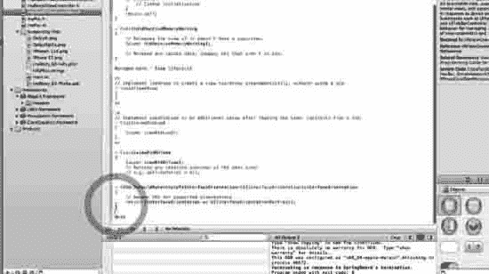

**图 10–34.** 将光标放置在 `@end` 和 `shouldAutorotate` 结束位置之间。

34. 现在我们要编写代码，以便访问 Google 服务器、获取数据并将其带回 iPhone 或 iPad。对于解析和其他繁重的代码，我喜欢将其插入到 `shouldAutorotateToInterfaceOrientation` 方法之后，当然，要在我所编写类的 `@end` 之前。在我们的例子中，虽然没有其他选择，但你会发现，在 `myMasterDetailViewController` 中插入转场方法时，它可能离代码底部很远。因此，请按图 10–34 所示和所指示的位置放置光标。


**图 10–35.** 我们来解析 Google 服务器。

35. 我不反对你将解析 Google 服务器的“08 Part 2myDetailViewController m”样板代码粘贴过来，因为我们大家都会反复使用它。我们大家都会在各种场合使用并微调它。如果你跳过了步骤 34 的说明，请确保你知道粘贴的位置。我也会讲解你需要了解并微调的关键部分。苹果公司很可能很快就会推出一个类或框架来实现这个功能，因为大家都用这个代码来解析服务器。将代码粘贴到正确的位置后，我们来过一遍。

a. 回到我们开始这最后一段代码的地方。我们首先需要导入 `myPos.h` 文件，因为在设置缩放和放置大头针的代码时，我们会用到 `myPos` 标注的标题和坐标。我们看到的第一个方法是 `setDetailItem`，如下所示。我们设置 `detailItem` 以便使用它，一旦它在本地存储，我们就会配置视图，换句话说，就是创建一个新的地图，当需要更改时，它会自动重绘。`configureView` 是 `myDetailViewController.m` 中接下来一个巨大的方法。

```objc
- (void)setDetailItem:(id)newDetailItem
{
    if (_detailItem != newDetailItem) {
        _detailItem = newDetailItem;

        // Update the view.
        [self configureView];
    }
}
```

b. 接下来我们研究的是 `configureView` 方法，它是一个实用方法，在内部调用。这是真正行动开始的地方。首先，让我们看看如何连接到服务器。我们访问 `mapURI` 关联的服务器，在这里就是 Google 的 API 地理编码服务 `maps.googleapis.com`。我们将向它请求一个城市，然后让代码处理其中的空格，无论是以空格还是“%20”表示的空格。


`NSString* mapURI =`
`@"http://maps.googleapis.com/maps/api/geocode/json?address=city&sensor=false";`
`mapURI = [mapURI stringByReplacingOccurrencesOfString:@"city"`
`withString:[self.detailItem description]];`
`NSURL* mapURL = [NSURL URLWithString:[mapURI`
`stringByReplacingOccurrencesOfString:@" " withString:@"%20"]];`

好了，你在上面看到我们已经告知服务器想要数据，但问题在于服务器如何将这些数据返回给我们。这时，我们将要用到的 `NSURL` 协议就会发挥作用，但我们必须通过调用 `connection` 来触发这些协议。

`NSURLConnection* connection = [NSURLConnection connectionWithRequest:[NSURLRequest`
`requestWithURL:mapURL] delegate:self];`
`if (connection)`
`locData = [NSMutableData data];`

这里你可以看到“connection”由三部分组成：

* `connection:(NSURLConnection *)connection didReceiveResponse`
* `connection:(NSURLConnection *)connection didReceiveData`
* `connectionDidFinishLoading:(NSURLConnection *)connection`

`connectionDidFinishLoading:(NSURLConnection *)connection` 是实际从谷歌服务器收集经纬度数据并存储的方法。

`- (void)connectionDidFinishLoading:(NSURLConnection *)connection {`

`NSRegularExpression* regex = [NSRegularExpression regularExpressionWithPattern:@"location.*?\\}"`
`options:NSRegularExpressionDotMatchesLineSeparators`
`error:nil];`
`NSString* dataString = [[NSString alloc]`
`initWithData:locData encoding:NSASCIIStringEncoding];`
`NSTextCheckingResult* locResult = [regex firstMatchInString:dataString`
`options:0 range:NSMakeRange(0, [dataString length])];`
`NSString* locString = [dataString substringWithRange:[locResult range]];`

`NSRange latRange = [locString rangeOfString:@"\"lat\" : "];`
`NSString* lat = [[[locString substringWithRange:NSMakeRange(latRange.location +`
`latRange.length, 20)] stringByReplacingOccurrencesOfString:@"," withString:@""]`
`stringByTrimmingCharactersInSet:[NSCharacterSet whitespaceAndNewlineCharacterSet]];`

`NSRange lngRange = [locString rangeOfString:@"\"lng\" : "];`
`NSString* lng = [[locString substringWithRange:NSMakeRange(lngRange.location +`
`lngRange.length, 20)]`
`stringByTrimmingCharactersInSet:[NSCharacterSet whitespaceAndNewlineCharacterSet]];`

`// setup zoom and pin drop stuff`
`[(MKMapView*)self.view setZoomEnabled:YES];`
`[(MKMapView*)self.view setScrollEnabled:YES];`
`MKCoordinateRegion region;`
`region.center.latitude = [lat floatValue];`
`region.center.longitude = [lng floatValue];`
`region.span.longitudeDelta = 0.01f;`
`region.span.latitudeDelta = 0.01f;`
`[(MKMapView*)self.view setRegion:region animated:YES];`

`MyPos* ann = [[MyPos alloc] init];`
`ann.title = [self.detailItem description];`
`ann.coordinate = region.center;`
`[(MKMapView*)self.view addAnnotation:ann];`
`}`

c. 由于我们还需要将地图委托作为一个协议来处理，因此还有一段代码需要在这里处理。这段代码大部分我们不会用到，但它确实能帮我们放置大头针。在课堂上，我会让学生们尝试更改动画、大头针颜色以及 `setTitle`。简而言之，我们把它直接放进去，就像你也会做的那样。我鼓励你也至少尝试修改 `pinView.pinColor = MKPinAnnotationColorRed`、`pinView.canShowCallout = YES` 和 `pinView.animatesDrop = YES`。

`(MKAnnotationView *)mapView:(MKMapView *)mV`
`viewForAnnotation:(id<MKAnnotation>)annotation {`
`MKPinAnnotationView *pinView = nil;`
`if(annotation != ((MKMapView*)self.view).userLocation) {`
`static NSString *defaultPinID = @"pinID";`
`pinView = (MKPinAnnotationView *)[(MKMapView*)self.view`
`dequeueReusableAnnotationViewWithIdentifier:defaultPinID];`
`if ( pinView == nil )`
`pinView = [[MKPinAnnotationView alloc] initWithAnnotation:annotation`
`reuseIdentifier:defaultPinID];`
`pinView.pinColor = MKPinAnnotationColorRed;`
`pinView.canShowCallout = YES;`
`pinView.animatesDrop = YES;`
`} else {`
`[((MKMapView*)self.view).userLocation setTitle:@"我在这里"];`
`}`
`return pinView;`
`}`

`@end`

但在这里我要强调的最重要一点是，如果你不知道每段代码的具体作用，千万不要惊慌。你并不需要了解汽车发动机的每一个部件才能开车。同理，你只要掌握上面这些内容，就已经足够知道如何连接服务器、解析你需要的数据，并按你的喜好添加动画效果。说得够多了。接受这一点，继续前进吧。如果在后续开发中你需要解析某个服务器，那就放心使用这些代码，摆弄摆弄，让它跑起来。

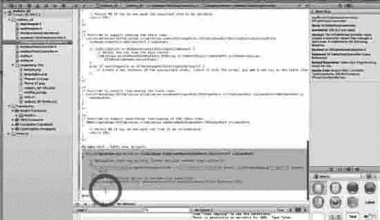
图 10-36。选中并删除 tableView 方法。

38. 好了，我们已经完成了 `myDetailViewController` 的处理，现在是时候对 `myMasterTableViewController` 做一些整理了。所以，打开它，向下滚动到 `myMasterTableViewController.m` 的底部，直到找到 `tableView` 方法。这里我想让你明白的是，这个方法正是我们在故事板出现之前用于表格视图委托的方法。问题在于我们现在使用了故事板，所以不再需要它了。全部选中它，如图 10-36 所示，然后注释掉或删除它。在视频中，我是直接删除的。


图 10-37。创建 prepareForSegue 方法。

37. 仍然在 `myMasterTableViewController` 的实现文件中，我们需要向前看，设想我们即将创建一个从表格指向 MapKit 的 segue，本质上它将取代我们刚刚删除的 `tableView` 方法。我们将需要一个方法来处理它。同样，你可以下载“09 Part 2myMasterTableViewController.m”模板文件，或者跟着我一起编码。转到 `shouldAutorotateToInterfaceOrientation` 方法的末尾，创建几个空行，然后开始编写或粘贴代码，并跟着做。

a. 首先要注意的是，我们在步骤 20 中已经导入了 `myDetailViewController.h` 文件。

b. 现在我们需要告诉 `myDetailViewController` 要显示哪个城市，我们通过以下代码实现：

`NSIndexPath *indexPath = [self.tableView indexPathForSelectedRow];`

c. 我们还需要确保，只有当我们确实要通过 segue 导航时，才向 `myDetailViewController` 发送信息。但问题是我们需要告诉编译器它需要关注的 segue 名称，而我们还没有给这个 segue 命名。所以，现在就给它起个名字吧！

d. 我们把它叫做 `ShowMapDetail`。我们还需要一段代码来检查这个 segue 是否正在被使用，然后，如果名为 `ShowMapDetail` 的 segue 确实在被使用，就执行相应操作。

e. 我们知道我们会跳转到一个 `detailViewController`，因此我们从当前选定的行中获取城市名称，因为用户刚刚点击了它。

f. 我们还创建并设置一个详细项目，即城市的详细信息，如下所示：

`- (void)prepareForSegue:(UIStoryboardSegue *)segue sender:(id)sender`
`{`
`// 确保这是指向详细视图的 segue`
`if ([[segue identifier] isEqualToString:@"ShowMapDetail"])`
`{`
`// 现在设置详细控制器以便其正常工作...`
`// 获取详细实例`
`MyDetailViewController* detail = [segue destinationViewController];`
`// 获取选定的行和其中的城市名称`
`NSIndexPath *indexPath = [self.tableView indexPathForSelectedRow];`
`// 将选中的城市告知详细视图`
`[detail setDetailItem:[cities objectAtIndex:indexPath.row]];`
`}`
`}`


### 调整故事板

我们现在已经编写或粘贴了所有必要的代码，用于解析谷歌服务器中我们在第 1 部分列表里填充的每个城市的地理空间信息；同时，我们也编写了通过一个尚不存在的 segue 将这些坐标路由到 MapKit 的代码，MapKit 会在所选城市的中心放置一个图钉。简而言之，我们需要一个能包含 MapKit 框架的容器。为此，我们将添加一个导航控制器和一个详细视图。我们需要创建一个新的视图控制器并将其拖到画布上，然后将主视图连接到详细视图，并在其导航中添加一个地图视图。从整体上看，扩展后的结构如下所示。

#### 整体概览：故事板调整扩展

> 1.  用城市列表填充表格（已完成）
> 2.  编写代码，在图钉落在所选城市地图的中心
>     2.1. 添加 MapKit 框架
>     2.2. 编写代码
>     2.3. 调整故事板以适配新代码
>     > 2.3.1. 添加导航控制器
>     > 2.3.2. 添加将包含 MapKit 框架的详细视图
>     > 2.3.3. 将视图控制器拖到画布上
>     > 2.3.4. 从主视图到详细视图添加 Push 转换——命名为“详细视图”
>     > 2.3.5. 向其导航添加地图视图：将地图视图拖到视图上方
>     > 2.3.6. 将地图视图与`myDetailViewController`的后台类关联
>     > 2.3.6.1. 在文档大纲的视图控制器场景中选择详细视图控制器
>     > 2.3.6.2. 在实用工具中选择标识检查器
>     > 2.3.6.3. 在自定义类中，转到类中的下拉菜单

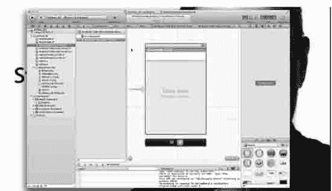  

图 10–38. 打开故事板进行最后的调整。

38. 说到这里，让我们打开故事板，如图 10–38 所示。

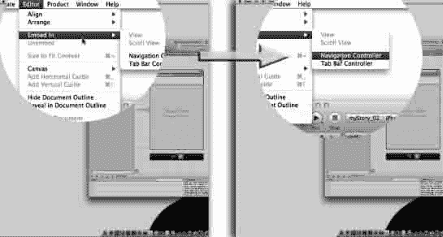  

图 10–39. 添加导航控制器。

39. 我们需要添加一个导航控制器，所以选择 Editor  Embed  Navigation Controller，如图 10–39 所示。

  

图 10–40. 新的导航控制器自动连接到表格视图。

40. 正如我们在图 10–40 中看到的，新的导航控制器自动连接到我们的表格视图。关闭导航器，在故事板上腾出一些空间。

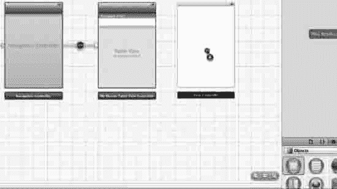  

图 10–41. 添加将包含 MapKit 框架的详细视图。

41. 缩小视图，以便你能看到更多画布。现在向左滚动，这样表格视图右侧就有一大片空白画布区域。然后抓取一个视图控制器并将其拖到表格视图右侧的画布上，如图 10–41 所示。

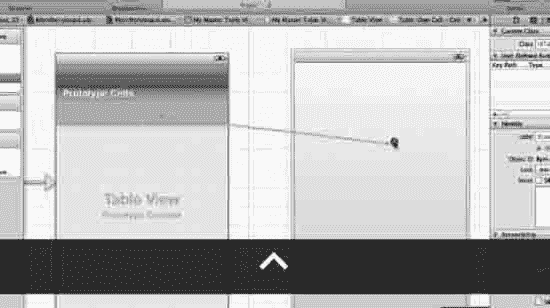  

图 10–42. 创建一个 segue。

42. 我们现在需要用 segue 连接主视图和详细视图——具体来说是使用 push。为此，我希望你选择主视图中的单元格，然后按住 control 键从该单元格拖向视图，如图 10–42 所示。

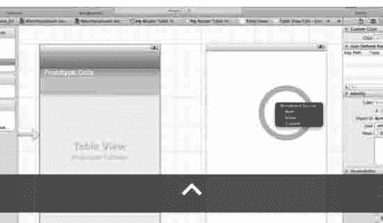  

图 10–43. 选择 Push。

43. 在你按住 control 键从单元格拖到视图后，你会看到一个下拉菜单，其中有三种 segue 连接选项：Push、Modal 和 Custom。我们选择 Push。这如图 10–43 所示。

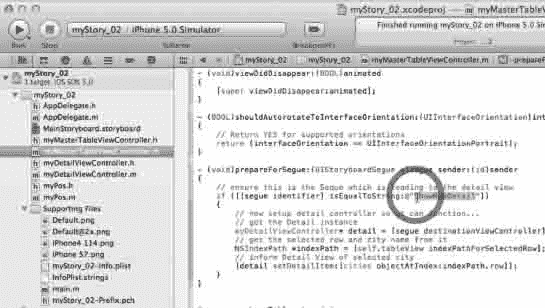  

图 10–44. 还记得我们给 segue 起的名字吗？

44. 我们现在需要为刚刚创建的 segue 指定我们在`myMasterTableViewController.m`类的`prepareForSegue:`方法中给出的名称。万一你忘了给它起的名字，或者即使你记得，也请回去复制一下 segue 的名字，这样你的大脑就能建立起连接。这如图 10–44 所示。

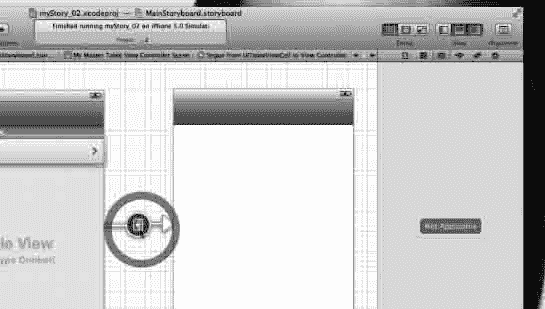  

图 10–45. 选择 segue。

45. 这听起来可能完全没有必要，但学生们在命名 segue 时经常遇到困难，因为他们忘了先选中它。我知道这是新知识，但令人惊讶的是很多人都忘了做这一步。因此，我特意花时间在书中加入了这张图。选择 segue，如图 10–45 所示，然后我们给它命名。

  

图 10–46. 将名称粘贴到标识符中。

46. 选中连接`UITableViewCell`和详细视图控制器的 segue 后，将名称粘贴到标识符框中，如图 10–46 所示。

  

图 10–47. 将地图视图拖到视图上。

47. 现在，地图能显示在视图上的所有连接都已就绪，除了……啊——地图视图！从库中抓取一个地图视图并将其拖到视图上，如图 10–47 所示。

  

图 10–48. 选择地图视图。

48. 我们现在需要将地图视图设为主视图。正如你在图 10–48 中看到的，视图位于地图视图之上。用技术术语来说，地图视图从属于视图，视图当前是主视图。还记得我说过视图层叠在一起可能会非常令人困惑吗？好吧，这就是我针对这一点使用三张图的原因。

  

图 10–49. 将地图视图拖到视图上方。

49. 此刻，我们刚才拖到视图上的地图视图是从属于视图的。为了让视图消失，并使地图视图成为主视图，请在文档大纲的视图控制器场景中选择视图控制器，然后将地图视图拖到视图之上，如图 10–49 所示。

  

图 10–50. 现在地图视图是主视图了。

50. 一旦地图视图位于视图之上，视图就会消失，地图视图将成为主视图。这一点至关重要，因为如果这一步不成功，其他所有工作都无法进行！确保你能掌握这一点。除非你的屏幕看起来像图 10–50 中的屏幕，否则不要继续。

  

图 10–51. 将地图视图与你的`myDetailViewController`关联。

51. 还记得你在`myDetailViewController.m`中做的大量工作吗？好吧，所有这些都必须在刚刚创建的地图视图之下工作。在文档大纲的视图控制器场景中选择详细视图控制器。在实用工具中选择标识检查器。然后在自定义类中，转到类中的下拉菜单，选择`myDetailViewController`，如图 10–51 所示。

  

图 10–52. 运行它。

52. 运行它。

  

图 10–53. 启动画面转到表格视图，然后选择城市德班。

53. 是的，很漂亮，不是吗？所有那些辛苦的工作？启动画面出现，然后我们看到填充了城市的表格，但现在我们看到每个单元格右侧漂亮的小箭头，它们提示我们，如果点击单元格，会发生很酷的事情。我们点击单元格，它就会通过 segue 进入一个地图视图，如图 10–54 右侧图所示。

  

图 10–54. 图钉落下，标注正常工作。

54. 恭喜你。我要求你作为练习做的一件事是：将导航栏命名为“详细视图”，并将表格视图的导航栏命名为“主视图”。回到图 10–47 中的位置，只需双击导航栏中央附近，然后随意命名即可。我之所以忽略这一步，是因为学生们经常认为我们给导航栏起的名字实际上会对代码产生影响。我见过不少学生为了调试代码而更改导航栏上的名称。省略这些名称可以向你展示这些名称完全没有任何影响。

这两个系列的内容非常长。除了代码之外，没有什么我想给你看的东西了。事实上，有好几次我们已经超出了“初学者”的范围，更别说是绝对的初学者了。因此，我们不会比已经完成的代码再深入挖掘更多了。现在休息一下，放松，并沉浸在满足感中吧！


