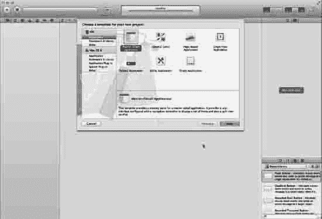
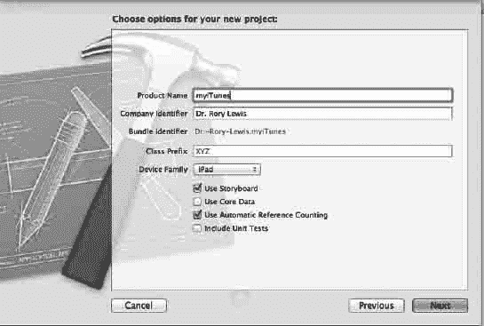
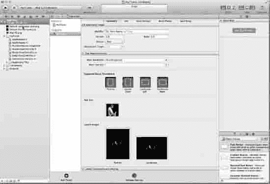
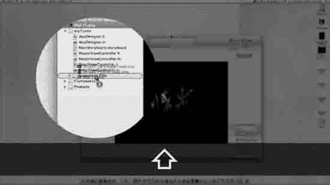
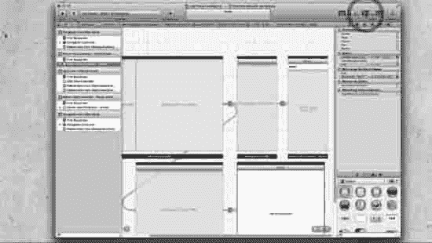
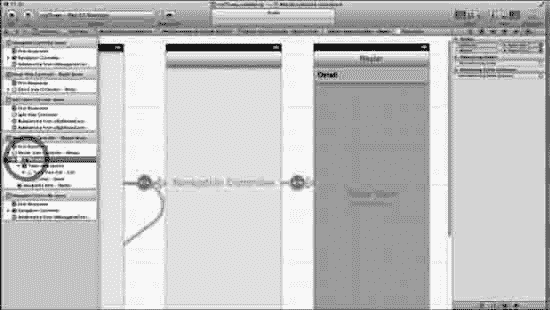
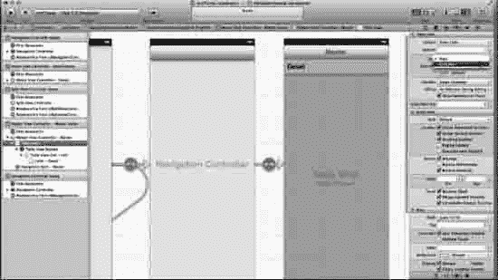
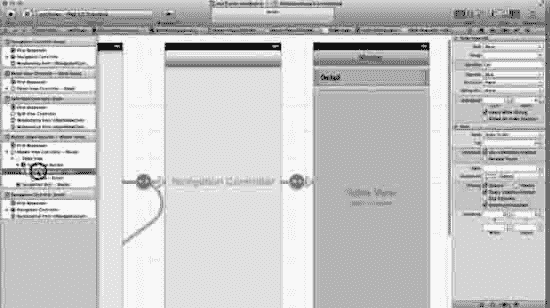
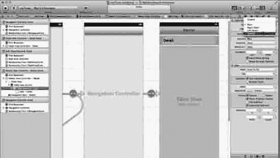

# 第 11 章

## 从故事板到多媒体平台

这是本书的最后一章，我期待已久。可以说，这是整个学习的压轴应用。这个应用将教你如何将你的餐厅、企业或任何你喜欢的内容推广到各种多媒体平台。我选择推广一支乐队作为示例，因为它涉及`iTunes`，而我的许多学生都对`iTunes`感到棘手。我们将在这里彻底解决这个问题。在课堂上，我首先带领学生们浏览这个应用，让他们想象自己身处遥远的时空，发现了一支名为“披头士”的乐队。然后，他们将通过网络、`YouTube`和`iTunes`推广这支乐队。在项目的后半部分，学生们需要创建自己的企业，并以类似但更具创意的方式进行推广。

遗憾的是，由于版权问题，未经披头士授权，本书中不允许展示披头士的照片。因此，我创建了一些虚拟网站，上面有我弹吉他的照片，以及存放我多年前（1997 年）歌曲的`iTunes`页面。我将指导你获取披头士的 URL（公共领域资源），并教会你如何构建网站（首先像我在课堂上那样为披头士制作网站），然后再教你如何寻找其他乐队或其他类型的媒体来进行模拟推广。希望你能拥有自己的企业，比如餐厅、珠饰店、咨询服务机构等，然后为它制作一个推广应用，并上传到`iTunes`商店，供人们免费下载。

这是如何运作的呢？还记得在图 1-21 中，我解释了如何通过互联网上的应用程序赚钱的具体流程吗？现在，我在这里教你的是如何推广你的业务并配置你的应用，可能一开始是免费的。假设你经营一家保姆服务公司。学会管理披头士网站后，你可以为保姆公司制作一个应用，并上传到应用商店供免费下载。过去，我们发放名片；现在，我们发放应用。你可以让潜在客户知道，他们可以免费下载你保姆公司的应用，并通过一个限时有效的密码（仅对潜在客户开放），随时通过实时网络摄像头查看他们的孩子。他们可以看到你的员工正在照顾的其他孩子。他们还可以通过你的应用获取雪天停课通知、生日提醒，并在线支付账单。通过口口相传，这些家长会告诉其他家长你的服务有多棒，而这仅仅是因为你的应用既方便又酷炫。

这同样适用于其他企业；你只需要发挥创意。创新是你的职责，但嘿！能购买这本书本身就说明你极具创新精神，而如果你还在阅读，说明你已经深入“极客”领域，所以我完全相信你拥有为自己的企业、他人的企业或你个人制作出色应用所需的一切。你唯一需要的是技术知识，而我将在这里、现在教会你这些，我们开始吧！

### `myiTunes`：一个主从应用

`myiTunes`基于一种创建故事板应用时较具挑战性的方法：主从应用（Master-Detail Application）。然而，主从应用赋予了`iPad` `iOS 5`的分割视图（split view）和弹出视图（popover）与出色的故事板技术相结合的能力。更有甚者，如果这还不够，我们还融入了访问`iTunes`、`Facebook`、`Google+`、包含视频的页面，当然还有两个带有酷炫图标的 iPad 启动屏的能力。所有这些组合起来，构成一个美观且可推广的应用，随时准备将你、你的企业或他人的业务推向新的高度——声名远扬！

`iTunes`在访问其音乐商店方面存在一些有争议、古怪且不太用户友好的方式。我将一步步讲解，包括如何查找乐队、视频和播客。还有一些其他的多媒体平台，我没有在示例中涵盖，因为那会显得过载，但我会向你准确展示如何将你的媒体从图像转换为视频等等。我还会包含访问这些其他媒体形式的代码以及你下载的样板代码。因此，即使我们并未在样板中使用所有这些类型的媒体，它们依然可供你按需选用。

在继续之前，有一点术语需要说明：我们将在本应用中讨论分割视图和弹出视图。这些是超酷的表格和下拉菜单，它们会根据你握持 iPad 的方式，为用户调用一个表格。分割视图并排显示两个面板。在横屏模式下，主视图宽度为 320 像素。然而，当切换到竖屏方向时，分割视图会以弹出视图的形式出现，看起来像是覆盖在现有视图之上。它就像一个下拉菜单，悬浮在底层内容之上（参见图 11–25）。它的工作方式不可能像对话框或普通下拉菜单那样。最近有个学生问我：“刘易斯博士，我们能给弹出视图‘整容’吗？”嗯……不行！你不能随意调整、美化或更改太多内容。但问题在于你是否想这么做，答案很可能是‘不想’。弹出视图精妙、优雅，并且向用户表明，你这位开发者编写的程序非常出色！

那么，我们开始进行准备工作，以便着手构建应用。

#### 准备工作

本章的下载文件在性质上与第 10 章的样板文件和图像类似。不过，如前所述，我包含了我们在本应用中不会用到但你可以自行创建应用时可能需要的代码（使用替代或附加媒体）。这些代码全部可供你使用。在视频和代码中，有大量我预先编写好的代码。然而，我将在本章中对所有内容进行详尽解释，因此我建议你尝试自己编写所有代码。如果一段时间后你发现确实需要使用样板代码，那就用吧，但请先尝试独立完成。如果不得不使用样板代码，那么在成功运行样板代码后，请逐行手动输入代码。如果你仍然无法使其正常运行，即使使用了样板代码，那么请下载我精确的`Xcode`文件，让我的代码运行起来，然后看看你具体遗漏了什么地方。

这些下载文件可以在[`http://bit.ly/sL26vN`](http://bit.ly/sL26vN)找到。我在视频中编程的示例代码可以在这里下载：[`http://bit.ly/uN1uV1`](http://bit.ly/uN1uV1)。要观看本章练习的录屏，请访问[`http://bit.ly/tPatpA`](http://bit.ly/tPatpA)。如果你需要更多帮助，请访问论坛[`http://bit.ly/oLVwpY`](http://bit.ly/oLVwpY)。

**全盘概览**

> 正如我们在第 10 章开始编写更大规模代码时所做的那样，我们将使用带有多个视图的“全盘概览”方法。首先，我们将从“30,000”英尺的高度审视代码，对我们所处的整体格局有一个非常宽泛的宏观理解。然后，随着我们逐步深入，我们将始终牢记这个全盘概览。
> 
> 1.  在故事板中设置弹出视图
> 2.  编写与多媒体平台交互的代码
> 3.  调整弹出视图以正确抓取平台

#### 新的主从模板

> 

图 11–1：选择主从应用程序图标，然后按回车或下一步。

1. 我们将使用主从应用程序。因此，打开 Xcode 并输入 `N`，如图 11–1 所示。选择主从应用程序后，按回车键。

图 11–2：将你的应用命名为 `myiTunes`，确保启用了 Storyboard 和自动引用计数。

2. 为了尽可能紧跟我的步骤，请将应用命名为“myiTunes”，选择“iPad”，勾选“使用 Storyboard”和“使用自动引用计数”，但保持“类前缀”和“包含单元测试”不勾选，如图 11–2 所示。

#### 导入图片！

图 11–3：拖入你的图形资源。

3. 正如我们在 `myStory_01` 中所做的那样，先访问我的网站 [`http://bit.ly/uN1uV1`](http://bit.ly/uN1uV1) 并将图片和样板代码下载到桌面，然后将 72 × 72 px 的 iPad 图标（iPad 72）拖入 App Icon 框，将 769 × 1004 px 的 Default-Portrait iPad 启动画面拖入 Launch Images Landscape 框，并将 1024 × 748 px 的 Default-Landscape iPad 启动画面拖入 Launch Images Portrait 框，如图 11–3 所示。

图 11–4：将图片拖入 Supporting Files 文件夹。

4. 因为我们总是希望保持内容整洁、有序且放在正确的位置，所以你会注意到，刚才拖入 Xcode 的图片文件位于根目录中。我们需要将它们拖入正确的位置：Supporting Files 文件夹。如图 11–4 所示。

#### 在 Storyboard 中组织弹出窗口

我们要做的第一件事是在 storyboard 中设置弹出窗口。我会尽量发挥创意和艺术性，但不会过度添加花哨的弹出窗口装饰，因为我不想偏离我的两个目标：教你设置 storyboard 以及教你编写 storyboard 背后的代码。不过，一旦你完成这个项目，你就打开了通往所有房间的大门，日后可以在其中自行尝试。但现在，我们先保持简洁。

图 11–5：选择 Storyboard 并关闭导航器。

5. 选择 `MainStoryboard.storyboard` 并关闭导航器，如图 11–5 所示。

图 11–6：此处我们不需要视图控制器。

6. 在深入之前，我希望你看看图 11–14，并观察左侧边栏中“文档大纲”（位于“主视图控制器 - 主场景”框内）里所有的表格视图及其层级。比较一下它和我们主视图控制器 - 主场景中孤立的表格视图的内容丰富程度。这可是一大堆工作。

有两种方法可以用你想要的内容填充这些表格视图：一种是“冗长乏味”的方式，另一种是“有序且高效”的方式。我们提前规划，遵循一个简单的规则：

先创建一个包含所有子属性的表格视图。然后，一旦你按照自己的需求精确完成了这一个，就复制整个集合。

我们选择默认的视图控制器是因为我们需要删除它。从整体来看，我们将创建一个完全符合我们需求的组，如“整体视图”中的 1.1 所示。

所以，请打开文档大纲，并在我的“主视图控制器 - 主场景”中选择表格视图，如图 11–6 所示。

##### 整体视图

> 1. 在 storyboard 中设置弹出窗口
>    
>    1.1. 创建一个组
>    
>    > 1.1.1. 设置组中每个表格视图单元格的属性
>    
>    1.2. 根据需要复制该组
>    
>    1.3. 标记所有单元格
> 
> 2. 编写代码以对接多媒体平台
> 3. 调整弹出窗口以正确抓取平台

图 11–7：创建一组分组样式的静态单元格。

7. 打开“工具”面板中的“属性检查器”，然后向下滚动，确保从“内容”下拉菜单中选择“静态单元格”。接着选择“分组”样式，以便为标题留出间隔空间，如图 11–7 所示。

图 11–8：选择表格视图单元格 - 单元格

8. 这一步看似简单但容易出错，因此请注意这个非常简单的步骤：返回文档大纲，在你的“主视图控制器 – 主场景”中，从刚才操作的表格视图向下深入两个层级。如图 11–8 所示，你现在应该位于“表格视图单元格—单元格”。如果你选错了层级，等你发现时可能已经迷失方向了。

图 11–9：为每个表格视图单元格创建副标题。

9. 我们希望在每个表格视图单元格中创建副标题，因为它们能告诉我们——更重要的是告诉用户——如果选择这个选项，将会看到什么或跳转到何处。因此，返回工具面板中的属性检查器，然后向下滚动并从“样式”中选择“副标题”，如图 11–9 所示。

