# 排版后的内容

**注意：** 当我们首次来到这里设置单元格时，请注意，当你再次回到这里时，可以使用许多有趣且精彩的小技巧。我提到过，我们将打开通往各种设施齐全的房间的“门”。这就是其中之一！在我们探索这些不同房间的过程中，请继续四处看看。

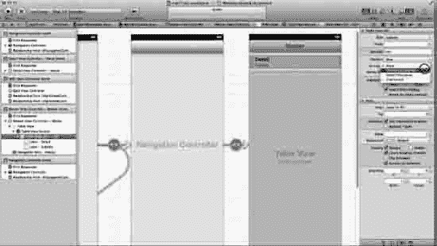

**图 11–10.** 为每个表格视图单元格创建披露指示器 – 单元格。

10. 观察图 11–10，我们现在可以看到，在我们单元格的“详细信息”下方，有一个“副标题”。这正是我们想要的。现在，既然我们在这里，为什么不也添加“>”披露指示器，让用户在选中某个特定单元格时，能感知他们将要前往的方向呢？是的，这是个好主意！前往你刚才所在的“样式”部分下方的“附件”部分，并选择“披露指示器”，如图 11–10 所示。

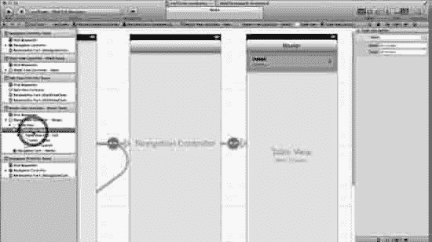

**图 11–11.** 向上返回一级到“表格视图分区”。

11. 啊……看看我们刚刚在图 11–11 中创建的漂亮的“披露”和“副标题”。真漂亮！在我们过于沉浸之前，请查看“大图”，看看我们即将开始设置“表格视图分区”（1.1.2）。返回到“文档大纲”并选择“表格视图分区”，如图 11–11 所示。

**大图**

> 1. 在故事板中设置弹出视图
>     
>     1.1. 创建一个组
>     
>      
>     
>     > 1.1.1. 设置组中每个表格视图单元格的属性 – 单元格
>     
>      
>     
>     > 1.1.1.1. 静态单元格、分组样式、副标题和披露指示器
>     
>      
>     
>     > 1.1.2. 设置表格视图分区
>     
>      
>     
>     > 1.1.2.2. 创建一个标题并创建 2 行
>     
>      
>     
>     1.2. 根据需要复制该组
>     
>      
>     
>     > 1.2.1. 前往主场景并创建 4 个分区
>     
>      
>     
>     1.3. 标记所有单元格
>     
>      
> 2. 编写与多媒体平台交互的代码
> 3. 调整弹出视图以正确抓取平台

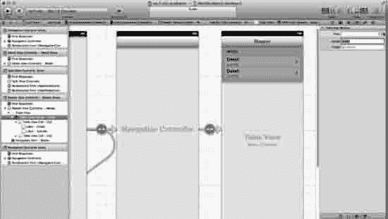

**图 11–12.** 将第一个组命名为“艺术家”并创建两行。

12. 请记住，我们还没有标记任何表格视图单元格——即单元格。我仅在“大图”的第 1.3 步中这样做，这也是最后一步，原因有二。首先，这很耗时；其次，我们将会更改它们。然而，在这种情况下，我们需要前往“属性检查器”中的“标题”区域，并简单地给它一个“虚拟”标签，这样当我们在复制这些单元格时，就总有一些东西可供编辑。所以，继续用我们第一个组的名称（即“艺术家”）来标记这个组。然后，创建 2 行，如图 11–12 所示，因为每个组中只有两行单元格。你可能想要更多行。你应该始终倾向于创建更多的单元格，因为你可以非常轻松地删除它们；但如果需要重新创建单元格，你往往需要花费时间进行格式化。

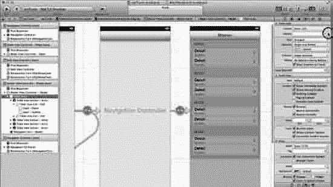

**图 11–13.** 现在我们才创建所有分区。

13. 我们已经按照需求创建好了一个组。所以现在返回我们开始的原始表格视图，并创建 4 个分区，如图 11–13 所示。

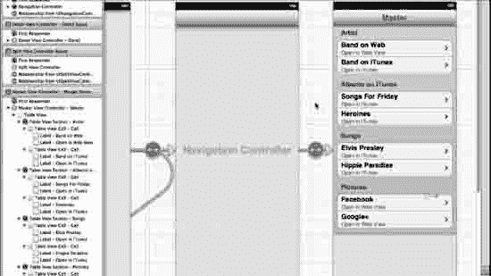

**图 11–14.** 命名单元格和标题。

14. 当然，当你创建自己的项目时，做法会有所不同，但现在让我们命名我们的四个组：`Artists`、`Albums on iTunes`、`Songs` 和 `Pictures`。这 4 个组将有助于我们“乐队”（稍后编写代码时，我会提供披头士乐队的链接）在互联网和 iTunes 上的呈现，旗下包含 `Artists`，然后是 `Albums`。对于披头士来说，会有很多专辑。在我们的示例中，我们只使用 2 张，对于 `Songs` 和 `Pictures` 也是如此。请注意，在副标题中，有些告诉用户他们将前往 iTunes，有些则告诉用户他们将前往互联网。按照图 11–14 所示命名所有单元格。请记住，你可以直接双击单元格来创建名称。


#### 编写 myiTunes 应用

我希望让这一切保持非常简单！在编写代码时，我们将完成两大任务：首先创建代码，将每个单元格被按下时我们想要触发的操作连接起来；其次，确保我们的视图与 WebView 正确连接。

### 总体概览

> 1.  在故事板中设置弹出视图
> 2.  编写与多媒体平台交互的代码
>     
>     2.1. `MasterViewController`
>     
>     > 2.1.1. 为每个被选中的单元格编写代码
>     
>     2.2. `DetailViewController`
>     
>     > 2.2.1. 将视图与 WebView 连接
>     
> 3.  调整弹出视图以正确获取平台信息

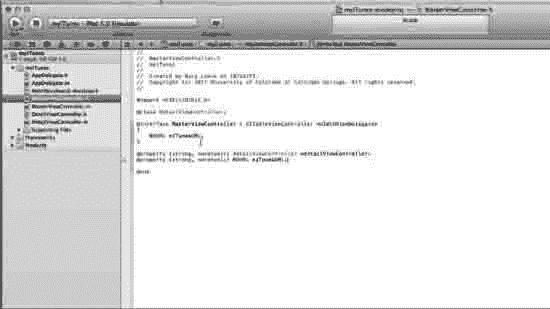

**图 11–15.** 创建一个连接到 iTunes 的 `NSURL`。

15. 我们先从 `MasterViewController` 开始，因此请确保头文件允许我们在实现文件中执行所有需要的操作。保存所有内容，关闭工具区，打开导航器，然后打开 `MasterViewController.h`。我们首先创建一个连接到 iTunes 的 `NSURL`。我将这个指针命名为 `iTunesURL`，如图 11–22 所示。在我们直接声明 `NSURL *iTunesURL` 之前，需要引入一个协议来定义这个方法。具体来说，我们需要定义一个方法，该方法将委托或提供所有必要的资源给 `UIWebView` 对象，由其处理我们想要加载的 iTunes 网页内容。正如我们在 `myStory_02` 中所做的那样，我们将使用 `UIWebViewDelegate` 协议参考 `<UIWebViewDelegate>`。请务必也创建如下所示的 `@property`。

```
#import<UIKit/UIKit.h>
@classmyDetailViewController;
@interfacemyMasterViewController : UITableViewController<UIWebViewDelegate>
{
    NSURL *iTunesURL;
}

@property (strong, nonatomic) myDetailViewController *detailViewController;
@property (strong, nonatomic) NSURL *iTunesURL;
@end
```

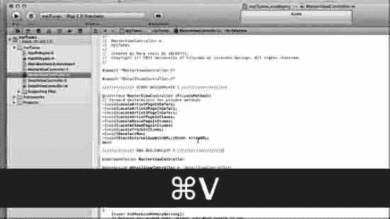

**图 11–16.** 粘贴第一个样板代码。

16. 打开 `MasterViewController` 的实现文件，然后选中第一个样板文件（`Boilerplate 01`）的全部内容。接着，将其粘贴到 `#import "myDetailViewController.h"` 行和 `@implementation MasterViewController` 行之间，如图 11–16 所示。这段代码只是我编写的私有方法的前向声明，用于适配本应用以及你后续在其它应用中可能用到的各种媒体类型。具体有以下 3 个：

a. `LocateArtistPageInSafari`

b. `LocateArtistPageInItunes`、`LocateMoviePageInItunes`（虽然我们未使用此方法，但我觉得你可能希望掌握它）以及

c. `StartExternalAppWithURL:(NSURL *)theURL`。

粘贴完第一个样板代码后，效果应如下所示：

```
#import "MasterViewController.h"
#import "myDetailViewController.h"
////////////// 开始 样板代码 1 ////////////////////
@interfaceMasterViewController (PrivateMethods)
// 私有方法的前向声明
-(void)LocateArtistPageInSafari;
-(void)LocateArtist2PageInSafari;
-(void)LocateArtist3PageInSafari;
-(void)LocateArtistPageInItunes;
-(void)LocateMoviePageInItunes;
-(void)LocateAlbumPageInItunes;
-(void)LocateTrackInItunes;
-(void)DeselectRow;
-(void)StartExternalAppWithURL:(NSURL *)theURL;
@end

////////////// 结束 样板代码 1 ////////////////////
@implementationmyMasterViewController
@synthesizedetailViewController = _detailViewController;
```

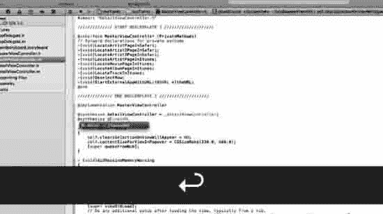

**图 11–17.** 合成 `iTunesURL`。

17. 我们不能只关注头文件中的协议，而忘记合成我们在头文件中设置的 `iTunesURL`。这一点在图 11–23 及下方展示。

```
////////////// 结束 样板代码 1 ////////////////////
@implementationMasterViewController
@synthesizedetailViewController = _detailViewController;
@synthesizeiTunesURL;
- (void)awakeFromNib
{
    self.clearsSelectionOnViewWillAppear = NO;
    self.contentSizeForViewInPopover = CGSizeMake(320.0, 600.0);
    [superawakeFromNib];
}
```

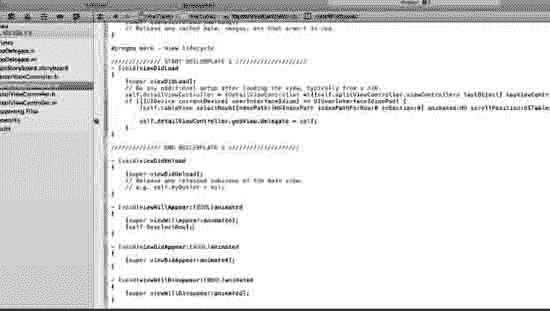

**图 11–18.** 插入样板代码 2。

18. Master-Detail 默认实例化自带的 `viewDidLoad` 并不完全符合我们的需求。有两种方法可以实现，我偏好第一种，即自行编写代码。这里你将看到为什么我们需要对它进行补充。如果你觉得压力太大，那也没关系。请坚持住，让我仔细说明如何调整 `viewDidLoad`。之后，我们将展示如何使用样板代码。如你所知，灰色字体的代码是自动实例化的。本质上我添加了一个“If”语句。嗯……这个 `if` 语句在做什么呢？我们只是在此声明，这段代码是 iPad 专用的，并确保当前设备上使用的界面是正确的。

```
- (void)viewDidLoad
{
    [superviewDidLoad];
        // 在此处添加任何额外的视图加载后设置，通常从 nib 文件加载。
    self.detailViewController = (DetailViewController
*)[[self.splitViewController.viewControllerslastObject] topViewController];
if ([[UIDevicecurrentDevice] userInterfaceIdiom] == UIUserInterfaceIdiomPad) {
        [self.tableViewselectRowAtIndexPath:[NSIndexPath indexPathForRow:0 inSection:0]
animated:NOscrollPosition:UITableViewScrollPositionMiddle];
        self.detailViewController.webView.delegate = self;
}
}
```

现在，对于更倾向于粘贴样板代码的人来说，请打开样板代码 02 并全选。然后选中 `viewDidLoad` 的全部内容，并将其覆盖粘贴，使其看起来类似于图 11–18 及下方所示：

```
- (void)didReceiveMemoryWarning
{
    [superdidReceiveMemoryWarning];
    // 释放所有未使用的缓存数据、图像等。
}

#pragma mark - 视图生命周期
////////////// 开始 样板代码 2 ////////////////////
- (void)viewDidLoad
{
[superviewDidLoad];
// 在此处添加任何额外的视图加载后设置，通常从 nib 文件加载。
self.detailViewController = (DetailViewController
*)[[self.splitViewController.viewControllerslastObject] topViewController];
if ([[UIDevicecurrentDevice] userInterfaceIdiom] == UIUserInterfaceIdiomPad) {
[self.tableViewselectRowAtIndexPath:[NSIndexPath indexPathForRow:0 inSection:0]
animated:NOscrollPosition:UITableViewScrollPositionMiddle];
self.detailViewController.webView.delegate = self;
}
}

////////////// 结束 样板代码 2 ////////////////////
- (void)viewDidUnload
{
    [superviewDidUnload];
    // 释放主视图中保留的所有子视图。
    // 例如：self.myOutlet = nil;
```

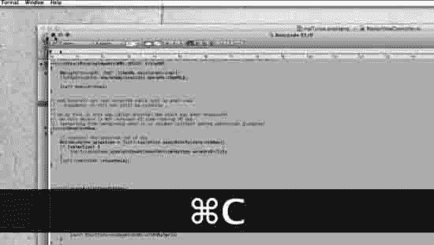

**图 11–19.** 样板代码 3

19. 现在我们需要删除从 `shouldAutorotateToInterfaceOrientation` 到 `@end` 之间的所有内容。删除后，选中样板代码 3 的全部内容，如图 11–19 所示，并将其粘贴到该位置。这段代码是核心所在，让我们来仔细看一下。首先回顾一下总体概览，确认我们已经完成了 2.1.1.1 至 2.1.1.2 部分。我们需要确保应用无论 iPad 朝向如何（横屏时的分视图，竖屏时的弹出视图）都能正常运行，并且针对单元格被选中的情况触发一系列事件。我们有八个单元格，因此会有从 0 到 7 共八个 case。然后，我们将编写私有方法来处理特殊情况。


#### 注意

由于我们是先编写 `MasterViewController` 的代码，此时 Xcode 会给出一些警告和错误标记。请暂时忽略它们。

#### 全景概览

> 1.  在故事板中设置弹出框
> 2.  编写与多媒体平台的交互代码
>     
>     2.1\. 主视图控制器
>     
>     > 2.1.1\. 为每个被选中的单元格编写代码
>     > 
>     > 2.1.1.1\. 头文件内容
>     > 
>     > 2.1.1.2\. viewDidLoad
>     > 
>     > 2.1.1.3\. 设置方向
>     > 
>     > 2.1.1.4\. Case 语句
>     > 
>     > 2.1.1.5\. 私有方法
>     
>     2.2\. 详情视图控制器
>     
>     > 2.2.1\. 将视图连接到 WebView
> 
> 3.  调整弹出框以正确获取平台信息

原始的 `shouldAutorotateToInterfaceOrientation` 方法如下方灰色所示，我们仅当设备为 iPad 时才会使用它。

```objc
- (BOOL)shouldAutorotateToInterfaceOrientation:(UIInterfaceOrientation)interfaceOrientation
{
    // 返回支持的方向
    if ([[UIDevice currentDevice] userInterfaceIdiom] == UIUserInterfaceIdiomPhone) {
        return (interfaceOrientation != UIInterfaceOrientationPortraitUpsideDown);
    } else {
        return YES;
    }
}
```

现在我们需要做几件事。我们需要将分区和行号从线性索引转换为从上到下计数的行号。对于正在仔细查看每一行代码的读者，我需要指出，接下来的两行代码假设第一个分区有 2 行，而其他分区都只有 1 行。

```objc
NSInteger nSelectedRowIdx = (indexPath.section > 0) ? indexPath.section+1 : 0;
// 现在值为 0,2,3,4
nSelectedRowIdx += indexPath.row;
// 现在值为 0,1,2,3,4
```

如果你确信这样能将每个 case 与特定行（每个单元格的顶行）对应起来，那也没问题。每次这样做时，直接使用就好。实际上，只需粘贴进去，然后修改下面的 `case` 语句即可。

```objc
- (void)tableView:(UITableView *)tableView didSelectRowAtIndexPath:(NSIndexPath *)indexPath
{
    NSInteger nSelectedRowIdx = indexPath.section *2 + indexPath.row;
    switch (nSelectedRowIdx) {
```

现在我们需要编写 `case` 语句，它们将映射到我们已经按顺序排列好的行。我们有四个分区：ARTIST（艺人）、ALBUMS IN ITUNES（iTunes 中的专辑）、SONGS（歌曲）和 PICTURES（图片）。每个分区内我们需要两个称为 case 的选择项，所以让我们先在“全景概览”中规划一下。

#### 全景概览

> 1.  在故事板中设置弹出框
> 2.  编写与多媒体平台的交互代码
>     
>     2.1\. 主视图控制器
>     
>     > 2.1.1\. 为每个被选中的单元格编写代码
>     > 
>     > 2.1.1.1\. 头文件内容
>     > 
>     > 2.1.1.2\. viewDidLoad
>     > 
>     > 2.1.1.3\. 设置方向
>     > 
>     > 2.1.1.4\. Case 语句
>     > 
>     > 2.1.1.4.1\. ARTISTS（艺人）
>     > 
>     > 2.1.1.4.1.1\. Case 0
>     > 
>     > 2.1.1.4.1.2\. Case 1
>     > 
>     > 2.1.1.4.2\. ALBUMS（专辑）
>     > 
>     > 2.1.1.4.2.1\. Case 2
>     > 
>     > 2.1.1.4.2.2\. Case 3
>     > 
>     > 2.1.1.4.3\. SONGS（歌曲）
>     > 
>     > 2.1.1.4.3.1\. Case 4
>     > 
>     > 2.1.1.4.3.2\. Case 5
>     > 
>     > 2.1.1.4.4\. PICTURES（图片）
>     > 
>     > 2.1.1.4.4.1\. Case 6
>     > 
>     > 2.1.1.4.4.2\. Case 7
>     > 
>     > 2.1.1.5\. 私有方法（用于在将重定向传递给应用打开之前处理重定向的辅助例程）
>     > 
>     > 2.1.1.5.1.
>     
>     2.1\. 详情视图控制器
>     
>     > 2.2.1\. 将视图连接到 WebView
> 
> 3.  调整弹出框以正确获取平台信息

因此，对应的代码如下：

```objc
        case 0: // 在 Safari 中打开（艺人）
            [self LocateArtistPageInSafari];
            break;

        case 1: // 在 iTunes 中打开（艺人）
            //[self LocateArtistPageInItunes];
        {
            NSURL *urlInItunes = [NSURL URLWithString:@"http://itunes.apple.com/us/artist/rory-lewis/id65902515?uo=4"];
            [self StartExternalAppWithURL:urlInItunes];
        }
            break;
        case 2: // 在 iTunes 中打开（歌曲）
                     //[self LocateArtistPageInItunes];
        {
            NSURL *urlInItunes = [NSURL URLWithString:@"http://itunes.apple.com/us/album/songs-for-friday/id408548641?uo=4"];
            [self StartExternalAppWithURL:urlInItunes];
        }
            break;
        case 3: // 在 iTunes 中打开（歌曲）
            //[self LocateArtistPageInItunes];
        {
            NSURL *urlInItunes = [NSURL URLWithString:@"http://itunes.apple.com/us/album/heroines/id461113548?uo=4"];
            [self StartExternalAppWithURL:urlInItunes];
        }
            break;
        case 4: // 在 iTunes 中打开（歌曲）
            //[self LocateArtistPageInItunes];
        {
            NSURL *urlInItunes = [NSURL URLWithString:@"http://itunes.apple.com/us/album/elvis-presley/id461113548?i=461113566&uo=4"];
            [self StartExternalAppWithURL:urlInItunes];
        }
            break;
        case 5: // 在 iTunes 中打开（歌曲）
            //[self LocateArtistPageInItunes];
        {
            NSURL *urlInItunes = [NSURL URLWithString:@"http://itunes.apple.com/us/album/hippie-paradise/id408548641?i=408549591&uo=4"];
            [self StartExternalAppWithURL:urlInItunes];
        }
            break;
        case 6: // 在 Safari 中打开（艺人）
            [self LocateArtist2PageInSafari];
            break;

        case 7: // 在 Safari 中打开（艺人）
            [self LocateArtist3PageInSafari];
            break;

    }

    //[self DeselectRow];
}
```

现在我们需要创建辅助例程，以便在将重定向传递给打开的应用程序之前处理它们。具体来说，我们需要处理 `LinkShare/TradeDoubler/DGM` 类型的 URL，将其转换成 iPhone 能够处理的格式——如果你打算自己编写一个包含 iPhone 支持的通用应用的话。更多信息请访问 [`http://developer.apple.com/library/ios/#qa/qa1629/_index.htm`](http://developer.apple.com/library/ios/#qa/qa1629/_index.htm)。

```objc
- (void)openReferralURL:(NSURL *)referralURL {
    //NSURLConnection *connection =
    (void)[[NSURLConnection alloc] initWithRequest:[NSURLRequest requestWithURL:referralURL] delegate:self startImmediately:YES];
}
```

现在，出于安全考虑，我们保存最近的 URL（以防发生多次重定向）。请注意，`iTunesURL` 是本类声明中的一个 `NSURL` 属性：

```objc
- (NSURLRequest *)connection:(NSURLConnection *)connection willSendRequest:(NSURLRequest *)request redirectResponse:(NSURLResponse *)response {
    self.iTunesURL = [response URL];
    NSLog(@"RxURL [%@]",[self.iTunesURL absoluteString]);
    return request;
}
```

好了，不再有重定向了。所以我们使用最后保存的那个 URL：

```objc
- (void)connectionDidFinishLoading:(NSURLConnection *)connection {
    [self StartExternalAppWithURL:self.iTunesURL];
}
```

这有点技术性，但我们需要使用 iTMS 链接（一种用于 iTunes 链接和 URL 的特殊 URL/链接协议）才能连接到网络。我们有一个名为 `StartExternalAppWithURL` 的小方法，用于处理我们的 iTMS 链接：

```objc
-(void)StartExternalAppWithURL:(NSURL *)theURL
{
    NSLog(@"UsingURL [%@]",[theURL absoluteString]);
    [[UIApplication sharedApplication] openURL:theURL];
    [self DeselectRow];
}
```


快完成了。我们只需要取消选中最后一个选中的表格单元格，这样当我们的视图重新出现时，它就不会仍然处于选中状态。我们在请求启动外部应用程序之后执行此操作，因为该对象*不会*被通知视图即将离开，或者在从后台恢复时，如果没有添加额外的管道代码，它也无法获知应用程序是否正在从后台重新启动。

```
-(void)DeselectRow
{
    // 如果存在，则取消选中选中的行
    NSIndexPath* selection = [self.tableViewindexPathForSelectedRow];
    if (selection) {
        [self.tableViewdeselectRowAtIndexPath:selectionanimated:YES];
    }
    [self.tableViewreloadData];
}
```

最后一部分——Safari 中的三个艺术家页面（`case 0`）以及 `6` 和 `7` 的情况。

```
-(void)LocateArtistPageInSafari
{
    NSURL *urlInSafari = [NSURL URLWithString:@"http://bit.ly/poi91o"];
    // 如果是 iPad...
    if ([[UIDevicecurrentDevice] userInterfaceIdiom] == UIUserInterfaceIdiomPad) {
        // 则在详细视图（UIWebView）中打开页面
        NSURLRequest *urlRequest = [NSURLRequestrequestWithURL:urlInSafari];
        [self.detailViewController.webViewloadRequest:urlRequest];
    } else {
        // 否则是 iPhone/iPod Touch，则在外部 Safari 中打开
        [selfStartExternalAppWithURL:urlInSafari];
    }
}
```

```
-(void)LocateArtist2PageInSafari
{
    NSURL *urlInSafari = [NSURL URLWithString:@"http://on.fb.me/nFwQj6"];
    // 如果是 iPad...
    if ([[UIDevicecurrentDevice] userInterfaceIdiom] == UIUserInterfaceIdiomPad) {
        // 则在详细视图（UIWebView）中打开页面
        NSURLRequest *urlRequest = [NSURLRequestrequestWithURL:urlInSafari];
        [self.detailViewController.webViewloadRequest:urlRequest];
    } else {
        // 否则是 iPhone/iPod Touch，则在外部 Safari 中打开
        [selfStartExternalAppWithURL:urlInSafari];
    }
}
```

```
-(void)LocateArtist3PageInSafari
{
    NSURL *urlInSafari = [NSURL URLWithString:@"http://bit.ly/nxY8AZ"];
    // 如果是 iPad...
    if ([[UIDevicecurrentDevice] userInterfaceIdiom] == UIUserInterfaceIdiomPad) {
        // 则在详细视图（UIWebView）中打开页面
        NSURLRequest *urlRequest = [NSURLRequestrequestWithURL:urlInSafari];
        [self.detailViewController.webViewloadRequest:urlRequest];
    } else {
        // 否则是 iPhone/iPod Touch，则在外部 Safari 中打开
        [selfStartExternalAppWithURL:urlInSafari];
    }
}
```

```
@end
```

#### 编码 DetailViewController

那可真是一番折腾，不是吗！？顺便说个能让你会心一笑的事。当我刚开始为我的课程钻研情节串联图板时，我们用的是测试版，它每周都在变。我不仅从没见过情节串联图板，而且代码还在不断变化，我还得在阶梯教室当众讲授它。我度过了许多不眠之夜。但重点是，如果你掌握了这个应用和情节串联图板，你在编程方面就离巨大的成功不远了。你无需了解以上所有内容，你只需知道何时该用它们。在我们的 `DetailViewController` 中，我们需要设置 `UIWebview`，但首先，让我们从宏观上了解一下。

### 总体蓝图

> 1.  在情节串联图板中设置弹出框
> 2.  编写与多媒体平台交互的代码
>     2.1. MasterView 控制器
>     2.2. DetailView 控制器
>     > 2.2.1. 将视图连接到 WebViews
> 3.  调整弹出框以正确获取平台

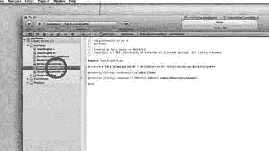

**图 11–20.** 选择并打开 DetailViewController 头文件。

20. 保存你的 `MasterViewController`，然后打开 `DetailViewController.h` 文件，如图 11–20 所示。接着添加如下所示的代码。注意，当我们返回调整情节串联图板时，会将其连接到我们的 `UIWebView` 上。

```
#import<UIKit/UIKit.h>
@interfaceDetailViewController : UIViewController<UISplitViewControllerDelegate>
@property (strong, nonatomic) id detailItem;
@property (strong, nonatomic) IBOutletUILabel *detailDescriptionLabel;
@property (strong, nonatomic) IBOutletUIWebView *webView;
@end
```

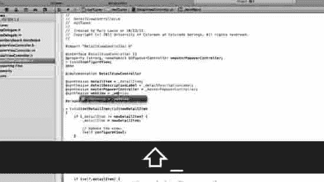

**图 11–21.** 在实现文件中合成 webView。

21. 现在打开你的 `DetailViewController.m` 文件，并合成 `webView`，如图 11–21 以及此处所示：

```
#import "DetailViewController.h"
@interfaceDetailViewController ()
@property (strong, nonatomic) UIPopoverController *masterPopoverController;
- (void)configureView;
@end

@implementationDetailViewController
@synthesizedetailItem = _detailItem;
@synthesizedetailDescriptionLabel = _detailDescriptionLabel;
@synthesizemasterPopoverController = _masterPopoverController;
@synthesizewebView = _webView;
#pragma mark - 管理详细项
```

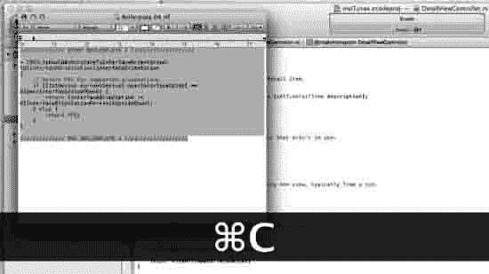

**图 11–22.** 选择样板代码 4。

22. 现在，我们需要重写 `shouldAutorotateToInterfaceOrientation` 方法，以处理之前提到的纵向和横向问题。继续删除 `shouldAutorotateToInterfaceOrientation` 方法，然后手写这几行代码，或者将样板代码 4 的内容粘贴到其位置。

```
////////////// 开始 样板代码 4 ////////////////////
- (BOOL)shouldAutorotateToInterfaceOrientation:(UIInterfaceOrientation)interfaceOrientation
{
    // 返回 YES 表示支持的方向
    if ([[UIDevicecurrentDevice] userInterfaceIdiom] == UIUserInterfaceIdiomPhone) {
        return (interfaceOrientation != UIInterfaceOrientationPortraitUpsideDown);
    } else {
        return YES;
    }
}
////////////// 结束 样板代码 4 ////////////////////
```

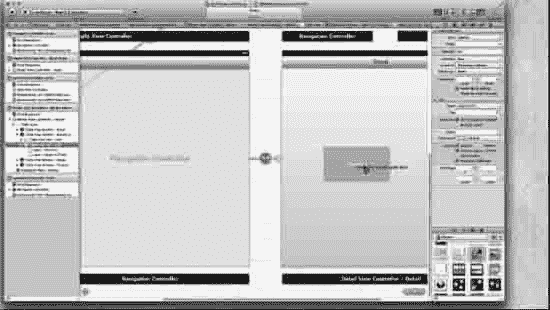

**图 11–23.** 返回情节串联图板，选择表格视图单元格 – 单元格，然后将一个网页视图拖到详细视图上。

23. 保存所有内容，返回情节串联图板，关闭导航器，打开实用工具面板，并在实用工具面板中打开库。我们的表格视图单元格将显示网页视图，因此这里需要放置一个网页视图。返回情节串联图板，选择表格视图单元格 – 单元格，然后将一个网页视图拖到详细视图上，如图 11–23 所示。


#### 完成故事板

我们已接近尾声。唯一还需要做的，就是将代码中原本不存在的部分——`webView` 与 `UIWebView` 的连接建立起来。既然它已经存在，我们需要回到故事板中，将它们连接起来。

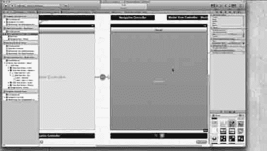

图 11–24. 选择 myMasterTableViewController。

24. 现在回到文档大纲，在 Detail View Controller - Detail Scene 中，找到 Web View，然后将其向上拖拽至 Detail View Controller - Detail 中 View 上方的 Navigation Item - Detail 处。此时，像我们在 `myStory_02` 中做的那样，你的 View 会消失。保持选中左上角如图 11–24 所示的 Detail View Controller - Detail，回到你的连接检查器，按照图 11–24 所示，从 `webView` 控制拖拽到 `UIWebView`。然后保存。

注意：现在将你的 iPad 连接到 Mac，不要选择 iPad 模拟器，而是选择 iOS 设备。如果你愿意，也可以在模拟器上运行，但 iTunes 无法在模拟器内运行，因此所有的 iTunes 链接都将无法工作。一旦你将 iPad 连接到 Mac，按下运行按钮。

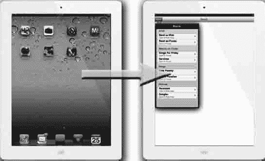

图 11–25. 从图标到弹出窗口

25. 应用构建完成后（可能需要 17 秒），你会看到如图 11–25 所示的图标。按下图标后，你会立即看到弹出屏幕。第一次选择时，它下面不会显示任何内容。然而，一旦你选择一个页面然后再次点按弹出，它就会像图 11–26 那样，在弹出下方保留底层图像。

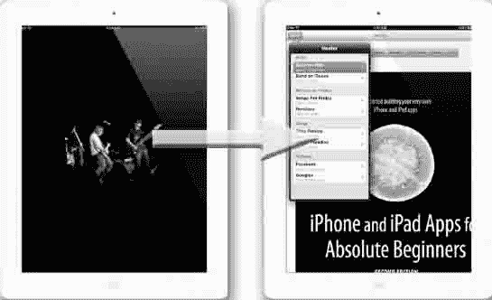

图 11–26. 页面加载时，一个漂亮的启动屏幕会呈现出来。

26. 当我们选中一个单元格时，启动屏幕会出现在页面从互联网或 iTunes 加载的过程中。此处，在右侧图像中，我们看到弹出窗口覆盖在第一张图片之上。

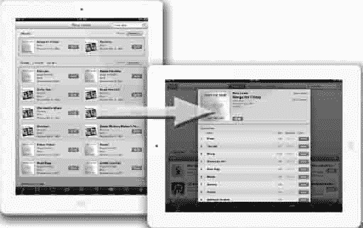

图 11–27. 配合 iTunes 的方向自适应

27. 我们需要对方向配合 iTunes 自动纠正这件事有点耐心。这是苹果需要改进的地方。请耐心等待。图 11–27 左侧显示的是第二次选择，右侧显示的是第一次选择的 iTunes 内容。

### 结语

这是一段奇妙的旅程，但这仅仅是个开始。在编写这第二版时，我忍不住想到那些将要阅读这些练习，努力攻克它们，然后突破自我，创造出精彩应用并赚到钱的新鲜头脑们！我的学生中，以及这本书的读者中，将来又会有多少人进入苹果公司工作呢！？哇！想到这些，对我而言是巨大的动力。

令人伤感的是，在我完成这本书的时候，史蒂夫·乔布斯去世了。愿上帝保佑你，史蒂夫。

我希望能在这论坛上见到大家。我不会回答通过电邮提交给我的问题，但如果你们将相同的问题发布到论坛（`http://bit.ly/oLVwpY`）上，我会回答，因为这样每个人都能分享我的答案。我也鼓励大家去帮助别人。无论你多么初学，都可以进入论坛去帮助他人。帮助他人会加速你自己的成长。

祝好。

路易斯博士

## 索引

### 特殊字符与数字

- `-` (减号), 95
- `#` (井号) 符号, 149
- `#define`, 149
- `%@` 符号, 86–88, 98–99
- `*` 符号, 133
- `*label` 指针, 137
- `*uiImageView`, 117, 137
- `{ }` (花括号), 74–78, 85–86
- `+` (加号) 符号, 95
- 7 Wonders of the World 应用, 370
- 360 Cities 应用, 371


### A

- 关于页面，APRS 地图应用，420–421
- “关于本机”选项，3–4
- 操作
  - 在开关应用中向标签页添加按钮，245–246
  - 添加到 touchesViewController 头文件，176–182
  - 连接按钮为，182–190
  - 创建，42
  - 命名，177
- `alloc`，86–88，98–99
- 业余无线电操作员定位应用，412–421
- 分析器，用于调试，359
- 动画代码，touches 应用，157，210–213
- 注释
  - 编码，398
  - 为其创建 Objective-C 类，375–378
  - 针对 MapKit 框架的文件，376–378
  - 地图，363，373
  - 样式，412
  - 在应用中的多种用途，412
- 应用编程全景，23
- `Appdelegate`，36
- `Appkit`，148
- Apple ID 选项，8
- Apple 公司，MapKit 的使用，369
- 应用
  - 7 大世界奇观应用，370
  - 360 城市应用，371
  - 关于页面，APRS 地图应用，420–421
  - 业余无线电操作员定位应用，412–421
  - 动画代码，touches 应用，157，210–213
  - 应用编程全景，23
  - `Appdelegate`，36
  - `Appkit`，148
  - Apple ID 选项，8
  - Apple 公司，MapKit 的使用，369
  - APRS 地图应用，412–421
  - 背景图像，touches 应用，168
  - 编码“更改”按钮，210，213
  - 将整数归零，192
  - Blipstar 应用，370
  - 底部视图模式，switch-mistake 应用，340
  - bug，在 switch-mistake 应用中，343–346
  - `CGAffineTransform` 结构体，与 touches 应用，157–182
  - “更改”按钮，touches 应用，210–213
    - 添加操作到头文件，187
    - 命名，170
  - 指南针应用，366
  - 酷地图 7 大世界奇观应用，370
  - 数据结构，touches 应用，157
  - “女性”按钮，MyStory 应用，280–281，283
  - “女性”控制器，MyStory 应用
    - 添加“进化”按钮，293–297
    - 添加图像到，289
    - 命名栏标题，290
  - `FileMerge.app`，329，352–356
  - 第一个视图，标签页应用，228–229，232–236
  - `FlightTrack` 应用，368–369
  - “极客”按钮，MyStory 应用，280–281
  - “极客”控制器，MyStory 应用
    - 添加图像到，288–289
    - 将“进化”按钮链接到，293–297
    - 命名栏标题，290
  - Geo IP 工具应用，370


- `Grow`按钮，触摸应用，157，202
- 头文件，用于触摸应用，182
- `helloWorld_03`应用，57–99
  - 其中的`.xib`文件，93–96
  - 其中的头文件，96–99
  - 其中的方法，95–96
  - 其中的 nib 文件，93–96
  - 路线图，85–91
  - 保存，83–84
  - 用户界面，63–82
- `helloWorld_04`应用，102–148
  - 其中的`IBActions`，138，148–149
  - 其中的`IBOutlets`，131–133，148–149
  - 其中的指针，133–135，149–150
  - 其中的属性，135–138
- 图像视图应用，121
- 隐形按钮，MyStory 应用，300–301
- iPad 模拟器，在其上运行应用，50–54
- iPhone 模拟器，在其上运行应用，34–50
- `Male`按钮，MyStory 应用，280–282
- `Male`控制器，MyStory 应用
  - 添加进化按钮，293–297
  - 向其中添加图像，288
  - 命名导航栏标题，291
- 地图隧道工具应用，370
  - 用于`MapKit`框架，412–426
    - 示例 1，413–420
    - 示例 2，421–424
    - 示例 3，426
  - `myStory_01`应用，371–373
  - 预装应用，363–366
  - 第三方应用，369–370
- `MapMyRide`应用，369
- 地图应用，366
- 主从应用程序模板，490–491
- 巴黎地铁应用，369，371
- `Move`按钮，在触摸应用中，208–209
- `Move`按钮，触摸应用
  - 向头文件添加操作，187
  - 命名，170
  - 跟踪其状态，183
- 多媒体平台，`myiTunes`应用程序，487–520
  - 编码，502–517
  - 图像，492–493
  - 主从应用程序模板，490–491
  - 准备工作，489
  - storyboard，493–502，517–520
- `myDetailViewController`实现文件，在`myStory_02`应用中，465–473
- `myiTunes`应用程序，488–520
  - 编码，502–517
  - 图像，492–493
  - 主从应用程序模板，490–491
  - 准备工作，489


故事板，[493]–[502]，[517]–[520]

MyStory 应用，[255]–[324]
- 概述，[256]
- 为其配置的故事板，[258]–[276]
- 视图控制器，[276]–[286]，[300]–[322]

myStory_01 应用，[371]–[373]

myStory_02 应用，[433]–[458]
- 文件，[434]–[435]
- 图片，[438]–[439]
- myDetailViewController 实现文件，[465]–[473]
- myMasterTableViewController 实现文件，[451]–[458]
- 概述，[433]
- 单视图模板，[436]–[437]
- 其中的故事板，[440]–[441]，[474]–[486]
- 表格视图控制器，[442]–[451]

基于导航的应用模板，[33]，[54]

平台，myiTunes 应用，[487]–[520]
- 编码，[502]–[517]
- 图片，[492]–[493]
- 主从应用模板，[490]–[491]
- 准备工作，[489]
- 故事板，[493]–[502]，[517]–[520]

QuikMaps 应用，[369]

无线电操作员定位应用，[412]–[421]

根视图控制器，MyStory 应用，[270]，[272]

圆角矩形按钮，MyStory 应用，[268]

Routesy 湾区旧金山 Muni 和 BART 应用，[406]，[408]

运行应用
- 在 iPad 模拟器上，[50]–[54]
- 在 iPhone 模拟器上，[34]–[50]
- 在物理设备上，[55]

开关应用，[227]–[230]

保存应用文件，[83]–[84]

第二个视图控制器，switch-mistake 应用，[340]

第二个视图，标签页应用，[230]，[237]–[242]

缩小按钮，touches 应用，[157]，[201]–[208]
- 向头文件添加动作，[184]–[186]
- 添加到头文件，[181]–[182]
- 为其创建缩放，[194]
- 命名，[170]
- 跟踪其状态，[183]

单视图应用模板，[106]，[160]，[258]，[374]

`myStory_02` 应用中的单视图模板，[436]–[437]

`helloWorld_03` 应用中的字符串，[86]

结构体，touches 应用，[157]

开关应用，[217]–[253]
- 其中的按钮，[244]–[250]
- 与内容视图模式，[251]–[253]
- 创建应用，[222]–[223]


图片，221、224–227

运行，227–230

标签页，自定义，230–242

视图，242–243

`switch-mistake` 应用，329–356

其中的 bug，343–346

比较源文件，347–356

创建项目，330–333

其中的视图，334–343

标签页应用程序模板，222、330

标签页，在 switch 应用中，230–242

Tall Eye 应用，370

测试应用，创建，28

touches 应用，155–216

以及 `CGAffineTransform` 结构体，157–182

其头文件，182–191

其实现文件，191–213

运行，213–216

交通摄像头应用，421–425

交通监控应用，425–429

转场，MyStory 应用，274

Twitter Spy 应用，370

Über Geek 控制器，MyStory 应用，298、302、314

`UIViewControllers`，MyStory 应用，279

基于视图的应用选项，53

基于视图的应用图标，58

基于视图的应用模板，35、58、106

视图控制器，MyStory 应用

向其中添加 Web 视图，302

其放置，282

设置其类，308

`viewDidLoad`，switches 应用，242

Web 视图，MyStory 应用，302–314

APRS Map 应用，412–421

ARC（自动引用计数），437

参数，79

数组

使用城市列表创建，454–456

touches 应用，182–183

壁纸数组，192–193

下箭头键，47

Aspect Fill 视图模式，Xcode，252

Aspect Fit 视图模式，Xcode，252

Assistant 编辑器，39–41、45、73、122–123、139

Attributes 检查器，66、97

Attributes 面板，在其中设置图片，280

自动引用计数 (ARC)，437


### B

- 背景图像，touches 应用，168
- `coding Change` 按钮，210，213
- 将整数设置为零，192
- 背景层，104–105
- `bankBalance` 变量，150
- 栏按钮项，293
- 基础视图，115
- Batchgeo，372
- `beginAnimations` 方法，211
- 《Beginning iPhone 4 Development, Exploring the iPhone SDK》，20
- 绑定检查器，98
- Blipstar 应用，370
- 样板代码，396，400，489，504，506
- 底部视图模式，switch-mistake 应用，340
- 底部视图模式，Xcode，252
- 大脑，连接信息，217–220
- 断点，358
- 错误，在 switch-mistake 应用中，343–346
- 构建阶段选项卡，根目录，379，459
- 按钮文本，编写，119
- `buttonGuess` 方法，131–134，137–138，142，144–145

### 按钮

- 添加到画布，39
- 添加到视图设计区域，67
- MyStory 应用，268，280，283，300–301
- 在 switch 应用中，244–250
- touches 应用
    - 添加操作，到头文件，184–187
    - 添加操作，到 `touchesViewController` 头文件，176，182
    - 添加输出口，到 `touchesViewController` 头文件，176，182
    - 更改其文本，202
    - `coding Change` 按钮，210–213
    - `coding Move` 按钮，208–209
    - 为 Shrink 按钮创建缩放效果，194
    - 在 Xcode 中拖拽到视图设计区域，169
    - 对应的 `if` 语句，203–208
    - 命名，170
    - 跟踪其状态，183


### C

**画布（canvas）**

- 添加按钮到，39
- 添加标签到，38

**单元格（cells）**

- 创建展开指示器，498
- 创建副标题，497
- 命名，502

**居中文本图标（centered text icon）**，38

**CGAffineTransform 类**，157, 183, 194

**CGAffineTransform 结构体**，以及触控应用，157–182

**CGAffineTransformMakeScale 方法**，194

**CGAffineTransformMakeTranslation 方法**，194–195

**Change 按钮**，触控应用，210–213

  - 向头文件添加操作，187
  - 命名，170

**Change view and see traffic 函数**，365–366

**视图控制器类（class of view controller）**，设置，308

**类（classes）**，132

**Classes 文件**，131

**CLLocation 类参考**，390

**CLLocationCoordinate2D**，462

**Cocoa Touch 项目文件夹**，113

**Code 文件夹**，108

**代码片段（Code snippets）**，98

**编码（coding）**

  - MapKit 框架，404–406
  - 应用，412–426
  - Storyboard 对象的内存管理，405–406
  - `myPos` 文件中的 `NSObject` 对象，389–392
  - 解析，406–412
  - 协议，404–405
  - 视图控制器，393–399
  - `myiTunes` 应用程序，502–517

**Command + Q 快捷键**，34, 52, 55, 58

**Command + Return 快捷键**，74

**Command + S 快捷键**，40, 83, 146

**Command + Shift + N 快捷键**，35

**Command + Tab 快捷键**，34, 55, 60

**公司标识符（Company Identifier）**，59

**Company 选项**，9

**指南针应用（Compass app）**，366

**编译时（compile-time）**，与运行时对比，253

**Connect 按钮**，75, 79, 95

**connectionDidFinishLoading**，470

**连接检查器（Connections inspector）**，98

**内容视图模式（Content View Modes）**，235, 251–253

**Control + Command + 下箭头快捷键**，73

**Control + Command + 上箭头快捷键**，73

**Storyboard 中控制器栏标题（controller bar titles in storyboarding）**，命名，290–291

**控制器（CONTROLLER）部分**，152

**Control + S 快捷键**，49

**Cool Maps 7 Wonders of the World 应用**，370

**坐标（coordinates）**，编码，397

**Copy items 复选框**，62

**copy items into destination 选项**，61

**Copy items into the destination group's folder 复选框**，110

**CoreLocation 框架**

  - 概述，364
  - 选择，381
  - 存储到 frameworks 文件夹中，382

**对应文件（counterparts）**，73

**Create groups for any added folders 复选框**，110

**花括号（curly braces）**，74–78, 85–86


### D

数据结构，涉及应用程序，157  
`dealloc` 方法，46  
用于调试的`调试器控制台`窗口，357  
用于调试的`调试器`窗口，327  
调试，325–359  

- `switch-mistake` 应用程序，329–356  
  - 比较源文件，347–356  
  - 创建缺陷，343–346  
  - 创建视图，334–343  
  - 启动项目，330–333  
  - 调试工具，326–329  
    - 分析器，359  
    - `调试器控制台`窗口，357  
    - `调试器`窗口，327  
    - 文档，358  
    - `FileMerge.app`，329  
    - `Fix-it`，357  
    - `GDB` 控制台，327  
    - 日志，327–328  
    - `NSZombie`，328  
    - `Shark`，328  
    - 文本编辑器，327  
    - 单元测试，328  

`delegate` 方法，398  
代理，将视图控制器类设置为，397  
从桌面删除图像，165  
`DetailViewController` 控制器，编码，513–517  
开发者页面，11–13  
开发者工具，351  
指令，135  
创建单元格的展开指示器，498  
迪士尼的故事板，255  
显示插入指示器，76  
用于调试的文档，358  
下载 Xcode 4 按钮，11–12  

下载：  

- Lulu 水果图标，158–159  
- `myiTunes` 应用文件，489  
- `myStory 01` 代码，373  
- `myStory 02` 代码文件，434  
- `MyStory` 应用代码，257  
- 用于调试的源代码，347–348  
- Switches 应用代码，221  
- Touches 应用代码，156  

梦想，155  

### E

编辑表格视图控制器，443  
编辑器选择器，40，45，73  
效果检查器，98  
立即注册按钮，7  
企业计划，10  
事件处理，概述，363


### F

- `Female button`（女性按钮），`MyStory` 应用，280–281，283
- `Female controller`（女性控制器），`MyStory` 应用
    - 添加 `evolve`（进化）按钮，293–297
    - 向其中添加图像，289
    - 命名栏标题，290
- `Field` 对象，70–72
- `File` 检查器，97
- `File templates`（文件模板），98
- `FileMerge.app`，329，352–356
- `files`（文件）
    - `header`（头）文件，36，40，43–44，46，96–99
        - 与 `Inspector Bar`（检查器栏），97–98
        - 与内存泄漏，98–99
        - 与 `NSStrings`，98
        - 用于触摸应用，182
    - `implementation`（实现）文件，36，44–46
        - 用于触摸应用，191–213
        - 用于视图控制器，395–399
    - `Media`（媒体）文件，98
    - `nib` 文件，36，49，93–96，112，141
    - 文件组织，450–451
    - 保存应用文件，83–84
    - `Supporting Files`（支持文件）文件夹，60–62，109
    - `.xib` 文件，36，93–96，132，153
    - 创建，462
    - `nonatomic`（非原子性），189
    - `retain`（保留），189
    - 综合，191
- `File's Owner`（文件所有者），41，43，81–82
- `Find Yourself`（找到自己）功能，364
- `Finder`（访达）程序，3–4
- `Finish`（完成）按钮，61
- `First View`（第一个视图）标签，删除，338
- `First View`（第一个视图），标签页应用，228–229，232–236
- `FirstViewController.xib` 文件，244，336
- `Fix-it`（修复），用于调试，357
- `FlightTrack` 应用，368–369
- 文件夹高亮，109
- 论坛，19–20
- 框架，`MapKit`，361–430
    - 添加，459–460
    - 添加至框架文件夹，461
    - 添加至 `myPos` 头文件，462
- 应用
    - `myStory_01`，371–373
    - 预装应用，363–366
    - 第三方应用，369–370
    - 编码，404–406
- `MapKit` 框架的应用，412–426
- `MapKit` 解析，406–412
- `Storyboard` 对象的内存管理，405–406


协议，404–405

预备知识，373

模板，374–403

注释文件，376–378

编码，389–399

框架，379–383

图像，383–388

故事板文件，401–403

###  G

GDB 控制台，用于调试，327

极客按钮，MyStory 应用，280–281

极客控制器，MyStory 应用

向其中添加图像，288–289

将进化按钮链接到，293–297

命名栏标题，290

Geo IP Tool 应用，370

目标，155–156

Google 服务器，解析，468–471

图形用户界面 (GUI)，18

增长按钮，touches 应用，157，202

GUI (图形用户界面)，18

###  H

.h (头) 文件，44

井号字符，149

头文件，36，40，43–44，46，96–99

和检查器栏，97–98

和内存泄漏，98–99

和 NSStrings，98

用于 touches 应用，182

头 (.h) 文件，44

hello 方法，95

Hello World 文件夹，108

helloWorld_01 文件，35–36，53–54

helloWorld_02 文件，53–54

helloWorld_03 应用，57–99

其中的 .xib 文件，93–96

其中的头文件，96–99

和检查器栏，97–98

和内存泄漏，98–99

和 NSStrings，98

其中的方法，95–96

其中的 nib，93–96

路线图，85–91

避免内存泄漏，88

隐藏键盘，88–91

显示文本，87–88

操作文本，86–87

其中的字符串，86

保存，83–84

用户界面


- `connecting to code`（连接到代码），73–82  
- `overview`（概述），63–72  
- `helloWorld_03ViewController.xib` 文件，63  
- `helloWorld_04` 应用程序，102–148  
- `IBActions` 在，138，148–149  
- `IBOutlets` 在，131–133，148–149  
- `pointers`（指针）在，133–135，149–150  
- `properties`（属性）在，135–138  
- Xcode IDE 的在线`help`（帮助），358  
- `highlighting folders`（高亮文件夹），109  
- Objective-C 的`history`（历史），18–19


### M

- 我需要为选项创建一个新账户，8
- I/O（输入/输出），151
- IB（界面构建器），96
- IBActions，79，85，88，95，99，130–131，138，148–149
- IBOutlets（界面构建器输出口），96，117–118，131–133，148–149，405–406
- 图标文件，102–103，105–106，111–112
- `icon.png` 文件，111
- 图标
  - myStory 01 应用
    - 导入，384
    - 移至正确文件夹，386–387
  - switches 应用，226–227
  - touches 应用，为其创建，166
- IDE（集成开发环境），16，29
- Identity inspector（标识检查器），97
- `if` 语句
  - 用于 touches 应用中的按钮，203–208
  - 用于 touches 应用中的 lulu 水果图标，199–200，203–208
- Image View Application（图像视图应用），121
- Image View Attributes 窗口（图像视图属性窗口），114，117
- Image View 图标（图像视图图标），113
- `imageNamed` 方法，118，145，193
- 图像
  - 复制到 Xcode，164–165
  - 用于 MapKit 框架，383–388
  - 用于我的 iTunes 应用，492–493
  - MyStory 应用
    - 添加到视图控制器，287
    - 复制到 Xcode，260
    - 放置在 UIViewControllers 上，279
    - 在属性面板中设置，280
  - 用于 `myStory_02` 应用，438–439
  - 用于 switch 应用
    - 添加到项目，224–227
    - 获取，221
  - switches 应用
    - 添加到标签页，230–242
    - 复制到 Xcode，224–225
    - 下载，221
- `imageSource` 指针，118，145
- 实现文件，36，44–46
  - 用于 touches 应用，191–213
    - 壁纸数组，192–193
    - `CGAffineTransformMakeScale` 方法，194
    - `CGAffineTransformMakeTranslation` 方法，194–195
    - change 按钮，210–213
    - move 按钮，208–209
    - 设置背景图像，195–196
    - shrink 按钮，201–208
    - 合成，191
    - `touchesMoved:` 方法，196–201
    - `viewDidLoad` 方法，191–192
  - 用于视图控制器，395–399
- Include Unit Tests 选项（包含单元测试选项），59
- INDIO（交互、导航、数据和 I/O），150–153
- 间接引用概念，149
- 单独链接，9
- Individual 选项（单独选项），9
- Information 标签页（信息标签页），114
- 保持初始动量，284
- `initWithFormat:`，86–88，98–99
- 输入/输出 (I/O)，151
- 插入指示器，74–75，78
- Inspector Bar（检查器栏），66，93，97–98
- Inspector Selector Bar（检查器选择器栏），97
- 安装 Xcode 和 iOS SDK 窗口，15–16
- 安装成功窗口，15
- 实例创建，93–94
- `instantiateViewControllerWithIdentifier:` 方法，323
- 实例化，93–94
- 集成开发环境 (IDE)，16，29
- 交互、导航、数据和 I/O (INDIO)，150–153
- 界面构建器 (IB)，96
- 界面构建器输出口 (IBOutlets)，96，117–118，131–133，148–149，405–406
- 界面构建器视图，93
- 从互联网解析，406–409
- `int_pointer` 变量，150
- 不可见按钮，MyStory 应用，300–301
- iOSDev 开发中心，10–11
- iOS SDK 驱动图标，14
- iOS4 与故事板，323–324
- iPad 模拟器，在其上运行应用，50–54
- iPhone 酷项目，406，408
- iPhone/iPad 开发页面，8，10
- iPhone/iPad 操作系统软件，10
- iPhone/iPad 模拟器，16–17, 23–25, 27, 29, 32
- iPhone 模拟器，在其上运行应用，34–50
- IPhoneRuntime，132


###  J

`Jobs, Steve`（史蒂夫·乔布斯），18，22

###  K

`Kant image`（康德图像），142

`Kant outlet`（康德插座），104–106，117，127，132，134，137，142，145

`kantStair.png`（康德楼梯图），118，120，145

`keyboard`（键盘）

- 隐藏，88–91
- 快捷键，35

`键盘与字符显示面板`（Keyboard & Character Viewer），316–319

###  L

`label instance variable`（标签实例变量），115，144

`Label object`（标签对象），71–72

`label Outlet`（标签插座），126

`labels`（标签）

- 添加到画布，38
- 添加到视图设计区域，71
- 拼写错误，147

`label.text`（标签文本），47–48

`Lamarche, Jeff`（杰夫·拉马什），20

`语言与文本偏好设置面板`（Language & Text preferences panel），316–319

`latitude`（纬度），372，397

`lines of latitude`（纬线），372，397

`lines of longitude`（经线），372，397

`将按钮连接到导航控制器`（linking buttons to navigation controllers），270

`LLVM compiler`（LLVM 编译器），357

`日志，用于调试`（logs, for debugging），327–328

`经线`（longitude, lines of），372，397

`lulu fruit icon`（lulu 水果图标）

- 与 UIImageView 关联，171–172
- 使用`CGAffineTransforms`变换，183
- 创建 if 语句，199–200
- 创建插座，177
- 下载，158–159
- if 语句，203–208

`luluIcon.png, 调整尺寸`（luluIcon.png, sizing），173


### M

- MacBook Air，2
- Macintosh HD 图标，103
- `MainStoryboard.storyboard` 文件，261
- 保持初始动力，284
- 男性按钮，MyStory 应用，280–282
- 男性控制器，MyStory 应用
  - 添加进化按钮，293–297
  - 添加图像，288
  - 命名栏标题，291
- Map Tunneling Tool 应用，370
- 地图视图，480–482
- `MapKit` 框架，361–430
  - 添加，459–460
  - 添加到 frameworks 文件夹，461
  - 添加到 `myPos` 头文件，462
- 应用
  - `myStory_01`，371–373
  - 预装，363–366
  - 第三方，369–370
    - 编码，404–406
- `MapKit` 框架的应用，412–426
- `MapKit` 解析，406–412
  - Storyboard 对象的内存管理，405–406
  - 协议，404–405
  - 预备知识，373
  - 模板，374–403
    - 注释文件，376–378
    - 编码，389–399
    - 框架，379–383
    - 图像，383–388
    - Storyboard 文件，401–403
- MapMyRide 应用，369
- 地图应用，366
- `mapView`，连接到 `MKMapView`，403
- Dave Mark，20
- 主从应用模板，490–491
- `MasterViewController`，503–513
- 媒体文件，98
- 内存泄漏
  - 避免，88
  - 与头文件，98–99
  - 工具，328
- 内存管理，136，405–406
- 子午线，372
- 方法，79，95–96
- 巴黎地铁应用，369，371
- 减号（`-`），95
- 拼写错误的标签，147
- `MKAnnotation` 协议，390
- `MKMapView`，连接到 `mapView`，403
- `MKMapViewDelegate` 协议，394
- `MODEL` 部分，152
- 模型-视图-控制器（MVC），151–153
- `monkey` 方法，79，95
- Stephen A. Moraco，412–421，425
- Stephen M. Moraco，412–421
- 移动按钮，touches 应用，208–209
  - 添加操作到头文件，187
  - 命名，170
  - 跟踪状态，183
- 多媒体平台，`myiTunes` 应用，487–520
  - 编码，502–517
  - 图像，492–493


主从应用程序模板，[490]–[491]

准备工作，[489]

故事板，[493]–[502]，[517]–[520]

可变性，[135]–[137]

互斥性，[284]

MVC（模型-视图-控制器），[151]–[153]

`My Programs`文件夹，[58]

`myDetailViewController`类，[464]，[483]

`myDetailViewController`实现文件（位于`myStory_02`应用中），[465]–[473]

`myiTunes`应用，[488]–[520]

- 编码
  - `DetailViewController`控制器，[513]–[517]
  - 概述，[502]–[512]
- 图片，[492]–[493]
- 主从应用程序模板，[490]–[491]
- 准备工作，[489]
- 故事板
  - 收尾工作，[517]–[520]
  - 整理其中的弹出框，[493]–[502]

`myMasterTableViewController`，[451]–[458]，[472]

`myPos`文件（`NSObject`对象），[389]–[392]

`myPos`头文件，[462]–[463]

`myPos.h`文件，[389]–[392]，[469]–[471]

`MyStory`应用，[255]–[324]

- 概述，[256]
- 对应的故事板配置，[258]–[276]
- 对应的视图控制器，[276]–[286]，[300]–[322]

`myStory_01`应用，[371]–[373]

`myStory_02`应用，[433]–[458]

- 对应的文件，[434]–[435]
- 对应的图片，[438]–[439]
- `myDetailViewController`实现文件，[465]–[473]
- `myMasterTableViewController`实现文件，[451]–[458]
- 概述，[433]
- 单一视图模板，[436]–[437]
- 对应的故事板，[440]–[441]，[474]–[486]
- 对应的表视图控制器，[442]–[451]


### N

- `N 快捷键`，53，58，106
- `Name`字符串，86
- `naming`单元格，502
- `导航栏`，486
- `outlets`，177
- `导航栏`，重命名，486
- `基于导航的应用`模板，33，54
- `导航控制器`，添加，476
- `MyStory`应用，264–265，270，280
- `导航窗格`，37
- `导航器视图`，64，123，140–141
- `神经学`，学习与，217–220
- `新建项目`向导，58，106，160–162
- `下一步`按钮，58–59
- `nib`文件，36，49，93–96，112，141
- `nonatomic`指令，189
- `nonatomic`属性，118，131–138
- `NSArray`对象，192
- `NSObject`对象，`myPos`文件，389–392
- `NSString`语句，86–88，98–99
- `NSURL`类，248
- `NSURLRequests`，312
- `NSZombie`，用于调试，328

### O

- `Objective-C`类，362
  - 创建，375–378，449
  - 历史，18–19
- `对象`，98，134
- `Xcode` IDE 的在线帮助，358
- `openURL`方法，248
- 操作系统 (OS)，1，3–4
- 文件组织，450–451
- 方向，516
- OS (操作系统)，1，3–4
- `Outlet`代码，75
- `outlets`
  - 在 switches 应用中向标签添加图像，241–242
  - 添加到 `touchesViewController` 头文件，176–182
  - 创建，40
  - 在 `@properties` 上使用，394
- `Output NSString`，86
- `Output`字符串，86


###  P

PARC（帕罗奥多研究中心），18  
`父类`，96  
`解析器馈送`，测试，410  
`解析器方法`，启动，410–412  
解析，409–412  
- 向视图控制器添加方法，410  
- 从网络获取数据，409  
- Google 服务器，468–471  
- 来自互联网，406–409  
- 概述，433  
- 启动解析器方法，410–412  
- 起始点，409  
- 测试解析器馈送，410  
PDF 文件，关于本书，31  
`performSegueWithIdentifier`，282，297  
Steven Peterson，406  
平台，myiTunes 应用程序，487–520  
- 编码，502–517  
- 图片，492–493  
- 主-从应用程序模板，490–491  
- 预备知识，489  
- 故事板，493–502，517–520  
`plist 文件`，111  
加号（`+`）符号，95  
`.png` 文件，60  
`指针引用`，62  
指针，133–135，149–150  
弹出窗口，519  
- 在故事板中组织，493–502  
- 概述，488  
井号（`#`）符号，149  
编码前准备的重要性，388  
按下 Command + Tab 键，58  
“按我”按钮，58，68，77  
私有成员变量，453  
Pro iOS 5 工具，357  
产品名称框，59  
编程领域，23  
项目，向其中添加图片，224–227  
项目导航器图标，37  
属性，135–138  
“属性”框架，116  
协议，404–405  
- `MKAnnotation`，390  
- `MKMapViewDelegate`，394  
`pseudoiPad`，53

###  Q

快速帮助，Xcode，97，358–359  
QuikMaps 应用程序，369


### R

- `radio operators locator app`，412–421
- `read-only objects`，136
- `read-write objects`，136
- `Redraw View Mode`，Xcode，253
- `Rege`，Satish，425–429
- `requirements`，1–17
- `resources`，《Beginning iPhone 4 Development》，20
- `Resources Folder`，66，110–112
- `retain directives`，99，118，131–134，136–138，189
- `Return shortcut`，35，53，70
- `return type`，79
- `Root View Controller`，MyStory 应用，270，272
- `Round Rect Button`，MyStory 应用，268
- `Routesy Bay Area San Francisco Muni and BART app`，406，408
- `Run button`，91
- `running apps`
  - 在 `iPad Simulator` 上，50–54
  - 在 `iPhone Simulator` 上，34–50
  - 在物理设备上，55
  - `switch app`，227–230
- `runtime`，对比 `compile-time`，253

### S

- `Safari`，11
- `sandboxing`，248
- `saving`，应用文件，83–84
- `saving work`，49
- `Scale To Fill View Mode`，Xcode，251
- `Scheme drop-down menu`，52
- `screencasts`，31，102
- `SDK`（软件开发工具包），1，7
- `Search for location` 功能，364
- `Second View controller`，switch-mistake 应用，340
- `Second View`，标签页应用，230，237–242
- `SecondViewController.m` 文件，350
- `SecondViewController.xib` 文件，239
- `security verification window`，15
- `segues`，265，270，273，281，283–284，293
  - 创建，478–480
  - 读音和定义，432
- `ShowMapDetail`，473
- `setAnimationTransition` 方法，212
- `Shark`，用于调试，328
- `shortcuts`
  - `Command + Q` 快捷键，34，52，55，58
  - `Command + Return` 快捷键，74
  - `Command + S` 快捷键，40，83，146
  - `Command + Shift + N` 快捷键，35
  - `Command + Tab` 快捷键，34，55，60
  - `Control + Command + Down Arrow` 快捷键，73
  - `Control + Command + Up Arrow` 快捷键，73
  - `Control+S` 快捷键，49


`N` 快捷键，53，58，106

`Return` 快捷键，35，53，70

`Show this window when Xcode launches`选项，26

`ShowMapDetail` 转场，473

`Shrink` 按钮，触碰应用，157，201–208

向头文件添加操作，184–186

添加到头文件，181–182

为其创建缩放，194

命名，170

跟踪其状态，183

`SIGABRT` 错误，81

`Single View Application` 模板，106，160，258，374

在`myStory_02`应用中的单视图模板，436–437

`Size` 检查器，97，173

软件，检查更新，6

`Software Development Kit (SDK)`，1，7

`Software Update` 选项，4–5

启动屏幕图片，520

导入，385，438

移动到正确的文件夹，386–387

概述，383

拆分视图，概述，488

花括号，40，46

`STAIR.png`，104–105，114，120

`Standard Editor`，45–46，73–74，139

`Standard` 程序，10

`Standard View`，83

设置启动状态，192

编写语句，130

用于调试的静态分析，359

创建分组的静态单元格，496

静态标识符，399

用于`MapKit` framework 的`Storyboard` 文件，401–403

`Storyboarding`，概述，253

故事板

最终确定，517–520

与`iOS4`，323–324

在`myStory_02`应用中，440–441，474–486

在其中组织弹出框，493–502

概述，323–324

在`helloWorld_03`应用中的字符串，86

结构体，触碰应用，157

为表格视图单元格创建副标题，497

`superviewDidLoad` 父类，191

`Supporting Files` 文件夹，60–62，109

开关应用，217–253

其中的按钮，244–250

以及内容视图模式，251–253

创建应用，222–223

图片方面

添加到项目，224–227

获取，221

运行，227–230


选项卡，定制，230–242

视图，242–243

`switch-mistake` 应用程序，329–356

错误修正，343–346

比较源文件，347–356

创建项目，330–333

视图，334–343

`symbol navigator` 窗格，41

符号，95–96

合成，118，191

合成概念，146

综合声明，130

### T

`Tab` 键，47

`Tabbed Application` 模板，222，330

`Table View Controller`

与 `myMasterTableViewController` 相关联，457–458

用于 `myStory_02` 应用程序，442–451

`Table Views`，填充，495

选项卡，在 switch 应用程序中，230–242

`Tall Eye` 应用程序，370

模板

`File` 模板，98

用于 `MapKit` 框架，374–403

注释文件，376–378

编码，389–399

框架，379–383

图像，383–388

Storyboard 文件，401–403

`Master-Detail` 应用程序，490–491

`Navigation-based Application` 模板，33，54

`Single View Application` 模板，106，160，258，374

单视图模板，在 `myStory_02` 应用程序中，436–437

`Tabbed Application` 模板，222，330

`View-based Application` 模板，35，58，106

测试应用程序，创建，28

`testViewController.h` 文件，29

文本

按钮，通过状态更改，202

显示，87–88

编辑器，用于调试，327

操作，86–87


`TextField` 对象，[58]，[67]–[70]

`text` 属性，[88]

`textBox`，[75]–[77]，[81]–[82]，[86]，[88]，[96]，[99]

`textFieldShouldReturn` 方法，[88]–[89]

`toolbag`，[88]

调试工具，[326]–[329]

分析器，[359]

调试器控制台窗口，[357]

调试器窗口，[327]

文档，[358]

`FileMerge.app`，[329]

Fix-it 功能，[357]

GDB 控制台，[327]

日志，[327]–[328]

`NSZombie`，[328]

Shark 分析工具，[328]

文本编辑器，[327]

单元测试，[328]

顶层，[103]，[105]，[113]，[133]

Xcode 的左上视图模式，[252]

`touches` 应用程序，[155]–[216]

与 `CGAffineTransform` 结构体，[157]–[182]

头文件，[182]–[191]

实现文件，[191]–[213]

壁纸数组，[192]–[193]

`CGAffineTransformMakeScale` 方法，[194]

`CGAffineTransformMakeTranslation` 方法，[194]–[195]

变更按钮，[210]–[213]

移动按钮，[208]–[209]

设置背景图像，[195]–[196]

收缩按钮，[201]–[208]

合成，[191]

`touchesMoved:` 方法，[196]–[201]

`viewDidLoad` 方法，[191]–[192]

运行，[213]–[216]

`touchesMoved:` 方法，[196]–[201]

`touchesViewController` 头文件

编码，[182]–[190]

将项目连接到代码，[174]–[182]

`touchesViewController.m` 文件，[191]–[194]

`touchesViewController` nib 文件，[167]

交通摄像头应用，[421]–[425]

流量监控应用，[425]–[429]

转场效果，MyStory 应用，[274]

Twitter Spy 应用，[370]


### `Ü` 字符，创建，315–320

`Über Geek` 控制器，MyStory 应用，298, 302, 314

`UIButton` 类，182

`UIButtonView`，280

`UIImage`，通过 `imageNamed` 方法使用，193

`UIImageViews` 类，65, 113, 117, 126, 131, 133, 136, 138, 171–172

MyStory 应用，279  
概要，266–267  
switch-mistake 应用，339  
switches 应用，233–234

`UIKit` 类，130–134, 136–138, 152

`UILabel` 类，41, 44, 117–118, 131, 133–134, 136–138

`UINavigationController`，264

`UIView`  
编写“更改”按钮代码，211  
用于 MyStory 应用，261

`UIViewAnimationCurveEaseInOut` 方法，211

`UIViewController` 类，40–41, 44, 131–132, 134, 137, 304, 446–448

`UIViewControllers`，MyStory 应用，279

单元测试，用于调试，328

使用自动引用计数选项，59

使用 Storyboard 选项，59

用户界面，用于 helloWorld_03 应用  
连接到代码，73–82  
概要，63–72

Utilities 文件夹，39

Utilities 图标，37

Utilities 检查器窗格，69, 337

Utilities 面板，37, 65, 80, 263

Utilities 视图，64, 97


### V

视频

`myiTunes` 应用文件，489

`myStory 01`，373

`MyStory` 应用，257

`switches` 应用，221

`touches` 应用，156

`View-Based App` 选项，53

`View-based Application` 图标，58

`View-based Application` 模板，35，58，106

视图控制器，393–394

- 为其添加方法，410
- 添加到故事板，274–278
- 其实现文件，395–399

`MyStory` 应用，276–286，300–322

- 向其添加 Web View，302
- 其位置，282
- 设置其类，308

`View Design` 区域，63–65，67–69，72–74，93

`View` 框架，113

`View Modes`，Xcode，235，251

`View` 屏幕，113–114

`VIEW` 部分，152

`View Selector` 选项，37，40，45

`ViewController` 类，36，43–46，84，131，136，153

`ViewController.h` 文件，44，131，136

`ViewController.m` 文件，44

`ViewController.xib` 文件，36

`viewDidLoad` 方法，143，344–346

- `myStory 01` 应用，395
- `touches` 应用，191–192
- `viewDidLoad`，`switches` 应用，242

`viewDidUnload` 方法，84，197

查看控件，Xcode，262

视图

- `APRS Map` 应用，419
- 在 switch 应用中，242–243
- 在 switch-mistake 应用中，334，343

### W

壁纸，数组，192–193

网页浏览器，Safari，11

从网络获取数据以进行解析，409

`Web View`，`MyStory` 应用，302–314

`webView` 插座变量连接，313

`Welcome to Xcode` 屏幕，25–26，34

保存工作，49

沃兹尼亚克，史蒂夫，18

编写语句，130


### X

- `Xcode`
- `iOSSDK.mpkg`，14–15
- 针对 `Lion` 链接，13
- 缩小尺寸，163
- `touches` 应用程序，160
- `Xcode` 文件夹，36
- `Xcode` 图标，14，34
- `.xib` 文件，36，93–96，132，153
  - 创建，462
- `nonatomic`，189
- `retain`，189
- 合成，191

### Y

- `yourName` 变量，149

### Z

- 缩放模式，`Xcode`，262
