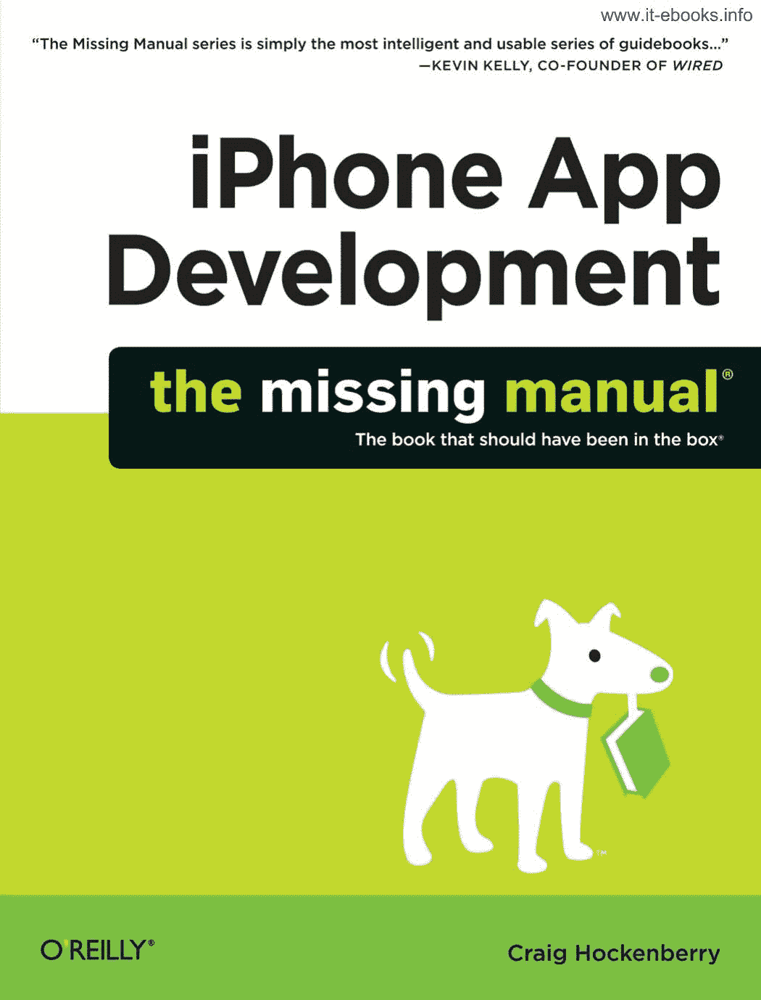
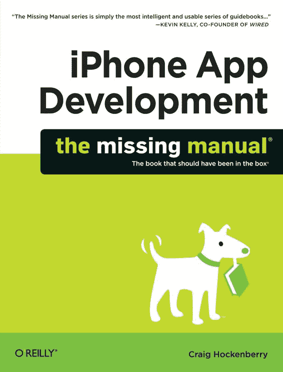
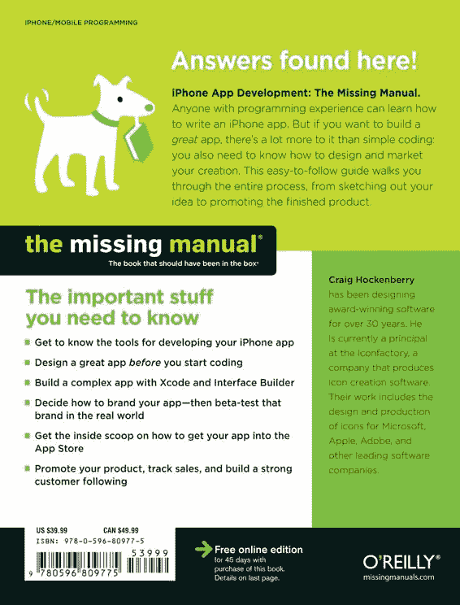

# iPhone 应用开发：缺失手册

[www.it-ebooks.info](http://www.it-ebooks.info/)

[www.it-ebooks.info](http://www.it-ebooks.info/)

[www.it-ebooks.info](http://www.it-ebooks.info/)

**iPhone 应用开发**

**缺失手册**

***这本应随包装附送的书®***

下载自 Wow! eBook

[www.it-ebooks.info](http://www.it-ebooks.info/)

[www.it-ebooks.info](http://www.it-ebooks.info/)

**iPhone 应用开发**

克雷格·霍肯伯里

*北京 • 剑桥 • 法纳姆 • 科隆 • 塞瓦斯托波尔 • 台北 • 东京*

[www.it-ebooks.info](http://www.it-ebooks.info/)

*iPhone 应用开发：缺失手册*

作者：克雷格·霍肯伯里

版权所有 © 2010 克雷格·霍肯伯里。保留所有权利。

在美国印刷。

由 O'Reilly Media, Inc. 出版，地址：1005 Gravenstein Highway North, Sebastopol, CA 95472。

O'Reilly Media 的书籍可用于教育、商业或销售推广目的。

大多数图书也提供在线版本：my.safaribooksonline.com。如需更多信息，请联系我们的企业/机构销售部门：800-998-9938 或 *corporate@oreilly.com*。

2010 年 5 月：第一版。

The Missing Manual 是 O'Reilly Media, Inc. 的注册商标。The Missing Manual 徽标及“这本应随包装附送的书”是 O'Reilly Media, Inc. 的商标。制造商和销售商用于区分其产品的许多标识被认为是商标。当本书中出现这些标识，且 O'Reilly Media, Inc. 知晓该商标声明时，这些标识将采用大写形式。

尽管在编写本书时已采取一切预防措施，但出版商对其中包含信息的错误、遗漏或使用造成的损害不承担任何责任。

本书采用耐用且灵活的平装设计。

ISBN：9780596809775

[M]

[www.it-ebooks.info](http://www.it-ebooks.info/)

## 目录

缺失学分 . . . . . . . . . . . . . . . . . . . . . . . . . . . . . xi

引言 . . . . . . . . . . . . . . . . . . . . . . . . . . . . . . . . . . . 1

***第一部分：Cocoa Touch 入门***

#### 第 1 章：构建你的第一个 iPhone 应用

构建你的第一个 iPhone 应用 . . . . . . . . . . . . . . . 9

获取工具 . . . . . . . . . . . . . . . . . . . . . . . . . . . . . . . . . . . . . . . 9

安装 Xcode . . . . . . . . . . . . . . . . . . . . . . . . . . . . . . . . . . . . . . 10

获取 iPhone SDK . . . . . . . . . . . . . . . . . . . . . . . . . . . . . . . . . 12

SDK 的未来之路？ . . . . . . . . . . . . . . . . . . . . . . . . . . . . . . . . . . . . 15

探索你的新工具 . . . . . . . . . . . . . . . . . . . . . . . . . . . . . . . . . . . 17

每个手电筒都需要零件清单 . . . . . . . . . . . . . . . . . . . . . . . . . . . . . . . . 18

需要组装 . . . . . . . . . . . . . . . . . . . . . . . . . . . . . . . . . . . . . 22

在 Mac 上试运行 . . . . . . . . . . . . . . . . . . . . . . . . . . . . . . . . . . . . 23

版本决策 . . . . . . . . . . . . . . . . . . . . . . . . . . . . . . . . . . . . . 25

#### 第 2 章：括号的力量

括号的力量 . . . . . . . . . . . . . . . . . . . . . . . 29

Objective-C：iPhone 应用的核心与细节 . . . . . . . . . . . . . . . . . . . . 30

方括号的世界 . . . . . . . . . . . . . . . . . . . . . . . . . . . . . . . . . . . . . 30

万物皆对象 . . . . . . . . . . . . . . . . . . . . . . . . . . . . . . . . . . . . . . . 31

指挥你的对象做事

类的海洋

类的细节

疯狂背后的方法

分类而言

实现：美丽背后的智慧

创建新类

**v**

[www.it-ebooks.info](http://www.it-ebooks.info/)

管理内存

来一颗`nil`药丸

轻松自动释放

属性与点语法

类方法

初始化对象

析构位置

循环：无论好坏

你的异常代码

在崩溃中学习

选择器的投影

展示你的`id`

接下来去哪里

开发者文档

学会偷懒

#### 第 3 章：Cocoa Touch：让 Objective-C 大显身手

进入 Cocoa Touch

三大支柱：模型、视图、控制器

视图

模型

控制器

值对象

让我们从原始类型开始

对象化

集合

深入拷贝
属性列表
可变与不可变
使其可变
保护数据
委托与数据源
目标与动作
用户界面：艰难之路
用户界面：简易之路
通知
单例
作为全局变量的单例
下一步该往哪走
设计的语言

#### 第 4 章：设计工具：打造更好的手电筒

编码前先计划
为什么要请设计师？
设计目标
iPhone 设计的独特之处？

**vi**

目录

[www.it-ebooks.info](http://www.it-ebooks.info/)

设计流程
与设计师和谐共处
反馈：别只信自己说的
反馈的提供者
手电筒 2.0
更大、更强、更快
光明面
反面
设计草图
技术设计：在图片与代码之间
开始命名
下一步该往哪走
准备编码！

  
