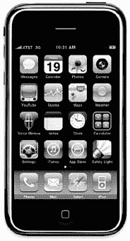
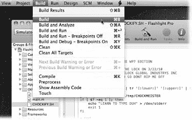

# 打造一款出色的 iPhone 应用

打造一款出色的 iPhone 应用常常需要团队协作。无论你是开发者、设计师、营销人员还是项目经理，都能找到让你快速上手这个崭新且激动人心的平台的相关主题。当需要深入学习时，专家建议会为你指明方向，助你掌握细节。

## App Store

自 2008 年 7 月 iTunes App Store 上线以来，已有超过 10 万个 iPhone 应用提交至该商店。用户下载量超过 30 亿次，这些应用都是由像你一样的开发者创造的。这一事业的成功，远超所有人的最大预期。

1

[www.it-ebooks.info](http://www.it-ebooks.info/)

## 引言

在 App Store 推出之前，iPhone 应用开发仅限于苹果公司位于加州库比蒂诺总部的天才工程师们。但仅仅几年时间，全球成千上万的开发者就发现为 iPhone 编写软件既简单又有趣。此外，通过保留用户在 iTunes 中为应用支付的每一美元的 70 美分，一些开发者发现这些应用利润丰厚。

这些早期采用者也通过艰难的方式领悟到一点：你口袋里随身携带的这款新颖创新的计算设备，遵循着一套不同的规则。小巧的机身中集成了多点触控显示屏和无处不在的网络，这带来了诸多挑战。

困难并非只限于技术层面。如何设计、构建和分发你的应用，也需要一套新的思维方式。许多开发者在初次涉足大众消费市场时都曾苦苦挣扎。

当你从头到尾走一遍 iPhone 应用开发流程时，你将从前人身上学习。你将避免一些人犯过的错误，同时借鉴其他人的成功经验。当然，目标是帮助你做出尽可能最好的应用。

**图 1-1：**  
*还有什么比观看经验丰富的开发者通过分步指导构建产品，更能学习 iPhone 应用开发呢？在本书中，你将见证 Safety Light（A）应用从诞生到在 iTunes App Store 上架销售的全过程。*

A

2

iPhone 应用开发：缺失手册

[www.it-ebooks.info](http://www.it-ebooks.info/)

## 引言

### 关于本书

尽管多年来软件有了许多改进，但有一个功能却一直变得更差——文档。如今购买大多数软件程序时，你连一页印刷说明书都得不到。要了解一个程序中数百个功能，你得依赖在线电子帮助。

但即使你习惯在一个窗口中阅读帮助屏幕，同时尝试在另一个窗口中工作，仍然缺少些什么。有时，简洁的电子帮助屏幕假设你已经理解了当前讨论的内容，匆匆跳过需要深入讲解的重要主题。此外，你并非总能获得对程序功能的客观评价。（你的工程师同事常常会在程序中加入技术复杂的特性，是因为他们*能*做到，而不是因为你需要它们。）你不该浪费时间学习那些无助于完成工作的功能。

在本页中，你将找到开发 iPhone 应用的分步指导。此外，你还将发现诸如设计、销售和营销等“宏观”主题也有涵盖。目标是让你成为一名高效且成功的开发者，而不仅仅是教你如何编写代码。

**注：** 本书会定期推荐*其他*书籍，涵盖那些对于 iPhone 开发手册来说过于专业或旁支的主题。细心的读者可能会注意到，并非所有推荐书目都由《缺失手册》的母公司奥莱利传媒出版。虽然我们乐于提及《缺失手册》系列及奥莱利家族的其他书籍，但如果外社有一本好书，我们同样会告知你。

《iPhone 应用开发：缺失手册》旨在适应不同技术水平的读者。主体内容面向具备一定编程知识的计算机用户编写。但如果你是初学者，名为“快速入门”的侧边栏文章将提供理解当前主题所需的入门信息。另一方面，如果你是高级用户，请留意名为“高级用户诊所”的类似灰框内容，它们为经验丰富的开发者提供了更专业的技术提示、技巧和捷径。

## 关于大纲

《iPhone 应用开发：缺失手册》分为四个部分，大部分包含若干章节：

- **第一部分：Cocoa Touch 入门。** 在前四章中，你将构建第一个 iPhone 应用，并熟悉基本工具：Cocoa Touch、Interface Builder、`Xcode`和 Objective-C 编程语言。你还将开始思考如何利用这些工具设计新应用。

## 引言

**3**

Download from Wow! eBook

[www.it-ebooks.info](http://www.it-ebooks.info/)

- **第二部分：深度开发。** 在接下来的三章中，你将学习如何搭建 iPhone 开发环境，包括首次将应用安装到手机上。你还将跟随引导，通览已完成应用的代码，并学习如何测试最终产品。

- **第三部分：商业运作。** 最后两章探讨成为 iPhone 开发者的商业之道。你将学习如何将应用上架 iTunes、通过多种营销渠道推广、以及如何跟踪销售情况。对 iPhone 应用市场的调查将帮助你了解自己的应用定位。

- **第四部分：附录。** 附录将向你介绍丰富的资源，以便深入学习本书涵盖的所有主题。

在缺失手册网站上，你可以找到免费的可下载补充材料。除了“安全灯”iPhone 应用的项目和源代码外，你还可以找到可用于产品的推广网站模板。

## 基本概念

本书极少使用行话或专业术语。但你会遇到一些在计算机生活中频繁出现的术语和概念：

- **点击操作。** 本书提供了三种需要使用鼠标或触控板的指令。*单击*指将箭头光标指向屏幕上的某个对象，然后——完全不移动光标——按下并松开鼠标（或笔记本触控板）的左键。*双击*自然指快速连续点击两次，同样不移动光标。而*拖拽*指在持续按住左键的同时移动光标。

- **键盘快捷键。** 每次将手从键盘移到鼠标上，你都会浪费时间，并可能打断创作流程。这就是为什么许多经验丰富的开发者尽可能使用按键组合而非菜单命令。例如，`⌘-B`是在`Xcode`中构建应用的键盘快捷键。

当你看到类似`⌘-S`（用于保存当前文档的更改）的快捷键时，它表示按住`⌘`键，保持按下状态，再按下字母`S`键，然后同时松开两个键。

- **选择是件好事。** `Xcode`和`Interface Builder`经常提供多种方式来触发某个命令——例如，通过选择菜单命令，*或*点击工具栏按钮，*或*按下组合键。有些人偏爱键盘快捷键的速度；另一些人喜欢菜单或工具栏中直观命令列表的满足感。本书列出了所有替代方式，但你绝不需要全部记住。

**4**

iPhone 应用开发：缺失手册

[www.it-ebooks.info](http://www.it-ebooks.info/)

## 关于➝这些➝箭头

在本书以及整个《Missing Manual》系列中，你会看到类似这样的句子：“打开 `硬盘`➝`开发者`➝`应用程序`文件夹。”这是对更冗长指令的简写，指引你依次打开两个嵌套的文件夹，具体如下：“在你的硬盘上，找到一个名为`开发者`的文件夹。打开它。在`开发者`窗口内，有一个名为`应用程序`的文件夹；双击将其打开。”

同样，这种箭头简写也有助于简化菜单命令的选择，如图 I-2 所示。

**图 1-2：** *当你在《Missing Manual》中读到“选择 `构建`➝`构建`”时，意思是：“点击`构建`菜单将其打开。然后点击该菜单中的`构建`。”*

## 实例演练

本书旨在帮助你更快、更专业地将作品部署到 iPhone 上；因此，本书一半的价值也自然体现在 iPhone 上。

当你阅读各章节时，会遇到许多*实例演练*——这是些循序渐进的教程，你可以使用从 Missing CD（`www.missingmanuals.com/cds`）下载的原材料（如图形和源代码）自行构建。如果只是躺在吊床上悠闲地阅读这些分步教程，你可能收获不大。但若肯花时间在电脑前动手实践，你会发现这些教程能让你以前所未有的深度洞悉专业 iPhone 开发者构建应用的方式。

iPhone 开发也是一个快速演进的领域。要跟上最新动态，请访问本书网站 `http://appdevmanual.com`。

## 前言

**5**

[www.it-ebooks.info](http://www.it-ebooks.info/)

### 关于 MissingManuals.com

在 `www.missingmanuals.com`，你可以找到与《iPhone 应用开发：Missing Manual》相关的文章、技巧和更新。事实上，我们欢迎并鼓励你自行提交更正和更新。为了尽可能保持本书的时效性和准确性，我们每次加印本书时，都会采纳你提供的任何经过确认的更正。我们还会在网站上注明这些变更，以便你愿意的话，可以将重要更正标记到自己的书本中。

（请访问 `www.missingmanuals.com/feedback`，从弹出菜单中选择本书名称，然后点击`前往`查看变更。）

同样在我们的反馈页面上，你可以获得针对阅读本书时产生问题的专家解答、撰写书评，以及找到对 iPhone 应用开发有共同兴趣的读者群组。

我们非常乐意听取你对《Missing Manual》系列新书的建议。在 `missingmanuals.com` 上也有相应的提交位置。此外，你在线时还可以在 `www.oreilly.com` 上注册本书（可直接访问 `http://tinyurl.com/yo82k3` 跳转到注册页面）。注册后，我们就能向你发送本书的更新信息，并且你将有资格获得特别优惠，比如《iPhone 应用开发：Missing Manual》未来版本的折扣。

### Safari® Books Online

Safari® Books Online 是一个按需提供的数字图书馆，让你轻松搜索超过 7,500 本技术和创意参考书籍及视频，快速找到所需答案。

订阅后，你可以在线阅读我们图书馆中的任何页面和观看任何视频。在手机和移动设备上阅读书籍。在纸质版上市前访问新书名，获取独家权限阅读开发中的手稿，并向作者提供反馈。复制粘贴代码示例，整理收藏夹，下载章节，为关键部分添加书签，创建笔记，打印页面，并享受大量其他省时功能。

O'Reilly Media 已将本书上传至 Safari Books Online 服务。要获得对本书以及 O'Reilly 及其他出版商提供的类似主题其他书籍的完全数字访问权限，请免费注册 `http://my.safaribooksonline.com`。

**6**

iPhone 应用开发：Missing Manual

[www.it-ebooks.info](http://www.it-ebooks.info/)

### 第一部分：入门指南

## i with Cocoa Touch

#### 第 1 章：构建你的第一个 iPhone 应用

### 第 2 章：Objective-C：括号的力量

#### 第 3 章：Cocoa Touch：让 Objective-C 大显身手

### 第 4 章：设计工具：打造更出色的手电筒

[www.it-ebooks.info](http://www.it-ebooks.info/)

[www.it-ebooks.info](http://www.it-ebooks.info/)

## 第 章：构建你的第一个 iPhone 应用

你有一个创意，它将在 iTunes App Store 上为你带来名望与财富。

你决定编写一个 iPhone 应用。第一个也是最重要的任务是熟悉用于构建产品的工具。中国有句古语："旅途本身就是回报"，而本章正是关于这段旅途的。在接下来的篇幅中，你将从头到尾体验整个应用开发流程。你将学习如何配置所需的软件，并亲自尝试构建一个应用。

但该构建什么应用呢？如果你快速搜索一下 App Store，会发现手电筒应用比比皆是。对于许多有抱负的开发者来说，这款简单的应用是入门必经之路。那么，现在正是你加入这群优秀开发者行列的机会。一旦你发现创建自己的应用如此简单，你就会纳闷为什么还有人愿意在 iTunes 上花 99 美分购买它！

## 获取工具

没有工具，你什么都做不了，包括 iPhone 应用。幸运的是，你可以在 Mac 上找到所有需要的东西，或者免费下载。具体来说，你需要在 Mac 上下载并安装 `Xcode` 开发软件和 iPhone 软件开发工具包（SDK）。（如果你没有 Mac，请参阅下一页的说明。）

Mac 和 iPhone 都受益于一套经得起时间考验的丰富技术。iPhone SDK 基于 NeXT 公司在 20 世纪 80 年代创建的基础架构构建。这家由史蒂夫·乔布斯创立的公司，打造了一款革命性的面向对象操作系统，名为 `NeXTSTEP`。这个具有影响力的系统已演变为今天使用的 OS X 操作系统。随着你对 iPhone 的深入了解，你会发现它和 Mac 有许多共同之处。

**9**

[www.it-ebooks.info](http://www.it-ebooks.info/)

### 获取工具

***注意：*** 每当看到以 "NS" 为前缀的对象时，你都能看到 NeXT 的遗产。这些缩写代表 `NeXTSTEP`。

**快速入门**

**买一台 Mac**

如果你想开发 iPhone 应用，就必须在 Macintosh 上完成。苹果的开发工具不能在 Windows 或其他任何操作系统上运行。就像你不能在 Mac 上运行微软 Visual Studio 一样，你需要一台 Mac 来运行构建 iPhone 应用的工具。这些工具依赖于底层系统软件的特性。

如果你没有 Mac，以下是一些提示，帮助你做出正确的购买选择：

- **购买二手设备。** 如果预算紧张，可以看看 `eBay` 或 `craigslist`。别人淘汰的旧硬件完全可以满足 iPhone 开发的需求。你要创建的应用很小，不需要很强的处理器性能来构建和测试。购买较老硬件时唯一需要注意的是，确保这个 Mac 使用的是 Intel 处理器。开发工具不适用于较老的 PowerPC 处理器。

- **添置一台 Mac mini。** 购买一台新的 Mac mini 是一个绝佳选择。将 Mac mini 连接到 KVM 交换机后面很方便，这样你就可以快速在不同机器之间切换。

- **不妨大方一次。** 苹果生产着一些非常性感的硬件。特别是新款笔记本电脑，让人难以抗拒。如果你正在寻找理由来证明这笔消费的合理性，这里有些帮助：Mac 现在使用 Intel 处理器，这意味着你可以在新机器上运行 Windows 或任何其他基于 x86 的操作系统。你可以使用苹果免费的 Boot Camp 工具启动到任何操作系统。或者，你可能会发现安装第三方软件（如 `VMware Fusion`）更容易，从而在 Mac OS X 内的虚拟机上运行其他操作系统。当你需要查看 iPhone 产品网站在 Internet Explorer 中的显示效果时，虚拟机尤其方便。只需启动虚拟机，在 Windows 中打开浏览器，然后加载测试 URL 即可。

