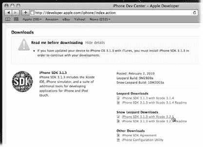
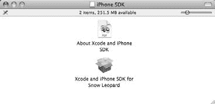

# 安装 Xcode

如果你已经拥有显示器、键盘和其他外设，可以选择此方案。只需购买一台新 CPU 并复用现有设备，就能省下一笔可观的费用。如果你是软件开发人员，这些东西可能早就堆在储藏室里了。而且，如果你在多个平台进行开发，想想你在开发工具上能省下多少钱。如果你习惯了为 `Visual Studio` 和 `MSDN` 花费数千美元，那么得知苹果所有开发者工具都是免费的时，你会感到惊喜。把钱花在硬件而不是工具上，你会更划算。

当你和你的 Mac 准备就绪后，就该往硬盘里装载大量新软件了。苹果免费提供 `Xcode` 开发工具，但并未预装在每一台 Mac 上，因为大多数消费者永远不会用到它们。

## 获取工具

幸运的是，你可以直接在 `Snow Leopard` 安装光盘上找到 `Xcode` 工具。

要运行 `Xcode`，苹果建议你使用运行 `Leopard` 或 `Snow Leopard` 的 Intel Mac。以下步骤说明了如何将软件安装到硬盘上以供使用：

**注意：** 你可以在 `Leopard` 上安装 `iPhone SDK` 和其他开发工具，但 `Snow Leopard` 版本的工具相比上一版本有显著改进。在最新版本的 `Mac OS X` 上工作，能确保你获得最新、最强大的功能。

1. 将安装 DVD 插入 Mac，双击其图标。在 `Optional Installs` 文件夹中，双击 `Xcode.mpkg` 文件。

   双击该文件后，`Xcode` 安装过程开始。

2. 在介绍屏幕上，点击 `Continue`。当许可协议屏幕出现时，点击 `Continue`，然后点击 `Agree`。

   许可协议与你安装任何软件时同意的法律条文相同。如果你喜欢看这种东西，可以读一读。完成后，下一个屏幕会允许你选择要安装的内容，如图 1-1 所示。

   **图 1-1：** *Xcode 安装程序默认会为你选中除 `Mac OS X 10.4` 之外的所有复选框。保持这种状态即可。你可以点击每个软件包名称查看安装的具体内容：除了你期望的集成开发环境 (IDE) 之外，你还会找到用于监控性能的工具和大量文档。*

3. 在 `Custom Install` 屏幕上，确保除 `Mac OS X 10.4` 之外的所有复选框都已选中，然后点击 `Continue`。

   安装程序会将 DVD 上的所有 `Xcode` 复制到你的硬盘上。此过程需要几分钟时间。

4. 最终屏幕会提示你选择安装位置。确保它与所有其他应用程序存储在同一磁盘上。点击 `Install` 开始安装。

   根据你 Mac 的速度，此过程可能需要几个小时。暂时离开电脑，去呼吸一下新鲜空气。

   一切安全复制到硬盘后，你会看到以下消息：“安装成功。”

5. 点击 `Close` 退出。

6. 此时你可以安全弹出 DVD。

安装完成后，进入硬盘上的 `Hard Drive ➝ Developer ➝ Applications` 文件夹，查看你的新工具。此文件夹包含你用于开发 Mac 和 iPhone 应用程序的应用程序和实用工具：你最常用的是 `Xcode` 和 `Interface Builder`。父级 `Developer` 文件夹中还包含所有附带的开发者框架、库和文档。

`Xcode` 安装不包括一项内容——为 iPhone 开发应用所需的 `iPhone SDK`。对此，请继续阅读下一节。

***提示：*** 现在你已拥有工具，记得维护它们。苹果会定期更新 `Xcode`，因此你 Snow Leopard DVD 上的版本最终会过时。当重大更新发布时，苹果会发送电子邮件提醒你访问 iPhone 开发中心进行升级，详情参见下一小节。

## 获取 iPhone SDK

你必须先加入 iPhone 开发者计划，苹果才会允许你获取 iPhone SDK。通过免费会员身份，你可以通过 iPhone 开发中心（图 1-2）访问工具、文档和开发者论坛。

***图 1-2：***

*iPhone 开发中心是你作为 iPhone 开发者的首要且最佳资源。你将利用此站点下载和更新 iPhone SDK、查找示例代码和文档、与其他 iPhone 开发者交流，并为你的产品在 iTunes 上销售做准备。*

**12**

iPhone 应用开发：missing manual

[www.it-ebooks.info](http://www.it-ebooks.info/)

## 获取工具

**1. 要注册 ADC 会员，请将浏览器指向** `http://developer.apple.com/iphone/`**。点击右上角的“注册”链接。**

你使用 Apple ID 访问 iPhone 开发中心。如果你有 iTunes 账户或曾在 Apple Store 购物，说明你已经有一个 Apple ID。请直接使用它来创建你的开发者账户，并跳至第 4 步。

***注意：*** 如果你一直将 Apple ID 用于个人事务，例如 iTunes 和 MobileMe 家庭照片库，你可能希望为你的开发者账户创建一个新的 Apple ID。使用专门用于商业用途的独立 Apple ID 有助于避免会计和报告方面的问题。请参阅第 8 章，了解你的开发者账户和 iTunes Connect 如何影响你的业务。

**2. 如果你正在设置新的 Apple ID，请输入你的姓名、联系信息以及用于密码找回的安全问题。**

**3. 勾选复选框以接受许可协议，然后点击“继续”。**

几分钟后，苹果会向你发送一封验证账户的电子邮件。

**4. 点击“电子邮件验证”链接，并输入邮件中包含的验证码以完成账户设置。**

一旦设置好账户并登录，你会在 iPhone 开发中心看到许多新增内容。你可以访问一些很棒的资源，例如“入门视频”、“编码指南”和“示例代码”。现在，请将注意力转向 iPhone SDK 的下载。

**1. 点击“下载”链接，你会在页面底部看到一系列链接，如图 1-3 所示。**

随着 iPhone SDK 新版本的发布，这些链接会相应更新。选择与你 Mac OS X 版本匹配的最新发布版本。撰写本文时，它是“iPhone SDK 3.1.3 with Xcode 3.2.1”。

iPhone SDK 的下载包很大：大小可以从几百兆字节到超过 2 GB。请耐心等待它通过浏览器下载、验证并挂载：这需要一些时间。

下载完成后，你的“下载”文件夹中会有一个 `.dmg` 磁盘映像，并且桌面上会出现一个新的 iPhone SDK 磁盘，如图 1-4 所示。

第 1 章：构建你的第一个 iPhone 应用

**13**

[www.it-ebooks.info](http://www.it-ebooks.info/)

## 获取工具

***图 1-3：***

*你可以在 iPhone 开发中心页面底部找到下载 iPhone SDK 的链接。此图中的链接适用于版本 3.1.3，但随着苹果更新 SDK，这些链接会发生变化。你可以点击“自述”链接查看该版本的新特性。*

***图 1-4：***

*下载成功后，此磁盘映像会出现在你的桌面上。其名称会随每个新版本而变化，通常以“iphone_sdk”开头，后跟版本号和“.dmg”扩展名。双击方框图标启动安装程序。安装过程中的 PDF 文件包含关于该版本的信息，你可以在安装时阅读。*

好的，作为高级文档工程师和翻译员，我已经根据您的注意事项和示例，将给定的英文文本翻译成了中文。

---

获得 iPhone SDK 磁盘映像后，您可以开始安装：

1.  **双击“iPhone SDK”文件以启动安装过程。** 它是一个带有棕金色盒子的图标。
2.  **在欢迎和许可协议屏幕上，点击“继续”。**
3.  **点击“同意”以接受许可协议。**
4.  **在安装屏幕上，点击“继续”以安装标准包，然后点击“安装”以启动安装过程。**
5.  **如果需要，请输入您的密码以便修改系统文件。**
6.  **此时，最好也退出 iTunes，以避免出现暂停安装的对话框。**

安装过程所需时间取决于您 Mac 的速度以及下载的大小，可能需要半小时到几个小时不等。当安装完成时，您会看到一个绿色的勾选标记，然后可以点击“关闭”完成操作。此时，您可以弹出 iPhone SDK 磁盘，但请保留 `.dmg` 文件作为备份。

> **注意：** 与 Xcode 一样，Apple 会定期更新 iPhone SDK。您需要定期返回 iPhone Dev Center 以安装最新版本的 SDK。Apple 通常会与新的 iPhone 固件版本一起发布新版本的 SDK。

## SDK 的未来发展

随着 Apple 修复错误和添加新功能，iPhone SDK 也在不断发展。您需要更新您的开发环境以跟上最新的变化。Apple 通过两种不同的方式更新 iPhone SDK。第一种，也是最简单的一种，是维护版本。这些版本仅修复固件中的错误，不会引入任何新功能。在大多数情况下，您无需对应用程序进行任何更改。

Apple 在向客户提供固件更新的同一天，也会向开发者提供 SDK 的维护版本。这些版本使用三位数的版本号，例如 2.2.1 和 3.1.3。一旦您在设备上安装了新固件，就需要更新 iPhone SDK，以便从 Xcode 安装和调试您的应用程序。如果不这样做，您将会看到工具不支持该设备固件版本的警告。

当 Apple 对固件进行更实质性的更改（无论是添加新功能还是修改现有功能）而影响开发者软件时，它会在 iPhone Dev Center 上发布 iPhone SDK 的测试版。只有付费加入 iPhone Developer Program 的开发者才能访问这些预发布版本。（第 30 页介绍了如何注册此开发者计划。）这些测试版适用于主要版本，例如 3.0 或 4.0，或 3.1 之类的修订版。Apple 通常会在公开发布前三到四个月开始测试版发布周期。一旦周期开始，它就会每隔几周发布一个新的 SDK（称为 Beta 1、Beta 2，依此类推）。

这些测试版通常还包含一个改进的、支持新 iPhone OS 的新版本 Xcode，以及新的固件。通过提前使用新版 SDK，您可以使用新的 iPhone 固件构建和运行您的应用程序。如果您一直小心地只使用有文档记录的 Feature 和 API，那么您应该不会遇到太多问题：Apple 的工程师非常擅长保持与已发布接口的兼容性。您可能会在编译时看到弃用警告，但这些通常很容易修复。更有可能的是，您会在测试阶段花时间了解新功能并在您的应用程序中进行测试。

在安装 iPhone SDK 的测试版时，有几点需要注意。首先，您不能使用测试版工具向 App Store 提交应用程序。幸运的是，您可以在硬盘上安装多个版本的 Xcode。要安装工具到其他位置，请按照以下步骤操作：

**1. 如果 iPhone 模拟器正在运行，请先退出。**

如果跳过此步骤，安装过程将无限期挂起，您需要退出`Installer`并重新开始。

**2. 双击磁盘映像中的 iPhone SDK 图标以启动安装过程。同意许可协议并选择一个目标硬盘。**

您会看到要安装的软件包列表。在第二列中，`Developer`被设置为位置。您需要为测试版更改位置。

**3. 点击`Developer`，然后从弹出菜单中选择`Other`（参见图 1-5）。**

此时会打开一个对话框，让您选择一个文件夹。

***图 1-5：*** *您可以为 iPhone SDK 选择自定义安装位置。由于您不能使用 iPhone SDK 的测试版为 App Store 构建应用程序，因此需要在硬盘上保留两个版本的工具。在安装过程中，点击`Developer`文件夹图标并选择`Other`来为测试版选择位置。*

**4. 通过从设备列表中选择硬盘名称，导航到硬盘的根目录。然后点击`新建文件夹`按钮，输入`DeveloperBeta`。点击`创建`来创建该文件夹。**

**5. 选择`Choose`以使用`DeveloperBeta`文件夹进行安装。**

返回主安装窗口后，您会看到`DeveloperBeta`显示为位置。

**6. 要使用测试版，请从新的`硬盘` ➝ `DeveloperBeta` ➝ `Applications`文件夹中启动`Xcode`和其他工具。**

现在还有第二个注意事项：测试版是苹果公司的保密信息，受保密协议（NDA）约束。这些法律术语意味着你不能公开谈论它。你只能在苹果开发者论坛（`http://devforums.apple.com`）上讨论新的 SDK。你可以与其他开发者交流，他们和你做着同样的事情：通过提问和分享发现来了解新版本。苹果工程师也会参与讨论。

保密协议还意味着你找不到任何书籍或其他媒体来帮助你理解这些变化。关于测试版的唯一信息来自苹果公司本身，并发布在 iPhone 开发者中心。通常会有“新增功能”文档、发布说明和 API 差异列表。请完整阅读这些文档：当你等待几个 GB 的 SDK 下载时，这是消磨时间的好方法！

另一个信息来源是苹果的年度开发者大会 WWDC。测试版通常与这个为期一周的大会同期发布，这样每个人都可以详细讨论新功能。大会夏季在旧金山举行：这是结识其他开发者并学习许多新事物的好机会。

## 探索你的新工具

你的 Mac 现在已经设置为创建 iPhone 应用程序，因此你可以开始制作你的第一个应用了。最棒的是，你不需要编写任何代码。不写代码怎么能开发呢？借助 Xcode 模板和 Interface Builder 的省时功能，这是可以做到的。

如果你是一位经验丰富的开发者，这种工作方式可能会带来挑战。如果你习惯于在 Visual Studio、Eclipse 或其他环境下工作，初次接触 Xcode 可能会让你感到有些畏惧。除了在一个新的操作系统上工作，你还要处理新的项目布局、快捷键和偏好设置。别担心，你习惯使用的所有工具都还在，你只是需要一些时间来熟悉 Xcode 对这些工具的实现方式。

在本节中，你将经历创建 iPhone 应用程序的所有阶段，从使用 Xcode 创建项目文件到在 iPhone 模拟器中运行它。你还会初步了解 Interface Builder 应用程序，它允许你修改用户界面。

