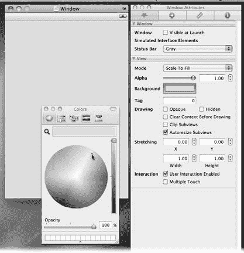

# 探索你的新工具

每只手电筒都需要一份零件清单

创建 iPhone 应用的第一步是建立一个项目文件。这个文件会追踪 Xcode 用于构建应用的相关信息。在这里，你可以管理源代码、用户界面、框架和库。你可以把它看作是你的应用零件清单。

1.  在你的硬盘 ➝ Developer ➝ Applications 文件夹中，双击 Xcode 图标以启动应用程序。（它位于列表底部。）棘手之处在于 Xcode 并不在常规的 Applications 文件夹中。安装程序会将其放置在 *Developer* ➝ Applications 文件夹中。为了方便以后再次打开 Xcode，请将其图标保存在 Dock 中。

2.  在 Dock 中，按住 Control 键点击图标，然后选择 Options ➝ Keep in Dock。

从此以后，你只需单击 Dock 图标即可启动 Xcode。

Xcode 启动后，你会看到其欢迎窗口，如图 1-6 所示。

***提示：*** 如果不小心关闭了欢迎窗口，可以通过选择 Help ➝ Welcome to Xcode 来重新打开它。

***图 1-6：***

*Xcode 启动窗口。*
*当你用 Xcode 创建新项目时，它们会显示在右侧列表中。点击 "Create a new Xcode project" 按钮开始创建你的第一个 iPhone 应用。点击 "Getting started with Xcode" 按钮会打开文档查看器，并显示一个对 Xcode 有用的概述介绍。最后一个按钮是通往 Mac 和 iPhone Dev Centers 的便捷链接。*

3.  点击 "Create a new Xcode project" 大按钮。

此时会打开“新建项目”窗口（图 1-7），显示一系列可供选择的模板类别。在 Xcode 中，*模板* 是一组预定义的源代码文件、库、框架和用户界面元素，用于创建不同类型的应用。

**18**
iPhone 应用开发：缺失手册

***图 1-7：***

*Xcode 的新建项目窗口列出了所有可用来快速上手的模板。在开始一个新应用时，请选择最能描述你想要实现的用户界面风格的模板。选中后，每个模板都会显示一段简短的描述。有些模板甚至包含选项，例如这里显示的 "Use Core Data for database storage"（使用 Core Data 进行数据库存储）。*

4.  由于你正在创建一个 iPhone 应用，请在左上角的 iPhone OS 组下，选择 Application 并查看可用的模板。

你的选择分为以下几类：

-   **基于导航的应用（Navigation-based Application）。** 这类应用具有“逐层深入”的界面风格，例如 iPhone 的 Mail 应用。
-   **OpenGL ES 应用（OpenGL ES Application）。** 在 3D 空间中绘制物体的游戏使用此模板。
-   **标签栏应用（Tab Bar Application）。** 这种风格的应用使用屏幕底部的标签栏来切换视图。苹果的 iPod 应用就是此用户界面风格的一个绝佳例子。
-   **工具应用（Utility Application）。** 这类应用通常呈现一个简单的界面，包含一个用于展示信息的前视图和一个用于配置信息的后视图。内置的天气应用就使用了这种隐喻。
-   **基于视图和窗口的应用（View- and Window-based Applications）。** 当你的应用结合了前四种风格的元素时，可以转向这些模板。可以把它们视为可以按需自定义的*骨架*模板。

对于你的手电筒应用，你将使用基于窗口的应用模板。由于该应用仅使用单个窗口，这个基础模板就足够了。使用这个可自定义模板的一个好处是，它为项目创建了更少的文件。实际上，你拥有了一份更短、更简单的零件清单。

**19**

5.  点击“Window-based Application”，然后点击“Choose”。保持“Use Core Data”复选框未选中状态，因为手电筒应用不需要数据库。

此时会弹出一个文件保存对话框，以便你为项目文件夹指定名称和位置（图 1-8）。

**图 1-8：** 对于手电筒项目，请告知 Xcode 在你的`Documents`文件夹内创建一个名为`Flashlight`的文件夹。

6.  在项目名称处输入`Flashlight`，并从底部的下拉菜单中选择`Documents`文件夹。

如图 1-9 所示，你刚刚在访达中创建的文件夹包含了构建应用所需的一切，包括主项目文件`Flashlight.xcodeproj`。

**图 1-9：** 当你用 Xcode 创建项目时，它会创建一个包含用于构建应用的文件文件夹。其中最重要的是`.xcodeproj`文件——你可以双击此文件在 Xcode 中打开项目。此外，由于你创建的是一个基于窗口的应用，Xcode 会为你提供一个名为`Main Window.xib`的起始文件。在接下来的章节中，你将了解更多关于其他文件和文件夹的信息。

Xcode 会在后台创建这个项目文件夹。在你的 Xcode 生涯中，你可能永远不会直接与文件或文件夹交互。相反，你可以依靠 Xcode 来为你管理一切。但你仍然需要知道这个文件夹的位置，以便备份你的工作。

**提示：** 随着你对 Xcode 运用得越来越熟练，你可能希望将项目放在你个人文件夹内各自独立的文件夹中。许多开发者会创建一个`Projects`文件夹，里面只存放他们的 Xcode 文件夹。就像“图片”、“影片”和“音乐”文件夹能让你更方便地管理媒体文件一样，一个`Projects`文件夹能让你更方便地管理你的软件。

在 Xcode 完成创建新项目后，它会在一个项目窗口中显示这些文件，如图 1-10 所示。

**图 1-10：** Xcode 项目窗口。左侧是项目的分组和文件，右侧是源代码编辑器。虽然黄色的分组图标看起来像文件夹，但它们与你之前在访达中看到的蓝色文件夹不同。你可以重命名`Classes`分组，而不会影响磁盘上的文件夹。同样，你在访达中找不到`Resources`文件夹，但该分组是组织非源代码文件的好方法。

项目窗口左侧的“Groups & Files”面板列出了构成你应用的各个文件。回到零件清单的比喻，每个分组都包含类型相似的零件。以下是一些最重要的分组：

- **Classes.** 此分组中的文件包含你项目的实际源代码。
- **Resources.** 用户界面文件、图形和应用配置文件都属于 Resources 分组。
- **Frameworks.** 这些文件包含 iPhone SDK 使用的工具。

窗口的编辑器部分（右下角的大白色区域）显示了应用启动完毕时运行的代码。在这个简单的例子中，代码使窗口对象可见并能响应点击操作。

你将在下一章中了解更多关于这些重要分组和源代码的信息。记住：本章的目标是在不编写任何代码的情况下构建一个应用！

## 一些组装工作

你已经收集了所有零件，现在是时候组装它们了。与圣诞前夕的玩具不同，Xcode 项目很容易组装。多亏了模板，你只需启动“构建”命令，Xcode 就会获取所有源代码、资源和框架，并将它们组合成一个可在 iPhone 上运行的可执行文件。

确保项目窗口左上角的下拉菜单设置为“模拟器”和“调试”（菜单上的具体文字会根据你使用的 iPhone SDK 版本而有所不同）。然后选择“产品”➝“构建”，如图 1-11 所示。

稍等片刻后，你应该会在左下角的状态栏中看到“构建成功”。

**注意：** Xcode 的状态栏位于窗口底部，是一个重要的信息来源。当你执行各种任务时，此区域会向你通报它们的进度。当你想知道发生了什么时，这是你应该首先查看的地方。

**图 1-11：** 构建你的 iPhone 应用。请注意，“概览”菜单已设置为“模拟器”和“调试”。键盘组合键 ⌘-B 是一个方便的快捷键，用于在对源代码进行更改后构建项目。

一旦你构建了应用，你就可以在 iPhone 上运行它。或者更好的是，在你的 Mac 上运行它。没错。如果你和大多数开发者一样，你大约 90% 的时间都会在 Mac 上运行你的 iPhone 应用。应用在 Mac 上的启动速度比在 iPhone 上快，并且当出现问题时，在 Mac 上调试也更容易。

**注意：** 不要忽视那最后的 10%。在实际设备上运行你的应用极其重要：你将在第 4 章讨论设计问题时明白原因。

## 在 Mac 上试运行

在开发 iPhone 应用时，你可能在它靠近 iPhone 之前，先在 Mac 上运行它来进行测试和调试。

那么，如何在你的 Mac 上获得一个 iPhone 呢？很简单：确保“概览”菜单中选择了“模拟器”，然后选择“运行”➝“运行”。由于你选择了模拟器，Xcode 会使用 iPhone 的模拟来运行你的应用。

留意一下状态栏。你会看到显示“正在模拟器中安装 Flashlight”，最终会显示“Flashlight 已启动”。不久之后，你的桌面上会出现一个巨大的 iPhone，并且它正在运行你的`Flashlight`应用（图 1-12）。恭喜！

**图 1-12：** 在 iPhone 模拟器中，左侧的图像显示应用正在运行，右侧的图像显示主屏幕上的应用图标。它放不进你的口袋，但模拟器的行为就像一个真实的、活生生的 iPhone。

**提示：** 你可以通过一次按键来完成本节和上一节中完成的所有操作。按 ⌘-回车键可以在一个步骤中（在模拟器中）构建并运行你的应用。当你深入 iPhone 应用开发时，你会在睡梦中都按这些键。

那么，这个巨大的 iPhone 能做什么呢？它被称为 iPhone 模拟器，其行为与你口袋里的设备相似，除了以下几点：

- 它的速度快了数百倍。
- 它拥有与你的 Mac 一样多的内存。
- 网络更可靠。
- 它有更大的显示屏。
- 它不能通过 USB 数据线与 iTunes 同步。
- 触摸模拟器屏幕没有效果。

实际上，这个坐在你桌面上的大手机与你习惯用的那款有着截然不同的硬件规格。但一旦你习惯不让手指触控屏幕，你最终会爱上模拟器。它让你的开发者生活变得轻松得多，因为它做了一件重要的事情：它让你无需将 iPhone 连接到 Mac 就能测试代码。第 25 页的边框区域将向你展示如何充分利用这个重要工具。

当你点击 `Home` 按钮时，会看到屏幕上显示着 `Xcode` 安装的应用程序。由于目前只有一个应用，你只会看到 `Flashlight` 应用。拖动鼠标即可在应用页面之间滑动切换。你在 iPhone 上习惯看到的许多应用都消失了，但在测试时你仍然能够使用 `照片`、`通讯录`、`设置` 和 `Safari`。点击应用的图标就会像在真实设备上一样在模拟器中启动它。

***提示：*** 模拟器托盘中的 `Safari` 图标对于测试网站在 iPhone 上的显示效果非常有帮助。

当你开始推广自己的应用时，你会希望使用模拟器在移动设备上检查你的产品页面。

## 探索你的新工具

### 高级用户课堂：模拟现实

iPhone 模拟器的工作方式与你口袋中的设备非常相似。然而，有时如何让虚拟设备表现得像物理设备一样并不那么显而易见。

当你按住 `Option` 键时，会出现两个点。这些点显示了点击鼠标按钮时多点触控事件的位置。利用这一功能可以模拟缩放 iPhone 屏幕的捏合与张开手势。

你还应该查看一下模拟器的 `硬件` 菜单。该菜单上有两个命令可以让你向左或向右旋转设备——如果你的应用能检测设备方向，这个功能会非常方便。选择 `硬件`➝`向左旋转` 或 `向右旋转`。

如果你的应用使用了摇动手势，菜单中也有一个选项可以模拟摇动。摇动是 iPhone 复制和粘贴机制（用于撤销操作）的标准组成部分。

`硬件` 菜单还允许你模拟 iPhone 通话时显示的状态栏（选择 `硬件`➝`切换通话中状态栏`）。这样，你就可以验证当显示窗口缩小 20 像素时，你的应用是否正确调整了用户界面（UI）。

随着你在 iPhone 开发中越来越深入，你会有机会使用 `硬件`➝`锁定` 命令。你可以让应用检测 iPhone 何时休眠和唤醒，而 `锁定` 就是模拟这一过程的方式。

另一个高级模拟器功能是内存警告。iPhone 可供应用使用的内存有限。`硬件`➝`模拟内存警告` 让你可以测试当手机内存不足时应用的行为。许多开发者在从 Mac 上无限的内存过渡到设备上仅有的 128 MB 内存时遇到了问题。`模拟内存警告` 功能有助于你避免这种命运。

还需要认识到很重要的一点：模拟器正在共享你 Mac 上的许多资源。由于两者都构建于 OS X 技术之上，像网络这样的东西是两个平台共有的：要善用这种相似性。例如，如果你想看看应用在失去蜂窝网络时如何表现，只需进入 Mac 的 `系统偏好设置`，然后关闭网络接口即可。

## 修订决策

那么，既然你已经有了一个可以运行的应用，你会注意到白光让它在 iTunes 中看起来和其他手电筒应用没什么两样。你需要为灯光寻找一种更好的颜色——一种能让你在众多应用中脱颖而出的方式。在不打破“不写代码”规则的前提下，你要怎么做呢？答案很简单：`Interface Builder`。

`Xcode` 与 `Interface Builder` 紧密配合，共同创建应用的用户界面（UI）。你使用这个工具创建窗口和按钮等对象，然后将它们放入你的代码中。当你从模板创建项目时，`Xcode` 会自动创建一个包含这些对象的文件。

为了了解这种方法有多么简单，请打开你的 `Flashlight` 应用的 UI。从主项目窗口中，点击展开三角形打开 `Resources` 组，然后双击 `MainWindow.xib` 文件。`Interface Builder` 会打开（你会看到它在程序坞中弹跳）。一旦打开，你就可以开始处理你的 UI 了（图 1-13）。

***图 1-13：***
*Interface Builder 及其*
*众多窗口几乎占据*
*了整个显示屏。中间是*
*.xib 文档（A）*
*和 iPhone 应用中显示的*
*窗口（B）。左侧*
*是用户界面元素库，*
*按钮、窗口和其他用户*
*界面组件都可以*
*在这里访问（C）。*
*右侧显示的是用于*
*界面中对象的属性*
*检查器（D）。*

主文档窗口是 `MainWindow.xib`。要更改视图模式，请使用左上角的三个按钮。这些按钮的工作原理与它们在 Finder 中非常相似：最左边显示图标，中间显示列表，右边显示分栏。列表视图（你可以在图 1-13 中看到）更紧凑且更易于阅读（尤其是对于较长的名称）。

最左边的库窗口包含了所有你可以在设计中使用的界面对象列表。你将在第 3 章详细了解这些对象。

要开始修改 `Flashlight` 的 UI，请双击 `MainWindow.xib` 列表中 `Window` 项。应用的窗口会在主文档窗口的右侧打开，让你有机会修改颜色。开始想想你最喜欢的颜色吧！

最右边是属性检查器。你在优化 UI 时会经常用到这个窗口。目前，它显示的是 `窗口属性`，因为你正在处理一个窗口。检查器分为四个主要部分，你可以通过顶部的标签页进行选择。每个部分都允许你调整每个对象的不同方面：

- **属性。** 对象特定的设置。在幕后，这些项会设置对象的属性和特性，以便省去你编写代码的麻烦（尽管必要时你仍然可以手动编写代码）。
- **连接。** 连接定义了你的源代码如何访问 UI 对象。对于 `Flashlight` 应用，你会看到“窗口”连接到了“`Flashlight App Delegate`”。
- **大小。** 此面板允许你定义所选对象的几何尺寸。例如，窗口的宽度和高度为 320 × 480（iPhone 屏幕的大小）。
- **标识。** 此视图显示定义的对象类型。应用的窗口的类是 `UIWindow`。

***提示：*** 为了管理 `Interface Builder` 的众多窗口，你会发现使用键盘快捷键可以快速找到你需要的信息。你可以按 `⌘-0` 访问主文档窗口，并通过 `⌘-1` 到 `⌘-4` 切换到检查器的每个部分。使用 `Shift-⌘-L` 调出库窗口。

如果你不完全理解这里发生了什么，不用担心。你将在下一章学到关于类、对象和实例的所有知识。

***注意：*** 如果你使用过其他开发环境，请将你对 `Interface Builder` 工作方式的固有观念留在门外。`.xib` 文件并非自动生成从资源文件显示 UI 的代码，而是包含了实际对象实例和层级结构的 XML 表示。当你加载文件时，`Interface Builder` 会在内存中创建一个对象图，并将其连接到你选择的实例变量中。我们将在第 3 章更详细地探讨其工作原理。

现在，你已经对 `Interface Builder` 有了一点了解，可以修改你的手电筒 UI 了。确保在 `MainWindow.xib` 文档中选中了 `Window`，并且属性检查器处于第一个面板（用于修改属性）。

已经选好你喜欢的颜色了吗？是时候通过点击“背景颜色选取器”来更改窗口的背景颜色了。然后在色轮（图 1-14）中为光线挑选一个舒适的颜色，例如，一种柔和的黄色调。

当你选择颜色时，窗口预览会立即更新。随着 UI 的开发，你会非常喜欢这种快速反馈：无需构建应用就能看到更改效果，这能节省大量时间。

选择“文件”➝“保存”来更新你的 `MainWindow.xib` 文件。养成在调整 UI 后保存的习惯，并记住，如果更改未生效，请检查文档关闭框中的“已修改”圆点。你最不想发生的事情就是因为忘记保存文件而浪费时间调试用户界面错误。

现在，切换回手电筒的 Xcode 项目窗口，选择“构建”➝“构建并运行”。

**注意：** 如果你看到一个弹出窗口，提示“停止可执行文件”，只需点击“确定”。Xcode 只是在提醒你，模拟器中已经有一个应用程序在运行。

第 1 章：构建你的第一个 iPhone 应用

**27**

[www.it-ebooks.info](http://www.it-ebooks.info/)

**探索你的新工具**

**图 1-14：** 更改应用程序窗口的背景颜色需要点击色轮。在 `MainWindow.xib` 文档中选择窗口 (A) 后，查看属性 (B)，其中包含背景颜色。点击颜色井 (C) 会打开一个色轮 (D)，你可以用鼠标选择新颜色。当你选择新颜色时，会立即得到反馈。

你已经制作了你的第一个 iPhone 应用，并根据自己的品味进行了定制。做得好！

现在旅程已经完成，接下来请继续阅读，了解你在此过程中看到的一些细节。

**28**

iPhone 应用开发：缺失的手册

[www.it-ebooks.info](http://www.it-ebooks.info/)

