# 使用调试器学习

`throw`，调试器会向你展示导致问题的全部过程。

## 通过崩溃学习

一本介绍编程语言的书中包含使用调试器的章节，这看起来可能有些奇怪。但请想一想你上次学习一门新语言时的经历：你会遇到大量错误，因为一切都是新的，而且你会做一些经验丰富的开发者会避免的事情。

Xcode 内置了一个强大的调试器；它基于来自 GNU 开发工具的`gdb`。与 Objective-C 编译器一样，调试器的一些扩展使其与对象和运行时架构兼容。

运行代码时，你可以选择启用或禁用断点。

## 启用断点

Xcode 的工具栏有一个按钮可以切换断点：你也可以选择 **运行** ➝**调试** ➝**开启断点**（或按 ⌘-Option-Y）来启动你的应用程序并启用断点。

一旦启用了断点，你可以通过以下几种方式设置新的断点：

- 当点击源代码左侧的装订线时，会出现一个蓝色箭头（图 2-1）。该箭头表示已设置断点，并且当代码执行到此处时，你的应用程序会停止。如果你再次点击该箭头，它会变暗并变为禁用状态。你也可以按住 Control 键或右键点击该箭头，以获取包含其他选项的上下文菜单。
- 当你选择 **运行** ➝**显示** ➝**断点**（或按 ⌘-Option-B）时，所有当前的断点都会显示出来。你可以通过双击最后一行并输入符号名称来为显示的列表添加一个断点。

当你想要在没有源代码的地方（例如，在 Cocoa Touch 框架中）设置断点时，将需要使用此方法。你也可以在此窗口中通过选择断点并按 Delete 键来删除它。

## 手动设置断点

当手动设置断点时，你可以使用函数名，例如`objc_exception_throw`，调试器会在它执行之前暂停。但由于你是 Objective-C 的新手，你更可能想要在某个类方法处设置断点。以下是一些设置此类断点的特殊语法：

- 要在实例方法处停止，请使用格式`–[ClassName methodName:]`。例如，要在`NSArray`的`–objectAtIndex:`方法处停止，你可以使用`–[NSArray objectAtIndex:]`。（在指定名称时，请务必记住冒号，否则断点将不会触发。）

**54**

iPhone App 开发：缺失手册

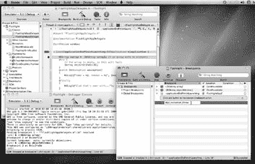

[www.it-ebooks.info](http://www.it-ebooks.info/)

**你的异常代码**

***图 2-1：*** *实战中的 Xcode 调试器。你可以使用工具栏图标（A）启用或禁用断点。要在源代码中设置断点，请点击左侧装订线，直到看到蓝色箭头（B）。断点窗口显示了所有已定义的断点，你可以在列表末尾添加新断点（C）。当断点被触发时，源代码行会高亮显示（D），你可以通过弹出菜单（E）轻松导航堆栈回溯。还有可用于单步执行代码的控件（F）。更高级的操作可以在调试器控制台（G）中执行。*

- 对于类方法，语法类似：只需在第一个括号前使用加号（`+`）而不是减号（`–`）。要在`NSArray`的`+array`方法处停止，你可以使用`+[NSArray array]`。

## 检查变量

一旦在断点处停止，你可以通过将鼠标指针悬停在源代码上来检查变量。在许多情况下，你将需要使用`gdb`命令行来检查实例变量的状态并向它们发送消息。以下是一些重要的技巧：

- `po`，即打印对象（print object）命令，显示对象的描述。在许多情况下，这将包含有助于你弄清楚发生了什么的信息。

以第 52 页代码中的`myArray`变量为例：

```
(gdb) po myArray
<NSCFArray 0x3b0e850>(
)


# 排版后的内容

用于数组的打印对象命令通常会显示数组中的所有元素。在此例中，未显示任何元素，因此可知访问第一个元素将会出现问题。

## 第二章：括号的力量

**55**

[www.it-ebooks.info](http://www.it-ebooks.info/)

**你的卓越代码**

- `p`（即 `print` 命令）用于显示固有类型的值。与之前的命令类似，它能智能识别你所检查的数据类型：必要时会使用结构体和枚举。

- 两种 `print` 命令均可调用方法。例如，若发现某个对象未被正确保留而出现问题时，可临时通过以下方式进行修复：

```
(gdb) po [myArray retain]
<NSCFArray 0x3b0e850>(
)
```

上述示例返回一个对象，因此使用了 `po` 命令。如果方法返回的是固有类型，则需要使用 `p` 命令，并告知调试器预期的类型。例如，当你查询数组中的条目数量时，指定返回整数结果：

```
(gdb) p (int)[myArray count]
$1 = 0
```

- 当你在控制台中看到 `address 0x0` 时，这表示一个 `nil` 对象（详见第 45 页）。例如，若向空数组请求最后一个对象，由于不存在该对象，你会收到 `nil` 的返回结果：

```
(gdb) po [myArray lastObject]
Cannot access memory at address 0x0
```

- `p` 命令还可用于为变量赋予新值。要修复因空数组引发的异常，可以分配一个包含单个字符串的新数组：

```
(gdb) p myArray=[NSArray arrayWithObject:@"MY CODE IS PERFECT"]
$2 = (NSArray *) 0x3b0ee40
(gdb) po myArray
<NSCFArray 0x3b0ee40>(
MY CODE IS PERFECT
)
```

- `b` 命令可用于在 `gdb` 提示符下设置断点。例如，要在按数组索引获取对象前停止应用程序，可使用：

```
(gdb) b –[NSArray objectAtIndex:]
Breakpoint 1 at 0xf135h90d
```

你大概已经知道，熟悉调试器的使用能让你成为更高效的开发者。想了解更多，可首先搜索 *Xcode Debugging Guide*（Xcode 调试指南）。如需更高级的信息，可查阅 *Debugging with GDB*（使用 GDB 调试）。这两份文档均可通过第 61 页所述的文档查看器获取。

**56**

iPhone 应用程序开发：遗失的手册

[www.it-ebooks.info](http://www.it-ebooks.info/)

## 选择器投影

由于 Objective-C 是一种动态语言，它在运行时而非编译时解析方法。这种机制提供了一种微妙但强大的功能：你可以将方法作为参数传递给其他方法。

`选择器` 是特殊的变量，用于标识对象实例应使用哪个方法实现。Objective-C 运行时使用内部数据结构将消息的选择器与要执行的代码进行匹配。

***提示：*** 如果你使用过其他语言，可以将选择器视为动态函数指针。

选择器的名称会自动指向正确的函数，并适应其使用的任何类。

这种行为让你可以在 Objective-C 中实现多态。如果你有三个分别名为 `Circle`、`Triangle` 和 `Square` 的类，你可以向这些类的每个实例发送一个 `draw` 方法的选择器，从而执行不同的绘图形状实现。

每个选择器都用 `SEL` 类型定义。你可以通过两种方法之一来赋值选择器变量。在编译时，你可以使用编译器指令来创建该值：

```
SEL mySelector = @selector(moreAwesomeThanEver);
```

在运行时，你可以使用一个接受单个 `NSString` 参数并查找选择器的函数：

```
SEL mySelector = NSSelectorFromString(@"moreAwesomeThanEver");
```

现在，`mySelector` 变量包含了 `–moreAwesomeThanEver` 消息的快捷方式。有趣之处在于：你可以使用该变量来执行方法。因此，无需像本章一直做的那样发送消息：

```
[myObject moreAwesomeThanEver];
```


你可以在变量中使用，并得到相同的结果：

`[myObject performSelector:mySelector];`

现在，你可以做一些疯狂的事情，比如获取用户输入，将其转换为`NSString`，然后根据用户输入的内容调用方法。幸运的是，Objective-C 的设计者实现选择器并不是为了让你疯狂。他们这样做是为了让你可以偷懒，可以将代码片段的引用传递给框架，让框架来完成繁重的工作。

选择器变量及其传递能力，在你将在下一章学习的 Cocoa Touch 框架中扮演着核心角色。许多这些特性都属于高级类别，但以下只是你可以使用存储在变量中的消息所做的一些很酷的事情：

-   你可以使用选择器和第 189 页描述的`–performSelector`方法来实现下一章中描述的委托与目标/动作模式。

第 2 章：括号的力量

**57**

[www.it-ebooks.info](http://www.it-ebooks.info/)

**展示你的 `id`**

-   数组可以使用选择器来控制排序行为。当你想要向集合中的每个项目发送相同消息时，你也可以使用选择器。
-   如果你想跟踪视图何时在动画，你可以使用选择器指定一个回调方法。
-   你可以使用选择器配置定时器，让其在延迟后或按重复间隔运行代码。
-   对象通过选择器指定一个方法，来注册系统范围的通知。
-   你可以使用选择器指定对象中初始化新线程的方法。

选择器名称中的冒号数量*确实*很重要。虽然`@selector`*(`moreAwesomeThanEver`)* 和 `@selector(moreAwesomeThanEver:)` 看起来相似，但它们有不同的方法签名。第一种情况是一个不带参数的方法，第二种情况因为末尾有一个冒号，所以接受一个参数。

如果你曾经花过好几个小时在 C 代码中追踪一个遗漏的分号，那么在选择器中找到一个缺失的冒号也是类似的事情。你的眼睛会欺骗你，让你觉得代码看起来是对的，即使运行时知道它不对。

***提示：*** 当你在`objc_msgSend`中看到崩溃时，这通常是 Objective-C 运行时在告诉你它找不到方法实现。如果你错误地输入了`@selector`，那就会是原因。请确保该对象有所使用方法的实现。

**展示你的 `id`**

**有时你需要在不知道对象类的情况下引用它。仅通过其内存地址而不带任何类型信息来引用对象是很方便的。**

你已经在第 50 页看到了其中一个匿名指针：

-   `(id)init` {

Objective-C 将`id`定义为指向对象数据结构的指针。（它很像 C 中的`void`指针，只不过该指针仅用于引用对象。）那么为什么`–init`方法要返回这个通用类型呢？因为你无法保证父类会返回给你哪个类的对象：

`if (self = **[super init]**) `{

在初始化期间，对象处于不稳定的状态，因此其类被故意忽略，并被认为可能会发生变化。使用`id`类型表达了对象身份的缺失。

**58**

iPhone App 开发：缺失的手册

[www.it-ebooks.info](http://www.it-ebooks.info/)

**展示你的 `id`**

尽管`id`只不过是一个指向内存块的指针，但你应该永远不要用`void`指针来代替它。编译器能够执行额外的检查并优化代码，因为`id`让它知道该变量指向一个对象。

`id`类型也用作避免在类之间进行类型转换的一种方式。有些类需要管理对象，而无需知道数据的任何类型信息。集合和其他对象容器就是一个很好的例子。如果集合中的对象是用指向`NSObject`的指针来指定的，那么每次从集合中检索对象时，你都必须将其转换为子类。对于懒惰的程序员来说，那是很多工作。


***注意：*** 使用 `id` 也能解决子类中重写方法返回类型与原始类不同的情况。通过使用泛型类型，原始类及其任何子类都可以共享一个通用的方法签名，并返回正确的类。

再次强调，下一章将深入探讨 `NSArray` 类，但你已经知道，只有当你能够访问列表中的元素时，数组才有用。实现这一操作的方法如下：

```
- (id)objectAtIndex:(NSUInteger)index;
```

因此，给定一个整数索引，会返回一个 `id` 值。当你向数组添加元素时也是如此：结合这些方法，你就可以将任何类型的对象存储到数组中。

当然，你的代码通常知道它放入了什么到数组中，因此常见的做法是在读取数组元素时进行隐式类型转换：

```
NSString *element = [myArray objectAtIndex:i];
```

这段代码让编译器能够检查任何访问元素对象的代码。

最后，有一个特殊的 `id` 值你在本章中已经多次看到—— `nil`。与 C 语言中的指针类似，有时你需要表示没有对象的情况。使用 `nil` 来表示空对象可以做到这一点。

Objective-C 中的 `nil` 和 C 中的 `NULL` 都被定义为值为零的 `void` 指针。例如：

```
#define NULL ((void *)0)
#define __DARWIN_NULL ((void *)0)
#define nil __DARWIN_NULL
```

然而，从语义上讲，在处理指向对象的指针时应使用 `nil`，而对于所有其他类型的指针则应使用 `NULL`。从技术上讲，下面的代码并没有错：

```
NSString *myString = NULL; // 请使用 nil 替代！！！
```

#### 第 2 章：括号的力量

**59**

[www.it-ebooks.info](http://www.it-ebooks.info/)

### 展示你的 id

### 引擎盖之下

### 它真的只是 C 语言

在第 30 页，你了解到 Objective-C 只是 C 语言加上少量额外语法和一个运行时。

既然你已经学习了一些关于这门语言的知识，你可能想看看 Objective-C 是如何施展它的魔法的。这是进阶内容，但如果你是那种喜欢探究底层原理的开发者，你会喜欢这个框里的内容。

首先，从之前例子中的一段标准 Objective-C 代码开始：

```
NSString *myString = @"typing power";
NSString *myResult = [myString awesomeString];
NSLog(@"myResult = %@", myResult);
```

你可以用以下代码实现完全相同的功能：

```
#import <objc/objc-runtime.h>

id myString = @"typing power";
SEL mySelector = @selector(awesomeString);
IMP myImp = class_getMethodImplementation(object_getClass(myString), mySelector);
id myResult = myImp(myString, mySelector);
NSLog(@"myResult = %@", myResult);
```

你刚刚所做的就是复现了 `objc_msgSend:` 的工作，这是 Objective-C 用于向对象发送消息的代码。它看起来很像普通的 C 代码，不是吗？

你首先为 `-awesomeString` 方法创建了一个选择器。那只是一个指向内部结构的指针：

```
typedef struct objc_selector *SEL;
```

然后，该选择器被传递给运行时函数 `class_getMethodImplementation()`，该函数使用对象的类和选择器来查找一个函数。所有方法都符合这个函数定义：

```
typedef id (*IMP)(id, SEL, ...);
```

一旦你在 `myImp` 变量中获得了指向类实现的函数指针，你就可以使用对象和选择器来调用它。这个例子没有额外的参数，但由于 `IMP` 是用可变参数列表定义的，因此也可以传入额外的参数。

当编译器遇到你的方法实现时：

```
- (NSString *)awesomeString;
```

它生成一个类似这样的 C 函数：

```
id _i_NSString_AwesomeMethods_awesomeString(id self, SEL _cmd);
```

函数名使用了方法类型（实例方法或类方法）、类名、分类名和方法名进行修饰。函数的参数解释了隐藏的 `self` 参数是如何传递的。它同时展示了另一个隐藏参数 `_cmd`，你的方法实现可以在需要获知其选择器时使用它。


# 当你输入那些强大的方括号时，所有这些都会自动发生。第一步是导入 `objc-runtime.h` 头文件。

所有的运行时定义都存储在那里。

然而，这会让经验丰富的 Objective-C 程序员感到神经紧张和血压升高。这倒没什么，直到你在在线论坛上向他们求助为止。

**注意：** 是的，推荐使用小写类型定义而不是像本章其余部分那样使用炫酷的大写字母，这确实有点讽刺意味。

## 下一步去哪里

既然你已经对 Objective-C 有了初步了解，你可能会想进一步了解这门语言。

有时候，你确实可以不劳而获；*《Objective-C 2.0 编程语言》* 这本书就是一个很好的例子。苹果公司拥有业内最优秀的技术文档作者，这一点在这本描述编程语言的书中体现得淋漓尽致。所有语言特性都配有相关示例进行了详细描述。当你遇到新的术语和概念时，书中的词汇表和索引特别有用。你可以从本书的 Missing CD 页面找到这本在线书籍的链接：[www.missingmanuals.com/cds](http://www.missingmanuals.com/cds)。（或者直接在网上搜索 *the objective-c 2.0 programming language*，你会在苹果网站上找到该书的链接。）另一个极好的资源就在本书内部——附录 A。在这里，你会找到本书涵盖的每个主题的额外资源。每个资源都附有 URL 和简短评论。如果你觉得某个方面需要更多帮助，请前往附录。

## 开发者文档

你可能觉得奇怪，已经用完整整一章来介绍一门编程语言了，却一直没有提及开发者文档这个话题。

这是因为开发者文档数量庞大且质量极高。事实上，多到甚至让人觉得有点分心。

由于本书无法解释你将会遇到的每一行代码，现在是时候介绍一下图 2-2 所示的系统文档了。

当你在 Xcode 中工作时，你可以随时通过“帮助”➝“开发者文档”菜单调出这份文档。窗口出现后，你可以在右上角的框中输入任何内容进行搜索：类名（例如 `NSString`）、方法名（例如 `release`）或概念（例如 `override`）。

搜索结果出现后，你可以使用各种导航元素深入查看。

### 结果列表

你的搜索结果会显示在文档窗口的左侧。你可以通过选择搜索词匹配文档页面的方式，来控制 API 列表中显示的信息量。当选择“包含”时，`NSString` 会匹配到 `CFStringConvertEncodingToNSStringEncoding`，因为它是 API 名称的一部分。如果选择“前缀”，`NSString(UIStringDrawing)` 会匹配，因为它以搜索文本开头。“精确”设置则只会显示 `NSString` 的页面。

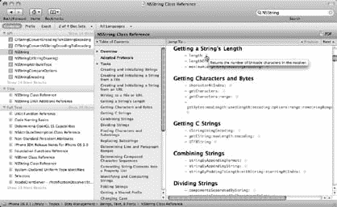

**图 2-2：** Xcode 文档查看器。你可以使用右上角的框进行搜索（A）。结果会显示在窗口左侧的列表中（B）。选择其中一个结果，文档页面就会在右侧显示（C）。你可以打开目录，通过点击链接快速浏览页面（D）。例如，点击 `-length` 方法名会跳转到详细文档，或者你可以将鼠标指针悬停在信息图标上以获取快速描述（E）。

结果分为三个部分：

-   **API。** 此部分显示符号名称的匹配项。每个匹配项前都有一个彩色字母。紫色 `C` 表示该符号是一个类，蓝色 `M` 表示一个方法，橙色 `T` 表示一个类型定义，依此类推。
-   **标题。** 此部分下的每个条目都是文档页面标题的匹配项。
-   **全文。** 最后一部分显示文档页面全文中的匹配项。

在更大的上下文中查找目标时，这些结果非常有用。

如果你更关心如何使用某个类，这些结果会显示该类在指南、发布说明或示例代码中的出现位置。

### 文档页面视图

当你从结果列表中选择一个项目时，页面会显示在窗口的右侧。对于某些类，文档页面可能非常长，以下是一些帮助快速导航的技巧：

-   **目录。** 你可以打开页面的目录，在包含许多方法的页面中快速导航。并且，当你刚开始学习时，类文档中的“任务”部分是一个有用的指南。例如，如果你正在寻找创建和初始化字符串的方法，在 `NSString` 的“任务”下会有专门的子部分。
-   **配套指南。** Cocoa 中的许多核心类都有配套指南。这些文档提供了如何使用该类的宏观视角，并附有示例。如果你刚开始学习 `NSStrings`，点击“Cocoa 字符串编程指南”部分可以让你尽快上手。
-   **相关源代码。** 有时一张图胜过千言万语；对于开发者来说，示例代码是最美的图。如果你在为如何在数据列表中使用 `NSString` 而苦恼，点击 `TableViewSuite` 会展示在可运行的源代码中是如何实现的。
-   **跳转到…** 如果你正在查找类中的某个特定方法，这个弹出式菜单提供了快速访问页面各个部分和子部分的途径。
-   **使用查找。** 当你按下 ⌘-F 时，文档页面上方会出现一个新的搜索栏。你在此栏中输入的任何文本都会在文档中高亮匹配。你可以点击箭头按钮（或 ⌘-G 和 ⌘-Shift-G）在匹配项之间导航。

#### 少打字，多学习

内置文档提供了便捷的访问方式；不要错过这些绝妙技巧。即使使用复制粘贴，将类名和方法名输入到文档搜索栏也会很快变得繁琐。创建 Xcode 的开发者和你一样懒，所以他们想出了一些更好的方法来浏览这片信息之海。

##### 上下文菜单

如果你在源代码中看到一个不理解的符号，可以选择文本，然后按住 Control 键点击以显示快捷菜单。这个菜单包含许多有用的项目，但最后你会看到两个特别感兴趣的项目。点击“在文档中查找文本”会打开文档窗口，并显示选中文本的搜索结果。无需输入！

该菜单中另一个有用的项是“跳转到定义”。此命令使用选中的文本查找符号定义的代码。对于像 `NSString` 这样你没有源代码的类，你会看到一个 `@interface` 定义。如果这个类是你自己编写的，你会看到 `@implementation` 定义。

##### 点击，起航！

但这还不是全部。你只需使用键盘和两次鼠标点击即可访问文档。按住 Option 键并双击符号名称，会出现一个小窗口，显示类或方法的简短描述、包含参数类型的声明，以及指向示例代码和相关文档的链接。你还会看到该 API 首次可用的日期。


***提示：*** 如果你想跳过这个预览窗口，直接跳转到文档窗口，可以按住 `Option-⌘` 并双击符号名称。

要查找定义，可以先按住 `⌘` 键并双击名称。如果找到多个匹配项（这在方法名称中很常见），系统会在显示 `@interface` 或 `@implementation` 之前，为你展示一个选项列表。

如果你和大多数 iPhone 开发者一样，很快就会在不知不觉中习惯使用鼠标和这两个按键。

## 学会“偷懒”

又提到了那个以 *L* 开头的词。但事实是，借助 Cocoa，大量优秀的代码已经为你写好了。刚入门时，你自然会有一股自己动手写代码的冲动，尤其是在学习一门新语言，想要一展身手的时候。当你产生这种冲动时，不妨花点时间打开文档做些研究。

如果你找到了接近你需求的现有功能，尝试使用类别（Category）来扩展现有类。如果行不通，再尝试创建子类并添加新功能。

如果以上方法都失败了，再从头开始实现你自己的类。

遵循这个建议，现在该进入下一章了。在那里，你将开始学习一些你可以随时调用的优秀代码。

---

**64**

iPhone 应用开发：缺失的手册

[www.it-ebooks.info](http://www.it-ebooks.info/)

---

# Cocoa Touch：让 Objective-C 发挥作用

现在你已经对 Objective-C 有了初步了解，是时候让这门语言真正发挥作用了。如果你把 Objective-C 看作是构建应用程序的“胶水”，那么接下来你将探索构建模块——即 Cocoa Touch 框架的各个部分——它们将通过你手中的新“胶水”拼接在一起。

在开始粘合 Cocoa Touch 框架的各个组件之前，你需要先了解一下苹果工程师推荐的架构和设计模式。正如了解正确的建筑材料如何协同工作才能盖好房子一样，熟练掌握这些框架能让你构建出更 robust 的应用程序，并节省时间。

你还将学习到哪里可以找到关于 Cocoa Touch 的更多信息。网络和你最喜欢的书店里有大量资源，可以帮助你提升 iPhone 开发技能。

## 进入 Cocoa Touch 的世界

Cocoa Touch 框架非常庞大，有成百上千个类供你使用。学习如何使用这个丰富的组件库需要时间。完成这项艰巨任务的最佳方法是学习这些框架所实现的常见设计模式和功能。

在接下来的章节中，你将看到 Cocoa Touch 如何使用模型、视图和控制器（MVC）来实现你的应用程序。你还会看到如何使用“目标-动作”设计模式来将可视化组件连接到执行实际工作的代码上。在此过程中，你将了解到委托（Delegation）是如何成为一种强大的机制，来利用系统框架中的代码。当然，你还会学习如何管理数据对象和集合，以及一些更重要的设计模式。

---

**65**

[www.it-ebooks.info](http://www.it-ebooks.info/)

---

## 三巨头：模型、视图、控制器

### 幕后：名称里有什么？

你可能听说过“Cocoa Touch”这个词，它用来描述 iPhone 上的编程环境。但它到底是什么呢？

严格来说，Cocoa Touch 只是两个框架，它们为你的应用提供了最重要的构建模块：

-   **Foundation 框架。** 该框架为你提供主要的构建模块。在这个框架中，你可以找到管理数据的类（如 `NSString`、`NSNumber` 和 `NSDate`）、读写信息的类（`NSFileManager`、`NSUserDefaults`）、与网络通信的类（`NSURLConnection`）等等。
-   **UI Kit 框架。** 每个应用程序都会有窗口、视图、按钮和其他界面元素。`UIKit` 框架提供了让用户与你的作品进行交互的各种组件。你可以在 Interface Builder 的库面板中看到这些类。

开发者有时会用“Cocoa Touch”这个总称，来涵盖与基础框架协同工作、共同构建应用的其他开发技术。在构建应用程序的过程中，你会用到许多其他的辅助框架。最常用的一些包括：

-   **Core Graphics。** 一个基于 C 语言的绘图 API（使用 Quartz 渲染引擎）。这个底层框架提供了绘制矢量路径和位图、二维坐标变换与遮罩、颜色和图像管理等函数。
-   **OpenGL ES。** 另一个基于 C 语言的接口，用于加速 2D 和 3D 图形的渲染。其实现符合 OpenGL ES 1.1 和 2.0 规范。
-   **Core Animation。** 这个 Objective-C API 提供了基于图层对 2D 图像层级进行复杂合成和动画处理的类。这个高级框架大大简化了你的代码，并提升了用户体验。它的一个附带好处是通过利用 OpenGL 等底层 API 提升了性能。
-   **Core Data。** 这个复杂的框架能以透明的方式将对象图持久化存储在 XML 或 SQLite 文件中。Xcode 提供了用于描述对象及其关系的工具。这些工具可以使用谓词（Predicates）来获取对象，并使用描述符（Descriptors）对它们进行排序。
-   **Core Audio。** 一组用于播放、录制、处理和转换音频的框架。

你可以在文档查看器中搜索这些名称，来了解更多关于这些构建模块的信息。

## 三巨头：模型、视图、控制器

Cocoa Touch 提供了数百个对象类需要你掌握。幸运的是，这些类中的大部分可以归为三类。并且这些类别中的对象会以一种简单且定义良好的方式相互交互。

每个 iPhone 应用都使用一个简单的模型-视图-控制器设计模式。由于开发者写文档和写代码时一样“偷懒”，你经常会看到这个模式被简称为“MVC”。

***注意：*** 如果你使用过其他语言和开发环境，你会很高兴地发现，Cocoa 中的 MVC 与你过去使用的并无不同。对象变了，但概念没变。

---

**66**

iPhone 应用开发：缺失的手册

[www.it-ebooks.info](http://www.it-ebooks.info/)

---

## 三巨头：模型、视图、控制器

要了解这种设计的简洁性，请看图 3-1。

```
用户操作
   |
   v
 控制器
   |
   +----> 模型 (更新)
   |
   +----> 视图 (更新/通知)
```

***图 3-1：*** *此图展示了模型、视图和控制器如何协同工作，具体说明见后续页面。*

一个 iPhone 应用的全部精髓就在于此了。更棒的是，你会发现框架中的视图和控制器已经完成了大部分繁重的工作。就连模型对象的创建，也在 Cocoa Touch 的帮助下得以简化。

那么，每种对象类型的角色分别是什么呢？请继续阅读。

### 视图

你知道 iPhone 屏幕上所有的按钮、滚动列表、网页浏览器以及其他所有元素吗？它们都是*视图*。视图知道如何展示你的应用程序数据。有些视图还知道如何响应用户的输入。一个 `UIButton` 视图会响应用户的触摸。一个 `UITextField` 视图则接收来自虚拟键盘的输入。

在许多应用中，你需要创建自己的视图来显示特定数据。例如，没有标准的 widget 来显示股票走势图，所以如果你想实现这个功能，就必须自己想出解决方案。

同样，许多设计师和开发者希望自定义其应用的外观。无论你的动机是品牌推广还是只想在众多应用中脱颖而出，为你的应用创建独特外观都涉及基于标准的 `UIView` 和 `UIControl` 类来构建新的视图。


# 创建视图

创建视图并没有听起来那么困难。通过使用现有视图的子类，你只需进行少量自定义绘制即可。如果你正在构建复合视图（将多个视图组合成一个视图），唯一需要做的工作就是管理子视图的布局。

# 模型

模型是应用程序的核心与灵魂，因为它们负责管理应用的数据。与视图不同，模型完全不关心用户正在执行的操作或屏幕上显示的内容。模型的唯一功能是在应用程序内操作和处理用户数据。模型通常实现提供这些基本行为的内部逻辑。

例如，每当你使用内置的"通讯录"应用时，实际上就是在操作代表通讯录中联系人的模型对象。如果你更新了应用的设置，就是在修改另一种模型对象。从互联网下载股票数据的应用则会使用模型对象来存储价格历史记录。

有些模型对象可以跨多个应用工作：通讯录和用户默认设置（偏好设置）数据库就是很好的例子。而其他模型（如股票应用使用的模型）则是特定于应用的。

许多模型对象会被永久存储到文件或数据库中。这种机制称为**对象持久化**，它让你能够在多次应用启动间重建应用的状态。即使不持久化对象，模型在处理内存数据结构时也非常有用。

在构建自己的模型时，你通常会在实现中使用 Cocoa Touch 类。例如，`NSArray` 和 `NSDictionary` 等类可以让你将数据存储在有序列表或哈希表中。你还会发现 `NSURLConnection` 和 `NSData` 等类能帮助你从网络检索和存储数据。

最后，你可以使用 Core Data 框架在 SQLite 数据库中存储和检索对象。

# 控制器

控制器稍微复杂一些。它们充当视图对象和模型对象之间的中介。当模型中的值发生变化时，控制器负责更新视图。同样地，控制器在收到用户输入时，能够相应地更新模型数据。

你的控制器让你能够在模型和视图之间传递信息。在图 3-1 中，你可以看到控制器是唯一包含所有箭头（消息）的模块。就像管弦乐队中的指挥，它负责掌控全局。

为了让你理解其工作原理，想象一个绘制股票价格的应用：

1. 用户点击按钮（视图）刷新图表。此操作被发送至控制器。
2. 控制器随之告知模型加载新的股票数据。
3. 模型打开网络连接并开始下载数据。
4. 股票数据加载完成后，模型通知控制器新数据已到达。
5. 控制器将新数据传递给视图，用户便看到了结果。

**注意：** 模型和视图不会直接通信，因为如果它们直接通信，随着你添加更多对象，应用会变得极其复杂。当多个视图共享同一个模型的数据，或单个视图更新多个模型时，你就会遇到问题。一个类中的微小变动会波及到其他类，类之间的依赖性会越来越高，代码复用将变得困难。开发者将这种情况称为**紧耦合设计**，应当尽量避免。

控制器对象通常负责设置任务。模型和视图必须在某个时间点被加载和初始化，而控制器的核心角色使其自然成为这项工作的承担者。

Cocoa Touch 提供了专门的视图控制器类来处理这种职责分离。在开发 iPhone 应用时，你会发现大量代码最终都驻留在这些控制器类中。

具体来说，视图控制器在导航中被大量使用。例如：

- 当你点击列表中的某一行，新的视图滑入时，你刚刚创建了一个新的视图控制器。同样地，点击"返回"按钮时，当前控制器会被丢弃，替换为上一个控制器。
- 如果你点击撰写新邮件的按钮，会创建一个新的模态视图控制器；它的视图从屏幕底部滑入并显示，直到你点击"取消"或"发送"。
- 当你点击天气应用中的信息图标时，一个新的视图控制器翻转出现，让你输入新的城市。点击"完成"后，该视图会被主视图取代。

`UIViewController` 类及其多个子类执行这些基本功能。如果必须优先掌握一个类，那就是它了。

# 值对象

在构建自己的模型、视图和控制器类时，你经常需要决定如何在类中存储数据。由于 Objective-C 构建在 C 语言之上，因此所有原始数据类型都可使用。那么问题就来了：是使用整数、浮点数和字符数组，还是使用将相同原始值包装成对象的类呢？

## 使用原始类型

在对象的实例变量中使用原始类型并无坏处。事实上，这往往能让实现更简单，因为你无需担心对象的保留和释放。例如，如果只是记录一个计数器，你不需要添加对象带来的额外开销。

**提示：** Cocoa 中最重要的计数器之一——`NSObject` 中的 `retainCount`，被定义为无符号整数（`NSUInteger`）。虽然 `NSInteger` 和 `NSUInteger` 这两个关键字看起来像是类名，但它们实际上只是 Cocoa Touch 中使用的类型定义。

```objectivec
typedef int NSInteger;
typedef unsigned int NSUInteger;
```

其他常用的类型定义示例包括：`NSRange`（定义数据范围的结构体）和 `NSTimeInterval`（表示时间段的浮点值）。

使用原始类型的实例变量的定义方式与对象实例变量略有不同。由于不涉及保留或复制，它们在 `@property` 中使用 `assign` 属性定义。例如，如果你决定在上一章的 `AwesomeString` 类中使用 `NSUInteger` 而不是 `NSNumber`，接口将如下所示：

```objectivec
@interface AwesomeString : NSString
{
    NSUInteger exclamationCount;
    NSString *originalString;
}
@property (nonatomic, assign) NSUInteger exclamationCount;
@property (nonatomic, copy) NSString *originalString;
- (NSString *)awesomeString;
@end
```

在实现中，`–init` 方法里的初始赋值从值对象改为：

```objectivec
exclamationCount = [[NSNumber numberWithInt:8] retain];
```

通过赋值原始值可以简化代码：

```objectivec
exclamationCount = 8;
```

在 `–dealloc` 方法中，你也不需要释放 `exclamationCount`。使用原始值使代码大大简化，且不牺牲任何功能。除非书面语言允许你在句子末尾放 8.5 个感叹号，否则这段代码将完美运行！

## 对象化

既然你已经看到了值对象并非必要的情况，那为什么还要使用它们呢？主要有两个原因：


# 值对象

-   你可以在集合中存储以对象形式表示的值。集合能让你轻松管理一组对象。可利用的方法包括对对象进行排序、查找实例，以及根据模式筛选数据。如果你使用的是原始值，就必须自行实现这些数据管理代码。
-   对象的类提供了大量用于操作值的函数。这能为你带来更高的灵活性，并节省实现过程中的时间。

## 这些值对象是什么？问得好！

### `NSString`

如上一章所见，该类是 Cocoa 中的基础类之一。

许多其他类都使用以对象形式表示的字符串。你可能会忍不住在实现中使用纯 C 字符串，这确实可行，但你会遇到很多阻力。最终，当你在 Cocoa 中使用原始字符串时，将不得不进行大量不必要的转换。

此外，你还将错过 `NSString` 类提供的一些重要功能：

-   完整的 Unicode 支持及字符串编码之间的转换（`–dataUsingEncoding:`）。
-   从文件中读取文本及其编码（`–stringWithContentsOfFile:usedEncoding:error:`）。
-   字符串的分割（`–componentsSeparatedByString:`）与拼接（`–componentsJoinedByString:`）。
-   转义字符串以便放入 URL（`–stringByAddingPercentEscapesUsingEncoding:` 和 `–stringByReplacingPercentEscapesUsingEncoding:`）。
-   子字符串搜索（`–rangeOfString:`）以及获取 Unicode 字符数量（`–length`）。
-   将字符串转换为数字（`–boolValue`、`–integerValue`、`–floatValue`、`–doubleValue`）。
-   大小写转换（`–capitalizedString`、`–lowercaseString` 以及最棒的 `–uppercaseString`）。
-   字符串格式化（`–stringWithFormat:`）和本地化（`NSLocalizedString`）。
-   使用用户当前的语言设置进行字符串比较（`–localizedCompare:`），并可使用多种选项，包括忽略变音符号（因此 "ö" 等同于 "o"）以及按数值排序（因此 "CHOCK9.TXT" 在列表中会排在 "CHOCK9000.TXT" 之前）。

### `NSNumber`

在进行值转换时，你会想使用这个值对象。如果你用一个浮点值创建一个数字对象，然后请求该对象返回无符号字符值（`–unsignedCharValue`），内部将执行一次转换，且原始对象中的信息不会丢失。

如果你的应用程序中进行基于货币的计算，可以使用 `NSDecimalNumber` 子类以获得最高精度。由于该子类允许你使用 38 位有效数字和 –128 到 127 范围内的指数，因此你无需担心浮点计算中固有的舍入误差和其他数据丢失问题。

### `NSDate`

日期对象提供了一些用于操作时间点的基本函数。你可以比较哪个日期更早（`–earlierDate:`），以及计算两个日期之间的秒数（`–timeIntervalSinceDate:`）。当与 `NSCalendar` 结合使用时，`NSDate` 的优势尤为突出；如果你曾经尝试在考虑时区和闰年等因素的情况下计算两个时间点之间的月数和天数，你就会感激这项工作为你代劳了。

### `NSData`

作为非结构化字节流的值对象，`NSData` 提供了管理数据缓冲区所需的机制。数据对象通常需要存储到磁盘上，因此提供了读取（`+dataWithContentsOfFile:`）和写入（`–writeToFile:atomically:`）的方法。

这些数据块通常用于创建其他对象的实例。例如，可以使用 `NSData` 对象创建 `NSString`。同样，你也可以使用 `UIImage` 对象的 `–initWithData:` 方法创建图像。

### `NSNull`


此对象的唯一用途：表示空值。集合不允许使用 `nil` 对象，因此当需要在数组、字典（哈希表）或集合中放入空值时，可以使用 `NSNull`。

## `NSValue`

有时，你需要创建能够紧密镜像原始类型或数据结构的对象。当你有一些遗留数据或第三方数据，并需要将其添加到集合中时，最可能遇到这种情况。

每当出现这种需求时，请查看 `NSValue` 类。它可以将 Objective-C 中任何有效的变量类型包装为值对象。假设你有一个遗留系统，定义了一种名为 `Chockitude` 的奇怪数据结构：

```c
typedef struct {
    unsigned char palmCount;
    int isFleshy;
    float height; // 单位为英寸
} Chockitude;
```

如果你需要将此数据包装到对象中，操作很简单：

```objc
Chockitude ch;
ch.palmCount = 2;
ch.isFleshy = true;
ch.height = 79.25;

NSValue *value = [NSValue valueWithBytes:&ch objCType:@encode(Chockitude)];
```

每当需要检索值对象的内容时，你可以编写如下代码：

```objc
Chockitude theChockitude;
[value getValue:&theChockitude];
NSLog(@"palmCount = %d, isFleshy = %s, height = %f",
      theChockitude.palmCount,
      (theChockitude.isFleshy ? "YES OF COURSE" : "no"),
      theChockitude.height);
// 控制台日志中显示：
// palmCount = 2, isFleshy = YES OF COURSE, height = 79.250000
```

`NSValue` 对象的另一个用途是处理 iPhone 显示屏上的点和其他几何图形。如果你想跟踪屏幕上的系列点击操作，很可能会想使用 `CGPoint` 结构（包含 x 和 y）的集合。你可以使用一个 `NSValue` 类别，它能够接收这些常见结构并将其编码为对象：`+valueWithCGPoint:` 和 `+valueWithCGRect:` 用于包装图形框架使用的点和矩形。

## 集合

当你处理对象时，通常会涉及许多对象。保持有序至关重要，而实现这一点的最简单方法是将相似对象分组到*集合*中。

例如，当你在 iPhone 上查看滚动列表时，每行中的数据都由一个对象表示。如果该行包含一个人的姓名和年龄，那么你很可能还会有其他对象来存放这些个人详细信息。

对于这种列表视图，`NSArray` 是一种很自然的集合。你可以指定集合内的顺序，使列表中的第一行成为数组中的第一个对象。该数组类还提供了对数据进行排序和过滤的机制，从而轻松地在用户界面中模拟这种行为。

当你想通过唯一键来收集对象时，请使用 `NSDictionary` 类。它实现了关联数组，允许你查找与键关联的对象（值）。

***注意：*** 如果你使用过其他语言，关联数组有多种不同的叫法：哈希表、哈希、映射和容器等只是其中几种。无论名称如何，它们都允许你通过键来查找值。

你可以使用 `NSDictionary` 来存储列表中每行的数据。由于你可以将 `NSString`、`NSDate` 和 `NSNumber` 存储在集合中，因此很容易为这些信息创建集合：

```objc
NSDictionary *personalDetails = [NSDictionary dictionaryWithObjectsAndKeys:
    @"Craig", @"name",
    [NSNumber numberWithInt:50], @"age"];
```

然后，每当需要获取其中某个对象时，你都可以查询字典集合：

```objc
NSInteger age = [[personalDetails objectForKey:@"age"] integerValue];
BOOL crankyOldMan = NO;
if (age > 50) {
    crankyOldMan = YES;
}
```

你可以使用 `NSSet` 来收集不重复的对象，且顺序不重要。通常，你会像在数学中使用集合一样使用这种类型的集合。该类提供了用于测试相等性、交集和子集的方法。

随着应用程序变得越来越复杂，你会发现开始组合这些集合。例如，你的列表视图可以为每行实例使用一个 `NSArray`，并使用一个 `NSDictionary` 来存储实际的行数据。同样，也可能出现一个 `NSDictionary` 在其某个键下包含一个 `NSArray` 的情况。假设你的个人详细信息包含一个 `siblingNames` 键；该数据用数组来表示很合适。如果你没有兄弟姐妹，那么数组就是空的；无论你的父母生育能力多强，数组都会随着家庭规模的增长而扩展。

### 深拷贝

当你通过发送 `-copy` 消息来拷贝集合时，结果是该对象的浅拷贝。拷贝后的集合可以独立于原始集合进行修改，但两个集合中的对象是共享的。

要执行集合的深拷贝，你需要使用*拷贝项目*方法。例如，对于 `NSArray`，你可以像这样使用 `-initWithArray:copyItems:`：

```objc
NSArray *original = [NSArray arrayWithObjects:@"Mimeoscope", @"Cyclostyle", nil];
NSArray *shallowCopy = [original copy];
NSArray *deepCopy = [[NSArray alloc] initWithArray:original copyItems:YES];
```

在 `shallowCopy` 中，数组中的两个对象与原始数组中的实例相同。另一方面，`deepCopy` 在新数组中包含了 `"Mimeoscope"` 和 `"Cyclostyle"` 的新实例。

`NSDictionary` 和 `NSSet` 集合使用相同的模式，分别对应 `-initWithDictionary:copyItems:` 和 `-initWithSet:copyItems:` 方法。

## 可变与不可变

在查看 `NSString` 时，你可能已经注意到字符串的内容从未直接修改。如果你查看过 `NSArray` 类，可能会担心它似乎没有任何添加或删除项目中条目的方法。别担心；Cocoa 的设计者们可没那么懒！

许多用于管理数据的类都被一分为二：一个类用于管理从不更改的数据，另一个子类用于处理可以更改的部分。如果常量数据的类名是 `NSString`，那么用于可修改数据的类名就是 `NSMutableString`。

### 属性列表

当你费心将对象组织到集合中时，很可能会想要保存这些成果。`NSArray` 和 `NSDictionary` 都提供了 `-writeToFile:atomically:` 方法。它们还提供了 `+arrayWithContentsOfFile:` 和 `+dictionaryWithContentsOfFile:` 方法，用于从文件中读取信息。

存储在文件中的内容就是*属性列表*，这是 Cocoa Touch 中作为一种轻量级且可移植的持久化机制而广泛使用的标准格式。属性列表将对象实例存储在扩展名为 `.plist` 的文件中。数据内容可以存储为可移植性最佳的 XML 格式，也可以存储为效率更高的二进制格式。

如果你打开 Flashlight 应用程序的资源文件夹，可能会注意到一个名为 `Flashlight-Info.plist` 的文件。这个重要的属性列表包含了向 iPhone 操作系统描述应用程序的信息。例如，你可以在此指定显示在主屏幕上的图标。同样，当用户更新应用程序的设置时，配置会被写入属性列表。

当你使用属性列表时，必须仅使用以下类：`NSArray`、`NSDictionary`、`NSString`、`NSData`、`NSDate` 和 `NSNumber`（整型、浮点型和布尔值）。这些对象的任何层次结构都可以存储在文件中。一个包含数字、字符串和日期的字典数组是完全有效的。

***提示：*** 如果你需要归档包含属性列表不支持类的对象图，请查看 `NSKeyedArchiver` 类和 `NSCoding` 协议。


# 既然一个类就能搞定，为什么非要用两个？

既然可以实现为一个类，为什么偏要写成两个？这和代码中使用常量的道理一样：你能确定数据在 processing 过程中永远不会改变。从而可以做出原本无法成立的假设。

***注意：*** 如果你曾遭遇过遍历数组时数组长度突然变化的经历，你就会明白这些错误假设会带来多么痛苦的 bug。

## 第 3 章 Cocoa Touch：让 Objective-C 真正发挥作用

**75**

**可变与不可变**

在构建自己的类时，你常常需要决定实例变量该用这两种中的哪一种。一条好用的经验法则是：当值需要被整体替换时，使用像 `NSString` 或 `NSNumber` 这样的不可变对象。

当你在拼接牛逼闪闪的字符串时，使用 `NSMutableString` 毫无意义，因为 `–setOriginalString:` 方法更新的是整个字符串，而不是修改单个字符。

另一方面，集合类则经常需要增量更新。从数组中添加或删除元素是家常便饭，所以你会希望使用 `NSMutableArray`，并获得 `–insertObject:atIndex:` 和 `–removeObjectAtIndex:` 方法。

### 让它可变

当你手里有一个不可变对象，却又需要一个可变对象时，该怎么办？

你会发现 Foundation 框架中的很多方法返回的都是不可变对象。这些系统类假设你可能并不想修改返回的结果。大多数情况下，这个假设是对的。但作为开发者，你很清楚，正是那些特殊情况才最让人头疼！

下面是一个返回不可变数据的方法简单示例——`NSString` 中使用分隔符分割字符串的方法：

```
- (NSArray *)componentsSeparatedByString:(NSString *)separator;
```

如果你只是为了遍历分割后的值而解析一个逗号分隔的字符串，那么不可变的副本就完全够用：

```
NSString *oneHand = @″Thumb,Index,Middle,Ring,Little″;
NSArray *fingers = [oneHand componentsSeparatedByString:@″,″];
for (NSString *finger in fingers) {
    NSLog(@″The finger is %@″, finger);
}
```

但如果你想修改这些手指名称呢？这正是那种罕见却又重要的场景，你需要一个可变副本。谁都知道最后一个手指叫做“小拇指”（Pinkie）。

幸运的是，使用 `NSObject` 定义的 `–mutableCopy` 方法就能轻松搞定：

```
NSString *oneHand = @″Thumb,Index,Middle,Ring,Little″;
NSArray *fingers = [oneHand componentsSeparatedByString:@″,″];
NSMutableArray *mutableFingers = [fingers mutableCopy];
[mutableFingers removeLastObject]; // 嗷，好疼！！！
[mutableFingers addObject:@″Pinkie″]; // 现代科学的奇迹
for (NSString *finger in mutableFingers) {
    NSLog(@″The finger is %@″, finger);
}
```

有一点很重要：你不能对任意一个对象都进行可变复制。你要复制的类必须支持 `NSMutableCopying` 协议。如果类的定义中没有包含 `<NSMutableCopying>`，那么当你尝试进行复制时就会抛出异常。

**76**

iPhone 应用开发：缺失手册

**可变与不可变**

***注意：*** 在处理集合时，`–mutableCopy` 的行为与 `–copy` 类似。执行的是浅拷贝。

幸运的是，所有的值对象和集合都支持这个协议。当一个类不支持该协议时，很可能是有充分理由的。对 `UIView` 或 `NSURLConnection` 做可变复制又有什么意义呢？这种抽象太复杂，依赖关系太多，反而难以理解。

### 保护你的数据

在方法实现中使用可变数据是很常见的。你无从得知 `–componentsSeparatedByString:` 是如何实现的，但很可能是在解析器从字符串开头移动到结尾的过程中逐步构建起这个数组的。那么，为什么最终要把它作为不可变数组返回呢？

Cocoa Touch 这是在防止你搬起石头砸自己的脚。除了你很可能并不需要可变副本之外，更重要的是：当两个对象持有同一份数据的副本时，如果一个对象在另一个对象不知情的情况下修改了数据，就会出大问题。

想象一下，一个数组在两个对象之间共享，它们都在向其中添加或删除元素。第一个对象计算了数组的长度。然后第二个对象删除了数组中的最后一个元素。当第一个对象去访问它自以为的最后一个元素时，就会因为数组索引越界而抛出异常。这是一个非常令人抓狂的 bug，因为每个对象看起来都做了正确的事。很难一眼看出问题的根源在于共享的集合。

要返回一个可变实例的不可变副本，你可以利用可变类是其超类的子类，并且其超类实现了 `<NSCopying>` 协议这一事实。当你发送 `–copy` 消息时，你会得到一个不可修改的副本。

假设你上面创建的 `mutableFingers` 数组是 `MyHand` 类中的一个实例变量。你决定保持这个变量的可变性，以便迁就那些坚持把最后一个手指叫做“无名指”的无知人士。当其他对象向这个实例请求手指名称时，你可以像这样返回它们：

```
@implementation MyHand
. . .
- (NSArray *)fingers {
    NSArray *result = (NSArray *)[[mutableFingers copy] autorelease];
    return result;
}
```

这样返回的对象就不会破坏你的 `mutableFingers`。即使有人想把最后一个手指叫做“耳指”并塞进耳朵里，也没问题。

第 3 章 Cocoa Touch：让 Objective-C 真正发挥作用

**77**

**委托与数据源**

你有没有遇到过需要完成一项任务，却完全不知道如何下手的情况？也许是修理洗碗机，或者是织一双袜子。你要么自己学会，要么找个帮手来完成你不懂的部分。

Cocoa Touch 有一种设计模式叫做*委托*，它让你的应用程序能够帮助那些不知道你想做什么的系统类。其工作方式很简单：你向一个能够回答问题的对象介绍另一个对象。通过分配一个 `delegate`，你就为可以响应请求和状态变化的代码提供了钩子。

如果你的对象愿意充当委托，那么它需要遵循一个协议。正如你在第 36 页看到的，协议就像一份合同。合同中的许多方法是可选的，但有些是必须实现的。

这种模式在 Cocoa 中被广泛使用。如果你在文档查看器中输入 `delegate`，会得到超过 100 个结果。你可以通过类是否拥有 `delegate` 属性来判断它是否支持委托。具体的委托协议通常以 `Delegate` 作为后缀。

在实践中了解其最佳方式，是查看一个使用委托的类：`UIPickerView` 控件，它通过滚动列表来选择值（图 3-2）。

***图 3-2：*** *Cocoa Touch 的标准选择器视图。显示的值来自委托和数据源。*

**78**

iPhone 应用开发：缺失手册

**委托与数据源**

当你查看 `UIPickerView` 类的文档时，你会看到如下定义的 `delegate` 实例变量：


`@property (nonatomic, assign) id<UIPickerViewDelegate> delegate;` 该声明告诉你，`delegate`可以是任何类（由`*id*`表示），只要它支持`UIPickerViewDelegate`协议。当你打开文档时，你会发现该协议为代理定义了三个主要任务。你需要提供尺寸和内容，并对选择做出响应。所有这些任务都是可选的，但如果你忽略所有问题，你的选择器将变得非常无聊。

最初，你可能会想自定义每一行中的名称列表。选择器视图不知道如何标记行，因此它会通过`–pickerView:titleForRow:forComponent:`消息询问你想要什么。作为代理，你可以实现如下方法：

```
- (NSString *)pickerView:(UIPickerView *)pickerView titleForRow:(NSInteger)row forComponent:(NSInteger)component {
    return [NSString stringWithFormat:@″Row %d″, row];
}
```

这样，选择器中的每一行将被标记为“Row 0”、“Row 1”、“Row 2”等。

你还想知道何时有人点击某一行。如果不实现以下方法，你将永远不知道选择器值何时发生变化：

```
- (void)pickerView:(UIPickerView *)pickerView didSelectRow:(NSInteger)row inComponent:(NSInteger)component {
    NSLog(@″You picked row %d″, row);
}
```

实现这两个方法的最佳位置是在`UIViewControl er`子类中。该控制器遵循第 66 页描述的 MVC 设计模式，因此很容易协调选择器视图与提供标题并在选择发生变化时更新状态的模型之间的活动。

选择器视图知道要显示多少行，因为委托模式有一个细微的变体——数据源。与代理一样，名为`dataSource`的实例变量必须实现`UIPickerViewDataSource`协议：

`@property (nonatomic, assign) id<UIPickerViewDataSource> dataSource;`

并且`dataSource`需要实现两个方法：`–numberOfComponentsInPickerView:`和`–pickerView:numberOfRowsInComponent:`。

第一个方法告诉选择器视图要显示多少列，而第二个方法指定行数。对于一列和 10 行，你可以使用以下实现：

```
- (NSInteger)numberOfComponentsInPickerView:(UIPickerView *)pickerView {
    return 1;
}

- (NSInteger)pickerView:(UIPickerView *)pickerView numberOfRowsInComponent:(NSInteger)component {
    return 10;
}
```

与代理方法一样，你可能会使用控制器的模型来填充这些值，而不是使用硬编码的结果。

当你处理滚动数据列表时（例如 Safari 中的书签或 Mail 中的收件箱），你会使用相同的委托和数据源模式。两者都使用`UITableView`，它通过与`UIPickerView`相同的技术进行控制。

不要认为这种委托设计模式仅限于用户界面中的视图。从 URL 下载数据时也经常使用委托。`NSURLConnectionDelegate`定义了一个协议，用于提供任何连接认证，并在下载过程中通知你。

## 目标与动作

在 Cocoa Touch 中处理控件时，你会使用与委托类似的机制。当你点击按钮、拖动滑块调节音量或切换开关时，这些用户界面元素需要通知应用程序的其他部分有关状态变化。那么，这些控件如何让所有内容知道发生了什么？

通知通过**目标-动作**设计模式发生。换句话说，你可以为每个控件设置一个**目标**——一个将被通知变化的对象。与委托一样，你可以选择任何对象。

与委托不同的是，动作可以是对象定义的任何方法。重要的是该方法符合以下两种签名之一：

```
- (IBAction)actionOne {
}

- (IBAction)actionTwo:(id)sender {
}
```

Interface Builder 使用`IBAction`来识别你代码中的动作（稍后详细说明）。第二种形式接受一个包含发送动作的对象的单个参数。在处理动作时，可以使用`sender`。

如果你有一个由多个`UIButton`实例共享的单个动作，可以使用`sender`来确定哪个按钮触发了该动作。`sender`的另一个用途是查询控件的状态。例如，如果你从`UISwitch`控件接收到了一个动作，你会想知道开关是打开还是关闭：

```
- (IBAction)toggleSwitch:(id)sender {
    // sender is an instance of UISwitch, so use its –on method:
    if ([sender on]) {
        NSLog(@″AFFIRMATORY DIXIE CUP″);
    }
    else {
        NSLog(@″NEGATORY MR CLEAN″);
    }
}
```

这段代码也有易于阅读的优点，尤其是如果你理解 1970 年代的 CB 俚语。

接下来，你需要了解这些控件如何与目标对象和动作方法挂钩。实际上，定义目标和动作有两种方式：一种使用代码，另一种使用 Interface Builder。你先从代码开始，以更深入地了解幕后发生了什么。

### 用户界面：硬核方式

Cocoa Touch 中的每个控件都是`UIControl`类的子类。该类定义了以下方法：

```
- (void)addTarget:(id)target action:(SEL)action
    forControlEvents:(UIControlEvents)controlEvents
```

此方法接受三个参数。第一个是将被通知控制事件的目标对象。第二个参数`action`定义了将发送给目标对象的消息。第三个参数`controlEvents`让你指定将触发该动作的事件类型。

最常见的事件是`UIControlEventValueChanged`和`UIControlEventTouchUpInside`。第一个`UIControlEventValueChanged`用于值变化很重要的控件，例如拖动滑块（`UISlider`）、在文本字段中键入（`UITextField`）以及翻转开关（`UISwitch`）。

`UIControlEventTouchUpInside`事件通常用于`UIButton`控件，因为你只想在用户手指在按钮边界内释放按钮时才知道。即使你是 NFL 的粉丝，也不应使用`UIControlEventTouchDown`。此事件不允许用户将手指拖离按钮以取消按钮按下。

以下是在你的控制器对象中如何将它们组合在一起：

```
#define LOUDER 11.0f

- (void)updateVolume:(id)sender {
    float volume = [(UISlider *)sender value];
    if (volume >= LOUDER) {
        NSLog(@″NIGEL TUFNEL WOULD BE PROUD″);
    }
}

- (void)hitOrMiss {
    if ([mySlider value] > LOUDER) {
        NSLog(@″OF COURSE IT’S A HIT!!!″);
    }
}

- (void)setupControls {
    [mySlider addTarget:self action:@selector(updateVolume:)
        forControlEvents:UIControlEventValueChanged];
    [myButton addTarget:self action:@selector(hitOrMiss)
        forControlEvents:UIControlEventTouchUpInside];
}
```

`–updateVolume:`方法被附加到控制器对象中的`mySlider`视图引用上。当滑块移动且其值发生变化时，会检查音量；如果超过 11，则在控制台日志中显示一条消息。

`–hitOrMiss`方法使用了不带`sender`参数的动作签名。此方法还展示了如何利用其他视图状态来响应按钮按下。如果滑块值高于 11，按钮会让你知道这是一个热门点击。


***注意：*** 第 58 页曾提醒过，要正确填写选择器语句中的冒号数量。如果你在上面的代码中键入了`@selector(updateVolume)`或`@selector(hitOrMiss:)`，那么冒号与你实现的方法将不匹配。当你测试控件时，应用会崩溃，并在控制台日志中显示“unrecognized selector sent to instance（向实例发送了无法识别的选择器）”消息。

*循序渐近*

现在你可能正期待了解在目标对象上设置操作消息的简便方法。但在深入探讨 Interface Builder 之前，你需要先准备好控制器的代码，以便将对象和操作暴露出来。随着项目的演进，这少量工作将会为你节省大量时间，非常值得投入。

正如你在 MVC 设计模式中所见，一个或多个视图对象由控制器管理。那么，你应在何处为控制器定义这些视图呢？如果你回答“在`@interface`中”，恭喜你答对了！

为了获得一些动手实践经验，请访问 Missing CD 页面`www.missingmanuals.com`，下载`MissingCD_Xcode_Projects.zip`文件。

## Targets 和 Actions

在本练习中，你的控制器名为`HitMakerViewController`，它包含三个视图：一个滑块、一个文本视图和一个按钮。你按照第 70 页的做法定义实例变量：

```
@interface HitMakerViewController : UIViewController {
    UISlider *mySlider;
    UIButton *myButton;
    UILabel *myLabel;
}
```

同时，为这些实例变量定义属性，以便它们成为被保留的对象：

```
@property (nonatomic, retain) IBOutlet UISlider *mySlider;
@property (nonatomic, retain) IBOutlet UIButton *myButton;
@property (nonatomic, retain) IBOutlet UILabel *myLabel;
```

以下是操作方法定义：

```
- (IBAction)updateVolume:(id)sender;
- (IBAction)hitOrMiss;
```

到目前为止，你可能已经猜到 Objective-C 标识符中头两个字母的重要性。`IB`是一个提示，能帮你解开谜团，它代表 Interface Builder。

如果你查阅`IBOutlet`和`IBAction`的定义，可能会被`UINibDeclarations.h`中的内容搞糊涂：

```
#define IBOutlet
#define IBAction void
```

当你向源码中添加`IBOutlet`和`IBAction`时，并没有添加任何额外的功能。如上所见，这两个标识符的定义本质上是空操作（NOP）。你只是在标记代码，以便 Interface Builder 能够解析。

`IBOutlet`用于标记那些将在图形编辑器以及源码中使用的对象。类似地，`IBAction`用于标识在两个编辑环境之间共享的方法。

*魔法方式*

从源码的角度来看，当你的应用启动时，`mySlider`、`myButton`和`myLabel`对象会神奇地出现。这种魔法让你的生活轻松不少，但理解其中的窍门至关重要，这样你才能利用好背后的小把戏。

这一切都始于应用程序配置文件。`HitMaker-Info.plist`包含一个主要 NIB 文件基名（`NSMainNibFile`）值，这告诉 Cocoa Touch 在启动时加载指定的文件。当指定了`MainWindow`时，`MainWindow.xib`中的所有对象都会被加载到内存中。

***注意：** * “NIB”这个名称是“NeXT Interface Builder”的缩写，曾用作旧版软件保存文件的扩展名。许多开发者以及框架的大部分仍继续使用这个术语，尽管现在文件使用的是`.xib`扩展名。这种新格式基于 XML，因此新名称的第一个字母由此而来。

在某些上下文中，开发者谈论 NIB 文件；在另一些上下文中，他们使用术语“XIB 文件”。它们其实是一回事：一个包含部分用户界面的文件。

加载过程的一部分是设置你定义为`IBOutlet`的所有实例变量。NIB 加载机制使用你的访问器来设置实例变量，因此会利用内存中的对象分别调用`-setMySlider:`、`-setMyButton:`和`-setMyLabel:`。

最酷的是，加载的对象包含了你在 Interface Builder 中做的所有设置。如果你更改了视图的背景色，该更改会在内存中体现出来，并且你的实例变量可以访问它。

当从 NIB/XIB 文件中读取一个对象后，它会收到一个`-awakeFromNib`消息。这让你有机会对对象执行任何额外的设置。

这一点很重要，因为并非所有对象属性都可以用 Interface Builder 编辑。另外，在某些情况下，你希望基于内部逻辑来配置对象。

你可能会认为现在也是更新视图出口的好时机，这样想没错。但是，如果在`-awakeFromNib`的实现中向`mySlider`实例变量发送`-setValue:`消息，什么也不会发生。因为这些视图尚未加载，所以实例变量的值仍为 nil。当你向 nil 对象发送消息时，消息会被悄悄丢弃。这看起来像是一个 bug，但设计 Cocoa Touch 的工程师们帮了你一个忙：视图是*惰性*加载的。

工作原理如下：视图会占用大量内存，特别是当你使用诸如`UIWebView`这类包含图片缓存及其他网页内容的重型对象时。在 iPhone 上，每个字节都很宝贵，因此视图对象只在需要显示时才被加载。这种方法还有一个额外好处：当应用中包含多个视图时，应用加载所需的时间更少。

要了解视图何时从 NIB/XIB 文件中加载，请重写`-viewDidLoad`方法。以下代码展示了如何初始化你的`mySlider`对象的位置：

```
- (void)viewDidLoad {
    mySlider.value = 11.0; // LOUDER
    [super viewDidLoad];
}
```

Cocoa Touch 不仅惰性加载视图，还能在内存不足时自动移除它们。该框架知道哪些视图正在显示，并通过移除任何不可见的视图来安全地回收存储空间。当这样做时，它还会向你的视图控制器发送一条消息，让你了解内存不足的情况：

```
- (void)didReceiveMemoryWarning {
    [super didReceiveMemoryWarning];
}
```

如果你的视图依赖于大量缓存信息或其他易于重建的数据，那么`-didReceiveMemoryWarning`方法也是清除这些对象的好办法。

当然，你还需要知道视图何时被移除，以便释放实例变量来节省更多内存。如果你不重写`-viewDidUnload`方法，你的实例变量将继续占用空间，但由于它们没有父视图，所以毫无用处。实现很简单：

```
- (void)viewDidUnload {
    self.mySlider = nil;
    self.myButton = nil;
    self.myLabel = nil;
}
```

这引出了一个微妙之处：`-viewDidLoad`和`-viewDidUnload`方法可能会被多次调用，因此应避免执行那些只应执行一次的初始化操作。

***提示：** * 你并非必须使用 Interface Builder 创建的 NIB/XIB 文件来构建视图层次结构。重写`-loadView`方法允许你用代码构建自己的视图层次结构。这样做更难，但对于某些用户界面来说，这是必要的。

如果你要花大力气调整从 NIB/XIB 文件加载的视图（通常是在进行大量动画时），用代码重写`-loadView`，通过分配视图对象、初始化它们，然后用`-addSubview:`将它们添加到主视图中，通常会更简单。


最后，由于 NIB 加载器在将输出口对象存入内存后仍保留了它们，你需要在视图控制器中完成最后一步：在视图控制器被释放时释放这些视图：

```
- (void)dealloc {
    [mySlider release]; mySlider = nil;
    [myButton release]; myButton = nil;
    [myLabel release]; myLabel = nil;
    [super dealloc];
}
```

现在，你已经掌握了 NIB/XIB 文件背后的神奇原理，可以准备好看看它们是如何创建的了！

**第 3 章：Cocoa Touch：让 Objective-C 发挥作用**

**85**

[www.it-ebooks.info](http://www.it-ebooks.info/)

## 目标和动作

### 用户界面：简易之道

乍一看，这份逐步指南可能并不简单。别担心，一旦你掌握了工作流程，使用 Interface Builder 创建对象并连接它们就是小菜一碟。现在就开始吧！

*抢占先机*

从 Missing CD 页面 *www.missingmanuals.com/cds* 下载 `HitMaker—Start` 项目。该项目包含了你在练习中将要使用的所有动作和目标的代码。首先，你需要启动 Xcode 和 Interface Builder，并打开文件进行编辑：

**1.** 打开 `HitMaker` ➝ `Start` 项目文件夹中的 `HitMaker.xcodeproj` 文件。

Xcode 启动并显示项目内容。

**2.** 打开展开三角形以获取文件列表。

XIB 文件位于 Resources 组中。

**3.** 双击 `HitMakerViewController.xib`，用 Interface Builder 打开 XIB 文件。

当文件加载时，你的 Dock 中会出现一个带有绘图三角形的新图标。

文档文件打开后，你会看到文件中包含的对象列表。

***提示：*** 文档名称会出现在标题栏和“窗口”菜单中。同时打开多个 NIB 文件是常见操作，因此请使用这些工具来找到正确的文档。

你还会看到一个灰色的视图窗口。这是文档中包含的视图对象的预览。同时，在文档窗口中，你会看到“View”字样，旁边没有展开三角形（图 3-3）。这表明 `UIView` 对象没有任何子视图或子层。你即将改变这一点。

***提示：*** 如果你不小心关闭了视图窗口，可以双击文档窗口中的“View”重新打开。

### 你的第一个视图

那个灰色窗口看起来很无趣，是吧？是时候开始为标签、滑块和按钮添加新视图了！

**1.** 选择“工具” ➝ “库”。如果你是喜欢用键盘的开发者，可以使用快捷键 ⌘-Shift-L。

库面板打开。

**86**

iPhone 应用开发：缺失手册

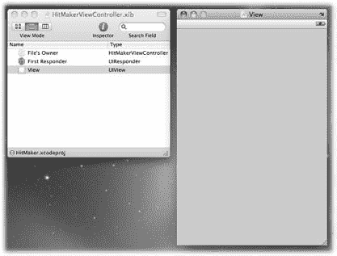

[www.it-ebooks.info](http://www.it-ebooks.info/)

**目标和动作**

***图 3-3：*** *这是你将使用的空白面板。左侧是文档窗口，右侧是应用唯一的视图。请注意，文档窗口中列出的 View 目前还没有任何子视图。*

**2.** 滚动库中的对象列表，选择带有“Label”文本的单元格。

它应该位于“Cocoa Touch—Inputs & Values”的第一行。当你选中该单元格时，面板底部会显示该控件的简短描述及其功能。

**3.** 使用鼠标，将 Label 单元格拖到灰色的 View 窗口上。

图 3-4 演示了此操作。当你拖过 View 窗口时，会出现一个绿色加号，表示当你放下时对象将被添加。

**4.** 当光标位于 View 窗口上方时，松开鼠标按钮。

标签便放置在了视图上，四个调整大小的手柄表示它已被选中。

**5.** 双击 Label 并输入 `VOLUME NOB`。

在幕后，你刚刚替换了一行代码：

```
[label setTitle:@"VOLUME NOB"];
```

**6.** 向左和向右拖动调整大小手柄，直到出现蓝色虚线。

标签的边缘会与这些线对齐，帮助你对齐控件。


***提示：*** 若想在视图中显示布局矩形，请按下 `⌘-L` 显示边界。当标签被选中时按下 Option 键，您将看到各个界面元素之间的像素数量。

## 第三章：Cocoa Touch：让 Objective-C 发挥作用

**87**

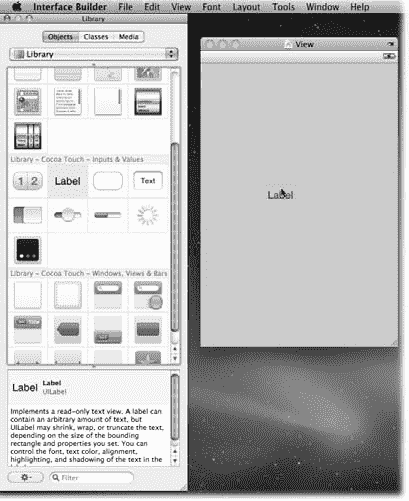

[www.it-ebooks.info](http://www.it-ebooks.info/)

### 目标与动作

***图 3-4：***  
*在左侧，您可以看到已选中标签控件的库面板。您可以拖拽库中的任意项目来创建对象的新实例。这里，标签正被拖拽到视图窗口上。*

**7.** 确保标签仍处于选中状态，然后选择 **工具 ➝ 属性检查器** 或按下 `⌘-1`。在属性检查器的布局部分，点击**对齐（居中）**。

您刚刚替换了另一行代码：

```
[label setTextAlignment:UITextAlignmentCenter]
```

**8.** 选中标签后，选择 **字体 ➝ 粗体**（`⌘-B`）。如果您想更进一步，也可以按下 `⌘-I` 使其变为斜体。

*Che bel ezza!* 但更美好的是您无需编写的这段代码：

```
[label setFont:[UIFont boldSystemFontOfSize:17.0f];
```

**88**

iPhone 应用开发：缺失手册

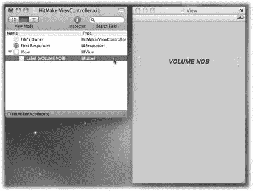

[www.it-ebooks.info](http://www.it-ebooks.info/)

### 目标与动作

如图 3-5 所示，文档窗口现在显示了一个视图的展开三角形。点击后，您会看到名称为 Label (VOLUME NOB)，类型为 `UILabel`。

***图 3-5：***  
*一旦添加包含文本 VOLUME NOB 的 `UILabel`，它将出现在窗口主 `UIView` 的下方。在文档窗口中双击某个视图，它会被选中并显示调整手柄——在复杂用户界面中查找子视图时，此功能非常有用。*

恭喜！您刚刚向层级中添加了第一个子视图。

*您掌控一切*

您拥有了第一个对象，但它只是一个标签，并且您尚未在代码中使用它。

是时候通过一个控件来解决这个问题了：

**1.** 在库面板中标签的正下方，您会看到一个类似滑块的图标。将其拖拽到灰色窗口上。

一个滑块控件随即出现，左侧和右侧带有调整手柄。有些控件无法调整宽度或高度——滑块就是其中之一。

**2.** 将滑块拖拽到 VOLUME NOB 标签的下方。

虚线蓝色线条可帮助您居中对象。

**3.** 拖拽手柄，直到它们吸附到虚线蓝色线条上。

您已创建了一个可用于 `mySlider` 实例变量的对象。剩下的工作就是将其连接到一个输出口：

**1.** 在文档窗口中，选择“文件的所有者”。

类型为 `HitMakerViewControler`，这与您正在编写的类相同！

第三章：Cocoa Touch：让 Objective-C 发挥作用

**89**

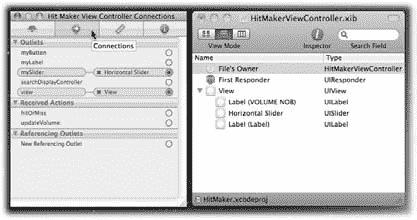

[www.it-ebooks.info](http://www.it-ebooks.info/)

### 目标与动作

**2.** 选择 **工具 ➝ 检查器**，然后选择顶部的第二个标签页（一个蓝色圆圈，带有指向右方的白色箭头）。或者直接按下 `⌘-2` 快捷键来选择这个连接检查器标签页。

您会看到 `myButton`、`myLabel` 和 `mySlider`。得益于您在源代码中添加的 `IBOutlet` 标识符，这些输出口会自动显示出来。

***提示：*** 要证明这一点，请打开 `HitMakerViewController.h`，删除 `UILabel myLabel` 前面的 `IBOutlet` 并保存文件。返回后，该输出口将不会出现在“文件的所有者”检查器中。

完成此实验后，请将 `IBOutlet` 放回原位；后续步骤中您会用到它。

**3.** 要将输出口连接到视图，请点击 `mySlider` 右侧的圆圈并拖拽鼠标。

一条蓝色线条会出现，提示您正在连接到一个对象。

**4.** 继续拖拽鼠标，直到悬停在滑块控件上方。当滑块周围出现蓝色方框时，松开鼠标按钮，操作完成。

在“文件的所有者”的输出口列表中，`mySlider` 已连接到水平滑块（图 3-6）。耶！


### **图 3-6：**

将 `slider` 控件添加为插座变量后，`HitMakerViewController` 的连接检查器（Connection Inspector）显示如下。如你所见，`mySlider` 已连接到一个水平滑块。当你使用 Interface Builder 时，建议利用“文件的所有者”（File's Owner）上的这个检查器，来确认所有插座变量和操作都已正确连接。如果某个连接缺失，你的控制器代码将无法与视图正常通信。

**提示：** 你还可以通过按住 Control 键从“文件的所有者”拖拽到要连接的控件，来连接插座变量。松开鼠标按钮后，你将看到一个可供选择的插座变量列表。

---

### **目标和操作（Targets and Actions）**

你的文档开始看起来像用户界面了。你还需要连接两个插座变量：

1. **从资源库中拖拽另一个 `UILabel` 对象**到灰色视图窗口。将其放置在滑块正下方，并像处理“VOLUME NOB”标签那样进行调整，但无需修改标签的文本。

与第一个标签不同，你将通过代码来更新这个标签。

2. **现在，选中“文件的所有者”后进入连接检查器，从 `myLabel` 旁边的圆圈拖出一条蓝色线**，连接到新标签。

最后，你需要一个按钮。

3. **在资源库检查器中，点击按钮图标（位于标签图标右侧）。**  
   你应在窗口底部看到的描述是“圆角矩形按钮”（Rounded Rect Button）以及类名 `UIButton`。

4. **将圆角矩形按钮拖到视图窗口，并放置在其他控件下方。**  
   与标签一样，你可以双击按钮来输入要显示的按钮文本。

5. **双击按钮并输入 `HITORMISS`。** 然后从 `HitMakerViewController` 的插座变量 `myButton` 连接到刚添加的按钮。拖拽连接的步骤与你刚才为另外两个插座变量所做的操作相同。

6. **按下 ⌘-S 保存你的工作。**  
   Interface Builder 会生成一个名为 `HitMakerViewController.xib` 的新 XIB 文件。不要关闭文档窗口，你还没完成。

接下来，你将回到 `HitMakerViewController` 的连接属性，并将 `myButton` 连接到这个新按钮。

**注意：** 有些开发者更倾向于一次性放置并配置好所有控件，而不是在检查器之间来回切换。选择最适合你的工作流程；只需记住，在所有控件放置完成后连接你的插座变量。

对于初学者来说，很容易忘记这些连接。任何引用未连接插座变量的代码都会向 `nil` 对象发送消息，从而不产生任何效果。在花大量时间调试代码之前，请确保所有连接都已正确挂接！

切换回 Xcode，以便你使用这个新的 XIB 文件构建应用程序。

当你在 Xcode 中使用 ⌘-Return 构建并运行应用时，你会看到应用启动并初始化控件（图 3-7）。`–viewDidLoad` 代码将滑块调整到中间位置，并修改了标签文本和颜色。但当你拖动滑块或按下按钮时，没有任何反应。

---

### **图 3-7：**

将插座变量连接到滑块和标签控件后，`HitMakerViewController` 的 `–viewDidLoad` 代码可以更新滑块的位置以及标签的文本和颜色。现在启动应用时，如果你尝试点击按钮或滑块，也不会发生任何事情。

---

### **添加一些操作（Get a Little Action）**

你开了一个好头，但还需要添加一些操作。不是那种操作，是时候为你的新控件挂接操作了：

1. **点击 Interface Builder 的 Dock 图标，切换回该工具。**


# 2. 在`HitMakerViewController.xib`文档窗口中，选中`File's Owner`。

# 3. 按下 ⌘-2 打开连接检查器。

还记得你在控制器头文件中添加的那些`IBAction`标识符吗？你可以在“已接收动作”列表中看到它们。请确保你能同时看到灰色视图窗口和包含`File's Owner`的文档窗口。

# 1. 按住 Control 键并点击`HIT OR MISS`按钮。拖动鼠标，你会看到一条蓝色线条。由于你想要这个动作由`HitMakerViewController`执行，请将蓝线拖至文档窗口中的该类型对象上。

松开鼠标按钮时，你会看到一个菜单，其中列出了该视图控制器支持的事件（图 3-8）。点击`hitOrMiss`，就完成了。

**92**  
iPhone 应用开发：缺失的手册

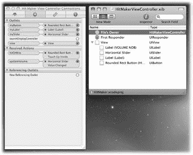  
[www.it-ebooks.info](http://www.it-ebooks.info/)

## 目标与动作

**图 3-8：** `HitMakerViewController`已完全连接。当你选中`File's Owner`时，你会看到控制器的三个输出口（`myButton`、`myLabel` 和 `mySlider`）已连接到视图。同样，动作（`hitOrMiss` 和 `updateVolume:`）将由按钮和滑块控件调用。

# 2. 按住 Control 键点击滑块控件。将蓝线拖到`HitMakerViewController`上，松开鼠标按钮，然后点击`updateVolume:`。

# 3. 使用 ⌘-S 保存更改。

转到文档窗口，选中`File's Owner`，然后按下 ⌘-2 打开连接检查器。你会看到`hitOrMiss`已连接到圆角矩形按钮的“Touch Up Inside”事件。同样，水平滑块的“Value Changed”事件已连接到`updateVolume:`方法（图 3-9）。

**提示：** 你甚至可以在文档窗口中列出的项目之间按住 Control 键拖动。一些开发者更喜欢这种方法，因为它无需打开视图窗口。

在第 81 页，你了解了编写`–addTarget:action:forControlEvents:`代码时事件是如何处理的。本质上，你刚刚用几次点击替换了`–setupControls`中显示的代码。

现在该回到 Xcode 并测试应用了。点击它的 Dock 图标，然后按下 ⌘-Return 来构建并运行应用。

第 3 章：Cocoa Touch：让 Objective-C 发挥作用

**93**  
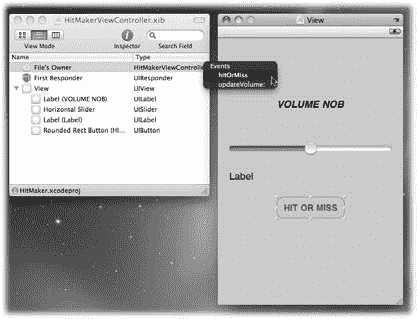  
[www.it-ebooks.info](http://www.it-ebooks.info/)

## 目标与动作

**图 3-9：** 将连接从`HIT OR MISS`按钮拖到`HitMakerViewController`后，你会选择`hitOrMiss`动作。此操作会使按钮按下时调用命名的方法。

## 消灭那些 Bug

使用可视化开发工具并不意味着不会有 Bug。运行应用时，你会发现几个问题：

- **Bug：** 滑块值范围仅为 0.0 到 1.0（图 3-10）。它至少需要达到 11.0 才能正常运作。
- **视觉问题：** 文本颜色在灰色背景上看起来不太好。如果文本能居中对齐就更好了。正如在代码中更改视图属性时常遇到的情况，直到运行时你才知道效果如何。

幸运的是，这两个问题都可以用 Interface Builder 轻松修复。点击 Dock 图标将你的 XIB 文件重新调出。在以下步骤中，你将先修复 Bug，然后修复视觉问题：

# 1. 在文档窗口中，双击`UISlider`。然后按下 ⌘-1。

属性检查器随之打开。

**94**  
iPhone 应用开发：缺失的手册

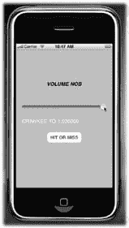  
[www.it-ebooks.info](http://www.it-ebooks.info/)

## 目标与动作

**图 3-10：** 当你运行应用时，滑块和按钮控件现在可以工作，但仍存在一些问题。滑块控件值最高仅为 1.0，标签的对比度太低，并且文本没有正确对齐。你可以在 Interface Builder 中修复所有这些 Bug。

# 2. 将最大值从 1.0 改为 12.0。


因为你的应用比图内尔先生的音箱还要酷那么一点点。

**3. 在文档窗口的“视图”部分中，双击列出的第二个标签。在“视图”区域中，点击“背景颜色”色块。当颜色选择器出现时，选择 100%不透明度的黑色。**

你还需将标签文本改为白色，以便在新的背景上能看清。

**4. 点击“文本颜色”色块，并像之前一样选择颜色 [图 3-11]。**

**5. 返回标签属性，在“布局”部分中，点击居中对齐按钮。**

**6. 在“视图”窗口中，拖拽标签的高度调整手柄，使其高度约为 30 像素。**

保存你的工作，然后切换回 Xcode 构建并运行你的应用程序。

当你运行应用时，一切看起来都不错 [图 3-12]。当你将滑块一直拖到最右边时，一切就完美了！

但最精彩的部分还在后面：想想你还没有编写多少代码。这一切之所以成为可能，仅仅是因为你在头文件中输入了几个 `IBOutlet` 和 `IBAction` 标识符。这真是太“懒”得高效了。

**第 3 章：Cocoa Touch：让 Objective-C 付诸实践**

**95**

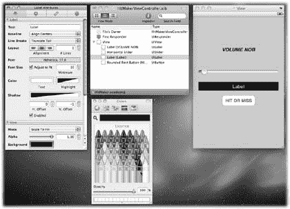
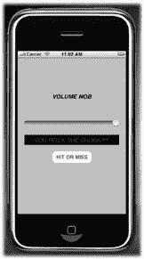

[www.it-ebooks.info](http://www.it-ebooks.info/)

## 目标和动作

**图 3-11：** *调整第二个标签的颜色和布局。选择标签 (A)，然后转到属性检查器 (B)。点击背景颜色色块 (C)，并选择黑色背景 (D)。你可以使用自己的文本颜色色块 (E) 更改文本颜色。使用布局控件 (F) 调整文本对齐。结果将显示在“视图”窗口 (G) 中。*

**图 3-12：** *修复了 Interface Builder 中的错误后，应用程序的最终构建版本运行完美。不仅因为你可以将滑块一直拖到最右边并点击按钮，还因为你完成了所有这些工作，却没有编写一行代码。*

**96**

iPhone 应用开发：缺失手册

[www.it-ebooks.info](http://www.it-ebooks.info/)

## 通知

在像 Cocoa Touch 这样复杂的系统中，各种组件的状态在不断变化。许多发生的事情超出了你的控制范围，但如果你的应用能够适应新的条件，它将提供更好的用户体验。

如果你的应用能知道这些事情何时发生，那岂不是很好？Cocoa Touch 提供了通用机制，让你的应用通过*通知*来了解这些变化。例如：

- iPhone 被锁定或解锁（`UIApplicationWillResignActiveNotification` 和 `UIApplicationDidBecomeActiveNotification`）。
- 设备方向从竖屏变为横屏（`UIDeviceOrientationDidChangeNotification`）。
- 用户界面元素导致键盘出现在屏幕上（`UIKeyboardDidShowNotification`）。
- 电池电量水平发生变化或设备已插入电源（`UIDeviceBatteryLevelDidChangeNotification` 和 `UIDeviceBatteryStateDidChangeNotification`）。
- 文本编辑视图被更新（`UITextViewTextDidChangeNotification`）。
- 粘贴板（剪贴板）发生变化（`UIPasteboardChangedNotification`）。

许多类都会生成通知，并且任何对象都可以生成它们。此列表中显示的只是由 `UIApplication`、`UIWindow`、`UIDevice`、`UITextView` 和 `UIPasteboard` 发布的少数几个通知。你大概可以从列表看出，标准约定是在开头使用类名，在结尾使用单词“Notification”。

当你希望你的应用被通知时，你需要提供一个对象、一个选择器以及通知的名称。一个名为 `NSNotificationCenter` 的中心服务负责将信息从生成它的对象传递给希望消费它的对象。被分发的对象是 `NSNotification` 类的实例。通知中心就像一个邮局，而通知本身就像信件。


# 通知

当你想接收系统事件的通知时，你需要向通知中心告知一些关于你自己的信息。假设你对应用程序变为活跃状态（无论是在启动时还是在 iPhone 解锁时）感兴趣。通常，你会将视图控制器添加为观察者：

```
@implementation MyViewController

. . .

- (NSObject *)initWithNibName:(NSString *)nibNameOrNil bundle:(NSBundle *) nibBundleOrNil {

if (self = [super initWithNibName:nibNameOrNil bundle:nibBundleOrNil]) {

. . .

[[NSNotificationCenter defaultCenter] addObserver:self selector:@selector(becomeActive:)
name:UIApplicationDidBecomeActiveNotification object:nil];

. . .

}
```

第一个参数是 `self`，它告诉通知中心该视图控制器将处理通知。选择器 `becomeActive:` 指定了发送给视图控制器的消息，而名称则指明了该控制器的兴趣所在。当用户能够与用户界面交互时，`UIApplicationDidBecomeActiveNotification` 会被发送给该控制器。

**注意：** 本示例中未使用对象参数，但它可用于指定通知的发送者。通过指定 `nil`，你表示无论源自哪个对象，你都希望接收此类型的全部通知。

既然你已经注册接收通知，现在就需要实现处理该通知的方法：

```
- (void)becomeActive:(NSNotification *)notification {

NSLog(@”OPEN PUMPERNICKEL”);

}
```

现在，每次启动或解锁应用时，控制台日志中都会显示 `OPEN PUMPERNICKEL`。很酷的功能，对吧？

好吧，这算不上一个很棒的功能。但是，如果该通知启动了一个通过网络刷新数据的连接呢？或者更新设备位置呢？它是一个很好的触发器，让你知道用户正在积极地使用你的应用。

类似地，你可以使用 `UIApplicationWillResignActiveNotification` 来取消任何待处理的操作，特别是那些使无线连接保持活跃的操作。如果停止网络操作，无线设备可以关闭电源，从而延长电池寿命。皆大欢喜！

当你的视图控制器对象不再关心这些事件时，告诉通知中心这一点非常重要。如果你不这样做，你的应用程序可能会崩溃，因为当你添加观察者时，通知是通过引用进行的。如果已注册的对象被释放，通知将会发送给一个已不存在的实例，导致内存错误。

解决方案非常简单。确保每个 `–addObserver:selector:name:object:` 都有相应的 `–removeObserver:name:object:` 与之匹配。你也可以使用 `–removeObserver:` 一次性移除所有通知。由于观察者是在初始化期间添加的，因此在 `–dealloc` 期间移除它也是合情合理的：

```
@implementation MyViewController

. . .

- (void)dealloc {

. . .

[[NSNotificationCenter defaultCenter] removeObserver:self];

[super dealloc];

}
```

**注意：** 这些是出了名难追踪的 bug。你会在不是你编写的代码中看到来自 `objc_msgSend` 的故障，而且它们会在你意想不到的时候发生。如果你使用通知，请确保它们被妥善清理。

通知不仅限于系统生成的那些。你可以自定义通知，使应用程序的各个部分保持同步。想象一下，你的应用程序中有多个控制器需要知道网络连接何时完成。`NSURLConnection` 基于委托模式，因此只有一个对象知道操作何时完成。该对象可以通过定义自己的通知名称，将信息传递给感兴趣的各方。通知名称不过是一个字符串对象，因此你可以在类接口文件中这样定义它：

```
extern NSString *MyConnectionDidFinishNotification;
```

在该对象的实现中，你需要定义通知名称的值：

```
NSString *MyConnectionDidFinishNotification = @”MyConnectionDidFinishNotification”;
```

当连接完成时，你可以这样发布通知：

```
[[NSNotificationCenter defaultCenter] postNotificationName:MyConnectionDidFinishNotification object:self];
```

应用中任何调用了 `–addObserver:selector:name:object:` 且使用了 `MyConnectionDidFinishNotification` 的对象都会收到一条消息，并可以相应地更新视图、控制器和模型。

# 单例

单例设计模式应用于 Cocoa Touch 中的几个关键类。单例允许一个类在任何其他对象请求时，返回同一个对象实例。当你*绝不*需要该类型的多个对象时，这非常方便。

你刚刚了解到的 `NSNotificationCenter` 就是一个例子。所有通知都需要通过一个集中式服务进行路由才能有效。同样重要的是，对象需要能够定位到那个中心实例，这通过通知中心的类方法实现：

```
+ (id)defaultCenter;
```

每个发送 `+defaultCenter` 消息的对象都会得到同一个对象。这使得所有对象可以在同一位置添加和移除观察者。

很多时候，类会使用单例作为一种方式，来建模那些只发生一次的事物，无论是物理上的还是虚拟上的。例如，你只有一个应用程序、一套设置和一个硬件加速度计。

不幸的是，对于单例的命名没有一个统一的标准。较老的类，例如 Foundation 中的类，在方法名上使用 `default` 前缀。较新的类倾向于使用 `shared` 作为前缀。最常见的单例类有：

- `NSFileManager` (`defaultManager`)
- `NSUserDefaults` (`standardUserDefaults`)
- `UIApplication` (`sharedApplication`)
- `UIAccelerometer` (`sharedAccelerometer`)
- `NSNotificationCenter` (`defaultCenter`)

## 将单例作为全局变量

许多经验丰富的开发者不推荐使用单例。如果你曾经使用全局变量编程，你会意识到单例实际上只是表示全局状态的一种花哨方式。你也会体会到，随着应用程序的发展和演变，维护由许多组件共享的状态是一件令人头疼的事。

在实现单例时，你需要提供一个返回该类实例的类方法。因此，如果你有一个名为 `MyFoot` 的类，你需要像这样定义 `+sharedFoot` 方法：

```
@implementation MyFoot

+ (id)sharedFoot {

static MyFoot *foot = nil;

if (! foot) {

foot = [[self alloc] init];

}

return foot;

}
```

这段代码的巧妙之处在于实现中的静态变量；它持有一个指向共享对象的全局变量。当你的应用程序启动时，该变量的值为 `nil`。在接收到第一条消息后，实例被分配并返回，供此调用及后续调用使用。


> ***注意：*** 这个单例实现并非线程安全，也无法阻止你做类似释放全局实例这样的蠢事。如果你打算创建单例，请花点时间阅读《Cocoa 基础指南》中“创建单例实例”一节里 Apple 的建议（在文档浏览器中搜索 `Singleton`）。

只要应用只需要跟踪一只脚，一切都会运行得很好。但当你添加使用双脚的新功能时，会发生什么呢？

```objectivec
MyFoot *myLeftFoot = [MyFoot sharedFoot];
MyFoot *myRightFoot = [MyFoot sharedFoot];
[myLeftFoot shoot];
```

你不仅是在搬起石头砸自己的脚，还同时砸了双脚。

而且你分不清左脚和右脚，因为它们是同一个共享的脚。摆脱这种混乱的唯一方法就是进行大量繁琐的重构。

单例本身并非邪恶；只是在你采用这种设计模式之前，务必确保真的需要它。

## 下一步去向何方

你只是触及了一套自上世纪 80 年代以来积极发展的框架的皮毛。你已经看到了该框架的一些最重要部分，但绝未看到其全部内容。

正如第 61 页提到的，开发者文档中的《Cocoa 基础指南》是开始学习这个核心框架的绝佳起点。只需在文档浏览器中搜索其名称。本书的附录会为你推荐书籍、网站及其他资源，以便进一步学习 Cocoa 和 Cocoa Touch。

第 3 章：Cocoa Touch：让 Objective-C 发挥作用

**101**

[www.it-ebooks.info](http://www.it-ebooks.info/)

## 下一步去向何方

作为一名新开发者，请务必充分利用 Apple 在开发者网站上提供的源代码。研究这些示例能让你学到很多关于正确构建 iPhone 应用的方法。类似地，附录中包含了众多开源项目的链接。一些非常有天赋的开发者将这些代码贡献给了 iPhone 社区，你可以从他们的工作中学习。

## 设计语言

当你掌握了语言和框架后，你会想开始运用这些新技能。但在此之前，你需要思考设计问题。

正如软件有一套组织各组件的系统，设计语言可以帮助你安排应用的功能和视觉方面。下一章将探讨这个主题，并展示它如何改善你的整个开发过程。

下载自 Wow! eBook

**102**

iPhone 应用开发：缺失手册

[www.it-ebooks.info](http://www.it-ebooks.info/)

## 第 3 章：设计工具：打造更好的手电筒

既然你已经掌握了在 iPhone 上创建应用所需的语言和框架，现在准备好开始编码了，对吧？错！

你可能拥有多年桌面或 Web 应用的开发经验，但 iPhone 是一个运行在移动设备上的全新平台。理解一根或多根手指如何与你的用户界面交互需要时间。

在受控工作环境中应用运行的假设，在进入混乱的移动环境时会发生变化。这些巨大差异也意味着你设计应用的工具会随之改变。

本章将向你介绍 iPhone 设计的一些独特元素。你还将学习一套决策流程，帮助你适应这个新平台。一旦完成这个过程，你将看到如何开始构思实现你想法所需的代码。

### 规划在前，编码在后

你会发现开发 iPhone 应用远不止编写代码那么简单。在本节中，你将了解 iPhone 软件设计的不同之处、如何创造有效的用户体验、如何开始可视化你的想法，以及哪些工具能在设计过程中提供帮助。

#### 为什么要请设计师？


如果你能平安无事地读完前两章，那你很可能不是靠设计谋生的人。这完全没问题，因为这一节讲的不是画出漂亮的东西，而是做出好用的东西。

**103**

[www.it-ebooks.info](http://www.it-ebooks.info/)

## 先规划，再写代码

许多开发者认为设计师就是在项目收尾阶段来清理图形的人——也就是说，可以把你创建的那些用来占位的丑陋图片都替换掉，然后在产品发布前更新它们的人。

设计师当然能做这些事，但如果你只要求他们做这些，那就太小看他们了。优秀的设计师会从与技术不那么密切相关的视角出发，帮助你确定产品应该具备哪些功能。

作为开发者，你往往倾向于从具体实现的角度向外看问题。而设计师则从最终产品出发，向内思考其构建方式。当你的逻辑左脑与设计师的艺术右脑相遇时，伟大的事情就可能发生。

设计师能提供你不具备的视角。不要害怕在产品生命周期的早期就获取这些宝贵的意见。

### 设计目标

以下是你和你的设计师应该关注的一些通用目标：

- **关注用户及其任务。** 你的首要目标是在着手设计方案之前，始终先考虑用例。有些开发者喜欢编写用户故事，来规范客户将要执行的任务类型。
- **遵循既定惯例。** 苹果公司在其内置应用中，针对操作、行为、手势和隐喻都做得非常出色。尽可能地遵循他们的引导是明智之举。
- **保持一致性。** 人们会本能地学习应用中的模式。要确保这些模式的外观和感觉在整个设计中保持一致。当你需要偏离上述既定惯例时，这一点尤其重要。
- **降低复杂性。** 设计一个复杂的界面很容易。设计师最难的工作是把各种元素提炼到最基本的层面。要经常质疑添加“另一个控件”的必要性。移除界面中的某些部分比添加它们更能给你带来满足感。
- **让应用的状态清晰可见。** 如果正在执行像刷新这样的后台任务，你需要将这一信息传达给用户。当用户执行一个操作时，以高亮或动画形式的视觉反馈能让用户了解内部发生了什么。要假定用户会犯错，因此请提供清晰的反馈信息，并给他们提供撤销操作的方法。
- **好的设计不是一成不变的。** 不要害怕迭代！客户的需求会随着时间而改变。要为未来发展留出空间——即使你完全不知道产品会如何演变。

**104**

iPhone 应用开发：缺失手册


[www.it-ebooks.info](http://www.it-ebooks.info/)

## iPhone 设计的独特之处在哪里？

即使你拥有多年的应用设计经验，并且上一节列举的要点对你来说已是驾轻就熟，你在设计中依然会面临许多新的挑战。如果你想知道为 iPhone 做设计到底有何不同，答案很简单：大有不同！

### 来点实际的

关于 iPhone，你首先注意到的是与它的物理交互方式。这种接触是直接的，而非通过鼠标这样的中间设备。

人类手指的输入方式带来了一些直接的影响，你需要在设计中予以考虑：

- **手指的大小和触达范围。** 如图 4-1 所示，指尖比鼠标指针要大得多。在尝试同时触达屏幕不同区域时，手指的长度也可能成为一个限制因素。而且手的尺寸也差异很大。

***图 4-1：***  
*这张照片展示了其中一个*


根据 iPhone 与传统桌面设计的最大差异，手指在屏幕上的点击区域大约为 ¼″，而鼠标指针仅代表屏幕上的一个像素。这使得设备上的点击目标比桌面大 40 倍左右。

- **重量分布**。控件位置会影响设备在手中的平衡感。
- **设备运动**。运动可作为输出（如振动）或通过加速度计作为输入。
- **单手或双手操作**。交互模式会因用户使用单手还是双手操作应用程序而发生显著变化。

**第 4 章：设计工具：打造更优的手电筒**

**105**

[www.it-ebooks.info](http://www.it-ebooks.info/)

**编码前先规划**

- **左手或右手用户**。适合右手用户的控件布局可能不适合左手用户。
- **屏幕方向旋转**。当用户在竖屏和横屏方向之间切换时，设计的布局可能会发生变化。

请注意，这些问题通常是相互关联的。为在横屏下使用双手的左撇子进行设计，可能与为在竖屏下使用单手的右撇子进行设计同等重要。

您还需要考虑环境因素。低对比度的设计在受控光线条件下可能看起来很棒，但当用户在一个阳光明媚的日子从口袋里拿出手机时，他将难以看清您呈现的信息。同样，您的设计在静止状态下可能易于阅读，但许多人会在颠簸的公交车或火车上使用您的应用程序。

务必将您的创作带到办公室之外，观察现实世界对其可用性的影响。在整个开发过程中尽早并频繁地进行此项工作。

*口袋里的互联网*

iPhone 有两类用户。在设计应用程序时，您需要牢记这两个群体截然不同的需求。

有些人将 iPhone 用作卫星设备。这些人在家里或办公室有一台台式电脑。iPhone 是让他们随身携带信息的一种方式。针对这一群体的应用设计需要考虑以下几个方面：

- `Mail` 应用程序适用于通知和筛选。撰写长消息并不舒适。
- 捕获和显示照片很容易，但对图像进行大量处理超出了 CPU 的能力范围。
- 向 `Contacts` 应用程序添加信息很容易，尤其是对于新认识的人。但真正的价值在于将这些信息同步回桌面。
- 不将重要数据同步回桌面的应用程序使用起来令人沮丧。苹果内置的 `Notes` 应用程序就是一个例子。

另一类 iPhone 用户是没有其他电脑的人。对许多人来说，他们的新智能手机是第一次拥有个人计算设备。这些用户不期望拥有真正电脑上的功能种类，但在使用您的应用程序时仍然需要灵活性。

对于所有类型的用户来说，iPhone 的价值不在于它执行的功能本身，而在于它在何处执行该功能。简而言之，它就是口袋里的互联网。

*尺寸很重要*

iPhone 与桌面电脑存在的另一个主要差异是：可用资源要有限得多。表 4-1 将您桌上的设备与口袋里的设备进行了比较。

**106**

iPhone 应用开发：遗失的手册

[www.it-ebooks.info](http://www.it-ebooks.info/)

**编码前先规划**

***表 4-1.** 在资源方面，您的台式电脑远比 iPhone 强大。*

| **资源** | **桌面电脑** | **iPhone** |
|---|---|---|
| CPU | 数 GHz，多核心 | 数百 MHz，单核心 |
| 内存 | 数 GB | 数百 MB |
| 网络 | 有线连接，带宽数 Mbits | 无线连接，速度可低至拨号速度 |
| 显示屏 | 每个维度数千像素 | 每个维度数百像素 |


```markdown
如您所见，大多数情况下，资源规模比您习惯的要小一个数量级。其中许多限制会在您实现设计时显现出来；另一些则会产生直接影响。

例如，小型显示屏显然限制了您在单个屏幕上呈现的信息量。同样，有限的内存和处理能力也阻止您向应用列表中放入数千个项目。显示数百个项目对系统以及需要解读信息的用户来说，负担相对较小。无论对设备硬件还是使用它的人而言，简约即是美。

## 保持简洁

在您的第一款 iPhone 应用中，需要适应许多新事物。不必害怕在初始阶段避开其中一些。iPhone 上许多成功的应用都是从简单起步的。开发者们专注于解决手头的问题，并尽量让实现方式基础。随着他们对平台的知识和经验增长，他们的产品也随之进化。

您的应用肯定会随着时间的推移而演变。请记住，在未来的版本中添加一项功能远比从客户手中的产品中移除一项功能容易得多。不要试图猜测用户想要从您的应用中获取什么。让他们告诉您，并引导您在这个令人兴奋的新平台上不断学习吧！

## 设计流程

无论您是设计师还是开发者，都可以通过一些简单的步骤和工具来启动您的应用构想。

### 纸质原型

即使您不具备制作美观图标和图像的技能，您仍然可以绘制出设计的粗略原型。您的纸质画作可能不漂亮，但用来初步感受应用已经足够了。

这种低技术含量的设计技术出奇地有效。关键在于纸张和 iPhone 有一个共同点：您都可以通过触觉与它们互动。

第四章：设计工具：打造更好的手电筒

**107**

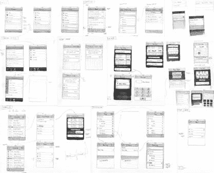

[www.it-ebooks.info](http://www.it-ebooks.info/)

**编码前先规划**

您会发现自己会想象触摸纸上画出的控件是什么感觉。当您构想从一个屏幕到另一个屏幕的转换时，在纸上移动纸张也很容易。在有限的空间内很难写下大量信息，这一事实会自然迫使您简化想法。

与代码不同，如果您发现某些内容不合逻辑，只需拿起橡皮擦修改界面即可。像 `Xcode` 和 `Interface Builder` 这样的工具在您实现设计时会大大简化工作，但在开发的探索阶段，它们可能会浪费大量时间。

纸张还有另一个优点：它可以让设计师和开发者同时协作。一群人很难同时在 Photoshop 合成或 `Interface Builder` 文档上工作。有了纸，每个人都可以拿起铅笔做出贡献。参见图 4-2 中纸质原型的示例。

***图 4-2：*** 这是 Cultured Code 公司的 Christian Krämer 制作的一个非常棒的纸质原型示例。此图展示了他们为其获奖应用 `Things` 设计的众多屏幕。其中一些初始屏幕在项目生命周期中发生了变化，但用箭头表示的应用基本流程没有改变。

### 一支铅笔和纸以及…

那么，创建这些纸质原型需要哪些工具呢？显然，您需要纸和铅笔，以及一些不那么显而易见的东西。请看图 4-3 中，Cultured Code 公司用来创建图 4-2 中图示的工具。

**108**

iPhone 应用开发：缺失手册


[www.it-ebooks.info](http://www.it-ebooks.info/)

**编码前先规划**

***图 4-3：*** 用于创建图 4-2 中纸质原型的工具。此图中的每件物品都很重要，尤其是标准用户界面元素的模板。

为什么需要橡皮擦？在设计阶段，您不应该害怕犯错。此外，如果您与团队合作，橡皮擦是帮助完善他人想法的重要工具。荧光笔也有助于从视觉上划分界面的不同组件。

您还需要准备一部装有最新版 iPhone OS 的 iPhone。您会经常需要参考苹果的应用，将其作为如何“以 iPhone 方式”做事的示例。iPhone 用户最熟悉设备的内置软件：如果您模仿这些设计和交互方式，您创建的应用将易于用户上手。

这张照片中最重要的物品是带有 iPhone 标准 UI 尺寸的屏幕模板。在您进行设计时，会绘制很多这样的方框。

Christian 的模板是出于需要手工制作的。幸运的是，创业者们意识到这类产品有强劲的需求，现在市面上已有多种纸质原型解决方案：

- **http://uistencils.com**。这款由 Design Commission 提供的用户界面模板能让您轻松绘制 iPhone 上使用的标准符号和控件。他们还销售与该模板完美搭配的素描本。您可以将时间花在设计构思上，而不是如何绘制上。图 4-4 和图 4-5 都是使用该模板和素描本创建的。

- **http://appsketchbook.com**。Stephen Martin 在接到多个 iPhone 用户界面设计需求后，提出了这个素描本的想法。它是一本高品质的螺旋装订笔记本，每页都印有线框模板。非常适合想要捕捉灵感的设计师。

第四章：设计工具：打造更好的手电筒

**109**

[www.it-ebooks.info](http://www.it-ebooks.info/)

**编码前先规划**

### 美化设计

一旦您对应用的整体设计有了感觉，就需要开始规范化它在屏幕上的呈现方式。此时，您需要开始考虑品牌形象，并为应用添加独特元素。

**注意：** 对许多公司来说，这是流程中非常重要的一部分。像 UPS 这样的公司不希望他们的应用只是标准的蓝色调和黑白文字。他们会依赖公司标志性的棕色和金色配色方案。同样可以确定的是，他们的标志会占据显著位置。

这项工作最好留给精通 Photoshop 和其他插画工具的设计师来完成。如果您是开发者，人们会发现您不擅长绘画，这会分散他们对图像背后优秀代码的注意力。如果您在纸质原型阶段还没有让设计师参与进来，那么您需要花时间解释您的设计。这也是为何应尽早让设计师参与流程的另一个原因。

并非所有设计都需要经历这一步。如果您打算使用标准的 UI 控件和布局，设计师能做的事情并不多。

当您的设计师正在制作模拟图时，您需要确保他们知道标准 UI 控件有多种文档格式可用。如果您的设计师使用 Illustrator，他们需要了解 Mercury Interactive 的矢量 UI 元素（`http://www.mercuryintermedia.com/blog/index.php/2009/03/iphone-ui-vector-elements`）。对于偏好使用 Photoshop 的设计师，Teehan+Lax（`http://www.teehanlax.com/blog/2009/06/18/iphone-gui-psd-30/`）和 Smashing Magazine（`http://www.smashingmagazine.com/2008/11/26/iphone-psd-vector-kit/`）都提供了包含分层元素的 PSD 文件。另一个选择是使用 Patrick Crowley 为 OmniGraffle 制作的模板套件（`http://graffletopia.com/stencils/413`）。
```


***提示：*** 在 `Illustrator` 中工作能提供最大的灵活性。编辑矢量对象通常比移动位图层更容易。此外，通过以易于缩放且便于印刷出版物的格式（例如需要大于 `320 × 480` 像素的截图）制作作品，你还能为未来做好准备。

*第一印象*

此时，你已开始考虑应用中最重要的图形：主屏幕上的图标。无论潜在客户是在 `iTunes` 的搜索结果中看到该图标，还是它被列为畅销应用之一，这幅图形都是他们第一眼看到的东西。可以把它想象成一张名片：你想留下良好的印象，所以让专业人士来处理这幅插图吧！

**110**

iPhone 应用开发：缺失手册

[www.it-ebooks.info](http://www.it-ebooks.info/)

**编码前先规划**

人脑处理形状和颜色的速度远快于文字。在设计应用图标时，请专注于具有清晰形状的独特配色方案。避免复杂和杂乱的设计。

*感觉如何？*

还记得当你第一次在 `iPhone Simulator` 中运行你的应用时，它看起来有多大吗？在 `Photoshop` 中工作时也会产生同样的效果：iPhone 的 `320 × 480` 显示屏看起来比实际要大。如果你在自定义用户界面组件，请记住，你的设计师是在光线经过精心控制的环境中工作的。

这两个因素都倾向于将设计导向适合桌面而非移动设备的方向。这就是为什么让你的设计接触真实世界如此重要。

感受 `Photoshop` 原型效果的最简单方法是将 `320 × 480` 图像保存下来，然后同步到内置的 `Photos` 应用中。一旦设计稿加载到设备上并随身携带，你就可以轻松打开应用，在明亮阳光下或荧光灯等不同条件下查看它们。

还可以通过将手指放在模拟的界面元素上来验证控件的大小和位置。注意当手指移动时被手掌遮挡的内容。这也是测试左手用户感受以及设计是否适合单手或双手操作的好时机。

**高级用户诊所：更进一步**

如果你需要向更多人展示你的设计，你需要将其打包，以便项目组之外的人也能轻松访问。幸运的是，一个名为 `Briefs` (*http://giveabrief.com*) 的新开源项目可以帮你实现这一点。

`Briefs` 应用通过*角色*来展示*场景*。场景是你使用纸质原型扫描图或 `Photoshop` 原型扁平化版本创建的背景图像。然后，通过 `XML` 文件，你可以定义一个或多个响应触摸的区域。这些区域被称为角色，允许你在不同场景之间切换。一旦所有这些信息编译成一个*brief*并加载到 `iPhone` 上，你的纸质原型就会在你的手中“活”起来。

这显然意味着更多的设置工作，但如果你正在为你的创意融资做电梯演讲，或者需要向公司 CEO 做演示，那么一个现场演示可能会成就或毁掉你的项目。你也会发现这是进行早期可用性测试的好方法。

**与设计师和谐共处**

设计师和开发者有着截然不同的思维模式和工作方式。

作为开发者，设计流程的最后一步是考虑如何与设计师合作，将素材从他们的设计工具转移到你的开发环境中。

第四章：设计工具：打造更好的手电筒

**111**

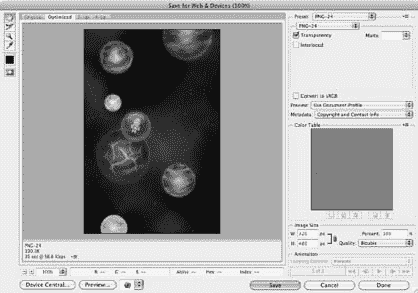

[www.it-ebooks.info](http://www.it-ebooks.info/)

**编码前先规划**

*寻找共同点*

你的设计师很可能在 `Photoshop` 中如鱼得水。看看图 4-4。设计师对这个极其复杂的程序的每个角落都了如指掌，并能用它做出令人惊叹的作品。幸运的是，你不需要去购买一份 `Photoshop` 来使用他们的成果。你只需要请设计师以 `PNG` 文件格式提供图形。这种标准格式很容易从分层的 `Photoshop` 文档中导出，并且你可以直接在 `Xcode` 项目中使用它。

***图 4-4：*** *Iconfactory 游戏 AstroNut 中正在用 `Photoshop` 创建的图形。要打开此对话框，请使用 `文件` 菜单下的 `存储为 Web 和设备所用格式` 命令。请确保使用的是 `PNG-24`（24 位色彩的 `PNG` 文件）并勾选了`透明度`（A）。`iPhone` 的屏幕尺寸是 `320 × 480` 像素，但你可以根据代码的需要设置图像大小（B）。*

如果你需要在交付后编辑设计师的作品，通常只需对图像进行裁剪或其他小幅调整。许多开发者使用名为 `Acorn` (*http://flyingmeat.com/acorn/*) 的工具来进行这种简单的清理工作。

当处理设计师的原型时，经常需要测量图像的各个部分，以便在 `Interface Builder` 或代码中实现精确的对齐。那个按钮间距是 `10` 像素还是 `11` 像素？这个视图的背景色是什么？对于这类测量，`Iconfactory` 的 `xScope` 工具非常宝贵 (*http://iconfactory.com/software/xscope*)。该应用提供了放大镜、标尺、参考线和其他工具，让你可以检查并对齐屏幕图形。

*让设计师掌控*

为了获得最高效率，请让设计师直接访问你的版本控制仓库。典型的 `iPhone` 应用中内置的图形往往涉及大量调整。这些持续的修改可能导致大量文件传输、测试构建、电子邮件以及开发者和设计师之间的其他沟通。

**112**

iPhone 应用开发：缺失手册

[www.it-ebooks.info](http://www.it-ebooks.info/)

**反馈：别只听自己的话**

如果你教设计师如何构建你的应用以及如何使用版本控制系统替换图像，你可以为自己节省大量时间。当你们双方都对这个安排感到更舒适时，你可能会发现设计师开始修改你的 `NIB` 文件。在你第一百次调整了一个 `UIColor` 定义后，你甚至可能会建议设计师直接修改你的源代码！

***提示：*** 请记住，设计师通常是视觉思考者。他们的才能通常不包括长时间直接在命令行中工作。如果你打算让设计师访问你的仓库，你需要使用像 `Versions` (*http://versionsapp.com/*) 这样提供图形界面的工具。

**反馈：别只听自己的话**

既然你已经完成了设计流程的一些基础知识学习，是时候开始思考是什么驱动了你的决策。答案既简单又复杂。你是在为人们使用而构建这个产品。他们的反馈应该是设计中最重要的因素。

**反馈来源**

你可能在想：“老兄，这很简单。反馈来自客户！”

这完全正确。但客户有多种不同的形式。

*你自己*

你是最重要的客户。如果你自己都不使用和热爱自己的产品，你的客户又怎么会呢？这个产品的诞生是因为你有一个需要满足的痒处：你在黑暗中绊倒了太多次。所以现在你的口袋里有了一个装在手机上的手电筒。

同时，你也是最糟糕的客户。你并不典型，因为你了解产品的每一个细微差别。那些从 `iTunes` 下载你应用的人并不处在这个令人羡慕的位置上。但他们很快就会发现你忽略掉的东西！

*你的市场部门*


# 排版后的内容

开发者往往对营销人员投以怀疑的目光。他们因为提出难以实现或看似不合逻辑的需求而饱受诟病。营销人员会像普通人一样看待你的产品。他们的动机是将产品定位、推广并销售给其他普通人。

#### 第 4 章：设计工具：打造更好的手电筒

**113**

[www.it-ebooks.info](http://www.it-ebooks.info/)

## 反馈：别只听自己的

最优秀的营销人员是充当你和产品购买者之间信息与想法管道的人。如果你做过营销，就会知道开发者更容易接受描述性的建议，而非指令性的：描述你的问题，而不是你认为的解决方案。如果你是小规模开发者，可能没有营销部门。这没关系，因为你很容易找到替代人选。

找个你可以交流想法的人。这个人应该了解产品是做什么的，但不必知道它是如何实现的。可能是你的配偶、挚友，甚至是你最爱的咖啡店里的咖啡师。关键在于这个人愿意与你进行长期讨论，了解你正在做的事情，并给出客观反馈。

注意不要让你的设计师承担这个任务。和你一样，他们对产品了如指掌，可能无法用不带偏见的眼光看待事物。

### 那些付诸行动的用户

简单来说，用户能让你的产品变得出色。无论他们喜欢、讨厌还是完全无感你的作品，他们的反馈都能帮助你改进产品。

用户反馈有多种形式：

-   **支持邮件。** 用户遇到 bug、不明白某个功能如何工作，或是有很棒的功能建议时，会通过邮件联系你。这些沟通中的趋势，是反映产品应如何演变的重要指标。
-   **Beta 测试者。** 他们是第一批试用新功能和其他应用变更的人。如果他们抱怨某些地方不对劲，那么当产品大规模推广时，极有可能会有成千上万的人加入抱怨的行列。

**提示：** 寻找 Beta 测试者可能是个挑战。可以从询问你认识的人是否对测试感兴趣开始，包括社交网站（如 Facebook 或 Twitter）上的人。

如果你还需要测试者，可以尝试像 iBetaTest（[`ibetatest.com/`](http://ibetatest.com/)）这样的网站，它能将开发者与热情的用户联系起来。

-   **iTunes 评论。** 针对某个功能的许多一星评论，表明你可能在某些方面做错了。

请注意，所有这些反馈都应综合来看。请克制住根据一封邮件就改变产品方向的冲动。让每个客户都满意的愿望固然可嘉，但现实是你无法做到。找到那些能让大多数人满意的东西。

**114**

iPhone App 开发：缺失的手册

[www.it-ebooks.info](http://www.it-ebooks.info/)

## 更大、更强、更快

### 手电筒 2.0

想象一下，你发布了第一章中开发的手电筒应用。你收到了大量关于该产品的积极反馈。现在是时候开发 2.0 版本了。你打算实现什么功能？

你收到了很多关于需要控制亮度的支持邮件。许多用户抱怨在黑暗的卧室里使用时，手电筒的光太亮了：他们的配偶都被弄醒了！从这些报告中可以清楚地看出，你需要一种快速降低亮度的方法。

当你在 iTunes 中阅读评论时，发现很多人在抱怨你选择的那个奇妙的黄色色调。并非每个人都有着和你一样好的色彩感。添加颜色选择器会让许多用户满意。

你的营销部门（也就是你的配偶）花了一些时间评估你的应用的竞争对手：很多应用都包含了闪光灯功能。你觉得这是个很棒的功能，因为你经常晚上带着 iPhone（装在臂带上）锻炼。

和营销部门共进午餐时，你开始讨论新的闪光灯功能。你只是用这个新功能来追赶竞争对手。有没有办法让它拥有独特之处，甚至让它更有用呢？如果能有一个随机变化颜色的“迪斯科闪光灯”，那就太酷了。这是你的竞争对手都没有的功能，因此营销部门同意应该研究这个功能。但除了让你在派对上大受欢迎外，这个功能并不是非常实用。

然后你们俩灵光一现：如果闪光灯能发送 SOS 信号呢？这个国际求救信号能让救援人员发现用户手机的位置。

这不仅是一个极佳的营销角度，而且你提供了一个可能拯救他人生命的功能。

现在，你有了新版本的功能列表：

-   亮度控制
-   颜色选择
-   闪光灯
-   迪斯科模式
-   SOS 信号

在你继续开发的过程中，这份列表就是指引你的明灯。这不仅是因为你在开发一个手电筒！

### 更大、更强、更快

你收集了所有反馈，对 2.0 版本的功能列表感到满意。是时候拿出铅笔，开始设计用户界面了！

第 4 章：设计工具：打造更好的手电筒

**115**

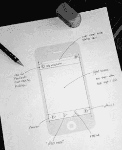

[www.it-ebooks.info](http://www.it-ebooks.info/)

### 正面

应用的主视图很直观。光源占主导地位，你需要在屏幕底部设置多种模式和设置入口的控制机制，如图 4-5 所示。

**图 4-5：** *新版手电筒应用主界面的纸质原型。屏幕分为三个区域：信息视图、光源和用于切换模式的控制区域。*

控制区域让用户可以启动闪光灯、“迪斯科模式”和 SOS 求救信号。设置图标会翻转视图，类似于内置的天气和股票应用。

你倾向于使用工具栏来容纳屏幕底部的这些控件。

标签栏控件更适合在应用的视图之间切换——而该应用只有一个视图。工具栏还有一个优势，就是你可以让它半透明，让底层的光源部分透出来。

**注意：** `UITabBar` 最适合用于需要在具有不同操作模式的视图之间切换的应用。苹果在 iPod 和 YouTube 应用中使用标签栏，让用户选择音乐和视频集合的不同视图。用户还可以重新配置标签栏，以显示偏好的信息集。

另一方面，`UIToolbar` 适用于在单一上下文内执行操作。工具栏按钮让用户对视图中的信息进行操作。

在设计用户界面时，请仔细思考这两种控制机制哪个更适合你的应用。

**116**

iPhone App 开发：缺失的手册

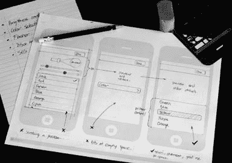

[www.it-ebooks.info](http://www.it-ebooks.info/)

### 背面

切换模式时，给用户一些反馈是个好主意，因此你决定在屏幕顶部放置一个信息视图。如果可能的话，隐藏信息视图会很好，因为它会减少光源产生的照明。

现在你对主视图感觉良好，但设置界面会让事情变得更棘手。你需要处理更多的控件，并且它们会引入一些微妙的交互问题。

幸运的是，你已经学会了使用纸质原型来攻克这些问题。

如图 4-6 所示，绘制屏幕草图有助于你发现棘手之处。

**图 4-6：**


# 排版后的文档

一张包含三个设置屏幕原型的照片。从左到右依次显示：一个用于颜色选择的分组表格视图、一个用于选择颜色的单一按钮，以及一个选择器控件。

你的第一个决定是包含一个当前设置的小型预览。这样做的原因是，如果没有它，用户将不得不在设置界面和主视图之间频繁切换。

你还决定使用滑块控件来控制灯光的亮度和闪光灯的速度。将它们放在预览下方是合理的，因为它们之间关系密切。

你对于选择正确颜色的第一个想法是使用分组表格视图。这很合理，因为它类似于在“设置”应用的声音部分选择铃声。当你开始绘制界面时，很快发现了一个问题：当颜色超过四到五种时，界面会变得拥挤不堪。

**第 4 章：设计工具：制作更好的手电筒**  
**117**  
[www.it-ebooks.info](http://www.it-ebooks.info/)  

**技术设计：介于图片与代码之间**

你希望给用户提供大约八种颜色供选择。当你在纸上尝试设计时，很明显，当用户滚动到列表底部时，预览内容将会滑出视野。

因此，你的下一个想法是只设置一个按钮，点击后显示另一个列表。但当你想象这个交互过程时，这个方案实际上让问题变得更糟：预览被隐藏了，而且存在大量浪费的空间。

当你思考其他可能的颜色选择控件时，你记起了`UIPickerView`。它将是完美的选择：具有固定大小，并且可以显示任意数量的项目。选择器视图的高度也为预览和滑块控件留出了更多空间。

在纸上花费的几分钟时间，让你免于编写大量最终会被丢弃的代码。现在，你拥有了两份文档，可以在与设计师和市场人员讨论界面时使用。干得漂亮！

## 绘图板

坦白说，这个手电筒应用非常简单；界面只有两个屏幕。

在更复杂的项目中，你会有更多的屏幕。回顾一下本章开头 Christian 绘图中屏幕的数量，你就会对像“Things”这样的应用的复杂性有新的认识。尽管存在这些复杂性，采用系统化的方法可以让你找到既满足用户需求，又保持一致且不增加不必要的复杂性的解决方案。

此时需要记住的是，设计过程永远不会结束。

随着你不断与设计师、市场人员、测试版测试者和客户沟通，你刚刚制作出的图表将会发生变化。不要害怕拿出橡皮擦来改进你的设计。迭代不仅仅适用于编码！

## 技术设计：介于图片与代码之间

但就目前而言，团队中的每个人都对设计感到满意，因此是时候开始构建它了。哦，太好了，你终于可以写代码了！但还不是现在。

iPhone 应用设计过程的最后一步是将视觉设计转化为技术设计。你将创建带有方法的类，以实现纸上绘制的设计。考虑这些部件如何在前一章提到的模型-视图-控制器模式中协同工作是个好主意。

如果你忽略这个重要的步骤，你会发现最终要重写大量代码。

你不需要写一本 100 页的规范书来详细描述技术需求，但你确实需要花一点时间来规划你的前进方向。

**118**  
iPhone 应用开发：缺失的手册  
[www.it-ebooks.info](http://www.it-ebooks.info/)  

**技术设计：介于图片与代码之间**

## 开始命名

这个过程中一个很好的第一步是开始为事物命名。你可能在与团队其他成员讨论设计时已经提出了一些术语。现在是时候开始对你的应用程序各部分进行规范化命名了。

一个`UIViewController`通常在 iPhone 应用中管理一个屏幕的数据。由于你的产品将有两个屏幕，这是开始命名的自然起点。带有光源的视图是启动后第一个看到的，因此你决定称其为“主屏幕”。你曾想将另一个视图称为“调光开关屏幕”，但深思熟虑后，你决定称其为“设置屏幕”。

现在是时候思考在每个屏幕上找到的事物并为它们命名了。这时你开始考虑你将如何称呼你的模型、视图和控制器。与你的视觉设计一样，力求简洁和一致。

## 第一束光

那么，主屏幕需要哪些类型的类？你需要一个视图控制器类来管理屏幕内容。该控制器将依次管理窗口顶部信息、光源和工具栏的视图类。将这些视图称为“信息视图”、“光源视图”和“工具栏”。

你还需要几个模型。一个将管理和持久化手电筒的当前设置，因此称其为“手电筒模型”是合理的。将应急信号发生器放入它自己的“SOS 模型”似乎也是个好主意。

总体而言，这些类将如图 4-7 所示组合在一起。

这也是开始思考每个类需要哪些实例变量的好时机。视图控制器将拥有每个视图和模型的实例变量（以便它可以向它们发送消息）。你还需要动作来响应工具栏上的按钮按下操作：`-toggleFlasher`、`-toggleDisco`、`-startSOS`和`-showSettings`。

你决定在信息视图中使用两种类型的消息：一种用于信息性消息，另一种用于警报。该`type`以及`message`将作为视图的实例数据进行存储。

光源视图将有一个`state`：照明状态可以是开、关或闪烁。你还希望能够控制其`brightness`和`color`，因此你将向视图添加这些属性。一个`delegate`实例变量还将允许你通过`-lightView:singleTapAtPoint:`和`-lightView:doubleTapAtPoint:`方法将触摸事件报告给控制器。

由于你试图模拟灯泡的物理行为，因此定义光对变化的响应速度也是有意义的。一个`envelope`将允许你改变灯光的开启（上升时间）和关闭（释放时间）速度。

**第 4 章：设计工具：制作更好的手电筒**  
**119**  
[www.it-ebooks.info](http://www.it-ebooks.info/)  

**技术设计：介于图片与代码之间**

**主视图控制器**

**图 4-7：**

*用于手电筒主屏幕的类。三个视图和两个模型将连接到控制器。视图代表信息、光源和工具栏。手电筒和 SOS 信号的模型将通过控制器为视图提供数据。*

```
flashlightModel
sosModel
infoView
lightView
toolbar

Action:
-toggleFlasher
-toggleDisco
-startSOS
-showSettings

Info View:
type
message

Light View:
delegate
state
brightness
envelope
color

Flashlight Model:
brightness
speed
defaultColor
randomColor

SOS Model:
element

Notify:
-send

Toolbar:
items

Update:
-singleTap
-doubleTap
```


# 排版后的内容

最后一个视图是工具栏，它将包含由按钮和视觉分隔符组成的*项目*，这些按钮用于发送操作。对于手电筒模型，你需要存储和检索*亮度*、*速度*和*默认颜色*。迪斯科模式需要一个*随机颜色*，因此你还需要为此添加一个属性。SOS 模型需要一个*方法*来启动发送信号，以及一种获取当前摩尔斯电码*元素*（点、划或之间的间隔）的方式。

## 调光开关

设置屏幕也将有一个位于中心位置的视图控制器。它将使用与主屏幕相同的手电筒模型，因为你希望当前的手电筒数据在两个视图中保持一致。

你还可以重用主屏幕中的灯光视图类。它拥有诸如 `brightness` 和 `color` 之类的属性，可用于预览。借助 Objective-C 和 Cocoa Touch，你可以轻松实现一次编写，多次复用。

标准滑块控件将用于控制灯的亮度和闪光速度。同样，你将使用标准的选择器视图来选择颜色。滑块将调用控制器上的 `-brightnessChanged` 和 `-speedChanged` 方法。控制器将充当选择器视图的委托，并实现 `-pickerView:didSelectRow:inComponent:` 方法来跟踪控件的更改。

**120**

iPhone App 开发：缺失手册

[www.it-ebooks.info](http://www.it-ebooks.info/)

## 下一步何去何从

与主视图控制器类似，每个视图和模型都会有实例变量。图 4-8 展示了该屏幕的整体架构。

设置视图控制器

***图 4-8:***

`flashlightModel`

*设置屏幕上使用的各个类。*

`lightView`

*四个控件分别用于调节亮度、*

`brightnessSlider`

*速度、颜色以及灯光预览。*

`speedSlider`

*使用一个模型来存储和检索*

`colorPickerView`

*当前的手电筒设置。*

`-brightnessChanged`

更新

`-speedChanged`

`-done`

`亮度`

`手电筒`

`滑块`

`模型`

`value`

`brightness`

`speed`

`defaultColor`

`速度滑块`

`randomColor`

`value`

`颜色选择器`

`视图`

`delegate`

`dataSource`

`灯光视图`

`state`

`brightness`

`envelope`

更新

`color`

## 下一步何去何从

在开发你的第一个 iPhone 用户界面时，对于“正确做法”肯定会有更多疑问。这时，最好的建议是查阅 *iPhone 人机界面指南*。每位 iPhone 开发者都应该熟悉这份来自 Apple 的文档，它描述了基本的交互原则以及可实现这些原则的视图和控件。

（你可以通过 *www.missingmanuals.com/cds* 上的链接找到它。）你还会在本书的附录中找到一些书籍，它们可以帮助你最大化 iPhone 应用的用户体验。

准备编码！

不要将你的模型、视图和控制器视为一成不变的东西。随着你实现这些类，细节肯定也会不断演变。预测未来从来都不是一门精确的科学。

第 4 章：设计工具：打造更好的手电筒

**121**

[www.it-ebooks.info](http://www.it-ebooks.info/)

## 下一步何去何从

在接触一行代码之前，经历这一冗长设计过程的主要目的是过滤掉糟糕的想法，并完善好的想法。在实现过程中出现的任何更改都将是微小的。主要功能和特性不会受到影响，你将避免中途修正所带来的成本和麻烦。

当你在 iTunes 上开始销售你的应用时，对设计细节的关注也会带来回报。你会发现营销你的产品变得更加容易，因为你对其用途以及有兴趣购买的客户类型有着清晰的认识。客户也会欣赏你在应用构建中所投入的用心，你将获得良好的评价和口口相传的推荐。


# 现在你已手握设计方案和行动计划，终于到了打开 Xcode 开始实现创意的时刻！乐趣就此展开！

## 第 5 章：认真对待开发工作

### 认真对待开发工作

拿着设计文档，你已经准备好打开文本编辑器大干一场了！第 1 章曾带你快速了解 Xcode 开发环境。现在，你将深入探索项目文件的诸多细节，并学习如何根据自身需求进行配置。

你还将学习如何设置工作区，以便将你的应用安装到 iPhone 上。这是一个复杂的过程——配置涉及数字证书和一个用于生成允许应用运行文件的 Apple 网站——但本章的分步指导将帮你顺利完成。

在本章及下一章中，你会多次看到一个名为 Flashlight Pro 的项目。建议你将其作为参考材料放在手边。如果你还没有从 Missing CD 页面（`www.missingmanuals.com/cds`）下载它，现在正是好时机。

### 超越模板

每个项目最初都基于你在第 18 页看到的某个模板。这些模板本质上是通用的，但你的项目是独特的。因此，你将首先修改代码和配置文件，以满足产品的需求。

在本节中，你将熟悉实际项目中的基本设置，并开始思考如何着手开发你的新手电筒应用。

你迫不及待地想开始编码，但你也知道，使用新软件时总需要一些初始设置，尤其是当这是你在 Xcode 中的第一个项目时！

### 超越模板

#### 选择你的 SDK

你需要做的首要决定之一，是选择为哪个版本的 iPhone SDK 编写代码。由于 iPhone 版 OS X 底层固件的差异，不同版本拥有不同的功能。

通常，一个明智的做法是选择包含你实现产品所需功能的最老 SDK 版本。如果你选择最新最好的版本，你将无法向那些尚未升级操作系统的用户销售产品。虽然升级过程很简单，但许多客户升级新版本的速度较慢。

从开发角度来看，iPhone API 最重大的变化通常发生在主版本更新时。例如，当 2.2.1 固件升级到 3.0 版本时，新版本引入了数百项新功能，包括复制粘贴、语音备忘录、彩信支持等。而 3.1 更新仅带来了少量新功能。

当 Apple 不可避免地发布 4.0 固件时，它无疑将包含许多出色的新功能。届时，Cocoa Touch 很可能会提供新的 API（第 15 页）供你在应用中使用。因此，即使你现在像大多数开发者一样决定以 3.0 为目标，当你想要跟随客户转而瞄准下一个主版本时，也不必感到惊讶。

***注：*** *API* 是“应用程序编程接口”的缩写。Apple 和开发者都将其作为一个涵盖 SDK 中可用类和方法的统称。

每次 iPhone 软件发布新版本时，都会发布一份“API 差异”文档，其中列出你可在应用中使用的类和方法的新增与更改内容。你可以使用文档查看器来查找和核对这份列表。

#### 更改项目设置

选定要为之编写的 iPhone 固件版本后，你需要在项目文件中配置该信息。为此，请确保你的 Xcode 项目已打开，然后通过 `Project` ➝ `Edit Project Settings` 查看设置。


您会看到`项目信息`窗口（图 5-1），其底部设有“所有配置的基础 SDK”设置项。从弹出列表中选择`iPhone Device 3.0`（或您正在使用的任何固件版本）。

超越模板

图 5-1：这是`FlashlightPro`的`项目信息`窗口。这里最重要的设置是`基础 SDK`（A），它指定了应用的最低固件要求。您还可以在此配置组织名称（B）和源代码管理系统（C）。

通常情况下，您无需更改该窗口中的任何其他设置。您可能希望将`组织名称`更改为自己的公司名称。如果您正在使用源代码管理（SCM）系统，也可能希望在此进行配置。附录中包含了如何设置`Subversion` SCM 和`Xcode`的信息。

**注意：** 项目设置还包含构建信息。在您探索了目标及其设置后，将在第 132 页详细了解这个重要选项卡。

### 更改目标设置

`Xcode`使用*目标*来定义一组指令，用于利用项目中的文件构建最终*产品*。每个目标都有其自己的名称、创建应用程序所需的步骤，以及用于识别并随后启动应用程序的属性。创建新项目时，`Xcode`会为每个项目创建一个默认目标，并赋予相应的值。

这些默认设置足以让项目起步，但您最终会希望修改它们。为此，请前往`Xcode` ➝ `项目` ➝ `编辑活动目标`。

#### 名称有何讲究？

出现的`目标信息`窗口包含五个选项卡。第一个选项卡`通用`中有一个`名称`字段，您可以在其中输入在此目标下产出的产品名称——即显示在 iPhone 主屏幕上的名称。

**注意：** 许多开发者将 iPhone 的主屏幕称为*Springboard*。在越狱时期，许多人发现`Springboard`是管理其他应用程序启动的隐藏应用的名称。尽管您从未见过它，但您已经使用过`Springboard`数千次了。

您最初为项目使用的名称很少会成为最终产品的名称。例如，您可能会使用一个代号，以免在准备发布前透露应用的功能；或者，您可能直到开发周期后期才知道最终产品的名称。`Flashlight Pro`项目就是如此：市场部直到出货前几周才决定使用“安全灯”这个名称。

与市场部大多数临时的更改不同，这个改动很容易处理。只需将目标的`名称`字段从`Flashlight Pro`改为`Safety Light`，然后重新构建应用即可（图 5-2）。

#### 标识自身

您应该进行的另一项更改在`属性`选项卡中。iPhone 上的每个应用都有一个唯一标识符，操作系统用它来管理应用。在新应用中，`标识符`字段填充的是`com.yourcompany.${PRODUCT_NAME:rfc1034identifier}`。您需要编辑此标识符，使其具有唯一性。

为确保您的标识符独一无二，请使用*反向域名*技术。换句话说，如果您的域名是`iconfactory.com`，那么您应使用`com.iconfactory`作为标识符的第一部分，而不是`yourcompany.com`。

标识符的第二部分通过`PRODUCT_NAME`环境变量，使用您在`通用`选项卡中输入的`名称`。如第 239 页所述，产品名称可能会发生变化，一旦变化，您的首页上就会出现重复的应用。这会令您和项目中的其他人感到困惑，因此现在就去选择一个唯一的名称吧。


您的用户永远不会看到这个名称，因此唯一重要的是不要将其用于其他产品。Flashlight Pro 项目使用 `com.iconfactory`。

`FlashlightPro`。

来自 Wow! eBook 的下载

**128**

iPhone 应用开发：遗失的手册

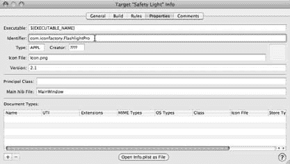

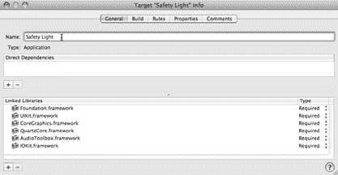

[www.it-ebooks.info](http://www.it-ebooks.info/)

**超越模板**

***图 5-2：*** *“目标信息”窗口显示了项目目标的主要设置。在“通用”选项卡中，您可以指定显示在 iPhone 主屏幕上的应用程序名称（A）。“属性”选项卡用于为您的应用设置唯一标识符（B）、图标（C）和版本号（D）。*

A B C D

***注意：*** 标识符必须符合与域名相同的 RFC 1034 规范，因此不要包含任何空格或特殊字符。只使用字母、数字和点号。

*选择独特的图标*

当您在第 1 章构建应用程序时，您可能注意到主屏幕上出现了一个单调的白色图标（图 1-12）。这就是当您在目标的“属性”选项卡（图 5-2）中没有为“图标文件”输入文件名时的情况。

第 5 章：认真对待开发

**129**

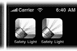

[www.it-ebooks.info](http://www.it-ebooks.info/)

**超越模板**

***图 5-3：*** *默认情况下，您的应用程序图标会获得光泽和浮雕效果，使其在 iPhone 上看起来更协调。对于某些图标（例如用于 Safety Light 的图标），这些效果会分散设计注意力。左侧的图片显示了应用效果后的图标，右侧显示了移除效果后的图标。*

要将单调乏味变为光彩夺目，请提供您想要用作应用程序滚动页面图标的 57 × 57 像素 PNG 文件的名称。您必须将此文件存储在项目的 Resources 文件夹中，Apple 建议将其命名为 `Icon.png`。

虽然“属性”选项卡中只出现一个 `Icon.png` 文件，但实际上当您指定 `Icon.png` 时，SpringBoard 会查找*两个*文件。由于 3.0 固件增加了 Spotlight 功能，您的应用图标还需要一个名为 `Icon-Small.png` 的 29 × 29 像素图形文件，位于项目 Resources 中。如果您不提供较小的图像，当用户搜索您的应用时，较大的图形会被缩小。在许多情况下，这种自动缩放的效果并不理想，因此请让设计人员创建两种分辨率下的图形。

***注意：*** 还有另一个图形未在任何配置文件中指定：`Default.png`。当应用程序启动时会显示该图形，使用户感觉运行速度更快。一些开发者，尤其是游戏开发者，会将其用作启动画面。

将该文件制作成 320 × 480 像素，并放入项目 Resources 中。如果此文件未包含或命名错误，则会显示黑屏，直到您的应用程序激活。

**移除浮雕效果。** 许多设计师也倾向于为 `Icon.png` 和 `Icon-Small.png` 文件添加自己的“光泽”。当您在主屏幕上查看图标时，这会带来一个问题：SpringBoard 的默认行为是为图标文件添加光泽和浮雕效果（图 5-3）。如何去除它呢？

您一直在编辑 `Info.plist`。您在目标设置的“属性”面板中所做的所有更改，实际上都是在更新 `Info.plist` XML 文件。当您在 Resources 组中看到该文件时，其完整名称基于项目名称。对于 Flashlight Pro 应用，文件名为 `Flashlight_Pro-Info.plist`。您可以在 Resources 组中看到它。当您构建目标时，原始文件会通过替换环境变量（如 `${PRODUCT_NAME}`）以及添加额外信息（如运行应用程序所需的最低操作系统版本）来处理。

**130**

iPhone 应用开发：遗失的手册

[www.it-ebooks.info](http://www.it-ebooks.info/)

**超越模板**


生成的 Info.plist 文件被重命名并放置在你的应用程序的可执行文件夹中。每个应用程序都包含此文件，因此 `Springboard` 拥有管理、显示和启动你的应用所需的所有信息。要移除 Apple 的倒角效果，你需要手动深入编辑 `Info.plist` 文件。

要手动编辑应用程序的属性，请按以下步骤操作：

1.  在目标的“属性”面板底部，点击“**以文件形式打开 Info.plist**”。
    一个编辑器窗口将打开，允许你直接编辑 `Info.plist` 的值。
    > **提示：** 你也可以在项目窗口中，通过点击“资源”组下的 `Flashlight_Pro-Info.plist` 文件来打开此编辑器。

2.  选择列表中的最后一行，该行的末尾会出现一个“**+**”按钮。
    一个新的属性被添加。

3.  从列表中选择“**Icon already includes gloss and bevel effects**”。
    你会看到一个未选中的复选框作为其值。

4.  点击复选框并保存文件。
    下次构建并安装目标时（从而让 `Springboard` 有机会读取新的值），光泽和倒角效果就会被移除。

你可能已经注意到属性列表中可用的键列表非常长。有些键，比如“`Status bar style`”，多少有些道理，而其他键，如“`Application uses Wi-Fi`”，则不然。单行描述无法帮助你理解配置值的使用方式。要了解更多，你需要更进一步。

`Info.plist` 中的数据实际上是 XML，你可以像编辑其他源代码一样编辑它。要这样做，请在项目列表中按住 Control 键并点击该文件。在出现的菜单中，选择“**Open As ➝ Source Code File**”。
> **提示：** 如果鼠标有右键，你可以右键点击文件并看到相同的菜单。

一旦你打开了 `Flashlight_Pro-Info.plist`，你可以看到“`Status bar style`”的键是`UIStatusBarStyle`，其值是`UIStatusBarStyleBlackOpaque`：

```xml
<?xml version="1.0" encoding="UTF-8"?>
<!DOCTYPE plist PUBLIC "-//Apple//DTD PLIST 1.0//EN"
  "http://www.apple.com/DTDs/PropertyList-1.0.dtd">
<plist version="1.0">
<dict>
...
<key>UIStatusBarStyle</key>
<string>UIStatusBarStyleBlackOpaque</string>
<key>UIPrerenderedIcon</key>
<true/>
</dict>
</plist>
```

快速搜索文档会得到一个名为 *UIKit Keys* 的文档，该文档解释了此设置及其他设置。这个特定的键配置了应用程序以黑色状态栏启动，以匹配应用程序其余部分的外观。你还可以看到，图标光泽的复选框设置的键是`UIPrerenderedIcon`。

当你查看此 XML 的其他部分时，你会看到一个名为`CFBundleVersion`的键，其中包含你应用程序的版本号。尽管这个值不会由 `Springboard` 显示，但你可以在自己的应用程序中显示它（请参阅下一章的第 204 页）。

### 构建设置

当你探索项目和目标设置时，你会注意到两者都包含一个“构建”选项卡。你的第一个问题是，“这些设置是什么？”简而言之，它们告诉 Xcode 你要创建什么以及如何创建。

当你滚动浏览设置列表时，列出的项目数量可能会让你不知所措。别担心；你只需要更改少数几个默认值。你将在第 264 页详细了解如何更改“代码签名”值，以便将编译后的应用程序放到你的 iPhone 上。
> **提示：** 当你点击一个项目时，会看到每个设置的简短描述。例如，如果你在“Packaging”下点击“Product Name”，你会看到该值用作生成产品的基本名称。方括号中的值显示了该设置的环境变量：`[PRODUCT_NAME]` 提示你`${PRODUCT_NAME}`将被替换为此值。括号中的值还会显示编译器和链接器标志（如果适用）。

*配置*


# 构建设置：发布与调试

每个构建设置列表的顶部都有`Release`（发布）和`Debug`（调试）的下拉菜单。它们允许你根据构建的是用于调试的测试版本还是用于发布的版本，来定义不同的设置。

一个很好的例子说明为何需要构建单独的调试版本：当你处理调试符号和优化级别时。调试时，如果可执行文件中包含有助于定位问题的符号，工作会轻松得多。同样，优化的代码在尝试复现问题时很难单步执行。

发布版本则相反：你需要*移除*符号，以便可执行文件在闪存中占用更少的空间，加载速度更快。同时，你也希望利用编译器能够提供的任何速度和大小优化。

## 超越模板

### 幕后揭秘

**休斯顿，我们点火了**

`Info.plist` 显然是启动过程的核心。如果你是那种喜欢极致细节的开发者，以下是让 Flashlight Pro 应用启动的完整步骤序列：

1. 用户点击你的应用图标。
2. Springboard 读取 `Info.plist`，并通过 `CFBundleExecutable` 属性找到编译后的应用。这个可执行文件会像 Unix 中的其他进程一样被启动。
3. 应用包含一个带有标准 `argc` 和 `argv` 列表的 `main` 函数。在 Other Sources 组中，`main.m` 文件展示了这个在进程启动期间被调用的入口点。
4. 当 `main()` 被调用时，会创建一个用于管理内存的自动释放池，并调用 `UIApplicationMain()` 函数。
5. `UIApplicationMain` 创建 `UIApplication` 类的单一对象实例。它还读取 `Info.plist` 中的 `NSMainNibFile` 属性。对于大多数应用，此属性为 `MainWindow`，并指定了要加载的 NIB 文件。
6. 当 `MainWindow.xib` 加载时，File's Owner 被设置为 `UIApplication` 实例。NIB 中的其他对象，包括 `Flashlight_ProAppDelegate` 和 `UIWindow`，也会被加载并建立连接。
7. 加载的对象图包含一个指向 `Flashlight_ProAppDelegate` 中 window 的 outlet。File's Owner 中 `UIApplication` 实例的委托也指向 `Flashlight_ProAppDelegate`。
8. 当 `UIApplication` 完成启动时，它会向委托发送 `applicationDidFinishLaunching:` 消息。作为委托，会使用 `Flashlight_ProAppDelegate` 中的该方法。
9. `applicationDidFinishLaunching:` 方法创建一个 `MainViewController` 实例，并将其分配给委托的实例变量。当控制器被实例化时，会以 `MainView.xib` 作为参数调用 `initWithNibName:bundle:` 方法。这会加载并连接另一个对象图。`initWithNibName:bundle:` 的实现还会设置模型和配置通知。
10. 应用委托完全实例化主控制器后，发送 `view` 消息。这会导致懒加载的视图从 NIB 文件中被读取。之后，向主控制器发送 `viewDidLoad` 消息。
11. 由控制器创建的视图随后被传回给应用委托。使用来自 `MainWindow` NIB 的 `UIWindow` 实例，此视图被添加为该 window 的子视图。为了使 window 及其视图可见，会发送 `makeKeyAndVisible` 消息。
12. 由于主控制器的视图现在即将被显示在屏幕上，控制器首先调用 `viewWillAppear:` 方法。视图显示后，调用 `viewDidAppear:` 方法。由于主控制器重写了第二个方法，此时用户会看到他偏好的手电筒颜色被显示出来。
13. 从此刻起，用户操作及其产生的事件驱动着应用运行。你已进入轨道。

难道你不庆幸 Cocoa Touch 如此出色，无需自己手动完成所有这些步骤吗？它确实让启动航天飞机看起来很容易！在下一章（第 157 页），你将看到一种更人性化的启动序列处理方法。

### 实践中的配置

要查看这两种配置的区别，请使用 `Project` ➝ `Edit Active Target` 打开 Flashlight Pro 的目标构建设置。然后点击 `Build` 标签，并将 `Configuration` 菜单设置为 `Debug`。

在搜索框中输入 `optimization`，你会看到优化级别被设置为 `None`。如果你将配置更改为 `Release`，你会看到相同的设置变成了 `Fastest, Smallest`。当你搜索 `strip debug` 并在两种配置之间切换时，你会看到只有 `Release` 版本中才会剥离符号。这正是你想要的。

## 双重性

当你理解了设置和配置后，你会开始思考为什么会有两套：一套用于项目，另一套用于目标。许多开发者会感到困惑，因为两个窗口都提供了几乎完全相同的大量选项列表。要决定选择哪一个，你需要理解构建设置的层级结构。

层级结构的最底层是 Xcode。它对列表中的所有设置都有内置的默认值。例如，如果你不另行告知 Xcode，编译器的优化级别会被设置为 `Fastest, Smallest`。

在 Xcode 的默认值之上，是项目的构建设置。你在此处更改的任何设置都会反映在该项目构建的所有目标中。将项目的设置用于那些你希望在所有目标中保持一致的事项。此层级的一个设置好例子是优化：你希望所有目标的 `Debug` 配置都没有优化，而不是使用 Xcode 的默认值。

目标的构建设置位于层级结构的顶层。如果你更改了目标中的某个设置，它会覆盖项目中的任何设置。除非设置明确与你正在构建的产品相关，否则请克制住将其放在此处的冲动。

当你开始一个项目时，只有一个目标，因此很容易忽略这个层级结构，随意分配设置。但随着项目的发展，你会添加越来越多的目标。例如，当需要构建测试版时，你可能会添加一个新目标；当需要将最终版本上传到 App Store 时，又会添加另一个。

如果你在目标中放置了大量设置，那么更改设置就会很麻烦。假设你有三个目标，并且决定需要调整发布版本的优化级别。在项目构建设置中更改一次优化级别，远比在每个目标中分别更改三次要容易得多。

***注意：*** 调整构建设置时，请注意那些以粗体显示的设置。这是 Xcode 突出显示那些覆盖了子级（译者注：此处指子层级）值的设置的方式。例如，如果你在目标构建设置中看到 "Optimization level" 被高亮，你就知道它覆盖了项目中的值。

`Show` 菜单是查看所有覆盖项设置的另一个好方法。选择 "Settings Defined at This Level"（此层级定义的设置）即可获得列表。（该列表会根据搜索字段的当前值进行过滤。）

## 付诸实践

到目前为止，你只能通过模拟器运行代码。本书的全部意义在于为你的 iPhone 开发应用，而不是在你的 Mac 上运行一个巨大的仿制品。为什么你不能看到应用在掌中运行呢？


# 如果你已经是开发者

如果你已经是一名开发者，你早已习惯使用源码编辑器、编译器、链接器和调试器。但在 iPhone 上，你需要在构建过程中学习一个全新的概念——`代码签名`。未完成此步骤之前，应用程序将无法在你的 iPhone 上运行。

这个开发工具箱中的重要新成员，是 iPhone 开发中最具挑战性的方面之一。许多经验丰富的开发者，即便是那些从 iPhone 初次发布起就一直从事开发的人，也时常对其运行机制感到困惑。当你遇到问题时，可以庆幸自己并非孤军奋战。

## 加入 iPhone 开发者计划

正如你在第 1 章所见，苹果免费提供 iPhone SDK，让你能够廉价且轻松地熟悉这个新的开发环境。但一旦决定分发你的产品，就必须加入 iPhone 开发者计划。要在 iPhone 或 iPod touch 上安装应用（无论是用于测试还是通过 App Store），每年需要支付 99 美元。

这笔费用有助于苹果运营该计划，但收费还有一个更微妙的理由——这是公司验证你身份的方式。苹果非常重视 iPhone 的安全性，不希望有恶意开发者破坏平台。

当你使用信用卡注册该计划时，你提供的姓名和地址已经过金融机构的验证。

### 选择你的计划

如果你访问过 iPhone Dev Center（`http://developer.apple.com/iphone`），可能会注意到右侧栏中的“Learn more”链接。点击此链接即可开始注册流程。

第一步是从三种账户类型中选择最适合你需求的一种。

你可以从两种标准开发者账户中进行选择：个人账户和公司账户。公司账户允许多位开发者构建和安装应用。

个人账户和公司账户均可访问 App Store。

**注意：** 你会在 iTunes 列出应用的方式上发现细微差别。个人账户会将你的姓名显示为“卖家”。公司账户则使用你的公司名称。

你还可以注册企业账户。这种账户仅适用于拥有 500 名或以上员工的大型组织。使用该账户创建的应用只能在内部分发：你不会在 iTunes 中看到它们。

第 5 章：认真对待开发

**135**

`www.it-ebooks.info`

## 正式化流程

### 付费参与

选择公司账户或个人账户后，你将经历一系列步骤，提供个人详细信息，包括信用卡信息。你还需要接受该计划的许可协议。

如果你以个人身份注册标准计划，请确保你的注册信息与信用卡账单信息完全一致。如果不一致，你的申请将被延迟，因为你还需要提供额外的身份证明。

（苹果试图确保你不是在借用他人的信用卡来支付注册费用。）

如果你选择了公司账户，苹果还会验证你的企业身份。

苹果会要求你提供各种文件，并联系你公司的法定代表人，以验证你有权接受该计划的许可协议。

一旦你提交了付款并证明了自己确实是你所声称的身份，你将通过电子邮件收到一个激活码。点击激活链接后，你会收到另一封来自苹果的电子邮件，欢迎你加入 iPhone 开发者计划。这时，事情才变得有趣起来！

### 欢迎加入这个俱乐部

成功注册后，登录你的新账户，你会在 iPhone Dev Center（`http://developer.apple.com/iphone`）中看到一些变化。右侧的导航栏显示了通往新功能的链接：

- **iPhone Provisioning Portal.** 你使用这个 Web 应用来管理你用 Xcode 构建的产品、创建产品的开发者以及运行应用的设备。


- **iTunes Connect.** 这是另一个 Web 应用程序，让你控制应用在 iTunes 中的分发方式。你可以在此上传最终应用，并提供用于在 App Store 中销售应用的信息。
- **Apple Developer Forums.** 开发者论坛为开发者提供了一个电子聚会场所。你可以搜索以前已回答的问题，或提出自己的问题。iPhone 开发者计划的成员还可以提前访问 iPhone OS 测试版。
- **Developer Support Center.** 一个涵盖广泛主题的常见问题列表。如果你对开发者计划有疑问，这里是首选查阅点。

## 开启大门

你将探索的第一个地方是`Provisioning Portal`。在这里，你可以获取`Xcode`构建和安装应用所需的内容。

**136**

iPhone 应用开发：缺失手册

[www.it-ebooks.info](http://www.it-ebooks.info/)

## 正式授权

### 代码签名对你意味着什么

在深入了解代码签名的具体细节之前，最好先了解其必要性以及 Apple 的实现方式。

编译器和链接器长期以来一直被用于创建应用程序二进制文件。这些代码可以在目标平台上毫无问题地运行，但它们存在一些与安全相关的缺陷：

- **无法验证软件的创建者。** 相反，使用签名代码，Apple 确切知道上传到 App Store 的软件是由谁创建的。
- **无法保证软件未被篡改。** 这就是为什么代码签名使用加密哈希，让操作系统能够验证将要执行的比特位是否与你构建的相同。

iPhone 上的代码使用公钥密码学进行签名。即，公钥和私钥的组合（类似于 Web 浏览器中用于安全通信的密钥）在可执行文件中创建并验证数字签名。你的*私钥*用于创建数字签名，而*公钥*用于将其与文件内容进行比较。

签名过程中使用的公钥和私钥作为证书存储在 Mac OS X 钥匙串中。Apple Worldwide Developer Relations（`WWDR`）的证书颁发机构签发该证书。`WWDR`还规定了证书的过期时间。

Apple 还通过要求开发设备安装*配置文件*来控制签名代码的运行位置。每个配置文件包含一个 40 字符的十六进制数字列表，这些数字唯一标识允许运行指定应用程序的硬件。某些配置文件特定于单个应用程序，而其他配置文件可以指定多个应用程序。该配置文件还包含对创建应用程序的开发人员证书的引用。

当你启动应用程序进行测试时，会检查配置文件中的设备列表，如果当前设备在列表中，则正常执行。如果没有匹配项，应用程序将终止。

***注意：*** 从 App Store 下载的应用程序不需要配置文件：`iTunes`使用的`FairPlay DRM`控制其执行。

简而言之，在 iPhone 上运行应用程序之前，你需要两样东西：能够使用 Mac OS X 钥匙串中的条目对代码进行签名，以及一个包含你设备 ID 的已安装配置文件。

第 5 章：严肃对待开发

**137**

[www.it-ebooks.info](http://www.it-ebooks.info/)

## 正式授权

### 钥匙串设置

如果你很大胆，尝试对之前的某个项目进行真机构建，你很可能在构建过程中看到代码签名错误。除非你跳到了本章，或者有一些之前的 iPhone 开发经验，否则构建不会完成，因为你还没有设置钥匙串或安装配置文件。

第一步是配置 Mac OS X 钥匙串，以便`Xcode`可以在代码签名构建阶段使用它。


***注意：*** Mac OS X 钥匙串是操作系统内置的一种安全机制。在您输入主密码（通常在登录时进行）后，应用程序即可访问其他密码和安全信息。例如，当您输入网站密码时，该密码会存储在钥匙串中，以便 Safari 浏览器下次访问该网站时使用。

您可以使用`钥匙串访问`（位于`应用程序`➝`实用工具`文件夹中）来管理钥匙串中存储的信息。它用于浏览和管理钥匙串中存储的信息。

在进行 Xcode 开发时，您需要重点关注`证书`类别中的项目。

一个新权威机构。您需要做的第一件事是将 Apple 的开发者关系部门设置为证书颁发机构。具体步骤如下：

1. 登录 iPhone 开发者中心，网址为 `http://developer.apple.com/iphone`。
2. 在右侧的导航栏中，点击`iPhone Provisioning Portal`。
3. 在左侧栏中，点击`证书`。
4. 在`证书`页面底部，点击链接“如果您未安装 WWDR 中间证书，请点击此处立即下载”。

名为 `AppleWWDRCA.cer` 的文件将出现在您的 Mac 上。

5. 双击该文件。

`钥匙串访问`将启动。

6. 如果出现`添加证书`对话框，请确保`钥匙串`弹出菜单设置为“登录”，然后点击`添加`按钮。

此时，您应能看到新证书已安装在您的登录钥匙串中（图 5-4）。

***图 5-4：*** *从开发者门户下载并安装 WWDR 中间证书文件后，您应在登录钥匙串的证书类别中看到来自 WWDR 的证书。*

请求证书。下一步是向您刚刚添加的权威机构请求一个新证书。该过程包括在您的桌面上生成请求，然后通过 Provisioning Portal 将其上传到 Apple：

1. 选择`钥匙串访问`➝`证书助理`➝`从证书颁发机构请求证书`。

`钥匙串访问`将启动一个助理（向导），引导您完成请求过程（图 5-5）。

***图 5-5：*** *启动助理，生成向 Apple 请求新证书的请求。*

2. 在出现的对话框中，在`用户电子邮件地址`字段中输入您的电子邮件地址。

此电子邮件地址应与您注册 iPhone 开发者计划时使用的地址相同。

3. 使用您注册 iPhone 开发者时使用的相同名称填写`常用名称`字段。选择“存储到磁盘”，以便在下一步中创建文件。

您的表单应如图 5-6 所示。

***图 5-6：*** *显示了已填写完整的证书请求表单。请确保选择“存储到磁盘”，并输入与您注册 iPhone 开发者计划时相同的信息。*

4. 点击`继续`。当提示保存证书请求时，将文件名更改为 `iPhone.certSigningRequest`，并将其保存在桌面上。

文件保存到磁盘后，您将看到确认信息。点击`完成`关闭助理。

***注意：*** 您请求的证书有效期仅为 1 年。您可以保存此请求，并在当前证书每次到期时重新提交，从而节省时间。

可认证。现在您的桌面上已有请求文件，是时候通过您的网页浏览器上传它了：

1. 在 `Provisioning Portal` 页面上，点击左侧栏中的`证书`。

您将看到一条警告，提示您没有有效证书。

2. 要解决此问题，请点击`请求证书`。


**3\. 在页面底部，点击`Choose File`，然后导航到桌面上的`iPhone.certSigningRequest`文件。选择文件后，点击`Choose`。**

对话框关闭。

**140**

iPhone App Development: The Missing Manual

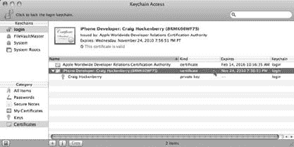

[www.it-ebooks.info](http://www.it-ebooks.info/)

**正式生效**

**4\. 在页面右下角，点击`Submit`。**

您应该会看到一条消息，提示“证书请求已提交以等待批准”。证书的状态也将显示为“待批准”。

**5\. 您需要自行批准自己的请求，因此请点击`操作`列中的`Approve`按钮。**

状态列现在显示为“待颁发”。

***注意：*** 如果您使用的是公司账户，则需要管理员来批准您的证书请求。管理员用户还可以向团队添加新成员。

**6\. 证书颁发通常需要不到一分钟的时间，所以稍等片刻后刷新页面，您应该会看到状态显示为“已颁发”。点击`操作`列中的`Download`按钮。**

您的新证书将被下载。在您的下载文件夹中，您应该会看到一个`developer_identity.cer`文件。

**7\. 双击此文件，系统会提示您确认添加这个新证书。确保`钥匙串`弹出菜单设置为“登录”项，然后点击`Add`。**

至此，您的钥匙串已正确设置。您应该在“钥匙串访问”中看到它，如图 5-7 所示。

***图 5-7：*** *完成钥匙串设置后，您将看到类似此处显示的内容。在“iPhone Developer”后面以及作为私钥，您将看到自己的名字，而不是“Craig Hockenberry”。*

您名字前面的钥匙图标尤为重要：如果它丢失了，您将无法对代码进行签名。如果您没有看到该图标，则需要重新开始并提交一个新的证书请求。

第 5 章：认真对待开发

**141**

[www.it-ebooks.info](http://www.it-ebooks.info/)

**正式生效**

确保证书已加载到默认钥匙串中（以粗体显示）也很重要。在图中，它是“登录”项并被选中以供查看。如果证书不在正确的位置，请尝试重新加载证书。

*配置文件*

恭喜，您距离能够在 iPhone 上运行自己的应用程序只差一半的路程了！在您的钥匙串工作正常后，剩下的就是创建一个描述文件，指定哪些设备可以运行您的代码。

**身份危机。** 如果您现在尝试构建项目，您会看到一个类似于“代码签名错误：找不到与应用程序标识符`'com.iconfactory.SafetyLight'`匹配的有效描述文件”的错误。

正如您在第 137 页所学到的，描述文件是一个关联代码签名证书、应用程序标识符和设备的文件。当这三部分信息一致时，您就可以构建并运行应用程序。

因此，您当前的任务是开始使用 Xcode 收集这些信息，并将它们提交到“配置门户”。

**新的闪亮设备。** 首要任务是确定哪些设备将用于您的开发。这些设备可以是任何 iPhone 或 iPod touch 型号。

***提示：*** *您会发现，为了进行自己的测试，您希望拥有多个设备。第一代 iPod touch 的性能特性与当前一代的设备大不相同。同样，较旧的设备也不具备较新设备的功能：例如，第一代 iPhone 没有包含 GPS，而指南针仅适用于 iPhone 3GS。您需要测试您的应用程序在这些功能缺失时能否正常工作。*

使用标准开发者账户，您有 100 个设备可用于测试。此限额包括您用于内部测试的设备以及您的测试版测试人员将使用的硬件。

需要注意的是，这是一个累积数字：您不能移除一个设备并用另一个替换。一旦您在配置门户中输入了唯一标识符，在您为期一年的注册期内，该标识符将一直有效。这一点很重要，因为硬件通常每年会更新几次，当更新发生时，您的许多测试人员会想要配置他们闪亮的新设备。

如果您所有的设备都被分配给了 iPhone 3G，那么当 3GS 型号发布时，您将无法对其进行开发和测试。

**142**

iPhone App Development: The Missing Manual

[www.it-ebooks.info](http://www.it-ebooks.info/)

**正式生效**

***提示：*** *iPhone 通常在夏季苹果公司一年一度的全球开发者大会（WWDC）前后进行更新。新的 iPod（包括 touch 型号）通常在初秋，也就是假日购物季之前推出。*

您还会发现许多测试人员需要在一年内更改其设备标识符。当测试人员的手机丢失、被盗或损坏时，您希望能够将其替换设备添加到描述文件中。归根结底，您需要对设备精打细算。永远不要分配所有设备，并始终为自己留出一些余量，以备用于新硬件和替换硬件。

**查找设备标识符。** 添加新设备的第一步是确定唯一设备标识符（UDID）。每部 iPhone 和 iPod touch 都有一个 40 字符的十六进制字符串，是独一无二的。

***注意：*** *许多应用程序会出于自身目的使用此 UDID。例如，如果您需要唯一标识对网络服务的请求，您可以调用`UIDevice`类中的`–uniqueIdentifier`方法，并将结果传递给网络。*

从 Xcode 中获取 UDID 最简单的方法是插入设备并打开“管理器”（`Window`➝`Organizer`）。当系统询问您是否要将此设备用于开发时，请回答“是”。

***提示：*** *您会经常使用“管理器”窗口，所以请记住快捷键`Control-⌘-O`。*

打开窗口后，在源列表中选择设备，“摘要”选项卡就会出现。如果您看到一条消息说“设备不支持开发”，请拔下手机，重新启动，然后重试。您可以复制摘要中的“标识符”文本到剪贴板，如图 5-8 所示。

您的测试人员无法从 Xcode 获取其 UDID，但他们可以学习一个小技巧，通过 iTunes 完成同样的操作。选择设备后，您可以点击摘要中的“序列号”，它会变为标识符。按下`⌘-C`（在 Mac 上）或`Ctrl-C`（在 Windows 上）即可将显示的值复制到剪贴板。

***提示：*** *另一个收集设备标识符的好方法是使用 Erica Sadun 的免费应用`AdHocHelper`。您的测试人员可以从 App Store 安装这个简单的应用程序并运行它，以自动通过电子邮件发送 UDID。*

第 5 章：认真对待开发

**143**

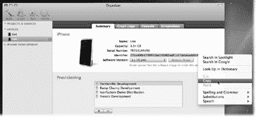

[www.it-ebooks.info](http://www.it-ebooks.info/)

**正式生效**

***图 5-8：*** *在 Xcode 管理器的源列表中，您可以从“设备”部分收集测试设备的信息。这里正在复制唯一设备标识符。*

**添加设备。** 下一步是添加您收集到的设备标识符：

**1\. 在“配置门户”网页上，点击左侧栏中的`Devices`。**

“设备”屏幕会显示您当前剩余可注册的设备数量。

**2\. 点击`Add Devices`以添加您的新设备。**

下一个屏幕有两个输入字段，一个用于设备名称，另一个用于其 ID。

**3\. 选择任意您喜欢的名称，并输入您想要与之关联的 UDID。**

***提示：*** *如果您遵循一些简单的设备 ID 命名约定，尤其是在列表变长时，可以使您的工作更轻松。*


例如，你可以将测试者的姓名与设备型号结合起来。名为“David Bowman 3G”的设备表明 Dave 使用的是 iPhone 3G。当他升级设备后，你可以添加另一台名为“David Bowman 3GS”的设备。

**4. 点击 Submit 后，你会在列表中看到新设备，并且计数器会递减。**

**144**

iPhone 应用开发：缺失的手册

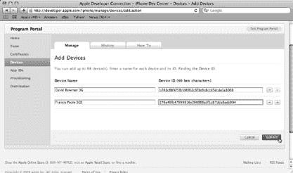

[www.it-ebooks.info](http://www.it-ebooks.info/)

**使之正式化**

***图 5-9：*** *通过配置门户添加新设备。在此命名方案中，设备名称包含测试者的姓名及其正在测试的设备型号。*

应用标识符。配置描述文件所需的下一项信息是应用 ID。这个唯一标识符通过模式匹配来指定哪些应用可以运行。模式匹配可以包含用作通配符的星号。

在查看手电筒应用的 `Info.plist` 时，你会看到它的 Bundle Identifier 被定义为 `com.iconfactory.FlashlightPro`。这个反向域名路径唯一地标识了该手电筒应用来自 Iconfactory。如果你从 iPhone 开发中心下载过示例代码，你会发现许多应用的标识符都以 `com.yourcompany` 开头。

假设你的域名是 `squidger.com`，你的应用名为 Tiddlywinks Pro。

你已在 `Info.plist` 中将 Bundle Identifier 定义为 `com.squidger.TiddlywinksPro`，现在你有几种指定应用 ID 的选择：

- `*` 匹配所有应用。你可以构建并运行设备上的任何应用，包括示例代码和其他第三方应用。但它缺少接下来两个选项所具备的特殊功能。
- `com.squidger.*` 匹配所有以 `com.squidger` 开头的应用，包括 `com.squidger.TiddlywinksPro` 以及你的公司未来开发的任何其他应用。

在对你的应用进行 Beta 测试时使用此模式。一个匹配你域名下所有产品的配置文件，能让测试者轻松试用每个新版本，因为他们上次 Beta 测试时已经安装了该文件。

第 5 章：认真对待开发

**145**

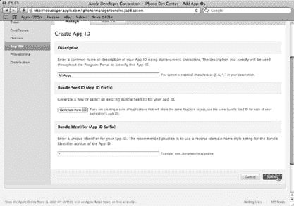

[www.it-ebooks.info](http://www.it-ebooks.info/)

**使之正式化**

- `com.squidger.TiddlywinksPro` 是完全限定模式，精确匹配你的应用。如果你希望从应用中使用推送通知或应用内购买，则必须使用此类 ID。

现在，采用最简单的方式，将你的应用 ID 指定为 `*`。打开配置门户并按以下步骤操作：

**1. 在配置门户网页中，点击左侧列的 App IDs。**

应用 ID 屏幕会显示已定义的应用 ID。随着时间的推移，列表会不断增长，当你需要配置推送通知或应用内购买时，就会用到它。

**2. 现在，只需点击 New App ID 来添加第一个应用 ID。**

首先，在 Description 下的文本框中填写内容，以提醒你这个模式是用于什么的。

**3. 由于你可以使用这一个应用 ID 来构建和运行所有应用，因此输入 All Apps。**

将 Bundle Seed ID (App ID Prefix) 下的弹出菜单保持选择 Generate New（图 5-10）。接下来，在 Bundle Identifier (App ID Suffix) 下输入用于匹配应用的模式。

***图 5-10：*** *以下是你的第一个应用 ID 的设置。正在创建一个新的应用 ID，使用匹配所有应用的模式 `*`。*

**146**

iPhone 应用开发：缺失的手册

[www.it-ebooks.info](http://www.it-ebooks.info/)

**使之正式化**

**4. 输入 `*` 并点击 Submit。**

返回主应用 ID 页面后，你会在描述列中看到 All Apps。

***注意：*** 该模式会带有一个随机生成的 Bundle Seed ID 前缀。这个前缀用于确保每个开发者的标识符唯一。同一开发者也可以用它来在多个应用之间共享安全信息，但大多数情况下你可以忽略这个前缀。


# 通过配置文件整合所有内容

好消息！你已经创建了配置描述文件所需的所有部分——现在是时候将它们组装起来了。到现在为止，你听到要在“配置门户”中完成这项操作时，应该不会感到惊讶了：

1. 在“配置门户”网页上，点击左侧栏中的**“配置”**。

此屏幕包含多个标签页。目前你只需关注**“开发”**标签页。

2. 点击**“新建配置文件”**开始操作。

首先要做的是为新配置描述文件命名。

3. 由于此配置文件将用于常规的 iPhone 开发，请将其命名为**`iPhoneDevelopment`**。开启所有显示的证书。

如果你是个人开发者，则只会有一个证书。如果你与其他开发者组队合作，你可以为他们添加证书，这些证书也会列在这里。

4. 对于 App ID，选择**“所有 App”**。开启你打算用于内部开发的每一台设备（图 5-11）。

**“全选”**链接是选择所有设备的便捷方式。

5. 点击**“提交”**。

你会回到配置描述文件的列表。你会注意到新配置文件的状态为**“处理中”**。Apple 的服务器生成文件需要一些时间。

6. 刷新屏幕。状态会变为**“有效”**，并且**“操作”**列中会出现一个**“下载”**按钮。点击**“下载”**。

完成后，你的“下载”文件夹中会有一个新的 `iPhone_Development.mobileprovision` 文件。

至此，你暂时完成了配置门户的操作。是时候切换到 Xcode 并添加新文件到你的构建过程了。

**147**

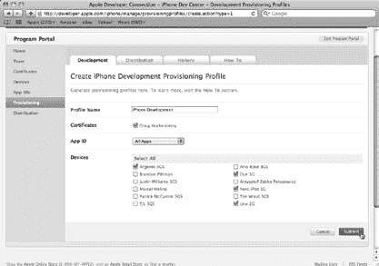

[www.it-ebooks.info](http://www.it-ebooks.info/)

**正式生效**

**图 5-11：** 创建你的第一个配置描述文件，名为**iPhone Development**。此配置文件整合了 Craig Hockenberry 的证书，可用于构建和运行所有 App，并且可以安装在所选设备上。

## Xcode 设置

你在配置门户中执行了许多步骤来创建配置描述文件。幸运的是，安装它非常简单。只需将 `iPhone_Development.mobileprovision` 文件拖放到 Xcode 的图标上即可完成！

要验证它是否已正确安装，请打开 Xcode 中的管理器（选择 窗口 → 管理器）。在管理器窗口中，打开源列表中的**“iPhone Development”**组，找到名为**“配置描述文件”**的项目。点击它，你会看到 Xcode 可以使用的所有配置文件。你应该会看到**“iPhone Development”**及其过期日期。如果点击配置文件，你会看到一些关于它的附加信息，如图 5-12 所示。

## 清理、构建与运行

现在你已经准备好构建并安装应用至你的 iPhone 了。确保你在配置中指定的其中一台设备已插入并准备就绪。当设备成功连接到 Xcode 后，你会在管理器中设备旁边看到一个绿点。

**提示：** 如果设备没有显示绿点，请在管理器中选中它，然后在**“摘要”**标签页中查看状态消息。如果你看到“无法支持开发”的消息，意味着 Xcode 无法附加到设备上的进程。重启该进程的唯一方法是重启设备。

**148**

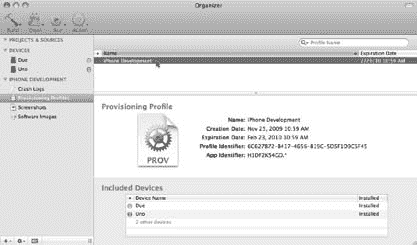

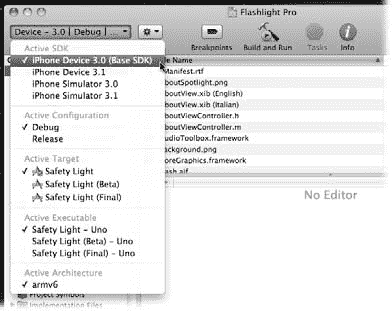

[www.it-ebooks.info](http://www.it-ebooks.info/)

**正式生效**

**图 5-12：** Xcode 的管理器可以显示当前已安装的配置描述文件。**iPhone Development** 配置文件刚刚通过配置门户创建完成。请注意，此配置文件的过期日期大约为其创建之日起的 3 个月。

在主项目窗口中，更改窗口左上角的**“概览”**菜单。到目前为止，你一直在使用**“iPhone 模拟器”**作为**“活动 SDK”**设置。现在你已拥有已配置并连接的设备，你可以选择**“iPhone 设备（基础 SDK）”**（图 5-13）。

**图 5-13：** 一旦你的 iPhone 已配置并连接到 Mac，你可以从**“活动 SDK”**菜单中选择**“iPhone 设备”**。名称后的数字表示你正针对哪个版本的 iPhone SDK 进行构建。

**149**

[www.it-ebooks.info](http://www.it-ebooks.info/)

**正式生效**

**注意：** 为设备设置**“活动 SDK”**会导致 Xcode 为 iPhone 的 ARM 处理器生成代码，而不是为 Mac 中的 i386 处理器生成。你可以通过在**“概览”**菜单底部的**“活动架构”**来验证这一点。

选择**“活动 SDK”**后，清理项目（构建 → 清理）。此步骤确保你从一个干净的状态开始。它会移除所有因代码签名错误而生成的代码。在出现的对话框中，确保两个复选框都已勾选，然后点击**“清理”**。

现在是每位 iPhone 开发者都记忆犹新的时刻：在你的 iPhone 上安装第一个应用。选择 构建 → 构建并运行（或按 ⌘-Return）来启动操作！

**注意：** 如果你看到无法启动可执行文件的错误，这意味着你的 iPhone 未连接或需要重启。另外，请检查你的手机是否已解锁，以便显示主屏幕。

你可以在左下角观察状态行，随着头文件被预编译和源代码被编译。在构建过程接近尾声时，会进行代码签名过程。此时，你会看到一个消息框，询问是否允许“codesign”访问你的钥匙串。点击**“允许”**。

每次从 Xcode 运行应用程序时，它都会检查设备以确保已安装有效的配置描述文件。当你将配置文件拖放到 Xcode 图标上时，你只是将其安装在了开发环境中。配置描述文件的最终目的地是设备本身，在它就位之前，你的应用程序将无法运行。幸运的是，Xcode 会帮助你：它会提示你无法在设备上运行应用程序。当你点击**“安装并运行”**时，配置文件将被安装。

你可以通过手机上的**“设置”**应用来验证配置描述文件是否已安装。轻按 设置 → 通用 → 描述文件，你会看到已安装的配置文件列表。你会看到你的**“iPhone Development”**配置文件及其过期日期。当配置文件即将过期时，iPhone OS 会发出警告。你也可以使用此界面删除配置文件。

Xcode 的下一步是将你的应用程序复制到设备上。你会在左下角看到一条状态消息：“正在将 Safety Light.app 安装到 Kryten 上……”，随后是“GDB：正在运行……”。现在看看你的设备。恭喜你，你现在是一名 iPhone 开发者了！

**提示：** 你可以将多个 iPhone 和 iPod 连接到你的 Mac 作为测试辅助工具。这很简单——只需将每台设备连接到 USB 端口，Xcode 就可以同时使用它们。要控制应用安装和调试的位置，请在**“概览”**菜单中选择适当的设备名称作为**“活动可执行文件”**。

**150**

[www.it-ebooks.info](http://www.it-ebooks.info/)

**正式生效**

## 当操作失败时

经验丰富的 iPhone 开发者会告诉你，他们在配置门户上花费的时间比他们希望的多得多。可悲的事实是，整个代码签名过程的设计初衷就是随着时间的推移而失效。

正如你一路注意到的，证书会过期，它们所关联的配置描述文件也会过期。甚至连设备也会因为升级或意外而失效（如果你从未发现过手机在洗衣机里，那你真算幸运了！）。


# Apple 开发配置与签名问题指南

Apple 设计的这一流程使其能够保留对您应用程序分发的控制权。结果就是：您所处理的配置绝对*不是*“一劳永逸”。更糟的是，几个月后您会忘记当初是如何设置的。以下章节将帮助您在出现问题后恢复正常工作状态。

## 代码签名

没有人喜欢构建失败。如果在签名代码时遇到错误，您的构建肯定出了问题。此时需要检查您的证书和构建设置！

### 证书

首先要验证的是证书是否已过期。最快的方法是打开 `Applications➝Utilities` 文件夹中的`钥匙串访问`，并搜索`iPhone.*`。如果看到任何证书上有红色 `X`，则需要重新生成它们。如果您保存了之前的证书签名请求副本，例如`iPhone.certSigningRequest`（第 140 页），只需将其重新提交到门户。否则，您需要使用`钥匙串访问`生成新的请求。

通过门户更新证书后，您会发现配置文件出现问题。它们已被作废，因为其中包含对不再存在的证书的引用。修复并不难：点击“无效”状态指示旁边的“续订”按钮。

一旦配置文件重新生成，您需要下载并将其安装到`Xcode`中。如果团队中的其他开发者使用相同的配置文件，他们也需要更新其开发环境。任何使用该配置文件进行 Beta 测试的外部测试人员也需要在其设备上加载新的配置文件。

现在您可以看到，像过期证书这样简单的事情会如何级联成许多人繁重的工作。还好您在编码时可以偷懒，因为您需要额外的时间来管理配置文件！

### 代码签名标识

在 iPhone 开发过程中，您可能会看到类似这样的错误消息：“代码签名错误：标识‘iPhone Developer: Baba O’Riley’与默认钥匙串中的任何有效证书/私钥对都不匹配”。

此消息表明您的项目设置包含对默认钥匙串中不存在的证书的引用。请检查`钥匙串访问`，确保看到类似图 5-4 的内容。

当您与另一位开发者（无论是开源项目还是团队中的其他人）协作开发项目时，通常会出现此问题。如果该人员将代码签名设置更改为“iPhone Developer: Happy Jack”，您的证书将不匹配，从而看到该错误。

修复方法很简单：确保在构建设置中定义了“自动配置文件选择器”。在`Xcode`中打开目标构建设置（`Project➝Edit Active Target`），向下滚动到“代码签名”部分。`代码签名标识`应设置为`Any iPhone OS Device`，其值为`iPhone Developer`。此时会显示钥匙串中的当前匹配项。

***提示：*** 请记住检查目标中的设置：目标可以覆盖项目中的任何配置。不要因为查看了错误的位置而误导自己！

### 配置文件匹配

如果您使用类似`com.*mydomain.*`的包标识符定义了一个配置文件，并尝试构建一个在`Info.plist`中包含`com.theirdomain.TheirProduct`的项目，您将看到错误：“代码签名错误：标识‘iPhone Developer’与任何配置文件中的任何标识都不匹配”。

这就是在配置文件中为您的 App ID 使用通配符`*`的原因之一——它更有可能匹配您钥匙串中的某个证书。当然，在需要对应用程序标识符更加具体的情况下，您需要更改`Info.plist`中的值，或者生成一个与新标识符匹配的新配置文件。

## 设备配置

您可能在构建应用时没有遇到任何问题，但当它无法在设备上运行时，那才是真正的问题！以下是需要注意的一些事项：

### 启动中止

当您点击应用程序图标时，它开始启动，您会看到`Default.png`中的图像一闪而过。然后您就回到了主屏幕。真糟糕。您刚刚见证了过期的配置文件。iPhone OS 启动该应用，确定设备上没有有效的配置文件，然后应用退出。

前往“设置”应用，深入导航至`General➝Profiles`。如果看到带有红色文本的配置文件，指示该配置文件已过期，请将其删除。它不再有用。

然后前往“配置门户”刷新配置文件，以便重新安装。

***提示：*** 删除过期的配置文件可以帮助您避免配置文件之间的冲突。如果您有一个匹配所有应用的过期配置文件，操作系统可能会先找到该配置文件，而忽略该应用的其他有效配置文件。*请尽快从设备上删除任何过期的配置文件*。

也可能是配置文件一开始就没有正确安装。如果“设置”应用没有列出您一直用于开发的名称，请使用`Xcode`的“管理器”再次安装该配置文件。

***注意：*** 当您向测试人员发送新的 Beta 版本时，可能会听到其中一些人说“应用已安装，但无法完成启动”。他们正遇到上述问题。

### 门户混淆

当您在配置门户中添加和删除设备时，请记住刷新“配置”部分的配置文件。这不会自动发生。

许多开发者在更新设备配置后，立即下载了一个不包含新信息的配置文件。很容易忘记添加设备并不会神奇地使其出现在您的配置文件中。您需要点击`Edit➝Modify`链接，并在配置文件列表中选择每个新设备。

类似地，如果您从门户中删除设备，任何使用该设备的配置文件都会立即失效。请访问“配置”部分并重新创建受影响的配置文件。

## 其他问题

如果您遇到代码签名或配置问题，不要害怕重启`Xcode`。大多数情况下，开发环境能够完美地处理证书和配置文件的管理。然而，各个组件之间的关系很复杂，有时`Xcode`需要一点推动。

另一个即使是顶尖开发者也会被迷惑的问题，并非与代码签名或配置有关。它可能更简单——您的应用是为错误版本的 iPhone OS 编译的。

如果您使用 3.1 SDK 构建应用，测试人员可以将其安装到装有 iPhone OS 3.0 的设备上。当您的应用无法在设备上启动时，不要假定是配置问题。养成在开始排查配置之前，先询问测试人员他们运行的是哪个操作系统版本的习惯。

***提示：*** 通过 App Store 安装的应用不会遇到此问题，因为安装程序在将应用放到设备上时会检查版本。其他安装机制不会执行此检查。

## 您现在已移动

一旦您将工作成果放入口袋随身携带，您就会开始以不同的眼光看待它。您的应用已从桌面开发环境中解放出来，您对其设计的前提假设也是如此。

将您的创作带入现实世界极为重要，因为您的客户在从 App Store 下载完成后也会立即这样做。

以下是您会立即注意到的一些事情：


• **一切感觉都变慢了。** CPU 和网络不再那么快，这会影响整个用户体验。
• **控件看起来更小了。** 那些在 Mac 屏幕上显得很大的按钮，现在不再那么大了。
• **环境条件发生变化。** 在办公室受控光线条件下看起来不错的界面，在直射阳光或刺眼的荧光灯下可能就不那么好看了。
• **干扰增多。** 你会在与其他人互动以及各种环境条件下使用应用程序：复杂情况更难处理。

随着时间的推移，你会发现应用程序中有些功能在真实世界中会失效。有时是代码问题，比如应用程序如何处理断开的网络连接。有时则是设计问题：你需要调整控件的对比度和位置。无论哪种情况，你只有离开舒适的工作环境才能发现这些问题。

## 准备就绪

现在你已经熟悉了开发环境。一切都按你的需求设置好了，可以轻松地构建和测试代码。是时候考虑编写应用程序的最佳方式了。你可能用过其他开发环境，所以你知道掌握设计模式和最佳实践有多么重要，这能让你成为一名高效的程序员。这意味着是时候深入探究 Flashlight Pro 项目了！

**154**
《iPhone 应用程序开发：缺失手册》
[www.it-ebooks.info](http://www.it-ebooks.info/)

# 专业人士的手电筒

现在你的开发环境已经运行起来，是时候开始编写代码了。当你面对一门新语言、新框架和新平台时，这是一项艰巨的任务。当有那么多东西都截然不同时，第一行代码很难写出来。与其翻阅成堆的文档和示例代码，不如现在做些不同的事情。你将研究一款由经验丰富的 iPhone 开发者创建的完整产品。本章的重点*不是*全面介绍所有可用的编程 API。相反，你将获得一次充满技巧和诀窍的导览。实质上，你将坐下来观看专业人士构建一款 iPhone 应用程序。目标是传授你可以在自己的应用程序中使用的常见模式和最佳实践。

### 导览

幸运的是，本章要构建的产品你已经很熟悉了：一款手电筒应用！你在第 4 章中为之纠结的设计将在你眼前变成现实。如果你还没有下载，请从缺失 CD 页面（*www.missingmanuals.com/cds*）下载 Flashlight Pro 项目。本导览中的所有内容都引用该项目中的代码。

***提示：*** 不要害怕尝试修改这些代码。事实上，在某些方面，通过调整可以学到很多东西。正如每一位优秀的程序员所知，这项技能是通过多年的反复试错磨练出来的！如果你不小心把代码改坏了，只需从缺失 CD 再次下载项目即可。

**155**
[www.it-ebooks.info](http://www.it-ebooks.info/)

## 打开指南手册

### 从哪里开始？

当你的项目文件正确设置好后，你会遇到每个开发者都会面临的问题：空白画布综合症。这个庞大的项目该从哪里入手？以下是一些简单的步骤，可以帮助你尽快开始：

1. **熟悉模板创建的 NIB 文件和源代码。** 其中一些你可能想保留；另一些则需要重命名或删除。
2. **应用程序委托（参见下一节）是应用程序中首先执行的部分。** 它是开始核心开发的天然起点。
3. **Interface Builder（第 86 页）是你的好朋友，因为它能让你几乎立即看到设计效果。** 应用程序可能还做不了太多事情，因为 NIB 文件（第 152 页）中创建的视图无法向控制器发送动作，但这能激励你继续前进。
4. **使用 Interface Builder 还能帮助你识别哪些视图需要自定义。** 如果你无法在图形编辑器中让它们看起来正确，就需要编写一些代码，要么通过子类化标准视图（第 67 页），要么从头开始编写自己的视图。
5. **当你开始编写视图代码时，通常会遇到第一批需要用类别或子类扩展的标准类。**
6. **一旦视图就位，就可以开始向它们提供数据了。** 这是开始实现模型的好机会。
7. **在上述所有步骤中，你一直在向控制器对象添加实例变量。** 但此时，你可以真正开始通过模型和视图之间的动作、更新和通知将所有内容整合在一起。
8. **当项目接近尾声时，开始考虑产品本地化。** 同时，在设计师的帮助下清理用户界面。

现在你已经准备好开始浏览最终的 Flashlight Pro 应用程序了。你将按照大致创建的顺序查看源代码文件。在浏览过程中，本章还会重点介绍并讨论重要部分。那么，请坐下来，熟悉你的项目副本，准备开始一次穿越 Xcode 的“组与文件”列表的旅程！

### 打开指南手册

通过打开指南手册开始你的导览：找到从缺失 CD 页面下载的 `Flashlight_Pro.xcodeproj` 项目文件，双击其图标以在 Xcode 中打开它。确保主 Flashlight Pro 组和应用程序委托子组都已展开，如图 6-1 所示。

**156**
《iPhone 应用程序开发：缺失手册》
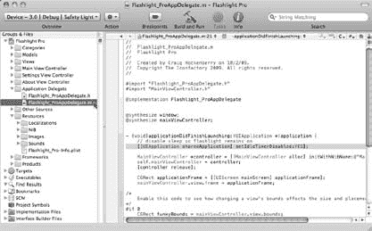
[www.it-ebooks.info](http://www.it-ebooks.info/)

***图 6-1：*** *在本章中，你将使用 Xcode 中的“组与文件”列表来查找这些页面中讨论的代码。此图显示了在列表中选择并在编辑器中查看的 `Flashlight_ProAppDelegate.m`。要使编辑器填满窗口的右侧，请使用“视图”➝“放大编辑器”（⌘-Shift-E）。你将在下方了解更多关于第一行（选中的）代码。*

正如上一页列表中所指出的，应用程序委托是你的代码首先执行的地方，因此导览从这里开始。

### `Flashlight_ProAppDelegate`

在这个类的实现中，真正重要的方法只有一个：`–applicationDidFinishLaunching:`。尽管它只有几行代码，但其中蕴含了很多内容。

#### `UIApplication`

在 `Flashlight_ProAppDelegate.m` 中，你第一次看到了 `UIApplication` 类。这个对象的一个实例始终可用，它允许你查询和配置应用程序在 iPhone OS 中的状态。在这个例子中，禁用了允许屏幕变暗和关闭的属性：

```
[[UIApplication sharedApplication] setIdleTimerDisabled:YES];
```

当你使用手电筒时，你希望它一直亮着，直到用户想关闭它。`UIApplication` 类还允许你做一些有趣的事情，比如在主屏幕的图标上添加徽章、更改状态栏外观、显示网络活动指示器等。

第 6 章：专业人士的手电筒
**157**
[www.it-ebooks.info](http://www.it-ebooks.info/)

#### `UIScreen`

另一个重要的共享类是 `UIScreen`：它包含显示区域大小的信息。要确定视图的大小，请使用：


`CGRect applicationFrame = [[UIScreen mainScreen] applicationFrame];`  
编写这段代码的原因在于，即使你已知 iPhone 屏幕的确切尺寸（320 × 480，或显示状态栏时的 320 × 460），屏幕的实际大小也可能与预期不符。例如，在通话中或使用网络共享时，状态栏高度为 40 像素而非 20 像素。而在横屏模式下，这些数值是从屏幕宽度而非高度中减去的。因此，最好让 Cocoa Touch 为你计算当前屏幕尺寸。

**提示：** 让系统计算屏幕尺寸的另一个原因是：未来你的应用可能会在更大屏幕的设备上运行，例如 iPad 的 1024 × 768 像素显示屏。这样写能提前适应未来的变化！

---

### Windows 与视图

继续查看`Flashlight_ProAppDelegate.m`，你会看到屏幕是如何被激活的。这一切始于以下代码：

`mainViewController.view.frame = applicationFrame;`

很明显，视图的尺寸和位置（`frame`）被设置为整个屏幕。不太明显的是，视图对象此时也正在被**实例化**。

也就是说，由于控制器的视图是惰性加载的，首次访问`MainViewController`的`view`属性会导致该对象从 NIB 文件加载到内存中。因此，执行这行代码会触发`MainViewController`中的`–viewDidLoad`方法被调用。

让视图显示在屏幕上需要两步：首先，将其添加为窗口的子视图；然后，使窗口可见。如下所示：

```
[window addSubview:mainViewController.view];
[window makeKeyAndVisible];
```

这将导致`MainViewController`中的另一个方法被调用：`–viewDidAppear`中的代码会执行。请注意，这并不是该消息被发送的唯一时机；只要视图出现在屏幕上（例如，在查看设置视图后翻转回主视图时），都会触发此消息。

---

## NIB 文件：值得一看

如你在第 86 页的步骤中所见，使用 Interface Builder 创建基本界面非常简单。尽管 UI 还无法实现任何实用功能，但你可以看到控件和其他视图。这也会开启一个自然循环：添加视图、在控制器中创建 outlet、添加 action，并将 action 连接到视图。

---

**图 6-2：** 你检查的第一个 NIB 文件包含对`UIApplication`对象的引用以及`Flashlight_ProAppDelegate`类的一个实例。此外，应用窗口在此定义并在启动时加载。

首先你会注意到，File’s Owner 被设置为`UIApplication`。正如你在第 89 页所见，该对象知晓你的应用的一切信息。当用户启动应用时，它会自动创建。

`UIApplication`可以有一个委托，该委托会在应用状态发生变化时接收消息。在这个 NIB 中，委托的实例以`Flashlight_ProAppDelegate`类型被归档。当该文件被加载时，你会自动获得该对象的一个实例。

注意，File’s Owner 中的`UIApplication`对象有一个连接到`Flashlight_ProAppDelegate`实例的委托。这确保了你的委托能够知道应用状态何时发生变化。如果没有这个重要的连接，`–applicationDidFinishLaunching:`消息将永远不会被发送，最终你将得到一个没有视图的窗口。当你将目标设置中的主 NIB 文件配置为`MainWindow`时，你就告诉 Cocoa Touch 在启动时自动加载该文件。这个设置是应用引导过程的关键部分！

**提示：** 如果第一个 NIB 文件无法显示，请确保`Info.plist`中的`NSMainNibFile`键具有正确的值。

当你展开`Window`实例旁的三角符号时，会看到它有一个`UIImageView`子视图。这就是为什么当你双击 Window 在 Interface Builder 中查看时，能看到电池图片。

子视图会彼此堆叠。这个带有电池的图片视图位于堆叠的底部。你可能好奇为什么启动应用时看不到这些电池——因为在`–applicationDidFinishLaunching:`的实现中，你在它上面堆叠了其他内容：

`[window addSubview:mainViewController.view]`

然而，堆叠底部的视图仍然存在。这就是为什么每次在主视图和设置视图之间切换时，你都能看到它。

**注意：** 这种视图堆叠被称为**视图层级**。你并不局限于只有一个堆叠。每个视图都可以有自己的视图堆叠，从而允许构建任意深度和宽度的用户界面元素集合。

这个 NIB 文件中最后一个值得关注的连接是：`Flashlight_ProAppDelegate`为窗口设置了一个 outlet。当该对象从文件加载时，实例变量会自动连接，因此任何发送给`window`的消息都会传递到`UIWindow`。

如果这个连接中断，`window`实例变量将为`nil`，那么发送给`–addSubview:`和`makeKeyAndVisible`的消息将被丢弃。最终你只会看到一张电池图片，其他什么也没有——电源故障！

---

### MainView.xib

当你打开这个 NIB 文件并双击 Light View 时，所看到的内容与你运行应用时看到的类似（图 6-3）。这很好，因为这就是主控制器视图。

**图 6-3：** 这是应用主视图的 NIB 文件内容。显示光照的视图名为 Light View，它包含工具栏和状态信息等子视图。你还可以看到`MainViewController`负责管理 Light View 的内容。

#### File’s Owner

注意，File’s Owner 被设置为`MainViewController`。通常，NIB 文件的 owner 是导致它被加载的对象。正如你在第 157 页所见，`UIApplication`是 File’s Owner，因为它负责自动加载`MainWindow.xib`。

当你在`–applicationDidFinishLaunching:`中执行以下代码时，`MainViewController`会加载`MainView.xib`：

`MainViewController *controller = [[MainViewController alloc] initWithNibName:@"MainView" bundle:nil];`

这使得`MainViewController`成为`MainView.xib`的 File’s Owner。

**注意：** 当你通过 New File 模板创建新的`UIViewController`子类时，可以选择“With XIB for user interface”。启用该选项后，File’s Owner 会自动配置完成。

如果出于某种原因需要更改类，你可以在 Interface Builder 中使用 Identity Inspector。只需在对象列表中选择 File’s Owner，按 ⌘-4，然后从下拉菜单中选择一个新类即可。


# 第 6 章：专业人士的手电筒

## NIB 文件：值得一看的内容

当 File's Owner 使用的类与代码中使用的类不匹配时，在 `–_loadViewFromNibNamed:bundle:` 中可能会发生 `***NSInternalInconsistencyException***` 崩溃。如果在 NIB 文件中类设置看起来正确，也请检查视图的 outlet 是否正确设置。

将控制器作为 NIB 文件中的主要对象，也能让你访问在类的头文件中定义的 outlet 和 action。要查看这些连接，请在对象列表中选择 `MainViewController`。然后按下 `⌘-2` 调出连接检查器，并将鼠标悬停在每个 outlet 和 action 上。连接的视图会在 Light View 窗口中高亮显示。

### 层层嵌套的视图

当你打开 Light View 左侧的展开三角形时，会看到一个信息视图和一个工具栏。如果展开工具栏，你会看到“Flasher”、“Disco”、“SOS”、“Settings”，它们之间由“(Flexible Space)”分隔。

灯光视图有两个子视图：一个用于信息，另一个用于工具栏。而工具栏又有七个子视图，包括四个按钮和三个分隔符（均来自 `UIBarButtonItem` 类）。

有时，通过这个列表导航比在 Light View 窗口中选择项目更容易。例如，如果你单击 Disco，可以按下 `⌘-1` 快速查看按钮的图片是 `ToolbarDiscoStart.png`，或者按下 `⌘-2` 查看它发送的是 `toggleDisco` 动作。你也可以使用方向键在对象列表中移动，以便在当前检查器中快速检查所有对象的属性。

### 自定义视图

这个 NIB 文件包含两个自定义视图：`LightView` 和 `IFInfoView`。在创建自定义视图时，你经常会面临一个“先有鸡还是先有蛋”的问题：你希望在类的实现完成*之前*，就在 NIB 文件中放置一个此视图的实例。

为了解决这个问题，你可以在视图层次结构中创建一个 `UIView` 的实例。然后，你可以使用这个通用视图进行布局和其他基本配置。之后，在实现了类之后，你可以使用标识检查器（`⌘-4`）将类的标识从 `UIView` 更改为你的新视图的名称。

你将在本节稍后部分（第 169 页）看到 `LightView` 和 `IFInfoView` 类的实现。

## 视图尺寸设置

到目前为止，Interface Builder 中有一个检查器明显未被提及：那就是用于设置视图尺寸的检查器（图 6-4）。你可以通过选择“工具”➝“尺寸检查器”或按下 `⌘-3` 来访问此面板。

**图 6-4：** 你可以在“尺寸检查器”面板中看到信息视图及其设置。“尺寸与位置”值定义了视图的原点以及其宽度和高度。“自动调整大小”控件显示了四个锚点和两个拉伸箭头。信息视图锚定在左、上、右边缘，并且当父视图的尺寸改变时会水平拉伸。工具栏具有类似的设置，只是它锚定在视图的底部而不是顶部。

有时，你希望使用参数来指定视图的框架。信息视图就是一个很好的例子：你需要确保它位于父视图的左上角，并且其高度设置为 44 像素（以便与工具栏的高度匹配）。

通过将 X 和 Y 坐标指定为 0,0，你可以确保视图放置在左上角原点。同样，宽度设置为 320、高度设置为 44，则设定了初始宽度和高度。

## 自动调整大小

设置尺寸仅仅是个开始，因为视图的尺寸会随着应用程序的运行而改变。无论是由于状态栏高度加倍，还是由于设备方向的改变，应用程序的屏幕区域都会变化。幸运的是，Cocoa Touch 提供了一种优雅的机制来自动调整视图大小。这种机制称为*自动调整大小*，它对任何视图都可用，并且会通过视图层次结构进行传播。

### 深入探究：调整大小的实验

“自动调整大小”预览会提示你调整尺寸的效果，但检查调整大小配置的更好方法是改变视图的方向。即使你的应用不支持横向模式，单击视图窗口右上角的箭头也会触发自动调整大小的应用。

以下是在 Interface Builder 中执行的一些简单步骤，应该能帮助你理解这个复杂的特性：

1. 在 `MainView.xib` 中打开 Light View。在出现的窗口中，单击右上角的方向更改图标。
2. 视图将侧向旋转，信息视图和工具栏都会正确定位，如图 6-5 所示。这就是自动调整大小在起作用！再次单击方向箭头，视图将恢复到纵向。得益于自动调整大小，视图会回到其原始位置。
3. 现在，打开 Light View 的属性检查器（`⌘-1`）并取消选中“自动调整子视图”。在单击方向控件后，请注意工具栏是如何落到屏幕底部的，因为视图仍然认为灯光视图的高度是 460 像素。同样，信息视图的宽度仍为 320 像素，尽管屏幕现在有 480 像素宽。
4. 由于你不想将这些更改保存到 NIB 文件中，请使用 Interface Builder 的“文件”➝“还原”菜单项。单击“还原”按钮后，文件将重新加载到上次保存的版本。
5. 要了解视图拉伸是如何工作的，请从对象列表中选择 Info View。调出尺寸检查器（`⌘-3`），并单击自动调整大小控件中间的宽度箭头。（黑色框的中间应该没有红色箭头。）
6. 单击方向控件，你会看到信息视图的宽度保持为 320 像素。
7. 将方向保持在横向。现在你将调整工具栏的锚点，因此从对象列表中选择它并打开尺寸检查器。
8. 将视图底部的锚点更改为顶部。单击黑色框底部的红色锚点将其关闭。然后单击黑色框上方的锚点将其打开。
9. 现在，当你将方向改回纵向时，工具栏会移动到窗口的中间。这是因为工具栏保持了其顶部边缘与灯光视图顶部边缘之间的相同距离。

你可以随意操作所有视图的锚点和拉伸控件，以了解它们的工作方式。只需确保不要将更改保存到 `MainView.xib` 文件中，否则当你的手电筒调整大小时，它的行为会变得非常奇怪！

当你选择 Light View 并检查其属性（`⌘-1`）时，你会看到“绘图”部分中的“自动调整子视图”已打开。当此视图的大小因任何原因改变时，信息视图和工具栏都会自动调整大小。

**图 6-5：** 当你单击 Light View 窗口右上角的方向更改图标时，视图会在纵向和横向之间切换。使用此图标可以快速测试视图的自动调整大小行为。在此图中，你将看到信息视图和工具栏都有了新的宽度，但仍锚定在屏幕的相同边缘。


那么，调整子视图的大小意味着什么呢？这个问题问得好，它引出了大小检查器中的另一个控件！从列表中选择`Toolbar`，然后按 ⌘-3 调出检查器。你会在面板中看到一个“自动调整大小”部分。这里的控件告诉系统在调整大小时如何计算新的视图尺寸。外边缘显示了四个锚点。内部正方形则展示了视图将如何在垂直和水平方向上进行拉伸。当视图可以被拉伸时，锚点定义了视图边缘与父视图之间的间隙。如果视图不能被拉伸，那么锚点则定义了一个需要保持的相对位置。这六个控件中的每一个都会影响最终的视图大小；如果将鼠标悬停在控件上，会显示一个预览效果。

工具栏被配置为拉伸其宽度，并且除了顶部之外的所有边都被锚定。由于工具栏边缘与浅色视图之间没有像素间隔，任何自动调整大小都会使控件保持与视图的完整宽度相连。因为工具栏在顶部没有锚定，如果屏幕尺寸发生变化，视图的位置就会向上移动。

`SettingsView.xib`

当你打开 `SettingsView.xib` 并在对象列表中双击 `Settings View` 时，你会看到与应用程序中显示的内容非常相似（图 6-6）。

除了滑块控件中的自定义图形和选择器视图中的项目外，你会看到相同的视图。

# 第 6 章：专业手电筒

**165**

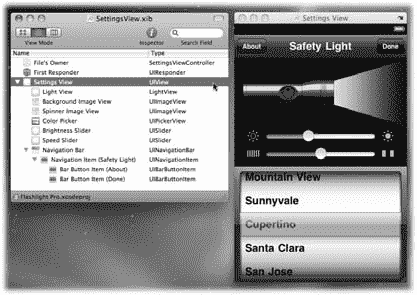

[www.it-ebooks.info](http://www.it-ebooks.info/)

## NIB 文件：值得一看

### 模拟仿真

#### 尝试调整大小

构建应用程序后，你应该始终在模拟器中测试其大小调整功能。你可以使用`硬件`➝`向左旋转`和`向右旋转`菜单来更改方向。要获得双倍高度的工具栏，请使用`硬件`➝`切换通话中状态栏`。

一个常见的问题是看到工具栏在屏幕上被向下推。发生这种情况时，请检查主视图的自动调整大小是否已开启，并且工具栏底部的锚点是否已设置。

当你将一个新的 `UIView` 作为子视图添加到主视图时，它会在所有四条边上被锚定，并在宽度和高度上同时拉伸。这保持了在父视图中的相对位置：如果你有一个需要紧贴屏幕边缘放置的视图，则需要更新这些默认设置。

**图 6-6：** 除了滑块控件的自定义图形和颜色选择器的内容外，`SettingsView.xib` 文档看起来与你在应用程序中看到的非常相似。设置视图由许多子视图组成。

点击对象列表中 `Settings View` 左侧的展开三角形，你会看到这个视图由许多子视图组成。

### 不透明度

这些视图的顺序很重要。列表中第一个列出的子视图 `Light View` 绘制在堆栈的底部。然后，两个图像视图、选择器视图和其他视图按照顺序依次绘制在彼此之上。

**166**

iPhone 应用程序开发：缺失的手册

[www.it-ebooks.info](http://www.it-ebooks.info/)

## NIB 文件：值得一看

默认情况下，视图是不透明的。这是 iPhone 绘制的最快方式，因为它不需要使用 Alpha 通道来合成（混合）一个视图与另一个视图。只有最顶层的视图会被绘制。同样，如果你确定视图完全填满了它的矩形区域，你可以将其配置为在绘制前不清除该区域。

这些配置参数在属性检查器中列为`不透明`和`绘制前清除内容`。

在需要快速绘制的视图中，关闭透明度并在绘制前不清除可以显著加快速度。当你在绘制表格视图并希望滚动尽可能流畅时，这通常是一个问题。这个简单的设置视图只有有限数量的视图，并且绘制操作不频繁，因此透明度不会显著影响绘制性能。

不透明度是制作复杂 iPhone 用户界面中非常重要的一部分。

透明的视图使工作变得简单得多，因为你能够叠加效果来产生最终结果。第一个示例是每个滑块视图。用于最小值和最大值的图标图像具有透明背景。滑块按钮和滑块图像也是透明的。这些元素组合在一起创建了一个可以在任何背景上绘制的滑块。

另一个示例是结合了不透明的 `Light View` 和半透明的 `Background Image View` 来生成预览效果。图像视图使用图像 `SettingsBackground.png` 来绘制视图。当你用 Finder 打开该图像时，你会看到它有一个完全透明的孔和部分透明的半影。此图像绘制在灯光的不透明视图之上。当 `Light View` 的颜色改变时，它会强制其上方的视图层重新合成并在屏幕上生成新的图像。这产生了灯光投射在表面上的效果，而无需任何复杂的绘制。

**提示：** 你可以通过按住 Control 键单击（或右键单击）组与文件列表中的文件名，然后从快捷菜单中选择`在 Finder 中打开`，来在 Finder 中打开 Xcode 项目中的任何文件。你也可以选择`在 Finder 中显示`项目来打开包含该文件的文件夹。

对于图像文件，`在 Finder 中打开`将在预览应用程序中显示该图形。如果你要查看许多包含透明度的文件，你可能希望使用`预览`➝`偏好设置`➝`通用`来调整窗口背景颜色。

### 滑块

在这个 NIB 文件中需要注意的最后一件事是滑块配置。`亮度滑块`设置为连续更新，而`速度滑块`则不是。此配置是通过属性检查器（⌘-1）中的`连续`复选框完成的。

有时你希望在用户拖动滑块时更新你的控制器（和模型）。其他时候，这种连续更新可能会导致性能或视觉问题。当`速度滑块`连续更新时，闪烁会变得不稳定，因此它被关闭了。

第 6 章：专业手电筒

**167**

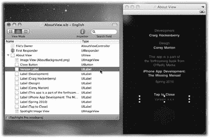

[www.it-ebooks.info](http://www.it-ebooks.info/)

## NIB 文件：值得一看

### `AboutView.xib`

嘿——这个 NIB 并不在最初计划中！作为一名开发者，你知道计划总会有变化。在开发产品的过程中，你显然需要一个地方来推广你的业务。在 Beta 测试期间，你还发现有一个显示 Beta 版本号的地方非常方便。而一旦你意识到添加一个控制器和视图是多么容易，实现这个新的“关于”视图只需要很短的时间（图 6-7）。

**图 6-7：** 此图显示了一个包含致谢、推广信息和应用程序版本号的“关于”视图。

**提示：** 这个新的 NIB 文件也可能是一个为你们谦逊的作者添加更多酷示例的地方。

视图的大部分由描述产品的文本标签组成。其中一个视图，即`版本标签`，连接到控制器中的 `-versionLabel` 插座。这样，版本号就可以自动更新。当讲解到 `AboutViewController` 类（第 204 页）时，你会看到它是如何工作的。

这个 NIB 中的另一个有趣的视图是`关闭按钮`。在检查器中看看它的大小：它的尺寸高达 320 × 460 像素，覆盖了整个屏幕！

这个按钮允许用户点击屏幕上的任何地方，并将 `-close` 动作发送给控制器。这表明按钮不一定需要显示任何可见的文本或图像才能有效。例如，你可以使用透明按钮作为图像上的点击检测器。

**168**

iPhone 应用程序开发：缺失的手册

[www.it-ebooks.info](http://www.it-ebooks.info/)

## 优化外观


# 最后是`Spotlight Image View`

这是一个透明的图像，目前看起来有点无聊，但等你看到控制器（第 205 页）时，它就会动起来、活跃起来！

## 优化外观

现在你已经看过了 NIB 文件，是时候看看一些自定义视图是如何创建的了。这里有一个用于光源的自定义视图，另一个用于屏幕顶部显示的信息。

### `LightView`

这个视图模仿了真实的物理光源。模拟现实世界的对象通常更容易设计，因为你已经熟悉了正确的行为。它们往往也能让你的代码更易读。

这种倾向在 Cocoa Touch 中很常见。例如，`UISwitch`控件通过使用名为`on`的属性来管理其状态。下面哪段代码更易读？

```
mySwitch.on = YES;
```

还是

```
mySwitch.state = YES;
```

该视图的属性允许你更改光源的状态（开、关或单次脉冲）。你还可以设置光源的亮度和颜色。为了模拟光源的物理属性，你还可以设置一个包络，其中 attack（起音）和 release（释音）变量控制光源打开和关闭所需的时间。

### 委托

委托不仅适用于系统类。光源使用这种设计模式来通知另一个对象，视图上发生了点击事件。在这个应用中，该对象是`MainViewController`。当你看到控制器代码（第 194 页）时，就会了解它如何作为委托角色。

当你查看`LightView.h`时，会看到协议的前向声明：

```
@protocol LightViewDelegate;
```

需要这个声明是因为委托和视图之间存在“先有鸡还是先有蛋”的问题。类和协议定义互相需要对方。

使用这个前向声明，委托实例变量被定义为：`id <LightViewDelegate> delegate;`

这个变量告诉编译器，委托可以是任何对象，只要它遵守`LightViewDelegate`协议即可。（记住`id`是任何类的通用对象。）

第 6 章：专业手电筒

**169**

[www.it-ebooks.info](http://www.it-ebooks.info/)

### 优化外观

完整的协议声明位于`LightView`的`@interface`之后：

```
@protocol LightViewDelegate <NSObject>

@optional

- (void)lightView:(LightView *)view singleTapAtPoint:(CGPoint)tapPoint;

- (void)lightView:(LightView *)view doubleTapAtPoint:(CGPoint)tapPoint;

@end
```

`LightView`发送的两条消息是`–lightView:singleTapAtPoint:`和`–lightView:doubleTapAtPoint:`。两者都被标记为`@optional`，因此是否实现这些方法由委托决定。如果未指定`@optional`，则委托必须提供这些方法。

### 枚举

C 语言的枚举在 Cocoa Touch 中被广泛使用，作为在代码中表达多种选项的方式。光源视图使用枚举来控制光源的状态。在 UIKit 中的一个例子是`UIViewAnimationCurve`枚举。枚举的命名和值遵循一个简单的模式——类名、属性名和唯一选项名的拼接。因此动画曲线类型为`UIViewAnimationCurveEaseInOut`、`UIViewAnimationCurveLinear`等等。

是的，这有点冗长，但在代码中非常易读：

```
[UIView setAnimationCurve:UIViewAnimationCurveLinear];
```

**注意：** 这种标准命名模式在 Xcode 的自动补全功能中非常有用。一旦你掌握了规则，找到这些长名称就很容易了。

例如，你可以输入`UIViewAnim`并按 Esc 键来显示建议列表。你知道要输入开头的文本，因为你正在处理一个`UIView`和`animationCurve`属性。

光源视图用自己的枚举遵循了这个模式：

```
typedef enum {

    LightViewStateOff = 0,

    LightViewStateOn,

    LightViewStatePulse

} LightViewState;
```

该枚举在实例变量定义中使用：

```
LightViewState state;
```

并且在属性中也使用：

```
@property (nonatomic, assign) LightViewState state;
```


### 控制器可以通过枚举来改变灯光状态：`lightView.state = LightViewStatePulse`;

**170**

iPhone 应用开发：缺失的手册

[www.it-ebooks.info](http://www.it-ebooks.info/)

## 优化外观

### 用于私有方法的类扩展

在第 2 章中，你学习了如何通过 Objective-C 分类来扩展已有类（第 38 页）。一种名为*类扩展*的变体则可以让你扩展自己类的接口。尽管你是编写类的人，并且可以在接口的`@implementation`部分定义任何内容，但扩展类接口仍有一个好处：它能让你隐藏内部方法。

例如，`LightView.h`中的`@interface`展示了其他类可用于与对象通信的方法。问题在于，有些方法仅用于内部，将它们暴露在接口中既会造成混淆也存在风险。

解决方案是在你的实现文件中定义另一个`@interface`。这个`@interface`看起来很像分类，区别在于它是匿名的——括号内没有名称：

```
@interface LightView ()

- (void)updateBackgroundColor;

- (void)endPulse;

- (void)handleSingleTap;

- (void)handleDoubleTap;

@end
```

这个`@interface`中的方法（如`-updateBackgroundColor`）是对原始接口的扩展，因此必须在下面的实现部分中实现。这样一来，你可以在`LightView.m`中随意调用`[self updateBackgroundColor]`，但如果其他对象试图发送类似`[lightView updateBackgroundColor]`的消息，编译器就会报错。

**注意：** 其他面向对象语言中称之为*私有方法*。许多 Objective-C 程序员也沿用这一术语。

### 捕获视图属性变化

如你之前所见，`@property`和`@synthesize`声明可以为你节省大量编写访问器代码的时间。但有一个问题：你无法知道这些访问器代码何时会被执行。

大多数情况下这不成问题。然而在视图中，属性更新通常意味着某些数据的呈现方式必须随之调整。视图的`color`属性就是一个例子。当其他对象改变颜色时，你需要更新视图以显示这种变化。

第 6 章：专业手电筒应用

**171**

[www.it-ebooks.info](http://www.it-ebooks.info/)

### 优化外观

要更新视图，你需要手动编写访问器并添加自己的代码：

```
- (void)setColor:(UIColor *)newColor {

if (color != newColor) {

[color release];

color = [newColor retain];

[self updateBackgroundColor];

}

}
```

你不可能一直偷懒，处理视图属性变化就是不能偷懒的时候。

**提示：** 如果你正在为视图进行自定义绘制，通常唯一需要额外添加的代码是：

```
[self setNeedsDisplay];
```

`-setNeedsDisplay`方法会将视图标记为“需要重绘”，并通过`-drawRect:`方法自动触发重绘。你将在`IFInfoView`（第 174 页）中看到这一技术的实际应用。

另请注意，绘制不会立即执行。相反，多个绘制请求会在下一个事件处理周期中合并为一次更新。如果你试图直接调用`-drawRect:`来规避这一点，效率会更低且结果不可预测。让系统来决定何时绘制。

### 视图动画

Cocoa Touch 允许你对某些视图属性进行动画处理，这也是让应用看起来如此酷炫的原因。但更重要的是，它是你向用户提供操作微妙反馈的方式。

以下是 iPhone 应用中常见的一些视图属性及其效果类型：

- **alpha.** 当用户编辑或改变应用状态时，让视图淡入或淡出。
- **frame.** 在两个点之间平滑移动，以在屏幕上添加或移除信息。
- **transform.** 通过改变仿射变换矩阵，实现数据的旋转、缩放和翻转。
- **backgroundColor.** 柔和地改变视图背景色，以指示状态变化。


动画是在 *block* 中完成的。一个 block 是一组同时执行的动画属性变化。在 block 的开始和结束之间对视图属性的更改会同时生效，为用户提供流畅的体验。动画 block 还可以简化你的代码。

**172**

*iPhone App 开发：缺失的手册*

[www.it-ebooks.info](http://www.it-ebooks.info/)

**完善外观**

***提示：*** 没有什么能阻止你同时更改视图的 `alpha`、`frame` 和 `backgroundColor`。只需记住，最佳动画是那些起到微妙提示作用的动画。从“大锤设计学院”毕业的人只会打动他们自己，而不是客户。

`lightView` 只动画化一个属性：用作虚拟手电筒灯泡的背景颜色。所有工作都在私有方法 `-updateBackgroundColor` 中完成。

你通过 `UIView` 的类方法 `+beginAnimations:context:` 来开始一个动画 block：

```
- (void)updateBackgroundColor {
    [UIView beginAnimations:@"updateLightView" context:NULL];
```

`updateLightView` 被委托方法用于唯一标识一个动画。对于复杂的转场效果，可能在给定时间内有多个动画同时发生，因此能够正确选择动画非常重要。

每个动画允许你设置各种选项。对于 `lightView`，如果动画已经在进行中，当前颜色将是新颜色的起点：

```
[UIView setAnimationBeginsFromCurrentState:YES];
```

视图动画的其他属性包括重复次数、完成后是否反转，以及一些控制时间等其他属性。

`lightView` 使用最常用的属性之一：动画持续时间。如果灯亮着，使用 `envelopeAttack` 实例变量中指定的时间来控制从当前颜色切换到新颜色所需的时长：

```
if (self.state == LightViewStateOn || self.state == LightViewStatePulse)
{
    [UIView setAnimationDuration:self.envelopeAttack];
    [self setBackgroundColor:self.color withBrightness:self.brightness];
}
```

如果灯的状态为关闭，则 `envelopeRelease` 变量被用作 `animationDuration`，同时将背景颜色设置为黑色：

```
else {
    [UIView setAnimationDuration:self.envelopeRelease];
    self.backgroundColor = [UIColor blackColor];
}
```

配置完视图动画后，使用 `-commitAnimations` 类方法来启动动画：

```
[UIView commitAnimations];
}
```

结果是，`lightView` 会在颜色和状态之间平滑过渡。得益于视图动画，这个视图看起来、用起来都像真正的灯泡。

第 6 章：专业手电筒

**173**

[www.it-ebooks.info](http://www.it-ebooks.info/)

**完善外观**

当教程讲到 category 和 `SettingsViewController` 时（第 201 页），你将看到更多动画 block。一旦你熟悉了它们的工作原理，它们就能为你的应用程序增色不少。只需记住，过犹不及。

## IFInfoView

Flashlight Pro 项目中的另一个自定义视图是用于在屏幕顶部显示状态的视图。与依赖 `backgroundColor` 属性来显示自身的 `LightView` 不同，`IFInfoView` 进行自定义绘图。在本节中，你还会学习如何设置该视图并正确命名。

### 命名

为什么视图类名要以 `IF` 开头？难道不能像 `LightView` 那样直接叫 `InfoView` 吗？

是的，你可以。但你是懒程序员。而且你对未来有远见……

总有一天，这个信息视图可能会在其他项目中有用。很多应用都需要时不时地显示状态，这代码就是实现这一点的好办法。

你很可能想要重用这段代码。

如果你试图将这个类放入一个已经存在 `InfoView` 的项目中，就会遇到命名冲突。由于 Objective-C 没有命名空间，你必须通过一些方式来模拟它。


# 代码类命名与冲突避免

正如框架使用`*NS*`和`*UI*`（第 33 页）等前缀来避免冲突一样，你可以添加自己的前缀来使类名唯一。以下代码来自 Iconfactory，因此它使用标准`*IF*`前缀。这隐式保证了该公司中不会再有其他类使用相同名称。

通过这种机制，Iconfactory 可以在自己的项目中使用这些代码，你也可以在你的项目中使用。当然，命名空间会是更优雅的解决方案，但在实践中，这种君子协定运作得相当不错。

**提示：** 如果你发现自己遇到了类名冲突，务必查看 Xcode 的`Refactor`工具。它能够轻松地更改整个项目中类名（包括在 NIB 文件中）。你还可以用它来更改实例变量名称以及类的其他属性。要在 Xcode 中使用此功能，请在源代码编辑器中选择类名，然后选择`Edit`➝`Refactor`。

# 视图设置

你可以通过两种方式创建任何对象：使用 NIB 文件，或者使用`*–init*`方法。对于视图类来说尤其如此。

**174**

iPhone App 开发：缺失手册

[www.it-ebooks.info](http://www.it-ebooks.info/)

**完善外观**

在这两种情况下，你很可能需要编写一些代码来将实例变量设置为有效状态。对于这个视图，默认会显示一个信息图标。你可以在`*–initWithFrame:*`和`*–awakeFromNib*`方法中执行此设置，但随着视图变得越来越复杂并添加更多实例变量，这种重复的代码将变得难以管理和同步。

解决方案是创建一个`*–setupView*`方法，可以在两个实例中调用：

```
- (void)setupView {
    type = IFInfoViewTypeInformation;
    self.backgroundColor = [UIColor clearColor];
}

- (id)initWithFrame:(CGRect)frame {
    if (self = [super initWithFrame:frame]) {
        [self setupView];
    }
    return self;
}

- (void)awakeFromNib {
    [self setupView];
}
```

这确保了`backgroundColor`完全透明，并且无论视图是通过代码创建还是从 NIB 读取，都会设置默认类型。

# 在代码中绘制

这个类的核心在于`*–drawRect:*`方法。每当`IFInfoView`需要更新并显示在屏幕上时，都会调用这个方法。

在大多数情况下，这种绘制是通过`UIView`父类中的`*–setNeedsDisplay*`方法触发的。例如，当`type`属性发生更改时，你希望看到一个新图标，因此将视图标记为需要显示：

```
- (void)setType:(IFInfoViewType)newType {
    if (newType != type) {
        type = newType;
        [self setNeedsDisplay];
    }
}
```

现在你知道了触发绘制的原因，是时候看看`*–drawRect:*`方法中的代码了。

第 6 章：专业手电筒应用

**175**

[www.it-ebooks.info](http://www.it-ebooks.info/)

**完善外观**

**提示：** 在开始编写大量使用`*–drawRect:*`的自定义绘制代码之前，尝试使用基本的视图层次结构。这个类本可以实现为`UIImageView`，包含一个背景图像和两个子视图。子视图将使用`UILabel`绘制文本，并使用另一个`UIImageView`绘制图标。

# 颜色填充

最基本的操作之一是标准颜色填充。首先，选择你想要填充的颜色：

```
UIColor *fillColor = nil;
if (self.type == IFInfoViewTypeAlert) {
    fillColor = [UIColor colorWithRed:0.6f green:0.0f blue:0.0f alpha:1.0f];
} else {
    fillColor = [UIColor colorWithRed:0.0f green:0.0f blue:0.0f alpha:0.60f];
}
```

如果信息类型是告警，则选择纯 60%红色；否则选择不透明度为 60%的黑色。选择好颜色后，必须调用其`*–set*`方法，以便在后续绘制操作中使用：

```
[fillColor set];
```

剩下要做的就是填充正在绘制的矩形：`UIRectFill(rect);`

# 渐变

现在，我们将从最简单的绘制操作之一过渡到最复杂的操作之一——你将在纯色之上绘制渐变。


# 绘制渐变与图形

为此，你需要使用 `CoreGraphics`。该框架包含了用于在 iPhone 上绘图的所有底层 API。当你使用任何以 `CG` 开头的定义时（特别是 `CGRect`（第 158 页）），就已经接触过这个框架了。

要开始绘制渐变，你需要一个颜色数组：

```
UIColor *startColor = [UIColor colorWithRed:1.0f green:1.0f blue:1.0f alpha:0.45f];
UIColor *endColor = [UIColor colorWithRed:1.0f green:1.0f blue:1.0f alpha:0.10f];
CGColorRef colors[] = { [startColor CGColor], [endColor CGColor] };
CFArrayRef colorsArrayRef = CFArrayCreate(NULL, (const void **)colors, 2, NULL);
```

渐变使用的颜色是白色，只有透明度发生变化。它从 45% 开始，到 10% 结束（即 55% 和 90% 的透明度）。这两个值都被放入一个 `CoreGraphics` 颜色引用数组中。

**注意：** 你使用数组是因为可以在渐变中指定任意数量的颜色。你还可以指定颜色应用的点。

下一步是使用这些颜色以及颜色空间引用，并创建渐变规范的引用：

```
CGColorSpaceRef colorSpaceRef = CGColorSpaceCreateDeviceRGB();
CGGradientRef gradientRef = CGGradientCreateWithColors(colorSpaceRef, colorsArrayRef, NULL);
```

现在你已经定义了渐变，可以在当前图形上下文中绘制它。图形上下文定义了整个 2D 绘图环境：`UIKit` 提供了 `UIGraphicsGetCurrentContext()` 函数，以便你可以与绘制视图的系统代码共享该环境：

```
CGContextRef contextRef = UIGraphicsGetCurrentContext();
CGContextDrawLinearGradient(contextRef, gradientRef, CGPointMake(0.0f, 0.0f), CGPointMake(0.0f, CGRectGetMidY(rect)), 0);
```

渐变是从视图的顶部绘制到其矩形的中间。

**提示：** 许多便捷函数允许你创建和查询 Core Graphics 数据结构。在上面的示例中，你看到了 `CGPointMake()` 和 `CGRectGetMidY()`。还有像 `CGRectMake()` 和 `CGRectGetMinX()` 这样的函数。

最后一步非常重要。`Core Graphics` 创建的引用会分配内存，因此你需要显式释放该内存（第 43 页）：

```
CFRelease(colorsArrayRef);
CGGradientRelease(gradientRef);
CGColorSpaceRelease(colorSpaceRef);
```

由于视图绘制往往会重复进行，因此在执行屏幕更新时发生内存泄漏会严重影响你的应用。

呼！那个渐变挺难的。接下来会稍微容易一些。

## 混合绘制与线条

另一种常见的绘图类型是*混合*。它通常用于使图像的一部分变亮或变暗，以指示某种状态（如选中状态）。另一种用途，如信息视图中使用的（第 175 页），是突出边缘并提供额外的对比度。

矩形的顶部使用 20% 白色变亮，代码如下：

```
lineRect = CGRectMake(0.0f, 0.0f, rect.size.width, 1.0f);
[[UIColor colorWithRed:1.0f green:1.0f blue:1.0f alpha:0.20f] set];
UIRectFillUsingBlendMode(lineRect, kCGBlendModeLighten);
```

这个函数的工作原理类似于你在第 176 页看到的 `UIRectFill()`，但它添加了一个混合模式作为第二个参数。相同的绘图函数用于矩形的底部。请注意，当混合模式为 `kCGBlendModeDarken` 时，你设置的是透明度为 30% 的黑色。这段代码还展示了一个绘制水平和垂直线的简单技巧：只需定义一个高度或宽度为 1 像素的矩形。

## 伟大的路径

那么，如果你要绘制的线条不是垂直或水平线怎么办？或者如果你想绘制矩形区域以外的形状呢？Core Graphics 来救场！

使用该框架绘制“线条”是一个相当复杂的操作。这是有充分理由的：所使用的机制并不仅限于线条。你可以绘制圆形和其他椭圆体。或者你可以绘制源自贝塞尔路径的复杂形状。

这种绘图操作基于*路径*。路径可以被描边以生成形状的轮廓，或者被填充以生成实心形状。路径是增量式生成的：你移动到某点，向另一点添加一条线，附加一条曲线，依此类推。

以下是在矩形底部绘制线条的代码：

```
lineRect.origin.y = rect.size.height - 1.0f;
[[UIColor colorWithRed:0.0f green:0.0f blue:0.0f alpha:0.30f] set];
UIRectFillUsingBlendMode(lineRect, kCGBlendModeDarken);
```

要使用路径做同样的事情，你需要先创建它：

```
CGMutablePathRef pathRef = CGPathCreateMutable();
```

然后添加线条的两个端点：

```
CGPathMoveToPoint(pathRef, NULL, 0.0f, rect.size.height - 0.5f);
CGPathAddLineToPoint(pathRef, NULL, rect.size.width, rect.size.height - 0.5f);
```

此时你可以进行任何类型的绘图。如果你正在绘制圆角矩形，可以使用 `CGPathAddArc()`。要绘制贝塞尔曲线，则使用 `CGPathAddQuadCurveToPoint()`。你还可以向路径添加矩形和其他几何形状。

一旦完成路径的构建，就关闭它：

```
CGPathCloseSubpath(pathRef);
```

下一步是设置图形上下文以供绘图。设置混合模式以及线条的颜色和宽度：

```
CGContextSetBlendMode(contextRef, kCGBlendModeDarken);
[[UIColor colorWithRed:0.0f green:0.0f blue:0.0f alpha:0.30f] set];
CGContextSetLineWidth(contextRef, 1.0f);
```

然后将路径添加到当前图形上下文。上下文随后可以使用该路径进行后续绘图操作：

```
CGContextAddPath(contextRef, pathRef);
```

最后，通过告诉图形上下文描边路径来绘制线条：

```
CGContextStrokePath(contextRef);
```

之后请务必清理。路径使用的内存必须释放，混合模式也应恢复为默认状态：

```
CGPathRelease(pathRef);
CGContextSetBlendMode(contextRef, kCGBlendModeNormal);
```

这比你开始时那三行代码要多很多工作，但它提供了更多的灵活性。当你需要绘制比线条或矩形更复杂的图形时，这就是正确的方法。

## 半像素的重要性

请务必注意绘图时使用的坐标。许多开发者都曾被 Core Graphics 的精度问题绊倒。当你绘制一条 1 像素的线条时，该线条的一半位于指定坐标之上，另一半位于其下（图 6-8）。

**图 6-8：** 在整数坐标处绘制的线条不会如你所期望的那样显示。当你指定 44.0 作为垂直坐标时，一半的线条会绘制在上方，一半在下方（A）。该线条分布在 2 个像素上，失去了颜色定义并变得模糊（B）。解决方案是减去一半线宽并在 43.5 处绘制（C）。

例如，如果你指定一条宽度为 1.0 且水平坐标为 44.0 的线条，则绘制出的线条顶部在 43.5，底部在 44.5。由于 Core Graphics 使用抗锯齿来平滑线条，它会将单一颜色的线条平分到 2 个像素上。这会导致线条模糊，失去颜色定义。

为了补偿，在定义点时所使用的高度要减去一半线宽，从而得到一条精确跨越第 44 像素的线条。

**注意：** 这种模糊绘制也可能在你计算视图矩形时发生。与线条一样，偏移了半像素的矩形看起来会不正确，并且很难清楚为什么会发生这种情况。


# 排版后内容

例如，如果你使用 `CGRectGetMidY()` 函数来计算一个具有偶数高度的矩形的中点，你会得到一个带小数的结果。在这种情况下，请使用 `floorf()` 数学函数将结果限定为整数值。在几乎所有情况下，矩形原点和尺寸都应使用整数，即使它们被定义为浮点值。

## 文本绘制

在信息视图中接下来要绘制的是消息文本。为了与工具栏的样式相匹配，字符串将带有 1 像素的阴影进行绘制，使其看起来像是蚀刻在渐变创建的曲面上。

在绘制文本之前，你需要确定其大小。为此，你需要知道绘制所用的字体：

```
UIFont *font = [UIFont systemFontOfSize:17.0f];
```

这段代码让你获得 17 磅的 Helvetica 字体。`UIFont` 也有获取系统字体粗体或斜体版本的方法。如果你想绘制自定义文本，也可以通过名称获取字体。

一旦你有了字体，就需要指定用于绘制文本的区域。由于你希望消息在图标预留 44 像素的边距后适应矩形的宽度，你可以像这样定义尺寸约束：

```
CGSize constrainedSize = CGSizeMake(rect.size.width - iconOffset, 9999.0f);
```

第二个参数是一个很大的值，因为你关心的是计算出的高度，所以实际上在这个维度上没有约束。要计算文本的高度，请使用一个 `NSString` 的 UIKit 类别，其中包含 `-sizeWithFont:constrainedToSize:` 方法：

```
CGSize textSize = [self.message sizeWithFont:font
                         constrainedToSize:constrainedSize];
```

接着，这被用来找到一个在视图高度中居中文本的新矩形：

```
CGRect textRect = CGRectMake(iconOffset,
                    (CGRectGetMidY(rect) - (textSize.height / 2.0f)) - 1.0f,
                    rect.size.width - iconOffset,
                    textSize.height);
```

现在数学计算完成了，你可以实际绘制文本了。如果你仔细观察，可能会想知道为什么计算中会出现那个 `-1.0`。原因在于你要使用一个小技巧来绘制文本的阴影：你将绘制它两次。

第一次绘制时，你使用深色，并在正常文本上方偏移 1 个像素。

**180**

iPhone 应用开发：缺失手册

[www.it-ebooks.info](http://www.it-ebooks.info/)

**优化外观**

***提示：*** 如果你想为复杂形状或其他类型的绘图添加阴影，可以使用 `CGContextSetShadow()` 函数结合当前图形上下文。

**高级用户课堂**

**让你的矩形变圆角**

路径也可以用于在绘制时进行裁剪。一个常见的用途是在绘制具有方形角的图像时显示圆角。

使用这种技术，你可以通过由角上的弧线连接的直线来构建路径：

```
#include <math.h> // 用于 M_PI

#define MIN(A,B) ((A) < (B) ? (A) : (B))

CGFloat DegreesToRadians(CGFloat degrees)
{
    return degrees * M_PI / 180;
}

CGPathRef RoundedRectPath(CGRect rect,
                          CGFloat radius) {
    CGMutablePathRef pathRef =
        CGPathCreateMutable();
    radius = MIN(radius, 0.5f *
        MIN(CGRectGetWidth(rect),
            CGRectGetHeight(rect)));
    CGRect insetRect = CGRectInset(rect,
                                   radius, radius);
    
    // 左上角
    CGPathAddArc(pathRef, NULL,
        CGRectGetMinX(insetRect),
        CGRectGetMinY(insetRect), radius,
        DegreesToRadians(180.0),
        DegreesToRadians(270.0), false);
    
    // 右上角
    CGPathAddArc(pathRef, NULL,
        CGRectGetMaxX(insetRect),
        CGRectGetMinY(insetRect), radius,
        DegreesToRadians(270.0),
        DegreesToRadians(360.0), false);
    
    // 右下角
    CGPathAddArc(pathRef, NULL,
        CGRectGetMaxX(insetRect),
        CGRectGetMaxY(insetRect), radius,
        DegreesToRadians(0.0),
        DegreesToRadians(90.0), false);
    
    // 左下角
    CGPathAddArc(pathRef, NULL,
        CGRectGetMinX(insetRect),
        CGRectGetMaxY(insetRect), radius,
        DegreesToRadians(90.0),
        DegreesToRadians(180.0), false);
    
    CGPathCloseSubpath(pathRef);
    return pathRef;
}
```

将此路径添加到图形上下文后，你可以调用 `CGContextClip()`，它将在绘制图像时用于遮罩：

```
CGPathRef pathRef =
    RoundedRectPath(rect, 8.0f);
CGContextAddPath(context, pathRef);
```


```objc
CGContextClip(context);

// 右上角

[myImage drawInRect:rect];

CGPathAddArc(pathRef, NULL,
CGRectGetMaxX(insetRect),
CGPathRelease(pathRef);
```

#### 第 6 章：专业级手电筒

**181**

[www.it-ebooks.info](http://www.it-ebooks.info/)

### 优化外观

要创建透明度为 50% 的深黑色：

```objc
[[UIColor colorWithWhite:0.0f alpha:0.5f] set];
```

以下是在视图中绘制阴影文字的代码：

```objc
[self.message drawInRect:textRect withFont:font];
```

第二次绘制文本时，将原点向下移动 1 像素，将颜色设置为白色，并使用相同的方法绘制字符：`textRect.origin.y += 1.0f;`

```objc
[[UIColor whiteColor] set];
[self.message drawInRect:textRect withFont:font];
```

相当简单又巧妙，对吧？

请注意，当视图的消息发生更改时，也会使用 `–sizeWithFont:constrainedToSize:` 方法。如果文本超过一行，则会使用计算出的尺寸来调整视图的高度。

### 图像绘制

视图中还需要绘制最后一样东西：图标图像。第一步是从应用程序资源中读取图像：

```objc
UIImage *image = nil;
if (self.type == IFInfoViewTypeAlert) {
    image = [UIImage imageNamed:@"InfoViewAlert.png"];
}
else {
    image = [UIImage imageNamed:@"InfoViewInfo.png"];
}
```

`UIImage` 类的类方法 `+imageNamed:` 会在应用程序包中找到图像文件，并将其缓存到内存中。

下一步是计算图像在绘制矩形中的位置。

`UIImage` 的 `–size` 方法可提供图像尺寸，随后这些尺寸用于找到一个在视图中垂直居中的矩形：

```objc
CGRect imageRect = CGRectZero;
imageRect.size = [image size];
CGRect drawRect = CGRectMake(CGRectGetMidX(imageRect),
                             CGRectGetMidY(rect) - CGRectGetMidY(imageRect),
                             imageRect.size.width, imageRect.size.height);
```

要让图像显示在视图中，你只需向 `UIImage` 实例发送 `–drawInRect:` 消息：

```objc
[image drawInRect:drawRect];
```

至此，视图的绘制工作就完成了，在这个过程中你学到了很多知识。恭喜！

**182**

iPhone 应用开发：缺失手册

[www.it-ebooks.info](http://www.it-ebooks.info/)

## 打造专属 Cocoa Touch

***提示：*** 在绘制视图时，最好始终基于传入的矩形来计算所有几何图形。如你所见，视图的大小可能会在你不知情的情况下发生变化。如果你对尺寸做出假设或硬编码数值，那很可能导致失败。

在某些情况下，使用常量值是合理的：`iconOffset` 充当了图像和信息性消息之间的间距。

### 打造专属 Cocoa Touch

正如你在第 2 章中所见，Objective-C 中的类别是扩展现有类的非常强大的机制（第 38 页）。专业版手电筒有三个类别。其中两个用于使用亮度值创建和设置颜色，第三个用于在屏幕上隐藏视图。

#### UIColor+Brightness

你要看的第一个类别是 `UIColor+Brightness`。这个类别使用了你在互联网上找到的一些代码，将其封装在 Objective-C 中，并集成到现有的 `UIColor` 类中。

##### 命名规范

关于这个类别，你首先注意到的是源文件的名称。

由于这些类别通常会在项目之间共享，因此命名规范对于避免冲突非常重要。你会发现，你自己的类别会有很高的重用率，而且你也能找到许多优秀的开源类别。

按照此处使用的规范，名称派生自被扩展的类和类别名。对于这个类别，`@interface` 定义为：

```objc
@interface UIColor (Brightness)
```

因此，其文件名称为 `UIColor+Brightness`。如果类别名是“(Chockolicious)”，那么文件名就会变为 `UIColor+Chockolicious`。

***注意：*** 有些开发者使用破折号而不是加号作为分隔符。分隔符实际上并不重要；重要的是原始类和类别的唯一组合。

#### 收尾工作


如果你查看`@implementation`，会看到大量在 RGB 和 HSV 色彩空间之间进行转换的 C 语言代码。（本节中的源代码来自 Alvy Ray Smith 与 Eric Ray Lyons 合著的一篇 ACM 论文。若想自行查看，可在网上搜索“converting RGB to HSV written in C”。）

## 专业级手电筒

### 打造专属 Cocoa Touch

这段代码说明了几个要点。首先，Objective-C 与标准 C 语言配合得非常好。算法中的代码保持不变，仅做了风格上的调整，主要是为了让命名和格式适应新环境。

另一个重要之处在于，通过 Objective-C 封装器，这段相当复杂的代码变得更易理解。即便不查看任何文档，你也能猜出以下代码的功能：

```
CGFloat brightness = [[UIColor orangeColor] brightness];
```
```
[mySlider setValue:brightness];
```
```
UIColor *backgroundColor = [[UIColor redColor] colorWithBrightness:0.6f];
```
```
[myView setBackgroundColor:backgroundColor];
```

当你决定使用分类时，有一行代码至关重要：

```
#import "UIColor+Brightness.h"
```

这行代码能让编译器知晓新增的方法，并将其链接到最终的可执行文件中。如果忘记添加，构建应用时会出现“可能无法响应”的警告。

#### `UIView+Brightness`

这个简单的 `UIView` 分类使用了你刚刚看到的 `UIColor` 分类，在设置视图背景颜色时添加了一个亮度参数。一个分类完全可以调用另一个分类：只要记得导入 `@interface`，它们的行为就与原类完全一致。

#### `UIView+Concealed`

作为设计的一部分，你希望信息视图和工具栏有时能移出屏幕。信息无需无限期展示，而工具栏在手电筒锁定时需要隐藏。

你本可以通过向 `IFInfoView` 添加方法并创建 `UIToolbar` 的子类来实现这些功能。但你的做法更聪明！

##### 新增属性

你本可以使用 `UIView` 现有的 `hidden` 属性来切换视图的可见性。不过这种做法不够优雅，也无法让用户感知到信息的短暂性。在隐藏视图的过程中加入一点动画效果，就能同时解决这两个问题。

这个 `UIView` 分类为任意视图添加了一个 `conceal` 属性。这种做法的精妙之处在于，当发现 Bug 或需要添加新的隐藏功能时，只需修改一次代码，而无需在两个或更多视图中分别改动。

`UIView+Concealed` 分类为视图添加了一个新属性。你可以通过 `-setConcealed:` 方法让视图以动画形式移入或移出屏幕。同样，你也可以使用 `-isConcealed` 消息检查视图是否可见。

> **注意：** 分类无法为类添加实例变量。在大多数情况下，属性会引用这些变量之一，但这并非强制要求。属性仅定义了访问类内部某些数据的协议。

该分类利用现有的 `frame` 属性（以及 `UIView` 实例变量）来判断视图是否在屏幕上。

例如，控制器可以通过这个新属性来切换视图的隐藏状态：

```
myView.concealed = ! myView.isConcealed;
```

控制器只需在实现文件顶部添加这一行代码：

```
#import "UIView+Concealed.h"
```

##### 视图坐标

当你隐藏视图时，实际上是在改变它在父视图中的坐标。在了解移动视图的代码之前，你需要先花点时间理解 Cocoa Touch 中的视图坐标系。

实际上，在本教程的开头部分你就已经接触过这个坐标系了。在学习 `Flashlight_ProAppDelegate` 时，你看到了这行代码：
```
CGRect applicationFrame = [[UIScreen mainScreen] applicationFrame];
```
如果你当时充满好奇，可能还查阅过 `UIScreen` 的文档，发现该类中只有另一个方法：`-bounds`。在本章中，你也反复看到术语 `frame`。简单来说，`bounds` 定义了子视图 `frame` 所处的坐标系（见图 6-9）。


`[[UIScreen mainScreen] bounds]`  
(0,0)

```
[[UIScreen mainScreen] applicationFrame]
```

> **图 6-9：** iPhone 屏幕的 `bounds`，括号内为坐标值，其原点为 (0,0)，宽度为 320，高度为 480。`frame` 位于这些 bounds 之内，其原点和高度相对于 bounds 分别偏移了 20 像素。frame 的数值以方括号标示。

以下是使用 `UIScreen` 的 `-applicationFrame` 和 `-bounds` 的示例。如你所知，iPhone 的屏幕分辨率为 320 × 480 像素。因此，当你查询 `-bounds` 方法时，`UIScreen` 会返回一个具有这些尺寸的矩形。

然而，由于状态栏的存在，你的应用无法使用所有这些像素。`-applicationFrame` 方法会返回一个基于 bounds 的 frame 矩形。该 frame 用于将你的第一个视图放置在窗口中。

在 iPhone 应用中，你很可能不会只有一个视图。这没问题，因为当你设置视图的 frame 时，实际上也是在设置其初始的 bounds。当你将第一个视图的 frame 尺寸设置为 320 × 460 时，你也同时设置了 bounds。

如果你觉得这像是在重复数据，没错，确实如此。但这是有充分理由的：新的 bounds 的原点为 (0,0)，专门用于放置子视图。这些子视图无需了解父视图的任何 frame 信息。这种情况可能有些令人困惑，因此图 6-10 提供了一张图片，希望能胜过千言万语。

> **图 6-10：** 这张图展示了三个视图 A、B、C 如何通过 frame 和 bounds 坐标放置在屏幕上。视图 A 的 bounds 为 300 × 400，子视图 B 的 frame 尺寸为 200 × 250，原点位于 (50, 100)。当你指定子视图 C 的位置时，需要使用视图 B 的 bounds，即 200 × 250。

请注意，图中的视图 C 完全不知道父视图 B 的 frame 设置为何值，也不知道视图 B 的 bounds 是多少。拥有 frame 和 bounds 这样两套坐标系，使得视图 C 只需关心其 frame 在父视图 B 的 bounds 内的位置即可。

> **注意：** 在大多数情况下，bounds 和 frame 坐标之间存在一一对应关系。bounds 中的一个像素与 frame 中的一个像素是相同的。为什么要自找麻烦去更改它呢？

更改 bounds 可以对视图进行缩放：如果将 bounds 的尺寸减半，同时保持子视图 frame 的尺寸不变，那么该子视图的实际显示尺寸也会减半。类似地，更改 bounds 的原点会移动所有子视图。要查看效果，请将 `Flashlight_ProAppDelegate` 中的 `#if` 从 0 改为 1：

```
. . .
mainViewController.view.frame = applicationFrame;
CGRect funkyBounds = mainViewController.view.bounds;
funkyBounds.origin = CGPointMake(-10.0f, 10.f);
funkyBounds.size.width /= 2.0f;
funkyBounds.size.height /= 2.0f;
mainViewController.view.bounds = funkyBounds;
. . .
```

这段测试代码也能让你更清楚地看到视图隐藏的工作机制。

#### 更多视图动画


在`LightView`类中，您看到了一些改变背景颜色的基础动画。在本部分中，您将看到更多动画代码。这次用它来移动视图的框架，使其平滑地滑入和滑出屏幕。

既然您已经是视图框架和父视图（第 162 页）的专家，您可以了解`-isConcealed`属性是如何实现的：

```
CGRect superviewBounds = self.superview.bounds;
CGRect viewFrame = self.frame;

if (viewFrame.origin.y >= superviewBounds.size.height) {
    // view is below the superview’s frame
    result = YES;
}
else if (viewFrame.origin.y < superviewBounds.origin.y) {
    // view is above the superview’s frame
    result = YES;
}
```

如果视图的框架位于其父视图边界之上或之下，则视为被隐藏。类似地，`-setConcealed:animated:duration:`使用`superviewBounds`来计算新的`viewFrame`，根据`concealed`参数，该框架要么在屏幕上，要么在屏幕外。

但是什么让框架平滑移动呢？是结尾的这段小代码：

```
if (animated)
{
    [UIView beginAnimations:@"updateConcealedView" context:NULL];
    [UIView setAnimationDuration:duration];
}
self.frame = viewFrame;
if (animated)
{
    [UIView commitAnimations];
}
```

UIKit 中的许多方法都使用`animated`参数。动画虽然酷，但在初始化视图时并非最佳方案。如果启动代码需要 1/3 秒，会让应用感觉笨拙，因此在视图控制器的`-viewDidLoad`方法中调用此代码可以解决问题：

```
[self.myView setConcealed:YES animated:NO];
```

**188**

iPhone App Development: The Missing Manual

[www.it-ebooks.info](http://www.it-ebooks.info/)

**让 Cocoa Touch 成为你自己的**

*渐进方法*

此类类别中的方法定义也展示了 Objective-C 开发者使用的另一种常见技术。方法是渐进定义的。完成所有工作的方法是`-setConcealed:animated:duration:`，如果您想显式指定每个参数，可以使用此方法。

然而，在大多数情况下，默认设置就足够了，因此您只需发送`-setConcealed`消息（或使用`concealed`属性）。而且，如上所述，您可以使用`-setConcealed:animated:`方法进行快速初始化。

***提示：** 这种方法在概念上类似于 C++中的默认参数。*

*一个新特性*

您还记得使用类别进行隐藏（第 185 页）如何让您轻松地为所有视图添加新功能吗？`-concealAfterDelay:`方法就是一个完美的例子。

在添加了管理视图位置的方法后，您发现在视图控制器中做大量工作来管理隐藏是一件麻烦事。一直调用`-setConcealed`很痛苦。

经过两个方法和八行代码，您得到了这个解决方案：

```
- (void)conceal {
    self.concealed = YES;
}

- (void)concealAfterDelay:(NSTimeInterval)delay
{
    [NSObject cancelPreviousPerformRequestsWithTarget:self
                                            selector:@selector(conceal) object:nil];
    [self performSelector:@selector(conceal) withObject:nil afterDelay:delay];
}
```

当您向视图发送带延迟的`-concealAfterDelay:`消息时，该视图会在指定时间过后自动隐藏。现在您的视图控制器可以这样做：

```
self.myView.concealed = NO;
[self.myView concealAfterDelay:3.0f];
```

该控制器依赖于`NSObject`中一个非常酷的方法，它允许您调用一个选择器并向其传递一个对象。这两行代码在功能上是相同的：

```
[myObject myMethod:myParameter];
[myObject performSelector:@selector(myMethod:) withObject:myParameter];
```

Chapter 6: A Flashlight for Pros

**189**

[www.it-ebooks.info](http://www.it-ebooks.info/)

**塑造你的模型**

这本身就很巧妙。您可以使用此技术在运行时（而不仅仅是编译时）分派消息。但更令人印象深刻的是，您可以通过使用`afterDelay`参数来配置发送消息前的等待时间：


`[self performSelector:@selector(conceal) withObject:nil afterDelay:delay];` 这行代码会在 `delay` 变量指定的时间（如 3 秒）后发送 `–conceal` 消息。当该消息被触发时，`concealed` 属性被设为 `NO`，视图开始隐藏自身。

由于这个方法可能在延迟结束前被多次调用，以下代码用于取消任何待处理的消息：

```
[NSObject cancelPreviousPerformRequestsWithTarget:self
selector:@selector(conceal) object:nil];
```

通常，如果你打算在稍后时间执行一个选择器，应该先取消任何已存在的待执行请求。如果没有任何待执行请求，取消消息会被忽略。

## 装饰你的模型

现在，你已经探索了 Flashlight Pro 的视图，是时候看看为应用提供数据的模型了。

你可能会想：“数据？对于一个手电筒应用来说？”

是的！数据有多种形式：手电筒的模型让你能够跟踪灯光设置，并构建一个控制 SOS 闪烁器的状态机。这不是传统意义上的数据，但它仍然是你要从控制器中分离出来的信息。

### SOSModel

当你发送 SOS 信号时，你处理的是一个随时间变化的点划序列。本质上，你是在操作一个状态机。由于模型的功能之一是管理内部逻辑和行为，这使得求救信号成为这类对象的理想候选。

该模型的接口很简单：一个 `unitInterval` 属性让你定义点或划的时长（划被定义为点的三倍长）。还有一个方法让你查询当前元素。

通过调用 `–send` 方法来启动状态机运行。

#### 通知

启动状态机运行后，你如何知道何时从点切换到划？你可以轮询 `element` 参数，但你知道在事件驱动的环境中轮询值更新是非常糟糕的做法。而 Cocoa Touch 正是一个高度事件驱动的环境。

解决方案是依赖通知。如你在第 97 页所见，通知让你能够以结构化方式向对象分发信息。所以对于 SOS 模型也采用这种方式。以下是 `@interface` 中定义的通知名称：`extern NSString *const SOSModelElementChangedNotification;`

其在 `@implementation` 中有对应的定义：`NSString *const SOSModelElementChangedNotification = @″SOSModelElementChangedNotification″;`

当状态机前进时，会发布该通知，以便任何感兴趣的视图控制器可以更新其视图：

```
- (void)update {
    [self advance];
    [[NSNotificationCenter defaultCenter]
        postNotificationName:SOSModelElementChangedNotification object:self];
    [self performSelector:@selector(update) withObject:self
               afterDelay:[self duration]];
}
```

在本章稍后经过 `MainViewController` 类时，你将看到它如何处理该通知。

***注意：*** 这个类的设计与你处理通过 Internet 加载数据的网络刷新非常相似。不是使用 `–send`，而是实现 `–refresh`，它使用 `NSURLConnection` 异步加载数据。当数据通过该连接加载完成时，你会发送一个 `refreshdidfinish` 通知，以便任何注册的视图控制器可以使用新数据更新其视图。

#### 私有属性

类扩展也可以用于定义私有属性。你可以享受 Objective-C 自动创建访问器方法的好处，而不必暴露内部数据。

`SOSModel` 使用一个整型实例变量来维护状态。令人意外的是，这个变量名为 `state`，并在 `@interface` 中定义：`NSUInteger state;`

注意头文件中没有 `@property` 定义。你会在 `@implementation` 上方的类扩展中找到它：

```
@interface SOSModel ()
@property (nonatomic, assign) NSUInteger state;
...
@end
```

此时，你可以像使用外部定义的属性一样使用 `state` 属性。并且可以确信，类的客户端不会乱动你的内部数据。

### FlashlightModel

你可以使用手电筒模型来持久化应用的状态。当前的亮度、闪烁速度、颜色和灯光模式都可以通过属性和方法访问。每当你在模型中更改这些值之一时，它会立即保存到用户的设置数据库中。

该模型还提供了一个小的颜色数据库。例如，可以检索到一个 `UIColor` 实例及其用于用户界面的本地化名称。

#### 只读属性

如你在 191 页所见，在某些情况下，防止其他对象窥探你的数据是一个好主意。同样，在某些情况下，你愿意暴露状态，但不希望它被修改。在这些情况下，你会使用只读属性。

`@interface` 中的 `currentColorIndex` 正是这样做的：

`@property (nonatomic, readonly) NSUInteger currentColorIndex;`

现在你有一个小问题。你可以读取该属性，但不能写入它。如果你尝试使用 `self.currentColorIndex = 0`，会得到一个编译错误。

类扩展又来救场了！你可以在实现文件中重写属性定义：

```
@interface FlashlightModel ()
@property (nonatomic, assign) NSUInteger currentColorIndex;
...
@end
```

这样你的 `@implementation` 可以写入该属性，但任何使用你的 `@interface` 的人都只能读取它。

#### 类静态变量

在第 100 页，你看到了如何使用类静态变量实现单例模式。手电筒模型对此做了一个细微的变体。类静态变量用于保存颜色名称和值的数组：

```
+ (NSArray *)colors {
    static NSArray *colors = nil;
    if (colors == nil) {
        colors = [[NSArray alloc] initWithObjects: ...
```

第一次使用 `+colors` 类方法时，数组被分配并在应用的生命周期内保持。

***提示：*** 你可以使用类静态变量来加速应用的某些部分。如果你有一个频繁访问的对象，并且加载该对象需要花费一些时间，你希望尽量减少实例化它的时间。

一个带有 `UIFont` 或 `UIImage` 的静态变量可以在绘制视图时初始化一次并重复使用。这些缓存对象有助于提高 `UITableView` 的滚动速度。请记住，你永远不会收回缓存使用的内存，所以只对小对象使用此技术。

类静态变量也用于存储和检索颜色信息的键：

```
static NSString *nameKey = @″name″;
static NSString *colorKey = @″color″;
```

这种方法允许编译器检查键类型并捕获拼写错误。如果你使用 `@″name″` 写入哈希表的数据，而用拼写错误的 `@″nane″` 来读取，你将会挠头不已。通过使用 `nameKey`，你避免了这种潜在问题。

#### 用户默认设置

Cocoa Touch 提供了一个用于存储用户设置的标准机制。它叫做 `NSUserDefaults`，并充当了这个模型的支柱。

例如，当你向模型发送 `–setSpeed:` 消息时，当前速度值被更新，然后通过 `–setFloat:forKey:` 方法作为浮点值存储到标准用户默认设置中：

```
- (void)setSpeed:(float)newValue {
    if (newValue != speed) {
        speed = newValue;
        [[NSUserDefaults standardUserDefaults] setFloat:speed
                                                forKey:speedKey];
    }
}
```


当模型初始化时，会通过`–objectForKey:`检查用户默认设置，以确认是否已设定速度值。如果该方法返回`nil`值，则分配一个默认设置。否则，将通过`–floatForKey:`读取当前设置。

```
- (id)init {
    if ((self = [super init])) {
        NSUserDefaults *userDefaults = [NSUserDefaults standardUserDefaults];
        . . .
        if (! [userDefaults objectForKey:speedKey]) {
            speed = 0.75f;
            [userDefaults setFloat:speed forKey:speedKey];
        }
        else {
            speed = [userDefaults floatForKey:speedKey];
        }
        . . .
    }
    return self;
}
```

如果你之前没有先检查对象就直接调用`–floatForKey`，你可能会返回一个零值，并且无法判断这是因为用户的选择还是因为设置不存在。

由于设置存储在属性列表中，可存储的对象类包括`NSArray`、`NSDictionary`、`NSString`、`NSData`、`NSDate`和`NSNumber`（整型、浮点型和布尔值）。

### 用户界面中的字符串

维护一个小型颜色数据库的原因之一，是将颜色值与人类可读的名称关联起来。请记住，并非所有人都阅读与你相同的语言。这就是为什么像`@"White"`这样的简单字符串需要用本地化宏来封装：

```
NSLocalizedString(@″White″, nil)
```

每当你使用一个将在用户界面中显示的字符串值时，都应通过此技术进行本地化。这些字符串如何分配和处理，将在参观`Localizable.strings`文件时进行描述。

### 整合一切

现在你已经了解了应用程序中的视图和模型，是时候看看控制器如何让一切协同工作。它们是连接你手电筒应用的粘合剂。

你已经预览过控制器：每个包含视图的 NIB 文件都有一个对应的控制器（例如第 86 页）。当然，Xcode 创建的基本控制器没有任何实例变量或操作，也不包含任何特定于应用程序的逻辑。

所以，快回到车上，让参观继续吧…

### MainViewController

主手电筒视图的设计本身就很简单。这导致控制器虽然使用了两个模型，但只包含三个视图出口。其中两个视图是自定义的`UIView`子类。与大多数控制器一样，其关键部分在于它与视图和模型的交互方式。

### 深入探究：打开模拟器

模拟器是一个强大的调试工具。但它有一个问题：每次构建并运行新版本的应用时，它都会被复制到一个新文件夹中。这个文件夹使用一长串十六进制数字（GUID 格式）命名，很难定位。

而你在调试时想要定位它，因为这里存储着应用程序的文档和设置。在处理模型时，定位数据的后端存储通常很有帮助。无论文件包含 SQLite 数据库、属性列表还是纯文本文件，能够验证写入内容都至关重要。

以下是一个简短的 shell 脚本，可帮助你定位应用程序数据：

```
#!/bin/sh
if [ -z "$1" ]; then
    echo "用法: $0 <app> [ Preferences | <document> ]"
else
    if [ "$2" = "" ]; then
        open "$dir/Library/Preferences"
    else
        open "$dir/Documents/$2"
    fi
fi
```

将此脚本放在你的`PATH`路径下，命名为`opensim`，并赋予其可执行权限。安装完成后，你可以使用它来查找模拟器中最新加载的应用程序，并在访达中打开 Preferences、Documents 或指定文档。

例如，要打开 Safety Light 应用程序当前的 Documents 文件夹，只需执行：

`$ opensim "Safety Light"`

该文件夹中没有文档，但如果有的话，你可以通过以下命令打开它们：

`$ opensim "Safety Light" fleshy.db`  
`$ opensim "Safety Light" awesome.plist`


你可以通过以下命令轻松进入你的偏好设置文件夹：

```
base=~/Library/Application\ Support/
iPhone\ Simulator/
$ opensim ″Safety Light″ Preferences
apps=Applications
```

如果你双击文件夹中显示的 `com.iconfactory.SafetyLight.plist` 文件，就会显示手电筒的当前设置。

```
app=`ls -1td ″$base/″*″/$apps/″*″/$1.
if [ -n ″$app″ ]; then
```

**注意：** `opensim` 脚本的副本位于 Flashlight Pro 项目的顶层目录中，因此你无需手动输入。

```
dir=`dirname ″$app″`
if [ ″$2″ = ″Preferences″ ]; then
```

### 通知

任何对象都可以注册接收通知，但控制器是最常使用它们的。控制器通常具备必要的逻辑，用于响应设备、模型或应用程序其他部分的状态变化。

第 6 章：专业人士的手电筒  
**195**  
[www.it-ebooks.info](http://www.it-ebooks.info/)

### 自我整合

主视图控制器会注册自己，以接收来自 `UIApplication` 和 `SOSModel` 的通知：

```
- (NSObject *)initWithNibName:(NSString *)nibNameOrNil bundle:(NSBundle *)nibBundleOrNil {
. . .
[[NSNotificationCenter defaultCenter] addObserver:self
selector:@selector(elementChanged:) name:SOSModelElementChangedNotification object:nil];
[[NSNotificationCenter defaultCenter] addObserver:self
selector:@selector(resignActive:) name:
UIApplicationWillResignActiveNotification object:nil];
[[NSNotificationCenter defaultCenter] addObserver:self
selector:@selector(becomeActive:) name:
UIApplicationDidBecomeActiveNotification object:nil];
. . .
}
```

同样重要的是，当视图控制器对象被释放时，它会将自己移除为观察者：

```
[[NSNotificationCenter defaultCenter] removeObserver:self
name:SOSModelElementChangedNotification object:nil]
[[NSNotificationCenter defaultCenter] removeObserver:self
name:UIApplicationWillResignActiveNotification object:nil];
[[NSNotificationCenter defaultCenter] removeObserver:self
name:UIApplicationDidBecomeActiveNotification object:nil];
```

当你使用设备上的锁定开关时，控制器中的 `–resignActive:` 和 `–becomeActive` 方法会被调用。这些方法会启动或停止闪光灯或迪斯科灯光。这是一个简单但很好的例子，说明了设备状态的变化如何导致应用程序状态的变化。

由 `SOSModel` 定义的通知会在模型状态每次变化时发送 `–elementChanged` 消息。此方法随后会打开或关闭灯光视图——这是一个如何将新数据传播到视图的例子。

### 声音

`–elementChanged` 方法还会播放点或划的蜂鸣声：

```
if (sosDotBeep != 0 && sosDashBeep != 0) {
if (element == SOSModelElementDot) {
AudioServicesPlaySystemSound(sosDotBeep);
}
else {
AudioServicesPlaySystemSound(sosDashBeep);
}
}
```

**196**  
iPhone 应用开发：缺失的手册  
[www.it-ebooks.info](http://www.it-ebooks.info/)

### 自我整合

***提示：*** 如果你希望在播放声音时伴随振动，请使用 `AudioServicesPlayAlertSound()` 函数。

`sosDotBeep` 和 `sosDashBeep` 声音的来源如下：当使用 `–startSOS` 方法启动闪光灯时，这些声音会通过以下代码加载到内存中：

```
OSStatus result;
NSString *dotPath = [[NSBundle mainBundle] pathForResource:@″Dot″
ofType:@″aif″];
result = AudioServicesCreateSystemSoundID((CFURLRef)[NSURL
fileURLWithPath:dotPath], &sosDotBeep);
if (result != kAudioServicesNoError)
{
sosDotBeep = 0;
}
```

首先，声音文件位于应用程序的 bundle 中。*Bundle* 是应用程序的代码和资源的集合。Xcode 中 Resources 组中的所有文件都会被移动到主 bundle 中。

要从 bundle 中提取其中一个文件，你需要使用资源名称（`@"Dot"`）和类型（`@"aif"`）来指定文件。生成的 `dotPath` 变量随后会被转换为文件 URL 并传递给 `AudioServicesCreateSystemSoundID()` API。

如果调用成功，`sosDotBeep` 变量便可用于播放声音。


***注意：*** 部分资源（尤其是图片）拥有从包中读取的自身机制。若要提取图片，你需要使用 `[UIImage imageNamed:@"xyz.png"]`。

由于声音文件会占用大量内存，因此只应在需要时加载。如果你仅在短时间内需要某个声音，可以使用 `AudioServicesDisposeSystemSoundID()` 释放其存储空间。

标准的 Xcode 模板无法访问这些声音 API；你需要先添加一个新框架，才能编译上述代码。如果你在 Xcode 中打开 Frameworks 组，会发现 `AudioToolbox.framework` 已经被添加。

## 成为代理

`LightView` 类为其代理定义了一个协议。灯光视图通过该代理传递视图内点击的相关信息。视图控制器使用代理方法更改亮度并锁定视图。作为代理的第一步，它需要在接口中采纳该协议：

```
@interface MainViewController : UIViewController < LightViewDelegate, UIAlertViewDelegate, UIActionSheetDelegate>
```

`MainView.xib` 中的 `LightView` 有一个连接到 `MainViewController` 的插座变量，因此视图知道谁将担任代理角色。剩下要做的就是实现 `–lightView:singleTapAtPoint:` 和 `–lightView:doubleTapAtPoint:` 方法。

单次点击的代理会检查 SOS 信号是否正在运行（通过控制器的一个状态变量），还会检查工具栏是否因屏幕锁定而隐藏。如果满足任一条件，点击将被忽略。

在确定当前亮度级别后，会选择一个新的亮度，并通过本地化字符串在信息视图中显示状态变化。

双击也会检查 SOS 信号是否正在运行，如果正在运行则会忽略点击。否则，会切换工具栏的隐藏状态，并更新信息视图。

### 一个视图，两种身份

仔细观察会发现，`LightView` 对象连接到了 `MainView.xib` 中的两个插座变量。虽然只有一个 `LightView` 实例，但它同时被用于 `infoView` 和 `view` 属性。难道一个实例变量不够用吗？

是，也不是。

如果你只使用一个实例变量，就必须使用 `UIViewController` 所需的视图。如果只使用那个变量，你会因为它被定义为 `UIView` 基类而增加大量额外工作。如果尝试使用此代码，你会收到一个编译器错误：

```
self.view.state = LightViewStateOn;
```

因此，你不得不编写如下代码来让编译器满意：`((LightView *)self.view).state = LightViewStateOn;`

除了违背你懒散的天性之外，这段代码简直丑陋不堪！如果你为这个对象定义第二个类型正确的插座变量，你可以这样做：`self.lightView.state = LightViewStateOn;`

这段代码唯一的实际代价是确保你在 `–viewDidUnload` 和 `–dealloc` 方法中释放该实例。不会占用额外内存，并且你的代码可读性会大大提高。

### 警告视图

当你查看主视图控制器所采纳的协议时，可能已经注意到它还采纳了 `UIAlertViewDelegate` 协议。来认识你的第一个警告视图吧。当你首次启动闪光灯程序时，会显示一条警告，提示闪烁的灯光可能引发癫痫发作。此应用的目标是让人们的生活更安全，而不是将他们置于危险之中！

在 iPhone 应用中，警告视图在此类情况下很常见。如果发生错误或需要做出重要选择，这是一种极佳的交互机制。不过，不要将它们用作状态指示器——屏幕上弹出太多警告会让人厌烦。


# 弹窗显示与用户交互

通过以下代码显示弹窗。首先检查模型，确认用户是否已接受运行闪光灯的风险：

```
if (! self.flashlightModel.flashingAccepted) {
```

如果用户尚未接受，则创建一个弹窗视图对象，包含标题、消息以及视图中显示的按钮标签：

```
UIAlertView *alertView = [[UIAlertView alloc]
initWithTitle:NSLocalizedString(@"FlasherWarning", nil)
message:NSLocalizedString(@"FlasherWarningMessage", nil)
delegate:self
cancelButtonTitle:NSLocalizedString(@"Cancel", nil)
otherButtonTitles:NSLocalizedString(@"FlasherWarningButtonStart", nil), NSLocalizedString(@"FlasherWarningButtonLearn", nil), nil];
```

由于你的控制器遵循 `UIAlertViewDelegate` 协议，因此将其设置为代理。另外请注意，这些字符串已做本地化处理。如果你要在应用中警告用户某些危险，务必使用他们最熟悉的语言。

向弹窗视图发送 `–show` 消息，即可让弹窗显示在屏幕上。

随后释放该对象，因为它已不再需要，并结束动作方法：

```
[alertView show];
[alertView release];
return;
}
```

但接下来呢？你在请求用户输入，然而弹窗视图并没有返回任何内容。难道这里要使用心灵感应吗？

不，这个功能要等苹果发布 iPhone 9GSXY 才会提供。在此之前，你需要记住自己是一个 `UIAlertViewDelegate`。当用户点击按钮时，将调用以下代码：

```
- (void)alertView:(UIAlertView *)alertView
clickedButtonAtIndex:(NSInteger)buttonIndex {
    if (buttonIndex == 0) {
        // 取消
    }
    else if (buttonIndex == 1) {
        // 启动闪光灯
        self.flashlightModel.flashingAccepted = YES;
        [self startFlasher];
        self.flasherRunning = YES;
    }
    else if (buttonIndex == 2) {
        // 了解更多
        [[UIApplication sharedApplication] openURL:[NSURL
URLWithString:@"http://en.wikipedia.org/wiki/Photosensitive_epilepsy"]];
    }
}
```

弹窗中的每个按钮都有一个索引。取消按钮是第一个，接着是启动闪光灯的按钮，最后是了解更多关于光敏性癫痫的按钮。

**注意：** “了解更多”按钮展示了如何在 Safari 中打开网页。首先将字符串转换为 URL，然后将其传递给 `UIApplication`。你的应用将被关闭，Safari 将打开指定页面：

```
NSURL *URL = [NSURL URLWithString:@"http://chocklock.com"];
[[UIApplication sharedApplication] openURL:URL];
```

## 操作列表

你最初的计划是添加一个“迪斯科模式”。实际上，许多变量名都体现了这一特性。但某天，你的市场专家意识到迪斯科舞曲与安全并没有太多共同点。其他类型的灯光可能更合适。

结果，这一功能演变为让用户从一系列灯光中进行选择。有用于危险情况的紧急灯和警示灯，而迪斯科灯则是给那些想今晚跳跳舞、谈谈情、嗨起来的人们准备的选项。为了让用户做出选择，你为应用添加了操作列表！

当你希望用户从一系列选项中进行选择时，操作列表就是最佳方案。例如在邮件应用中的回复功能，操作列表会提供“回复”和“转发”两个选项。

与弹窗视图类似，首先你需要在视图控制器的 `@interface` 中遵循 `UIActionSheetDelegate` 协议。然后，以主视图控制器作为代理，配合标题和按钮字符串来构建操作列表：

```
UIActionSheet *actionSheet = [[UIActionSheet alloc]
initWithTitle:NSLocalizedString(@"DiscoActionTitle", nil)
delegate:self
cancelButtonTitle:NSLocalizedString(@"Cancel", nil)
destructiveButtonTitle:nil
otherButtonTitles:NSLocalizedString(@"DiscoActionButtonEmergency", nil), NSLocalizedString(@"DiscoActionButtonAlert", nil), NSLocalizedString(@"DiscoActionButtonHues", nil), NSLocalizedString(@"DiscoActionButtonMixed", nil)];
```


# iPhone App 开发：缺失手册

[www.it-ebooks.info](http://www.it-ebooks.info/)

## 收束自身

`nil`, `nil`];

`[actionSheet setActionSheetStyle:UIActionSheetStyleBlackTranslucent];`

`[actionSheet showInView:self.view];`

`[actionSheet release];`

操作表（action sheet）的委托处理按钮点击的方式与警告视图相同：

```objc
- (void)actionSheet:(UIActionSheet *)actionSheet clickedButtonAtIndex:(NSInteger)buttonIndex
{
    . . .
    switch (buttonIndex) {
        . . .
    }
    . . .
}
```

## `SettingsViewController`

设置视图控制器维护的状态非常少：它只使用一个定时器来预览闪烁器（flasher）。由于所有设置的状态都由`FlashlightModel`维护，因此你不需要添加额外的状态。

你会注意到这里有多出许多视图。这是典型的设置控制器场景，它包含许多可由用户执行的调整项（以及相关的操作）。

### 初始化

`SettingsViewController`之所以会存在，是因为主视图工具栏中的“设置”按钮已连接到`–showSettings`操作。该方法会分配并实例化一个控制器实例，其方式与`Flashlight_ProAppDelegate`类似：`SettingsViewController controller = [[SettingsViewController alloc] initWithNibName:@″SettingsView″ bundle:nil];`

但随后它开始做一些新的事情。

### 共享模型

第一个不同之处在于，它将模型传递给新的控制器：`controller.flashlightModel = self.flashlightModel;`

这行代码在两个控制器之间共享了手电筒模型。这样一来，如果其中一个更新了模型，另一个无需额外操作就能访问这些更改。同时还能略微节省内存，因为无需复制实例数据。对于更复杂的模型，这种内存节省效果会非常显著。

第六章：专业手电筒应用 **201**

[www.it-ebooks.info](http://www.it-ebooks.info/)

## 收束自身

***提示：*** 当然，在某些情况下，你希望每个视图控制器拥有独立的模型。在这些情况下，你可以在控制器的`–initWithNib:bundle:`方法中实例化一个新模型。

### 翻转出现与消失

第一个显示在屏幕上的视图是作为子视图添加到窗口中的（第 153 页）。你也可以通过编写大量代码来实现类似效果：为视图添加动画、在视图层级中交换它们以及切换控制器。但和往常一样，“编写大量代码”正暗示了 Cocoa Touch 有更简便的实现方式！

`UIViewController`（就像用作此类基础的控件一样，详见第 195 页）可以在其“上方”呈现另一个视图。当新的控制器取代其位置时，原始控制器会被挂起。这被称为*模态视图*，因为在这种模式下，用户无法与原始视图进行交互。

你可以通过`modalTransitionStyle`属性指定进入此模式的转场效果。对于设置界面，通常使用水平翻转效果，但你也可以指定视图从屏幕底部出现，或使用交叉溶解效果淡入：`controller.modalTransitionStyle = UIModalTransitionStyleFlipHorizontal;` 一旦设置了转场效果，只需调用`–presentModalViewController:animated:`方法，新的控制器和视图就会以动画形式呈现：

```objc
[self presentModalViewController:controller animated:YES];
```

从此刻起，新的视图控制器由`UIViewController`超类管理，因此你可以释放刚刚创建的实例：

```objc
[controller release];
```

***注意：*** iPhone 应用中另一种常见的导航方式是基于`UINavigationController`。这个基于`UIViewController`的类允许你“推入”和“弹出”新视图。这样，你可以轻松创建类似 iPhone 邮件或设置应用那样的界面，其中新视图会滑入到位，并在左上角显示一个“返回”按钮。

该类提供了`–pushViewController:animated:`和`–popViewControllerAnimated:`方法来改变用户在屏幕上的视图。此外，还有一些属性可以访问导航栏（以便添加你自己的按钮）并更改其状态。`UINavigationController`的文档包含了更多信息，并且可以从苹果开发者网站下载多个代码示例。

### 选择颜色

由于设置界面包含一个选择器，允许用户选择他们喜欢的颜色，因此这个视图控制器在其`@interface`中采用了`UIPickerViewDelegate`和`UIPickerViewDataSource`协议。

数据源方法`–numberOfComponentsInPickerView`和`–pickerView:numberOfRowsInComponents:`指定了一个单列（组件），其行数等于手电筒模型中的颜色数量。

**202** iPhone App 开发：缺失手册

[www.it-ebooks.info](http://www.it-ebooks.info/)

## 收束自身

两个委托方法用于配置每行显示的标签。`–pickerView:titleForRow:forComponent:`方法使用手电筒模型的类方法`+nameForColorIndex:`为行提供文本。`–pickerView:widthForComponent:`方法则对每个颜色名称使用相同的方法来确定列的最大宽度。请记住，`+nameForColorIndex:`返回的是本地化字符串，这很好地说明了为什么不应硬编码字符串的尺寸。你可能认为 20 像素足够显示“tan”，但当德国用户发现“hel braun”无法容纳在相同空间时，他们就会抱怨了。

当用户在选择器中选中新行时，会调用`–pickerView:didSelectRow:inComponent:`方法。其实现会停止闪烁器，更新手电筒模型，然后更新视图。

### Interface Builder 并非万能

你可能觉得 Interface Builder 的选项已经多到令人眼花缭乱，事实也确实如此。但即便拥有如此丰富的设置，你仍然无法直接在 NIB 文件中设置某些内容。在这个视图控制器的`–viewDidLoad`方法中，你可以看到一个示例：

```objc
[self.brightnessSlider setMaximumTrackImage:stretchableSliderMaximum forState:UIControlStateNormal];
[self.brightnessSlider setMinimumTrackImage:stretchableSliderMinimum forState:UIControlStateNormal];
[self.brightnessSlider setThumbImage:sliderThumb forState:UIControlStateNormal];
```

Interface Builder 没有提供任何机制来为滑块设置自定义轨道和滑块按钮图像，因此你必须在代码中完成。`–viewDidLoad`方法非常适合做这件事，因为每次视图被读入内存时，这条消息都保证会被调用。

### 可拉伸图像

你可能对滑块轨道图像的加载方式有些困惑：

```objc
UIImage *stretchableSliderMaximum = [[UIImage imageNamed:@″SliderMaximum.png″] stretchableImageWithLeftCapWidth:2.0f topCapHeight:0.0f];
```

你已经见过使用`–imageNamed:`方法从应用程序资源中加载图像（第 182 页）。但`–stretchableImageWithLeftCapWidth:topCapHeight:`方法又是做什么的呢？难道和橡皮人 Gumby 和 Pokey 有关？

不——可拉伸图像在 UIKit 中被广泛使用。你可以将它们用于按钮、渐变以及任何尺寸会随布局变化而改变的屏幕元素。正如你在第 162 页所见，当用户与应用交互时，视图的尺寸可能会发生相当大的变化，因此能够自动调整宽度和高度的图像非常有用。

第六章：专业手电筒应用 **203**

[www.it-ebooks.info](http://www.it-ebooks.info/)

## 收束自身

当你定义一个可拉伸图像时，你需要在原始图像中定义两个点，这些点在绘制时可以被重复。在第 180 页的示例中，从左数第二个像素使用`2.0f`指定。如果你不希望图像在一个维度上被拉伸，可以将限制值指定为`0.0f`：滑块的图像高度就是这样处理的。

### 本地化


`–viewDidLoad`方法还包含一行对不讲英语的用户很重要的代码：

```objective-c
self.aboutBarButtonItem.title = NSLocalizedString(@″About″, nil);
```

设置屏幕的设计目标之一是尽可能少用文字。

滑块两侧的图标在任何语言中都能表示亮度和闪烁速度，因此无需担心这一问题。模型已对颜色名称进行了本地化处理，所以您也无需为此操心。

至此，NIB 中只剩下一个文本需要处理：左上角的**“关于”**(About)按钮。

由于只有一个项目需要本地化，最简单的方法是直接更新这一个按钮。

当您有多个项目需要本地化时，可以采用另一种本地化方法，稍后将对此进行讨论。

**注意：****“完成”**(Done)按钮会自动为您更新，因为它是系统按钮之一。您只需在本地化字符串文件中提供对`@“Done”`的翻译即可。

## AboutViewController

视图控制器不一定需要包含模型。大多数控制器都有模型，但这当然不是必须的。致谢视图就是一个不需要模型的例子。此外，该控制器采用了另一种实现动画的方式。

### 哪个版本？

您可能曾想过为产品的版本号创建一个数据模型，但鉴于`–viewDidLoad`中只有三行代码，这样做不值得：

```objective-c
NSString *bundlePath = [[NSBundle mainBundle] bundlePath];
NSDictionary *infoDictionary = [NSDictionary dictionaryWithContentsOfFile:
                                [NSString stringWithFormat:@″%@/Info.plist″, bundlePath]];
self.versionLabel.text = [NSString stringWithFormat:NSLocalizedString(@″Version″, nil),
                          [infoDictionary objectForKey:@″CFBundleVersion″]];
```

这段代码定位并加载应用程序的`Info.plist`文件，从列表中读取`CFBundleVersion`属性，然后通过一个本地化字符串更新`versionLabel`的文本。

**204**

iPhone 应用开发：缺失手册

[www.it-ebooks.info](http://www.it-ebooks.info/)

### 整理自我

App Store 在保持客户软件最新方面做得很好。事实上，它做得如此之好，以至于大多数客户甚至不需要知道安装了哪个版本的应用。那么，为什么还要费心去做这件事呢，即使只需要三行代码？

因为在测试应用时，您需要这个信息。无法在 iPhone 上查出安装了哪个版本，所以如果您的某个测试者发现了一个 bug，您和测试者都需要一种方式来识别是哪个版本导致了问题。

**注意：**当然，这也意味着在发布新的测试版之前，您需要更新版本号。通过在 Xcode 中编辑`Info.plist`中显示的值，可以轻松完成此操作。

### 不同的动画方法

这个控制器类还演示了另一种动画方法。之前，您已经看到过视图自身的动画：`LightView`和`IFInfoView`通过`self`变量修改自身的属性。另一种方法是让控制器驱动视图的动画。

如果控制器拥有视图的实例变量，它可以更改 frame、alpha 或任何其他可动画化的属性。由于控制器包含进行这些更改的逻辑，这通常是一种更简单的解决方案。

该类执行的动画的另一个不同之处在于，它直接与 Core Animation 框架交互。使用`UIView`的`+beginAnimations:` `context:`和`+commitAnimations`通常是最简单的方法，但您会遇到想要执行更复杂操作的情况。

如果您查看`–animateSpotlight`方法，就能看到这种直接动画的一个例子。在此示例中，它用于在视图中移动聚光灯，并沿途在若干点处停留。

首先，创建动画并定义其一些基本属性：

```objective-c
CAKeyframeAnimation *animation = [CAKeyframeAnimation
                                  animationWithKeyPath:@″position″];
animation.duration = 15.0f;
```


好的，作为一名高级文档工程师和翻译员，我将严格遵循您提供的格式和注意事项，将给定的英文文本翻译成中文。


`animation.autoreverses = NO;`

`animation.fillMode = kCAFillModeForwards;`

`animation.removedOnCompletion = NO;`

`animation.repeatCount = 9999.0f;`

这个动画将修改聚光灯视图的位置，因此该属性被指定为*关键路径*。动画的持续时间为 15 秒，较大的重复次数确保动画将一遍又一遍地播放。

## 第 6 章：专业人士的手电筒

**205**

[www.it-ebooks.info](http://www.it-ebooks.info/)

**本地化语言：**

**明白吗？**

下一步是为每个关键帧添加点。这些点告诉 Core Animation 要移动到的位置。由于位置被定义为一个点，因此每个位置的 `NSValue` 都被添加到一个数组中：

`[values addObject:[NSValue valueWithCGPoint:CGPointMake(-50.0f, -50.0f)]];`

相应的定时函数被添加到另一个数组中。动画机制将使用此函数在位置值之间进行插值：

`[timingFunctions addObject:[CAMediaTimingFunction functionWithName:kCAMediaTimingFunctionEaseInEaseOut]];`

然后将这些数组添加到动画中：

`animation.values = values;`

`animation.timingFunctions = timingFunctions;`

每个视图都公开一个名为 `layer` 的属性。这是 `CALayer` 的一个实例——它是动画系统的基本组件。当视图被绘制时，像素被放置在一个图层中，然后该图层与其他图层合成，以生成您在屏幕上看到的图像。

当您对图层进行动画处理时，无需重新绘制像素。而且，由于 iPhone 有一个小型图形处理器，合成操作速度很快。这就是该设备能够提供如此流畅和复杂图形的秘诀。

要让视图的图层开始移动，您只需将动画添加到它即可：

`[spotlightImageView.layer addAnimation:animation forKey:@"scrollAnimation"];`

键参数定义了一个唯一标识符，可用于通过 `–animationForKey:` 检索动画，或通过 `–removeAnimation-ForKey:` 将其完全移除。

当您使用这些更复杂的动画时，需要使用 `QuartzCore` 框架。此类通过以下方式导入该框架：

`#import <QuartzCore/QuartzCore.h>`

并且您会在 Xcode 项目窗口的 Frameworks 组中看到列出的 `QuartzCore.framework`。

**本地化语言：*明白吗？***

当您使用手电筒时，您可能没有注意到一个对意大利用户很重要的功能：整个应用程序已被翻译成他们的*母语*。是时候看看这个本地化是如何执行的了。

### `Localizable.strings`

本地化的主要工作涉及更改文字。您说“white”；意大利人说“bianco”。在像这样的本地化应用程序中，Cocoa 通过一个名为 `Localizable.strings` 的文件帮助您选择合适的单词。该文件充当一个小型数据库，将键

**206**

iPhone 应用开发：缺失手册

[www.it-ebooks.info](http://www.it-ebooks.info/)

**本地化语言：**

**明白吗？**

映射到值。如果您使用键 `White` 查找字符串，则在配置为使用意大利语的手机上，它将返回值 `Bianco`。如果选择了任何其他语言，则返回“White”。

***注意：*** 默认语言在 `Info.plist` 文件中定义为英语。

实际上，说只有一个 `Localizable.strings` 文件是不准确的——实际上存在多个副本，每种语言一个。如果您在 Finder 中打开 Flashlight Pro 项目，您会在 `Resources➝Localizations` 文件夹中看到 `English.lproj` 和 `Italian.lproj`。这些文件夹包含每种语言使用的文件。

当您使用 `NSLocalizedString()` 时，您执行了查找操作（第 194 页）。例如，在 `FlashlightModel` 中，使用了以下代码：

`NSLocalizedString(@"White", nil)`

意大利用户将从 `Italian.lproj` 加载文件，因此 `Localizable.strings` 中的这一行将匹配：

`"White" = "Bianco";`

其他用户将从 `English.lproj` 加载相同的文件，因此这将是对应的匹配：

`"White" = "White";`

在进行本地化时，请确保文字不会渗入到应用程序的其他部分。一个很好的例子是图片：如果图形的源文本隐藏在 Photoshop 图层中，您会发现您的图形设计师不是一个很好的翻译，而您的翻译也不是一个很好的艺术家。将文本分开，您的生活会轻松得多。

### 本地化后勤

在进行本地化时，您会遇到两个主要障碍：找到母语者进行翻译，以及测试最终产品。当您查看 `Localizable.strings` 中的意大利语单词时，看起来很棒。有很多重音符号和看起来很酷的外语词汇。只有一个问题：这个本地化不是由母语者完成的。

***注意：*** 您 humble 的作者曾在意大利生活过几年。他的这门语言并不完美，但还算不错。

不要使用自动化工具，也不要让您二表弟在海外待了 6 个月的最好朋友来做翻译。母语者会看出其中的错误，您会留下不好的印象。对于许多用户来说，糟糕的本地化比原始的英语更难使用。

**第 6 章：专业人士的手电筒**

**207**

[www.it-ebooks.info](http://www.it-ebooks.info/)

**本地化语言：**

**明白吗？**

一旦您完成了翻译，就会遇到第二个问题。除非您是一位了不起的多语言使用者，否则您无法知道本地化是否正确。您需要找到会说该语言的人，并请他或她测试其准确性。

但是，您应该验证本地化在功能上是否正确。您需要确保所有单词在查找阶段都有匹配项。

最简单的方法是使用模拟器中的“设置”应用程序。点击设置图标，然后选择列表中的第一个项目（通用）。在下一个菜单中，点击从上数第三个项目（国际）。然后选择列表中的第一个项目（语言）以查看所有可用语言设置的列表。（知道所有这些按钮的相对位置很重要：您需要知道按下哪些按钮才能切换回英语！）

在更改语言设置时，尝试将其设置为意大利语并运行“安全灯”应用程序。亲眼看到本地化的实际效果，会让您更好地理解它的工作原理。

***注意：*** 为什么要这么麻烦？您在 iTunes 中大约一半的收入将来自美国以外。您越迎合这些用户，您就卖得越多。没有人承诺过赚钱会是件容易的事。

### 布局破坏

有时语言的差异会导致视图布局发生变化。例如，英语中的“Tap to close”按钮宽度将与德语中的直译“Zum Schließen antippen”大相径庭。

您的翻译可以采取的一种方法是找到一个含义相似但更短的单词。例如，“Tap to close”可以缩短为德语中表示“关闭”的单词：“Schließen”。这两个短语的宽度相似，使视觉设计更容易，同时不牺牲理解。

***注意：*** Apple 在其某些系统控件中使用了这种技术。例如，当您在设备上按下电源按钮时，会显示“Entriegeln”而不是“slide to unlock”。

处理不同长度短语的另一种方法是使视图适应不同的大小。从屏幕顶部下拉的 `IFInfoView` 就是一个例子。它会根据您要显示的消息调整其高度。如果遇到较长的德语短语，它只会显示多行。

有助于本地化的最后一种技术是尽可能使用符号。如果您曾经出国旅行，您知道遇到带有男女人形标志的卫生间门，比遇到写着“Damen”和“Herren”（女士/先生）的标志要容易理解得多。希望您猜对了！

**208**

iPhone 应用开发：缺失手册

[www.it-ebooks.info](http://www.it-ebooks.info/)

**本地化语言：**

**明白吗？**


# `settings` 视图采用了这种方法。亮度和闪光灯速度使用图标代替文字，无需翻译，所有语言的用户都能理解滑块的功能。

## `AboutView.xib`

尽管你尽力只翻译文字，但有时本地化需要单独的 NIB 文件。例如，如果你正在为游戏制作帮助屏幕，画面中会有大量环绕图像和控件的文本。与其让文本适配单一布局，不如直接改变整个屏幕的布局来得更容易。

`AboutView.xib` 文件就是一个例子。你会看到该文件同时出现在 `English.lproj` 和 `Italian.lproj` 文件夹中。Cocoa 会根据用户的语言设置加载正确的 NIB 文件。你可以更改布局的任何部分；只需确保操作和输出口保持不变即可。如果按钮与其操作之间的连接中断，就会出现一个只有使用该语言的用户才会遇到的错误。

## 如何本地化一个文件

你可能已经注意到，可本地化的文件在 `Groups & Files` 列表中会显示一个展开三角。点击该控件时，会显示一个语言列表。Xcode 对待可本地化文件的方式与普通文件不同。

以下是创建可本地化文件的方法：

1. 在 Xcode 的 `Groups & Files` 列表中，选择你要本地化的文件。
2. 选择 `File ➝ Get Info` 调出 `File Inspector` 窗口。
3. 在 `File Inspector` 中，点击 `Make File Localizable` 按钮。此操作会将现有文件移动到一个 `English.lproj` 文件夹中。此时展开三角也会出现。
4. 在 `File Inspector` 中，点击 `General` 标签，左下角会出现一个 `Add Localization` 按钮。点击它。
5. 系统会提示你输入本地化的新名称。你可以输入 *Italian*、*French*、*German*、*Spanish*、*Japanese* 或 iPhone OS 支持的任何其他语言。

## 总结

这个 iPhone 应用看起来不错。现在是时候开始 Beta 测试，并准备在 iTunes 上架销售了。你的编码阶段即将结束，但你还有很多工作要做！

第 6 章：专业手电筒

---

**第三部分：商业环节**

第 7 章：后期润色  
第 8 章：上架销售  
第 9 章：你有了客户

---

#### 第 7 章：后期润色

现在，你已完成了 App Store 上最棒应用的编码工作。真的吗？

现在是为你的应用做最后打磨抛光的时候了。这包括让更广泛的用户群体及其设备来测试你的作品。由于开发工作已接近尾声，现在正是清理界面图形的好时机。然后，就该开始为产品网站制作截图和其他推广材料了。

## Beta 测试

在将应用提交到 App Store 之前对其进行测试，是开发过程中的重要一环。让你的作品展现在其他人面前，将帮助你发现设计和代码中的问题。

### 你的应用对你有效……但

你和你的开发团队已经知道这个应用是如何工作的。你非常熟悉每个组件应该如何运作。代码在你的测试设备上完美运行。

换句话说，你与每个将从 App Store 下载你产品的人完全相反。

*用户总能发现最离奇的问题*

将你的应用交给从未见过它的人，会产生大量宝贵的反馈。正如你在第 113 页所学到的，客户是你最强大的反馈机制，而 Beta 测试者就是你的第一批客户。

---

当你把应用交给其他人时，会发生两件事：

-   他们会发现你代码中的错误。
-   他们会发现他们不理解的地方。

在你全新的代码中发现错误可能会令人沮丧，但这比另一种情况要好得多。如果你在 App Store 上发布了一个版本，然后发现很大比例的用户都遇到了问题，你将陷入相当大的困境。新版本的应用需要很多天才能被苹果审核通过并供用户使用。在此期间，客户会在 iTunes 上留下差评，你会面临负面新闻，并且会焦头烂额。

但是，如果你的 *测试* 组中有很大一部分人不理解某个功能的工作原理，或者在使用你的应用时感到沮丧，那反而是好消息。这意味着你的某个设计决策是错误的。听到这样的反馈时不要沮丧：每个开发者在某个时刻都收到过这样的反馈。现在是你扭转局面的机会，以免 App Store 上的客户抱怨同样的问题！

### 手电筒改进

事实上，你在上一章看到的手电筒就是根据测试者的反馈进行了一些设计修改。你可能会在自己的应用中也遇到类似的问题：

-   测试组中的几个人发现，快速更改亮度很麻烦。他们每次都必须进入和退出设置来调整灯光级别。他们真正想要的是一个简单的手势来临时降低亮度。这就是 `LightView` 中单击手势的由来。
-   另一位测试者抱怨说，很容易不小心关掉闪光灯。她在晚间锻炼时，将安全灯戴在臂包里，跑步时不小心碰到了工具栏。`LightView` 中的单击手势被扩展为双击锁定屏幕。
-   团队中的设计型成员希望应用中有一些视觉亮点。设置视图看起来已经足够酷了，但他想要 App Store 上其他手电筒都没有的东西——电池！在翻转到设置时看到的背景，是通过在 `MainWindow` 中放置一个 `UIImageView` 就能轻松添加的功能。

手电筒的代码中有几个错误，如果没有 Beta 测试者的帮助，你是不会发现的：

-   由于 `Localizable.strings` 中的问题，意大利语本地化在某些情况下显示不正确。该用户还发现了一个问题，即长消息无法在 `IFInfoView` 中正确显示。
-   另一位测试者发现了一个开发团队从未考虑过的错误：你可以调暗灯光亮度并启动 SOS 闪光灯。这会阻止警告信号发挥最大效果。

幸运的是，没有出现任何严重问题，Beta 测试进行得很顺利！

---

## Ad Hoc 分发

那么，你如何将这个 Beta 版分发给你的测试者呢？通过一种叫做 *Ad hoc 分发* 的机制。这种技术允许你与多达 100 名测试者分享你的 iPhone 应用。

但首先，你需要对你的项目进行一些额外的修改，以便这些用户能在他们的 iPhone 或 iPod touch 上运行它。

### 收集测试者信息

第一步是从潜在的测试者那里收集设备 ID。你可以使用与第 137 页相同的技术。对于大多数测试者来说，在 iTunes 中点击序列号，或者从 App Store 运行免费的 `Ad Hoc Helper` 应用，是获取 40 位 UDID 字符串的最简单方法。

作为此过程的一部分，也要获取测试者的电子邮件地址和他们拥有的设备类型。你将使用这些电子邮件地址来设置邮件列表。了解他们正在测试的设备类型，将有助于调试特定于硬件的问题。

***提示：** 请记住，你的 iPhone 开发者账户限制你在整个一年内只能注册 100 台设备。请确保 Beta 测试的人数远低于这个数字。*


请注意：你给出的示例中，`varName` 等标记规则非常明确。在处理你提供的文本时，我将严格遵循此规则，对所有可能被误解为变量、函数、命令或路径的专有名称或代码片段添加反引号。

由于原文中包含大量粗体、斜体以及图片和页码等排版元素，我将在保留核心内容的前提下，去除不必要的格式，并对关键代码/文件名/路径等添加反引号。

---

请注意，每增加一名新测试员，都会增加运行 Beta 测试的工作量：你需要回应更多反馈、帮助解决更多安装问题，并提供额外的测试员支持。对于大多数应用来说，20 到 40 人的测试组就能提供足够的测试覆盖。

## 分发

到目前为止，你仅配置了用于开发的设备。这些描述文件设计为在 Xcode 环境中工作。例如，开发描述文件包含一个配置值，允许调试器在应用启动后附加到其进程中。

你的测试员不会使用 Xcode，因此他们需要一种不同类型的描述文件：用于通用分发的描述文件。幸运的是，创建这些描述文件的流程与你之前用于开发的流程非常相似，所以不会出现意外。

### 证书

与开发描述文件的流程相同，第一步是使用“钥匙串访问”生成证书：

1.  使用`钥匙串访问`应用的助手生成请求。首先，选择`钥匙串访问` → `证书助理` → `从证书颁发机构请求证书`。  
    此时会打开`证书助理`对话框。

2.  在`用户电子邮件地址`字段中，输入你的电子邮件地址。  
    请使用你注册`iPhone 开发者计划`时使用的同一邮箱。

3.  在`常用名称`字段中，输入你的（或你公司的）名称。勾选`存储到磁盘`以创建文件。  
    如果你以个人开发者身份注册，请使用你注册 iPhone 开发者时使用的同一名称。如果你使用公司账户注册，请使用同一公司名称。

4.  点击`继续`。  
    系统会提示你保存证书请求。

5.  将文件名改为`Distribution.certSigningRequest`，并将其保存在桌面上。

6.  看到确认屏幕后，点击`完成`关闭助手。

然后，需要将该证书请求上传到`配置门户`。（如果您需要重温门户是什么以及如何访问它，请参见第 136 页。）

1.  在`配置门户`页面，点击左侧栏中的`证书`。  
    此时会打开`证书`页面，默认显示在`开发`选项卡。

2.  你需要创建一个分发证书，因此请切换到`分发`选项卡。你会看到一条警告，提示你没有有效的证书；点击`请求证书`按钮以上传你的请求。  
    点击`选取文件`，会打开一个文件对话框（图 7-1）。

3.  导航到桌面上的`Distribution.certSigningRequest`，然后点击`选取`。

4.  回到`分发`选项卡，在右下角点击`提交`。  
    你会看到请求已提交的确认信息。证书的状态显示为`待批准`。信不信由你，苹果是在要求你批准你自己的请求。

> **注意：** 如果你使用的是公司账户，只有团队代理人可以批准证书请求。代理人是最初注册开发者账户的人。

5.  在`操作`列中，点击`批准`。  
    状态列会变为`待签发`。

6.  稍等片刻后，你应该能够刷新浏览器并看到`下载`按钮；点击它。  
    下载完成后，你应该会在`下载`文件夹中看到一个`distribution_identity.cer`文件。

7.  双击打开`distribution_identity.cer`文件。  
    系统会提示你确认添加此新证书。

8.  确保`钥匙串`弹出菜单设置为`登录`，然后点击`添加`。  
    至此，你的钥匙串已正确设置。你应该能在“钥匙串访问”中看到`iPhone 分发`以及你的名称。

与开发者证书签名请求一样，建议保存你的分发请求文件以备将来使用。这样当你的 Beta 构建因证书过期而出问题时，就能少一个麻烦。

如果你使用的是公司账户，团队中的每位开发者都有一个用于开发的个人代码签名证书。而对于分发证书，整个公司只有一个。这是因为苹果想要验证的是创建软件的**公司**，而不是执行构建的**个人开发者**。

> **提示：** 如果你需要检查证书签名请求的内容，请在`终端`窗口中使用以下命令查看：  
> `$ openssl req -noout -text -in Distribution.certSigningRequest`  
> 输出将显示请求中使用的电子邮件地址和常用名称（CN）。

### 设备

一旦你从 Beta 测试员那里收集到相关信息，就去`配置门户`，在`设备`部分花些时间。为测试员添加设备的过程与你之前在第 144 页使用的过程完全相同。

门户并不区分用于开发和分发的设备。

请确保使用可以一次性添加多个设备的功能。点击每行末尾的`+`图标，即可获得另一个用于输入设备名称和 ID 的输入字段；这能让这项繁琐的工作稍微快一点。

### App ID

在这个例子中，你正在分发公司的 Beta 应用。你希望你的`App ID`能够反映这一点。假设你的公司是 Squidger Industries，你的互联网域名为`squidger.com`。以下是创建名为`Squidger Apps`的`App ID`的方法：

1.  在`配置门户`页面，点击左侧栏中的`App ID`。  
    你应该会看到用于开发的、名为`所有应用`的`App ID`。

2.  点击`新建 App ID`，添加你要用于分发的新 ID。

3.  在`描述`字段中，输入`Squidger Apps`，作为用于构建和运行 Squidger 应用的 App ID 的提醒。保持弹出菜单设置为`生成新项`。  
    接下来，输入用于匹配应用的模式。

4.  为`Bundle Identifier`输入`com.squidger.*`，然后点击`提交`。  
    返回到主`App ID`页面后，你会在`描述`列中看到`Squidger Apps`（图 7-2）。

现在，你已经准备好将所有这些整合到配置描述文件中！

### 配置

正如你在证书中看到的，当你选择`配置门户`中的`配置`部分时，会有一个额外的选项卡。这里你可以创建和管理用于分发的描述文件。现在，你只需为 Beta 测试创建一个描述文件，但最终你会添加一个用于在 iTunes 上分发应用的描述文件。

切换到`分发`选项卡后，点击`新建描述文件`，你会看到一个与开发时非常相似的界面。最大的区别在于，你现在看到列出了`分发方式`。由于你尚未准备好发布到`App Store`，请点击`Ad Hoc`，你就万事俱备了。

在填写`描述文件名称`时，请花点时间考虑一下你的测试员。他们喜欢帮助开发者，并且很可能也在测试其他人的软件。


如果你将配置文件的名称设置为“Beta Test”，当它出现在测试人员的手机上时会令人困惑。而且当他们的 Beta Test 配置文件过期时，他们不知道向谁申请新的配置文件。

最好使用公司名称作为`Profile Name`。例如，如果你输入`Squidger Beta Distribution`，你的测试人员就会知道这是用于测试`Tiddlywinks Pro`的配置文件。这个描述性名称也会对你有所帮助，你很快就会明白。

对于`App ID`，选择`Squidger Apps`，这样你的测试人员就可以运行来自`Squidger Industries`天才团队的任何及所有应用程序。

***注意：*** 如果你正在使用推送通知或进行应用内购买，你需要选择已配置了这些功能的`App ID`。这两个功能都需要一个*不*使用通配符（`*`）的标识符。

在`Devices`下，点击`Select All`，你所有的 beta 测试人员都将被添加到这个分发配置文件（`distribution provisioning profile`）中。

***提示：*** 请记住，如果你为 beta 测试人员添加了新设备，你需要更新此配置文件，并向测试人员提供一份`*.mobileprovision`文件的副本。很容易忘记这个重要步骤，这会给你和测试人员都带来困惑。

点击`Submit`，门户网站将开始生成你的分发配置文件。几秒钟后，你应该能够刷新浏览器并看到`Download`链接。点击该链接，然后将`Squidger_Beta_Distribution.mobileprovision`文件拖拽到 Xcode 的应用图标上，将其添加到 Xcode 中。

将`*.mobileprovision`文件保存在安全的地方。你将把它发送给你的 beta 测试人员。

第 7 章：收尾工作

**219**

[www.it-ebooks.info](http://www.it-ebooks.info/)

**Beta 测试**

*授权*

现在你已经配置好了配置文件，将注意力转向 Xcode 的构建设置。

为开发版本和为分发配置文件签名代码的主要区别在于允许 Xcode 调试进程的配置参数。`get-task-allow`键的默认值启用了调试功能，但当你在进行 Ad Hoc 分发时，必须关闭此设置。

为此，更改代码签名期间使用的授权（Entitlements）配置。步骤如下：

**1. 在 Xcode 中，选择 File** ➝ **New File。然后，在 New File 对话框中，在 iPhone OS 源列表中选择 Code Signing。**

你会看到两个模板：`Entitlements`和`Resource Rules`，它们都能让你配置代码签名。

**2. 选择`Entitlements`模板，然后点击`Next`。**

**3. 将 File Name 字段设置为`dist.plist`**，并将 **Location** 设置为项目文件夹的顶层。确保该文件已添加到正确的目标（targets）中。点击 **Finish**。

该文件现在应出现在属性列表编辑器中。

**4. 关闭`get-task-allow`**复选框，然后保存文件。

现在你有了一个可以禁用调试器的文件。剩下要做的就是将该文件添加到一个目标中。

***提示：*** 不要害怕偷懒，直接使用 Flashlight Pro 应用中的`dist.plist`文件。上述步骤已为你完成！

正如第 127 页所述，将你的 beta 版本放在一个单独的目标中是很方便的。由于目标设置会覆盖项目和 Xcode 中的对应设置，因此它是定义你希望如何构建 beta 版本的绝佳位置。

事实上，这在 Flashlight Pro 项目中已经完成了。如果你打开`Targets`，会看到一个名为“Safety Light (Beta)”的目标。当你双击此目标时，会出现包含构建设置的窗口。确保`Configuration`设置为`Release`，然后向下滚动到`Code Signing`部分；你会看到`Code Signing Entitlements`被设置为`dist.plist`。

**220**

iPhone App Development: The Missing Manual

[www.it-ebooks.info](http://www.it-ebooks.info/)

**Beta 测试**

**高级用户诊所**

**目标还是配置？**

一些开发者会创建一个 Distribution 构建配置，在源列表中选择 Other，然后将其作为存储 beta 设置的位置。他们不选择新的构建目标，而是从 Other 列表中选择 Aggregate。

Flashlight Pro 项目对 beta 和最终应用构建都使用了聚合目标。在`Groups & Files`中的`Targets`下，你会看到两个红色的目标图标：`Beta`和`Final`。

如果你展开`Beta`的展开三角形，你会看到聚合目标首先构建`Safety Light (Beta)`，然后运行一个名为`Package Release`的脚本。如果你双击该脚本名称，你可以编辑它。此脚本会备份 dSYM 调试信息（用于处理崩溃报告），并创建一个你可以分发给测试人员的 ZIP 文件。

使用多个目标时，你可以同时使用几个脚本。在`Final`目标中，发布的打包方式与 beta 构建时相同，然后重新签名，以便你可以在测试设备上运行它。

你可以通过右键单击目标名称，选择 Add ➝ New Build Phase ➝ New Run Script Build Phase，将你自己的脚本添加到聚合目标中。一个很好的例子是，一个将你的 beta 构建上传到服务器以便测试人员下载的脚本。

为了进一步自动化此过程，flashlight 项目有两个 shell 脚本。在终端中从命令行运行`build_beta`或`build_final`后，你会得到一个准备分发给 beta 测试人员或上传到 App Store 的 ZIP 文件。

另一种方法是，他们只更改 Active Configuration，然后再进行构建。这种方法的问题在于，你现在有两个“发布”配置。如果你更改了 Release 配置中的一个构建设置，却忘记在 Distribution 中更新相同的设置，你的 beta 测试人员将无法与你使用相同的代码进行工作。随着你添加最终版本、产品的精简版、最终版本的 Lite 版本等等，你最终会拥有许多配置。

当使用多个目标时，你也会遇到类似的问题：你可以将一个文件添加到一个目标，却忘记添加到其他目标。实际上，很容易发现这个错误——当你在`Groups & Files`中使用展开三角形时，你会看到不同的文件数量。所有目标在`Copy Bundle Resources`、`Compile Sources`和`Link Binary With Libraries`之后括号内的项目数量应该相同。此外，如果目标缺少文件，你很可能会看到一个编译器错误来提醒你这个差异。

使用目标的另一个优点是它们可以用来自动化你的构建过程。你可以创建“聚合”目标，让你运行执行后处理的脚本。要创建聚合目标，进入`Groups & Files`，右键单击`Targets`，然后选择`Add Target`。在出现的窗口中，选择`Other`源列表中的`Aggregate`。

更改了授权构建设置后，你还需要更改下面几行的`Code Signing Identity`设置。使用`Any iPhone OS Device`以及`iPhone Distribution`。自动配置文件选择器应该会显示它匹配到了`Squidger Beta Distribution`或你在设置分发配置文件时提供的任何名称。

*构建与发送*

现在你的构建设置已经准备就绪，是时候进行构建了。在动手之前，在 Xcode 中做最后一次编辑：将`Info.plist`中的“Bundle version”更改为能够唯一标识此版本的名称。如果这是你的第一个版本的第一次 beta 测试，请使用类似`"1.0b1"`的名称。现在转到 Project ➝ Set Active Target，

第 7 章：收尾工作

**221**

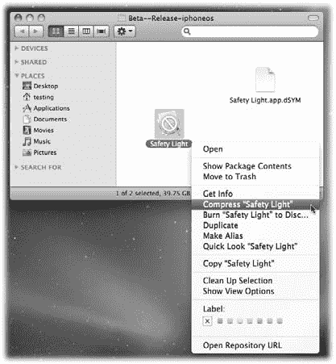

[www.it-ebooks.info](http://www.it-ebooks.info/)

**Beta 测试**

选择你的 beta 版本目标，并进行一次清理构建（第 148 页）。如果一切顺利，不久你就会看到“Succeeded!”


***注意：*** `Flashlight Pro` 项目包含两个 Beta 目标。第一个名为“`Safety Light (Beta)`”，用于构建应用程序。第二个是一个聚合目标，名为“`Beta`”，它使用第一个目标构建应用，生成 ZIP 文件，并将应用上传到下载服务器。

构建完成后，请为你打算发送给测试人员的应用程序创建一个 Zip 文件。进入目标的构建文件夹，你会看到如图 7-3 所示的内容。

***图 7-3：*** 构建完成后，目标的文件夹中包含一个带圆圈反斜杠符号的应用程序以及一个 `dSYM` 文件。Mac 和 iPhone 版本的 OS X 都使用 `Info.plist` 文件。别担心——该符号仅表示 Mac 和 iPhone 使用不同的处理器。带有 `.dSYM` 扩展名的文件包含调试符号。在发送给 Beta 测试人员之前，请先压缩应用程序文件。

***提示：*** 你可以通过查看“`Per-configuration Build Products Path`”来确定目标的构建文件夹。

设备构建的默认值为 `build/Debug-iphoneos` 和 `build/Release-iphoneos`。`Flashlight Pro` 项目会在文件夹名称前添加“`Beta—`”和“`Final—`”，这样你的测试构建就不会与你的 Beta 和最终构建混淆。

**Beta 测试**

创建 Zip 文件的最快方法是在按住 Control 键的同时单击（或右键单击）应用图标，然后从快捷菜单中选择“压缩”。请将此 Zip 文件保存在安全位置，因为你将把它发送给 Beta 测试人员。你可能还需要使用在 `Info.plist` 中使用的相同版本号重命名该文件，这有助于你和 Beta 测试人员追踪多个版本。像 `TiddlywinksPro-1.0b1.zip` 这样的命名方式就很合适。

还记得几页前你保存的那个 `.mobileprovision` 文件吗？是时候把它找出来，与应用程序 Zip 文件一起发送了。然后将 `TiddlywinksPro-1.0b1.zip` 和 `Squidger_Beta_Distribution.mobileprovision` 文件一并附加到发送给 Beta 测试人员的邮件中。

但在发送邮件之前，你还需要再做一次测试。你需要确保你的测试人员能够安装并运行该软件。

**安装**

你的 Beta 测试人员可能没有 Xcode 及其管理工具窗口来安装配置文件和应用。如果你有使用 Windows 的测试人员，他们肯定无法运行这个 Mac 应用程序。那么，诀窍是什么呢？

实际上，有两种方法。第一种也是最简单的方法是使用 iTunes！

**iTunes。** 你的 Beta 测试人员收到你的测试软件后，首先要做的就是解压 Zip 文件。只需在 Finder 中双击该文件，就会出现带圆圈反斜杠的应用图标。此时，安装应用只需将应用程序和配置文件拖放到 iTunes 的应用资料库中即可（图 7-4）。

***图 7-4：*** 测试人员可以使用 iTunes 安装你的 Beta 应用程序和配置文件。他们只需将应用和 `.mobileprovision` 文件拖入 iTunes 的应用资料库即可。

**Beta 测试**

添加到 iTunes 的应用其行为与从 iTunes 购买的应用非常相似。唯一的区别是它们显示的是“`Unknown Genre`”而不是类别名称。你甚至可以使用 `文件` ➝ `显示简介` 来查看版本号。毫不意外，你可以随后将 Beta 应用同步到设备上（图 7-5）。

***图 7-5：*** Beta 应用可以像 App Store 中的任何其他应用一样同步到测试人员的设备。只需确保在开始同步前，应用名称旁已勾选即可。


***注意：*** Windows 上的测试人员可能会对 Zip 文件中的内容感到困惑。Mac OS X 会添加一些额外信息，导致难以在归档文件中找到该应用程序。幸运的是，你可以采取额外步骤来简化此过程：*http://www.markj.net/iphone-ad-hoc-distribution-windows-mac/*。

同步过程还会将配置文件（provisioning profile）移至设备上。你可以通过前往 iPhone“设置”应用中的“通用”➝“设备管理”来检查其是否已正确安装，并核对名称和到期日期。如果看到错误的配置文件，请在设备上将其删除，然后重新同步。任何已过期或重复的配置文件都只会引发问题：最好立即将其清除。

检查正确配置文件已安装后，你应该能够启动手机上的应用程序。检查 Credits 画面以确保安装了正确的版本。（现在你知道为什么有这个视图很有用了吧！）

**224**

iPhone 应用开发：Missing Manual 手册

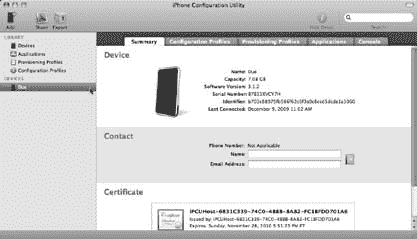

[www.it-ebooks.info](http://www.it-ebooks.info/)

## Beta 测试

***注意：*** 在图 7-5 中，你会看到 Safety Light 在 iTunes 中显示了自定义图稿（应用图标上写有“BETA”字样）。这是通过向 Beta 目标添加一个 `iTunesArtwork` 文件来实现的。该文件是一个 512 × 512 像素的 PNG 文件，但去除了扩展名。

`Flashlight Pro` 项目演示了如何在 Beta 目标中执行此操作。如果你不包含此文件，一切仍能正常运行，但你的测试人员会看到一个通用图标。在图标上添加文字是为了提醒测试人员他们正在使用 Beta 版本。

请确保你**不要**将 `iTunesArtwork` 添加到最终上传至 App Store 的构建版本中。Apple 会在提交后添加此图稿，如果它已经存在，可能会引发问题。

**iPhone 配置实用工具。** 第二个技巧是使用 iPhone 配置实用工具。Apple 在 *http://www.apple.com/support/iphone/enterprise/* 为 Mac 和 Windows 提供了此工具。它最初是为 iPhone 应用的企业部署而开发的，但同样非常适合 Beta 测试人员使用。

***注意：*** Ad Hoc 分发最早是在 2008 年史蒂夫·乔布斯的 WWDC 主题演讲中引入的。它当时被宣传为企业客户分发其应用的一种方式。像你这样的独立开发者另有想法，并迅速将 Ad Hoc 分发用于 Beta 测试。

下载、安装并启动该应用程序后，你会看到一个类似图 7-6 的界面。

***图 7-6：*** *测试人员也可以使用 iPhone 配置实用工具来安装和管理你的应用程序的 Beta 发布版本。此工具可以更轻松地管理多个应用程序和配置文件。选择设备名称（此处为“Due”）后，你可以使用“配置描述文件”和“App”选项卡来安装和移除这些项目。*

使用此实用工具时，请在源列表中选择“App”，然后拖入新的应用程序以更新列表。同样，你可以将 `*.mobileprovision` 文件拖入“设备”显示的列表中。

第 7 章：最后润色

**225**

[www.it-ebooks.info](http://www.it-ebooks.info/)

**Beta 测试**

注册完这两项内容后，切换到源列表中已命名的设备，并使用“配置描述文件”和“App”选项卡进行安装和卸载。与 iTunes 不同，你还可以查看配置文件的到期日期。另一个巨大的优势是，你可以在不进行同步的情况下安装，这对于在工作场所进行测试但设备与家中 iTunes 媒体库绑定的测试人员来说非常重要。

反复如此。除非你运气极好，否则很可能会有不止一个 Beta 版本。你需要为测试人员提供如何更新现有 Beta 安装的建议。对于使用 iTunes 的测试人员，过程非常简单。他们只需将新版本的应用拖入 iTunes 即可。他们会看到一条警告，提示该应用已存在，然后使用“替换”来更新到新版本。


# 若需新的配置文件

若需新的配置文件，测试人员应删除设备上现有的配置文件，然后将新文件拖入 `iTunes`。文件替换前会出现另一条警告。待更新文件就位后，同步操作会将新版本传输到设备上。

如果测试人员使用 `iPhone Configuration Utility` 安装测试版本，他们必须先彻底卸载应用，然后进行全新安装。这会清除所有现有文档，因此游戏分数和其他应用数据将丢失。

**注意：** 添加新版本的应用后，版本号可能显示不正确。若要查看正确信息，需退出并重新启动 `iPhone Configuration Utility`。

## 崩溃应对

你的代码完美无瑕，对吧？没错，每个开发者都这么想，直到那些狡猾的测试人员拿到它。

崩溃难免会发生。而这是件好事——最好在 App Store 的用户发现之前，就抓住那些糟糕的内存引用、缺失的方法以及其他问题。

现在遇到的每个崩溃，都是日后不会重现的隐患。

`iPhone OS` 会记录设备上发生的每一次崩溃。当崩溃发生时，系统会自动生成一个名为*崩溃报告*的文件。通常，当用户与 `iTunes` 同步时，这些文件会被上传到 Apple。还记得应用崩溃后首次同步时 `iTunes` 弹出的对话框吗？当看到“您的设备包含诊断信息……”时，那就是崩溃报告首次被检测到并发送给 Apple。

你可以直接从测试人员那里获取这些崩溃报告。Apple 在技术说明 TN2151 (http://developer.apple.com/iphone/library/technotes/tn2008/tn2151.html) 中描述了该过程。简而言之，测试人员可以从其 Mac 或 PC 的 `iTunes` 中提取 `.crash` 文件，并通过邮件发送给你。然后你在 `Xcode` 中打开 `Organizer` 窗口，将该文件拖入 `IPHONE DEVELOPMENT` 下的崩溃日志列表中。处理完崩溃报告后，数字内存地址会转换为带有行号的类名和方法名，这些行号与你源代码中的行号对应。

**注意：** 此步骤中最重要的是保存 `dSYM` 文件和应用二进制的副本。它必须与你发给测试人员的版本完全一致，且文件必须归档在同一文件夹中。这就是 `Flashlight Pro` 项目能按日期和时间自动保存这些文件的原因。

一旦获得这些信息，通常很容易追踪到错误的根源。

## 整理收尾

在进行测试时，你不应同时进行活跃开发。如果那样做，测试人员面对的就是一个不断变化的目标。冻结功能集并集中精力修复出现的问题，这符合所有人的最佳利益。

鉴于这种“不要碰代码”的指令，测试阶段正是开始整理应用外观的好时机。如果你正在进行本地化，这也是收集翻译文本并分发给测试人员的正确时机。

### 美化委员会

开发者编写优美的代码。设计师绘制精美的图形。图 7-7 展示了开发者制作图形时可能呈现的效果。

**图 7-7：** 开发过程中使用了占位图形的手电筒用户界面。测试阶段可能是清理应用视觉效果的好时机，因为无需修改大量代码即可完成。

而当设计师出手相助时，每个人都受益。请查看图 7-8。

**图 7-8：** 与图 7-7 相同的屏幕，但使用了设计师制作的图形。注意，由专业人士完成的工具栏图标、设置和致谢屏幕看起来要美观得多？这一改进让应用显得精致而完整。


# 项目生命周期中的激动人心时刻

对大多数开发者来说，看到最终图形界面是一个神奇的时刻。你最早随手塞进应用里的粗糙图片被替换掉了，应用瞬间感觉好了千百倍。这对设计师而言同样是一个特殊时刻：她终于能看到自己的像素动起来了。每个人的愿景都得以实现。

作为清理流程的一部分，给设计师提供每个文件的书面说明通常很有帮助。作为开发者，你知道 `ToolbarDiscoStart.png` 是如何被使用的，因为它就在源代码里。但大多数设计师不读代码，所以对她们宽容点；明确说明你的需求。务必指定图形所需的任何特殊尺寸、颜色或位置要求。

**提示：** 手电筒项目的 `Images` 文件夹中包含一份清单文件，它解释了每个图形的用途。这样你可以把整个目录交给设计师，而她也能拿到所需的所有东西。

# 多语言支持

在图 7-8 中，你可能注意到界面显示的是意大利文。

*太棒了！*

Beta 测试也是处理应用中任何本地化工作的好时机。如果你在代码中一直勤勉地使用 `NSLocalizedString()`，那么这项工作相对容易。为你的外语翻译人员创建一个本地化包。这个包包含 `Localizable.strings` 文件和任何需要更新的 NIB 文件。把所有东西放进一个 Zip 文件并发送出去。

# 网站开发

拿到本地化文件后，你可以将它们添加到项目中并执行构建。确保你的翻译人员也参与 Beta 测试，因为他们需要检查最终结果。你肯定不希望有任何 *蠢货* 漏网！

一旦你更新了图形并启动了本地化工作，就可以开始考虑为产品建立推广网站。有些开发者认为他们需要的唯一推广就是 iTunes 本身。对于一些简单的产品，这种方法效果不错。但如果你有一个稍显复杂的产品，就需要一种方式向潜在客户展示其功能。

App Store 只允许你展示五张截图，并且无法展示产品运行中的视频。一旦人们看到你的产品有多棒，他们就会想购买。一个产品网站能让你比在 iTunes 内更详细地解释产品。

在这项工作中，请与你的设计师和市场人员合作。同样重要的是，要意识到为网站开发视觉效果和销售文案需要时间。这就是为什么你应该尽早开始这项工作。

## 网站结构

作为开发者，你可以通过搭建一些基本元素来帮助大家。

例如，用 HTML 搭建网站的基本结构，并设置好网页服务器来托管文件。

**注意：** Missing CD（`www.missingmanuals.com/cds`）包含了 Safety Light 网站的 HTML 和 CSS 源代码。它被设计为可适应多种不同类型的应用，因此你可以随意将其用于你自己的产品。

在建设这个网站时，务必记住：*许多* 用户会通过 iPhone 或 iPod touch 访问。你需要确保你设计的任何方案都能在小屏幕格式上正常工作。令人惊讶的是，有多少开发者从未在自己的设备上打开过产品网站！

### 内容

大多数情况下，iPhone 可以显示与桌面浏览器相同类型的图片。但要注意如何呈现这些图片。避免使用 JavaScript 对截图进行花哨的缩放操作：缩放会慢得令人沮丧，而且在设备上不经过捏合操作，“全窗口”显示很难导航。


在网站上，一行额外的 HTML 代码也非常重要：

`<meta name="viewport" content="width=999" />`

这行代码向 Safari 提示你网站的宽度，以便它优化显示。将“999”替换为你希望网站加载时缩放到的实际宽度。你可以在 A List Apart 的这两篇文章中了解这些技巧以及网络开发者可对移动版 Safari 使用的许多其他技巧：

- `http://www.alistapart.com/articles/putyourcontentinmypocket/`
- `http://www.alistapart.com/articles/putyourcontentinmypocketpart2/`

花几分钟熟悉一下移动版 Safari 的功能——你的未来客户会因此感谢你。

## 电影

如果你要在产品网站上包含一段电影，你*必须*遵循一条规则：不要使用 Flash。iPhone 上的 Safari 无法显示它，因此所有为产品制作精彩介绍的工作都将白费。

相反，请使用`QuickTime`来创建电影。该应用程序（如图 7-9 所示）可以接受单一电影，并针对桌面和移动设备显示进行优化。

导出过程还会生成一些 HTML 和 JavaScript 代码，方便你将输出内容整合到网站中。你指定的输出文件夹包含一个`ReadMe.html`文件（图 7-10），其中包含详细信息。

另一种播放电影的方式是使用 YouTube。是的，即使 YouTube 使用 Flash，你也没有违反规则。YouTube 会将你上传的电影转换为不同的文件格式。在桌面上观看时，电影会在 Flash 播放器中显示。而在 iPhone 上，则使用 H.264 视频——与 iPhone 的 YouTube 应用程序中使用的格式相同。虽然你对演示的控制能力会降低，但 YouTube 可以是一种廉价且有效的产品推广方式。

**230**

iPhone App 开发：缺失的手册

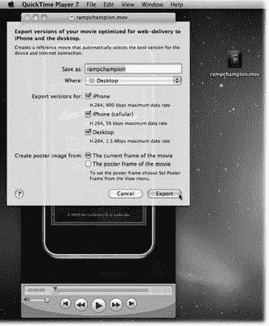

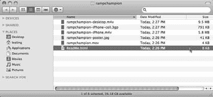

[www.it-ebooks.info](http://www.it-ebooks.info/)

**网络开发**

***图 7-9：***  
*电影* `rampchampion.mov` *正在被转换为与桌面和 iPhone（通过无线和蜂窝网络）兼容的格式。生成的文件被放置在 Mac 桌面上的一个名为* `rampchampion` *的文件夹中。*

***图 7-10：***  
*导出到* `rampchampion` *文件夹中的文件。注意桌面文件大小为 9.5 MB，而针对蜂窝网络 iPhone 的文件仅为 791 KB。在浏览器中打开* `ReadMe.html` *文件，你将看到展示如何在网站上使用这些电影的代码示例。*

第 7 章：最后修饰

**231**

[www.it-ebooks.info](http://www.it-ebooks.info/)

**App Store，你来了**

## 跟踪

当客户开始访问你的产品网站时，你会想知道有多少人访问以及他们从哪里来。这些信息将指引你找到评论你应用程序的网站、在 Twitter 上提及它的人以及在线论坛的评论。你会非常清楚地了解人们对你作品的看法。

跟踪网站访问者的最佳方法是使用名为 Mint (`http://haveamint.com`) 的产品。这个简单的系统通过在你的 HTML 头部添加一行 JavaScript 代码来记录网站的所有访问者。你需要 PHP 和 MySQL 才能安装此产品，但大多数网络托管公司都会免费提供。

要了解它的工作原理，你可以查看 Safety Light 应用程序的网站统计信息 (`http://safetylightapp.com/mint/`)。不必担心你的竞争对手能对你的网站这样做：标准的 Mint 配置使用密码来保护这些信息。此站点上已启用此功能，仅用于演示其能力。

**App Store，你来了**

当你的 Beta 测试正在进行时，这也是连接到 iTunes 的最佳时机。当测试人员对产品进行全面测试时，你可以开始准备将其上架销售所需的工作！

是时候访问另一个为 iPhone 开发者服务的 Apple 网站了……


**232**

**iPhone 应用开发：缺失的手册**

[www.it-ebooks.info](http://www.it-ebooks.info/)

# 章节

## 待售

你的 Beta 测试进展顺利，所以现在是时候将注意力转向如何销售最终产品了。iTunes 上有超过 10 万个应用程序，现在轮到你的应用加入它们了。

本章将向你介绍 `iTunes Connect`，这是一个能访问 App Store 中产品数据库的 Web 应用程序。你将使用浏览器来设置财务细节、提供应用信息、设定或更新定价，以及上传最终版本。

你还会遇到苹果公司对每个提交的审核流程。这是 iPhone 开发中比较令人沮丧的领域之一，因此本章将向你展示如何让这个过程更顺畅。

### 签约落笔

你在 `iTunes Connect` 中要做的第一件事，就是与你的新合作伙伴处理法律合同和银行信息。

#### 欢迎

要登录 `iTunes Connect`，请在浏览器中访问 `http://itunesconnect.apple.com`。

花点时间将这个网址加入书签——你会经常用到它。在登录屏幕上，输入你的 iPhone 开发者中心用户名和密码。

> **提示：** 如果你已经登录了开发者网站，只需点击主页右侧栏中的 `iTunes Connect` 链接即可。无需再次登录。

**233**

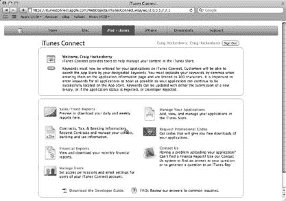

[www.it-ebooks.info](http://www.it-ebooks.info/)

### 签约落笔

登录后，你会看到一个表单，要求你接受网站的条款与条件。你只在首次使用 `iTunes Connect` 或苹果更改合同时才会看到此页面。如果你想将你的应用放入 iTunes，请接受这些条件。

进入 `iTunes Connect` 后，你会看到一个类似图 8-1 的屏幕。

> **图 8-1：** `iTunes Connect` 主屏幕，用于管理在 App Store 上分发应用的所有详细信息。某些项目仅在添加或更新应用时使用，而另一些则可能每天都会用到。首先要做的是设置合同、税务和银行信息。

#### 首要事务

首要事务是设置你的合同、税务和银行信息。当你注册 iPhone 开发者账户时，仅提供了联系信息。但商业合作涉及的内容远不止了解彼此的身份。现在是时候让律师、政府和金融机构参与进来了！

点击 `iTunes Connect` 主页上的“合同、税务和银行信息”链接开始准备。加载此页面后，你会看到你已经有一份生效的合同。当你注册成为 iPhone 开发者时，苹果给了你一份在全球范围内分发免费应用的合同。如果你不想从 iTunes 赚钱，那么你就算完成了！

##### 合同

与大多数涉及金钱的事情一样，如果你想让苹果支付费用，情况会稍微复杂一些。打开`请求合同`复选框，然后点击`提交`。

（如果你开发团队中的其他人负责处理法律事务，那么应由该人完成这些步骤。）

**234**

iPhone 应用开发：缺失的手册

[www.it-ebooks.info](http://www.it-ebooks.info/)

### 签约落笔

一旦你提交请求，就会看到苹果向你提供的合同——付费应用。该合同指定苹果作为你的代理人/佣金商来销售和分发你的软件，不拥有所有权权益。你同意提供许可应用并支持最终用户。合同还规定了苹果的佣金（30%）、如何在全球范围内收税，以及你的付款时间（月结后 45 天内支付）。

> **注意：** 与任何合同一样，你和你的律师应审查整个文档。上一段只是概述。

如果你和你的律师接受这些条件，请点击`同意`复选框并提交表单。你会看到一个确认屏幕，并且合同 PDF 将通过电子邮件发送给你。点击`完成`返回合同设置屏幕。

##### 联系信息

设置合同的下一步是添加额外的联系信息。`iTunes Connect` 允许你为组织中的不同人员分配特定角色。例如，你的财务部门可以访问财务报告，而市场部门可以生成促销代码。

1. 在你的合同`联系信息`中，点击`编辑`。

   下一个屏幕会显示你公司的法律地址以及 `iTunes Connect` 中的角色。目前，只需将所有角色分配给自己即可。随着需求的出现，你可以点击主屏幕上的`管理用户`，创建具有新 Apple ID 的新用户。

2. 要创建你的联系信息，请点击`新增人员`，然后输入你的 `iTunes Connect` 用户名和电子邮件地址。添加你的职位和电话号码，然后点击`创建`。

   你将返回到联系信息页面。

3. 对于`高级管理`、`财务`、`技术`、`法律`和`促销`角色，请从下拉菜单中选择你的名字。

完成后，点击`提交`按钮进入下一步。

##### 银行信息

联系人确定后，你需要告知苹果将每月获得的收入存入何处。资金将通过两种方式存入：

- **ACH。** 使用自动清算所的标准电子存款。此方式仅适用于美元收入。来自“Apple Inc.”的存款是来自美国 iTunes 商店的收益。你还会看到来自“iTunes S.A.R.L.”的存款，用于那些没有自己的 iTunes 商店的国家。

**235**

从 Wow! eBook 下载

[www.it-ebooks.info](http://www.it-ebooks.info/)

### 签约落笔

- **SWIFT。** 使用环球银行金融电信协会的电汇。来自澳大利亚、加拿大、欧洲、英国和日本 iTunes 商店的收益通过此机制存入。此转账也会按当前汇率将任何外币兑换成美元。不幸的是，许多银行不提供交易来源或所用汇率的信息，这使得核对你的记录变得困难。

两种转账方式都需要一个账号才能完成存款。

ACH 转账使用九位数的 ABA 路由号码来确定资金将存入何处。SWIFT 代码用于外国金融机构之间的电汇。

你可以从你的银行获得 ABA 路由号码和 SWIFT 代码。（查看你银行网站上的支持页面：你不是第一个需要它的人。）一旦掌握这些信息，你就可以填写银行信息表：

1. 在“管理你的合同”屏幕上，在“银行信息”下，点击`编辑`。

   你将进入主“银行信息”屏幕。

2. 要开始设置你的银行信息，请点击`添加地址`。输入你账户所在银行的邮寄地址。点击`提交`。

   你应该可以从上一封银行对账单中获得此信息。

3. 输入你的账户信息。

   选择账户使用的货币，然后填写银行和账户持有人的名称字段。选择`账户类型`：你可能希望使用支票账户，以便轻松支取存款。

   其余四个字段特定于你的账户。你可能已经知道你的账号和分行。如上所述，你也可以轻松获得 ABA 号码和 SWIFT 代码。

4. 仔细检查所有信息。

   真的。然后再次检查。如果有任何错误，你将无法收到付款，而且更新信息是一个繁琐的手动过程。

5. 点击`提交`。

   最后一步是证明你输入的信息真实准确，并授权苹果向你的账户付款。


# 6. 勾选复选框，最后核对一遍信息，然后点击**提交。**

## 在虚线处签名

### 税务信息

你正在赚钱——毫无疑问——政府想知道这件事。设置付费应用合同的最后一步是提供你的税务信息。由于苹果公司代表你收取商品销售款项，因此美国国税局要求他们报告这笔收入。他们通过以电子方式代表你提交 W-9 表格来完成此操作：

1.  在“管理你的合同”主屏幕上，在“税务信息”下，点击**编辑**。
2.  输入你在纳税申报单上显示的姓名。如果你有与之不同的企业名称，也请一并输入。
3.  如果你是独资经营者，请从下拉菜单中选择**个人**。否则，选择相应的商业实体类型。
4.  对于**免税收款人**单选按钮，请咨询你的会计师。你可以从美国国税局网站（`www.irs.gov`）下载 W-9 表格的 PDF 文件：其中详细说明了免税条件。
5.  从下拉菜单中选择你的地址。如有必要，请点击**添加地址**来指定一个新地址。
6.  最后，输入一个 TIN（纳税人识别号）。

如果你是个体，请使用你的社会安全号码。对于企业，请使用雇主识别号。只需输入数字，不要包含任何破折号或其他字符。

7.  勾选复选框以确认信息正确，然后点击**提交**。

### 最终批准

你的合同已准备好由苹果公司处理。回到“管理你的合同”屏幕，你会看到“设置进行中”旁边有一个绿色的勾选标记，但你仍需等待几天，你提交的信息才会被批准。一旦所有事项都处理完毕，你会看到“你生效中的合同”下出现一个新条目。恭喜你，现在你已经准备好通过 iTunes 赚钱了！

***提示：*** 不要等到最后一刻才处理这项重要的电子文书工作。如果你提交的信息出现任何问题，批准过程可能需要超过几天的时间，并打乱你的发布计划。

合同列表下方还有几个针对加拿大和澳大利亚开发者的额外链接，他们需要提交额外的税务信息。还有一个非常重要的链接被许多开发者忽略了——日本税收协定信息。不点击这个链接可能会让你损失一大笔钱！

## 维护你的权益

如果你不向日本税务机关提交一些额外的表格，你的收入将被征收 20%的预扣税。你在日本每赚 1 美元，就有 20 美分被留下。提交这些表格是一个繁琐的过程，可能需要长达 90 天才能完成，但最终，每年可能价值数百甚至数千美元。一旦你的合同生效，记得查看“管理你的合同”页面底部的链接。

另一个你应该尽快完成的 iTunes Connect 任务是开始添加你的应用元数据。你需要提供控制你的应用在 App Store（无论是在 iTunes 内还是设备上的应用程序中）中如何显示的信息。

在单次会话中提供所有这些信息是可能的，但分批处理更容易、也更安全。不要害怕在首次添加应用时留下占位数据。随着发布日期的临近，你可以对数据进行更新。

***注意：*** App Store 的流行有时会导致 iTunes Connect 响应缓慢。分批处理可以降低浪费时间以及已录入数据的风险。

此外，由于元数据变更经常发生，一些开发者会在版本控制系统中跟踪变更。你可以查看`Flashlight Pro`项目中的`iTunes`文件夹，了解这类系统的一个示例。

当你将信息录入 iTunes 时，请牢记一个重要事实：这些数据帮助客户找到并购买你的应用。确保信息清晰、简洁且正确。

要开始输入你的元数据，请转到 iTunes Connect 的主屏幕（图 8-1），然后选择“管理你的应用程序”。在左上角，点击**添加新应用程序**按钮。

### 出口合规性

当你添加一个新应用时，第一个问题可能看起来有些奇怪：“你的产品包含加密功能吗？”

由于 iTunes 将使你的应用在全球范围内可用，苹果会将其出口到美国境外。如果你的产品具有加密数据的能力，则适用特殊的出口要求。页面上的链接提供了更多信息。

如果你的产品依赖于系统设施来管理加密数据，例如使用钥匙串 API 管理用户的私人数据，或使用安全套接层进行网络连接，你可以选择**否**。苹果已经授权了 iPhone 操作系统的这些部分用于出口。

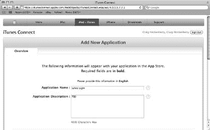

对于确实包含加密功能的产品，你需要提供商品分类裁定副本作为提交材料的一部分。

### 概览

添加一个新应用需要填写多个屏幕的信息。第一个屏幕是“概览”，它提供了应用的基本信息（图 8-2）。

***图 8-2：*** *你添加到 iTunes 的第一件事就是你的应用概览。有很多字段需要填写，但接下来的部分将帮助你完成。*

#### 应用名称

概览中的第一个字段是你的应用名称。该字段必须是唯一的：App Store 中没有两个产品拥有完全相同的名称。

一些开发者通过对名称进行细微调整来规避这一点。你会在 App Store 上找到“手电筒”、“手电筒。”、“手电筒 .”和“手电筒™”。这种方法的问题在于会给客户造成困惑：如果朋友推荐“手电筒”，他说的是哪一个？

***注意：*** 此字段不区分大小写，因此`"手电筒"` 行不通。而且你就错过了一个让自己变得出色的机会。

同样重要的是要记住，“应用名称”字段不需要与 iPhone 主屏幕上显示的名称匹配。你可以使用像“安全之光 – 世界上最好的手电筒”这样的名称，但这么长的名称在 App Store 的许多屏幕中会被截断。

最好的方法是让你的名称简短明了。“安全之光”这个名称最能表达这款应用的独特功能——救援信标。任何提及该应用名称的推广或评论，都能让潜在客户更容易在 iTunes 中找到它。

因为你的产品名称必须在成千上万个其他名称中保持唯一，所以尽快开始在 iTunes Connect 中添加数据是个好主意。一些开发者甚至在写一行代码之前就创建一个占位应用。确保获得你想要的名称也能防止营销工作中的最后一刻意外：在最后一刻更改宣传材料上的名称可能代价高昂！

关于应用名称，还需要注意的一点是，一旦进入审核阶段，你就不能更改它。你只能在更新你的应用并上传新版本时更改它。

#### 应用描述


# 大多数开发者会将应用的初始描述设置为“待定”或其他占位符。此处填写的内容取决于你打算如何营销该产品。在产品进入 iTunes 数据库的早期阶段，你可能尚未明确该描述信息。

因此你将其推迟到以后处理。只需记住，在提交最终产品以供审核时，你需要提供真实的描述。如果你的描述仍是“待定”，应用将无法通过审核。

就描述本身而言，请保持简短精炼。初始屏幕上只会显示前三行文本。iTunes 中的许多用户不会费心点击“更多…”来查看额外信息。而冗长的描述会在设备的 App Store 应用中造成大量滚动。

描述文本可以是任何 Unicode 字符。这意味着你可以使用符号，例如项目符号 (•)、星号 ( ) 和其他装饰符号 (♥ 和 •)。只需记住，这些字符中的许多在桌面端显示效果与在设备上不同。

Emoji 字符就是一个很好的例子：它们在桌面版的 iTunes 中根本不会显示。

另外，避免在描述中使用价格。在某些情况下，这甚至可能导致应用在审核期间被拒绝。问题在于，如果你写上“价格降至 99 美分”，这对身处法国的用户毫无意义，因为那里的 App Store 以欧元显示价格。

**提示：** 为了你和潜在客户着想，在提交描述之前请检查拼写。

## 声明你的权利

如果你因发布新版本而更新应用描述，请记住，相关信息会在当天更新到 iTunes，而不是在新版本获批的那天。如果你要列出新增功能，请在其出现在 iTunes 中之后再进行更新。

### 设备能力

在提供你的应用描述后，你会看到一个问题：“你是否希望将应用限制为仅能在具有特定功能的设备上运行？”你需要回答“是”或“否”，但实际答案并不重要。

如果你点击“是”单选按钮，你会看到一个指向在线文档的链接，其中描述了 `Info.plist` 文件中的 `UIRequiredDeviceCapabilities` 键的工作方式。这些按钮不会以任何方式影响你的应用信息；这只是苹果公司引导你阅读“细则”的方式？

当你的应用的 `Info.plist` 中未列出 `UIRequiredDeviceCapabilities` 键时，iTunes 上的所有客户都能下载它。这是最佳目标，因为这样最广泛的人群都能购买并享受你的应用。但有时你的创作会依赖特定的硬件功能。

对于这些情况，你需要指定一组字符串，列出你的应用所需的功能。例如，你可以在 `Info.plist` 中指定如下内容：

```
<key>UIRequiredDeviceCapabilities</key>
<array>
    <string>still-camera</string>
    <string>magnetometer</string>
</array>
```

`still-camera` 字符串表示，除非设备能够拍照，否则你的应用将无法正常运行。iPod touch 用户将无法启动该应用，因为该设备没有摄像头。同样地，`magnetometer` 字符串表示你的应用需要具备确定方向的能力。较旧款 iPhone 的用户将无法使用该应用，因为指南针功能仅在 3GS 机型上才可用。

**提示：** 要了解更多关于设备功能的信息并查看完整的功能字符串列表，请使用文档查看器搜索 `UIRequiredDeviceCapabilities`。

当你将应用二进制文件上传到 iTunes 时，系统会检查 `Info.plist` 文件的内容。App Store 提交流程中的这最后一步会将硬件需求与你的其他应用数据一同存储。此信息将防止客户在不满足要求的设备上安装该应用。

你可能倾向于忽略设备功能信息，让所有客户都能下载和安装你的应用。这样你确实能拥有最多的潜在买家，但如果存在不兼容问题，这也将确保你遇到最多的客户支持问题。

在就应用的硬件需求做出任何决定之前，请确保你已在一系列设备上测试了该应用——即使这意味着你需要去 eBay 购买一台初代 iPod touch。

### 类别

主类别菜单决定了你的应用在 iTunes 中的显示位置。

你的应用会作为新发布版本出现在所选类别的热门下载列表中。在某些情况下，类别也会显示在应用图标和名称下方。

次要类别是可选的，仅在 iTunes 的强力搜索功能中起作用。你的应用不会同时被列在两个类别中。将其设置为相关类别即可，但不要指望这能让看到你产品的客户数量翻倍。

### 版权与版本

接下来的字段是会在产品页面上显示的版权与版本信息。对于版权，请输入年份和你的公司名称：例如“2010 Squidger Industries”。如果你没有添加 © 符号，系统会在文本开头为你自动添加一个。

版本号应仅包含数字和句点：例如“1.0”或“1.0.1”，而不是“1.0 最终版”或“版本 1.0”。

### SKU 编号

SKU（库存单位）编号可以是任何你想要的数字和字母序列。唯一的要求是该值在你的开发者账户中必须是唯一的：你不能有两个产品使用“OMGWTFBBQ001”作为 SKU。

请谨慎选择此字段的值：一旦提交了某个值，你在任何情况下都无法更改它。

你会发现这个 SKU 编号在月末财务报告中会作为供应商标识符出现。你可能希望用这个值来排序或筛选数据，因此在做选择时要考虑到这一点。

### 关键词

关键词，连同应用名称和公司名称，是 iTunes 在用户搜索时寻找匹配应用的方式。没有关键词，搜索“手电筒”或“SOS”将不会在 Safety Light 应用上返回任何结果。

输入关键词时，请用逗号分隔每个词。该字段的字符数限制为总共 100 个，因此请明智地选择你的关键词。使用文字处理软件有助于检查关键词长度：Bean 是一个不错的选择，因为它在你输入时会显示窗口底部的字符数。你可以免费下载它：`http://www.bean-osx.com/`。

与应用名称一样，你可以在最终二进制文件提交之前编辑你的关键词。一旦该文件上传，关键词就会被固定下来，直到你的下一个版本。仔细考虑你在应用描述中使用的词语。试着站在客户的角度思考；想想他们可能会如何搜索你的应用。

避免使用某些关键词：任何冒犯性词语或商标名称都会导致你的应用被拒绝。同样，如果你使用其他流行应用的名称来欺骗用户找到你的产品，你将遭遇审核流程的反对。如果你运用常识且不试图钻空子，你就没问题。

### URL 和电子邮件


下一组输入字段用于填写您的网址和支持邮箱地址。`Application URL`字段并非必填，但强烈建议填写，因为它是 iTunes 中（在应用描述下方）首先显示的链接。该 URL 的文本标签会根据您的 iPhone 开发者账户信息自动生成。如果您拥有公司账户，您会看到类似“Squidger Industries Web Site”的内容；而个人账户，例如，则会显示为“Al Czervik Web Site”。如果您有一个展示您所有在 App Store 销售产品的网站，那么它就很适合填入此字段。

另一方面，`Support URL`是必填字段，应指向一个客户可以获取有关您产品更多信息的页面。同时，请在该网页上提供一个邮箱地址或某种联系表单——这将是客户联系您的唯一途径。

**提示：** `Support URL`也会出现在设备上的 App Store 应用中。遗憾的是，它并非可点击的链接，因此用户访问您产品网页的难度更大（且可能性更低）。

那么下一个字段`Support Email Address`呢？客户不能通过您在此输入的值给您发送电子邮件吗？遗憾的是，Apple 仅会在*他们*需要就应用相关事宜联系您时使用此邮箱地址。

## Demo Account

另一个可选字段是“Demo Account – Full Access”。您在此提供的信息旨在帮助 Apple 的审核人员评估您的应用。如果您的应用需要与需要登录的网络服务（例如在线排行榜或社交网络）通信，那么您需要为审核人员提供访问信息。

## EULA

某些应用需要自定义最终用户许可协议（EULA）。概览屏幕底部的链接允许您指定您的法务部门要求的任何特殊条款。

**明确声明**

您提交的许可协议不能包含任何标记格式——仅限文本和换行符。如果您提供了自定义的`EULA`，则在产品页面上，支持链接旁边会出现一个标有“Application License Agreement”的链接。在 App Store 应用中，类似的链接位于滚动列表的底部。

如果您未指定`EULA`，则将适用 Apple 的标准许可协议。（概览屏幕底部有一个查看此文档的链接。）

**继续之前**

在点击屏幕底部的`Continue`按钮之前，您需要为所有必填字段提供数据。同样，如果您尚未准备好所有必要数据，可以填写“TBD”或其他占位符。除了版本和 SKU 编号之外，所有值在您提交最终二进制文件之前都是可编辑的。

如果出现任何验证错误，它们会以红色显示在屏幕顶部。最常见的错误是应用名称已被其他开发者使用。如果看到此错误，请尝试提交另一个名称。这个过程既是一项营销活动，也是一项技术工作，因此请务必从您组织中的其他人那里获取意见。

## Ratings

完成概览后，下一步是为您的应用评级。如果您的应用包含任何淫秽、色情、攻击性、诽谤性或 Apple 不认可的其他内容，它将无法在 App Store 中上架（图 8-3）。

**图 8-3：** iPhone 和 iPod touch 均设有家长控制功能。通过对您的应用进行评级，您可以让家长限制其孩子接触不适宜的内容。

**明确声明**

即使您的内容并无不妥，也仍然需要评级。这是因为 iPhone OS 具有家长控制功能。例如，家长可以将其孩子的 iPod touch 配置为仅安装具有相应评级的内容。要了解这些控制功能的工作原理，请打开 iPhone 上的`Settings`应用，并导航至`General ➝ Restrictions`。

一旦启用“访问限制”，家长可以在“允许的内容”部分指定“不允许应用”、“4 至 17 岁或以上”或“允许所有应用”。用户更改这些设置时需要输入密码。

设置评级非常简单：只需根据您应用中不同类型的内容选择相应的单选按钮即可。每种类型的内容要么是“无”，要么是“偶尔/轻微”，要么是“频繁/强烈”，整体评级将随您的选择而更新。

如果您看到“No Rating”，Apple 将不允许该应用在商店中上架。如果您的内容处于可接受范围的边缘，那么在应用设计阶段尝试调整这些单选按钮是个好主意。与应用名称和关键词一样，一旦您提交了应用二进制文件，就无法再更改评级。您可以在每次提交新版本时更新它们。

对评级满意后，点击`Continue`进入下一个屏幕。

## Upload—Show It Off

现在是真正展示您应用的时候了！`Upload`标签页（图 8-4）是您提交应用图标和截图的地方，客户在购买前会通过这些来了解您的应用。

**图 8-4：** iTunes Connect 中的`Upload`标签页允许您提交应用图标和其他图形文件。您可以点击每个项目下的预览链接，以确保文件正确传输。同时，请确保“Upload application binary later”复选框处于选中状态。

**明确声明**

### Application binary

通过选中“Upload application binary later”复选框，跳过上传第一个文件“Application”，原因如下：

-   **您希望尽快将元数据录入 iTunes。** 这意味着您可能甚至还没有要提交的应用二进制文件：甚至在开始 Beta 测试之前就开始进行设置的情况并不少见！
-   **iTunes Connect 历来不太可靠。** 众多开发者与一个不断演进的系统上的高负载相结合，导致比任何人期望的都更多的停机时间。上传应用二进制文件可能需要一段时间，如果在此期间出现任何问题，您将丢失已输入的其他元数据。

此页面上唯一必填的项目是“Large 512 × 512 Icon”和主截图。即使您没有这些文件的最终版本，也可以上传占位图形，并随着发布日期的临近进行替换。

### Application icon

应用图标图形比您在代码中使用的 57×57 像素图标要大得多。如果您的设计师使用能够生成矢量图形的插图软件制作了图标，那么放大该图像将很简单。如果不是，他们则需要做一些额外的工作。您不希望放大非矢量图形，因为它会变得像素化且模糊；这会给您的客户留下非常糟糕的第一印象。

当然，使用这个独立图形的好处在于它不必与 iPhone 主屏幕上显示的图标完全相同。许多开发者在促销期间会将“ON SALE”和其他促销信息放在此文件上。

请记住，这个 512×512 的图形会被显著缩小。请确保任何文本或细节在缩小尺寸后看起来仍然良好。

此图形仅在桌面端的 iTunes 中使用。设备上的 App Store 使用应用中相同的 57×57 像素图标。您使用的所有促销徽章，大多数潜在客户都不会看到。


***提示：*** 你甚至可能希望在测试版构建中将此图片作为`iTunesArtwork`包含在内。正如第 225 页的注释中所解释的，Flashlight Pro 项目展示了如何做到这一点。

要上传你的图标，请点击“选择文件”按钮，然后找到你的 TIFF 或 JPEG 文件。此文件不应包含任何图层或透明度。

成功上传图片后，你会看到一个复选框图标。你还会看到文件名与一个链接一起显示，该链接会在新窗口中打开图片。点击此链接以验证图片是否正确上传。

**246**

《iPhone 应用开发：缺失的手册》

[www.it-ebooks.info](http://www.it-ebooks.info/)

**宣告你的主张**

*屏幕截图*

上传主屏幕截图的过程与应用图标相同。唯一的区别在于可上传文件的大小。

你可以提交带顶部状态栏或不带状态栏的屏幕截图：尺寸为 320 × 480 或 300 × 480 像素，格式为 TIFF 或 JPEG。文件可以是竖向或横向模式：iTunes 和 App Store 应用会在你的产品页面上正确显示这些文件。此图片始终会首先显示在你的产品页面上。

上传额外的屏幕截图是可选的，但如果你不使用它们，那可就太不明智了。大多数客户会使用这些图片来评估你的应用是否适合他们。你能提供的视觉信息越多越好。

这些额外屏幕截图的上传过程有点令人困惑。你需要点击“选择文件”来选择每个图片，然后点击“上传文件”一次性提交所有图片。棘手的部分在于让屏幕截图按正确顺序排列。你试图通过它们讲述应用的故事，如果截图顺序错了，情节就会令人困惑。

开发者常犯的另一个错误是，他们按照应用内的顺序来展示屏幕截图。人们不想看到游戏设置或登录屏幕——他们想看的是应用的操作和炫酷功能。如果你有帮助屏幕，这些也是不错的选择，因为它们能以图形丰富的方式展示你的应用是如何工作的。

一旦你确定了想要的截图顺序，请按照与在 iTunes 中显示顺序*相反*的顺序来选择文件。假设你有四个额外的屏幕截图：

**1.** 点击“选择文件”，在文件对话框中选择你的第四个（最后一个）屏幕截图；点击“选择”。

**2.** 再次点击“选择文件”，用你的第三个屏幕截图重复此过程。

**然后对第二个和第一个额外屏幕截图执行相同操作。** 这些文件随后应以上传文件按钮上方的正确顺序列出。

**3.** 如果是这样，点击“上传文件”按钮。

**4.** iTunes Connect 会将文件传输到 iTunes。你可以点击“全部清除”并重新开始。

***提示：*** 在这里保持头脑清晰的最简单方法是给屏幕截图编号命名。你的主屏幕截图是`0.jpg`，第一个额外屏幕截图是`1.jpg`，以此类推。这样，在你选择文件时，可以轻松看出`1.jpg`之后是`2.jpg`。

点击“继续”，你就完成了应用文件的上传。请记住，你可以随时返回此屏幕并更新图片，即使你的产品已在 App Store 中发布也是如此。

第 8 章：待售

**247**

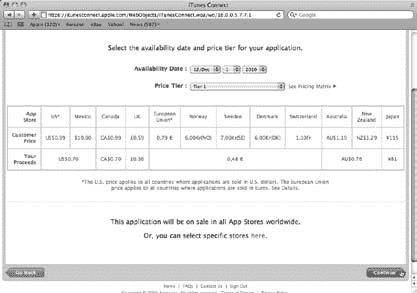

[www.it-ebooks.info](http://www.it-ebooks.info/)

**宣告你的主张**

定价——选择你的价格

定价选项卡上只有两个字段（图 8-5），但它们非常重要，且难以设置正确！

***图 8-5：** *iTunes Connect 中的定价选项卡只要求提供两项信息，而这两项都非常重要。“上市日期”控制产品发布的时间，最初应设置为一个遥远的未来日期。“价格等级”的选择则控制你从每次销售中获得的收入。该选项卡会以每种货币显示摘要。*

*上市日期*


iTunes 的默认行为是让您的新版本立即上架。要控制应用的发布日期，请选择一个远期未来的可用日期。

给自己留出足够的时间来选定具体日期，并围绕该日期协调营销工作。考虑好发送评测版本、发布新闻稿以及部署推广网站的时间。如果在半夜某个随机时间发布，最终只会落得个无人问津的下场，而不是成功发布。

通过设置一个未来的日期，您就有机会把一切安排妥当，并将设置更新为实际发布日期。

选择发布日期时的另一个重要因素是：它不会发生在您以为的那一天。人们很容易忘记 iTunes 是一家全球性企业。您可能住在加利福尼亚，但您的许多客户在新西兰，他们比您离国际日期变更线近得多。

当您将`可用日期`指定为`“2009 年 10 月 22 日”`时，可能会惊讶地发现，在发布前一天的凌晨 4 点，人们就开始访问您的网站并给您发送支持邮件。iTunes 确实按照您的要求在 22 日让应用在新西兰上架了，但您不知道新西兰比您的当地时间快 20 小时。哎呀！

**248**

iPhone 应用开发：遗失的手册

[www.it-ebooks.info](http://www.it-ebooks.info/)

# 确定时间

要搞清楚实际发布时间，请使用在线时区转换器：[`www.timeanddate.com/worldclock/converter.html`](http://www.timeanddate.com/worldclock/converter.html)。选择新西兰奥克兰的午夜作为转换的起始时间和地点，并选择您的位置作为目标地点。如果您在美国，那将是凌晨的某个时间。请据此安排您的睡眠计划。

# 价格等级

选择可用日期后，为您的应用挑选一个价格。同样，由于 iTunes 在全球运营，您并不是以美元和美分来定价的。相反，Apple 使用`价格等级`——一组等价的定价级别。

第一个选项是`免费`，选择它意味着您将无法从应用下载中直接获利。（不过，您仍然可以通过应用内购买和广告来赚钱。）

如果您选择`等级 1`，您的应用在美国将售价 99 美分，在欧洲售价 0.79 欧元，以及其他外币的等价价格。每个等级大致相当于一美元，直到更高的等级。（`等级 85` 在美国意味着 999.99 美元！）选择等级后，各种货币的金额以及您每次销售的收入将一同显示。

当然，最困难的部分是弄清楚应该为您的应用收取多少费用。下一节将介绍一些可能影响您决策的市场因素。现在，只需选择一个您认为合适的价格等级，然后点击`继续`前进。

# 本地化

您已经努力编写了出色的应用描述，因此请选择相关的关键词，并展示应用中最优质的图片。不要忘记英语以外的其他语言。否则，多达 40% 的潜在客户可能永远找不到您的应用。当西班牙的某个人搜索`literna`时，您要确保他能找到您的手电筒应用！

同样，要在 iTunes 上取得成功，您需要具备全球视野。您的很大一部分客户群体并不说您所说的语言。您只有很短的时间来吸引他们的注意力：让您的营销信息易于阅读。

`本地化`标签页允许您为以下项目提供翻译：

- 应用名称和描述
- 关键词
- URL 和电子邮件
- 主要和附加截图

iTunes Connect 支持多种不同的本地化语言，但将您的营销材料翻译成日语、法语、德语、西班牙语和意大利语，能让您的投入获得最大回报。

第 8 章：待售

**249**

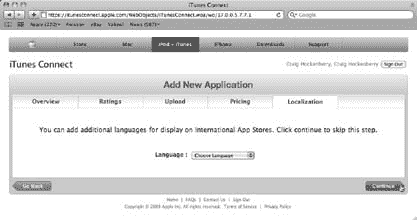

[www.it-ebooks.info](http://www.it-ebooks.info/)

**确定时间**


# 要输入翻译内容，请从弹出式菜单（图 8-6）中选择一种语言，然后输入任何需要变更的值。除非另有指定，否则产品页面上将显示英文版的截图图像。输入本地化值后，点击`添加其他语言`返回语言选择菜单，或点击`继续`完成元数据的录入。

**图 8-6:**  
*使用“本地化”标签页以不同语言提供您的应用信息。通过弹出式菜单选择语言，随后会显示更多文本输入字段。*

## 审核

最后一步是检查您的信息。该标签页的默认视图显示数据在美国地区的呈现效果。您可以（也应当）将“审核 App Store”的弹出式菜单切换至其他国家，查看您的营销信息在该国商店用户眼中的显示效果。

如需进行任何修改，请点击页面底部的`返回`按钮，或点击页面顶部的任一标签页。如果一切无误，点击`提交应用`，您的产品将被添加到 iTunes 数据库中。恭喜您！

## 微调

如本节所示，设置元数据是一个迭代过程。输入应用的基本信息后，您可以点击 iTunes Connect 中“管理您的应用”部分的应用图标。您将看到一个包含`编辑信息`按钮的界面，用于更新元数据。

**图 8-7:**  
*向 iTunes 提交信息的最后一步是核对准确性。您可以使用“审核 App Store”弹出式菜单预览全球各 App Store 的信息（A）。检查应用描述中的拼写，并确保分类、关键词和 URL 均正确（B）。您可以点击图片链接，在新窗口中查看它们（C）。最后但同样重要的是，“上架日期”和“价格等级”指定了产品何时开始销售及其售价（D）。*

**备注：** 随着应用经历正常的生命周期，元数据会频繁更改。实际上，您可能需要在源代码目录树中维护一份文档，供开发团队所有成员在必要时更新或回退。

Flashlight Pro 项目将所有 iTunes 相关信息保存在项目文件夹的根目录中。该文件夹包含一个包含元数据的`AppInfo.rtf`文件，以及应用图标和截图图片。

# 市场

与平台本身一样，为 iPhone 销售产品是一个全新的世界。您很可能从未向大众市场销售过软件：但随着 iTunes 的到来，这一切即将改变！

如第 258 页所述，为应用定价是准备发布过程中较困难的环节之一。只有您自己清楚产品投入了多少工作量，以及需要销售多少份许可才能收回投资。

为了帮助您做出决策，需要分析您即将进入的市场。在第 4 章（第 113 页）中，您走出了市场营销的第一步：在动笔编码之前，思考如何定位您的应用。现在是时候开始考虑如何定价，以及如何推广最终产品了。

## 数据指标

要了解这个新市场，首先看看定义它的一些数字。请记住，这个新市场也在快速演变——下方包含的链接应能帮助您跟上最新变化。

*惊喜！苹果公司很神秘*

苹果公司并未提供太多关于 iPhone OS 市场的信息。唯一实质性的指标是每季度财务报告中公布的 iPhone 销量。

利用这些数字，您可以从图 8-8 中看到市场的增长势头相当惊人。

有趣的是，这些数字并未包含您潜在客户群的重要部分：苹果公司并未单独公布 iPod touch 的销量（而是报告 iPod 的总销量）。公司关于该细分数据的唯一信息是在 2009 年 7 月的季度财报电话会议中。他们暗示当时有 4500 万台设备在使用中，这意味着 iPod touch 占总市场的 40%略多。

*第三方研究*

您可以从第三方获取额外的市场信息。像 AdMob 这样的公司会收集通过广告和推送到设备上的调查问卷获得的数据。其他公司，如 Pinch Media，则允许开发者添加分析库来收集匿名统计数据。甚至像尼尔森公司这样的老牌研究机构也在对用户进行调查，以建立市场模式。

**图 8-8:**  
*此图表显示了自 2007 年年中以来 iPhone 的累计销量。销量增长呈指数级趋势，导致一些分析师预测到 2009 年底设备数量将超过 7000 万。请注意，苹果公司的这些销量数据不包括 iPod touch，且其财年于 9 月份结束。*

这些信息来源揭示了一些有趣的结果：

- 90%的用户直接从手机上（而非通过桌面版 iTunes）下载应用。
- iPhone 用户每月下载约 10 个新应用，其中约 25%是付费应用。iPod touch 用户每月下载约 18 个应用，其中约 10%是付费的。
- 平均每位用户每月在五个付费应用上花费约 9 美元，平均每个应用花费 1.80 美元。
- 75%的用户曾下载过应用（免费或付费）。
- 只有 20%的用户在下载免费应用的第二天仍会使用它。一个月后，只有 5%的用户仍在继续使用该应用。

以下是为您提供的查阅这些信息来源的途径。您可以在本书的“缺失手册”页面上找到可点击的链接（`www.missingmanuals.com/cds`）：

- **AdMob。** `http://metrics.AdMob.com/2009/08/july-2009-metrics-report/`
- **尼尔森。** `http://blog.nielsen.com/nielsenwire/online_mobile/iphone-users-watch-more-video-and-are-older-than-you-think/`
- **Pinch Media。** `http://www.pinchmedia.com/appstore-secrets/`

*用户人口统计*

2009 年 6 月，AdMob 和 comScore 进行了一项调查，以确定 iPhone 和 iPod touch 用户的人口统计数据。不出所料，iPhone 用户通常年龄较大，而 iPod touch 用户则趋于年轻化（图 8-9）。

**图 8-9:**  
*AdMob 和 comScore 的人口统计研究显示，69%的 iPod touch 用户年龄在 13 至 24 岁之间。而在 iPhone 用户中，78%的用户年龄介于 18 至 49 岁之间。*

伴随着年龄偏大的人口特征，iPhone 用户的收入也更高。iPod touch 用户中只有 66%的人年收入超过 25,000 美元，而 iPhone 用户中这一比例为 78%。该调查还报告称，超过 70%的用户为男性。2008 年 10 月的一份额外的 comScore 调查显示，43%的 iPhone 拥有者年收入超过 100,000 美元。更有趣的是，家庭收入低于中位数的 iPhone 拥有者增长强劲：在 25,000–50,000 美元区间占 48%，在 50,000–75,000 美元区间占 46%。


# 在全球经济衰退期间的这种强劲增长表明，低收入用户并不将`iPhone`视为奢侈品购买。相反，它被视为一种集通信和娱乐于一体的设备，其拥有和使用成本低于多种设备和服务的总和。

**市场**

来源：

- **AdMob.** *http://blog.AdMob.com/2009/06/16/new-research-on-the-demographics-and-behavioral-characteristics-of-iphone-and-ipod-touch-users-from-AdMob-and-comscore/*
- **comScore.** *http://www.comscore.com/Press_Events/Press_Releases/2008/10/Lower* *_Income_Mobile_Consumers_use_Iphone/*

别忘了，普通 iPhone 用户在合约期内还需支付数千美元。本节强调的研究表明，iPhone 和 iPod touch 拥有者收入可观，且拥有大量可支配收入。此外，客户群规模也在众多人口统计群体中迅速增长。

这对你作为 iPhone 开发者来说是个好消息！众多客户正等待通过 iTunes 获取你的产品。但有一个问题：一个快速增长且充满意愿客户的市场会带来……

## 竞争

你并非唯一被这个新兴市场吸引的开发者。在最近一次回应 FCC 调查时，苹果报告称每周约有 6800 个 iPhone 应用程序获得批准。诚然，其中许多是对现有应用的更新，但 App Store 每月仍新增超过 10,000 个新应用。

来源：

- **Daring Fireball.** *http://daringfireball.net/2009/08/apples_fcc_response*
- **148 Apps.** *http://148apps.biz/app-store-metrics/?mpage=appcount* *排行榜上攀升*

如果你考虑冲击排行榜，会发现这非常困难。随着可用应用数量的增加，进入前 100 名所需的销量也在上升。

当 App Store 刚推出时约有 1000 个应用，每天只需卖出约 100 份就能上榜。如今，应用数量超过 10 万个，你每天需要卖出超过 1200 份。（完整故事可查看 *www.taptaptap.com/blog/the-app-store-pricing-game/*。）你还会发现，打造一款登顶应用的要求比以前高得多。花几小时做个放屁应用或手电筒应用就能赚得盆满钵满的日子早已一去不复返。开发者们已经意识到，更高质量和客户价值是竞争优势，他们花费数月时间开发希望成为爆款的应用。

同样，随着 App Store 中应用数量增加，应用被列入 iTunes 的`“最新推荐”`或`“编辑精选”`版块的可能性也越来越小。如果被选上固然很好，但争取推荐不应该是你营销工作的主要焦点。

### 媒体

市场饱和的另一个方面是，为你的应用争取媒体报道变得越来越困难。在线媒体跟上需求的难度与 iPhone 生态系统的其他部分一样大。不要等到最后一刻才让媒体对你的作品产生兴趣。你的营销工作应该远在发布日之前就开始。请记住，你联系的每个人都被新闻稿淹没。寻找能够帮助作者构思新鲜内容的切入点。也许你的应用契合某个即将到来的节日，或者它做了其他应用从未做过的事。（它甚至可能是一个手电筒应用，同时宣传一本关于 iPhone 开发的新书。）

在寻找网站来推荐你的应用时，不要害怕瞄准小众市场。IGN 不太可能对 Tiddlywinks Pro 感兴趣。花几分钟在谷歌上搜索*Tiddlywinks 博客*，你会找到许多乐于了解你这款酷炫新 iPhone 游戏的地方。

最后，请警惕一些`“评测”`网站向开发者收费以换取更多关注。千万不要靠近这些网站——其推荐价值的信誉正迅速崩溃。考虑到它只是一个网页，这已经很能说明问题了！

## 两位开发者，同一家商店

作为开发者，你可以采取两种基本方法来销售你的应用。你可以进入基于爆款营销的快节奏新世界，或者采取更传统的方式，慢慢建立忠实的客户群。

这个想法的萌芽来自 Marco Arment（*www.marco.org/208454730*），Instapaper 应用的开发者，以及 John Casasanta（*www.taptaptap.com/blog/convert-first-month-sales/*），他领导开发了 Convert 和其他 iPhone 爆款应用。他们各自通过这两种方法之一成功销售了应用。

要了解哪种方法最适合你，请查看表 8-1。

***表 8-1.** 在 App Store 中定位应用的两种方式。*

| **爆款导向** | **传统导向** |
| :--- | :--- |
| **应用类型** | |
| 简单且浅显。 | 复杂且深入。 |
| **典型类别** | |
| 游戏、工具。 | 生产力、摄影、医疗。 |
| **用户群体** | |
| 浏览`“热门”`排行榜寻找应用。很少在 iTunes 或 App Store 之外寻找应用。 | 在网上研究可用的应用后再做出明智购买。阅读正面评价。点击广告。 |
| **特点** | |
| 具有广泛大众市场吸引力的新奇事物。应用货架期有限，通常仅几个月。 | 针对个人品味和需求的较窄吸引力。应用成为用户日常生活的一部分。 |
| **定价水平** | |
| 较低价格以鼓励冲动购买。 | 较高价格，来自欣赏深度和质量的用户。 |
| **营销方式** | |
| 发布时大规模公关闪电战，制造短期新品热度。 | 依靠良好媒体评价、正面评测和口碑推荐，维持长期产品兴趣。 |
| **发布定价** | |
| 低价导入以提高销量并提升排行榜排名。 | 无导入定价，可能导致未投入产品的用户给出差评。 |
| **收入潜力** | |
| 高，但存在无法收回初始开发成本的风险。 | 较低，但获得持续开发收入的可能性更大。 |

请记住，这些并非硬性规定，只是帮助你找出最适合你产品方法的大致分类。

### 看看音乐行业

采用爆款导向的方法销售应用时，就像身处音乐行业：成也排行榜，败也排行榜。看看流行音乐世界，你会发现大多数歌曲在榜首停留的时间并不长。一两个月后，公众就转向其他内容，销量随之萎靡。当一首歌在榜时，为了维持排名，往往要投入大量推广费用。

而且，即使你一度上榜，许多音乐人也会发现自己是“一曲歌星”。让第一首单曲上榜已经很难：持续成功更是难以捉摸。

与此同时，很多音乐人从未登上过公告牌百强单曲榜，却依然过得很好。有些人做录音棚乐手，有些人则向忠实粉丝群发行专辑。App Store 的生意也是如此。

### 选择你的客户

当你面向大众市场销售时，会面对两种消费者行为。一些客户想要能完成任务的最便宜解决方案，不关心产品的精致度。如果看到一款产品卖 5 美元，另一款卖 10 美元，他们总是会选择价格更低的那个。


# 市场与定价策略

## 消费者行为的两极分化

另一些客户愿意支付更多费用以获得最佳产品。当面对 5 美元和 10 美元产品的相同选择时，他们会认为更贵的那个更好。

这种消费行为往往会影响您的企业：如果您向那些没有品牌忠诚度的“吝啬鬼”销售产品，您的业务将反映出这一点。相反，如果您努力寻找那些希望您的产品长期成功的优质客户，您的业务将随着这种投资而增长。

### 高额投入者

如果说进入热门市场感觉像赌博，那确实如此。在营销攻势上投入大量资金会增加成功几率，但并不能保证您一定会大获成功。您可能在第一年赚取数百万美元，但可能性并不大。

另一种选择是采用更传统的营销方法，让您能够通过可持续的定价建立稳定的收入。您可能不会在第一年赚取数百万美元，但可以建立一个拥有忠实客户的长期业务。

## 定价策略

我们讨论了这么多关于市场的内容，那么定价这个主题呢？这是一个复杂拼图的最后一块。

### 一杯咖啡的启示

产品的价格很大程度上取决于它的功能，而非您开发的难度。许多沮丧的开发者会抛出这样一句话：“我的应用比一杯咖啡更值钱！”

从您的角度来看，这完全合理。您知道自己为将其变为现实投入了多少心血。不幸的是，您的潜在客户并不关心这一点。在他们眼中，一杯好咖啡值 5 美元——而您的应用不值。

诀窍在于提高您产品的感知价值。

### 这是什么样的产品？

您设定的价格在很大程度上暗示了您所销售产品的种类。以下价格区间在 App Store 中较为典型：

-   **0.99 美元**：最低价位适用于提供娱乐价值或简单实用功能的新奇应用。这也用于推广通常定价更高的应用。
-   **1.99 美元至 2.99 美元**：这个价位通常是你希望用户冲动购买的应用的上限。
-   **3.99 美元至 4.99 美元**：这个价位适用于具有可证明高质量的高级应用。这也是客户开始对价格敏感的水平。
-   **9.99 美元及以上**：专业应用能够吸引愿意支付远高于平均价格的客户。如果您针对垂直市场中的专业需求，将应用作为现有产品的增强版销售，或提供对昂贵数据集的访问权限，那么典型的 App Store 定价不会限制您。

消费者并不偏向于某个特定价位。Pinch Media 收集的数据显示，对于所有低于 4.99 美元的价格，平均付费下载量是一致的。他们的研究还表明，免费应用的使用频率低于付费应用，这表明用户会对自己购买的应用产生情感依恋。

在设定价格时需要注意一件事：价格越高，您在 iTunes 中获得正面评分和评价的可能性就越大。随着人们在您的产品上花费更多，他们也更有可能认为这笔购买是值得的。

这种合理化形式有助于客户避免**认知失调**。

反过来，正面评价会影响其他客户。在不确定的情况下，**社会认同**的心理现象会发挥作用：人们倾向于观察他人以确定恰当的行为。在 App Store 中，评分和评价就提供了这些线索。如果之前的买家已经认可了产品，那么促成销售就会容易得多。

正面评价在产品发布初期也扮演着重要角色：它们有助于产生动力。不要不好意思向朋友、亲戚和 Twitter 上的关注者请求评价。大多数人都乐于帮助您站稳脚跟！

**来源：**

-   **认知失调**：*http://en.wikipedia.org/wiki/Cognitive_dissonance*
-   **社会认同**：*http://en.wikipedia.org/wiki/Social_proof*
-   **Mobile Orchard**：*www.mobileorchard.com/app-store-heresies-higher-price -better-ratings-dont-discount-your-app-at-launch/*
-   **Pinch Media**：*www.pinchmedia.com/blog/paid-applications-on-the-app-store-from-360idev/*

## 先试后买

从客户的角度来看，了解自己是否喜欢一款产品的最好方法就是实际使用它。如果您在寻找一部手机，可以走进苹果零售店，拿起 iPhone 把玩一番。几分钟之内，您就能知道这款产品是否适合自己。

同样的情况也适用于 iTunes 中的应用。许多开发者通过提供应用的免费版本获得了成功。客户可以无义务地试用该应用，并在认为其有用时升级到付费版本。

### 激励机制

为了使这种技巧奏效，您需要给用户升级的动机。积极的激励效果最好：您为用户提供更多功能、额外游戏关卡以及其他能增强其体验的内容。用户会为这些增值内容付费。

您也可以使用负面刺激来促使免费用户转化为付费用户。在这里，“负面刺激”是“广告”的另一种说法。广告令人厌烦且占用宝贵的屏幕空间，因此有些人愿意付费来移除它们。

将广告作为一种激励手段有一个附带好处：在人们评估您的应用时，广告收入能补充您的收益。在某些情况下，单靠广告赚取的收入就足以支付开发成本。

广告并非适用于所有类型的应用。它最适合那些经常被使用的应用：广告商喜欢重复曝光。您通常根据展示的广告数量获得报酬，因此重复使用会增加您的收入。

### 转化率

那么，这些免费下载中会有多少转化为付费下载呢？这因应用而异。一些开发者报告的转化率低至 1%，而其他开发者则高达 15%。Pinch Media 报告称，在大量应用样本中，平均转化率为 7.4%。

平均而言，每 14 个下载您免费版本的人中，就有 1 人会付费购买。这听起来不算太惊人，但请记住，iTunes 拥有数百万个账户！

### 从免费到付费

一旦用户决定升级到付费版本，他们该怎么做呢？

传统上，开发者会向 iTunes 提交两个版本的应用。一个是“免费”或“精简版”，另一个是“高级版”或“专业版”。请注意这两个版本的品牌命名，要让客户清楚了解一个版本是另一个版本的子集。

苹果还要求免费演示版本必须功能完整。您不能有任何随时间推移而禁用的功能。这些免费应用本身也必须是可用的。客户不应感到被迫升级。

维护两个版本的应用会带来几个问题。首先，构建、测试和提交应用的工作量翻倍。您可能还需要处理数据迁移问题。由于应用无法访问彼此的数据，您需要找到一种方法将任何文档、分数或其他信息从免费版本转移到付费版本。


Apple 最近的一项政策变化为您和您的客户提供了一个更好的解决方案：免费应用程序可以通过应用内购买（In-App Purchases）来解锁付费功能。通过这项技术，您使用`StoreKit`框架向 iTunes 提供一个唯一的产品 ID。一旦用户批准交易，您就能获取信息来解锁功能。您无需管理两个应用程序，不存在数据迁移问题，并且对您的客户而言，体验也简单得多。

**上传**

当您结束 Beta 测试后，必须再次调整 Xcode 设置。您之前使用 Ad Hoc 配置文件（第 215 页）为 Beta 测试签发了分发构建。您提交给 iTunes 的构建应使用 App Store 配置文件进行签名。本节将向您展示如何创建新的 App Store 配置文件、创建并上传新构建，以及如何进行测试。最后但同样重要的是，您将开始推广您的新应用并为买家做好准备。

**最终配置文件**

要创建新的配置文件，请启动您的老朋友——配置门户网站（第 136 页）。然后，按照以下步骤操作：

1.  登录配置门户后，在左侧栏中选择“Provisioning”。
2.  在“Provisioning”页面上，点击“Distribution”选项卡。在“Distribution”选项卡上，点击“New Profile”以创建新的分发配置文件。
3.  在“Distribution Method”下，保持“App Store”选中状态。
4.  接下来，提供“Profile Name”。如果您将 Beta 配置文件命名为“Squidger Beta Distribution”，那么一个好名称是“Squidger Final Distribution”。
5.  为配置文件选择一个 App ID。使用与您 Beta 测试相同的 App ID：例如，“Squidger Apps”。
6.  由于您要在 App Store 上分发此版本，因此无需指定设备。只需点击“Submit”，您的新配置文件就会创建。

点击“Download”链接获取配置文件，然后将其拖到 Dock 中的 Xcode 图标上进行安装。您应该在“Organizer”窗口中看到“Squidger Final Distribution”。

上传

**最终目标**

您需要为此构建创建一个新目标，就像您为 Beta 测试构建所做的那样（第 127 页）。此目标将与您为 Beta 测试创建的目标类似，但会在“Code Signing”构建设置中具有不同的设置。

对于 Beta 测试，您为代码签名授权添加了一个`dist.plist`文件。对于最终版本，您**不需要**此文件。另一个设置“Code Signing Identity”应设置为“Any iPhone OS Device”。此外，您**不**希望使用自动配置文件选择器，因为它可能会意外选择您的 Beta 配置文件。

相反，请向下滚动列表，然后选择配置文件名称下所列的“iPhone Distribution”（例如，“Squidger Final Distribution”）。

要查看这些设置的实际效果，请查看“Safety Light (Final)”的构建设置。

双击目标，您会看到没有授权，并且代码签名身份是“iPhone Distribution: Craig Hockenberry”，后跟一个长且全局唯一的 ID（GUID）。

您看到此 GUID 是因为您没有“Craig Hockenberry”开发者账户的分发配置文件或代码签名证书。如果您尝试构建项目，您会看到一个代码签名错误，指出“在默认钥匙串中没有有效的证书/私钥对”。如果您想将此应用程序提交到 App Store，您必须使用自己的唯一证书和配置文件。

***Tip:*** 如果您看到 GUID，通常意味着 Xcode 无法找到配置文件。请从配置门户下载一份新副本。

**最终构建**

现在您已经配置好了要在 App Store 上分发的目标，可以准备构建所有 iTunes 上的客户都将使用的版本了。在这样做之前，请务必更新`Info.plist`中的“Bundle version”编号（第 221 页），使其仅包含数字和句点——不要包含字母。如果您保留了像“1.0b3”这样的 Beta 版本号，上传时会被拒绝。

构建之后，您需要备份您的应用程序和`dSYM`文件。这两个文件是调查客户遇到的崩溃所**必需**的（您将在第 298 页学习如何调试这些崩溃）。在上传到 iTunes 之前，您还需要将刚刚构建的应用归档到一个 Zip 文件中（只需按住 Control 键点击文件，然后从快捷菜单中选择“Compress”）。

***Tip:*** `Flashlight Pro`应用程序有一个名为“Final”的聚合目标，其中包含一个“Package Release”构建阶段，可以自动创建 Zip 文件。此构建阶段还会创建应用程序和`dSYM`文件的备份，以便它们可以检入到您的版本控制系统中。

上传

**最终上传**

一旦准备好最终的 Zip 文件，通过 iTunes Connect 上传它只需简单几步：

1.  登录 iTunes Connect（第 233 页），然后点击“Manage Your Applications”。在出现的列表中，点击您的应用图标。
    
    您应用程序的状态应为“Waiting For Upload”。
    
2.  在应用程序信息屏幕中，点击“Upload Binary”以开始上传过程。
3.  在下一个屏幕上，点击“Choose File”，然后导航到包含您最终应用程序的 Zip 文件。完成后，点击“Choose”。
4.  屏幕上会出现一个新按钮：“Upload File”。点击它，文件就会上传到 Apple 的服务器。
5.  上传完成后，您会看到一个勾号图标；点击“Save Changes”以完成提交过程。

此时，服务器会检查您上传的文件（图 8-10）。如果发现任何问题，您会在页面顶部看到一个红色横幅，解释错误。

常见的问题来源是分发配置文件：如果遇到此类问题，请返回检查您的构建设置。

***Note:*** 您也可能会看到诸如“我们暂时无法保存您的更改，请稍后重试”这样的错误。有时系统会过载，您可能需要尝试多次才能成功。出于同样的原因，请将更新应用程序元数据与上传文件分开进行。

如果一切顺利，您应用程序的状态将变为“Waiting For Review”。现在只是时间问题了。恭喜！

**最终测试**

但是，有一个小问题：您从未运行过上传到 iTunes 的最终构建。您也无法运行它，因为它是使用未指定任何设备的 App Store 分发配置文件签名的。

在短短时间内，成百上千的客户将购买和使用这个构建，因此确认一切正常当然很好。幸运的是，您可以通过一个名为`codesign`的命令行工具来获得这种保证。该工具使用与 Xcode 相同的代码签名方法。

将目录更改为您进行构建的位置后，您可以通过以下方式查看应用中代码签名的当前值：

```
$ cd build/Final--Release-iphoneos
$ codesign –d –vv ″Safety Light.app/Safety Light″
Executable=/Users/studmuffin/Projects/Flashlight Pro/build/Final--Release-iphoneos/Safety Light.app/Safety Light
Identifier=com.iconfactory.FlashlightPro
Format=bundle with Mach-O thin (armv6)
CodeDirectory v=20100 size=618 flags=0x0(none) hashes=22+5 location=embedded Signature size=4280
```


`Authority=iPhone Distribution: Craig Hockenberry`

`Authority=Apple Worldwide Developer Relations Certification Authority` `Authority=Apple Root CA`

`Signed Time=2010 年 1 月 18 日 下午 3:28:43`

`Info.plist` 条目数=19

`Sealed Resources` 规则数=3 文件数=34

`Internal requirements` 数量=1 大小=144

如您所见，应用程序代码使用的是 iPhone 发行证书进行签名。更改签名也非常简单：

`$ codesign –f –s ″iPhone Developer″ –vv ″Safety Light.app/Safety Light″`

`Safety Light.app/Safety Light: 替换现有签名`

`Safety Light.app/Safety Light: 已对包含 Mach-O thin (armv6) 的 bundle 进行签名`

[com.iconfactory.FlashlightPro]

现在，如果您查看代码签名，会看到它使用的是 iPhone 开发者证书进行签名：

`$ codesign –d –vv ″Safety Light.app/Safety Light″`

`Executable=/Users/studmuffin/Projects/Flashlight Pro/build/Final--Release-iphoneos/Safety Light.app/Safety Light`

`Identifier=com.iconfactory.FlashlightPro`

`Format=bundle with Mach-O thin (armv6)`

`CodeDirectory v=20100 size=578 flags=0x0(none) hashes=22+3 location=embedded Signature size=4290`

`264`

iPhone App 开发：缺失的手册

[www.it-ebooks.info](http://www.it-ebooks.info/)

## 应用审核

`Authority=iPhone Developer: Craig Hockenberry (8RMK66WF7S)`

`Authority=Apple Worldwide Developer Relations Certification Authority` `Authority=Apple Root CA`

`Signed Time=2010 年 1 月 18 日 下午 3:29:16`

`Info.plist` 条目数=19

`Sealed Resources` 规则数=3 文件数=34

`Internal requirements` 数量=1 大小=144`

这意味着您可以通过 Xcode Organizer 或 iTunes 将其安装到您的设备上。

最终构建中的所有内容都可以在您的 iPhone 上运行，因此您可以在应用审核期间执行最终测试。

要了解更多关于 `codesign` 如何工作的信息，请务必查看其 Unix 手册页；在命令行中输入 `man codesign`。

**注意：** 在 Flashlight Pro 项目中，为最终发布版本重新签署代码是通过一个名为“Resign Release”的构建阶段自动完成的。此构建步骤会在应用程序被打包准备发布后，对其运行 `codesign` 工具。它还会创建一个包含修改后应用程序版本的 Zip 文件。

## 首次推广

可以正式宣布了：您的首个发布版本代码已经完成。您可以在等待 Apple 批准该应用期间无所事事地坐着。但您希望这款产品能大获成功，所以是时候开始生命周期的下一个阶段了。

是时候开始推广那段出色的代码了！

一些开发者会利用这段时间开始制造一些发布前的热度。例如，您可以上线推广网站的一部分，并配上一个巨大的“即将推出”横幅。这样做风险在于审核过程可能出现任何延迟。如果您的应用因任何原因被卡住，您费尽心思制造的热度就会逐渐消退并化为乌有。自然，人们还会问“即将”是什么时候。届时您将无法告知潜在客户或媒体您的发布日期，因为此时发布完全由 Apple 掌控。

一个更稳妥的方法是现在就建立一个邮件列表。人们可以注册以便在应用上架时收到通知。务必让人们知道这只是发布通知，并且您不会滥用他们的电子邮件地址。大家收到的垃圾邮件已经够多了。（如果您真的将这些邮件地址用于发送垃圾邮件，您将万劫不复。）

## 应用审核

一旦您通过 iTunes Connect 上传了应用，您就要开始排队等待了。而且这是一条大约有 1,000 名其他开发者在排的队伍。应用审核流程的时长随时间变化而不同，平均等待时间从几天到几周不等。

第 8 章：上架销售

`265`

[www.it-ebooks.info](http://www.it-ebooks.info/)

## 应用审核

等待应用获批是艰难的：所有事情都已完成，您急于展示它。如果您专注于其他活动，比如完成您的网站、撰写新闻稿以及加大营销力度，时间会过得更快。

现在是联系媒体并让他们对即将发布的版本产生兴趣的好时机——尽可能多地让博主和记者注册。

应用审核过程也可能令人沮丧。如果被拒绝，不要感到难过；大多数开发者都经历过这种情况。继续阅读，了解您可以采取哪些措施来避免被拒。

### 确保您没有违反任何规则

导致应用被拒的原因有很多。在许多情况下，是因为您没有遵守您签署的 iPhone SDK 协议中第 3.3 节所规定的规则。该协议的这一节规定了使用 SDK、用户界面、数据、隐私、内容、网络使用以及其他开发方面的规则。精明的开发者会仔细阅读这一节。

不幸的是，这份法律协议的大部分内容都可能存在解释空间。最好的建议是运用常识，并且做到己所不欲，勿施于 Apple。

为了帮助您了解什么是可接受的，什么不是，以下是一些众所周知的被拒原因：

- **不要试图绕过 App Store。** 您不能在应用中提供奖品或任何形式的金钱促销。您不能向用户索取捐款。不要使用内置浏览器来促进应用内的购买。客户应该只从 iTunes 购买东西。
- **不要在您的应用内或其 iTunes 页面上提及价格。** 正如您在第 258 页所见，考虑到价格涉及多种货币，这并非易事。唯一的例外是当您使用应用内购买时：您可以向 iTunes 查询价格并显示给客户。
- **不要在您的应用中使用 Apple 商标或产品。** 对开发者来说最困难的是显示 iPhone 图片的用户界面。请寻找另一种工具栏图形或方式来在帮助屏幕中展示设备。应避免与 Apple 有任何其他关联：一位开发者因引用史蒂夫·乔布斯而被拒；另一位开发者则因使用公司地址“1 Infinite Loop”作为示例数据而遇到问题。
- **不要做任何让 iPhone 或 App Store 看起来糟糕的事情。** 模拟碎屏、假装脏话（@%#!?!）以及其他以 Apple 为代价的把戏都会导致失望。Apple 对其在公众心目中的形象**极为**重视。
- **您需要拥有应用中包含的所有内容的所有权。** 避免使用任何未经授权的资源，包括提及公众人物或名人。（一个免版税的使用许可并不意味着您拥有它。）
- **如果您的应用包含任何未经筛选的互联网内容，请将年龄分级设为 17+。** 应用审核员是发现不适合儿童内容的专家！
- **不要让网络连接静默失败。** 如果您正在从网络获取数据，您需要在连接不正常时通知用户。应用审核员在测试您的应用时会打开飞行模式：在这种情况下，应用的行为应该是可预测的。
- **请牢记保护用户隐私。** 当来自设备的信息（包括游戏分数）正在上传到网络时，请明确告知用户。您不必在每次连接时都这样做，只需给用户一个选择退出的机会。在您的应用中提供设置，让用户有机会改变主意。
- **不要提交一个仅仅是名片或公司广告的应用。** 这些应用，以及极其简单的笑话和新奇应用，会因“用户功能极少”而被拒绝。
- **注意不要复制 Apple 应用的功能。** 一些开发者成功开发了替代内置实用工具（如计算器和天气应用）的应用。但核心应用，如电话、邮件和 iPod，通常是被禁止的。

`266`

iPhone App 开发：缺失的手册

[www.it-ebooks.info](http://www.it-ebooks.info/)


• **留意你在蜂窝网络上的数据传输量。** 虽然没有公开的限制，但请确保不要在短时间内（5–10 分钟）使用超过 5 MB 的带宽。

• **不要在关键词中包含其他应用的名称。** 如果你想搭其他开发者成功的顺风车，是骗不了任何人的。

• **不要使用未公开的类或方法。** 是的，逆向工程这些隐藏功能确实很容易，但这会给你带来与未来 iPhone OS 版本的兼容性问题。为了解决这个问题，苹果会在每个应用提交后对其进行扫描，以确保它只使用了公开的 API。

这些指南会随时间变化：苹果放宽了一些要求，也收紧了另一些。幸运的是，有一个网站追踪了被拒的原因：`http://appreview.tumblr.com/`。定期查看这个网站以跟上任何变化是个好主意。

## 应对被拒

当你的应用被拒时，你会收到一封来自苹果的邮件，解释问题所在。如果应用本身有问题，你必须修复问题并构建一个新的二进制文件。在测试新版本后，使用 iTunes Connect 提交更新后的版本。

当你的应用元数据（如描述或关键词）出现问题时，你需要编辑这些信息。下一步并不明显，但至关重要。你必须在“管理你的应用”中拒绝当前的二进制文件，并重新提交你上次上传的二进制文件。

**第 8 章：待售**

**267**

[www.it-ebooks.info](http://www.it-ebooks.info/)

**准备出售**

***提示：*** 如果你在提交后发现了应用的问题，请使用 iTunes Connect 中的“拒绝二进制文件”功能。这个按钮会暂停审查流程，这样你就可以修复问题并再次尝试。

在你重新提交二进制文件后，审查流程会重新开始。被拒最令人沮丧的一点是，你又回到了队伍的最后。等待重新开始。

**准备出售**

当你在“管理你的应用”列表中点击一个应用后，会看到一个“状态历史”的链接。最初，只显示你创建应用元数据和上传二进制文件的日期。最终，状态会变为“审查中”，表示苹果已经开始评估你的提交。如果一切顺利，接下来列出的就是“准备出售”。恭喜你，你的应用已准备好全球发布！

***注意：*** 苹果还会向你用于 Apple ID 的电子邮箱地址发送一条消息。你不必过于焦虑地刷新“状态历史”页面。至少不用那么频繁。

此时你有两个重要任务。第一是决定何时让应用上架。确保你所有的宣传材料都已准备就绪：网站、新闻稿、电子邮件通知，以及你为发布计划的其他任何内容。

即使一切立即可用，也请等上一两天。这看起来有些反直觉，但在 iTunes Connect 中还有一件更重要的事要做——生成促销代码。这个功能会在你的应用进入“准备出售”状态后可用。

博主和记者可以使用这些代码，在你的产品对公众开放之前下载并安装它。在你能向他们发送促销代码之前，让这些人对你的产品产生兴趣至关重要。明智地利用等待审批的时间。

要生成促销代码，请遵循以下步骤：

1. 登录 iTunes Connect 并选择“请求促销代码”。
2. 从下拉列表中选择你的产品名称，然后输入你想生成的代码数量。剩余代码数会显示在输入框下方。点击“继续”。
3. 勾选显示协议底部的复选框，然后点击“继续”。

**268**

iPhone 应用开发：遗失的手册

[www.it-ebooks.info](http://www.it-ebooks.info/)

**准备出售**


# 排版后的文档

**4\. 点击 `Download Codes` 链接，即可获取包含促销码的文本文件。**

文件中的每一行都包含一个可在 iTunes 上兑换的 12 位字符代码。

**5\. 点击 `Done` 返回 iTunes Connect 主屏幕。**

将这些促销码发送给媒体，并给他们时间撰写使用体验。每位评测者只需一个代码，而且他们可能都已经知道如何使用。如果不知道，请说明在桌面版 iTunes 的 App Store 页面底部以及设备 App Store 应用“精选”标签页底部都可以找到 `Redeem` 链接。这些代码的使用方式与苹果礼品卡完全相同，但无需花费一分钱。

博客作者和记者们还想知道你的产品上线日期，以便安排评测时间。请为他们提供包含撰写文章所需材料的媒体资料包：其中应包含新闻稿、高分辨率应用图标、你提交给苹果的截图，以及你拥有的任何其他营销材料。

与作者打交道时，请记住他们可能正面临截稿压力。请随时准备回答他们可能提出的任何问题或解决他们遇到的困难。在产品发布初期，势头非常重要：尽你所能帮助这些作者宣传你的新产品。

## 发布日

万事俱备，你的发布日期也日益临近。正如你在设定“上线日期”时所看到的，产品实际上线的时间可能比你预想的要快。请确保你的网站运行正常，然后静待热潮开始。

同时也要留意你的网站日志。你将能在 Twitter、Facebook 和其他社交网络上找到讨论你产品的人。希望博客和其他在线媒体会开始链接到你的网站。留意那些你未曾听过的网站，并与他们取得联系，表示感谢并提供他们可能需要的任何帮助。

**提示：** 现在正是检查你的页面在全球各个 iTunes 商店中显示效果的好时机。在 iTunes 主 App Store 页面底部，你会看到一个小国旗图标。点击该图标后，你可以切换到任意商店，然后导航到你的产品页面。

这将是漫长的一天，但回报将难以言表。

#### 第 8 章：待售

**269**

[www.it-ebooks.info](http://www.it-ebooks.info/)

[www.it-ebooks.info](http://www.it-ebooks.info/)

## 章节

**你有客户了！**

你的产品已发布。客户正在从 iTunes 下载你的应用。生活真美好！

但为了维持这份美好，你必须努力经营。你需要向新客户推广和宣传你的应用。为了了解营销工作的效果，你需要跟踪销售数据和其他趋势。同时，你还需要通过社交网络和其他支持渠道与客户群体建立对话。

目标是尽可能多地收集客户信息。通过这些数据，你可以了解他们的购买习惯以及如何让他们满意。

这样便能成就一番成功的事业。

### 跟踪销售情况

如果你和大多数 iPhone 开发者一样，那么你很想知道产品的销售情况。下载量越多，就意味着越多人喜欢你的作品，你也会感到被认可。更重要的是，这些销售数据是衡量你营销效果的主要反馈机制。苹果提供两种报告：每日汇总和月度财务报告。

**271**

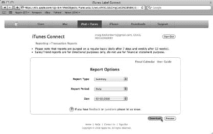

[www.it-ebooks.info](http://www.it-ebooks.info/)

### 每日报告

每日汇总报告会告诉你每个产品在每个国家的销售数量。这是一个制表符分隔的文本文件，汇总了每个销售项目。你从 iTunes Connect 获取这些文件应该不足为奇。要下载该报告，请按照以下步骤操作：

**1\. 登录 iTunes Connect，点击 `Sales/Trends Report`。**

交易报告屏幕将会出现（图 9-1）。

***图 9-1：***

*你的每日销售*

*报告是从此处*

*下载的*


*iTunes Connect 中的“交易报告”页面。该制表符分隔的文本文件包含所选日期全球所有销售的清单。*

2. 确保“报告类型”弹出菜单显示为“摘要”。将第二个弹出菜单“报告周期”设置为“每日”。

页面会更新，你会看到一些新的选项，包括一个“日期”弹出菜单。

3. 从“日期”下拉菜单中选择你想要报告的日期。然后点击“下载”。

所选日期的文本文件将下载到你的“下载”文件夹中。

你可以将这个文本文件加载到 Excel 等电子表格程序中，手动跟踪销售情况，但这很繁琐。处理这些文件几天后，你会高兴地发现，市场上有多种产品可以轻松地收集、分析和展示你的销售数据。更棒的是，其中许多应用程序还可以跟踪你在 iTunes 上的评论和排名。

**272**

iPhone 应用开发：缺失手册

[www.it-ebooks.info](http://www.it-ebooks.info/)

## 跟踪销售

### 基于网页的解决方案

如果你希望无论身在何处都能访问销售数据，那么在浏览器中显示信息的网络解决方案将会非常方便。appFigures（http://appfigures.com）的团队正是为此而生的。

注册账户后，输入你的 iTunes Connect 登录信息，你的每日报告就会被传输到该应用，进行分析并绘制成图表。appFigures 还提供了一个非常有用的“事件”机制，可以帮助你追踪发布和促销活动对产品销量的影响。评论和排名信息也可获取。

你可以免费使用该网站，但产品和账户数量有限。如果你的需求超出此范围，或者希望使用评论和排名等附加功能，则每月费用从 5 美元起。

### iPhone 应用

如果你喜欢在 iPhone 上完成所有操作（你懂的），那么你会高兴地知道有两个出色的应用销售追踪解决方案。

第一个叫做 AppSales，是由 Ole Zorn 编写的开源软件。你可以在 GitHub 上查看该项目：http://github.com/omz/AppSales-Mobile。在你的 Mac 上检出源代码后，你可以在你的 iPhone 上构建并安装该应用。然后提供你的 iTunes Connect 账户信息，该应用就会加载你的每日报告，并以表格和图表的形式显示结果。你还可以查看产品的评论。

另一个解决方案是名称相似的 MyAppSales，网址为 www.drobnik.com/touch/my-app-sales/。该应用提供了 AppSales 不具备的几个功能：它可以处理多个账户和应用内购买。由于苹果公司依据 SDK 协议第 3.3.7 节不允许 iPhone 应用访问 iTunes Connect，因此你也需要自行构建并安装此应用。源代码许可的费用仅为 15 美元，非常合理。

### 桌面应用程序

第三个用于处理每日报告的解决方案是一款名为 AppViz 的 Mac 桌面应用程序，网址为 www.ideaswarm.com/products/appviz/（图 9-2）。与其他应用一样，你提供你的 iTunes 凭据，它会在你启动应用时自动下载你的报告。这款售价 30 美元的应用还能自动备份你的销售报告。

第 9 章：你已拥有客户！

**273**

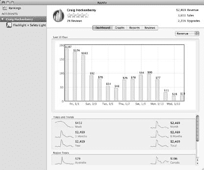

[www.it-ebooks.info](http://www.it-ebooks.info/)

**跟踪销售**

**图 9-2：** 这是 AppViz 如何在 App Store 上显示 Safety Light 的每日销售信息。AppViz 仪表盘绘制了 2010 年前两周的每日收入。该应用还可以生成更详细的图表和销售报告。你可以查看来自全球所有 iTunes 商店的产品评论和排名。

AppViz 还可以下载每个类别中前 100 名应用的排名。如果你的应用是畅销品，排名可以帮助你了解产品在 iTunes 上的表现。

与其他销售追踪应用一样，全球范围内的评论也是可用的。

使用桌面应用程序的主要优势在于，你所有的财务数据都直接受你控制。并且，与任何财务数据一样，你应该确保其已备份并存储在安全的位置。

### 估算

需要记住的是，每日报告是以各个国家的货币报告的。在美国，一份 Safety Light 拷贝能为你带来 0.70 美元的收入，而在欧洲则是 0.48 欧元，苹果公司就是以此方式报告的。

由于大多数开发者都希望以本国货币了解结果，上述列出的应用会使用当前汇率调整销售数据。

然而，外汇市场是波动的，因此在月底对账完成时，报告的值会存在偏差。调整后的金额并非完美，但用于衡量你的产品销售情况已足够。如果你需要进行任何收入分成或支付版税，请不要使用每日报告进行会计核算。请改用月度财务报告，下文将对此进行描述。

**274**

iPhone 应用开发：缺失手册

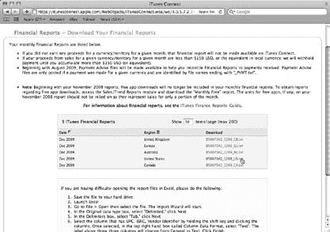

[www.it-ebooks.info](http://www.it-ebooks.info/)

**跟踪销售**

## 月度财务报告

月底过后大约两周，你将开始收到苹果公司发送的电子邮件，其主题行以“iTunes 财务报告”开头。这是个好消息——苹果公司已迈出向你付款的第一步。

你将收到每个主要地区的通知邮件：澳大利亚 (AU)、加拿大 (CA)、欧洲 (EU)、日本 (JP)、英国 (GB)、美国 (US) 和全球 (WW)。通常需要 4 到 5 天才能收到所有地区的报告。邮件本身不包含报告；你需要登录 iTunes Connect 获取。

登录后，点击“财务报告”链接，你会看到最近一个月的报告列在最前面（图 9-3）。点击“下载”列中的链接，即可在 Mac 上获取报告。

**图 9-3：** 月底过后几周，你可以从 iTunes Connect 下载财务报告。点击一个链接，即可下载该地区和该时间段的报告——此处为 2009 年 12 月的美国报告。

你会收到两种类型的报告：以“PYMT.txt”结尾的文件包含该地区付款的摘要。如果你在某地区的收入未达到至少 150 美元，苹果公司会为你的账户保留余额；任何之前的余额都会列在月度摘要中。你还会看到从你的收入中扣除的任何预扣税或消费税/日本消费税。

**注意：** 如果你尚未按照第 237 页所述提交日本税务条约文件，你将会发现你在日本收入的 20% 被预扣了。“管理你的合同”部分解释了如何追回这些收入。

第 9 章：你已拥有客户！

**275**

[www.it-ebooks.info](http://www.it-ebooks.info/)

## 广告与推广

在“财务报告”屏幕上列出的另一种 `.txt` 文件（不含 `PYMT`）包含销售信息。该文档包含制表符分隔的数据，详细列出了每个国家/地区每种产品的销售数量。将文档拖放到 Dock 图标上后，Microsoft Excel 和 iWork 中的 Numbers 都可以打开该报告。

如果你有多种产品，请按供应商标识符对数据进行排序（以将所有产品分组），然后累加“扩展合作伙伴分成”列，即可得出每种产品的金额。

### 获得付款

`PYMT.txt` 文件中列出的金额就是苹果公司将存入你银行账户的金额。通常情况下，存款会在你收到月度报告后几周内完成。由于货币兑换的原因，核对这些存款有点棘手。


只有美国（US）和全球（WW）地区的金额以美元列出。财务报表中列出的付款将以 ACH 存款形式显示在您于 iTunes Connect 中设置合同时指定的账户中。对于非美元付款，您需要存款当日的汇率。苹果公司无法提供此信息，因为他们不知道当付款移交给银行系统（即实际发生汇兑时）的汇率会是多少。不幸的是，许多银行并不报告 SWIFT 电汇的汇率。

如果您的银行没有记录汇率，请使用像 `http://x-rates.com/cgi-bin/hlookup.cgi` 这样的在线存档。存款日期前一两天内的汇率将帮助您确定来源国，并让您对金额是否正确有个大致判断。

至此，剩下要做的就是为购买一艘 100 英尺长的游艇支付首付，并订购古巴雪茄！或者想办法让每月的存款变得更多一些……

---

## 广告与推广

大多数开发者进入 iPhone 开发领域时，都抱着远超实际结果的期望。你以为只需几个小时的功夫就能赚到一百万。

抱歉，但通常情况并非如此。

你的应用成功与否在很大程度上取决于广告和推广。如果客户不知道你的产品，他们就不会购买。你的代码很棒，所以不要害怕告诉别人！

### 新闻稿

要制作的第一份推广材料是*新闻稿*。这份一页纸的文档让媒体了解你的新产品。撰写新闻稿时，重要的是要考虑谁会阅读它。你是在写给媒体，而不是潜在客户。目标是让你的产品获得报道，从而产生兴趣，并间接带来销量。

因此，要避免任何听起来像推销宣传的语言。相反，要将你的产品描述为与众不同且有新闻价值的东西。对于 Safety Light 来说，能引起媒体关注的点可能是：

-   它是 iPhone 上最好的手电筒，在众多手电筒应用中独树一帜。
-   它的救援信标可以在事故或自然灾害中拯救生命。
-   它有一个迪斯科模式。

另一种策略是使用讲述你的应用故事的引语：“Safety Light 取代了我 iPhone 上所有其他手电筒！”或者“我的狗就是喜欢迪斯科灯光！”

（如果这些引语来自行业专家或小有名气的人，那就更好了。）提供尽可能多的讨论要点，让记者有独特的写作角度。

记住，记者不会只看你这一份新闻稿。同一天还有数百个其他 iPhone 应用发布，其中许多也在争夺同样的媒体关注。这似乎有违直觉，但一份简短的新闻稿远比一篇冗长、拖沓的长篇大论要好得多。保持简短有力，或许真的会有人读它。

你还应该了解新闻稿的标准格式。新闻稿需要包含标题、摘要、正文、公司背景和联系信息。在 PRWeb 网站 `www.prwebdirect.com/pressreleasetips.php` 上可以看到一个示例，以及其他技巧和指南。

完成新闻稿后，确保它能在你的网站上找到。让那些不在你新闻稿邮件列表上的人也能轻松获取关于你产品的信息。

### 寻找代言人

即使是顶尖的开发者，也往往倾向于回避自我推广。如果你过于内向，不善于宣传自己的应用，你可以找别人为你做这件事。无论哪种方式，你的应用都需要有人在外面为你传播口碑。

学习如何宣传你的产品可以是非常有益的。你将与行业内的聪明人建立新的、有趣的关系。

但要警惕，这项活动会消耗*大量*时间。人脉不是轻易就能获得的，但没有他们，你就无处可发新闻稿。

### 广告与推广

另一个选择是找一家专门从事媒体关系或营销的公司。他们已经有现成的人脉，并且可以利用这些资源来推广你的产品。营销和公关公司在如何推销产品方面也拥有丰富的经验。

然而，最大的好处是，这让你可以专注于自己最擅长的事情——软件开发。

### 社交网络：增强版的口碑营销

许多开发者发现，社交网络是提高其产品能见度的绝佳场所。Twitter 和 Facebook 都允许用户选择定期接收你正在做的最新动态。

这就是增强版口碑营销的用武之地。通过一次状态更新，你可以触达成百上千的人。为了让您了解这是什么样子，图 9-4 中的图表显示了 Safety Light 在一个拥有约 6,100 名关注者的 Twitter 账户上被宣布的情况。

**图 9-4：** 该图显示了 Safety Light 在 Twitter 上发布公告后的网站访问者数量。12 月 21 日的第一个峰值显示了对推文的响应：“准备开售——iPhone 上最好的手电筒应该很快在 iTunes 上架”。一天后的第二个峰值来自“如果你昨晚错过了，应用商店里最好的手电筒现已上市”。这两条推文将产品介绍给了 2,000 多人。该图由运行在 Safety Light 网络服务器上的 Mint (`http://haveamint.com/`) 生成。

请注意，重复公告的效果会递减。提及产品几次没问题，但再多就会让你的关注者感到厌烦。此外，考虑开一个独立的产品或商业账户，这样你就可以将个人生活和商业生活分开。

一旦建立了你的账户，你希望人们关注你。例如，你可以在你的网站上放置一个简单的链接，访客可以点击关注你的 Twitter 或 Facebook 账户。事实上，如今很难找到一个*没有*社交网络链接的网站！

**提示：** 你的产品网页也是进行跨产品营销的好地方。当有人在社交网络上关注你的活动时，他们很可能喜欢你的工作。记得向他们介绍你创建的其他产品。

#### 网络的力量

社交网络最棒的地方在于，它们可以放大口碑推荐的效果。你的一些关注者比你更聪明、更英俊、更有趣。（很难想象，是吧？）Michael “Rands” Lopp 就是这样一个人：他是一位作家，运营着一个备受尊敬的网站，名为 *Rands in Repose* (`http://randsinrepose.com`)。他在 Twitter 上的 `@rands` 账户拥有超过 11,000 名关注者。

在看到之前关于 Safety Light 的一条推文后，他添加了自己的评论：“显然缺少一个 SafetyDance™ 模式：`http://j.mp/7tB9G5`”。如图 9-5 所示，该链接导致超过 700 名好奇的用户了解了 Safety Light。

**图 9-5：** 该图显示了有影响力的关注者提及你的应用所带来的效果。在这种情况下，圣诞节后一天来自 `@rands` 的一条推文导致超过 700 人了解了 Safety Light。查询缩短链接（如上文所述）的更多信息会显示该图表。

许多社交网络用户更喜欢使用缩短的 URL（比如上一段中的链接），这让你在状态更新中有更多空间来放置内容。


在许多情况下，它还为你提供了收集有关你的产品链接的额外信息的能力。你可以通过将 `info` 添加到链接并在网络浏览器中键入，来获取关于 `bit.ly` 和 `j.mp` 链接的统计数据。例如，在浏览器中输入 `http://j.mp/info/7tB9G5` 即可生成如图 9-5 所示的图表。它还会提供关于使用同一 URL 的其他推文、链接被点击的网站以及点击者地理位置的信息。

## 给顾客一些谈资

Safety Light 有一个很酷的功能，在 iTunes 或产品网站上都没有提及——当屏幕在设置界面切换时出现的电池图案。这些电池是故意保密的。你可以通过让用户在 iPhone 应用中发现一些新奇事物来利用社交网络。告诉别人你遇到的新鲜事是人之常情。用户第一次翻转查看设置时，看到电池会感到惊喜（图 9-6），有些人会非常高兴，甚至想向他们的关注者展示。

**279**

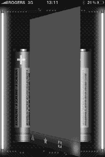

[www.it-ebooks.info](http://www.it-ebooks.info/)

**图 9-6：** *在灯光和设置视图之间显示的电池图案对新用户来说是一个惊喜。有些人会在社交网络上评论，为应用带来更多关注。Martin Dufort (@mdufort) 截取了这张图并发布到他的 Twitter 信息流中供他人查看。*

与此类似的一个变体是，应用将游戏分数发布到玩家的 Facebook 和 Twitter 账户。为你的游戏添加这个功能并不难，它能让用户炫耀自己的成就。如果朋友和关注者没听说过这款游戏，他们会点开附带的链接查看。如果他们已经购买了游戏，则会想要超越这个分数！这对你和你的客户都有好处。

***提示：*** 如果你希望你的应用向社交网络发送帖子，请确保应用征求了用户的许可。每次发帖都应当给用户选择退出的机会。自动发布的帖子被视为垃圾信息，会破坏用户对你的应用的信任。

### 这是一场对话

要使社交网络真正有效，沟通必须是双向的。如果你只是不停地发布一些近乎新闻稿的信息，你的关注者会感到厌倦并离开。解决方案：确保你的社交网络是互动性的。

以下是关于如何有效使用你的产品或公司账户的一些建议：

- **使用你的账户发布使用应用的技巧和窍门。** 将这些帖子分散发布，以便更多用户有机会看到它们。同时，最好包含指向列出所有技巧的支持页面的链接。
- **建立处理针对你账户的支持请求的机制。** 大多数情况下，最好的做法是引导客户通过电子邮件账户来调查问题。复杂的支持问题通常需要来回沟通才能确定原因和解决方案，你肯定不希望这些内容填满你的主页。电子邮件最适合此类交流。
- **对于简短明了的问题，快速回复即可解决。** 例如，Twitter 上的一位用户对光强度有疑问：“@chockenberry 应用能否覆盖系统亮度？在低亮度下，你的应用的高亮度仍然很低。”快速回复让他们知道你意识到了这个问题，并且这是系统限制：“@jazzviolin 不幸的是，没有公开的 API 可以调节亮度。”
- **关注新功能请求。** 当人们使用你的应用时，他们会产生一些想法：在你的账户中发送一条简短的信息，就能让他们迅速把想法传达给你。快速确认回复让他们知道你正在关注并感谢他们的反馈。感谢 Twitter 上的用户，下一个版本的功能请求列表中包含了一个给 DJ 用的 BPM 指示器、一个利用加速计的雪崩检测器，以及通过摩尔斯电码发送的自定义消息。
- **写一封感谢信。** 社交网络的一大优点是赞美：“@chockenberry 我喜欢翻转视图时后面的电池图案，真是点睛之笔。”感谢你的用户（“@McCarron 谢谢！我们努力让事情变得有趣 :-)”）不仅能让他们感觉良好，还能使他们成为你应用更好的支持者和拥护者。
- **提醒关注者在 iTunes 上留下评论。** 正如你在第 259 页所看到的，社会认同可以极大地推广你的应用；对你的作品感兴趣的人通常很乐意花点时间帮忙。只是要注意提出这个请求的频率：过于频繁会让你看起来像是在乞求。
- **发推时，使用易于搜索的模式。** 例如，在推文中包含 `http://safetylightapp.com` 将有助于你搜索谈论该网站的人，而仅使用“Safety Light”则会包括那些谈论自行车灯的人。

## 大爆炸

在上一节中，你看到了社交网络上有影响力的人如何帮助推广你的应用。当被一个领先的网站提及时，情况会变得更好！

2009 年 12 月 29 日，这一句话改变了 Safety Light 的未来：

“如果你打算做一个 iPhone 手电筒应用，你不如把它做得最好。”

`http://daringfireball.net/linked/2009/12/29/safety-light`

实际的话语本身并不如写下它们的人重要。这篇短文出现在 Daring Fireball 上，这是一个有影响力的网站，提供关于 Mac 和 iPhone 的新闻和评论。运营该网站的记者 John Gruber 善于发现优秀的应用，读者们也喜爱他的发现。由于这次推荐，超过 10,000 人访问了 Safety Light 网站，其中有 688 人决定购买该应用（图 9-7）。

**281**

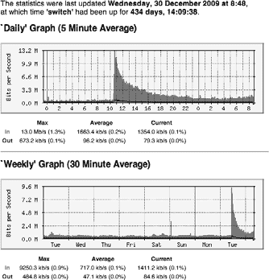

[www.it-ebooks.info](http://www.it-ebooks.info/)

**图 9-7：** *此图显示了托管 Safety Light 网站的网络服务器上的流量。来自 Daring Fireball 在上午 10:30 的一个链接导致了流量剧增。在选择网站托管服务商时，要询问他们处理此类带宽异常的规则。网站因访问量过大而宕机会导致你损失销售额。*

在此次曝光之前，Safety Light 的日收入约为 25 美元。在帖子发布当天，日收入超过了 450 美元。Daring Fireball 的提及还将 Safety Light 推到了实用工具类别前 100 名的第 40 位。

教训：不要低估媒体关系的重要性。

### 像野火一样蔓延

当一个拥有大量读者的网站链接到一个产品时，这个链接往往会像涟漪一样扩散到其他网站。这正是 Daring Fireball 提及后发生的事情，它帮助扩大了 Safety Light 的知名度。

这种效应与你上一章（第 259 页）看到的社会认同并无二致。如果一位作者认为某个应用有价值，其他作者也会查看并加入他们独特的观点。这也是为什么你的公关策略不应该只有一种方法：一位作者会抓住“最好的手电筒”这一点，另一位看到独特的设计和 SOS 信标，而第三位则会关注 Disco Mode。

**282**


以下是 `Daring Fireball` 发文后提及或评测了 `Safety Light` 的部分网站示例：一家巴西 `Mac` 网站甚至报道了此事！

- **Laughing Squid.** `http://laughingsquid.com/safety-light-iphone-flashlight-app-with-sos-signal-feature-for-emergency-rescue/`
- **The iPhone Blog.** `http://www.theiphoneblog.com/2009/12/29/safety-light-iphone-flashlight-app-redeemed/`
- **Download Squad.** `http://downloadsquad.com/2009/12/30/safety-light-not-just-another-iphone-flashlight/`
- **Mac Magazine (巴西).** `http://macmagazine.uol.com.br/2009/12/30/se-voce-for-baixar-uma-lanterna-para-o-iphone-opte-logo-pela-melhor-safety-light/`

**提示：** `Google Language Tools` (`http://google.com/language_tools`) 可以帮助你理解外语评测。翻译过程中会有部分信息丢失，但足以掌握大意。

请务必尽快将评测链接汇总到你的推广网站上。

此外，挑选出最佳评测，将其添加到 `iTunes Connect` 中的应用描述中。

## 在线广告

提高应用知名度的另一途径是在线广告。媒体报道和提及往往能在短期内引发热潮；你会持续几天获得大量流量，然后热度便会消退。

广告是一个极好的补充，因为它能形成*重复*曝光。如果你在热门网站上投放广告，访问者会反复看到你的品牌和营销信息。

此外，广告网络还能让您在用户使用 `iPhone` 或 `iPod touch` 时向其展示广告——这是与潜在客户直接建立联系的渠道。

### 预算

那么，应该在广告上投入多少资金呢？要回答这个问题，你需要同时考虑你推广的产品以及你希望采用的广告类型。

广告界的一条通用经验法则是，应将总销售额的 5%–10% 再投资于产品营销。这是思考预算投入的一个良好起点，但正如你将要看到的，具体情况会根据应用的价格而发生显著变化。

在所有这些广告方案中，都要思考每笔销售能带来多少利润。很容易忘记苹果要抽成 30%。对于售价 99 美分的应用，每售出一个单位你只能赚到 70 美分。如果你的应用售价为 4.99 美元，净收入则是 3.50 美元。正如你将看到的，为低价应用找到有效的广告方式相当困难。

### 第 9 章：你已经有客户了！

`http://www.it-ebooks.info/`

**广告与推广**

#### 基于展示次数的广告

这种传统的在线广告形式基于广告向访问者展示的次数。你按千次为单位购买*展示次数*（通常称为 `CPM`）。`CPM` 广告的价格可低至每千次展示 1 美元，最高可达数百美元。

**注意：** "`CPM`" 代表"每千次成本"。该缩写中的 `M` 是表示 1000 的罗马数字。当你进入在线广告领域时，你会发现许多奇怪的三字母缩写词。

成本取决于投放广告的网站。每个网站吸引不同类型的客户。它们每天吸引的访问者数量也差异巨大。

在咨询广告费率时，不要害怕询问人口统计数据和流量统计信息。

如果你打算在一个热门游戏网站上为你的 `iPhone` 游戏投放广告，请准备好支付高昂的 `CPM`。服务于特定小众受众的小型网站 `CPM` 较低，可能更适合你的产品。在评估基于展示次数的广告成本时，牢记盈亏平衡点至关重要。当你将千次展示的成本除以每笔销售的收入时，就能收回广告成本。

例如，如果你为售价 99 美分的应用支付每 `CPM` 1000 美元的费用，你需要额外卖出 1,429 份才能实现收支平衡（每 `CPM` 1000 美元 / 0.70 美元收入）。考虑到广告活动最多覆盖一千名客户，卖出 1,429 份的可能性极低。你几乎等于在往窗外扔百元大钞。另一方面，如果你的应用售价为 4.99 美元，而 `CPM` 为 100 美元，则只需售出 29 份就能支付广告费用。这意味着看到广告的一千人中，仅有 2.9% 需要购买。对于合适的受众群体而言，这是一个可以实现的目标。

在寻找网站投放应用广告时，请记住，出售广告位的商家通常在定价上具有一定灵活性。不要害怕就报价进行谈判。如果你愿意将广告投放日期调整到能让发布商填补空位的时间，通常能获得更优惠的费率。

#### 基于点击的广告

许多广告网络——包括 `AdMob` 和 `Google`——现在都采用基于每次点击成本（`CPC`）的模式投放广告。你通过指定愿意为每个点击广告的人支付多少费用，与其他广告主竞争广告位。你愿意为每次点击支付的价格越高，你的广告在网络上展示的可能性就越大，展示频率也越高。

`http://www.it-ebooks.info/`

**广告与推广**

要确定每次点击应该支付多少费用，你需要了解有多少访问 `iTunes` 中页面的人实际进行了购买。这个*转化率*通常在潜在客户的 5% 到 10% 之间。也就是说，每 100 个在 `iTunes` 上看到你页面的人中，大约有 5 到 10 人会购买产品。

要为售价 99 美分的应用广告实现盈亏平衡，将每单位净收入（0.70 美元）乘以每次点击带来的销售量（5% 到 10% 的转化率），得出的 `CPC` 范围在 0.035 美元到 0.07 美元之间。对于售价 4.99 美元的应用，得出的 `CPC` 则在 0.17 美元到 0.35 美元之间。

当然，在广告投放期间要监控你的销售情况，以便更准确地了解真实的转化率。广告网络会报告广告被点击的次数，而苹果会报告每日销售数据。将广告投放当天的销售数量与你的日均销售数量进行比较，并利用结果计算转化率。

例如，`Safety Light` 的一个广告于 2010 年 1 月 5 日在 `AdMob` 上进行了短期投放。使用 0.05 美元的 `CPC`，在短短几个小时内产生了 127,634 次展示。广告获得的 1,000 次点击带来了 0.78% 的 `CTR`（点击率）。当天的销售额比平均水平高出约 20 笔，转化率为 2%。`AdMob` 要求最低 `CPC` 出价为 0.05 美元，因此，当 99 美分产品的转化率低于 7% 时，你就是在浪费钱。Safety Light 的转化率远低于这个阈值，因此没有再开展广告活动。

广告活动在短短几小时内就完成这一事实表明，有大量 `iPhone` 应用在展示广告，并且有大量客户愿意点击它们。这对你是有利的，因为这意味着即使 `CPC` 较低，你也能获得大量曝光，这对价格较高的应用尤其有利。如果 `Safety Light` 定价为 4.99 美元，在相同的 1,000 次点击和 0.05 美元 `CPC` 下，每天只需额外 15 笔销售就能实现成本效益。

你的目标是找到能够产生额外销售的最低可能 `CPC`，由于每个产品都是独一无二的，确定这一点的唯一方法是通过反复试验。投入部分广告预算来找出哪些有效、哪些无效。

#### 固定费率

在固定费率广告中，网站或广告网络同意以固定成本在特定时期内投放你的广告。既不保证展示次数，也不保证点击次数。那么，这种广告投放方式能带来什么呢？


# 这类广告首先能为您带来极高的曝光度

您的广告很可能是页面上唯一的广告。一个广告网络的例子是 Deck Network（`http://decknetwork.net`）。该网络将广告投放在对创意、网页和设计行业极具影响力的网站上。如果您的产品能吸引这些领域的客户，投入数千美元进行广告投放可能会产生显著效果（图 9-8）。


[www.it-ebooks.info](http://www.it-ebooks.info/)

## 广告与推广

**图 9-8：** Zeldman.com 此页面上唯一的广告是 Safety Light 的广告。该广告通过 Deck Network 投放——这是一个由吸引创意、网页和设计行业的网站组成的联盟。在广告投放期间，Safety Light 推广网站的访问量比平时高出约 10 倍，销售额也翻了一番。

## 赞助

另一个新兴趋势是*博客赞助*。您的产品会在博客读者中获得很高的曝光率。如同公共广播赞助一样，您并非直接推销产品或品牌。赞助费率从每周数百美元到数千美元不等；网站影响力越大，成本越高。

两个例子是 Daring Fireball（`http://daringfireball.net/feeds/sponsors/`）和 Hivelogic（`http://hivelogic.com/sponsorship`）。

这类广告形式的主要好处在于，您的产品与可信赖的来源关联在一起。从 Daring Fireball 提及后的反馈（第 281 页）可以看出，当您的产品拥有这种积极的关联时，客户购买起来会容易得多。

## 品牌建设

广告费用高昂。您需要从中获取尽可能多的价值。最初，人们很容易只专注于为单一产品做广告，因为那时您只有这一款产品。更聪明的开发者会考虑长远，同时为产品*和*品牌做广告。

您会在大型开发者和发行商身上看到这一点。如果您一直关注 iPhone 游戏市场，很可能听说过《Rolando》和《Topple》这些热门系列。更重要的是，您可能也知道发行这些游戏的公司 ngmoco:)。

这并非偶然。这类公司在推广品牌上投入的精力，与推广单个应用一样多。原因很简单：如果您对 ngmoco:) 的一款游戏感到满意，就更愿意接受他们的新作品。您可能完全不知道《Dr. Awesome》是什么，但仅仅因为非常喜欢《Rolando》就将其买下。一旦您拥有多款产品，就可以零成本地建立自己的品牌。这就是最好的广告。

许多应用在游戏选择界面或帮助界面中加入了交叉推广。如果用户喜欢某款应用，她自然想了解您的其他作品。进行这种品牌广告宣传时需要注意的一点是，不要惹恼您的用户。要做得巧妙，否则您有可能把一个粉丝变成敌人。

当您拥有多款产品时，还应考虑建立一个展示所有产品的推广网站。例如，Iconfactory 的所有应用都列在 `http://iconfactoryapps.com`。该网站将交叉推广扩展到同时涵盖 Mac 和 iPhone 平台。最终目标是，当用户看到“来自 Iconfactory”时，会想到“这一定很棒”。

## 推广码

另一种获得免费广告的方式是使用*推广码*。顾名思义，这些代码可以帮助您提高产品的知名度。正如您在第 262 页所见，评测者应该优先获得您的推广码。通过将单个代码提供给一位受欢迎的评测者，您可以接触到成百上千位阅读该评测的潜在客户。

**小贴士：** 开发者、评测者和用户通常都称这些代码为 *promocode*。在字符数限制为 140 个的 Twitter 上发帖时，这个缩写无疑很有帮助！

幸运的是，Apple 提供的推广码远超您发布应用所需的量——您应用的每个版本总计有 50 个。您可能不会把全部代码都给评测者，所以用剩下的来为产品制造热度。而最好的方式就是将它们送出去。人们喜欢赢取奖品，即使只值一两美元。

赠送推广码最简单的方法，是向关注您社交网络账户的用户发布一条消息。广告的核心就是触达人群，因此如何赠送这些宝贵的代码至关重要。

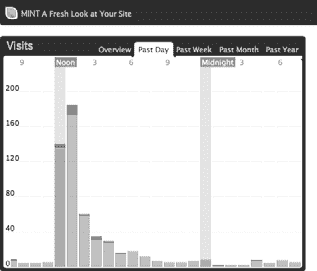

[www.it-ebooks.info](http://www.it-ebooks.info/)

### 附带条件

有些开发者只是发布推广码，不要求任何回报。这当然有效，但您无法触达比现有粉丝更多的人。没有“回响”来激发其他人的兴趣。相反，您应该让您的粉丝向他们的粉丝发布消息来赢取奖品。

例如，这条消息被发送给了 Twitter 上超过 6100 个粉丝：

“想要《Safety Light》的免费拷贝吗？发布一条包含 `http://safetylightapp.com` 链接的新推文，我会给前 20 位私信一个推广码。要有创意哦！” `http://twitter.com/chockenberry/statuses/7491384567`

在接下来的几个小时里，该社交网络上有 60 条指向 Safety Light 推广网站的链接被发布。这些链接反过来又触达成百上千访问该网站的人（图 9-9）。

**图 9-9：** 该图表显示了 2010 年 1 月 7 日在 Twitter 上赠送推广码所产生的流量。Safety Light 网站的流量在大约 12 小时内持续走高，而销售额在接下来的 5 天里保持增长。

随后使用 Twitter 的搜索功能寻找中奖者：`http://search.twitter.com/search?q=safetylightapp.com`。在显示 20 条推文后，通过私信向所列账户发送了推广码。有些开发者采用自动方式来生成这些推广信息。这些*推文轰炸*是一种强大的推广工具，但也存在疏远潜在客户的风险。毕竟，同样的信息反复出现会让人感到厌烦。

为了更有人情味，可以要求您的粉丝在发布关于您应用的推文时发挥创意。

这种赠送活动的一种变体，是将您的推广码作为竞赛奖品提供给博客。许多博客喜欢举办此类竞赛来吸引新读者，并让现有读者兴奋起来。您从提供竞赛奖品中受益，因为可以接触到博客的访问者，其数量少则上百，多则成千上万。同时，由于您支持了博客读者喜爱的事物，也能与他们建立积极的联系。

**注意：** 当您开始分发这些推广码时，会发现一个严重的缺陷。与 iTunes 的其他所有方面不同，这些推广码目前仅在美国商店有效。有些中奖者将无法兑换他们的奖品。许多美国以外的用户已经知道这一限制，因此不会费心参加竞赛。对于不了解此限制的用户，您需要道歉并解释这是 Apple 的政策，而非您的。

### 补充


好的，这是根据您的要求，将给定的英文文本翻译成中文的译文。


请记住，每当苹果批准新版本时，你会额外获得 50 个促销码。当你看到状态变为`Ready For Sale`（第 268 页）后，计数器会重置到最大值，即使你之前在旧版本中还有剩余码。不要浪费你的促销码。在你上传新版本后，立即申请所有剩余的促销码。这些码有效期为 30 天，你可以用它们来推广当前版本或即将推出的版本。

## 促销价格

拿起一份本地报纸看看广告：你会发现充斥着“五折优惠”或“限时特惠，立省 20 美元”这样的字眼。消费者通常会关注他们省了多少钱，而不是花了多少钱，这很正常。

优秀的广告商知道，每个人都希望认为自己买到了物超所值的东西。这在 App Store 里也是一样。你可以通过给顾客提供更低的价格来提升销售势头。

对许多产品来说，这一策略并不会带来收入的大幅增长。

例如，如果你每天以 1.99 美元的价格卖出 100 个单位，那么以 99 美分的价格，预计能卖出大约 200 个单位。你的总收入在促销期间并不会有太大变化。那为什么要这么做呢？

-   **促销能给你创造在互联网上制造话题的机会。** 网站会链接到你的产品，因为他们知道读者喜欢了解好交易。

**注意：** 请记住，这些网络链接在促销结束后仍然会存在。这是件好事，因为人们仍然会访问你的推广网站并了解你的产品。

-   **扩大你的客户基础也有助于口口相传的推荐。** 那些喜爱你的产品*而且*买到了实惠的人会告诉他们的朋友。

-   **增加的销售量可以让你进入 iTunes 上你所在类别的畅销榜。** 如果你已经在榜上，它会提升你的排名。

促销价格也在决定你的首发价中扮演着角色。如果你以 99 美分起步，那么你就没有空间玩这个游戏了。另外请记住，降价远比涨价容易：一些客户会因价格上涨而感到被欺骗。

*埃迪并不是真的疯了*

当然，最终的促销是免费赠送你的产品。听起来很疯狂，但当你考虑到第 289 页提到的几点时，就不会这么认为了。这本质上是以损失销售收入为代价进行广告宣传。例如，如果你一款 99 美分的应用通常日销量为 100 个单位，免费赠送每天会花费你 70 美元。当你考虑本章前面提到的广告成本时，这个代价相当低廉。

**注意：** 第 260 页讨论的这种促销技巧的一个变体是，提供一个免费试用版，通过应用内购买来提供附加功能。一个出色的试用版能提升你应用的知名度，并让你在客户享受产品的同时进行销售。

*让人们知道*

为了最大化促销价格的效果，你需要让人们知道这件事。是的，这意味着你要为广告再做一次广告。欢迎来到疯狂的市场营销世界！

你会使用常规的媒体渠道，让媒体知道促销何时进行。社交网络也是传播信息的绝佳机制。

对于那些已经上榜，或者预期会因销量提升而上榜的应用来说，在 iTunes Connect 中更新应用图标可以吸引人们对促销活动的关注。

## 绘制图表

那么，所有这些广告和促销活动会如何影响你的收入呢？回答这个问题的最佳方式，就是看一看 Gas Cubby（一款追踪车辆保养并计算里程的应用）一年内的销量图表。该应用的开发者 David Barnard 详细记录了一年中的销售情况和事件，并制作了图 9-10 所示的图表。

你可以很轻易地看到被 The Unofficial Apple Weblog (TUAW)、Gizmodo 和 CNN/Time 等主流网站提及的影响。许多 iPhone 开发者期待的另一个事件是节假日：圣诞节当天，随着人们收到礼品卡和崭新的硬件设备，销量会大幅攀升。

最初，App Store 会在每个类别的页面上显示产品更新。图 9-10 中针对 2.0.1 更新的峰值在今天不会发生，因为 iTunes 内现在只突出显示新版本发布。保持产品更新也许会带来一些媒体报道，但其主要好处是通过修复错误和增加新功能来让客户满意，而不是驱动新销量。

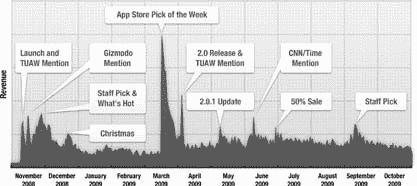

**图 9-10：** *这张图表展示了 App Cubby 销售的 Gas Cubby 应用第一年的销量。在知名网站上的提及和新版本发布都带来了销量峰值。在 App Store 内的推广对收入也有巨大影响。*

最大的峰值来自苹果本身。出现在 App Store 首页的`热门`或`编辑推荐`中，会带来持续数周的巨量增长。图中部的巨大峰值则是应用被刊登在苹果网站上，并通过邮件发送给所有客户的结果。

**提示：** 你可以从 Rana June Sobhany (O'Reilly) 所著的 *MarketingiPhoneApps* 中，了解更多关于图 9-10 的图表信息以及其他市场营销话题。

## 监控覆盖情况

现在你的广告和促销活动正在全力运转，你必须问自己一个问题：这有效吗？

要回答这个问题，你必须监控你产品的可发现性、销售排名和链接有效性。这听起来有点像市场营销的废话，但实际上是一些相当酷的技术。

### 排名

苹果提供的数据源包含了每个 App Store 类别中顶级应用的排名以及总排名。这些数据源被细分为免费榜、付费榜和最高收入榜。正如你在第 273 页所学到的，一些销售跟踪应用可以让你下载和显示这些排名。

如果你的产品进入了前 100 名榜单，你需要非常密切地追踪它的位置变化。这时候就需要一款名为 `MajicRank` ( `http://majicjungle.com/majicrank.html`) 的 Mac 桌面应用了。

Dave Frampton 开发了这款应用来追踪他热门的 iPhone 游戏 Chopper。

通过 `MajicRank`，你可以按照自己设定的时间间隔自动下载排名。你的应用排名会被绘制成图表，如图 9-11 所示。

使用 `MajicRank` 软件需要支付 20 美元的捐赠费用。

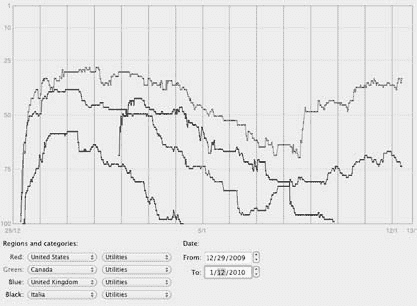

**图 9-11：** *这张由 MajicRank 生成的图表，显示了 Safety Light 在被 Daring Fireball 推荐后，每半小时排名变化的情况。你可以看到从 1 月 5 日开始的广告和其他促销活动的影响。有趣的是，Safety Light 唯一上榜的欧洲地区是意大利，而该应用唯一本地化的语言也是意大利语。*

排名追踪也是关注你竞争对手的好方法。与只有你和你的团队才能访问的详细销售数据不同，排名是公开信息。当一个竞争应用发布了带有新功能的版本并且排名上升时，你可以推断其销量增加了。这意味着你有工作要做了。

### 谷歌

在查找指向你应用的链接方面，谷歌是你的朋友。当然，你需要搜索你的应用名称。对于像 `Safety Light` 这样常见的应用名称，你会得到很多与 iPhone 应用无关的结果。在这种情况下，只需搜索 *Safety Light app*，结果就会相关得多。


### 广告与推广

同时，搜索指向你推广网站的链接。除了在 Google 主搜索框中输入 `safetylightapp.com`，还可以查看哪些博主正在链接到你的产品。为此，请访问 `http://blogsearch.google.com` 并输入 `link:safetylightapp.com`。

在寻找人们谈论你产品的过程中，试着像他们一样思考。使用诸如 `flashlight for iPhone` 和 `flashlight app` 这样的短语，而不仅仅是产品名称。

如果你在 App Store 中拥有多个相互竞争的应用程序，你还能深入了解人们对这些其他产品的看法。

**292**

iPhone App 开发：缺失的手册

[www.it-ebooks.info](http://www.it-ebooks.info/)

### 广告与推广

*获取高价值点击*

如果能知道客户何时点击了导向你 iTunes 页面的链接，那该多好？如果还能知道该链接何时促成了一笔购买，那岂不是更棒？

Apple 拥有所有这些宝贵信息，而最棒的是，你还能因此获得报酬！你正在将客户引导至 iTunes，因此，对于从入站链接产生的每笔购买，你将获得 5% 的佣金。只需注册成为 iTunes 联盟会员：`http://www.apple.com/itunes/affiliates/`。

**注册**

该计划通过第三方公司运营：你需在 `LinkShare` 创建一个账户。通过此账户，你可以申请成为 iTunes 联盟会员，创建定制链接，并查看统计数据：

1. **前往 iTunes 联盟会员页面（`http://www.apple.com/itunes/affiliates/`），然后点击“申请成为联盟会员”链接。**
   你将被引导至 `LinkShare` 的注册页面。

2. **选择合适的法律实体类型。**
   如果你是独立开发者，请选择“个人”并提供社会安全号码（SSN）。对于企业，请选择相应类型并提供雇主识别号（EIN）。

3. **输入你的姓名和邮寄地址。**
   `LinkShare` 使用此信息将你的收入支票邮寄给你。你还必须提供一个唯一的电子邮件地址和账户信息，以便访问该 Web 应用程序。

4. **点击“继续”后，系统会提示你输入网站名称及其 URL 以及其他描述信息。**
   如果你有公司网站，请使用它，因为你可能不希望每次发布新应用程序时都经历此注册过程。

由于你的推广网站是新建的，你无法确切知道它将产生多少流量。许多网站每月有 5,000 到 50,000 次浏览量，这可以作为一个良好的估算值。此外，请在“简短描述”字段中注明你的网站用于在 iTunes App Store 推广一款 iPhone 应用。

5. **当你点击“继续”时，应该会看到一个确认页面。此时，你可以再次点击“继续”。**
   你将到达发布商门户。

至此，你刚刚创建了一个账户；你仍然需要申请成为 iTunes 联盟会员：

1. **在发布商主页上，点击导航栏中的 `PROGRAMS` 链接。**
   你将进入一个可以搜索公司的页面。

第 9 章：你已经拥有客户！

**293**

[www.it-ebooks.info](http://www.it-ebooks.info/)

### 广告与推广

2. **在广告商搜索框中，输入 `Apple iTunes`，然后点击 `Go`。**
   你会看到 iTunes 的唯一一条结果。

3. **勾选左侧的复选框，然后点击页面底部的 `Apply`。在出现的弹出窗口中，接受条款和条件，然后点击 `OK`。**
   搜索结果中的“状态”列将显示“待处理”，表示你的申请正在处理中。你可以查看“我的广告商”标签页，以了解状态何时变为“已批准”。

`LinkShare` 和 Apple 都会审核你的请求。大多数情况下，申请会在几天内被批准。一些美国境外的开发者最初可能会被该计划拒绝：如果遇到任何问题，请随时通过电子邮件联系 `LinkShare` 或 Apple。

*创建链接*


作为 iTunes 联盟会员，您将可以使用链接创建工具。此工具可让您在 iTunes 中搜索应用程序，并生成包含您独特账户信息的链接：

1.  前往`http://www.linkshare.com/`并点击 **登录** 以打开发布商门户。
    在顶部，点击 **链接** 显示您的广告商列表；然后点击 **Apple iTunes**。

    ***注意：*** 在您的网站获得批准之前，您不会在列表中看到 “Apple iTunes”。您将看到用于创建特定于 iTunes 的链接的页面。

2.  在页面顶部附近，点击 **链接制作工具**。
    您将进入一个新窗口，可以在其中搜索 iTunes 中的条目。

3.  由于您对 iPhone 应用程序感兴趣，请为 **媒体类型** 选择 **应用程序**。将国家选择保留为 USA，并输入您的应用程序名称作为搜索词。
    您将看到匹配项列表。在您的应用程序名称右侧，您会看到一个箭头链接。

4.  点击箭头以显示标准链接按钮的 HTML。
5.  很可能您只需要链接的地址，因此只需复制 `<a>` 标签的 `href` 属性的值。

生成的链接又长又难读，但您需要理解它才能充分利用它。该 URL 的域名为`click.linksynergy.com`，路径以`/fs-bin/stat`开头。参数包括`id`（您的联盟 ID 号）和`offerid`（指定此链接用于 iTunes）。如果您仔细观察，`RD_PARAM1`是您产品在 iTunes 上的编码 URL。该 URL 也以将链接关联回您的 LinkShare 账户的信息结尾。

但最重要的参数是尚未出现的一个参数。

LinkShare 允许您在 URL 中添加最后一个参数，以指示链接的来源。一个标识符，在发布商门户中称为 “成员 ID”，在其他文档中称为 “签名”，由 URL 中的`u1`参数表示。您需要手动添加此参数。

选择签名时，请使其有助于您快速识别链接。例如，如果您在`CHOCKLOCK.COM`上投放广告，您可能希望使用类似`CHOCKLOCK_AD`的内容。

由 iTunes Link Maker 生成的链接将以类似`partnerId%253D30`的内容结尾。要跟踪来自您广告的链接，您可以在 URL 末尾附加`&u1=`和签名，最终得到类似`partnerId%253D30&u1=CHOCKLOCK_AD`的内容。

`u1`参数不应超过 72 个字符。坚持使用字母、下划线和数字：任何其他字符都可能破坏 URL。

***注意：*** 这些嵌入了签名的链接不仅限于网页。您也可以在 iPhone 应用程序内部使用它们。iPhone 开发者网站上的一篇文章解释了实现此目的的几种方法：`https://developer.apple.com/iphone/library/qa/qa2008/qa1629.html`。

如您所料，当客户点击链接时，他们将被带到您应用程序在 iTunes 中的页面。签名的总点击次数也会记录在 LinkShare 的数据库中。Apple 还将拥有必要的信息，以便对任何购买行为向您支付 5% 的佣金。请注意，此佣金不仅限于您的应用程序：如果有人在接下来的 72 小时内购买了歌曲或视频，您也将从该销售中获得回扣。

LinkShare 每日更新其报告。最初，您只会看到 “点击量” 列有数据，因为 Apple 将销售信息从 iTunes 传输回 LinkShare 存在延迟。佣金可能需要一周时间才能出现在您的报告中，但当它们出现时，您将看到类似图 9-12 的内容。

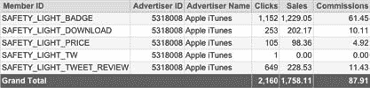

***图 9-12：*** *该表格来自 LinkShare 关于 2009 年 12 月 29 日至 2010 年 1 月 5 日期间对 iTunes 上 Safety Light 页面的链接的报告。它显示了促销网站上的 App Store 徽章是最受欢迎的链接，并且要求 Twitter 关注者留下评论可以产生销售。Apple 支付的 5% 佣金为该周赚取了 $87.91。*

Safety Light 促销网站上的所有链接都使用了 LinkShare 签名。查看该网站，您会在一个*非常*长的 URL 末尾看到表中列出的名称。

要查看报告，请转到 LinkShare 发布商门户并点击 **报告**。然后，在 **高级报告** 下，您可以通过 **报告类型** 进行几种选择：

- **签名活动.** 此报告汇总了您附加到链接的每个成员 ID 签名的点击次数和销售额。此概览使您可以轻松查看哪些链接正在产生流量和销售。您将最常使用此报告。
- **签名订单.** iTunes 中的每笔交易都会列出产生佣金的成员 ID 签名。您还将看到交易的日期和时间以及订购的 SKU 类别。
- **产品成功.** 要查看您在每个 SKU 类别中赚取了多少钱，请选择此报告。类别 “Q9020” 显示购买的应用程序数量。项目数量可以大于订单数量：一次可以购买多个应用程序。

***提示：*** LinkShare 还通过一个简单的 Web 服务提供其中一些信息。如果您希望自动处理报告，请在他们的帮助中心搜索 “签名订单报告 Web 服务”：`http://helpcenter.linkshare.com/publisher/questions.php?questionid=780`。

*收集情报*

签名活动报告的 “佣金” 列中报告的数字表明了一笔可观的额外收入，但当您添加 “成员 ID” 和 “点击量” 列时，该报告变得更有价值。它们告诉您每个链接的使用频率及其盈利情况。

不幸的是，没有足够的信息可以准确知道您自己的产品被购买了多少。Apple 和 LinkShare 没有将订单分解为所购产品的单个 SKU。如果您看到一个 $4.99 的订单，您无法知道这是针对您的应用程序还是竞争对手的。

即使没有这些信息，您仍然可以确定哪些链接最有效。假设您有足够大的样本量，您可以比较每个签名的相对百分比。包含其他产品所导致的错误将在所有签名中均匀分布。如果您发现一个签名仅通过三次点击就产生了 $50 的销售额，请不要基于这个部分样本做任何决定。

使用上面显示的表格，您可以比较 BADGE、DOWNLOAD 和 PRICE 的签名。这些签名用于促销网站上的每个链接：分别用于 “Available on the iPhone App Store” 图形徽章、“Download your copy” 文本链接和绿色的 “Only 99¢” 链接。

它们合计产生了 1,510 次点击。BADGE 链接的 1,152 次点击产生了从网站到 iTunes 的 76% 的流量。DOWNLOAD 和 PRICE 链接分别产生了 17% 和 7% 的流量。显然，您希望确保徽章在网站上突出显示。

***注意：*** App Store 徽标必须从 Apple 获得许可。在开发者网站的 App Store Resource Center 中获取详细信息：`http://developer.apple.com/iphone/appstore/marketing.html#storelogo`。您也可以从此页面下载标准图稿。


好的，这是根据您的要求翻译和格式化的中文 Markdown 文档。

---

# 从这些数字中，你可以生成的另一个统计指标是每次点击的销售额。

对于 `BADGE` 徽章，1,152 次点击产生了 1,229.05 美元的销售额，即每次点击 1.07 美元。而 `TWEET_REVIEW` 链接每次点击仅带来 0.35 美元。出现这个数字的原因是 `TWEET_REVIEW` 链接被发布到 Twitter 上，提醒关注者去评论 Safety Light 应用。包含签名的联盟链接可以使用像 `bit.ly` 这样的服务来缩短。如果你查看链接 `http://bit.ly/info/77QJhk` 的信息，你会看到展开后的链接末尾带有 `SAFETY_LIGHT_TWEET_REVIEW` 签名。

信息页面还会用图表显示该链接随时间变化的使用情况。

显然，有些点击链接去写评论的人已经购买了该应用，他们不会产生任何新的销售额。实际上，能产生任何销售额都令人惊讶：在查看“签名订单”报告后，似乎大部分佣金都来自其他产品。

## 客户支持

**注意：** 有些签名会被截断，比如“`SAFETY_LIGHT_TW`”。电子邮件客户端、网页浏览器、复制/粘贴错误以及其他处理错误都可能导致这些不完整的签名。你需要学会忽略它们。

你也可以在其他场景中使用这些技巧，例如：

- **找出哪种广告对你的产品最有效。** 为每个发布商分配一个唯一的签名，然后看看在 TouchArcade 还是 SlideToPlay 上投放的广告对你的产品效果更好。
- **测试不同的广告布局和/或文案。** 用“最好的手电筒”还是“拯救你的生命”作为 Safety Light 的广告语效果更好？展示应用图标还是巧妙的广告语更好？通过投放带有不同签名的各种广告，你就会知道哪种方式最有效。

### 客户支持

随着客户群的扩大，你会发现还有一样东西也在增长：支持邮件。

你的客户会遇到问题，而你的工作就是解决这些问题并让他们满意。

#### 一切完美

你做了大量的 Beta 测试并修复了很多 Bug：一切应该都很完美，对吧？不幸的是，答案是否定的。1.0 版本发布后总会出现一些问题。作为一个聪明的开发者，你应该计划在首次发布后的一到两周内推出一个 1.0.1 版本。尽管你很可能需要这样做，但不要计划在发布后的几周内去度假。

这个维护版本将解决客户发现的主要问题。你可能还想加入一些用户提出的简单功能请求。

#### 崩溃速成课

在客户安装应用后，iTunes 会开始收集设备上生成的崩溃报告。如第 7 章（第 226 页）所述，这些崩溃报告是自动生成的，包含能让你识别原因的信息。在同步过程中，iTunes 会收集这些报告，并将其转发到苹果公司的服务器上。

每周，你的崩溃报告都会被分析并发布到 iTunes Connect 上，供你下载：

1. **登录 iTunes Connect（第 233 页）并选择“管理你的应用”。**
   从列表中选择你的应用以查看其信息。
2. **点击“崩溃报告”以查看按所使用的操作系统版本分类的应用报告。**
   如果你看到“提交的报告太少，无法显示”，那么恭喜你，你的代码运行得很好！
   如果你没那么幸运，你会看到导致崩溃的类和方法的列表，并按崩溃发生的频率排序。
3. **点击“下载报告”将崩溃报告复制到你的 Mac 上。**
   下载的文件会带有 `.crash` 扩展名。

当你将最终的二进制文件上传到 iTunes Connect 时，你应该已经保存了一份应用副本以及在构建过程中生成的 `dSYM` 文件（第 262 页）。确保 Spotlight 可以找到这些文件。这种 Mac OS X 搜索技术能让工具找到并处理包含调试信息的文件。

要查看崩溃报告的内容，请在 Xcode 中打开 Organizer 窗口。然后，在 `IPHONE DEVELOPMENT` 下，选择 `Crash Logs`，并将你下载的 `.crash` 文件拖入窗口顶部的列表中。崩溃报告处理完成后，你会看到额外的类名、方法名以及与你源代码对应的行号。

**提示：** 使用版本控制系统 (VCS)，并在每次发布时为项目打上标签。这样，当需要检索与当前报告的崩溃相对应的源代码、应用和 `dSYM` 文件时就会非常方便。

流行的 Subversion VCS 工具已预装在 Mac OS X Snow Leopard 版本中。要了解更多信息，请在终端窗口中输入 `mansvn`。

如果你在解析符号时遇到问题，请查看 iTunes Connect 崩溃报告页面底部的技术说明 TN2151 的链接。

### 处理支持邮件

当你努力设计、开发和推广了一款人们愿意购买的应用后，其中一小部分客户会对你的应用有疑问或遇到问题。

许多开发者发现，在 iTunes 上他们的销量很高，所以即使只有一小部分用户寻求帮助，最终你也可能需要进行大量的客户支持。养成能够控制支持工作量的习惯。

以下是处理支持问题的一些技巧：

- **对常见问题使用模板回复。** 创建一个文档，其中包含用户经常遇到的问题的解决方案。然后你可以从该文档中复制粘贴，以减少与客户沟通所花费的时间。
- **把你的模板回复放在你的产品网站上，** 并更新 iTunes Connect 中的“支持 URL”，指向这个 FAQ（常见问题）列表。许多客户在需要联系你之前就能找到他们问题的解决方案。
- **使用 Twitter 或其他社交网络** 让客户知道影响许多人的问题。告知用户预计修复问题需要多长时间，并在问题已提交审核时通知他们。当修复版本发布时，提醒他们更新。
- **建立一个功能请求列表。** 你会发现很多好想法都来自支持邮件和社交网络上的评论。保持该列表的更新，便于你在开始开发下一个版本时使用。某些功能会被频繁请求，这时你只需说“谢谢！这个功能已经在我们的功能请求列表中了。”
- **使用单一的客服联系点。** 无论你通过基于网络的服务、电子邮件还是其他机制来提供支持，这其实并不重要。但如果你将注意力分散到许多不同的渠道上，你将会抓狂。你的客户也一样，因为他们会不知道联系你的最佳方式。选择一种联系方式并坚持下去。

## 产品更新

在修复了最初的 Bug 并完成了一些简单的功能请求之后，就该上传你的 1.0.1 版本了。幸运的是，这比第一次容易得多，因为 iTunes Connect 中的许多元数据不需要更改。

### 新信息

显然，你在源代码中做了很多更改。但有一项更改比其他所有更改都重要：你需要更新 `Info.plist` 文件中的版本号。

当你上传一个新的二进制文件时，iTunes Connect 会检查版本号的值，如果该值不大于当前版本，文件将被拒绝。你还需要记得从版本号中删除任何非数字字符（例如，你的测试版版本号）。


建议为版本号采用统一的命名模式。大多数开发者会根据改动幅度和深度来递增版本号。

例如，如果你当前的版本是 1.0，那么下一个版本可以这样命名：

- **1.0.1.** 小版本更新。主要是修复错误，不包含新功能。

**产品更新**

- **1.1.** 用于包含重要变更的版本，包括错误修复和小型新功能。
- **2.0.** 一个重大的新版本，包含大量错误修复和面向客户的新功能。

## 欢迎回来，iTunes

到现在，你已经是 iTunes Connect 的老手了，但还是有一些新东西需要学习。要更新你的应用，请从更新元数据开始：

1.  登录 iTunes Connect，选择“管理你的应用程序”。然后点击你要更新的应用的图标。
2.  点击“更新应用”链接，开始更新流程。

你首先会看到一个询问导出合规性是否发生变化的问题。答案很可能是“否”。

3.  点击“继续”。

你会看到一个屏幕，你需要在其中提供关于新版本的更新信息。与首次提交相比，需要填写的字段更少。

4.  首先填写“版本号”字段。

该号码应与你在 `Info.plist` 中分配的版本号一致。“名称”和“关键词”字段会预先填充当前值；如果你想更改，现在正是时候。一旦你提交了更新后的二进制文件，这些字段将无法编辑。

你的内容评级的当前值也会显示出来。

5.  如有必要，请更新任何值。最后，点击“稍后上传应用二进制文件”，然后点击“保存更改”。

返回应用屏幕后，你会看到版本号已更新，状态变为“等待上传”。你还会看到你的应用图标在“管理你的应用程序”屏幕上出现了两次。

需要注意的是，此时**不应**更新你的应用描述或任何其他数据。你可能需要列出新功能或更新截图，但如果现在进行这些更改，它们会显示在当前版本上。相反，请等待新版本批准后再进行这些更新。

最后一步是上传新的二进制文件。像发布初始版本（第 262 页）一样进行最终构建，然后点击“上传二进制文件”。使用“选择文件”按钮选取文件，然后点击“保存更改”。

## 产品更新

完成后，你会看到状态变为“等待审核”。希望审核等待时间不长！

## 升级（或者说，缺乏升级）

如果你是从其他软件平台转过来的开发者，你可能已经了解软件升级的好处。简而言之，你知道自己有多少客户，以及其中有多少人可能会升级。这些信息，加上升级的成本，可以告诉你应该在开发上投入多少钱。

不幸的是，这个等式中关键的一部分在 App Store 上是缺失的。没有办法给现有客户提供折扣。每个 SKU 都是独立的。对于游戏和其他类型的娱乐产品来说，这不是问题。客户已经习惯为使用相同角色和主题的额外游戏内容付费。

而生产力工具和其他更“严肃”应用的开发者则面临一个艰难的决定：是免费提供升级，还是为全新的产品收费？

在做这个决定时，请记住以下几点：

-   你会遇到与用户从免费应用迁移到付费应用时相同的数据迁移问题。当前版本的文档和设置不会自动迁移到新版本，除非你付出大量努力。
-   用户会抱怨。举个例子，流行应用 Tweetie（`www.atebits.com/tweetie-iphone`）的作者 Loren Brichter 在决定对 2.0 升级版本收费时，就遭遇了相当大的抵制。无论出于何种原因，客户觉得他们有权免费升级，即使升级费用只有 3 美元。
    -   穿上你的防火内裤吧，因为人们会通过社交网络和电子邮件表达他们的不满。
-   如果你的用户基数相对较小，而开发成本较高，那么对升级收费可能会成就或毁掉你的业务。如果你面向的是一个利基市场，请花时间教育你的客户：持续的营收是如何支持他们喜爱的应用的。

好消息是，如果你正在考虑升级，那意味着你的第一个版本已经赚到了一些钱。许多产品永远走不到这一步，所以为你完成的工作感到自豪吧。

## 产品更新

恭喜你！

仿佛就在昨天，你第一次启动 Xcode 来制作一个简单的手电筒应用。但回首往事，这是一段漫长的旅程，你一路上学到了很多。

如果你像大多数 iPhone 开发者一样，那么一旦你完成第一个应用，你已经在考虑下一个了。顶尖研究人员发现，治愈这种“病”的唯一方法就是长时间接触 Xcode。谢天谢地，你已经完全准备好使用这个“解药”了。

那么，祝愿你在 App Store 作为 iPhone 开发者能长久而成功：这是你应得的。干杯！

#### 附录 A：下一步去哪里

关于 iPhone 开发，总有更多东西要学。如果你发现自己对本书涉及的某个主题感到困惑，可以查看以下资源。你可以查阅书籍、网站和论坛来寻找答案。

同样重要的是要记住，iPhone 开发是一个新兴行业。新技术和方法在不断被发现。不要害怕使用你在本书中学到的术语在 Google 上搜索！

### 关于 Objective-C 的帮助

**书籍**

`http://developer.apple.com/mac/library/documentation/Cocoa/Conceptual/ObjectiveC`

许多关于 Cocoa 的书籍也会深入探讨 Objective-C。如果你想要一个优秀的入门介绍和完整的语言参考，苹果出版的 *The Objective-C 2.0 Programming Language* 是无与伦比的。当你遇到新的术语和概念时，术语表和索引尤其有用。

该文档有 PDF 格式，方便你打印和搜索。

**网站**

`http://sealiesoftware.com/blog/`

如果你对 Objective-C 的内部原理有任何疑问，Greg Parker 都已经回答过了。当你不可避免地陷入 `objc_msgSend` 崩溃的深渊时，你最终会来到这个网站，长舒一口气。

### 关于 Cocoa 的帮助

**书籍**

`http://bignerdranch.com/products.shtml`

Aaron Hillegass 在他的 Big Nerd Ranch 教授编程多年。在 *Cocoa Programming for Mac OS X* 中，他通过清晰的示例和从这些课程中磨练出的精彩讲解来阐述这个主题。这本书受到许多资深 Mac 开发者的推崇，并且尽管书名如此，它对于那些希望更深入理解两个平台共享的类和设计模式的 iPhone 开发者来说也很有价值。

`http://cocoabook.com/`


# 附录 A：下一步该去哪里

## Cocoa 与 Objective-C

### 书籍

*《Cocoa 与 Objective-C：快速上手》*，作者 Scott Stevenson，深入剖析了 Cocoa 和 Objective-C。Scott 在其网站 Cocoa Dev Central（`http://cocoadevcentral.com/`）和 Theocacao（`http://theocacao.com/`）上长期提供在线教程。他直截了当且富有个性的文风易于阅读，强烈推荐给希望充分利用这门语言和框架的开发者。

`http://www.cocoadesignpatterns.com/`

Erik Buck 和 Don Yacktman 都是资深的 Cocoa 开发者。在《Cocoa 设计模式》一书中，他们研究了 iPhone SDK 框架中使用的面向对象设计模式。通过实际案例和示例代码，高级开发者将发现用于构建其 iPhone 应用的组件背后所蕴含的优雅与一致性。

### 网络资源

`http://developer.apple.com/cocoa/`

该页面是 Apple 关于 Cocoa 一切内容的主要参考。请将其作为探索框架的起点。

`http://cocoawithlove.com`

Matt Gallagher 的 Cocoa with Love 站点是有关 Cocoa 框架的有用代码和信息的无尽源泉。他的一些文章深入探讨了 Mac 和 iPhone 开发的精妙之处，而另一些则对新手非常友好。

`http://cimgf.com`

由 Marcus Zarra 和 Matt Long 撰写的 *Cocoa Is My Girlfriend* 站点涵盖了 Mac 和 iPhone 编程的广泛主题。对于 iPhone 上两个最重要的框架：Core Animation 和 Core Data 来说，它是一个特别好的信息来源。

---

## iPhone SDK 帮助

### 网络资源

`http://www.mikeash.com/?page=pyblog/`

*NSBlog* 由资深 Mac 开发者 Mike Ash 运营，涵盖 Cocoa 开发的高级主题。这是专业人士学习新东西的地方。

### 讨论区

`http://www.cocoabuilder.com/`

*CocoaBuilder* 站点提供了 Cocoa 和 Xcode 开发者邮件列表的可搜索归档。结果以易于阅读的线程格式显示。当你在理解 Cocoa 的某些方面遇到问题时，这个站点是寻找解决方案的绝佳起点。

`http://lists.apple.com/mailman/listinfo/cocoa-dev`

注册 Apple 关于 Cocoa 开发的邮件列表。该列表是讨论 Cocoa 框架、功能和技术问题的好去处，但不讨论 iPhone SDK 的具体问题。

---

## iPhone SDK 帮助

### 书籍

`http://iphonedevbook.com`

由 Dave Mark 和 Jeff LaMarche 编写的《iPhone 3 开发入门》通过分步指导，带你掌握 iPhone SDK 的核心部分。后续书籍《iPhone 3 开发进阶》涵盖了 3.0 软件的新功能和更高级的主题。

`http://ericasadun.com`

Erica Sadun 是 iPhone 开发者获取示例代码、技巧和窍门的无尽源泉。自越狱早期就活跃的她，将这些诀窍汇编成书《iPhone 开发者食谱》。这本书在通过相关源代码快速覆盖新主题方面表现出色。

### 网络资源

`http://appdevmanual.com`

《iPhone 应用开发：缺失手册》的官方网站。书中未涵盖的补充材料将在此发布。

`http://iphonedevelopment.blogspot.com`

由作者 Jeff LaMarche 撰写的 *iPhone 开发* 站点，是寻找 iPhone 教程和评论的好地方。他书中出现的许多示例代码都是首次在这个站点上亮相。

---

## 界面设计帮助

### 网络资源

`http://iphoneincubator.com/blog/`

Nick Dalton 的 *iPhone 开发博客* 在 iPhone SDK 发布的第一天上线。从那时起，它已成为一个宝贵的技巧和窍门集合。

`http://iPhoneDeveloperTips.com`

顾名思义，*iPhone 开发者技巧* 网站拥有数百个可用于你项目的技巧和教程。作者兼资深移动开发者 John Muchow 定期更新该站点，为所有开发者提供优质信息。

`http://furbo.org`

这个由鄙人撰写的站点，用于探讨与 iPhone 相关的各种开发主题。文章 `http://furbo.org/bootstrap` 是本书的创作之源。

### 讨论区

`http://devforums.apple.com`

Apple 运营着这些讨论论坛。除了针对常见问题的普通问答外，该站点是唯一可以合法讨论受保密协议 (NDA) 约束的 SDK 版本的场所。

`http://groups.google.com/group/iphonesdk`

这个由 Erica Sadun 运营的 Google 群组承载着有关 iPhone SDK 的各种讨论。

---

## 界面设计帮助

### 书籍

`http://developer.apple.com/iphone/library/documentation/UserExperience/Conceptual/MobileHIG`

《iPhone 人机界面指南》是 Apple 出版的出版物，涵盖了为用户提供最佳体验所面临的挑战和最佳实践，是设计用户界面时的基本指南。建议你将该文件保存为 PDF，并在原型设计新项目时将其作为便捷参考。

`http://www.tobyjoe.com/2009/08/my-iphone-user-experience-book/`

Toby Joe Boudreax 的《编程实现 iPhone 用户体验》将前述《人机界面指南》中的信息向前推进了一步。他涵盖了许多相同的问题，但更深入，并附有代码示例和对许多流行 iPhone 应用的评析。推荐给希望充分利用其用户体验的设计师和开发者。

---

## Web 开发帮助

### 书籍

`http://apress.com/book/view/1430223596`

《iPhone 用户界面设计项目》调查了 10 个流行且获奖的 iPhone 应用。这本书审视了每位开发者和设计师为创建最终产品所采取的方法。正如你在 Safety Light 中所见，最佳学习方式就是亲历整个过程。

---

## Xcode 帮助

### 网络资源

`http://developer.apple.com/mac/library/referencelibrary/GettingStarted/GS_Tools/`

Apple 开发者站点上的这份“入门”文档提供了 Xcode 的介绍，以及可用于改进 iPhone 应用程序的性能工具的深入介绍。

`http://developer.apple.com/tools/`

此网页包含有关 Apple 开发工具的各种主题的链接。如果你对工具有疑问，请务必查看 Xcode-Users 邮件列表。

`http://search.lists.apple.com/`

Apple 维护着所有邮件列表的可搜索归档。你可以在归档中找到有关 Xcode、Cocoa 及其他技术的信息。请务必使用页面底部的导航来查看其他选项和功能。

`http://developer.apple.com/mac/articles/server/subversionwithxcode3.html`

这份 Apple 文档解释了如何设置 Subversion 源代码管理。说明包括设置服务器和将 Xcode 配置为客户端。

---

## Web 开发帮助

### 网络资源

`http://developer.apple.com/safari/library/referencelibrary/GettingStarted/GS_iPhoneWebApp`

Apple 开发者站点上的这个页面是初学者和高级 Web 开发者的绝佳起点，他们希望探索 iPhone 上 Safari 的技术和设计问题。

`http://www.alistapart.com/articles/putyourcontentinmypocket/`

`http://www.alistapart.com/articles/putyourcontentinmypocketpart2/`

这个在热门 Web 杂志 *A List Apart* 上的系列文章涵盖了在 iPhone 上为 Safari Web 浏览器进行开发的基础知识。

---

## 了解新闻与业务动态

### 网络资源

`http://jqtouch.com`


# 高级 Web 开发工具

高级 Web 开发者一定会想了解 `David Kaneda` 为 `jQuery` 编写的插件。该工具包让你只需使用标准的 `HTML`、`CSS` 和 `JavaScript` 就能设计出复杂的用户界面。

## 讨论

`http://groups.google.com/group/iphonewebdev`

这个 `Google` 小组是与其他从事 `iPhone` 特定项目的开发者交流的好地方。

## 关注新闻与商业动态

### 书籍

`iPhone 营销 (O’Reilly)`

`Rana June Sobhany` 深入阐述了推广你的应用所需的一切。通过对众多成功开发者的访谈，你将了解如何让你的产品脱颖而出。

### 网站

`http://daringfireball.net`

`John Gruber` 的热门网站 `Daring Fireball`，对科技新闻采取一种务实的态度。富有洞察力的分析和无炒作风格的报道，让你轻松掌握最新的 `Apple` 新闻，并了解其如何影响你的业务。

`http://www.mobileorchard.com/`

由 `Dan Grigsby` 和 `Ari Braginsky` 运营的 `Mobile Orchard`，提供新闻、教程以及采访 `iPhone` 开发者的播客。他们的每周新闻摘要让你紧跟行业动态。

`http://blogs.oreilly.com/iphone/`

`Inside iPhone` 网站是 `O'Reilly Media` 关于 `iPhone` 所有相关资讯的枢纽。在这里，你可以找到活跃的讨论论坛以及涵盖各种主题的频繁更新的博客。

### 讨论

`http://groups.google.com/group/iphonesb`

`iPhone 软件业务` 是一个 `Google` 小组，面向希望与其他开发者讨论 `iPhone` 应用开发业务的小型独立 `iPhone` 开发者。你会发现涵盖市场营销、客户支持和独立咨询的各种讨论话题。

---

## 开源资源

围绕 `iPhone` 的开发者社区非常活跃，由此产生了大量优秀的开源项目。除了能为你开发项目节省大量时间外，新手开发者也能从那些才华横溢且慷慨的解开发者所创建的代码中学习。

`http://joehewitt.com/post/the-three20-project/`

`Three20` 是由 `Joe Hewitt` 创建的一个大型开源项目，包含了 `Facebook` 在 `iPhone` 应用中使用的大量类库。你会找到用于查看图片的组件、控制器、撰写消息的视图，以及如 `HTTP` 磁盘缓存等各种实用工具。该项目包含一个演示如何使用每个组件的示例应用。如果你刚刚起步，阅读这位专家级开发者的代码就能让你学到很多东西。

`http://touchcode.com/`

`TouchCode` 是由 `Jonathan Wight` 发起的一个屡获殊荣的项目。活跃的开发者社区为其贡献了诸如 `XML` 和 `JSON` 解析器、可嵌入的 `HTTP` 服务器、用户界面视图等大量代码。这些代码被广泛应用于许多 `iPhone` 应用中，所以，不妨看看它，为自己节省时间！

`http://code.google.com/p/kissxml`

与提供轻量级 `XML` 解析器的 `TouchCode` 不同，`KissXML` 提供了一个功能强大的解析器，并且能够通过编程方式生成 `XML`。

`http://code.google.com/p/core-plot/`

如果你的应用需要绘制图表，那么了解 `CorePlot` 项目将是个明智的选择。该框架与 `Core Animation` 和 `Core Data` 等其他框架紧密集成，为你提供一个灵活的系统，将你的数值数据转化为引人注目的 2D 可视化效果。

`http://github.com/devinross/tapkulibrary`

由 `Devin Ross` 编写的 `Tapku Library` 是一套精美的用户界面类库。你能找到实现 `CoverFlow`、日历、图表、加载视图等等的代码。他位于 `http://devinsheaven.com/` 的博客也是 `iPhone` 开发者的重要信息来源。

`http://cocos2d.org/`

`cocos2d` 框架让你能够创建包含精灵的丰富图形场景。它非常适合 2D 游戏、演示以及任何需要协调图像与用户交互的应用程序。

`http://allseeing-i.com/ASIHTTPRequest/`

`ASIHTTPRequest` 项目为 `Core Foundation` 网络 `API` 提供了一个易于使用的封装。如果你的项目需要与 Web 服务器交互、使用 `POST` 提交多部分表单数据，或与基于 `REST` 的 `API` 通信，那么这段代码可以简化你的工作。项目还提供了大量优质的示例代码和文档，助你快速上手。

`http://github.com/AlanQuatermain/iPhoneContacts`

许多开发者觉得基于 `C` 语言的 `AddressBook` 框架使用起来很繁琐。开发者 `Jim Dovey` 编写了几个 `Objective-C` 类，使得操作用户的联系信息变得更加简单容易。你也许还想看看 `Jim` 在 `http://github.com/AlanQuatermain/AQToolkit` 上提供的实用工具类集合。

`http://github.com/ldandersen/scifihifi-iphone`

`Buzz Anderson` 解决了 `iPhone SDK` 中的另一个难点：用于存储安全信息的钥匙串。`模拟器`和实际设备上可用的 `API` 略有不同，因此 `Buzz` 的 `SFHFKeychainUtils` 将其全部封装在一个类中，使其可以在这两个平台上使用。同样值得一看的还有他那些有用的用户界面元素。

---

## 附录 A：下一步去往何方

---

## 索引

## 符号

`<>`（尖括号），在接口定义中，36

`@`（@ 符号），在字符串对象简写中，34

`:` （冒号）
- 在接口定义中，35
- 在选择器中，58

`{}`（花括号），括起类数据，41

`-`（减号），在方法定义中，37

`()`（圆括号），括起类别，38–39

`+`（加号），在方法定义中，49

`[]`（方括号），在 `Objective-C` 中，30–31

## A

`AboutViewController` 类，204–206

`AboutView.xib` 文件，168–169, 209

访问器（Accessors）, 42

`ACH`（自动清算中心）, 235

`Acorn` 软件, 112

动作方法（Action methods）, 80
- 通过代码连接, 81–85

`警报视图`（Alert views）, 198–200

`alloc` 方法, 47

`alpha` 属性，视图的, 172

动画（Animation）
- 背景色动画, 172–174
- 由控制器类实现, 205–206
- 视图滑入和滑出屏幕, 188

`API`（应用程序编程接口）, 126

`appFigures` 网站, 273

`应用 ID`（App ID）, 145–146, 218

`Apple 开发者论坛`（Apple Developer Forums）, 17, 136

`Apple ID`, 13

`Apple` 年度开发者大会（参见 `WWDC`）

`A List Apart` 网络杂志, 311

## P

绘制结果, 290–291

新闻稿, 277

推广码, 268, 287–289

## S

促销价格, 289–290

社交网络, 278–281


**应用程序委托（application delegate）**，157–158

通过 Interface Builder 连接，86–96

**应用程序图标（application icon）**，246

在 Interface Builder 中创建，92–94

**应用程序元数据（application metadata）**，238–251

**操作（actions）。** *参见* **消息（messages）**

**应用程序编程接口（API）**，126

**操作表（action sheets）**，200–201

**应用审核流程**，265–268

**ADC 会员资格**，13

**应用（apps）。** *参见* **iPhone 应用（iPhone apps）**

**AddressBook 框架**，314

**AppSales 软件**，273

**addTarget 方法**，81

**App Store**，提交应用至。*参见* iTunes

**Ad Hoc 分发**，215–227

Connect

**Admob 网站**，253, 255

**AppViz 软件**，273–274

**广告与推广**，276–298。 *参见* **数组（arrays）。** *参见* **NSArray 集合**

*亦参见* 市场营销

`arrayWithContentsOfFile:` 方法，75

品牌塑造，110, 286–287

**本书中使用的箭头符号**，5

在主要网站上，281–283

**ASIHTTPRequest 项目**，314

效果监控，291–298

**at 符号（@）**，在字符串对象快捷方式中，34。 *参见* 在线广告，283–287

*亦参见* 特定指令

在线媒体，256

**315**

[www.it-ebooks.info](http://www.it-ebooks.info/)

**索引**

**属性**，在 Interface Builder 中更改，26

**C 语言**，与 Objective-C 对比，30, 60

**自动清算中心（ACH）**，235

**类**，21, 33–37。 *参见* 特定类 **autorelease 方法**，46–47

其中的类别。*参见* 类别

**应用的可用日期**，248–249,

创建，41–43

268–270

在头文件中定义，34

**B**

继承关系，35

名称冲突，174

**视图的背景颜色属性（backgroundColor property）**，172

由类生成的通知，97–100

**iTunes 的银行信息**，235–236

类的前缀，33

**电池**，相关通知，97

**类扩展（class extensions）**，171

**b 命令**，调试器，56

**类方法（class methods）**，49–50

**《Beginning iPhone 3 Development》（Apress 出版社）**，309

**类静态变量（class static variables）**，101, 192–193

**Beta 测试者**，114

**点击式广告**，284–285

**Beta 测试**，213–227

**点击**，书中用法，4

用于 Ad Hoc 分发，215–227

**促成购买的点击**，293–294

App ID，218

**剪贴板（Clipboard）。** *参见* **粘贴板（pasteboard）**

为 Beta 测试构建，221

**《Cocoa and Objective-C: Up and Running》**

证书，215–218

**（O’Reilly 出版社）**，308

测试期间崩溃，226


# C Cocoa 设计模式 (Addison-Wesley 出版社)

来自测试人员的设备 ID，215，218

## 专业版，308

其分发，223

## Cocoa 是我的女友网站，308

其安装，223–225

## Mac OS X 的 Cocoa 编程 (Addison-Wesley Professional 出版社)，308

其多个版本发布，226

配置文件，219

## Cocoa Touch，65–66

其中的框架，66

其中的 MVC 设计模式，66–69

相关资源，308–309

类中的 UI 前缀，33

### 混合绘图，177

### 博客

博客上的推广码竞赛，288

博客赞助，286

### 书籍。请参见资源

### 花括号。请参见大括号

### 方括号（[]），在 Objective-C 中，30–31

### 品牌塑造，110，286–287

### 断点，54–55

### Briefs 应用，111

### 程序缺陷，214，226。另请参见崩溃

### 构建命令，22

### 构建设置，Xcode，132–134，220

### 商业资源，312

# C

### @catch 指令，53–54

### 类别，38–39

类别示例，183–190

命名，183

### 应用类别，242

### 本书配套光盘

从光盘中下载 Flashlight 应用，125，155

光盘中的示例，5

### 证书

用于 beta 测试，215–218

过期证书，151

获取证书，138–142

### 代码签名，135–154

应用 ID，145–146

证书，138–142，151

签名失败，故障排除，151–153

iPhone 开发者计划，135–136

用于签名的 iPhone UDID，143

钥匙串，137，138–142

配置文件，142–150，152

签名原因，137

### codesign 软件，264–265

### 认知失调，259

### 认知失调网站，259

### 集合，73–75

### 冒号（:）

在接口定义中，35

在选择器中，58

### 颜色填充，176–177

### 颜色渐变，176–177

### 对本书的评论，6

### 配套指南，在开发者文档中，63

### 公司开发者账户，135

### 应用之间的竞争，255–256

### 复杂性，在设计中的降低，104

### comScore 网站，255

索引  
[www.it-ebooks.info](http://www.it-ebooks.info/)


## 索引

**连接**，在 Interface Builder 中更改，27

**使用 GDB 进行调试**，56

**一致性**，在设计方面，104

**应用的调试版本**，132

**消费者行为**，258

**声明的属性**，48–49

**联系人**，AddressBook 框架，314

**defaultCenter 方法**，100

**iTunes 合同**，234–238

**defaultManager 方法**，100

**控制器**，68–69

**委托设计模式**，78–80, 169

- 通过动画实现，205–206

**委托**，78–80

- `AboutViewController` 类，204–206

**应用的演示账户**，243

- 在其中暴露对象和操作，82–83

**设计师**

- `MainViewController` 类，194–201, 196–202
- 设计师提供的品牌元素，110
- `SettingsViewController` 类，201–204
- 编辑设计师提供的图形，112
- `UIViewController` 类，161
- 设计师改进的图形，227–229

**控件**

- 设计师设计的主屏幕图标，110
- 通过代码连接，81–85
- 设计师访问的仓库，113
- 通过 Interface Builder 连接，86–96
- 设计师的角色，104, 112–113
- 在 Interface Builder 中创建，89–94

**应用程序设计**，107–111. *另请参见* 用户的用户事件，81

- 界面
    - 品牌元素，110, 286–287
- **约定**，在设计方面，104
- 放置位置，105
- 反馈，113–115
- **转化率**，从免费版到付费版，260
- 灵活性，121–122
- **视图的坐标系**，185–187
- 设计目标，104
- 集合的 `copyItems` 方法，74
- 主屏幕图标，110, 129–132
- `copy` 方法，44–45, 47
- 用于集合，74
- iPhone 原型，111
- iPhone 上的模拟图，111
- 用于可变对象，77
- 纸质原型，107–109, 116–118
- **应用程序版权**，242
- iPhone 的物理特性对设计的影响，105–106
- **Core Animation 框架**，66
- 存在的问题，214
- **Core Data 框架**，66
- 技术设计，118–121
- **Core Graphics 框架**，66

**设计模式**

- 委托设计模式，78–80, 169
- MVC 设计模式，66–69
- 相关资源，308
- 单例设计模式，100–101

**CPU 大小**，107

**崩溃**

- 在 Beta 测试期间，226
- 崩溃报告，298–299

**CorePlot 开源项目**，313


## 索引

## D

**应用程序开发，** 156
- 应用程序委托， 157–158
- 每日摘要报告， 272–274
- NIB 文件， 158–169
- 相关资源， 311–314

**设备 ID (UDID)，** 143, 215, 218

**数据模型，** 190–194

**委托的数据源，** 79

**应用程序启动日期，** 248–249, 268–270

**dealloc 方法，** 51, 70

**调试器，** 54–56。另请参见*异常*；故障排除
- `b` 命令， 56
- 断点， 54–55
- 在模拟器中定位应用程序数据， 195
- `print object (po)` 命令， 36, 55
- `print (p)` 命令， 56

**开发者文档，** 61–64

**应用程序开发，** 156

**Daring Fireball 网站，** 312

**数据缓冲区。** 请参见 **NSData 类**

**字典。** 请参见 **NSDictionary 集合**

**显示区域。** 请参见 **屏幕尺寸**

**文档。** 请参见 **资源**

**绘图**
- 使用混合， 177
- 图像， 182–209
- 不规则形状， 178–180
- 矩形， 175–179
- 圆角矩形， 181
- 文本， 180–209

## E

**应用程序的电子邮件地址，** 243

**来自用户的电子邮件，** 114, 299–300

**加密，** 238

**最终用户许可协议 (EULA)，** 243

**企业开发者账户，** 135

**配置授权，** 220

**枚举，** 170

**EULA（最终用户许可协议），** 243

**控件事件，** 81

**异常，** 53–64。另请参见*调试器*

**出口合规，** 238

## F

**快速枚举用于循环，** 52

**统一费率广告，** 285–286

**for 循环，** 52

**Foundation 框架，** 66

**视图的 frame 属性，** 172

**框架，** 21, 33, 65–66。另请参见*设计模式*

## D（续）

**点语法，** 49

**dictionaryWithContentsOfFile: 方法，** 75

**花括号 ({})，** 用于封装类数据， 41

**客户支持。** 请参见 **应用程序支持**

**开发者支持中心，** 136

**应用程序的 SOS 功能，** 115, 116, 119, 120, 190–192, 196–197
- 声音， 196–197
- 控制聚光灯， 205–206
- 技术设计， 118–121
- 隐藏工具栏， 184–190
- 存储用户设置， 193–194
- 显示版本号， 168–169
- 相关网站， 229–232

**目标动作设计模式，** 80–96

**索引** 317

[www.it-ebooks.info](http://www.it-ebooks.info/)


**功能请求，** 300

**G**

**应用设计反馈，** 113–115

**全局变量，** 与单例模式对比， 100

**本书反馈，** 6

**Google，** 使用其查找应用链接， 292

**字段。** *参见* **实例变量**

**渐变，** 176–177

**@finally 指令，** 53–54

**图形**

**手指作为指点设备，** 105

应用图标， 246

**手电筒应用示例**

设计，改进， 227–229

“关于”按钮，本地化， 204

绘图， 182–183

`AboutViewController` 类， 204–206

编辑， 112

“关于”窗口， 168–169, 204–206, 209

从 Photoshop 导出， 112

操作表， 200–201

主屏幕图标， 110, 129–132

警告视图， 198–200

测量与对齐， 112

外观，改进， 227–229

iPhone 模型， 111

应用程序委托， 157–158

主截图， 247

应用程序状态，持久化， 192–194

可拉伸图像， 203–204

Beta 测试， 213–227

**分组与文件面板，** Xcode， 21

亮度控制， 115, 117, 120, 167, 183–185

**H**

**手**

Bug， 214, 226

手指与鼠标作为指点设备的对比， 105

为 iPhone 构建， 148–150

左手或右手使用，影响应用设计， 106

在模拟器中构建， 22–23

单手或双手使用，影响应用设计， 105

其中使用的类别， 183–190

**头文件，** 34

颜色名称，本地化， 194

**基于命中的营销方法，** 257–258

颜色，更改， 25–28, 115, 117–118, 120, 202–203

**主屏幕图标，** 110, 129–132

控件，设计， 116–118, 120

**I**

数据模型， 190–194

**IB。** *参见* **Interface Builder (IB)**

设计问题， 214

**IBAction 标识符，** 83, 92–94

迪斯科功能， 115, 116, 120, 200–201

**IBOutlet 标识符，** 83, 84, 89–94

从 Missing CD 下载， 125, 155


`LightView` 类，169–174

**主屏幕图标，**110，129–132

`MainViewController` 类，194–201

**应用标识符，**128–129

NIB 文件，158–169

**对象的身份**，更改，27

其中使用的通知，195–196

`id` 指针，58–60

其纸质原型，116–118

**图像**。*参见* **绘制；图形**

在模拟器中运行，23–25

**不可变对象，**75–77

`SettingsViewController` 类，201–204

**318**

索引

[www.it-ebooks.info](http://www.it-ebooks.info/)

**索引**

**@implementation 指令，**39–41

EULA（最终用户许可协议），243

**实现，**39–41

示例。*参见* 手电筒应用示例

**基于印象的广告，**284

出口合规性，238

**个人开发者账户，**135

标识符，128–129

`Info.plist` 文件，130–132

其 iTunes 合同，234–238

**继承，**35

关键字，242，249

`init` 方法，51，70

市场营销，252–261

`insertObject:atIndex:` 方法，76

元数据，238–251

**Inside iPhone 网站，**312

多个版本，免费和付费，260

**用于 Beta 测试的应用安装，**223–225

命名，128，239–240，249

**实例，**31

其中组件的命名，119–121

**实例变量，**41

付款，276

点表示法，49

价格，248–249，257，258–259

原始类型，69–70

主截图，247

**Interface Builder (IB)**

排名，255–256，291–292

使用 IB 更改 UI，25–28

评分，244–245

将控件连接到目标和动作，

应用被拒原因，266–268

86–96

发布版本，132

属性检查器，26

运行

启动，26

在 iPhone 上运行，154

**界面设计。** *参见* **用户界面 (UI)**

在模拟器中运行，23–25

`@interface` 指令，35–37，171

应用的截图，249

**接口，**35–37

SKU，242

**iPhone**

状态

应用的硬件要求，

向用户清晰说明，104

241–242

持久化，192–194

影响应用设计的物理特性，

查询与配置，157

105–106

支持，243，298–300


## 索引

## I

**iPhone 应用**
- 应用 ID，145–146，218
- 广告与推广，276–298
- 应用图标，246
- 上市日期，248–249，268–270
- 测试版测试，213–227
- 品牌塑造，286–287
- 构建最终发布版，262
- 构建 iPhone 版本，148–150
- 构建模拟器版本，22–23
- 应用类别，242
- 竞争分析，255–256
- 版权信息，242
- 调试版本，132
- 演示账户，243
- 应用描述，240–241，249
- 设计（参见应用设计）
- 与其他应用的区别，105–107
- 联系邮箱，243，249
- 加密措施，238
- 通过谷歌搜索发现，292
- 配置描述文件，142–144，152–153
- 配置模板，19
- 资源限制，106–107
- 测试最终构建版本，264–265
- 作为附属设备，用户需求，106
- 排行榜前 100 名，255–256，291
- UDID，143，215，218
- 上传应用，245–247，261–265
- 应用 URL，243，249
- 版本号，132，221，242，300
- 查看设计原型，111
- 官网，229–232，243

**iPhone 配置实用工具**，225

**iPhone 开发者中心**，135，136
- 应用审核流程，265–268

**iPhone 开发者计划**，12，135–136

**iPhone 开发者计划门户**，136–148

**《iPhone 开发者手册》（Addison-Wesley Professional）**，309

**iPhone 开发者技巧网站**，310

**iPhone 开发博客网站**，310

**iPhone 开发网站**，309

**《iPhone 人机界面指南》（Apple Inc.）**，121，310

**《iPhone 营销》（O’Reilly）**，312

**iPhone SDK**
- 测试版发布，15–17
- 下载，13
- 安装，14
- 维护版本，15
- 多版本安装，16–17
- 资源链接，309–310
- 版本选择，126

**iPhone 软件业务组**，312

**《iPhone 用户界面设计项目》（Apress）**，311

**iTunes 联盟计划**，293–295

## L

**Localizable.strings 文件**，206–209

**本地化**，209–210
- “关于”按钮的本地化，204


**I**

`iTunes Connect`，136，233–234
- 颜色名称，194
- 银行信息，235–236
- 营销资料，249–250
- 应用类别，242

**L**

iPhone 的`锁定状态`，97
- 联系信息，235

`日志记录`，36
- 合同，设置，234–238

`循环`，52
- 应用版权，242
- 应用演示账户，243

**M**

购买`Macintosh`，10
- 应用描述，240–241
- 应用电子邮件地址，243

`Mac OS X` 版本，11
- 最终用户许可协议，243

`维护版本`，300–304
- 出口合规，238

`MainViewController` 类，161，194–201
- 应用的硬件要求，

`MainView.xib` 文件，160–162
- 241–242

`MainWindow.xib` 文件，159–160
- 应用关键词，242

`营销`，252–261。*另请参阅*广告以及登录，233–234
- 推广
- 应用元数据，238–251
- 应用描述，240–241
- 应用名称，239–240
- 消费者行为，258
- 应用评分，244–245
- 从免费版到付费版的转化率，260
- 响应能力，238
- 首次推广，265
- 应用的 SKU，242
- 基于热门的方法，257–258
- 税务信息，237
- 发布日期与，248–249
- 上传应用，245–247
- 衡量指标，252–255
- 应用的 URL，243
- 在线媒体与，256
- 应用版本，242
- 推广码，268
- `iTunes 财务报告`，275–276
- 传统方法，257–258
- 使用 `iTunes` 安装应用，223–224
- 先试后买方法，259–261
- `iTunes 评论`，114
- 用户人口统计信息，254–255
- `ivars`。*参见* `实例变量`
- 应用网站，229–232，243

**J**

`jQuery` 插件，312

**K**

`键盘`通知，97
`键盘快捷键`，4
`钥匙串`，137

**M（续）**

`成员变量`。*参见* `实例变量`
`内存`
- 容量，107
- 管理，43–49
- 释放，44–47
- 保留，44–45
- 关于模拟器中的警告，25

`消息`，32–33。*另请参阅* Beta 测试方法，215–218
`应用元数据`，238–251
- 设置，138–142
`方法`，32


**应用程序关键词，** 242

`访问器（accessors）`，42

**KissXML 开源项目，** 313

`动作方法（action methods）`，80

**L**

通过代码连接，81–85
通过 Interface Builder 连接，86–96

**标签（labels）**
在 Interface Builder 中创建，92–94
创建标签，87–89
`类方法（class methods）`，49–50
编辑标签，95–96
定义标签，37–38

**光照条件**
不与类关联。*参见* `协议（protocols）`
影响应用设计，106
重写，52
在此条件下测试应用，154
作为参数传递。*参见* `选择器（selectors）`

**LinkShare，** 293–298
逐步定义，189

**应用程序链接**
**指标，** 市场营销，252–255
创建链接，294–295

**减号（-），** 在方法定义中，37

**320**
索引
[www.it-ebooks.info](http://www.it-ebooks.info/)

**索引**

**缺失光盘（Missing CD）**

**O**
从中下载 Flashlight 应用，125, 155
示例位于，5

**Objective-C，** 30–31. *另请参见* 类；内存；**Mobile Orchard 网站，** 259, 312
方法；对象

**模型（models），** 67–68
与 C 语言相比，30, 60

**模型-视图-控制器设计模式，** 66–69
异常，53–64

**月度财务报告，** 275–276
循环，52

**产品网站视频，** 230–231
相关资源，307

`mutableCopy` 方法，76
选择器，57–58

`可变对象（mutable objects）`，75–77
其中使用的方括号，30–31

`MVC` 设计模式，66–69

**MyAppSales 软件，** 273

**《Objective-C 2.0 编程语言》**
**（苹果公司），** 61, 307

`面向对象语言（object-oriented language）`，31

**N**
**对象（objects），** 31–33. *另请参见* 控制器；模型；视图 **类的名称冲突，** 174
对象集合，73–75

**应用名称，** 128
查找对象描述，36

**应用组件名称，** 119–121
初始化对象，50–51

**命名空间，** 33
可变与不可变对象，75–77

**基于导航的应用模板，** 19
由此生成的通知，97–100

**NDA（保密协议），** 17, 310
在未知类型的情况下引用。*参见* `id`
指针
释放对象，51

**新闻资源，** 312

**NIB 文件，** 83–85, 158–169
`AboutView.xib` 文件，168–169
`MainView.xib` 文件，160–162
移除，45–46
向对象发送消息，32–33
用方括号表示，31


`MainWindow.xib` 文件，159–160

`value objects`（值对象），69–73

**在线广告，**

`SettingsView.xib` 文件，165–167

283–287

**尼尔森网站，**

**在线媒体，**

253

256

**nil 对象，**

**OpenGL ES 应用模板，**

45–46, 56, 59–60

19

**nonatomic 属性，**

**OpenGL ES 框架，**

48

66

**非公开协议（NDA），**

**开源开发资源，**

17, 310

313–314

**通知中心，**

**操作系统，**

97, 98

11

**通知，**

**屏幕方向变化**

97–100

定义，99

影响应用设计，106

用于 SOS 功能，190–191, 195–196

通知，97

方法处理，98–99

视图大小调整，163, 164

**NSArray 集合，** 73

**P**

**NSBlog 网站，** 309

**NSDate 类，** 72

**纸质原型，** 107–109, 116–118

**NSDictionary 集合，** 74

**圆括号（()），** 用于类别，38–39

**NSException 类，** 53

**粘贴板（剪贴板），** 97

**NSFileManager 类，** 100

**路径，** 绘制，178–180

**NSLog 函数，** 36

**应用付款，** 276

**NSMutableCopying 协议，** 76

**Photoshop，** 从中获取图形，112

**NSNotificationCenter 类，** 97

**Pinch Media 网站，** 253, 259

**NSNull 类，** 72

**规划。** *参见* **应用的设计**

**NSNumber 类，** 71

**加号（+），** 在方法定义中，49

**NS 前缀的类，** 33

**PNG 文件，** 112

**NSSet 集合，** 74

**媒体（在线媒体），** 256

**NSString 类，** 71

**新闻稿，** 277

**NSUserDefaults 类，** 100

**应用价格**

**NSValue 类，** 72–73

营销策略与，257

**null 值。** *参见* **NSNull 类**

销售价格，289–290

**数字。** *参见* **NSNumber 类**

设定，248–249

策略，258–259

索引

**321**

[www.it-ebooks.info](http://www.it-ebooks.info/)

**索引**

**主要截图，** 247

`Objective-C`，61, 307

**打印对象（po）命令，** 调试器，36, 55

开源开发，313–314

**打印（p）命令，** 调试器，56

纸质原型工具，109

**私有属性，** 191–192


# 文档格式中的 UI 组件，110

**产品成功报告，** 296

用户界面设计，121, 310–311

**编程 iPhone 用户体验**

网页开发，311–312

**(O'Reilly 出版社)，** 310

`Xcode`，56, 311

**程序门户.** *参见* **iPhone 开发者**

`retainCount` 方法，44

**程序门户**

`retain` 方法，44–45, 47

**项目**

`反向域名技术`，128

为 iPhone 构建，148–150

**来自 iTunes 的评论，** 114

为模拟器构建，22–23

**圆角矩形，** 绘制，181

创建，18–22

**项目设置，** `Xcode`，126–127, 134

**S**

**促销.** *参见* **广告与推广**

**销售价格，** 289–290

**促销代码，** 268, 287–289

**销售情况**

**属性.** *参见* **实例变量**

每日摘要报告，272–274

声明的，48–49

月度财务报告，275–276

私有的，191–192

追踪，271–303

只读，192

**屏幕尺寸，** 107, 158

`@property` 指令，70

**应用的搜索关键词，** 242

**属性检查器，** 界面构建器，26

**选择器，** 57–58

**属性列表，** 75

**自引用，** 40

**协议，** 36–37

`SEL` 类型，57

**配置文件，** 137

**集合。** *参见* **NSSet 集合**

用于 Beta 测试，219

**SettingsViewController 类，** 201–204

创建，142–150

**SettingsView.xib 文件，** 165–167

匹配到 App ID，152

**SFHFKeychainUtils API，** 314

**公钥加密，** 137

`sharedAccelerometer` 方法，100

**R**

`sharedApplication` 方法，100

**签名活动报告，** 296

**Rands in Repose 网站，** 279

**签名订单报告，** 296

**应用排名，** 255–256, 291–292

**模拟器**

**应用评级，** 244–245

构建，22–23

**只读属性，** 192

与 iPhone 的差异，24, 25

**矩形，** 绘制，175–179

调试时定位应用数据，195

**注册本书，** 6

模拟器中的内存警告，25

`release` 方法，44–45, 47

在模拟器中运行应用，23–25

**应用的发布版本，** 132

**单例设计模式，** 100–101

`removeObjectAtIndex:` 方法，76


**对象大小，** 27

**报告**

**屏幕尺寸，** 107, 158

崩溃报告，298–299

**应用的 SKU（库存单位），** 242

每日摘要报告，272–274

**滑块控件，** 89–94, 94

iTunes 财务报告，275–276

**社交网络**

产品成功报告，296

用于客户支持，300

签名活动报告，296

使用其进行产品推广，278–281

签名订单报告，296

**社交证明网站，** 259

**资源，** 21

**环球银行金融电信**

业务，312

**协会（SWIFT），** 236

Cocoa，308–309

**软件需求。** *参见* **iPhone SDK；Xcode**

调试，56

**声音，** 196–197

开发者文档，61–64

**博客赞助，** 286

iPhone SDK，309–310

**方括号（[]），** 在 Objective-C 中，30–31

其局限性，106–107

**标准开发者账户，** 135

新闻，312

**standardUserDefaults 方法，** 100

**322**

索引

[www.it-ebooks.info](http://www.it-ebooks.info/)

**索引**

**应用状态**

**UIColor 类，** 183–184

向用户明确说明，104

**UIControl 类，** 81

持久化，192–194

**UIControlEventTouchDown 方法，** 81

查询与配置，157

**UIControlEventTouchUpInside 事件，** 81

**静态变量，** 类，101, 192–193

**UIControlEventValueChanged 事件，** 81

**状态栏样式，** 131

**UIDeviceBatteryLevelDidChangeNotification，**

**应用的库存单位（SKU），** 242

97

**可拉伸图像，** 203–204

**UIDeviceBatteryStateDidChangeNotification，**

**字符串。** *另请参见* **NSString 类**

97

**应用支持，** 243, 298–300

**UIDeviceOrientationDidChangeNotification，**

**SWIFT（环球银行金融电信**

97

**协会），** 236

**UIKeyboardDidShowNotification，** 97

**将数据同步到桌面，** 其重要性，106

**UI Kit 框架，** 66

**T**

**UIKit 头文件，** 34

**UIPasteboardChangedNotification，** 97

**标签栏应用模板，** 19

**UIPickerView 控件，** 118

**Tapku 库，** 313

**类的 UI 前缀，** 33

**目标-动作设计模式，** 80–96

**UIScreen 类，** 158

使用代码连接控件，81–85

**UITextViewTextDidChangeNotification，** 97

使用 Interface Builder 连接控件，

**UIView 类，** 184–190


好的，作为一名高级文档工程师和翻译员，我将严格遵循您的指示，对提供的英文索引文本进行翻译，并确保格式、符号和链接的完整性。


## 索引

## A

- **UIViewController 类,** 161
- **构建目标（target for build）,** 262
- **文档格式中的 UI 小部件（UI widgets in document formats）,** 110
- **目标对象（target object）,** 80
- **唯一设备标识符 (UDID),** 143
- 与代码连接, 81–85
- **更新版本（update releases）,** 300–304
- 与 Interface Builder 连接, 86–96
- **应用程序的 URL（URLs for application）,** 243
- **目标设置,** Xcode, 127–132, 134
- **用例（use cases）,** 104
- **税务信息,** 用于 iTunes, 237
- **用户界面 (UI).** *另请参阅* **控件; Interface**
- **技术设计（technical design）,** 118–121
- **Builder**
- **iPhone 应用模板（templates for iPhone apps）,** 19
- 变为活跃状态，通知, 98
- **测试（testing）,** 264–265. *另请参阅* beta 测试
- 使用 Interface Builder 更改, 25–28
- **文本绘制（text drawing）,** 180–182
- 设计
- **文本编辑视图,** 通知, 97
- 指南, 121
- **Three20 开源项目,** 313
- 资源, 310–311
- **Top 100 榜单,** 255–256, 291
- **用户（users）**
- **TouchCode 开源项目,** 313
- Beta 测试人员, 114
- **追踪网站访客（tracking website visitors）,** 232
- 消费行为, 258
- **传统营销方法（traditional approach for marketing）,** 257–258
- 人口统计数据, 254–255
- **视图的 transform 属性,** 172
- 来自用户的电子邮件, 114, 299–300
- **故障排除.** *另请参阅* **调试器（debugger）**
- 用户需求，基于需求的设计, 104–106
- 错误, 214, 226
- 用户支持, 243, 298–300
- 崩溃, 226, 298–299
- **Utility Application 模板,** 19
- 设计问题, 214
- 代码签名失败, 151–153

## V

- 应用被拒, 266–268
- **值对象（value objects）,** 69–73
- **@try 指令,** 53–54
- **变量（variables）**
- 类静态变量, 101, 192–193
- 定义, 33

## U

- **UDID (唯一设备标识符),** 143, 215, 218
- **版本号（version number）**
- **UI.** *参见* **用户界面（user interface）**
- 用于 beta 测试, 221
- **UIAccelerometer 类,** 100
- 在 `Info.plist` 文件中, 132
- **UIApplication 类,** 100, 157, 159
- 在 iTunes Connect 中, 242
- **UIApplicationDidBecomeActiveNotification,**
- 用于新版本, 300
- 97, 98
- **Versions 软件,** 113
- **UIApplicationWillResignActiveNotification,** 97
- **基于视图的应用程序模板（View-based Application template）,** 19

**323**

[www.it-ebooks.info](http://www.it-ebooks.info/)

## 索引

- **视图坐标系（view coordinate system）,** 185–187
- 纸面原型制作工具, 109
- **视图（views）,** 67. *另请参阅* 特定视图类
- 定价统计, 259
- 警告视图, 198–200
- 文档格式中的 UI 小部件, 110
- 动画属性, 172–174
- `Versions` 软件, 113
- 自动调整大小, 163–165
- 基于网页的每日摘要报告, 273
- 在 Interface Builder 中创建, 86–89
- Web 开发, 311–312
- 信息视图, 174–183, 184–190
- `Xcode`, 311
- 实例化, 158
- `xScope` 软件, 112
- 加载与卸载, 84–85

## W

- **网站（websites）**
- 用于应用程序, 229–232, 243
- 不透明度, 166–167
- 推广应用, 281–283
- 属性变更, 171–172
- **iPhone 的重量分布,** 105
- 尺寸调整, 162–163
- **基于窗口的应用程序模板（Window-based Application template）,** 19
- 滑入和滑出屏幕, 188
- **writeToFile:atomically: 方法,** 75
- 透明度, 166–167

## X

- **WWDC (大会),** 17
- **Xcode**
- **网站资源**
- 构建项目, 22–23
- `Acorn` 软件, 112
- 构建设置, 132–134, 220
- `Briefs` 应用, 111
- 配置, 126–134
- 商业, 312
- 安装, 10–12
- `Cocoa`, 308–309
- 项目设置, 126–127, 134
- 基于桌面的每日摘要报告,
- 配置描述文件, 148
- 273–274
- 相关资源, 311
- 本书相关, 5, 309
- 启动, 18
- 基于 iPhone 的每日摘要报告, 273
- 目标设置, 127–132, 134
- iPhone Dev Center, 135, 136
- 随 iPhone SDK beta 版本发布的更新, 15
- iPhone SDK, 309–310
- **Xcode 调试指南（Xcode Debugging Guide）,** 56
- iTunes Affiliates, 293
- **XIB 文件.** *参见* **NIB 文件**
- 营销指标, 253, 255
- **xScope 软件,** 112
- 资讯, 312
- 开源开发, 313–314
- 关于 Objective-C, 307

**324**

索引


## 引言

-   引言
-   缺失的致谢
-   第一部分：Cocoa Touch 入门

## 构建你的第一个 iPhone 应用

### 获取工具

-   安装 Xcode
-   获取 iPhone SDK
-   SDK 的未来发展

### 探索你的新工具

-   每把手电筒都需要一个零件清单
-   一些必要的组装工作
-   在 Mac 上试运行
-   修订决策

## 括号的力量

### Objective-C：构建 iPhone 应用的基础构件

-   方括号的世界

### 一切皆对象

-   让对象为你服务

### 大量类

-   类的详细说明

### 疯狂背后的方法

-   分类来说
-   实现：美丽外表下的智慧内核

### 创建新类

-   创建新类

### 内存管理

-   服用 nil 药丸
-   轻松实现自动释放
-   属性与点语法

### 类方法

-   类方法

### 初始化对象

-   内存释放的位置

### 循环：福兮祸所伏

-   循环：福兮祸所伏

### 你的异常处理代码

-   在崩溃中学习

### 选择器投影

-   选择器投影

### 展示你的 id

-   展示你的 id

### 从这里启程

-   开发者文档
-   学会偷懒

## Cocoa Touch：让 Objective-C 发挥作用

### 进入 Cocoa Touch

-   进入 Cocoa Touch

### 三巨头：模型、视图、控制器

-   视图
-   模型
-   控制器

### 值对象

-   从基本类型开始
-   对象化

### 集合

-   深拷贝
-   属性列表

### 可变与不可变

-   使其可变
-   保护你的数据

### 委托与数据源

-   委托与数据源

### 目标与动作

-   用户界面：硬核方式
-   用户界面：简单方式

### 通知

-   通知

### 单例

-   作为全局变量的单例

## 从这里启程

-   设计语言

## 设计工具：打造更优质的手电筒

### 编码前先规划

-   为何要请设计师？
-   设计目标
-   iPhone 设计的独特之处？
-   设计流程
-   与设计师和谐共处

### 反馈：别只听信自己

-   反馈提供者
-   手电筒 2.0

### 更大、更强、更快

-   光明的一面
-   另一面
-   绘图板

### 技术设计：介于图片与代码之间

-   开始命名

### 从这里启程

-   准备编码！

### 第二部分：深度开发

## 认真对待开发

### 超越模板

-   选择你的 SDK
-   更改项目设置
-   更改目标设置
-   构建设置
-   复用性

### 使其正式化

-   加入 iPhone 开发者计划
-   打开大门
-   当它失败时
-   你现在移动化了
-   准备就绪

## 面向专业人士的手电筒

### 导览

-   从何开始？

### 打开指南手册

-   Flashlight_ProAppDelegate

### NIB 文件：一些值得关注的东西

-   MainWindow.xib
-   MainView.xib
-   视图尺寸调整
-   自动调整尺寸
-   SettingsView.xib
-   AboutView.xib

### 优化外观

-   LightView
-   IFInfoView

### 让 Cocoa Touch 为你所用

-   UIColor+Brightness
-   UIView+Brightness
-   UIView+Concealed

### 打造你的模型

-   SOSModel
-   FlashlightModel

### 整合起来

-   MainViewController
-   SettingsViewController
-   AboutViewController

### 本地化语言：明白吗？

-   Localizable.


## 目录

- 字符串
- AboutView.xib
- 总结

### 第三部分：商业实战

### 收尾工作

#### Beta 测试

- 你的应用在你看来没问题……但是
- Ad Hoc 分发与发布

#### 清理门户

- 美化委员会
- 多语言支持

#### 网站开发

- 网站建设

####  App Store，我来了

- App Store，我来了

### 待价而沽

#### 签约合作

- 欢迎
- 首单事项

#### 确立权益

- 出口合规
- 概述
- 分级
- 上传——展示你的作品
- 定价——设定你的价格
- 本地化
- 审核
- 微调

#### 市场分析

- 关键指标
- 竞争分析
- 两位开发者，一家商店
- 定价策略
- 先试后买

#### 上传发布

- 最终配置
- 最终目标
- 最终构建
- 最终上传
- 最终测试
- 首次推广

#### 应用审核

- 确保你没有违反任何规则
- 应对被拒

#### 开售准备

- 发布日

### 你已经有用户了！

#### 销售追踪

- 每日报告
- 月度财务报告
- 收款事宜

#### 广告与推广

- 新闻稿
- 寻找代言人
- 社交网络：极具口碑效应
- 大爆炸式推广
- 在线广告
- 促销码
- 促销价格
- 制定推广计划
- 监控媒体报道

#### 客户支持

- 一切尽善尽美
- 紧急应对指南
- 处理支持邮件

#### 产品更新

- 新信息
- 欢迎回来，iTunes
- 升级（或升级缺失）
- 祝贺！

### 第四部分：附录

- 下一步去向何方
- 索引
