# 第一部分

## 快速入门指南

您手中的这款配备了全新增强型操作系统 `iOS 5` 的 `iPod touch`，是近期市场上最令人兴奋的设备之一。本快速入门指南将帮助您快速上手并开始使用全新的 `iPod touch`。您将了解所有按钮、开关和端口的用途，以及如何使用灵敏的触摸屏和通过“`快速应用切换器`”栏进行多任务处理。我们的应用参考表格将向您介绍 `iPod touch` 上的应用——并可作为快速查找如何完成某项任务的工具。

### 快速导航

本快速入门指南旨在成为这样一个工具——帮助您快速上手，在本书中查找信息，同时学习基本操作，让您立即开始使用并享受 `iPod touch` 的乐趣。

我们将从“熟悉您的设备”部分开始介绍基本构造，这部分内容涵盖了 `iPod touch` 上所有按键、按钮、开关和符号的含义及功能。在本节中，您将看到一些便捷功能，例如通过双击`主屏幕`按钮进行多任务处理。您还将学习如何与菜单、子菜单交互以及设置开关——这些操作在 `iPod touch` 的几乎所有应用中都是必需的。您还会了解如何查看连接状态，以及在搭乘飞机时应该怎么做。

**提示：** 请查看第 2 章：“输入、拷贝与搜索”，获取出色的输入技巧及更多内容。

在“触摸屏基础”部分，我们将帮助您学习如何触摸、滑动、轻扫、缩放等操作。

随后，在“应用参考表格”部分，我们将应用图标按常规类别进行了整理，以便您快速浏览图标，并跳转到书中的相关章节，深入了解特定图标所代表的应用。本指南还包含多个实用表格，旨在帮助您快速上手使用 `iPod touch`：

*   快速入门（表 2）
*   保持有序（表 3）
*   享受娱乐（表 4）
*   掌握资讯（表 5）
*   社交网络（表 6）
*   高效工作（表 7）

让我们开始吧！

#### 熟悉您的设备

为了帮助您熟悉 `iPod touch`，我们将从基础开始——按钮、按键和开关的功能——然后介绍如何启动应用和浏览菜单。在您的 `iPod touch` 上，除了电池之外，最重要的状态指示器可能就是左上角显示网络状态的那个。了解这些状态图标的作用对于充分利用您的 `iPod touch` 至关重要。

##### 按键、按钮与开关

图 1 展示了您在 `iPod touch` 上可以使用按钮、按键、开关和端口进行的所有操作。尽管去尝试一些操作，看看会发生什么。向左滑动可搜索，向右滑动可查看更多图标，尝试双击`主屏幕`按钮调出多任务处理的“`快速应用切换器`”栏，然后按住`电源/睡眠`键来开启或关闭设备。尽情享受熟悉设备的乐趣吧。

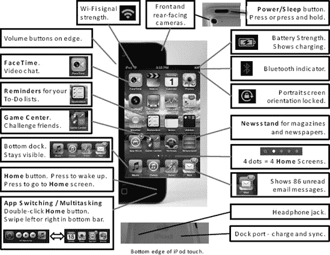

**图 1.** *iPod touch 的按钮、端口、开关和按键*

##### 切换应用（即多任务处理）

`iPod touch` 的一个出色功能是能够进行多任务处理或在应用之间切换（参见图 2）。

双击`主屏幕`按钮，调出屏幕底部的“`快速应用切换器`”栏。接着，向右滑动查看更多图标，然后轻点您想要启动的任何应用的图标。如果您没有看到想要的图标，请单击一次`主屏幕`按钮查看整个“`主屏幕`”界面。重复这些步骤即可跳回您刚刚离开的应用。方便之处在于，您刚刚跳离的应用始终会显示在“`快速应用切换器`”栏的第一个位置。

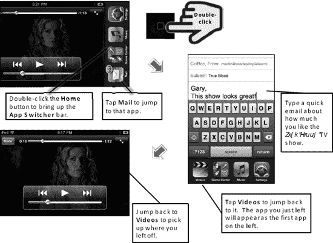

**图 2.** *通过双击`主屏幕`按钮进行多任务处理（切换应用）。*

##### 音乐控制与竖排方向锁定

如果您在“`快速应用切换器`”栏中从左向右滑动，将会看到更多图标。您可以轻点最左侧的图标来锁定屏幕旋转，中间的按钮用于控制当前正在播放的音乐或视频。最右侧的最后一个图标将启动您的`音乐`应用（参见图 3）。

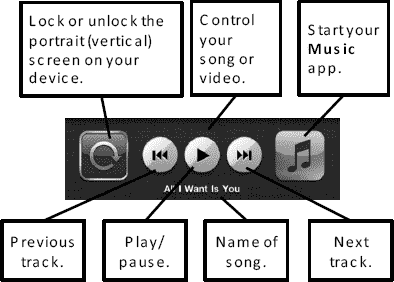

**图 3.** *“`快速应用切换器`”栏中的`屏幕旋转锁定`按钮、`音乐`应用控制和`音乐`图标*

##### 启动应用与使用软键

某些应用在屏幕底部设有软键，例如图 4 中所示的`音乐`应用。

要查看并使用`音乐`应用中的软键，您需要在 `iPod touch` 上拥有一些内容（例如音乐、视频和播客）。请参阅第 3 章：“与 iCloud、iTunes 等同步”，了解如何将音乐、视频等内容同步到您的 `iPod touch`。请按照以下步骤启动`音乐`应用并熟悉如何使用软键进行导航：

1.  轻点`音乐`图标以启动`音乐`应用。
2.  轻点底部的`歌曲`软键以查看您的专辑。
3.  轻点`播放列表`软键以查看您的表演者列表。
4.  尝试`音乐`应用中的所有软键。
5.  在某些应用（如`音乐`应用）中，您会在右下角看到`更多`软键。轻点此键可查看其他软键，甚至重新排列您的软键。

**提示：** 您可以通过高亮显示（通常带有颜色）来判断哪个软键被选中。其他软键为灰色，但依然可以触摸。

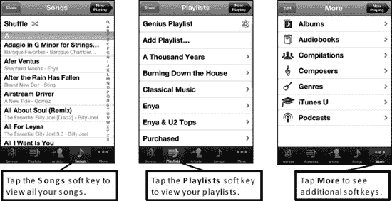

**图 4.** *在应用中使用软键*

##### 菜单、子菜单与开关

进入应用后，您只需触摸即可选择任意菜单项。以`设置`应用为例，轻点`声音`，然后轻点`铃声`，如图 5 所示。

子菜单是主菜单下的任何菜单。

**提示：** 如果您在菜单项旁边看到“`大于号`”符号（`>`），则表示存在子菜单或另一个界面。

如何返回上一个屏幕或菜单？轻点菜单顶部的按钮。例如，如果您在`铃声`界面，只需轻点`声音`按钮即可。

您会在 `iPod touch` 上看到许多开关，例如图 5 中`飞行模式`旁边的开关。要设置开关（例如，将开关从`关闭`更改为`开启`），只需触摸它或滑动它即可。

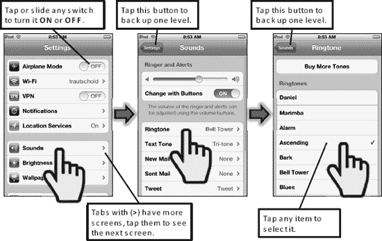

**图 5.** *选择菜单项、浏览子菜单和设置开关*

##### 解读连接状态图标

`iPod touch` 上的大部分功能（例如`邮件`、`Safari`浏览器、`App Store`和`iTunes`应用）仅在您连接到互联网时才能正常工作，因此您需要知道何时处于连接状态。理解如何解读状态栏可以节省您的时间并避免挫败感：

**Wi-Fi 网络信号强度（1-3 个符号）：**

通过查看 `iPod touch` 顶部状态栏的左端，您可以判断是否已连接到网络，以及连接的大致速度。表 1 显示了您可能在此状态栏上看到的典型示例。

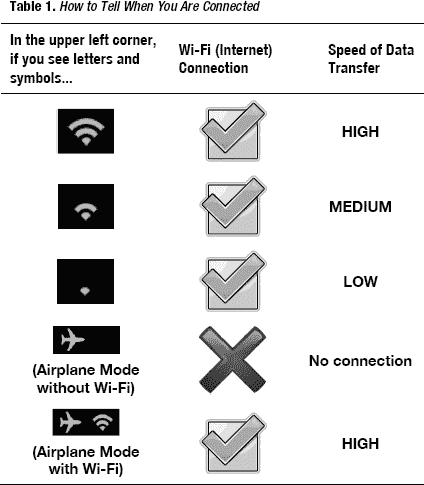

第 4 章：“连接到网络”向您展示如何将您的 `iPod touch` 连接到 Wi-Fi 网络。

#### 乘坐飞机时——飞行模式

在飞机上，乘务人员通常会要求你在起飞和降落期间关闭所有便携式电子设备。当飞机爬升到一定高度后，他们会告知可以重新开启“所有经批准的电子设备”。

**提示：** 请查阅第 4 章：“连接到网络”中的“国际旅行”部分，了解在携带 iPod touch 出国旅行时可以享用的许多省钱妙招。

如果你需要完全关闭 iPod touch，请按住右上角的`电源`按钮，然后用手指`滑动来关机`。

请按照以下步骤启用`飞行模式`：

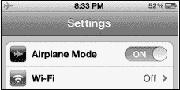

1.  轻点`设置`图标。
2.  将左列顶部的`飞行模式`开关设置为`打开`。
3.  注意，Wi-Fi 会自动`关闭`。

**提示：** 一些航空公司提供机上 Wi-Fi 网络。在这些航班上，你可能需要在适当的时候重新`打开` Wi-Fi。

你可以按照以下步骤`关闭`或`打开` Wi-Fi 连接：

1.  轻点`设置`图标。
2.  轻点屏幕顶部的`Wi-Fi`。
3.  若要启用 Wi-Fi 连接，请将页面顶部的`Wi-Fi`开关设置为`打开`。
4.  若要禁用 Wi-Fi，请将同一开关设置为`关闭`。
5.  选择 Wi-Fi 网络，并按照乘务员提供的步骤连接到机上 Wi-Fi。

#### 触摸屏基础

在本节中，我们将介绍如何与 iPod touch 的触摸屏进行交互。

##### 触摸屏手势

iPod touch 拥有极其灵敏和直观的触摸屏。苹果公司——以其易于使用的 iPad、iPhone 和 iPod 设备而闻名——推出了一款分辨率更高、响应速度极佳的出色触摸屏。

如果你习惯于使用物理键盘和轨迹球或触控板，甚至是 iPod 直观的滚轮，那么掌握这款触摸屏需要付出一些努力。不过，稍加练习，你很快就会熟练地操作你的 iPod touch。

你可以通过组合使用以下方式，在 iPod touch 上完成几乎任何操作：

*   触摸屏“手势”
*   轻点屏幕上的图标或软按键
*   点击底部的`主屏幕`按钮

以下各节将介绍你可以在 iPod touch 上使用的各种手势。

### 轻点与轻拂

要启动应用、确认选择、选取菜单项或选择答案，只需轻点屏幕。要在`列表`模式下快速浏览联系人、列表和音乐资料库，可以左右或上下轻拂以滚动浏览项目。图 6 展示了这两种手势。

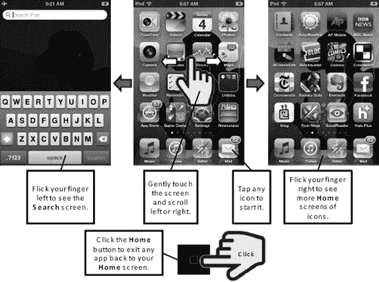

**图 6.** *基本的触摸屏手势*

### 轻扫

要执行轻扫操作，请按照图 7 所示，轻轻触摸并移动手指。你也可以通过此操作在打开的`Safari`网页和图片之间切换。轻扫同样适用于列表，例如`通讯录`列表。

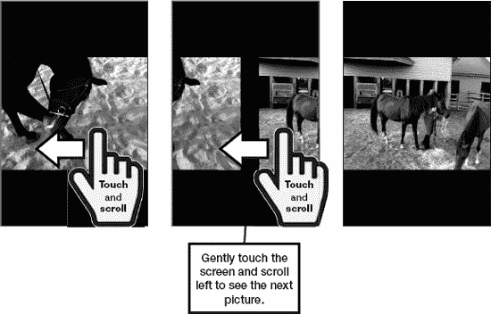

**图 7.** *触摸并轻扫以在图片和网页之间切换。*

#### 滚动

滚动操作很简单，只需触摸屏幕并朝你想滚动的方向滑动手指即可（参见图 8）。你可以在邮件、报刊杂志应用、`Safari`网页浏览器、菜单等许多地方使用此技巧。

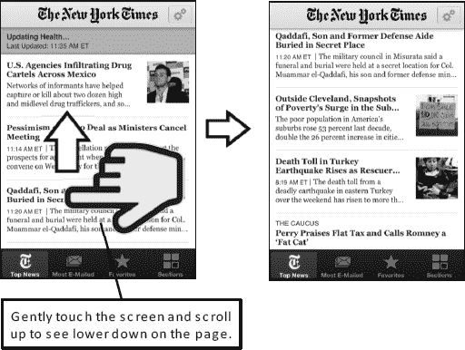

**图 8.** *触摸并滑动手指以在网页、放大的图片等界面上滚动。*

###### 双击

你可以双击屏幕来放大视图，然后再次双击来缩小。这在许多地方都适用，例如网页、邮件和图片（参见图 9）。

**图 9.** *双击以放大或缩小*

#### 捏合

你还可以通过张开或合拢双指来实现放大或缩小。这在许多地方都适用，包括网页、邮件和图片（参见图 10）。请按照以下步骤使用*捏合*功能放大：

1.  要放大，将两根手指并拢放在屏幕上：
2.  逐渐张开手指。屏幕会放大。

请按照以下步骤使用捏合功能缩小：

1.  要缩小，将手指分开一定距离放在屏幕上。
2.  逐渐合拢手指，直至它们接触。屏幕会缩小。

**图 10.** *张开手指以放大，合拢手指以缩小。*

### 应用参考表格

本节提供了一些便捷的参考表格，根据功能对你 iPod touch 上预装的各种应用进行了分组。这些表格中还包含了你可以从`App Store`下载的其他实用应用。每个表格都会提供应用的简要说明，并告诉你在本书中何处可以找到关于它的更多信息。

#### 入门

表 2 提供了一些快速链接，可帮助你连接 iPod touch 到网络（使用 Wi-Fi）；购买和欣赏歌曲或视频（使用`iTunes`、`音乐`和`视频`应用）；让 iPod touch 进入睡眠或关机；解锁你的 iPod touch 等等。

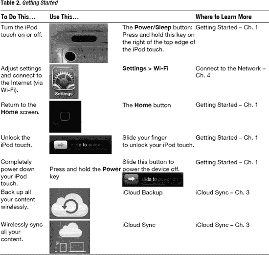

#### 保持联系与井然有序

表 3 提供了各种链接，涵盖从整理和查找联系人到管理日历、处理电子邮件、发送信息、获取驾车路线等方方面面。

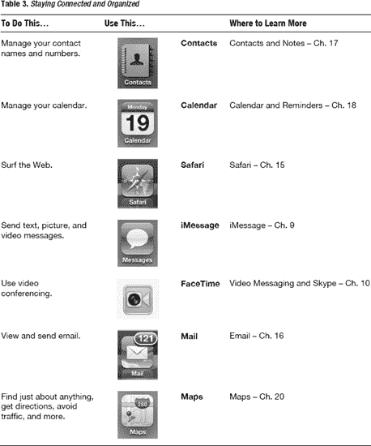

#### 享受娱乐

你的 iPod touch 能带来很多乐趣；表 4 向你展示了如何做到。例如，你可以用 iPod touch 购买或租赁电影，通过`Pandora`收听免费的互联网广播，或者购买一本书并用`iBooks`以全新方式享受阅读。如果你已经在使用 Kindle，你可以将所有 Kindle 图书同步到 iPod touch 上，随时阅读。你还可以从 App Store 中成千上万的各类应用中选择下载，让你的 iPod touch 更令人惊叹、更有趣、更实用。你也可以从 Netflix 或 iTunes 租赁电影，并立即下载以供日后观看（比如在飞机或火车上）。

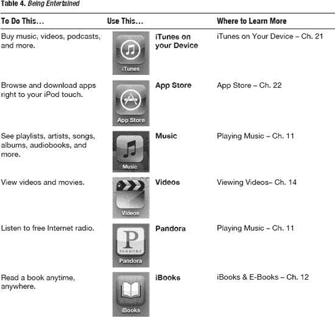

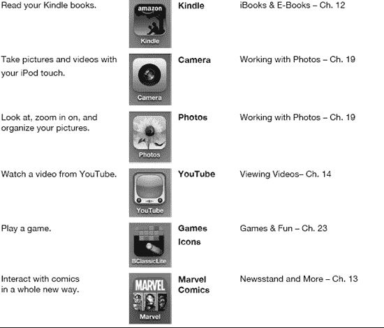

#### 获取资讯

你还可以用 iPod touch 阅读你最喜爱的杂志或报纸，并配有最新的生动图片和视频（参见表 5）。或者，用它来查看最新的天气预报。

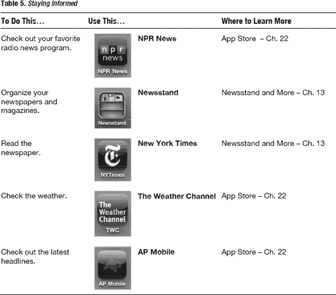

##### 社交网络

你还可以使用 iPod touch 上的社交网络工具，与朋友、同事及专业人脉圈保持联系和最新动态（参见表 6）。

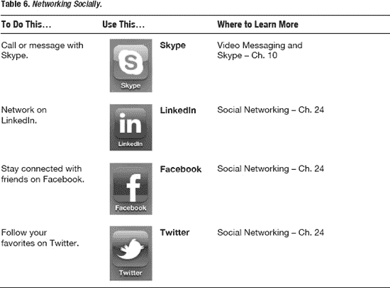

#### 提高效率

iPod touch 也能帮助你提高工作效率。你可以使用`GoodReader`应用来访问和阅读几乎任何 PDF 文件或其他文档。你可以使用基础的`备忘录`应用做笔记，也可以升级到功能强大的`Evernote`应用，它拥有集成音频、图片和文字笔记的惊人能力，并能将所有内容同步到网站。你还可以用 iPod touch 设置闹钟、计算小费、查看行走方向以及录制语音备忘录（参见表 7）。

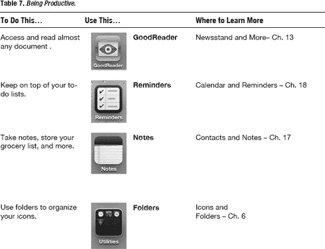

