# 第 1 章

## 开始使用

在本章中，我们将带您逐步了解您的新 `iPod touch` 以及包装盒中的所有物品。我们还将探讨充电的方方面面以及如何延长电池续航时间。要开始使用您的 `iPod touch`，您需要先将其连接到 `iTunes` 以进行激活和注册。在本章末尾的“iPod touch 基础”部分，我们将向您展示如何在 `iPod touch` 上进行基本操作，以便您能快速上手并运行。

### 了解您的 iPod touch

在本节中，我们将向您展示如何使用 `iPod touch` 包装盒中的所有物品。我们还会提供一些 `iPod touch` 电池和充电技巧，讨论如何判断您的 `iPod touch` 是否已激活，并探讨 `滑动以解锁` 功能。

#### 包装盒内物品

如果你是首次接触`iPod touch`，可能会觉得包装盒内容有些单薄。不过，盒中确实包含了上手使用和享受`iPod touch`所需的一切——除了那份详尽的使用手册（这正是我们编写本书的原因！）。以下是包装盒内的物品：

*   **iPod touch**：打开包装盒最上层，你首先看到的就是崭新的`iPod touch`。
*   **纸质文件夹**：在放置`iPod touch`的塑料托架下方，你会找到一个纸质文件夹，内含以下物品：
    *   **操作指南**：一本 4.5 x 2.5 英寸的小巧折叠手册，共 19 页，介绍关于`iPod touch`的基础信息。
    *   **iPod touch 产品信息指南**：一本 4.5 x 2.5 英寸的小册子，但字体过小，难以阅读。其中包含与`iPod touch`相关的所有法律条款、条件、警告和免责声明。
    *   **苹果标志贴纸**：两个漂亮的白色苹果标志贴纸，你有时能在车窗上看到它们。尽情享用吧！

在包装盒底部，你会找到如图 1-1 所示的物品：一副耳机和一根 USB 线缆。

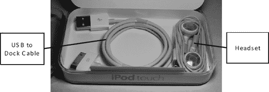

**图 1-1.** *位于 iPod touch 包装盒底部的耳机和 USB 转 Dock 连接线*

##### iPod touch 耳机

耳机包含两个用于收听音乐、视频或进行`FaceTime`通话的白色耳塞，以及一个连接在右耳塞导线上的小型控制器。将其插入`iPod touch`左上边缘的插孔。请确保完全插入——刚开始插入时可能需要稍用力按压。

如下图所示，控制器上有`加号`（`+`）和`减号`（`-`）按键，以及一个`中央`按钮。你可以使用（`+`）和（`-`）键调节音量，并使用`中央`按钮接听或挂断`FaceTime`通话。

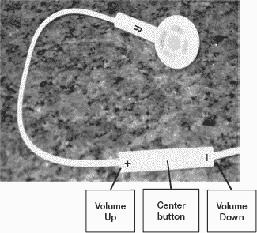

**注意：** 通过双击或三击`中央`按钮，你可以在歌曲之间切换。双击跳至下一曲。三击返回上一曲。

随附的耳机还内置了一个用于`FaceTime`通话的小型麦克风。

###### USB 转 Dock 连接线

USB 转 Dock 连接线用于将`iPod touch`连接到电脑；它同时也充当电源线。

###### 墙壁电源适配器

墙壁电源适配器一端是 USB 接口，另一端是插入电源插座的插头。只需将 USB 线连接到`iPod touch`，另一端连接到电源适配器，即可通过墙壁插座为`iPod touch`充电。

#### 为 iPod touch 充电与电池续航提示

你的`iPod touch`可能已存有一些电量，但你可能希望将其完全充满，以便在完成设置后能享受不间断的长时间使用。利用这段充电时间，你可以阅读本章剩余内容、安装或更新`iTunes`应用，或者浏览所有出色的`iPod touch`应用（参见第 22 章：“神奇的应用商店”）。

##### 通过电源插座充电

为`iPod touch`充电最快的方式是直接将其插入墙壁插座。使用连接`iPod touch`到电脑的同一根 USB 线。将线缆较宽的一端插入`iPod touch`底部的接口（靠近`主屏幕`按钮旁），将 USB 线另一端插入墙壁电源适配器。你可以用大约 10 美元购买这些电源适配器。

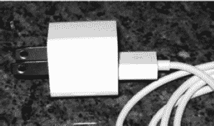

通过查看屏幕，你可以判断`iPod touch`是否正在充电。你会看到电池指示图标（位于右上角）内出现闪电标志或插头图标。

`主电池`图标会显示当前电量。右侧的图像显示了一部正在充电且电量几乎充满的`iPod touch`。

**提示：** 一些较新的汽车配有内置电源插座（与家中插座相同），你可以在车内插入`iPod touch`的电源线。有些车型还提供基座选项，允许你通过车载收音机控制`iPod`应用。这些插座有时隐藏在前排座椅后方的中央控制台中。

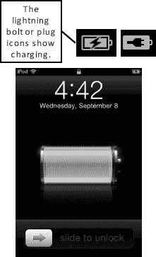

##### 通过电脑充电

将`iPod touch`连接到电脑时，也可以为其充电，尽管速度比直接连接墙壁充电器稍慢。

**提示：** 尝试使用电脑上不同的 USB 端口。一些 USB 端口共享总线，供电较少；而其他端口拥有独立总线，供电更多。

为获得最佳充电效果，建议将电脑插在墙壁插座上。如果电脑未连接电源，`iPod touch`仍会充电，但速度较慢。请注意，如果笔记本电脑进入睡眠状态或合上屏幕，`iPod touch`将停止充电。

##### 通过其他配件充电

某些专为`iPod touch`设计的配件也能为其充电。最常见的是`iPod touch`/iPod 音乐基座。这些是扬声器系统，你可以将`iPod touch`插入其中播放音乐。仅当屏幕上出现以下警告信息时，`iPod touch`才无法充电：“此配件不支持充电。”这种情况通常发生在较旧的配件或并非专为你的`iPod touch`设计的配件上。

 **提示：保护壳与外部电池二合一**

有些保护壳实际上内置了外部电池。市面上有多个制造商提供此类产品。其中一家供应商 mophie（[`www.mophie.com`](http://www.mophie.com)）为`iPod touch`生产了此类保护壳。

##### 预期电池续航时间

苹果公司表示，凭借更大的电池和先进技术，`iPod touch`的续航时间应比前几代`iPod touch`更长（参见表 1-1）。

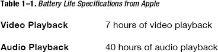

上述电池续航时间基于理想条件，且电池全新充满电。你会注意到，随着时间的推移，实际电池续航能力将会下降。数据来源：Apple.com

##### 电池与充电提示

关键问题在于：如何才能充分利用电池续航，并确保`iPod touch`在你需要时已充好电、准备就绪？在本节中，我们将介绍一些技巧来帮助你实现这一目标。

###### 提升单次充电的使用时间

为延长电池续航时间，请尝试以下建议：

*   **降低屏幕亮度**：轻点`设置` > `亮度`，然后使用滑块将亮度降低至一半以下，找到适合你的亮度水平。
*   **关闭定位服务**：如果你不需要将实际位置传输给应用，可以关闭此功能。轻点`设置` > `定位服务`，然后将`定位服务`设为`关闭`。如果你打开了某个请求定位的应用，系统会提醒你重新开启该功能。
*   **设置更短的自动锁定时间**：此功能可缩短`iPod touch`在不使用时进入睡眠模式（即关闭屏幕）所需的时间。缩短此时间有助于节省电量。操作方法是：轻点`设置` > `通用` > `自动锁定`，然后将`自动锁定`设为尽可能短的时间——如果你喜欢，甚至可以设为`1 分钟`。
*   **关闭推送邮件和推送通知。**

你可以访问苹果网站 [www.apple.com/batteries/iPod touch.html](http://www.apple.com/batteries/iPodtouch.html) 了解更全面的电池使用技巧。

###### 延长电池整体寿命

`iPod touch` 使用可充电电池，其有效寿命内的充电循环次数有限；换句话说，随着时间的推移，电池保持电量的能力会逐渐下降。你可以通过确保每月至少将电池完全耗尽一次来延长`iPod touch`的电池寿命。如果你这样做，可充电电池的使用寿命会更长。

###### 为你的`iPod touch`寻找更多充电地点

无论你做什么，如果你真的经常使用你的`iPod touch`，你总会想找到更多地点和方式来为其充电。除了使用电源线或将`iPod touch`连接到电脑，你还可以利用表 1–2 中介绍的充电技巧。

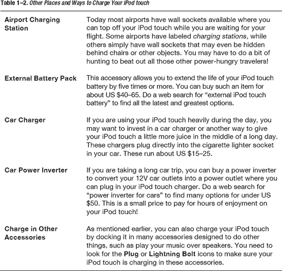

### 设置你的`iPod touch`

至此，你已经了解了关于`iPod touch`的一些基础知识和如何充分利用其电池的方法。现在，你已经准备好开始享受它了！下一步就是设置你的`iPod touch`。

#### 判断是否需要设置你的`iPod touch`

如果你的`iPod touch`上出现`Welcome`屏幕，那么你需要先完成设置才能使用它。通过 iOS 5，你可以通过几种方式来设置`iPod touch`。首先，你可以使用 Wi-Fi 网络和 iCloud 进行空中下载（OTA）设置。或者，你也可以使用 USB 底座连接线将`iPod touch`连接到电脑，并通过`iTunes`服务激活它。

如果这是你的第一部`iPod touch`，或者你想将其设置为一部全新的`iPod touch`，你可能希望使用 iCloud OTA 设置。

如果你是从旧款`iPod touch`型号升级，你可能希望使用`iTunes`服务从备份中恢复。

### 使用 iCloud 通过空中下载方式设置你的`iPod touch`

通过 iOS 5，苹果终于摆脱了`iTunes`的连接线。这意味着你无需再将`iPod touch`连接到电脑即可激活或设置它。相反，你可以直接通过`iPod touch`，使用苹果全新的`iCloud`服务进行 OTA 激活。

**注意：** 在初始设置过程中，你可以连接到任何可用的 Wi-Fi 网络，这是使用 iCloud 进行`iPod touch` OTA 设置所必需的。如果你家里、工作场所或学校的 Wi-Fi 网络不可用，并且身边也没有像星巴克这样的公共接入点，那么你将需要稍后再激活你的`iPod touch`。（你也可以选择通过电脑上的`iTunes`来设置你的`iPod touch`；但即便如此，你仍然需要互联网连接来访问苹果的激活服务器。）

按照以下步骤，使用 iCloud 设置你的`iPod touch`，如下图所示的前述`Welcome`屏幕：

1.  触摸`Arrow`按钮并沿指示方向在屏幕上滑动以进行设置。
2.  选择你希望在`iPod touch`上使用的语言。苹果会根据你购买`iPod touch`的地点提供最常用的选项；不过，你也可以点击`Down Arrow`以获得更多语言选择。
3.  选择好你偏好的语言后，点击屏幕右上角的蓝色`Next`按钮。
4.  选择你的国家或地区。同样，苹果会根据你购买`iPod touch`的地点提供一个默认选项；但你可以点击`Show More…`展开列表。点击蓝色`Next`按钮继续。
5.  决定是否启用或禁用定位服务，然后点击蓝色`Next`按钮继续。

    

    **注意：** `Location Services`使用基站三角定位和 Wi-Fi 路由器映射来确定你的`iPod touch`的大致位置。此功能用于签到游戏（如 Foursquare）、社交网络（如 Facebook）、地理标记（在`Camera`应用中）以及实用工具（如`Find my iPod touch`）。除非你特别需要全局禁用所有定位服务，否则你很可能希望现在就开启定位服务功能。你之后可以在`Settings`应用中有选择地禁用或启用这些服务（例如，关闭`Camera`应用的地理标记，但保持`Find my touch`开启）。

6.  选择你的 Wi-Fi 网络，输入网络密码，然后点击蓝色`Next`按钮继续。
7.  你的`iPod touch`现在将连接到苹果进行激活。这可能需要几秒钟到几分钟的时间，具体取决于你的连接速度以及苹果服务器的繁忙程度。
8.  一旦激活完成，你将被提供以下选项：将你的`iPod touch`设置为新设备、从 iCloud 备份恢复、或从`iTunes`恢复。

#### 使用 iCloud 设置一部新的`iPod touch`

如果这是你的第一部`iPod touch`——或者你只想要一个干净、全新的开始——请选择 `Set up as a new iPod touch`。

**提示：** 从备份恢复——尤其是从不同设备的备份恢复（例如，从 iPad 备份恢复`iPod touch`）——有时会导致问题，比如应用崩溃更频繁或电池续航更短。如果你在从之前的备份恢复后遇到问题，你可能想尝试将你的`iPod touch`设置为新设备。你将不得不从头重新设置所有设置和账户，并且会丢失所有已保存的应用和游戏数据；然而，当你的`iPod touch`已不稳定到无法日常使用时，这有时是你唯一的选择。

要将你的`iPod touch`设置为新设备，你需要使用现有的 Apple ID 登录，或者创建一个新的免费 Apple ID。Apple ID 可以是以下任何一种：

*   **iTunes ID**：这是你用来登录`iTunes`并购买音乐、电视节目、电影、App Store 应用和游戏以及 iBooks 的电子邮件地址和密码。
*   **免费 Apple ID**：这是你用来登录`Find my iPod touch`、FaceTime、Game Center、iCloud 或任何其他近期免费的 Apple 服务的电子邮件地址和密码。这也可以是你用于在线 Apple Store 购物的同一个 ID。

**注意：** 如果你使用苹果产品和服务已有一段时间，一个人拥有多个 Apple ID 的情况并不少见。例如，你可能有一个 iTunes ID、一个旧的 MobileMe 账户和一个 Apple Store ID。不幸的是，在撰写本文时，苹果不允许合并 ID，因此你必须选择其中一个用于 iCloud。

如果你有旧的 MobileMe 账户，苹果会为你将其迁移到 iCloud。请访问 [`http://www.me.com/move`](http://www.me.com/move) 开始此过程。

否则，作者建议你使用你的 iTunes ID，因为它关联了你所有已购买的音乐、媒体、应用和游戏，并且你将能够利用 iCloud 的重新下载功能，轻松地将这些购买记录恢复到你现在和未来的新设备上。

如果你有 Apple ID，现在就登录，接受条款和条件，然后直接跳到`Configuring iCloud Options`部分。如果你没有 Apple ID，现在就创建一个。

### 创建免费 Apple ID

如果你从未使用过 iTunes，也没有 Apple ID，那么你需要创建一个。在 iPod touch 上即可快速完成：

1. 轻点**创建新 Apple ID**。
2. 滚动 **年**、**月** 和 **日** 滚轮，选择正确日期来输入生日，然后轻点蓝色 **下一步** 按钮。
3. 在相应字段中输入你的名和姓，然后轻点蓝色 **下一步** 按钮。

   

4. 选择是使用现有电子邮件地址（例如 Gmail、Hotmail、Yahoo! 或个人电子邮件地址），还是创建一个新的 iCloud 电子邮件地址（`@me.com`）。如果你不想费心记住新邮箱地址，建议使用现有地址。如果你希望将邮件分开管理，那么可以创建一个新的。
5. 如果你正在创建新的 iCloud `@me.com` 地址，请输入密码并点击 **验证**。你的密码必须“强”；即必须包含大写和小写字母、至少一个数字，并且长度至少为 8 个字符。
6. 选择一个**安全信息**问题。这个问题应易于你记忆，但他人难以轻易猜到（也就是说，任何人都不应能仅通过查看你的博客、Facebook、Google、Yahoo! 或其他在线个人资料页面就能找到答案）。
7. 选择你是否希望从此新地址接收来自 Apple 的电子邮件更新。如果不希望，请将此选项设置为 **关闭**。
8. 你需要接受 **条款与条件** 两次：首先轻点左下角的蓝色 **同意** 按钮，然后在弹出的确认窗口中轻点半透明的 **同意** 按钮。同样，验证可能需要片刻。
9. 然后 Apple 将设置你的新 Apple ID。这可能需要一点时间。

### 配置 iCloud 选项

使用你的 Apple ID 登录后，即可配置你的 iCloud 设置：

1. 如果你希望使用 **设置 iCloud** 功能——我们建议你这样做，因为它免费且提供大量有用的备份和同步功能——那么请将 **iCloud** 选项保持为 **打开** 状态，并轻点蓝色 **下一步** 按钮。
2. 选择是否使用 iCloud 备份服务，通过无线方式将 iPod touch 备份到 Apple 数据中心，或通过 USB 使用 iTunes 备份到电脑。同样，我们建议将 **iCloud** 设置为 **打开**，因为它是自动的，你无需记着去手动操作。

   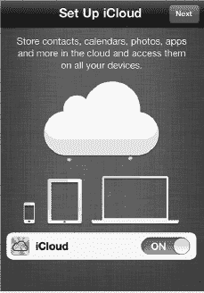

3. **查找我的 iPod touch** 服务是 iCloud 的免费部分，它可以显示你 iPod touch 的大致位置（你能知道它是在家还是在办公室，但无法确定具体房间）、让它响铃以便你发现它（即使它掉到汽车座椅下或沙发后面），甚至在你设备丢失或被盗时抹掉所有个人数据。如果你希望使用此功能，请将此选项保持为 **打开** 状态。
4. 这就完成了！你的 iPod touch 现已设置好，可以开始使用了。

### 使用 iCloud 恢复 iPod touch

如果你之前曾使用 iCloud 备份过 iPod touch，则可以直接从设备通过无线方式从该备份恢复：

1. 轻点 **从 iCloud 备份恢复**。
2. 输入你 iCloud Apple ID 的电子邮件地址和密码。
3. 选择要恢复的备份。通常，这会是可用的最新备份。
4. 你的 iPod touch 将重新启动、下载备份并重新启动。此过程可能需要几分钟，尤其当你有大量数据需要恢复时。
5. iPod touch 恢复完成后，你的应用将开始下载和安装。iCloud 可以同时下载和安装多个应用，你可以在恢复过程中继续使用你的 iPod touch。

## 使用 iTunes 设置 iPod touch

如果你不想使用 iCloud，或者有之前 iTunes 的备份需要进行恢复，那么你仍然可以通过 USB 用电脑设置你的 iPod touch。

如果你的电脑未安装 iTunes，请打开网页浏览器并访问 [`www.itunes.com/download`](http://www.itunes.com/download)。从提供的链接下载该软件。

如果你已安装 iTunes，则应检查是否有更新版本可用。截至本书出版时，版本 10.5 为最新版本。请按照以下步骤更新你的 iTunes 版本：

1. 启动 **iTunes** 应用。
2. 如果你使用的是 Windows 系统，请从菜单中选择 **帮助**，然后选择 **检查更新**。
3. 如果你使用的是 Mac 系统，请从菜单中选择 **iTunes**，然后选择 **检查更新**。
4. 如果有可用更新，请按照说明更新 **iTunes**。

### 从之前的备份恢复 iPod touch

首次将新 iPod touch 连接到 iTunes 时，你将看到如图 1–2 所示的屏幕。

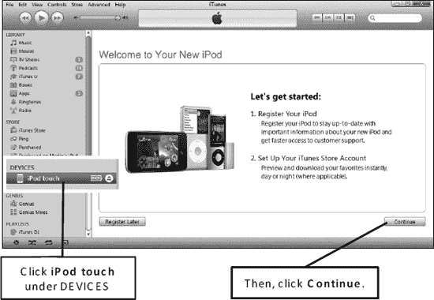

**图 1–2.** *欢迎使用 iPod 屏幕*

**警告：** 我们曾听闻有人在将非 iPod touch 设备（例如 iPad 或 iPod touch）的备份恢复到 iPod touch 时遇到问题（例如死机或电池续航缩短）。此外，选择 **恢复** 的前提是你已对旧设备进行了备份；否则，将没有数据可恢复到新 iPod touch。

请执行以下操作，从另一台 iPod touch 或设备的备份进行恢复：

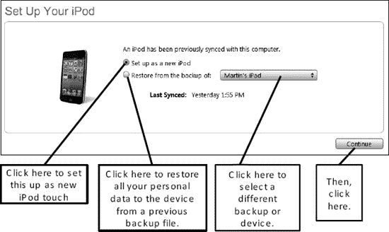

**图 1–3.** *设置 iPod touch 屏幕*

1. 点击 **从以下设备的备份恢复** 左侧的单选按钮（见图 1–3）
2. 从下拉菜单中选择特定的备份文件。
3. 点击 **继续** 按钮，将备份文件中的数据恢复到你的 iPod touch。至此，你已完成 iPod touch 的初始设置。

**注意：** 你仍需同步希望在 iPod touch 上使用的任何应用、游戏、音乐和其他媒体。

## 维护你的 iPod touch

现在你已经使用 iTunes 设置了 iPod touch，你将需要了解如何安全地清洁屏幕以及使用各种保护壳进行防护。

### 清洁 iPod touch 屏幕

使用 iPod touch 一段时间后，你会发现你的手指（或他人的手指）在原本光洁的屏幕上留下了污迹和油渍。你将需要了解如何安全地清洁屏幕。保持屏幕全天更干净的方法之一是为 iPod touch 贴上保护屏贴，这还有可能带来减少眩光的额外好处（将在下一节讨论）。

我们还建议采取以下步骤：

1. 按住顶部的 **睡眠/电源** 键关闭 iPod touch，然后使用滑块关机。
2. 拔下所有线缆，例如 USB 同步线。
3. 使用干燥、柔软的无线头布（如清洁眼镜用的布或类似布料）擦拭屏幕。
4. 如果干布无效，可尝试用少量水将布稍微打湿。如果使用湿布，请尽量避免水进入开口处。
5. 另一种选择是使用 Klear Screen 的 *iKlear* 屏幕清洁剂。该产品适用于你的 iPod touch 以及其他设备，如电脑、笔记本电脑或 iPad 屏幕。

**警告：** 切勿使用家用清洁剂、研磨性清洁剂（如 SoftScrub）、氨水类清洁剂（如 Windex）、酒精、喷雾剂或溶剂。

### iPod touch 保护壳与保护套

将 iPod touch 拿到手中后，你会注意到它精美的构造。你也会发现它可能相当滑、会轻微晃动，或者在你打字时背部容易被刮花。

我们建议为你的 iPod touch 购买一个保护壳。普通保护壳的价格约为 10–40 美元，而精美的皮革保护壳可能花费 100 美元或更多。花点小钱保护你价值 200 美元或更高的 iPod touch 是非常明智的。

#### 何处购买保护壳

您可以通过以下任一渠道为 iPod touch 购买保护壳：

- 亚马逊官网 ([`www.amazon.com`](http://www.amazon.com))
- Apple 配件商店 ([`http://store.apple.com`](http://store.apple.com))
- iLounge ([`http://ilounge.pricegrabber.com`](http://ilounge.pricegrabber.com))

您也可以在网络上搜索“iPod touch 保护壳”或“iPod touch 防护套”。

**提示：** 您*或许*能为 iPod touch 使用专为其他类型设备或智能手机设计的保护壳。如果选择此途径以节省开支，请务必确保您的 iPod touch 能稳固地适配所选的保护壳或保护套。

#### 选购指南……

以下部分列出了适用于 iPod touch 的几种保护壳类型及其大致价格区间。

##### 橡胶/硅胶保护壳（10–30 美元）

橡胶和硅胶保护壳能提供缓冲握持感，吸收 iPod touch 的磕碰和擦伤，并让您的手指避免直接接触 iPod touch 边缘。

**优点：** 此类保护壳价格低廉、色彩丰富，且握持舒适。

**缺点：** 不如皮革保护壳显得专业。

##### 内置外接电池盒的二合一保护壳（50–80 美元）

结合外接电池盒的保护壳具有双重用途：将硬壳保护套的防护特性与可充电的外接电池盒结合在一起。诸如 Mophie 和 Case-Mate 等制造商正忙于为其保护壳开发 iPod touch 版本；如果运气好，当您读到本书时，这些产品可能已经上市。

**优点：** 此类保护壳在保护 iPod touch 的同时，还能显著提升电池续航——在某些情况下，可提升超过 50% 的续航时间。

**缺点：** 会增加 iPod touch 的重量和体积。

##### 防水保护壳（10–40 美元）

防水保护壳可保护您的 iPod touch 免受水的侵害，让您在雨天、泳池边、海滩上、船上等环境中安全使用设备。

**优点：** 此类保护壳能有效防护来自各类水源的损害。

**缺点：** 可能会让触摸屏操作更困难，且通常不具备防摔或防撞功能。

##### 硬质塑料/金属保护壳（20–40 美元）

硬质塑料和金属保护壳能为划痕、磕碰和短距离跌落提供坚实保护。

**优点：** 此类保护壳为您的 iPod touch 提供卓越保护。

**缺点：** 会增加一些体积和重量。此外，给 iPod touch 充电时可能需要取下此类保护壳，否则可能导致设备过热。

##### 皮革或特殊材质保护壳（50–100 美元以上）

皮革及其他特殊材质保护壳能带来更多奢华感，同时保护 iPod touch。

**优点：** 此类保护壳为您的 iPod touch 增添一丝奢华质感，同时保护设备正面和背面。

**缺点：** 价格更昂贵，且会增加体积和重量。

##### 屏幕保护膜（5–40 美元）

屏幕和后盖玻璃保护膜有助于保护 iPod touch 的屏幕和背面免受划痕。

**优点：** 此类保护壳通过防刮擦来延长 iPod touch 的使用寿命；大多数此类保护膜还能减少屏幕眩光。

**缺点：** 部分保护膜可能会增加眩光或影响屏幕的触摸灵敏度。

### iPod touch 基础操作

现在您已经给 iPod touch 充好电、清洁了屏幕，并给它穿上了一件崭新的保护壳——让我们来看看其软件操作的一些基础知识吧。

#### 开机/关机与休眠/唤醒

若要开机，请按住 iPod touch 顶部边缘的`电源/休眠`按钮几秒钟。如果 iPod touch 已完全关机，快速轻按此按钮是无法开机的——在这种情况下，您需要按住按钮直至看到 iPod touch 启动。

当您不再使用 iPod touch 时，有两种选择：您可以将其置于休眠模式，或将其完全关闭（参见图 1–4）。

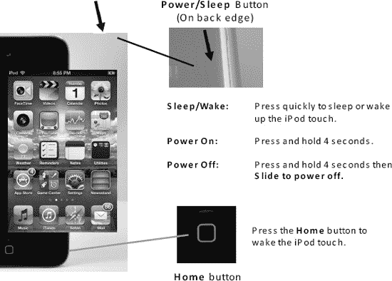

**图 1–4.** *使用 iPod touch 上的电源/休眠按钮和主屏幕按钮。*

休眠模式的好处是：当您想再次使用 iPod touch 时，只需轻按`电源/休眠`按钮或`主屏幕`按钮即可将其唤醒。如果您希望最大限度地节省电量，或者知道将在较长时间内不会使用 iPod touch——例如睡觉时——则应将其完全关闭。操作方法如下：按住`电源/休眠`按钮，直到出现`滑动来关机`滑块。只需将滑块向右滑动，iPod touch 便会关机。

#### 辅助触控功能

作为其出色辅助功能的一部分，Apple 为有特殊身体或运动技能需求者提供了辅助触控功能。这包括硬件按钮的触摸屏版本，以及常用和自定义手势。

请按照以下步骤启用辅助触控功能：

1.  轻按`设置`图标。
2.  轻按`通用`。
3.  轻按页面底部的`辅助功能`。
4.  轻按`辅助触控`。
5.  将`辅助触控`开关设置为`开启`。
6.  当屏幕右下角出现`辅助触控`悬浮图标时，轻按它。
7.  轻按`主屏幕`来模拟物理按压硬件`主屏幕`按钮。
8.  轻按`设备`以访问其他硬件按钮模拟器，包括`旋转屏幕`、`锁定屏幕`、`静音`/`取消静音`、`调高音量`、`调低音量`和`摇动`。
9.  轻按`手势`或`收藏`（收藏的手势）以访问捏合、轻扫以及任何已设置的自定义手势。
10. 轻按悬浮菜单的中央区域可返回上一级菜单或退出辅助触控。

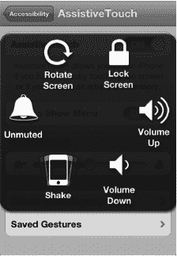

**注：** 辅助触控还支持复杂的手势，包括自定义手势。

#### 滑动解锁与快速相机和媒体访问

一旦您的 iPod touch 被激活，您将看到`滑动来解锁`屏幕，如图 1–5 所示。

当有音乐播放时，连按两次`主屏幕`按钮可查看媒体控制，更重要的是，当您想快速抓拍照片时，可以立即访问您的相机。轻按底部滑块旁边的相机图标。

要进入您的`iPod touch`，请将手指放在屏幕上，沿着箭头指示的路径将`滑动来解锁`按钮向右移动。完成后，您将看到您的`主屏幕`。

请注意底部 Dock 栏中的四个图标。此 Dock 栏中的项目不会移动，而其余图标可以在不同的*页面*之间来回移动。您可以在第 6 章：“图标与文件夹”中的“移动图标”部分了解如何将您喜爱的图标移入底部 Dock 栏。

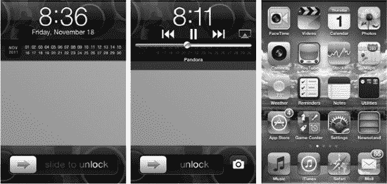

**图 1–5.** ***滑动来解锁**、快速相机和媒体访问以及您的**主屏幕**。*

#### 在应用程序和设置界面中导航

在 iPod touch 应用程序的界面间导航非常简单，只需轻点屏幕即可：

1.  轻按`设置`图标以启动`设置`应用。
2.  轻触`通用`以查看通用设置。
3.  轻触`网络`以查看网络设置。
4.  您可以通过轻点来切换任何开关。例如，轻触`数据漫游`旁边的`关闭`开关，它会切换为`开启`。
5.  要返回上一级界面，请轻触左上角的按钮。在此例中，您需要轻触`通用`按钮以离开`网络设置`界面。

#### 主屏幕按钮

您最常使用的按钮是`主屏幕`按钮。此按钮将启动您在 iPod touch 上执行的所有操作。如果您的 iPod touch 处于休眠状态，请按一次`主屏幕`按钮将其唤醒（假设它处于休眠模式）。

按下`主屏幕`按钮也会让您退出任何应用程序，并带您回到`主屏幕`。

#### 通过双击主屏幕按钮访问快速应用程序切换器

访问快速应用程序切换器只需双击`主屏幕`按钮即可。

1.  在任何应用中，或从`主屏幕`界面，双击`主屏幕`按钮。
2.  屏幕会向上滑动，您会在底部看到一栏小图标。这些代表您自启动 iPod touch 以来打开过的应用程序。
3.  轻点任意图标即可切换回该应用。
4.  向左滑动手指可查看更多应用。
5.  向右滑动手指可查看方向锁定和媒体控制。
6.  再次向右滑动手指可查看音量控制和 AirPlay 按钮。

按照以下步骤，从某个应用中访问快速应用程序切换器：

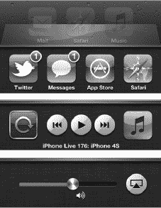

#### 音量键

在 iPod touch 的左上侧（参见图 1-5），您可以看到一些简单的`音量增大/音量减小`键，它们用起来会非常方便。

##### 调节播放音量或 iPod touch 语音音量

您可以使用`音量`键来调高或调低 iPod touch 的音量，无论您是在听音乐、看视频、欣赏其他内容，还是在接听 FaceTime 通话。听音乐或看视频时，您也可以使用屏幕上的滑块条来调节音量（参见图 1-6）。

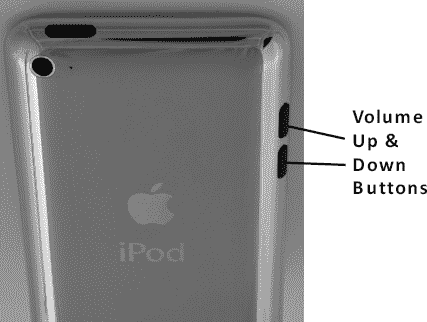

**图 1-6.** *在 iPod touch 上调节音量*

**提示：** 当您在`相机`应用中时，`音量增大`按钮会变成相机快门，让您快速拍照。

#### 锁定屏幕为竖排（垂直）方向

如果您将 iPod touch 侧向倾斜，您会注意到在某些应用中，屏幕会旋转至横排（横向）方向。您可能希望如此，以便使用更大的`横向`键盘进行输入。然而，有时当您将 iPod touch 侧放时，您可能不希望屏幕从竖排方向旋转。在这些情况下，您可以锁定屏幕为竖排方向。

1.  双击`主屏幕`按钮。
2.  从左向右滑动以查看媒体和屏幕锁定控制。
3.  轻点左侧图标中的`竖排方向锁定`按钮。
4.  要解除锁定，请再次轻点同一个按钮。

**提示：** 方向锁定功能是在床上阅读 iBooks 的好方法。如果您更喜欢竖排模式下更大的页面视图，请启用竖排方向锁定功能。这样，当您将 iPod touch 放在腿上或几乎水平手持时，屏幕就不会意外旋转到横排模式。更多信息，请查看第 12 章：“iBooks 与电子书。”

#### 调整或禁用自动锁定超时功能

您会注意到，iPod touch 在闲置一小段时间后会自动锁定并进入休眠模式（即屏幕变黑）。您可以更改 iPod touch 进入休眠模式所需的时间，甚至可以在`设置`应用中完全禁用此功能。请按以下步骤操作：

1.  从`主屏幕`轻点`设置`图标。
2.  轻点`通用`。
3.  轻点`自动锁定`。
4.  您将在此页面上`自动锁定`选项旁边看到当前的休眠间隔设置。默认设置为 iPod touch 闲置三分钟后锁定（以节省电池电量）。您可以将此间隔设置为`1 分钟`、`2 分钟`、`3 分钟`、`4 分钟`、`5 分钟`或`永不`。
5.  轻点所需的设置以选择它——当其旁边出现勾选标记时，即表示已选中。
6.  最后，轻点左上角的`通用`按钮返回`通用`屏幕。您现在应该会在`自动锁定`设置旁边看到您所做的更改。

**电池续航提示：** 将`自动锁定`功能设置为较短的间隔（例如`1 分钟`）将有助于节省电池电量。

#### 调整日期、时间、时区和 24 小时制格式

通常情况下，日期和时间会在您将 iPod touch 连接到电脑时自动为您设置或调整；您可以在第 3 章：“与 iCloud、iPod touch 及更多设备同步”中了解更多信息。不过，您也可以非常轻松地手动调整日期和时间。当您带着 iPod touch 旅行并需要在降落后调整时区时，您可能需要进行此操作。请按以下步骤操作：

1.  轻点`设置`图标。
2.  轻点`通用`。
3.  向下滚动并轻点`日期与时间`以查看`日期与时间`设置屏幕。
4.  如果您更希望看到`09:30`和`14:30`而不是`上午 9:30`和`下午 2:30`，则轻点`24 小时制`选项，将其开关设置为`开`。

    

5.  要手动设置日期和时间，您需要关闭自动时间设置功能。轻点`自动设置`旁边的开关，将此选项设置为`关`。

    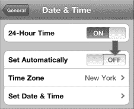

6.  要设置您的时区，请轻点`时区`并输入您所在时区中一个主要城市的名称。当您输入时，iPod touch 会显示匹配的城市名称。

    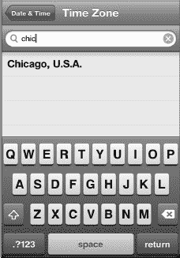

7.  当您看到所在时区的正确城市时，轻点它以将其选中。在下方图片中，我们输入了“Chicago”的前几个字母，直到它出现。接着，我们轻点了`美国，芝加哥`以将其选中。
8.  选择城市后，您将返回到主`日期与时间`屏幕，您所选的城市会显示在`时区`选项旁边。
9.  轻点`设置日期与时间`以调整您的日期和时间。

    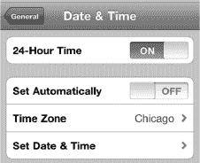

10. 在此屏幕上，您可以设置日期和时间。要调整日期，请轻点屏幕顶部显示的`日期`按钮。
11. 要调整时间，请轻点屏幕顶部显示的`时间`按钮。
12. 然后，您可以通过向上或向下滑动`日期`和`时间`转轮来调整日期和时间，如下方图片所示。
13. 完成后，轻点左上角的`日期与时间`按钮。

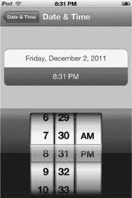

#### 调节亮度

您的 iPod touch 具有自动亮度控制功能；此功能默认为开启状态。此功能使用内置光线传感器来调节屏幕亮度。当室外较暗或处于夜晚时，自动亮度控制会调暗屏幕。当天气晴朗明亮时，屏幕会自动调亮，以便于阅读。通常，我们建议您将此功能保持为`开`状态。

如果您想调节亮度，请使用`设置`应用中的控制选项。请按以下步骤操作：

1.  从`主屏幕`轻点`设置`图标。

    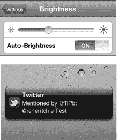

2.  轻点`亮度`并移动滑块控件以调节亮度。
3.  点击`自动亮度`旁边的开关以将其切换为`开`或`关`。

**提示：** 将`亮度`选项设置为较低的值将有助于节省电池电量。将滑块调至略低于一半的位置效果通常不错。

##### 通知

自 iOS 5 起新增的`通知中心`引入了一种更出色、更低调、更少干扰的方式来整理和处理你在一天中收到的所有`FaceTime`、电子邮件、`iMessage`、`Twitter`、`Facebook`、日历及其他提醒消息。

通知可通过以下几种方式显示：

- 以**锁定屏幕信息**的形式显示，这样你无需解锁`iPod touch`就能快速查看重要提醒。（不过，这个选项会牺牲一些隐私。）
- 以应用内通知的形式显示，每当收到新消息时，会以简短滚动的横幅出现在屏幕顶部。
- 在`通知中心`下拉菜单中显示，当你的`iPod touch`解锁后，你可以随时随地从屏幕顶部向下滑动来访问它。

如果你以前用过`iPod touch`，或者在 iOS 5 之前使用过`iPad`或`iPod touch`，那么`通知中心`在原有的声音、数字标记和弹出式提醒基础上增加了新选项。由于这些提醒不会中断你的操作，因此不会打断你玩`《愤怒的小鸟》`或正在撰写的电子邮件，让你必须关闭或打开它们后才能继续游戏或写作。不过，你仍然可以选择处理那些绝对不想错过的内容，比如闹钟。

#### 锁定屏幕信息

`锁定`屏幕上的通知以两种不同方式显示：作为包含最新单条通知的弹出窗口，以及作为所有近期通知的下拉列表。

如果你的`iPod touch`处于锁定状态时收到了一条通知，屏幕会亮起，该通知会出现在`锁定`屏幕中央的一个黑色方框中。同时，方框左侧会显示一个图标，代表与该类通知相关联的应用。例如，一封电子邮件会在左侧显示`邮件`应用图标；一条`iMessage`会显示`信息`图标；一个未接的`FaceTime`通话会显示`FaceTime`图标；一条`Facebook`通知会显示`Facebook`图标，以此类推。你可以从以下几种操作中选择：

- 忽略该通知。这会使你的提醒淡出，而你的`iPod touch`屏幕会重新进入休眠状态。
- 抓住滑柄（位于时间和日期正下方的三条灰色横线）并向下拖动，即可看到自上次解锁`iPod touch`以来收到的所有通知列表。列表会按照通知类型排序，因此所有电子邮件会被归为一组，所有日历事件、所有未接`FaceTime`通话等也会如此归纳。每条通知的左侧还会显示相应的图标。

**注意：** 如果你没有看到滑柄，那是因为你近期没有收到任何通知。

- 在单条通知框或列表中，点击通知左侧的图标并`滑动以查看`（或收听）通知，就像你通常`滑动以解锁``iPod touch`一样。在大多数情况下，你会被直接带到相应的应用，并显示完整的通知内容。例如，触摸`邮件`应用图标并滑动，将会解锁你的`iPod touch`，切换到`邮件`应用，并加载你刚刚收到的电子邮件。

**注意：** 少数通知——例如闹钟以及`iTunes`同步失败之类的系统消息——可能还会在通知左侧显示一个按钮，比如闹钟的`稍后提醒`或同步失败的`确定`。点击该按钮即可延迟或关闭通知。

**提示：** 如果你担心隐私问题，不喜欢任何人都能在你的`锁定`屏幕上看到你的个人电子邮件、短信及其他消息或提醒，那么你可以在`设置`应用中关闭它们（请参阅本章后面的“配置通知中心”部分）。

#### 应用内通知

当你的`iPod touch`处于解锁状态且你正在使用时，新收到的通知会在屏幕顶部短暂动画显示，然后向下翻转以展示通知内容。无论你身处何处，从`主屏幕`到内置的`信息`应用，再到你最喜欢的视频游戏，都会发生这种情况。通知仅覆盖屏幕顶部几个像素，因此应该不会妨碍你正在做的事情（或正在玩的游戏）。对于应用内通知，你可以进行以下两种操作：

- 忽略它，它会翻转回去并消失。（别担心：你可以通过点击`通知中心`下拉菜单再次查看该通知，详见本章后续内容。）
- 点击该通知，你将被直接带到关联的应用查看完整消息。例如，它会带你到`邮件`应用阅读一封电子邮件，或到`信息`应用回复一条`iMessage`。

###### 通知中心

只要你的`iPod touch`处于解锁状态，你就可以从屏幕最顶部向下滑动，拉出`通知中心`选项。`通知中心`整合了数量非常有限的*小组件*（撰写本文时有两个）以及一个与你在`锁定`屏幕上看到的类似的通知列表。

要关闭`通知中心`，从屏幕底部向上滑动即可。

目前可用的两个小组件是`天气`和`股票`：

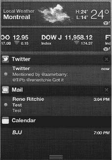

- `天气`小组件会显示某个地区的当地天气（如果开启了基于位置的天气功能），或显示你在内置的`天气`应用中设置为第一个的城市天气（如果基于位置的天气功能关闭或不可用）。它还会显示当天的最高气温、最低气温和当前气温。点击小组件上的任意位置都会带你进入`天气`应用。
- `股票`小组件会显示你所关注股票的滚动条，包括其近期市值以及表示近期亏损或盈利的箭头。滚动条将包含你当前在内置的`股票`应用中设置的所有股票。点击小组件上的任意位置都会带你进入`股票`应用。

`通知中心`的列表可用于以下应用和服务：

- `日历`
- `提醒事项`
- `信息`（`iMessage`）
- `邮件`
- `Game Center`
- 你安装的其他使用通知功能的应用或服务（例如，像`Twitter`这样的社交网络、像`CNN`这样的突发新闻应用，以及像`OmniFocus`这样的任务管理工具）

通知列表按应用划分，每个应用都有一个标题栏。标题栏的左侧是*应用图标*，后面跟着*应用名称*。在标题栏的右侧，你可以看到一个`X`图标。点击`X`图标即可清除该应用的所有通知。例如，点击`邮件`图标右侧的`X`会清除所有电子邮件通知；但这不会清除任何其他通知。

在标题下方，你会看到该应用所有当前（未读）的通知，以及收到通知的时间、发件人（如果适用）以及内容预览。例如，你可能会看到最近的`Facebook`消息或`Game Center`挑战列表。点击列表中任意通知的任意位置，都会切换到关联的应用并向你显示完整消息。

#### 配置通知中心

通过**设置**应用即可轻松配置通知中心：

1.  在**主屏幕**上轻点**设置**应用图标。
2.  轻点**通知**。

通知中心可以按**时间**（小组件在上，然后按最新通知的顺序）整理通知，也可以**手动**整理。按照以下步骤手动重新整理通知：

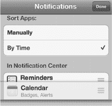

1.  在**排序应用**下，轻点**手动**。
2.  在屏幕的右上角，轻点**编辑**按钮。
3.  每个应用的右侧会出现三条灰色水平条纹形式的手柄。抓住手柄，向上或向下拖动应用，将它们按您最喜欢的顺序排列。
4.  当所有应用都按您想要的顺序排列好后，轻点屏幕右上角的蓝色**完成**按钮。

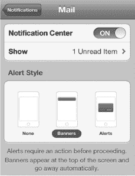

要显示或隐藏**天气**或**股票**小组件，按需轻点任一小组件以将其切换为**开启**或**关闭**。

要选择通知列表的工作方式，请按以下步骤操作：

1.  轻点要编辑的应用（例如**邮件**）。
2.  将**通知中心**的开关切换到**关闭**，以将该应用从通知中心彻底移除。切换到**开启**则可将其恢复。
3.  选择在列表中**显示**您偏好的通知数量。在撰写本文时，可用选项仅限于**1 条未读项目**、**5 条未读项目**和**10 条未读项目**。
4.  选择您偏好的应用内通知**提醒样式**。
   - **无**意味着您永远不会看到提醒。
   - **横幅**意味着您将在屏幕顶部收到不会打扰您的细微动画通知。此选项让您可以在需要时忽略该通知，这对于大多数通讯类通知（如电子邮件、iMessage、Facebook 等）非常有用。
   - **提示**意味着您将收到一个无法忽略的弹出窗口。您必须手动关闭它或立即对其进行操作。这对于闹钟、约会和其他紧急事项非常有用。

您还可以设置与通知相关的其他几个选项：

- **标记应用图标**：此选项会在**主屏幕**图标的右上角添加一个小红圈。这个红圈表示每个应用包含的未读通知数量。例如，**邮件**图标上的数字 10 表示您有 10 封未读电子邮件在等着您。如果您不希望看到它们，可以关闭此功能；如果您希望显示它们，则开启此功能。

  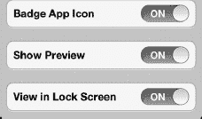

- **声音**：此选项让您可以打开或关闭新通知的音频提醒。如果通知是紧急的，比如 iMessage，您可能希望让声音保持**开启**状态。
- **显示预览**：此选项会显示通知相关消息的前几行，以便您一目了然地了解其主旨。此功能使您无需滑动进入应用就能查看通知内容，从而阅读完整信息。如果更注重隐私，您可能希望将此功能切换为**关闭**。
- **在锁定屏幕上显示**：此选项允许您从**锁定**屏幕打开或关闭通知。同样，如果隐私是个问题，您可能希望将此功能切换为**关闭**。

**注意：** 并非所有应用在通知中心中都有相同的选项。例如，有些应用可能提供声音提醒，而有些则没有。

当您关闭某个特定应用的通知后，它会被放入**设置**中一个名为*不在通知中心*的单独列表。这可以让您轻松查看哪些应用正在（以及哪些没有）向您发送通知。

#### 通知中心的辅助功能选项

Apple 为有特殊视觉或听觉需求的人提供了各种辅助功能选项，包括自定义振动和 LED 闪烁以示提醒。

请按以下步骤为通知启用辅助功能选项：

1.  轻点**设置**图标。
2.  轻点**通用**。
3.  轻点页面底部附近的**辅助功能**。
4.  将**自定义振动**切换为**开启**，以便为您的联系人分配独特的振动模式（可在**声音偏好设置**中创建模式）。
5.  将**LED 闪烁以示提醒**切换为**开启**，以便在有通知进入时让摄像头闪光灯闪烁。

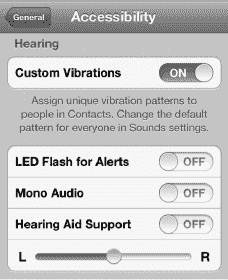

