# 第 2 章

## 输入、拷贝与搜索

在本章中，我们将向您展示在 iPod touch 上输入的一些好方法，并在此过程中为您节省宝贵的时间。同时，我们还将向您展示如何使用**竖屏**（垂直/较小）和**横屏**（水平/较大）键盘。我们还将教您如何选择不同的语言键盘、如何输入符号以及其他技巧。

在本章稍后部分，我们将为您介绍 Spotlight 搜索以及拷贝和粘贴功能。拷贝和粘贴功能将为您节省大量时间，并提高您使用 iPod touch 时的准确性。

### 在 iPod touch 上输入

您会很快在 iPod touch 上找到两个屏幕键盘：当您垂直握住 iPod touch 时可见的较小**竖屏**键盘，以及当您水平握住 iPod touch 时可见的较大**横屏**键盘。好处是您可以选择最适合您的键盘。

#### 用两个拇指在屏幕上输入

您会发现刚开始使用 iPod touch 时，最容易用一根手指（通常是食指）输入，同时用另一只手握住 iPod touch。

过一小段时间，您应该能够尝试用拇指输入。稍加练习后，用两个拇指代替一根手指输入将真正提高您的速度。请耐心一点：要熟练地用两个拇指快速输入确实需要练习。

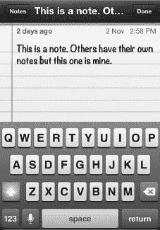

其实过一会儿您会注意到，键盘的触摸灵敏度是假设您在用两个拇指输入。这意味着键盘左侧的字母应该按在它们的左侧，而右侧的键应该按在它们的右侧。

在许多应用中，只需将 iPod touch 侧向旋转，键盘就会切换为更大的**横屏**键盘，这使得输入更加容易。

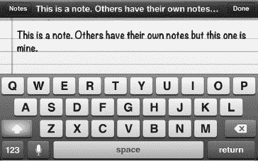

**提示：** 如果您手比较大，觉得在较小的竖屏键盘上输入有困难，那么请将您的 iPod touch 侧向翻转，以获得更大的**横屏**键盘。

#### 使用快捷短语快速输入

iPod touch 上一个不错的功能是能够为输入常用短语甚至几个句子（如前往您家或公司的路线）设置快捷方式。

**提示：** 在 iPod touch 上输入常用短语时，使用快捷方式可以节省时间。您甚至可以使用快捷方式输入几个句子，例如前往您家的步骤或您经常输入的内容。

在设置应用中访问快捷方式。轻点**设置**图标，然后依次轻点**通用**、**键盘**，并滑动到屏幕底部以查看可用的**快捷方式**。

Apple 为您提供了一个“omw”的示例快捷方式。当您在 iPod touch 上输入 omw 时，您会看到弹出窗口显示短语“On my way！”（我正在路上！）。

轻点**添加新快捷方式**以创建一个新的。

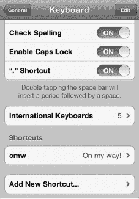

输入将替换快捷方式的**短语**，然后输入**快捷方式**本身。在此示例中，我们想要一个输入前往我家方向的快捷方式。所以我们的**快捷方式**是“dirh”，而**短语**是前往我家的逐步路线。保存您的新快捷方式并尝试一下。

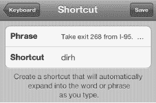

#### 利用自动更正节省时间

当你打字一段时间后，会开始注意到某些单词正下方会出现一个小弹出窗口——这个功能叫做*自动更正*。你定义的任何`快捷指令`也会以弹出建议的形式出现。

**注意：** 如果你从未见过`自动更正`弹出窗口，则需要前往`设置`应用 > `通用` > `键盘`，然后将`自动更正`设为`开启`来启用该功能。

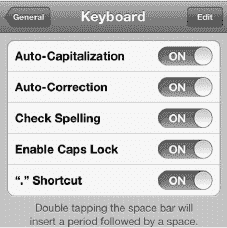

当你看到系统猜出了正确的单词时，只需按下键盘底部的`空格键`即可节省时间；这样做会选中该单词。

在下一个例子中，我们开始输入单词“especially”；当输入到单词中的“c”时，正确的单词会出现在下方的弹出窗口中。要选中它，我们只需按下底部的`空格键`（请参见图 2–1）。

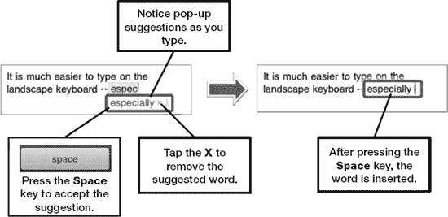

**图 2–1.** *使用自动更正和建议词汇*

你的第一反应可能是点击弹出的单词，但这反而会从屏幕上擦除建议的单词。更高效的做法是继续打字，或者在看到正确的单词弹出时按下`空格键`。在大多数情况下，当你继续打字时，单词要么已经正确，要么会变得正确——长远来看，这意味着手指移动更少。

**提示：** 自动更正功能还会检索你的`通讯录`列表来提供建议。例如，如果`通讯录`中有“Martin Trautschold”，那么在输入“Trauts”后，你就会看到“Trautschold”作为自动更正建议出现。

学会使用`空格键`后，你会发现这种弹出式猜测功能相当省时。毕竟，你本来就需要在单词末尾输入一个空格。

有时你可能会意外接受一个错误的自动更正单词；在这种情况下，你只需按`退格键`。 这样做会弹出一个窗口，其中包含自动更正功能修改之前的原始单词。你还会看到其他建议的替换词（请参见图 2–2）。

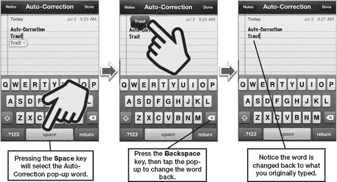

**图 2–2.** *处理不正确的自动更正词汇*

**提示：** 使用自动更正，你可以避免在许多常见缩约词中键入撇号，例如“wont”和“cant”，从而节省时间。自动更正会显示一个包含正确拼写缩约词的小弹出窗口；你只需按下`空格键`即可选中高亮的更正项。

对于某些单词，你需要多输入一个字符，自动更正功能才能识别出你的意图：

*   输入“Weree”得到“We're”。
*   输入“Welll”得到“We'll”。

#### 听取自动更正词汇

你可以将 iPod touch 设置为在自动文本和自动更正词汇出现时朗读它们。这或许有助于你选择正确的单词。请按照以下步骤启用此朗读功能：

1.  点击`设置`图标。
2.  点击`通用`。
3.  点击页面底部的`辅助功能`（需要向下滑动）。
4.  将`朗读自动文本`旁边的开关设为`开启`。

启用此功能后，你在打字时，就会听到弹出的自动更正词汇被朗读出来。如果你同意听到的单词，按下`空格键`接受它；否则，继续打字。这可以节省你从键盘上抬起头来查看的时间。

#### 拼写检查

与自动更正功能协同工作的是你 iPod touch 内置的拼写检查器。大多数情况下，你拼错的单词会被自动更正功能捕获并自动纠正。其他时候，一个单词可能不会被纠正，但它仍然是拼错的。你会看到 iPod touch 认为拼写错误的单词下方划有红色虚线，如图 2–3 所示。

**图 2–3.** *使用内置的拼写检查功能*

**提示：** 如果你的拼写检查器中积累了太多错误的单词，你可以通过清除所有自定词来让其重新开始。请按照以下步骤操作：

1.  点击`设置`图标。
2.  点击`通用`。
3.  点击靠近底部的`还原`。
4.  点击`还原键盘词典`。
5.  点击`还原词典`确认。

执行上述步骤将清除已添加到 iPod touch 词典中的所有自定词。

### 辅助功能选项

iPod touch 上有多项实用的辅助功能。例如，“旁白”选项会读出屏幕上显示的各种内容。它会告诉你点击了哪些元素、选择了哪些按钮以及所有可用的选项。它还会朗读整个屏幕的文本。如果你希望看到更大的内容，也可以打开“缩放”选项，如本章后面的“使用缩放放大整个屏幕”部分所述。

#### 让 iPod touch 与你对话（旁白）

“旁白”选项是 iPod touch 一个很酷的功能。开启此功能后，iPod touch 会读出屏幕上显示的任何内容。你甚至可以让它为你朗读任何电子邮件、文本文档，甚至是`iBook`页面。

**提示：** 当`旁白`选项设为`开启`且在公共场所时，请使用耳机；这有助于你更清晰地听到朗读内容，同时避免打扰他人。

请按以下步骤启用“旁白”功能：

1.  点击`设置`图标。
2.  点击`通用`。
3.  点击页面底部的`辅助功能`。
4.  点击`旁白`。
5.  将`旁白`开关设为`开启`。

**注意：** 如右侧屏幕所示，“旁白”手势与普通手势不同。点击`练习旁白手势`按钮来熟悉它们。

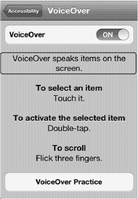

以下是使用“旁白”功能的一些额外提示：

*   向下滚动`旁白`屏幕以查看更多设置。
*   通过更改`朗读提示`选项的设置，来调整是否朗读提示。
*   当你使用旁白功能打字时，默认情况下会朗读你输入的每个字符。你可以通过点击`键入反馈`来更改此设置。在下一个屏幕上，你可以将此选项设为`字符`、`单词`、`字符和单词`或`无`。
*   通过滑动此选项下方的滑块来调整`朗读速率`。
*   通过设置开关来调整是否使用`语音`和`音高变化`。

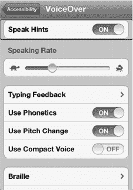

要让系统在`备忘录`或`iBooks`应用中为你朗读整个页面，你需要同时点击屏幕上文本块的上部和下部。如果你用一个手指点击文本，只会朗读单行内容。

#### 朗读所选内容和朗读自动文本

`朗读所选内容`功能类似于`旁白`，但它与“拷贝和粘贴”功能相结合，在选定文本的弹出菜单中添加了一个`朗读`选项。“朗读自动文本”功能会朗读出由拼写词典自动大写或更正的任何文本。

使用`朗读所选内容`功能时，你可以使用与`旁白`功能同类型的滑块来调整朗读速率。`朗读自动文本`选项只能设为`开启`或`关闭`。

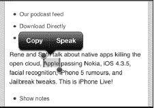

#### 使用 AssistiveTouch

如果你在触摸屏幕时有困难，或者有特殊的辅助配件来帮助你操作触摸屏，你会想要开启 `AssistiveTouch`。你可以在 `设置` 中的同一个 `辅助功能` 部分进行此操作。

开启后，你会在屏幕右下角看到一个小白圈。轻点这个小圆圈即可调出 `AssistiveTouch` 菜单。

`AssistiveTouch` 允许你执行以下操作：

- 轻点 `手势`，可模拟 2、3、4 或 5 指手势。
- 轻点 `个人收藏`，可访问你的自定义手势。
- 轻点 `设备`，可访问常用设备命令，如屏幕旋转、静音、音量、摇晃和锁定屏幕。
- 轻点 `主屏幕` 图标，可模拟实际点击 `主屏幕` 按钮。

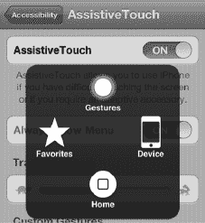

你甚至可以设置自定义手势，以便从 `个人收藏` 菜单中访问。

轻点 `创建新手势`，然后使用手指在屏幕上移动，制作一个屏幕手势。你会看到白色线条跟随指尖的位置移动。

然后，轻点 `停止` 按钮。

按下 `播放` 来检查手势是否正确，最后轻点顶部的 `存储` 并为你新创建的手势命名。

之后，你就会在 `AssistiveTouch` 的 `个人收藏` 菜单中看到这个新手势。

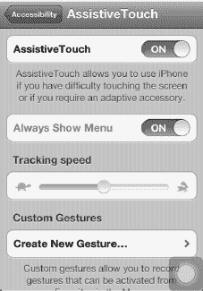

#### 使用缩放来放大整个屏幕

如果你觉得屏幕上的文本、图标、按钮或其他任何内容有点难以看清，你可能会想开启 `缩放` 功能。开启 `缩放` 功能后，你可以将整个屏幕放大至几乎正常大小的两倍——所有内容都更容易阅读了。

**注意：** 你不能同时使用 `旁白` 和 `缩放`；你需要选择其中一个。除了放大整个屏幕，你还可以使用 `大文本` 功能，只为你的主要应用增加字体大小。我们将在“使用更大的文本字号以便于阅读”部分向你展示操作方法。

请按照以下步骤启用 `缩放` 功能：

1. 轻点 `设置` 图标。
2. 轻点 `通用`。
3. 轻点页面底部的 `辅助功能`。
4. 轻点 `缩放`。
5. 将 `缩放` 旁边的开关设为 `开启`。

与 `旁白` 类似，`缩放` 也使用三指手势。在离开此屏幕前，请务必熟悉这些手势。

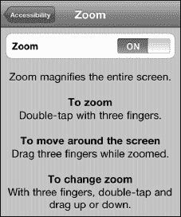

#### 白底黑字

如果你觉得屏幕上的对比度和颜色难以看清，你可能会想将 `白底黑字` 设置设为 `开启`。请按照以下步骤操作：

1. 如前所述，前往 `设置` 应用中的 `辅助功能` 屏幕。
2. 将 `白底黑字` 开关设为 `开启`。启用此选项后，屏幕上所有浅色内容将变为黑色，所有深色或黑色内容将变为白色。

##### 使用更大的文本字号以便于阅读

你可以通过使用 `大文本` 功能，在 `通讯录`、`邮件`、`信息` 和 `备忘录` 应用中大幅扩展字体大小。请按照以下步骤操作：

1. 轻点 `设置` 图标。
2. 轻点 `通用`。
3. 轻点页面底部（需要向下滑动）的 `辅助功能`。
4. 轻点 `大文本`。之后你会看到一个包含字体大小选项的屏幕：`关闭`、`20pt 文本`、`24pt 文本`、`32pt 文本`、`40pt 文本`、`48pt 文本` 和 `56pt 文本`。轻点你想要使用的大小。右侧显示的图像使用了 `48pt` 字体。
5. 轻点左上角的 `辅助功能` 按钮返回上一屏幕，然后轻点 `主屏幕` 按钮退出 `设置`。

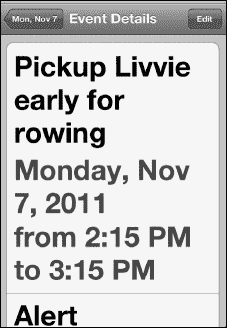

#### 主屏幕按钮三次点按选项

你可以设置三次点按 `主屏幕` 按钮来执行各种与辅助功能相关的操作。请按照以下步骤调整这些选项：

1. 如前所述，前往 `设置` 应用中的 `辅助功能` 屏幕。
2. 轻点页面底部的 `三次点按主屏幕按钮`。
3. 从 `关闭`、`切换旁白`、`切换白底黑字` 或 `询问` 中进行选择。

### 使用放大镜编辑文本或放置光标

有多少次你在打字时，想要将光标精确地放在两个单词或两个字母之间？

在掌握 `放大镜` 技巧之前，这可能很难做到。你的做法是：在你想要放置光标的位置长按手指（参见 图 2–4）。一两秒后，你会看到 `放大镜` 图标出现。然后，在手指按住屏幕的同时，滑动屏幕来定位光标。松开手指时，你会看到 `拷贝和粘贴` 弹出菜单，但你可以忽略它。

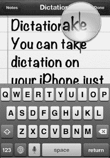

**图 2–4.** *长按屏幕以查看 `放大镜` 图标并放置光标。*

### 输入数字和符号

如何使用 iPod touch 的屏幕键盘输入数字或符号？当你在打字时，轻点左下角的 `123` 键即可查看数字和常用符号，例如 `$ ! ~ & = # . _ - +`。如果你需要更多符号，请从 `数字` 键盘轻点左下角 `ABC` 键上方的 `#+=` 键（参见 图 2–5）。

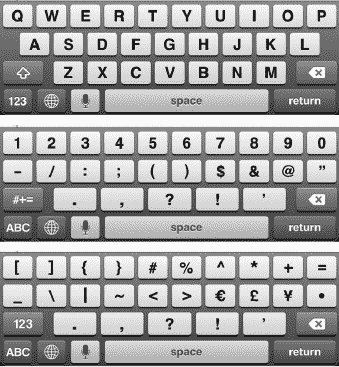

**图 2–5.** *在 `字母`、`数字` 和 `符号` 键盘之间切换*

**提示：** 在输入一个数字或符号后，请注意 `数字` 键盘会保持激活状态，直到你按下 `空格键` 或按下另一个键盘的键（例如用于 `字母` 键盘的 `ABC` 键）。

#### 触摸并滑动技巧

一个可以应用于多种场景的酷炫技巧是触摸并滑动技巧。我们将在接下来的几节中介绍这是什么以及如何利用它。

##### 输入大写字母

要输入大写字母，通常你需要按下 `Shift` 键，然后再按下所需的字母。

更快地输入单个大写字母以及需要 `Shift` 键的符号的方法是：按下 `Shift` 键，手指保持在键盘上，滑动到你想要的键上，然后松开。

例如，要输入大写字母“D”，请按下右侧的 `Shift` 键，然后滑动到 `D` 键上并松开。

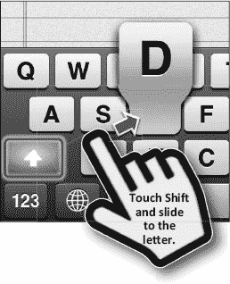

##### 快速输入单个数字

如果你只需要输入一个数字，那么按下 `123` 键并将手指向上滑动到该数字上即可。但是，如果要连续输入多个数字，最好是按下 `123` 键，松开手指，然后再逐个按下每个数字。

##### 长按键盘快捷输入符号及其他功能

你可能想知道如何输入键盘上未显示的符号。

**提示：** 你可以输入比屏幕上显示的更多的符号。

你只需要长按与所需符号相关的字母、数字或符号即可。

例如，如果你想输入日元符号（`¥`），请长按`$`键，直到看到其他选项。接着，向上滑动手指以高亮选中日元符号，然后松开手指。

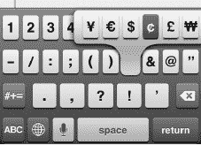

此技巧同样适用于`Safari`浏览器中的`.com`键，以及在输入电子邮件地址时长按`Period`（`.`）键。通过长按`.com`或`Period`键，你还可以获得其他网站后缀。

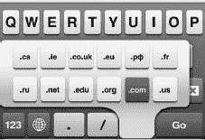

上图显示了`.co`、`.uk`、`.ie`、`.de`、`.ca`和`.eu`键。这些键在标准美式键盘上并不显示，但在此处出现是因为我们安装了额外的国际键盘。你将在本章稍后的“用其他语言输入——国际键盘”部分学习如何启用国际键盘。

**提示：更多实用但隐藏的符号**

在`Symbols`键盘上，`Backspace`键的正上方有一个很好的项目符号字符。你还可以通过长按`Zero`键（`0`）获得度数符号。此外，长按`?`和`!`键可以获取对应的西班牙语倒置符号。

##### 大写锁定

双击`Shift`键即可开启大写锁定功能。当`Shift`键变为蓝色时，表示该功能已开启。

要关闭大写锁定，只需再次按下`Shift`键即可。

### 快速选择、删除或更改文本

你可能需要快速更改或删除正在输入的文本。请按照以下步骤操作：

1.  通过双击选中要更改或删除的部分文本。

    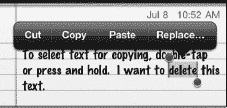

2.  拖动蓝色手柄调整选区。

    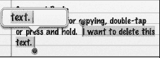

3.  要删除选中的文本，请按下`Backspace`键。

    

4.  要替换文本，只需开始输入。输入的字母将立即替换选中的文本。

    

### 键盘选项与设置

有一些键盘选项可以让你的`iPod touch`输入更便捷。这些键盘选项位于`Settings`应用的`General`标签中。请按照以下步骤访问：

1.  点击`Settings`图标。
2.  点击`General`。
3.  向上滑动，然后点击页面底部的`Keyboard`。

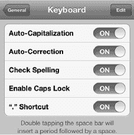

#### 将自动更正设置为“开”或“关”

如前所述，自动更正功能将使用`iPod touch`的内置词典自动修正常见的拼写错误。如果你希望此功能生效，需要确保其设置为`ON`（这是默认设置）。

#### 自动大写

当你开始一个新句子时，如果`Auto-Capitalization`选项设置为`ON`，单词将自动大写。

此功能也会正确大写常见的专有名词。例如，如果你输入“`New york`”，系统会提示你将其改为“`New York`”——同样，只需按`Space`键即可应用更正。如果你退格删除一个大写字母，`iPod touch`会假定你输入的新字母也应大写。此功能默认也设置为`ON`。

#### 启用大写锁定

有时你可能只想输入大写字母：只需双击`Caps`键即可。

此功能默认为`OFF`。

#### “.”快捷键

如果你双击`Space`键，它会自动在句末添加句点；此功能默认为`ON`。

### 用其他语言输入——国际键盘

在撰写本文时，`iPod touch`支持你输入超过十种不同语言，从荷兰语到西班牙语应有尽有。一些亚洲语言，如日语和中文，提供了两种或三种键盘以适应不同的输入方法。

#### 添加新的国际键盘

请按照以下步骤启用各种语言键盘：

1.  点击`Settings`图标。
2.  点击`General`。
3.  点击页面底部的`Keyboard`。
4.  点击`International Keyboards`。
5.  点击`Add New Keyboard`。
6.  点击列表中任意键盘或语言以添加。你现在会看到该键盘出现在可用键盘列表中。
7.  在`Symbols`键盘上，`Backspace`键的正上方有一个很好的项目符号字符。你还可以通过长按`Zero`键（`0`）获得度数符号。此外，长按`?`和`!`键可以获取对应的西班牙语倒置符号。

**提示：** `iOS 5`包含一个内置的`Emoji`键盘。`Emoji`是一个包含大量日本符号的集合，包括各种笑脸和哭脸、节日图片、建筑和车辆等等。虽然这些符号在日本有更具体的含义，但世界各地的人们已开始在短信、推特和其他在线消息服务中使用它们。

`Emoji`键盘可以像其他任何键盘一样在“设置”中添加。

#### 编辑、重新排序或删除键盘

你可能希望调整键盘的选项、更改键盘在列表中的显示顺序，或直接删除不再使用的键盘。请按照以下步骤操作：

1.  按照本章前面“添加新的国际键盘”部分中的步骤 1-4 操作；这将让你查看国际键盘列表。
2.  要调整特定键盘的选项，请在键盘列表中点击它。在我们的示例中，我们点击了`French (Canada)`。
3.  通过点击相应部分中的选项更改`Software Keyboard Layout`。
4.  通过点击相应部分中的选项调整`Hardware Keyboard Layout`。
5.  点击左上角的`Keyboards`按钮以保存选择并返回键盘列表。

    

6.  要重新排序或删除键盘，请点击右上角的`Edit`按钮。
7.  要更改键盘顺序，请触摸并拖动键盘右侧带有三条灰色横线的边缘向上或向下。
8.  要删除键盘，请点击`Red Minus Sign`使其摆动到垂直位置，然后点击`Delete`。
9.  要结束键盘编辑，请点击右上角的`Done`按钮。

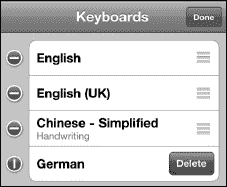

当你安装了至少一个国际键盘后，你会注意到出现了一个小小的`Globe`键。按下`Globe`键可以在所有语言之间循环切换。

**提示：** 你可以长按`Globe`键查看可用键盘列表。这使你能快速选择想要使用的键盘。如果

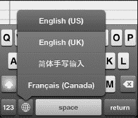

日语、中文和其他一些语言提供了多种键盘选项以满足你的输入偏好。

在某些语言（如日语）中，你会看到输入的字母变为字符，或者你可以自己手绘字符。你也可能在键盘上方看到一排其他字符组合。当你看到需要的组合时，点击它即可。

### 复制与粘贴

复制与粘贴功能非常实用，既能节省时间，又能提高打字准确度。你可以利用此功能从电子邮件（如会议详情）中提取文字，然后粘贴到日历中。或者，你可能只需将表单中某处的电子邮件地址复制到另一处，省去重新打字的时间。（我们在第 4 章：“其他同步方式”的“设置 Exchange/Google 账户”一节中介绍了这项技巧。）复制与粘贴的用途非常广泛；你越熟悉它，就越会频繁使用它。你甚至可以从你的 `Safari` 网页浏览器中复制文字或图像，然后粘贴到 `Notes` 或 `Mail` 信息中。

#### 通过双击选择文字

如果你正在阅读或输入文字，可以双击它以开始选择部分文字进行复制。这在 `Mail`、`Messages` 和 `Notes` 应用中效果很好。

你会看到一个带有蓝色圆点（手柄）的方框，位于对角位置。

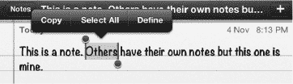

只需拖动手柄即可选中你想要高亮显示并复制的文字。

**提示：** 如果你想选择所有文字，请点击光标，或双击文字上方或下方的屏幕。这将显示一个弹出窗口，其中包含 `Select` 和 `Select All` 选项。点击 `Select` 选择单个单词，或点击 `Select All` 高亮显示所有文字。

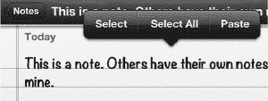

#### 通过双指触摸选择文字

另一种选择文字的方法是同时用两根手指触摸屏幕。如果你用一只手握住 iPod touch，用另一只手的大拇指和食指触摸屏幕，效果最佳。你也可以将 iPod touch 放在桌子上，用双手的各一根手指触摸屏幕。请按照以下步骤使用此方法：

1.  在你想要选择的文字的起始和结束位置同时触摸屏幕。如果第一次触摸时未能精确选中，不必担心。
2.  双指触摸后，使用蓝色手柄拖动选择区域的起始和结束位置，直至正确位置。

#### 通过触摸并长按选择网站或其他不可编辑的文字

在 `Safari` 网页浏览器以及其他无法编辑文字的地方，用你的手指按住某些文字，该段落会被高亮显示，并在每个角落出现手柄。

接下来，如果你想选择更多文字，请拖动手柄。

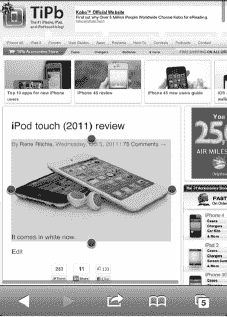

**注：** 如果拖动范围小于一个段落，选择器将切换到精细文字模式，并在选择区域两端提供蓝色手柄，以便你精确选取所需的字符或单词。如果拖动手指超过一个段落，则会进入粗略文字选择模式，你可以向上或向下拖动以选择整块文字和图形。

#### 剪切或复制文字

一旦你高亮显示了想要复制的文字，只需触摸屏幕顶部的 `Copy` 标签即可。该标签会变成蓝色，表示文字已存入剪贴板。

**注：** 如果你之前剪切或复制过文字，那么你还会看到 `Paste` 选项，如右侧所示。

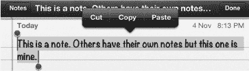

#### 应用切换与多任务处理

复制文字后，你可能想将其粘贴到另一个应用中。例如，你可能想从 Safari 复制一些文字，然后粘贴到 Notes 或 Mail 信息中。在应用之间切换的最简单方法是使用 `App Switcher` 应用。请按照以下步骤将文字从一个应用粘贴到另一个应用：

1.  复制或剪切你的文字。
2.  双击 `Home` 按钮，调出屏幕底部的 `App Switcher` 应用。
3.  如果你刚刚让一个应用在后台运行，你可以在 App Switcher 栏中找到它。
4.  向右或向左滑动找到你想要的应用，然后点击它。
5.  如果你在 App Switcher 栏中没有看到想要的应用，则点击 `Home` 按钮，然后从 `Home` 屏幕启动它。
6.  现在，通过长按屏幕，然后从弹出窗口中选择 `Paste` 来粘贴文字。
7.  再次双击 `Home` 按钮，点击你刚刚离开的应用即可跳转回去。

#### 粘贴文字

将文字粘贴到同一个应用中是很容易的。例如，只需按照以下步骤将文字粘贴到同一个 `Notes` 或 `Mail` 信息中：

1.  用你的手指将光标移动到你想要粘贴文字的位置。记住我们在本章前面展示的 `Magnifying Glass` 技巧；这可以帮助你定位光标。
2.  一旦你松开屏幕，你应该会看到一个弹出窗口，询问你是要 `Select`、`Select All` 还是 `Paste`。
3.  如果你没有看到这个弹出窗口，就双击屏幕。
4.  选择 `Paste` 来粘贴你的选择内容。

#### 摇动以撤销

iPod touch 的一大特色功能是能够撤销键入、复制和粘贴操作。

你只需在粘贴后摇动 iPod touch。一个新的弹出窗口将会出现，让你可以选择撤销刚才的操作。

点击 `Undo Typing` 或 `Undo Paste` 来纠正错误。

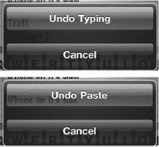

**提示：快速删除文字**

如果你曾想只通过一两次点击就快速删除多行文字、一个段落、甚至是你刚刚输入的所有文字，那么这个技巧就是为你准备的。首先，使用前面描述的技术选中你想要删除的文字。接下来，只需按下键盘左下角的 `Delete` 键 ，即可删除所有选中的文字。

### 使用 Spotlight 搜索查找内容

Spotlight 搜索是 iPod touch 上一个很棒的功能，可帮助你查找信息。这是苹果公司特有的一种搜索方法，用于在你的 iPod touch 上进行全局搜索。你可以使用此功能搜索姓名、事件或主题。

这个概念很简单。假设你正在寻找与 Martin 相关的内容。你不记得它是电子邮件、`Notes` 中的文档，还是日历事件；但你知道它和 Martin 有关。

这正是使用 Spotlight 搜索功能在你的 iPod touch 上查找所有与 Martin 相关内容的最佳时机。

#### 激活 Spotlight 搜索

首先，你需要调出 `Spotlight Search` 页面，它位于 `Home` 屏幕第一页的左侧。

在第一个圆圈（表示 `Home` 屏幕的第一页）的左侧，你可以看到一个非常小的 `Magnifying Glass` 图标。

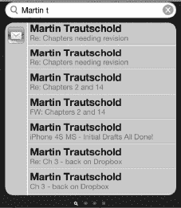

在第一页图标上从左向右滑动手指，即可看到 `Spotlight Search` 页面。你也可以从你的第一屏图标按下 Home 按钮来看到同一个搜索页面。

请按照以下步骤使用此功能进行搜索：

1.  在 `Spotlight Search` 页面上，输入一个或多个单词作为搜索参数。
2.  点击右下角的 `Search` 按钮执行搜索。

    **提示：** 如果你在找一个人，请输入他的全名，以便更精确地找到仅来自该人的项目（例如，“Martin Trautschold”）。这将排除你 iPod touch 中可能存在的其他 Martin，使你能够找到仅与 Martin Trautschold 相关的项目。

3.  在搜索结果中，你将看到搜索找到的所有电子邮件、约会、会议邀请和联系信息。向下滑动可查看更多结果。
4.  点击列表中的某个结果以查看其内容。

你的搜索结果会一直保留，直到你清除它们。这意味着你可以返回 `Spotlight Search` 页面，只需从你的 `Home` 屏幕向右滑动，即可查看你之前的搜索结果。

要清除 `Search` 字段，只需触摸搜索栏中的 `X`。要退出 `Spotlight Search` 页面，只需按下 `Home` 键或向左滑动。

#### 搜索网页或维基百科

执行`Spotlight 搜索`后，你会在搜索结果下方看到两个选项：`搜索网页`和`搜索维基百科`。点击其中任一选项即可在网页或维基百科中执行搜索。

#### 自定义 Spotlight 搜索

你可以通过从搜索中移除某些应用或数据类型来自定义`Spotlight 搜索`。你甚至可以更改每种数据类型的搜索顺序。如果你只想搜索`通讯录`和`邮件`——而不想搜索其他内容，这项功能会非常有用。或者，如果你知道自己总是想先搜索`邮件`，然后是`日历`，最后是`音乐`——你可以按正确顺序设置这些项目。请按以下步骤操作：

1.  点击`设置`图标。
2.  点击`通用`。
3.  点击`Spotlight 搜索`。
4.  要更改项目的搜索顺序，请按住并上下拖动带有三条灰色横线的项目右边缘。
5.  要从搜索中移除特定项目，请点击它以移除其旁边的`勾号`图标。未被勾选的项目将不会被`Spotlight 搜索`搜索到。
6.  点击左上角的`通用`按钮返回`设置`应用。

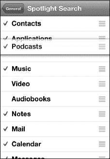

