# 第 3 章

## 通过 iCloud、iTunes 等方式同步

在本章中，我们将向您展示如何设置或调整存储空间，并将您的信息推送至 Apple 新的 iCloud 服务，以及如何使用 iTunes 在您的 iPod touch 与 Windows 或 Mac 电脑之间同步信息。

借助 iCloud，您可以无线同步您的邮件、通讯录、日历、提醒事项、书签、备忘录、照片以及文稿与数据，还可以无线（OTA）备份您的 iPod touch。借助 iTunes，您可以同步或传输通讯录、日历、备忘录、应用、音乐、视频、iBooks、文稿和照片库，还可以备份您的 iPod touch。

而且，由于没有任何东西能永远完美运行，我们还会向您展示几个简单的故障排除技巧。最后，我们将向您展示如何检查更新以及为您的 iPod touch 安装更新的操作系统软件。

### iCloud

iCloud 是免费的，设置简单，使用方便。在大多数情况下，它是同步您的个人信息、音乐、电视节目（仅限美国）和应用的最佳方式。它也是处理备份和恢复手机的最佳方式。除非您有非常具体的原因不这样做，否则我们强烈建议您使用 iCloud 来满足大部分同步需求，但对于 iCloud 尚未处理的内容（如电影），则使用`iTunes`应用。

iCloud 还允许您重新下载之前购买的 iTunes、iBookstore 和 App Store 项目，但您的 iCloud ID 也可以用于 iMessage、FaceTime 和其他免费的 Apple 服务。

**注意：** Apple 在提及 iCloud 时非常小心地不使用*同步*一词。而是使用*存储*和*推送*。这种差异很大程度上是技术性的，与 Apple 如何传输您的数据有关。

需要记住的重要一点是，当您在 iPod touch 上更改某些内容时，Apple 会将该更改复制到其服务器，然后将副本发送回您所有其他启用了 iCloud 的 iOS 设备，以及您的 Windows 或 Mac 电脑。

### 设置 iCloud

在第 1 章：“起步”中，我们向您展示了如何在设置新的 iPod touch 或从之前的 iCloud 备份恢复时启用 iCloud。一旦 iCloud 启用，您可以轻松地打开或关闭各种服务。

首先启动`设置`应用，然后向下滚动到`iCloud`。

`邮件`、`通讯录`、`日历`、`提醒事项`、`书签`、`备忘录`和`查找我的 iPod`可以直接在此屏幕轻松切换为`开`或`关`。

对于`照片流选项`，您需要先点击该标签才能看到`开`/`关`切换开关。

**注意：** 在撰写本文时，照片流是一项“全有或全无”的服务。如果照片流已打开，Apple 将在其服务器上保留您最近 1000 张照片最多 30 天，并将其复制到您的 iPad、Apple TV、Mac 或 Windows 电脑。任何登录 iCloud 的设备都会获得您照片流的副本。如果您拍摄的是敏感或个人性质的照片，您可能需要将`照片流`选项设置为`关`。

同样，您可以点击`文稿与数据`来切换此选项的`开`或`关`。

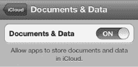

### 管理 iCloud 存储空间与备份

iCloud 提供 5GB 的免费存储空间。来自 iTunes 的音乐、应用、iBooks 和您的照片流不计入这 5GB 空间，因此大多数人仍有足够的剩余空间用于应用数据、文稿和备份。

要检查您的 iCloud 存储空间，请向下滚动到底部并点击`存储空间与备份`。

`存储空间`部分显示`总存储空间`，即您 iCloud 账户的总大小；`可用存储空间`显示您还剩多少总存储空间。

在屏幕底部，您可以将`iCloud 备份`切换为`开`或`关`。

**注意：** 对于大多数用户，在大多数情况下，我们强烈建议将`iCloud 备份`选项切换为`开`并保持该状态。

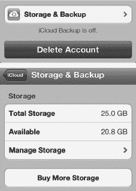

如果您需要立即备份您的 iPod touch，您可以点击`立即备份`按钮。当您想重新安装 iPod touch、更换为备用或新的 iPod touch，或者打算去旅行并希望在出发前确保手机已备份时，可以执行此操作。

要查看您的 iCloud 存储空间是如何使用的，请点击`管理存储空间`。

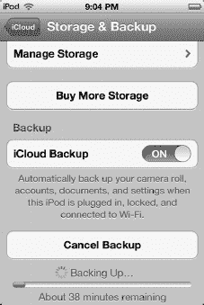

在`管理存储空间`屏幕的顶部，您会看到当前已备份到 iCloud 的设备列表。这包括您的 iPod touch 以及您可能拥有的任何其他 iOS 设备，例如 iPad 或 iPod touch。

点击您想查看的设备，您将进入`信息`屏幕，该屏幕会显示`上次备份`的时间以及`备份大小`。

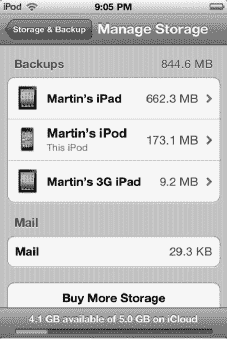

`备份选项`部分允许您单独打开或关闭不同类型的备份，包括`相机胶卷`以及您可能已安装的任何与 iCloud 同步其设置或数据的应用。此部分还会告诉您每个应用使用了多少存储空间。

最初，您只会看到几个应用。点击`查看所有应用`可查看完整列表。将某个应用设置为`关`意味着您将节省存储空间，但您的数据将不再在您的 iOS 设备之间同步，并且如果您重新安装设备或该应用，数据也不会恢复。

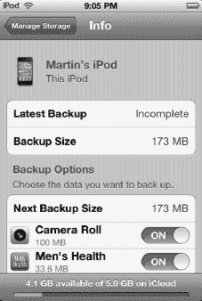

**提示：** 您的 iPod touch 配备了 800 万像素、1080p 摄像头，这意味着备份`相机胶卷`会很快占用大量存储空间，尤其是在您仅有免费 5GB 套餐的情况下。照片流功能已备份了您的照片；如果您不担心备份视频，那么您可以将`相机胶卷`备份切换为`关`以节省空间。

### 购买更多 iCloud 存储空间

您可能会发现自己经常用完 iCloud 存储空间，决定开始备份更多照片和视频，或者发现需要备份多台 iOS 设备。如果是这样，您可以从 Apple 购买更多 iCloud 存储空间。

只需点击遍布 iCloud `设置`屏幕中的任意一个`购买更多存储空间`按钮。在撰写本文时，额外 iCloud 存储空间的价格如下：

*   10GB 每年 20 美元
*   20GB 每年 40 美元
*   50GB 每年 100 美元

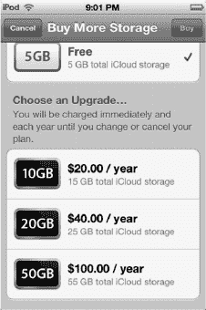

### 云端的 iTunes

iCloud 还包含了 *云端的 iTunes* 功能，可让你重新下载之前购买过的应用。在某些国家/地区，它甚至允许你重新下载 iBooks、音乐乃至电视节目。这意味着你可以随时将其下载到 iPod touch 上，在不需要时删除，然后想要时再次重新下载。

若要详细了解如何从 iTunes 重新下载文件，请参阅第 21 章：“设备上的 iTunes”、第 22 章：“神奇的应用商店”以及第 12 章：“iBooks 与电子书”。

你还可以设置你的 iPod touch，使其自动下载任何与你的 iTunes 账户相关联的设备或电脑上购买的新应用、iBooks、订阅的报刊杂志、音乐和电视节目。如果你在 PC 上购买了一首新歌，或在 iPod touch 上购买了一个新应用，那么这首歌或应用也会立即下载并显示在你的 iPod touch 上。

请按照以下步骤开启自动下载：

1. 启动 `设置`。
2. 轻点 `商店`。
3. 将 `音乐`、`应用` 和 `图书` 切换为 `开启`。

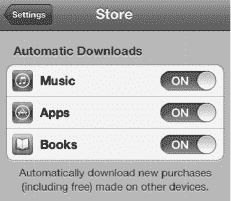

### 电脑端的 iCloud

iCloud 不仅仅能在你的 iPod touch 和 Apple 服务器之间，或是在你的 iOS 设备之间同步信息。它还可以在你的 iPod touch 与 Windows 或 Mac PC 之间同步信息。

如果你是 Windows 用户，可以在 `适用于 Windows 的 iCloud 控制面板` 中打开或关闭多个应用和服务的同步功能（请参阅图 3–1）。可以同步的应用和服务包括 `邮件`、`通讯录`、`日历与任务` 和 `提醒事项` 等。

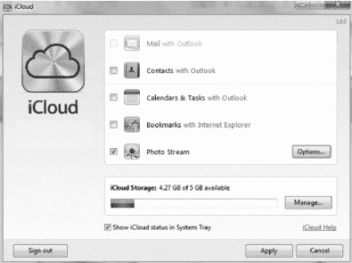

**图 3–1.** *适用于 Windows 的 iCloud 控制面板*

如果你是 Mac OS X 用户，则可以在 OS X 7.2 的 `Lion iCloud 系统设置` 面板中打开或关闭这些选项（请参阅图 3–2）。

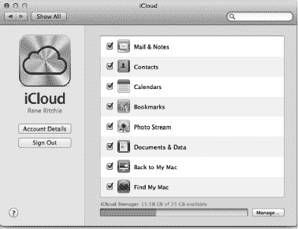

**图 3–2.** *Mac 的 `Lion iCloud 系统设置` 面板（OS X 7.2）*

应用的自动下载、图书、音乐和其他下载内容可以在 `iTunes` 应用的 `商店偏好设置` 屏幕中打开或关闭（请参阅图 3–3）。

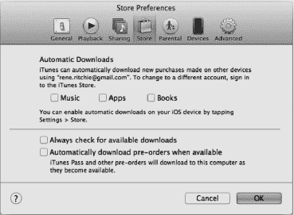

**图 3–3.** *`iTunes` 的 `商店偏好设置` 屏幕*

### 与 iTunes 同步

在开始使用 `iTunes` 进行同步之前，你需要做好几项准备。在接下来的章节中，我们将介绍这些先决条件，并就使用 iTunes 的原因回答一些常见问题。同时，我们还将帮助你了解，如果你拥有另一台 Apple 设备（例如 iPhone 或 iPad）并开始与你的 iPod touch 同步，会发生什么。

#### 先决条件

在将你的 iPod touch 与 `iTunes` 同步之前，你只要完成以下几项操作：

**提示：** 如果你已经按照第 1 章：“入门”中的所有步骤操作，那么你可能已经完成了下面列出的步骤，并且完成了通讯录、日历、书签、备忘录和电子邮件帐户与 iPod touch 的初始同步。如果是这样，你可以直接跳到本章后面的“应用：同步与管理”部分。

1. 确保你的电脑上安装了 10.5 或更高版本的 `iTunes` 应用。有关安装或更新 `iTunes` 的帮助信息，请参阅第 21 章：“设备上的 iTunes”。
2. 确保你手头有你的 iTunes 账户 ID。这是你用来从 iTunes 购买音乐、应用和其他内容的电子邮件地址和密码。
3. 取出 iPod touch 附带的白色同步线缆。一端插入 iPod touch 底部靠近 `主屏幕` 按钮的位置，另一端插入电脑的 USB 端口。

#### 使用 iTunes 同步 iPhone 或 iPad *以及* 你的 iPod touch？

你可能会想知道，是否可以同步 iTunes 与多个设备，例如你的 iPhone 或 iPad 以及你的 iPod touch。是的，可以！只要同步到同一台电脑，你就可以将多个 Apple 设备（Apple 表示最多五台，但我们听说过有人同步了更多设备）同步到单台电脑上的同一个 iTunes 帐户。

**警告：** 你不能将同一台 iPod touch、iPad 或 iPhone 同步到两台不同的电脑。如果你尝试这样做，你将看到类似如下的信息：“是否要抹掉此设备（iPod touch、iPad、iPhone）并重新同步新的资料库？”如果你回答 `是`，设备上的所有音乐和视频将被抹去。

#### 还有其他同步方法——我应该使用 iTunes 吗？

iCloud 既免费，又是让你的 iPod touch 与其他设备保持同步的最简单方式，而 `iTunes` 则可以帮助你处理 iCloud 尚不支持的大文件、电影和其他内容。你也可以使用其他方法来同步特定数据，例如你的个人信息和电子邮件（包括 Exchange/Google）。但请记住，即使你选择了这些其他方法中的一种，你仍然需要使用 iCloud 和/或 `iTunes` 来完成以下操作：

* 在 iPod touch 上备份和恢复文件与数据
* 更新 iPod touch 操作系统软件
* 同步和管理你的应用程序（应用）
* 同步你的音乐资料库和播放列表
* 同步电影、电视节目、播客和 iTunes U 内容
* 同步图书
* 同步照片

表 3–1 总结了你的同步选项。你选择哪种同步方法，应取决于你当前存储电子邮件、通讯录和日历的位置、你的使用环境，以及你是否希望进行无线同步。

**注意：** 某些环境允许你对 iPod touch 进行通讯录和日历的无线同步。

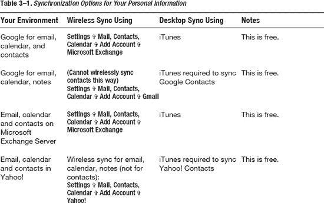
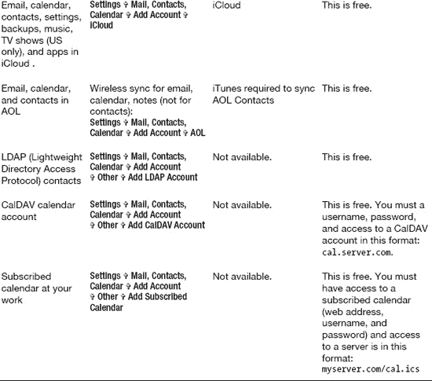

### 设置你的 iTunes 同步

接下来，我们将向你展示使用 `iTunes` 应用对 iPod touch 执行自动同步和手动传输信息的全部步骤。

#### `iPod touch` 摘要屏幕

`iTunes` 中的 `iPod touch` **摘要**选项卡用于查看和更新 `iPod touch` 操作系统的版本。它还包含一个与同步音乐、视频及其他内容相关的重要开关。在此选项卡中，您还可以选择每当将 `iPod touch` 连接到电脑时，是否自动打开 `iTunes`（以进行同步）。

将 `iPod touch` 连接到电脑后，您可以看到重要信息，例如 `iPod touch` 的存储容量、已安装的软件版本和序列号（参见图 3–4）。您还可以检查软件版本更新、将数据恢复到 `iPod touch`，并从该屏幕上的几个可用选项中进行选择。特别是，您可以使用此屏幕底部的复选框来决定是否要**手动管理音乐和视频**。

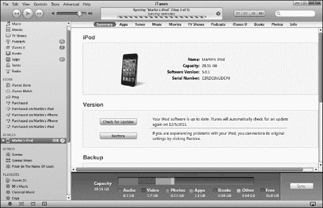

**图 3–4.** *`iTunes` 中 `iPod touch` 的**摘要**屏幕*

按照以下步骤查看**摘要**屏幕：

1.  在您的电脑上启动 `iTunes` 软件。
2.  使用设备附带的白色 USB 数据线将 `iPod touch` 连接到电脑。将数据线一端插入靠近**主屏幕**按钮的 `iPod touch` 底部，另一端插入电脑的 USB 端口。
3.  如果您已成功连接 `iPod touch`，您应该会在左侧导航栏的**设备**下看到列出的 `iPod touch`。
4.  在左侧导航栏中单击您的 `iPod touch`，然后单击主窗口左上角的**摘要**选项卡。
5.  如果您希望能够将音乐和视频拖放到 `iPod touch` 上，请选中**手动管理音乐和视频**旁边的复选框。
6.  如果您希望每当将 `iPod touch` 连接到电脑时，`iTunes` 自动打开并同步，请选中**此 iPod touch 连接时打开 iTunes** 旁边的复选框。

**提示：**请注意，`iTunes` 软件可能未安装在您（用于同步的）主电脑上。例如，它可能安装在您用来给 `iPod touch` 充电的第二台电脑上。如果是这种情况，您应选中**手动管理音乐和视频**旁边的复选框，并取消选中**此 iPod touch 连接时打开 iTunes** 旁边的复选框。

#### 进入同步设置屏幕（信息选项卡）

假设您想要进入**信息**选项卡，这是用于同步联系人、日历、电子邮件等的设置屏幕。为此，您可以按照前面介绍进入**摘要**屏幕的相同步骤进行操作，但现在单击顶部的**信息**选项卡，即可在 `iTunes` 主窗口中查看联系人（以及其他同步设置）（参见图 3–5）。

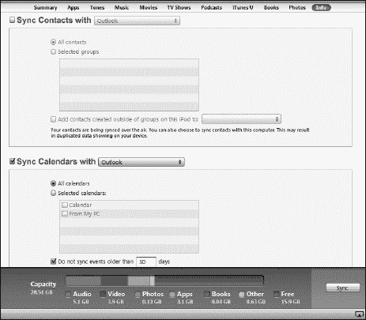

**图 3–5.** *`iTunes` 的**信息**选项卡，您可在此设置联系人、日历、书签等*

**注意：**如果您已设置使用 `iCloud` 同步信息，您将看到此警告，并且无法使用 `iTunes`，因为 `iCloud` 已在同步您的信息。如果您看到此警告，则可跳过使用 `iTunes` 同步邮件、通讯录和日历。

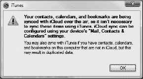

#### 同步您的联系人

让我们从设置同步联系人开始。第一步是选择要与之同步的服务。为此，请选中**同步联系人来源**旁边的复选框，并在下拉菜单中选择存储您联系人的软件或服务。在本书出版时，您在 Windows 电脑上有几种同步选项：`Outlook`、`Google 通讯录`、`Windows 联系人`和 `Yahoo! 通讯录`。

**警告：**每当您在这些同步设置屏幕中切换软件或服务（称为*同步提供者*）时，都会影响连接到您 `iTunes` 帐户的每一个移动设备。例如，如果您将联系人同步到您的 `iPad` 或 `iPod touch`，这些更改也会影响 `MobileMe`。您将更改连接到您 `iTunes` 帐户的任何其他设备同步联系人的方式。

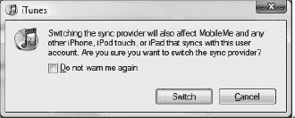

##### 与 `Google 通讯录` 同步

如果您选择 `Google 通讯录`，系统将提示您输入您的 Google ID 和密码。要更改您的 Google ID 或密码，请单击本节顶部看到的**同步联系人来源**选项旁边的**配置**按钮。

##### 与 `Yahoo! 通讯录` 同步

如果您选择 `Yahoo! 通讯录`，系统将提示您输入您的 Yahoo! ID 和密码。要更改您的 Yahoo! ID 或密码，请单击本节顶部看到的**同步联系人来源**选项旁边的**配置**按钮。

**注意：**您在此处以及**信息**选项卡中其他下拉框中看到的选项会略有不同，具体取决于您电脑上安装的软件。例如，在 `Mac` 上，联系人同步没有下拉列表；而是将 `Google 通讯录`和 `Yahoo!` 等其他服务显示为单独的复选框。

选择要与之同步的服务或应用后，您就可以继续完成同步联系人了：

1.  从以下选项中选择要同步的联系人：
    *   **所有联系人：**同步通讯录中的所有联系人（此为默认设置）。
    *   **所选群组：**仅同步您在下方窗口中勾选的特定群组内的联系人。
2.  您将看到一个复选框，内容为**将此 iPod touch 上群组外部创建的联系人添加到**（从下拉列表中选择一个群组）。此选项允许您为在 `iPod touch` 上添加的、未明确分配到任何群组的新联系人指定一个新群组。
3.  向下滚动页面，继续设置日历、电子邮件等。
4.  如果您不想设置其他同步内容，请单击 `iTunes` 屏幕右下角的**应用**按钮以开始同步。

**注意：**根据您拥有的联系人数量，首次同步可能需要超过 10 分钟，甚至可能需要 30 分钟或更长时间。因此，您可能希望选择一个能够将 `iPod touch` 放置足够长时间的时间段来执行此同步（例如，午餐时间或晚餐后）。

#### 同步您的日历

同步日历与同步联系人类似。按照以下步骤操作：

1.  在同一个**信息**选项卡中，向下滚动以查看日历同步设置。
2.  选中**同步日历来源**旁边的复选框，并在下拉菜单中选择存储您日历的软件或服务。在 Windows 电脑上，这可能是 `Outlook` 或其他应用程序；在 `Mac` 上，则是 `iCal`。
3.  选择以下任一选项：
    *   **所有日历：**同步所有日历（此为默认设置）。
    *   **所选日历：**仅同步您在下方窗口中勾选的日历。
4.  如果您想在 `iPod touch` 上节省空间，请单击**不同步超过 30 天的事件**旁边的复选框。您可以根据需要向上或向下调整天数。
5.  向下滚动页面，继续设置电子邮件帐户、书签等。
6.  如果您不想设置其他同步内容，请单击 `iTunes` 屏幕右下角的**应用**按钮以开始同步。

#### 同步电子邮件账户

向下滚动页面以同步电子邮件账户设置。

**注：** 在将电子邮件账户设置同步到 iPod touch 后，您仍需在`设置`→`邮件、通讯录、日历`中为每个电子邮件账户输入密码。对于每个账户，您只需在 iPod touch 上执行此操作一次。

请按照以下步骤操作：

1. 在`iTunes`的`信息`选项卡中，向下滚动到`日历`设置下方，即可看到`邮件`账户设置。
2. 勾选`同步邮件账户自`旁边的复选框，并调整下拉菜单，选择存储您电子邮件的软件或服务（参见图 3–6）。这可能是 Windows 电脑上的`Outlook`，或是 Mac 上的`Entourage`或`Mail`。

   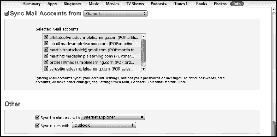

   **图 3–6.** *设置要同步的电子邮件账户*

3. 向下滚动页面，继续设置书签、备忘录等。
4. 如果您不想再设置其他同步内容，则点击`iTunes`屏幕右下角的`应用`按钮开始同步。

#### 同步书签和备忘录

iTunes 同步的一个出色功能是，您可以将电脑上的浏览器书签同步到 iPod touch。这使您可以立即使用 iPod touch 浏览所有喜爱的网站。您还可以通过`iTunes`将电脑上的备忘录同步到 iPod touch，并保持两处内容的最新状态。

**注：** 在撰写本文时，`iTunes`仅支持两种用于同步的网页浏览器：`Microsoft Internet Explorer`和`Apple Safari`。如果您使用`Mozilla Firefox`或`Google Chrome`，您仍然可以同步书签，但需要安装免费的书签同步软件（例如来自[`www.xmarks.com`](http://www.xmarks.com)的`xmarks`），以便将书签从`Firefox`或`Chrome`同步到`Safari`或`Explorer`。安装此软件后，您可以通过简单的两步操作同步浏览器书签。对于`Firefox`用户来说，`Firefox`的`Home`应用是同步书签的一个不错选择（请访问[`http://itunes.apple.com/ca/app/firefox-home/id380366933?mt=8formoreinformation`](http://itunes.apple.com/ca/app/firefox-home/id380366933?mt=8formoreinformation)）。

### 使用 iTunes 同步您的 iPod touch

当您将 iPod touch 插入电脑的 USB 端口时，同步过程通常是自动进行的。唯一的例外是您禁用了自动同步功能。

#### 在 iTunes 中同步应用

请按照以下步骤使用`iTunes`应用同步和管理应用：

1. 如同之前设置同步一样，将 iPod touch 连接到电脑，启动`iTunes`，然后单击左侧导航栏中的 iPod touch。
2. 点击主窗口顶部的`应用`选项卡。
3. 勾选`同步应用`旁边的复选框，即可查看存储在 iPod touch 上的所有应用以及您的`主屏幕`，如图 3–7 所示。

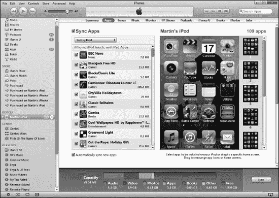

**图 3–7.** *`iTunes`中的`同步应用`屏幕*

#### 移动应用、管理文件夹或删除应用图标

在`iTunes`的`同步应用`屏幕中，移动和整理您的应用图标非常容易（同样，参见图 3–7）。尝试以下操作来完成各种任务：

- **在屏幕内移动应用**：单击应用并拖动它在屏幕上移动。如果您想一次选择多个应用，可以按住`Ctrl`键（Windows）或`Command`键（Mac）并单击选择。
- **在主屏幕页面之间移动应用**：单击并将应用拖放到右侧列中的新页面。该新页面将在主屏幕中展开。将图标放到主屏幕上。
- **将应用固定到底部 dock**：单击并将应用向下拖放到底部 dock 上。如果底部 dock 上已有四个图标，您需要拖出一个图标为新图标腾出空间。底部 dock 最多只允许放置四个图标。
- **创建新文件夹**：将一个图标拖放到另一个图标上。
- **将应用移入现有文件夹**：将图标拖放到`文件夹`图标上。
- **将应用移出文件夹**：单击文件夹将其打开。然后，将图标拖放到该文件夹之外。
- **查看另一个主屏幕页面**：单击右侧列中的该页面。
- **删除应用**：单击应用，然后单击其左上角的`x`。您只能删除自己安装的应用。在预装应用（如`iTunes`）上不会看到`x`。
- **删除文件夹**：移除该文件夹中的所有应用（将它们拖出），该文件夹将消失。

#### 移除或重新安装应用

要从 iPod touch 中移除应用，只需取消勾选其旁边的复选框并确认您的选择即可。

**提示：** 即使您从 iPod touch 中删除了应用，只要您选择了同步应用，就可以通过重新勾选其旁边的复选框来重新安装该应用。该应用将在下一次同步期间重新加载到您的 iPod touch 上。

### 同步媒体及其他内容

现在，让我们来看看如何为音乐、影片、iBooks、iTunes U 内容等设置自动同步。

**警告：** 请确保您使用要在 iPod touch 上使用的同一 iTunes 账户登录到`iTunes`，以处理受数字版权管理 (DRM) 保护的内容（例如音乐、视频等）。如果两个账户不匹配，您的内容将无法同步。如有必要，您可以在桌面电脑和 iPod touch 上都退出并重新登录 iTunes 服务，以确保登录到正确的账户。

#### 同步铃声

点击`铃声`选项卡后，您可以选择同步整个铃声库或选定的项目：

1. 将 iPod touch 连接到电脑，启动`iTunes`，然后单击左侧导航栏中的 iPod touch。
2. 点击主窗口顶部的`铃声`选项卡。
3. 勾选`同步铃声`旁边的复选框，如右图所示。

   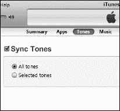

4. 默认设置为同步`所有铃声`。要仅同步特定铃声，请点击`选定铃声`旁边的单选按钮。
5. 完成选择后，点击`应用`按钮开始同步铃声。

#### 同步音乐

点击`音乐`选项卡后，您可以选择同步整个音乐库或选定的项目。

**警告：** 如果您已经手动将一些音乐、音乐视频或语音备忘录传输到 iPod touch，您将收到一条警告消息，提示 iPod touch 上的所有现有内容将被移除，并替换为您电脑上选定的音乐库。

要将音乐从电脑同步到 iPod touch，请按照以下步骤操作：

1. 将 iPod touch 连接到电脑，启动`iTunes`，然后单击左侧导航栏中的`iPod touch`。
2. 点击主窗口顶部的`音乐`选项卡。
3. 勾选`同步音乐`旁边的复选框。
4. 仅当您确定您的音乐库对 iPod touch 来说不会太大时，才点击`整个音乐库`旁边的按钮。
5. 如果您不确定音乐库是否过大，或者只想同步特定的播放列表或艺人，请点击`选定的播放列表、艺人和风格`旁边的按钮：
   - 您可以通过勾选相应的复选框来选择是否包含音乐视频和语音备忘录。
   - 您还可以用歌曲自动填充剩余空间。

     **警告：** 我们不建议勾选此选项，因为它会占满 iPod touch 的所有空间，让您那些很酷的应用无处可放！

   - 现在，在屏幕底部的两列中勾选任意播放列表或艺人。您甚至可以使用`艺人`列顶部的`搜索`框来搜索特定的艺人。
6. 完成选择后，点击`应用`按钮开始同步音乐。

#### 同步影片

点击 `Movies` 选项卡后，可以选择同步特定影片、近期影片、未观看影片或所有影片。

要将影片从电脑同步到 iPod touch，请按照以下步骤操作：

1.  将 iPod touch 连接到电脑，启动 `iTunes`，然后在左侧导航栏中点击您的 iPod touch。
2.  点击主窗口顶部的 `Movies` 选项卡。
3.  勾选 `Sync Movies` 旁边的复选框（参见 图 3–8）。
4.  如果您想同步近期或未观看的影片，请勾选 `Automatically include` 旁边的复选框，并使用下拉菜单选择 `All`、`1 most recent`、`All unwatched`、`5 most recent unwatched` 等选项。

    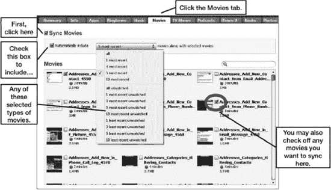

    **图 3–8.** *配置 `Movies` 选项卡以自动同步所选内容*

5.  如果您选择了除 `All` 之外的任何选项，则可以选择将特定影片或视频同步到 iPod touch。只需勾选您想要包含在同步中的影片旁的复选框即可。
6.  完成影片选择后，点击 `Apply` 按钮保存设置并开始同步。

#### 同步电视节目

点击 `TV Shows` 选项卡后，可以选择同步特定电视节目、近期节目、未观看节目或所有节目。

要将电视节目从电脑同步到 iPod touch，请按照以下步骤操作：

1.  将 iPod touch 连接到电脑，启动 `iTunes`，然后在左侧导航栏中点击您的 iPod touch。
2.  点击主窗口顶部的 `TV Shows` 选项卡。
3.  勾选 `Sync TV Shows` 旁边的复选框。
4.  如果您想同步近期或未观看的电视节目，请勾选 `Automatically include` 旁边的复选框，并使用下拉菜单选择 `All`、`1 newest`、`All unwatched`、`5 oldest unwatched`、`10 newest unwatched` 等选项。
5.  在 `episodes of` 旁边选择 `All Shows` 或 `Selected Shows`。
6.  如果选择 `Selected Shows`，您可以在屏幕中间的两个区域中选择单个节目甚至单集。
7.  如果您有电视节目的播放列表，可以通过勾选屏幕底部区域的复选框来选择包含这些播放列表。
8.  完成单个电视节目的选择后，点击 `Apply` 按钮保存设置并开始同步。

#### 同步播客

点击 `Podcasts` 选项卡后，可以选择同步特定播客、近期播客、未播放播客或所有播客。

**提示：** 播客是音频或视频节目，通常有固定的更新周期（例如每日、每周或每月更新）。在 iTunes Store 中，大部分播客都可以免费订阅。当您订阅并按照本节所述设置自动同步后，您将在 iPod touch 上接收到所有喜爱的播客。

许多您喜爱的广播节目都以播客形式录制和播出。我们鼓励您查看 iTunes Store 的 `Podcast` 板块，看看有哪些内容可能让您感兴趣。您会找到电影评论、新闻节目、法学院考试复习、游戏节目、老式广播节目、教育内容等各类播客。

要将播客从电脑同步到 iPod touch，请按照以下步骤操作：

1.  将 iPod touch 连接到电脑，启动 `iTunes`，然后在左侧导航栏中点击您的 `iPod touch`。
2.  点击主窗口顶部的 `Podcasts` 选项卡。
3.  勾选 `Sync Podcasts` 旁边的复选框。
4.  如果您想同步近期或未播放的播客，请勾选 `Automatically include` 旁边的复选框，并使用下拉菜单选择 `All`、`1 newest`、`All unplayed`、`5 newest`、`10 most recent unplayed` 等选项。
5.  在 `episodes of` 旁边选择 `All Podcasts` 或 `Selected Podcasts`。
6.  如果选择 `Selected Podcasts`，您可以在屏幕中间的两个区域中选择单个播客甚至单集。
7.  如果您有播客的播放列表，可以通过勾选屏幕底部区域的复选框来选择包含这些播放列表。
8.  完成播客选择后，点击 `Apply` 按钮保存设置并开始同步。

**提示：** 同步这些播客后，您可以导航到设备上 `Music` 应用中的 `Podcasts` 板块来收听它们。

#### 同步 iBooks 和有声读物

点击 `Books` 选项卡后，可以选择同步全部或选定的图书和有声读物。

**提示：** iPod touch 上的图书是其纸质版本的电子版。它们采用特定的电子格式，称为 `ePub`。您可以在 iPod touch 上的 iBookstore 中购买，也可以从其他来源获取，并使用这里描述的步骤将它们同步到 iPod touch。从其他来源获取的图书必须是无保护或“无 DRM 限制”的，才能同步到您的 iPod touch。您可以在 iPod touch 上的 `iBooks` 应用或其他图书阅读应用中阅读这些图书。更多信息请参见第 12 章：“iBooks 和电子书”。

要在电脑和 iPod touch 之间同步图书或有声读物，请按照以下步骤操作：

1.  将 iPod touch 连接到电脑，启动 `iTunes`，然后在左侧导航栏中点击您的 `iPod touch`。
2.  点击主窗口顶部的 `Books` 选项卡。
3.  勾选 `Sync Books` 和 `Sync Audiobooks` 旁边的复选框。
4.  如果您想同步所有图书，请保持默认选项 `All books` 不变。
5.  否则，选择 `Selected books`，然后通过在窗口中勾选特定图书来做出选择。

    **提示：** 为了将 iBooks、PDF 文件和其他类似文档同步到 iPod touch，您需要先将文件从电脑拖放到您的 iTunes 资料库中。从电脑上的任意文件夹中抓取文件，然后将其直接拖放到 `iTunes` 左上角列中的资料库中。

6.  如果您想同步所有有声读物，请保持默认选项 `All audiobooks` 不变。
7.  否则，选择 `Selected audiobooks`，然后通过在该选项下方的窗口中勾选特定有声读物来做出选择。
8.  完成单个图书和有声读物的选择后，点击 `Apply` 按钮保存设置并开始同步。

**提示：** 同步这些图书后，您可以在设备上的 `iBooks` 应用中阅读它们。您可以在 `Music` 应用中收听有声读物，该应用的左侧有 `Audiobooks` 选项卡。

**注意：** 来自 Audible 的有声读物，需要您先用 Audible 账户授权您的电脑，然后才能将其从电脑同步到 iPod touch。

#### 同步照片

点击**照片**标签页时，你可以选择同步所有文件夹或选定文件夹中的照片，甚至还可以包含视频。

**提示：** 你可以创建一个精美的电子相框，并在 iPod touch 绚丽的屏幕上分享你的照片（请参阅第 19 章：“使用照片”）。你甚至可以用自己的照片设置主屏幕壁纸和锁定屏幕壁纸——更多信息请参阅第 8 章：“个性化与安全”。

要将照片从电脑同步到 iPod touch，请按照以下步骤操作：

1.  将 iPod touch 连接到电脑，启动 **iTunes**，然后在左侧导航栏中点击你的 iPod touch。

    **提示：** Mac 用户也可以在 **iPhoto** 中使用各种条件同步照片，包括“事件”（按时间同步）、“面孔”（按人物同步）和“地点”（按位置同步）。

2.  点击主窗口顶部的**照片**标签页。
3.  勾选**从以下位置同步照片**旁边的复选框。
4.  点击**从以下位置同步照片**旁边的下拉菜单，然后从电脑中选择存储照片的文件夹。如果你想获取所有照片，请选择尽可能高的文件夹层级（例如，Windows 电脑上的 `C:` 盘，或 Apple Mac 上的硬盘根目录 `/`）。
5.  如果你想同步电脑上所选文件夹中的所有照片，请选择**所有文件夹**。

    **警告：** 由于电脑中的照片库可能太大，无法全部放入 iPod touch，因此勾选**所有文件夹**时请务必谨慎。

6.  否则，请选择**所选文件夹**，并通过勾选下方窗口中的特定文件夹来进行选择。
7.  你还可以通过勾选**包含视频**旁边的复选框来包含文件夹中的任何视频。
8.  完成选择要同步的照片后，点击**应用**按钮以保存设置并开始同步。
9.  同步开始时，你将在 **iTunes** 的中上部状态窗口中看到同步状态。

### 解决 iTunes 和同步问题

有时 **iTunes** 的行为可能不符合预期，因此这里提供几个简单的故障排除技巧。

#### 查阅 Apple 知识库获取有帮助的文章

遇到问题时，第一步是查阅 Apple 的支持页面，你可以在其中找到大量有用的信息。在你的 iPod touch 或电脑的网页浏览器中，访问以下网页：

`www.apple.com/support/iPod touch/`

然后，点击左侧导航栏中显示的一个主题。

#### iTunes 卡死且无响应（Windows 电脑）

有时，**iTunes** 会卡死并完全无响应。如果在 Windows 电脑上出现这种情况，请按照以下步骤操作：

1.  同时按下键盘上的 `Ctrl` + `Alt` + `Del` 键，调出**Windows 任务管理器**。**任务管理器**应类似图 3-9 所示。

    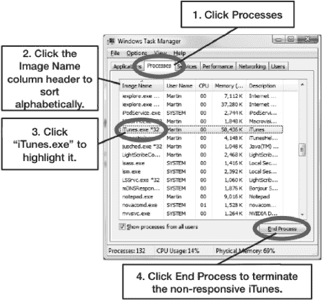

    **图 3-9.** *在 **Windows 任务管理器** 中找到 `iTunes.exe`，以便终止它*

2.  要结束该进程，请从弹出的窗口中点击**结束进程**。
3.  现在，**iTunes** 应被强制关闭。
4.  尝试重新启动 **iTunes**。
5.  如果 **iTunes** 无法启动或再次卡死，则重启电脑并重试。

#### iTunes 卡死且无响应（Apple 电脑）

如果你使用的是 Apple 电脑（Mac），当 **iTunes** 应用卡死且完全无响应时，请按照以下步骤操作：

**提示：** 按下 `Command + Option + Escape` 是调出**强制退出应用程序**窗口的快捷键（请参阅图 3-10）。

1.  点击顶部的 **iTunes** 菜单。
2.  点击**退出 iTunes**。
3.  如果这不起作用，请转到任何其他程序，然后点击 Mac 左上角的小**Apple** 标志。

    点击**强制退出**，将显示正在运行的程序列表。

4.  选中 **iTunes**，然后点击**强制退出**按钮。
5.  如果这没有帮助，请尝试重启你的 Mac。

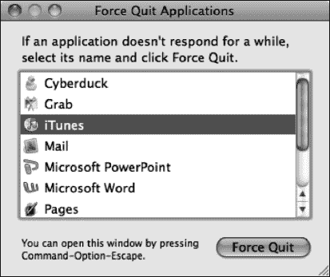

**图 3-10.** *Mac 电脑上的 **强制退出应用程序** 窗口*

### 更新你的 iPod touch 操作系统

借助 iOS 5，你现在可以在设备上直接更新 iPod touch 的操作系统。有更快、更高效的更新方法，我们建议你尽可能使用这些方法。但是，如果你需要重新安装整个操作系统，或者想通过 **iTunes** 升级，本节将说明如何操作。

**注：** 请在你愿意让 iPod touch 离开身边 30 分钟或更长时间时进行此更新，具体时间取决于 iPod touch 上的信息量以及电脑和互联网连接的速度。

通常，**iTunes** 会按照设定的计划（大约每两周）自动检查更新。如果未找到更新，**iTunes** 会告诉你何时进行下一次检查。请按照以下步骤使用 **iTunes** 手动更新你的 iPod touch：

1.  启动 **iTunes**。
2.  将 iPod touch 连接到电脑。
3.  点击左侧导航栏中 **设备** 下列出的你的 iPod touch。
4.  点击顶部导航栏中的 **摘要** 标签页。
5.  点击屏幕中央 **版本** 部分中的 **检查更新** 按钮。
6.  如果你已拥有最新版本，你将看到一个弹出窗口，内容类似于：“此版本的 iPod touch 软件（5.0）是当前版本。”点击 **确定** 关闭窗口。更新过程完成。
7.  如果你没有最新版本的 **iTunes**，一个窗口会告知你有新版本可用，并询问你是否要更新。点击 **是** 或 **更新** 执行操作。
8.  **iTunes** 将引导你通过几个屏幕，描述更新并请你同意软件许可。如果你同意，请点击 **下一步** 和 **同意**，以下载 Apple 提供的最新 iOS 软件。这大约需要五到十分钟。

    **提示：** 我们在第 25 章：“故障排除”的“重新安装 iPod touch 操作系统”部分展示了更新过程中你可能看到的所有屏幕。

9.  接下来，**iTunes** 将备份你的 iPod touch，如果你的 iPod touch 中存有大量数据，此过程可能需要十分钟或更长时间。
10. 现在，新的 iOS 将被安装，你的 iPod touch 将被抹掉。
11. 最后，你将看到一个屏幕，要求你执行以下操作之一：

    *   **设置为新的 iPod touch：** 如果希望在更新过程后抹掉所有数据，请选择此项。
    *   **从以下备份恢复：** 选择此项可确保你选择了正确的备份文件（通常是最新的备份文件）。

    此时，你的 iPod touch 将按照选择进行恢复或设置。

12. 你的 iPod touch 操作系统更新完成。

### 其他同步方法

你可以导航到 iPod touch 上**设置**应用中的**邮件**、**通讯录**、**日历**应用，以设置和使用 Exchange。下一节将说明如何操作。

#### 在设备上设置您的 Google 或 Exchange 账户

按照以下步骤为您的 Exchange 账户或 Google 通讯录和日历设置无线同步：

1.  轻触 `Settings` 图标。
2.  轻触 `Mail`、`Contacts`、`Calendar`。
3.  您会看到您的电子邮件账户列表，以及在其下方的 `Add Account` 选项。

   如果您尚未设置任何账户，您将只会看到 `Add Account`。无论哪种情况，请轻点 `Add Account`。

   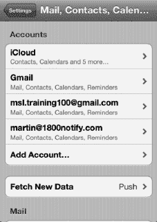

4.  在下一个屏幕上，选择 `Microsoft Exchange`。

   **注意：** 如果您想要与您的 Google 通讯录和日历进行无线同步，应选择 `Microsoft Exchange`。如果您选择 `Gmail`，您将无法与您的 Google 通讯录进行无线同步。

   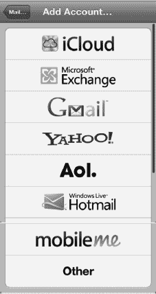

5.  输入您的电子邮件地址。

   **提示：** 要在电子邮件地址中输入 `.com`（或 `.net`、`.edu`、`.org` 等），请按住 `Period` （`.`） 键，直到其上方出现 `.com` 键。然后滑动手指并按下 `.com`。

   

   **提示：** 既然您的电子邮件地址通常也是您的用户名，您可以通过复制粘贴来节省时间。

   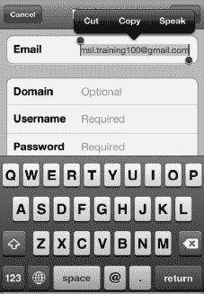

6.  将您的电子邮件地址复制并粘贴到 `Username` 字段中（当您的用户名与您的电子邮件相同，或者与 `@` 符号前的电子邮件第一部分相同时，此方法很有效）：

   * 按住 `Email` 字段，然后抬起手指，即可看到其上方出现黑色弹出菜单。
   * 轻点 `Select All`。
   * 轻点 `Copy`。
   * 按住 `Username` 字段，然后抬起手指，即可看到弹出菜单出现。轻点 `Paste`。

   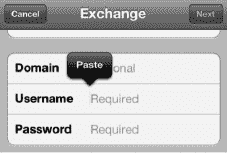

7.  将 `Domain` 字段留空。

   输入您的 `Password`。

   如果需要，您可以调整账户的 `Description`，其默认值为您的电子邮件地址。

8.  轻点右上角的 `Next` 按钮。

   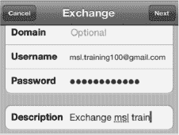

9.  您可能会看到一个 `Unable to Verify Certificate` 对话框。如果看到，请点击 `Accept` 继续。

   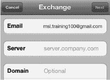

10. 在 `Server` 字段中，输入 `m.google.com` 以同步到 Google。否则，如果您正在设置您的 Exchange 服务器账户，请输入该服务器地址。
11. 点击右上角的 `Next`。

    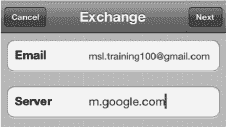

12. 在此屏幕上，您可以选择将 `Mail`、`Contacts` 和 `Calendars` 的无线同步设置为 `ON` 或 `OFF`。对于您想要开启的每个同步，轻触开关将其更改为 `ON`。

**注意：** 如果您在 iPod touch 上已有通讯录或日历项目，您可能会看到一些警告出现。您的选项是 `Keep on My iPod touch` 或 `Delete`。如果您选择 `Cancel`，您的 iPod touch 将停止设置您的 Exchange 账户。选择 `Keep on My iPod touch` 以保留您 iPod touch 上所有现有的通讯录和日历事件。这些项目将不会出现在您的 Exchange 账户中——它们将保留在您的 iPod touch 上。

