# 第 4 章

## 连接到网络

我们生活在一个互联的世界。无线互联网（Wi-Fi）接入已成为常态而非例外——而且您很可能已经在家庭或办公室使用 Wi-Fi。现在您可以利用它来将您的 iPod touch 连接到互联网。

在本章中，我们将向您展示从几乎任何形式的 Wi-Fi 网络（无论是开放网络还是安全网络）进行连接或断开连接的所有方法。如果您在一个拥有 VPN（*虚拟专用网络*）的组织工作，我们将向您展示如何连接到该网络。

### 连接到 Wi-Fi 网络后我能做什么？

以下是您连接到 Wi-Fi 网络后可以执行的一些操作：

* 从 `App Store` 访问和下载应用程序（程序）。
* 从您 iPod touch 上的 `iTunes` 应用访问和下载音乐、视频、播客等。
* 使用 `Safari` 浏览网页。
* 发送和接收电子邮件。
* 使用需要互联网连接的社交网站，如 Facebook、Twitter 等。
* 玩需要实时互联网连接的游戏。
* 执行任何其他需要互联网连接的操作。

**注意：** iPod touch 支持速度更快、范围更广的 802.11n 标准。然而，它仅支持更拥挤的 2.4MHz 频段上的 802.11n，而不支持较不拥挤的 5MHz 频段。如果您想将 iPod touch 与 802.11n 无线路由器配合使用，请确保其是双频路由器或将路由器设置为 2.4MHz。

### 连接到 Wi-Fi 网络

要设置您的 Wi-Fi 连接，请按照以下步骤操作：

1.  轻点 `Settings` 图标。
2.  轻点顶部的 `Wi-Fi`。
3.  确保 `Wi-Fi` 开关设置为 `ON`。如果当前为 `OFF`，则轻触将其打开为 `ON`。
4.  一旦 Wi-Fi 处于 `ON` 状态，iPod touch 将自动开始搜索无线网络。
5.  可访问的网络列表显示在 `Choose a Network…` 选项下方。此屏幕截图显示我们有一个可用的网络。
6.  要连接到列出的任何网络，只需轻触网络名称。如果网络不安全（没有 `Lock` 图标），您将自动连接。

### 在具有网页登录功能的公共 Wi-Fi 热点进行连接

在某些提供免费 Wi-Fi 网络的场所（例如咖啡店、酒店或餐厅），一旦您的 iPod touch 连接到该网络，就会出现一个弹出窗口。在这些情况下，只需轻点网络名称。您可能会被带到 `Safari` 浏览器屏幕以完成网络登录：

1.  如果您看到类似所示的弹出窗口，请轻点您想要加入的网络名称。在右侧的示例中，我们轻点 `Panera` 网络。

   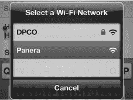

2.  在某些情况下，您可能会看到一个 `Safari` 窗口弹出，这可能会让人相当困惑，因为它在您的 iPod touch 屏幕上非常小。您需要使用双击或张开手势（请参阅快速入门指南寻求帮助）来放大网页。您需要找到一个标有 `Login`、`Agree` 或类似字样的按钮。轻点该按钮以完成连接。

   

**注意：** 某些地方（如咖啡店）使用基于网页的登录，而不是用户名/密码屏幕。在这种情况下，当您点击网络（或尝试使用 `Safari`）时，您的 iPod touch 将打开一个浏览器屏幕，您将看到网页以及您的登录选项。

### 安全 Wi-Fi 网络——输入密码

某些 Wi-Fi 网络需要密码才能连接。这是在网络管理员创建无线网络时设置的。您必须知道确切的密码，包括其是否区分大小写。

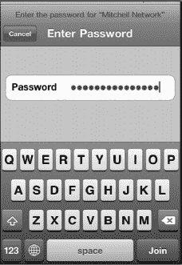

如果网络确实需要密码，那么您将被带到 `Enter Password` 屏幕。完全按照提供给您的密码进行输入，然后按屏幕键盘上的 `Enter` 键（此时该键标记为 `Join`）。

在 `Network` 屏幕上，您将看到一个 `Checkmark` 图标，表明您已连接到该网络。

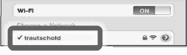

**提示：** 您可以在密码对话框中进行粘贴；因此对于较长、随机的密码，您可以将其传输到您的 iPod touch 上（通过电子邮件），然后直接复制粘贴。请记得之后立即删除该电子邮件，以确保安全。在邮件中按住密码，选中它，然后轻点 `Copy`。在 Wi-Fi 网络的 `Password` 字段中，轻触然后选择 `Paste`。

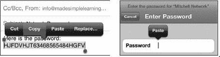

#### 切换到不同的 Wi-Fi 网络

有时你可能想更改当前连接的 Wi-Fi 网络。这种情况可能发生在酒店、公寓或其他场所，你发现 iPod touch 自动选择的网络并非信号最强的网络，或者你想使用安全网络而非不安全网络。

要切换当前连接的 Wi-Fi 网络，请轻点 `设置` 图标，点击 `Wi-Fi`，然后点击你想加入的 Wi-Fi 网络名称。如果该网络需要密码，你需要输入密码才能加入。

一旦你输入了正确的密码（或者点击了开放网络），你的 iPod touch 就会自动连接该网络。

#### 验证你的 Wi-Fi 连接

通过在 `设置` 主界面中查看 `Wi-Fi` 选项旁边的状态，你可以轻松判断是否已连接到网络（以及连接的是哪个网络）。请按照以下步骤检查 Wi-Fi 连接状态：

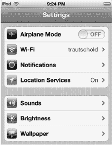

1.  轻点你的 `设置` 图标。
2.  查看顶部 `Wi-Fi` 选项旁边的状态：
    *   如果显示 `未连接`，则表示你没有有效的 Wi-Fi 连接。
    *   如果显示其他名称，例如 `Panera`，则表示你已连接到该 Wi-Fi 网络。

### 高级 Wi-Fi 选项（隐藏或不可发现的网络）

有时，由于网络管理员隐藏了网络名称（未广播 SSID），你可能看不到想要加入的网络。接下来，你将学习如何在 iPod touch 上加入此类网络。一旦你加入过某个网络，下次进入其覆盖范围时，iPod touch 将自动连接，而无需再次提示。你也可以让 iPod touch 每次连接网络时都询问你；我们也将教你如何设置。有时你可能想删除或忘记某个网络。例如，你参加过一次性的会议，想要移除相关的网络——你也将学会如何操作。

#### 为什么我看不到想加入的 Wi-Fi 网络？

有时，出于安全考虑，人们会隐藏网络（隐藏称为 SSID 的网络名称），你必须手动输入名称和安全选项才能连接。

正如你所见，可用网络列表中包含 `其他` 选项。

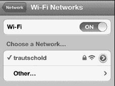

1.  点击 `其他` 按钮，即可手动输入你想要加入的网络名称。
2.  输入 Wi-Fi 网络 `名称`。

    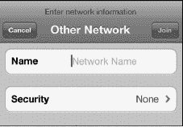

3.  点击 `安全性` 标签。
4.  选择该网络使用的安全类型。如果你不确定，需要向网络管理员咨询。

    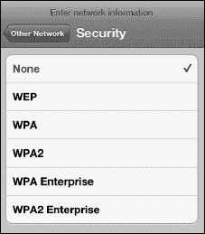

当你获得所需信息后，输入信息及正确的密码，这个新网络将被保存到你的网络列表中，供以后访问。

#### 重新连接之前加入过的 Wi-Fi 网络

iPod touch 的一个优点是，当你回到曾经加入过的 Wi-Fi 网络区域时（无论是开放网络、安全网络还是密码保护网络），它会自动重新连接，而无需事先询问。不过，你可以关闭此自动连接功能，具体方法见下一节。

##### “询问是否加入网络”总开关

这里有一个 `询问是否加入网络` 总开关，默认设置为 `开启`。已知网络会自动连接，但此设置只在没有已知网络可用时生效。当此开关设为 `开启` 时，系统会询问你是否加入可见的 Wi-Fi 网络。如果有可用但你不认识的网络，连接前会向你询问。

如果此开关设为 `关闭`，你必须手动加入未知网络。

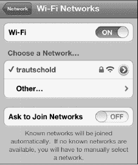

为什么要关闭此功能？

这样做可以作为一项安全措施，例如，如果你不想让孩子在未经你允许的情况下使用 iPod touch 加入无线网络。

此外，如果 iPod touch 在你不想连接 Wi-Fi 的区域（例如途经有很多热点的场所）不断弹出 `加入网络` 连接界面，也会让人感到烦恼。

##### 每个网络上的“自动加入”和“自动登录”开关

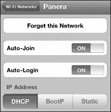

有时，你可能会发现某个特定的 Wi-Fi 网络有额外的开关，它们会覆盖主开关 `询问是否加入网络` 的设置。点击网络名称旁边的小蓝色`箭头`图标

 可以查看此 Wi-Fi 网络的详细信息。默认情况下，`自动加入` 和 `自动登录` 都设为 `开启`。

若要禁用 `自动加入` 或 `自动登录`，点击相应开关将其设为 `关闭`。

##### 忘记（或删除）一个网络

如果你发现不再需要连接到列表中的某个网络，可以选择 `忘记`——即将其从网络列表中移除。请按照以下步骤操作：

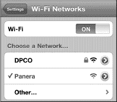

1.  点击 `设置` 图标。
2.  点击 `Wi-Fi` 查看你的网络列表。
3.  点击你想忘记的网络旁边的小蓝色`箭头`图标，即可看到此处显示的屏幕。
4.  点击屏幕顶部的 `忘记此网络`。

    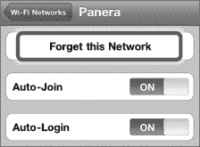

5.  系统将弹出一条警告。只需点击 `忘记`，该网络将不再显示在你的列表中。

    

### 乘坐飞机：飞行模式

乘坐飞机时，乘务员通常会要求你在起飞和降落期间关闭所有便携式电子设备。然后，当飞机达到一定高度后，乘务员会告知可以重新打开“所有经批准的电子设备”。

如果你需要完全关闭 iPod touch，请按住右上角的 `电源` 按钮，然后用手指 `滑动来关机`。

由于 iPod touch 是一款仅支持 Wi-Fi 的设备，为什么你会想要或需要开启飞行模式或关闭 Wi-Fi 呢？iPod touch 还包含其他无线电模块，例如蓝牙，而飞行模式可以一次性快捷地关闭所有无线功能。

此外，如果你电量不足且不需要联网，关闭 Wi-Fi 或开启飞行模式是尽可能延长剩余电池使用时间的快捷方法。

要启用 `飞行模式`，请按照以下步骤操作：

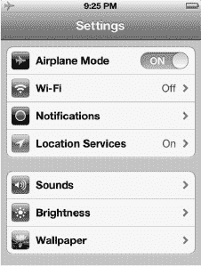

1.  点击 `设置` 图标。
2.  将左侧栏顶部的 `飞行模式` 旁边的开关设为 `开启`。
3.  请注意，Wi-Fi 将自动关闭。

    **提示：** 有些航空公司提供机上 Wi-Fi 网络。在这些航班上，你可以在适当的时候将 Wi-Fi 重新设为 `开启`。

你可以按照以下步骤打开或关闭 Wi-Fi 连接：

1.  点击 `设置` 图标。
2.  点击屏幕顶部的 `Wi-Fi`。

    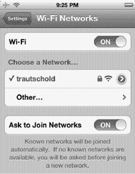

3.  要启用 Wi-Fi 连接，将页面顶部的 `Wi-Fi` 旁边的开关设为 `开启`。
4.  要禁用 Wi-Fi，将同一个开关设为 `关闭`。
5.  选择 Wi-Fi 网络，并按照乘务员给出的步骤进行连接。

### VPN：虚拟专用网络

你的组织可能设有所谓的 VPN，即*虚拟专用网络*。VPN 允许你将 iPod touch、笔记本电脑或其他设备安全地连接到公司网络。

#### 建立连接

要建立连接，你需要从所在机构的技术服务台或网络管理员处获取 VPN 类型和具体的登录说明。然后，在 iPod touch 上的 **“设置”** 应用中，将这些登录信息输入到 **“VPN”** 区域。

**提示：** 如果你已经设置了电脑来连接 VPN，很可能可以省去致电技术服务台的步骤，并跳过第 1 步。这是因为你的 iPod touch 很可能使用与电脑相同的 VPN 登录凭据。

##### 第 1 步：联系你所在机构的技术服务台

你需要向技术服务台或 VPN 管理员询问登录 VPN 的详细信息。你的 iPod touch 当前支持连接以下类型的 VPN：**L2TP**、**PPTP** 和 **IPSec**（Cisco）。你还需要了解你的 VPN 是否使用 **代理**，以及配置是手动还是自动。

##### 第 2 步：在 iPod touch 上设置 VPN 连接

掌握了登录说明和 VPN 连接类型后，你就可以在 iPod touch 上连接了：

1.  轻点 **“设置”** 图标。

    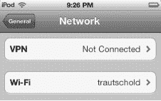

2.  轻点 **“通用”**。
3.  轻点 **“网络”**。
4.  向下滚动到屏幕底部，轻点 **“VPN”**。
5.  在 **“VPN”** 屏幕上，轻点 **“VPN”** 选项旁边的开关，将其设置为 **“开启”**。随后你应会进入 **“添加配置”** 屏幕。如果没有，则轻点底部的 **“添加 VPN 配置”** 来设置一个新的 VPN 连接。

    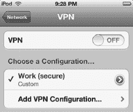

6.  **“添加配置”** 屏幕是使用从技术服务台或 VPN 管理员处获得的信息来设置 VPN 登录详细信息的地方。

    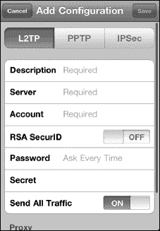

7.  如果你的 VPN 是 **L2TP** 类型，则你会看到此处所示的屏幕。滚动到底部，并根据需要输入 **代理** 信息。
8.  如果你的 VPN 是 **PPTP** 类型，则轻点顶部的 **“PPTP”**，然后使用此处所示的屏幕。滚动到底部，并根据需要输入 **代理** 信息。

    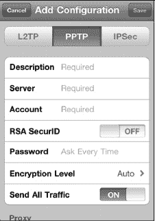

9.  如果你的 VPN 是 **IPSec**（Cisco）类型，则轻点 **“IPSec”** 并使用此处所示的屏幕。滚动到底部，并根据需要输入 **代理** 信息。

    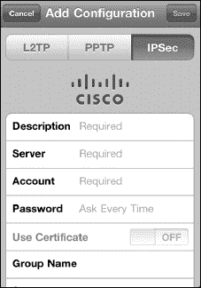

10.  完成设置后，轻点右上角的 **“存储”** 按钮。
11.  如果登录遇到问题，请确保你处于无线网络信号良好的区域，并检查你是否正确输入了所有登录凭据。由于输入的密码会隐藏显示，这可能会有些困难。在致电技术服务台之前，不妨尝试重新输入密码和服务器信息。

#### 了解何时已连接到 VPN 网络

你会在网络连接状态显示的右侧看到一个小型 **“VPN”** 图标 。*只有*当你看到此图标时，才表示你已经安全地连接到 VPN 网络。

#### 切换 VPN 网络

你可能需要连接多个 VPN 网络。你可以按照以下步骤在 iPod touch 上选择不同的 VPN 配置：

1.  轻点 **“设置”** 图标。
2.  轻点 **“通用”**。
3.  轻点 **“网络”**。
4.  向下滚动到屏幕底部，轻点 **“VPN”**。
5.  在 VPN 屏幕上，轻点另一个 **“VPN 配置”** 以连接到它。除非你想更改该网络的登录设置，否则不要轻点带有 > 符号的蓝色 **“圆圈”** 图标。

