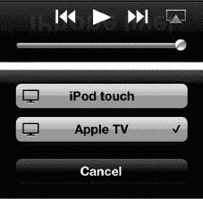
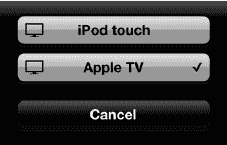
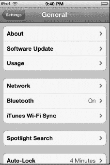
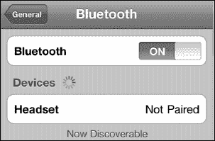
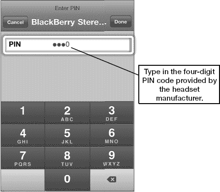
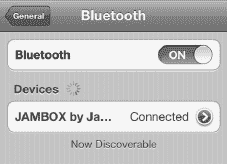
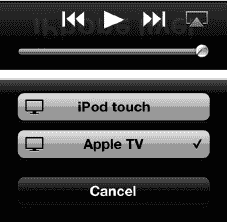
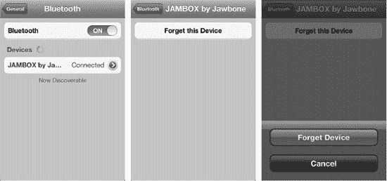

# 第 5 章

## AirPlay 与蓝牙

在本章中，我们将向你展示如何将 iPod touch 与任何兼容 AirPlay 或蓝牙的设备连接，无论是 Apple TV、立体声扬声器还是无线耳机。

### 了解 AirPlay

*AirPlay* 是苹果公司专有的视频和音频流传输协议。AirPlay 通过你本地家庭、学校或办公室的 Wi-Fi 网络工作。要在 iPod touch 上使用 AirPlay，你必须确保所有设备都连接到同一个 Wi-Fi 网络。

#### 与 iPod touch 兼容的 AirPlay 设备

在撰写本文时，仅有 2010 年款的 Apple TV 支持 AirPlay 视频流传输。通过它，你可以将内容直接从 iPod touch 流传输到大屏幕电视上，与同事、朋友和家人分享。

苹果的 AirPort Express Wi-Fi 路由器有一个音频输出接口，可以连接到扬声器以实现 AirPlay 音频播放。各种第三方配件制造商也在推出兼容 AirPlay 的扬声器。通过 AirPlay，你可以直接在你的 iPod touch 上远程控制播放和音量。

### 设置和使用 AirPlay

AirPlay 已内置于 iPod touch 中。只要你的所有设备都连接到同一个 Wi-Fi 网络，就无需进行额外设置。

几个内置的 iPod touch 应用支持 AirPlay，包括 **“视频”**、**“音乐”** 和 **“YouTube”**。一些使用了苹果默认媒体播放器（例如 **“Air Video”**）的 App Store 应用也支持 AirPlay。请按照以下步骤从支持该功能的应用中使用 AirPlay：

1\. 轻点屏幕右下角的蓝色 **AirPlay** 图标。

2\. 从可用设备列表中选择用于流传输音乐的设备。

3\. 若要将视频或音乐切换回你的 iPod touch，只需再次轻点 **AirPlay** 图标，然后从列表中选择 **“iPod touch”**。

**注意：** **AirPlay** 图标会调出同时包含蓝牙和 Wi-Fi 连接设备的列表。有关蓝牙的更多信息，请参见下一节。

你可以通过轻点 **“Apple TV”** 来选择它。现在，你的音乐或视频将从选定的 AirPlay 设备开始播放。你可以通过再次触摸屏幕上的 **AirPlay** 图标来验证这一点。你应该会看到在新选定的 AirPlay 立体声蓝牙设备旁边有一个 **“选中标记”** 图标，并且你应该能听到音乐从该音源发出。

**提示：** 为了节省 iPod touch 的电池电量，在将 AirPlay 内容流传输到其他设备时，可以按下 **“睡眠”** 按钮关闭屏幕。你的音乐或视频将继续播放，但你不会因为屏幕亮着而浪费电量。

#### AirPlay 镜像

当前的 iPod touch 不仅能让你将视频或音乐从 iPod touch 流传输到 Apple TV；还能让你共享任何应用的屏幕——无论是工作中的商务演示、与家人的棋盘游戏，还是与远方亲戚的视频通话。能够将 **Keynote**、**Infinity Blade** 或 **FaceTime** 从小小的 iPod touch 屏幕带到巨大的电视机上，这确实将个人的私密体验转变为有趣的社交活动。

请按照以下步骤使用 AirPlay 镜像功能：

4\. 轻点你想要镜像的应用。在此示例中，我们使用的是 **Infinity Blade**。

5\. 应用启动后，双击 Home 按钮以调出快速应用切换器。

6\. 从左向右滑动以找到音频/视频控制项。（它们在最末端，所以请持续滑动直到无法再滑动为止。）

7\. 轻点 **AirPlay 按钮** 以调出你 Wi-Fi 网络上支持 AirPlay 的设备列表。

8\. 选择 **Apple TV**。

9\. 将 **“AirPlay 镜像”** 开关切换至 **“开启”**。

10\. 再次点击 **Home** 按钮以返回你的应用。

11\. 现在你应该能在屏幕上看到 **Infinity Blade** 了。放马过来吧！

要停止 AirPlay 镜像，请重复相同步骤，并从设备列表中选择 iPod touch。

### 了解蓝牙

苹果最新的 iPod touch 支持蓝牙 4.0，该技术不仅包含传统的蓝牙功能，还具备更先进的高速与低功耗特性。这意味着你可以享受更高质量的通话或音乐，且续航时间比以往更久。

得益于名为 `A2DP` 的技术，你还可以将音乐流式传输到支持蓝牙的立体声设备，包括许多新型车载立体声音响和车载套件。

**注意：** 你必须使用第三方蓝牙适配器或支持蓝牙的立体声音响，才能通过蓝牙技术流式传输音乐。

### 了解蓝牙

蓝牙允许你的 iPod touch 与设备进行无线通信。蓝牙是一种从每个设备发射信号的小型无线电。在将外设与 iPod touch 配合使用之前，你需要将该设备与 iPod touch 进行配对。许多蓝牙设备可在距离 iPod touch 最远 30 英尺（约 9 米）的范围内使用。

#### 兼容 iPod touch 的蓝牙设备

iPod touch 可兼容多种蓝牙设备，包括蓝牙耳机、蓝牙立体声音响及适配器、蓝牙键盘、蓝牙车载音响系统、蓝牙耳麦以及免提设备。iPod touch 支持 `A2DP`（即立体声蓝牙）和 `AVRCP`（可让你远程控制播放和音量）。

### 与蓝牙设备配对

你使用蓝牙的主要场景可能是连接蓝牙耳机或蓝牙立体声适配器。任何蓝牙耳机都应能与你的 iPod touch 良好配合。要开始使用任何蓝牙设备，你需要先将其与 iPod touch 配对（连接）。

#### 开启蓝牙

使用蓝牙的第一步是打开蓝牙无线电。请按照以下步骤操作：

1.  点击 **设置** 应用。
2.  接着点击 **通用**。
3.  点击 **蓝牙**。默认情况下，iPod touch 的蓝牙初始设置为 **关闭**。点击开关将其拨至 **打开** 位置。

**提示：** 蓝牙会增加电池消耗。如果你在一段时间内不打算使用蓝牙，请考虑将开关拨回 **关闭** 位置。

#### 配对接头戴式设备或任何蓝牙设备

一旦打开蓝牙，iPod touch 将开始搜索附近的蓝牙设备，例如蓝牙耳麦或立体声适配器（参见 图 5–1）。为了让 iPod touch 找到你的蓝牙耳麦，你需要将该设备置于 *配对模式*。请仔细阅读耳麦附带的说明——通常需要按住某个组合键才能进入此模式。

**提示：** 某些耳麦需要你按住某个按钮五秒钟，直到你看到一串闪烁的蓝色或红/蓝色灯光。一些配件（例如 Apple 无线蓝牙键盘）会自动进入配对模式。

一旦 iPod touch 检测到蓝牙设备，它将尝试自动与之配对。如果配对自动完成，则你无需进行其他操作。

**图 5–1.** *蓝牙设备已发现，但尚未配对*

**注意：** 某些蓝牙设备（例如耳麦）可能会要求你在键盘上输入一串数字（*配对码*）（参见 图 5–2）。

**图 5–2.** *在配对过程中出现提示时，输入四位数的配对码。*

较新的耳麦——例如这里使用的 Aliph Jawbone ICON——会自动与你的 iPod touch 配对。只需将耳麦置于配对模式，并将 iPod touch 的 **蓝牙** 选项设置为 **开启**——你所需要做的就是这些！

配对将是自动完成的，你之后应该无需重新配对耳麦。

### 蓝牙立体声（A2DP）

当今先进蓝牙技术的伟大特性之一，就是能够通过蓝牙无线传输音乐。这项技术的专业名称是 `A2DP`，但更通俗的叫法是 *立体声蓝牙*。

#### 连接到立体声蓝牙设备

使用立体声蓝牙的第一步是连接到一个支持立体声蓝牙的设备。这可以是内置此技术的车载音响，也可以是一副蓝牙耳机或音箱。

首先，按照制造商的说明将蓝牙设备置于配对模式，然后如本章前面所示，从 **设置** 图标进入蓝牙设置页面。

连接后，你会在蓝牙设备列表下方看到新的立体声蓝牙设备。有时你会看到设备的全名或部分名称；其他时候你只会看到“耳机”。点击设备右侧的 **箭头** 图标，你将在下一个屏幕的 **蓝牙** 标签旁看到设备的实际名称，如下图所示。

接下来，点击你的 **音乐** 应用，开始播放任何歌曲、播放列表、播客或视频音乐库。

请按照以下步骤选择音频输出设备：

4.  点击屏幕右下角的蓝色 **AirPlay** 图标。

5.  从可用设备列表中选择用于流式传输音乐的设备。

6.  要将音乐播放切换回 iPod touch，只需再次点击 **AirPlay** 图标，然后从列表中选择 iPod touch。

**注意：** **AirPlay** 图标会弹出一个列表，其中包含通过蓝牙和 Wi-Fi 连接的音频设备，例如 Apple TV 或 AirPort Express 连接的音箱。你可以从中任选其一。

我们通过点击选择了 Jawbone JAMBOX。现在，你的音乐将从选定的蓝牙设备开始播放。你可以再次触摸屏幕上的 **AirPlay** 图标来验证这一点。新的立体声蓝牙设备旁边应该会出现一个 **对勾** 图标，并且你应该能听到音乐从该音源播放出来。

### 断开连接或忽略蓝牙设备

有时，你可能想要断开蓝牙设备与 iPod touch 的连接。这很容易做到。按照本章前面所述的方式进入蓝牙设置。接着，点击你想要断开的设备以进入下一个屏幕，点击 **忽略此设备** 按钮，然后确认你的选择。

这将从 iPod touch 中删除该蓝牙配置文件（参见 图 5-5）。

**注意：** 蓝牙的有效范围通常只有约 30 英尺（约 9 米）。如果你不在蓝牙设备附近，则应关闭蓝牙。当你实际准备使用时，可以随时重新打开它。

**图 5–5.** *忽略或断开蓝牙设备*

