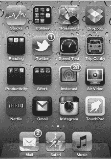
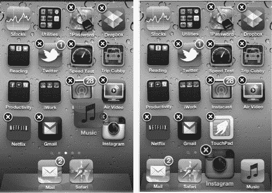
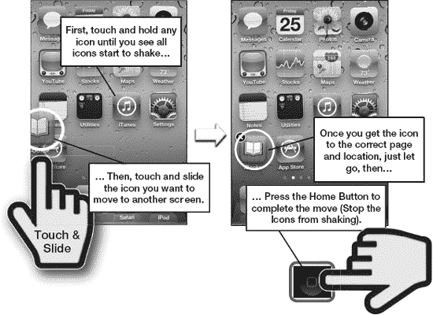
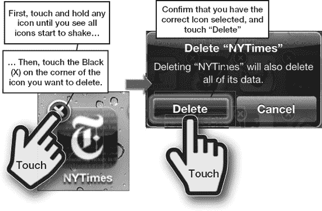
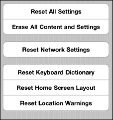
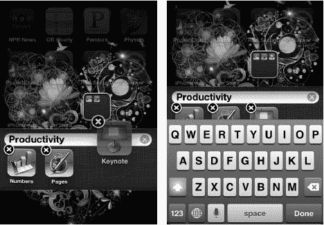
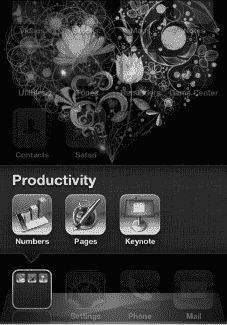

# 第 6 章

## 图标与文件夹

你的新 iPod touch 具有很高的自定义性。在本章中，我们将向你展示如何移动图标，并将你最喜欢的图标放置在你想要的位置。你最多可以使用 11 页图标，并且可以调整这些页面的外观和感觉，以反映你的个人品味。

与 Mac 电脑或 iPad 类似，iPod touch 有一个*底部程序坞*，你可以在其中放置最常用应用的图标。iPod touch 出厂时在底部程序坞中配有四个标准图标。你可以用最喜欢应用的图标替换这些默认图标，使它们始终显示在屏幕底部。你甚至可以将整个应用文件夹移动到底部程序坞。

**提示：** 你也可以使用电脑上的 **iTunes** 应用来移动或删除图标。更多信息请参阅 第 21 章：“设备上的 iTunes”。

### 将图标移至底部程序坞

当你开启 iPod touch 时，你会注意到底部程序坞中锁定着四个图标。

假设你决定想要用更常用的应用替换其中一两个图标。幸运的是，将图标移入和移出底部程序坞很容易。

好的，作为一名高级文档工程师和翻译员，我将严格遵循您提供的注意事项和示例，将以下英文文本翻译成地道、专业的中文。

#### 开始移动

按下 `Home` 按钮返回你的`主屏幕`。现在，长按`主屏幕`上的任意图标几秒钟。你会注意到所有图标都开始晃动。

首先，尝试移动几个图标。你会看到，当你将一个图标向下移动时，该行中的其他图标会移动位置为其腾出空间。

当你对图标的移动方式有了感觉后，就可以准备替换底部 Dock 栏中的一个图标了。在图标晃动时，从底部 Dock 栏中取出你想要替换的图标，并将其向上移动到被其他图标覆盖的区域。（如果将其移动到空白区域，它会直接跳回底部 Dock 栏）。

**注意：** 底部 Dock 栏最多可以放置四个图标；因此，如果你已经在那里放置了四个图标，则必须移除一个才能用新图标替换它。

例如，假设你想把`音乐`和`Instagram`图标放在底部 Dock 栏中。首先，你需要从底部 Dock 栏中拖出两个图标来清出两个空位，如图 6-1 所示。

**图 6-1.** *交换底部 Dock 栏中的图标*

接下来，找到你的`Skype`图标并将其向下移动到底部 Dock 栏中。如图所示，图标在你实际将其放置到位之前会保持半透明状态。

当你确定图标都已放置到你想要的位置后，只需按下`Home`按钮一次，图标就会锁定在位。此时，底部 Dock 栏中就有了`Instagram`和`音乐`图标，你可以随时快速访问它们。

### 将图标移动到不同的主屏幕页面

iPod touch 的每个页面可以容纳 16 个图标（不包括 Dock 栏）。你可以通过在`主屏幕`上向右滑动来浏览这些页面。由于有这么多酷炫的应用程序可用，拥有五页、六页甚至更多页的图标非常常见。如果你喜欢冒险，最多可以拥有 11 页填满图标的页面！

**注意：** 你也可以通过在除`主屏幕`之外的任何屏幕上从左向右滑动来导航到新页面。在`主屏幕`上，从左向右滑动会进入`聚焦搜索`；更多信息请参阅第 2 章：“键入、拷贝和搜索”。

你可能在第一页上有一个很少使用的图标，所以你想把它移到最后一页。或者，你可能想把一个常用图标从最后一页移到第一页。这两项任务都非常简单；事实上，这与将图标移动到底部 Dock 栏非常相似：

1. 长按任意图标以启动移动过程。
2. 长按你想要移动的图标。例如，假设你想将`iBooks`图标移动到第一页（见图 6–2）。
   
   
   
   **图 6–2.** *将图标从一个页面移动到另一个页面*
3. 现在，将图标拖放到另一个页面。为此，请长按`iBooks`图标并将其向左拖动。你会看到你所有的图标页面依次滑过。当到达第一页时，松开图标，它就会被放置在最开始的位置。
4. 按下`Home`键以完成移动并停止图标晃动。

### 删除图标

注意——删除图标和移动图标一样简单。当你在 iPod touch 上删除一个图标时，实际上是在删除它所代表的程序。这意味着除非重新安装或重新下载，否则你将无法再次使用该程序。

根据你在`iTunes`应用中设置的“应用程序同步”偏好，该程序可能仍然保留在 iTunes 的“应用程序”文件夹中。在这种情况下，你只需在 iTunes 中勾选该要同步的应用程序，即可重新安装已删除的应用。

如图 6–3 所示，删除图标的过程与移动图标的过程类似。长按任意图标以启动删除过程。和之前一样，长按会使图标晃动，并允许你移动或删除它们。

**注意：** 你只能删除已下载到 iPod touch 上的程序；预装的图标及其关联程序无法被删除。你可以通过查看图标左上角是否有一个黑色的小`x`来判断哪些程序可以删除。

只需点击你想要删除的图标上的`x`。系统会提示你“`删除`”该图标或“`取消`”删除请求。如果你点击“`删除`”，该图标及其关联的应用将从你的 iPod touch 中移除。

**注意：** 如果你删除一个图标，例如一个记录并保存了进度的游戏，当你删除该游戏时，你的进度也将被清除。

**图 6–3.** *删除图标及其关联程序*

### 重置所有图标位置（恢复出厂默认设置）

有时，你可能想要恢复到原始的出厂默认图标设置。例如，当你把太多新图标移到第一页，并想再次看到所有基本图标时，就可能需要这样做。

要执行此操作，请点击`设置`图标。接着，点击`通用`，最后，一直滚动到底部并点击`还原`。

**注意：** 内建应用将恢复到 Apple 发货 iPod touch 时的原始顺序。

在`还原`屏幕上，点击靠近底部的`还原主屏幕布局`。现在，你所有的图标都将恢复到其原始设置。

**警告：** 请小心，不要点击其他`还原`选项，因为如果点错按钮，可能会意外擦除整个 iPod touch。如果不小心点了，你将不得不从 iTunes 备份中恢复数据。

### 使用文件夹

你的 iPod touch 允许你将应用整理到文件夹中。当你下载新应用时，它们会占据`主屏幕`页面上的一个位置。一旦你下载了大量应用，就可能难以找到应用并保持它们的井井有条。

使用文件夹可以让你将游戏、效率应用和其他功能相似的应用整理到同一个文件夹中。每个文件夹最多可以容纳 12 个应用——这确实有助于你整理 iPod touch！

#### 创建文件夹

创建文件夹直观且有趣：

1. 长按一个应用，直到所有应用开始晃动（就像之前在“移动图标”部分中所做的那样）。
2. 将一个应用拖到另一个功能相似的应用上。例如，将一个效率应用拖到另一个类似的应用上。iPod touch 会为该文件夹自动创建一个名称。
3. 在此示例中，我们将三个 Apple 效率应用（Numbers、Keynote 和 Pages）拖曳到彼此之上，iPod touch 创建了一个名为“效率”的文件夹。
4. 你可以通过点击`名称`字段并键入新名称来编辑文件夹名称（见图 6–4）。
5. 按下`Home`按钮以设置新的文件夹名称。
6. 再次按下`Home`按钮以返回`主屏幕`。此时，你会看到已重命名的新文件夹。

**注意：** 一个文件夹中最多可以放置 12 个应用图标。如果你试图在文件夹中放入超过这个数量的图标，你会看到新图标被不断地“挤”出文件夹。这个动画表示文件夹已满。

**图 6–4.** *移动图标以创建文件夹并重命名。*

#### 移动文件夹

就像应用一样，文件夹也可以从一个**主屏幕**移动到另一个：

1. 按住一个文件夹，直到**主屏幕**上的文件夹和图标开始晃动。
2. 长按该文件夹并将其拖曳到屏幕上你希望放置的位置（或者另一个**主屏幕**），然后松开手指。
3. 当文件夹位于你满意的地方后，只需按下**主屏幕**按钮即可完成移动。

**提示：** 如果你愿意，甚至可以把文件夹移动到底部 Dock 栏。这是一种非常便捷的方式，让你可以将大量应用尽在指尖（请参见图 6–5）。

**图 6–5.** *将文件夹移动到底部 Dock 栏*

