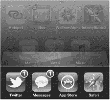
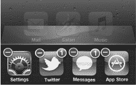

# 第 7 章

## 多任务处理

在本章中，我们将介绍如何在 iPod touch 上执行多任务处理以及在应用之间快速切换。多任务处理意味着你可以让一个应用在后台继续运行，同时做其他事情，例如播放网络电台、听取逐向导航或接听 Skype 电话。

### 快速应用切换

*快速应用切换器*让你能让许多应用在后台保持运行。它还能让你在不停止当前使用应用的情况下切换到另一个应用。

你可能想知道何时使用快速应用切换器比较合理。以下是几个你可能想在 iPod touch 上使用多任务处理的场景：

- 从一个应用（**邮件**）复制粘贴到另一个应用（**日历**）。
- 在玩游戏时回复 iMessage，然后无缝跳回游戏。
- 在查看电子邮件或浏览网页时继续收听网络电台（例如 **Pandora** 或 **Slacker**）。
- 无需等待照片上传到 Facebook 或 Flickr；照片可以在后台上传，而你可以在 iPod touch 上做其他事情。
- 使用 **Skype** 打电话——现在可以让它留在后台运行以接听来电（以往无法实现）。

#### 在应用间跳转

要执行多任务操作，你需要调出屏幕底部的快速应用切换器栏。

1. 在任何应用或主屏幕中，双击**主屏幕**按钮，即可在屏幕底部调出**快速应用切换器**栏

   

2. 所有已打开的应用都会显示在快速应用切换器栏中。

   

3. 向左或向右滑动以找到你需要的应用，然后轻点它。
4. 如果在快速应用切换器栏上没有看到你想要的应用，则按下**主屏幕**按钮，从主屏幕启动它。
5. 再次双击**主屏幕**按钮，然后轻点刚才离开的应用，即可跳回该应用。

#### 在快速应用切换器栏中关闭应用

你的 iPod touch 会自动管理内存，让正在执行有用操作（如播放音乐）的应用保持打开，而将没有进行任何操作的应用置于“休眠”状态，从而避免浪费内存或处理器周期。然而，有时某个*流氓进程*可能导致应用无法正常关闭；另一些时候，你可能想强制某个 GPS 或 VoIP 应用提前关闭以节省电量。在这些情况下，你可以使用快速应用切换器手动关闭应用。

**邮件**和**信息**等内置应用会立即重启，这样你就不会错过任何重要消息。App Store 中的应用和游戏则会保持关闭状态，直到你下次轻点它们的图标启动它们。按照以下步骤从**快速应用切换器**栏中关闭应用：

1. 双击**主屏幕**按钮以调出**快速应用切换器**栏。

   

2. 长按**快速应用切换器**栏中的任意图标，直到所有图标开始晃动。你会注意到每个应用图标的左上角会出现一个带有减号的红色**圆形**图标。
3. 轻点一个红色**圆形**图标 ，即可彻底关闭该应用。
4. 继续轻点红色**圆形**图标，以关闭你想要的任意数量的应用。

#### 媒体控制与屏幕竖排方向锁定

在**快速应用切换器**栏上从左向右轻扫，即可调出媒体控制和**竖排方向锁定**图标。按照以下步骤访问这些控制并使用竖排方向锁定功能：

1. 在任何应用或**主屏幕**中，双击**主屏幕**按钮，调出屏幕底部的**快速应用切换器**栏。

   

2. 从左向右轻扫，即可看到媒体控制和**竖排方向锁定**图标。
3. 轻点**竖排方向锁定**图标，将屏幕锁定为竖排（即垂直）方向。即使你将其侧放，iPod touch 也会保持此方向。当按钮内出现**锁定**图标，并且顶部状态栏中也有一个**锁定**图标时，即表明 iPod touch 已锁定。

   

4. 当前播放的媒体名称显示在屏幕底部。
5. 你还可以使用中间的**上一曲**、**播放/暂停**和**下一曲**按钮。如果按住**上一曲**或**下一曲**按钮，它们会分别变为**快退**或**快进**按钮。
6. 或者，你也可以轻点**应用**图标，跳转到最近一次在 iPod touch 上播放音乐的应用。

#### 音量控制与 AirPlay

如果在**快速应用切换器**栏上尽可能向左滑动，你会找到音量控制和 **AirPlay** 按钮。按照以下步骤操作这些控制：

1. 在任何应用或**主屏幕**中，双击**主屏幕**按钮，调出屏幕底部的**快速应用切换器**。

   

2. 从左向右轻扫，越过媒体控制，直到看到音量控制和 **AirPlay** 按钮。
3. 轻点 **AirPlay** 按钮，将 iPod touch 的音频输出到兼容 **AirPlay** 的扬声器，或将视频输出到 Apple TV，或镜像你的应用到 Apple TV 上。
4. 向左滑动**音量**控制可降低音量；向右滑动可增大音量。

