# 第 8 章

## 个性化与安全性

在本章中，你将学习几种简单的方法来个性化你的 iPod touch。你还将学习如何使用密码保护你的 iPod touch。我们将向你展示从哪里可以下载免费壁纸，以改变**锁定屏幕**和**主屏幕**的外观。我们还将向你展示如何通过调整各种活动何时发出声音以及发出什么样的声音，来个性化 iPod touch 的提示音。iPod touch 的许多方面都可以根据你的需求和品味进行精细调整，从而让你的 iPod touch 更具个性化外观和感觉。

### 更改锁定屏幕和主屏幕壁纸

实际上，你可以通过更改壁纸来个性化 iPod touch 上的两个屏幕。

**锁定屏幕**在你第一次开启 iPod touch 或唤醒它时出现。该屏幕的壁纸图像显示在“滑动来解锁”滑块后面。

**主屏幕**上显示所有图标。你可以在图标后面看到壁纸。你可以使用 iPod touch 自带的壁纸图片，也可以使用你自己的图片。

**提示：** 你可能希望**锁定屏幕**的壁纸比**主屏幕**的壁纸更不具个人色彩。例如，你可能选择在**锁定屏幕**上使用一张通用风景图，而在**主屏幕**上放一张心爱之人的照片。此外，你还可能希望选择一张不那么花哨的**主屏幕**壁纸，以免与图标产生视觉冲突。

#### 从“设置”应用中更换壁纸

iPod touch 上有几种更换壁纸的方法。第一种方法非常直接：只需在`设置`应用中调整壁纸即可：

1.  轻点`设置`图标。
2.  轻点`墙纸`。

    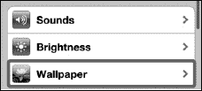

3.  轻点当前所选壁纸的图像。左侧显示的是`锁定`屏幕，右侧显示的是`主屏幕`。

    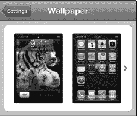

4.  选择一个相簿：

    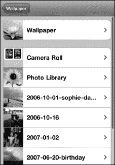

    *   轻点`墙纸`以选择预装的壁纸。
    *   轻点`相机胶卷`（如果在 iCloud 中启用了`照片流`，则轻点它）以从你用 iPod touch 拍摄的照片、从网页保存的图像、屏幕截图（同时按住`主屏幕`按钮和`电源/睡眠`键可截取）或壁纸应用中进行选择。
    *   轻点任何其他相簿以查看已同步的照片。

5.  轻点一个相簿后，你将看到该相簿中的所有图像。向上或向下滑动可查看所有图像。最近添加的图像将位于列表的最底部。
6.  轻点任意图像以选中它并全屏查看。
7.  现在你可以移动和缩放图像：

    

    *   通过触摸并拖动手指来移动图像。
    *   通过张开或捏合手指来放大或缩小。
    *   如果不喜欢该图像，请轻点`取消`按钮以返回相簿。

8.  轻点`设定`按钮以将该图像设置为壁纸。
9.  选择你希望此壁纸用于何处：

    

    *   轻点`设定锁定屏幕`按钮以仅将图像设置为`锁定`屏幕。
    *   轻点`设定主屏幕`按钮以仅将图像设置为`主屏幕`。
    *   轻点`同时设定`按钮以将图像同时设置为`锁定`屏幕和`主屏幕`。

10. 轻点`主屏幕`按钮以退出`设置`应用，然后查看你的新壁纸，如图 8–1 所示。

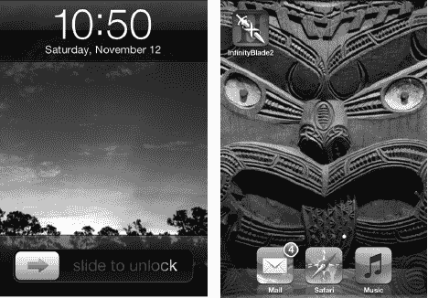

**图 8–1.** *查看你的锁定屏幕和主屏幕壁纸*

#### 使用任意照片作为壁纸

第二种更换壁纸的方法是查看`照片`集中的任意图片并将其选为壁纸。请按照以下步骤操作：

1.  轻点`照片`图标以开始。要了解有关处理照片的更多信息，请查看第 19 章：“处理照片”。
2.  轻触你想浏览以寻找壁纸的照片相簿。
3.  找到想使用的照片后，轻触它，它将在屏幕上打开。
4.  你轻点的缩略图将填满屏幕。如果这是你想使用的图像，请轻点屏幕左下角的`设定为`图标 。
5.  轻点`用作墙纸`

    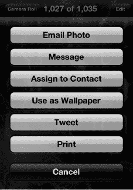

6.  要移动、缩放图像并将其设置为`主屏幕`或`锁定`屏幕壁纸，请遵循上一节中的步骤 7-9。如果你决定改用其他图片，请选择`取消`并选取另一张。

### 从免费应用下载精美壁纸

前往 App Store 并搜索“背景”或“壁纸”（有关详细信息，请查看第 22 章：“神奇的 App Store”）。你会找到许多专为 iPod touch 设计的免费或低价应用。在本节中，我们将重点介绍此类应用中的一款，即 Apalon 出品的 `Pimp Your Screen`。该应用拥有数百张精美的背景图像可供你下载到 iPod touch，并且在撰写本文时其售价仅为 0.99 美元。

**注意：** 与大多数壁纸应用一样，使用 `Pimp Your Screen` 时需要有效的互联网连接。

#### 使用壁纸应用

安装 `Pimp Your Screen` 后，你就可以开始使用了：

1.  轻点 `Pimp Your Screen` 图标以启动该应用。
2.  该应用的主屏幕上有多个类别可供选择：`应用架`（用于放置应用的架子——类似 iBooks 或报亭）、`霓虹组合`（霓虹背景）、`主屏幕`（漂亮的主屏幕）、`图标皮肤`（创建背景以突出显示图标）。然后你可以使用底部的两个选项——`锁定屏幕制作器`和`主屏幕制作器`来创建个性化的锁定屏幕和主屏幕，如图 8–2 所示。

    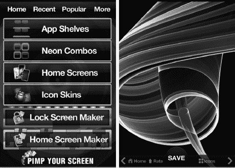

    **图 8–2.** *使用 Pimp Your Screen 应用。*

3.  轻触任何类别后，你可以向左或向右滑动以查看更多壁纸图像选项。要将壁纸保存到`相机胶卷`相簿，请轻点图像底部中间的`保存`按钮。
4.  如果你不喜欢该图像，请轻点左下角的`主屏幕`按钮以返回主屏幕菜单。

#### 使用新保存的壁纸

选择好壁纸图像并将其保存到 iPod touch 后，你需要按照本章前面“从‘设置’应用中更换壁纸”一节中描述的步骤来选中它。

请记住，下载的壁纸将位于`相机胶卷`相簿中。轻点`相机胶卷`将其打开后，你需要一直向下滚动到底部才能看到最近的条目。

### 调整 iPod touch 上的声音

你可以精确调整 iPod touch，使其在特定事件发生时发出或不发出声音，例如收到信息、新邮件、日历提醒，甚至是 FaceTime 通话的铃声！你还可以自定义发送邮件或在键盘上打字时发生的情况。

请按照以下步骤调整 iPod touch 上播放的声音：

1.  轻点`设置`图标。

    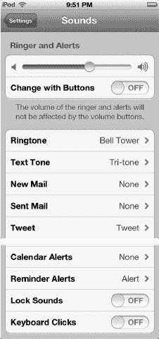

2.  轻点`声音`。
3.  要调整铃声和其他提醒的音量，请移动`铃声和提醒`正下方的滑块。
4.  要更改 iPod touch 的铃声或文本音调；收到新邮件、推文、日历提醒或提醒事项时播放的声音；或发送邮件完成时播放的声音——轻点你想要更改的项目。
5.  此屏幕允许你选择新铃声。轻点任意铃声即可播放并选中它。（你可以通过铃声名称旁边的勾号来判断它是否被选中。右侧图片中已选中`钟楼`。）

    

6.  如果可用的铃声都不合你意，你可以轻点`购买更多铃声`，然后会被带到 iTunes 铃声商店，你可以在那里购买一些你喜欢的歌曲作为铃声。
7.  完成后，轻点左上角的`声音`按钮。
8.  使用相同的步骤更改你在文本音调、新邮件、推文等方面的声音。
9.  在除`铃声`之外的所有声音类别中，你可以通过选择列表顶部的`无`来关闭播放的声音。

    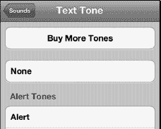

10. `锁定声`和`键盘点按声`可以通过轻点开关将其设置为`开`或`关`来调整。完成后，按下`主屏幕`按钮退出。

    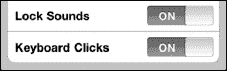

**提示：** 与此相关，你可以锁定`音乐`应用的最大播放音量。操作方法：前往`设置` > `音乐` > `音量限制` > `锁定音量限制`。我们将在第 11 章：“播放音乐”中向你展示如何操作。

#### 键盘选项

你可以通过选择多种语言以及更改`自动纠正`和`自动大写`等设置来精确调整键盘。你甚至可以让 iPod touch 在你打字时读出自动纠正建议。请查看第 2 章：“打字、拷贝与搜索”以了解各种键盘选项及其使用方法。

### 使用密码保护你的 iPod touch

你的 iPod touch 可能存储着大量有价值的信息。如果你用它来保存家庭成员的社会安全号码和出生日期等信息，尤其如此。确保任何拿起你 iPod touch 的人都无法获取所有这些信息是一个好主意。此外，如果你的孩子像我们的一样，他们很可能会拿起你酷炫的 iPod touch，然后开始上网或玩游戏。你可能希望启用一些安全限制来保护他们的安全。

#### 设置简单的四位数字密码

在 iPod touch 上，你可以选择设置一个四位数字密码，以防止未经授权访问你的 iPod touch 和信息。然而，如果输入错误的密码，即使是你自己也无法访问信息，因此最好使用一个你容易记住的密码。

按照以下步骤设置密码以锁定你的 iPod touch：

1.  轻点 `设置` 图标。  
    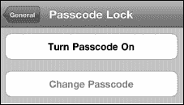
2.  轻点 `通用`。
3.  向下滚动并轻点 `密码锁定`。
4.  轻点 `开启密码` 来设置密码。
5.  默认密码是简单的四位数字密码。使用键盘输入四位数字密码。然后系统会提示你再次输入密码。  
    

#### 设置更复杂的密码

如果你更倾向于使用比四位数字更复杂的密码，你可以通过在 `密码锁定` 屏幕上将 `简单密码` 选项设为 `关闭` 来实现。

随后你将能输入包含字母、数字甚至符号的新密码。

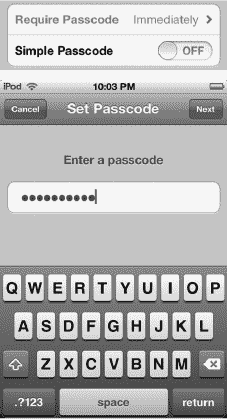

**警告：** 请谨慎操作！如果你忘记了密码，你将无法解锁你的 iPod touch。

#### 调整密码选项

设置好密码后，你将看到以下几个选项：

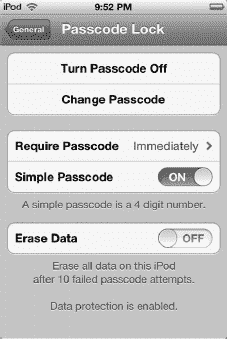

-   `关闭密码`
-   `更改密码`
-   `需要密码`（`立即`、`1 分钟后`、`5 分钟后`、`15 分钟后`、`1 小时后`）
-   `简单密码`（`开启`= 四位数字；`关闭`= 任意字母、数字或符号）
-   `抹掉数据`（`开启`= 连续十次输入错误密码后抹掉所有数据；`关闭`= 不抹掉数据）

**警告：** 如果你有喜欢在设备从 `睡眠` 模式唤醒时使劲敲击安全键盘来解锁的小孩子，你可能希望将 `抹掉数据` 设为 `关闭`。否则，你的 iPod touch 可能会被频繁抹掉数据。

**注意：** 为 `需要密码` 设置更短的时间更安全。将时间设为 `立即`（默认设置）最为安全。然而，使用 `1 分钟` 的设置可能会让你在意外锁定 iPod touch 时免去重新输入密码的麻烦。

### 设置限制

你可能会决定不想让孩子听到 iPod touch 音乐中的露骨歌词。你可能还想阻止他们访问 YouTube 或任何其他网站。在 iPod touch 上设置此类限制非常简单。

#### 限制应用

按照以下步骤限制对 iPod touch 上内容的访问：

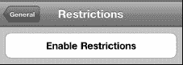

1.  在 `设置` 应用中轻点 `通用`。
2.  向下滚动页面并轻点 `访问限制`。
3.  轻点 `启用访问限制` 按钮。
4.  系统会提示你输入访问限制密码——只需选择一个你能记住的四位数字密码即可。  
    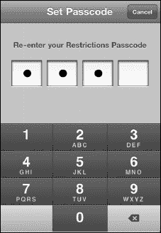

**注意：** 此访问限制密码与你 iPod touch 的主密码是分开的。你当然可以将它们设为相同，这样更容易记住。然而，如果你让家人知道了主密码，却不想让他们调整限制设置，这可能会带来问题。之后你需要输入此访问限制密码才能关闭限制。

请注意，你可以调整是否允许某些应用或功能运行。例如，右侧的屏幕截图允许你调整以下应用的访问限制：`Safari`、`YouTube`、`相机`、`FaceTime`、`iTunes` 和 `Ping`。此屏幕还允许你限制对 `安装应用` 或 `删除应用` 的访问。最后，你可以限制更改 `定位` 和 `账户` 的能力。

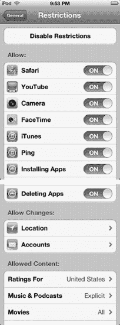

在所有情况下，`关闭` 表示受限。

你可能认为 `开启` 意味着某些内容被限制，但事实恰恰相反。为了禁用或限制某些内容，你需要点击其旁边的滑块并将其切换为 `关闭`。如果你注意到所有选项上方都有 `允许` 这个词，那么这就说得通了。

**注意：** 你限制的任何应用的图标都会消失。因此，如果你限制访问 `YouTube`、`App Store` 和 `FaceTime` 应用，那么 `YouTube`、`App Store` 图标将从主屏幕消失，并且你 iPod touch 的 `FaceTime` 图标也会被移除。

#### 允许更改

有时你并不想完全关闭对某个应用的访问，而只是阻止任何人进行意外的更改。例如，`定位` 选项涉及许多隐私问题，因此你可能希望对哪些应用和功能有权访问它进行更精细的控制。按照以下步骤调整 `定位` 选项的限制：

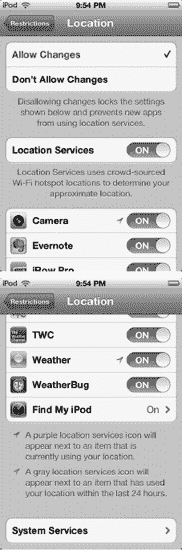

1.  按照上一节所述，前往 `访问限制` 屏幕。
2.  向下滚动到底部以查看所有 `允许更改` 设置。
3.  轻点 `定位`。
4.  轻点 `允许更改` 以更改 `定位设置`。
5.  将 `定位服务` 切换为 `关闭`，以完全阻止你的 iPod touch 使用你的位置。（请注意，这可能会大大降低诸如 `谷歌地图` 等应用的便利性，并导致逐向导航应用完全无法工作。）
6.  将任何你不想让其追踪你位置的单个应用切换为 `关闭`。（例如，将 `相机` 应用的 `定位服务` 设为 `关闭`，以防止你打算在互联网上公开分享的照片中包含 GPS 坐标。）
7.  轻点 `系统服务` 以更改内置进程的 `定位` 权限。
8.  如果有任何你不想让其使用位置数据的系统服务，将它们切换为 `关闭`。选项包括 `蜂窝网络搜索`、`指南针校准`、`诊断与用量`、`基于位置的 iAd`、`设置时区` 和 `交通状况`。  
    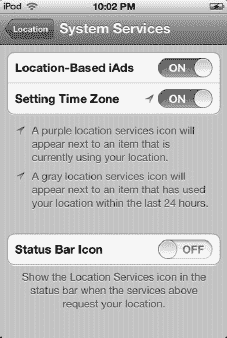
9.  完成后，轻点左上角的 `定位` 返回。
10. 如果你想防止将来对 `定位服务` 进行任何更改，轻点 `不允许更改`。
11. 完成后，轻点 `访问限制` 返回。
12. 轻点 `账户`，然后轻点 `不允许更改`，以防止将来对你的 `邮件`、`日历` 和 `通讯录` 账户进行任何更改。
13. 完成后，轻点 `访问限制` 返回。

#### 限制内容

除了为应用设置限制，你还可以对 iPod touch 上可下载和查看的内容进行限制。如果你打算将 iPod touch 交给孩子使用，并且不希望她能够下载带有露骨歌词的音乐或观看成人电影，请按照以下步骤操作：

1.  前往**限制**屏幕，操作方式如前一节所述。
    
2.  向下滚动到底部，查看所有**允许的内容**设置。
3.  要限制在应用内购买的内容，请将**App 内购买项目**设置为**关闭**。这包括从**iTunes**应用购买的音乐和视频。
4.  如果你有小孩，担心他们在下载新应用后进行昂贵的应用内购买（例如，你不想让他们在**蓝精灵**应用中购买**蓝精灵果**），请轻点**需要密码**，并将该设置更改为**立即**。
5.  轻点**评级所在地**，根据你所在的国家/地区调整评级。目前支持大量国家和地区，包括澳大利亚、奥地利、加拿大、法国、德国、爱尔兰、日本、新西兰、英国和美国。
6.  轻点**音乐与播客**以限制访问包含露骨内容的歌词。确保将**露骨**选项设置为**关闭**，如右侧图所示。
    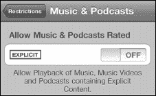
7.  轻点左上角的**限制**按钮，返回选项列表。
8.  你还可以通过轻点每个项目来设置**影片**、**电视节目**和**App**的评级上限。
    
9.  当你轻点**影片**等项目时，会看到一个允许的评级列表。轻点你想要允许的最高评级级别。在此图中，我们轻点了**PG-13**。所有高于此评级的影片（**R** 和 **NC-17**）均不允许。红色文字和缺少对勾标记可直观提示哪些选择已被屏蔽。
10. 轻点**电视节目**以设置这些限制。同样，轻点你想要允许的最高评级。对勾标记表示允许的评级；红色文字表示不允许的评级。在此示例中，**TV-Y**、**TV-Y7** 和 **TV-G** 是允许的，但更高的评级（即 **TV-PG**、**TV-14** 和 **TV-MA**）是不允许的。
11. 轻点**App**以设置对各种应用的限制。
    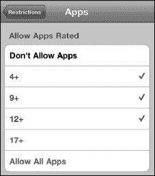
12. 在此屏幕中，我们允许播放评级为**4+**、**9+**和**12+**的应用。评级为**17+**的应用无法播放或下载。
13. 轻点左上角的**限制**按钮，返回选项列表。
14. 最后，轻点**主屏幕**按钮以保存你的设置。

#### 限制 Game Center

Game Center 是享受社交游戏的绝佳方式，包括配对对战、挑战、排行榜等。然而，如果你是有小孩的家长，可能不希望他们在没有你监督的情况下玩多人游戏或接受好友请求。请按照以下步骤限制对 Game Center 的访问：

1.  前往**限制**屏幕，操作方式如前一节所述。
    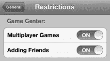
2.  向下滚动到**Game Center**。
3.  将**多人游戏**和/或**添加好友**选项切换为**关闭**。

