# 第 9 章

## 使用 iMessage

*iMessage* 是苹果公司的新服务，它与手机上的短信和彩信功能完全相同，但通过 Wi-Fi 网络工作，并且仅与其他 iOS 5 设备（如 iPod touch、iPhone 和 iPad）互通。

iMessage 可以在你的 iPod touch 的**信息**应用中找到。在本章中，你将学习如何使用 iMessage 从**通讯录**应用发送文本信息，以及从**照片应用**发送图片信息。

### 启用 iMessage 并调整设置

设置 iMessage 服务类似于设置**FaceTime**：

1.  **启动设置。**
2.  轻点**信息。**
3.  将**iMessage**切换为**开启**
4.  然后可能会要求你输入 iMessage 密码——这实际上就是你的 Apple iTunes 密码。

**提示：** 如果你像图中所示卡在**正在等待激活**信息上，请尝试按照第 25 章：故障排除中的方法重启你的设备。

一旦启用了 iMessage 选项，你的**电子邮件地址**将注册到 iMessage 服务中。

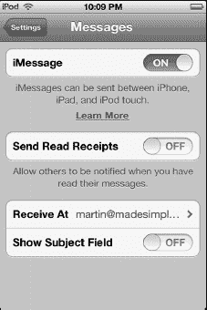

如果你在 iMessage 设置屏幕底部轻点**接收方式**，将会看到类似这样的屏幕。

在此屏幕上，你可以调整与你的 iMessage 关联的电子邮件地址，并添加新的电子邮件地址。

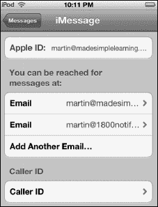

#### 编写信息

编写 iMessage 很像在手机上发送电子邮件或短信。iMessage 的妙处在于它可以到达任何 iOS 5 设备，并且回复起来非常简单。

##### 从信息应用编写信息

有几种方式可以启动你的**信息**应用。最简单的方法是直接轻点**主屏幕**上的**信息**图标。

当你首次启动**信息**应用时，很可能没有任何信息，因此屏幕是空白的。一旦你开始使用 iMessage，你将看到信息列表以及与联系人当前的“打开”讨论。请按照以下步骤发送信息：

1.  触摸屏幕右上角的**编写**图标。
2.  光标将立即跳转到**收件人：** 行。你可以开始输入联系人的姓名，或者直接轻点**加号**（**+**）按钮，搜索或滚动浏览你的联系人。
3.  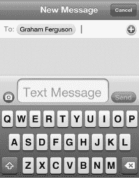
4.  当你找到想要使用的联系人时，触摸该人的名字，它就会出现在**收件人：** 行中。
5.  准备好输入信息时，触摸屏幕中间方框内的任意位置（**发送**按钮旁边）。
6.  键盘将会显示。输入你的信息，完成后触摸**发送**。

**注意：** 如果你在**设置** > **信息**中启用了字符计数器，则会显示。

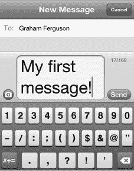

**提示：** 如果你愿意，可以使用更大的横向键盘来发送信息。使用更大的按键打字会更方便，尤其是当你的手指较大或难以看清小按键时。

##### 发送信息后的选项

发送信息后，窗口会变为你与联系人之间的*对话式*讨论窗口。你发送的信息显示在蓝色气泡中。当你的联系人回复时，他的信息会显示在屏幕另一侧的灰色气泡中。

要离开**编写**屏幕，请轻点左上角的**信息**，或单击**主屏幕**按钮返回你的**主屏幕**。

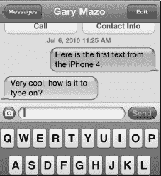

**注意：** 如果信息发送失败，你会看到它旁边有一个感叹号。你还会在**信息**应用图标的右上角看到一个**红色感叹号**图标。

如果发生这种情况，你可以像之前一样再次发送信息。

##### 从通讯录编写信息

你也可以向 iPod touch 中的任何联系人发送信息。请按照以下步骤操作：

1.  通过搜索或滚动浏览**通讯录**，找到你想要发送信息的联系人。
2.  在联系人信息的底部，你会看到一个标有**发送信息**的方框。只需触摸该方框，系统会提示你选择要使用的号码或电子邮件地址（如果你为该联系人列出了多个号码或电子邮件地址）。
3.  选择首选的号码或电子邮件地址，然后按照前面列出的步骤操作。

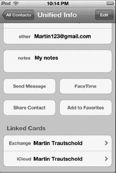

**注意：** 请记住，你只能向与使用 iOS 5 设备的 Apple ID 关联的电子邮件地址发送 iMessage。

#### 回复信息

当收到信息时，你的 iPod touch 会播放提示音、震动或两者同时进行——具体取决于你的设置。同时，屏幕顶部的`通知中心`会出现一个指示器，让你可以选择立即回复。

当你看到和/或听到指示器时，只需轻点通知即可进入`信息`应用并输入你的回复，如之前所示。

如果你错过了通知或想稍后回复，只需从顶部向下拉出`通知中心`列表，然后轻点你想要回复的信息。

**注意：** 如果你的屏幕已锁定，你会看到信息以弹出窗口形式或作为`锁定`屏幕列表的一部分显示。只需滑动`信息`图标即可解锁，你会被带到该信息处。

#### 查看存储的信息

一旦你开始了一些对话信息，它们将被存储在`信息`应用中。触摸`信息`图标，你就可以滚动浏览你的信息对话列表。

要继续与某人对话，只需触摸所需的对话线程，它就会打开，显示你与对方所有过往的往返信息。触摸文本框，输入你的信息，然后触摸`发送`按钮以继续对话。

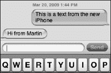

#### 信息铃声和声音选项

你的 iPod touch 允许你设定收到信息时的反应方式。按照以下步骤选择你偏好的反应：

1.  启动你的`设置`应用，滚动到`声音`，然后轻点`声音`标签。
2.  如果你在`声音`菜单中将`震动`功能设为`开启`，那么当信息到来时，你也会收到震动。

    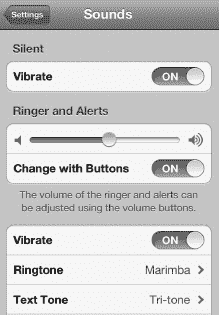

3.  再向下滚动一点，你会看到一个写着`短信铃声`的标签。轻点此处，你可以选择短信的铃声。你的选择限于提供的选项（通常有六个），或者你可以选择`无`。
4.  选择你偏好的短信通知声音，然后触摸左上角的`声音`  按钮以确认你的选择。

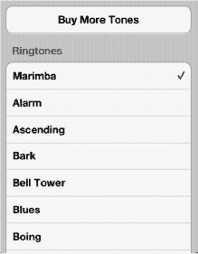

### 多媒体 iMessage 信息

`信息`应用为 iPod touch 用户提供了发送和接收类似彩信的信息所需的工具——包括图片信息和视频信息。这些信息直接显示在信息窗口内，就像你的文本 iMessage 信息一样。

**注意：** 你可以从`信息`应用发送图片、视频、位置（来自地图）、音频（来自`语音备忘录`应用）和 vCard（来自`通讯录`应用）文件。

#### 通过信息发送图片或视频

要通过信息发送图片或视频，请按以下步骤操作：

1.  轻点`信息`图标开始发送信息。

    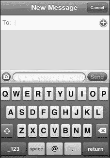

2.  你会注意到在文本输入气泡旁边有一个小的`相机`图标。轻点此图标，系统会提示你`拍照或录像`或`选取现有`。

    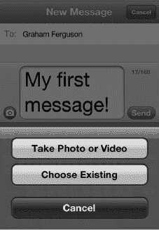

3.  要拍照，请遵循第 19 章：“使用照片”中的说明。如果你选择了`选取现有`选项，只需浏览你的照片/视频，找到想要添加到信息中的项目。

    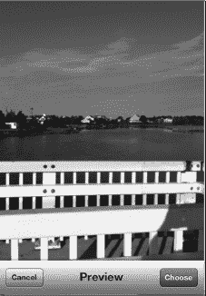

4.  触摸右下角的蓝色`选取`按钮，你会看到图片加载到小窗口中。

    

5.  选择收件人（如前所示），如果需要，可以输入一段短消息。接下来，触摸蓝色的`发送`按钮。

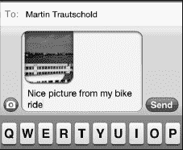

如果你已经与该特定联系人有一个对话线程，那么他的图片将显示在该对话线程中。

**注意：** 你可以在对话线程中继续交换图片和文本。而且你随时可以滚动浏览以查看整个对话——包括所有图片！

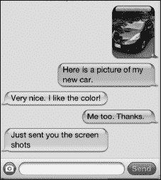

#### 从照片中选择图片或视频通过信息发送

发送图片或视频信息的第二种方法是直接进入你的`照片`应用并选择一张图片。请按以下步骤操作：

1.  启动你的`照片`应用，并按照第 19 章：“使用照片”中的描述浏览你的照片和视频。
2.  要只发送一张图片或一个视频，触摸你想要发送的图片或视频，然后触摸左下角的`发送`图标。

    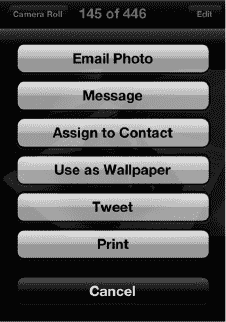

3.  你现在会看到`信息`作为第二个选项。选择`信息`，照片将会加载到气泡中，就像之前在`信息`应用中一样。

#### 发送多张图片

请按以下步骤发送多张图片：

1.  启动`照片`应用，就像你在上一节中所做的那样。
2.  不要轻点单张图片，而是轻点左下角的`操作`按钮。
3.  现在，轻点最多 10 张图片。你会看到它们的颜色变亮，并且一个`勾选标记`图标会出现在方框中。
4.  选取最多 10 张图片后，轻点左下角的`共享`按钮。
5.  选择`信息`，这些图片将出现在信息气泡中。

