# 第 10 章

## 视频信息和 Skype

你的 iPod touch 为你的生活带来了许多新功能，其中一些在几年前还像是科幻小说。例如，视频通话现在不仅成为可能，而且通过新的`FaceTime`功能使用起来极其简单。只要你和通话方都使用 iPod touch 并连接在同一个 Wi-Fi 网络上，你们就可以进行不限次数的视频通话。在本章中，我们将向你展示如何启用和使用`FaceTime`，以及如何开始享受这个优秀新功能的乐趣。

通过 Wi-Fi 拨打电话也可以通过`Skype`实现，这是许多人都在电脑上使用的一款流行的视频通话和聊天程序。我们还将向你展示如何使用`Skype`应用。

说到视频，你的 iPod touch 是一个功能非常强大的摄像机。你可以录制并导出高达 720p 的高清视频。然后，你可以将该视频直接发布到 YouTube 或 iCloud，甚至可以通过电子邮件发送给收件人。我们还将向你展示如何拍摄和快速“修剪”视频，以及如何上传视频。

### 视频通话

多年来，我们一直在电视节目和电影中看到这种未来技术的首次亮相。例如，许多这些节目和电影展示了人们使用小巧便携的电话进行对话并进行视频通话。甚至 20 世纪 70 年代的卡通片《杰森一家》也将其作为一个未来概念。

iPod touch 将那种未来构想变成了今天的现实。有几个应用可以让你在 iPod touch 上使用前置摄像头进行视频通话。目前，只有一个应用允许你同时使用前置摄像头和后置摄像头：`FaceTime`。

#### 连接到蓝牙耳机或汽车立体声音响

你还可以连接到蓝牙耳机或蓝牙汽车立体声音响系统，以拨打和接听`FaceTime`或其他通话服务（如`Skype`）的音频。我们在第 5 章：“AirPlay 和蓝牙”中向你展示了详细步骤。

#### 使用 FaceTime 进行视频通话

`FaceTime` 是苹果公司在许多 iPod touch 广告中主打的专属应用。本质上，`FaceTime` 是一种通过 Wi-Fi 进行的免费通话，让你可以通过 iPod touch 的前置摄像头看到通话另一方的画面。

**注意：** 目前 `FaceTime` 仅适用于近期 iOS 设备之间的视频通话，例如 iPod touch 4、iPod touch 4S、iPad 2 和 iPod touch 4，以及 Mac 电脑。

### 启用 FaceTime 通话并添加电子邮件

当你第一次使用设备时，`FaceTime` 可能尚未启用。要启用 iPod touch 以接收和拨打 `FaceTime` 通话，请按照以下步骤操作：

1. 启动你的`设置`应用。
2. 点按`FaceTime`。
3. 将`FaceTime`开关切换到`开启`位置。

系统可能会要求你使用 Apple ID 登录。

你与 Apple ID 关联的默认电子邮件地址，也将是其他人可以通过其 iOS 设备使用 FaceTime 联系你的电子邮件地址。

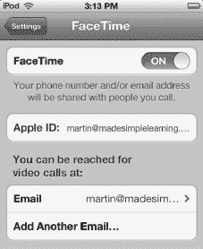

你也可以通过点按`添加其他电子邮件`来添加一个新的电子邮件地址用于 FaceTime。输入你的新电子邮件地址，然后你将收到一封来自 Apple 的验证邮件，要求你点击一个链接，将该新电子邮件地址与`FaceTime`（及你的 Apple ID）关联，之后才能将此电子邮件用于`FaceTime`。

新电子邮件地址验证通过后，你会看到标签从`正在验证`变为`电子邮件`。

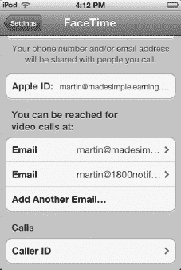

### 来电显示

添加新电子邮件地址后，在此屏幕的电子邮件地址下方会出现一个`来电显示`标签。点按`来电显示`，以选择当你用`FaceTime`拨打他人电话时，向对方显示的电子邮件地址。

### 不同的 FaceTime 视图

在 FaceTime 应用底部，你会看到三个图标，分别对应`个人收藏`、`最近通话`、`通讯录`，如图 10–1 所示。

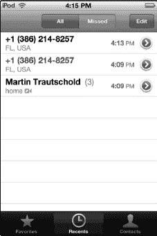

**图 10–1.** *使用软按键查看不同的 `FaceTime` 屏幕（个人收藏、最近通话和通讯录）*

### 使用个人收藏

你的`个人收藏`是你经常使用`FaceTime`呼叫的人。你可以将`个人收藏`视为快速拨号列表。

#### 添加新的个人收藏

从你的`通讯录`列表中向个人收藏添加新条目非常简单。请按照以下步骤操作：

**提示：** 你也可以在 FaceTime 的`最近通话`屏幕中添加`个人收藏`。在`最近通话`中，点按蓝色的`箭头图标` ，然后在下一个屏幕上，向下滚动到`信息`页面底部，点按`添加到个人收藏`。

4. 点按`FaceTime`图标启动它。
5. 触摸底部软按键行中的`个人收藏`图标。
6. 首次启动`个人收藏`时，你会看到一个空白屏幕。

7. 点按右上角的`加号`按钮  以添加新条目。你的通讯录目录将打开。
8. 上下滑动以定位联系人。点按任一联系人以选中它。

**提示：** 要按名称搜索你的联系人，请点按屏幕顶部时间下方。这将调出`搜索`窗口，你可以在此输入几个字母来查找联系人。请记住，你可以通过点按左上角的`群组`按钮来查看不同的联系人分组。

9. 如果某个条目有多个电话号码或电子邮件地址，你需要选择其中一个作为你的个人收藏条目。
10. 点按联系人的电子邮件地址或电话号码后，你将返回到你的`个人收藏`列表，你会看到刚刚添加的新联系人。

#### 整理你的个人收藏

与 iPod touch 上的其他列表一样，你可以重新排列`个人收藏`列表的顺序并删除条目。

1. 像之前一样查看你的`个人收藏`列表。
2. 点按左上角的`编辑`按钮。
3. 要重新排列条目顺序，请触摸并拖动右侧带有三条灰色横线的边缘，在列表中上下移动。

    

4. 要删除某个条目，请点按该条目左侧的红色`圆圈`图标，使其变为竖直。
5. 点按`删除`按钮。
6. 完成条目的重新排序和删除后，点按左上角的`完成`按钮。

### 使用最近通话

使用`最近通话`类似于在手机上查看通话记录。

当你触摸`最近通话`图标时，会显示所有最近的`FaceTime`通话列表。你可以点按顶部的`全部`或`未接来电`按钮来缩小列表范围（见图 10–2）。

**图 10–2.** *使用`最近通话`屏幕*

#### 从最近通话拨打电话

从`最近通话`屏幕拨打电话很容易；只需触摸所需的姓名或电话号码，你的 iPhone 会立即向该联系人发起通话。

#### 清除所有最近通话

要清除或删除所有最近通话记录条目，请点按顶角的`编辑`按钮，然后点按右上角的`清除`按钮。

#### FaceTime 通话详情或联系人信息

触摸`最近通话`列表中姓名旁边的蓝色`箭头`图标 ，你将看到该电话号码的信息，或者如果该联系人存在于你的`通讯录`列表中，你将看到其完整联系信息。如果有多次通话记录，你还会看到每次通话的历史。

向下滚动到联系人`信息`屏幕底部以查看更多选项。你可以通过电子邮件或 iMessage 发送联系信息，来发送`信息`或`共享联系人`。

点按`添加到个人收藏`，将此联系人添加到你的`个人收藏`列表。

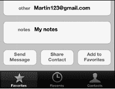

#### 从最近通话将 FaceTime 号码或电子邮件添加到通讯录

如果`最近通话`条目是一个 FaceTime 号码或电子邮件，但该联系人不在你的`通讯录`列表中，那么你将在`信息`屏幕上看到两个不同的按钮：`创建新联系人`和`添加到现有联系人`。

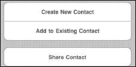

点按`创建新联系人`，以从此电话号码创建新的联系人。

点按`添加到现有联系人`，以将此电话号码添加到你的某个现有联系人中。

#### 从通讯录拨打电话

将所有联系信息存储在 iPod touch 中的一大好处是，从`通讯录`列表中拨打`FaceTime`通话非常方便。请按照以下步骤操作：

1. 点按`FaceTime`图标启动它（见图 10–3）。
2. 触摸底部软按键行中的`通讯录`图标。
3. 使用以下方法之一查找要呼叫的联系人：
   a. 在列表中上下滑动。
   b. 将手指放在屏幕右侧的字母索引上，上下滚动。
   c. 点按顶部显示时间的状态栏以跳转到列表顶部。在`搜索`窗口中点按，然后输入联系人姓氏、名字或公司名称的几个字母进行搜索。
4. 找到你想要的联系人条目后，点按其姓名。
5. 触摸你想要通过`FaceTime`呼叫的电话号码或电子邮件地址。

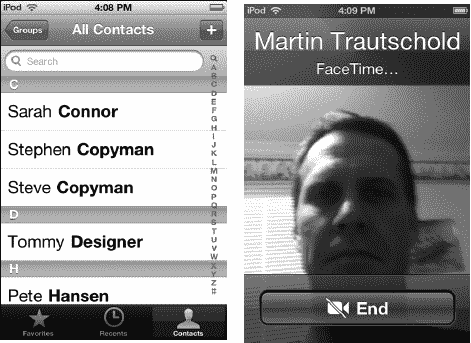

**图 10–3.** *从`通讯录`列表拨打电话*

##### 接听 FaceTime 通话

当有人使用 FaceTime 呼叫你时，你会看到一个类似于图 10-4 所示的屏幕。要接听通话，请轻点 `Accept`，要拒接通话，请轻点 `Decline`。

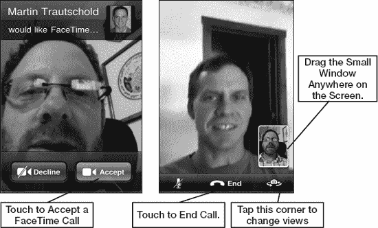

**图 10-4.** *接听 FaceTime 通话*

一旦 FaceTime 通话建立，请按照以下步骤进行视频会议：

1.  将 iPod touch 稍微拿远一点。
2.  确保你在窗口中的画面*构图*得当。
3.  你可以将你自己的小图像拖到屏幕上的任何方便位置。
4.  轻点 `Switch Camera` 按钮，向 FaceTime 呼叫者展示你正在观看的内容。此时 `Switch Camera` 按钮将使用 iPod touch 背面的标准摄像头。在图 10-5 中，我看到了马丁度假时科罗拉多州的美景，而他则看到了我家沙发上的狗！
5.  轻点 `End` 按钮结束 FaceTime 通话。
6.  轻点 `Mute` 按钮暂时将通话静音。

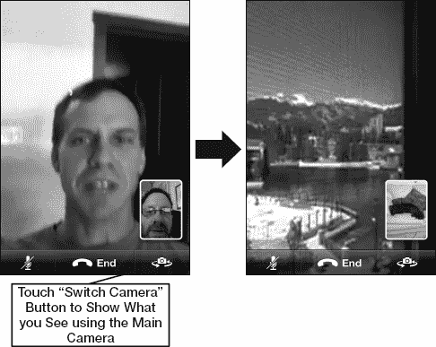

**图 10-5.** *在 FaceTime 通话中切换摄像头视图*

### 使用 Skype 拨打电话及更多功能

社交网络的核心在于与朋友、同事和家人保持联系。通过 [`www.facebook.com`](http://www.facebook.com) 和 Google+ 等网站进行的被动交流固然不错，但有时没有什么能替代听到对方声音的真实感。

令人惊讶的是，你可以使用 Skype 应用在任意 iPod touch 上拨打语音和视频电话。呼叫世界上任何地方的其他 Skype 用户都是免费的。Skype 服务的一个优点是其适用于计算机和多种移动设备，包括 iPhone 4S、旧款 iPhone、iPad 和 iPod touch、部分 BlackBerry 智能手机以及其他移动设备。拨打移动电话和固定电话会产生费用，但费率合理。

**注意：** Skype 应用可以在后台运行，因此你可以随时接听来电的 Skype 通话（请注意，这通常会导致电池电量消耗更快）。

#### 将 Skype 下载到你的 iPod touch

你可以从 App Store 免费下载 Skype 应用，方法是搜索“Skype”并安装。如果你需要有关此操作的帮助，请查看第 22 章：“令人惊叹的 App Store”。

#### 创建你的 Skype 帐户

如果你需要设置你的 Skype 帐户并且尚未在电脑上完成（请参见本章后面的“在电脑上使用 Skype”部分）。

#### 登录 Skype 应用

创建帐户后，你就可以在 iPod touch 上登录 Skype 了。请按照以下步骤操作：

1.  如果尚未进入 Skype，请从 `Home` 屏幕轻点 `Skype` 图标。
2.  输入你的 Skype 名称和密码。
3.  轻点右上角的 `Sign In` 按钮。
4.  以后你将无需再次输入登录信息；它会保存在 Skype 中。下次轻点 `Skype` 时，它将自动为你登录。

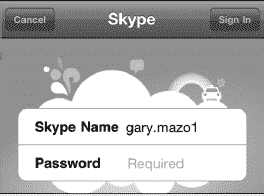

#### 查找并添加 Skype 联系人

登录 Skype 应用后，你将希望开始与人交流。为此，你需要找到他们并将其添加到你的 Skype 联系人列表中：

1.  如果尚未进入 Skype 应用，请从 `Home` 屏幕轻点 `Skype` 图标，并在提示时登录。
2.  轻点底部的 `Contacts` 功能键。
3.  轻点顶部的 `Search` 窗口，然后输入某人的名字和姓氏或 Skype 名称。轻点 `Search` 查找此人。
4.  看到要添加的人后，轻点其名字。

   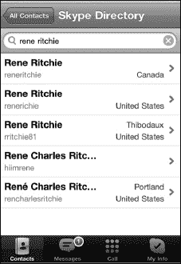

5.  如果不确定这是否是正确的人，请轻点 `View Full Profile` 按钮。
6.  轻点 `Add Contact` 按钮。

   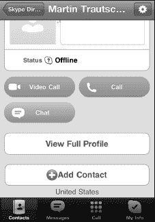

7.  适当调整邀请信息。
8.  轻点 `Send` 按钮，向此人发送成为你 Skype 联系人的邀请。

   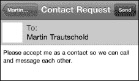

9.  重复此过程以添加更多联系人。
10. 完成后，轻点底部的 `Contacts` 功能键。
11. 从 `Groups` 屏幕轻点 `All Contacts`，查看你添加的所有新联系人。
12. 一旦此人接受你的联系人请求，你将看到他列在 `All Contacts` 屏幕的联系人中。

**提示：** 有时你想要删除某个 Skype 联系人。你可以通过从联系人列表中轻点她的名字来移除或阻止联系人。轻点 `Settings` 图标（右上角），然后选择 `Remove from Contacts` 或 `Block`。

#### 在 iPod touch 上使用 Skype 拨打电话

到目前为止，你已经创建了帐户并添加了联系人。现在你终于准备好要在 iPod touch 上使用 Skype 打第一个电话了：

1.  轻点底部的 `Contacts` 功能键。
2.  轻点 `All Contacts` 查看你的联系人。
3.  轻点你想通话的联系人姓名。
4.  轻点 `Call` 按钮进行语音通话，或轻点 `Video Call` 按钮进行视频通话。
5.  你可能会看到一个 Skype 按钮和一个移动电话或其他电话按钮。按下 Skype 按钮进行免费通话。拨打其他任何电话都需要使用 Skype 点数支付。

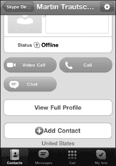

**注意：** 你可以使用 iPod touch 上的 Skype Out 免费拨打免费电话。以下通知来自 Skype 网站 [`www.skype.com`](http://www.skype.com)：

“以下国家和地区号码段受支持且对所有用户免费。我们正在努力覆盖世界其他地区。法国：+33 800，+33 805，+33 809 波兰：+48 800 英国：+44 500，+44 800，+44 808 美国：+1 800，+1 866，+1 877，+1 888 台湾：+886 80”

#### 在 iPod touch 上使用 Skype 接听来电

iPod touch 原生支持后台 VoIP 通话。借助最新版本的 Skype，你可以让 Skype 在后台运行，并在来电时接听 Skype 通话。理论上，你甚至可以在进行语音通话时接听 Skype 来电！

**提示：** 如果你不想让 Skype 在后台运行，但仍然想给某个你知道她在 iPod touch 上使用 Skype 的人打电话，只需给她发一封快速电子邮件或快速打个电话，提醒她你希望使用 Skype 应用与她通话。

##### 购买 Skype 点数或月度订阅

Skype 到 Skype 的通话是免费的。但是，如果你想从 Skype 应用呼叫他人的固定电话或移动电话，则需要购买 Skype 点数或购买月度订阅计划。如果你尝试从 Skype 应用内购买点数或订阅，它将跳转到 Skype 网站。因此，我们建议使用 iPod touch 上的 Safari 或电脑的网页浏览器来购买这些点数。

**提示：** 你可能希望先购买少量 Skype 点数试用该服务，然后再注册订阅计划。如果你计划大量使用 Skype 与非 Skype 用户（例如，普通固定电话和移动电话）通话，那么订阅计划是更合适的选择。

请按照以下步骤使用 Safari 购买 Skype 点数：

1.  轻点 `Safari` 图标。
2.  在顶部地址栏中输入 [`www.skype.com`](http://www.skype.com) 并轻点 `Go`。
3.  轻点页面顶部的 `Sign In` 链接。
4.  输入你的 Skype 名称和密码，然后轻点 `Sign me in`。
5.  如果你尚未进入 `Account` 屏幕，请轻点顶部导航栏右端的 `Account` 标签。
6.  此时，你可以选择购买点数或订阅：

   d. 轻点 `Buy pre-pay credit` 按钮购买固定金额的点数。
   e. 轻点 `Get a subscription` 按钮购买月度订阅帐户。

7.  最后，完成任一类型购买的付款说明。

#### 使用 Skype 聊天

除了拨打电话，您还可以通过 iPod touch 与其他 `Skype` 用户进行文字聊天。开始聊天与开始通话非常相似，请按照以下步骤操作：

1.  如果您尚未进入 `Skype`，请点击 `Skype` 图标。
2.  点击底部的 `通讯录` 软键。
3.  点击 `所有联系人` 查看所有联系人。
4.  点击您想要聊天的联系人姓名。
5.  点击 `聊天` 按钮。

    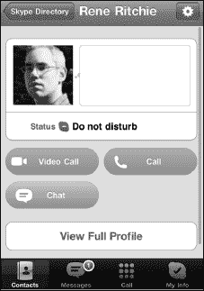

6.  输入您的聊天文本，然后按下 `发送` 按钮。您的聊天内容将显示在屏幕顶部。

#### 将 Skype 添加到您的电脑

您也可以在电脑上使用 `Skype` 应用。接下来我们将向您展示其工作原理。如果您的电脑连接了网络摄像头，您还可以使用 `Skype` 进行视频通话。

**注意：** 当您从电脑呼叫 iPod touch 时，将无法进行视频通话。

请按照以下步骤创建 Skype 帐户并为您的电脑下载 `Skype` 软件：

1.  在电脑上打开网页浏览器。
2.  访问：[`www.skype.com`](http://www.skype.com)
3.  点击页面顶部的 `加入` 链接。
4.  填写所有必填信息并点击 `继续` 按钮来创建您的帐户。请注意，您只需在带星号的必填字段中输入信息。例如，您无需输入性别、出生日期或手机号码。
5.  至此，您已完成帐户设置过程。接下来，您会看到购买 Skype 点数的选项；但这不是必需的，免费的 Skype 对 Skype 通话、视频通话或聊天并不需要它。

    **提示：** 只有当您想拨打给未使用 `Skype` 的人时才需要付费。例如，拨打固定电话或手机（未使用 `Skype`）是收费的。在编写本文时，即用即付费率约为美分 2.1 美分；各种通话套餐的月订阅费用大约在 3 到 14 美元之间。

6.  接下来，点击网站顶部导航栏中的 `获取 Skype` 链接，将 `Skype` 下载到您的电脑。
7.  点击 `获取 Windows 版 Skype` 按钮或 `获取 Mac 版 Skype` 按钮。
8.  按照说明安装软件。
9.  软件安装完成后，启动它并使用您的 Skype 帐户登录。
10. 现在您已准备就绪，可以发起（或接听）与任何其他使用 `Skype` 的用户（包括所有使用 iPod touch 上 `Skype` 的朋友）进行电话、视频通话和聊天。

### 视频录制

除了让您进行视频通话和聊天外，iPod touch 还允许您使用内置录像机录制功能全面的视频。您可以使用 iPod touch 拍摄 1080p 高清视频，然后将此视频上传到 Facebook、YouTube 或 MobileMe。您还可以通过彩信或电子邮件发送视频。

**注意：** 当您分享视频时，视频会被压缩，因此画质将不再是 1080p。

接下来，我们将向您展示如何直接在 iPod touch 上录制视频和修剪视频。您还将学习如何在 iPod touch 上制作高质量的高清视频。

#### 启动录像机

录像机的软件实际上是 `相机` 应用的一部分（请参见 图 10-6）。请按照以下步骤使用内置录像机：

1.  启动 `相机` 应用。将右下角的滑块从 `相机` 图标移动到 `录像机` 图标。
2.  点击右上角的 `切换摄像头` 按钮，在后置和前置摄像头之间切换。
3.  录制场景时尽量保持 iPod touch 稳定。
4.  录制完成后，点击 `停止` 按钮。

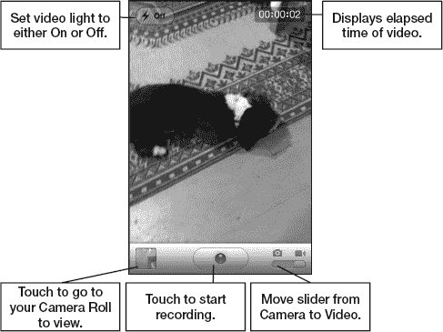

**图 10-6.** *录像机布局与控件*

##### 聚焦视频

iPod touch 可以根据拍摄对象调整视频的焦距。请按照以下步骤利用此功能：

1.  若要聚焦视频前景中的某个物体，请点击屏幕前景。屏幕会显示一个小方框来指示对焦区域。
2.  若要将焦点切换到背景中的某个物体，请点击屏幕的另一部分。方框将短暂显示新的对焦区域。

##### 修剪视频

iPod touch 允许您直接在 iPod touch 上对视频进行编辑。一旦视频录制完成并按下 `停止` 按钮，视频会立即存入您的 `相机胶卷`。

点击左下角的视频缩略图即可打开该视频。在屏幕顶部，您会看到一个时间线，其中包含视频的所有帧（请参见 图 10-7）。请按照以下步骤编辑刚才录制的视频：

1.  拖拽时间线的两端，您会看到视频进入修剪模式。
2.  分别拖拽视频两端，直至达到您想要的长度。
3.  当视频长度合适时，点击右上角的 `修剪` 按钮。
4.  接下来，选择 `修剪原片` 或 `存储为新剪辑`。后一个选项会保存一份新修剪视频的副本。

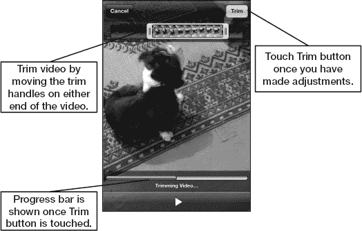

**图 10-7.** *修剪视频*

##### 发送视频

与照片类似，您有多种选项可通过 iPod touch 将录制的视频发送给他人。请按照以下步骤从 iPod touch 发送视频：

1.  触摸底部的 `发送` 图标 。
2.  选择您首选的视频发送方式：`电子邮件视频`、`信息`或`发送到 YouTube`。
3.  根据您在第二步所做的选择，按照步骤发送视频。

**注意：** 要将视频上传到 YouTube，您需要拥有该网站的帐户。

