# 第 11 章

### 播放音乐

在本章中，我们将向您展示如何将 iPod touch 变成一台出色的音乐播放器。由于 iPod touch 出自苹果公司——正是这家公司让如今著名的 iPod 电子音乐播放器风靡一时——您可以预见它将拥有一些强大的功能，而事实也确实如此。我们将向您展示如何播放和组织您从 iTunes 购买或从电脑同步的音乐，如何以多种方式查看播放列表，以及如何快速查找歌曲。您将学习如何使用 Genius 功能，让 iPod touch 在您的音乐库中定位并分组相似的歌曲——这有点像只播放您喜欢音乐的电台。

**提示：** 了解如何直接在 iPod touch 上购买音乐和使用 Ping（音乐爱好者的社交网络），请参见第 21 章：“您设备上的 iTunes”。

您还将了解如何使用名为 Pandora 的应用来流式播放音乐。通过 Pandora，您可以从众多网络电台中进行选择，或者通过输入您喜爱的艺术家姓名来创建自己的电台，而且这一切都是免费的。

### 您的 iPod touch 作为音乐播放器

您的 iPod touch 可能是当今市场上最好的音乐播放器之一。触摸屏让您能够轻松交互和管理您的音乐、播放列表、专辑封面以及音乐库的组织。您甚至可以通过蓝牙将 iPod touch 连接到您的家庭或汽车音响，从而通过 iPod touch 欣赏美妙的立体声音效！

**提示：** 请查看第 5 章：“AirPlay 和蓝牙”，了解如何将您的 iPod touch 连接到蓝牙立体声扬声器或汽车音响。

无论您使用内置的 `音乐` 应用，还是像 `Pandora` 这样的网络电台应用，您都会发现对 iPod touch 上音乐的控制是前所未有的。

### 音乐应用

大部分音乐通过**音乐**应用处理——其图标位于**主屏幕**上，通常在底部图标栏的最右侧。

**注意：** 对于所有熟悉 iOS 5 之前 iPod touch 的读者，是的，音乐播放应用曾被称为**iPod**应用。现在它简称为**音乐**应用。

轻触**音乐**图标，如图 12-1 所示，你会看到底部有五个软按键：

*   **播放列表** 可查看从电脑同步的播放列表，以及在 iPod touch 上创建的播放列表。
*   **艺人** 可查看按字母顺序排列的艺人列表（可像通讯录一样搜索）。
*   **歌曲** 可查看按字母顺序排列的歌曲列表（也可搜索）。
*   **视频** 可查看视频列表（也可搜索）。
*   **更多** 可查看有声读物、选集、作曲家、风格、iTunes U 和播客。

### 编辑软按键

iPod touch 上一个很酷的功能是，你可以编辑**音乐**应用底部的软按键，真正根据你的需求和喜好进行自定义。要执行此操作，首先轻触**更多**按钮。

然后轻触屏幕左上角的**编辑**按钮。 

屏幕会发生变化，显示各种可以拖拽到底部图标栏的图标。

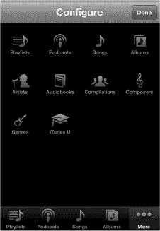

**图 12–2.** *在**音乐应用**中更改软按键。*

假设你想用**有声读物**图标替换**专辑**图标。只需长按**有声读物**图标并将其拖拽到底部图标栏中**专辑**图标所在的位置。到达后松开图标，**有声读物**图标便会出现在原来**专辑**图标的位置。你可以对**配置**屏幕上的任何图标执行此操作。操作完成后，轻触屏幕右上角的**完成**按钮。

**提示：** 你也可以通过在软按键行来回拖放图标来重新排列底部图标。

### 播放列表视图

**注意：** 播放列表是你创建的一组歌曲列表，可以包含你感兴趣的任何风格、艺人、录制年份或歌曲合集。

许多人会将特定风格的音乐，如古典或摇滚，组合在一起。其他人可能会创建快节奏音乐的播放列表，并称之为“锻炼音乐”或“跑步音乐”。你可以使用播放列表以任何你希望的方式整理音乐。

你可以在电脑上的 iTunes 中创建播放列表，然后同步到 iPod touch（请参阅 iTunes 指南），或者按照下一节所述直接在 iPod touch 上创建播放列表。

一旦你将播放列表同步到 iPod touch 或在 iPod touch 上创建了播放列表，它就会显示在**音乐**屏幕左侧的**资料库**下。

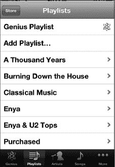

如果左侧列出了多个播放列表，只需轻触你想听的播放列表名称即可。

**注意：** 你可以在 iPod touch 上编辑某些播放列表的内容。但是，你无法在 iPod touch 本身编辑“天才”播放列表。

### 在 iPod touch 上创建播放列表

iPod touch 允许你创建独特的播放列表，这些列表可以编辑并与电脑同步。假设你想向 iPod touch 播放列表中添加新选择的音乐。只需按照下面的步骤创建播放列表并添加歌曲。你可以随时更改播放列表，移除旧歌曲并添加新歌曲——这再简单不过了！

要在 iPod touch 上创建新播放列表，请轻触**天才播放列表**下的**添加播放列表**标签。

为你的播放列表起一个独特的名称（我们将其命名为“骑行音乐”），然后轻触**存储**。

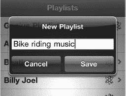

现在你会看到**歌曲**屏幕。轻触你想要添加到新播放列表的任何歌曲名称。

当歌曲变灰时，表示它已被选中并将被添加到播放列表中。

**注意：** 不要因为试图移除或取消选择误触的歌曲而感到沮丧。你无法在此屏幕移除或取消选择歌曲；你必须点击**完成**，然后在下一个屏幕上移除它们，具体如下所述。

选择右上角的**完成**，播放列表内容将会显示。

### 搜索音乐

* * *

**音乐**应用中的几乎每个视图（播放列表、艺人、歌曲等）在屏幕顶部都有一个搜索窗口。

如果你看不到搜索窗口，轻点顶部的“时间”即可立即将其显示。

在搜索窗口中轻点一次，然后输入艺人、专辑、播放列表或歌曲名称的几个字母，即可立即看到所有匹配项目的列表。这是在 iPod touch 上快速找到想听或想看的项目的最佳方式。

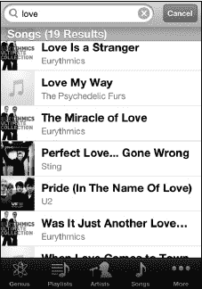

* * *

### 更改音乐应用的视图

就显示和分类音乐的方式而言，**音乐**应用非常灵活。有时，你可能希望按艺人查看歌曲列表。其他时候，你可能更倾向于查看特定专辑或歌曲。iPod touch 让你可以轻松更改视图，以便在给定时刻管理并播放你想要的音乐。

在你的**音乐**应用中，有以下几种视图：

*   艺人视图 - 显示按艺人排序的所有音乐列表。
*   歌曲视图 - 显示按每首歌曲名称排序的所有音乐。
*   专辑视图 - 显示按专辑名称排序的所有音乐。
*   风格视图 - 显示按类型或风格排序的所有音乐。
*   作曲家视图 - 显示按作曲家名称排序的音乐。
*   有声读物 - 显示你的所有有声读物。
*   选集 - 显示所有选集。
*   iTunes U - 显示所有 iTunes U 内容。
*   播客 - 显示你的所有播客。

### 查看专辑中的歌曲

当你处于**专辑**视图时，只需轻触专辑封面或名称，屏幕就会滑动，显示该专辑中的歌曲（参见图 12–3）。

**提示：** 当你开始播放一张专辑时，专辑封面可能会展开填满屏幕。轻点屏幕一次可显示（或隐藏）顶部和底部的控制项。你可以使用这些控制项来管理歌曲和屏幕，如下所述。

要查看正在播放的专辑中的歌曲，请轻触**列表**按钮，专辑封面会翻转，显示该专辑中的所有歌曲。正在播放的歌曲旁边会有一个小蓝色箭头。

**图 12–3.** *轻触**列表**按钮可查看特定专辑中的歌曲。*

轻触歌曲列表上方的标题栏，可返回专辑封面视图。

### 使用 Cover Flow 导航

**Cover Flow** 是一种独特且非常酷的方式，让你通过专辑封面浏览音乐。如果你在**音乐**应用中播放一首歌，然后将 iPod touch 横向旋转至横屏模式，你的 iPod touch 会自动切换至**Cover Flow**视图。

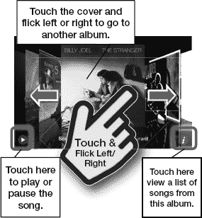

#### 在 Cover Flow 中查看歌曲

只需轻触一张专辑封面，封面就会翻转，显示该专辑上的所有歌曲。

要查看正在播放的歌曲（在 Cover Flow 视图中），请轻点专辑封面，它会翻转，显示该专辑中的歌曲（图 12–4）。当前正在播放的歌曲旁边会有一个小蓝色箭头。

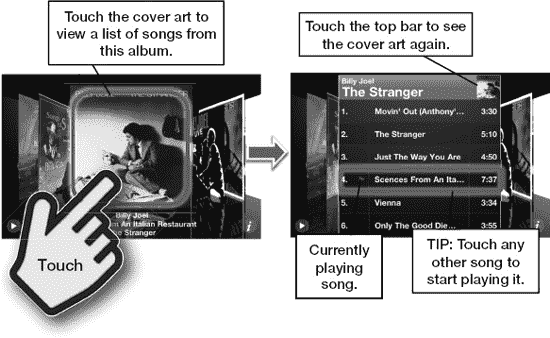

**图 12–4.** *你可以使用**Cover Flow**查看专辑内容。*

轻触（歌曲列表上方的）标题栏，专辑封面将再次显示。然后你可以继续滑动浏览你的音乐，直到找到你正在搜索的内容。

**注意：** 你也可以轻触右下角的小“i”图标，专辑封面会翻转，显示歌曲，就像你轻触了封面一样。

### 播放音乐

现在你已经知道如何查找音乐，该播放它们了！使用上述任何一种方法找到一首歌或浏览到一个播放列表。只需点击歌曲名称，它就会开始播放。

此屏幕会显示所选歌曲所属的专辑封面图片，顶部则显示歌曲名称。

屏幕底部有`音量`滑块，以及`上一首`、`播放/暂停`和`下一首`按钮。

要查看专辑中的其他歌曲，只需双击专辑封面，屏幕就会翻转，显示所有其他歌曲。

你也可以点击右上角的`列表`按钮来查看专辑中的歌曲列表。

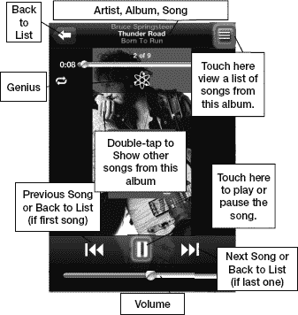

#### 暂停与播放

点击暂停符号（如果歌曲正在播放）或播放箭头（如果音乐暂停），即可停止或恢复歌曲播放。

#### 播放上一首或下一首歌曲

如果你在播放列表中，点击`下一首`箭头（位于`播放/暂停`按钮右侧）会跳转到列表中的下一首歌。如果你正按专辑浏览音乐，点击`下一首`会跳到专辑中的下一首歌。点击`上一首`按钮则执行相反操作。

**注意：** 如果歌曲处于开头位置，`上一首`会跳转到前一首歌。如果歌曲正在播放，`上一首`会跳转到当前歌曲的开头（再次点击才会跳转到前一首歌）。

#### 调整音量

在 iPod touch 上调节音量有两种方式：使用机身侧面的`音量`按钮，或使用屏幕上的`音量滑块`控制。

机身侧面的`音量`按钮位于设备左上侧。按下`音量加`键（顶部按钮）或`音量减`键可增大或减小音量。调整音量时，你会看到屏幕上的`音量滑块`随之移动。你也可以直接按住`音量滑块`来调整音量。

**提示：** 要快速静音，请长按`音量减`键，音量最终会降至零。

#### 双击主屏幕按钮调出媒体控制

你可以在 iPod touch 上做其他事情（如阅读和回复邮件、浏览网页或玩游戏）的同时播放音乐。借助 iPod touch 的新多任务功能，快速双击底部的`主屏幕`按钮，然后向右滑动，即可在多任务窗口中调出“正在播放”的媒体控制。这些控制按钮允许你跳转到上一首、暂停或播放当前歌曲、跳转到下一首，或直接跳转到正在播放歌曲的应用。

**注意：** 小组件会显示最后播放音频或视频的应用，所以如果上次用的是`Pandora`，你会看到该应用而非`音乐`，小组件也会控制`Pandora`，对于`视频`、`YouTube`等应用也是如此。

**提示：** 如果按住`上一首`控制，歌曲会快退；按住`下一首`控制，则会快进。

#### 重复播放、随机播放、歌曲内跳转

在播放模式下，点击屏幕上任一专辑封面区域，即可激活更多控制。屏幕顶部会多出一个滑块（进度条），以及`重复`、`随机播放`和`Genius`符号。

#### 跳转到歌曲的其他部分

向右滑动进度条，你会看到歌曲已播放时间（显示在最右侧）随之变化。如果要寻找歌曲的特定段落，拖动滑块后松手，听一下是否到达了正确位置。

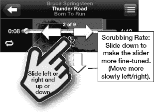

#### 重复播放单曲或全部歌曲

要重复播放当前正在听的歌曲，点击顶部控制左侧的`重复`符号两次，直到它变成蓝色并显示`1`。

要重复播放播放列表、歌曲列表或专辑中的所有歌曲，点击`重复`图标直到它变成蓝色（且不显示`1`）。

要关闭`重复`功能，再次点击图标直到它变回白色。

#### 随机播放

如果你正在听播放列表、专辑或任何其他类别的音乐列表，你可能会想打乱顺序播放。点击`随机播放`符号，音乐就会以随机顺序播放。图标为蓝色时表示`随机播放`已开启，白色时表示关闭。

##### 摇动切换歌曲

`摇动切换歌曲`功能是在上一代 iPod touch 中引入的。因此，要开启`随机播放`模式，你只需摇动一下 iPod touch 即可切换歌曲，再摇动一次再次切换。每次摇动 iPod touch，都会跳到列表中下一首随机选中的歌曲。

**提示：** 如果你打算拿着 iPod touch 跳舞，请关闭`摇动切换歌曲`功能！

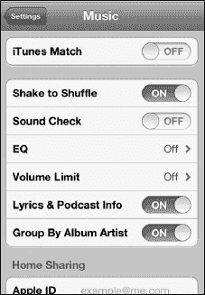

你可以在`设置`菜单中开启`摇动切换歌曲`功能。

1. 点击`设置`图标。
2. 向下滚动并点击`音乐`图标。
3. 将`摇动切换歌曲`开关拨至`开`或`关`。

### 正在播放

有时你在探索播放列表或专辑选项时玩得太投入，结果在菜单中迷失了方向——只想赶紧回到正在听的歌曲。幸运的是，这总是很容易做到——只需点击大多数音乐屏幕右上角的`正在播放`图标即可。

### 查看专辑中的其他歌曲

你可能会想听同一专辑中的另一首歌，而不是跳转到播放列表或流派列表中的下一首。

在`正在播放`屏幕的右上角，你会看到一个带有三条横线的小按钮。

点击该按钮，视图会切换为专辑封面缩略图。屏幕现在会显示该专辑中的所有歌曲。

点击列表中的另一首歌，它就会开始播放。

**注意：** 如果你正在播放播放列表或`Genius 播放列表`中途，跳转到专辑中的另一首歌后，不会自动返回到原播放列表。要返回该播放列表，你需要回到播放列表库，或点击`Genius`创建新的`Genius 播放列表`。

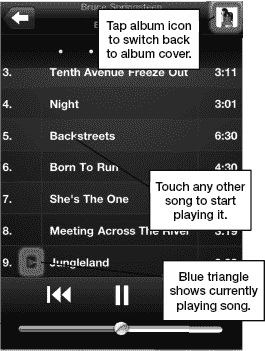

### 调整音乐设置

有几种设置可以调整 iPod touch 上的音乐播放效果。你可以在`设置`菜单中找到它们。只需点击`主屏幕`上的`设置`图标。

在`设置`屏幕中间，点击`音乐`标签，进入`音乐`的设置屏幕。你会看到六个可调整的设置：`摇动切换歌曲`、`音量平衡`、`均衡器`、`音量限制`、`歌词与播客信息`以及`按专辑艺术家分组`。

你还会看到`家庭共享`的登录区域，它允许你从 Windows 或 Mac 电脑上的 iTunes 流式传输音乐。

#### 使用音量平衡（自动音量调整）

由于歌曲的录制音量不同，有时播放时某首歌可能比其他歌听起来响很多。`音量平衡`可以消除这种差异。如果`音量平衡`设为`开`，你所有的歌曲将以大致相同的音量播放。

#### 均衡器（EQ 音效设置）

音效均衡是非常个人化且主观的。有些人喜欢在音乐中听到更多低音，有些人喜欢更多高音，还有些人喜欢更夸张的中音。无论你的音乐品味如何，总有一款`EQ`设置适合你。

**注意：** 使用`EQ`设置会在一定程度上降低电池续航能力。

只需轻触`EQ`标签，然后选择你最常听的音乐类型，或者选择特定的选项来增强高音或低音。大胆尝试，尽情享受，找到最适合你的设置。

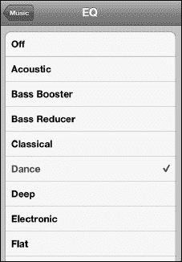

#### 音量限制（以合理音量安全听音乐）

这是父母控制孩子 iPod touch 音量的好方法。同时，它也能确保你不会戴耳机时音量过大而损伤听力。你只需将滑块拖动到某个音量限制值，然后锁定该限制即可。

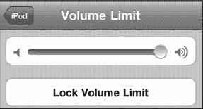

要锁定音量限制，请轻触`锁定音量限制`按钮，然后输入一个 4 位数的密码。系统会提示你再次输入密码，之后音量限制就会被锁定。

#### 使用家庭共享

如果你和我们一样，大电脑硬盘上的音乐可能远多于 iPod touch 能存储的数量。借助 iPod touch 和家庭共享，这就不再是问题了。

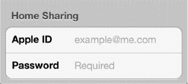

只要你的 iPod touch 与电脑处于同一 Wi-Fi 网络，你就可以将桌面版 iTunes 资料库中的任何内容直接流式传输到 iPod touch 上。

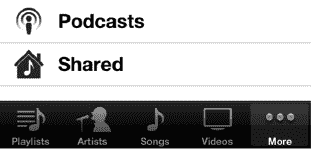

要启用家庭共享，请确保你的电脑已使用 iTunes 电子邮件地址和密码登录家庭共享，然后在你的 iPod touch 上使用同一帐户登录家庭共享。

登录后，你将能够在本地（iPod touch）和远程（桌面版 iTunes）资料库之间进行选择。操作步骤如下：

1.  启动`音乐`应用
2.  轻触右下角的`更多`标签
3.  轻触列表底部的`共享`标签。（如果看不到`共享`标签，请再次确认你的 iPod touch 和电脑都已使用同一个 iTunes 帐户登录了家庭共享）
4.  从`共享`列表中选择你桌面电脑的名称，在此示例中为`MacPro`。（你可以共享多个 iTunes 资料库，因此可能会有多个选项。）

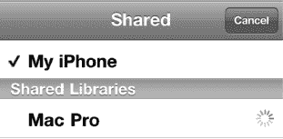

你的 iPod touch 资料库将会消失，取而代之的是桌面版 iTunes 资料库。它的外观与你的 iPod touch 资料库完全相同，只是内容不同。

要切换回你的 iPod touch 资料库，只需重复相同步骤，但在`共享`列表中选择`iPod touch`即可。

#### 在 iPod touch 锁定时显示媒体控制

你可能希望在 iPod touch 锁定时也能访问媒体控制。方法如下：只需双击`主屏幕`按钮，音频调节控件就会出现在锁定屏幕的顶部。无需解锁屏幕再进入音乐程序寻找控件。

在右侧的图片中，请注意屏幕仍处于锁定状态——但音乐控件现在已显示在顶部。你可以在不实际解锁 iPod touch 的情况下，暂停、跳转、回到上一首歌曲或调节音量。

**注意：** 只有在播放音频时，你才会看到这些控件。

### 收听免费网络广播（Pandora）

虽然你的 iPod touch 让你对个人音乐资料库拥有前所未有的控制权，但有时你可能只想“换换口味”，听听其他音乐。

**提示：** 一个基本的`Pandora`帐户是免费的，与从 iTunes 购买大量新歌相比，可以为你节省不少钱。

`Pandora`源于音乐基因组计划。这是一项浩大的工程。一个庞大的音乐分析师团队研究了几乎所有录制过的歌曲，然后为每首歌曲开发了一套复杂的属性算法。

**注意：** 目前可用的“网络广播”或付费音乐类应用越来越多，包括热门的`Slacker Personal Radio`、`Spotify`、`Rdio`、`Last.fm`等。另请注意，Pandora 仅限美国地区使用，Slacker 仅限美国和加拿大使用。Spotify 在美国和欧洲可用，其他许多应用也因地区而异。希望未来能为国际用户提供更多选择。

#### Pandora 入门指南

通过 Pandora，你可以围绕自己喜欢的艺人设计属于自己的独特电台。最棒的是，它完全免费！

首先，从 App Store 下载`Pandora`应用。只需前往 App Store 并搜索 Pandora。

现在，轻触 Pandora 图标即可开始。

首次启动 Pandora 时，系统会要求你创建一个帐户（或如果你已有帐户则登录）。只需填写相应信息——需要提供电子邮件地址和密码——你就可以开始设计自己的音乐聆听体验了。

Pandora 也适用于你的 Windows 或 Mac 电脑，以及大多数智能手机平台。如果你已有 Pandora 帐户，只需登录即可。

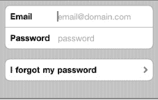

**提示：** 请记住，你可以将应用移入文件夹。如图 12–7 所示，我们将包括 `Pandora` 在内的三个音乐应用放入了一个名为“音乐”的文件夹中。了解更多关于使用文件夹的信息，请参阅第 6 章：“图标与文件夹”。

**图 12–7.** *将 Pandora 等同类音乐应用放入一个文件夹中，方便查找。*

#### Pandora 主屏幕

你的电台列表显示在主屏幕上，最上方是`快速混音`。轻触任一电台，它就会开始播放。通常，第一首歌将来自你选择的艺人，之后的歌曲将来自风格相近的艺人。

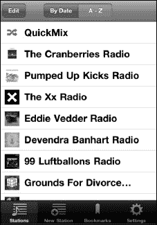

选择电台后，音乐开始播放。你会看到当前显示的歌曲及其专辑封面——这与使用`音乐应用`播放歌曲时非常相似。

你还会在右上角看到一个小型`正在播放`图标——与`音乐`应用中的`正在播放`图标非常相似。

轻触右上角的`详情`视图图标（与你在`音乐`应用中看到的图标一样），你会看到艺人的精美简介，该简介会随着每首新歌而变化。（见图 12–8）。

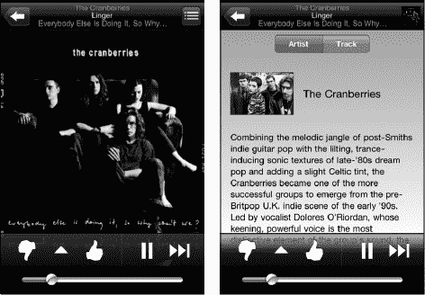

**图 12–8.** *Pandora 的专辑封面视图和详情视图。*

#### 在 Pandora 中点击“赞”或“踩”

如果你喜欢某首歌曲，请轻触点赞图标，之后你会听到更多来自该艺人的音乐。

相反，如果你不喜欢此电台中的某位艺人，请轻触点踩图标，之后你将不再听到该艺人的歌曲。

如果您愿意，可以暂停一首歌稍后再听，或者跳到电台中的下一首歌曲。

**注意：** 使用免费的 Pandora 帐户，您每小时的跳歌次数是有限制的。此外，您偶尔会听到广告。要消除这些烦扰，您可以像下面介绍的那样升级到付费的`Pandora One`帐户。

#### Pandora 菜单

在两个拇指图标之间有一个`菜单`按钮，看起来像一个三角形。

. 轻触此按钮，你可以收藏这位艺人或这首歌，前往 iTunes 购买这位艺人的音乐，或者将电台通过电子邮件发送给你的`通讯录`中的联系人。

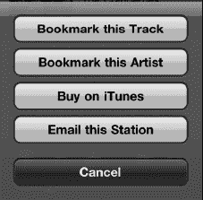

好的，作为高级文档工程师和翻译员，我将遵循您提供的注意事项和示例，将给定的英文文本翻译成中文。

##### 在 Pandora 中创建新电台

在 Pandora 中创建新电台再简单不过了。

如果你正在收听一个电台，请按左上角的**返回箭头**返回到 Pandora 主屏幕。然后点击底部一栏的**新建电台**按钮。输入艺人、歌曲或作曲家的名称。

当你找到想要的内容时，点击该选项，Pandora 就会立即开始围绕你的选择建立一个电台。

你也可以点击**流派**，并围绕特定的音乐流派建立一个电台。

然后，你会看到新电台与其他电台列在一起。

你最多可以在 Pandora 中创建 100 个电台。

**提示：** 你可以通过点击屏幕顶部的**按日期**或**按字母顺序**按钮来整理你的电台。

##### 调整 Pandora 的设置——你的帐户、升级等

你可以通过点击屏幕右下角的设置图标来退出你的 Pandora 帐户、调整音频质量，甚至可以升级到 Pandora One（移除广告）。(见图 12-9。)

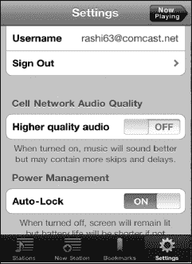

**图 12-9.** *Pandora 中的设置选项*

要退出，请点击**退出**按钮。

要调整音质，请将**蜂窝网络音频质量**下的开关移至**开**或**关**。当你处于蜂窝网络时，将其关闭可能更好，否则你在播放时可能会听到更多的跳播和暂停。

当你处于强力 Wi-Fi 连接时，可以将其设置为**开**以获得更好的音质。请参阅我们的“连接到网络”章节以了解更多信息。

为节省电池电量，你应将**自动锁定**设置为**开**，这是默认设置。如果你希望屏幕保持常亮，则将其切换为**关**。

要移除所有广告，请点击**升级到 Pandora One** 按钮。将打开一个网页浏览器窗口，你会被带到 Pandora 的网站输入你的信用卡信息。在本书出版时，年度账户费用为 36.00 美元，但当你阅读本书时，价格可能有所不同。

