# 第 12 章

## iBooks 和电子书

在本章中，我们将向你展示如何使用你的 iPod touch 获得良好的阅读体验。例如，我们将介绍 iBooks，包括如何购买和下载它们，以及如何找到一些优秀的免费经典书籍。我们还将向你展示其他使用你 iPod touch 上的第三方 **Kindle** 和 **Kobo**（原 **Shortcovers**）阅读器的电子书阅读选项。

iPod touch 可以使用苹果专有的电子书阅读器 **iBooks**。在本章中，我们将向你展示如何下载 **iBooks** 应用程序，如何在 iBooks Store 中选购书籍，以及如何阅读 PDF 文件（Adobe PDF 格式）和 iBooks，并利用所有 **iBooks** 的功能。

使用 **iBooks**，你可以以前所未有的方式与书籍和 PDF 文件互动。翻页如同真实书籍；你可以调整字体大小、在内置字典中查词，以及搜索文本。

在 App Store 中，你还可以找到亚马逊的 **Kindle** 阅读器、**Barnes and Noble** 阅读器、**Stanza** 阅读器和 **Kobo** 阅读器的应用程序。**Kindle** 和 **Kobo** 阅读器都在 iPod touch 上提供了出色的阅读体验。

### 下载 iBooks

在 App Store 中搜索“iBooks”或“Apple”。你会在列出的选项中找到 **iBooks** 应用程序。

**注意**：在全新的 iPod touch 上，你会收到一条通知询问：“你现在要下载 iBooks 吗？”

如果你没有立即看到此通知，请点击**App Store** 应用程序，该通知应该会弹出。

选择 **iBooks** 应用程序并点击**免费**按钮进行下载。

选择**安装**，**iBooks** 将下载并安装到 iPod touch 上。

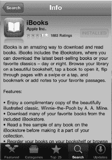

### iBooks Store

在你开始享受阅读体验之前，你需要为你的 iBooks 资料库装载书籍。幸运的是，iBooks 商店中有许多书籍可以免费获取，包括近乎完整的古腾堡经典和公有领域作品集。

**注意**：付费 iBooks 内容并非在所有国家/地区都可用。然而，免费内容在任何地方都可获取，包括古腾堡计划的经典公有领域文学作品集。

只需点击你书架右上角的**商店**按钮，你就会被带到 iBooks Store。

iBooks Store 的布局与 App Store 非常相似。左上角有一个**类别**按钮，与**资料库**按钮相对。点击它可以查看所有可供你选择书籍的类别。

精选图书在商店首页上突出显示，并展示**新书**和**值得关注的**图书供浏览。

商店底部有五个虚拟按键：**精选**、**排行榜**、**浏览**、**搜索**和**已购项目**。

点击**排行榜**按钮  可查看所有热门排行榜和《纽约时报》畅销书。点击**已购项目**按钮可查看你已购买或下载到资料库中的所有书籍。

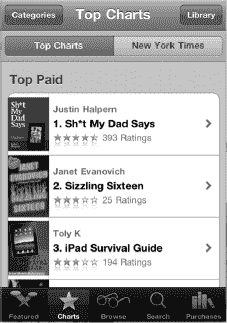

购买书籍与购买应用程序非常相似。点击你感兴趣的书名，浏览简介和客户评论。当你准备好购买时，点击**价格**按钮。

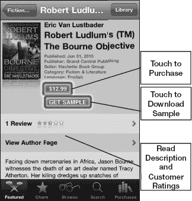

**注意**：许多书籍都提供示例下载。如果你不确定是否要购买这本书，查看示例是个好主意。如果你下载了示例，你随时可以从该示例内购买完整书籍。

一旦你决定下载示例或购买一本书籍，**iBooks** 就会切换到**书架**视图，你可以看到书籍被放置到你的书架上。你的书籍现在即可阅读。

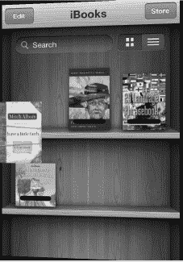

#### 使用搜索按钮

与 iTunes 和 App Store 一样，iBooks Store 为你提供了一个**搜索**窗口，你可以在其中输入几乎任何短语。你可以按作者、书名或系列进行搜索。只需点击屏幕底部的**搜索**，屏幕键盘就会弹出。输入作者、书名、系列或图书类型，然后按下**搜索**按钮。

你会看到与搜索匹配的建议弹出；只需点击相应的建议即可跳转到该书籍。

**提示**：搜索“Project Gutenberg”可以看到数千种免费的公有领域书籍。

### 切换集锦（书籍、PDF 等）

你的 iBooks 应用程序有多个书籍或 PDF 文件（Adobe PDF 格式阅读器）的集锦。

你可以通过点击资料库顶部中央的“集锦”按钮，轻松在这两者之间切换集锦，并添加新的集锦。

此按钮会显示当前可见的集锦。在这张图片中，**书籍**是当前集锦。点击“书籍”按钮即可查看可用的集锦。

在此屏幕上，你可以点击任何集锦进行查看。

请注意，你也可以使用底部的按钮创建**新**集锦和**编辑**你已创建的集锦。

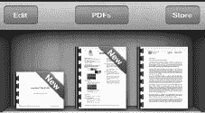

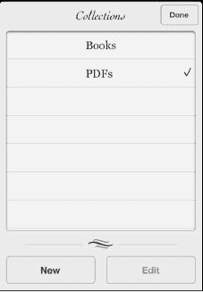

### 阅读 PDF

如上所示，切换集锦以查看你的 PDF 集锦。

点击任何书籍即可打开并开始阅读。所有相同的导航功能都如“阅读 iBooks”一节所述。

一个区别是，你会在页面底部看到 PDF 文件页面的缩略图。点击任意缩略图即可跳转到该页。在缩略图上前后拖动手指即可跳转到特定页面。

### 阅读 iBooks

在书库中轻点任意标题即可打开阅读。图书将打开至第一页，通常是扉页或其他*前端内容*。

左上角`Library`按钮旁，你会看到一个`Table of Contents`按钮。要跳转到目录，可以轻点`Table of Contents`按钮，或直接翻页至目录页。

翻页有三种方式。第一种，轻点页面的右侧区域翻到下一页。第二种，在页面右边缘缓慢长按屏幕；在持续触摸屏幕的同时，轻轻向左慢慢移动手指。

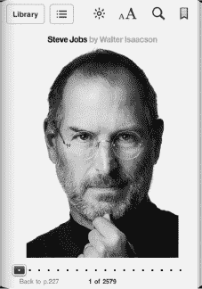

**提示**：如果移动手指的速度非常慢，在“翻动”页面时，你甚至能看到背面文字——这是一种非常酷的视觉效果。

最后一种翻页方式，是使用页面底部的滑动条。当你从左向右缓慢滑动时，滑动条上方会显示页码。松开手指，即可跳转到该页码。

#### 自定义阅读体验：亮度、字体和字号

图书页面顶部中央有三个图标：`Brightness`、`Size`和`Search`。这些选项能让你的阅读体验更加沉浸。

轻点`Brightness`图标即可调节图书亮度。

如果你在非常暗的房间里躺在床上阅读，将`Brightness`滑块向左拖到底，可以调暗平板屏幕。如果你在阳光下阅读，则需要将其向右拖到底。但请注意，屏幕高亮度比大多数其他功能更耗电，因此当不需要过亮屏幕时，请将亮度调回。

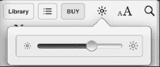

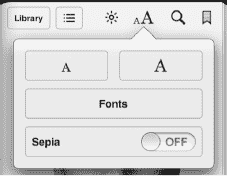

**注**：以上提示仅调节`iBooks`内的亮度。要调节 iPod touch 的全局亮度，请使用`Settings`应用（进入`Settings`图标 > `Brightness` & `Wallpaper`）。

`Font Size and Type`图标可让你根据偏好调整字体设置。

**增大字号**的方法：

多次轻点大`A`图标。

**减小字号**的方法：

多次轻点小`a`图标。

在撰写本书时，共有六种字体样式可供选择——但当你阅读本书时，可能已有更多字体可用。

尽情尝试不同的字体吧。默认字体是 Palatino，但所有字体都看起来很棒，而且更大的字号对某些人来说会有很大不同。目标是调整字号，使文本尽可能舒适易读。

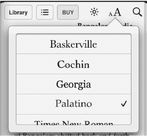

#### 使用内置词典扩充词汇量

`iBooks`内置了一个非常强大的词典，当你遇到生词或不熟悉的单词时，它会非常有用。

**注**：首次尝试使用词典时，你的 iPod touch 需要下载它。按屏幕提示下载词典即可。

访问词典再简单不过了。只需长按书中的任意单词，便会弹出一个包含多个选项的菜单，供你高亮单词、创建笔记或搜索该单词的其他位置。

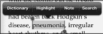

轻点`Dictionary`，就会显示该单词的发音和释义。轻点`Done`即可退出词典，返回图书。

#### 设置书内书签

要查看书签，只需轻点屏幕左上角的`Table of Contents`图标（位于`Library`图标旁），然后轻点`Bookmarks`。轻点高亮显示的书签，即可跳转到书中的相应章节。

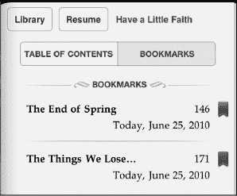

**提示**：你不需要每次离开`iBooks`时都设置书签。该应用会自动记住你在哪本书的哪里停止阅读。无论你打开并阅读多少本书，这一功能都有效，因此你总能回到某本书中你上次停止阅读的准确位置。`iBooks`应用还会与 iPad 上的`iBooks`版本同步，因此你可以跨设备来回切换，并保持在你阅读的位置。

#### 使用高亮和笔记

`iBooks`应用有一些非常棒的“附加功能”。例如，有时你可能想高亮某个单词以便稍后回顾，有时你又想在页边空白处给自己留个笔记。

在`iBooks`中，这两件事都非常容易做到。

##### 高亮文本

按以下步骤在 iBooks 应用中高亮文本：

1.  长按任意单词调出菜单选项。

    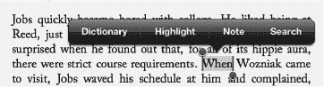

2.  从菜单中选择`Highlight`。
3.  要移除高亮，轻点该单词，然后选择`Remove Highlight`。

更改高亮颜色的步骤如下：

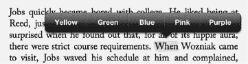

1.  轻点高亮的单词。
2.  从菜单中选择`Colors`。
3.  选择一种新颜色。

##### 添加笔记

在`iBooks`的页边空白处添加笔记也很简单：

1.  像之前一样，长按任意单词。
2.  从菜单中选择`Note`。
3.  输入你的笔记，然后轻点`Done`。笔记现在会显示在页面侧边的空白处（参见图 13-1）。

**提示**：你的笔记也会出现在扉页上的书签中。只需轻点`Title Page`按钮，然后轻点`Bookmarks`，即可在页面底部找到你写的笔记。

更改笔记颜色的方法与更改高亮颜色的方法相同！

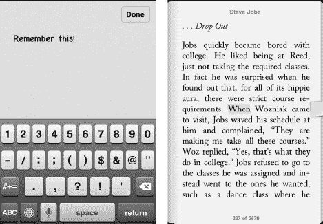

**图 13-1.** *在`iBooks`中使用笔记功能*

#### 使用搜索功能

`iBooks`内置了强大的搜索功能。只需轻点`Search`图标，内置键盘便会弹出（与 iPod touch 上的其他程序一样）。输入你要搜索的单词或短语，你将看到该单词出现的章节列表。

轻点所需的选项，即可跳转到书中的该章节。你还可以通过轻点`Search`窗口底部的相应按钮，直接跳转到 Google 或 Wikipedia。

**注**：使用 Wikipedia 或 Google 搜索将使你离开`iBooks`并启动`Safari`。

### 移动和删除图书

从 iBooks 书库中删除图书的方式，与从 iPod touch 中删除应用非常相似。你可以通过轻点`Library`视图中的`Edit`按钮来删除或移动 iBooks。

左上角。

轻点`Edit`按钮后，你会注意到每本书的左上角出现了一个黑色小“`x`”。

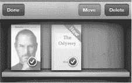

只需轻点“`x`”，系统会提示你删除图书。轻点`Delete`后，图书就会从书架上消失。

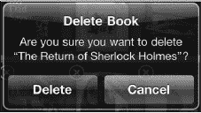

### 其他电子书阅读器：Kindle 与 Kobo

正如我们之前提到的，`iBooks` 应用提供了无与伦比的电子书阅读体验。不过，iPod touch 上还有其他值得一试的电子书阅读器应用。

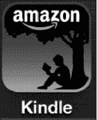

许多用户已经拥有 Kindle 并投入了不少资金购买 Kindle 书库。另一些用户则使用 `Kobo` 电子书阅读软件（之前名为 `Shortcovers`），并为该平台建立了自己的藏书库。

幸运的是，这两个电子书平台都在 iPod touch 的 App Store 中提供了对应的应用。下载并安装任一程序后，你都可以登录并在 iPod touch 上阅读该平台的完整书库。

**注意**：无论你选择上述哪一种阅读器，只需“登录”，就能看到你的完整书库，并接着上次阅读的进度继续阅读——即使你上次是在其他设备上开始阅读的。

#### 下载阅读器应用

下载其他阅读器应用非常简单。只需进入 App Store，点击 `类别`，然后点击 `图书`。在此板块中，你会找到 `Kindle` 和 `Kobo` 应用。这两款应用都是免费的，因此只需点击 `免费` 按钮即可开始下载其中之一。

**提示**：如果你知道要找的应用名称，直接按名称搜索通常会更快。

安装好你所需的阅读器软件后，点击应用图标即可启动它。

#### Kindle 阅读器

亚马逊的 Kindle 阅读器是世界上最受欢迎的电子书阅读器。数百万用户拥有 Kindle 图书，而 `Kindle` 应用允许你在 iPod touch 上阅读这些图书。

iPod touch 和 iPad 版本的 `Kindle` 应用刚刚更新，支持音频和视频功能，这使得这些版本甚至比 Kindle 硬件设备上的版本更为先进。

**提示**：如果你有 Kindle 设备，无需担心从 iPod touch 登录的问题。你可以将多台设备关联到同一个账户。在 iPod touch 上的 `Kindle` 应用中，你可以畅享为 Kindle 购买的所有图书。

要在 iPod touch 上使用 `Kindle` 应用，只需点击其图标，然后登录你的 Kindle 账户，或使用用户名和密码创建一个新账户。

登录后，你会在 `主页` 上看到你的 Kindle 图书。点击一本书即可开始阅读。

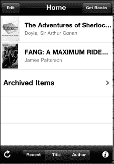

**注意**：若要购买或下载新书，你需要在 `Safari` 浏览器中访问 [`www.amazon.com`](http://www.amazon.com)。当你在账户中购买或下载了一本新书后，它就会出现在 `Kindle` 应用中。

要阅读 Kindle 图书，点击封面即可打开。

要查看阅读选项，只需轻触屏幕，它们就会显示在底部图标栏中。

你可以通过点击 `加号` （`+`） 按钮来添加书签。书签设置好后，`加号` （`+`） 按钮会变成 `减号` （`−`） 按钮。

你可以通过点击 `书籍` 按钮，跳转到封面、目录或书开头（或指定书中的任何其他位置）。

字体以及页面颜色都可以调整。其中一个非常有趣的功能是可以将页面更改为 `黑色`——这在夜间阅读时非常棒。

要翻到下一页，可以从右向左滑动，或轻触页面右侧。要返回上一页，只需从左向右滑动，或轻触页面左侧。

轻点屏幕，底部会出现一个滑动条；你可以拖动它跳转到书中的任意页面。

要返回到你的图书列表，只需点击 `主页` 按钮。

#### Kobo 阅读器

与 `Kindle` 阅读器类似，`Kobo` 阅读器启动时会要求你登录现有的 Kobo 图书账户。你所有的现有 Kobo 图书随即可供阅读。

`Kobo` 的 `书架` 视图采用书架式隐喻，与 `iBooks` 使用的风格类似。点击你想打开的任何图书封面。

或者，你也可以点击 `列表` 标签，以 `列表` 视图查看整理好的图书。

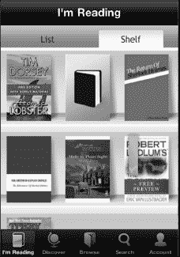

打开任何一本书，你会看到 Kobo 阅读器顶部有两个按钮：`正在阅读` 和 `设置`。

点击 `正在阅读` 按钮会在你读到的地方放置一个书签，并将屏幕返回到你的 `书架` 视图。

点击 `设置` 按钮会在屏幕底部显示一系列按钮，用于查看书签、查看图书信息，以及调整页面过渡样式和字体。在这些按钮下方，有四个图标：`字体`、`亮度`、`屏幕锁定` 和 `夜间阅读`。轻触这些按钮中的任何一个，即可调整你的阅读体验。

在 `Kobo` 阅读器中要翻到下一页，轻触页面右侧即可。要返回上一页，只需轻触页面左侧。你也可以使用底部的滑动条来翻阅页面。

