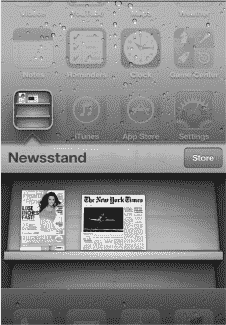
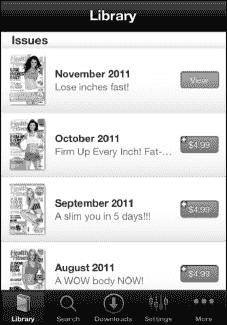
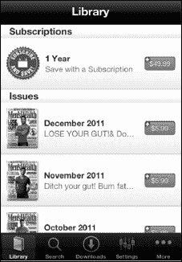
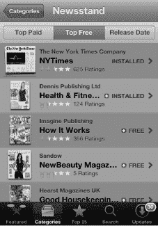
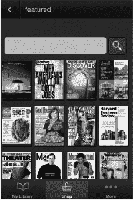
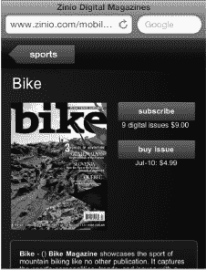
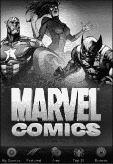
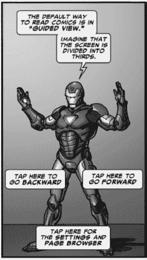
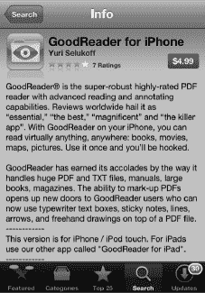
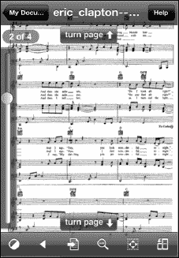

# 第 13 章

## 书报摊及其他

在上一章中，我们谈到了 iPod touch 如何通过 iBooks 彻底改变了阅读世界。iPod touch 不仅在电子书阅读方面无与伦比，其书报摊文件夹在处理在线报纸和杂志等新媒体方面也独树一帜。此外，App Store 使得查找漫画阅读器、PDF 阅读器等应用变得非常容易。iPod touch 甚至准备通过外观精美且互动性极强的漫画书来重振漫画书行业。

在本章中，我们将探讨如何利用 iPod touch 鲜艳的屏幕和出色的触控界面来享受新媒体。

### 书报摊

书报摊是 iPod touch 主页屏幕上一个外观像书架的的特殊文件夹，用于收集和整理你所有的杂志和报纸应用。这个文件夹的行为与普通的 iPod touch 文件夹不同。如果某个杂志或报纸应用支持书报摊，那么它会在书架上显示该刊物的最新封面图或头版，而不是显示书报摊文件夹图标（你也会在应用快速切换器中看到这个封面或头版）。

如果该杂志或报纸应用提供订阅服务，并且你是订阅用户，那么书报摊应用还可以在夜间自动下载最新一期，这样当你早晨打开时就会有新内容可读。

书报摊文件夹还有一个 `商店` 按钮，点击后会带你进入 App Store 的一个特殊区域。此区域列出了所有当前支持书报摊的杂志和报纸应用。

除了特殊的展示方式和自动下载新刊物的能力外，书报摊应用在功能上与其他应用并无二致。

**注意**：是否添加书报摊支持，取决于每个杂志和报纸应用本身。在撰写本文时，许多（但非全部）杂志应用已添加书报摊支持。如果某个应用不支持书报摊，它将被下载到 `主页` 屏幕上，并像任何普通的、非书报摊应用一样运行。

此外，杂志和报纸的选择因国家/地区而异，差异可能很大。请使用书报摊中的 `商店` 按钮，查看你所在地区的最新选择。

### 购买与订阅期刊

`报摊`中的报纸和杂志应用通常是免费的；然而，它们通常内置的内容很少，甚至没有。要获取内容，你需要购买单期杂志或订阅多期。

购买单期杂志的处理方式与其他应用内购买相同。通常，你会看到一个近期期刊列表，左侧是封面图，右侧是内容简介，同时标有该期杂志的价格。点击价格，系统会要求你输入 iTunes 密码以确认购买。一旦确认购买，你订阅的期刊将开始下载。

订阅报纸和杂志的处理方式类似于一种持续特定时长的特殊应用内购买。例如，你通常可以按固定价格购买一年份的报纸。有些报纸和杂志提供不同的订阅时长选项，例如三年、六个月等。还有些提供包含纸质版和数字版的捆绑套餐。请务必仔细阅读你的选项，并找出哪个能为你带来最大价值。

你可能想知道，如果你已经购买了订阅或单期杂志，却需要重新安装显示内容的应用程序该怎么办。如果发生这种情况，你只需重新安装应用，然后恢复你的订阅或重新下载你之前购买的任何单期杂志。换句话说，在`报摊`应用中恢复内容的过程，与恢复其他任何应用内购买的内容完全相同。

### 报纸

还记得报纸被送到家里的日子吗？无一例外，如果人行道上有一个水坑，那准是报纸掉落的地方！你把它从塑料袋里拿出来，抖落水珠，然后努力辨认被浸湿的部分写了什么。

好吧，那些日子可能一去不复返了。现在，你可以与新闻互动，甚至每天都能收到你的报纸——不过它会被送到你的 iPod touch 上，而不是你的车道上。

许多报纸和新闻网站正在为 iPod touch 开发应用，似乎每天都有新的应用出现。其中一些应用提供一定程度的免费内容，但需要你创建账户或订阅才能获取更多内容。其他应用则仅通过订阅提供内容。

**注意：** 如果你已经订阅了你当地报纸的印刷版，它可能会为你提供对其 iPod touch 应用的折扣甚至免费访问权限。请务必仔细阅读任何注册或订阅优惠，以确认你是否有资格。

许多报纸也拥有专门的网站。有些针对 iPod touch 和`Safari`进行了优化，而另一些则提供完整的网页体验。有些网站需要注册或付费订阅才能查看报纸的全部内容。

让我们快速浏览一下美国最大的报纸之一《*纽约时报*》，看看该报是如何革新在 iPod touch 上阅读新闻的体验的。

#### 《纽约时报》应用

《*纽约时报*》提供了各种免费和付费的应用，让你在 iPod touch 上获取新闻。

《*纽约时报*》在其免费的 iPod touch 应用中提供了一个精简版的报纸。

页面底部有四个软键：`头条新闻`、`邮件转发最多`、`收藏`和`版块`。每个版块都包含当天报纸中对应版块的文章样本。

点击`版块`会显示《*纽约时报*》所有版块的标签页。

导航**《纽约时报》** 应用就像点击一篇文章然后滚动浏览一样简单。在阅读故事时，只需点击屏幕中央，顶部和底部的软键就会显示出来。

要返回`首页`，请点击左上角的`最新新闻`按钮。

**注意：** 如果你在其他版块——比如*科技*——左上角的按钮会显示`科技`。

要邮寄一篇文章，只需点击左下角的`分享`图标。此按钮仅在文章内部页面可用，在`首页`不可用。

点击该图标，你就可以通过电子邮件发送文章、复制链接或分享到 Twitter。

#### 浏览与享受内容

在尝试使用不同的报纸应用一段时间后，你会开始意识到，浏览报纸内容并没有真正的标准。这意味着你需要熟悉每个应用自己导航文章的方式，以及如何返回主屏幕。以下是浏览这类应用的一般简要指南：

- **显示或隐藏控制按钮或标题：** 通常点击一次屏幕会显示隐藏的控制或图片标题。你可以再次点击屏幕以重新隐藏这些元素。
- **查看文章详情：** 通常，你就像在网页上一样滚动浏览文章。
- **观看视频：** 通常，你只需点击视频即可开始播放。请参阅第 14 章：“观看视频”了解如何在 iPod touch 上操作视频。
- **放大视频或图片尺寸：** 你可以尝试在视频或图片上双指张开，然后双击。你也可以寻找`展开`按钮，或尝试旋转至横屏模式。
- **缩小视频或图片尺寸：** 你可以尝试在视频或图片内双指合拢来缩小视频尺寸。你也可以寻找`关闭`或`最小化`按钮，或尝试旋转回竖屏模式。
- **分享文章：** 通过电子邮件发送文章链接，或在 Twitter、Facebook 或 LinkedIn 等社交网络上分享，是一项常见功能。请寻找`操作`或`分享`按钮。
- **调整字体大小：** 许多报纸应用都有一个按钮或设置选项，用于增加或减少默认字体大小，使内容更易于阅读。

### 杂志

过去几年，报纸和杂志的读者数量都在下降，这已不是秘密。iPod touch 提供了一种全新的阅读杂志的方式，这或许能给该行业带来所需的推动。

在 iPod touch 上，杂志中的图片异常清晰明亮。浏览通常很容易，故事似乎也变得生动起来，远胜于其纸质版本。再加上直接集成到杂志中的视频和声音，你就能看到 iPod touch 如何真正提升了杂志的阅读体验。

一些杂志，例如《*时代周刊*》，包含指向实时或频繁更新内容的链接。这些链接可能被称为*新闻推送*、*直播版*或*更新*。在你购买的任何杂志中查找它们——这些链接将帮助你获取最新的信息。

**提示：** 在购买杂志或其他应用之前，务必查看用户评价。这样做可能会为你省下金钱或烦恼！

App Store 里有几种不同类型的杂志应用。首先，你可以找到允许你购买单期杂志或免费查看特定杂志有限内容的应用。其次，你可以找到提供多种杂志样本的杂志阅读器；这些阅读器允许你订阅某本杂志的每周或每月推送。

如果你在`App Store`中按`类别`  `报摊`浏览，然后点击顶部的“免费排行”，你可以查看所有免费的杂志和报纸。

### Zinio 杂志应用——体验版

`Zinio` 应用采用了一种独特的方式。这款应用在 App Store 上是免费的，它能让你订阅数百种杂志。在 `Zinio` 中阅读杂志只需几个简单的步骤：

1.  登录 `Zinio` 应用（你可以创建一个免费账户）。
2.  在`我的资料库`区域查看并下载免费样本，或点击底部的`商店`按钮购买杂志。
3.  有些杂志可能会提供完整的免费期数。只需查看`我的资料库`区域，看看有哪些可用的内容。

有许多流行杂志可供选择。类别涵盖了从艺术到体育等方方面面。价格各不相同，但通常你可以选择购买单期或订阅一年。

例如，最新一期的*大众机械*在 `Zinio` 上的售价为 1.99 美元，而一年订阅价为 7.99 美元。

有些订阅非常划算。撰写本文时，一本*自行车杂志*的单期售价为 4.99 美元，而一年订阅价仅为 9.00 美元。

仔细一看，撰写本文时可供订阅的自行车杂志超过 16 种。

### 漫画书

随着 iPod touch 的出现，一种有望卷土重来的“新媒体”类型是漫画书。iPod touch 凭借其高清屏幕和强大的处理器，让漫画书的页面变得栩栩如生。

目前已有几款漫画书应用可用，其中包括来自著名的漫威漫画公司的应用。DC 漫画公司也刚刚推出了自己的应用。这款应用与制作漫威应用的是同一家公司。

要在 App Store 中找到 `Marvel Comics` 应用，请前往`类别`，然后选择`图书`。该应用是免费的，你可以从应用内购买漫画书。

在`主页`屏幕的底部，你会看到五个按钮：`我的漫画`、`精选`、`免费`、`前 25 名`和`浏览`。你购买的漫画将归在`我的漫画`标题下。

App Store 让你有机会下载免费漫画和单期在售漫画。大多数售价为每期 1.99 美元。

每个标签都会带你进入一个新的漫画列表进行浏览，非常类似于 iTunes 商店。

点击`浏览`按钮，可以按`系列`、`创作者`、`类型`、`评级`、`故事线/剧情弧`或`发售日期`进行浏览。或者你也可以输入搜索词来寻找特定的漫画。

你可以通过两种方式阅读漫画书。第一种，你可以滑动翻页，一页一页地阅读。第二种，你可以双击某个画格进行`放大`，然后点击屏幕前进到漫画条带中的下一个画格。从那里，你只需从右向左滑动即可前进一个画格；或者，如果你想返回，则从左向右滑动。

要返回`主页`屏幕或查看屏幕选项，只需点击屏幕中央。你会在左上角看到一个`设置`按钮。点击它，你可以`跳转到第一页`、`浏览到某一页`，或进入`设置`菜单。

**注意：** 这款应用的开发者 `ComiXology` 也制作了包含漫威漫画的应用，以及其他许多漫画应用，包括 DC、阿奇、映像和 Top Cow。

### 将 iPod touch 用作 PDF 阅读器

有几种程序可以将 iPod touch 变成一个功能强大的 PDF 阅读程序。例如，你也可以在 `iBooks` 应用中阅读 PDF 文件。然而，另一款出色的 PDF 阅读器叫做 `GoodReader for iPhone`。（没错——它写着“for iPhone”，但你完全可以在你的 iPod touch 上正常使用）。

**注意：** 第 16 章：“使用电子邮件通信”向你展示了如何打开附件，包括 PDF 文件。`GoodReader` 应用的一大好处是，它允许你使用 Wi-Fi 传输大型 PDF 文件。

你可以在 App Store 的`效率`类别中找到 `GoodReader for iPhone` 应用。撰写本文时，这款应用售价为 4.99 美元。

**注意：** `iBooks` 也可以阅读作为电子邮件附件发送的 PDF 文件。如果已安装 `iBooks`，只需在打开 PDF 时选择`在 iBooks 中打开`即可。

#### 将文件传输到你的 iPod touch

`GoodReader for iPhone` 应用的一大优点是，你可以使用它将大文件从你的 Mac 或 PC 无线传输到 iPod touch，以便在 `GoodReader` 应用中查看。你也可以像第 3 章：“与 iCloud、iTunes 等同步”中所讨论的那样，使用 `GoodReader` 在 iTunes 中进行文稿共享。按照以下步骤使用 `GoodReader` 传输文件：

1.  点击屏幕左下角的小`Wi-Fi`图标，

     然后会弹出`Wi-Fi 传输工具`。系统会提示你在浏览器中输入一个 IP 地址，或者如果你使用 `Bonjour` 服务，则输入 Bonjour 地址。

2.  将 `GoodReader` 窗口中显示的地址输入到电脑的网页浏览器中。现在，你可以将你的电脑当作服务器。你会看到你的电脑和 iPod touch 现在已连接。你可以在浏览器中为这个页面添加书签，但请注意，如果你重启无线网络路由器并且你的 iPod touch 获得了不同的无线网络地址，这个地址可能会改变。
3.  在电脑的网页浏览器中点击`选择文件`按钮，找到要上传到 iPod touch 的文件。
4.  选择文件后，点击`上传所选文件`，文件将自动传输到你的 iPod touch。

这有什么用呢？举个例子，对于其中一位作者（加里）来说，iPod touch 已经成为存放超过 100 份钢琴乐谱的存储库。这意味着不再需要下载 PDF 文件、打印出来、装进活页夹，然后还要努力记住哪首歌在哪个活页夹里。现在，他所有的乐谱都编录在 iPod touch 上。他只需将 iPod touch 放在钢琴上，就能在一个地方访问他所有的乐谱。

**注意：** `GoodReader` 甚至可以解压你作为电子邮件附件接收的文件。

浏览 `GoodReader` PDF 阅读器非常容易。这款应用比其他应用更灵敏，所以快速点击屏幕中央即可调出屏幕控件。然后你可以进入你的资料库，或点击`翻页`图标翻页。

浏览页面最简单的方法是点击屏幕右下角前进一页，或点击屏幕左上角返回一页。过一会儿，这就会变得非常自然。

你也可以向上或向下轻弹来翻页。

要转到另一个 PDF 文件或另一份乐谱，只需快速点击 iPod touch 屏幕中央，然后点击左上角的`我的文稿`按钮即可。

#### 使用 GoodReader 连接到 Google Docs 及其他服务器

你也可以使用 `GoodReader` 连接到 `Google Docs` 及其他服务器。请按照以下步骤操作：

1.  在`网页下载`标签中，选择`连接到服务器`。
2.  选择 `Google Docs`。（你可以选择多种不同的服务器：邮件服务器、MobileMe iDisk、公共 iDisk、Dropbox、box.net、FilesAnywhere.com、MyDisk.se、WebDAV 服务器和 FTP 服务器。）
3.  输入你的 `Google Docs` 用户名和密码进行登录。
4.  建立连接后，一个新的 `Google Docs 服务器`图标将出现在页面右侧的`连接到服务器`标签下。
5.  点击新的 `Google` 标签以连接到服务器（需要互联网连接）。
6.  现在你会看到你存储在 `Google Docs` 上的所有文档列表。点击任何文档并选择文件类型进行下载。通常，PDF 格式效果很好。（Google Docs 可以执行`另存为...`操作，并且 PDF 文件更容易处理。）

文件下载完成后，它将出现在 `GoodReader` 的左侧；你可以直接点击它将其打开。

