# 第 14 章

## 观看视频

iPod touch 为您提供了出色的视频播放平台，让您尽享各类视频、电视节目和电影。这一点在众多可用的视频观看应用中体现得尤为突出。

在本章中，我们将向您展示如何在 iPod touch 上观看电影、电视节目、播客和音乐视频。

您可以从 iTunes Store 或 iTunes U 免费购买或下载许多视频。您还可以将 iPod touch 关联到您的 Netflix 帐户（很可能很快也能关联其他视频租赁服务），从而观看流媒体电视节目和电影。

通过您的 iPod touch，您还可以在 `Safari` 浏览器中以及通过 App Store 中的各种应用观看 YouTube 视频和网络视频。

**注意：** 在本书出版时，`Netflix` 应用仅在美国和加拿大可用。我们希望类似的应用能够进入更广阔的国际市场。

### 将 iPod touch 用作视频播放器

iPod touch 不仅是一款出色的音乐播放器，它还是一套绝佳的便携式视频播放系统。其宽屏显示、快速处理器、惊人的像素密度以及优秀的操作系统，使得观看从音乐视频到电视节目乃至全长电影的各类内容都成为一种真正的享受。iPod touch 的尺寸非常适合靠在椅背上观看或在飞机上使用。它也是在长途驾车旅行中安抚后排孩子的利器。近 10 小时的电池续航意味着您甚至可以乘坐一次横跨大陆的航班而不用担心电量耗尽！您还可以为您的汽车购买一个“电源逆变器”，让 iPod touch 的充电时间更长（请参见第 1 章：“入门指南”中的“为 iPod touch 充电及电池使用技巧”部分）。

#### 将视频加载到 iPod touch

您可以通过电脑上的 `iTunes` 应用或直接在 iPod touch 上的 `iTunes` 应用中加载视频，操作方式与加载音乐类似。

如果您在电脑上从 `iTunes` 购买或租借了视频，则可以手动或自动将这些视频同步到您的 iPod touch。

#### 在 iPod touch 上观看视频

要观看视频，只需轻点 `Videos` 应用。

**注意：** 您还可以通过 `YouTube` 应用、`Safari` 应用以及从 App Store 加载的其他视频相关应用来观看视频。

#### 视频分类

`iPod` 应用中 `Video` 标签下的 `Videos` 应用的每个部分都由水平条分隔，水平条内显示一个或多个可能的分类名称：`Movies`、`TV Shows`、`Podcasts` 和 `Music Videos`。第一个分类是 `Movies` 部分；如果您的 iPod touch 上已加载电影，则会显示该部分。

您可能会看到更多或更少的分类，这取决于您在 iPod touch 上加载的视频类型。如果只加载了 `Movies` 和 `iTunes U` 视频，那么您将只看到这两个分类按钮。只需向上或向下滚动即可显示该分类中对应的视频。

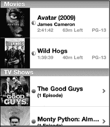

#### 搜索视频

如果您的 iPod touch 上加载了大量视频和其他内容，并且想要找到某个特定的视频，可以按照以下步骤操作：

1.  轻点屏幕顶部的“时间”区域，跳转到搜索框。

    

2.  输入视频标题的几个字母或一两个单词。
3.  在本示例中，我们输入了“email”，以查找与在 iPod touch 上使用电子邮件相关的任何视频。随后弹出了一个视频教程，展示如何从作者的一个网站处理电子邮件附件：[www.MadeSimpleLearining.com](http://www.MadeSimpleLearining.com)。
4.  轻点搜索结果中出现的任何视频即可开始播放。

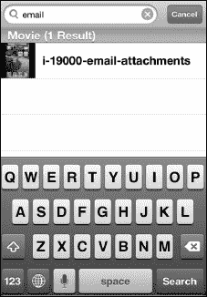

### 播放电影

只需轻点您想观看的电影，它便会开始播放。大多数视频都利用 iPod touch 相对较大的屏幕空间，以宽屏（即横向）模式播放。只需将 iPod touch 侧向旋转即可观看。

视频将自动开始播放。刚开始播放时，屏幕上除了视频本身，没有任何菜单、控制选项或其他内容。

您可以轻点屏幕上的任意位置，使控制栏和其他选项显示出来。`Videos` 应用中的大多数选项与 `Music` 应用中的非常相似。轻点 `Play/Pause` 按钮，视频将暂停。再次轻点 `Play/Pause` 按钮，视频将继续播放。

#### 快进或快退视频

`Play/Pause` 按钮的两侧分别是常用的 `Fast-Forward` 和 `Rewind` 按钮。要跳转到视频中特定的下一个章节部分，只需按住 `Fast-Forward` 按钮（位于 `Play/Pause` 右侧）。当到达所需位置时，松开按钮，视频将恢复正常播放。

按下 `Pause` 暂停视频后，您可以按住 `Fast-Forward` 或 `Rewind` 按钮进行慢速快进或快退。有趣的是，您也能听到音频随之变慢。

要快退到视频开头，请轻点 `Rewind` 按钮。要快退到特定部分或位置，请像快进视频时那样按住该按钮。

**注意：** 如果这是一个包含多个章节的完整长度电影，轻点 `Reverse` 或 `Fast-Forward` 将向前或向后移动一个章节。

#### 使用时间进度条

在视频屏幕的顶部有一个滑块，您可以通过它来*拖动*视频的播放进度。如果您确切（或大致）知道要观看视频的哪个时间点，只需按住滑块并将其拖到该位置即可。有些人认为这比按住 `Fast-Forward` 或 `Rewind` 按钮要更精确一些。

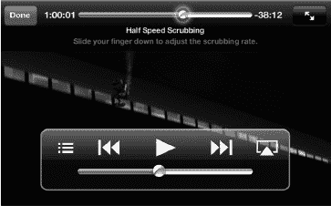

**提示：** 向下拖动手指可以更缓慢地移动滑块控制。

#### 更改视频大小（宽屏 vs. 全屏）

您的大多数视频将以宽屏格式播放。但是，如果某个视频未经转换以适配您的 iPod touch，或者未针对您的屏幕分辨率进行优化，您可以轻点位于上方状态栏右侧的 `Expand` 按钮。

您会注意到该按钮上有两个箭头。如果处于全屏模式，箭头指向内侧，相互朝向。如果处于宽屏模式，箭头则指向外侧。

如果宽屏电影未填满 iPod touch 的整个屏幕，轻点此按钮将稍微放大。再次轻点则恢复原大小。

**注意：** 您也可以简单地双击屏幕来放大并填满屏幕。请注意，就像在您的宽屏电视上一样，试图将非宽屏视频强行设置为宽屏模式有时可能会导致部分画面丢失。

#### 使用 AirPlay

苹果的 AirPlay 镜像功能可让您将视频投射到 Apple TV，从而在电视大屏幕上欣赏。只需轻点右下角的 `AirPlay` 按钮，然后选择 `Apple TV` 作为输出目标。稍等片刻，您的 iPod touch 屏幕会变暗，视频会从上次暂停处开始在电视大屏幕上播放。

要将视频画面切换回 iPod touch，请再次轻点 `AirPlay`，然后选择 `iPod touch` 作为目标。

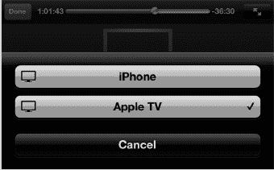

**提示：** 如果您没有或不想使用 Apple TV，还有其他几种观看电影的方式。例如，您可以购买 VGA 或 HDMI 转接器，将 iPod touch 连接到 VGA 电脑显示器或高清电视。

VGA 仅支持视频，要求应用支持此功能，且通常不支持数字版权管理（DRM）。HDMI 支持视频和音频，也要求应用支持该功能。不过，它也符合 HDCP 标准，因此可与 iTunes 视频等包含 DRM 的内容配合使用。

苹果还提供符合 DRM 标准且兼容大多数电视的色差分量视频线缆。

更多信息，请参阅《快速入门指南》中的“配件”部分。

#### 使用章节功能

从 iTunes 商店购买的大多数完整长度电影（以及部分为 iPod touch 转换的电影）都会提供章节功能。在 iPod touch 上观看此类电影，就像在家中的电视上观看 DVD 一样。

只需轻点屏幕调出视频控制项，然后选择 `章节`。

这样会带您返回电影的主页面。

轻点右上角的 `章节` 按钮，然后滚动浏览，找到并轻点您想观看的章节。

##### 查看章节

您可以滚动或快速翻动来定位想观看的场景或章节。

您还会注意到，每个章节的最右侧，是该章节开始的确切时间（相对于电影开始的时间）。

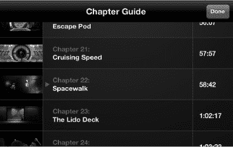

除了前面提到的章节菜单外，您还可以通过轻点 `快退` 或 `快进` 按钮，快速跳转到电影中的上一个或下一个章节。轻点一次，即可向任一方向跳转一个章节。

**注意：** 章节功能通常仅适用于从 iTunes 商店购买的电影。转换后加载到 iPod touch 上的电影通常不包含章节。

#### 观看电视节目

iPod touch 非常适合观看您喜爱的电视节目。您可以从 iTunes 商店购买电视节目，也可以从某些 iPod touch 应用（例如 `Hulu Plus` 应用）下载示例节目。

只需向下滚动到 `电视节目` 类别分隔线，即可查看已下载到 iPod touch 上的节目。浏览可用的节目并轻点 `播放`。视频控制项的操作方式与观看电影时的控制项相同。

**注意：** 在撰写本文时，iTunes 云服务允许美国用户将之前购买的电视节目直接重新下载到他们的 iPod touch 上（更多信息，请参阅第 21 章：“您设备上的 iTunes”）。

#### 观看播客

我们通常认为播客是可以通过 iTunes 下载的纯音频广播。视频播客现在也相当普遍，可以在许多网站上找到，包括许多公共广播网站。它们也可以在 iTunes 的 `iTunes U` 板块中找到；该板块列出了大学播客及其他相关信息。

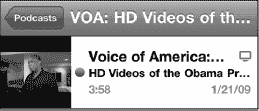

这是加里·马佐讲述的一个有趣的 iTunes U 故事：

> “最近，我和刚被加州理工学院录取的儿子一起在 iPod touch 的 `iTunes` 应用中浏览 `iTunes U` 板块。我们想知道宿舍的情况，你瞧，我们找到了一个展示加州理工学院宿舍参观之旅的视频播客。我们下载了它，这个播客就自动进入了 `podcast` 目录，方便以后观看。我们不用从东海岸飞过去，就完成了一次完整的宿舍虚拟参观。”

#### 观看音乐视频

您的 iPod touch 可以从多个来源获取音乐视频。通常，如果您从 iTunes 购买了“豪华版”专辑，它会附带一到两个音乐视频。您也可以从 iTunes 商店购买音乐视频，许多唱片公司和唱片艺术家会在他们的网站上免费提供这些视频。

音乐视频会自动归类到 `Videos` 应用的 `音乐视频` 板块中。

`音乐视频` 通常位于 `Videos` 列表中的 `电视节目` 正下方。其控制项的操作方式与所有其他视频应用相同。

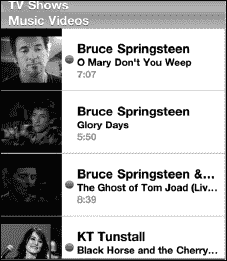

### 视频选项

与音乐播放器一样，您也可以调整视频播放器的几个选项。这些选项可通过 `主屏幕` 上的 `设置` 图标进行访问。

轻点 `设置` 图标，向下滚动并轻点 `视频` 以查看可用选项。

在这里，您还可以设置“家庭共享”设置，以便直接从 iPod touch 观看存储在电脑 iTunes 资料库中的视频。

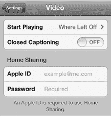

#### 开始播放选项

有时，您会不得不中断观看某个特定视频。此选项可让您决定下次想观看该视频时的操作。您可以选择从头开始观看，或者从上次中断处继续观看。只需选择您偏好的选项，这将成为您 iPod touch 此后采取的行动。

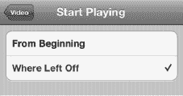

#### 隐藏式字幕

如果您的视频支持隐藏式字幕功能，将 `隐藏式字幕` 开关设为 `ON`，即可在屏幕上显示隐藏式字幕。

### 删除视频

要删除视频（以节省 iPod touch 上的空间），只需向上或向下滚动，并选择要删除的视频。

**注意：** 如果您正在从 iTunes 同步视频，请确保同时取消勾选您要删除的视频；否则，iTunes 可能会在下次同步时将其重新同步回您的 iPod touch！

只需在要删除的视频上轻触并向左滑动。就像删除电子邮件一样，左上角会出现一个红色的 `删除` 按钮。轻点 `删除` 按钮，系统会提示您确认删除视频。

最后，轻点 `删除` 按钮，该视频将从您的系统中删除。

**注意：** 此过程仅会从您的 iPod touch 上删除视频——假设您在购买视频后已与电脑同步，iTunes 中您的视频资料库里仍会保留一份副本。如果您愿意，以后可以将其重新加载到 iPod touch 上。但是，如果您从 iPod touch 上删除租借的电影，它将被永久删除！

### 在 iPod touch 上使用 YouTube

如今，观看 YouTube 视频无疑是人们在电脑上最常做的事情之一。现在，YouTube 就在您的 iPod touch 上，触手可及。

您可以在 `主屏幕` 上看到 `YouTube` 图标。只需轻点此图标，即可进入 `YouTube` 应用。

#### 搜索 YouTube 视频

首次启动 `YouTube` 时，您通常会看到 YouTube 当天的“精选”视频。

像在其他应用中一样，滚动浏览视频选项即可。

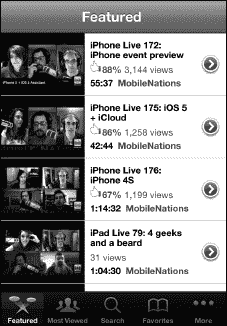

#### 使用底部图标

`YouTube` 应用底部有五个图标：`精选`、`最多观看`、`搜索`、`收藏`和`更多`。每个选项的含义都一目了然。

要观看 YouTube 当天推荐的视频，请触摸`精选`图标。要观看网上点击量最高的视频，请触摸`最多观看`图标。

观看某个特定视频后，你可以选择将其标记为 `YouTube` 上的收藏，以便日后轻松查找。如果你已设置书签，点击`收藏`图标时它们就会显示出来。

你还可以搜索 YouTube 庞大的视频库。点击`搜索`框（如之前讨论的其他应用中的操作一样），键盘就会弹出。输入短语、主题，甚至视频名称。

在此示例中，我正在寻找最新的《Made Simple Learning》视频教程——所以我只需输入“Made Simple Learning”即可看到此类视频的列表。

当我找到想观看的视频时，可以点击它以查看更多信息。我甚至可以在播放过程中触摸视频并选择评分来对其进行评分。

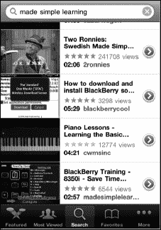

#### 播放视频

一旦做出选择，点击你想观看的视频。你的 iPod touch 将开始以竖屏或横屏模式播放 YouTube 视频。要强制使用竖屏模式，只需转动 iPod touch，使屏幕方向变为垂直。

#### 视频控制

视频开始播放后，屏幕上的控制选项会消失，因此你只能看到视频。要在视频播放时停止、暂停或激活任何其他选项，只需点击屏幕。

屏幕上的选项与你观看其他任何视频时看到的选项非常相似。

要在横屏模式下快进视频，请按住`快进`箭头。要快速后退，请按住`后退`箭头。要跳转到 YouTube 列表中的下一个视频，请点击`快进/下一个`箭头。要观看列表中的上一个视频，请点击`后退/上一个`箭头。

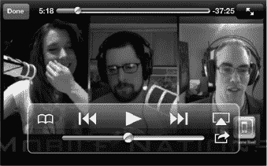

要将视频设为收藏，请点击最左边的图标：`收藏`。

要将视频投放到你的 Apple TV，请点击`AirPlay`按钮。

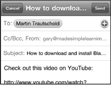

要添加到收藏、通过电子邮件发送或发布推文分享视频，请点击`分享`图标，然后你可以执行其中任一操作。

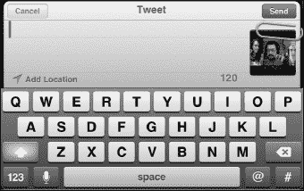

#### 查看和清除历史记录

触摸`更多`，然后触摸`历史记录`，你最近观看过的视频就会显示出来。

如果你想清除历史记录，只需触摸右上角的`清除`按钮，然后点击底部的按钮进行确认。

要从历史记录中观看视频，只需点击它，它便会开始播放。

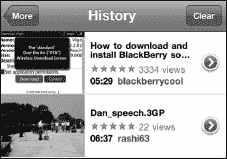

