# 第 15 章

## Safari 网页浏览器

现在，我们将带你了解在 iPod touch 上能做的最有趣的事情之一：上网冲浪。你可能听说过，在 iPod touch 上浏览网页是一种前所未有的亲密体验——我们同意这一点！我们将向你展示如何使用 iPod touch 上的 `Safari` 浏览器以前所未有的方式进行触摸、缩放和与网页互动。你将学习如何设置和使用书签、使用搜索引擎快速查找内容、打开和切换多个浏览器窗口，甚至轻松复制网页中的文本和图形。

### 在 iPod touch 上浏览网页

你可以通过 Wi-Fi 随心所欲地浏览网页。与其大一些的同类产品 iPad 一样，你的 iPod touch 拥有许多人认为当今功能最强大的移动浏览体验。网页看起来与电脑上的网页非常相似。借助 iPod touch 的缩放功能，你甚至不必担心较小的屏幕尺寸会限制你的网页浏览体验。简而言之，在 iPod touch 上浏览网页是一种更令人满意的体验。

你可以根据自己的偏好选择竖屏或横屏模式进行浏览。通过双击或捏合展开操作，可以快速放大视频——这些操作与放大文本和图形的操作相同。

**为什么有些视频和网站不显示？（需要 Flash Player）**

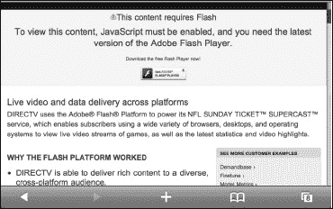

一些网站是用 `Adobe Flash Player` 设计的；但在撰写本文时，Apple 已决定不支持此应用程序。如果你点击视频但视频无法播放——或者你看到类似“需要 Flash 插件”、“下载最新 Flash 插件以观看此视频”或“需要 Adobe Flash 才能查看此站点”的信息——那么你将无法观看该视频或网页。幸运的是，包括 YouTube、Vimeo、TED、《*纽约时报*》和《*时代*》杂志在内的越来越多的网站开始使用 HTML5 视频代替 `Flash`，这些内容都能在你的 iPod touch 上播放。

解决此限制的一种方法是：App Store 上的一些替代浏览器（例如 `Skyfire`）会在其自己的服务器上渲染 `Flash` 视频，然后将 HTML5 视频发送至 iPod touch。

#### 需要网络连接

你的 iPod touch 需要处于有效的互联网连接状态才能浏览网页（请查看第 4 章：“连接到网络”以了解更多信息）。

#### 启动网页浏览器

你应该会在`主屏幕`上找到 `Safari`（网页浏览器）应用。通常，`Safari` 图标位于底部 Dock 中。

触摸 `Safari` 图标，你可能会被带到浏览器的`主页`。这可能是 Apple 的 iPod touch 页面。

只需将 iPod touch 侧向转动，即可在更宽的横屏模式下看到同一页面。当你找到喜欢的网站时，可以设置书签以便轻松跳转到这些网站。我们将在本章后面向你展示如何操作。

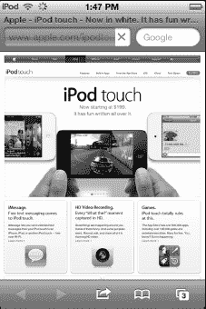

#### Safari 网页浏览器屏幕布局

查看屏幕时，请注意`地址栏`位于屏幕的左上角。此栏显示当前的网址。

如果你正在查看一个包含合适文本内容的网页，你会注意到地址栏中出现了`阅读器`按钮。点击“阅读器”按钮，即可以便于阅读的格式查看网页内容。更多信息请查看本章中的“Safari 阅读器”部分。

搜索窗口位于地址栏的右侧。默认情况下，它设置为 Google 搜索，但如果你愿意，可以将其更改为其他搜索引擎。

屏幕底部有五个图标：`后退`、`前进`、`操作`、`书签`和`页面`视图。

#### 输入网址

你要学习的第一件事是如何访问你喜爱的网页。就像在电脑上一样，你在浏览器中输入网址 (URL)。请按照以下步骤在 `Safari` 中输入网址：

1.  首先，点击浏览器顶部的`地址`栏。你会看到键盘出现，并且`地址`栏的窗口会展开。
2.  如果窗口中已有地址且你想删除它，请按地址栏右端的 。
3.  开始输入你的网址（你不需要输入“`www`”）。
4.  开始输入时，你可能会看到`地址`栏下方出现建议；只需点击任一建议即可转到该页面。这些建议非常全面，因为它们来自你的浏览历史记录、书签、网址 (URL) 和网页标题。
5.  记住页面底部的 `.com` 键。如果你按住它不放，会看到 `.edu`、`.org` 和其他常见域名类型。
6.  输入完成后，点击`前往`键即可转到该页面。

**提示：** 不要输入“`www`”，因为这不是必需的。记得使用底部的`冒号`、`正斜杠`、`下划线`、`点`和 `.com` 键以节省时间。

**提示：** 按住 `.com` 键不放，可查看所有选项：`.org`、`.edu`、`.net`、`.de` 等等。

### 在打开的网页间前进或后退

现在你已经知道如何输入网址，很可能会在不同网站间跳转。屏幕底部的**前进**和**后退**箭头  能让你非常轻松地按任意方向访问最近浏览过的页面。如果**后退**箭头呈灰色，本章的“使用打开页面按钮”部分可帮助你找出原因。

假设你正在《纽约时报》网站上看新闻，然后跳转到 ESPN 查看体育比分。要返回《纽约时报》页面，只需点击**后退**箭头。要再次回到 ESPN 网站，点击**前进**箭头即可。

#### 使用打开页面按钮

有时，当你点击链接时，你正在查看的网页会移至后台，并弹出一个包含新内容的新窗口（例如另一个网页或视频）。你会看到原网页移至后台，并打开一个新页面。在这种情况下，新浏览器窗口中的**后退**箭头将无法使用。

相反，你必须点击右下角的**打开页面**图标  来查看已打开网页的列表，然后点击你想要的那个。在所示的示例中，我们点击了一个链接，该链接打开了一个新的浏览器窗口。回到旧窗口的唯一方法是点击**打开页面**图标并选择所需的页面。

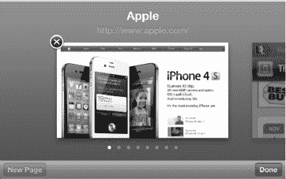

#### 在网页中缩放

在 iPod touch 上放大和缩小网页非常容易。缩放主要有两种方式——双击和双指捏合。

###### 双击

如果你在网页的某一列上轻点两下，页面将放大到该特定列。这让你能够精准定位到网页上的正确位置，对于未针对移动屏幕格式化的页面来说非常有用。

要缩小，只需再双击一次（你可以在本书开头的“快速入门指南”中看到效果）。

###### 双指捏合

这项技术可以让你放大页面的特定部分。虽然需要稍加练习，但很快就会变得得心应手。请查看“快速入门指南”以了解效果。

将拇指和食指并拢放在你想要放大的网页部分。然后慢慢向外张开，分开手指。你会看到网页放大。网页聚焦需要几秒钟，但很快就会放大并变得非常清晰。

要缩小回原来的大小，只需将手指分开，然后慢慢合拢；页面将缩放至原始尺寸。

#### 从网页激活链接

当你在网上冲浪时，经常会遇到将你带到其他网站的链接。由于 **Safari** 是一个全功能浏览器，你只需触摸链接即可跳转到新页面。

### 处理 Safari 书签

一旦你在 iPod touch 上开始浏览，你就会想快速访问你最喜欢的网站。一个很好的方法就是添加书签，以实现一键访问网站。

**提示：** 你可以使用 iCloud 通过无线方式或电脑上的 **iTunes** 应用，从电脑的网页浏览器（仅限 **Safari** 或 **Internet Explorer**）同步你的书签。详情请查看第 3 章：“与 iCloud、iTunes 等同步”。

##### 添加新书签

在 iPod touch 上添加新书签只需轻点几下：

1.  要为当前正在查看的网页添加新书签，请点击屏幕底部的**操作按钮** 。
2.  选择**添加书签**。

    

3.  我们建议你将书签名称编辑为简短易识别的名称。
4.  如果你想要更改书签存储的文件夹，请点击**书签**。
5.  完成后，点击**存储**按钮。

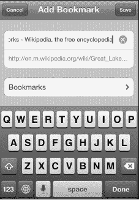

#### 使用书签和历史记录

一旦你设置了一些书签，就可以轻松查看和使用它们。在同一个区域，你还可以查看和使用你的网页浏览历史记录。iPod touch 上一个非常有用的工具是能够像在电脑上一样从**历史记录**中浏览网页。按照以下步骤操作：

1.  点击页面底部的**书签**  图标。
2.  向上或向下滑动以查看你的所有书签。
3.  点击任意书签即可跳转到该网页。

    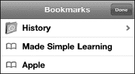

4.  点击**历史记录**文件夹，查看你最近访问过的网页历史记录。
5.  请注意，在列表底部，你会看到**今天早些时候**和之前几天的附加文件夹。
6.  点击任意历史记录项即可转到该网页。

**提示：** 要清除历史记录，请点击左下角的**清除**按钮。你也可以在**设置**应用中清除历史记录、Cookie 和缓存。点击**设置**；点击 **Safari**；滚动到底部；然后点击**清除历史记录**、**清除 Cookie** 或**清除缓存**。

#### 管理你的书签

因为设置书签非常容易，所以很容易积累大量书签。但是，你可能会发现不再需要某个特定书签，或者希望通过添加新文件夹来整理它们。

与 iPod touch 上的其他列表一样，你可以重新排列**书签**列表并删除条目。按照以下步骤操作：

1.  像之前一样查看你的**书签**列表。
2.  点击左下角的**编辑**按钮。
3.  要重新排列条目，请触摸并拖动带有三个灰色横条的右侧边缘，在列表中上下移动。在此示例中，我们将指向亚马逊网站上“iPad Made Simple”书籍页面的书签拖动到顶部。
4.  要为书签创建新文件夹，请点击右下角的**新建文件夹**按钮。

    

5.  要删除书签，请点击条目左侧的红色**圆形**图标，使其变为垂直状态。
6.  点击**删除**按钮。
7.  完成重新排列和删除条目后，点击左上角的**完成**按钮。
8.  要编辑书签名称、文件夹或网址，请点击书签名称本身。
9.  现在你可以对名称、网址或文件夹进行任何调整。
10. 要更改书签存储的文件夹，请点击网址下方的按钮。在此图片中，它显示的是**书签**；但在你的 iPod touch 上可能不同。此书签指向亚马逊网站上的“iPad Made Simple”页面。
11. 完成后点击**完成**。

#### 阅读列表

`Reading List` 是一种特殊的书签，可以让你快速保存网页文章，以便日后闲暇时阅读。`阅读列表`功能可通过 iCloud 同步，因此你可以很方便地在家里或工作用的 Mac 或 Windows PC 上的 `Safari` 中标记文章，然后在旅行途中用 iPod touch 或 iPad 阅读。你也能用此功能在 iPod touch 上保存书签，等回到 iPad 或电脑旁时再更舒适地阅读。

按照以下步骤使用`阅读列表`功能：

1.  在`Safari`中打开你想保存的文章。
2.  点击页面底部中间的`操作`按钮 。
3.  点击`添加到阅读列表`。

稍后按以下步骤查看`阅读列表`中的文章：

1.  点击页面右下角的`书签`按钮 。
2.  轻点`阅读列表`选项的`眼镜`图标。（如果看不到`眼镜`图标，你可能正处在一个`书签`文件夹内。只需点击左上角的`箭头`图标，退出一层或多层文件夹，直到`箭头`消失，就能看到`眼镜`图标了。）

    

3.  要查看`阅读列表`中的所有内容，点击左上角的`全部`标签。若只想看未阅读的文章，点击右上角的`未读`标签。
4.  点击你想阅读的文章。

最后，按照以下步骤从`阅读列表`中删除文章：

1.  在你想从`阅读列表`移除的文章上从左向右滑动。

    

2.  点击红色的`删除`按钮。

#### Safari 阅读器

`Safari`的`阅读器`功能可以让你将网页文章呈现为干净清晰的页面，文字大小适中，没有纷杂的布局或广告干扰。

**注意：** 尽管 Safari 在检测大多数网页文章方面表现出色，但由于内容和格式的多样性，它偶尔也会漏掉一些文章。如果你没有看到`阅读器`按钮，说明 Safari 无法检测到该文章。

按照以下步骤激活此功能：

1.  打开你想阅读的文章。
2.  点击 URL 字段右侧的`阅读器`按钮，参见图 16-1。
3.  点击`字体大小`按钮来调大或调小字号。

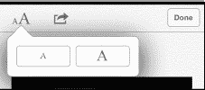

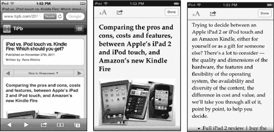

**图 15-1.** *同一网页的标准视图（左图）与阅读器视图（右两图）。*

**提示：** 如果你希望同时拥有`阅读列表`和`阅读器`的功能——再加上浏览器访问、社交分享等其他特性——那么可以试试 App Store 中的 `Instapaper` 这类应用。

### Safari 浏览技巧与窍门

既然你已经掌握了基本操作，下面我们将介绍一些实用的技巧和窍门，让你在 iPod touch 上的网页浏览更愉快、更快捷。

#### 跳转到网页顶部

有时网页可能很长，滚动回页面顶部会有些费力。一个简单的小技巧是轻点网页的灰色标题栏；你会自动跳转到页面顶部。

#### 通过邮件或推特分享网页

浏览时，有时你会发现一个特别吸引人的页面，想与朋友或同事分享。点击底部栏中间的`操作`按钮 ，然后选择`邮件链接到本页面`来创建一封包含链接的邮件。选择`推特`则可创建一条带链接的新推文，如图 15-2 所示。

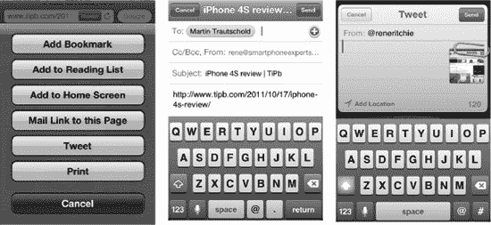

**图 15-2.** *使用操作按钮对 Safari 网页进行多种操作。*

#### 打印网页

使用 iPod touch，你可以轻松地将任何网页打印到本地 Wi-Fi 网络中兼容 `AirPrint` 的打印机上。点击`操作`按钮 ，然后选择`打印`。

#### 在 Safari 中观看视频

在网站上你常会看到视频。你可以播放其中很多视频，但并非全部。例如，使用 `Adobe Flash` 格式的视频无法在 iPod touch 上播放（请参阅本章开头的说明）。

点击`播放`按钮后，你会从 `Safari` 切换到 `iPod` 视频播放器。

你可以将 iPod touch 横过来，以横向或宽屏模式观看视频。

如果播放控制栏消失了，轻点屏幕即可重新显示。

看完视频想返回网页时，点击左上角的`完成`按钮。

**提示：** 关于视频播放器的更多技巧与窍门，请查看第 14 章：“观看视频”。

#### 保存或复制文本与图片

你可能会不时看到想从网站复制的文本或图片。本节将简要介绍操作方法；要了解更详细的步骤（包括如何使用`剪切`和`粘贴`功能），请参阅第 2 章：“打字、复制与搜索”中的“复制与粘贴”部分。以下是从网页复制文本或图片的快速概述：

*   要复制单个单词，长按该单词直到它被高亮显示并出现`复制`按钮，然后点击`复制`。
*   要复制几个单词或整个段落，长按一个单词直到它被高亮显示，然后向左或向右拖动蓝色点来选择更多文本。你可以向上或向下滑动来选择整个段落。最后，点击`粘贴`。

    **提示：** 选中单个单词会使复制功能进入单词选择模式，你可以拖动来增加或减少选中的单词数。如果超过一个段落，通常会切换到元素选择模式，此时不再是角点，而是出现边缘，你可以拖动边缘来选择多个段落、图片等。

*   要保存或复制图片，长按图片直到出现弹出窗口，询问你是否要保存或复制该图像。

### 使用自动填充节省时间

`AutoFill`（自动填充）功能是一种绝佳方式，可帮你节省输入个人信息的时间，包括网站上的用户名和密码。`AutoFill`（自动填充）工具能够记住并填写网页表单中需要的信息。启用`AutoFill`（自动填充）功能将为你节省大量时间。

请参照本章稍后“启用自动填充”部分展示的步骤，在 iPod touch 上设置`AutoFill`（自动填充）功能。

一旦启用了`AutoFill`（自动填充）选项，只需前往任何带有待填写字段的网页。当你触摸该字段时，键盘会立即在屏幕底部弹出。在键盘顶部，你会看到一个写着`AutoFill`（自动填充）的小按钮。触摸它，网页表单就会自动填写完毕。

**警告：** 让姓名和密码自动输入意味着任何拿起你 iPod touch 的人都能访问你的个人网站和信息。你可能希望按照第 8 章：“个性化与安全”中所述，启用密码锁定功能。

#### 输入用户名与密码

第一次访问需要输入用户名和密码的网站时，请键入这些信息，然后按下`Submit`（提交）或`Enter`（回车）。此时，`AutoFill`（自动填充）会询问你是否希望 iPod touch 记住它们。

如果你希望记住这些信息以便下次访问该网站时自动输入，请轻点`Yes`（是）。

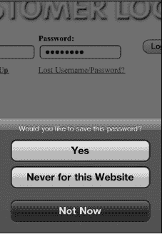

下次访问此登录页面时，你的用户名和密码将会自动填写。

#### 个人信息填写

在网上很多时候你都需要输入自己的姓名、电子邮件地址、家庭住址等信息。只要将`AutoFill`（自动填充）设置好并与 iPod touch 上的联系人记录关联，填写这些表单只需轻点一下手指。

你会遇到许多需要填写网页表单的网站。例如，看看[`www.madesimplelearning.com`](http://www.madesimplelearning.com)上这个为免费 iPod touch 使用技巧而设的网页表单示例。手动输入电子邮件地址、名字和姓氏需要花费不少时间。

一旦你轻点第一个字段——在此例中是`Email`（电子邮件）——就会看到`AutoFill`（自动填充）栏出现在键盘上方。

轻点`AutoFill`（自动填充）按钮，你的电子邮件地址和姓名便会立即从联系人记录中填入。

### 将网页图标添加到主屏幕

如果你喜欢某个网站或页面，将其作为图标添加到`Home`（主）屏幕是非常容易的。这样一来，你无需通过`Safari`的书签选择过程就能立即访问该网页。将图标放在`Home`（主）屏幕上可以节省大量操作步骤。这对于快速启动网络应用（例如，来自 Google 的 Gmail 或基于网页的游戏）尤其有用。

**按照以下步骤添加网络应用图标：**

1.  轻点浏览器底部的`Action`（操作）按钮 。
2.  轻点`Add to Home Screen`（添加到主屏幕）。
3.  调整名称，将其缩短至十个或更少的字符；你应该这样做，因为主屏幕上图标名称的显示空间有限。
4.  轻点右上角的`Add`（添加）按钮。

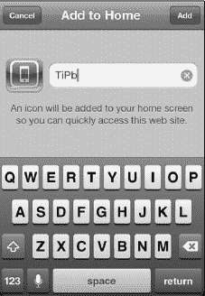

### 调整 Safari 浏览器设置

与我们目前调整过的其他设置类似，`Safari`的设置可以在`Settings`（设置）应用中找到。

1.  要访问`Safari`的设置，请轻点`Settings`（设置）图标。
2.  轻点`Safari`。

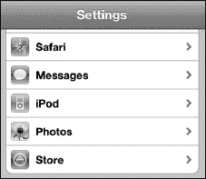

#### 更改搜索引擎

默认情况下，`Safari`浏览器的搜索引擎是`Google`。要将其更改为`Yahoo`或`Bing`，请触摸`Search Engine`（搜索引擎）按钮，然后选择新的搜索引擎。

#### 启用自动填充

正如我们本章前面所展示的，`AutoFill`（自动填充）是一种便捷方式，可以让`Safari`自动填写要求提供姓名、地址、电话号码，甚至用户名和密码的网页表单。它可以为你节省大量反复输入姓名及其他信息的时间。

要启用`AutoFill`（自动填充）选项，请按照以下步骤操作：

1.  在`Settings`（设置）应用中的`Safari`菜单里，轻点`AutoFill`。

    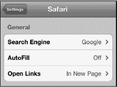

2.  将`Names & Passwords`（名称与密码）旁边的开关设置为`ON`（开启）。
3.  将`Use Contact Info`（使用联系人信息）旁边的开关设置为`ON`（开启）。

    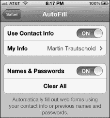

4.  将`Use Contact Info`（使用联系人信息）设置为`ON`（开启）后，你会被带到`Contacts`（通讯录）列表，以选择一个要使用的联系人。
5.  上下滑动以查找某人，或双击顶部写着`Contacts`（通讯录）的栏以调出`Search`（搜索）窗口。
6.  找到想要使用的联系人后，轻点它即可返回到`Safari`的`Settings`（设置）屏幕。

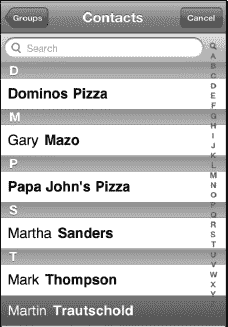

#### 调整隐私选项

开启`Private Browsing`（私密浏览）选项意味着，在你访问网站时，不会存储任何信息、历史记录或 Cookie。如果你担心别人知道你访问了哪些网站，或者担心访问的网站对你进行跟踪，那么你应该将`Private Browsing`（私密浏览）切换到`ON`（开启）位置。

你还可以使用`Clear History`（清除历史记录）和`Clear Cookies and Data`（清除 Cookie 与数据）选项。

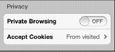

**提示：** 如果你发现网页浏览速度变慢或卡顿——或者 Safari 频繁崩溃——那么请尝试通过轻点`History`（历史记录）和`Cookies and Data`（Cookie 与数据）并确认选择来清除它们。

#### 调整安全选项

在`Security`（安全）标题下，`Fraud Warning`（欺诈警告）、`JavaScript`和`Block Pop-ups`（拦截弹出式窗口）选项默认应为`ON`（开启）。你可以通过将相应的开关滑动到`OFF`（关闭）来修改这些设置。

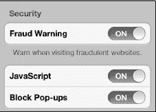

**注意：** 许多像 Facebook 这样的热门网站要求`JavaScript`处于`ON`（开启）状态。

轻点`Accept Cookies`（接受 Cookie）按钮，可以将浏览器接受 Cookie 的能力调整为`Always`（始终）、`Never`（永不）或`From visited`（来自已访问站点）。我们建议保持为`From visited`（来自已访问站点）。如果设为`Never`（永不），某些网站将无法正常工作。

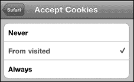

