# 第 16 章

## 使用电子邮件进行通信

在本章中，我们将探索 iPod touch 上`Mail`（邮件）应用中的电子邮件世界。你将学习如何设置多个电子邮件账户、查看各种阅读选项、打开附件以及清理收件箱。

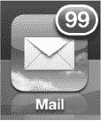

并且，针对你的电子邮件无法正常工作时的情况，你将学到一些很好的故障排除技巧，以帮助你恢复正常运行。

### 邮件入门

在 iPod touch 上设置电子邮件相当简单。让电子邮件启动并运行的最快方法可能是在 iPod touch 上直接设置账户。我们在本节中向你展示如何使用`Mail, Contacts and Calendar`（邮件、通讯录和日历）账户设置屏幕。你也可以使用电脑上`iTunes`应用中的某个屏幕来复制这些账户设置。你需要网络连接才能让电子邮件正常运行。

#### 需要网络连接

如今，移动电子邮件无疑风靡一时。你可以在没有网络连接的情况下查看、阅读和撰写已同步到 iPod touch 的电子邮件的回复；但是，你需要具备网络连接才能通过 iPod touch 发送和/或接收电子邮件。请查看第 4 章：“连接到网络”以了解更多信息。此外，请参阅第一部分快速入门指南中的“阅读顶部连接状态图标”部分。

**提示：** 如果你要出行，只需在登机前下载所有电子邮件；这样你就可以在离线状态下阅读、回复和撰写邮件。所有邮件将在你着陆并重新连接到互联网后发送。

### 在 iPod Touch 上设置电子邮件

如前所述，你可以在 iPod touch 上通过两种方式设置你的电子邮件账户：

1.  直接在 iPod touch 上设置你的电子邮件账户。
2.  使用 iTunes 同步电子邮件帐户设置。

第一种方式，直接在 iPod touch 上设置电子邮件账户，适合在 iPod touch 上进行特殊设置的情况，例如通过 Exchange 使用 Gmail。如果你在 Windows 或 Mac 电脑上不使用电子邮件程序，这也是一种好方法。

如果你在 Windows 或 Mac 电脑上已经设置了许多 POP3 或 IMAP 账户，你也可以选择通过 iTunes 经由 USB 底座连接线来同步它们。

#### 为电子邮件账户输入密码

在第 3 章中，我们向你展示了如何将电子邮件帐户设置同步到 iPod touch。同步完成后，你应该能够通过打开`设置`应用来查看 iPod touch 上的所有电子邮件账户。你只需要做的就是输入每个账户的密码。

要为每个同步的电子邮件账户输入密码，请按照以下步骤操作：

1.  轻点`设置`图标。
2.  轻点`邮件、通讯录、日历`选项。
3.  在`账户`下，你应该能看到所有已同步的电子邮件帐户列表。
4.  轻点列表中的任一电子邮件帐户，输入其密码，然后轻点`完成`。
5.  如果所有信息都正确输入，将会出现勾选标记，你的账户将被启用。
6.  对所有列出的电子邮件帐户重复此操作。

#### 在 iPod Touch 上添加新电子邮件账户

要在 iPod touch 上添加新的电子邮件账户，请按照以下步骤操作：

1.  轻点`设置`图标。

    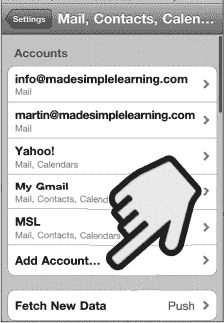

2.  轻点`邮件、通讯录、日历`选项。
3.  在你的电子邮件帐户下方轻点`添加账户`。

    如果你尚未设置任何帐户，你将只看到`添加账户`选项。

    **提示：** 要编辑任何电子邮件帐户，只需轻点该账户即可。

4.  在此屏幕上选择要添加的电子邮件帐户类型：

    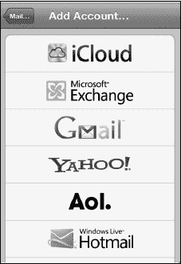

    *   如果你使用 iCloud 服务，请选择`iCloud`。
    *   如果你使用 Microsoft Exchange 电子邮件服务器，请选择`Microsoft Exchange`。
    *   如果你使用 Google 日历和 Google 通讯录来存储个人信息，并且希望将它们无线同步到 iPod touch，你也应该选择`Microsoft Exchange`。

    **注意：** 我们将在第 3 章中向你展示如何设置 Google/Microsoft Exchange 和 iCloud：“与 iCloud、iTunes 及更多服务同步”。

    *   如果你使用 Google 电子邮件，但*不*（或*不想*）与你的`Google 通讯录`进行无线同步，请选择`Gmail`。
    *   如果你使用 Yahoo!, AOL, 或 Windows Live Hotmail 这些服务，请选择它们。
    *   如果以上都不适用，并且你想同步标准的 POP 或 IMAP 电子邮件帐户，请选择`其他`。最后，在下一个屏幕上选择`添加邮件账户`。

5.  在`姓名`栏中输入你希望收件人在收到你的邮件时看到的姓名。

    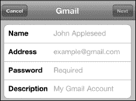

6.  接下来，在`地址`、`密码`和`描述`栏中输入相应的信息。
7.  轻点右上角的`下一步`按钮。

##### 指定接收和发送服务器

有时，iPod touch 无法自动设置你的电子邮件帐户。在这种情况下，你需要手动输入更多设置来启用你的电子邮件帐户。

**提示：** 你可以通过在网上搜索你的电子邮件提供商名称和电子邮件设置来找到相关设置。

如果 iPod touch 仅凭你的电子邮件地址和密码无法登录到你的服务器，你将会看到一个类似于此的屏幕。

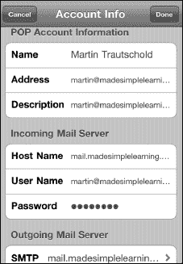

在`接收邮件服务器`下，将相应的信息输入到`主机名`、`用户名`和`密码`栏中。通常，你的接收邮件服务器类似于 `mail.*你的 ISP 名称*.com`。

要调整你的发送服务器名称，请轻点`发送邮件服务器`。你可以在下一个屏幕上调整发送邮件服务器。这些服务器名称通常看起来像 `smtp.*你的 ISP 名称*.com` 或 `mail.*你的 ISP 名称*.com`。

你可以尝试将`服务器名称`和`密码`栏留空。如果不行，你随时可以返回并更改它们。

系统可能会询问你是否要使用 SSL（安全套接层），这是一种你的电子邮件提供商可能要求的发送邮件安全类型。如果你不确定是否需要 SSL，只需与你的电子邮件提供商核对邮件设置即可。

**提示：** 作者建议尽可能使用 SSL 安全连接。如果你不使用 SSL，你的登录凭据、邮件以及任何私人信息将以纯文本（未加密）形式发送，从而让窥探者有机可乘。

##### 验证你的账户是否已设置成功

一旦所有信息输入完毕，iPod touch 将尝试配置你的电子邮件帐户。你可能会收到一条错误消息；如果发生这种情况，你需要检查你输入的信息。

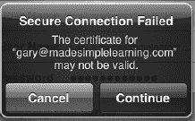

如果你进入显示所有电子邮件帐户的屏幕，请查找新的账户名称。

如果你看到了它，说明你的账户已正确设置。

##### 修复“无法获取邮件”错误

如果你轻点`邮件`图标并收到一条错误消息，提示“无法获取邮件 — 未提供 *(你的账户)* 的密码”，你需要输入你的密码。

请查阅本章中“为从 iTunes 同步的电子邮件帐户输入密码”部分以获取帮助。

#### 邮箱屏幕 — 收件箱和账户

顶层屏幕是你的`邮箱`屏幕。你可以通过轻点左上角的按钮随时进入该屏幕。继续轻点这个左上角的按钮，直到你不再看到其他按钮为止。这时，你就进入了`邮箱`屏幕。

从`邮箱`屏幕，你可以访问以下项目：

*   **统一收件箱：** 通过轻点`所有收件箱`进行访问。
*   **每个单独账户的收件箱：** 通过在`收件箱`部分轻点该电子邮件帐户名称进行访问。

    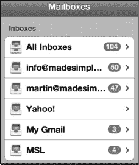

*   **账户部分中每个电子邮件帐户的文件夹**：通过轻点账户名称查看所有文件夹进行访问。

    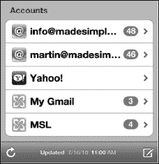

#### 添加或编辑电子邮件文件夹或邮箱

借助 iOS 5，如果你使用 iCloud 同步的邮件帐户，或者你的邮件服务器支持此功能，你现在可以直接在 iPod touch 上添加或编辑电子邮件文件夹。例如，你想更改邮件文件夹名称或添加新邮件文件夹来更好地整理收件箱中的邮件。一个例子是创建一个名为“需要关注”的新文件夹，并将所有那些你暂时无法处理、但需要确保回到办公桌后处理的电子邮件放进去。要在你的设备上添加或编辑邮箱，请按照以下步骤操作：

1.  **从邮箱屏幕滚动到底部，并轻点“账户”下列出的任一电子邮件帐户。**

    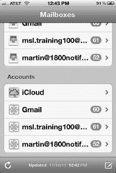

2.  在本示例中，我们将编辑 iCloud 账户邮箱。在此屏幕上轻点右上角的`编辑`。

    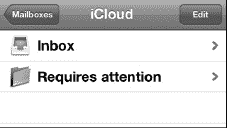

3.  然后，你可以执行以下操作：

    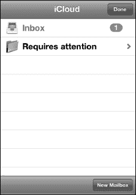

    *   轻点底部的`新建邮箱`来创建一个新邮箱。
    *   轻点任意邮箱文件夹以编辑其名称或将其删除。

### 收件箱、已标记（星标）和带回复的邮件

你会注意到，任何未读邮件左侧都会有一个蓝点标记，如图  所示。

你还会注意到，有些邮件右侧会显示一个数字和一个右箭头（`>`），如图所示：。这表示该邮件有**三封**相关邮件（回复和转发）。

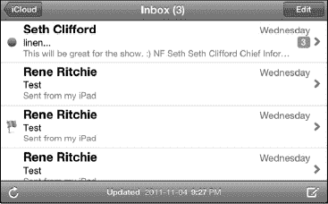

已标记的邮件左侧会有一个小旗帜，如图所示：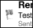

点击任意邮件即可将其打开。唯一无法打开的情况是该邮件包含相关邮件。此时，你首先会看到一个显示所有相关邮件的界面。点击其中任意一封邮件即可查看。

要离开**收件箱**视图，请点击左上角的按钮。

通过查看左上角的按钮，你可以判断自己正在查看哪个邮箱账户：

-   如果按钮显示为**邮箱**，则表示你正在查看所有收件箱的汇总。
-   如果按钮显示的是账户名称（例如 **iCloud** 或 **Exchange**），则表示你正在查看该账户的收件箱。

#### 移动、删除或标记多封邮件

如果你想一次移动或删除多封邮件，可以在收件箱界面中操作。请按照以下步骤一次删除多封邮件：

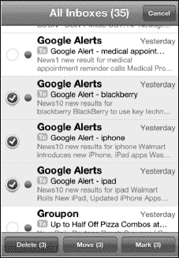

1.  在收件箱界面中，点击右上角的**编辑**按钮。
2.  点击选择所需的邮件；邮件旁边的红色勾选图标表示该邮件已被选中。
3.  要删除邮件，请点击底部的**删除**按钮。
4.  要将邮件移至其他文件夹，请点击**移动**按钮并选择目标文件夹。
5.  要**标记**邮件（添加旗帜或标记为未读），请点击**标记**按钮。标记为“未读”会在邮件旁边恢复蓝点。如果添加旗帜，邮件旁边会出现一个小旗帜图标，如图所示：

### 查看单个邮件

当你在**收件箱**界面中点击一封邮件时，就会进入**主要**邮件视图。你可以竖屏或横屏模式查看邮件，详见图 16-1。竖屏模式通常会显示更多文字，而横屏模式则能让你享受更大的文字和图片。

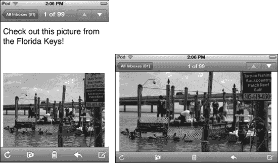

**图 16-1.** *在竖屏和横屏模式下查看电子邮件。*

**提示：** 如果你将 iPod touch 放在桌上或搁在腿上使用，你可能希望使用**竖屏锁定**图标将视图锁定为竖屏模式。这样可以防止屏幕不必要地翻转。请按以下步骤锁定视图：

1.  双击**主屏幕**按钮，然后从左向右滑动。
2.  点击**竖屏锁定**按钮以将屏幕锁定为竖屏模式。

### 编写和发送电子邮件

要启动电子邮件程序，请点击**主屏幕**上的**邮件**图标。

**提示：** 如果你在查看某封特定邮件、文件夹列表或某个账户时退出了**邮件**应用，那么当你返回**邮件**应用时，会直接回到之前离开的位置。

如果你第一次进入电子邮件，可能会看到一个空收件箱。可以点击窗口左下角的**刷新**按钮  来获取最新邮件。iPod touch 会开始检查新邮件，然后显示每个账户的新邮件数量。

#### 编写新电子邮件

当启动**邮件**程序时，你首先看到的应该是**账户**界面。在屏幕右下角，你会看到**编写**图标。点击**编写**图标即可开始创建新邮件。

#### 编写邮件地址——选择收件人

根据对方是否在 iPod touch 的**通讯录**中，你有几种选择收件人的方式：

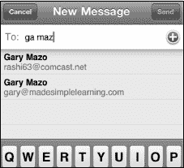

**选项 1**：输入某人名字的前几个字母；按下**空格**键，然后输入此人姓氏的前几个字母。此人的名字应出现在列表中；点击该名字即可选择该联系人。

**选项 2**：输入电子邮件地址。注意底部的 **@** 和**句点**（` . `）键，它们有助于你的输入。

**提示：** 长按**句点**键可以查看 `.com`、`.edu`、`.org` 以及其他电子邮件域名后缀。

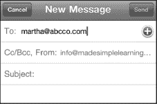

**选项 3**：点击**加号**（`+`） 以查看整个**通讯录**列表，并搜索或从中选择一个名字。

如果你想使用不同的联系人分组，请点击左上角的**群组**按钮。

双击屏幕顶部的**通讯录**即可看到**搜索**窗口。接下来，输入几个字母来搜索你的联系人。

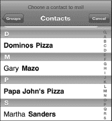

##### 删除收件人

如果需要从收件人列表（**收件人：**、**抄送：**或**密送：**）中删除一个名字，请点击该名字将其选中 ，然后按下**退格**键。

**提示：** 如果你想删除刚刚输入的最后一个收件人（且光标位于该名称旁边），按一次**删除**键高亮该名称，再按一次即可将其删除。

##### 添加抄送或密送收件人

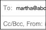 要添加**抄送**（**Cc:**）或**密送**（**Bcc:**）收件人，你需要点击邮件顶部**收件人：**字段下方的 **Cc:** 或 **Bcc:** 字段。这样做会打开所点击的字段。

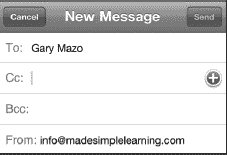

##### 移动收件人

如果你最初将收件人添加到了**收件人：**字段，但改变主意想将其移至**抄送：**或**密送：**字段（反之亦然），只需长按该收件人的名字并将其拖拽到目标字段即可。

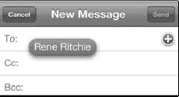

#### 更改发送邮件的账户

如果你设置了多个电子邮件账户，iPod touch 会使用设为默认的账户。（此设置在 **设置** > **邮件、通讯录、日历** > **默认账户**，位于**邮件**部分底部。）

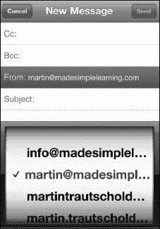

请按以下步骤更改发送邮件的账户：

1.  点击邮件的**发件人：**字段以高亮显示。
2.  再次点击**发件人：**字段，屏幕底部会以滚轮形式显示你的账户列表。
3.  上下滚动，然后点击一个新的电子邮件账户进行选择。
4.  点击**主题**字段以完成更改发送邮件的邮箱地址。

#### 输入主题

现在，你需要为电子邮件输入主题。请按以下步骤操作：

1.  点击**主题：**一行，并在邮件的**主题：**字段中输入文字。
2.  按**回车**键或点击邮件的**正文**区域，将光标移至**正文**部分。

### 输入邮件内容

现在光标位于邮件的**正文**区域（主题行下方），即可开始输入邮件内容。

**注意：** 你的 iPod touch 上只能设置一个电子邮件签名，该签名会自动应用于你从 iPod touch 发送的每封邮件——即使你设置了多个电子邮件账户也是如此。因此，如果你同时经营两种不同业务，或者不希望将个人电子邮件签名发送给所有商务联系人，请务必小心。最好将你的电子邮件签名设置得较为通用。

#### 设置文本格式、定义单词、引用文本及其他操作

你可以轻点任意文本以将其高亮选中，然后使用蓝色控制柄来扩大或缩小选区范围。接着，通过选区上方的弹出菜单，可以进行以下任一操作：

- **轻点“剪切”、“拷贝”或“粘贴”来执行相应功能。**
- **若单词下方有下划线需要更正拼写，轻点“建议”。**
- **轻点右边缘的三角形图标可查看更多选项。**
- 轻点 **B/U** 调整格式为**粗体**、**斜体**或**下划线**。
  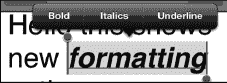

  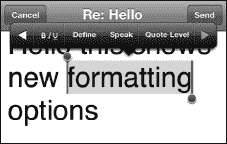

- 轻点**定义**可在词典中查找所选单词。
- 轻点**朗读**可让设备朗读该单词。
- 轻点**引用级别**可增加或减少所选文本的引用层级。

#### 电子邮件签名

默认的电子邮件签名如右侧图片所示：**发自我的 iPod touch**。

**提示：** 你可以将此签名更改为任何你想要的文本；请参阅本章后面的“更改电子邮件签名”部分，了解如何更改电子邮件签名。

#### 键盘选项

输入时，请记住你有两种键盘选项：较小的**竖屏**键盘和较大的**横屏**键盘，请参阅图 17-2。

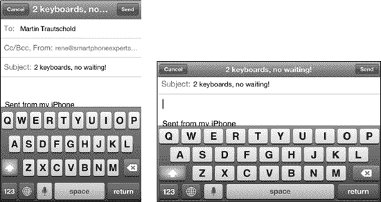

**图 16-2.** *将设备侧向旋转，即可使用更大的横屏键盘。*

**提示：** 如果你的手比较大，使用更大的键盘可能会更便于输入。一旦你掌握了在较大键盘上用双手输入的方法，就会发现它比单指输入要快得多。更多输入技巧，请参阅第 2 章：“输入、拷贝与搜索”。

#### 自动更正与自动大写

输入时，你会注意到有些单词会自动大写并被自动更正。拼写检查器会将带有红色下划线的单词标记为拼写错误。请参阅第 2 章：“输入、拷贝与搜索”，了解所有这些功能是如何工作的；本章还提供了一些额外的输入技巧。

### 发送邮件

邮件内容输入完毕后，轻点右上角的蓝色**发送**按钮。

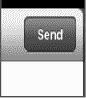

你的邮件将被发送，并且你应该会听到 iPod touch 的邮件发送提示音，这确认了你的邮件已成功发送。你可以在第 8 章：“个性设置与安全保护”中的“调整 iPod touch 上的声音”一节中了解如何启用或禁用此提示音。

#### 存为草稿稍后发送

如果你不打算立即发送邮件，但希望将其保存为草稿以便稍后发送，请按照以下步骤操作：

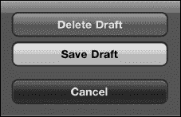

1.  按前面所述的方法编写邮件。
2.  按下左上角的**取消**按钮。
3.  选择屏幕底部的**保存草稿**按钮。

稍后，当你需要查找并发送草稿邮件时，请按照以下步骤操作：

1.  在发送此邮件的电子邮箱账户中打开**草稿**文件夹。有关如何进入**草稿**文件夹的帮助信息，请参阅本章前面的“在邮件文件夹中导航”部分。
2.  轻点**草稿**文件夹中的电子邮件将其打开。
3.  轻点邮件中的任意位置进行编辑。
4.  轻点**发送**按钮。

#### 检查已发送邮件

按照以下步骤确认邮件已正确发送：

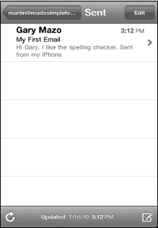

1.  轻点左上角的**邮箱账户名称**按钮，查看刚用于发送邮件的账户的邮件文件夹。
2.  轻点**已发送**文件夹。
3.  确认列表中显示的顶部邮件正是你刚刚编写并发送的那一封。

**注意：** 只有在 iPod touch 上实际发送或删除了该账户的邮件后，你才会看到**已发送**和**废纸篓**文件夹。如果你的电子邮件账户是 IMAP 账户，你可能会看到除本章所述之外的其他许多文件夹。

### 阅读和回复邮件

按照以下步骤阅读你的电子邮件：

1.  使用本章前面描述的步骤，导航至你想要查看的电子邮箱账户的收件箱。
2.  要阅读任何一封邮件，只需在收件箱中轻点它。

    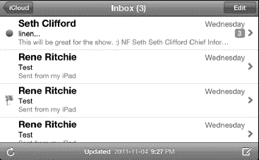

3.  新的、未读邮件会在其左侧显示一个蓝色小圆点。
4.  在收件箱中向上或向下滑动手指，即可滚动浏览你的邮件。
5.  阅读邮件时，向上或向下滑动即可滚动浏览其内容。

#### 将邮件标记为未读或已标记

如果你阅读了一封邮件，但希望确保稍后能快速找到它，可以选择轻点`标记为未读`或`旗标`，以便日后引起你的注意。

请按照以下步骤标记邮件：

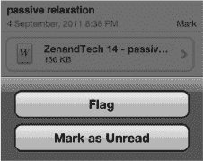

1.  轻点位于时间和日期右侧的**标记**一词。
2.  从弹出的菜单中选择**旗标**或**标记为未读**。

被标记为旗标的邮件，其`标记`文本左侧会有一个红色小旗子图标。被标记为未读的邮件，其`标记`文本右侧会有一个蓝色小圆点。

**取消标记**邮件：

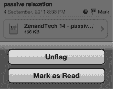

1.  轻点位于时间和日期右侧的**标记**一词。
2.  从弹出的菜单中选择**取消旗标**或**标记为已读**。

#### 放大或缩小

与浏览网页时一样，你可以放大以查看更大字体的邮件内容。你也可以像在网页上一样使用双指轻点；还可以使用**捏合**手势来放大或缩小（有关这些功能的更多信息，请参阅本书第 1 部分快速入门指南中的“缩放”部分）。

### 邮件附件

某些电子邮件附件会被 iPod touch 自动打开，因此你甚至不会注意到它们是附件。此类附件包括 Adobe 可移植文档格式 (PDF) 文件（由**Adobe Acrobat** 和 **Adobe Reader** 等应用程序使用）以及某些类型的图像、视频和音频文件。你也可能会收到文档形式的附件，例如 Apple 的 **Pages**、**Numbers** 和 **Keynote** 文件，或 Microsoft 的 **Word**、**Excel** 和 **PowerPoint** 文件。这些文件需要手动打开。

#### 辨别邮件何时包含附件

任何包含附件的邮件都会在发件人姓名旁边显示一个小的**回形针**图标，如下图所示。当你看到这个图标时，就知道该邮件包含附件了。

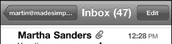

#### 接收自动打开的附件

某些类型的电子邮件附件，如图像、Quicktime 影片和单页 PDF 文件，通常会被自动打开并直接显示在邮件正文中。

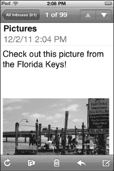

**提示：** 如果你想保存或复制自动打开的附件，只需按住它直到弹出窗口出现。此时，你可以选择**拷贝**或**存储图像**。当你保存图像时，它会被放入**照片**应用中的**相机胶卷**相册中。

### 打开电子邮件附件

与我们刚才描述的不会直接在邮件正文中打开的情况不同，其他类型的附件（例如电子表格、文字处理文档和演示文稿文件）需要手动打开。

#### 轻点进入“快速查看”模式

请按照以下步骤在“快速查看”模式下打开附件：

1.  打开带有附件的邮件，如图 16-3 所示。
2.  快速轻点附件，即可在“快速查看”模式下立即打开它。
3.  您可以在文档中导航。请记住，您可以进行缩放，也可以向上或向下滑动。
4.  如果您打开了一个包含多个工作表或电子表格的电子表格，您会看到顶部有多个标签。触碰另一个标签即可打开该电子表格。
5.  查看完附件后，轻点文档一次以调出控制选项，然后轻点左上角的**完成**。
6.  如果您安装了可以打开所查看附件类型（此处为电子表格）的应用，那么您会在右上角看到一个**“打开方式”**按钮。轻点**“打开方式”**按钮可在另一个应用中打开此文件。

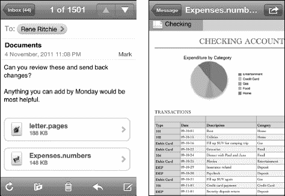

**图 16-3.** *在“快速查看”模式下查看电子邮件附件。*

#### 在其他应用中打开文档

您可能希望在其他应用程序中打开附件。例如，您可能想要在 **Numbers** 中打开电子表格，或者在 **iBooks、Stanza** 或 **GoodReader** 中打开 PDF 文件。请按照以下步骤操作：

1.  打开电子邮件。
2.  按住附件，直到弹出窗口出现。
3.  选择**“打开方式…”**或**“在‘Numbers’中打开”**选项。当附件格式与您设备上的应用相匹配时，您可能会看到“打开方式”后面列出了具体的应用程序，此处以 Numbers 为例。

    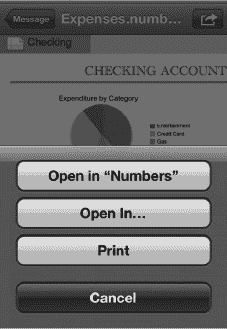

4.  从列表中选择您要使用的应用程序。
5.  最后，您可以编辑文档、保存它，并通过电子邮件将其回复给发件人。

    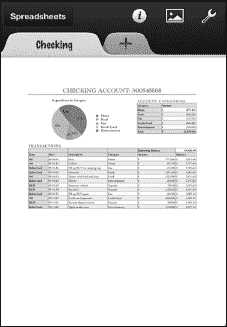

#### 查看视频附件

您可能会收到视频作为电子邮件附件。某些类型的视频可以在您的 iPod touch 上观看（有关支持的视频格式列表，请参阅本章后面的“支持的电子邮件附件类型”部分）。请按照以下步骤打开视频附件：

1.  轻点视频附件以打开它，并在视频播放器中观看。

    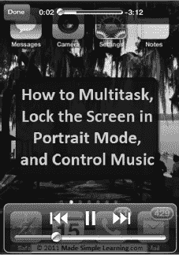

2.  观看完视频后，轻点屏幕以调出播放器控制选项。
3.  轻点左上角的**完成**按钮以返回电子邮件。

    **注意：** 此截图来自本书作者之一 Martin Trautschold 的视频教程，该教程向您展示如何使用 iPod touch。请访问 Martin 的网站 [`www.madesimplelearning.com`](http://www.madesimplelearning.com) 查看一些免费的示例教程。

### 打开并查看压缩的 .zip 文件

除非您安装了诸如 **GoodReader** 之类的应用程序，否则您的 iPod touch 将无法打开并查看 `.zip` 格式的压缩文件。在本书出版时，**GoodReader** 仍然是一个免费的应用程序，非常值得安装。

**提示：** 了解如何在第 13 章：“报摊和更多”中安装和使用 **GoodReader**。

请按照以下步骤在程序中打开 `.zip` 文件：

1.  从 App Store 安装免费的 **GoodReader** 应用。
2.  打开包含 `.zip` 文件附件的电子邮件。
3.  长按 `.zip` 附件，直到底部出现一个包含按钮的弹出窗口，按钮上显示：**“在‘GoodReader’中打开”**。轻点该按钮即可在 **GoodReader** 中打开 `.zip` 文件。

    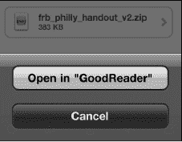

4.  **GoodReader** 现在应该会打开，您的 `.zip` 文件应位于文件列表的顶部。要打开或解压缩 `.zip` 文件，请轻点它并选择**解压缩**按钮。

    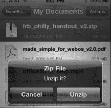

5.  现在您应该会看到解压缩后的文件——在本例中，是在文件列表中位于 `.zip` 文件之上的 Adobe `.pdf` 文件。

    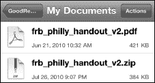

6.  轻点该解压缩后的文件即可查看。
7.  阅读完附件后，双击**主屏幕**按钮并轻点**邮件**图标以返回阅读电子邮件。

#### 支持的电子邮件附件类型

您的 iPod touch 支持将以下文件类型作为附件：

*   `.doc` 和 `.docx`（**Microsoft Word** 文档）
*   `.htm` 和 `.html`（网页）
*   `.key`（**Keynote** 演示文稿文档）
*   `.numbers`（**Apple Numbers** 电子表格文档）
*   `.pages`（**Apple Pages** 文档）
*   `.pdf`（Adobe 的便携式文档格式，由 **Adobe Acrobat** 和 **Adobe Reader** 等程序使用）
*   `.ppt` 和 `.pptx`（**Microsoft PowerPoint** 演示文稿文档）
*   `.txt`（文本文件）
*   `.vcf`（联系人文件）
*   `.xls` 和 `.xlsx`（**Microsoft Excel** 电子表格文档）
*   `.mp3` 和 `.mov`（音频和视频格式）
*   `.zip`（压缩文件）：只有安装了能够读取它们的应用程序（例如 **GoodReader**）才可阅读——请参阅本章前面的“打开并查看压缩的 .zip 文件”部分。

### 回复、转发或删除邮件

在您阅读电子邮件的窗格底部有一个工具栏。

通过此工具栏，您可以将邮件移动到不同的邮箱或文件夹；删除邮件；或者回复、全部回复或转发邮件。

轻点小**箭头**图标  即可看到这些选项按钮出现：**回复**、**全部回复**和**转发**。

**注意：** 只有当收件人不止一位时，**全部回复**按钮才会出现。

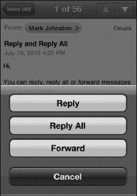

#### 回复电子邮件

您可能会最频繁地使用**回复**命令。请按照以下步骤在 iPod touch 上回复电子邮件：

1.  轻点**回复**按钮。

    您会看到原始发件人现在被列为邮件的收件人，出现在邮件的**收件人：**行中。主题将自动显示为：“Re: *(原始主题行)*”

    

2.  输入您的回复内容。
3.  完成后，只需轻点屏幕右上角的蓝色**发送**按钮。

#### 使用“全部回复”

使用**全部回复**选项与使用**回复**功能类似，不同之处在于邮件的所有原始收件人和原始发件人都会被填入地址行。原始发件人将在**收件人：**行，而原始邮件的所有其他收件人将列在**抄送：**行。只有在原始邮件的收件人不止一位时，您才会看到**全部回复**选项。

**注意：** 使用**全部回复**时请务必小心。如果某些收件人因超出屏幕边缘而未在原始邮件中显示，这可能会很危险。如果您使用了**全部回复**，请务必检查**收件人：**和**抄送：**列表，确保每个人都应该收到您的回复。

#### 使用转发按钮

有时，您会收到一封想要转发给他人的电子邮件。**转发**命令允许您这样做（有关处理附件的更多信息，请参阅本章中的“电子邮件附件”部分）。

**注意：** 您需要转发附件才能将其发送给他人。如果您想将收到的邮件中的附件发送给其他人，您必须选择**转发**选项。（请注意，选择**回复**和**全部回复**选项不会在您发出的邮件中包含原始电子邮件附件。）

当您轻点**转发**按钮时，可能会提示您决定是否**包含或不包含**原始邮件中的附件。

此时，您按照之前描述的相同步骤来输入您的消息、添加收件人并发送它。

### 清理和整理收件箱

当你越来越习惯将 iPod touch 用作电子邮件设备时，你会发现自己使用`Mail`程序的频率越来越高。偶尔进行一次邮件整理将变得十分必要。在 iPod touch 上，你可以轻松地删除或移动电子邮件。

#### 删除单封邮件

要从收件箱中删除单封邮件，请按照以下步骤操作：

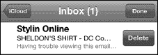

1. 在收件箱中向右或向左滑动邮件，调出`删除`按钮。
2. 轻点`删除`即可移除该邮件。

#### 删除、移动或标记多封邮件

我们已在本章前面的“移动、删除或标记（旗标）多封邮件”部分介绍了操作方法。

#### 在邮件查看界面删除

`邮件`查看界面提供了另一种删除邮件的方式。打开任意邮件进行阅读，然后轻点屏幕底部中间的`垃圾桶`图标 。你会看到邮件缩小并飞入`垃圾桶`，从而被删除。

**提示：** 你可以使用`设置`应用，让 iPod touch 在删除邮件前进行确认。操作方法是：轻点`邮件、通讯录、日历`，然后将`删除前确认`旁边的开关设置为`好`。

你可以将邮件移至其他文件夹来进行整理。将邮件移出收件箱后，可以留作存档，或稍后阅读。

**注：** 如果你使用的是 iCloud 或其他支持的邮件服务器，你可以直接在设备上创建、重命名或删除邮件文件夹，详见本章前面的“添加或编辑邮件文件夹或邮箱”部分。如果该方法无效，则需要在你的主邮件账户中设置这些文件夹，然后同步到 iPod touch。我们将在本章的“微调电子邮件设置”部分展示具体操作方法。

#### 阅读时将邮件移至文件夹

有时，你可能想整理邮件以便日后轻松检索。例如，你可能收到一封关于即将出行的邮件，并希望将其移至“旅行”文件夹。有时，你会收到需要稍后处理的邮件，此时可将其移至“需要关注”文件夹。这有助于提醒你稍后处理这些邮件。

请按照以下步骤移动邮件：

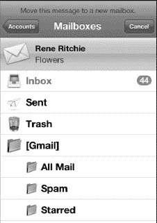

1. 打开该邮件。
2. 轻点右上角的`移动`图标。
3. 选择一个新文件夹，邮件将移出当前收件箱。

### 从邮件中复制和粘贴

以下是从邮件中选中文本或图片并进行复制的一些技巧：

- 双击文本选中一个单词，然后上下拖动蓝色手柄调整选区。接着，选择`拷贝`。

  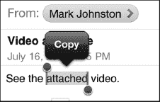

- 长按文本，然后选择`选择`或`全选`。

  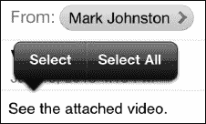

- 长按图片，然后选择`存储图像`或`拷贝`。

  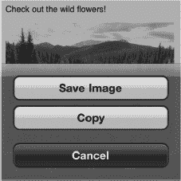

如需更完整的说明，请查阅第 2 章：“键入、复制和搜索”中的“复制和粘贴”部分。

### 搜索电子邮件

iPod touch 内置了强大的搜索功能，可帮助你查找邮件。你可以通过`发件人`、`收件人`、`主题`或`所有`字段来搜索收件箱。这有助于你筛选收件箱，从而精确找到所需内容。

#### 激活邮件搜索

发起邮件搜索很简单。首先，导航至待搜索账户的`收件箱`。如果向上滚动到顶部，你会看到熟悉的`搜索`栏出现在`收件箱`顶部。

如果你的电子邮件账户支持此功能，你还可以在服务器上搜索邮件。截至撰写本文时，受支持的搜索型电子邮件账户包括`Exchange`、iCloud（原称`MobileMe`）和`Gmail IMAP`。请按照以下步骤在服务器上搜索邮件：

1. 轻点`搜索`栏，即可看到`搜索`栏下方出现一排新的软键菜单。

   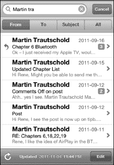

2. 输入要搜索的文本。
3. 轻点搜索窗口下方的某个标签：
   1. `发件人`：仅搜索发件人的电子邮件地址。
   2. `收件人`：仅搜索收件人的电子邮件地址。
   3. `主题`：仅搜索邮件的`主题`字段。
   4. `所有`：搜索邮件的所有部分。

例如，假设我们想搜索收件箱中来自“Martin”的邮件。我们可以在`搜索`框中输入 Martin 的名字，然后轻点`发件人`。收件箱随后会被筛选，仅显示来自 Martin 的邮件。

### 微调电子邮件设置

你可以通过`设置`应用中的众多选项来微调 iPod touch 上的电子邮件账户。请按照以下步骤更改这些设置：轻点`设置`图标，然后轻点`邮件、通讯录、日历`。以下各部分将说明可进行的调整。

#### 自动检索电子邮件（获取新数据）

除了`高级`下的选项外，你还可以使用`邮件`设置来配置 iPod touch 获取（或拉取）邮件的频率。默认情况下，当数据从服务器“推送”时，iPod touch 会自动接收邮件或其他通讯录或日历更新。

你可以通过以下步骤调整此设置：

1. 轻点`设置`应用。
2. 轻点`邮件、通讯录、日历`。
3. 在列出的电子邮件账户下方，轻点`获取新数据`。

   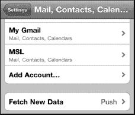

4. 将`推送`设为`打开`（默认）以自动让服务器推送数据。将其设为`关闭`以节省电池续航。

   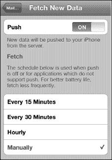

5. 调整定时计划以从服务器拉取数据。这设置了应用从服务器拉取新数据的频率。

   **注：** 如果你将此选项设为`每 15 分钟`，你会收到更频繁的更新；但与设为`每小时`或`手动`相比，会牺牲电池续航。

如果你只想打开 iPod touch 就能看到有邮件，自动检索功能非常方便；否则，你需要记得手动检查。

##### 高级推送选项

在`获取新数据`屏幕底部，`每小时`和`手动`设置下方，你可以轻点`高级`按钮，查看列出所有邮件账户的新屏幕。

轻点任意邮件账户以调整其设置。

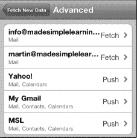

大多数账户可以按你设定的计划进行`获取`，或设为`手动`。`手动`选项要求你使用`更新`按钮来检索数据。此屏幕让你能够为你设置的每个账户调整`获取`、`手动`，甚至`推送`设置。

### 调整你的邮件设置

在**帐户**部分下，你可以看到**邮件**中列出的所有电子邮件设置。**默认**设置可能对你来说已经足够；但如果需要调整其中任何一项，可以按照以下步骤操作：

**显示**：这用于设置从服务器拉取多少封邮件。你可以指定 50 到 1,000 条消息之间的任意数量（默认为最近的 50 条消息）。

**预览**：此选项让你设置在收件箱**预览**中，除了**主题**之外，还显示多少行文本。你可以将此值从**无**调整为**5 行**（默认为**2 行**）。

**最小字体大小**：这是首次打开邮件时显示的默认字体大小。它也是你查看邮件时允许缩小的最小字体大小。可选选项为**小**、**中**、**大**、**特大**和**巨大**（默认为**中**）。

**提示：** 你可以在设置的“辅助功能”区域中进一步扩大字体大小。详情请查看第 2 章：“打字、复制与搜索”。

**显示“收件人”/“抄送”标签**：当此选项**开启**时，你会在收件箱的主题前看到一个小小的**收件人**或**抄送**标签。该标签显示你的地址被放置在了哪个字段中（此选项的默认状态为**关闭**）。

**删除前询问**：将此选项**开启**后，每次尝试删除邮件时都会进行询问（默认为**关闭**）。

**加载远程图像**：此选项允许你的 iPod touch 加载某些邮件中嵌入的所有图形（远程图像）（此选项的默认值为**开启**）。

**按主题整理**：此选项将相关的邮件分组在一起。它只显示一条消息，旁边带有一个数字。该数字表示存在多少封相关邮件。此功能让你可以很好地将所有讨论集中在一个地方（此选项的默认值为**开启**）。

**始终密送给自己**：此选项会将你从 iPod touch 发送的每封电子邮件以密送副本（**Bcc:**）的形式发送到你的电子邮件帐户（此选项的默认值为**关闭**）。

#### 更改你的电子邮件签名

默认情况下，你发送的邮件会显示“发自我的 iPod touch”。请按照以下步骤更改邮件的**签名**行：

1.  点击**签名**选项卡，然后输入你希望在从 iPod touch 发出的邮件底部显示的新邮件签名。

    

2.  编辑完**签名**字段后，点击左上角的**邮件、通讯录…**按钮。这将返回到**邮件**设置屏幕。

#### 更改你的默认发件帐户

如果你在 iPod touch 上设置了多个电子邮件帐户，应将其中的一个（通常是你最常用的那个）设置为**默认帐户**。当你从**邮件**屏幕选择**写新邮件**时，总是会默认选中该帐户。请按照以下步骤更改默认发送邮件的帐户：

1.  点击**默认帐户**选项，你将看到所有电子邮件帐户的列表。

    

2.  点击你希望用作**默认帐户**的电子邮件帐户。
3.  完成后，点击**邮件、通讯录…**按钮返回到**邮件**设置菜单。

#### 开关收发邮件的提示音

你可能每次发送或接收邮件时都会注意到一点音效。你听到的是 iPod touch 上的默认设置。

如果你想禁用它或更改它，可以在**设置**程序中执行此操作：

1.  点击你的**设置**图标。
2.  点击**声音**。
3.  你将看到各种用于打开或关闭音效的开关。点击**新邮件**和**已发送邮件**来选择你的邮件铃声选项。

### 高级邮件选项

**注意：** 设置为 Exchange、IMAP 或 iCloud 的电子邮件帐户不会显示此**高级**邮件设置屏幕。这仅适用于 POP3 电子邮件帐户。

要访问每个电子邮件帐户的**高级**选项，请按照以下步骤操作：

1.  点击**设置**图标。
2.  点击**邮件、通讯录、日历**。
3.  点击**帐户**下列出的一个电子邮件地址。
4.  在邮件设置弹出窗口的底部，点击**高级**按钮以调出**高级**对话框。

    

#### 删除后从 iPod touch 上移除邮件

你可以选择邮件被删除后，从你的 iPod touch 上完全移除的频率。

点击**移除**选项卡，选择最适合你的选项；默认设置为**永不**。

#### 使用 SSL 和身份验证

SSL 和身份验证功能之前已经讨论过；不过，此屏幕为你提供了另一个位置，以便针对特定电子邮件帐户访问这些功能。

#### 从服务器删除

你可以配置 iPod touch 来处理从邮件服务器删除邮件的操作。通常，此设置保留为**永不**，此功能由你的主计算机处理。但是，如果你将 iPod touch 用作主要的电子邮件设备，则可能希望直接从 iPod touch 上处理该功能。请按照以下步骤从你的 iPod touch 上删除服务器上的已删除邮件。

1.  点击**从服务器删除**选项卡，选择最适合你需求的功能：**永不**、**七天后**或**从收件箱移除时**。

    

2.  默认设置为**永不**。如果你想选择**七天后**；该选项应能给你足够的时间在电脑以及 iPod touch 上检查邮件，然后决定保留什么和删除什么。

#### 更改接收服务器端口

正如你之前对**发送服务器端口**所做的操作一样，如果你在接收邮件时遇到问题，可以更改**接收服务器端口**。你的问题与接收邮件的端口相关的情况非常罕见；因此，你很少需要更改此数字。如果你的电子邮件服务提供商给了你一个不同的号码，只需点击数字并输入新的端口。**接收服务器端口**的值通常是**995**、**993**或**110**；不过，端口值也可能是其他数字。

### 解决电子邮件问题

通常，你的电子邮件在 iPod touch 上能完美运行。然而，有时你的电子邮件可能不像你期望的那样完美无缺。这可能是由于服务器问题、网络连接问题或电子邮件服务提供商的要求未得到满足造成的。

大多数情况下，只需要调整一个简单的设置或重新输入密码即可。

如果你尝试了下面的一些故障排除提示，但您的电子邮件仍然无法正常工作，那么你的邮件服务器可能只是暂时宕机。请与你的电子邮件服务提供商核实，确保你的邮件服务器已启动并运行；你也可以检查你的提供商是否进行了任何会影响你设置的最新更改。

**提示：** 如果以下提示无法解决问题，请查看第 25 章：“故障排除”以获取更多有用的提示和资源。

#### 无法接收或发送电子邮件

如果你无法发送或接收电子邮件，第一步应确认你已连接到互联网。可通过查看`Home`屏幕左上角的网络连接图标来检查（详见第 4 章：“连接网络”）。

有时，你需要调整外发端口才能正常发送邮件。请按以下步骤操作：

1.  轻点`设置`。
2.  轻触`邮件、通讯录、日历`。
3.  在`账户`下，轻触你遇到发送问题的电子邮件账户。
4.  轻触`SMTP`并验证你的外发邮件服务器设置是否正确；同时检查是否已设为`ON`。
5.  轻触顶部的`外发邮件服务器`并验证所有设置，例如`主机名`、`用户名`、`密码`、`SSL`、`身份验证`和`服务器端口`。你也可以尝试将`服务器端口`值设为`587`、`995`或`110`；有时这能解决问题。
6.  点击`完成`，然后轻点左上角的电子邮件账户名称，返回此账户的`电子邮件`设置界面。
7.  向下滚动到底部，轻触`高级`。
8.  你还可以在此界面尝试为服务器端口设置不同的端口，如`587`、`995`或`110`。如果这些值都不起作用，请联系你的电子邮件服务提供商以获取其他端口号并验证你的设置。

