# 第 17 章

## 通讯录与备忘录

你的 iPod touch 让您可以即时访问所有重要信息。就像你的电脑一样，你的 iPod touch 可以存储数千个联系人以便轻松检索。在本章中，我们将向你展示如何添加新联系人、通过添加新字段来自定义联系人、使用群组组织联系人、快速搜索或浏览联系人，甚至可以使用 iPod touch 的`地图`应用查看联系人的位置。我们还将向你展示如何自定义`通讯录`视图，使其按照你喜欢的方式排序和显示。最后，我们将介绍一些故障排除技巧，在你遇到困难时能为你节省时间。

我们还将为你概述`备忘录`应用，你可以用它来写笔记、制作购物清单，以及列出你想看的电影或想读的书籍。我们将向你展示如何整理备忘录以及通过电子邮件将其发送给自己或他人。理想情况下，我们希望`备忘录`在 iPod touch 上使用起来如此便捷，以至于你最终可以摆脱大部分（即使不是全部）纸质便签！

同样很棒的是，你可以使用 iCloud 无线同步、共享和备份你的通讯录和备忘录。因此，你永远不必担心丢失重要信息，或担心你的设备或电脑上没有最新信息。

### 将通讯录载入 iPod touch

第 3 章：“与 iCloud、iTunes 等同步”介绍了如何使用 Mac 或 Windows 电脑上的`iTunes`应用将通讯录载入 iPod touch。你也可以使用 Google Sync 或 iCloud 服务将通讯录载入 iPod touch。

**提示：** 你可以从收到的电子邮件中添加新的联系人条目。了解操作方法请参阅第 16 章：“使用电子邮件通信。”

### 通讯录列表何时最有帮助？

当满足以下两个条件时，`通讯录`应用最为有用：

1.  其中包含大量姓名和地址。
2.  你可以轻松找到所需内容。

#### 改进你的通讯录列表

我们有一些基本规则，可以帮助你让 iPod touch 上的通讯录列表更有用：

**规则 1：向通讯录中添加所有内容。**

> 你永远不知道何时会需要那个不起眼的餐厅名称、水管工的电话号码，等等。

**规则 2：添加条目时，确保考虑将来如何找到它们（名字、姓氏、公司）。**

> 我们在本章中提供了许多提示和技巧来帮助你输入姓名，以便你在需要时能立刻找到它们。

**提示：** 这里有一个找到餐厅的好方法。每当你将一家餐厅输入通讯录时，务必在“公司名称”字段中输入“餐厅”一词，即使它并非餐厅名称的一部分。当你输入字母“rest”时，你应该就能立刻找到你所有的餐厅！

### 在 iPod touch 上添加新联系人

你可以随时直接在 iPod touch 上添加联系人。当你远离电脑——但随身带着 iPod touch——又需要将某人添加到通讯录时，这非常方便。操作非常简单；下一节将向你展示具体方法。

#### 启动通讯录应用

在`Home`屏幕上，轻点`通讯录`图标，你将看到`所有联系人`列表。轻点右上角的`加号`按钮 (`+`) 以添加新联系人，如图 17-1 所示。

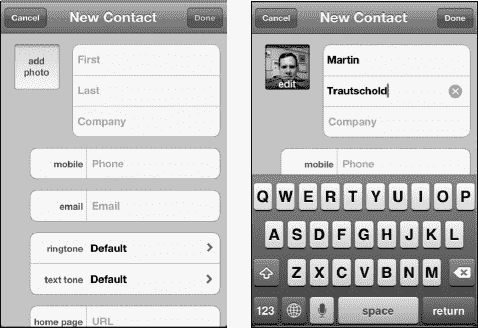

**图 17-1.** *输入新联系人姓名*

轻点每个字段以输入新联系人的名字、姓氏和公司名称。

**提示：** 请记住，通讯录搜索功能使用名字、姓氏和公司名称。当你添加或编辑联系人时，在公司名称中添加一个特殊词语可以帮助你稍后找到特定联系人。例如，在`公司`字段中添加“西西朋友”这几个字，可以帮助你使用搜索功能快速找到西西的所有朋友。

在`姓名`按钮下方是`手机`、`电子邮件`、`铃声`、`短信铃声`、`主页`、`添加新地址`和`添加字段`的字段。在下面，你可以关联多个联系人。

#### 添加新电话号码

轻点`电话`按钮，并使用`数字`键盘输入电话号码。

**提示：** 不必担心括号、连字符或句点——iPod touch 会自动将号码调整为正确格式。只需输入区号和号码的数字即可。如果你知道国家代码，也最好一并输入。

接下来，选择此电话号码的类型——手机、住宅、工作或其他。有九个字段可供选择，如果你发现内置字段都不适用，还有一个`自定义`字段。

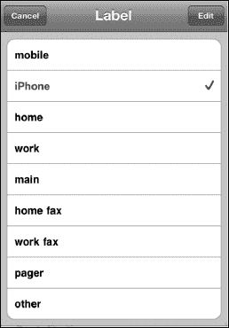

#### 添加电子邮件地址

轻触`电子邮件`标签，然后输入联系人的电子邮件地址。你也可以轻触电子邮件地址左侧的标签，选择这是住宅、工作还是其他电子邮件地址。

添加一个地址后，你会看到出现另一个字段，用于添加更多电子邮件地址。

#### 自定义铃声或短信铃声

轻触`铃声`或`短信铃声`标签，为`FaceTime`来电或此人发送短信时选择自定义铃声或短信铃声。

#### 输入网站地址

你还会看到一个`主页`字段，你可以在其中输入联系人网站的地址，甚至可以输入多个网站地址。

**注意：** 如果你使用 iCloud 同步通讯录，iCloud 可能会自动搜索 Facebook 主页并将其整合到联系人信息中。

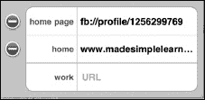

#### 添加街道地址

在`主页`字段下方是用于添加地址的字段。输入`街道`、`城市`、`省/州`和`邮政编码`。你还可以指定`国家/地区`以及这是住宅还是工作地址。

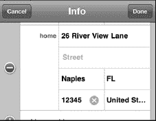

#### 添加新字段

轻点**添加字段**标签，然后选择任意建议的字段，即可将其添加至该特定联系人（参见图 17-2）。

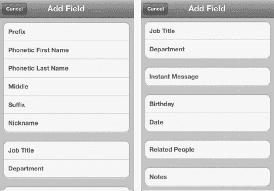

**图 17-2.** *可添加到联系人条目中的新字段*

当您轻点**生日**时，会看到一个滚轮。您可以通过转动滚轮选择对应日期，将生日添加到联系人信息中。

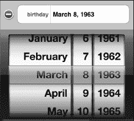

操作完成后，只需轻点**新建联系人**表单右上角的**完成**按钮即可。

**提示：** 假设您在公交车站遇到了一位想要记住的人。当然，您应该输入这位新朋友的名和姓（如果您知道的话）；不过，您还应在**公司**字段中输入“公交车站”这几个字。这样一来，当您输入字母“bus”或“stop”时，就能立刻找到所有在公交车站结识的人，即使您记不住他们的名字也没关系！

### 向联系人添加照片

您可能希望为联系人关联一张照片。在我们之前操作的**新建联系人**屏幕中，只需轻点**姓氏**标签旁边的**添加照片**按钮。

如果您在“编辑联系人”模式下更换照片，则会在现有照片底部看到**编辑**选项。

轻点**添加照片**按钮后，您将看到可以进行以下操作：

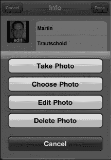

*   拍照
*   选取照片

如果已有照片，您还可以进行以下操作：

*   编辑照片
*   删除照片

若要选取现有照片，请选择照片所在的相册，并轻点对应的标签。当您看到想要使用的照片时，只需轻点它即可。

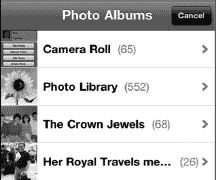

您会注意到照片的顶部和底部会变成灰色，并且您可以对照片进行移动、捏合缩放操作，然后在**图片**窗口中调整其位置。

当照片调整到您想要的位置后，只需轻点右下角的**选取**按钮，该照片便会设定为该联系人的头像。

**提示：** 如果您刚搬到一个新社区，记住每个人的名字可能会令人相当头疼。因此，一个好的做法是，为您遇到的每一位邻居在**公司**字段中添加“邻居”这个词。要快速调出所有邻居，只需输入字母“neig”就能找到所有您认识的人！

### 搜索联系人

假设您需要查找某个特定的电话号码或电子邮件地址。只需像之前一样轻点您的**通讯录**图标，您就会在**所有联系人**列表的顶部看到一个**搜索**框（参见图 17-3）。

**提示：** 如果您当前处于**通讯录**列表的中部或底部，可以通过轻点 iPod touch 顶部的时钟，快速跳转到**通讯录**屏幕顶部并看到这个**搜索**窗口。

**图 17-3.** *通讯录**搜索**框*

要查找联系人，请在以下三个可搜索字段中输入前几个字母：

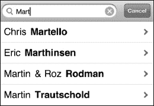

*   名字
*   姓氏
*   昵称
*   公司名称

iPod touch 会立即开始过滤，仅显示与所输入字母匹配的联系人。

**提示：** 若要进一步缩小搜索范围，请按**空格**键并再输入几个字母。

当您看到正确的姓名时，只需轻点它，该联系人的信息便会显示出来。

#### 通过触摸并滑动字母表快速跳转至某个字母

如果您将手指放在屏幕左侧边缘的字母表上，并向上或向下拖动，即可跳转到相应字母。

#### 通过滑动搜索

如果您不想手动输入字母，只需移动手指并从底部向上滑动，您就会看到联系人列表在屏幕上快速滚动。继续滑动或滚动，直到看到您想要的姓名。轻点一个姓名，该联系人的信息便会显示。

#### 使用群组搜索

如果您在 PC 或 Mac 上按群组整理了联系人，并通过电脑同步或使用 iCloud 通过无线方式同步了 iPod touch，那么这些群组将同步到您的 iPod touch 上。当您启动**通讯录**应用时，您会看到顶部的**群组**。在**群组**标题下，您会看到**所有联系人**。

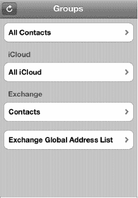

选择**所有联系人**即可搜索 iPod touch 上所有可用的联系人信息。

如果您同步了多个帐户，您将看到每个单独帐户的标签，以及顶部的**所有联系人**标签。

此示例显示两个群组——一个来自 Microsoft Exchange 帐户（即公司电子邮件帐户），另一个来自一组 iCloud 联系人。

如果您拥有 Exchange ActiveSync 帐户并且您的公司已启用该功能，您的 Exchange 全局地址列表也会显示在此处（位于“群组”下）。您可以在这里搜索找到公司里的任何人。

**注意：** 您无法在 iPod touch 的**通讯录**应用中创建群组——它们必须在您的电脑上创建，或者在您向 iPod touch 添加联系人帐户时同步。

### 通过电子邮件添加联系人

你经常会在收到某封电子邮件时发现，发件人并未保存在你的通讯录中。不过，通过邮件添加新联系人其实很简单。

打开你想将其添加至`通讯录`列表的发件人所发的邮件。接着，在邮件的`发件人`字段中，只需轻点`发件人：`标签旁的发件人姓名即可。

如果发件人不在你的通讯录中，系统将进入一个界面，让你选择将该电子邮箱地址添加到现有联系人，还是创建新联系人。

如果你选择`创建新联系人`，系统将进入我们之前见到过的`新建联系人`界面（参考图 17-1）。

但假设这是某人的个人电子邮箱地址，而你已经有一个包含其工作邮箱地址的条目。在这种情况下，你应该选择`添加到现有联系人`，然后找到正确的人。接着，你可以为这个电子邮箱地址设置一个新标签——在本例中，设为`个人`。

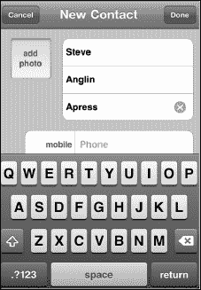

#### 将联系人关联到其他应用

你可能会在 iPod touch 上的另一个应用中存有某封邮件发件人的联系信息。iPod touch 可以轻松地将这些联系人信息关联起来。

例如，假设这封邮件的发件人 Steve 在你的 LinkedIn 联系人列表中，但不知为何不是你 iPod touch 上的联系人。以下是将他与你 iPod touch 中的联系人信息关联起来的步骤：

1.  按照前述方法，将他添加到你的通讯录中。
2.  启动`LinkedIn`应用——有关此主题的更多信息，请参阅第 24 章：“社交网络”。
3.  找到 Steve 的联系信息，确认他确实在你的`LinkedIn`应用中。
4.  点击`连接`图标。
5.  选择右上角的`下载全部`。
6.  `LinkedIn`应用会提示你，此操作将添加与此联系人关联的照片、当前公司和职位、电子邮箱地址以及网站（参见图 17-4）。
7.  这正是你希望在 iPod touch 通讯录中实现的效果，因此选择`下载所有新连接`。
8.  Steve 的照片和更新后的信息随后会被导入到你的 iPod touch 通讯录中。

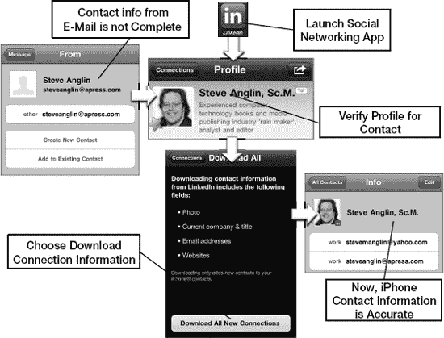

**图 17-4.** *将邮件中的新联系人关联到现有的社交网络联系人*

**提示：** 记住学龄儿童朋友的父母姓名可能相当有挑战性。不过，在`名`字段中，你不仅可以添加孩子朋友的名字，还可以加上其父母的名字（例如，`名：Samantha (妈妈：Susan，爸爸：Ron)`）。接着，在`公司`字段中，填入你孩子的名字和“学校同学”字样（例如，`Cece 学校同学`）。这样，只需在`所有通讯录`列表的`搜索`框中输入你孩子的名字，就能立刻找到你在孩子学校遇到过的所有人。现在，你可以毫不迟疑地说：“你好，Susan，很高兴再次见到你！”*努力做到不露声色地查看对方的名字吧。*

### 向联系人发送图片

如果你想向联系人发送图片，则需要通过`照片`应用进行操作（参见第 19 章：“处理照片”）。

### 从通讯录发送电子邮件

许多核心应用（例如`通讯录`、`邮件`和`信息`）都是完全集成的，因此一个应用可以轻松触发另一个应用。如果你想给通讯录中的某个联系人发送电子邮件，只需打开该联系人并点击其电子邮箱地址。`邮件`应用将会启动，你就可以撰写并发送邮件给此人了。

点击`通讯录`图标启动`通讯录`应用。通过搜索或滑动浏览你的联系人列表，直到找到你需要的联系人。

在联系人信息中，点击你想使用的联系人的电子邮箱地址。

你会看到`邮件`程序会自动启动，并在邮件的`收件人：`字段中填入联系人的姓名。最后，输入内容并发送邮件。

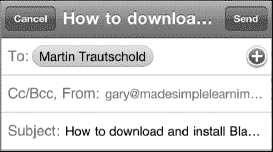

### 在地图上显示联系人的地址

iPod touch 的一大亮点是与谷歌地图的集成。这在`通讯录`应用中体现得非常明显。假设你想在地图上标出通讯录中某个联系人的家庭或工作地址。在过去（iPod touch 问世前），你得用 Google、MapQuest 或其他程序，然后费力地重新输入或复制粘贴地址信息。这非常耗时——但在 iPod touch 上，你完全不用这么做。

只需像之前那样打开该联系人。这次，点击联系人信息底部的地址即可。

你的`地图`应用（由谷歌地图提供支持）会立即加载，并在联系人的确切位置放置一个`图钉`图标。联系人的姓名会显示在`图钉`上方。

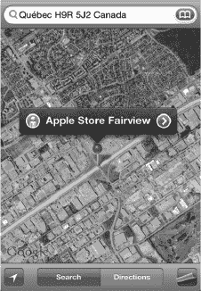

点击`图钉`顶部的标签，即可进入`信息`界面。

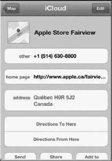

现在你可以选择`路线到此处`或`路线从此处出发`。

接着，输入正确的起点或终点地址，然后点击右下角的`路线`按钮。如果你决定不查看路线，只需点击左上角的`清除`按钮即可。

如果你不是从联系人列表点击，而是直接在`地图`应用中输入了地址，那该怎么办？在这种情况下，你可能想要点击`添加到通讯录`来保存这个地址。

**提示：** 要返回联系人信息，请点击`地图`按钮，退出`地图`，然后启动`通讯录`。你也可以使用多任务功能（参见第 7 章：“多任务处理”），方法是双击`主屏幕`按钮，然后选择`通讯录`应用。

### 更改联系人的排序与显示顺序

与其他设置一样，`通讯录`应用的选项可以通过`设置`图标进行访问。

点击`设置`图标，向下滚动到`邮件、通讯录、日历`，然后点击该标签。

接下来，向下滚动直到看到`通讯录`及其下方的两个选项。要更改排序顺序，请点击`排序顺序`标签，然后选择是按名字还是按姓氏对联系人进行排序。

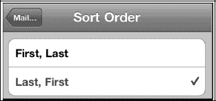

你可能还想更改联系人的显示方式。这里可以完成设置；你可以选择`名, 姓`或`姓, 名`。点击`显示顺序`标签，选择你希望联系人按名字还是姓氏顺序显示。点击左上角的`邮件、通讯录…`按钮以保存你的设置更改。

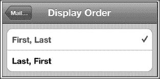

#### 搜索全局地址列表联系人

如果你配置了 Exchange 帐户，应该会有一个全局地址列表的选项。这样，当你连接到所在组织的服务器时，就可以访问你的全局地址列表。

打开你的`通讯录`应用，在 Exchange 下查找名为`Exchange 全局地址列表`的标签。

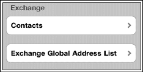

### 通讯录故障排除

有时，你的`通讯录`应用可能无法按预期工作。（如果你没有看到所有联系人，请回顾第 3 章：“与 iCloud、iTunes 及更多同步”中的步骤，了解如何与你的通讯录应用程序同步。）请确保在`iTunes`应用的设置中选择了`所有群组`。

**提示：** 如果你正在与另一个联系人应用（例如 Gmail 中的`通讯录`）同步，请确保选择最接近`所有联系人`的选项，而不是像特定群组这样的子集。

#### 当全局地址列表中的联系人未显示时（适用于 Microsoft Exchange 用户）

有时，全局地址列表中的联系人可能不会显示在您的 iPod touch 上。如果出现这种情况，请首先确保您已连接到 Wi-Fi 或 3G 蜂窝数据网络。

接下来，检查您的 Exchange 设置，并确认您拥有正确的服务器和登录信息。为此，请轻点**设置**按钮，然后滚动并轻点**邮件、通讯录和日历**。在列表中找到您的 Exchange 帐户并轻点它以查看设置。您可能需要联系您所在机构的技术支持，以确保您的 Exchange 设置正确。

##### 备忘录应用

如果您和许多人一样，书桌上会堆满黄色的小便条——提醒自己做各种事情的便条。即使有了电脑，我们依然会留下这些小纸条作为备忘。iPod touch 的一大优点在于，您可以在熟悉的黄色便条纸上写下笔记，然后整齐有序地整理它们。您甚至可以通过电子邮件将其发送给自己或他人，以确保信息不被遗忘。您还可以使用 iTunes 备份您的备忘录，如果愿意，还可以将备忘录同步到您的电脑或其他网站（如 Google）。

**提示：** iPod touch 自带的**备忘录**应用非常基础且实用。如果您需要一个功能更强大的备忘录应用，能够对项目进行排序、分类、导入（PDF、Word 等）、支持文件夹、搜索等功能，您应该查看 iPod touch 上的 App Store。搜索 `notes`，您会发现至少十几款与笔记相关的应用，价格从免费到 0.99 美元及以上不等。

iPod touch 上的**备忘录**应用为您提供了一个便捷的场所来保存笔记和简单的 `to-do` 列表。您也可以保存简单的列表，例如购物清单，或用于其他商店（如五金店或宠物店）的清单。如果您随身携带 iPod touch，一旦想到要添加项目，就可以立即加入这些列表，并且可以随时访问和编辑它们。

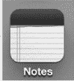

#### 同步备忘录

您可以使用我们在第 3 章中展示的方法，在 iPod touch 和 iPad 等 iOS 设备之间，或与您的电脑或其他网站同步备忘录：`通过 iCloud、iTunes 等方式同步。` 同步备忘录的好处在于，您可以在电脑上添加一条备忘录，它就会自动`出现`在您的 iPod touch 上。然后当您外出时，您可以编辑该备忘录，并将其同步回您的电脑。无需重新输入或记忆任何内容。您总是随身携带 iPod touch，因此随时随地记笔记是永不忘记重要事项的好方法。

#### 开始使用备忘录

与所有其他应用一样，只需轻点**备忘录**图标即可启动它。启动**备忘录**应用后，您会看到一个典型的黄色记事本。

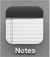

##### 多个备忘录帐户

如果您恰好通过 iCloud、Exchange 或至少一个 IMAP 电子邮件帐户以及您的电脑（使用 iTunes）进行同步，那么您会看到来自每个帐户的备忘录是分开保存的。这很像您的联系人按电子邮件帐户分组，以及您的日历按电子邮件帐户分开存放的方式。

为了查看多个备忘录帐户，您需要在帐户设置屏幕中设置一个开关。

当您设置 IMAP 电子邮件帐户时，在**设置**  **邮件、通讯录、日历**中，您将看到打开或关闭备忘录同步的选项。为了查看这些备忘录帐户，您需要将**备忘录**开关设置为**打开**，如下方这个 Gmail 帐户所示。

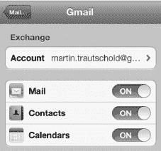

要查看不同的备忘录帐户，请轻点**备忘录**应用左上角的**帐户**按钮。

然后，在下一个屏幕上，您可以轻点选项来查看**所有备忘录**，或者查看每个帐户的备忘录。在此图片中，Gmail 或 MobileMe 帐户是可选项。

您添加到某个特定帐户的备忘录将保存在该帐户中。例如，如果您将备忘录添加到 Gmail，则这些备忘录将仅显示在您的 Gmail 帐户中。

#### 我的备忘录是如何排序的？

您可以看到所有备忘录都按时间倒序排列，最近编辑的备忘录排在最上面，最旧的排在底部。

显示的是该特定备忘录最后一次编辑的日期和时间，而不是首次创建的日期。因此，您会注意到备忘录的顺序在屏幕上会有所变化。

这种排序可能是一个优点，因为您最近（或经常编辑）的备忘录会正好排在顶部。

**提示：** 如果您想跟踪您的 `to-do` 列表，可以使用 iPod touch 上内置的提醒事项应用。如果您需要更强大的功能，请在 App Store 中查看 **Things**、**Appigo Todo** 或 **OmniFocus**。

#### 添加新备忘录

要开始一条新备忘录，请轻点右上角的加号 。

记事本为空白，键盘会弹出供您开始输入。

**提示：** 您可以将 iPod touch 横向放置，以查看更宽的横向键盘。

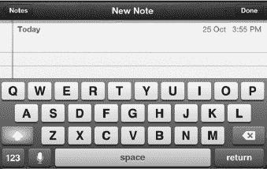

#### 为备忘录添加标题

在您按下**换行**键之前键入的前几个单词将成为备忘录的标题。因此，请思考您想要什么标题，并首先输入。在显示的图片中，**购物清单**成为了备忘录的标题。

在每一行输入一个新项目，然后轻点**换行**键进入下一行。

完成所有输入后，轻点左上角的**备忘录**按钮，返回主备忘录屏幕。

#### 查看或编辑您的备忘录

您的备忘录在列表中显示为可供轻点的标签。轻点您想要查看或编辑的备忘录名称。随后将显示该备忘录的内容。

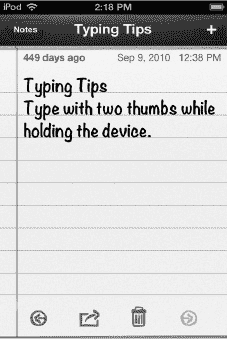

您可以像在任何程序中一样在备忘录中滚动。您会注意到备忘录最后编辑的日期和时间显示在右上角。

阅读完备忘录后，只需轻点左上角的**备忘录**按钮即可返回主备忘录屏幕。

要浏览多个备忘录，只需轻点屏幕底部的箭头。轻点**前进**  箭头。页面会翻动，您可以看到下一条备忘录。要返回，只需轻点**后退**  箭头。

#### 删除备忘录

要删除一条备忘录，请在列表中用手指从左向右滑动该备忘录，然后轻点**删除**。

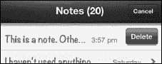

或者，如果您正在查看该备忘录，则轻点底部的**垃圾桶**图标 。iPod touch 会提示您删除或取消删除该备忘录。

#### 通过电子邮件发送或打印备忘录

**备忘录**应用的便捷功能之一是能够通过电子邮件发送或打印备忘录。假设您写了一张购物便条并想通过电子邮件发送给您的配偶，或者您列出了一份礼物创意清单并想分发出去。要通过电子邮件发送或打印备忘录，只需轻点屏幕底部的**操作按钮**图标 。

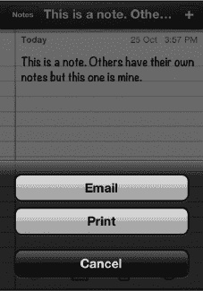

#### 数据检测器 - 带下划线单词的酷功能

如果您在备忘录中键入单词`tomorrow morning`并保存。下次您打开该备忘录时，会看到这些单词已被加下划线。如果您轻点并按住带下划线的单词，您会看到一个按钮询问您是否要**创建事件**。轻点该按钮即可为明天早上创建一个新的日历事件。

**提示：** 每当日期和时间词汇被加下划线时，iPod touch 会将其识别为潜在的日历事件。这适用于 iPod touch 上的备忘录、电子邮件消息和其他位置。iPod touch 还具有其他`数据检测器`，例如它可以识别电话号码、网站地址，甚至包裹的追踪号码。

