# 第 18 章

## 日历和提醒事项

iPod touch 让过去挂在冰箱上的旧日历变得过时。在本章中，我们将向你展示如何充分利用 iPod touch 上的`日历`应用。例如，我们将展示如何安排约会、管理多个日历、更改日历视图，甚至处理会议邀请。

在 iOS 5 中，Apple 新增了`提醒事项`应用，用于轻松管理你的所有任务和待办列表。

**注意：** 本章大部分内容将讨论如何将你的 iPod touch 日历与另一个日历同步，因为让你的日历在 iPod touch 和其他地方都能访问是很方便的。如果你愿意，你也可以将你的 iPod touch 用作*独立*模式，即不与任何其他日历同步。在后一种情况下，我们描述的所有关于事件、查看和管理事件的步骤同样适用于你。然而，至关重要的是，你必须使用 iCloud 或 iTunes 自动备份功能来保存一份日历副本，以防你的 iPod touch 出现意外。

### 在 iPod touch 上管理繁忙的生活

`日历`和`提醒事项`应用提供了强大且易于使用的功能，帮助你管理约会、跟踪待办事项、设置提醒闹钟，甚至创建和回复会议邀请（适用于 Exchange 和 iCloud 用户）。

#### 同步或共享日历和提醒事项

如果你在电脑上维护日历或任务列表，或者在某个网站上维护日历（如 iCloud 或 Google 日历），那么你可以通过两种方式与该 iPod touch 同步或共享这些数据：使用 iTunes 应用和同步线缆，或设置无线同步（有关同步信息，请参阅第 3 章：“同步 iCloud、iTunes 及更多”）。

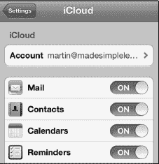

设置日历和任务同步后，根据你的同步设置，电脑上的所有日历约会和待办列表将自动与 iPod touch 日历同步（参见图 18–1）。

如果你使用`iTunes`与日历（例如`Microsoft Outlook`或 Apple 的`iCal`）同步，每次将 iPod touch 连接到电脑时，约会和任务都会被传输或同步。

如果你使用其他同步方法（例如 iCloud、Exchange 或类似服务），此同步是无线且自动的，并且在初始设置过程完成后，很可能无需你做任何操作。

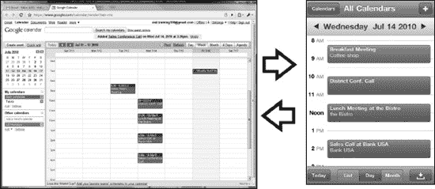

**图 18–1**.*将 PC 或 Mac 日历同步到 iPod touch*

#### 日历图标上显示的当天日期与星期

`日历`图标通常就在你的 iPod touch 的`主屏幕`上。你会很快注意到，`日历`图标会发生变化，显示当天的日期和星期。右侧的图标显示这是当月 16^日，星期五一。

**提示：** 如果你经常使用 iPod touch 的`日历`应用，你可能需要考虑将其固定或移到底部程序坞；你已经在第 6 章：“图标与文件夹”中关于固定图标的章节学习了如何操作。

#### 查看约会与在日历中导航

`日历`应用的默认视图显示`日`视图。此视图让你一目了然地查看当天即将到来的约会。约会会显示在你的日历中。如果你的电脑上设置了多个日历，例如`工作`和`家庭`，则来自不同日历的约会将在 iPod touch 的日历上以不同颜色显示。

你可以通过多种方式操作日历：

*   **逐日移动**：点击顶部当天日期旁边的三角形，可以向前或向后移动一天。

    **提示：** 长按日期旁边的三角形可以快速浏览多天。

*   **更改视图**：点击底部的`列表`、`日`和`月`按钮来切换视图。
*   **跳转到今天**：点击左下角的`今天`按钮。

#### 四种日历视图

你的`日历`应用提供四种视图。`日`、`列表`、`周`和`月`在竖屏方向下均可使用；你可以通过点击屏幕底部的视图名称在它们之间切换。`周`视图仅在横屏方向下可用，你可以通过将 iPod touch 侧向旋转来切换到该视图。以下是四种视图的快速概览：

*   **日视图**：当你启动 iPod touch 的`日历`应用时，默认视图通常是`日`视图。这让你能快速查看当天安排的所有事项。你可以在`日历`应用底部找到更改视图的按钮。

    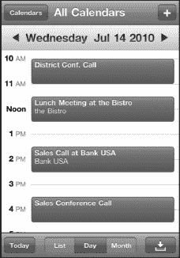

    要从一天转到下一天，只需从右向左滑动。要回到上一天，则从左向右滑动。

    

*   **列表视图**（也称为**议程**视图）：点击底部的`列表`按钮，你可以看到一个约会的列表。

    根据你的日程安排量，你可能会看到下一天甚至下一周的计划事件。

    向上或向下滑动以查看更多事件。

    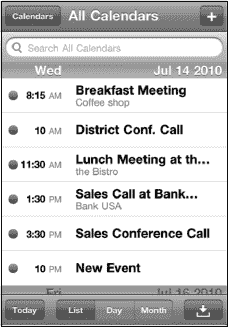

*   **月视图**：点击底部的`月`按钮，你可以看到整个月的布局。有约会的日子会显示一个小点。当天的点会以蓝色高亮显示。

    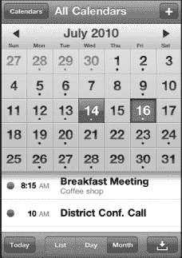

    **提示：** 要返回`今天`视图，只需点击左下角的`今天`按钮。

    

    **转到下个月**：点击顶部显示的月份右侧的三角形。

    **转到上个月**：点击月份左侧的三角形。

*   **周视图**：将 iPod touch 侧向旋转到横屏方向，即可访问周视图。
*   向左或向右滑动以查看更多天数。

    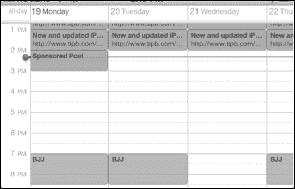

#### 使用多个日历

`日历`应用允许你查看和使用多个日历。你所看到的日历数量取决于你同步了多少个。例如，你可能为家庭同步了 iCloud 或 Google 日历，为工作同步了 Exchange。

> 要一次只查看一个日历，请点击顶部的`日历`按钮，然后只选择你想要查看的日历。

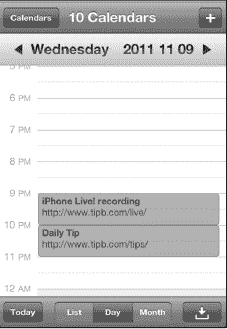

当你设置`同步`设置时，你可以指定要将哪些日历与你的 iPod touch 同步。你可以按照以下说明进一步自定义你的日历：

*   **更改颜色**：如果你不喜欢 iPod touch 上某个日历的颜色，更改起来很容易：

    *   点击右上角的`日历`按钮。
    *   点击右上角的`编辑`按钮。
    *   点击你想要更改的日历。
    *   你会看到一系列颜色选项。点击你喜欢的颜色，新颜色就会设置好。

    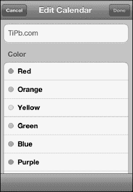

*   **添加新日历**：如果你使用 iCloud 进行同步，你可以在 iPod touch 上添加新日历：

    1.  点击右上角的`日历`。
    2.  点击右上角的`编辑`。
    3.  向下滚动并点击 iCloud 部分中的`添加日历…`。
    4.  输入名称并为新日历选择颜色，这样就完成了！

    

### 添加新的日历事件

你可以在 iPod touch 上轻松添加新的事件或约会。这些新的事件和约会将在下次同步时与你的电脑同步（或共享）。

#### 添加新日程

你的第一反应很可能是尝试在屏幕上的特定时间点触碰来设定日程；而在 iOS 5 中，你终于可以这样操作了！

要从任意`日历`视图添加新的日历事件，请按照以下步骤操作：

1.  在屏幕上你想设定日程的位置长按手指，直到出现一个新的彩色气泡。（你也可以继续点击屏幕右上角的`+`图标来添加新事件。）

    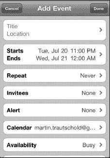

2.  在`添加事件`屏幕上，点击标记为`标题与位置`的输入框。

    输入事件的标题和位置（可选）。例如，你可以输入“与马丁会面”作为标题，并将位置设为“办公室”。或者，你也可以输入“与马丁共进午餐”，然后选择纽约市一家非常昂贵的餐厅。

3.  点击右上角的蓝色`完成`按钮，返回`添加事件`屏幕。

    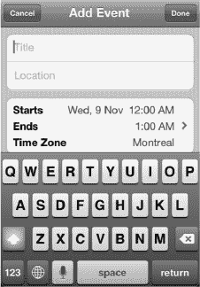

4.  点击`开始`或`结束`标签来调整事件时间。要更改开始时间，请点击`开始`字段使其高亮显示为蓝色。接着，移动底部的旋转拨盘，以调整到正确的日期和日程开始时间。

    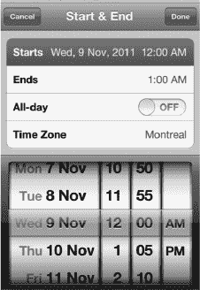

5.  或者，你也可以通过点击`全天`旁边的开关，将其设置为`开启`，来设定一个全天事件。

**注意：** 仅当你的事件设置在 Exchange/Google 或 iCloud 日历时，你才会在`重复`标签之后看到名为`受邀人`的标签。

#### 重复事件

你的一些日程可能是每天、每周或每月在同一时间发生。如果你正在安排一个重复事件，请按照以下步骤操作：

1.  点击`重复`标签，然后从列表中选择重复事件的时间间隔。
2.  点击`完成`返回主`事件`屏幕。

    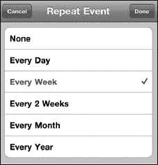

3.  如果你设置了`重复`会议，那么你还需要指定重复事件何时结束。点击`结束重复`按钮进行设置。
4.  你可以选择`永远重复`或设定一个具体日期。
5.  完成后点击`完成`。

    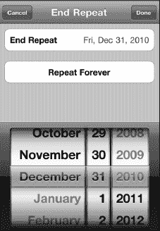

#### 日历提醒

你可以让 iPod touch 4 在临近日程时发出声音提醒，即*提醒*。提醒功能可以帮助你避免忘记重要事件。请按照以下步骤创建提醒：

1.  点击`提醒`标签，然后选择一种提醒闹钟选项。你可以选择不设置闹钟（`无`），或者设置一个从`事件发生时`一直到`事件前 2 天`的提醒，具体取决于哪种最适合你。
2.  点击`完成`返回主`事件`屏幕。

    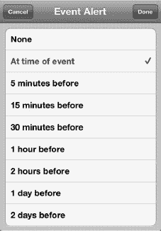

#### 第二次提醒

**注意：** 如果你使用的日历是通过 iTunes 或 iCloud 同步的，你会看到`第二次提醒`选项。但是，如果你的事件关联的是通过 Exchange 设置同步的 Google 日历，则不会看到第二次提醒。

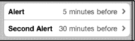

在大多数情况下，一旦你设置了第一个`提醒`选项，你便会看到`第二次提醒`选项的标签。你可以将这第二次提醒设置在第一次提醒之前或之后的另一个时间。有些人发现第二次提醒对于记住关键事件或日程非常有帮助。

**提示：** 这里有一个实际例子，说明了什么时候你可能需要设置两次日历提醒。

如果你的孩子有看医生或看牙医的预约，你可能想将第一次提醒设在预约前一晚。这可以提醒你给学校写一张便条并交给孩子。

然后，你可以将第二次提醒设在预约时间前 45 分钟。这样你就有足够的时间去学校接孩子并准时赴约。

#### 选择日历

如果你使用多个日历，请点击`日历`标签来更改新事件所属的日历。

点击左上角的`日历`按钮查看你所有的日历。

点击你想用于此特定事件的日历。通常，默认选中的日历是你上次使用 iPod touch 安排事件时选择的那个。

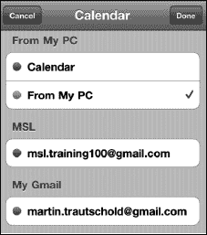

#### 忙闲状态

你也可以让其他人了解你在计划事件期间的忙闲状态。你可以从以下选项中选择你的状态：`忙碌`（默认）、`空闲`、`待定`或`不在办公室`。（`待定`和`不在办公室`仅在你通过 Exchange 设置同步账户时出现。）

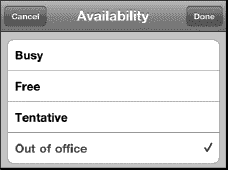

**注意：** 仅当你用于此事件的日历与 iCloud、Exchange 或 Exchange/Google 设置同步时，你才会看到`忙闲状态`或`受邀人`字段，并且每个设置提供的选项略有不同。如果你与 iCloud 同步，你还会看到一个`URL`字段，你可以在其中添加一个网址以备日后参考。

#### 向日历事件添加备注

如果你想向日历事件添加备注，请按照以下步骤操作：

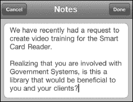

1.  点击`备注`，然后输入或复制粘贴一些备注内容。
2.  点击`完成`结束添加备注。
3.  再次点击`完成`保存你的新日历事件。

**提示：** 如果这是一次去新地方的会议，你可能想输入或复制粘贴一些行车路线。

### 在邮件和日历应用之间使用复制与粘贴

iPod touch 软件新增的快速应用切换器意味着你现在可以轻松地在`邮件`和`日历`程序之间跳转，以复制和粘贴信息。这些信息可以是任何内容，从会议所需的紧要笔记到行车路线。请按照以下步骤在`邮件`和`日历`程序之间复制和粘贴信息：

1.  按照本章前面所述，创建一个新的日历事件或编辑一个现有事件。
2.  向下滚动到`备注`字段并点击以打开它。
3.  双击`主屏幕`按钮以调出快速应用切换器。
4.  如果你看到`邮件`图标，点击它。如果没有看到，请向左或向右滑动来寻找。找到后，点击它以打开`邮件`应用。

    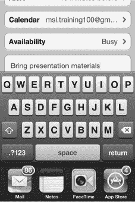

5.  双击一个单词，然后用手指拖动蓝色手柄以选择你要复制的文本。
6.  点击`复制`按钮。

    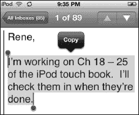

7.  双击`主屏幕`按钮以调出快速应用切换器。
8.  点击`日历`图标。它应该是左边第一个图标，因为你刚刚从这个应用中跳转出来。

    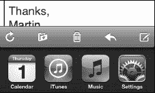

9.  现在，在`备注`字段中长按。当你松开手指时，你应该会看到`粘贴`弹出字段。如果没有看到，请将手指按住稍久一点，直到看到它为止。
10.  点击`粘贴`。

    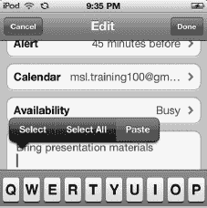

11.  现在你应该会看到你复制并粘贴到`备注`字段中的文本。
12.  点击`完成`保存你的更改。

    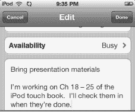

好的，请查收翻译后的中文文档。

### 编辑日程

有时，日程的详细信息可能会发生变化而需要调整。幸运的是，在你的 iPod touch 上修改日程非常容易。如果你只是想更改时间，可以直接在屏幕上移动它。

1.  按住你想要更改的日程。
2.  将日程拖拽到新的时间段。

    如果你需要进行比“触摸并拖拽”更大幅度的调整，或者需要更改其他信息，你也可以使用`编辑`按钮。

    

3.  轻点你想要更改的日程。
4.  轻点右上角的`编辑`按钮，进入显示日程详细信息的`编辑`界面。
5.  触摸需要调整的字段标签，就像你创建事件时做的那样。例如，你可以通过触摸`开始`或`结束`标签，然后调整事件的开始或结束时间来更改此日程的时间。

#### 编辑重复事件

编辑重复或周期性事件的方式与编辑其他任何事件完全相同。唯一的区别是，在完成编辑后，系统会询问你一个问题。你需要回答这个问题，然后轻点`完成`按钮。

如果你只想更改此重复事件中的这一个实例，请轻点`仅为此事件保存`。

如果你想更改此重复事件的所有实例，请轻点`为将来事件保存`。

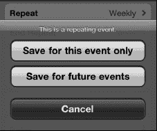

#### 将事件切换到不同日历

如果你错误地将事件设置到了错误的日历中，那么可以继续轻点`日历`按钮来更改日历。接着，选择你已同步到 iPod touch 上的其他日历之一。

**注意：** 根据你选择的日历，某些字段可能会出现或消失。

如果你将事件从通过`iTunes`同步的日历更改为与 Exchange 同步的日历，那么你会看到`第二个提醒`字段消失。此外，在使用 Exchange、Google 或 iCloud 日历时，你还会看到两个新字段出现：`受邀人`和`忙闲状态`。

#### 删除事件

请注意，在`编辑`界面的底部，你还可以选择删除此事件。只需轻点屏幕底部的`删除事件`按钮即可。

#### 会议邀请

对于那些经常使用 Microsoft Exchange、`Microsoft Outlook` 或 iCloud 的用户来说，会议邀请已成为日常的一部分。你会在电子邮件中收到会议邀请，接受邀请后，日程便会自动添加到你的日历中。

在你的 iPod touch 上，你会看到你接受的邀请会立即被放入你的日历中。

如果你在日历中轻点该会议邀请，可以看到所有你需要的详细信息：拨入号码、会议 ID 以及邀请中可能包含的任何其他详细信息。

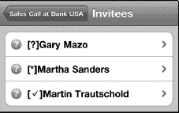

### 日历选项

在你的`日历`应用中，只有少数几个选项可以调整；你可以在`设置`应用中找到它们。请按照以下步骤调整这些选项：

1.  从`主屏幕`轻点`设置`。
2.  向下滚动到`邮件、通讯录、日历`并轻点它。
3.  向下滚动到`日历`（它位于最底部！）以查看几个选项。
4.  第一个选项是一个简单的开关，用于通知你`新邀请提醒`。如果你收到任何会议邀请，最好将此选项保持为默认的`开启`状态。

    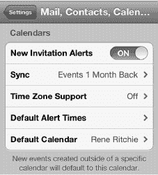

5.  接下来，如果你使用 Exchange 或 iCloud 同步你的`日历`程序，可能会看到`同步`选项。你可以调整此设置，将事件同步到`过去 2 周`、`过去 1 个月`、`过去 3 个月`、`过去 6 个月`，或显示`所有事件`。
6.  接着，你可以选择你的时区。此设置应反映你设置 iPod touch 时的`主屏幕`设置。如果你正在旅行并希望为不同的时区调整日程，你可以将`时区`值更改为你偏好的任何城市。

    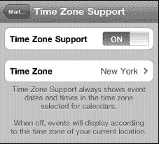

7.  可以为生日、事件和全天事件设置默认提醒时间。事件提供常规选项，而生日和全天事件则允许设置为事件当天、前一天、前两天（均在上午 9 点），或提前一周。

#### 更改默认日历

我们之前提到过，你可以在 iPod touch 上显示多个日历。`默认日历`界面允许你选择哪个日历作为你的默认日历。

将某个日历指定为默认日历意味着，当你去安排新日程时，此日历将被默认选中。

如果你想使用另一个日历——比如你的`工作`日历——那么你可以在实际设置日程时进行更改，如本章前面所示。

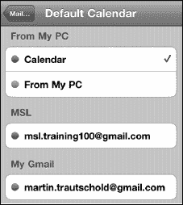

### 提醒事项

`提醒事项`是 iOS 5 中的一个新应用，它让你可以简单轻松地追踪你需要完成的事项以及需要完成的日期和时间。你可以将这个应用视为苹果对任务或待办事项列表的解决方案。

#### 提醒事项视图

你的`提醒事项`应用有三个主要视图：`列表`、`日期`和`月`。以下是这些视图的简要概述。

`列表`是`提醒事项`的默认视图，能让你一目了然地看到所有需要完成的任务。

**注意：** 对于 iCloud 账户，默认的`列表`视图称为`提醒事项`。对于 Microsoft Exchange 账户，默认的`列表`视图称为`任务`。

如果你有多个列表，可以通过从右向左滑动在它们之间切换，就像在你的 iPod touch `主屏幕`的不同应用页面之间切换一样。

从左向右滑动可以查看你的`已完成`任务列表。

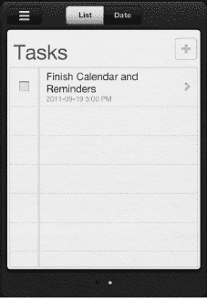

`日期`视图让你可以在提醒事项到期的当天查看它们。你可以轻松地从一天滑动到下一天；也可以滚动底部的`日期`滑块。按照以下步骤更改显示的日期：

*   **转到下一天**：从右向左滑动。
*   **转到前一天**：从左向右滑动。
*   **转到已完成任务列表**：从当前日期从左向右滑动。

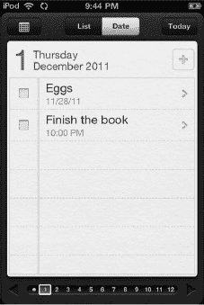

**提示**：要返回`今天`视图，只需轻点右上角的`今天`按钮。

要查看`月`视图，请轻点`日期`视图左上角的`月`按钮 。这将显示整个月的布局。有提醒事项到期的日期会显示为红色。

**提示**：要返回`今天`视图，只需轻点右上角的`今天`按钮。

按照以下步骤在月份之间前后切换：

*   **转到下个月：** 向下滚动。
*   **转到上个月：** 向上滚动。

#### 添加新提醒事项

要从任意`列表`视图中添加新任务，请按照以下步骤操作：

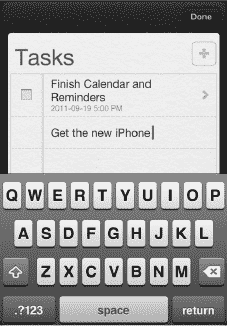

1.  轻点当前列表末尾的第一个空白行。
2.  输入你的任务标题。
3.  完成后，轻点右上角的黑色`完成`按钮。

    **注意：** 你也可以轻点`添加`按钮来创建新任务。

#### 添加提醒事项详情

要为任务添加详细信息，请轻点任务的标题。`详情`界面让你可以添加`提醒我`的截止日期、提醒的`优先级`、你希望将其附加到的`列表`，以及你可能想要添加的任何`备注`。

`详情`页面也是你可以删除任务的地方。

**注意：** 如果一开始没有看到所有选项，请轻点`显示更多`按钮以展开它们。

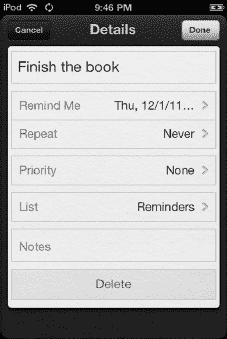

### 设置截止日期

`Reminders`（提醒事项）应用包含标准的截止日期，你可以为提醒事项设置该日期。当任务到达截止日期时，你会收到弹窗通知，提醒你该任务。

请按照以下步骤设置`提醒我`的日期：

1.  轻点`提醒我`。
2.  要设置截止日期，请将`在某天`选项切换为`开启`。默认情况下，日期将设置为当天。
3.  要更改日期，请轻点日期并移动底部的旋转拨盘，以调整为任务的正确日期。
4.  轻点`完成`返回主`详情`屏幕。

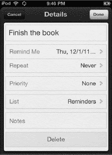

#### 重复提醒

部分提醒事项需要在每天、每周或每月的同一时间或地点触发。如果你正在安排重复或循环的任务，请按以下步骤操作：

1.  在`详情`屏幕上，轻点`重复`标签，然后从列表中选择重复事件的时间间隔。
2.  轻点`完成`返回主`详情`屏幕。

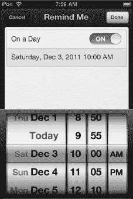

#### 更改列表

每个提醒事项都属于一个列表。你可以有工作列表、家庭列表、假期列表、购物列表——任何你喜欢的列表。`详情`页面将显示当前与新任务关联的列表名称。请按照以下步骤更改当前列表：

1.  轻点当前的列表名称。
2.  轻点你想要切换到的列表。

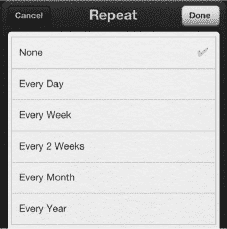

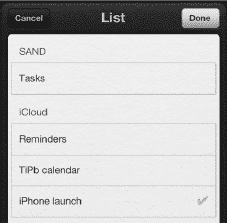

#### 为任务添加备注

如果你想为任务添加一些备注，请按照以下步骤操作：

1.  轻点`备注`，然后键入或复制粘贴一些注释。
2.  轻点`完成`以结束添加备注。

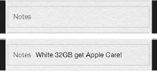

**提示：** 如果这是一个购物列表，你可能希望包含一些额外信息，比如衣服尺码、食品品牌或其他可能有帮助的内容。

### 完成提醒事项

将提醒事项标记为`已完成`非常容易。只需轻点提醒事项标题正左侧的方框，就会出现一个`勾选标记`图标。这将把该提醒事项从其当前列表移至特殊的`已完成`列表，以便你日后必要时可以返回并查阅。

如果你操作失误，只需再次轻点该方框，移除`勾选标记`图标，并将提醒事项恢复至其之前的状态。如果该任务已经被移动到`已完成`列表，向左滑动直到你进入`已完成`列表，然后轻点该方框取消勾选，即可将提醒事项移回其之前的列表。

### 编辑提醒事项

有时，任务的详细信息可能会发生变化，需要进行调整。幸运的是，更改任何提醒事项只需遵循以下简单步骤：

1.  轻点你想要更改的提醒事项。
2.  轻点`详情`页面上的标签并调整详细信息，就像你设置新任务时一样。

#### 删除提醒事项

请注意，在`详情`屏幕底部，你还可以选择删除任务。只需轻点屏幕底部的`删除`按钮即可。

### 添加新列表

`Reminders`（提醒事项）应用允许你拥有多个列表，这对于保持任务条理性非常方便。例如，你可以创建一个新列表来帮助你整理即将到来的旅行物品，或者为即将到来的生日购物。

你可以为`iCloud 提醒事项`或`Exchange 任务`帐户创建新列表，也可以创建本地列表（`在我的 iPod touch 上`）。请按照以下步骤创建一个新列表：

1.  轻点屏幕左上角的`列表`按钮 。
2.  在`列表`页面，轻点右上角的`编辑`按钮。
3.  如果你有多个帐户与`提醒事项`同步，请选择你要添加新列表的帐户。
4.  轻点`创建新列表…`标签。
5.  输入你的新列表名称。
6.  轻点右上角的`完成`按钮。

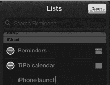

### 移动和删除列表

在`列表`页面，你还可以移动和删除列表。

要移动列表，请长按最右侧的`抓手`图标，然后将其拖拽到新位置。

要删除列表，请轻点列表名称左侧的红色`圆圈`图标，然后轻点`删除`按钮确认你的选择。

### 提醒事项选项

在`提醒事项`应用中，只有两个选项可以调整；你可以在`设置`应用中找到它们：

1.  从你的`主屏幕`轻点`设置`图标。

   

2.  向下滚动到`邮件、通讯录、日历`并轻点它。
3.  向下滚动到`提醒事项`（它位于最底部！）以查看这两个选项。

   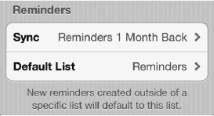

4.  第一个选项是`同步`。你可以调整此设置，以同步`过去 2 周`、`过去 1 个月`、`过去 3 个月`、`过去 6 个月`，或显示`所有提醒事项`。

#### 更改默认列表

我们之前提到过，你可以在你的 iPod touch 上显示多个列表。`默认列表`屏幕允许你选择哪个列表将成为你的默认列表。

指定一个列表作为默认列表意味着，当你创建一个新提醒事项时，它将被默认分配到该指定列表。

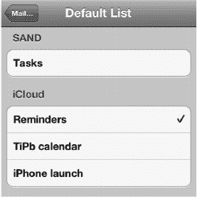

