# 第 19 章

## 使用照片

虽然之前的 iPod touch 机型都包含后置摄像头，但最新的 iPod touch 配备的不是一个，而是两个摄像头：一个 960 × 720 像素的后置摄像头；以及一个用于视频聊天和自拍的 VGA（640 × 480 像素）前置摄像头。关于如何使用前置摄像头的更多信息，请参阅第 10 章：“视频消息与 Skype”。

在 iPod touch 上查看和分享你的照片确实是一种享受，这在很大程度上得益于其精美的、高分辨率的屏幕。在本章中，我们将讨论将照片导入 iPod touch 的多种方法。我们还将向你展示如何使用触摸屏浏览照片，以及如何进行缩放和操作照片。

**提示：** 你知道吗，你可以同时按下两个按键来截取 iPod touch 的整个屏幕？这对于向某人展示一个很酷的应用，或者证明你在`俄罗斯方块`中获得了最高分非常有用！

操作方法如下：同时按下`主屏幕`按钮和顶部右侧的`开/关/睡眠`键（你可以先按住一个键，再按下另一个键）。这有点小技巧，需要一些练习。如果你操作正确，屏幕会闪烁，并且你会听到相机快门声。你进行的屏幕截取将保存在`照片`应用中的`相机胶卷`相册里。

### 快速拍照

Apple 最近增加了一些出色的快捷方式，帮助您更快速、更方便地拍照。如果您的孩子正处于特别可爱或值得纪念的时刻，如果您在树林中遇到一只稀有的鸟类，或者您需要快速拍下社区中可疑事物的照片，那么您可以使用以下技巧之一快速抓拍：

- 双击`Home`按钮，在`Lock`屏幕上直接显示`Camera`图标。点击`Camera`图标将直接跳转到`Camera`应用，准备拍照。这意味着您不再需要解锁`iPod touch`、滑动查找`Camera`应用，然后等待其启动。
- 使用`Volume Up`硬件按钮拍照。您可以利用更具触感的、类似于传统相机控制的方式，而不必费力点击屏幕上的相机软件按钮。
- 拍摄多张照片。Apple 声称已将拍摄第一张照片的时间缩短至惊人的 1.1 秒；然而，第二张照片——以及此后的每一张照片——现在仅需 0.5 秒。这对于运动或任何其他快速移动的活动特别方便。只需尽可能快地持续按下音量增大键即可。
- 自动对焦和人脸检测意味着您朋友和家人的快照会自动变得更清晰，曝光也更佳。

#### 使用相机应用

`Camera`应用应该位于您的`Home`页面上——通常在第一屏的顶部。如果您没有看到它，请向左或向右滑动直到找到它。

触摸`Camera`图标，相机快门会以动画效果在屏幕上打开。

快门打开后，您会在顶部找到用于设置`Flash`为`On`、`Off`或`Auto`的控件；用于设置`Grid`叠加和`HDR`（高动态范围）为`On`或`Off`的`Options`；以及用于在前置摄像头和后置摄像头之间切换的切换开关。在底部，您会找到用于跳转到`Camera Roll`相册的缩略图、用于拍照的`Camera`按钮，以及用于在静态照片和视频录制模式之间切换的滑块。

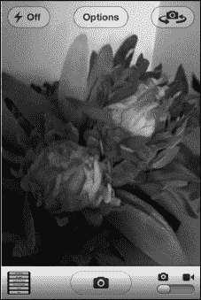

**提示：** 您也可以通过按下`Volume Up`硬件按钮来拍照或开始视频录制。

##### 地理标签

地理标签是一项将您的地理近似坐标嵌入到图片文件中的功能。`iPod touch`使用`Wi-Fi`信号来帮助确定其大致位置。如果您将图片上传到像`Flickr`这样的程序，您的朋友可以使用您图片的坐标来定位您以及图片拍摄的地点。

**注意：** 对于 Mac 用户，`iPhoto`使用地理标签将照片放入`iPhoto`的`Places`类别中。

如果您在启动相机时将`Location Services`设置为`ON`（请参阅第 1 章：“入门”），系统会询问是否允许使用您当前的位置。

要再次检查此设置，请执行以下操作：

1. 启动您的`Settings`应用。
2. 前往`General`。
3. 触摸`Location Services`。您将看到类似于下方的屏幕。
4. 确保`Camera`旁边的开关已切换为`ON`。

    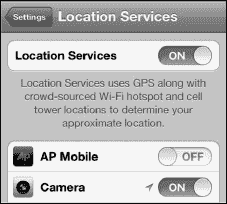

##### 拍照

拍照就像指向和拍摄一样简单，但如果您愿意，还可以进行一些调整。

一旦相机打开，将您的拍摄对象对准在`iPod touch`屏幕中央。

当您准备好拍照时，只需触摸底部的`Camera`按钮，或按下`iPod touch`侧面的`Volume Up`硬件按钮（带有`+`的按钮）。您会听到快门声，屏幕会显示一个动画，表示正在拍照。

拍照完成后，照片会落入左下角的窗口中。触摸那个小缩略图，`Photos`应用的`Camera Roll`相册就会加载。

###### 使用变焦

`iPod touch`包含一个 5 倍数码变焦功能。

**注意：** 数码变焦的清晰度永远比不上光学变焦，因此请注意，使用变焦时图片质量通常会略有下降。

要使用变焦，只需用两根手指触摸屏幕并捏合以放大或缩小。手指分开得越远，缩小得就越远。变焦开始后，还会出现一个变焦滑块来帮助您更改变焦级别。

###### 相机选项

为了帮助您拍摄更好的照片，Apple 内置了`Grid`参考线。

`Grid`选项会在屏幕上叠加两条水平线和两条垂直线。这可以帮助您正确地构图。它还可以帮助您确保人像中面部和眼睛看起来很棒，静物图像中的物品看起来很棒，以及风景中的景色保持平衡。

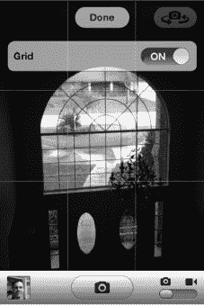

###### 切换相机

如前所述，`iPod touch`配备了两个摄像头：一个用于大多数摄影的 800 万像素后置摄像头，以及一个用于自拍或`FaceTime`视频通话（请参阅第 10 章：“视频消息和 Skype”）的 VGA（640 × 480）前置摄像头。

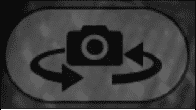

要在摄像头之间切换，请执行以下操作：

1. 从`Camera`应用中触摸`Switch Camera`图标。
2. 等待相机切换到前置摄像头并对准镜头。
3. 再次触摸`Switch Camera`图标以切换回标准摄像头。

**提示：** 由于前置摄像头的放置位置，面部看起来可能会有些扭曲。试着将您的面部稍微向后移并调整相机角度，以获得更好的图像。

##### 查看已拍摄的照片

您的`iPod touch`会将您拍摄的照片存储在名为`Camera Roll`的相册中。您可以从`Camera`和`Photos`应用内部访问`Camera Roll`。在`Camera`应用中，触摸`Camera`屏幕左下角的`Pictures`图标。

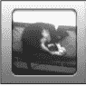

一旦触摸某张照片进行查看，您就可以滑动浏览照片，查看`Camera Roll`中的所有图片。

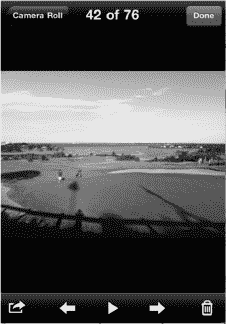

 要返回`Camera Roll`，请按左上角的`Camera Roll`按钮。

 要拍摄另一张照片，请触摸右上角的`Done`按钮。

### 编辑照片

借助 iOS 5，您现在可以直接在 iPod touch 上进行基本的照片编辑。您可以旋转照片；增强曝光度、对比度和色阶；裁剪照片；甚至还能自动去除亲友照片中的红眼。

请按照以下步骤编辑照片：

1.  浏览到您想要编辑的照片。
2.  点击右上角的`编辑`按钮。

请按照以下步骤旋转照片：

1.  点击左下角的`旋转`箭头  按钮，将照片逆时针旋转 90 度（向左旋转）。
2.  再次点击`旋转`按钮，继续以 90 度为增量进行旋转。
3.  当您将图像旋转到所需位置后，点击右上角的黄色`存储`按钮。

同样，请按照以下步骤自动增强照片：

1.  点击`自动增强`  魔棒按钮。
2.  如果您对结果满意，请点击右上角的黄色`存储`按钮。
3.  如果您对结果不满意，请再次点击`自动增强`将其设置为`关闭`。
4.  点击`取消`退出自动增强模式。

请按照以下步骤去除照片中的红眼：

1.  点击`红眼`  按钮以激活红眼去除功能。
2.  点击照片中的每个红眼以应用去除效果（即去除眼中的红色）。
3.  如果您对结果满意，请点击左上角的`应用`按钮。
4.  如果您对结果不满意，请再次点击每个红眼以撤销去除效果。
5.  点击`取消`退出此模式。

最后，请按照以下步骤裁剪照片：

1.  点击右下角的`裁剪`  按钮。照片上会出现一个九宫格网格。
2.  触摸网格的边缘或角落并拖动，使裁剪区域更高、更矮、更窄或更宽。
3.  触摸网格内部并拖动，使网格后的照片移动。
4.  双指捏合或张开以放大或缩小网格内的照片。
5.  点击`约束`按钮，从标准宽高比列表中进行选择，包括`原始`；`正方形`；传统照片比例如`3 × 2`、`4 × 6`和`8 × 10`；电视比例如`SD 4 × 3`和`HD 16 × 9`等等。
6.  如果您对裁剪结果满意，请点击右上角的黄色`裁剪`按钮以应用更改。
7.  如果您不喜欢裁剪结果，请点击左上角的`取消`按钮返回`编辑`屏幕。

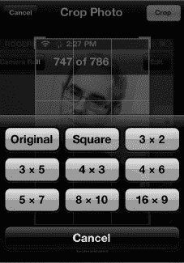

### 将照片导入您的 iPod touch

您有多种选项可以将照片加载到设备上：

- **使用 iCloud 或 iTunes 同步：** 将照片加载到 iPod touch 上最简单的方法可能是使用 iCloud 或 iTunes 从电脑同步照片（请参阅图 19–1）。我们将在第 3 章：“与 iCloud、iTunes 等同步”中详细介绍此方法。
- **作为电子邮件附件接收：** 虽然这对大量照片不太实用，但处理一张甚至几张照片效果很好。请查看第 16 章：“使用电子邮件通信”，了解有关如何保存附件的更多详细信息。（保存后，这些图像会出现在“相机胶卷”相册中。）
- **从 Web 保存图像：** 有时您会在网站上看到一张很棒的图片。长按该图片以查看弹出菜单，然后选择`存储图像`。（与其他已保存图像一样，这些图像最终会出现在“相机胶卷”相册中。）
- **从应用程序内下载图像：** 第 8 章：“个性化与安全”中展示的壁纸图像就是一个很好的例子。
- **与 iPhoto 同步**（适用于 Mac 用户）：如果您使用 Mac 电脑，您的 iPod touch 很可能会自动与`iPhoto`同步。以下是启动并运行`iPhoto`中同步功能的几个步骤：
    1.  连接您的 iPod touch 并启动`iTunes`应用程序。
    2.  前往同步选项顶行中的`照片`选项卡。
    3.  选择您希望与 iPod touch 保持同步的`相簿`、`事件`、`面孔`或`地点`。

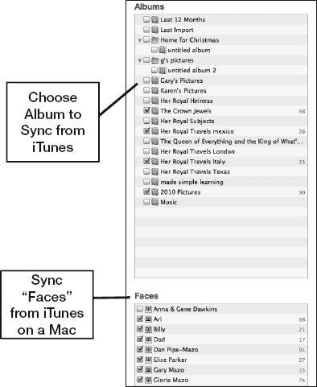

**图 19–1.** *从`iTunes`中选择要与 iPod touch 同步的相簿、面孔或事件*

- **拖放**（适用于 Windows 用户）：将 iPod touch 连接到 Windows 电脑后，它会作为便携式设备出现在`Windows 资源管理器`中，如图 19–2 所示。请按照以下步骤在 iPod touch 和电脑之间拖放照片：
    1.  双击`便携式设备`下的`iPod touch`图标将其打开。
    2.  双击`Internal Storage`将其打开。
    3.  双击`DCIM`将其打开。
    4.  接下来，您可能会看到一个或多个名称奇特的文件夹，例如：`823WGTMA`、`860OKMZO`和`965YOKDJ`。尝试双击打开每个文件夹。其中一个文件夹包含您要找的照片或视频。
    5.  您将看到 iPod touch 上“已存储的照片”相册中的所有图像。
    6.  要从 iPod touch 复制图像，请选择图像，然后将它们从此文件夹拖放到您的电脑上。您无法使用此拖放方法将图像复制到 iPod touch。为此，您可以使用 iTunes 或 iCloud。

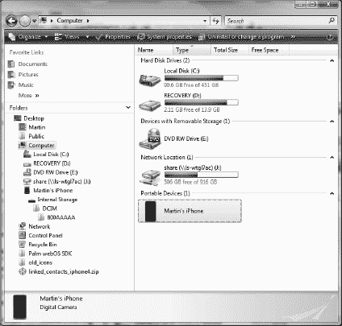

**图 19–2\.** *`Windows 资源管理器`将 iPod touch 显示为便携式设备（通过 USB 线缆连接）*

**提示：在 Windows 中选择多张图像**

在 Windows 中，您有几种选择图像的方法：您可以围绕图像画一个矩形框选，单击单张图像，或按 `Ctrl+A` 全选。您也可以按住 `Ctrl` 键并逐一单击图像以选择它们。右键单击其中一张选中的图片，然后选择`剪切`（移动）或`复制`（复制）所有选中的图像。要粘贴图像，请点击任意其他磁盘或文件夹（例如`我的文档`），然后导航到您要移动或复制文件的目标位置。最后，再次右键单击并选择`粘贴`。

### 查看您的照片

现在您的照片已在 iPod touch 上，您有几种非常酷的方式来浏览它们并向他人展示。

#### 从“照片”图标启动

如果您喜欢使用`照片`应用，如果它尚未在底部 Dock 中，您可能希望将它的图标放在那里以便快速访问（请参阅第 6 章：“图标与文件夹”）。

要开始使用照片，请触摸`照片`图标。

第一个屏幕会显示您的相簿，这些相簿是在您设置 iPod touch 并同步 iCloud 或 iTunes 时创建的。在第 3 章：“与 iCloud、iTunes 等同步”中，我们向您展示了如何选择要与 iPod touch 同步的照片。当您更改电脑上的照片库时，这些更改将自动在 iPod touch 上更新。

如果您正在使用 iCloud 的照片流功能，那么在这里您也能找到您的照片流图像。

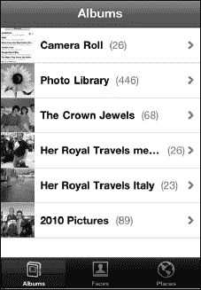

#### 选择一个图库

在`相簿`页面上，触摸其中一个图库按钮以显示该相簿中的照片。在右侧的图像中，我们触摸了一个照片图库，屏幕立即切换，显示了该图库中照片的缩略图。

上下滑动手指可以查看图库中的所有照片。您也可以向上或向下轻扫，以快速浏览整个相簿。

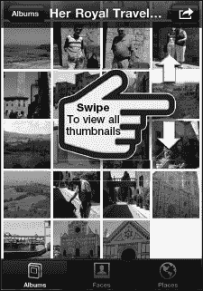

### 管理图库

iOS 5 新增了在 iPod touch 上直接添加相簿、在相簿间移动照片以及删除相簿的功能。

请按照以下步骤添加新相簿：

1.  点击右上角的`编辑`按钮。
2.  点击左上角出现的`添加`按钮。
3.  为你的新相簿输入一个名称。
4.  点击右上角的`完成`。

请按照以下步骤删除相簿：

1.  点击右上角的`编辑`按钮。
2.  点击你要删除的相簿左侧的红色`圆圈`图标。
3.  点击红色的`删除`按钮进行确认。

最后，按照以下步骤在相簿间移动照片：

1.  点击左下角的`操作`按钮。
2.  点击你想要移动的照片。
3.  如果不小心点到了某张照片，只需再次点击即可取消选择。
4.  点击底部的`添加到`按钮。
5.  如果你已有想要移入照片的相簿，请选择`添加到现有相簿`。或者，如果你现在想创建一个新相簿，可以选择`添加到新相簿`。

#### 处理单张照片

找到你想要查看的照片后，直接点击它。照片随即会加载到屏幕上。

**注意：** 如果你的照片是以横向模式拍摄的，它们在 iPod touch 上通常不会占满整个屏幕。

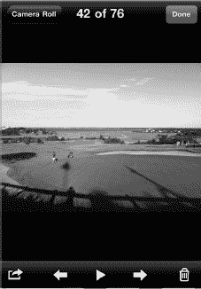

**提示：** 这里展示的照片是以横向模式拍摄的；若要全屏查看，只需将 iPod touch 侧转，或双击它即可。

##### 在照片间切换

使用滑动手势可以在照片之间切换。只需在屏幕上向左或向右滑动手指，就能浏览你的照片。

**提示：** 慢慢地拖动手指可以在照片库中更平缓地移动。

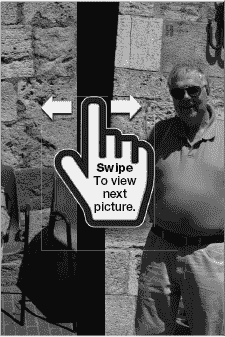

当浏览到相簿末尾时，只需点击屏幕一次，左上角就会出现一个显示该相簿名称的标签。点击那个标签，你就会返回到该相簿的缩略图页面。

要返回主相簿页面，请点击左上角写着`相簿`的按钮。

##### 放大和缩小照片

如本书“入门指南”部分所述，在 iPod touch 上有两种方法可以放大和缩小照片：双击和双指捏合。

###### 双击

顾名思义，双击就是在屏幕上快速点击两次以放大照片（参见图 19–3）。你会在双击的位置放大。要缩小，只需再双击一次。

有关双击的更多信息，请参见第 1 章：“入门指南”。

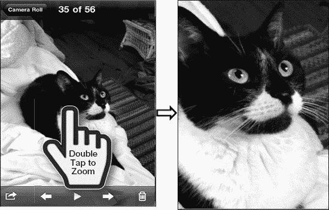

**图 19–3.** *双击照片以放大查看*

###### 双指捏合

同样如第 1 章：“入门指南”所述，双指捏合是一种更精确的缩放方式。双击只能以固定的程度放大或缩小，而双指捏合则允许你进行细微或大幅度的缩放。

要进行捏合缩放，先将拇指和食指并拢，然后在接触屏幕的同时缓慢分开两指，使照片变大。要缩小，则将拇指和食指分开，然后并拢。

**注意：** 一旦你通过任一种方法激活了缩放功能，在将照片恢复到标准尺寸之前，你将无法在照片之间自如地滑动。

#### 查看幻灯片放映

如果你愿意，可以将相簿中的照片以幻灯片放映的形式进行查看。只需点击屏幕一次以调出屏幕软键。在屏幕中央，你会看到一个`播放幻灯片`按钮——点击一次即可开始播放幻灯片。你可以从正在查看的任何一张照片开始幻灯片放映。

在`设置`应用中选择`照片`，可以调整每张照片在屏幕上停留的时间，以及`重复播放`和`随机播放`等其他设置（参见图 19–4）。要结束幻灯片放映，只需点击屏幕即可。

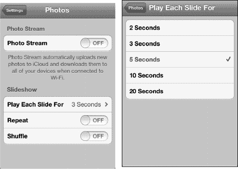

**图 19–4.** *配置幻灯片放映*

#### 将照片用作 iPod touch 墙纸

我们将在第 8 章：“个性化和安全设置”中向你展示如何选择并将某张照片用作 iPod touch 墙纸（以及其他墙纸选项）。

**注意：** 你可以为`主屏幕`和`锁定屏幕`设置不同的照片，也可以对两者使用同一张照片。

#### 通过电子邮件或推特发送照片

只要你拥有有效的互联网连接（参见第 4 章：“连接网络”），你就可以将照片库中的任何照片通过电子邮件发送或发布到 Twitter 上。点击缩略图栏上的`选项`按钮——这是底部软键行中最左侧的按钮。如果你看不到这些图标，请点击屏幕一次。

要邮寄照片，请选择`邮寄照片`选项，`邮件`应用将会自动启动。

像你在第 16 章：“使用电子邮件通信”中做过的那样，点击`收件人`字段，然后选择接收照片的联系人。点击蓝色的`加号`（`+`）按钮来添加联系人。

输入主题和正文，然后点击右上角的`发送`——就这样简单。

要发送推文，请选择`推文`选项，一个`Twitter`表单将会自动出现。只需填写你想随照片一起显示的消息，然后点击`发送`按钮。

**注意：** 只有在`设置`应用中输入了你的 Twitter 用户名和密码后，`推文`选项才会出现。

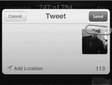

#### 同时共享、复制、打印或删除多张照片

如果你有多个照片想要同时通过电子邮件发送、信息发送、复制、打印或删除，可以在缩略图视图中进行操作：

1.  点击左下角的`操作`按钮。

    

2.  点击你想要选择的照片。
3.  如果不小心点到了某张照片，只需再次点击即可取消选择。
4.  从屏幕底部选择一个操作：`共享`（电子邮件、信息或打印）、`复制`、`添加到`（另一个相簿）或`删除`。

    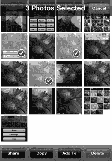

**注意：** `复制`功能允许你将多张照片复制并粘贴到电子邮件或其他应用中。`共享`会将图像重命名为 `photo.png`，而`复制-粘贴`则会在 DCIM 文件夹的文件名后添加 `.png` 扩展名。

在本书出版时，你无法同时共享多个视频，也不能同时共享超过五张照片。这在未来的软件版本中可能会有所改变。

#### 为联系人分配照片

第 17 章：“通讯录与备忘录”展示了如何在编辑联系人时添加照片。你也可以找一张喜欢的照片并将其分配给联系人。首先找到你想使用的照片。

与设置壁纸和通过电子邮件发送照片时的操作一样，轻点**操作**按钮——即上方软键行最右侧的那个按钮。如果你没看到图标，轻点屏幕一次。

触碰**操作**按钮后，你会看到一个下拉选项列表：**用电子邮件发送照片**、**信息**、**分配给联系人**、**用作墙纸**、**推文**和**打印**。

触碰**分配给联系人**按钮。

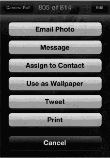

屏幕上会显示你的联系人列表。你可以使用顶部的**搜索**栏进行搜索，或者直接滚动浏览联系人。

一旦找到你想要将照片添加为收件人的联系人，就触碰该姓名。

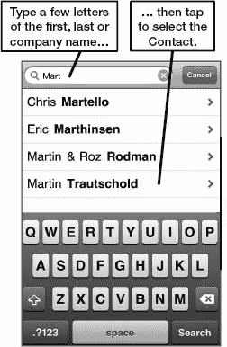

接着你会看到**移动和缩放**屏幕。拖动照片进行移动；使用捏合手势放大或缩小。

当照片调整到满意的位置后，触碰**设定照片**按钮，将该照片分配给该联系人。

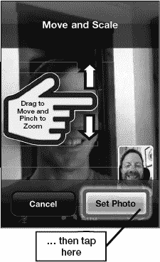

**注：**操作完成后你将返回照片图库，而非联系人界面。如果你想再次确认照片已成功分配给联系人，只需退出**照片**应用，打开**通讯录**应用，然后搜索该联系人即可。

#### 在 Apple TV 上查看照片

第 5 章：“AirPlay 与蓝牙”展示了如何使用苹果的 AirPlay 功能，通过本地 Wi-Fi 网络将 iPod touch 上的视频流式传输到 Apple TV。苹果在“照片”应用中内置了相同的功能，因此你可以轻松地将照片投射到大屏幕电视上。

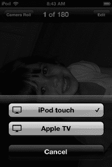

按照以下步骤将照片发送到 Apple TV：

1.  轻点**AirPlay**按钮。
2.  从来源列表中选择**Apple TV**。

切换到下一张照片，只需从右向左滑动，就像在 iPod touch 上切换照片一样。要返回上一张照片，则从左向右滑动。

要恢复在 iPod touch 上查看照片，请再次轻点 AirPlay 按钮，然后从来源列表中选择 iPod touch。

##### 删除照片

你可能会好奇为什么有些照片无法从 iPod touch 上删除（**废纸篓**图标不见了）。

例如，你会注意到，任何从 iTunes 同步来的照片都看不到**废纸篓**图标。这类照片只能从电脑的资料库中删除。下次同步 iPod touch 时，它们就会被移除。

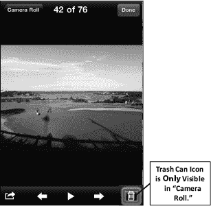

当你查看“已存储的照片”（此文件夹不与 iTunes 同步，而是由你从电子邮件中保存或从网页下载的照片组成）时，你会在底部图标栏中看到**废纸篓**图标。当你查看“照片图库”或其他同步相册中的照片时，这个**废纸篓**图标不会出现。

如果你没看到底部那一行图标，先轻点照片激活它们，然后轻点**废纸篓**图标。系统会提示你确认是否删除照片。

触碰**删除照片**，该照片将从你的 iPod touch 中删除。

#### 从网站下载图片

我们已经向你展示了如何将图片从电脑传输到 iPod touch，以及如何从电子邮件中保存图片。你还可以直接从网页上下载并保存图片到 iPod touch。

**警告：**我们强烈建议你在从网页上下载和保存图片时尊重图片版权法。除非网站明确标注图片可免费使用，否则在下载和保存任何图片前，应先征得网站所有者的同意。

##### 查找要下载的图片

iPod touch 让你能轻松地从网页上复制和保存图片。当你想为 iPod touch 寻找一张新的壁纸时，这个功能会非常方便。

首先，轻点**Safari**网页浏览器图标，输入搜索词如“iPod touch 壁纸”，找到一些可能提供有趣壁纸的网站。（关于此主题的帮助信息，请参阅第 15 章：“Safari 网页浏览器”。）

一旦找到你想下载和保存的图片，长按该图片，就会弹出一个包含**存储图像**（以及其他选项）的新菜单，如图 19-5 所示。选择此选项，将图片保存到你的“已存储的照片”相册中。

**图 19-5.** 从网页保存图片

现在轻点你的**照片**图标，你应该能在“相机胶卷”相册中看到这张图片。

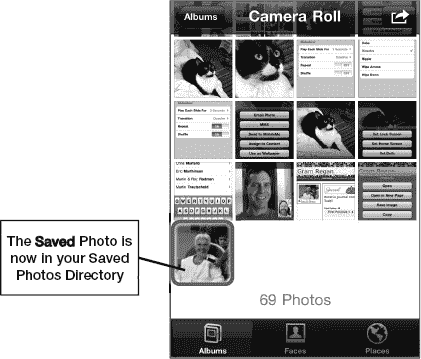

