# 第 20 章

## 地图

在 iPod touch 上使用地图功能既方便又令人惊叹。在本章探索**地图**应用的强大功能时，你将了解如何在地图上找到自己的位置，并获取前往几乎任何地方的路线。你还将学习如何在**标准**、**卫星**和**混合**视图之间切换。你还会看到，如果需要找到去某处的最佳路线，你可以通过**地图**选项中的**显示交通状况**按钮来查看实时交通。如果你想找到目的地附近最近的披萨店、高尔夫球场或酒店，也同样简单。你甚至可以直接在 iPod touch 上使用谷歌的街景功能，帮助你顺利抵达目的地。将已在地图上标出的地址添加到通讯录中也非常方便。

### 地图入门

iPod touch 的妙处在于其应用程序设计得能够相互协作。你已经见识过通讯录是如何与**地图**应用关联的；只需回顾一下第 17 章：“通讯录与备忘录”即可。

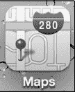

**地图**应用由移动地图技术领域的领导者谷歌地图提供支持。**地图**能让你定位自己的位置、获取路线、搜索附近事物、查看交通状况等。

只需轻点**地图**图标即可开始使用。

**注：**你需要连接到 Wi-Fi 网络才能使用地图功能。

#### 确定你的位置（蓝点）

启动**地图**应用时，你可以让它从你当前的位置开始。按照以下步骤将你的当前位置设为默认起始位置：

1.  轻点左下角的蓝色小**箭头**图标。

    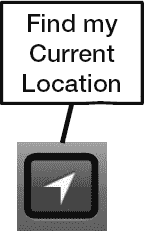

2.  **地图**会请求使用你的当前位置——轻点**允许**或**不允许**。

    我们建议选择**允许**，这样查找从当前位置出发或前往当前位置的路线会方便得多。

    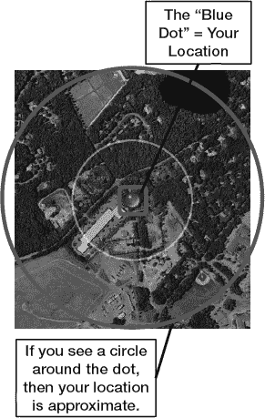

### 更改地图视图

`地图`应用的默认视图是`标准`视图，这是一种基础地图，显示带有街道名称的通用背景。`地图`还可以显示`卫星`视图或`卫星`与`标准`视图的结合——称为`混合`视图。最后，如果你搜索了提供多个结果的内容（例如附近的咖啡馆），`列表`视图会非常方便。当你查询前往某个地点的路线时，它也同样实用。你可以按照以下步骤在所有视图之间切换：

1.  轻点地图右下角翻起的边缘。
2.  地图的角落会向上翻起，显示出用于切换视图、路况、图钉等的按钮。
3.  轻点你要切换到的视图（参见图 20-1）：
    *   `标准`：带有街道名称的常规地图。
    *   `卫星`：不包含街道名称的卫星图片。
    *   `混合`：`卫星`和`标准`视图的结合，即带有街道名称的`卫星`视图。
    *   `列表`：仅当你的搜索返回多个结果（如“星巴克”）或你查询路线时可用。

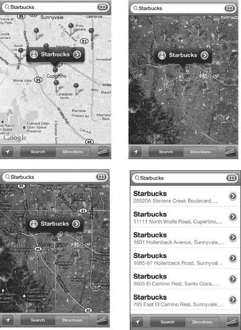

**图 20-1.** *`地图`应用中可用的各种视图：左上角依次为：标准、卫星、混合和列表。*

#### 查看路况

你的`地图`应用不仅能告诉你如何到达某地，还能沿途查看路况。此功能目前仅在美国支持。请按以下步骤查看指定路线的路况：

1.  轻点地图右下角以查看选项。
2.  轻点`显示路况`。

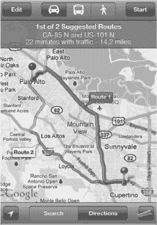

在高速公路上，如果有交通状况，你通常会看到黄色灯光而非绿色灯光。有时，黄色灯光可能会闪烁，以提醒你注意交通延误。

你甚至可能看到`施工工人`图标，表示施工区域。

`地图`在主要街道和高速公路上使用颜色来指示当前交通行驶速度：

*   绿色 = 50 英里/时 或以上
*   黄色 = 25–50 英里/时
*   红色 = 低于 25 英里/时
*   灰色（或无色）= 当前无可用路况数据

### 搜索任何内容

由于`地图`与 Google 地图相连，你可以搜索并找到几乎所有内容：特定地址、商户类型、城市或其他兴趣点，如图 20-2 所示。请按以下步骤搜索特定位置：

1.  触摸屏幕右上角的`搜索`栏。
2.  输入你想要在 iPod touch 上显示地图的地址、兴趣点或市州信息。

#### Google 地图搜索技巧

你几乎可以在`搜索`栏中输入任何内容，包括以下示例：

*   名字、姓氏或公司名称（用于匹配你的通讯录）
*   主街 123 号，城市（街道地址的部分或全部）
*   奥兰多机场（用于查找机场）
*   水管工、油漆工或屋顶工（商户名称或行业的任何部分）
*   高尔夫球场 + 城市（用于查找本地高尔夫球场）
*   电影 + 城市或邮政编码（用于查找本地电影院）
*   Pizza 32174（用于搜索邮政编码 32174 附近的披萨店）
*   95014（美国加利福尼亚州苹果公司总部的邮政编码）
*   Apress

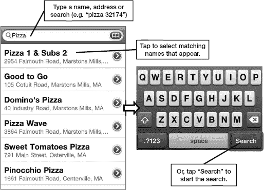

**图 20-2.** *在`地图`应用中进行搜索*

要输入数字，请轻点键盘上的`123`键。要输入字母，请轻点`ABC`键切换回字母键盘。

### 地图选项

当地址显示在`地图`屏幕上后，请按以下步骤访问可用选项：

1.  轻点地址旁边的蓝色`箭头`图标  以查看部分选项。
2.  如果你已显示某位联系人的地图，将看到联系人详细信息，如图 20-3 所示。`地图`还会为特定搜索调出联系信息。你还可以获取路线、共享位置或将位置添加为书签。

**注意：** 你也可以长按地址以调出`拷贝`弹出菜单。

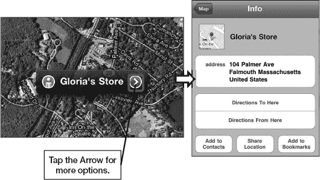

**图 20-3.** *轻点`信息`按钮以查看已显示地图的联系人详细信息*

#### 使用书签

`地图`中的书签功能与`Safari`中的书签功能非常相似。书签只是为你访问过或在地图上标记过、并希望将来记住的位置创建一个记录。查阅书签总是比执行新搜索更方便。

##### 添加新书签

将位置添加书签是简化再次查找该位置的好方法：

1.  在地图上显示一个位置，如图 20-4 所示。
2.  轻点地址旁边的蓝色`信息`图标。
3.  轻点`添加到书签`。

    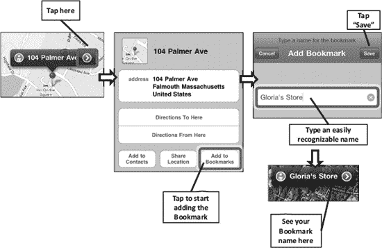

    **图 20-4.** *添加书签*

4.  编辑书签名称，使其简短易识别——此处我们将地址编辑为`格洛丽亚的商店`。
5.  完成后，轻点右上角的`存储`。

**提示**：你可以像在`通讯录`中搜索姓名一样搜索书签名称。

##### 访问和编辑书签

要查看你的书签，请按以下步骤操作：

1.  轻点顶部行`搜索`窗口旁边的`书签`图标。
2.  轻点任意书签即可立即跳转至该位置。
3.  轻点书签顶部的`编辑`按钮以编辑或删除你的书签。
    1.  要重新排列书签顺序，请触摸并拖拽每个书签的右边缘向上或向下移动。
    2.  要编辑书签名称，轻点该书签并重新输入名称。编辑名称后，轻点左上角的`书签`按钮返回书签列表。
    3.  要删除书签，在书签上向左或向右滑动，然后轻点`删除`按钮。
4.  编辑完书签后，轻点`完成`按钮。

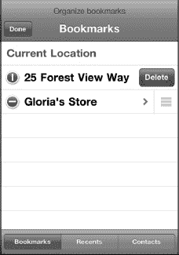

#### 将已标记的位置添加到通讯录

将你在地图上标记的位置添加到通讯录非常简单：

1.  显示一个地址的地图。
2.  轻点`箭头/信息`图标。
3.  轻点`添加到通讯录`。
4.  轻点`创建新联系人`或`添加到现有联系人`。
5.  如果你选择`添加到现有联系人`，则可以滚动或搜索你的联系人并选择一个姓名。该地址将自动添加至该联系人。

#### 搜索附近的商家

请按以下步骤搜索你当前位置附近的商家：

1.  在地图上标记一个位置，或使用蓝点表示你当前的位置。
2.  轻点`搜索`窗口。假设你想搜索最近的披萨店，因此输入“pizza”。这将在地图上标记所有本地的披萨店。
3.  请注意，每个被标记的位置左侧可能有一个`街景`图标，右侧有一个`信息`图标。
4.  你可以双击以放大，或捏合屏幕以缩小或放大。
5.  与任何标记的位置一样，轻点蓝色的`信息`图标会显示所有详细信息，包括披萨店的电话号码、地址和网站，如图 20-5 所示。
6.  如果你需要前往该餐厅的路线，只需轻点`路线到这里`，路线将立即计算出来。

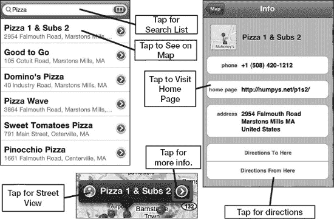

**图 20-5.** *使用信息屏幕对标记的位置执行更多操作。*

**注意**：如果你轻点`主页`链接，将退出`地图`，并启动`Safari`。完成后，你需要重新启动`地图`。

#### 放大和缩小

你可以通过双击和捏合屏幕来进行常规的放大和缩小操作。要使用双击放大，只需像在网页或图片上那样双击屏幕即可。

#### 放置图钉

假设你正在查看地图，发现了某个想设为书签或目的地的地方。

在此示例中，我们正在放大查看波士顿大区。我们偶然发现了芬威球场，并决定将其添加到书签中，于是我们在该位置放置了一个图钉。请按照以下步骤在地图上放置图钉：

1.  标记一个地点，或者将地图移动到你想要放置图钉的位置。

    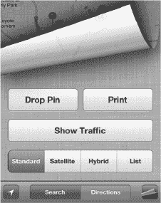

2.  点击地图的右下角。

    

3.  点击**放置图钉**。你也可以直接长按地图上的某个位置来放置图钉。
4.  现在，通过长按图钉，在地图上拖动它。
5.  要移除已放置的图钉或执行其他操作，请点击图钉上方弹出窗口旁的蓝色**箭头**图标 。如果弹出窗口消失了，点击图钉即可重新显示。

    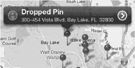

6.  在**信息**屏幕上，你可以获取**路线**、**移除图钉**、**添加到通讯录**、**分享位置**或**添加到书签**。

    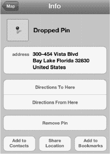

**提示：查找地图上任意位置的街道地址**

当你放置图钉时，谷歌地图会显示实际的街道地址。如果你通过**卫星**或**混合**视图找到某个位置，但需要获取其实际街道地址，这非常方便。

放置图钉也是记录你停车位置的好方法，在陌生地点尤其有用。

#### 使用街景

谷歌街景（参见图 20-6）是 iPod touch 上 **地图** 应用一个非常有趣的功能。谷歌一直在努力拍摄美国及其他地区几乎所有地址的照片。这些照片随后被输入其数据库，当你想要查看目的地或途经点的图片时，显示的就是这些内容。

**注意**：谷歌街景目前仅在少数国家/地区可用：大部分北美、西欧、澳大利亚以及现在的南非。

如果某个地点支持街景，你会在地图上地址或书签的左侧看到一个小的橙色**人物**图标。

在此示例中，我们想查看加里的妻子格洛丽亚在科德角店铺的街景：

1.  为了标记该地址，我们点击了通讯录列表中格洛丽亚名下的工作地址。我们也可以通过在**搜索**窗口中输入地址、搜索某类商家，或者在**通讯录**应用中点击地址来标记它。
2.  **街景**图标显示在格洛丽亚名字的左侧。
3.  我们点击该图标，立即切换到该地址的街景视图。非常酷的一点是，我们可以通过向左、向右、甚至向上或向下滑动，以 360 度旋转的方式浏览屏幕，查看目的地旁边和对面的地方。
4.  要返回地图，我们只需点击屏幕的右下角。

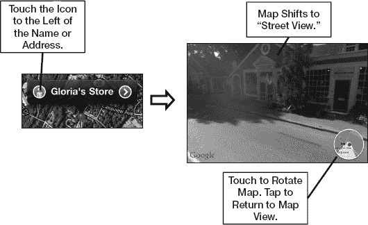

**图 20-6.** *使用谷歌街景*

### 获取路线

**地图**应用最有用的功能之一，是你可以轻松找到前往或来自任何地点的路线。假设我们要获取从当前位置（格洛丽亚的店铺）到波士顿芬威球场的路线。

#### 首先点击“当前位置”按钮

要查找前往或来自你当前位置的路线，你无需浪费时间输入当前地址——iPod touch 会假定你想要从当前位置出发的路线，除非你另行指定。你可能需要点击**位置**按钮几次，直到屏幕上出现蓝点。

现在，你可以执行以下两种操作之一：

*   点击底部的**路线**按钮。
*   像之前那样点击蓝色**箭头**，然后选择**从此处出发的路线**（参见图 20-7）。

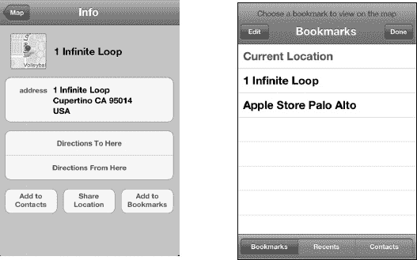

**图 20-7.** *选择**从此处出发的路线**，然后选择**书签***

#### 选择起点或终点

按照以下步骤选择起点或终点，然后选择建议的路线：

1.  点击图钉上方的蓝色**箭头**图标。
2.  点击**从此处出发的路线**。
3.  点击**书签**按钮。
4.  点击**书签**、**最近**或**通讯录**来查找你的目的地。在此示例中，我们点击了**书签**，然后点击了**芬威球场**。

    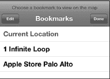

    **注意**：一旦你点击**从此处出发的路线**按钮，你最近的搜索会自动显示（参见图 20-5）。你也可以点击**目的地**框并输入目的地。

    

5.  选择目的地后，路线界面会带你进入一个概览界面。在我们的示例中，我们看到的是从苹果公司 1 Infinite Loop 总部到帕洛阿尔托苹果商店的路线规划界面。
6.  一个绿色的大头针被放置在起点位置，一个红色的大头针被放置在终点位置——在本例中是芬威球场。
7.  一条亮蓝色的线将连接两个大头针，显示你的路线。如果有多条路线，其他路线会以浅蓝色显示。
8.  点击一条灰色路线以选择它。一旦选中，它就会变成亮蓝色，任何其他路线都会褪为浅蓝色。

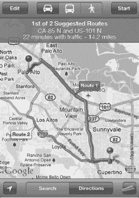

#### 查看路线

在开始行程之前，你会在屏幕的右上角看到一个**开始**按钮。点击**开始**按钮，路线导航就开始了。**开始**按钮会变为**箭头**按钮，允许你在行程的各个步骤之间切换。

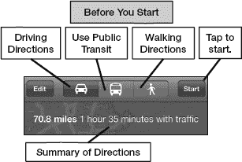

如图 20-8 所示，你可以将路线查看为地图上的路径或列表。

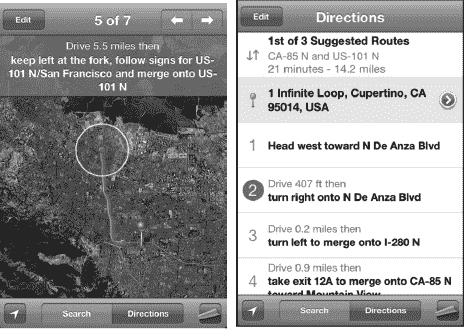

**图 20-8.** *查看路线的两种方式*

你可以用手指移动屏幕来查看路线，或者只需点击底部的**箭头**按钮 ，以逐步快照的方式显示路线。

你也可以点击右下角的**页面卷曲**按钮，然后点击**列表**  按钮，这将显示详细的分步路线。

#### 在路线之间切换

如前一个示例中的步骤 6 和 7 所述，如果有多条可用路线，**地图**应用会用亮蓝色线标记其最佳推荐路线，并将其标记为**路线 1**。如果其他路线也可用，地图会用浅蓝色线标记它们。点击一条灰色线会使其变为亮蓝色，并用相应的数字标记——例如**路线 2**。

如果你根据最近的经验知道施工或其他情况使路线 1 不太理想，或者你需要在沿途某个不在推荐的路线 1 上的地点停靠，那么切换到另一条路线是一个很好的选择。

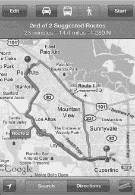

#### 在驾车、公交和步行路线之间切换

在开始导航之前，你可以通过点击路线界面顶部蓝色栏左侧的图标（如图 21-9 所示），选择你是驾车、使用公共交通还是步行。

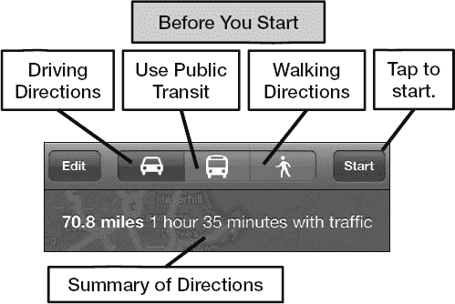

**图 20-9.** *选择你的出行方式*

#### 反向路线

要反向路线，请点击位于顶部**起点**和**终点**字段之间的**反向**  按钮。如果你不太擅长自己反向导航，或者你的路线包含很多单行道，这将会很有用。

### 地图选项

目前，唯一会影响您`地图`应用的设置是`定位服务`，它对确定您的当前位置至关重要。请按照以下步骤调整`地图`应用的设置：

1.  点击`设置`图标。
2.  点击`定位服务`。
3.  确保`定位服务`开关处于`开启`位置，以便`地图`能够估算您的位置。

**注意：** 保持`定位服务`开关`开启`会少量减少电池续航时间。如果您从不使用`地图`或不在意您的位置，请将其设为`关闭`以节省电池电量。

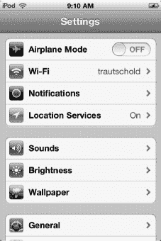

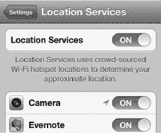

