# 第 21 章

## 您设备上的 iTunes

在本章中，您将学习如何直接在 iPod touch 上使用`iTunes`应用查找、购买和下载媒体。通过`iTunes`，您将能够下载音乐、影片、电视节目、播客和有声读物。您还将了解如何从 iTunes 上的`iTunes U`板块获取顶尖大学的免费教育内容，以及如何兑换 iTunes 礼品卡。

我们有些人还记得当年去唱片店购买新单曲或专辑的情景。浏览所有我们想要的音乐，从黑胶唱片到磁带到最终的 CD，那种感觉令人兴奋不已。

那些日子随着 iPod touch 的到来早已一去不复返。音乐、影片、电视节目等更多内容，可以直接从 iPod touch 本身获取。

iTunes 是一个音乐、视频、电视、播客等内容的商店。几乎所有您能在 iPod touch 上消费的媒体类型，都可以直接从 iTunes Store 购买或租借（而且通常免费）。

### 开始使用 iTunes

在本书前面部分，我们向您展示了如何将电脑上 iTunes 中的音乐传输到您的 iPod touch 中（见第 3 章：“与 iCloud、iTunes 等同步”）。iTunes 的一大优点是，该商店让您能非常轻松地购买或获取音乐、视频、播客和有声读物，然后在几分钟内就在您的 iPod touch 上使用它们。

iPod touch 允许您直接在设备上访问 iTunes 网站（移动版）。当您购买或请求免费项目后，它们将被下载到 iPod touch 上的`音乐`或`视频`应用。如果您有 iCloud 并开启了自动下载，您购买的任何音乐都会自动下载到您的其他 iOS 设备和电脑上的 iTunes 中。影片将在您下次与桌面 iTunes 资料库同步时传输。

#### 需要网络连接

您需要有一个活跃的互联网连接才能访问 iTunes Store。请参阅第 4 章：“连接到网络”以了解更多信息。

#### 启动 iTunes

当您首次收到 iPod touch 时，`iTunes` 是第一个`主屏幕`页面上的图标之一。点击`iTunes`图标，您将进入 iTunes Store 的移动版。

**注意：** `iTunes`应用会经常更新。由于`iTunes`应用本质上是一个网站，因此从我们编写本书到您在 iPod touch 上查看它之间，其内容很可能会有所变化。某些屏幕图像或按钮可能与本书中显示的略有不同。

此外，iTunes 的内容因国家/地区而异。取决于您居住的地方，您可能无法访问某些影片、电视节目或其他媒体。然而，苹果公司正不断将 iTunes 内容添加到越来越多的地区，所以请务必偶尔回来看一下。

#### 浏览 iTunes

`iTunes`应用使用的图标与 iPod touch 上的其他程序类似，因此操作起来相当简单。顶部有三个按钮，底部有五个软键可以帮助您。您可以自定义这些软键，我们将在下一节中向您展示具体方法。请注意右侧图片底部的软键。在`iTunes`中滚动与其他任何程序中的滚动方式相同；上下移动手指即可查看可用的选项。

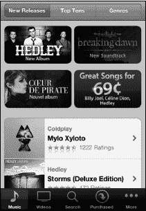

### 自定义 iTunes 软键

自定义 iTunes 屏幕底部显示的软键很简单。点击左下角的`更多`软键。然后点击右上角的`编辑`。

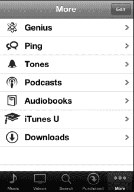

现在，您可以通过将顶部的任意图标拖放到底部的软键工具栏上来更改软键。您放置的任何项目都将替换当前所在位置的图标。

点击`完成`以完成更改并返回 iTunes。

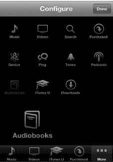

### 通过新发行、排行榜前十和流派查找音乐

在 iTunes 音乐商店屏幕的顶部有三个按钮：`精选`、`排行榜`和`Genius`。默认情况下，当您启动`iTunes`时，会显示`精选`内容。

#### 排行榜前十：热门内容

如果您想知道某个特定类别中的热门内容，您会想要浏览`排行榜前十`下的分类。点击顶部的`排行榜前十`，然后点击一个类别或流派，查看该类别中的热门内容。

**注意：** `排行榜前十`类别中的项目销量很好，但这并不意味着它们一定会吸引您。在您付费之前，务必预览某个项目并查看其评价。

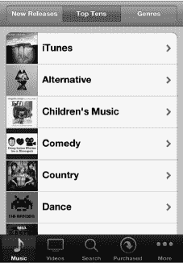

#### 流派：音乐类型

点击`流派`按钮，根据流派浏览音乐。如果您有最喜欢的音乐类型并只想浏览该类别，这尤其有用。

有大量的流派可供浏览；只需像在其他任何 iPod touch 应用中那样上下滚动列表即可。

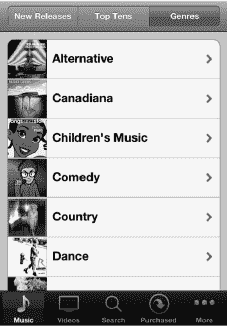

请自行浏览音乐，直到看到您想预览或购买的内容。

#### 浏览视频（影片）

点击顶部的`影片`、`电视节目`或`电影视频`按钮，浏览所有与视频相关的项目。

您也可以用手指一直滚动到页面底部，查看那里的链接，特别是以下链接：

*   排行榜前十
*   流派

**提示：** 在大多数页面的最底部，您还可以兑换礼品卡，或退出您的 Apple ID 并登录另一个 Apple ID 账户。如果有人（也许是您的孩子）更改了 Apple ID 而您想切换回自己的账户，这将非常有用。

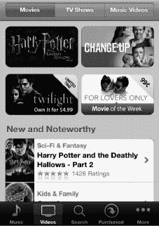

点击任何影片或视频以查看详情或预览选项。您可以选择租借或购买部分影片和电视节目：

*   **租借：** 某些影片可供租借，并有固定的天数限制。点击此按钮租借一个节目。

    **注意**: 美国的租借期为 24 小时，加拿大的租借期为 48 小时。其他国家的租借期可能略有不同。

*   **购买：** 点击此按钮可永久购买并拥有该影片或电视节目。

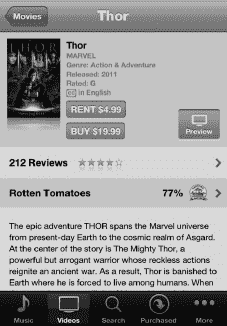

#### 寻找电视节目

浏览完电影后，点击顶部的`电视节目`按钮，即可查看你喜爱的节目中有哪些可供选择。

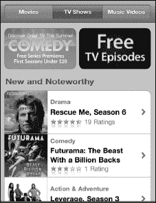

当你点开一个电视剧集时，会看到可用的单集内容。点击任意一集即可观看 30 秒的预览（关于观看视频的更多信息，请参阅第 14 章：“观看视频”）。预览结束后，点击`完成`按钮。

当你准备好后，可以购买单集或整季电视剧。如图 21-1 所示，很多（但并非所有）电视剧都允许你单独购买单集。

例如，你或许想补看《摩登家庭》中错过的试播集。在你的 iPod touch 上可以快速轻松地完成这一操作。

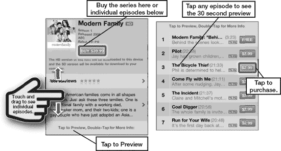

**图 21-1.** *购买电视剧季或单集*

**注意**：还有一个`免费电视节目`类别，你可以在这里获取样片和额外内容。

#### iTunes 中的有声读物

有声读物是一种无需阅读就能享受书籍的绝佳方式。有些朗读者听起来非常有趣，几乎就像看电影一样。例如，《哈利·波特》系列的朗读者能够演绎出几十种令人惊叹的声音。我们建议你在 iPod touch 上尝试一下有声读物；当你在飞机上想要逃离其他乘客，但又不想开灯时，有声读物尤其出色。

**提示**：如果你是一位有声读物重度听众，订阅 Audible.com 可以以更低价格获得相同的内容。

如果你是一位有声读物爱好者，请务必查看 iTunes 中的`有声读物`版块。

你可以点击顶部三个按钮之一，浏览`有声读物`中的以下区域：

- 精选
- 十大
- 分类

### iTunes U：优质教育内容

如果你喜欢教育内容，请查看`iTunes U`版块。你将能够看到你的大学、学院或学校是否有自己的专区。

我们仅浏览了几分钟就发现了一个很好的例子：一场由保罗·索尔曼（PBS News Hour 的经济事务记者）主持、三位诺贝尔奖得主经济学家参与的小组讨论。你可以通过以下菜单导航找到该播客：`iTunes U` > `大学与学院` > `波士顿大学` > `BUNIVERSE - 商业` > `音频`。与`iTunes U`中的许多内容一样，这个播客是免费的！

如果你所在的区域无线信号良好，你可以点击音频或视频项目的标题，然后进行流式播放。但是，如果信号中断，你将丢失视频的播放进度。如果可能的话，将文件实际下载下来留待以后观看有很多好处，其中最重要的一点是你能获得更多对视频观看体验的控制。

### 下载以供离线观看

如果你知道自己将会有一段时间没有无线网络覆盖，例如在飞机上或地铁里，你需要将内容下载下来以供日后离线观看或收听。点击`免费`按钮，它会变成`下载`按钮，然后再点击一次。你可以通过点击屏幕右下角的`下载`按钮来监控下载进度（一些较大的视频可能需要十分钟或更长时间才能完成）。下载完成后，该项目将显示在`音乐`或`视频`应用的相应区域中。

### 搜索 iTunes

有时你很清楚自己想要什么，但不确定它在哪里，或者你不想浏览或翻阅所有菜单。`搜索`工具就是为你准备的。

在`iTunes`应用的右上角（几乎与所有其他 iPod touch 应用一样），有一个`搜索`窗口。

触摸`搜索`，`搜索`窗口和设备键盘将弹出。一旦你开始输入，iPod touch 将开始匹配你输入的内容并显示可能性。

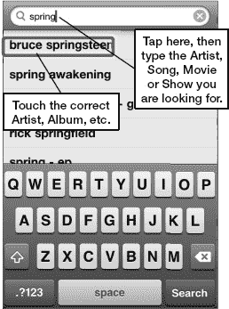

输入你正在搜索的艺人、歌曲名称、视频名称、播客名称或专辑名称，iPod touch 将显示详细的匹配结果。你可以进行宽泛搜索，也可以进行精确搜索。如果你只是想浏览某位艺人的所有特定歌曲，请输入艺人的名字。如果你想要某首具体的歌曲或专辑，请输入歌曲或专辑的全名。

当你找到歌曲或专辑名称时，只需点击它，就会被带到购买页面。

### 购买或租赁音乐、视频、播客等

一旦你找到一首歌、一个视频、一个电视节目或一张专辑，你可以点击`购买`按钮，或者（如果看到的话）`租赁`按钮。这样你的媒体文件就会开始下载。（如果内容是免费的，你会看到`免费`按钮，点击后会变成`下载`按钮。）

我们建议你先查看或收听预览，并查看用户评价，除非你百分之百确定要购买该项目。

**注意：** 你也可以从 iTunes 商店为你的 iPod touch 购买*铃声*。

#### 预览音乐

点击歌曲的标题或其左侧的曲目编号；这会将专辑封面翻转过来并打开预览窗口。

你将听到该歌曲一段时长 90 秒的代表性片段。

点击`停止`按钮，曲目编号将再次显示。

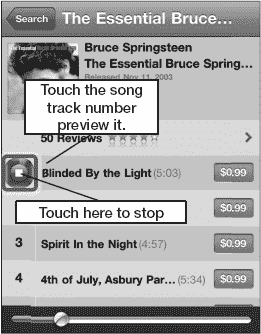

#### 查看用户评价

iTunes 中的许多项目都提供用户评价。评价从最低的一星到最高的五星不等。

**警告：** *请注意，评价中可能包含不雅语言。* 很多评价是干净的；然而，有些确实包含不雅语言，iTunes 商店可能无法立即发现。

阅读评价可以让你很好地判断自己是否想购买该项目。

#### 预览视频、电视节目或音乐视频

iTunes 上几乎所有的东西都提供预览。有时你会看到一个`预览`按钮，例如对于音乐视频和电影。电视节目则略有不同；你需要点击剧集标题才能看到 30 秒的预览。

我们强烈建议你在 iTunes 上购买商品之前，先查看评价并尝试预览。

典型的电影预览或预告片会超过 30 秒。有些会长达两分半钟或更久。

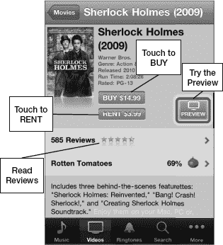

#### 购买歌曲、视频或其他项目

一旦你确定要购买一首歌、一个视频或其他项目，请按照以下步骤进行购买：

1.  点击歌曲的`价格`按钮或`购买`按钮。
2.  按钮会发生变化，变成一个绿色的`立即购买`、`购买歌曲`、`购买单曲`或`购买专辑`按钮。
3.  点击`购买`按钮。
4.  你会看到一个动态图标跳入购物车。输入你的 iTunes 密码，然后点击`确定`完成交易。

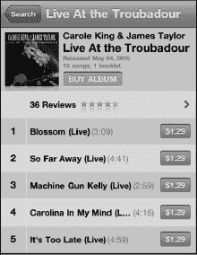

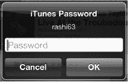

点击`更多`按钮，然后点击`下载`，即可查看专辑中每首歌曲的下载进度。

然后，这首歌曲或这张专辑将成为你音乐库的一部分，并且下次你将 iPod touch 连接到电脑上的 iTunes 时，它将会与你的电脑同步。注意：iCloud 会自动进行此同步。

下载完成后，你将能在`音乐`应用的相应类别中看到新的歌曲、有声读物、播客或 iTunes U 播客。

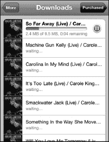

**注意**：购买的视频和 iTunes U 视频会进入你 iPod touch 上的`视频`应用，播客则会显示在`音乐`应用中。

### iTunes 中的播客

播客通常是一系列音频片段；这些片段可能频繁更新（例如国家公共广播电台的整点新闻），也可能完全不做更新（例如某特定主题单次演讲的录音）。

您可以点击顶部三个按钮来浏览 iTunes 中的播客分类：

- 热门推荐
- 排行榜前十
- 分类

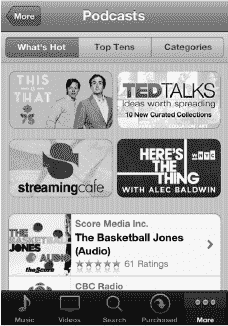

#### 下载播客

播客有视频和音频两种类型。当您找到某个播客后，只需点击该播客的标题（参见图 21-2）。幸运的是，大多数播客都是免费的。如果是免费的，您会看到一个 `Free` 按钮，而不是常见的 `Buy` 按钮。

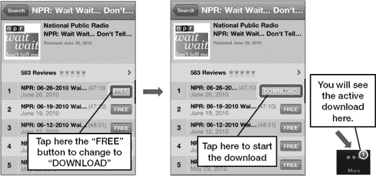

**图 21-2.** *下载一个 NPR 播客*

当您点击该按钮时，它会变成一个绿色的 `Download` 按钮。点击 `Download`，一个动态图标会跳入底部软键栏中的 `Downloads` 图标内。显示的小红色数字反映了正在下载的文件数量。

#### 下载图标：停止和删除下载

当您下载项目时，它们会出现在您的 `Downloads` 屏幕中。此行为与电脑上 `iTunes` 应用的行为类似。

您可以点击 `More` 软键，然后点击 `Downloads` 标签页，查看所有下载的进度。

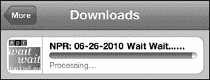

#### 下载内容的存储位置

您可以通过点击 `More` 图标，在 `Music` 或 `Videos` 应用中查看所有下载内容，该图标会按分类显示您的下载。换句话说，如果您下载了一个播客，您需要进入 `Music` 应用，点击 `More`，然后找到 `Podcasts` 标签页，才能看到已下载的播客。

有时，您可能决定不想要所有已选择的下载。如果您想停止下载并删除它，只需用手指在该下载项上滑动，调出 `Delete` 按钮，然后点击 `Delete`（参见图 21-3）。

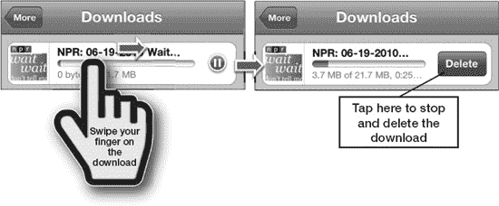

**图 21-3.** *下载过程中删除文件*

### 兑换 iTunes 礼品卡

iPod touch 上 `iTunes` 应用的一个很酷的功能是，就像您电脑上的 `iTunes` 应用一样，您可以兑换礼品卡并将款项存入您的 iTunes 账户用于购买。

在 `iTunes` 屏幕底部，您应该能看到 `Redeem` 按钮（参见图 21-4）。

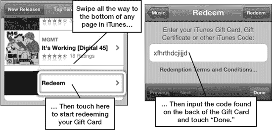

**图 21-4.** *兑换 iTunes 礼品卡*

点击 `Redeem` 按钮，开始输入您的 iTunes 礼品卡号码以获得 iTunes Store 信用额度的流程。

### Ping

Ping 是苹果公司的音乐社交网络。您可以通过点击标签栏底部中央的 `Ping` 按钮来访问它。

通过 Ping，您可以查看您关注的艺术家和用户正在购买和评论的音乐，而您的关注者也可以看到您购买和评论的音乐。Ping 还允许您推文发布您的购买信息。

Ping 包含三个部分：

- `Activity`：显示您所关注的所有人的购买和评论动态。您可以查看 `All`（全部）动态、仅 `Artists`（艺术家）动态，或仅 `People`（非艺术家用户）动态。
- `People`：列出您所有 `Follow`（关注）的其他 Ping 用户；列出 `Follow`（关注）您的 Ping 用户；以及列出 Ping 认为您可能感兴趣的 `Featured`（精选）、`Recommended Artists`（推荐艺术家）和 `Recommended People`（推荐用户）。
- `My Profile`：显示您自己最近的所有活动，并允许您访问 `My Info`，其中显示了您的个人资料信息以及您喜爱的音乐的专辑封面。

**注意：** 在撰写本文时，Ping 尚未获得显著的流行度。如果您是狂热的音乐爱好者，并且您和您的朋友从 iTunes 购买大量音乐，那么我们当然建议您至少尝试一下。不过，您也可能会发现像 Twitter 和 Facebook 这样更成熟（可能也更通用）的社交网络更合您的口味。

