# 第 22 章

## 神奇的 App Store

您刚刚已经见识到，直接从 iPod touch 上的 iTunes 下载音乐、视频和播客是多么简单。您也见识到了从 iBooks 商店下载 iBooks 是多么容易。

从苹果公司神奇的 App Store 下载新应用也同样简单。应用几乎涵盖了您能想到的任何功能：游戏、生产力工具、社交网络，以及您能想象的任何其他东西。正如广告所说，*总有那么一款应用*。

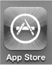

在本章中，您将学习如何浏览 App Store，以及如何搜索和下载应用。您还将学习如何在应用下载到您的 iPod touch 后对其进行维护和更新。

### 了解更多关于应用和 App Store 的信息

在本章中，我们将重点介绍如何直接从您的 iPod touch 访问 App Store。但是，您应该记住，您也可以使用 Mac 或 PC 上的 `iTunes` 程序在 App Store 中购物（参见图 22-1）。

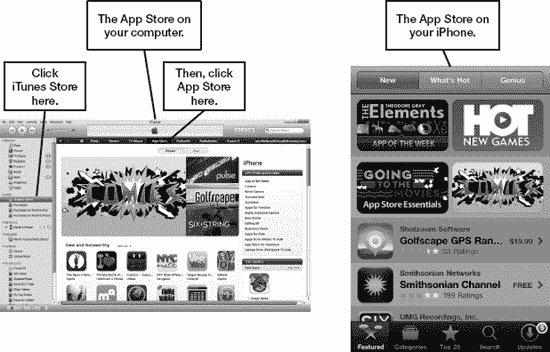

**图 22-1.** *从电脑上的 `iTunes` 程序或 iPod touch 上的 `App Store` 图标访问 App Store*

在很短的时间内，App Store 已经火爆流行起来。几乎任何您能想象到的功能都有对应的应用。这些应用涵盖了各种价位；在许多情况下，应用甚至是免费的！

#### 在哪里找到应用资讯和评论

您可以在 App Store 本身中找到许多应用的评论，我们建议您查看 App Store 的评论。但有时，您可能希望从专业评论者那里获得更多信息。如果是这样，博客是获取特定应用或内容资讯和评论的好地方。

以下是列出了一些包含应用评论的、与苹果 iPhone 和 iPod 相关的博客：

- The iPhone Blog：`www.tipb.com`
- Touch Reviews：`www.touchreviews.net`
- Touch Arcade：`www.toucharcade.com`
- The Unofficial Apple Weblog：`www.tuaw.com`
- 148apps：`www.148apps.com`
- App Advice：`www.appadvice.com`

### App Store 基础操作

只需稍加熟悉，您就会发现 App Store 的导航非常直观。我们将介绍一些基础知识，帮助您充分利用 App Store，让您的体验尽可能愉快且高效。

**注意：** 应用的可获取性因国家而异。某些应用仅在部分国家提供，并且由于当地的分级法律，某些国家可能没有特定的游戏版块。

#### 需要网络连接

在您设置好 App Store（iTunes）账户后，您仍然需要具备正确的网络连接才能访问 App Store 并下载应用。请查看第 4 章：“连接到网络”，了解如何判断您是否已连接。

#### 启动 App Store

`App Store` 图标应位于 `Home` 屏幕上的第一页图标中。点击该图标即可启动 `App Store` 应用。

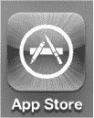

好的，作为一名高级文档工程师和翻译员，我将严格遵循您的注意事项和示例格式，将给定的英文文本翻译成中文。

#### App Store 首页

我们将介绍 App Store **首页**的几个部分：顶部栏、中间内容和底部软按键。

我们先来看顶部栏。如 图 22–2 所示的页面顶部，您会看到三个按钮：**新内容**、**热门**和 **Genius**。轻点其中任意一个按钮即可切换视图。

**提示：** **Genius** 是一项基于您已在 iPod touch 上下载并安装的 App 来推荐您可能喜欢的 App 的功能。这是一种从成千上万个 App 中筛选出您可能感兴趣的 App 的绝佳方式。

页面中间是您的主内容区域。此主内容区域会显示 App 列表或您正在查看的特定 App 的详细信息。您可以向上或向下滑动以查看列表中的更多 App 或特定 App 的详细信息。您还可以在查看屏幕截图时向左或向右滑动。在**精选** App 页面，您会注意到顶部有几个大型图标。点击这些图标将显示 App 类别或单个 App。在大型图标下方（您需要向下滑动），您会看到许多精选 App。

App Store **首页**底部有五个软按键：

-   **精选**：显示由 App Store 或 App 开发者重点推荐的 App。
-   **类别**：显示用于组织 App 的类别列表，以便您按类别浏览。
-   **Top 25**：显示销量最高或下载量最多的 App。
-   **搜索**：使用输入的搜索词查找 App。
-   **更新**：允许您更新已安装的任何 App，并重新下载您已获取的任何 App。

您可以通过 图 22–2 底部一行的软按键中**精选**按键被高亮，看出当前显示的是**精选** App。滚动操作与其他程序相同——只需上下移动手指即可滚动浏览页面。

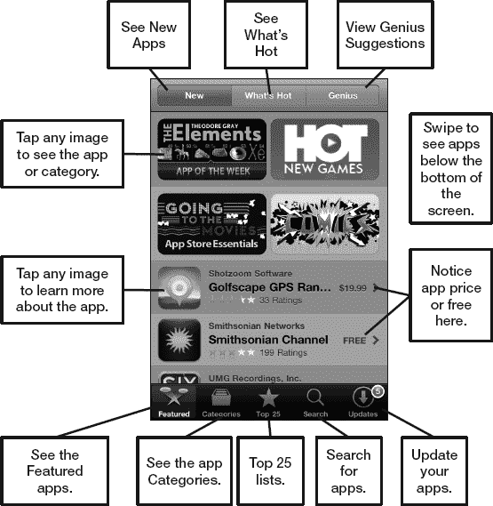

**图 22–2.** *App Store **首页**的布局*

**注：** App Store 本质上是一个网站，因此会频繁更新。本书出版后，App Store 的某些细节和细微差别可能会略有不同。

### 查看 App 详情

如果您在列表中看到某个感兴趣的 App，请轻点它以了解更多信息。该 App 的**详情**屏幕包括其价格、描述、屏幕截图和评论（参见 图 22–3）。您可以利用这些信息来帮助判断该 App 是否适合您。

在**信息**页面上向下滑动可阅读关于该 App 的更多详细信息。向左或向右滑动可查看更多 App 的屏幕截图。轻点底部的**评分**按钮可阅读该 App 的所有评论。

您还可以在**信息**页面底部附近查看 App 的其他详细信息，例如其文件大小、版本号和开发者信息。

您还可以使用屏幕底部的按钮**告诉朋友**或**报告问题**。

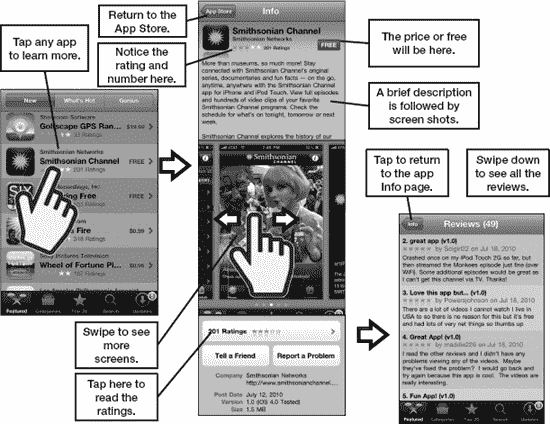

**图 22–3.** *查看 App 的详细信息*

### 查找要下载的 App

如果您想搜索要下载的 App，请先从默认视图开始浏览，该视图显示**精选** App。向下滚动页面以查看所有精选 App。

#### 查看新 App

App Store 中的默认视图会显示新 App 和精选 App。这就是之前在 图 22–2 中显示的视图。您可以通过屏幕底部高亮的**精选**软按键 `` 和页面顶部按下的**新内容**按钮 `` 来判断此视图显示的是新的精选 App。

#### 查看热门内容

轻点屏幕顶部的**热门**按钮，商店中最“热门”的 App 将显示在屏幕上。同样，浏览最热门的 App，看看是否有让您眼前一亮的。

**注：** 某个 App 位于“热门”类别，并不一定意味着您也会认为它有用或有趣。在购买任何东西之前，请仔细查看 App 的描述和评论。

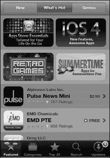

#### Genius

**精选** App 区域顶部的第三个按钮会带您进入 **Genius** 功能。此功能的工作原理类似于在电脑上播放音乐的 **iTunes** App 中的同名功能。例如，它会根据您已在 iPod touch 上安装的 App 来显示您可能喜欢的 App。

**注：** 首次使用 Genius 功能时，您必须接受显示的条款和条件，该功能才会启用。

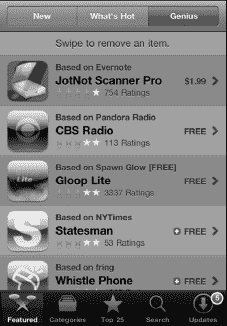

##### 基于

请注意每个 App 上方都有一个**基于（*App 名称*）**标签。此标签向您显示，建议的 App 是基于您已在 iPod touch 上安装的特定 App。例如，推荐 **CBS Radio** 是基于已安装了 **Pandora Radio**。我们之前不知道 CBS Radio，但基于此推荐，我们或许会尝试一下。

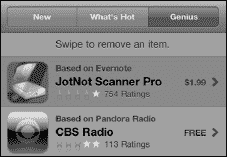

##### 滑动以移除

如果您不喜欢某个 Genius 建议，可以在其上向左或向右滑动以调出**删除**按钮，就像您在 iPod touch 上从列表中删除电子邮件或其他项目一样。轻点**删除**按钮即可从列表中移除该 App。

##### 禁用 Genius 功能

要禁用 Genius 功能，您需要进入 **App Store** 的设置（请参阅本章后面的“App Store 设置”部分以了解如何禁用此功能）。

#### 类别

``

有时，呈现的所有选择可能会让人有点不知所措。如果您知道自己想找什么类型的 App，请轻点底部一行的软按键中的**类别**按钮（参见图 23–4）。

当前可用的类别如 表 23-1 所示。

``

**注：** 所列的类别是可变的，并且会随时间变化，因此您看到的类别在本书到达您手中时可能已经发生了变化。

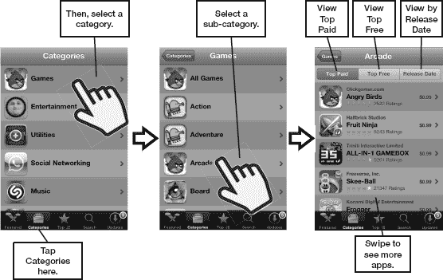

**图 22–4.** *按类别查看 App——此例为**游戏***

#### 查看 Top 25 榜单

``

轻点底部一行的**榜单**软按键，App Store 将再次切换视图。这一次，您将看到前 25 名付费、免费和收入最高的 App。只需轻点顶部的**付费排行**、**免费排行**或**收入排行**按钮之一即可在视图间切换。

**注：** **收入排行**类别指的是收入最高的 App，即销量乘以售价。此视图将帮助价格更高的 App 在榜单上排名更高。例如，一个售价 4.99 美元、销量为 10,000 单位的 App，在**收入排行**图表上的排名将远高于一个售价 0.99 美元、销量相同的 App。

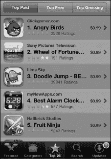

#### 搜索应用

![]（images/p473-01.jpg）

假设您对想找的应用类型有明确的想法。轻触`search`软键，然后输入程序名称或程序类型。

因此，如果您正在寻找一个能帮助您划船的应用，只需输入 `rowing` 看看会出现什么结果。

您可能会看到一些建议的搜索词出现；轻点这些词以缩小搜索范围。

![]（images/p473-02.jpg）

在建议的搜索词中轻点`rowing stats`只会得到一个结果。

![]（images/p473-03.jpg）

我们想看到所有与划船相关的应用，因此在`search`栏中轻点，并使用`backspace`键擦除单词 `stats`。接着，轻点右下角的`search`按钮，以查看更广泛的划船相关结果列表。

**提示：** 如果您是在水上划船（而不仅仅是在划船机上），您可能会想看看`speedcoach mobile`，售价为 $64.99。还有一个免费的（在撰写本文时）替代品叫做`irowpro`。

![]（images/p473-04.jpg）

### 下载应用

一旦找到您想要的应用，就可以直接将其下载到您的 iPod touch 上，如 [图 22–5]（#Chapter22.html#fig_22_5）所示。

找到您想购买的应用后，注意那个写着`free`或`$0.99`（或任何价格）的小按钮。

轻触那个按钮，它会变为`install`（如果是免费程序）或`buy now`（如果是付费程序）。

![]（images/p474-01.jpg）

![]（images/2205.jpg）

**图 22–5.** *购买应用或下载免费应用*

阅读完评价和应用描述（可能还访问了开发者支持网站）后，继续下载或购买该应用。轻触`download app`按钮后，系统会提示您输入 iTunes 密码。

输入密码并轻点`ok`；应用将下载到您的 iPod touch 上。

#### 将应用作为礼物赠送

在每个应用的详情页面底部附近，您会看到一个`gift this app`按钮，您可以用它通过电子邮件将应用作为礼物赠送给任何人。操作方法如下：

1.  调出**您要赠送的应用的详细信息**。向下滑动到页面底部，轻点`gift this app`。

    ![]（images/p475-01.jpg）

2.  登录您的 iTunes 帐户以查看下一页。
3.  确认接收礼物的人的设备满足所示要求。

    ![]（images/p475-02.jpg）

4.  输入**您的姓名**、**接收者姓名**和**电子邮件**。然后向下滚动输入一条个人消息。赠送的应用通过电子邮件发送。
5.  轻点`next`。

    ![]（images/p476-01.jpg）

6.  在最终屏幕上，您可以确认一切看起来是否正确：您的消息、接收者的电子邮件。
7.  要完成赠送并将电子邮件发送给接收者，轻点底部的`buy gift`。

    ![]（images/p476-02.jpg）

#### 寻找免费或折扣应用

在浏览了一圈之后，您会注意到 App Store 的几件事。首先，有很多*免费*应用。有时这些是很好的应用。其他时候它们则不那么有用——但仍然可能很有趣！

其次，您会注意到有些应用会进行促销，而其他应用则会随着时间推移变得便宜。如果您有一个喜欢的应用，今天售价 $6.99，等几周或一个月再买，您可能会看到它的价格下降。

### 兑换礼品卡或 iTunes 代码

您可以滑动到 App Store 中大多数页面的底部来兑换礼品卡或 iTunes 代码。

在底部，轻点`redeem`按钮。

![]（images/p477-01.jpg）

在下一个屏幕上输入您的代码。（您可能需要刮掉礼品卡背面的涂层才能看到代码。）

轻点`redeem`按钮。

![]（images/p477-02.jpg）

### 维护和更新您的应用

开发者通常会为 iPod touch 更新他们的应用。您无需使用电脑进行更新——可以直接在 iPod touch 上完成。

您甚至可以通过查看`app store`图标来了解是否有更新以及有多少更新。这里显示的图标有五个应用更新可供下载。

![]（images/p477-03.jpg）

进入 App Store 后，轻点底部最右侧的图标。这是`updates`图标。

![]（images/p478-01.jpg）

如果您的应用有可用更新，会有一个红色的小数字提示。这个数字对应有更新的应用数量。

当您轻点`update`按钮时，iPod touch 会显示哪些应用有更新。

![]（images/p478-02.jpg）

要获取更新，您可以逐个轻触应用。但更简单的方法是轻点右上角的`update all`按钮 ![]（images/p478-03.jpg），一次性更新所有应用。iPod touch 会离开 App Store，您可以在小状态栏中查看更新进度。所有正在更新的应用图标会显示为灰色。

一些状态消息会显示`waiting`，而另一些则会显示`loading`或`installing`。更新完成后，所有图标将恢复为正常颜色。

![]（images/p478-04.jpg）

**注意：** 您需要重新启动`app store`应用才能返回。更新过程会将您完全带出商店。

#### 重新下载应用

一旦您下载了某个应用，无论是免费还是付费，您都可以随时再次下载，无需额外付费。例如，假设您购买了一款应用在度假时使用。旅行结束后，您可以安全地删除它，然后在下次旅行时再次下载。这有助于保持您的`home`屏幕整洁，并防止 iPod touch 存储空间不足。

要获取您之前购买或下载的应用列表，请轻点`update`按钮，然后轻点屏幕最顶部的`purchased`标签。

![]（images/p479-01.jpg）

在`purchased`部分，您有两种视图选择。首先，您可以查看所有曾经购买或下载的应用列表。或者，您可以查看当前*未*安装在 iPod touch 上的应用列表。

**注意：** 您是否看到一些不记得购买或下载的应用？如果是这样，可能是因为您在 iPhone 上下载了应用、在 iPad 上购买了通用应用，或者您的 iTunes 帐户与曾在其设备上下载过应用的配偶或家庭成员共享。

![]（images/p479-02.jpg）

### 自动下载

iCloud 在线服务允许您设置 iPod touch，使其自动下载并安装您通过 Windows 或 Mac 电脑上的 iTunes——甚至是其他 iOS 设备（如 iPad）上购买的任何应用。

按照以下步骤开启自动下载：

1.  轻点`settings`图标。
2.  向下滚动并轻点`store`。
3.  将`apps`的`automatic downloads`切换为`on`。

![]（images/p480-01.jpg）

如果您不再希望自动下载应用，只需将`apps`的`automatic downloads`切换回`off`即可。

### 其他 App Store 设置

在 `App Store` 应用的设置中，你还可以检查当前登录到商店的是哪个账户、注销登录、关闭 Genius 功能、查看你的 iTunes 账户，以及管理你的资讯订阅。

**提示：** 如果你想阻止他人使用你的 iTunes 账户在你的 iPod touch 上购买应用，你需要按照接下来描述的步骤退出登录 iTunes。

按照以下步骤更改 `App Store` 应用的其他设置：

1. 注意，你可以在该屏幕顶部看到你当前登录的账户。
2. 如果你希望退出登录 iTunes 服务，请轻点“`退出登录`”。例如，你可能将 iPod touch 交给某个人，而你不希望此人使用你的手机并通过你的 iTunes 账户购买应用。
3. 轻点“`查看账户`”以查看你账户的详细信息（你需要登录）。

   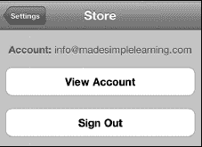

4. 右侧的图示显示了你的账户信息。轻点“`付款信息`”以调整你的账单信息（例如，你的信用卡类型和卡号）。
5. 轻点“`账单地址`”以更新你的地址。
6. 轻点“`更改国家或地区`”以更改你的国家或地区。

   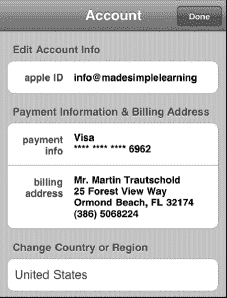

7. 向下滚动以查看更多设置。
8. 你可以“`关闭 App  Genius 功能`”（如果该功能已关闭，此按钮将允许你将其开启）。或者，你可以在此对话框中“`订阅`”或“`取消订阅`”iTunes 资讯。
9. 完成后，轻点右上角的“`完成`”。

