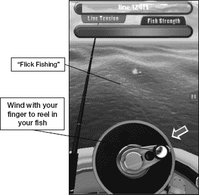
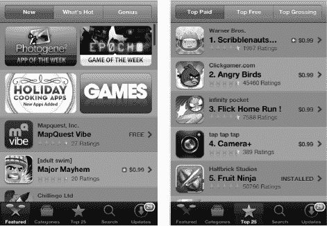
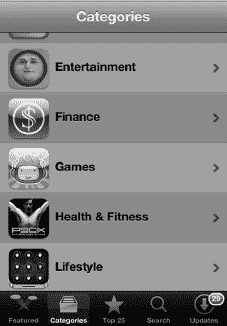
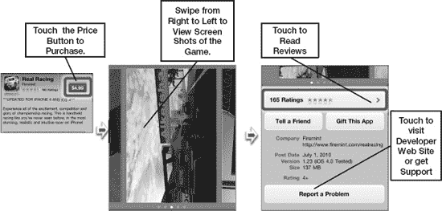
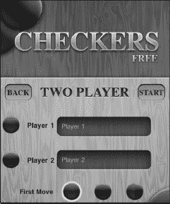
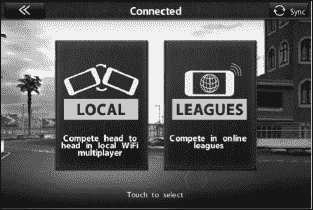
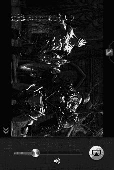
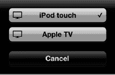

# 第 23 章

## 游戏与娱乐

你的 iPod touch 在诸多方面都表现出色。它是一款多媒体利器，能够管理你忙碌的生活。iPod touch 尤其擅长两个领域：作为游戏设备，以及运行那些充分利用其精美高分辨率触摸屏和强大图形处理器的应用。你甚至能找到一些流行游戏的 iPod touch 版本，而这些游戏你可能本以为只有在专用游戏主机上才能玩到。

iPod touch 为便携游戏带来了诸多优势：高清（HD）屏幕呈现逼真的视觉效果；高品质音频提供出色的音效；陀螺仪和加速计让你能以许多 PC 和（除 Wii 外的）专用游戏主机所不具备的方式与游戏互动。例如，在赛车游戏中，后者这一特性让你可以通过手持 iPod touch 并转动它来操控方向。

借助 AirPlay 镜像功能，你甚至可以将游戏画面投射到同一 Wi-Fi 网络上的 Apple TV 上，并在你的大屏幕电视上进行游戏。

iPod touch 也非常适合其他许多有趣的活动，比如关注你当地的棒球队，甚至借助像 `Ocarina` 这样出色的应用（我们将在本章稍后介绍），将 iPod touch 当作一种乐器来使用。

### 将 iPod touch 用作游戏设备

iPod touch 包含内置的加速计和 `gyroscope`（陀螺仪），它本质上是一种能够检测运动（加速度）和倾斜度的设备。

将加速计与出色的屏幕、大容量内存以及快速处理器相结合，你就拥有了一个出色游戏平台的构成要素。由于有数以千计的游戏可供选择，你几乎可以在 iPod touch 上玩任何你想玩的游戏类型。

借助多任务处理功能，你甚至可以接听电话，然后返回到游戏中你之前离开的精确位置。

**注意：** 有些游戏要求你具备活跃的网络连接才能参与多人游戏。

使用 iPod touch，你可以玩驾驶游戏，并通过 iPod touch 本身来操控方向。你只需转动设备即可做到这一点。你可以触摸 iPod touch 来刹车，或者将其向前倾斜来加速。

这款游戏逼真到可能会让你感到晕车！

《真实赛车》还有一个不错的派对游戏功能，你可以在其中与朋友比赛——试试看吧！

或者，你可以尝试一款钓鱼游戏，在其中你可以从船上的视角抛竿并收线钓鱼！

如果你喜欢音乐/节奏类游戏，那么你会在 App Store 中找到许多此类程序，例如 `Rock Band`。还有精彩的格斗游戏，比如由 Epic Unreal 3 引擎驱动的 `Infinity Blade`；第一人称射击（FPS）游戏，如 `Call of Duty: Zombies`；以及一些全球最受欢迎的休闲游戏，例如 `Angry Birds`。

iPod touch 还拥有非常快速的处理器和先进的图形芯片。将这些与加速计结合，你就拥有了一款性能强大的游戏设备。

#### 获取游戏与其他有趣的应用

与所有 iPod touch 应用一样，游戏可以在 App Store 中找到（参见图 23–1）。你可以通过电脑上的 `iTunes` 应用，或通过设备上的 `App Store` 应用来获取它们。

**图 23–1**。*App Store 中“`游戏`”版块的布局*

要获取一款游戏，请像上一章那样启动 `App Store` 应用。接着，使用“`类别`”图标进入“`游戏`”标签页。你还会在 App Store 的“`推荐`”版块以及“`最新内容和热门内容`”版块中找到许多游戏。图 23–2 展示了一款适用于 iPod touch 的游戏的应用购买页面。

**图 23–2**。*“`应用购买`”页面的布局*

#### 购买前阅读用户评价

许多游戏都有用户评价，值得一阅。有时，你可以在购买前对游戏有一个很好的了解。如果你发现一款看起来很有趣的游戏，不妨简单地进行一次 Google 搜索，看看是否有主流媒体对其进行过完整评测。

#### 寻找免费试用版或精简版

如今，越来越多的游戏开发者会向用户提供游戏的免费试用版，以便他们在购买前确定自己是否喜欢。你会发现 App Store 中的许多游戏同时具有“`Lite`”版和“`Full`”版。

一些“免费”游戏通过在游戏中植入广告来获得支持。其他游戏开始时是免费的，但需要你进行应用内购买才能继续游玩或解锁额外功能。

#### 游玩时注意安全

你可能会像在现实生活中一样，使用 iPod touch 在钓鱼游戏中甩动钓竿。在驾驶类和第一人称射击类游戏中，你也可能会移动身体。要点是：在游玩时留意你周围的环境！例如，确保你抓牢了设备，以免它从手中滑落；我们推荐使用一个好的硅胶保护套来帮助解决这个问题。

**警告**：像 `Real Racing` 这样的游戏可能会让人上瘾！

#### 双人游戏

iPod touch 真正为双人游戏带来了可能性。在这个例子中，我们正在用 iPod touch 作为游戏棋盘，相互对战跳棋。

你还可以找到其他棋盘游戏（如国际象棋、大富翁和优诺牌）的类似双人游戏应用。

#### 在线与无线游戏

iPod touch 还支持在线和无线点对点游戏（如果游戏支持的话）。许多新款游戏都采用了这项技术。例如，在 `Scrabble` 中，你可以与使用自己设备的多个玩家对战。你甚至可以将 iPod touch 用作游戏棋盘，并将最多四台独立的 iPod touch 用作无线“字母架”，用于存放所有玩家的字母牌。只需将字母牌从架上滑出，它们就会滑到棋盘上——非常酷！

在这个例子中，我从 `Real Racing` 的菜单中选择“`在线`”。现在，我既可以选择通过 Wi-Fi 与另一位对手对战，也可以选择加入一场在线联赛。

**注意：** 如果你只是想与附近的朋友对战，请在多人游戏模式下选择 Wi-Fi 模式。如果你只是想与陌生人一起玩，请尝试在线加入联赛或游戏。

### 其他趣味内容：棒球

iPod touch 上有很多优秀的应用能为你带来无尽的娱乐时光。由于 iPod touch 是在美国职业棒球大联盟赛季开幕日发布的，因此特别适合介绍一款被选为 iPod touch App Store 首款“本周应用”的软件。

`At Bat 2010 for iPod touch` 是一款售价 14.99 美元的应用，对于任何棒球爱好者来说都物超所值。同时，它也充分展示了 iPod touch 的强大功能。

应用的主界面会根据当前是否有棒球比赛而动态变化。当你首次注册应用时，可以选定自己最喜欢的球队。本例中 iPod touch 上设置的喜爱球队是红袜队。因此，如果该队正在比赛，界面会首先自动显示该队的比赛信息。如果该队没有比赛，则会显示该队上一场比赛的回顾，或者列出下一场比赛的详细信息。

比赛进行时，主界面会显示一名击球员站在本垒板前。这个击球员代表真实的球员。击球员会根据当前击球手是左打还是右打而切换站位。本垒板上方会显示当前投球数，屏幕顶部则显示比分。

当你在场上或垒上看到一名球员时，可以点击他的图像来调出他的棒球卡并查看其统计数据。

**提示**：你甚至可以选择在你喜爱的球队发生重大新闻时接收通知。为此，请点击`信息`图标，然后将`通知`设置为`开启`。

#### AirPlay 镜像

最新的 iPod touch 不仅能将视频或音乐从设备流式传输到 Apple TV，还能共享任何应用（包括游戏）的屏幕。这样一来，你就能和全家人在大屏幕上观看并享受比赛，同时用你的 iPod touch 作为控制器。对于棋盘游戏和多人游戏而言，这一功能尤其出色，全家人或一群人可以围坐在一起共同参与。

请按照以下步骤使用 AirPlay 镜像功能：

1.  点击你想要镜像的应用。在本例中，我们使用《无尽之剑》。
2.  应用启动后，双击主屏幕按钮调出快速应用切换器。

    

3.  从左向右滑动，找到音频/视频控制选项。（它们位于最末端，所以请继续滑动直到无法再滑动为止。）
4.  点击 AirPlay 图标，调出你 Wi-Fi 网络上支持 AirPlay 的设备列表。
5.  选择 Apple TV。
6.  再次点击主屏幕按钮，返回你的应用。
7.  现在你应该能在电视大屏幕上看到《无尽之剑》。尽情享受吧！

要停止 AirPlay 镜像，重复上述步骤，然后从设备列表中选择 iPod touch。

**注意**：某些游戏支持多人 AirPlay 镜像，例如《真实赛车 2》的“聚会游戏”功能，最多允许 4 人使用各自的 iPod touch 或 iPad 在同一台大屏幕电视上互相竞速。

