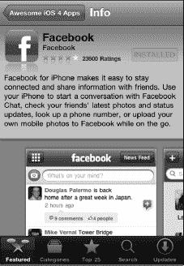
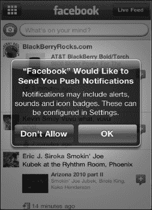
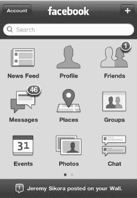
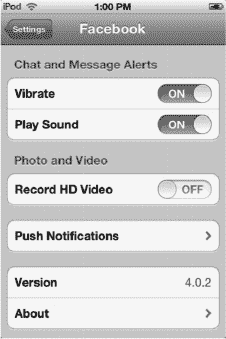
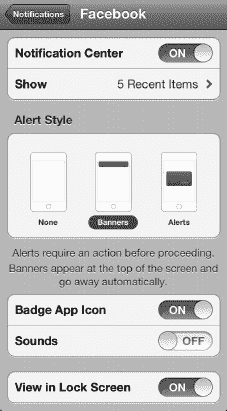
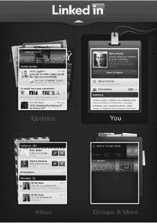
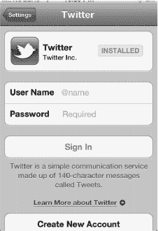
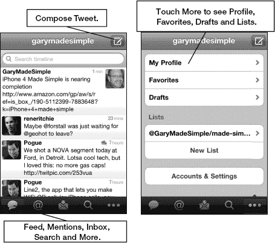
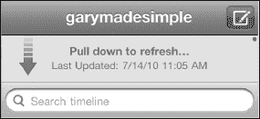

# 第 24 章

##### 社交网络

如今，一些最受欢迎的“社交”场所，往往是那些被称为*社交网络站点*的网站——这些地方让你可以创建自己的个人主页，并与朋友和家人保持联系，了解他们生活中的动态。一些最大的社交网站包括 Facebook、Twitter 和 LinkedIn。

在本章中，我们将向你展示如何访问这些网站。你将学习如何更新状态、发布*推文*，并关注那些对你重要或者你感兴趣的人。

### Facebook

Facebook 成立于 2004 年 2 月。自那时起，它便成为用户与朋友、同事和家人联系、重新联系以及分享信息的首选网站。如今，超过 8 亿用户将 Facebook 作为他们了解最重要的人近况的主要来源。

**注意**：*你无法在 iPod touch 上的 `Facebook` 应用或通过 Facebook.com 网站玩 Facebook 游戏*。如果你是 Facebook 游戏的忠实玩家，这可能会让你失望；不过，你通常可以从 App Store 下载相同的游戏（例如 `FarmVille`），然后将其与电脑版的 Facebook 账户关联，以便保留游戏进度。

在本书出版时，你可以通过以下三种主要方式在 iPod touch 上访问你的 Facebook 页面：

1.  使用 `Safari` 访问标准（完整）网站：[`www.facebook.com`](http://www.facebook.com)。
2.  使用 `Safari` 访问移动网站：[`http://touch.facebook.com`](http://touch.facebook.com)。
3.  使用 iPod touch 的 `Facebook` 应用。

**注意**：iPod touch 版本的 `Facebook` 应用功能比完整网站略有缩减，但导航起来要方便得多。

#### 连接 Facebook 的不同方式

你可以通过 iPod touch 专用应用，或者使用 `Safari` 浏览器访问前面提到的两个 Facebook 网站之一来登录 Facebook。在本章的剩余部分，我们将重点介绍 iPod touch 上的 `Facebook` 应用。

##### 下载并安装 Facebook 应用

要找到该应用，请使用 App Store 的`搜索`功能，直接输入“Facebook”。

你也可以前往 App Store 的`社交网络`分类，找到官方的 `Facebook` 应用，以及许多其他与 Facebook 相关的应用。

**注意**：有些应用可能看起来像“官方”Facebook 应用，并且需要付费。然而，唯一的“官方”应用是右侧显示的 iPhone/iPod 应用。

要登录你的 Facebook 账户，你需要找到刚刚安装的图标并点击它。此处我们以 `Facebook` 为例，但其他应用的操作过程非常相似。

一旦 `Facebook` 成功下载，该图标应该看起来像这样。

### Facebook 应用程序

要在您的 iPod touch 上安装 `Facebook` 应用程序，请启动 `App Store` 并搜索“Facebook”。在 `Facebook` 应用程序列表中，轻点 `Install` 按钮。

#### Facebook 应用基础

一旦 `Facebook` 下载并安装完成，您首先会看到`登录`屏幕。输入您的账户信息——您的电子邮件地址和密码。

首次登录后，您会看到一条`推送通知`的警告信息。

如果您希望允许这些消息，请点击`确定`。这些消息可能包括来自其他 Facebook 好友的戳一戳、便签、状态更新通知等。

登录后，您将看到`Facebook`主屏幕。轻点 `Facebook` 标志可在应用程序内导航。

#### 在 Facebook 中导航

通过轻点页面顶部的 `Facebook` 字样，可在`导航`图标和您的当前位置之间切换。

例如，如果您在`动态消息`中并轻点了 `Facebook`，您将看到所有图标。再次轻点 `Facebook`，您将返回到`动态消息`。

从图标页面，您可以访问您的`动态消息`、`个人主页`、`好友`、`消息`、`地点`、`群组`、`活动`、`照片`和`聊天`。

#### 与好友交流

请按照以下步骤，通过 iPod touch 上的 `Facebook` 应用程序与您在 Facebook 上的好友交流：

1.  轻点顶部的 `Facebook` 以查看所有图标。
2.  轻点`好友`图标，您的好友列表便会显示。
3.  点击您的好友，将进入他的 Facebook 页面，您可以在她的`留言板`上留言，并查看她的`信息`或`照片`。

#### 使用 Facebook 应用上传照片

使用 Facebook 上传照片是一件简单又好玩的事情。在这里，我们向您展示如何在 `Facebook` 应用程序中上传照片：

1.  在 Facebook 主图标中，轻点`照片`。
2.  选择一个相册，例如“手机上传”。
3.  轻点“在想些什么？”框旁边的`相机`图标。
4.  轻点`拍摄照片或视频`按钮来拍照或录制视频以进行上传。或者，轻点`从资料库选取`，在您的 iPod touch 上浏览照片，直到找到您想要上传的那张。
5.  接下来，如果需要，请轻点`写说明...`来编写说明文字。
6.  要完成上传，请轻点蓝色的`上传`按钮，照片将进入您的“手机上传”文件夹。

**注意：** 上传照片时，图像质量将与您 iPod touch 上的原始质量不同。

### Facebook 通知

根据您的 Facebook 推送通知设置，您可能会收到大量更新、留言板帖子和邀请的通知。如果您的 Facebook 好友不多，并且您想知道何时有人给您留言或在帖子或照片下评论，只需将您的推送通知设置为`开启`，如下一小节所示。

当有通知到来时，它会显示在“通知中心”中，或者如果您的 iPod touch 已锁定，则会显示为“锁定屏幕信息”。

要从通知访问 Facebook，只需在屏幕上滑动 `Facebook` 图标，或者滑动`箭头`按钮解锁并阅读消息。

#### 个性化设置您的 Facebook 应用

以下是调整 `Facebook` 应用设置的方法：

1.  轻点`设置`应用。
2.  在左栏中轻点 `Facebook`。
3.  现在您可以调整各种选项：
    *   `摇一摇重新加载`：此功能可在您摇晃 iPod touch 时重新加载或刷新页面。
    *   `播放声音`：此功能让您可以为聊天和消息提醒添加提示音。

请按照以下步骤调整推送通知设置：

1.  轻点`设置`应用。
2.  轻点`通知`。
3.  向下滚动并轻点 `Facebook`。
4.  将`通知中心`设置为`开启`以接收推送通知。
5.  轻点`显示`以选择列表中显示的通知数量。
6.  将`提醒样式`设置为`无`则不显示通知，`横幅`用于新的通知中心风格提醒，或`提醒`用于旧式弹出通知。
7.  将`标记应用图标`设置为`开启`，以查看 `Facebook` 图标上显示的新通知数量。
8.  将`声音`设置为`开启`，以便在收到通知时听到提示音。

    

9.  设置`在锁定屏幕中查看`，以便即使在 iPod touch 锁定时也能获取通知信息。

**提示：** `Facebook` 应用会将 Facebook 个人资料图片导入到您的`通讯录`列表中。根据图片的不同，这可能会相当有趣。然而，它也可能将您自己非 Facebook 联系人的信息上传到 Facebook 的服务器，这可能会引起您、您的家人和朋友对隐私的担忧。

### LinkedIn

LinkedIn 的核心功能与 Facebook 非常相似，但它更侧重于商务和职业兴趣。这与 Facebook 形成对比，后者更侧重于个人好友和游戏。通过 LinkedIn，您可以与当前和过去的商业伙伴建立联系或重新建立联系、发送消息、了解他人近况、进行讨论等。

在本书出版时，LinkedIn 的状态与 Facebook 非常相似。您可以在 `Safari` 浏览器上访问常规的 LinkedIn 网站，也可以为 iPod touch 下载 `LinkedIn` 应用。

哪个更好？我们觉得 iPod touch 上的 `LinkedIn` 应用略优于 `Safari` 中的完整 LinkedIn.com 网站。使用 `LinkedIn` 应用的大按钮导航更方便，但在 `Safari` 版本中屏幕上能看到更多内容。我们建议您两种方式都试试，看看您更喜欢哪个——这实际上是个人的偏好问题。

#### 下载 LinkedIn 应用

下载 `LinkedIn` 应用的过程与下载 `Facebook` 应用类似。启动 iPod touch 上的 `App Store` 应用，在`搜索`窗口中输入“LinkedIn”，然后找到该应用。`LinkedIn` 应用是免费的，因此轻点 `FREE` 按钮进行安装。

#### 登录 LinkedIn 应用

应用安装完成后，点击 `LinkedIn` 图标并输入您的登录信息。

#### 在 LinkedIn 应用中导航

LinkedIn 采用基于区域的导航系统。轻点任意“堆栈”即可进入该区域，然后轻点顶部的 `LinkedIn` 标志返回`首页`屏幕。

#### 与 LinkedIn 人脉交流

您最常使用 `LinkedIn` 应用做的事情之一可能就是与人脉交流。最简单的方法是遵循以下步骤：

1.  在`首页`页面，轻点右上角的`你`堆栈。
2.  轻点屏幕中部的`人脉`按钮。
3.  浏览您的人脉，或轻点`放大镜`搜索图标，在`搜索`框中输入人脉名称。
4.  轻点您正在寻找的人脉。
5.  轻点`邮件`图标给他发送消息。

### Twitter

Twitter 始于 2006 年。Twitter 本质上是一个基于 SMS（短信）的社交网络网站。它通常被称为*微博网站*，是名人和平民都可以分享自己想法的地方。关键在于您只有 140 个字符来传达您的观点。

在 Twitter 上，您可以订阅*关注*某个*发推*的人。您也可能发现人们开始关注您。如果您想关注我们，我们在 Twitter 上的账号是 `@garymadesimple`。

#### 设置 Twitter

1.  在 iOS 5 系统中，Twitter 应用已内置到你的 iPod touch 中。这意味着，你可以从其他应用（如“照片”）内直接分享图片和帖子等内容。请按照以下步骤设置 Twitter：
2.  轻点**设置**应用。
3.  向下滚动并轻点**Twitter**。
4.  如果 iPod touch 版 Twitter 尚未安装在你的 iPod touch 上，请轻点 **Twitter** 图标右侧的**安装**按钮。（如果 iPod touch 版 Twitter 已安装，**安装**按钮将呈灰色。）
5.  轻点**用户名**并输入你的 Twitter `@用户名`。
6.  轻点**密码**并输入你的 Twitter 密码。
7.  轻点**登录**按钮。
8.  如果你没有 Twitter 帐户，请轻点屏幕底部的**创建新帐户**按钮，并填写表单以获取一个。
9.  登录后，轻点**帐户**以更改你的选项。
10. 如果你希望你的朋友能根据你的电子邮件地址在 Twitter 上找到你，请将**通过电子邮件找到我**切换为**开启**。
11. 如果你希望每次从应用内发推文时都记录你的位置，请将**推文位置**切换为**开启**。

**注意：** 如果你在推文中透露了位置，那么 Twitter 上的任何人都可能知道你在哪里——包括你不在家或不在办公室的事实。如果担心隐私问题，请将**推文位置**切换为**关闭**。

#### 使用 Twitter

官方 **Twitter** 应用采用了精简的方式来使用 Twitter。**首页**屏幕会显示你关注的人的推文，并且完整消息显示得既美观又大。

底部有五个图标，第一个是主要的 **Twitter** 动态信息流。其他图标分别是**提及**、**私信**、**搜索**和**更多**按钮，点击**更多**按钮可进入你的**个人资料**、**收藏**、**草稿**、**列表**以及**帐户与设置**。

**发推**图标位于左上角（请参见图 24–1）。

**图 24–1.** * **Twitter** 应用的**首页**页面布局*

#### 刷新推文列表

要刷新你的推文列表，只需向下拉动主页面，你将在顶部看到**下拉以刷新**通知。页面下拉后，你将看到**释放以刷新**提示。松开页面即可刷新推文。

#### 你的 Twitter 个人资料

要显示你的 Twitter 个人资料，请轻点**更多**按钮，然后轻点**我的个人资料**。

要查看你的推文，只需轻点**推文**。

要查看你标记为收藏的推文，请轻点**收藏**按钮。

要查看你关注的人，请轻点**正在关注**按钮。

**注意：** 你的粉丝数、你关注的人数以及你的推文数会显示在相应按钮标题的上方。

向下滚动页面可查看你的**转推**、**列表**以及你可订阅的**服务**。

#### 撰写按钮

轻点**撰写**按钮 ，将弹出**新推文**屏幕。当你输入消息时，字符计数器将从 140 开始递减。以下是你可以在**新推文**屏幕上执行的操作：

* 轻点 `@` 符号，搜索要在此推文中提及的其他用户名。
* 轻点 `#` 符号，搜索要在此推文中标记的热门话题。
* 轻点**相机**图标，用你的 iPod touch 拍摄照片或视频，或从你的资料库中选择现有内容添加到推文中。
* 轻点**箭头**图标，将你当前的位置添加到推文中。

#### 推文中的选项

从你的 **Twitter** 应用的**首页**屏幕，只需轻点一条推文即可获得以下选项：

* 轻点屏幕左下角的**返回箭头**以**回复**推文。
* 轻点方形的**双箭头**以转推或引用推文。
* 轻点**星形**图标以收藏推文。
* 轻点**回形针**图标以查看附件。
* 轻点**操作**按钮以复制推文链接、通过邮件发送推文或翻译推文。

**注意：** 与 Facebook 和 LinkedIn 不同，你可以在 App Store 中找到各种替代的第三方 Twitter 应用。如果你不喜欢官方的 iPod touch 版 **Twitter** 应用，可以尝试一下 **Tweetbot**、**Twitterrific** 或许多其他应用。

