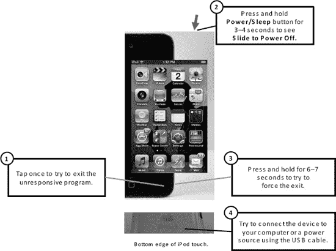
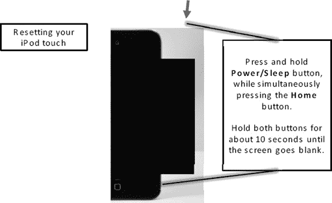
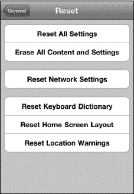
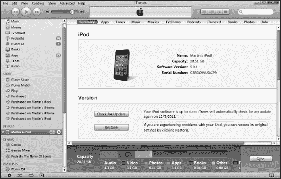
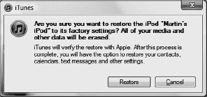
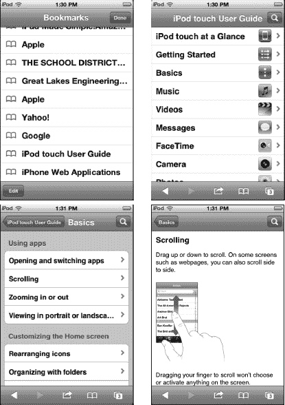

# 第 25 章

## 故障排除

iPod touch 通常非常可靠。但偶尔，就像你的电脑或任何复杂的电子设备一样，你可能需要重置设备或排除某个问题。在本章中，我们将为你提供一些有用的工具，帮助你的 iPod touch 尽快恢复正常运行。我们将从一些基本的快速故障排除开始，然后在“高级故障排除”部分介绍更深入的问题及解决方法。

我们还将介绍一些与 iPod touch 相关的其他杂项，并为你提供一个资源列表，你可以在其中找到有关 iPod touch 的帮助。

### 基本故障排除

我们将首先介绍一些基本的提示和技巧，以便在出现问题时让你的 iPod touch 恢复正常运行。

#### 如果 iPod touch 停止响应该怎么办

有时，你的 iPod touch 会对触摸无反应——它只是在某个程序运行中突然卡住。如果发生这种情况，请尝试以下步骤，看看 iPod touch 是否会开始响应（请参见图 25-1）：

1.  按一次**主屏幕**按钮，看是否能退出应用并返回到**主屏幕**。
    
2.  如果某个特定应用导致问题，请尝试双击**主屏幕**按钮以打开**应用切换器**栏。接下来，按住**应用切换器**栏中的*任意*图标，直到它们全部晃动，并且应用图标左上角出现一个带减号的红色**圆形**图标。
3.  轻点红色的**圆形**图标以关闭该应用。
4.  如果 iPod touch 仍然没有响应，请尝试按下**睡眠/唤醒**键，直到看到**滑动以关闭电源**。
5.  按住**主屏幕**按钮直到你返回到**主屏幕**——这应该可以退出该程序。
6.  确保你的 iPod touch 电量没有耗尽。尝试将其插入电源或连接到你的电脑（如果已连接电源），看看它是否会开始响应。
7.  如果按住**主屏幕**按钮不起作用，你需要尝试通过按住**电源/睡眠**按钮三到四秒来关闭 iPod touch。
8.  接下来，滑动屏幕顶部的**滑动以关闭电源**滑块。如果你无法关闭 iPod touch 的电源，那么你需要重置 iPod touch。请跳至下一节了解操作方法。
9.  关闭 iPod touch 电源后，等待一分钟左右，然后通过按住同一个**电源**按钮几秒钟来开启 iPod touch。
10. 你应该会看到屏幕上出现 **Apple** 标志。等待 iPod touch 启动完毕，你应该就可以访问你的程序和资料了。

**图 25-1.** *基本故障排除步骤*

如果这些步骤不起作用，你将需要重置你的 iPod touch。

##### 如何强制重置 iPod touch

当你的 iPod touch 无响应时，重置设备是另一种解决方法。此操作非常安全，通常能修复许多问题（参见图 25-2）。

**图 25-2.** *重置您的 iPod touch*

请按照以下步骤强制重置您的 iPod touch：

1.  用双手同时按住 `主屏幕` 按钮和 `电源/睡眠` 按钮。
2.  同时按住这两个按钮约八到十秒钟。此时会出现 `滑动来关机` 滑块。忽略它，继续按住两个按钮，直到屏幕变黑。
3.  再过几秒钟，您应该会看到 `Apple` 标志出现。看到标志后，松开按钮，您的 iPod touch 就会被重置。

##### 如何软重置 iPod touch

您可以在 `设置` 应用中重置多种内容，从 `主屏幕` 布局到网络设置，再到设备上的所有数据：

1.  轻点 `设置` 图标。
2.  轻点 `通用`。
3.  向上滑动以查看页面底部。
4.  轻点 `还原`。
5.  轻点 `还原所有设置` 以重置网络、键盘、`主屏幕` 布局和位置提醒。在弹出的窗口中轻点 `还原` 进行确认。

    

6.  轻点 `抹掉所有内容和设置` 以抹掉 iPod touch 上的所有内容，然后在弹出窗口中轻点 `抹掉` 进行确认。
7.  轻点 `还原网络设置` 以清除所有 Wi-Fi 网络设置。
8.  轻点 `还原键盘词典` 以重置拼写词典。
9.  轻点 `还原主屏幕布局` 以恢复到出厂布局；这会将 iPod touch 的 `主屏幕` 恢复为原始布局。
10.  轻点 `还原位置提醒` 以重置您收到的关于允许应用使用您当前位置的警告信息。

##### 音乐、视频、提醒或铃声无声音

没有什么比错过 FaceTime 通话、想听音乐或看视频却发现 iPod touch 没有声音更令人沮丧的了。通常，这个问题有一个简单的解决方法：

1.  如果您听不到任何提醒，请检查以确保设备左上边缘的 `静音` 开关没有打开。当 `静音` 开关拨向设备背面，且开关旁边显示橙色时，即表示已开启。请确保将 `静音` 开关拨向设备正面，即关闭位置。
2.  使用 iPod touch 左上边缘的 `音量+` 键检查音量。您可能无意中将音量调到了最低或将其静音。
3.  如果您使用的是耳机插孔的有线耳机，请拔下耳机，然后重新插入。有时耳机插孔连接不良。
4.  如果您使用的是无线蓝牙耳机或蓝牙音响设备，请按照以下步骤操作：
    1.  检查音量设置（如果耳机或音响上有此设置）。
    2.  检查蓝牙设备是否已连接。轻点 `设置` 图标，轻点 `通用`，然后轻点 `蓝牙`。确保您能看到列出的设备，并且其状态为 `已连接`。如果未连接，请轻点该设备，并按照指引与 iPod touch 配对。

        **注意**：有时您可能实际上已连接到蓝牙设备却不知道。如果您连接到蓝牙音响设备，实际的 iPod touch 将不会发出声音。

5.  确保歌曲或视频未处于暂停模式。
6.  打开 iPod touch 的音乐或视频控制。双击 `主屏幕` 按钮应会打开 `应用切换器` 栏。从左向右滑动即可看到媒体控制。
7.  再向右滑动一次即可看到音量控制。确认歌曲未暂停且音量未被调至最低。
8.  最后，检查 `设置` 图标，以查看您（或其他人）是否在 iPod touch 上设置了 `音量限制`：
    1.  轻点 `设置` 图标。
    2.  向下滑动页面并轻点 `音乐`。
    3.  查看 `音量限制` 是否为 `开`。
    4.  轻点 `音量限制` 以检查设置等级。如果限制未锁定，只需将音量滑块滑至更高等级。
    5.  如果已锁定，您需要先轻点 `解锁音量限制` 按钮并输入四位代码来解锁。

如果这些步骤均无效，请参阅本章后面的“其他故障排除与帮助资源”部分。如果仍无效，请尝试使用本章“从备份恢复 iPod touch”部分中的步骤从备份文件恢复 iPod touch。最后，如果问题依然存在，请联系向您出售 iPod touch 的商店或企业寻求帮助。

##### 如果无法在 iTunes 或 App Store 中购买

您有了这个酷炫的新设备，于是决定访问 iTunes Store 或 App Store。但如果您收到错误信息，或者不被允许进行购买，该怎么办？如果遇到这种情况，请尝试以下步骤：

1.  两个商店都需要有效的互联网连接。请确保您已连接 Wi-Fi 或蜂窝数据网络。如需帮助，请查阅第 4 章：“连接到网络”。
2.  确认您拥有有效的 iTunes 帐户。

### 高级故障排除

到目前为止，我们已经介绍了 iPod touch 上的基本故障排除步骤。在接下来的部分中，我们将深入探讨一些更高级的故障排除步骤。

#### 当您的 iPod touch 未在 iTunes 中显示时

有时，当您将 iPod touch 连接到 PC 或 Mac 时，`iTunes` 应用可能无法识别它。因此，您的 iPod touch 不会出现在左侧导航栏中。

将 iPod touch 连接到电脑后，您应该会在左侧导航栏的 `设备` 下看到它。您可以尝试以下几个步骤，让 `iTunes` 应用识别您的 iPod touch：

1.  查看 `主屏幕` 右上角的电池电量，检查 iPod touch 的电池电量。如果电池电量过低，`iTunes` 应用需要等到电量稍微回升后才能识别它。
2.  如果电池已充满电，请尝试将 iPod touch 连接到电脑上的另一个 USB 端口。有时，如果您一直使用一个 USB 端口连接 iPod touch，而换到另一个端口时，电脑可能无法识别。
3.  如果仍不能解决问题，请尝试断开 iPod touch 并重启电脑。
4.  接着，将 iPod touch 重新连接到 USB 端口。
5.  如果 `iTunes` 应用仍然无法识别您的 iPod touch，请下载 `iTunes` 的最新更新，或者在电脑上完全卸载并重新安装 `iTunes` 应用。如果选择此选项，请务必事先备份 `iTunes` 中的所有信息。
6.  您也可以尝试另一条同步线缆，可能是您的 USB 同步线缆有缺陷。

#### 同步问题

有時，你在將 iPod touch 與電腦（PC 或 Mac）同步時可能會遇到錯誤。如何解決問題取決於你的同步方式。

##### 使用 iTunes 同步

如果你正在使用 iTunes 同步個人資訊，請依照以下步驟解決同步問題：

1.  首先，遵循本章「iPod touch 未在 iTunes 中顯示」一節中概述的所有步驟。
2.  如果 iPod touch 仍然無法同步，但你可以在 `iTunes` 應用程式的左側導覽列中看到它，請返回第 3 章：「與 iCloud、iTunes 及更多同步」並仔細檢查你的同步設定。

##### 使用 Apple 的 iCloud 或 Microsoft Exchange 同步

如果你正在使用 iCloud 服務或 Microsoft Exchange 方法來同步你的電子郵件和個人資訊，請依照以下疑難排解步驟來解決同步問題：

1.   iCloud 和 Exchange 同步都需要無線網路數據連線才能同步你的電子郵件和個人資訊。請檢查快速入門指南中「讀取連線狀態圖示」一節的表 1，以確認你擁有有效的數據連線。
2.   如果你沒有無線數據訊號，請確認你的 Wi-Fi 連線設定正確（請參閱第 4 章：「連接到網路」）。
3.   確認連線後，你需要檢查電腦和 iPod touch 上的同步設定是否正確（請參閱第 3 章）。

**提示：** 有時候，問題可能只是密碼變更了這麼簡單。如果是這種情況，請務必在 iPod touch 上為你的同步設定更正密碼。這些設定可以透過點擊你的 `設定` 圖示，然後點擊 `郵件、聯絡資訊、行事曆` 來找到。最後，點擊帳戶名稱並調整密碼。

#### 重新安裝 iPod touch 作業系統（可選擇是否還原）

有時，你可能需要全新安裝 iPod touch 作業系統，才能讓你的 iPod touch 恢復正常且順暢運作。如果目前有可用的更新，此過程也將升級你的 iPod touch 軟體。

**提示：** 此過程與使用新版本作業系統更新 iPod touch 的過程幾乎完全相同。

在此過程中，你將有三種選擇：

-   如果你想讓 iPod touch 恢復正常狀態並保留所有資料，你必須使用 `iTunes` 應用程式中的 `回復` 功能。
-   如果你打算從頭開始，並將 iPod touch 連結到一個 iTunes 帳戶，那麼你需要在這個過程結束時使用 `設定為新的 iPod touch` 功能。
-   如果你打算贈送或出售你的 iPod touch，那麼你只需在此過程結束時（在進行回復或新設定之前）從 `iTunes` 中退出 iPod touch。

**注意**：此回復過程將會徹底清除你的 iPod touch。你將需要重新同步和重新安裝你所有的應用程式，並輸入你的帳戶資訊，例如你的電子郵件帳戶。此過程可能需要 30 分鐘或更長時間，具體取決於你同步到 iPod touch 的資訊量。

若要重新安裝 iPod touch 作業系統軟體，並可選擇從先前的備份中將資料還原到 iPod touch，請依照以下步驟操作：

1.  將你的 iPod touch 連接到電腦並載入 `iTunes` 應用程式。
2.  在左側導覽列的 `裝置` 類別中點擊你的 `iPod touch`。
3.  點擊頂端導覽列的 `摘要`。
4.   你將看到 `摘要` 畫面，其中包含關於你 iPod touch 的所有資訊。點擊畫面中間的 `回復` 按鈕，如下所示（請參閱圖 25-3）。

**圖 25-3.** *連接你的 iPod touch 並在 `摘要` 畫面中點擊 `回復` 按鈕*

5.   現在可能會詢問你是否要備份你的 iPod touch，如果是，為了安全起見，請點擊 `備份`。
6.   在下一個畫面中，你會收到所有資料將被清除的警告。點擊 `回復` 或 `回復並更新` 以繼續（請參閱圖 25-4）。

**圖 25-4.** *在回復前於 `iTunes` 中備份你的 iPod touch*

7.   你將看到一個 iPod touch `軟體更新` 畫面。點擊 `下一步 >` 以繼續。
8.   接下來，你會看到 `軟體許可協議` 畫面。點擊 `同意` 以繼續並開始此過程。
9.   `iTunes` 將會下載最新的 iPod touch 軟體、備份並同步你的 iPod touch，然後重新安裝 iPod touch 軟體。此過程會完全清除所有資料，並將你的 iPod touch 還原到其原始、「乾淨」的狀態。你將在 `iTunes` 頂端看到狀態訊息。
10. 備份和同步完成後，你的 iPod touch 螢幕將會變黑。接著，`Apple` 標誌會出現，並且你會在標誌下方看到一個進度條。最後，`iTunes` 中會出現一個小型的彈出視窗，告訴你更新過程已完成。點擊 `好` 以前往 `設定你的 iPod touch` 畫面。此時你會有幾個選項：
    1.  如果你希望保持 iPod touch 乾淨（即沒有任何個人資料），請選擇頂部的選項 `設定為新的 iPod touch`。如果你正在為其他人設定此 iPod touch，你可能會想使用此選項（你需要她的 Apple ID 和密碼）。
    2.  如果你要贈送或出售你的 iPod touch，只需點擊 iPod touch 旁邊的 `退出` 圖示，就大功告成了（請參閱圖 25-5）。

**圖 25-5.** *從 iTunes 退出 iPod touch*

3.  選擇 `從以下備份回復：` 並確認下拉式選單已設定為正確的裝置。
11. 最後，點擊 `繼續`。
12. 如果你選擇了回復，稍後你的 iPod touch 上會顯示 `正在回復` 畫面，並且 `iTunes` 中會出現一個狀態視窗顯示「正在從備份回復 iPod touch…」。此狀態視窗也會顯示預計剩餘時間。
13. 接下來，你會看到一個小型的彈出視窗顯示「你的 iPod touch 設定已回復。」幾秒鐘後，你會看到你的 iPod touch 出現在 `iTunes` 左側導覽列的 `裝置` 下。
    1.  如果你使用 `iTunes` 同步資訊，所有資料現在都會被同步。
    2.  如果你使用 iCloud、Exchange 或其他同步程序，你可能需要在 iPod touch 上重新輸入密碼，才能使這些同步程序恢復並正常運行。

### 其他疑難排解與求助資源

有時，你可能會遇到本書中找不到答案的特定問題或疑問。在以下章節中，我們將提供一些可以從 iPod touch 和電腦網頁瀏覽器存取的良好資源。iPod touch 的裝置內使用手冊易於瀏覽，可以快速為你提供所需的資訊。如果你面臨特別難以解決的疑難排解問題，Apple 知識庫會很有幫助。與 iPhone/iPod touch 相關的網路部落格和論壇也是尋找答案，甚至提出你可能遇到的獨特問題的好地方。

#### 在设备上查阅 iPod touch 使用手册

请按照以下步骤在设备上查阅 iPod touch 使用手册：

1.  打开你的 `Safari` 浏览器以查看 iPod touch 的在线使用手册。
2.  点击底部图标栏中的`书签`按钮 。
3.  滑动到列表底部并点击`iPod touch 使用手册`。

如果找不到该书签，请在 iPod touch 上的 `Safari` 浏览器的`地址`栏中输入此 URL：`http://help.apple.com/ipodtouch`。

**提示**：若要在电脑上查看 PDF 格式的手册，请访问 `http://support.apple.com/manuals/ipodtouch`。

进入 iPod touch 上的使用手册后，您应该会看到一个类似于图 25-6 所示的屏幕。

好处是您已经知道如何浏览该手册。点击任何主题以查看有关该主题的更多信息——可以是另一个子主题列表，也可以是更详细的信息。

阅读该主题或点击其他链接以了解更多信息。

您可以点击屏幕右上角的按钮返回上一级。

**图 25-6.** 在 iPod touch 上通过 `Safari` 使用 iPod touch 手册

#### Apple 知识库

在 iPod touch 或电脑的网页浏览器中，访问此网页：`www.apple.com/support/ipodtouch`

最后，点击左侧导航栏中的某个主题。

#### 与 iPod touch 相关的博客

拥有 iPod touch 的好处之一是，您会立即加入全球 iPod touch 用户社群。

许多 iPod touch 用户会被归类为*爱好者*，并且是众多 iPod touch 用户组中的一员。这些用户组以及各种论坛和网站，为 iPod touch 用户提供了绝佳的资料来源。

其中许多资源可直接从您的 iPod touch 上获取，其他一些则是您可能希望在电脑上访问的网站。

有时您可能想与其他 iPhone 和 iPod touch 爱好者联系、询问技术问题或了解最新最热门的传闻。博客是进行这些活动的好地方。

以下是一些流行的 iPod touch（以及 iPhone 或 iPad）博客：

*   `www.tipb.com`
*   `www.iphonefreak.com`
*   `www.gizmodo.com`（iPod touch 板块）

**提示：** 在这些博客上发布新问题之前，请先在博客中搜索，以确保您的问题尚未被提出和回答。同时，确保您将问题发布在博客的正确板块（例如 iPod touch 板块）上。否则，您可能会因没有事先做好功课而招致社群的不满！

您也可以通过网络搜索“iPod touch 博客”或“iPod touch 新闻和评论”来查找更多博客。

### 索引

**特殊字符和数字**

`“.”` 快捷键，81

#### A

`A2DP`（蓝牙立体声），145–146

**辅助功能**

`Assistive Touch` 功能，48–49

“通知中心”的选项，62

“键入”的选项，69–74

`AssistiveTouch` 功能，71–72

`朗读所选项`和`朗读自动文本`功能，71

“连按三次主屏幕按钮”，74

`旁白`，69–71

“白底黑字”，73–74

“缩放”功能，72–73

`朗读自动文本`功能，68

**配件**，通过其充电，34

**适配器**，墙壁插头，33

`添加配置`屏幕，135

`添加到现有联系人`选项，201

`添加到个人收藏`选项，201

`添加到个人收藏`选项，“信息”页面，196

“飞行模式”，9–10，132–133

`AirPlay` 功能，275

“AirPlay 镜像”，141，490

“快速 App 切换器”栏上的按钮，162

兼容的设备，139

概述，139

设置，139–141

`AirPlay` 图标，140，146

`“Airplay 镜像”`开关，141

`专辑`软键，6

**专辑**，查看其中的歌曲，220–222，228–229

**提醒**，382

“第二次提醒”选项，383

如果没有声音时的故障排除，514–515

`全部`按钮，199

`允许更改`设置，176

`允许的内容`设置，178

**字母搜索**，在`通讯录`App 中，358

`AP Mobile` App，20

App Store，15，18，463–481

**应用**，463–464

下载，474–477

查找，468–473

维护和更新，477–479

新闻和评论，464

查看详细信息，467–468

**自动下载**，480

主页，465–466

和网络连接，465

兑换礼品卡或 iTunes 代码，477

设置，480–481

启动，465

无法从中购买时的故障排除，515

`App 切换器` App，以及多任务处理，87

`App 切换器` 栏，4–6

Apple ID（标识符），40

**Apple 知识库**

用于在故障排除时查找帮助，522

作为故障排除同步问题的资料，117

Apple TV，139–141、146、422–423

日程
- 编辑，387–389
- 事件，388
- 会议邀请，388–389
- 新建，380–381
- 查看与导航，375

应用
- AP Mobile 应用，20
- 应用切换器，87
- 应用切换器栏，4–6
- 自动锁定选项，“设置”应用，7
- 可用性，“日历”应用，384
- 棒球应用，489–490
- “日历”应用，17、373–399
  - 提醒，382–383
  - 日程，375、387–389
  - 可用性，384
  - 选择日历，383
  - 在邮件与日历之间复制粘贴，385–386
  - 日历图标上的日期与日份，375
  - 删除事件，388
  - 事件（日历内），379–384
  - 列表，398
  - 会议邀请，388–389
  - 多日历（日历内），378–379
  - 新建日程，380–381
  - 日历事件的备注，384
  - 选项，389–395
  - 重复事件，381–382
  - 提醒事项，395–397
  - “提醒事项”应用，选项，399
  - 重复事件，388
  - 切换事件，388
  - 视图，376–377
- “相机”应用，19、402–408
  - 编辑照片，407–408
  - 地理标记功能，403
  - 选项，405
  - 切换摄像头，405–406
  - 查看照片，406
  - 缩放，404
- 漫画应用，266–267
- 撰写按钮（Twitter 应用内），506
- “通讯录”应用，17、349–365
  - 联系人列表，350、362、364
  - 载入，349
  - 新建联系人，350–355
  - 照片，355–356、362
  - 搜索，357–358
  - 在地图上显示联系人地址，362–363
  - 故障排除，364–365
- 内置词典（iBooks 应用），249
- 双击，14
- 下载，474–477
- 替代电子书阅读器应用
  - 下载，254
  - Kindle 阅读器，254–256
  - Kobo 阅读器，257

-   Evernote 应用，22
-   Facebook 应用，21，25
-   FaceTime 应用，17，193–203
-   快速应用切换栏，159–162
    -   使用 Home 键访问，51
    -   其中的 AirPlay 按钮，162
    -   从中关闭应用，160–161
    -   其中的媒体控制，161
    -   其中的竖排方向锁定，161
    -   在应用间切换，160
    -   其中的音量控制，162
-   Folders 应用，22
-   通用按钮，“设置”应用，7
-   通用选项，“设置”应用，7
-   GoodReader 应用，22
-   在 iBooks 应用中高亮笔记，250–251
-   App Store 的首页，465–466
-   iBooks 应用，18，26
    -   下载，242
    -   书库，242–245，253
    -   在其中阅读，246，248–252
    -   切换合集，245–246
-   iBooks 商店，从中加载 iBooks 应用书库，242–245
-   身份识别（Apple ID），40
-   应用内通知，57–58
-   iPod 应用，6，16，18
-   iTunes 应用，16，18，25，42–44，447–462
    -   有声读物，453–454
    -   为其自定义软按键，449
    -   下载以供离线观看，455
    -   查找音乐，450–454
    -   用于教育内容的 iTunes U，454
    -   导航，448
    -   与网络连接，448
    -   获取媒体，456–458
    -   Ping 社交网络，462
    -   其中的播客，459–460
    -   兑换礼品卡，461
    -   利用其从之前的备份恢复，43–44
    -   搜索，455
    -   启动，448
    -   与之同步，98–110，117–119
    -   故障排除，515–516
    -   电视节目，查找，452–453
    -   视频，浏览，451–452
-   从快速应用切换栏中关闭应用，160–161
-   Kindle 应用，19
-   LinkedIn 应用，21
-   LinkedIn 社交网络，对应的应用，500–502
    -   与人脉沟通，502
    -   下载，500–501
    -   登录，501
    -   导航，501
-   将联系人链接到，360
-   定位，468–473
    -   类别列表，471

### 索引

`Genius` 功能，470–471

新应用，469

搜索特定应用，473

`Top Charts` 分类，472

`What’s Hot` 分类，469

Mac 电脑，当 `iTunes` 应用锁定且无响应时的故障排除，119

`Mail` 应用，17

维护和更新，477–479

`Maps` 应用，17，446

更改视图，428–430

确定当前位置，428

获取路线，440–445

选项，432–446

搜索，431–432

`Street View` 功能，439–440

`Marvel Comics` 应用，19

`Messages` 应用，17，183

移动

位置与设置屏幕，50

文件夹及删除图标，109–110

`Music` 应用，216–219

更改视图，220

编辑软键，216–217

播放列表，218–219

搜索音乐，219

按专辑查看歌曲，220–222

`New York Times` 应用，20，262

应用的新闻和评论，464

`Notes` 应用，22，349–370

为笔记添加标题，368

带下划线文字的数据检测器，370

删除笔记，369

通过电子邮件发送或打印笔记，370

新建笔记，368

排序，367

开始使用，366–367

同步，366

查看或编辑笔记，369

`NPR News` 应用，20

在其中打开电子邮件附件，330

`Pandora` 应用，18

电话号码，在 `Contacts` 应用中，352

`Photos` 应用，19

`Portrait Orientation Lock`，在 `Fast App Switcher` 栏上，161

阅读，在 `iBooks` 应用中

内置词典，249

自定义亮度和字体，248

高亮和笔记，250–251

页内书签，250

`PDFs`，246

搜索功能，252

参考表格，15

连接与整理，17

娱乐，18–19

信息，20

生产力，22

社交网络，21

`Reminders` 应用，390

选项，399

视图，390–392

移除或重新安装，110

限制，174–175

`Safari` 应用，12，17

搜索功能，在 `iBooks` 应用中，252

`Settings` 应用，7，164–165

设置界面，在应用内导航及 50

Skype 应用，21, 25, 204–212

- 添加联系人，206–207
- 购买点数，209–210
- 聊天，210–211
- 创建账户，205
- 下载，205
- 在电脑上安装，211–212
- 登录，205–206
- 拨打电话，208
- 接听电话，209–210
- 启动，6
- 切换，5, 160
- 轻点，11

排行榜类别，App Store 中，472

Twitter 应用，21

查看详情，467–468

音量

- 调整音乐应用的音量，224, 230
- 控制，快速应用切换栏中，162

天气频道应用，20

热门类别，App Store 中，469

Windows 电脑，当 iTunes 应用锁定且无响应时的故障排除，118

YouTube 应用，19, 280–283

- 查看和清除历史记录，283
- 底部图标，281
- 播放视频，281
- 搜索视频，280
- 视频控制，282

Zinio 应用，265

艺术家软按键，6

询问加入网络开关，131

辅助触控功能，48–49, 71–72

附件，327–333

- 自动打开，328
- 压缩的 .zip 文件，331–333
- 检测，327
- 打开，328–331
  - 在其他应用中，330
  - “快速查看”模式，328–329
  - 观看视频，331
- 压缩的 .zip 文件支持的格式，332–333

有声读物，115–116, 453–454

身份验证，SSL 与，345

自动大写功能，323

自动大写选项，80

自动大写设置，171

自动纠正功能，66–68

- 以及自动大写功能，323
- 设置，80
- 自动文本朗读功能，68

自动纠正设置，171

自动加入，131

自动锁定功能，53

自动锁定选项，设置应用，7

自动登录，131

自动打开的附件，328

自动填充功能，299–301

- 启用，303–304
- 输入用户名和密码，300
- 用于个人信息，301

可用性，日历应用中，384

###  B

backup, storage and, 93–95（备份、存储与，93–95）

baseball app, 489–490（棒球应用，489–490）

Based on label, 470（基于标签，470）

batteries, 35–36（电池，35–36）

getting more out of, 35（充分利用，35）

life of（寿命）

expected, 35（预期寿命，35）

extending, 36（延长寿命，36）

locations for charging, 36（充电地点，36）

BCC (Blind Carbon Copy) recipients, 320（密件抄送收件人，320）

blogs, for finding help when troubleshooting, 522（博客，用于故障排除时寻求帮助，522）

Bluetooth（蓝牙）

Bluetooth Stereo, 145–146（蓝牙立体声，145–146）

devices that work with, 142（兼容的设备，142）

forgetting devices, 146（忽略设备，146）

headsets, connecting to, 194（连接耳机，194）

overview, 142（概述，142）

pairing devices, 142–145（配对设备，142–145）

Bluetooth Stereo (A2DP), 145–146（蓝牙立体声 (A2DP)，145–146）

bookmarks, 290–294（书签，290–294）

and History, 291–292（与历史记录，291–292）

in-page iBooks app, 250（iBooks 应用内页，250）

managing, 293–294（管理书签，293–294）

in Maps app, 433–435（地图应用中，433–435）

accessing and editing bookmarks, 435（访问和编辑书签，435）

new bookmarks, 433–434（新建书签，433–434）

new, 290–291（新建书签，290–291）

and notes, syncing, 108（书签与备忘录同步，108）

books, 241–257（图书，241–257）

alternative e-reader apps（替代电子阅读器应用）

downloading, 254（下载，254）

Kindle reader, 254–256（Kindle 阅读器，254–256）

Kobo reader, 257（Kobo 阅读器，257）

iBooks app（iBooks 应用）

downloading, 242（下载 iBooks，242）

library, 242–245, 253（资料库，242–245, 253）

reading in, 246（在 iBooks 中阅读，246）

switching collections, 245–246（切换收藏集，245–246）

syncing, iBooks and audiobooks, 115–116（同步，iBooks 与有声书，115–116）

Bottom Dock, moving icons to, 150（底部 Dock，将图标移至，150）

brightness（亮度）

adjusting, 55（调节亮度，55）

customizing fonts and, in iBooks app, 248（在 iBooks 应用中自定义字体和亮度，248）

browser, Safari, 13, 285–305（浏览器，Safari，13, 285–305）

adding web page icon to Home screen, 302（将网页图标添加至主屏幕，302）

adjusting settings for, 302–305（调整 Safari 设置，302–305）

changing search engine, 303（更改搜索引擎，303）

enabling AutoFill feature, 303–304（启用自动填充功能，303–304）

privacy options, 304（隐私选项，304）

security options, 305（安全选项，305）

AutoFill feature, 299–301（自动填充功能，299–301）

entering usernames and passwords, 300（输入用户名和密码，300）

for personal information, 301（用于个人信息，301）

bookmarks, 290–294（书签，290–294）

and History, 291–292（与历史记录，291–292）

managing, 293–294（管理书签，293–294）

new, 290–291（新建书签，290–291）

and Internet connection, 286（与互联网连接，286）

launching, 286–287（启动 Safari，286–287）

Reader feature, 295–296（阅读器功能，295–296）

Reading List feature, 294–295（阅读列表功能，294–295）

saving or copying text and graphics, 298–299（保存或复制文本和图形，298–299）

screen layout of, 287（屏幕布局，287）

typing web address, 288（输入网址，288）

watching videos in, 298（在 Safari 中观看视频，298）

web pages（网页）

activating links from, 290（激活网页中的链接，290）

emailing or tweeting, 297（通过电子邮件或推特分享，297）

jumping to top of, 297（跳至页面顶部，297）

moving backward and forward through open, 288–289（在打开的页面中前后切换，288–289）

Open Pages Button, 289（打开页面按钮，289）

printing, 297（打印网页，297）

zooming, 289–290（缩放页面，289–290）

buttons, 4（按钮，4）

Buy pre-pay credit button, 210（购买预付费积分按钮，210）

###  C

`日历`应用，17，373–399

- 约会安排  
  编辑，387–389  
  查看与导航，375
- 在电子邮件与日历之间复制和粘贴，385–386
- `日历`图标上的星期和日期，375
- 日历中的事件，379–384  
  提醒，382–383  
  可用性，384  
  选择日历，383  
  新建约会，380–381  
  备注，384  
  重复事件，381–382
- 列表，398
- 日历中的多个日历，378–379
- 选项，389–395  
  为任务添加备注，395  
  更改默认日历，390  
  更改列表，395  
  提醒事项，392–394  
  `提醒事项`应用，390–392  
  设置截止日期，394
- 提醒事项  
  完成，395–396  
  编辑，397
- 同步和共享日历，374
- `提醒事项`应用，选项，399
- 视图，376–377

`日历`图标，星期和日期，375  
日历，同步，106  
通话记录，199–201

- 清除全部，200
- 通话详情或联系人信息，200–201
- 从通话记录拨打电话，200

通过 `Skype` 通话

- 拨打电话，208
- 接听电话，209–210

相机访问，及媒体访问，49–50  
`相机`应用，19，402–408

- 编辑照片，407–408
- 地理标记功能，403
- 选项，405
- 切换摄像头，405–406
- 查看照片，406
- 变焦，404

`相机胶卷`按钮，164，168，213  
`切换摄像头`按钮，212  
摄像头，切换，405–406  
`无法获取邮件`错误，修复，312  
首字母大写

- `自动首字母大写`选项，80
- 启用 `Caps Lock` 功能，81

`Caps Lock` 功能，79，81  
车载音响，连接，194  
`抄送`（`CC`）收件人，320  
保护壳，购买渠道，45  
`类别`列表，在 `App Store` 中，471  
注意事项，27  
`CC`（`抄送`）收件人，320  
`章节`功能，276–277  
充电

- 通过配件充电，34
- 电池，35–36
- 充分利用电池续航，35
- 电池寿命，35–36

- 用于充电的 `locations`（位置），36
- 来自 `computer`（电脑），34
- 来自 `power outlet`（电源插座），33–34
- 使用 `Skype` 进行 `chatting`（聊天），210–211
- `Checkmark`（勾选）图标，127，140，146
- `Clear`（清除）按钮，200
- 视频的 `Closed Captioning`（隐藏式字幕）选项，279
- 在 `iBooks` 应用中切换 `collections`（收藏集），245–246
- `comic book`（漫画书）应用，266–267
- `complex password`（复杂密码），`passcode`（锁屏密码），172
- 在 `Twitter` 应用中的 `Compose`（撰写）按钮，506
- `compressed .zip`（压缩的 .zip）文件，331–333
- `computers`（电脑）
  - 通过电脑充电，34
  - 在电脑上通过 `iCloud` 服务同步，97–98
  - 当 `iTunes` 应用在电脑上锁定或无响应时的故障排除
    - `Mac` 电脑，119
    - `Windows` 电脑，118
- 读取 `Connectivity Status`（连接状态）图标，8
- `contact lists`（联系人列表），350
  - 更改排序和显示顺序，364
  - 改进，350
  - 从中发送电子邮件，362
- `contacts`（联系人）
  - 在 `Skype` 中添加，206–207
  - 为其分配照片，420–421
  - 从中编写信息，185
  - 从中拨打电话，201–202
  - 同步，104–106
    - 与 `Google Contacts`（Google 联系人）同步，105
    - 与 `Yahoo!` 通讯录同步，105–106
- `Contacts`（通讯录）应用，17，349–365
  - 联系人列表，350
    - 更改排序和显示顺序，364
    - 改进，350
    - 从中发送电子邮件，362
  - 加载，349
  - 新联系人，350–355
    - 自定义铃声或文本提示音，353
    - 电子邮件地址，353
    - 来自电子邮件，359–360
    - 输入网站地址，353
    - 新字段，354–355
    - 电话号码，352
    - 启动 `Contacts`（通讯录）应用，351
    - 街道地址，354
  - 照片，355–356，362
  - 搜索，357–358
    - 按字母顺序，358
    - 通过滑动，358
    - 按群组，358
  - 在地图上显示联系人地址，362–363
  - 故障排除，364–365
- `Contacts`（通讯录）图标，201
- `Contacts`（通讯录）列表，12，200，202，435–436
- `content`（内容）的限制，178–180
- `controls`（控制），`iPod`，6
- `Copy and Paste`（拷贝和粘贴）功能，84–88
  - `App Switcher`（应用切换器）和多任务处理，87
  - `Copy`（拷贝）标签，86
  - 与电子邮件一起使用，337–338
  - 使用该功能进行粘贴，87
  - 选择文本
    - 通过轻点两下，84–85
    - 无法编辑的文本，通过触摸并按住，86
    - 双指触摸，85
  - 摇动以撤销，88
- `Copy`（拷贝）标签，86
- 使用 `Cover Flow`（封面流）导航，221–222
- `Create New Contact`（创建新联系人）选项，201
- 使用 `Magnifying Glass`（放大镜）功能放置 `cursors`（光标），75
- `customer reviews`（客户评论），457

###  D

- `date`（日期）
  - 以及 `Calendar`（日历）图标上的日和，375
  - 和时间，53–55
- 更改 `Default Accounts`（默认账户），343
- 单词的 `definitions`（释义），322
- `Delete`（删除）按钮，199
- `deleting`（删除）图标，152–153
- 提醒事项的 `Details`（详细信息）屏幕，392
- `devices`（设备）
  - 用于 `AirPlay`，139
  - 用于 `Bluetooth`（蓝牙），142
- 内置的 `iBooks` 应用 `dictionaries`（词典），249
- `directions`（路线），440–445
  - 选择起点或终点，442
  - `Location`（位置）按钮，441
  - 路线
    - 查看，443–444
    - 反向，445
    - 在路线之间切换，444
    - 在驾车、公交和步行路线之间切换，445
- `Done`（完成）按钮，199
- `Don't Allow Changes`（不允许更改）按钮，177
- `double-tapping`（轻点两下），14
- 使用 `Download`（下载）图标停止和删除下载，460
- `downloading`（下载）
  - 应用，474–477
    - 免费或折扣，477
    - 重新下载，479
  - 自动下载，480
  - 定位，460
  - 播客，459–460
    - 定位下载项，460
    - 使用 `Download`（下载）图标停止和删除下载，460
  - 下载 `Skype`，205
- 保存 `drafts`（草稿），324
- 在公交和步行路线以及 `driving directions`（驾车路线）之间切换，445
- 设置 `due dates`（截止日期），394

#### E

##### 电子阅读器应用，替代方案

- 下载，254
- Kindle 阅读器，254–256
- Kobo 阅读器，257

##### 编辑按钮，收藏夹列表，198

##### 电子邮件，27，307–347

###### 账户

- 输入密码，308
- 修复“无法获取邮件”错误，312
- 新建账户，309–312
- 同步，107

###### 地址，在通讯录应用中，353

###### 高级选项，344–346

- 更改收件服务器端口，346
- 删除邮件，345–346
- SSL 与身份验证，345

###### 附件，327–333

- 自动打开，328
- 压缩的 `.zip` 文件，331–333
- 检测，327
- 打开，328–331

###### 撰写和发送，318–325

- 填写收件人地址，318–320
- 自动纠正和自动大写功能，323
- 更改发送邮件的账户，320
- 查看已发送邮件，325
- 键盘选项，323
- 新建邮件，318
- 保存草稿，324
- 输入文本，321–322

###### 在日历应用与邮件应用之间复制粘贴，385–386

###### 复制和粘贴功能，337–338

###### 编辑文件夹和邮箱，313–314

###### 邮箱界面，收件箱与账户，312–313

###### 邮件

- 收件箱中的标记和对话邮件，315–316
- 通过邮件新建联系人，359–360
- 搜索邮件，338–339
- 从联系人列表发送邮件，362
- 查看单封邮件，317

###### 与网络连接，307

###### 整理收件箱，335–337

- 删除邮件，335–336
- 将邮件移至文件夹，336–337

###### 照片，418

###### 阅读与回复邮件，325–327

- 将邮件标记为未读或加旗标，326–327
- 缩放，327

###### 回复、转发或删除，333–335

- 转发按钮，335
- 全部回复选项，334

###### 设置，339–344

- 调整设置，341–342
- 使用“获取新数据”选项自动收取邮件，340–341
- 更改默认账户，343
- 更改签名行，343
- 开关收/发邮件声音，344

###### 签名，322

###### 故障排除，346–347

##### 启用限制按钮，174

##### 启用

- FaceTime，194
- iMessage，181–182

##### 输入密码界面，127

##### 娱乐，18–19

##### EQ（声音均衡器设置），230

##### 事件，在日历应用中，379–384

- 提醒，382–383
- 空闲状态，384
- 选择日历，383
- 删除事件，388
- 会议邀请，388–389
- 新建日程，380–381
- 日历事件备注，384
- 重复事件，381–382
- 重复事件，388
- 将事件移至其他日历，388

##### Evernote 应用，22

### F

`Facebook`应用，21，25  
`Facebook`社交网络，493–499  
- 应用，495–497  
- 与好友沟通，496  
- 导航，496  
- 上传照片，497  
- 连接，494  
- 通知，498–499  

`FaceTime`应用，17，193–203  
- 启用，194  
- 使用，203  

`FaceTime`功能，25  
`FaceTime`视频通话，201  
`Fast App Switcher`（快速应用切换器）栏，159–162  
- 使用`Home`键访问，51  
- 上的`AirPlay`按钮，162  
- 从中关闭应用，160–161  
- 上的媒体控制，161  
- 上的`纵向锁定`（Portrait Orientation Lock），161  
- 在应用之间切换，160  
- 上的音量控制，162  

`收藏`（Favorites），196  
- 添加新的，196  
- 整理，198–199  

`获取新数据`（Fetch New Data）选项，自动检索电子邮件，340–341  
传输文件的`PDF`，269–270  

已标记的邮件（flagged messages）  
- 将电子邮件标记为，326–327  
- 和收件箱中的对话邮件，315–316  

轻拂（flicking），11  
对焦，视频，213  
文件夹（folders），155–156  
- 应用文件夹，109–110  
- 创建，155  
- 编辑邮箱和，313–314  
- 移动，156  
- 将电子邮件移至，336–337  

`文件夹`（Folders）应用，22  
字体，自定义亮度及，248  
`遗忘此设备`（Forget this Device）按钮，146  
`遗忘此网络`（Forget this Network）按钮，132  
遗忘蓝牙设备，146  
设置文本格式及在电子邮件中引用，322  
`转发`（Forward）按钮，335  
四位数字密码，密码，171–172  
游戏免费试用，487  
全屏视频大小，从宽屏视频大小切换至，275  

### G

`GAL`（`全局地址列表`）列表，联系人  
- 搜索，364  
- 故障排除，365  

`游戏中心`（Game Center），限制，180  
游戏（games），483–490  
- 获取，485–486  
- 棒球应用，489–490  
- 游戏时的注意事项，487  
- 免费试用或精简版，487  
- 在线和无线，488  
- 购买前阅读评论，487  
- 双人游戏，488  

`通用`（General）按钮，`设置`（Settings）应用，7  
`通用`选项，`设置`应用，7  
`Genius`（智能推荐）功能，470–471  
- `基于`（Based on）标签，470  
- 停用，471  
- 轻扫移除建议，471  

`分类`（Genres）类别，450  
地理标记（geo-tagging）功能，403  
手势（gestures），10–11  
- 双击`Home`键用于媒体控制，225  
- 双指轻点  
  - 用于选择文本，84–85  
  - 用于放大照片，416  
  - 用于缩放网页，289  
- 轻拂，用于搜索`通讯录`应用，358  
- 双指捏合  
  - 用于放大照片，416  
  - 用于缩放网页，289–290  
- `摇动以随机播放`（Shake to Shuffle）功能，227–228  
- 摇动以撤销，88  
- 轻扫，以移除`Genius`功能的建议，471  
- 触摸并按住，用于选择不可编辑的文本，86  
- 双指触摸，用于选择文本，85  

`获取订阅`（Get a subscription）按钮，210  
`获取 Mac 版 Skype`（Get Skype for Mac）按钮，212  
`获取 Windows 版 Skype`（Get Skype for Windows）按钮，212  
礼品卡，兑换，477  

`全局地址列表`。*参见* `GAL`  

`GoodReader`应用，22  
`GoodReader`查看器，连接服务器，270  
`谷歌通讯录`（Google Contacts），同步联系人，105  
`Google Exchange`账户，同步，124  
`谷歌地图`（Google Maps），搜索，431–432  
图形，文本及，298–299  
`群组`（Groups）按钮，197  

### H

硬重启（hard-resetting），512  
耳机（headsets），32，194  
在`iBooks`应用中高亮笔记，250–251  

`历史记录`（History）  
- 书签及，291–292  
- `YouTube`应用，查看和清除，283  

`主屏幕`（Home）按钮，3–5，11，16，50–51  
- 使用访问`快速应用切换器`，51  
- 双击用于媒体控制，225  
- `三次连击`（Triple-click）选项，74  

`App Store`的`首页`（Home），465–466  
`主屏幕`（Home screen），5，302  
`家庭共享`（Home Sharing）设置，231

#### I

iBooks 与有声书，115–116

iBooks 应用，18，26

- 下载，242

- 书库
  - 从 iBooks 商店加载，242–245
  - 从书库中移动和删除图书，253

- 在应用内阅读
  - 内置词典，249
  - 自定义亮度和字体，248
  - 高亮标记与笔记，250–251
  - 页面内书签，250
  - PDF 文件，246
  - 搜索功能，252
  - 切换选集，245–246

iBooks 商店，从中加载 iBooks 应用书库，242–245

iCloud 服务，37–42

- Apple ID，40
- 配置选项，41
- 使用 iCloud 恢复，41–42
- 使用 iCloud 同步，91
  - 在电脑上，97–98
  - iTunes 云服务功能，96
  - 设置，92–93
  - 存储与备份，93–96
  - 解决同步时遇到的问题，517

- 图标
  - 应用图标，删除，109–110
  - YouTube 应用底部的图标，281
  - 连接状态图标，读取，8
  - 删除图标，152–153
  - 移动图标
    - 移动到底部 Dock 栏，150
    - 移动到不同页面，151–152
  - 重置为默认设置，154
  - 网页图标，添加到主屏幕，302

- 标识（Apple ID），40

- iMessage，192
  - 编写信息，182
    - 从通讯录开始，185
    - 从“信息”应用开始，183
    - 包含照片或视频，188–192
  - 启用，181–182
  - 发送信息后的选项，184
  - 回复信息，185
  - 声音选项，187
  - 查看信息，186

- 应用内通知，57–58

- 收件箱
  - 与“邮箱”屏幕中的账户，312–313
  - 收件箱中的标记邮件和主题邮件，315–316
  - 整理收件箱，335–337
    - 删除邮件，335–336
    - 将邮件移至文件夹，336–337

- 接收服务器端口，更改，346

- 接收服务器与发送服务器，310–311

- 信息页面，196

- 信息标签页，设置同步，103

- 信息，20

- 国际键盘，81–84

- 互联网连接，Safari 浏览器和，286

- iPod 应用，6，16，18

- iPod 控制，6

- iPod 图标，6

- iTunes 应用，16，18，25，42–44，447–462
  - 有声书，453–454
  - 自定义应用软键，449
  - 下载以供离线观看，455
  - 查找音乐，450–454
  - iTunes U 教育内容，454
  - 导航，448
  - 与网络连接，448
  - 获取媒体内容，456–458
    - 客户评论，457
    - 预览，456–457
    - 购买，458
  - Ping 社交网络，462
  - 播客，459–460
  - 兑换礼品卡，461
  - 通过 iTunes 从先前的备份恢复，43–44
  - 搜索，455
  - 启动，448
  - 使用 iTunes 同步，98–110
    - 应用，108–110
    - 好处，99–100
    - 同步多个设备，99
    - 同步前提条件，99
    - 设置，102–108
    - 故障排除，117–119
  - 故障排除
    - 当设备未被 iTunes 应用识别时，515–516
    - 当与 iTunes 应用同步时，516
  - 电视节目，查找，452–453
  - 视频，浏览，451–452

- iTunes 代码，兑换，477

- iTunes 云服务功能，96

- iTunes Store，如果无法从此商店购买，请进行故障排除，515

- iTunes U，教育内容，454

#### J

- 加入网络连接器，131

#### K

- 键盘按键音，170

- 键盘，80–81
  - “.” 快捷键，81
  - 自动大写选项，80
  - 编辑、重新排序或删除键盘，82–84
  - 启用大写锁定功能，81
  - 国际键盘，81–84
  - 键盘选项，171，323
  - 长按快捷方式输入符号，78
  - 设置自动更正功能，80

- 按键，4

- 关闭应用，从快速应用切换器栏，160–161

- Kindle 应用，19

- Kindle 图书，18

- Kindle 阅读器，254–256

- Kobo 阅读器，257

###  L

-   `Landscape`（横向）模式，26
-   `Large Text`（大文本）功能，74
-   `libraries`（资料库）
    -   `iBooks`应用
        -   从`iBooks`商店加载，242–245
        -   从其中移动和删除书籍，253
    -   照片库，413
-   `LinkedIn`应用，21
-   `LinkedIn`社交网络，应用，500–502
    -   与联系人沟通，502
    -   下载，500–501
    -   登录，501
    -   导航，501
-   `links`（链接），从网页激活，290
-   `List`（列表）模式，音乐资料库，11
-   `lists`（列表）
    -   更改，395
    -   默认，399
    -   移动和删除，398
    -   新建，398
-   `lite`（精简）版本，游戏，487
-   `Location`（位置）按钮，441
-   `locations`（位置）
    -   将已映射位置添加到`Contacts`（通讯录）列表，435–436
    -   选择起点或终点，442
    -   确定当前位置，428
    -   搜索当前位置附近的场所，436
-   `Lock`（锁定）图标，126
-   `Lock`（锁定）屏幕，通知，56–57
-   `Lock Sounds`（锁定音效），170
-   `locking`（锁定）
    -   `Auto-Lock`（自动锁定）功能，53
    -   屏幕，显示媒体控制，233

###  M

-   `Mac`电脑，在`iTunes`应用卡死且无响应时的故障排除，119
-   `magazines`（杂志），264–265
    -   购买和订阅，260
    -   `Zinio`应用，265
-   `Magnifying Glass`（放大镜）功能，用于编辑文本或放置光标，75
-   `Mail`（邮件）应用，17
-   `mailboxes`（邮箱），编辑文件夹与邮箱，313–314
-   `Mailboxes`（邮箱）屏幕，收件箱与账户，312–313
-   `maintenance`（维护），44–47
    -   保护壳，45
    -   清洁屏幕，44–45
-   `Maps`（地图）应用，17，446
    -   更改视图，428–430
    -   确定当前位置，428
    -   获取路线，440–445
        -   选择起点或终点位置，442
        -   `Location`（位置）按钮，441
        -   路线，443–445
        -   在驾车、公交和步行之间切换，445
    -   选项，432–446
        -   将已映射位置添加到`Contacts`（通讯录）列表，435–436
        -   书签，433–435
        -   放置大头针，438–439
        -   搜索当前位置附近的场所，436
        -   缩放，437
    -   搜索，431–432
    -   `Street View`（街景）功能，439–440
-   `Marvel Comics`（漫威漫画）应用，19
-   `media`（媒体）
    -   下载以供离线观看，455
    -   获取，456–458
        -   客户评论，457
        -   预览媒体，456–457
        -   购买媒体，458
    -   媒体访问与相机访问，49–50
    -   媒体控制
        -   双击`Home`（主屏幕）按钮以调出，225
        -   在`Fast App Switcher`（快速应用切换器）栏上，161
        -   在屏幕锁定时显示，233
-   `meeting`（会议）邀请，388–389
-   `Menu`（菜单）按钮，用于`Pandora`电台，237
-   `menus`（菜单），7
-   `Message`（信息）查看屏幕，从中删除信息，336
-   `Messages`（信息）应用，17，183
-   `Microsoft Exchange`方法，同步时的问题故障排除，517
-   `mirroring`（镜像），`AirPlay Mirroring`（AirPlay 镜像）功能，490
-   `Missed`（未接）按钮，199
-   `More`（更多）软按键，6
-   `movies`（影片）
    -   播放，273–277
        -   `AirPlay`功能，275
        -   更改视频尺寸，从宽屏到全屏，275
        -   快进或快退，274
        -   `Time Scrubber`（时间拖拽）栏，274
    -   同步，112–113
-   `moving`（移动）
    -   文件夹，156
    -   图标
        -   移至`Bottom Dock`（底部程序坞），150
        -   移至不同页面，151–152
-   `multitasking`（多任务处理），5，159–162
    -   `App Switcher`（应用切换器）应用与多任务处理，87

好的，作为一名高级文档工程师和翻译员，我将严格按照您提供的注意事项和示例，将给定的英文文本翻译成中文。

快速应用切换栏，159–162

- `AirPlay` 按钮位于，162
- 从中关闭应用，160–161
- 媒体控制位于，161
- `竖排方向锁定`位于，161
- 在应用之间切换，160
- 音量控制位于，162

音乐，215–239

- 调整其设置，229–233
- 用于均衡声音的 `EQ`，230
- `家庭共享`，231
- 在屏幕锁定时显示媒体控制，233
- 用于自动调节音量的 `Sound Check`，230
- `音量限制`，231
- 查找，450–454

`音乐`应用，216–219

- 更改其视图，220
- 编辑软按键，216–217
- 播放列表，218–219
- 搜索音乐，219
- 查看专辑中的歌曲，220–222

`Pandora` 电台，233–239

- 调整其设置，238–239
- 主屏幕，235–236
- `菜单`按钮，237
- 其中的新电台，237–238
- 对其点赞或点踩，236

播放，223–229

- 调节音量，224
- 双击 `Home` 键以调出媒体控制，225
- `Now Playing` 屏幕，228
- 暂停，223
- `随机播放`模式，227–228
- 歌曲，224–229
- 预览，456
- 购买，458
- 同步，111–112
- 如果没有声音，进行故障诊断，514–515

`音乐与播客`按钮，178

`音乐`应用，216–219

- 更改其视图，220
- 编辑软按键，216–217
- 播放列表，218–219
- 搜索音乐，219
- 查看专辑中的歌曲，220–222

音乐视频，278

###  N

网络连接，125–137

- 与飞行模式，132–133
- `App Store` 与，465
- 电子邮件与，307
- `iTunes` 应用与，448
- `VPN`，134–137
  - 设置，134–136
  - 切换，137
  - 验证，137
- `Wi-Fi`，129–132
  - 连接到网络，126–127
  - 忽略网络，132
  - 隐藏网络，129–130
  - 重新连接到网络，130–132
  - 安全网络，127
  - 切换，128
  - 验证，129

`网络`屏幕，127

网络

- 与飞行模式，132–133
- `App Store` 与，465
- `询问是否加入网络`开关，131
- 电子邮件与，307
- `Facebook` 社交网络，493–499
  - 其应用，495–497
  - 连接至，494
  - 来自其的通知，498–499
- `忽略此网络`按钮，132
- `iTunes` 应用与，448
- `加入网络`连接器，131
- `LinkedIn` 社交网络，其应用，500–502
  - 与联系人沟通，502
  - 下载，500–501
  - 登录至，501
  - 导航，501
- `网络`屏幕，127
- 安全网络，连接至，127
- `Twitter` 社交网络，502–507
  - `发送`按钮，506
  - 其上的个人资料，506
  - 为其设置应用，503–504
  - 推文，505, 507
- `VPN`，134–137
  - 设置，134–136
  - 切换，137
  - 验证，137
- `Wi-Fi`，129–132
  - 连接到网络，126–127
  - 忽略网络，132
  - 隐藏网络，129–130
  - 重新连接到网络，130–132
  - 安全网络，127
  - 切换，128
  - 验证，129

`纽约时报`应用，20，262

应用的新闻与评论，464

报纸，261–263

- 购买与订阅，260
- 浏览其内容，263
- `纽约时报`应用，262

`报刊杂志`文件夹，期刊，259–260

- 购买与订阅，260
- 杂志，264–265
- 报纸，261–263

##### 笔记

`notes`，27  
添加到任务，395  
书签及同步，108  
在 iBooks 应用中高亮标记，250–251

##### 备忘录应用

`Notes App`，22，349–370  
向备忘录添加标题，368  
针对下划线词语的智能识别，370  
删除备忘录，369  
用电子邮件发送或打印备忘录，370  
创建新备忘录，368  
排序，367  
启动，366–367  
同步，366  
查看或编辑备忘录，369

###### 通知中心

`Notification Center`，58–59  
辅助功能选项，62  
配置，59–61

##### 通知

`notifications`，56  
来自 Facebook 社交网络，498–499  
应用内通知，57–58  
锁定屏幕上，56–57

###### 通知中心

`Notification Center`，58–59  
辅助功能选项，62  
配置，59–61

##### 播放中屏幕

`Now Playing screen`，228

##### NPR 新闻应用

`NPR News app`，20

##### 数字

`numbers`  
使用触摸滑动技巧快速输入单个数字，77  
以及符号，76–78  
长按键盘快捷键，78  
触摸滑动技巧，77

### O

##### 设备用户指南

`on-device user guide`，用于故障排除时查找帮助，520–521

##### 在线游戏

`online games`，488

##### 打开页面按钮

`Open Pages Button`，289

##### 操作系统

`operating system`  
重新安装，517–520  
更新，120–121

##### 选项

`options`  
iMessage 选项，187  
键盘选项，171  
密码选项，173

##### 方向

`orientations`，竖屏，52

##### 外发服务器

`outgoing servers` 和 `incoming servers`，310–311

#### P

- 配对设备（针对蓝牙），142–145
- 配对模式，143, 145
- `Pandora` 应用，18
- `Pandora` 网络电台，233–239
  - 调整设置，238–239
  - 主屏幕，235–236
  - `菜单`按钮，237
  - 新建电台，237–238
  - 点赞或点踩，236
- 密码，171–173
  - 复杂密码，172
  - 四位数字密码，171–172
  - 相关选项，173
- `密码锁定`按钮，171
- `密码锁定`屏幕，172
- 密码
  - 输入电子邮件账户密码，308
  - 在`自动填充`功能中输入用户名和密码，300
- `PDF`（便携式文档格式），268–270
  - 通过`GoodReader`查看器连接服务器，270
  - 在`iBooks`应用中阅读，246
  - 传输文件，269–270
- 句号快捷键，81
- 期刊
  - 购买与订阅，260
  - 杂志，264–265
  - 报纸，261–263
  - 浏览内容，263
  - `纽约时报`应用，262
- 个性化设置，163–180
- 键盘，171
- 密码，171–173
  - 复杂密码，172
  - 四位数字密码，171–172
  - 相关选项，173
- 限制，173–180
  - 允许更改，176–177
  - 针对应用，174–175
  - 针对内容，178–180
  - 针对`游戏中心`，180
- 声音，169–170
- 墙纸，163–168
  - 通过`设置`应用，164–165
  - 使用照片，166–167
  - 使用`墙纸`应用，167–168
- 电话
  - 连接蓝牙耳机或车载音响，194
  - `个人收藏`（快速拨号），196
    - 添加新收藏，196
    - 整理收藏，198–199
  - 从`通讯录`拨打电话，201–202
  - `最近通话`（通话记录），199–201
    - 清除所有记录，200
    - 通话或联系人详细信息，200–201
    - 从记录中拨打电话，200
- `电话`图标，196, 201
- 电话号码（在`通讯录`应用中），352
- 电话语音及播放，51
- 照片，401–425
  - 在`iMessage`中添加，188–192
  - 分配给联系人，420–421
  - `相机`应用，402–408
    - 编辑照片，407–408
    - 地理标记功能，403
    - 相关选项，405
    - 切换摄像头，405–406
    - 查看照片，406
    - 变焦，404
  - 在`通讯录`应用中，355–356
  - 从网站下载，424–425
  - 通过电子邮件发送或在 Twitter 上分享，418
  - 单张照片，414–415
  - 加载照片，409–411
  - 多张照片：同时共享、复制、打印或删除，419
  - 发送给联系人，362
  - 设置为墙纸，166–167
  - 幻灯片放映，417
  - 同步，116–117
  - 快速拍摄，401–402
  - 通过`Facebook`应用上传，497
  - 查看，412–413
    - 在`Apple TV`上，422–423
    - 图库，413
    - 从`照片`图标查看，412
  - 作为墙纸，418
  - 缩放，415–416
- `照片`应用，19
- `照片`图标，从中查看照片，412
- `美化屏幕`图标，167
- 捏合操作，14
- 放置图钉，438–439
- 播放（及电话语音），音量键用于，51
- 播放列表，218–219
- `播放列表`视图，218
- 播客，278, 459–460
  - 下载，459–460
  - 查找下载内容，460
  - 使用`下载`图标停止和删除，460
  - 同步，114–115
- `便携式文档格式`。*参见* `PDF`
- `竖排方向锁定`（在`快速应用切换器`栏上），161
- 竖排方向，锁定屏幕，52
- `竖屏旋转锁定`，6
- `电源`按钮，9
- 电源键，16
- 电源插座，通过其充电，33–34
- `电源/睡眠`按钮，4, 16
- 开机与`睡眠`模式，47–48
- 长按键盘快捷键（用于输入符号），78
- 隐私（`Safari`浏览器中的选项），304
- 效率，22
- `推送`选项（高级），341

#### Q

- `快速查看`模式，328–329
- 快速入门指南，26

### R

按钮评级，178

阅读器功能，295–296

在 iBooks 应用中的阅读
- 内置词典，249
- 自定义亮度和字体，248
- 高亮和笔记，250–251
- 页内书签，250
- PDF 文件，246
- 搜索功能，252

阅读列表功能，294–295

最近通话，199–201
- 全部清除，200
- 通话或联系信息的详情，200–201
- 从该处拨打电话，200

最近通话记录，196

最近通话图标，199

最近通话屏幕，200

收件人，电子邮件
- 抄送或密送收件人，320
- 删除收件人，319
- 移动收件人，320

参考表格，15
- 连接与整理，17
- 娱乐，18–19
- 信息，20
- 生产力，22
- 社交网络，21

提醒事项
- 完成，395–396
- 其`详细信息`界面，392
- 编辑，397
- 新建，392
- 重复，394

`提醒事项`应用，390
- 相关选项，399
- 其中的视图，390–392

`全部回复`选项，334

在 iMessage 中回复信息，185

重置
- 强制重启，512
- 图标，154
- 软重启，513

恢复
- 通过 iCloud 服务，41–42
- 从 iTunes 应用的先前备份中恢复，43–44

限制，173–180
- 允许更改，176–177
- 针对应用，174–175
- 针对内容，178–180
- 针对游戏中心，180

`限制`按钮，174

评论
- 客户，457
- 购买前阅读游戏评论，487
- 应用的新闻与评论，464

铃声，如果无声音则进行故障排除，514–515

铃声
- 在`通讯录`应用中自定义，353
- 同步，111

路线
- 查看，443–444
- 反向，445
- 切换，444

### S

`Safari`应用，12, 17

`Safari`浏览器，13, 285–305
- 将网页图标添加到主屏幕，302
- 调整其设置，302–305
- 更改搜索引擎，303
- 启用`自动填充`功能，303–304
- 隐私选项，304
- 安全选项，305
- `自动填充`功能，299–301
- 输入用户名和密码，300
- 用于个人信息，301
- 书签，290–294
- 和历史记录，291–292
- 管理，293–294
- 新建，290–291
- 与互联网连接，286
- 启动，286–287
- `阅读器`功能，295–296
- `阅读列表`功能，294–295
- 保存或复制文本和图形，298–299
- 其屏幕布局，287
- 输入网址，288
- 在其中观看视频，298
- 网页
- 激活其中的链接，290
- 通过电子邮件或推文发送，297
- 跳转至页面顶部，297
- 在打开的页面中前后移动，288–289
- `打开页面按钮`，289
- 打印，297
- 缩放，289–290

`屏幕旋转锁定`按钮，6

屏幕
- 清洁，44–45
- 锁定为竖屏方向，52

滚动，13

`搜索`按钮，在 iBooks 商店中，245

搜索引擎，更改，303

搜索功能，在 iBooks 应用中，252

搜索
- 通讯录应用，357–358
- 按字母顺序搜索，358
- 通过滑动搜索，358
- 按群组搜索，358
- 搜索电子邮件，338–339
- 网页，90
- 维基百科站点，90

`第二次提醒`选项，383

安全网络，连接至，127

安全套接层 (SSL)，与认证，345

安全性，Safari 浏览器中的选项，305

`安全`标签，130

发送，视频，214

服务器
- 更改`传入服务器端口`，346
- 通过`GoodReader`阅读器连接至，270
- 从中删除邮件，345–346
- 传入和传出，为新电子邮件帐户指定，310–311

`同时设置`按钮，165

`设为主屏幕`按钮，165

`设为锁定屏幕`按钮，165

`设置`应用，7, 164–165

##### 设置

- 设置图标，10，126，128–129，132–134，137
- 在应用和设置界面中导航，50

##### 设置（Setup）

- 设置，31–33，62
- 调节亮度，55
- 辅助触控功能，48–49
- 自动锁定功能，53
- 充电
  - 通过配件充电，34
  - 电池，35
  - 通过电脑充电，34
  - 通过电源插座充电，33–34
- 日期和时间，53–55
- 判断是否需要设置，37
- 耳机，32
- 主屏幕按钮，50–51
- 通过 iCloud 服务，37–42
  - Apple ID，40
  - 配置选项，41
  - 通过 iCloud 恢复，41–42
- 通过 iTunes 应用，42–44
- 锁定屏幕方向为竖屏，52
- 维护，44–47
  - 保护壳，45
  - 清洁屏幕，44–45
- 在应用和设置界面中导航，50
- 通知，56
  - 应用内通知，57–58
  - 锁定屏幕上的通知，56–57
  - 通知中心，58–62
- 开机与睡眠模式，47–48
- “滑动来解锁”屏幕及快速相机和媒体访问，49–50
- USB 转底座连接线，33
- 音量键，51
- 电源转接头，33

##### 摇动随机播放

- 摇动随机播放功能，227–228

##### 共享联系人

- 共享联系人选项，201

##### 快捷操作

- 长按键盘输入符号，78
- 使用快捷操作输入，65

##### 随机播放模式

- 随机播放模式，摇动随机播放功能，227–228

##### 签名行

- 更改签名行，343

##### 简单密码

- 简单密码选项，172

##### Skype 应用

- Skype 应用，21，25，204–212
  - 添加联系人，206–207
  - 购买点数，209–210
  - 使用 Skype 聊天，210–211
  - 创建账户，205
  - 下载，205
  - 在电脑上安装，211–212
  - 登录，205–206
  - 拨打电话，208
  - 接听电话，209–210

##### 睡眠模式

- 睡眠模式，开机与睡眠模式，47–48

##### 滑动来解锁

- “滑动来解锁”屏幕，及快速相机和媒体访问，49–50
- “滑动来解锁”滑动条，163

##### 幻灯片放映

- 幻灯片放映，417

##### 社交网络

- 社交网络，21
- 社交网络，493–507

Facebook，493–499

- Facebook 应用，495–497
- 连接到 Facebook，494
- 来自 Facebook 的通知，498–499

领英（LinkedIn），500–502

推特（Twitter），502–507

- “推文”按钮，506
- 推特个人资料，506
- 设置推特应用，503–504
- 推文，505–507

软键，6

- 为 iTunes 应用自定义软键，449
- 在音乐应用中进行编辑，216–217

软重置，513

歌曲

- 跳转到歌曲的其他部分，226
- 播放上一首或下一首，224
- 重复播放，226–227
- 在专辑中查看，220–222，228–229

“声音检查”设置，用于自动调节音量，230

“均衡器”设置（EQ），230

声音

- 更改声音，169–170
- iMessage 的声音，187
- 收发邮件的声音开关，344
- 声音失效时的故障排除，514–515

“自动朗读文本”功能，68，71

“朗读所选内容”功能，71

快速拨号

- 添加新的快速拨号，196
- 整理快速拨号，198–199

“拼写检查”功能，68

“Spotlight 搜索”功能，88–90

- 激活 Spotlight 搜索，89
- 自定义 Spotlight 搜索，90
- 搜索网页或维基百科网站，90

SSL（安全套接层）与身份验证，345

“自动播放”选项，适用于视频，279

电台，在 Pandora 网络电台中，237–238

立体声音响，连接至，194

存储空间与备份，93–95

街道地址

- 在“通讯录”应用中，354
- 在地图上显示联系人的地址，362–363

“街景”功能，439–440

邮件主题，321

子菜单，7

“摘要”屏幕，102–103

滑动，12–14

- 双击，14
- 捏合，14
- 滚动，13

“切换摄像头”按钮，203

开关，4–7

切换应用，5

在应用间切换，使用“快速应用切换器”栏，160

符号与数字，76–78

- 长按键盘快捷键以输入符号，78
- 触摸并滑动的技巧，77

同步

- 自动同步，110–117
- 同步图书，115–116
- 同步影片，112–113
- 同步音乐，111–112
- 同步照片，116–117
- 同步播客，114–115
- 同步铃声，111
- 同步电视节目，113–114
- 日历和提醒事项及共享，374
- 使用 Google Exchange 账户同步，124
- 使用 iCloud 服务同步，91
- 在电脑上同步，97–98
- “云端 iTunes”功能，96
- 设置同步，92–93
- 存储空间与备份，93–96
- 使用 iTunes 应用同步，98–110

应用，108–110
- 同步应用的好处，99–100
- 在多个设备上同步，99
- 同步的前提条件，99
- 设置同步，102–108
- 同步故障排除，117–119
- 同步故障排除，516–517
- 使用 iCloud 服务或 Microsoft Exchange 方法同步时的故障排除，517
- 使用 iTunes 应用同步时的故障排除，516
- 更新操作系统，120–121

“系统服务”按钮，176

### 触（T）

- `tapping`（轻点），11
- `tasks`（任务），添加备注，395
- `text`（文本）
    - 使用放大镜功能编辑，75
    - 在邮件中格式化与引用，以及定义单词，322
    - 与图形，保存或拷贝，298–299
    - 快速删除或更改，79
    - 选择
        - 通过双击，84–85
        - 不可编辑的文本，86
        - 通过双指触摸，85
- `tones`（铃声），自定义，353
- `threaded messages`（对话主题），已标记信息与，315–316
- `time`（时间），日期与，53–55
- `Time Scrubber bar`（时间滑块条），274
- `Top Charts categories`（排行榜类别），在 App Store 中，472
- `Top status bar`（顶部状态栏），8
- `Top Tens categories`（精选类别），450
- `touch-and-slide trick`（触摸滑动技巧），77
- `touch screen`（触摸屏），10–11
- `traffic`（交通状况），查看，430
- `transit directions`（公交路线），在驾车与步行路线之间切换，以及，445
- `trimming`（修剪），视频，213–214
- `Triple-click Home Button options`（三次点按主屏幕按钮选项），74
- `troubleshooting`（故障诊断），509–522
    - 通讯录 App，364–365
    - 电子邮件，346–347
    - 如果设备停止响应，509–511
    - 如果在音乐、视频、提醒或铃声中没有声音，514–515
    - 如果无法从 iTunes 或 App Store 进行购买，515
    - 重新安装操作系统，517–520
    - 重置
        - 强制重置，512
        - 软重置，513
    - 资源，520–522
        - Apple 知识库，522
        - 博客，522
        - 设备上的使用手册，520–521
    - 同步问题，516–517
        - 使用 iCloud 服务或 Microsoft Exchange 方法时，517
        - 使用 iTunes App 时，516
    - 同步，117–119
        - Apple 知识库作为资源，117
        - 当 iTunes App 锁定且无响应时，118–119
        - 当设备未被 iTunes App 识别时，515–516
- `Turn Passcode On button`（开启密码按钮），171
- `TV shows`（电视节目），277
    - 查找，452–453
    - 同步，113–114
- `tweets`（推文）
    - 内部选项，507
    - 照片，418
    - 刷新列表，505
- `Twitter app`（Twitter App），21
- `Twitter social network`（Twitter 社交网络），502–507
    - `Compose button`（编辑按钮），506
    - 个人资料，506
    - 设置 App，503–504
    - 推文
        - 内部选项，507
        - 刷新列表，505
- `two-player games`（双人游戏），488
- `typing`（键入），63–90
    - 辅助功能选项，69–74
        - AssistiveTouch 功能，71–72
        - “朗读所选内容”和“朗读自动文本”功能，71
        - 三次点按主屏幕按钮选项，74
        - VoiceOver 选项，69–71
        - 白底黑字选项，73–74
        - 缩放功能，72–73
    - 自动纠正功能，66–68
    - 大写锁定功能，79
    - 拷贝与粘贴功能，84–88
        - App 切换器与多任务处理，87
        - “拷贝”标签，86
        - 粘贴，87
        - 选择文本，84–86
        - 摇动以撤销，88
    - 键盘，80–81
        - “.”快捷键，81
        - 自动大写选项，80
        - 编辑、重新排序或删除，82–84
        - 启用大写锁定功能，81
        - 国际键盘，81–84
        - 设置自动纠正功能，80
    - 用于编辑文本或放置光标的放大镜功能，75
    - 数字和符号，76–78
        - 长按键盘快捷键以输入符号等，78
        - 触摸滑动技巧，77
    - 快速删除或更改文本，79
    - 在屏幕上用拇指键入，64
    - 使用快捷键，65
    - 拼写检查功能，68
    - Spotlight 搜索功能，88–90
        - 激活，89
        - 自定义，90
        - 搜索网页或 Wikipedia 网站，90

### U（乌）

- `uppercase letters`（大写字母），使用触摸滑动技巧键入，77
- `USB to dock cable`（USB 转基座连接线），33
- `Use As Wallpaper option`（用作墙纸选项），167
- `user guides`（使用手册），设备上的，520–521
- `usernames`（用户名），和密码，300

### V

**视频**

- 如果播放时没有声音，进行故障排除，参见 514–515
- 从电子邮件附件中查看，参见 331

**视频通话按钮**，参见 208

**使用 FaceTime 进行视频通话**，参见 193–203
  - 启用，参见 194
  - 使用，参见 203

**视频录像机图标**，参见 212

**视频**，参见 271–283
  - 在 iMessage 中添加，参见 188–192
  - 浏览，参见 451–452
  - 分类，参见 272
  - **章节功能**，参见 276–277
  - 删除，参见 279–280
  - 下载以供离线观看，参见 455
  - 加载，参见 272
  - 选项，参见 279
    - **隐藏字幕**，参见 279
    - **开始播放**，参见 279
  - 播放影片，参见 273–277
    - **AirPlay 功能**，参见 275
    - 将视频尺寸从宽屏更改为全屏，参见 275
    - 快进或快退视频，参见 274
    - **时间滑块条**，参见 274
  - 预览，参见 457
  - 购买，参见 458
  - 录制，参见 212
    - 对焦，参见 213
    - 发送视频，参见 214
    - 修剪视频，参见 213–214
  - 搜索，参见 273
  - 观看，参见 272
    - 音乐视频，参见 278
    - 播客，参见 278
    - 电视节目，参见 277
  - 在 Safari 浏览器中观看，参见 298
  - **YouTube 应用**，参见 280–283
    - 查看和清除**历史记录**，参见 283
    - 底部的图标，参见 281
    - 用它播放视频，参见 281
    - 在其中搜索视频，参见 280
    - 视频控制，参见 282

**视图**
  - 在日历应用中，参见 376–377
  - 在提醒事项应用中，参见 390–392

**虚拟专用网络。** *参见* VPN

**VoiceOver 选项**，参见 69–71

**音量**，调整音乐应用的音量，参见 224、230

**音量控制**，在快速应用切换器栏上，参见 162

**音量键**，参见 51

**音量限制设置**，参见 231

**VPN（虚拟专用网络）**，参见 134–137
  - 设置，参见 134–136
  - 切换，参见 137
  - 验证，参见 137

### W, X

**步行路线**，在驾车和公共交通路线之间切换，参见 445

**电源适配器**，参见 33

**墙纸选项**，参见 164、167

**将照片用作墙纸**，参见 418

**墙纸**，参见 163–168
  - 通过“设置”应用，参见 164–165
  - 使用照片，参见 166–167
  - 使用墙纸应用，参见 167–168

**天气频道应用**，参见 20

**键入网址**，参见 288

**网页**
  - 激活链接，参见 290
  - 通过电子邮件发送或发布推文，参见 297
  - 将图标添加到主屏幕，参见 302
  - 跳转至页面顶部，参见 297
  - 在已打开的网页之间前后移动，参见 288–289
  - **打开的页面按钮**，参见 289
  - 打印，参见 297
  - 缩放，参见 289–290
    - 通过双击，参见 289
    - 通过双指捏合，参见 289–290

**搜索网络**，参见 90

**网站**
  - 在“通讯录”应用中输入地址，参见 353
  - 从网站下载照片，参见 424–425

**热门分类**，在 App Store 中，参见 469

**白底黑字选项**，参见 73–74

**Wi-Fi**，参见 129–132
  - 连接到网络，参见 126–127
  - 忽略网络，参见 132
  - 隐藏网络，参见 129–130
  - 重新连接到网络，参见 130–132
  - 安全网络，参见 127
  - 切换，参见 128
  - 验证，参见 129

**将宽屏视频尺寸更改为全屏视频尺寸**，参见 275

**搜索 Wikipedia 网站**，参见 90

**Windows 计算机**，当 iTunes 应用锁定且无响应时进行故障排除，参见 118

**无线游戏**，参见 488

### Y

**Yahoo! 地址簿**，同步通讯录，参见 105–106

**YouTube 应用**，参见 19、280–283
  - 查看和清除**历史记录**，参见 283
  - 底部的图标，参见 281
  - 用它播放视频，参见 281
  - 在其中搜索视频，参见 280
  - 视频控制，参见 282

### Z

**Zinio 应用**，参见 265

`.zip` 文件，已压缩，参见 331–333

**缩放**，参见 72–73、404
  - 电子邮件，参见 327
  - 在“地图”应用中，参见 437
  - 照片，参见 415–416
    - 通过双击，参见 416
    - 通过双指捏合，参见 416
  - 网页，参见 289–290
    - 通过双击缩放，参见 289
    - 通过双指捏合缩放，参见 289–290
