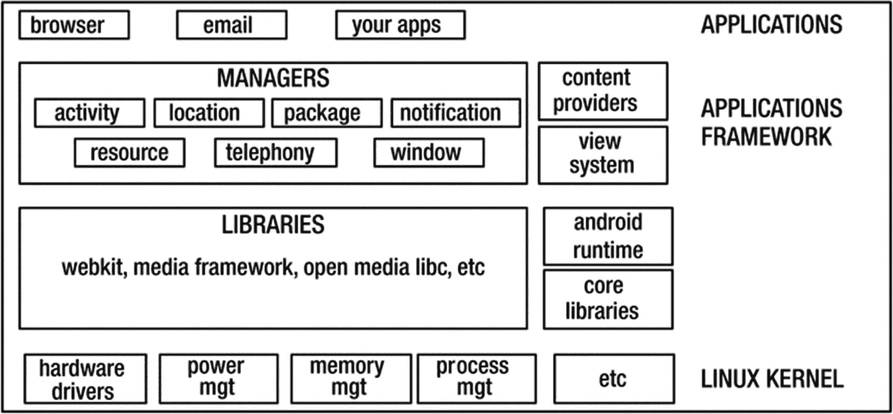

# Android 概述

*本章涵盖内容：*

- Android 简史
- Android 操作系统

自那个绿色小机器人掀起波澜并颠覆移动计算世界以来，已经过去相当长一段时间了。它最初是为手机设计的操作系统，但自那以后，已渗透到电视、车载系统、手表、电子阅读器、上网本和游戏机等各种设备之中。

对许多人来说，Android 可能仅仅被视为一个操作系统，这在很大程度上也确实如此；但除了操作系统本身，Android 还包含软件开发工具包、库、应用程序框架和参考设计。

## 历史

**2003 年**。安迪·鲁宾创立了 Android 公司；谷歌为其提供支持，但尚未完全拥有该公司。

**2005 年**。谷歌收购了 Android 公司。

**2007 年**。Android 被正式开源；谷歌将其所有权移交给开放手机联盟（Open Handset Alliance，OHA）。

**2008 年**。Android v1.0 发布。当时的 Google Play 商店并非此名，而是被称为“市场”（Market）。

**2009 年**。发布了 1.1、1.5（Cupcake）、1.6（Donut）和 2.0（Eclair）版本。Cupcake 是首个采用甜品命名方案的版本。这是一个重要的版本，因为它引入了屏幕键盘。Donut 则作为首个包含“搜索框”的版本而被铭记。Eclair 是首个包含谷歌地图的版本，这开启了车载导航系统的没落，因为谷歌免费提供了地图服务。

**2010 年**。发布了 2.2（Froyo）以及 2.3 至 2.3.7（Gingerbread）版本。Froyo 提升了 Android 体验；它将主屏幕从之前版本的三个增加到了五个。Gingerbread 与 Nexus S（三星生产的那一款）的发布同步进行。Gingerbread 也因引入了对前置摄像头的支持而被铭记；自拍狂潮由此开始。

**2011 年**。发布了 3.0（Honeycomb）以及 4.0 至 4.0.4（Ice Cream Sandwich）版本。此前所有 Android 版本都（只）针对手机；Android 3.0 改变了这一局面，因为 Honeycomb 是为平板电脑设计的。它为未来版本的 Android 设计提供了线索。它取消了实体按键；主页、返回和菜单按钮都成为了软件的一部分。谷歌与三星再次合作推出了 Galaxy Nexus（Nexus S 的继任者），其使用的操作系统是 Ice Cream Sandwich。

**2012 年**。发布了 4.1 至 4.3.1（Jelly Bean）版本。Jelly Bean 引入了“Google Now”，可通过从主屏幕快速滑动访问；它让用户能够在单个屏幕上访问日历、事件、电子邮件和天气预报。这是谷歌助手的早期版本。同样在这个版本中，实现了“黄油计划”（Project Butter），为用户带来了更流畅的 Android 体验。

**2013 年**。发布了 4.4 至 4.4.4（KitKat）版本。KitKat 是一次重大的外观升级；之前版本的蓝色调被更精致的白色调取代，许多系统自带应用也以更浅的配色方案重新设计。这个版本还带来了“Ok Google”搜索指令。

**2014 年**。发布了 5.0–5.1/5.1.1（Lollipop）版本；Android 进入 64 位时代。Lollipop 首次采用了谷歌的 Material Design 设计理念。这些变化不仅仅是外观上的；在底层，Android 5 放弃了 Dalvik 虚拟机，转而使用 Android 运行时（ART）。Android TV 也在这一时期发布。

**2015 年**。发布了 6.0 和 6.01（Marshmallow）版本。应用菜单发生了巨大变化，谷歌增加了搜索栏，方便用户快速找到应用。此版本引入了内存管理器，用户可以查看应用的内存使用情况。权限系统也进行了彻底改革；应用不能再批量请求权限；权限将在需要时被逐一请求（和授予）。

**2016 年**。发布了 7.0–7.1.2（Nougat）版本。“Google Now”被“Google 助手”取代。改进的多任务系统支持分屏模式。

**2017 年**。发布了 8.0 和 8.1（Oreo）版本；随之而来的是更多的多任务功能。画中画和原生分屏功能在此版本中引入。

**2018 年**。Android 9.0（Pie）发布——恰好在 v1.0 发布 10 年之后。此版本带来了相当多的视觉变化，使其成为近年来最重要的更新。三键布局被替换为单个药丸形状的按钮以及用于控制多任务等操作的手势。

**2019 年**。Android 10 发布；这对谷歌来说在版本命名上是一个转变。谷歌不再使用甜品名称，而是简单地根据版本号来命名。绿色机器人正在被重新塑造。此版本也标志着 Android 导航按钮的终结。虽然 Android 9 保留了“返回”按钮，但 v10 已完全将其移除，并将使用手势替代。

## 操作系统

Android 最显而易见的部分，至少对于开发者而言，是其操作系统。Android 操作系统可能看起来很复杂，但其目的很简单；它位于用户和硬件之间。这可能过于简化，但对我们来说已经足够了。这里说的“用户”，我并非字面意义上的终端用户或人；我指的是应用程序，即程序员创建的代码片段，比如文字处理器或电子邮件客户端。

以电子邮件应用为例；当您键入每个字符时，应用需要与硬件通信，以便将信息传输到屏幕和硬盘，并最终通过网络发送到云端。这比我描述的更复杂，但基本思想如此。从最简单的层面讲，操作系统做三件事：

-   代表应用程序管理硬件。
-   为应用程序提供服务，如网络、安全、内存管理等。
-   管理应用程序的执行；这部分使得我们能够（看似）几乎同时运行多个应用程序。

图 1-1 展示了 Android 系统架构的逻辑图；它远非完整，因为并未显示 Android 平台中的所有应用、组件和库，但它应该能让您了解事物是如何组织的。

图 1-1

平台架构

图中最底层负责与硬件、各种服务（如内存管理）以及进程执行的接口交互。Android 操作系统的这一部分是 Linux。Linux 是一个非常稳定的操作系统，本身也相当普及。您可以在许多地方找到它，如数据中心的服务器硬件、家电、医疗设备等。Android 使用 Linux 来处理硬件接口和其他一些内核功能。

在 Linux 内核之上是低层库，例如 SQLite、OpenGL 等。它们不是 Linux 内核的一部分，但仍然处于低层，因此主要用 C/C++ 编写。在同一层，您会找到 Android 运行时，这是运行 Android 应用程序的地方。

接下来是应用程序框架层。它位于低层库和 Android 运行时之上，因为它两者都需要。作为应用程序开发者，这是我们将要与之交互的层，因为它包含了我们编写应用所需的所有库。

最后，顶层是应用层。这是我们所有应用所在的位置，包括我们自己编写的和操作系统预装的。需要指出的是，设备自带的预装应用相对于我们将要编写的应用没有任何特权。如果您不喜欢手机自带的电子邮件应用，您可以自己编写一个来替换它。Android 在这方面是民主的。

### 摘要

- Android 经历了漫长的发展，从功能简陋的 Cupcake 版本一路演进到如今非常先进、能提供丝滑流畅用户体验的 Android 10。Android 早期版本发布节奏十分激进，但此后逐渐放缓，并固定为更统一的 12 个月周期。
- Android 不仅仅是一个操作系统，它还包含应用程序框架、软件开发工具包、预置应用程序和参考设计。
- Android 利用 Linux 操作系统来管理硬件接口、内存管理和进程执行。

