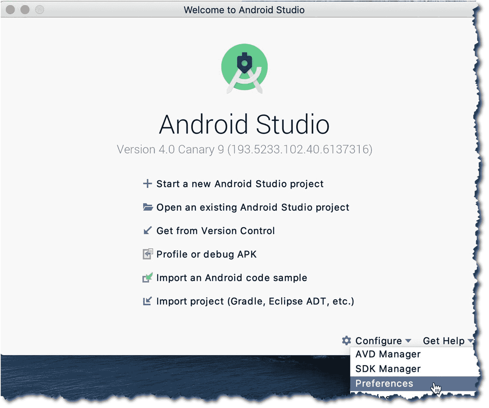
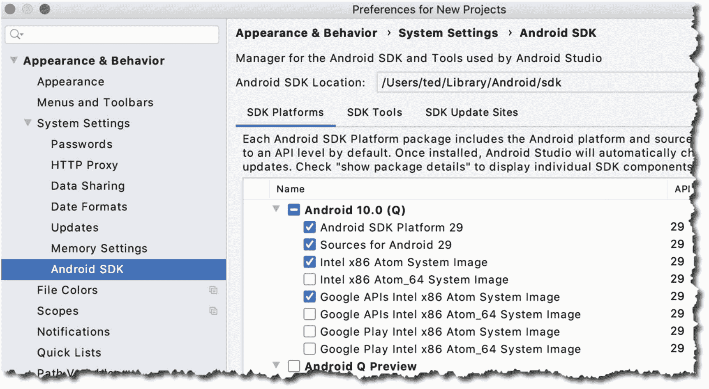
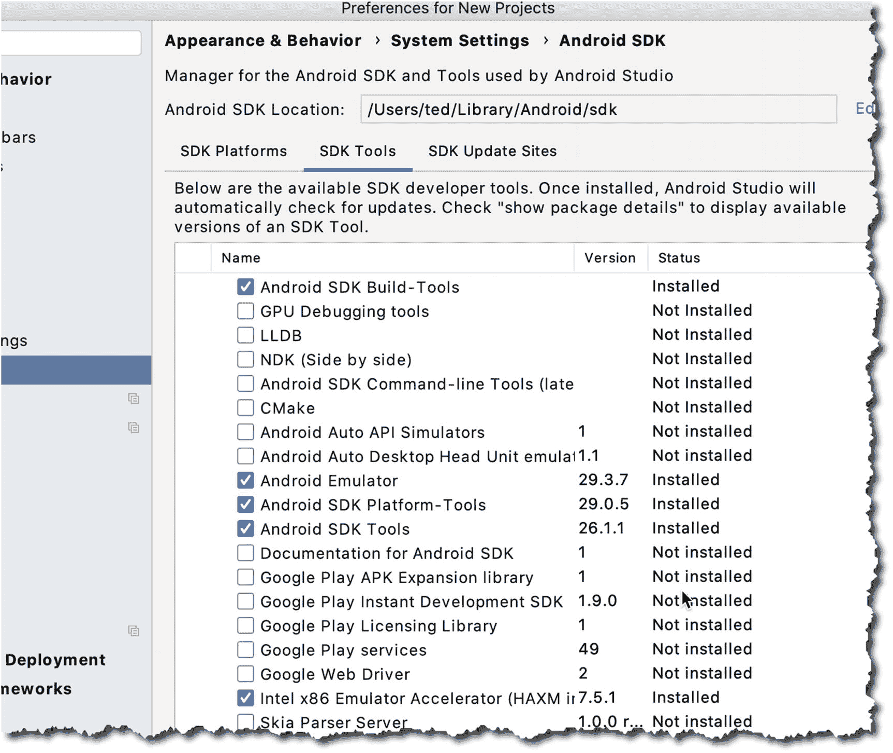

# 2. Android Studio

*本章涵盖内容：*

- 获取 Android Studio
- 配置 IDE
- IDE 的基本组成部分

开发 Android 应用程序并非一直都是在 Android Studio（AS）中完成的。在 Android 发展的早期，开发者仅使用纯粹的 SDK、一系列命令行工具和 Ant 构建脚本来构建应用——这相当有年代感；不久之后，针对 Eclipse 的 Android 开发者工具（ADT）发布了。Eclipse 成为了 Android 开发的主导工具，直到 Android Studio 的出现。

Android Studio 于 2013 年问世。诚然，当时它仍处于测试阶段，但趋势已十分明显；它将成为 Android 开发的官方工具。Android Studio 基于 JetBrains 公司的 IntelliJ；这是一款商业化的 Java IDE，同时也有免费版或社区版。IntelliJ 的社区版正是 Android Studio 的基础。

## 环境搭建

在撰写本书时，Android Studio 4 正处于预览版阶段；我用于本书编写的版本是 Canary 9。当你阅读本书时，Android Studio 4 可能已经发布了稳定版；希望届时相关的图表和截图不会与本书差别太大。要下载 Android Studio 4（预览版），你可以访问 [`https://developer.android.com/studio/preview`](https://developer.android.com/studio/preview)。

安装程序适用于 Windows（32 位和 64 位）、macOS 和 Linux。我在 macOS（Catalina）、Windows 10 64 位和 Ubuntu 18 上执行了安装说明。我主要工作在 macOS 环境下，这也解释了为什么本书中的大部分截图看起来都像 macOS。Android Studio 在这三个平台上的外观、运行和操作体验（大体上）相同，仅有非常细微的差异，比如快捷键和 macOS 上的主菜单栏。

在继续之前，我们先看一下 Android Studio 的系统要求；至少，你需要满足以下任一操作系统条件：

- Microsoft Windows 7、8 或 10（32 位或 64 位）
- macOS 10.10（Yosemite 或更高版本）
- Linux（Gnome 或 KDE 桌面），Ubuntu 14.04 或更高版本；64 位系统需能运行 32 位应用程序
- 如果你使用 Linux，则需要 GNU C 库（`glibc` 2.19 或更高版本）

硬件方面，你的工作站至少需要满足：

- 最低 4GB 内存（建议 8GB 或更多）
- 至少 2GB 可用硬盘空间（建议 4GB）
- 最低 1280 x 800 屏幕分辨率

上述列表来自 Android 官方网站 ([`https://developer.android.com/studio`](https://developer.android.com/studio))；当然，配置越高越好。

Android Studio 没有必备的软件先决条件。过去，你需要在安装 Android Studio 之前先安装 Java 开发工具包（JDK）；但从 Android Studio 2.2 开始，安装程序已经内置了 OpenJDK——你不再需要费心去单独安装 JDK 了。

从 [`https://developer.android.com/studio/`](https://developer.android.com/studio/) 下载安装程序，并获取适用于你平台的二进制文件。

如果你使用的是 macOS，请执行以下步骤：

1. 解压安装程序的压缩文件。
2. 将应用程序文件拖入“应用程序”文件夹。
3. 启动 Android Studio。

如果你之前安装过旧版本，Android Studio 会提示你导入一些设置。你可以选择导入——这是默认选项。

> **注意：** 如果你已安装了旧版本的 Android Studio，你可以继续使用旧版本，同时安装预览版。Android Studio 4 可以与现有的 Android Studio 版本共存；它的设置将保存在不同的目录中。

如果你使用的是 Windows，请执行以下步骤：

1. 解压安装程序文件。
2. 将解压后的目录移动到你选择的位置，例如`C:\Users\你的用户名\AndroidStudio`。
3. 进入“AndroidStudio”文件夹；在里面你会找到`studio64.exe`。这就是你需要启动的文件。建议为这个文件创建一个快捷方式——右键单击`studio64.exe`并选择“固定到‘开始’菜单”，就可以让 Android Studio 出现在 Windows 开始菜单中；或者，你也可以将其固定到任务栏。

Linux 的安装过程比简单的双击并跟随安装程序提示要稍微复杂一些。在未来的 Ubuntu（及其衍生版）版本中，这种情况可能会改变，变得和 Windows、macOS 一样简单流畅，但目前，我们还需要做一些调整。在 Linux 上进行这些额外的操作主要是因为 AS 需要一些 32 位库和硬件加速。

> **注意：** 本节中的安装说明适用于 Ubuntu 64 位及其他 Ubuntu 衍生版，例如 Linux Mint、Lubuntu、Xubuntu、Ubuntu MATE 等。我选择这个发行版是因为我假设它是非常常见的 Linux 版本；因此，本书的读者可能会使用该发行版。如果你运行的是 64 位版本的 Ubuntu，你将需要拉取一些 32 位库，以便 AS 能够良好运行。

要开始为 Linux 拉取 32 位库，请在终端窗口中运行以下命令：

```
sudo apt-get update && sudo apt-get upgrade -y
sudo dpkg --add-architecture i386
sudo apt-get install libncurses5:i386 libstdc++6:i386 zlib1g:i386
```

当所有准备工作完成后，你需要执行以下步骤：

1. 解压下载的安装程序文件。你可以使用命令行工具或 GUI 工具解压文件——例如，如果你的文件管理器有此功能，你可以右键单击文件并选择“在此解压”选项。
2. 解压文件后，将文件夹重命名为“AndroidStudio”。
3. 将文件夹移动到你拥有读取、写入和执行权限的位置。或者，你也可以将其移动到`/usr/local/AndroidStudio`路径下。
4. 打开一个终端窗口，进入 `AndroidStudio/bin` 文件夹，然后运行 `./studio.sh`。
5. 首次启动时，Android Studio 会询问你是否要导入一些设置；如果你安装过旧版本的 Android Studio，你可能想要导入这些设置。


## 配置 Android Studio

在开始编码之前，我们先配置一些东西。让我们执行以下操作：

1.  获取一些我们需要的额外软件，以便构建针对特定 Android 版本的应用程序。
2.  确保我们拥有所有需要的工具。
3.  （可选）更改获取更新的方式。

启动 Android Studio 并点击“Configure”（配置）（如图 2-1 所示），然后从下拉列表中选择“Preferences”（偏好设置）。



图 2-1

从 Android Studio 的启动对话框进入“Preferences”（偏好设置）

选择“Preferences”（偏好设置）后会打开 *Preferences*（偏好设置）对话框。在左侧，导航到 **Appearance & Behavior**（外观与行为）➤ **System Settings**（系统设置）➤ **Android SDK**，如图 2-2 所示。



图 2-2

SDK 平台

当您进入 SDK 窗口时，启用“Show Package Details”（显示包详细信息）选项，以便查看每个 API 级别的更详细视图。我们不需要下载 SDK 窗口中的所有内容。我们只获取需要的项目。

SDK 级别或平台编号是 Android 的特定版本。Android 10 是 API 级别 29，Android 9（或“Pie”）是 API 级别 28，Android 8（或“Oreo”）是 API 级别 26 和 27，Nougat 是 API 级别 24 和 25。您不需要记住平台编号，至少现在不需要，因为 IDE 会显示平台编号以及相应的 Android 昵称。

下载您希望应用程序针对的 API 级别，但就本书而言，请下载 API 级别 29（Android 10）。这是我们将用于示例项目的 API 级别。确保在下载平台的同时，也下载“Google APIs Intel x86 Atom_64 System Image”。当我们进行到测试运行应用程序的部分时，会用到它们。

现在选择 API 级别可能不是什么大事，因为此时我们只是处理练习应用。当您计划向公众发布应用程序时，就不能轻视这个选择了。为您的应用选择最低 SDK 或 API 级别将决定有多少人能使用您的应用。在撰写本文时，所有 Android 设备中有 17% 在使用“Marshmallow”，19% 使用“Nougat”，29% 使用“Oreo”，只有 10% 使用“Pie”；Android 10 的统计数据尚未公布。这些统计数据来自官方 Android 网站的仪表板页面。时不时地查看这些统计数据是个好主意；您可以在这里找到：[`http://bit.ly/droiddashboard`](http://bit.ly/droiddashboard)。

接下来我们转到“SDK Tools”（SDK 工具）部分，如图 2-3 所示。



图 2-3

SDK 工具

通常您不需要更改此窗口上的任何内容，但检查一下是否有如下列表中标记为“Installed”（已安装）的工具也无妨：

* Android SDK Build Tools
* Android SDK Platform Tools
* Android SDK Tools
* Android Emulator
* Support Repository
* HAXM Installer

注意

如果您使用的是 Linux 平台，即使有 Intel 处理器也无法使用 HAXM。在 Linux 中将使用 KVM 代替 HAXM。

一旦对选择满意，点击“OK”（确定）按钮开始下载这些包。

### 硬件加速

在创建应用程序时，有时为了获得即时反馈并检查其是否按预期运行或是否能够运行，进行测试和运行会很有用。为此，您将使用物理设备或虚拟设备。每种选择都有其优缺点，您不必只选其一；事实上，最终您将需要使用这两种选择。

Android 虚拟设备（AVD）是一个可以运行应用的模拟器。在模拟器上运行有时可能会很慢；这就是 Google 和 Intel 推出 HAXM 的原因。它是一个模拟器加速工具，能让测试应用的过程稍微好受一些。这对开发者来说绝对是个福音。前提是您使用的机器拥有支持虚拟化的 Intel 处理器，并且您不在 Linux 上。但如果您不幸不属于这部分用户，也别担心，在 Linux 中也有办法实现模拟器加速，我们稍后会看到。

macOS 用户可能最轻松，因为 HAXM 会随 Android Studio 自动安装。他们无需做任何事即可获得它；安装程序已经为他们处理好了。

Windows 用户可以通过以下方式获取 HAXM：

* 从 [`https://software.intel.com/en-us/android`](https://software.intel.com/en-us/android) 下载。像安装其他 Windows 软件一样安装它，双击并按照提示操作。
* 或者，您可以通过 SDK 管理器获取 HAXM；这是推荐的方法。

对于 Linux 用户，推荐的软件是 KVM。KVM（基于内核的虚拟机）是 Linux 的虚拟化解决方案。它包含虚拟化扩展（Intel VT 或 AMD-V）。

要获取 KVM，我们需要从软件仓库中获取一些软件；但在此之前，您需要先执行以下操作：

1.  确保在 BIOS 或 UEFI 设置中启用了虚拟化。请查阅您的硬件手册以了解如何进入这些设置。这通常涉及关闭电脑、重新启动，并在听到系统扬声器提示音时立即按下中断键，如 `F2` 或 `DEL`，但正如我所说，请查阅您的硬件手册。

2.  完成更改并重新启动到 Linux 后，确定您的系统是否可以运行虚拟化。这可以通过在终端中运行以下命令来完成：`egrep –c '(vmx|svm)' /proc/cpuinfo`。如果结果是一个大于零的数字，则表示您可以继续进行安装。

要安装 KVM，请在终端窗口中输入代码清单 2-1 中所示的命令。

```
sudo apt-get install qemu-kvm libvirt-bin ubuntu-vm-builder bridge-utils
sudo adduser your_user_name kvm
sudo adduser your_user_name libvirtd
代码清单 2-1
安装 KVM 的命令
```

您可能需要重新启动系统以完成安装。

希望一切顺利，您现在拥有了合适的开发环境。在下一章中，我们将熟悉 Android Studio IDE 的各个部分。

## 总结

* Android Studio 基于 IntelliJ 社区版开发。如果您以前使用过 IntelliJ，您学过的所有技巧和键盘快捷键都可以在 Android Studio 中使用。
* 您可以同时使用不同版本的 Android Studio；您无需卸载旧版本的 Android Studio 即可试用预览版。
* 如果可以，请安装硬件加速器（HAXM）；它将使您的测试活动更加愉快。如果您使用 Linux，请使用基于内核的虚拟机（KVM）代替 HAXM。

