# 3. 项目基础

*本章内容涵盖：*

* 在 Android Studio 中创建一个简单项目
* 创建一个模拟器（一个 AVD 或 Android 虚拟设备）
* 在模拟器中运行一个测试项目

您可以在 Android Studio 中构建许多东西：商业应用、电子书、休闲游戏（甚至 AAA 级大作，为什么不呢？），等等。但在您能做所有这些之前，您需要了解在 Android Studio 中创建、构建和测试应用的基础知识。本章正是关于这些内容的。

## 创建项目

启动 Android Studio。点击“Start a new Android Studio Project”（启动新的 Android Studio 项目），如图 3-1 所示。操作时必须保持在线，因为 Android Studio 的 Gradle（项目构建工具）会在你创建新项目时从在线仓库拉取大量文件。

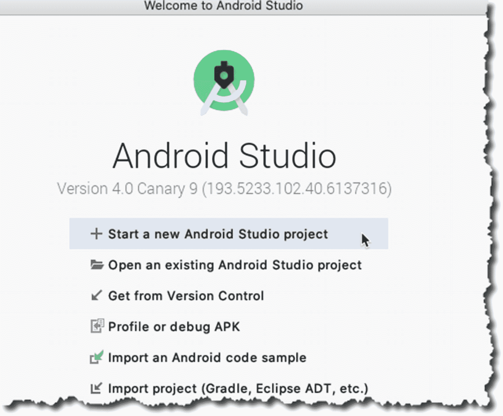

图 3-1

启动界面

在创建过程中，Android 会提示你选择要构建的项目类型；选择 **Phone and Tablet** ➤ **Empty Activity**，如图 3-2 所示——我们将在后续章节讨论 Activity，但目前可以将 Activity 理解为一个屏幕或表单，它是用户能看到并进行交互的界面。

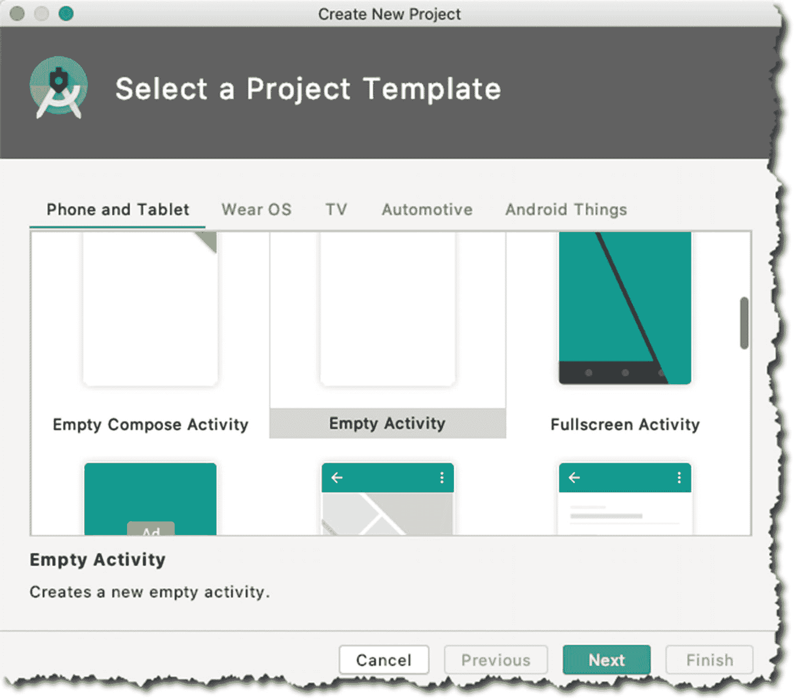

图 3-2

创建新项目；选择 Activity 类型

在下一个界面中，我们需要配置项目。我们将设置应用名称、包名（域名）以及目标 Android 版本。图 3-3 展示了“Create New Project”（创建新项目）界面的详细说明图。

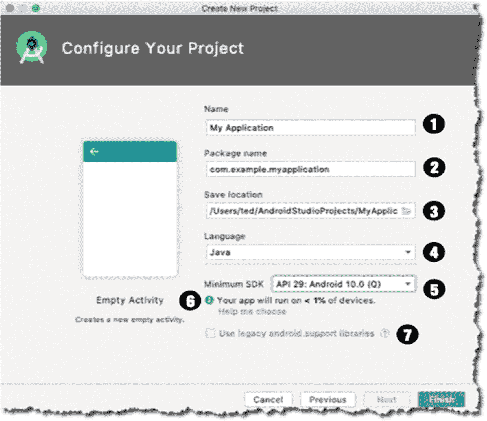

图 3-3

配置你的项目

| ❶ | **Name（名称）**。这也称为项目名称；它同时会成为顶级文件夹的名称，该文件夹将包含项目的所有文件。如果你将应用发布到 Play 商店，此名称还将成为应用标识的一部分。 |
| ❷ | **Package name（包名）**。这是你的组织或公司域名，采用反向 DNS 表示法。如果你没有公司名称，可以使用任何类似网页域名的名称。目前，是否使用真实公司名无关紧要，因为我们不会将此应用发布到 Play 商店。 |
| ❸ | **Save location（保存位置）**。这是你本地目录中用于保存项目文件的位置。 |
| ❹ | **Language（语言）**。你可以选择 Kotlin 或 Java；在本项目中，我们将使用 Java。 |
| ❺ | **Minimum API level（最低 API 级别）**。最低 API 级别将决定你的应用可以运行的最低 Android 版本。你需要谨慎明智地选择，因为它可能会严重限制应用的潜在用户群体。 |
| ❻ | **Help me choose（帮我选择）**。此选项会显示你的应用可以支持的 Android 设备百分比。如果点击“Help me choose”链接，将打开一个窗口，按 Android 版本显示 Android 设备的分布情况。 |
| ❼ | **Legacy Android support libraries（旧版 Android 支持库）**。这些是支持库。引入它们是为了让你能够使用现代 Android 库（例如 Android 9 中附带的库），同时还能让应用在较低 Android 版本的设备上运行。 |

全部完成后，点击“Finish”（完成）开始创建项目。Android Studio 会搭建项目结构，并创建启动文件，例如主 Activity 文件、Android Manifest 以及其他支持项目启动的文件。构建工具（Gradle）会从在线仓库拉取大量文件，这可能需要一些时间。

完成上述步骤后，希望项目已成功创建，你将看到 Android Studio 的主编辑器窗口，如图 3-4 所示。

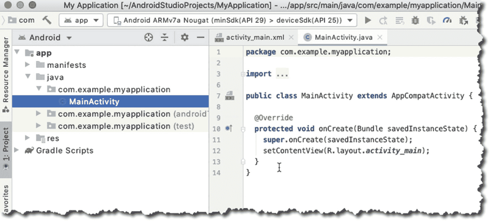

图 3-4

主编辑器窗口

Android Studio 的界面由多个区域组成，这些区域可以根据你的需要折叠或展开。左侧区域（图 3-4）是项目面板。它采用树状结构，显示项目中所有（相关）文件。如果你想编辑某个特定文件，只需在项目面板中选择它并双击；此时，该文件将在主编辑器窗口中打开以供编辑。在图 3-4 中，你可以看到 `MainActivity.java` 文件已可供编辑。在今后的工作中，我们将会花费大量时间在主编辑器窗口中编写代码，但目前我们只打算了解应用开发的基本流程。我们不会在 Java 文件或项目中的任何其他文件中添加或修改任何内容。我们将保持它们原样不变。

### 创建 AVD

下一步是构建并测试应用。我们可以通过模拟器运行，也可以将实体安卓设备连接到工作站来实现。本节介绍如何设置模拟器。

在 Android Studio 的主菜单栏中，选择 **工具** ➤ **AVD 管理器**，如图 3-5 所示。

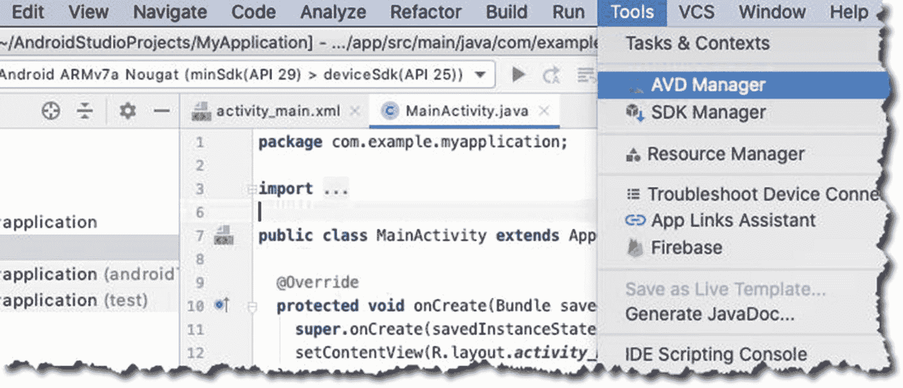

图 3-5

菜单栏，工具，AVD 管理器

AVD 管理器窗口会启动；AVD 代表 Android 虚拟设备。它是一个运行特定版本 Android 操作系统的模拟器，我们可以用它来测试应用。AVD 管理器（如图 3-6 所示）会显示本地开发环境中所有已定义的模拟器。

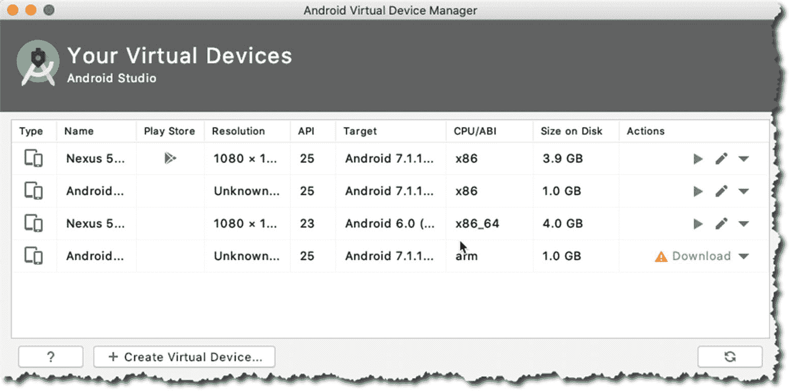

图 3-6

AVD 管理器

如您所见，我已经创建了几个模拟器，但让我们再创建一个；为此，请点击“+ 创建虚拟设备”按钮，如图 3-6 所示。该操作会启动“虚拟设备配置”界面，如图 3-7 所示。

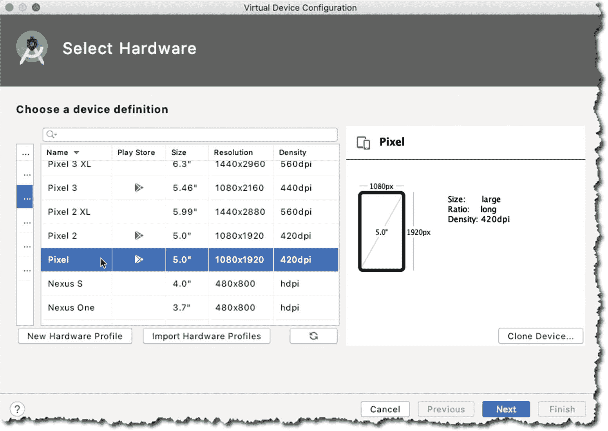

图 3-7

虚拟设备配置

选择“手机”类别，然后选择设备分辨率。我选择了 Pixel 5.0 英寸 420dpi 屏幕。点击“下一步”按钮，我们就可以选择模拟器的 Android 版本；这可以在“系统映像”界面中完成，如图 3-8 所示。

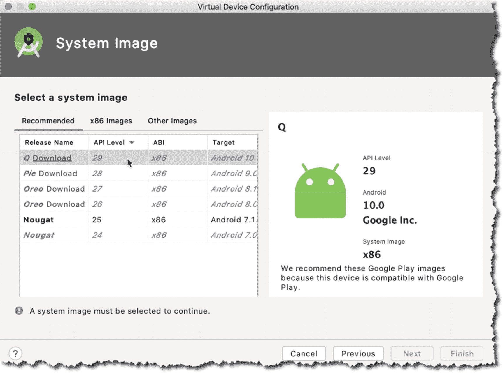

图 3-8

系统映像

我想使用 Android 10（API 级别 29），或者有人称之为 Q；但如您所见，我本地机器上还没有该系统映像——当您看到 Android 版本旁边有“下载”链接时，意味着您本地还没有该系统映像。要获取 Android 10 的系统映像，请点击“下载”链接。在继续之前，您需要同意许可协议。点击“接受”，然后点击“下一步”，如图 3-9 所示。

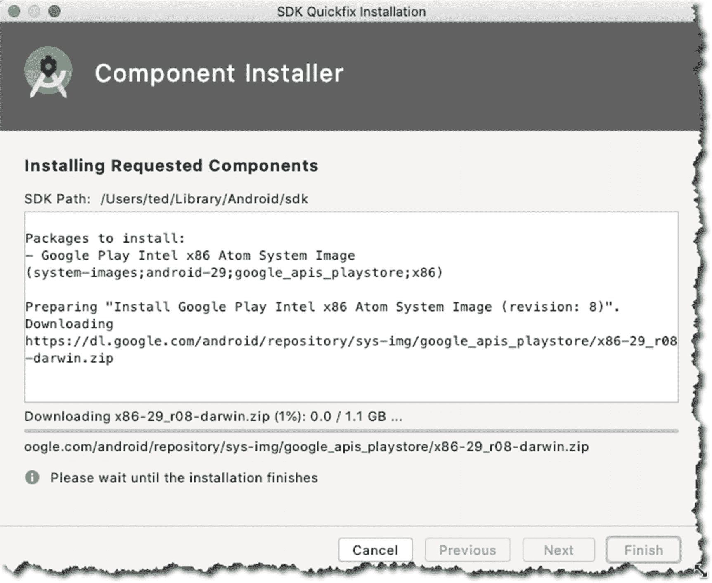

图 3-9

SDK 快速修复安装

下载过程可能需要一些时间，具体取决于您的网速；下载完成后，您将回到“系统映像”选择界面，如图 3-10 所示。

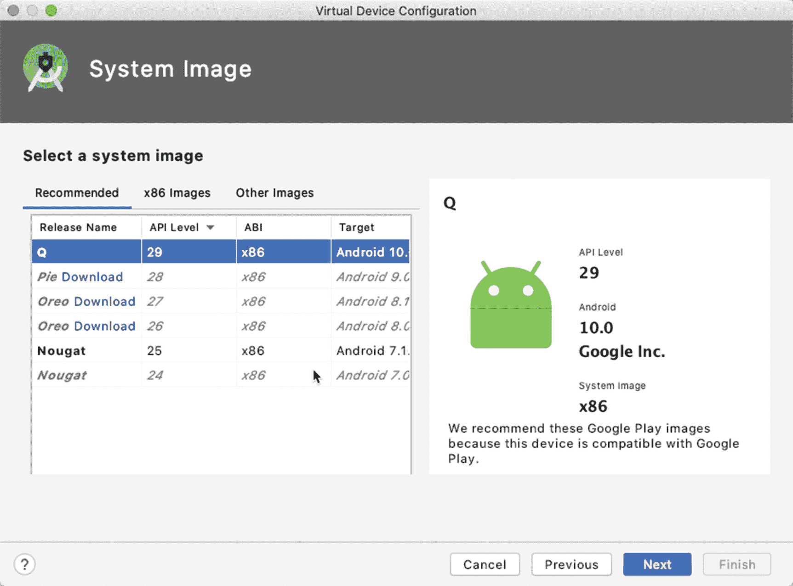

图 3-10

虚拟设备配置

如您所见，我们现在可以使用 Android 10 作为模拟器的系统映像。选择它，然后点击“下一步”。下一个界面会显示我们之前创建模拟器的选择摘要；接下来显示的是“验证配置”界面（图 3-11）。

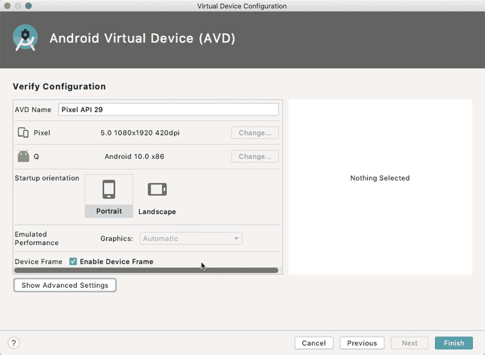

图 3-11

验证配置

“验证配置”界面不仅会显示我们之前的选择摘要，您还可以在这里配置一些附加功能。如果点击“显示高级设置”按钮，您还可以配置以下内容：

* 前置和后置摄像头
* 模拟网络速度
* 模拟性能
* 内部存储大小
* 键盘输入（启用或禁用）

完成后，点击“完成”按钮。当 AVD 创建成功后，我们将回到“Android 虚拟设备管理器”界面，如图 3-12 所示。

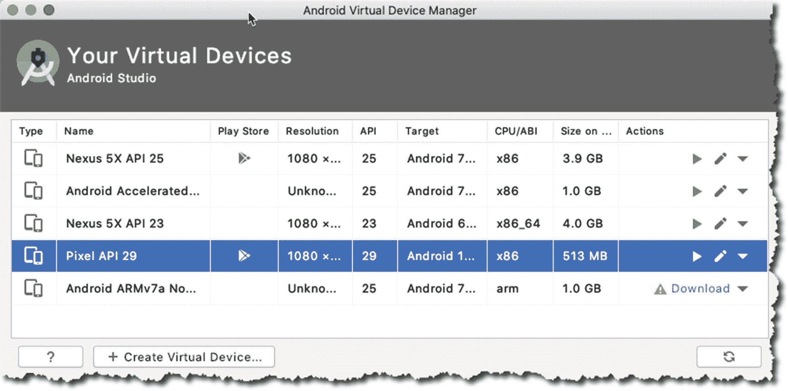

图 3-12

Android 虚拟设备管理器

现在我们可以看到模拟器（Pixel API 29）。点击“操作”列中的小绿色箭头来启动模拟器——铅笔图标用于编辑模拟器配置，绿色箭头用于启动它。

当模拟器启动时，您会看到桌面上弹出一个 Pixel 手机的图像；它需要一些时间才能完全启动。回到 Android Studio 的主编辑器窗口来运行应用。

从主菜单栏中，选择 **运行** ➤ **运行应用**，如图 3-13 所示。

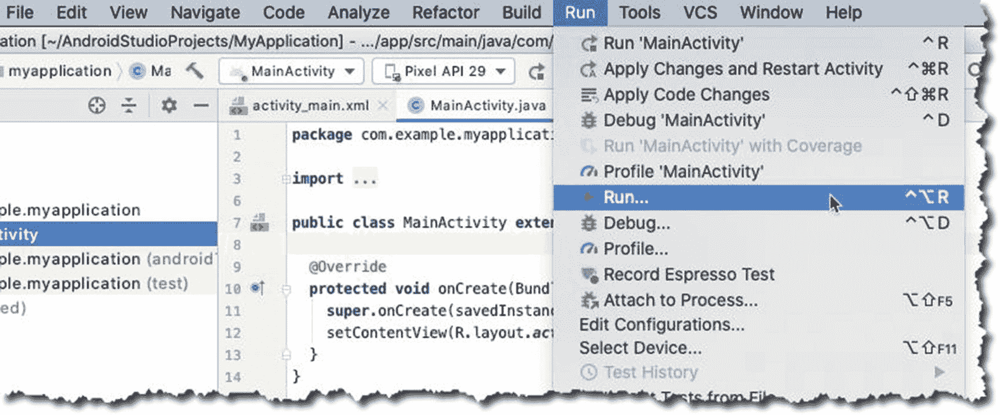

图 3-13

主菜单栏，运行

Android Studio 会编译项目；然后，它会寻找已连接（实体）的安卓设备或正在运行的模拟器。我们之前已经启动了模拟器，所以 Android Studio 应该能找到它，并将应用安装到该模拟器实例中。

如果一切顺利，您应该会看到 Android Studio 为我们搭建的 Hello World 应用，如图 3-14 所示。

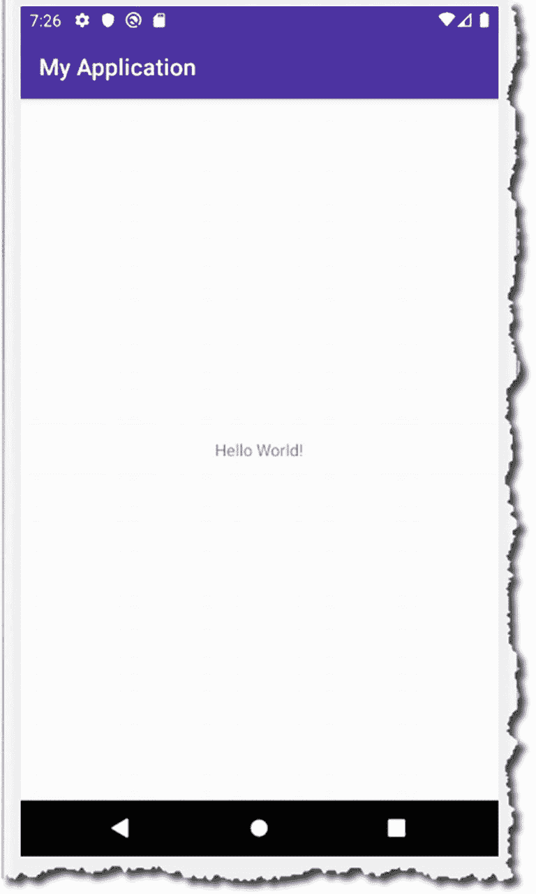

图 3-14

Hello World

## 总结

* 一个安卓项目（几乎）总是包含一个 Activity。您可以从一个基础项目开始，选择“Empty Activity”，就像我们在示例中所做的那样。然后在此基础上进行构建。
* 在创建项目时，要特别注意项目包名；如果您将项目发布到 Google Play，将无法更改包名；它将作为您应用的一部分。
* 仔细选择最低 SDK 版本；这将限制您应用的潜在用户数量。
* 您可以使用模拟器来运行应用并查看其表现。如果您的系统上启用了 HAXM（模拟器加速器），那么使用模拟器进行测试效果会好得多；如果您使用 Linux，可以通过 KVM 实现加速。

