# 4. Android Studio IDE

*本章涵盖内容：*

* 在 Android Studio 中处理文件
* 主编辑器
* 处理布局文件
* 项目工具窗口

之前，我们通过创建一个包含空 Activity 的项目构建了一个简单的应用，在主编辑器窗口中（简要地）打开了它，并在模拟器中运行了它。在本章中，我们将花一些时间重点了解 IDE 中您最常使用的部分。


## IDE（集成开发环境）

在 Android Studio 的欢迎对话框中，你可以启动之前创建的项目。现有项目的链接会显示在欢迎对话框的左侧面板上，如图 4-1 所示。

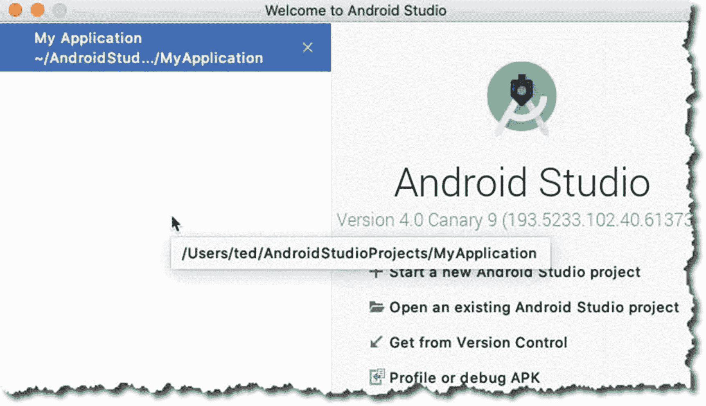

图 4-1

欢迎使用 Android Studio

当你打开一个项目时，你会看到主编辑器窗口、项目面板以及 Android Studio 默认打开的其他面板。一个已打开项目的标注图如图 4-2 所示。

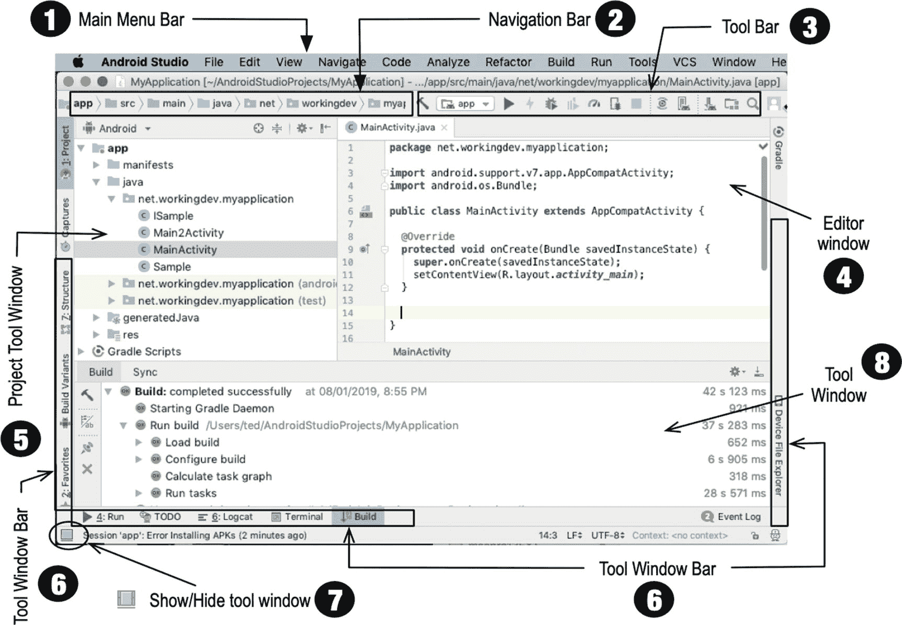

图 4-2

Android Studio IDE

| ❶ | **主菜单栏**。你可以通过多种方式在 Android Studio 中导航。通常，完成一项任务有多种方法，但主要的导航方式是通过主菜单栏实现的。如果你使用的是 Linux 或 Windows 系统，主菜单栏直接位于 IDE 顶部；如果你使用的是 macOS 系统，主菜单栏与 IDE 分离（这是所有 macOS 软件的工作方式）。 |
| ❷ | **导航栏**。此栏允许你浏览项目文件。它是一组水平排列的尖括号，类似于某种面包屑导航。你可以通过导航栏或项目工具窗口打开项目文件。 |
| ❸ | **工具栏**。它允许你执行一系列操作（例如，保存文件、运行应用、打开 AVD 管理器、打开 SDK 管理器、撤销、重做等）。 |
| ❹ | **主编辑器窗口**。这是最突出的窗口，占用最多的屏幕空间。编辑器窗口是你可以创建和修改项目文件的地方。它会根据你正在编辑的内容改变外观。如果你在处理程序源文件，此窗口将仅显示源文件。当你编辑布局文件时，你可能会看到原始的 XML 文件或布局的可视化渲染效果。 |
| ❺ | **项目工具窗口**。此窗口显示项目文件夹的内容；你可以从这里查看并启动所有项目资源（源代码、XML 文件、图形等）。 |
| ❻ | **工具窗口栏**。工具窗口栏沿着 IDE 窗口的周边排列。它包含激活特定工具窗口所需的各个按钮，例如，`TODO`、`Logcat`、项目窗口、`已连接设备` 等。 |
| ❼ | **显示/隐藏工具窗口**。它用于显示（或隐藏）工具窗口栏。这是一个切换开关。 |
| ❽ | **工具窗口**。你可以在 Android Studio 工作区的底部侧面找到工具窗口。它们是辅助窗口，允许你从不同角度查看项目。它们还允许你访问开发任务所需的典型工具，例如，调试、集成版本控制、查看构建日志、检查 `Logcat` 转储、查看 `TODO` 项等。以下是使用工具窗口时可以做的一些事情：• 你可以通过单击工具窗口栏中的工具名称来展开或折叠它们。你也可以拖动、固定、取消固定、附加和分离工具窗口。• 你可以重新排列工具窗口，但如果你觉得需要将工具窗口恢复到默认布局，可以从主菜单栏进行操作；点击**窗口** ➤ **恢复默认布局**。另外，如果你想自定义“默认布局”，可以按照自己的喜好重新排列窗口；然后，从主菜单栏点击**窗口** ➤ **将当前布局存储为默认值**。 |

### 主编辑器

与大多数 IDE 一样，你可以在主编辑器窗口中修改和处理源文件。Android Studio 的突出之处在于它对 Android 开发文件的理解非常透彻。Android Studio 允许你处理多种文件类型，但你可能会将大部分时间花在编辑以下类型上：

*   Java 源文件
*   XML 文件
*   UI 布局文件

在处理 Java 程序时，你将获得我们期望从现代编辑器中获得的所有代码提示和补全功能。更重要的是，当出现问题时，它会给我们提供大量的早期警告。图 4-3 显示了一个在主编辑器中打开的 Java 类文件。该类文件是一个 Activity，并且在其中一个语句中缺少一个分号。你会看到 Android Studio 在 IDE 中布满了（红色）波浪线，这表明该类将无法编译。

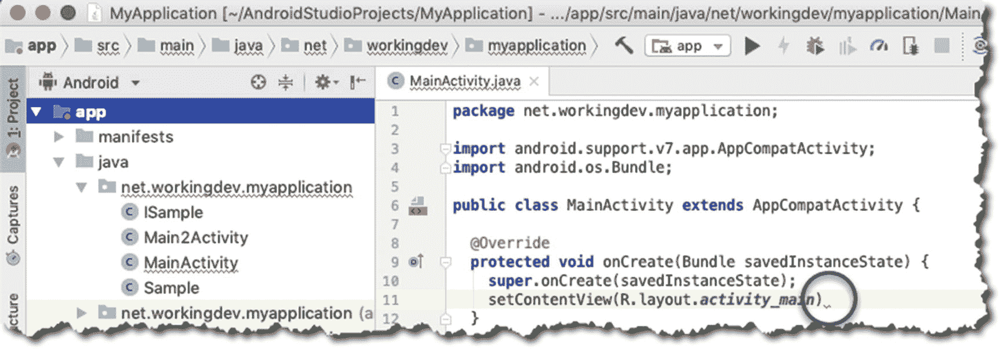

图 4-3

主编辑器显示错误指示符

Android Studio 将波浪线放在非常靠近违规代码的位置。正如你在图 4-3 中所见，波浪线被放置在预期出现分号的位置。

### 编辑布局文件

用户看到的应用程序屏幕或窗口实际上是 Android Activity。Activity 是由 Java 源文件和 XML 布局文件组成的 Android 组件。毫无疑问，Android Studio 可以编辑 XML 文件，但其与众不同之处在于它能够以所见即所得（WYSIWYG）模式直观地渲染 XML 文件。图 4-4 显示了处理布局文件的两种方式。

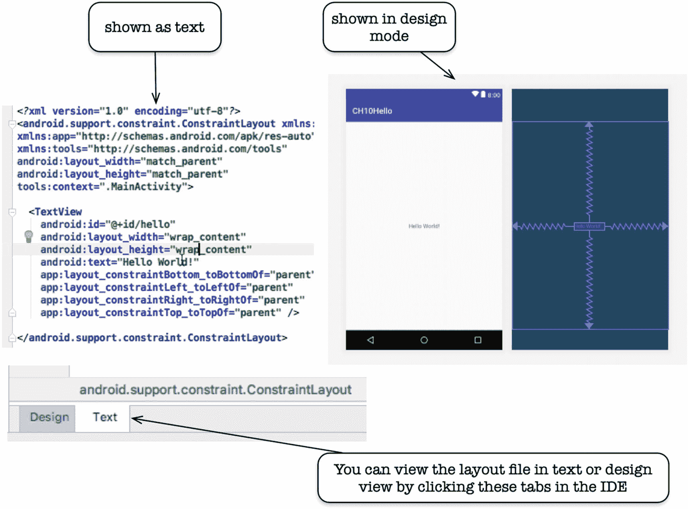

图 4-4

布局文件的设计模式和文本模式编辑

图 4-5 显示了在处于设计模式时处理布局文件相关的 Android Studio 的各个部分。

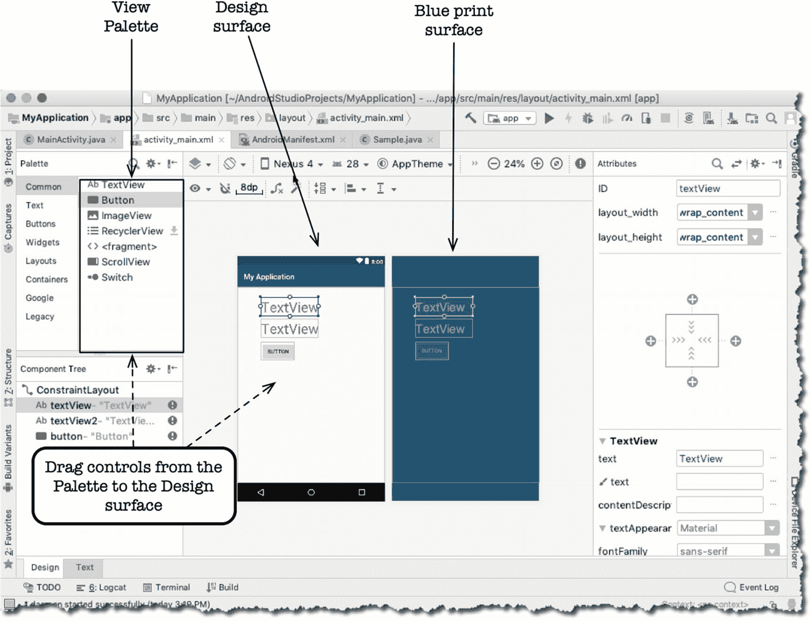

图 4-5

Android Studio 的布局设计工具

*   **视图面板**——视图面板包含可拖放到设计界面或蓝图界面上的视图（控件）。
*   **设计界面**——它充当屏幕的真实预览。
*   **蓝图界面**——类似于设计界面，但它仅包含 UI 元素的轮廓。
*   **属性窗口**——你可以在此处更改 UI 元素（视图）的属性。当你使用属性窗口对视图的属性进行更改时，该更改将自动反映在布局的 XML 文件中。类似地，当你对 XML 文件进行更改时，该更改将自动反映在属性窗口中。

### TODO 项

这可能看起来像一个微不足道的功能，但我希望你会发现它很有用——这就是我特意加入本节的原因。我们每个人都有自己为正在开发的应用编写 `TODO` 项的方式。编写 `TODO` 项本身并不麻烦；困难在于如何整合它们。

在 Android Studio 中，你无需创建单独的文件来跟踪 `TODO` 项。每当你创建一个注释，后面跟着“TODO”文本，如下所示：

```
// TODO This is a sample todo
```

Android Studio 将跟踪所有源文件中的所有 `TODO` 注释。参见图 4-6。

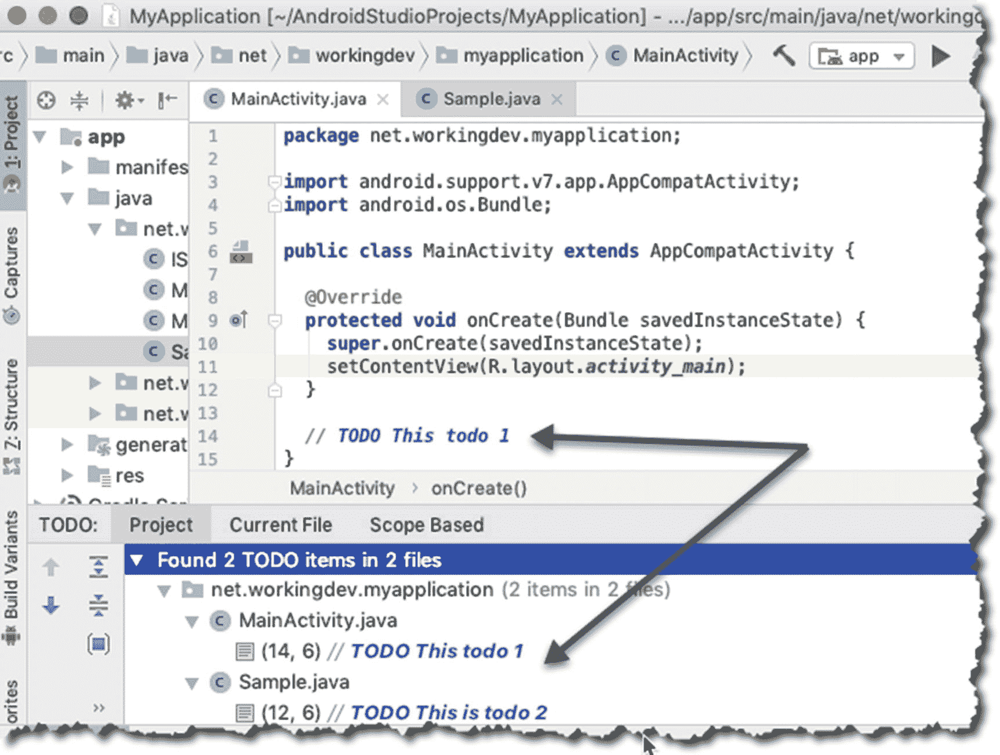

图 4-6

TODO 项

要查看所有`TODO`项，请单击工具窗口栏中的“TODO”选项卡。


## 如何为代码获取更多屏幕空间

你可以通过关闭所有工具窗口来获得更多屏幕空间。图 4-7 展示了一个在主编辑器中打开的 Java 程序，此时所有工具窗口均已关闭。你可以通过点击任意工具窗口的名称来将其折叠，例如，要折叠“项目”工具窗口，请点击“Project”。

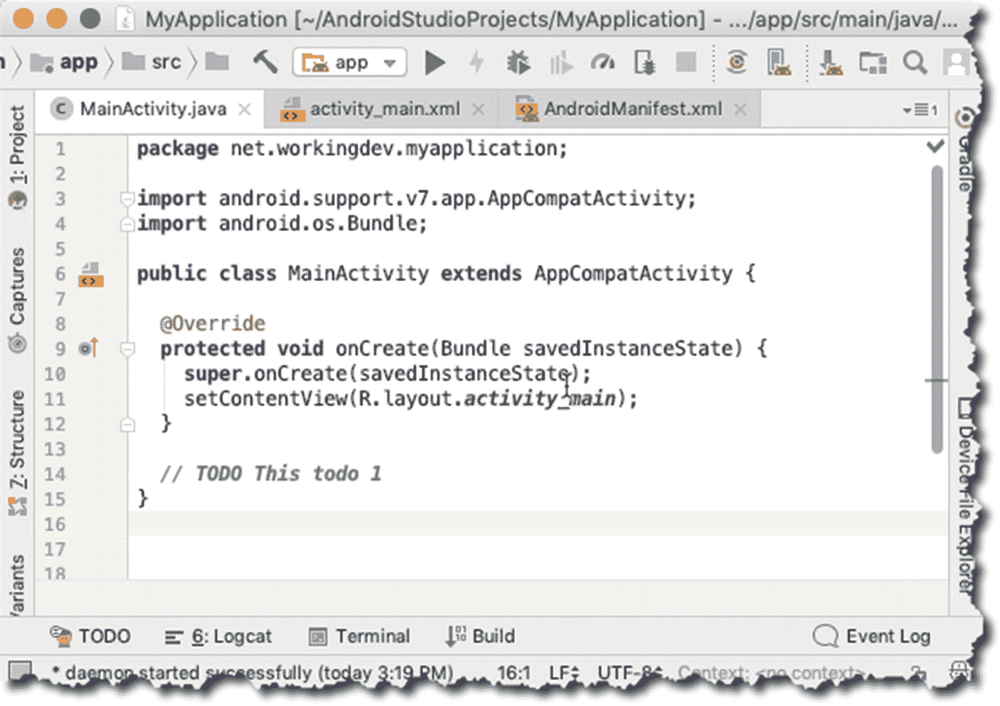

图 4-7

主编辑器，所有工具窗口已关闭

你甚至可以通过隐藏所有工具窗口栏来获得更多屏幕空间，如图 4-8 所示。

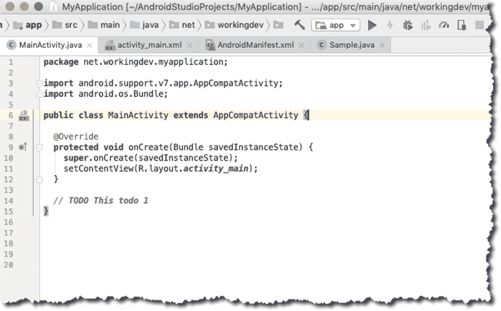

图 4-8

主编辑器，所有工具窗口已关闭且工具栏已隐藏

进入“无干扰模式”可以获得更多屏幕空间，如图 4-9 所示。你可以通过主菜单栏进入无干扰模式：**View** ➤ **Enter Distraction Free Mode**。要退出该模式，请点击主菜单栏中的 **View**，然后选择 **Exit Distraction Free Mode**。

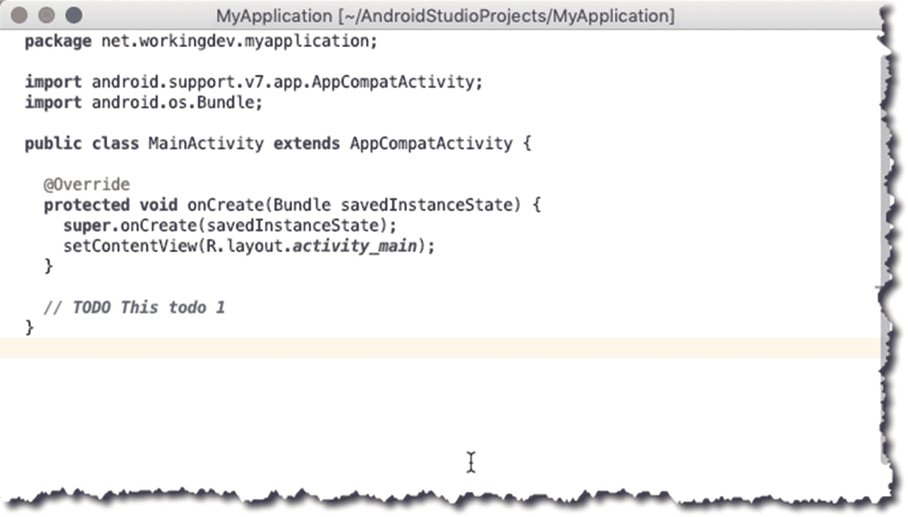

图 4-9

无干扰模式

你还可以尝试另外两种可以增加屏幕空间的模式。它们同样位于主菜单栏的 View 菜单中。

*   演示模式
*   全屏

### 项目工具窗口

你可以通过“项目”工具窗口处理项目的文件和资源，如图 4-10 所示。它具有树状结构，且各部分可以折叠。你可以在此窗口中启动任何文件。要打开文件，只需双击它。

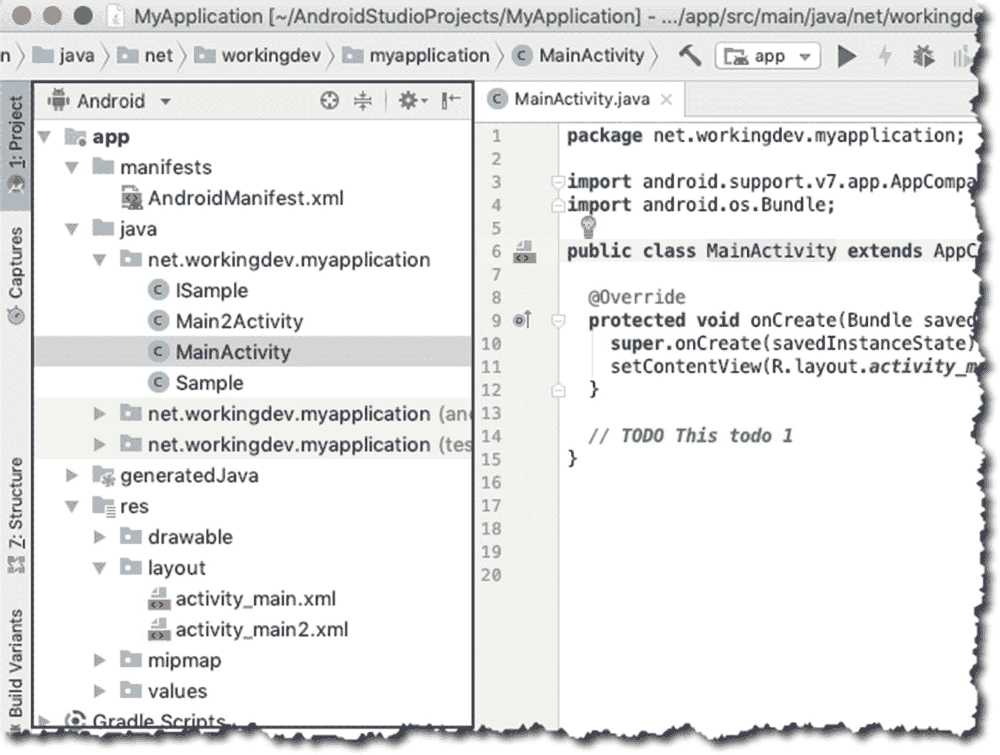

图 4-10

项目工具窗口

默认情况下，Android Studio 以 *Android 视图*显示**项目文件**，如图 4-10 所示。“Android 视图”按模块组织，以便快速访问项目中最相关的文件。你可以通过点击项目窗口顶部的向下箭头来更改查看项目文件的方式，如图 4-11 所示。

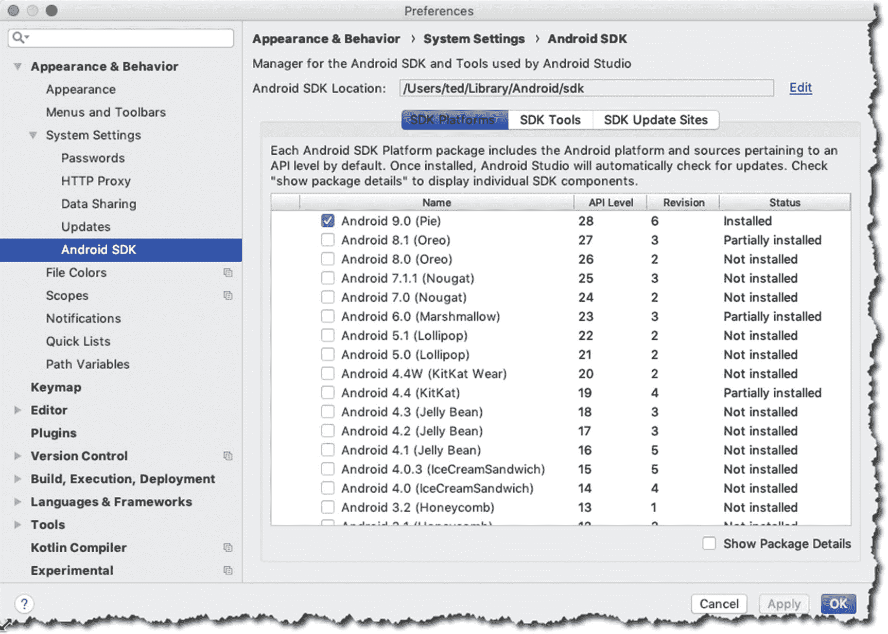

图 4-12

设置/首选项窗口

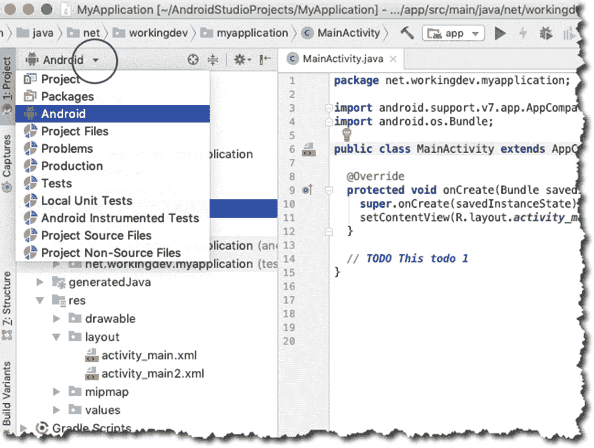

图 4-11

如何在项目工具窗口中更改视图

## 总结

*   你可以通过增加主编辑器的屏幕空间来查看更多代码。可以通过以下方式实现：
    *   折叠所有工具窗口
    *   隐藏工具窗口栏
    *   进入无干扰模式
    *   切换到全屏模式
*   你可以通过在**项目工具窗口**中切换视图来更改查看项目文件的方式。
*   在 Android Studio 中添加 TODO 项很简单；只需添加一行注释，后跟 TODO 文本，如下所示：`// TODO This is my todo list.`

