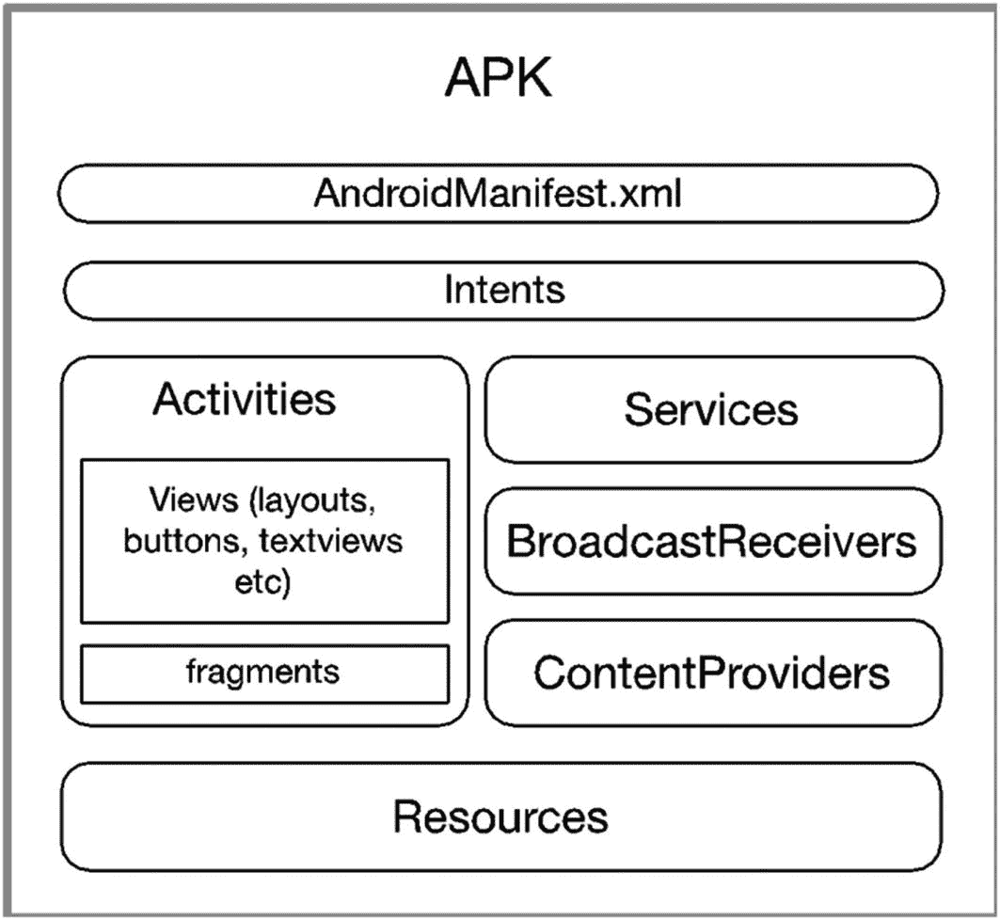
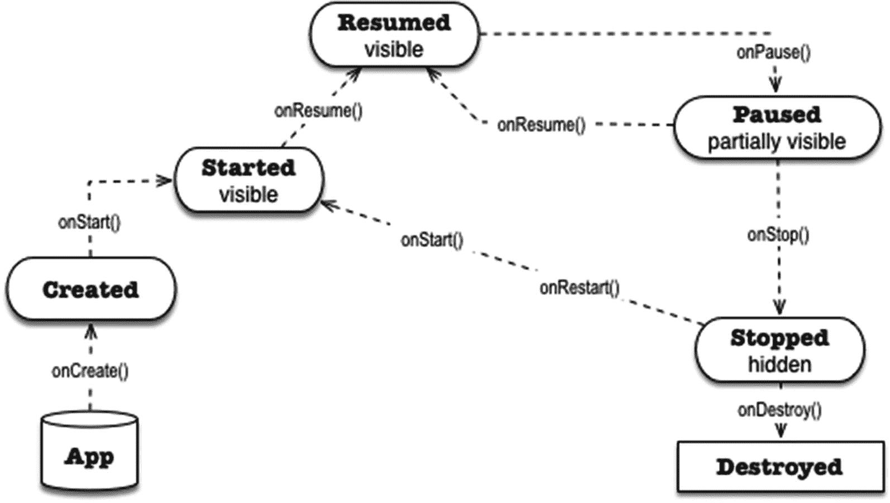

# 5. Android 应用程序概述

*本章涵盖内容：*

*   Android 项目的构成
*   Android 组件概览
*   清单文件
*   意图

既然我们已熟悉 Android Studio，那就让我们更仔细地看看 Android 应用程序的结构。

## Android 项目的构成

一个 Android 应用可能看起来很像一个桌面应用；有些人甚至可能认为它们是微型桌面应用，但这种想法并不正确。Android 应用在结构上与其桌面或网络应用对应物不同。桌面应用通常包含其运行所需的所有例程和子例程；偶尔，它可能依赖于动态加载的库，但可执行文件是自包含的。另一方面，Android 应用由松散耦合的组件组成，这些组件通过消息传递机制相互通信。图 5-1 展示了一个应用的逻辑结构。



图 5-1

Android 应用的逻辑表示

图 5-1 中的应用是一个大型应用——它包含了所有内容。你的应用不必这么大。你无需在应用中包含所有类型的组件，只需构建你需要的即可；但学习所有组件（有些需要多了解些）是值得的，尤其是像 Activities 和 Intents 这样的基础组件。

**注意：** APK 是 Application Package Kit 的缩写。它是 Android 用于分发和安装应用的包文件格式。如果 Windows 应用通过 EXE 或 MSI 打包，macOS 应用使用 DMG，那么 Android 则使用 APK。

`Activity`、`Service`、`BroadcastReceiver` 和 `ContentProvider` 被称为 *Android 组件*。它们是应用的关键构建块。它们是对有用功能的高级抽象，例如向用户显示屏幕、在后台运行任务以及广播事件以便感兴趣的应用程序可以响应它们。组件是具有非常特定行为的预编码或预构建类，我们通过扩展它们来使用，以便可以添加我们应用程序特有的行为。

构建 Android 应用很像建造房屋。有些人用传统方式建造房屋——他们组装梁、支柱、地板面板等等。他们像工匠一样用原材料手工制作门和其他配件。如果我们用这种方式构建 Android 应用，可能会花费很长时间，而且可能相当困难。从头开始构建应用所需的技能对于某些程序员来说可能难以掌握。在 Android 中，应用是使用组件构建的。可以把组件想象成房屋的预制件；这些部件是预先制造好的，只需要组装。

`Activity` 是我们放置用户可以看到的内容的地方。它是用户可以执行的特定任务。例如，可以创建一个 `Activity` 让用户查看单个电子邮件或填写表单。在图 5-1 中，`Activity` 内部包含 *Views* 和 *Fragments*。Views 是将内容绘制到屏幕上的类；`View` 对象的一些例子包括 `Button` 和 `TextView`。`Fragment` 在某些方面类似于 `Activity`，它也是一个组成单元，但更小。和 `Activity` 一样，它们也包含 `View` 对象。一些应用使用 `Fragment` 来解决在不同外形设备上部署的问题——`Fragment` 可以根据可用的屏幕空间和/或方向来启用或禁用。

**Services**。通过服务，我们可以在后台运行程序逻辑，而不会冻结用户界面。服务在后台运行；当你的应用需要从网络下载文件或播放音乐时，它们会非常有用。

**BroadcastReceivers**。通过广播接收器，我们的应用可以监听来自其他应用或 Android 运行时本身的消息；一个典型的用例是，当电池电量低于 10% 时，你可能想要显示一条警告消息。


```markdown
**ContentProviders** 让你可以编写能与其他应用共享数据的应用，而无需暴露应用 SQL 结构的内部细节。它管理对某种中央数据存储库的访问。数据库访问的细节对其他应用完全隐藏。一个作为 `ContentProvider` 的预构建应用示例是 Android 中的“联系人”应用。

你的应用可能需要一些视觉或音频资源；这些就是在图 5-1 中我们所说的“资源”。

`AndroidManifest` 正如其名；它是一个清单文件，并且是用 XML 编写的。它声明了关于应用的许多内容，例如：

*   应用的名称。
*   用户启动应用时首先显示的 `Activity`。
*   应用中包含哪些类型的组件。如果它包含 `Activity`，清单会声明它们——类名等等。如果应用包含服务，它们的类名也会在清单中声明。
*   应用能做什么？它有哪些权限？它是否允许访问互联网或相机？它能否记录 GPS 位置等等？
*   它是否使用了外部库？
*   此应用将运行在哪些 Android 版本上？
*   它是否支持特定类型的输入设备？
*   此应用是否需要特定的屏幕密度？

如你所见，清单是一个繁忙的地方；有很多东西需要关注。但不必过于担心，这里的大多数条目都是由 Android Studio 的创建向导自动处理的。你可能需要与之交互的少数情况之一，是当你需要为应用添加权限时。

当 Google Play 在商店中展示你的应用时，清单也很重要。你的应用不会显示在不满足清单文件中规定要求的设备上。

## 应用入口点

一个应用通常与用户交互，并通过 `Activity` 组件来实现。这类应用通常至少包含以下三样东西：

1.  一个 `Activity` 类，用户在应用启动后首先看到它。
2.  一个用于该 `Activity` 类的布局文件，其中包含所有 UI 定义，如文本视图、按钮等。
3.  `AndroidManifest` 文件，它将所有项目资源和组件整合在一起。

当应用启动时，Android 运行时创建一个 `Intent` 对象并检查清单文件。它寻找 `intent-filter` 节点（在 xml 文件中）的特定值。运行时试图确定应用是否有一个定义的入口点，类似于 *main function*。代码清单 5-1 显示了 Android 清单文件的一个摘录。

```
代码清单 5-1
Excerpt from AndroidManifest.xml
```

如果应用有多个 `Activity`，那么清单文件中就会有多个 `activity` 节点，每个 `Activity` 对应一个节点。定义的第一行有一个名为 *android:name* 的属性；这指向一个 `Activity` 的类名。在这个例子中，类的名称是“MainActivity”。

第二行声明了 *intent-filter*，当你在 `intent-filter` 节点上看到类似 `android.intent.action.MAIN` 的内容时，这意味着该 `Activity` 是应用的入口点。当应用启动时，用户将看到这个 `Activity`。

## 活动（Activities）

你可以将 `Activity` 视为一个屏幕或窗口。它是一个用户可以与之交互的东西。这是应用的 UI。`Activity` 是一个继承自 *android.app.Activity* 类的类（以某种方式），但我们通常扩展 `AppCompatActivity` 类（而不是 `Activity`），这样我们既可以使用现代 UI 元素，又能让应用在较旧的 Android 版本上运行；因此，名称 `AppCompatActivity` 中有“Compat”，它代表“compatibility”。

一个 `Activity` 组件由两部分组成：一个 Java 类（如果你选择 Kotlin 也可以是 Kotlin 类）和一个 XML 格式的布局文件。布局文件是你放置所有 UI 定义的地方，例如，文本框、按钮、标签等。Java 类是你编写 UI 所有行为部分代码的地方，例如，按钮被点击时发生什么、在字段中输入文本时发生什么、用户改变设备方向时发生什么、另一个组件向 `Activity` 发送消息时发生什么，等等。

与 Android 中的任何其他组件一样，`Activity` 有一个生命周期。每个生命周期事件在 `Activity` 的 Java 类中都有一个关联的方法；我们可以使用这些方法来定制应用的行为。图 5-2 显示了 `Activity` 的生命周期。



图 5-2

Activity 生命周期

在图 5-2 中，方框显示了 `Activity` 在特定存在阶段的状态。方法调用的名称嵌入在连接这些阶段的箭头中。

当 Android 运行时启动应用时，它会调用主 `Activity` 的 `onCreate()` 方法，这会将 `Activity` 的状态变为“已创建”。你可以使用此方法执行初始化例程，比如准备事件处理代码等。

`Activity` 进入下一个状态，即“已启动”；此时 `Activity` 对用户可见，但尚未准备好进行交互。下一个状态是“已恢复”；这是应用与用户交互的状态。

如果用户点击任何使焦点离开该 `Activity` 的内容（接听电话或启动另一个应用），运行时会暂停当前的 `Activity`，它进入“已暂停”状态。从那里，如果用户返回该 `Activity`，`onResume()` 函数会被调用，`Activity` 再次 *运行*。另一方面，如果用户决定打开另一个应用，Android 运行时可能会“停止”并最终“销毁”该应用。
```


## 意图（Intents）

如果你有过面向对象编程的经验，你可能习惯于通过简单地创建对象实例并调用其方法来激活对象行为的惯用方式——这是一种让对象相互通信的直截了当的方法；不幸的是，Android 的组件并不遵循这种惯用方式。清单 5-2 中展示的代码，虽然符合面向对象的惯用写法，但在 Android 中却无法运行。

```
public class MainActivity extends AppCompatActivity {
@Override
protected void onCreate(Bundle savedInstanceState) {
super.onCreate(savedInstanceState);
setContentView(R.layout.activity_main);
Button b = (Button) findViewById(R.id.button);
b.setOnClickListener(new View.OnClickListener() {
@Override
public void onClick(View v) {
new SecondActivity(); // 无法运行
}
});
}
}
```

清单 5-2：激活另一个 Activity 的错误方式

Android 架构在构建应用程序方面非常独特。它采用了组件的概念，而不仅仅是普通对象。Android 使用 `Intents`（意图）作为其组件间通信的方式；它还使用相同的 `Intents` 在组件之间传递消息。

清单 5-2 无法运行的原因是 Android 的 `Activity` 不是一个简单的对象，而是一个组件。你不能简单地实例化一个组件来激活它。组件的激活是通过创建一个 `Intent` 对象，然后将其传递给想要激活的组件来完成的，在我们当前的例子中，这个组件就是另一个 `Activity`。

`Intents` 分为两种：显式 `Intent` 和隐式 `Intent`。清单 5-3 展示了一个示例代码，说明如何创建显式 `Intent` 以及如何使用它来激活另一个 `Activity`——相关部分已用粗体标出。

```
public class MainActivity extends AppCompatActivity {
@Override
protected void onCreate(Bundle savedInstanceState) {
super.onCreate(savedInstanceState);
setContentView(R.layout.activity_main);
Button b = (Button) findViewById(R.id.button);
b.setOnClickListener(new View.OnClickListener() {
@Override
public void onClick(View v) {
Intent i = new Intent(v.getContext(), SecondActivity.class);
v.getContext().startActivity(i);
}
});
}
}
```

清单 5-3：如何激活另一个 Activity

我们的示例代码看起来可能包含很多需要解读的内容，但别担心，随着我们在后续章节中深入探讨，我会在更完整的上下文中解释这些代码。

## 总结

- Android 应用由松散耦合的组件构成。这些组件通过 `Intent` 对象进行通信。
- 应用的入口点通常是一个启动器 `Activity`。这个启动器 `Activity` 在应用的 `AndroidManifest` 文件中指定。
- 清单文件就像胶水一样，将应用的各个组件粘合在一起；应用所拥有、能做或不能做的一切都反映在清单文件中。

