# 6. 活动（Activities）与布局（Layouts）

*我们将涵盖的内容：*

- Android 活动概览
- 布局文件
- 视图（View）对象

你将要构建的大多数应用都会包含用户界面（UI）。在上一章中，我们了解到，要创建一个带有界面的简单应用，我们需要：（1）一个 `Activity` 类，（2）该 `Activity` 类的布局文件，以及（3）一个清单文件。幸运的是，我们可以通过项目创建向导获得这三样东西。

在本章中，我们将更深入地研究 `Activity` 组件。我们将进一步了解 `Activity` 的组成部分：Java 类及其相关的布局文件。

## 活动（Activity）

`Activity` 组件负责用户屏幕上看到的内容。它由一个 `Activity` 类和一个布局文件（一个包含按钮、文本字段等 UI 元素定义的 XML 文件）组成。

## 布局文件

布局文件是一个 XML 文件。它包含了 UI 元素（如按钮、文本字段、下拉菜单、标签等）的定义。有些人可能会对仅使用 XML 编辑器手动构建界面感到畏惧，但别担心，Android Studio 让编写用户界面变得简单。你可以通过文本模式或设计模式（所见即所得）来处理布局文件，如图 6-1 所示。

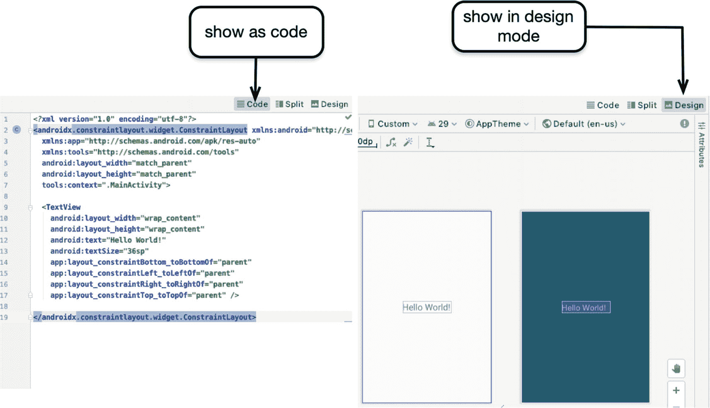

图 6-1：布局文件，分别以文本模式和设计模式显示

在图 6-1 中，左边的图片显示了 XML 模式（或代码模式）下的 `activity_main` 布局文件，右边的图片则显示了设计模式下的布局文件。你可以通过可视化方式（点击“Design”按钮）或原始 XML 代码方式（点击“Code”按钮）来处理布局文件。当你通过编辑 XML 来更改元素时，Android Studio 会自动更新设计视图的呈现效果。同样地，当你在设计视图中进行更改时，XML 文件也会相应更新。

清单 6-1 展示了一个典型的布局文件。

```
/res/layout/activity_main.xml
```

清单 6-1：`/res/layout/activity_main.xml`

一个布局文件通常包含两部分：容器的声明以及其中每个 UI 元素的声明。在清单 6-1 中，第二行（也是 XML 文档的根节点）是容器的声明。`TextView` 元素被声明为容器的子节点。这就是容器和 UI 元素在布局文件中的组织方式。


## 视图与视图组对象

用户界面（UI）就是文本输入元素、文本标签、按钮等用户界面元素的集合。在 6-1 所示的示例代码中，我们有一个 UI 元素，即`TextView`。这个元素包含了“Hello World.”这段文本。在 Android 的术语中，`TextView`被称为`View`对象；有些人也将其称为控件，而一些有 Web 编程背景的人则可能称其为输入元素或表单元素——我们现在身处 Android 世界，所以我们将它们称为`View`对象，或者简称为`Views`。

`View`对象是一个组成单元。你可以通过将一个或多个`View`对象并排放置，或者有时将它们相互嵌入来构建用户界面。根据 Android 库的定义，视图有两种类型：`View`和`ViewGroup`。`View`对象的一个例子是按钮或文本字段。这些对象旨在与其他视图组合在一起，但它们本身并不包含子视图；它们是独立存在的。另一方面，`ViewGroup`则可以包含子视图——这也是它们有时被称为容器的原因。

图 6-2 展示了一些常见 UI 元素的类层次结构。用户界面中的每一个条目都是`android.view.View`类的子类。我们可以使用 Android SDK 中预构建的用户界面元素，例如`TextView`、`Button`、`ProgressBar`等，或者如果需要，我们可以通过以下方式构建自定义控件（控件或视图有时也称为“控件”）：
（1）继承现有的元素，如`TextView`；
（2）直接继承`View`类，从头开始绘制一个自定义控件；
（3）继承`ViewGroup`并将其他控件嵌入其中；这被称为*组合视图*——图 6-2 中的`RadioGroup`就是这样一个例子。

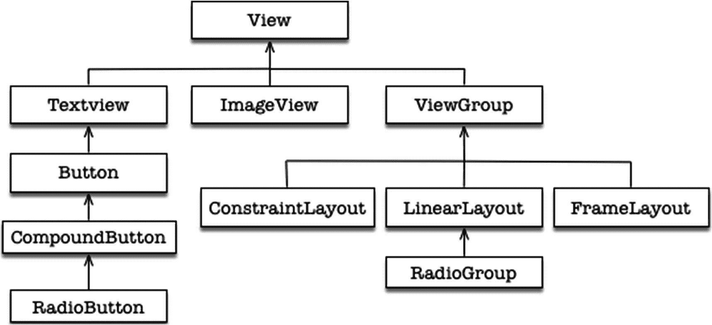

图 6-2 ViewGroup 类层次结构

每个`View`对象在运行时最终会成为一个 Java 对象，但在设计时，我们将其作为 XML 元素来使用。我们无需担心 Android 如何将 XML 膨胀（inflate）成 Java 对象，因为这一过程对我们来说是透明的。它发生在幕后；图 6-3 展示了 Android 编译过程的逻辑表示。

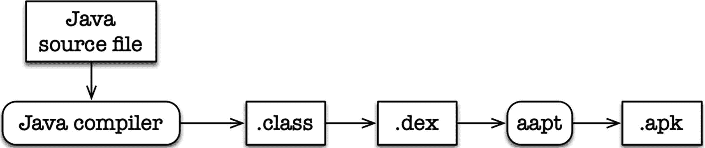

图 6-3 Android 编译过程

编译器将程序源文件转换为 Java 字节码。生成的字节码随后会进一步转换成 DEX 文件。DEX 文件是 Dalvik 可执行文件；它是 Android 运行时（ART）能够识别的可执行格式。在 DEX 文件和其他资源被打包成 Android 安装包（APK）之前，它还会作为一个副产品生成一个名为`R.class`的特殊文件。我们使用`R.class`来获得对布局文件中定义的 UI 元素的程序化引用。

### 容器

除了创建组合视图之外，`ViewGroup`类还有另一个用途。它们构成了布局管理器的基础。布局管理器是一个容器，负责控制子视图相对于容器以及其他子视图在屏幕上的定位方式。Android 自带了一些预构建的布局管理器；表 6-1 展示了其中的一部分。

表 6-2 Hello 应用的项目信息

| 项目详情 | 值 |
| --- | --- |
| 应用名称 | ActivitySample |
| 公司域名 | 请使用你的网站名称 |
| 编程语言 | Java |
| 外形因素 | 手机和平板 |
| 最低 SDK | API 29 (Q) Android 10 |
| 活动类型 | 空白 |
| 活动名称 | MainActivity |
| 布局名称 | activity_main |

表 6-1 布局管理器

| 布局管理器 | 描述 |
| --- | --- |
| LinearLayout | 根据所选方向，将控件排成单行或单列。可以为每个控件分配一个权重值，该值决定了该控件相对于其他控件所占用的空间大小 |
| TableLayout | 将控件排列成行和列的网格格式 |
| FrameLayout | 将子视图堆叠在一起。XML 布局文件中最后一个条目位于堆栈顶部 |
| RelativeLayout | 通过指定每个视图的对齐方式和边距，使视图相对于其他视图和容器进行定位 |
| ConstraintLayout | `ConstraintLayout` 是最新的布局。它使控件相对于彼此和容器进行定位（类似于`RelativeLayout`）。但它不仅仅通过对齐和边距来实现布局管理。它引入了“约束”对象的概念，该对象将控件锚定到一个目标上。这个目标可以是另一个控件、容器或另一个锚点。本书中的大部分示例都将使用此布局 |

关于视图、容器和布局，还有更多内容需要学习，但目前我们掌握的知识已经足够创建一些像样的项目了。接下来让我们学习`Activity`类。

## Activity 类

`Activity`类必须直接或间接地继承自`android.app.Activity`，但我们通常不直接继承这个类；相反，我们扩展`AppCompatActivity`类，以便在较旧版本的 Android 上运行应用，同时仍能使用现代化的 UI 元素。类名中的“Compat”代表“兼容性”。

虽然布局文件包含了视图（按钮、文本字段等）的定义，但`Activity`类负责行为逻辑；当我们想要针对用户操作（例如按钮点击）产生响应时，我们就在这里编写代码。当你创建一个“空 Activity”项目时，得到的`Activity`类代码看起来就像 6-2 中的代码一样。

```
import androidx.appcompat.app.AppCompatActivity;
import android.os.Bundle;
public class MainActivity extends AppCompatActivity { ❶
    @Override  ❷
    protected void onCreate(Bundle savedInstanceState) { ❸
        super.onCreate(savedInstanceState);  ❹
        setContentView(R.layout.activity_main); ➀
    }
}
代码清单 6-2
MainActivity.java
```

❶ 我们继承自`AppCompatActivity`，它是`android.app.Activity`类的子类。所有`Activity`类都必须以某种方式继承自`android.app.Activity`，但正如你所见，项目创建向导为我们提供了`AppCompatActivity`。这是`Activity`类推荐的超类。

❷ `@Override`注解告诉编译器，我们打算重写紧随该注解之后的方法。

❸ `onCreate()`是`Activity`类的生命周期方法之一。Android 运行时在用户启动应用后立即调用此方法。这是编写初始化代码的好地方。

❹ 我们调用超类（`AppCompatActivity`）中的`onCreate()`方法。这是必要的，这样我们就不会破坏`onCreate`方法内部的调用链。如果我们不调用此方法，`AppCompatActivity`（即我们的超类）中`onCreate`里的代码将不会运行；这会导致错误。

➀ `setContentView`方法用于选择当`Activity`对用户可见时要显示的视图资源。此方法已重载；你可以传入一个整数（指向资源 ID）或一个`View`对象实例。在这个例子中，我们传入了一个资源 ID。你可能还记得，我们的布局文件名为`/res/layout/activity_main.xml`。你可能还记得，在编译过程中，为了方便我们使用，生成了一个`R.class`文件，这样我们就可以通过编程方式引用 UI 资源——`R.layout.activity_main`指向文件`/res/layout/activity_main.xml`。在这个语句中，我们将`MainActivity.java`与`activity_main.xml`关联了起来。


### Hello World

现在我们已对 Activity 和布局有了一些基本了解，接下来通过一个示例项目来深入探索它们。

创建项目后，你会在项目窗口中看到大量文件，但我们只关注其中三个。图 6-4 展示了项目文件窗口中（1）主程序文件、（2）清单文件和（3）主布局文件的所在位置。

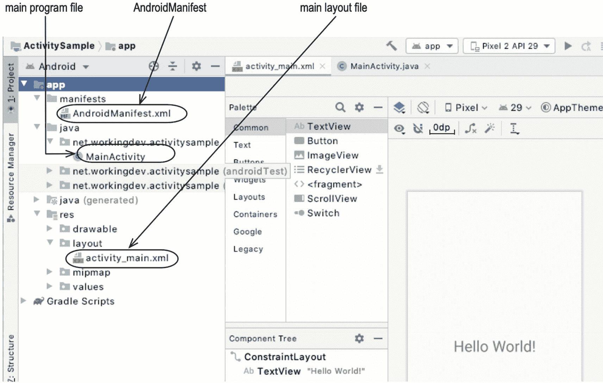

**图 6-4**
ActivitySample 项目

主布局文件名为 `activity_main.xml`，位于 `app` → `res` → `layout` 文件夹中。所有用户界面元素都编写在 XML 布局文件中。

主程序文件 `MainActivity.java` 位于 `app` → `java` → `包名` 文件夹中（你的包名会与我的不同）。这个 Java 文件就是 Activity 类。如果你想对用户操作（如点击按钮）做出响应，就在这里编写相应的程序逻辑。

清单文件向 Android 构建工具、Android 操作系统和 Google Play 描述了应用的基本信息。观察图 6-4，清单文件似乎位于 `app` → `manifests` → `AndroidManifest.xml`。需要记住的是，我们当前看到的是项目窗口的“Android 视图”。它只是项目文件的逻辑表示，并非文件相对于项目根目录的实际排列。如果想查看项目文件的实际位置，请切换到“项目视图”，如图 6-5 所示。

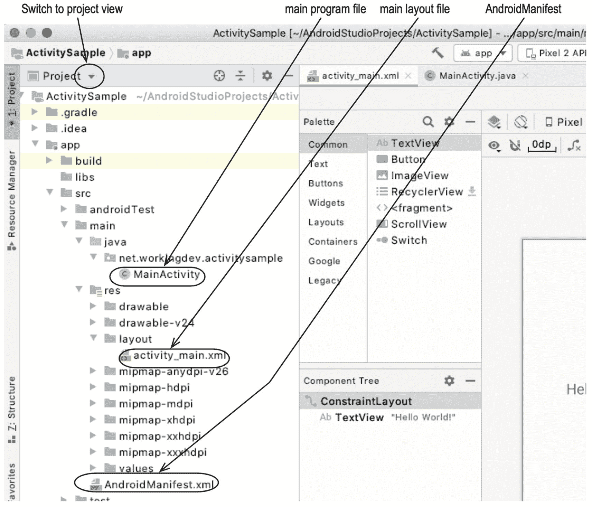

**图 6-5**
项目视图

现在我们对各个文件的存放位置已经有了相当清晰的了解。我们知道清单文件、`MainActivity`（Java）文件和 `activity_main`（布局）文件的位置。由于之前我们已经查看过 `MainActivity` 文件的内容，接下来我们来探索 `activity_main` 布局文件（如代码清单 6-3 所示）。

```
代码清单 6-3
带注释的 activity_main
```

❶ 布局文件的根节点，同时也声明了当前使用的布局管理器类型。本例中，我们使用的是 `ConstraintLayout` 管理器。

❷ `TextView` 对象的声明。它是布局管理器的子节点。

❸ 定义了 `TextView` 对象的一个约束条件。它表示 `TextView` 底部有一个锚点，并且该锚点与容器的底部锚定。

尝试在模拟器中运行项目，确保一切正常，然后我们将进行一些修改。

### 修改 Hello World

我们将对布局文件和 Activity 都做一些小改动。具体操作如下：

1.  更改 `TextView` 控件中的文本。
2.  在屏幕上添加一个 `Button` 视图；将其放置在 `TextView` 正下方。
3.  为 Activity 添加一个函数。该函数被调用时，会递增 `TextView` 的值。
4.  将新函数与 `Button` 关联。每次点击按钮时，`TextView` 的值都会发生变化。

图 6-6 展示了项目的总体布局。当前我们在设计模式下查看 `activity_main.xml`。在此模式下，我们可以看到视图面板、设计界面和蓝图界面。

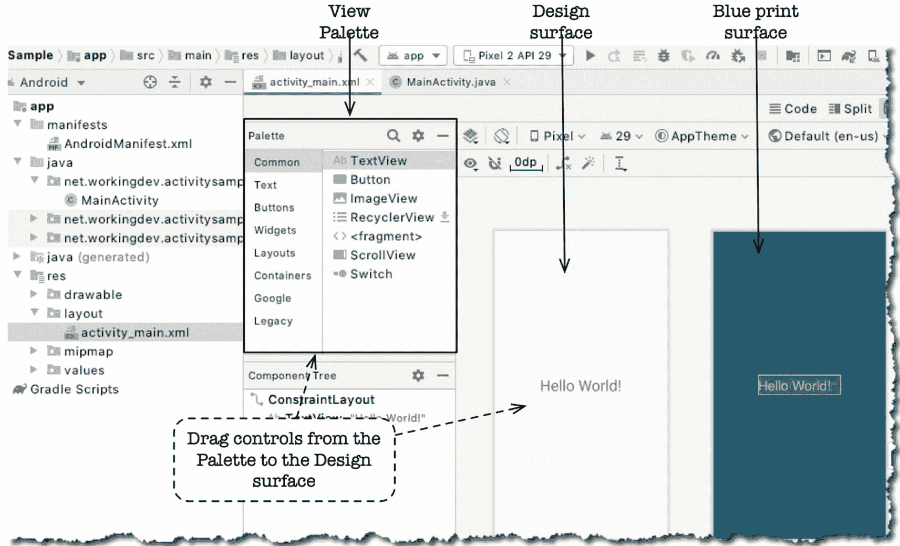

**图 6-6**
设计视图下的 ActivitySample 项目

要添加 `Button` 控件，请从视图面板将 `Button` 拖放到设计界面中，如图 6-7 所示——你也可以将其拖放到蓝图界面中，效果相同。

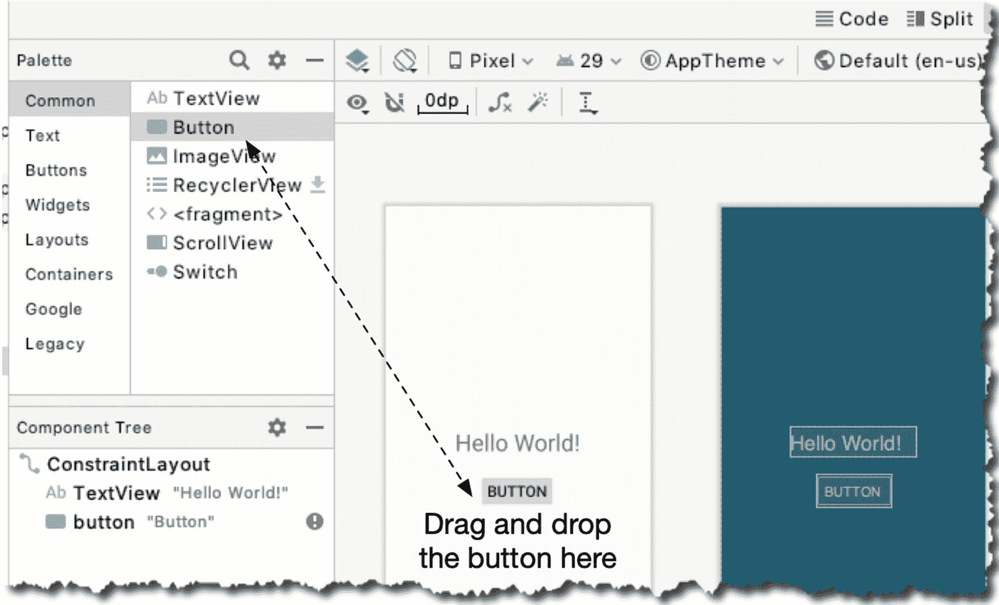

**图 6-7**
从视图面板拖放控件

如果你此时尝试在模拟器中运行项目，会发现按钮并没有出现在预期位置。即使你将 `Button` 拖放到了 `TextView` 正下方，在运行时，任何未设置“约束”的视图对象都会锚定在屏幕的左上角位置，如图 6-8 所示。

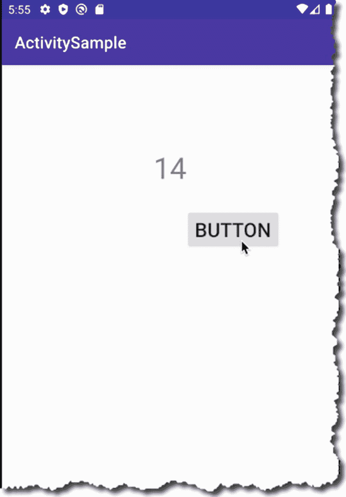

**图 6-8**
未设置约束的 Button 视图

`Hello TextView` 在屏幕中完美居中，因为它有四个锚点（约束）。`Button` 在设计时显示在 `Hello` 文本正下方，但在运行时，它却位于屏幕的 (0,0) 位置（左上角）——这就是控件在没有约束时在运行时的定位方式。

`Button` 控件没有任何约束，因为我们没有添加任何约束。当你向设计界面添加控件时，约束并不会自动添加。`TextView` 有约束，是因为我们在创建项目时由向导自动生成的。

让我们重新开始。删除设计界面上的所有现有约束。你可以通过选中所有视图对象，然后点击设计工具栏上的“清除约束”来完成，如图 6-9 所示。

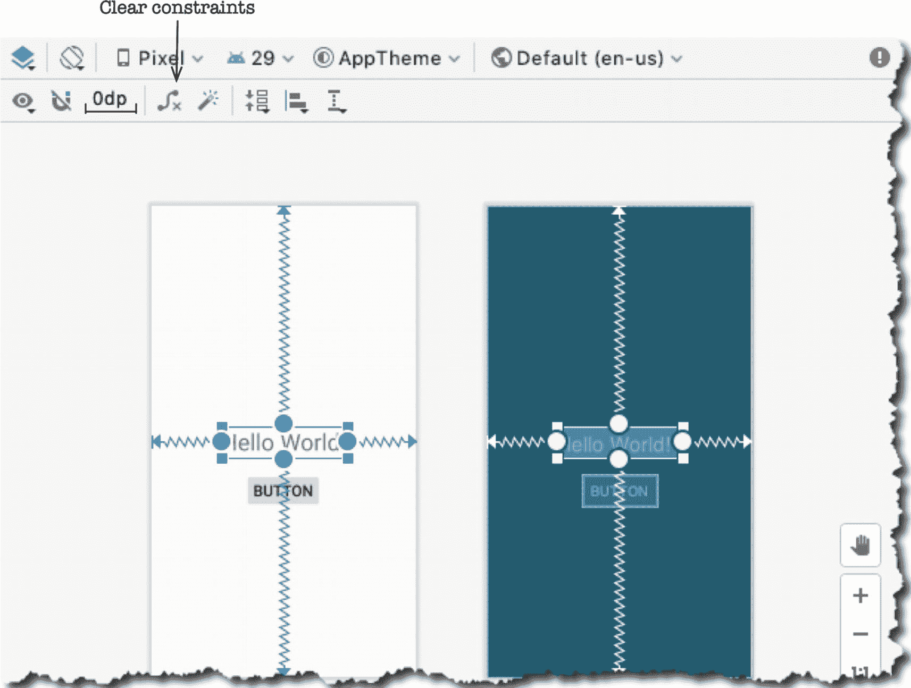

**图 6-9**
带约束的 TextView

当所有约束都被移除后，在设计界面上按你希望它们在运行时出现的方式重新定位控件。接下来，再次选中所有控件——你可以通过点击并围绕控件拖拽鼠标来完成。

要“神奇地”为我们的控件添加所有约束，请点击“推断约束”，如图 6-10 所示。Android Studio 会尝试最佳猜测控件所需的约束，以匹配你在设计界面中的布局。

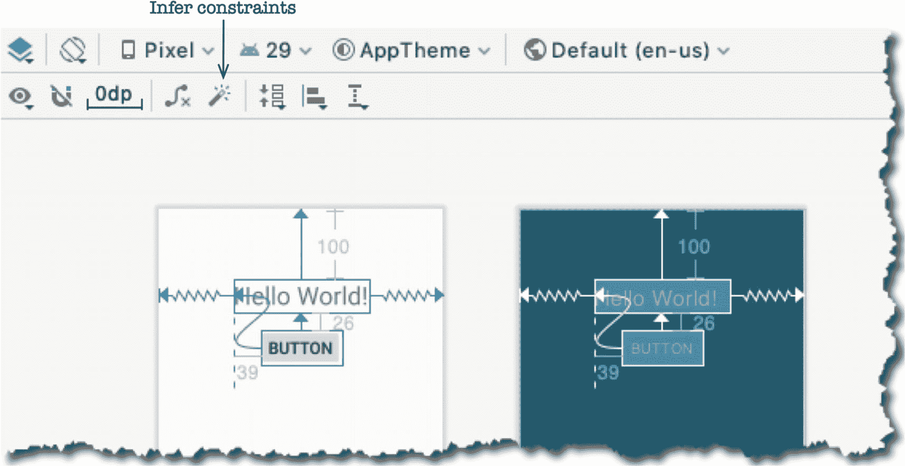

**图 6-10**
推断约束

控件的属性可以在“属性”窗口中设置。我们需要更改 `TextView` 和 `Button` 控件的一些属性。当在设计界面中选中某个对象时，其属性会显示在属性面板上。属性面板默认是折叠的。要打开属性面板，你需要点击面板将其展开，如图 6-11 所示。

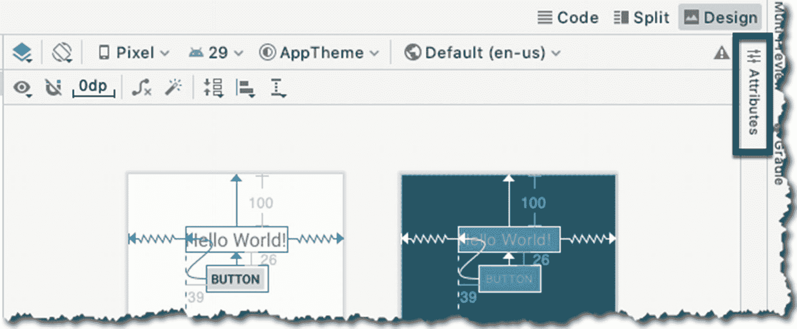

**图 6-11**


## 属性面板

### 折叠状态

要在属性面板中检查视图对象的属性，请在设计编辑器中选择该视图对象，然后打开属性面板。图 6-12 显示了 TextView 对象的约束属性。你可以根据需要更改 Button 和 TextView 对象的约束属性。

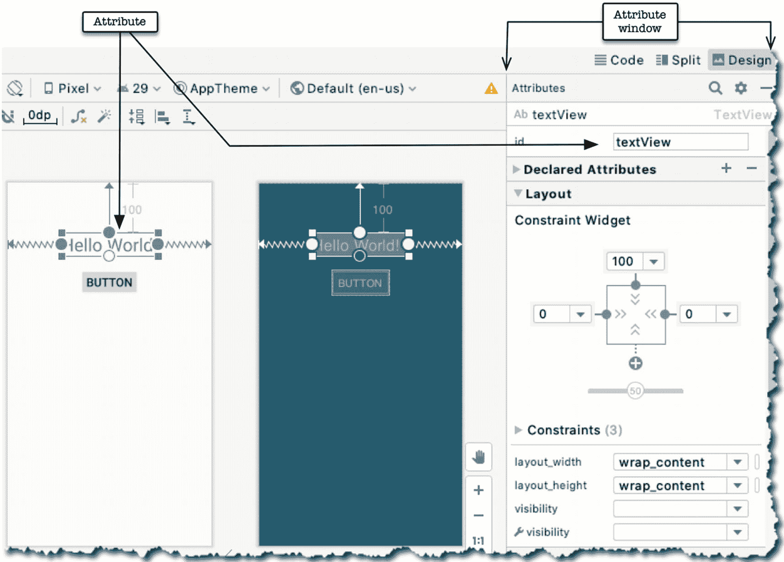

*图 6-12*

### 展开状态

属性窗口包含所选视图对象的所有属性，但默认情况下并不会全部显示，它只显示我们常用的属性。要查看所有属性，请向下滚动属性面板找到“所有属性”按钮，如图 6-13 所示。

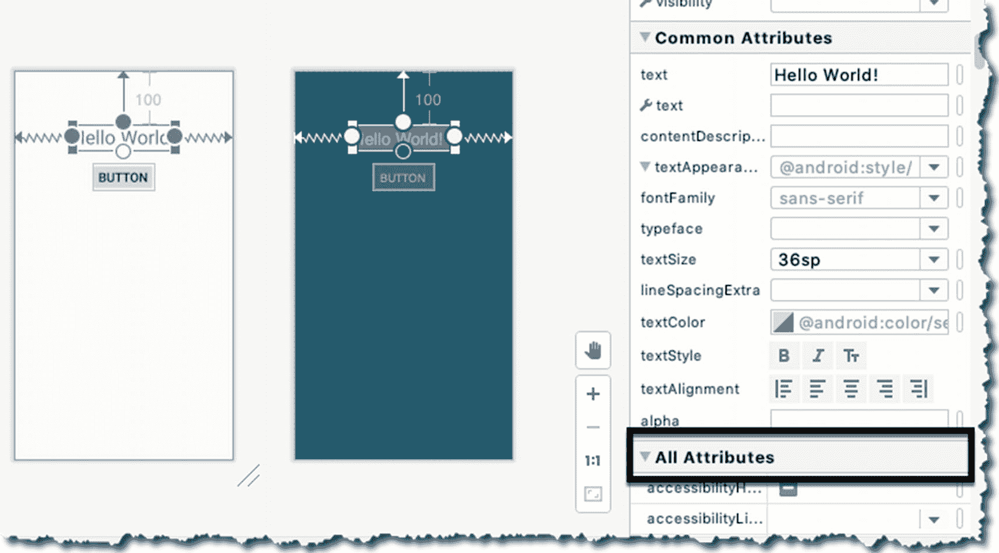

*图 6-13 — 所有属性*

既然我们已能在设计编辑器中自由操作，现在就可以做些改动了。请尝试执行以下操作：

1. 将 TextView 对象的`id`属性从`textView`改为`textHello`。
2. 将 TextView 对象的`textSize`属性改为`36sp`。

视图对象的`id`属性非常重要，因为我们稍后会在代码（Activity 类中）引用它。

我们还将更改 Button 的`onClick`属性。选择 Button 对象，找到其`onClick`属性，然后将值改为`addNumber`，如图 6-14 所示。

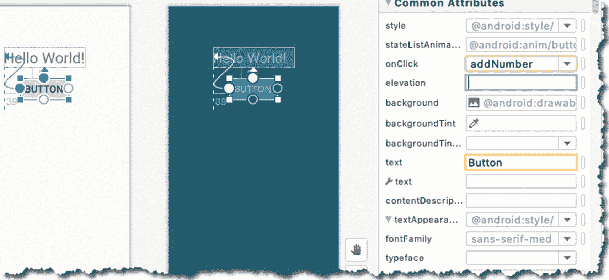

*图 6-14 — onClick 属性*

将 Button 的`onClick`属性设置为`addNumber`，会将按钮的点击事件关联到 Activity 类中一个名为`addNumber()`的方法。当然，这个方法目前还不存在；因此我们接下来需要实现它。打开`MainActivity.java`，按照代码清单 6-4 进行修改。

```java
import androidx.appcompat.app.AppCompatActivity;
import android.os.Bundle;
import android.view.View;
import android.widget.TextView;
public class MainActivity extends AppCompatActivity {
@Override
protected void onCreate(Bundle savedInstanceState) {
super.onCreate(savedInstanceState);
setContentView(R.layout.activity_main);
((TextView) findViewById(R.id.textHello)).setText("1"); ❶
}
public void addNumber(View v) { ❷
TextView tv = ((TextView) findViewById(R.id.textHello)); ❸
int currVal = Integer.parseInt(tv.getText().toString()); ❹
tv.setText((++currVal) + ""); ➀
}
}
```

*代码清单 6-4 — MainActivity.java*

- ❶ 这行代码将 TextView 的文本值设置为“1”。首先，我们通过其`id`获取对 TextView 的引用。所有视图对象都可以在运行时通过`R.class`引用，因此`R.id.textHello`在运行时指向 TextView 对象的实例。接着，我们将其强制转换为`TextView`对象；然后，调用`setText()`方法。
- ❷ 这是`addNumber()`方法的实现；它接受一个视图对象作为参数。当该方法被调用时，Android 运行时会将 Button 对象的实例作为参数传递给该方法。
- ❸ 这行代码获取对 TextView 对象的编程引用，思路与❶相同，但这次我们将对象引用赋值给一个变量。
- ❹ `tv.getText()`获取 TextView 的当前值。此调用返回一个`CharSequence`；因此我需要在它上面调用`toString()`方法，使其便于我们使用。`Integer.parseInt()`方法将数字字符转换为`integer`。
- ➀ `setText()`方法设置 TextView 的值。表达式`++currVal + ""`先对`currVal`变量的当前值执行自增操作，然后将其转换为字符串对象；将空字符串字面量附加到任何原始数据类型上，都可以有效地将其转换为字符串。

完成编辑后，在模拟器上运行该应用程序。图 6-15 展示了项目在模拟器上运行的情况。

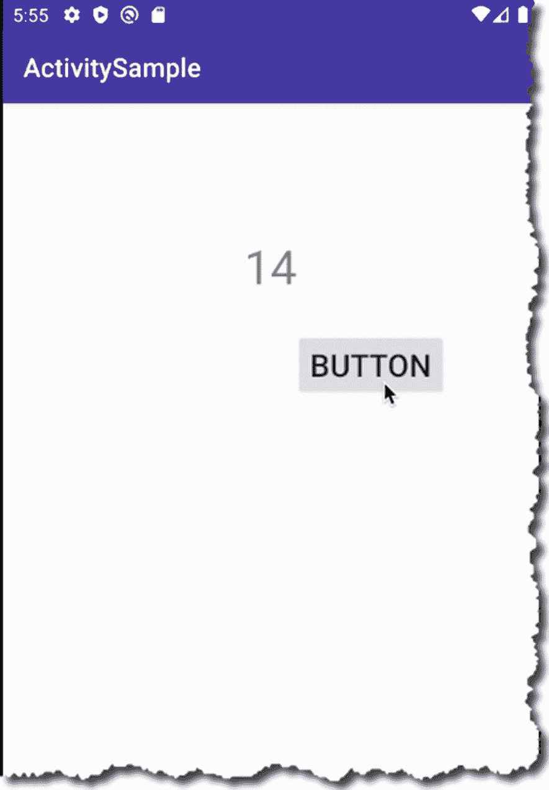

*图 6-15 — 模拟器上的 ActivitySample*

## 本章小结

- 布局文件以 XML 文件形式描述 UI 结构。你可以使用设计模式（所见即所得）或原始 XML 模式来处理布局文件。
- 布局文件中的每个视图元素都被描述为一个 XML 节点，但 XML 文件在运行时才会被解析。解析过程会生成 UI 元素的对象表示。
- 你可以通过`R.class`以编程方式引用 UI 元素。
- 可以通过继承`ViewGroup`类来构建复合视图。
- 布局管理器提供了在屏幕上排列 UI 元素的方法。Android SDK 提供了许多我们可以开箱即用的预构建管理器。

